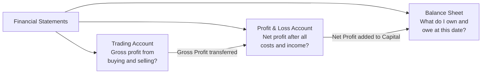
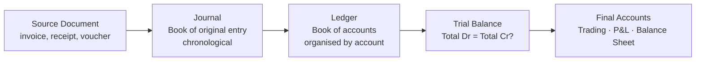
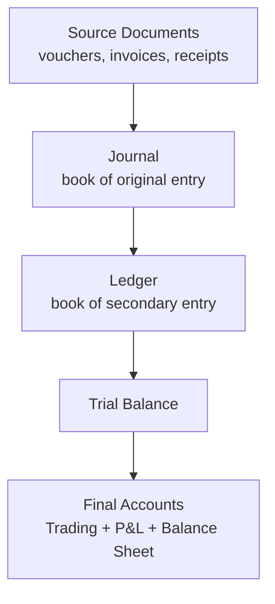
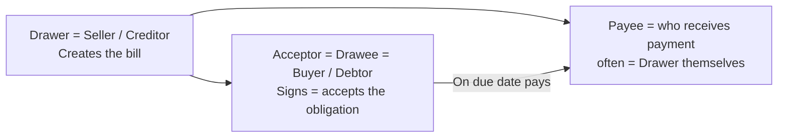
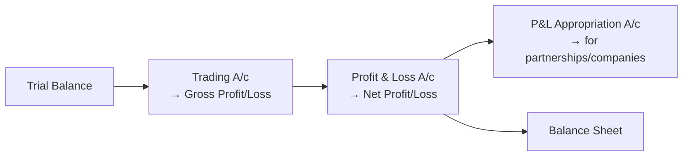
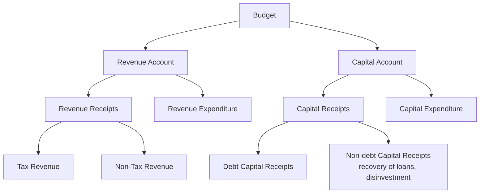

# How to use this book

**This is the only book an AAO / AAO aspirant should need.**

The four rules below run through every chapter:

| Rule | What it means in practice |
|------|---------------------------|
| **Examiner mindset** | For every topic we state how SSC frames it, the 3-5 angles they recycle, and the trap option they always plant. |
| **Concept → Fact card → Drill** | Every concept has a one-liner explanation; every section has a fact card; every chapter has 10-15 worked PYQ-style problems. |
| **Pedagogy first** | Tables, mind maps, callout boxes, depth tables. No narrative paragraphs — information is laid out like a publisher's textbook. |
| **Self-check** | Every chapter ends with a mini-mock (10 Qs, fully solved) and active-recall prompts. Last chapter is a full 100-Q mock. |

> **The promise.** Read this book end-to-end with two passes + the embedded recall prompts and you will solve >95 of the 100 questions on AAO Paper III.

---

\newpage

# Paper map and importance dashboard

**Paper:** SSC CGL Tier-2 Paper III — **General Studies (Finance & Economics)** — for the post of **Assistant Audit Officer (AAO) / Assistant Accounts Officer**

| Item | Spec |
|------|------|
| Total questions | 100 |
| Total marks | 200 |
| Marks per question | 2 |
| Negative marking | **−0.5** per wrong attempt |
| Time | 120 minutes (2 hours) |
| Mode | Computer-Based (CBT) |
| Calculator | **Yes — built-in calculator** allowed |
| Medium | English / Hindi |

## Paper composition

| Part | Topic | Marks | Qs |
|------|-------|-------|-----|
| **A** | Finance and Accounts | **80** | 40 |
| **B** | Economics and Governance | **120** | 60 |

## Chapter-wise importance (averaged across last 4 AAO papers)

### Part A — Finance & Accounts (40 Qs / 80 marks)

| Ch | Topic | Avg Qs | Importance | Difficulty |
|----|-------|--------|------------|------------|
| 1 | Fundamentals of Accounting + GAAP | 5 | ⭐⭐⭐⭐ HIGH | Easy |
| 2 | Double Entry, Journal, Ledger, Trial Balance | 8 | ⭐⭐⭐⭐⭐ CRITICAL | Easy-Med |
| 3 | Bank Reconciliation, Rectification of Errors, Bills of Exchange | 6 | ⭐⭐⭐⭐⭐ CRITICAL | Med |
| 4 | Final Accounts: Trading, P&L, P&L Appropriation, Balance Sheet | 9 | ⭐⭐⭐⭐⭐ CRITICAL | Med |
| 5 | Capital vs Revenue, Depreciation, Inventory Valuation | 7 | ⭐⭐⭐⭐⭐ CRITICAL | Med |
| 6 | Non-Profit Accounts, Self-Balancing Ledgers | 5 | ⭐⭐⭐ MEDIUM | Easy-Med |

### Part B — Economics & Governance (60 Qs / 120 marks)

| Ch | Topic | Avg Qs | Importance | Difficulty |
|----|-------|--------|------------|------------|
| 7  | CAG of India + Finance Commission | 6 | ⭐⭐⭐⭐⭐ CRITICAL | Easy |
| 8  | Basic Concepts of Economics + Micro intro | 4 | ⭐⭐⭐ MEDIUM | Easy |
| 9  | Theory of Demand & Supply (incl. Elasticity) | 8 | ⭐⭐⭐⭐⭐ CRITICAL | Med |
| 10 | Theory of Production & Cost | 6 | ⭐⭐⭐⭐ HIGH | Med |
| 11 | Forms of Market & Price Determination | 6 | ⭐⭐⭐⭐ HIGH | Med |
| 12 | Indian Economy (sectors, NI, population, poverty, infrastructure) | 8 | ⭐⭐⭐⭐⭐ CRITICAL | Easy-Med |
| 13 | Economic Reforms since 1991 (LPG + Disinvestment) | 4 | ⭐⭐⭐⭐ HIGH | Easy |
| 14 | Money & Banking (RBI, Commercial Banks, Monetary Policy) | 7 | ⭐⭐⭐⭐⭐ CRITICAL | Med |
| 15 | Fiscal Policy, Budget, FRBM Act, Balance of Payments | 7 | ⭐⭐⭐⭐⭐ CRITICAL | Med |
| 16 | Role of IT in Governance | 4 | ⭐⭐⭐ MEDIUM | Easy |
| | **TOTAL** | **100** | | |

> **What this dashboard tells you.** The 9 CRITICAL chapters (2, 3, 4, 5, 7, 9, 12, 14, 15) carry **$\dfrac{66}{100}$ questions** = $\dfrac{132}{200}$ marks (66%). Master them and you cross the cut-off easily. Add the 4 HIGH chapters and you cover **88%** of the paper. The 3 MEDIUM chapters are last priority.

## Cut-off reality (recent AAO posts)

| Year | UR cut-off (out of 200) | Ratio |
|------|-------------------------|-------|
| 2022 | 152–158 | ~77 % |
| 2021 | 148–154 | ~75 % |
| 2019 | 145–150 | ~73 % |

A 95% target = **$\dfrac{190}{200}$** demands ≥96 correct out of 100 (with ≤2 wrongs). Achievable only when every formula, fact, and definition is in muscle memory.

---

\newpage

---

# How to read this book — your real study load

**Total pages: 91.**

This is a specialised exam-prep book. **Every page is essential** — including the worked-example drills, mini-mock and trap-cards near the end. Skipping any section costs you marks.

Read end-to-end in order without skipping.

---

# Index — Table of Contents (clickable)

| Pages | Part / Chapter | Topic / What it covers |
|---:|---|---|
| **p5–6** | [PART 0](#part-0) | FOUNDATIONS YOU CANNOT SKIP |
| | **PART A — Finance & Accounts (40 Qs / 80 marks)** | |
| **p7–9** | [Chapter 1](#chapter-1) | Fundamentals of Accounting & GAAP |
| **p10–14** | [Chapter 2](#chapter-2) | Double Entry, Journal, Ledger & Trial Balance |
| **p15–19** | [Chapter 3](#chapter-3) | Bank Reconciliation, Rectification of Errors & Bills of Exchange |
| **p20–24** | [Chapter 4](#chapter-4) | Final Accounts: Trading, P&L, P&L Appropriation & Balance Sheet |
| **p25–28** | [Chapter 5](#chapter-5) | Capital vs Revenue, Depreciation & Inventory Valuation |
| **p29–32** | [Chapter 6](#chapter-6) | Non-Profit Organisations & Self-Balancing Ledgers |
| | **PART B — Economics & Governance (60 Qs / 120 marks)** | |
| **p33–36** | [Chapter 7](#chapter-7) | CAG of India + Finance Commission |
| **p37–39** | [Chapter 8](#chapter-8) | Basic Concepts of Economics & Introduction to Microeconomics |
| **p40–45** | [Chapter 9](#chapter-9) | Theory of Demand & Supply (incl. Elasticity, Consumer Behaviour) |
| **p46–50** | [Chapter 10](#chapter-10) | Theory of Production & Cost |
| **p51–55** | [Chapter 11](#chapter-11) | Forms of Market & Price Determination |
| **p56–60** | [Chapter 12](#chapter-12) | Indian Economy |
| **p61–63** | [Chapter 13](#chapter-13) | Economic Reforms in India (1991 onwards) |
| **p64–69** | [Chapter 14](#chapter-14) | Money & Banking (RBI, Commercial Banks, Monetary Policy) |
| **p70–75** | [Chapter 15](#chapter-15) | Fiscal Policy, Budget, FRBM Act & Balance of Payments |
| **p76–78** | [Chapter 16](#chapter-16) | Role of Information Technology in Governance |
| — | [Appendix A](#appendix-a) | Master Formula & Fact Sheet (one-shot revision) |
| — | [Appendix B](#appendix-b) | Ultimate Depth Tables (Finance Commissions, RBI Governors, reforms) |
| — | [Appendix C](#appendix-c) | Plain-English Concept Primers (first-time readers) |
| — | [Appendix D](#appendix-d) | Full-length 100-Q Mock Test (with answer key) |
| — | [Appendix E](#appendix-e) | 7-Day Final Revision Plan |
| — | [Appendix F](#appendix-f) | Common errors that cost AAO candidates the 95% mark |
| — | [Appendix G](#appendix-g) | Memory tricks (mnemonics that stick) |

---
# PART 0 — FOUNDATIONS YOU CANNOT SKIP {#part-0}

Before any topic you must master these 4 micro-skills. None is hard. Skipping one will cost you 8–12 marks.

## 0.1 Accounting equation — the master identity

$$
\boxed{\text{Assets} \;=\; \text{Liabilities} \;+\; \text{Capital (Owner's Equity)}}
$$

This is the foundation of double-entry accounting. **Every** transaction maintains this equality. If a question's options don't satisfy this, that option is wrong by definition.

| Side | What it lists |
|------|---------------|
| Assets | What the business **owns** (cash, stock, machinery, debtors, prepaid expenses) |
| Liabilities | What the business **owes** to outsiders (creditors, loans, outstanding expenses) |
| Capital | What the business owes to **the owner** (initial capital + profits − drawings − losses) |

**Expanded form:**
$$
\text{Assets} = \text{Liabilities} + \text{Capital} + \text{Revenues} - \text{Expenses} - \text{Drawings}
$$

## 0.2 Debit-Credit golden rules (3 classes / 5 modern types)

### Traditional (English) approach — by account class

| Account class | Debit | Credit |
|---------------|-------|--------|
| **Personal** (persons, firms) | The receiver | The giver |
| **Real** (assets) | What comes in | What goes out |
| **Nominal** (expenses, incomes) | All expenses & losses | All incomes & gains |

### Modern (American) approach — by element

| Element | Debit increases | Credit increases |
|---------|-----------------|------------------|
| Asset | ✓ | (Cr decreases) |
| Expense / Loss | ✓ | (Cr decreases) |
| Liability | (Dr decreases) | ✓ |
| Capital / Equity | (Dr decreases) | ✓ |
| Income / Revenue / Gain | (Dr decreases) | ✓ |

<strong>Mnemonic — DEAD CLIC.</strong> <strong>D</strong>ebits = <strong>E</strong>xpenses + <strong>A</strong>ssets + <strong>D</strong>rawings <strong>C</strong>redits = <strong>L</strong>iabilities + <strong>I</strong>ncome + <strong>C</strong>apital

## 0.3 Economic micro-vocabulary you must know cold

| Term | One-line meaning |
|------|------------------|
| GDP | Gross Domestic Product = total value of goods & services produced **within a country's borders** in a year |
| GNP | GDP + net factor income from abroad |
| NDP | GDP − depreciation |
| NNP at MP | NDP + net factor income from abroad |
| **NNP at FC = National Income** | NNP at MP − Indirect Taxes + Subsidies |
| Per capita income | National Income / Population |
| Real vs Nominal | Real = at constant prices (inflation removed); Nominal = at current prices |
| Inflation | Sustained rise in general price level (measured by CPI/WPI) |
| GDP deflator | Nominal GDP / Real GDP × 100 |
| Fiscal deficit | Total Expenditure − (Revenue Receipts + Non-debt Capital Receipts); = government's borrowing |
| Revenue deficit | Revenue Expenditure − Revenue Receipts |
| Primary deficit | Fiscal deficit − Interest payments |
| Direct vs Indirect tax | Direct = paid by the entity on whom levied (income tax); Indirect = collected from intermediary, paid by consumer (GST) |

## 0.4 Constitutional / institutional anchors (CAG, FC, RBI, EC, NITI Aayog)

| Institution | Status | Article / Act | Tenure |
|-------------|--------|---------------|--------|
| **CAG** (Comptroller & Auditor General) | Constitutional, independent | Art. 148 | 6 years or 65 yrs, whichever earlier |
| **Finance Commission** | Constitutional, every 5 yrs | Art. 280 | 5-year fiscal recommendations |
| **RBI** (Reserve Bank of India) | Statutory body | RBI Act 1934 (estd 1 Apr 1935) | Governor: 3 yrs (extendable) |
| **NITI Aayog** | Executive (not constitutional/statutory) | Cabinet Resolution Jan 2015 | Replaced Planning Commission |
| **Election Commission** | Constitutional | Art. 324 | 6 yrs or 65 yrs |

---

\newpage

# CHAPTER 1 — Fundamentals of Accounting & GAAP {#chapter-1}

**Importance:** ⭐⭐⭐⭐ HIGH (≈5 Qs / paper)
**Difficulty:** Easy. Pure conceptual + factual.

## 1.0 — Understanding Accounting & GAAP from First Principles

**Why does accounting exist — what problem does it solve?**

Imagine you start a bakery with ₹50,000 of your own money. You buy flour, sugar, an oven. You bake and sell. Three months later, you have some cash, some raw material stock, and equipment. But is the business profitable? Have all suppliers been paid? How much tax do you owe? Can you repay the bank loan?

Without a systematic record-keeping system, you cannot answer any of these reliably. **Accounting** is that system: the process of identifying, measuring, recording, classifying, summarising, interpreting, and communicating financial transactions so that all stakeholders — owner, bank, tax authority, investors — can make informed decisions.

Accounting serves four audiences simultaneously:
- **Owner/Management:** Am I profitable? Where is money leaking? Should I expand?
- **Banks and creditors:** Can this business repay what it owes?
- **Tax authorities:** How much tax is due?
- **Investors:** Is this business worth investing in?

**The three core financial statements — what each answers:**

**GAAP — the 10 concepts that examiners test:**

| Concept | One-liner | Common exam question |
|---------|-----------|---------------------|
| **Entity** | Business is legally separate from owner | Owner's personal holiday expense → NOT a business expense |
| **Going concern** | Assume business will continue | Assets valued at cost, not liquidation price |
| **Accrual** | Record when earned/incurred, not when cash moves | Unpaid salary still an expense this period |
| **Consistency** | Same method every period | Cannot switch FIFO to LIFO year by year |
| **Conservatism / Prudence** | Anticipate losses; never anticipate profits | Write down assets to NRV if NRV < cost |
| **Materiality** | Only significant items need full disclosure | Trivial items can be approximated |
| **Cost concept** | Record at original purchase cost | Cannot inflate assets to market value |
| **Matching** | Match expenses to revenue they generate | Depreciation charged while asset earns revenue |
| **Dual aspect** | Every transaction has two effects | Foundation of double entry |
| **Disclosure** | All material facts must be disclosed | No hiding of liabilities or contingent losses |

**Solved Example 1.A:** Owner uses company car for a personal holiday; fuel = ₹5,000. If charged as business expense, which concept is violated?

> **Entity concept.** Business and owner are separate. Personal expense = Drawings (reduces Capital), not an operating expense.

**Solved Example 1.B:** Factory values machinery at current market price ₹10 lakh; historical cost was ₹4 lakh. Concept violated?

> **Cost concept.** Assets must be recorded at historical cost. Market-value revaluation inflates assets and distorts comparability.

## 1.1 Examiner mindset

| Angle | Pet question |
|-------|--------------|
| Definition / scope of accounting | "Which is **NOT** a function of accounting?" |
| Accounting concepts vs conventions | Differentiate; identify the rule applied |
| GAAP, Accounting Standards | Body that issues AS in India |
| Limitations of financial accounting | Standard list of 6 limitations |
| Branches of accounting | Financial, Cost, Management |
| Users of accounting information | Internal vs external |

## 1.2 Definition and functions

> **Accounting** = systematic process of identifying, recording, classifying, summarizing, analyzing, interpreting, and communicating financial information about an economic entity to users.

**The 4 stages (in order):**
1. **Recording** → Journal (book of original entry)
2. **Classifying** → Ledger
3. **Summarizing** → Trial Balance + Final Accounts
4. **Communicating** → Reports for users

## 1.3 Branches of accounting

| Branch | Purpose | Key output |
|--------|---------|-----------|
| Financial accounting | Records transactions, prepares final accounts for **external** users | P&L, Balance Sheet |
| Cost accounting | Tracks costs of products/services, enables pricing | Cost sheets |
| Management accounting | Provides info for **internal** decision-making | Budgets, MIS reports |

## 1.4 Generally Accepted Accounting Principles (GAAP)

GAAP = the umbrella of accounting concepts + conventions + accounting standards.

### Accounting Concepts (assumptions)

| # | Concept | What it states |
|---|---------|---------------|
| 1 | **Business Entity** | Business is separate from its owner |
| 2 | **Money Measurement** | Only transactions measurable in money are recorded |
| 3 | **Going Concern** | Business will continue indefinitely |
| 4 | **Accounting Period** | Life of business is divided into intervals (year/quarter) |
| 5 | **Cost** | Assets recorded at historical cost (not market value) |
| 6 | **Dual Aspect** | Every transaction has 2 aspects (Dr = Cr) |
| 7 | **Realisation (Revenue Recognition)** | Revenue recognised when earned, not when cash received |
| 8 | **Matching** | Expenses matched against revenues of the same period |
| 9 | **Accrual** | Record income/expense when accrued, not when cash flows |
| 10 | **Objectivity** | Records must be supported by verifiable evidence (vouchers) |

### Accounting Conventions (customs)

| # | Convention | What it states |
|---|------------|---------------|
| 1 | **Conservatism (Prudence)** | "Anticipate no profit, provide for all losses" — record losses early, gains late |
| 2 | **Consistency** | Same methods year-on-year |
| 3 | **Materiality** | Disclose all material (significant) facts |
| 4 | **Full Disclosure** | All relevant info disclosed in statements |

## 1.5 Accounting Standards in India

| Issued by | Body |
|-----------|------|
| Indian Accounting Standards (Ind AS) | **ICAI** (Institute of Chartered Accountants of India) |
| Notified by | Ministry of Corporate Affairs (MCA) |
| ICAI established | **1949** under the Chartered Accountants Act, 1949 |
| Total Ind AS notified | 41 (currently in force) |

## 1.6 Limitations of financial accounting

1. Records only **monetary** transactions (ignores qualitative factors like staff morale).
2. **Historical** in nature — past data, may not predict future.
3. Uses **estimates** (depreciation, doubtful debts) — subjective.
4. Effects of **inflation** ignored (records at historical cost).
5. Doesn't show **cost of products/services** (that's cost accounting).
6. Window-dressing possible by manipulating disclosures.

## 1.7 Worked PYQ-style examples

> **Q 1.1.** Which of the following is **not** a branch of accounting?
> **(a) Financial accounting** **(b) Cost accounting** **(c) Management accounting** **(d) Production accounting**
>
> **Soln.** Production is an operation, not an accounting branch. **Ans (d).**

> **Q 1.2.** "Anticipate no profit, provide for all losses" expresses which convention?
>
> **Conservatism (Prudence).**

> **Q 1.3.** Recording assets at historical cost reflects which concept?
>
> **Cost concept.**

> **Q 1.4.** ICAI was established in:
>
> **1949** (Chartered Accountants Act, 1949).

> **Q 1.5.** GAAP stands for:
>
> **G**enerally **A**ccepted **A**ccounting **P**rinciples.

> **Q 1.6.** A businessman records his personal car as a business asset. This violates which concept?
>
> **Business entity** concept.

> **Q 1.7.** Salary paid in advance is an example of:
>
> **Prepaid expense** (an asset, not an expense, until period elapses) — reflects **matching** + **accrual** concepts.

> **Q 1.8.** Recording all revenue when earned (regardless of cash collected) follows the:
>
> **Realisation / Accrual** concept.

> **Q 1.9.** Which of the following is **NOT** a limitation of financial accounting?
> **(a) Ignores qualitative info** **(b) Based on estimates** **(c) Records all transactions** **(d) Ignores price level changes**
>
> **(c)** is wrong as a limitation — financial accounting in fact records **only monetary transactions**, not all transactions. **Ans (c).**

> **Q 1.10.** Convention requiring uniform methods year-on-year is:
>
> **Consistency.**

## 1.8 Trap-recognition card

| Trap | Defence |
|------|---------|
| GAAP issued by RBI | False — issued by **ICAI**, notified by MCA |
| "Cost concept" allows market value | No — historical cost only |
| Conservatism vs Prudence | Same thing, two names |
| Convention vs Concept confusion | Concept = assumption (entity, going-concern); Convention = practice (conservatism, consistency) |

## 1.9 Mini-mock (10 Qs)

| # | Question | Answer |
|---|----------|--------|
| 1 | Body issuing accounting standards in India? | ICAI |
| 2 | Going-concern means? | Business continues indefinitely |
| 3 | Dual aspect leads to which book-keeping system? | Double-entry |
| 4 | Revenue is recorded when …? | Earned (realisation) |
| 5 | Owner's withdrawal recorded in which account? | Drawings |
| 6 | Materiality is a concept or convention? | Convention |
| 7 | First step of accounting cycle? | Identifying transactions / Recording |
| 8 | Salary paid for next year is a/an …? | Prepaid expense (asset) |
| 9 | "All revenue cash received" violates which? | Accrual |
| 10 | Cost concept ignores? | Inflation / market value |

## 1.10 Active-recall prompts

1. Differentiate concept vs convention with one example each.
2. List the 10 accounting concepts.
3. State the four stages of the accounting cycle.
4. List 6 limitations of financial accounting.
5. Who issues Ind AS in India?

---

\newpage

# CHAPTER 2 — Double Entry, Journal, Ledger & Trial Balance {#chapter-2}

**Importance:** ⭐⭐⭐⭐⭐ CRITICAL (≈8 Qs / paper)
**Difficulty:** Easy-Medium. Master the debit-credit rule and you score full.

## 2.0 — Understanding Double Entry from First Principles

**Why "double entry"? What duality does every transaction have?**

Every financial transaction transfers value between two parties or accounts. When you pay ₹10,000 rent in cash: (1) your cash decreases by ₹10,000, and (2) you incur a rent expense of ₹10,000. When you sell goods worth ₹5,000 on credit: (1) your debtor's account increases by ₹5,000, and (2) your sales increase by ₹5,000. **Every transaction has exactly two economic effects.** Double entry records both — always.

This is not arbitrary bookkeeping. It reflects a fundamental economic truth: value is never created or destroyed in a transaction, only transferred. The accounting equation $\text{Assets} = \text{Liabilities} + \text{Capital}$ must hold before and after every transaction. Double entry enforces this automatically — every debit has a corresponding credit, so the equation stays in balance.

**Why this makes errors visible:** If a transaction is mis-recorded (one side wrong), the trial balance will not balance: total debits ≠ total credits. This is the built-in error detector. Any accountant who finds a mismatch in the trial balance knows immediately that at least one recording error exists.

**The accounting cycle — the flow from transaction to final accounts:**

**Debit-Credit rules — two equivalent systems:**

**Traditional (English) system — by account type:**

| Account type | Debit | Credit |
|-------------|-------|--------|
| **Personal** (persons, firms, banks) | The receiver | The giver |
| **Real** (assets, stock, cash) | What comes in | What goes out |
| **Nominal** (expenses, income) | All expenses and losses | All income and gains |

**Modern (American) system — by account element:**

| Element | Debit increases | Credit increases |
|---------|-----------------|-----------------|
| Asset | ✓ | (debit decreases) |
| Expense / Loss / Drawing | ✓ | (debit decreases) |
| Liability | (credit decreases) | ✓ |
| Capital / Equity | (credit decreases) | ✓ |
| Income / Revenue / Gain | (credit decreases) | ✓ |

**Mnemonic — DEAD CLIC:** Debits = **E**xpenses + **A**ssets + **D**rawings; Credits = **L**iabilities + **I**ncome + **C**apital.

**Solved Example 2.A — Journal entries for 5 common transactions:**

| # | Transaction | Journal Entry | Rule applied |
|---|------------|---------------|-------------|
| 1 | Cash ₹50,000 introduced as capital | Cash A/c Dr 50,000 / To Capital A/c 50,000 | Real (cash in) / Personal (owner = giver) |
| 2 | Goods purchased on credit from Ram, ₹20,000 | Purchases A/c Dr 20,000 / To Ram's A/c 20,000 | Real (stock in) / Personal (Ram = giver) |
| 3 | Cash sales ₹8,000 | Cash A/c Dr 8,000 / To Sales A/c 8,000 | Real (cash in) / Nominal (income = Cr) |
| 4 | Salary paid ₹5,000 | Salary A/c Dr 5,000 / To Cash A/c 5,000 | Nominal (expense = Dr) / Real (cash out) |
| 5 | Rent received ₹3,000 | Cash A/c Dr 3,000 / To Rent Received A/c 3,000 | Real (cash in) / Nominal (income = Cr) |

**Solved Example 2.B — Trial Balance: which errors does it catch vs. miss?**

| Error type | Trial Balance detects? | Why |
|-----------|----------------------|-----|
| Wrong amount on ONE side only | ✓ Yes | Dr ≠ Cr |
| Error of omission (transaction not recorded at all) | ✗ No | Both sides missing equally |
| Error of commission (wrong account, same amount) | ✗ No | Dr and Cr still equal |
| Error of principle (capital treated as revenue) | ✗ No | Dr and Cr still equal |
| Compensating errors (two errors cancel each other) | ✗ No | Net effect on balance = zero |

## 2.1 Examiner mindset

| Angle | Pet question |
|-------|--------------|
| Identify the journal entry | "Cash sales worth ₹5000 → Dr / Cr ?" |
| Classification of accounts | Personal / Real / Nominal |
| Trial Balance — purpose, errors caught vs not | "Which error is **not** disclosed by trial balance?" |
| Subsidiary books | When to use which |
| Suspense account | Used in rectification |
| Posting from journal to ledger | Direction of posting |

## 2.2 Single Entry vs Double Entry

| Aspect | Single Entry | Double Entry |
|--------|--------------|--------------|
| Records | Only personal accounts (and cash) | Both aspects of every transaction |
| Trial balance | Cannot prepare | Can prepare |
| Profit determination | By comparison of capital | By Profit & Loss A/c |
| Used by | Sole traders, very small businesses | All companies, all formal accounting |
| Reliability | Low | High |

## 2.3 Books of Account hierarchy

## 2.4 Journal entry format

| Date | Particulars | L.F. | Debit (₹) | Credit (₹) |
|------|------------|------|-----------|------------|
| 1-Apr | Cash A/c                   Dr. | | 10,000 | |
| | _To Capital A/c_ | | | 10,000 |
| | (Being capital introduced) | | | |

## 2.5 Subsidiary books — when each is used

| Book | Records | Posted to ledger as |
|------|---------|---------------------|
| **Cash Book** | All cash + bank receipts and payments | both journal & ledger combined |
| **Purchases Book** | Credit purchases of goods only | Total to Purchases A/c (Dr) |
| **Sales Book** | Credit sales of goods only | Total to Sales A/c (Cr) |
| **Purchases Returns Book** | Goods returned to suppliers | To Purchases Returns (Cr) |
| **Sales Returns Book** | Goods returned by customers | To Sales Returns (Dr) |
| **Bills Receivable Book** | Bills accepted in our favour | To B/R A/c (Dr) |
| **Bills Payable Book** | Bills accepted by us | To B/P A/c (Cr) |
| **Journal Proper** | Anything not in the above (opening entries, adjustments, closing entries) | direct to ledger |

## 2.6 Cash Book types

| Type | Columns | Used for |
|------|---------|----------|
| Single column | Cash only | Tiny business |
| Double column | Cash + Discount | Small business with discounts |
| Triple column | Cash + Bank + Discount | Most businesses (today) |
| Petty cash book | Small recurring expenses | Office expenses |

## 2.7 Ledger — format and balancing

| Date | Particulars | J.F. | Amount (Dr) | Date | Particulars | J.F. | Amount (Cr) |
|------|-------------|------|-------------|------|-------------|------|-------------|

**Balancing rule:**

If Dr side total > Cr side → "By Balance c/d" on Cr side; balance is **Debit balance**.

If Cr side total > Dr side → "To Balance c/d" on Dr side; balance is **Credit balance**.

| Account | Normal balance |
|---------|---------------|
| Asset accounts | Debit |
| Expense accounts | Debit |
| Drawings | Debit |
| Liability accounts | Credit |
| Capital | Credit |
| Revenue / Income | Credit |

## 2.8 Trial Balance — purpose & limits

> A **trial balance** is a statement listing the debit and credit balances of all ledger accounts to **verify the arithmetical accuracy** of posting.

**Errors NOT disclosed by trial balance** (very high-yield):

| Error type | Example | Why undetected |
|-----------|---------|---------------|
| Error of **Omission** (complete) | Transaction not recorded at all | Both Dr & Cr missing |
| Error of **Commission** (offsetting) | ₹500 wrongly written as ₹500 in both Dr and Cr but in wrong account | Equal Dr & Cr |
| Error of **Principle** | Capital expenditure treated as revenue (or vice versa) | Equal Dr & Cr in wrong heads |
| **Compensating** errors | Two errors cancelling each other | Net zero impact |
| **Errors of original entry** (same wrong amount on both sides) | Sales of ₹540 entered as ₹450 in both books | Equal Dr & Cr |

**Errors that DO show up:** wrong amount on one side only, omission of one side, posting to the wrong column, casting (totalling) errors.

## 2.9 Worked PYQ-style examples

> **Q 2.1.** Cash purchases of ₹2,000 — journal entry?
>
> Purchases A/c (Dr) 2,000 / To Cash A/c (Cr) 2,000.

> **Q 2.2.** Salary paid ₹5,000 to clerk Ram — journal entry?
>
> Salary A/c (Dr) 5,000 / To Cash A/c 5,000. (Salary = nominal account, expense → Debit.)

> **Q 2.3.** Sold goods to Mohan on credit ₹10,000 — entry?
>
> Mohan's A/c (Dr) 10,000 / To Sales A/c 10,000. (Mohan is debtor — receiver in personal account.)

> **Q 2.4.** Goods returned by Mohan ₹500 — entry?
>
> Sales Returns A/c (Dr) 500 / To Mohan's A/c 500.

> **Q 2.5.** Capital introduced ₹50,000 cash — entry?
>
> Cash A/c (Dr) 50,000 / To Capital A/c 50,000.

> **Q 2.6.** A purchase of furniture for cash worth ₹8,000. Which book?
>
> **Cash Book** (it was a cash transaction, not credit). Furniture A/c gets debited from posting; cash book bank/cash credit reflects payment.

> **Q 2.7.** Which error is **not disclosed** by Trial Balance?
> **(a) Wrong total of cash book** **(b) Posting on wrong side** **(c) Error of principle** **(d) Wrong ledger balance**
>
> **Ans (c).** Error of principle (e.g., treating purchase of machinery as a purchase of goods) keeps Dr=Cr but is wrong by category.

> **Q 2.8.** Sales returns book records:
>
> Goods **returned by customers** to us (i.e., we are reducing our sales). Posted as Sales Returns A/c Dr.

> **Q 2.9.** A trial balance ensures:
>
> **Arithmetical accuracy** of posting (not freedom from all errors).

> **Q 2.10.** Personal accounts include:
>
> Persons (debtors, creditors), firms, banks. **Plus** representative personal accounts like "Outstanding Salary A/c" and "Prepaid Insurance A/c".

> **Q 2.11.** Goods withdrawn by proprietor for personal use — entry?
>
> Drawings A/c (Dr) / To Purchases A/c (since stock taken out reduces purchases at cost). Some texts use Goods A/c — both accepted.

> **Q 2.12.** Discount allowed to a customer is which kind of account?
>
> **Nominal** (it's an expense for us). Debited.

> **Q 2.13.** A trial balance has Dr total ₹50,000, Cr total ₹49,500. Difference ₹500 is placed in:
>
> **Suspense A/c** (on the Cr side) until the error is found.

> **Q 2.14.** Closing stock not yet recorded appears in:
>
> Trading A/c (Cr) and Balance Sheet (Asset side). NOT in trial balance unless adjustment given.

> **Q 2.15.** Cash sales ₹3,000 entered in Sales Book by mistake. What's the impact?
>
> Sales Book records only **credit sales**. Cash sales should be in cash book. Effect: Sales gets credited (correct) but Cash A/c is not debited; instead the customer's account would wrongly be debited if posting follows. Need rectification.

## 2.10 Trap-recognition card

| Trap | Defence |
|------|---------|
| All errors caught by trial balance | False — errors of principle, omission, compensation slip through |
| Sales book includes cash sales | No — only credit sales |
| Drawings is a liability | No — it's deducted from capital (or treated as a contra-asset) |
| Purchases account = stock account | No — Purchases is an expense; Stock (closing) is an asset |
| Prepaid insurance is an expense | No — it's a current asset until period elapses |

## 2.11 Mini-mock

| # | Question | Answer |
|---|----------|--------|
| 1 | Goods sold for cash. Books used? | Cash Book + Sales A/c (via posting) |
| 2 | Bill drawn on customer A is recorded in? | Bills Receivable Book |
| 3 | Trial balance verifies? | Arithmetical accuracy |
| 4 | Drawings appears on which side of capital A/c? | Debit (deduction) |
| 5 | Salary outstanding (not yet paid) is a? | Liability (representative personal account) |
| 6 | Bank overdraft is a? | Liability |
| 7 | Goodwill is which type of asset? | Intangible asset |
| 8 | Subsidiary books are also called? | Books of original entry / Day books |
| 9 | An entry to record adjustments at year-end is in? | Journal Proper |
| 10 | Suspense account is used to balance? | Trial Balance temporarily |

## 2.12 Active-recall prompts

1. State the three traditional rules of debit and credit.
2. List 5 errors not disclosed by trial balance.
3. Name 7 subsidiary books.
4. State which side closing stock appears on in Trading A/c and Balance Sheet.
5. Differentiate journal vs ledger.

---

\newpage

# CHAPTER 3 — Bank Reconciliation, Rectification of Errors & Bills of Exchange {#chapter-3}

**Importance:** ⭐⭐⭐⭐⭐ CRITICAL (≈6 Qs / paper)
**Difficulty:** Medium. Mechanical once you know the direction of adjustment.

## 3.0 — Understanding BRS, Rectification & Bills from First Principles

**Why do cash book and pass book ever show different balances?**

Your cash book records every cheque you write the moment you sign it. The bank (your pass book) only records it when the recipient deposits the cheque and the bank processes the clearance — which may take 2–5 days. In that window, your cash book shows a lower balance than the bank does (you've recorded the outgoing cheque; the bank hasn't processed it yet).

Similarly: your bank may credit interest or debit charges to your account before you notice. Your cash book won't have these until you record them manually. Both books are *correct* — they just reflect different snapshots in time and knowledge.

**Bank Reconciliation Statement (BRS)** is a systematic explanation of every difference between the two records. Its purpose is confirmation, not correction: if every difference can be accounted for logically, both records are correct.

**Bills of Exchange** solve a different, older problem: how to formalise trade credit in a legally enforceable way. When a seller extends 90 days' credit to a buyer, the seller has an unsecured oral promise. A Bill of Exchange makes this a *written, signed, negotiable instrument* — the seller (drawer) orders the buyer (drawee) in writing to pay a specified amount on a specified date. Once the buyer signs it (acceptance), it becomes a legal obligation. The seller can then *discount* it at a bank — get cash immediately, at a small charge — rather than waiting 90 days.

**BRS — the direction rule (the one thing students always confuse):**

Starting from the **Cash Book balance** and adjusting to reach the **Pass Book balance**:

| Situation | Effect | Adjustment to Cash Book balance |
|-----------|--------|--------------------------------|
| Cheque issued, not yet presented to bank | Cash Book ↓, Pass Book not yet ↓ | **Add back** (cheque not yet cleared → PB still higher) |
| Cheque deposited, not yet collected by bank | Cash Book ↑, Pass Book not yet ↑ | **Subtract** (credit in PB not yet reflected in CB) |
| Bank interest credited (not in CB) | Pass Book ↑, Cash Book not yet ↑ | **Add** to CB balance |
| Bank charges debited (not in CB) | Pass Book ↓, Cash Book not yet ↓ | **Subtract** from CB balance |
| Direct payment by bank on customer's behalf | Pass Book ↓, CB not yet ↓ | **Subtract** from CB balance |

**Bills of Exchange — parties and key terms:**

| Term | Meaning |
|------|---------|
| Drawer | The person who creates and signs the bill (the seller / creditor) |
| Drawee / Acceptor | The person ordered to pay; becomes the Acceptor after signing |
| Payee | The person who receives payment (often the drawer) |
| Date of maturity | Due date = date of bill + period of bill + 3 days of grace |
| Discounting | Selling the bill to a bank before maturity for less than face value |
| Endorsement | Transferring the bill to a third party by signing on the back |
| Dishonour | Drawee refuses or fails to pay on the due date |
| Noting | Official certification by a Notary Public that the bill was dishonoured |

**Solved Example 3.A — BRS (starting from Cash Book balance):**

Cash Book balance: ₹12,000 (Dr). Find Pass Book balance given:
- Cheques issued but not yet presented: ₹3,000
- Cheques deposited but not yet cleared: ₹2,000
- Bank interest credited (not in CB): ₹500
- Bank charges debited (not in CB): ₹200

> Start with CB balance: 12,000
> Add back uncashed cheques: +3,000 → 15,000
> Less uncollected deposits: −2,000 → 13,000
> Add bank interest: +500 → 13,500
> Less bank charges: −200 → **Pass Book balance = ₹13,300**

## 3.1 Examiner mindset

| Angle | Pet question |
|-------|--------------|
| BRS — start with cash book balance, reach pass book balance | Direct sum of adjustments |
| Reasons for difference | Cheques deposited but not cleared / cheques issued but not presented / direct deposits / bank charges |
| Rectification before / after Trial Balance | Affects suspense or directly |
| Bill of Exchange — three parties | Drawer / Drawee / Payee |
| Discounting / endorsing / retiring of bill | Standard 4 cases |

## 3.2 Bank Reconciliation Statement (BRS)

> A statement reconciling the **cash book bank balance** with the **pass book balance** at a given date.

### Standard differences and their direction

When starting from **Cash Book balance (Dr / favourable)** and reaching **Pass Book balance (Cr / favourable)**:

| Reason | Effect on cash book vs pass book | In BRS: |
|--------|----------------------------------|---------|
| Cheque issued but not yet presented for payment | Pass book higher | **Add** |
| Cheque deposited but not yet cleared | Pass book lower | **Subtract** |
| Bank charges debited by bank (not in cash book) | Pass book lower | **Subtract** |
| Interest credited by bank (not in cash book) | Pass book higher | **Add** |
| Direct deposit by customer in our account | Pass book higher | **Add** |
| Direct payment by bank (standing instruction, e.g., LIC premium) | Pass book lower | **Subtract** |
| Cheque dishonoured (already credited in cash book) | Pass book lower | **Subtract** |

**Rule of thumb:**

**Add** items that **increase pass book balance** vs cash book.

**Subtract** items that **decrease pass book balance** vs cash book.

(Reverse all signs if starting from pass book balance.)

### Format

| Particulars | ₹ |
|-------------|---|
| Balance as per Cash Book | xxx |
| Add: cheques issued but not presented | xxx |
| Add: interest credited by bank | xxx |
| Less: cheques deposited but not cleared | (xxx) |
| Less: bank charges | (xxx) |
| **Balance as per Pass Book** | xxx |

## 3.3 Rectification of errors — three scenarios

### Case A: Error found **before** preparation of Trial Balance

Pass a single rectifying journal entry in the original books — no suspense account.

### Case B: Error found **after** trial balance but **before** final accounts

Use **Suspense A/c** to balance the trial balance, then pass rectifying entries that route through Suspense.

### Case C: Error found **after** preparation of final accounts

Use **Profit & Loss Adjustment A/c** + Suspense.

### Common rectification patterns

| Original error | Rectification entry (after TB) |
|----------------|--------------------------------|
| Sales of ₹500 omitted | Customer's A/c Dr 500 / To Sales A/c 500 |
| Purchases A/c short by ₹200 | Purchases A/c Dr 200 / To Suspense A/c 200 |
| Salary ₹1000 posted as ₹100 in salary A/c | Salary A/c Dr 900 / To Suspense A/c 900 |
| Cash received from Ram ₹500, posted to Shyam | Shyam Dr 500 / To Ram 500 |
| Goods purchased on credit ₹1000 posted to wrong side | Purchases Dr 2000 / To Suspense 2000 (× 2 to undo + correct) |

## 3.4 Bills of Exchange

> A **Bill of Exchange** is a written, unconditional order signed by the maker (drawer), directing a certain person (drawee) to pay a certain sum of money to a specified person (payee) on a specified future date.

| Term | Meaning |
|------|---------|
| Drawer | Person who **makes** the bill (creditor) |
| Drawee | Person on whom bill is drawn (debtor); becomes **acceptor** after signing |
| Payee | Person to whom payment is to be made (often = drawer) |
| Tenure | Time between drawing and maturity |
| Maturity date | Due date + 3 days **of grace** |
| Discounting | Drawer takes the bill to a bank before maturity, gets cash less discount |
| Endorsement | Transfer of bill to another party (signing on the back) |
| Retiring | Settling the bill **before** maturity (with rebate) |
| Renewal | Drawing a new bill in place of old (with interest) for unable-to-pay debtor |
| Dishonour | Drawee refuses / fails to pay on maturity → bill returned, possibly with **noting charges** |

### Journal entries (drawer's books)

| Event | Entry |
|-------|-------|
| Bill drawn on Mohan & accepted | Bills Receivable A/c Dr / To Mohan A/c |
| Bill discounted with bank | Bank A/c Dr / Discount A/c Dr / To Bills Receivable A/c |
| Bill endorsed to Sohan | Sohan A/c Dr / To Bills Receivable A/c |
| Bill honoured on due date | Bank A/c Dr / To Bills Receivable A/c |
| Bill dishonoured | Mohan A/c Dr / To Bills Receivable A/c (+ noting charges) |

## 3.5 Worked PYQ-style examples

> **Q 3.1.** Cash book balance ₹5,000 (Dr). Cheques issued not presented ₹1,200; cheques deposited not cleared ₹800. Pass book balance?
>
> - Start: Cash Book balance = ₹5,000
> - Add cheques issued not presented = +₹1,200 → ₹6,200
> - Less cheques deposited not cleared = −₹800
> - Pass Book balance = **₹5,400** (favourable)

> **Q 3.2.** Pass book balance ₹3,000 (Cr). Bank charges ₹50; interest credited ₹150. Find cash book balance.
>
> Reverse logic: starting from pass book, to find cash book, apply **opposite** signs.
> - Less: interest credited (add to PB but not to CB) = −150
> - Add: bank charges (deducted from PB but not from CB) = +50
> - Cash book balance = 3,000 − 150 + 50 = **₹2,900**

> **Q 3.3.** A bill of ₹10,000 drawn on 5 April for 3 months. Maturity date?
>
> - Date of drawing + tenure = 5 April + 3 months = 5 July
> - Add 3 days of grace = **8 July**

> **Q 3.4.** Cheque deposited but not yet cleared by bank. In BRS starting from cash book balance, this is:
>
> **Subtracted** (because cash book has already added it but pass book hasn't yet).

> **Q 3.5.** A salary of ₹5,000 was posted twice in the salary A/c. Rectification (after TB)?
>
> Suspense A/c Dr 5,000 / To Salary A/c 5,000.

> **Q 3.6.** Drawer of bill is the:
>
> **Creditor / seller** (the one who is owed money and writes the bill).

> **Q 3.7.** Bill discounted with bank ₹10,000 at 6 % for 3 months. Discount?
>
> - = 10,000 × $\dfrac{6}{100}$ × $\dfrac{3}{12}$
> - = 10,000 × 0.015
> - = **₹150**
> - Bank credits = 10,000 − 150 = ₹9,850

> **Q 3.8.** A cheque of ₹1,000 issued to Ram was wrongly recorded as ₹100 in cash book. In BRS (starting from cash book balance):
>
> Cash book is overstated (less paid recorded); to reach correct pass book → **Subtract ₹900**.

> **Q 3.9.** Bill dishonoured — the drawer's entry?
>
> Drawee's A/c (Dr) / To Bills Receivable A/c. Plus noting charges A/c (Dr) / To cash if any.

> **Q 3.10.** A direct deposit by customer Ram ₹3,000 — in BRS starting from cash book?
>
> **Add ₹3,000** (pass book has it, cash book doesn't yet).

## 3.6 Trap-recognition card

| Trap | Defence |
|------|---------|
| Cheque issued but not yet presented = subtract | No — **add** (pass book balance is higher because money is still in account). |
| Bank charges added in BRS | No — **subtracted** (pass book is lower). |
| Days of grace = 5 | No — **3 days**. |
| Drawee is the creditor | No — drawer is creditor; drawee is debtor. |
| All errors need suspense account | Only those found after TB. |

## 3.7 Mini-mock

| # | Question | Answer |
|---|----------|--------|
| 1 | Days of grace on a bill | 3 |
| 2 | Bill drawn 1 Mar for 2 months — maturity? | 4 May (1 May + 3 days) |
| 3 | Drawer of a bill is also called? | Maker |
| 4 | Discounting a bill records discount as? | Expense (Dr) |
| 5 | Cheque deposited but not cleared — pass book is? | Lower than cash book |
| 6 | Direct deposit by customer — in BRS (from cash book)? | Add |
| 7 | Bill payable book entries are by? | Drawee (acceptor) |
| 8 | Suspense A/c is used until? | Errors are located |
| 9 | Bill of exchange minimum parties? | 3 |
| 10 | Bill renewal involves? | Cancelling old + drawing new bill (often with interest) |

## 3.8 Active-recall prompts

1. List 6 reasons for difference between cash book and pass book.
2. State the rule for adding/subtracting in BRS starting from cash book.
3. Define drawer, drawee, payee.
4. State maturity date formula.
5. Differentiate retiring vs renewal of bill.

---

\newpage

# CHAPTER 4 — Final Accounts: Trading, P&L, P&L Appropriation & Balance Sheet {#chapter-4}

**Importance:** ⭐⭐⭐⭐⭐ CRITICAL (≈9 Qs / paper)
**Difficulty:** Medium. The most important chapter in Part A. Master adjustments and you score full.

## 4.0 — Understanding Final Accounts from First Principles

**What do the three financial statements actually tell different stakeholders?**

Think of a business as having two questions: "How did we do this year?" and "Where do we stand today?" The three final accounts answer these in a specific sequence:

**Step 1 — Trading Account:** "How much money did we make from our core trade?" Take all sales → subtract the direct cost of goods sold (opening stock + purchases − closing stock) → get **Gross Profit**. This is profit before any operating overhead. A bakery's trading account shows: Sales ₹5,00,000 − Cost of goods sold ₹3,00,000 = Gross Profit ₹2,00,000. The baker hasn't yet paid salaries, rent, or electricity — that comes next.

**Step 2 — Profit & Loss Account:** "After all overheads and other income, what's our net profit?" Take Gross Profit → subtract indirect expenses (salaries, rent, depreciation, advertising) → add indirect income (commission received, interest received) → get **Net Profit**. Continuing the bakery: ₹2,00,000 − (Salaries ₹80,000 + Rent ₹40,000 + Misc ₹20,000) = Net Profit ₹60,000.

**Step 3 — Balance Sheet:** "At the end of the year, what do we own and what do we owe?" Assets on one side, Liabilities + Capital on the other. Net Profit gets added to Capital on the Balance Sheet — this is how income statement and balance sheet are linked. The Balance Sheet must balance: Assets = Liabilities + Capital.

**The flow — adjustments are the examiner's tool:**

Every adjustment must appear in **two places** (once in Trading/P&L and once in Balance Sheet). Missing the second entry is the single most common error.

| Adjustment | Trading / P&L effect | Balance Sheet effect |
|-----------|---------------------|---------------------|
| Closing stock | Credit in Trading A/c (reduces cost of goods sold) | Current Asset |
| Outstanding expense | Debit in P&L (add to the expense) | Current Liability |
| Prepaid expense | Credit in P&L (deduct from the expense) | Current Asset |
| Accrued income | Debit in P&L (add to the income) | Current Asset |
| Income received in advance | Credit in P&L (deduct from income) | Current Liability |
| Depreciation | Debit in P&L | Reduce fixed asset value |
| Bad debts | Debit in P&L | Reduce debtors in BS |
| Provision for bad debts | Debit in P&L | Reduce debtors in BS |

**Direct vs indirect expenses — the line that separates Trading from P&L:**

| Direct expenses (go to Trading A/c) | Indirect expenses (go to P&L) |
|-------------------------------------|-------------------------------|
| Purchases, carriage inward, wages (factory), customs duty, octroi, freight | Salaries, office rent, advertising, depreciation, bad debts, commission paid, bank charges |

**Key distinction:** "Wages" in a manufacturing context = direct (factory workers making the product). "Salaries" = indirect (office staff, management). Examiners frequently test this boundary.

**Solved Example 4.A:** Closing stock ₹15,000; outstanding wages ₹3,000; prepaid insurance ₹2,000; depreciation on machinery ₹10,000. Show where each appears.

> - Closing stock: Credit in Trading A/c; Current Asset in BS (Asset side).
> - Outstanding wages: Added to wages in Trading/P&L; Current Liability in BS.
> - Prepaid insurance: Deducted from insurance in P&L; Current Asset in BS.
> - Depreciation: Debit in P&L; Deducted from Machinery value in BS.

## 4.1 Examiner mindset

| Angle | Pet question |
|-------|--------------|
| Items above / below the gross-profit line | Direct expenses vs indirect |
| Items in P&L vs Balance Sheet | Salary outstanding vs Salary paid |
| Adjustment entries (closing stock, accruals, prepaid, depreciation, bad debts) | One-line "two-fold effect" question |
| Difference between Trading and P&L | Trading → Gross profit; P&L → Net profit |
| Items in Capital A/c | Opening capital + addition − drawings + profit |
| Operating profit / EBIT / EBT | Definitions |

## 4.2 The Final Accounts ladder

## 4.3 Trading Account

> **Purpose:** Compute **Gross Profit (GP)** = Net Sales − Cost of Goods Sold.

| Debit (left) | Credit (right) |
|--------------|----------------|
| Opening stock | Sales (gross) − Sales returns |
| Purchases (gross) − Purchases returns | Closing stock |
| **Direct expenses:** wages, freight inward, carriage inward, factory rent, fuel, power, octroi, dock charges, royalty on production | Gross Profit c/d *(if Cr > Dr)* |
| Gross Profit c/d *(if Dr < Cr)* | Gross Loss c/d *(if Dr > Cr)* |

**Cost of Goods Sold (COGS) formula:**
$$
\text{COGS} = \text{Opening Stock} + \text{Net Purchases} + \text{Direct Expenses} - \text{Closing Stock}
$$
$$
\text{Gross Profit} = \text{Net Sales} - \text{COGS}
$$

## 4.4 Profit & Loss Account

> **Purpose:** Compute **Net Profit (NP)** = Gross Profit − Indirect (operating + non-operating) Expenses + Other Incomes.

| Debit (Indirect Expenses) | Credit |
|---------------------------|--------|
| **Office & admin:** salary, rent, lighting, insurance, telephone, audit fees, legal charges | Gross Profit b/d |
| **Selling & distribution:** advertisement, commission, carriage outward, packing, salesmen salary, travelling expenses, bad debts, discount allowed | Other incomes: rent received, interest received, commission received, discount received |
| **Financial:** interest on loan, bank charges | Net Loss c/d (rare) |
| **Depreciation, Provisions** (for doubtful debts, discounts), Loss on sale of asset | |
| Net Profit c/d *(transferred to Capital)* | |

## 4.5 Balance Sheet (vertical or horizontal)

> **Purpose:** A statement of assets, liabilities and capital at a **point in time**.

### Horizontal format

| Liabilities | ₹ | Assets | ₹ |
|------------|---|--------|---|
| Capital | xxx | **Fixed assets:** Land & Building, Plant & Machinery, Furniture, Vehicles, Goodwill | xxx |
| Add: Net profit, Less: Drawings | | **Investments** | xxx |
| Long-term loans (debentures, term loans) | | **Current assets:** Closing stock, Debtors, B/R, Cash, Bank, Prepaid expenses, Accrued income | |
| Current liabilities: Creditors, B/P, Outstanding expenses, Income received in advance, Bank overdraft | | **Fictitious assets:** Discount on issue of debentures, Preliminary expenses (deferred) | |

**Marshalling order:** Either by **liquidity** (most liquid first) or by **permanence** (most permanent first). Both are acceptable but consistent within a statement.

## 4.6 Adjustment entries — the "twofold effect" matrix

| Adjustment | Trading A/c effect | P&L A/c effect | Balance Sheet effect |
|------------|--------------------|--------------|----------------------|
| **Closing stock** | Cr side (Trading) | — | Asset (Current) |
| **Outstanding expenses** (e.g., salary unpaid) | Add to that expense (Dr in P&L) | — | Current liability |
| **Prepaid expenses** | Subtract from that expense (Dr in P&L) | — | Current asset |
| **Accrued income** | — | Add to income (Cr in P&L) | Current asset |
| **Income received in advance** | — | Subtract from income (Cr in P&L) | Current liability |
| **Depreciation** | — | Dr in P&L | Subtract from asset |
| **Bad debts** (additional) | — | Dr in P&L | Subtract from Debtors |
| **Provision for doubtful debts** (new) | — | Dr in P&L | Subtract from Debtors |
| **Provision (reversal of old, increase of new)** | — | Net effect Dr in P&L | Updated provision in B/S |
| **Interest on capital** | — | Dr in P&L | Add to Capital |
| **Interest on drawings** | — | Cr in P&L | Subtract from Capital |
| **Goods withdrawn by owner** | Subtract from purchases | — | Subtract from Capital (Drawings) |

<strong>Universal rule.</strong> Every adjustment given <strong>outside</strong> the trial balance has a <strong>two-fold</strong> effect. If you record only one effect, your P&L and B/S will not tally.

## 4.7 Profit & Loss Appropriation A/c (partnerships)

> Used to allocate net profit between partners after providing for **interest on capital, interest on drawings, partner's salary, partner's commission, and reserve transfers.**

| Debit | Credit |
|-------|--------|
| Interest on capital (to partners) | Net Profit b/d |
| Salary / commission to partners | Interest on drawings (from partners) |
| Reserve transfer | |
| Profit to partners' capitals (in P&L sharing ratio) | |

## 4.8 Worked PYQ-style examples

> **Q 4.1.** Net Sales ₹50,000; COGS ₹30,000. Gross profit?
>
> 50,000 − 30,000 = **₹20,000**.

> **Q 4.2.** Opening stock ₹5,000; Purchases ₹40,000; Closing stock ₹3,000. COGS?
>
> - = 5,000 + 40,000 − 3,000
> - = **₹42,000**

> **Q 4.3.** Salaries ₹10,000; Outstanding salary ₹2,000. Salary expense in P&L?
>
> 10,000 + 2,000 = **₹12,000**. Outstanding ₹2,000 also appears as a liability in Balance Sheet.

> **Q 4.4.** Insurance prepaid ₹500 out of ₹3,000 paid. Insurance expense in P&L?
>
> 3,000 − 500 = **₹2,500**. Prepaid ₹500 = current asset in B/S.

> **Q 4.5.** Depreciation 10 % p.a. on plant ₹50,000. Depreciation expense?
>
> - Depreciation = 50,000 × 0.10 = **₹5,000**
> - Plant in B/S = 50,000 − 5,000 = **₹45,000**

> **Q 4.6.** Carriage inward goes in:
>
> **Trading A/c** (debit) — it's a direct expense of bringing goods.

> **Q 4.7.** Carriage outward goes in:
>
> **P&L A/c** (debit) — distribution expense.

> **Q 4.8.** Goods withdrawn by owner ₹1,000. Effect on Trading A/c?
>
> Reduces purchases → Cr Purchases A/c by ₹1,000 (or shown on Cr side of Trading). Also Drawings increases.

> **Q 4.9.** Closing stock at cost ₹10,000, market value ₹8,000. Value taken?
>
> **Lower of cost or market = ₹8,000** (Conservatism).

> **Q 4.10.** Bad debts ₹500 (already in TB). Further bad debts ₹200 to write off and a provision @ 5 % on net debtors needed; debtors ₹20,000.
>
> - Net debtors after further bad debts = 20,000 − 200 = ₹19,800
> - Provision @ 5% = 19,800 × $\dfrac{5}{100}$ = ₹990
> - Total P&L Dr = 500 (existing) + 200 (further) + 990 (provision) = **₹1,690**
> - Balance Sheet Debtors = 20,000 − 200 − 990 = **₹18,810**

> **Q 4.11.** Interest on capital is debited to:
>
> **P&L Appropriation A/c** (in partnerships); P&L A/c (in sole-trader, treated as expense to owner).

> **Q 4.12.** Goodwill is which type of asset?
>
> **Intangible fixed asset**.

> **Q 4.13.** Outstanding wages of ₹500 — entry?
>
> Wages A/c Dr 500 / To Outstanding Wages A/c 500.

> **Q 4.14.** Net profit ₹50,000; Drawings ₹10,000; Interest on capital ₹5,000 (already adjusted in P&L). Closing capital = Opening capital + ?
>
> + Net profit − Drawings = +50,000 − 10,000 = +40,000. (IoC already inside profit calc.)

> **Q 4.15.** Sales ₹1,00,000; Opening stock ₹15,000; Purchases ₹70,000; Closing stock ₹10,000; Wages ₹5,000. Gross profit?
>
> - COGS = 15,000 + 70,000 + 5,000 − 10,000 = **₹80,000**
> - GP = 1,00,000 − 80,000 = **₹20,000**

## 4.9 Trap-recognition card

| Trap | Defence |
|------|---------|
| Carriage outward in Trading A/c | No — P&L A/c (it's a selling expense) |
| Returns inward = Sales returns | True. Returns outward = Purchase returns. |
| Closing stock in trial balance → no Cr in trading | If already in TB, only B/S. If only in adjustments, both trading (Cr) and B/S (Asset) |
| Drawings = expense | No — it's a reduction from capital, not an expense. |
| Interest on capital = expense for partnership | It's an appropriation of profit (P&L Appropriation), not P&L. |

## 4.10 Mini-mock

| # | Q | Answer |
|---|----|--------|
| 1 | Direct expenses go in? | Trading A/c (Dr) |
| 2 | Closing stock valued at? | Lower of cost or market |
| 3 | Depreciation in B/S? | Reduce from fixed asset |
| 4 | Outstanding rent in B/S? | Current liability |
| 5 | Net profit transferred to? | Capital A/c (Cr) |
| 6 | Goodwill is? | Intangible fixed asset |
| 7 | Bank overdraft in B/S? | Current liability |
| 8 | Returns outward = ? | Purchase returns |
| 9 | Prepaid insurance in B/S? | Current asset |
| 10 | Operating profit = ? | GP − Operating expenses |

## 4.11 Active-recall prompts

1. State the COGS formula.
2. Differentiate Trading A/c vs P&L A/c.
3. List 8 direct expenses.
4. Give the two-fold effect of (a) outstanding salary, (b) accrued interest, (c) depreciation.
5. Define operating profit, EBIT, EBT.

---

\newpage

# CHAPTER 5 — Capital vs Revenue, Depreciation & Inventory Valuation {#chapter-5}

**Importance:** ⭐⭐⭐⭐⭐ CRITICAL (≈7 Qs / paper)
**Difficulty:** Medium. Definition + small computation. Memorise depreciation methods and FIFO/LIFO.

## 5.0 — Understanding Capital vs Revenue, Depreciation & Inventory

**Why must we separate capital and revenue expenditure? What goes wrong if we don't?**

A company buys a delivery truck for ₹8,00,000. This truck will serve for 8 years. If the full ₹8,00,000 is treated as an expense this year, profit is wiped out, making this year look terrible. Next 7 years the truck runs at zero "truck cost," making them look artificially profitable. Both pictures are wrong.

The correct approach: **spread the cost** over 8 years — charge ₹1,00,000 as depreciation expense each year. Each year's profit now accurately reflects that year's portion of the truck's value consumed.

**The classification rule:**
- **Capital expenditure:** Acquires an asset with benefits lasting more than one accounting period. It appears on the Balance Sheet (as an asset, reduced by accumulated depreciation).
- **Revenue expenditure:** Consumed in the current period. Charged fully to P&L in the current year.

**Inventory valuation directly affects profit:** The value assigned to closing stock determines Cost of Goods Sold (COGS = Opening Stock + Purchases − Closing Stock). If you overvalue closing stock, COGS falls → Gross Profit rises → you report higher profit. This is why AS-2 mandates: value at **cost or net realisable value, whichever is lower** — the prudence principle. AS-2 allows **FIFO** and **Weighted Average**, but **prohibits LIFO**.

**SLM vs WDV — the intuition behind each method:**

| Aspect | Straight Line Method (SLM) | Written Down Value (WDV) |
|--------|---------------------------|--------------------------|
| Depreciation amount | Same every year: $\frac{C - S}{n}$ | Decreasing: fixed % of book value |
| Formula | $\text{Annual dep} = \frac{\text{Cost} - \text{Scrap}}{\text{Useful life}}$ | $\text{Rate} = 1 - \left(\frac{S}{C}\right)^{1/n}$ |
| Asset type best suited | Assets that wear out uniformly | Assets more valuable when new (cars, computers) |
| Book value at end | Zero (or scrap value) | Never reaches zero |
| Exam trap | Sum of all depreciation = Cost − Scrap | Rate % is applied to opening book value each year |

**Solved Example 5.A — SLM vs WDV on the same asset:**

Machine: Cost ₹1,00,000. Scrap ₹10,000. Useful life = 9 years.

> **SLM:** Annual depreciation = $(1,00,000 - 10,000)/9 = ₹10,000$ per year. Book value falls by ₹10,000 each year.
>
> **WDV at 25%:**
> - Year 1 depreciation = 1,00,000 × 25% = **₹25,000**
> - Book value end of Year 1 = 1,00,000 − 25,000 = **₹75,000**
> - Year 2 depreciation = 75,000 × 25% = **₹18,750**
> - Book value end of Year 2 = 75,000 − 18,750 = **₹56,250**
> - WDV charges more in early years — gives a tax benefit sooner.

**Solved Example 5.B — FIFO vs Weighted Average for inventory:**

Opening stock: 100 units @ ₹10 = ₹1,000. Purchased: 200 units @ ₹12 = ₹2,400. Sold: 150 units.

> **FIFO:**
> - Sell 100 units (opening stock) @ ₹10 = ₹1,000
> - Sell 50 more units (from purchase batch) @ ₹12 = ₹600
> - COGS = 1,000 + 600 = **₹1,600**
> - Closing stock = 150 units @ ₹12 = **₹1,800**
>
> **Weighted Average:**
> - Total cost = 1,000 + 2,400 = **₹3,400**
> - Total units = 100 + 200 = **300**
> - Average cost per unit = $\dfrac{3400}{300}$ = **₹11.33**
> - COGS = 150 × 11.33 = **₹1,700**
> - Closing stock = 150 × 11.33 = **₹1,700**
>
> *In rising prices: FIFO gives lower COGS → higher profit. Weighted average smooths fluctuations.*

## 5.1 Examiner mindset

| Angle | Pet question |
|-------|--------------|
| Capital vs Revenue expenditure / receipt | Classify the transaction |
| Deferred revenue expenditure | "Heavy advertising whose benefit lasts 3 years" |
| Depreciation methods | SLM vs WDV computation |
| Causes of depreciation | Wear, obsolescence, time, depletion |
| Inventory valuation methods | FIFO, LIFO, Weighted Average, Specific |
| Cost or NRV (lower of) | Conservatism |

## 5.2 Capital vs Revenue expenditure

| Capital | Revenue |
|---------|---------|
| Benefit > 1 accounting year | Benefit within current year |
| Increases earning capacity / extends life of asset | Maintains existing capacity |
| Shown as asset in B/S | Shown as expense in P&L |
| Examples: Purchase of machinery, building extension, major overhaul that extends life, legal fees on purchase of land | Examples: Repairs & maintenance, salary, electricity, raw material, ordinary wages |

### Deferred Revenue Expenditure

| What | Heavy revenue expense whose benefit extends over multiple years |
|------|----------------------------------------------------------------|
| Examples | Heavy advertisement campaign, R&D for a product, preliminary expenses (now disallowed by Ind AS), loss by fire (uninsured) |
| Treatment | Charged to P&L over benefit-period; unwritten portion in B/S as **fictitious asset** |

## 5.3 Capital vs Revenue receipt

| Capital receipt | Revenue receipt |
|-----------------|------------------|
| Non-recurring | Recurring |
| Reduces an asset or increases a liability | Earned from operations |
| Goes to Balance Sheet | Goes to P&L (Cr) |
| Examples: Capital introduced, sale of fixed asset, loan taken | Examples: Sales, interest, rent, commission, discount received |

## 5.4 Depreciation — meaning, causes, methods

> **Depreciation** = systematic allocation of the cost of a tangible fixed asset over its useful life.

### Causes (memorise the list)

1. **Wear and tear** (physical use)
2. **Effluxion of time** (e.g., leasehold expiring)
3. **Obsolescence** (technology change)
4. **Depletion** (extractive assets like mines)
5. **Accident**

### Methods of depreciation

| Method | Formula | Pattern |
|--------|---------|---------|
| **Straight Line Method (SLM)** | (Cost − Salvage) / Useful life | Equal annual amount |
| **Written Down Value (WDV)** / Diminishing balance | WDV at start × rate % | Decreasing annual amount |
| **Sum of Years' Digits** | (Remaining life / Σ years) × (Cost − Salvage) | Decreasing |
| **Units of production** | (Cost − Salvage) / Total units × units this year | Variable with output |
| **Annuity** | Considers time value of money on the investment | Increasing |
| **Sinking fund** | Sets aside fund for replacement | Equal annual amount |
| **Insurance policy method** | Premium paid each year acts as depreciation | Equal |

### SLM vs WDV — the only comparison asked

| Feature | SLM | WDV |
|---------|-----|-----|
| Annual depreciation amount | Constant | Decreasing |
| Asset value reaches zero | Yes (at end of useful life) | Never reaches zero (asymptotic) |
| Total maintenance + depreciation | Increases over life | More uniform |
| Ease of calculation | Simple | Slightly complex |
| Suitable for | Lease, low-tech assets | Plant & machinery, vehicles |
| Tax law in India | WDV is the income-tax method | (SLM allowed for some PSU) |

### WDV rate from useful life
$$
r = 1 - \left( \dfrac{S}{C} \right)^{1/n}
$$
where C = cost, S = salvage value, n = useful life. Asked as: "find rate to reduce ₹X to ₹Y in n years."

### Methods of recording depreciation

1. **Asset A/c method** — Asset is directly reduced; loss to Depreciation A/c.
2. **Provision for depreciation A/c method** — Asset shown at original cost; cumulative depreciation in a separate provision account; net = Cost − Provision.

## 5.5 Inventory valuation methods

| Method | When prices are rising | Effect on COGS / Profit |
|--------|------------------------|-------------------------|
| **FIFO** (First-In-First-Out) | Closing stock at recent (high) prices | Lower COGS, higher profit |
| **LIFO** (Last-In-First-Out) | Closing stock at older (low) prices | Higher COGS, lower profit (tax-saving) |
| **Weighted Average** | Smoothed prices | Between FIFO and LIFO |
| **Specific identification** | Track individual item cost | Used for unique items (jewels, cars) |

> **Indian standard.** AS-2 (and Ind AS 2) **prohibits LIFO**. Only FIFO and Weighted Average are allowed for inventory valuation in India. (LIFO is allowed in US GAAP.)

### Cost vs Net Realisable Value (NRV)

> Closing stock is valued at **Lower of Cost or Net Realisable Value** (Conservatism).

NRV = Estimated selling price − cost to complete and sell.

## 5.6 Worked PYQ-style examples

> **Q 5.1.** Purchase of a delivery van — capital or revenue?
>
> **Capital** (long-term asset).

> **Q 5.2.** Repairs on the same van after 1 year — capital or revenue?
>
> **Revenue** (maintains, doesn't extend life).

> **Q 5.3.** Plant cost ₹100,000, salvage ₹10,000, useful life 9 years. SLM annual depreciation?
>
> (100,000 − 10,000)/9 = **₹10,000**.

> **Q 5.4.** WDV depreciation @ 20 % p.a. on plant ₹100,000. Year 1 and Year 2 depreciation?
>
> - Year 1 depreciation = 100,000 × 0.20 = **₹20,000**
> - WDV at start of Year 2 = 100,000 − 20,000 = **₹80,000**
> - Year 2 depreciation = 80,000 × 0.20 = **₹16,000**
> - WDV at end of Year 2 = 80,000 − 16,000 = **₹64,000**

> **Q 5.5.** A heavy advertising campaign of ₹3,00,000 whose benefit lasts 3 years. P&L charge per year?
>
> ₹100,000 (deferred revenue expenditure spread over benefit period).

> **Q 5.6.** Closing stock cost ₹50,000, NRV ₹45,000. Recorded value?
>
> **₹45,000** (lower of cost or NRV).

> **Q 5.7.** FIFO during a period of rising prices gives:
>
> **Higher** closing stock value, **lower** COGS, **higher** profit (vs LIFO).

> **Q 5.8.** A machinery costing ₹50,000 was sold for ₹40,000 after 2 years. SLM was 10 % p.a. WDV at sale?
>
> - Annual SLM depreciation = 50,000 × 10% = ₹5,000
> - WDV after 2 years = 50,000 − 2 × 5,000 = **₹40,000**
> - Sold at ₹40,000 = WDV → **No profit, no loss**

> **Q 5.9.** Method of depreciation prescribed by Income Tax Act in India?
>
> **WDV** (with block of assets concept).

> **Q 5.10.** AS-2 in India prohibits which inventory valuation method?
>
> **LIFO**.

> **Q 5.11.** Goodwill is amortised under which standard?
>
> Treated under **AS-26 / Ind AS 38** (Intangible assets).

> **Q 5.12.** A premium paid on issue of debentures is — capital / revenue / deferred?
>
> **Capital receipt** (premium on debentures = capital reserve).

> **Q 5.13.** Building purchased ₹500,000 + legal fees ₹20,000 + brokerage ₹10,000. Cost capitalised?
>
> **₹530,000** (all costs to make asset ready for use).

> **Q 5.14.** Plant cost ₹100,000; SLM @ 10 % for 3 years; sold at ₹80,000. Profit / loss?
>
> - Annual SLM depreciation = 100,000 × 10% = ₹10,000
> - WDV after 3 years = 100,000 − 3 × 10,000 = **₹70,000**
> - Profit on sale = 80,000 − 70,000 = **₹10,000** (capital profit on sale of fixed asset)

## 5.7 Trap-recognition card

| Trap | Defence |
|------|---------|
| Repairs that increase capacity = revenue | No — capital (extends/improves asset) |
| Major overhaul = revenue | If it extends life materially → capital |
| WDV asset reaches zero | No — asymptotic |
| LIFO valid in India | No — prohibited by AS-2 |
| Closing stock at cost always | No — lower of cost or NRV |
| Capital receipt in P&L | No — Balance Sheet |

## 5.8 Mini-mock

| # | Q | Answer |
|---|----|--------|
| 1 | SLM annual amount = ? | (Cost − Salvage)/Life |
| 2 | Method allowed under Indian Income Tax? | WDV (block of assets) |
| 3 | Conservatism applied to inventory? | Lower of cost or NRV |
| 4 | Sale of fixed asset is which receipt? | Capital |
| 5 | Heavy advertisement spread over years is? | Deferred revenue expenditure |
| 6 | FIFO in rising prices → profit is? | Higher |
| 7 | Depreciation is a — cash / non-cash expense? | Non-cash |
| 8 | A leasehold building's depreciation reflects? | Effluxion of time |
| 9 | Mining asset depreciated by? | Depletion |
| 10 | Specific identification suitable for? | Unique high-value items (cars, jewels) |

## 5.9 Active-recall prompts

1. List 5 causes of depreciation.
2. Compare SLM and WDV on 3 dimensions.
3. State which inventory methods are allowed under AS-2.
4. State the formula for WDV rate (from cost, salvage, life).
5. Differentiate capital expenditure, revenue expenditure, deferred revenue expenditure.

---

\newpage

# CHAPTER 6 — Non-Profit Organisations & Self-Balancing Ledgers {#chapter-6}

**Importance:** ⭐⭐⭐ MEDIUM (≈5 Qs / paper)
**Difficulty:** Easy-Medium. Mechanical conversion + 2-3 facts about self-balancing ledgers.

## 6.0 — Understanding Non-Profit Accounts from First Principles

**How are NPO accounts different — and why?**

A school, hospital trust, sports club, or temple trust exists to serve a purpose, not to earn profit for an owner. Its financial goal is to cover costs from subscriptions, donations, and grants. There is no "owner's profit" — but there is a surplus (income > expenditure) or deficit (expenditure > income for the period).

Because the concept of profit is absent, NPOs cannot have a "Trading Account" or "Profit & Loss Account" in the ordinary sense. Instead, they prepare:

1. **Receipts & Payments Account (R&P):** A real account summarising ALL cash received and ALL cash paid during the period — whether capital or revenue in nature, whether related to current year or previous/future years. It is essentially a summary of the Cash Book. Prepared on cash basis.

2. **Income & Expenditure Account (I&E):** The NPO equivalent of a Profit & Loss Account. Only revenue (recurring) items; prepared on **accrual basis** — outstanding and prepaid items are adjusted. Shows **Surplus** (if income > expenditure) or **Deficit** (if expenditure > income).

3. **Balance Sheet:** Same as for profit organisations, but "Capital" is replaced by **"Capital Fund"** (or "General Fund") — the accumulated surplus of past years.

**Key conversion point:** Receipts & Payments is cash-based (includes capital items). Income & Expenditure is accrual-based (excludes capital items, includes outstanding/prepaid). Converting between them is a common exam question.

**Converting Subscription receipts (R&P) to Subscription income (I&E):**

$$\text{Income from Subscriptions} = \text{Subscriptions received (R\&P)} + \text{Outstanding for current year} - \text{Advance received for next year} - \text{Outstanding from last year received this year} + \text{Last year's advance adjusted this year}$$

**Solved Example 6.A:** A club received ₹60,000 as subscriptions in the year. Outstanding subs at year-end = ₹5,000. Advance subs received for next year = ₹3,000. Outstanding from last year still uncollected = ₹2,000 (received this year). Calculate subscription income for I&E.

> Subscriptions received: ₹60,000
> Add: outstanding at year-end: +₹5,000
> Less: advance for next year: −₹3,000
> Less: last year's outstanding collected this year: −₹2,000 (this was last year's income)
> **Subscription income for I&E = ₹60,000**

## 6.1 Examiner mindset

| Angle | Pet question |
|-------|--------------|
| Receipts & Payments A/c features | "It is a summary of the cash book — T/F" → True |
| Income & Expenditure A/c | What goes in vs Receipts & Payments |
| Capital fund of NPO | = Surplus assets over liabilities (no profit motive) |
| Subscription accounting | Dues outstanding / advance handling |
| Self-Balancing Ledgers | Three ledgers maintained |
| Adjustment ledger / control account | Concepts |

## 6.2 Non-Profit Organisations — terminology

| For-profit | Non-profit |
|-----------|------------|
| Capital | Capital Fund (or Accumulated Fund / General Fund) |
| Profit | Surplus |
| Loss | Deficit |
| Profit & Loss A/c | Income & Expenditure A/c |
| Cash book | Receipts & Payments A/c |

## 6.3 Receipts & Payments vs Income & Expenditure

| Aspect | Receipts & Payments A/c | Income & Expenditure A/c |
|--------|-------------------------|--------------------------|
| Nature | Real account (cash summary) | Nominal account |
| Records | Only cash transactions of all years | Income/expense of current year only |
| Capital vs Revenue | Both included | Only revenue items |
| Period | Includes prior + current + advance | Strictly current year (accrual basis) |
| Opening / closing balance | Yes (cash + bank balances) | No — shows surplus / deficit only |
| Used by | Beginning of conversion | Final result statement |

## 6.4 Conversion — Receipts & Payments → Income & Expenditure

| Step | What to do |
|------|-----------|
| 1 | Take Receipts & Payments A/c |
| 2 | Remove **capital** items (e.g., legacy received, donations for a building) |
| 3 | Adjust each revenue item for **outstanding** & **advance** (accrual basis) |
| 4 | Add depreciation, write-offs, provisions |
| 5 | Compute net surplus/deficit |

### Subscription accounting (the favourite question)

> Subscription **due** in current year (the figure for I&E) =
> Subscription received during year **+ outstanding at year-end − outstanding at beginning − advance at year-end + advance at beginning**

(Always work it through; the formula is sign-heavy and examiners rotate the wording.)

## 6.5 Self-Balancing Ledgers

> A system where the principal ledger is split into 3 self-contained sub-ledgers, each independently balanceable.

| Ledger | Used for |
|--------|----------|
| **General Ledger** | Real and nominal accounts |
| **Debtors (Sales) Ledger** | Personal accounts of all customers |
| **Creditors (Bought / Purchase) Ledger** | Personal accounts of all suppliers |

Each sub-ledger has an **Adjustment Account** (also called **Control Account**) which mirrors the totals to make each ledger balance independently.

| Adjustment A/c | In which ledger | Purpose |
|----------------|------------------|---------|
| Total Debtors A/c (or Sales Ledger Adj.) | General Ledger | Acts as control on debtors ledger |
| Total Creditors A/c (or Bought Ledger Adj.) | General Ledger | Acts as control on creditors ledger |
| General Ledger Adjustment A/c | Sales / Bought ledger | Mirrors above in the sub-ledgers |

**Advantages:** localisation of errors, division of labour, helps preparing trial balance from each sub-ledger separately.

## 6.6 Worked PYQ-style examples

> **Q 6.1.** A receipt of ₹50,000 as legacy. Where recorded?
>
> Capital nature → **directly added to Capital Fund** (Balance Sheet), not in I&E.

> **Q 6.2.** Subscription received ₹10,000; outstanding at year-start ₹500; outstanding at year-end ₹800. Subscription for I&E?
>
> - = 10,000 + 800 (closing OS) − 500 (opening OS)
> - = **₹10,300**

> **Q 6.3.** Subscription received ₹15,000 (includes ₹1,000 received in advance for next year). Subscription for I&E?
>
> 15,000 − 1,000 = **₹14,000**.

> **Q 6.4.** Receipts & Payments A/c is essentially a:
>
> **Summary of the cash book** for the period.

> **Q 6.5.** A building bought by a club for ₹2,00,000 — recorded in:
>
> Capital nature → **Asset side of Balance Sheet**; not in I&E.

> **Q 6.6.** Excess of Income over Expenditure is termed:
>
> **Surplus** (added to Capital Fund).

> **Q 6.7.** Self-balancing ledger system splits ledger into how many divisions?
>
> **Three** (General, Debtors, Creditors).

> **Q 6.8.** Total Debtors A/c is maintained in which ledger?
>
> **General Ledger**.

> **Q 6.9.** A sports club sells trophies received as donations. Treatment?
>
> Sale = revenue receipt → I&E (Cr).

> **Q 6.10.** Income & Expenditure A/c is prepared on:
>
> **Accrual** basis.

## 6.7 Trap-recognition card

| Trap | Defence |
|------|---------|
| R&P A/c includes accruals | No — only cash actually received/paid |
| Capital donations in I&E | No — Balance Sheet (Capital Fund or specific fund) |
| Surplus = profit | Conceptually similar but term used in NPO is surplus |
| Depreciation in R&P A/c | No — non-cash, only in I&E |
| Subscription advance is income for current year | No — liability in B/S until year due |

## 6.8 Mini-mock

| # | Q | Answer |
|---|----|--------|
| 1 | NPO uses … instead of P&L? | Income & Expenditure A/c |
| 2 | NPO uses … instead of capital? | Capital Fund |
| 3 | R&P A/c records? | Cash transactions of all years |
| 4 | Excess of expenditure over income = ? | Deficit |
| 5 | Self-balancing system has how many ledgers? | 3 |
| 6 | Adjustment A/c is also called? | Control A/c |
| 7 | Subscription due in current year formula? | Received + closing OS − opening OS − closing adv + opening adv |
| 8 | Donations for building → ? | Capital Fund (Asset side) |
| 9 | Excess of income over expenditure = ? | Surplus → added to Capital Fund |
| 10 | Sale of old newspapers in NPO is? | Revenue receipt (I&E Cr) |

## 6.9 Active-recall prompts

1. State three differences between R&P A/c and I&E A/c.
2. Write the subscription-conversion formula.
3. Name three self-balancing sub-ledgers.
4. Give 3 advantages of self-balancing system.
5. State NPO terminology equivalents (capital, profit, loss, P&L).

---

\newpage

# === PART B — ECONOMICS & GOVERNANCE (60 Qs / 120 marks) ===

\newpage

# CHAPTER 7 — CAG of India + Finance Commission {#chapter-7}

**Importance:** ⭐⭐⭐⭐⭐ CRITICAL (≈6 Qs / paper)
**Difficulty:** Easy. Pure factual + constitutional. Score full marks here.

## 7.0 — Understanding CAG & Finance Commission from First Principles

**Who audits the government? Why must the auditor be independent?**

In a private company, shareholders appoint an external auditor to verify that management hasn't misused funds. Citizens are the "shareholders" of a democracy — they need someone to audit the government's use of public money on their behalf. But citizens can't audit government accounts themselves. That agent is the **Comptroller and Auditor General of India (CAG)**.

The CAG's independence is constitutionally guaranteed precisely because the government cannot be allowed to control its own auditor — that would make the audit meaningless. Three protection mechanisms: (1) appointed by the President (not by Cabinet), (2) can only be removed by impeachment (same as a Supreme Court judge), (3) salary and service conditions charged to the Consolidated Fund of India (so Parliament cannot reduce the salary as a threat).

**The Finance Commission** solves a structural federal problem: India's Constitution gives the Centre the power to collect most taxes (income tax, corporate tax, GST). But States provide most public services (education, health, police, local infrastructure). Without a mechanism to share central taxes with States, the States would be permanently resource-starved. The Finance Commission (Article 280) is the constitutional referee — appointed every 5 years — that recommends how central taxes are divided vertically (Centre vs States collectively) and horizontally (among the 28 States).

**CAG — key constitutional facts:**

| Fact | Detail |
|------|--------|
| Constitutional Article | **Article 148** |
| Appointment | By the **President of India** |
| Removal | By Parliament (same process as Supreme Court judge — address by both Houses) |
| Term | **6 years** or until age **65**, whichever is earlier |
| Re-appointment | **Not eligible** for re-appointment |
| Salary charged to | **Consolidated Fund of India** (not voted by Parliament) |
| Audits | Union accounts, State accounts, Central PSUs, aided bodies |
| Reports submitted to | President (for Union) / Governor (for State) → laid before Parliament / Legislature |
| India's CAG is | Only an **Auditor** (not a Comptroller — unlike UK); cannot stop government spending |

**Finance Commission — key constitutional facts:**

| Fact | Detail |
|------|--------|
| Constitutional Article | **Article 280** |
| Appointment | By the **President of India** |
| Frequency | Every **5 years** (or earlier if President deems fit) |
| Composition | Chairman + 4 other members |
| Recommends | (i) Vertical devolution — % of Central taxes to States; (ii) Horizontal devolution — share among States; (iii) Grants-in-aid to States |
| 15th FC | Chair: N.K. Singh; Period: 2021-26; States get **41%** of divisible pool |
| 16th FC | Chair: Arvind Panagariya; Period: 2026-31 |
| Basis for horizontal distribution | Population, area, income distance, demographic performance, forest cover |

## 7.1 Examiner mindset

| Angle | Pet question |
|-------|--------------|
| Article number for CAG | Art. 148 |
| Tenure / oath / removal | "Tenure of CAG?" → 6 yrs or 65 yrs whichever earlier |
| Functions / duties of CAG | Audit of receipts and expenditure |
| Reports submitted to | President / Governor; placed before Parliament / State Legislature |
| Finance Commission article | Art. 280 |
| FC composition | 1 Chairman + 4 other members; appointed by President |
| Latest FC + period | 15th FC (2021-26); 16th FC (2026-31) |
| FC functions | Tax devolution + grants-in-aid + measures to augment Consolidated Fund of States |

## 7.2 Comptroller & Auditor General (CAG)

| Item | Detail |
|------|--------|
| Constitutional Article | **Art. 148** |
| Appointed by | **President of India** (under his hand and seal) |
| Oath | Administered by President |
| Tenure | **6 years** OR until age **65**, whichever is earlier |
| Removal | Same procedure as a Supreme Court judge (resolution of both Houses, $\dfrac{2}{3}$ majority on grounds of proven misbehaviour or incapacity) |
| Salary | Charged on Consolidated Fund of India (not voted) |
| Conditions of service | Cannot hold any office under GoI or any State government after retirement |
| Reports submitted to | **President** (Union) → Parliament; **Governor** (State) → State Legislature |
| Reports examined by | Public Accounts Committee (PAC), Committee on Public Undertakings (COPU), Estimates Committee |
| Other names / role | **"Guardian of the public purse"** (Dr. B.R. Ambedkar) |

### Functions and duties (DPC Act, 1971)

1. Audits **all receipts and expenditure** from the Consolidated Fund of India and States.
2. Audits all expenditure from **Contingency Fund** and **Public Account**.
3. Audits **all trading, manufacturing, profit & loss accounts** of any department of GoI or State.
4. Audits accounts of **government companies** (under Companies Act).
5. Audits accounts of **statutory corporations** (when entrusted by law).
6. Audits accounts of any **autonomous body / authority** substantially financed by GoI/States.
7. Advises President on the form in which accounts shall be kept.
8. Submits **3 audit reports** annually to the President: (a) Audit Report on Appropriation Accounts, (b) Audit Report on Finance Accounts, (c) Audit Report on Public Undertakings.

### Role: Comptroller vs Auditor

| Comptroller (control) | Auditor (review) |
|-----------------------|------------------|
| Authorise withdrawal of money from Consolidated Fund | Audit expenditure already incurred |
| **Indian CAG performs only the AUDIT function**; control over withdrawals lies with the executive (no comptroller function in India unlike UK) | This is a famous one-line trap |

## 7.3 Finance Commission (FC)

| Item | Detail |
|------|--------|
| Constitutional Article | **Art. 280** |
| Constituted by | **President of India** every **5 years** (or earlier if needed) |
| Composition | **1 Chairman + 4 other members** |
| Qualifications (Chairman) | Person with experience in **public affairs** |
| Qualifications (members) | Judge of HC, person with finance/audit/economics expertise |
| Tenure | Specified in order; usually period of recommendations (5 yrs) |
| Status | Quasi-judicial body |
| First FC | 1951 (K.C. Neogy as Chairman) |
| Current (15th FC) | Chairman: **N.K. Singh**; Period: **2021-22 to 2025-26** |
| 16th FC | Chairman: **Dr. Arvind Panagariya**; Period: 2026-27 to 2030-31 |

### Functions of FC (Art. 280)

1. **Distribution of net proceeds of taxes** between Centre and States (vertical devolution).
2. **Allocation between States** of their respective shares (horizontal devolution).
3. **Principles governing grants-in-aid** to States out of the Consolidated Fund of India.
4. **Measures to augment the Consolidated Fund of a State** to supplement the resources of Panchayats and Municipalities (added by 73rd & 74th Amendments).
5. **Any other matter** referred by the President in the interest of sound finance.

### Tax devolution percentages (recent FCs)

| FC | Devolution to States | Period |
|----|---------------------|--------|
| 13th | 32 % | 2010-15 |
| 14th | **42 %** (jump) | 2015-20 |
| 15th | **41 %** (J&K becoming UT reduced base) | 2021-26 |

## 7.4 Worked PYQ-style examples

> **Q 7.1.** CAG is appointed under which Article?
>
> **Article 148**.

> **Q 7.2.** The CAG holds office for:
>
> 6 years or until 65 years, whichever is earlier.

> **Q 7.3.** "Guardian of the public purse" refers to:
>
> **CAG** (phrase by Dr. Ambedkar).

> **Q 7.4.** CAG's salary is:
>
> Charged on the **Consolidated Fund of India** (not subject to Parliamentary voting).

> **Q 7.5.** The Finance Commission is constituted under Article:
>
> **280**.

> **Q 7.6.** Composition of FC:
>
> **1 Chairman + 4 members**.

> **Q 7.7.** The 15th Finance Commission's chairman:
>
> **N.K. Singh**.

> **Q 7.8.** 14th FC recommended what % of central tax pool to States?
>
> **42 %**.

> **Q 7.9.** Who appoints CAG?
>
> **President of India**.

> **Q 7.10.** Who can remove CAG?
>
> Removal by President only on the basis of a resolution passed by **both Houses of Parliament** with special majority (same procedure as Supreme Court judge).

> **Q 7.11.** CAG audits accounts of:
>
> Centre, States, Union Territories, government companies, statutory corporations, and substantially financed autonomous bodies.

> **Q 7.12.** Who examines CAG reports in Parliament?
>
> **Public Accounts Committee (PAC)** primarily.

> **Q 7.13.** Which body advises on principles of grants-in-aid to States from the CFI?
>
> **Finance Commission** (Art. 280).

> **Q 7.14.** First Finance Commission was constituted in:
>
> **1951**.

> **Q 7.15.** 16th Finance Commission's Chairman:
>
> **Arvind Panagariya** (recommendations period 2026-27 to 2030-31).

## 7.5 Trap-recognition card

| Trap | Defence |
|------|---------|
| CAG performs both Comptroller and Auditor functions | No — only Auditor in India. |
| FC has 5 + 5 members | No — 1 Chairman + 4 members (5 total). |
| 14th FC devolution = 32 % | No — 42 % (the famous jump). |
| FC is statutory body | No — **Constitutional** (Art. 280). |
| CAG removed by President alone | No — needs both Houses' resolution. |

## 7.6 Mini-mock

| # | Q | Answer |
|---|----|--------|
| 1 | Article for CAG | 148 |
| 2 | Tenure of CAG | 6 yrs / 65 yrs |
| 3 | FC chairman of 14th | Y.V. Reddy |
| 4 | FC chairman of 15th | N.K. Singh |
| 5 | Article for FC | 280 |
| 6 | Devolution % under 15th FC | 41 % |
| 7 | CAG salary charged on | Consolidated Fund of India |
| 8 | Reports of CAG examined by | PAC |
| 9 | First FC chairman | K.C. Neogy |
| 10 | Type of body — FC | Constitutional, quasi-judicial |

## 7.7 Active-recall prompts

1. State Article numbers for CAG and FC.
2. List 5 functions of CAG.
3. List 4 functions of FC.
4. Name latest 3 FC chairmen with their devolution %.
5. Differentiate Comptroller vs Auditor; state which India's CAG performs.

---

\newpage

# CHAPTER 8 — Basic Concepts of Economics & Introduction to Microeconomics {#chapter-8}

**Importance:** ⭐⭐⭐ MEDIUM (≈4 Qs / paper)
**Difficulty:** Easy. Definitions + central problems.

## 8.0 — Understanding Basic Economics from First Principles

**What is economics? What fundamental problem does it study?**

**Economics** is the study of how individuals, firms, and societies allocate **scarce resources** to satisfy **unlimited wants**. Resources — land, labour, capital, entrepreneurship — are finite. Human desires are not. This mismatch is the fundamental economic problem: **scarcity**. Every economic decision is a choice about what to do with limited resources, implying a **trade-off** and an **opportunity cost** (the value of the best alternative forgone).

Lionel Robbins' classic definition (1932): *"The science which studies human behaviour as a relationship between ends and scarce means which have alternative uses."*

**Three central economic questions every society must answer:**
1. **What to produce?** Guns or butter? Schools or highways? (Allocation problem)
2. **How to produce?** Labour-intensive or capital-intensive? (Efficiency problem)
3. **For whom to produce?** Who gets how much of what is produced? (Distribution problem)

**Micro vs Macro — two lenses on the same economy:**
- **Microeconomics:** Examines individual units — a household choosing between rice and wheat, a firm deciding its output, a market setting a price. "Micro" = zoom in.
- **Macroeconomics:** Examines the economy as a whole — national income, inflation, unemployment, exchange rates. "Macro" = zoom out.

**Production Possibility Frontier (PPF) — the opportunity cost diagram:**

<svg width="340" height="300" viewBox="0 0 340 300" xmlns="http://www.w3.org/2000/svg" font-family="DejaVu Sans, sans-serif" font-size="10">

  <!-- axes -->
  <line x1="50" y1="20" x2="50"  y2="255" stroke="#374151" stroke-width="1.5"/>
  <line x1="50" y1="255" x2="305" y2="255" stroke="#374151" stroke-width="1.5"/>
  <!-- arrowheads -->
  <polygon points="46,20 50,10 54,20" fill="#374151"/>
  <polygon points="295,251 305,255 295,259" fill="#374151"/>
  <!-- axis labels -->
  <text x="44" y="140" text-anchor="middle" fill="#374151" font-weight="bold" transform="rotate(-90,44,140)">Good Y (Healthcare)</text>
  <text x="177" y="278" text-anchor="middle" fill="#374151" font-weight="bold">Good X (Defence)</text>

  <!-- PPF curve: concave-to-origin arc from A(top) to B(right) -->
  <path d="M 50,35 C 52,80 70,140 130,195 C 170,228 215,248 295,255"
        fill="none" stroke="#2563eb" stroke-width="2.5"/>

  <!-- Shaded interior region (unattainable side not shaded; attainable interior shaded lightly) -->
  <path d="M 50,35 C 52,80 70,140 130,195 C 170,228 215,248 295,255 L 295,255 L 50,255 Z"
        fill="#dbeafe" opacity="0.25"/>

  <!-- Point A — on curve, top (efficient) -->
  <circle cx="50" cy="70" r="5" fill="#2563eb"/>
  <text x="58" y="68" fill="#2563eb" font-weight="bold">A</text>
  <text x="58" y="80" fill="#2563eb" font-size="8">(efficient, on curve)</text>

  <!-- Point B — on curve, right (efficient) -->
  <circle cx="256" cy="252" r="5" fill="#2563eb"/>
  <text x="262" y="248" fill="#2563eb" font-weight="bold">B</text>

  <!-- Point C — inside curve (inefficient) -->
  <circle cx="140" cy="210" r="5" fill="#d97706"/>
  <text x="148" y="208" fill="#d97706" font-weight="bold">C</text>
  <text x="148" y="220" fill="#d97706" font-size="8">inefficient</text>
  <text x="148" y="231" fill="#d97706" font-size="8">(resources wasted)</text>

  <!-- Point D — outside curve (unattainable) -->
  <circle cx="200" cy="130" r="5" fill="#dc2626"/>
  <text x="208" y="128" fill="#dc2626" font-weight="bold">D</text>
  <text x="208" y="140" fill="#dc2626" font-size="8">unattainable</text>
  <text x="208" y="151" fill="#dc2626" font-size="8">(needs growth)</text>

</svg>

- **Movement along PPF (A→B):** More defence, less healthcare — opportunity cost of defence is healthcare forgone.

**Point inside PPF:** Resources wasted (unemployment, inefficiency).

**Point outside PPF:** Impossible with current resources — becomes possible only with economic growth (PPF shifts outward).

**Outward shift of PPF:** Caused by technological improvement, increase in resources, better education/skills.

**Economic systems — three main types:**

| System | Decision-maker | Example | Characteristic |
|--------|---------------|---------|----------------|
| Capitalist / Market | Private individuals via price mechanism | USA, UK | Efficient but can be unequal |
| Socialist / Command | State central planning | Former USSR | Equality-focused but inefficient |
| **Mixed** (India's system) | State + market together | **India**, France | Balance of efficiency and welfare |

**Solved Example 8.A:** "Opportunity cost of going to college full-time for a student who was earning ₹3 lakh/year" — what is it?

> ₹3 lakh per year in foregone salary (the income they gave up). Plus any tuition costs. **Opportunity cost = value of the best forgone alternative.**

## 8.1 Examiner mindset

| Angle | Pet question |
|-------|--------------|
| Definitions of economics | Adam Smith / Marshall / Robbins / Samuelson |
| Branches | Micro vs Macro |
| Central problems of an economy | What / How / For whom |
| Production Possibility Curve (PPC) | Concept and shape |
| Opportunity cost | Definition + example |
| Positive vs Normative economics | "Should be" vs "is" |

## 8.2 Definitions of Economics

| Economist | Definition (school) |
|-----------|---------------------|
| **Adam Smith** | "Science of Wealth" (1776 — *Wealth of Nations*) |
| **Alfred Marshall** | "Study of mankind in the ordinary business of life" (Welfare definition) |
| **Lionel Robbins** | "Science which studies human behaviour as a relationship between ends and scarce means which have alternative uses" (Scarcity definition — most used) |
| **Paul Samuelson** | Modern definition — economics as the science of choice and resource allocation under scarcity, also examining growth |

> **Robbins' four pillars:**
> 1. Unlimited wants
> 2. Scarce means
> 3. Alternative uses of means
> 4. Need for choice

## 8.3 Branches of economics

| Branch | Focus | Examples |
|--------|-------|----------|
| **Microeconomics** | Individual units (consumer, firm, market) | Demand of one product, pricing in a single market |
| **Macroeconomics** | Aggregates (national income, employment, inflation) | GDP, unemployment, monetary policy |
| **Coined by** | Ragnar Frisch (1933) | |

## 8.4 Central problems of an economy

| Problem | Question | Concerns |
|---------|----------|----------|
| **What to produce** | Which goods, in what quantity? | Allocation of resources |
| **How to produce** | Labour-intensive or capital-intensive technique? | Choice of technique |
| **For whom to produce** | Whose needs? Rich or poor? | Distribution of national income |
| **(Modern additions)** | Efficient use? Full employment? Growth? | Efficiency, employment, growth |

## 8.5 Production Possibility Curve (PPC) / Frontier (PPF)

> **PPC** = locus of all combinations of two goods that an economy can produce by fully and efficiently using its given resources and technology.

### Properties

| # | Property | Reason |
|---|----------|--------|
| 1 | Slopes **downward** | More of one good ⇒ less of the other (scarcity) |
| 2 | **Concave to the origin** | Increasing opportunity cost (resources are not equally productive in both uses) |
| 3 | Points on the curve | Efficient and feasible |
| 4 | Points inside the curve | Feasible but inefficient (under-utilisation / unemployment) |
| 5 | Points outside the curve | Infeasible (need more resources or better technology) |
| 6 | Outward shift | Economic growth (more resources / better tech) |

## 8.6 Opportunity cost

> **Opportunity cost** = value of the next best alternative foregone when a choice is made.

Example: A student spends 1 hour on movie instead of study → opportunity cost = the marks lost from not studying for that hour.

In production: To produce 1 more unit of guns on the PPC, the economy must sacrifice some units of butter — that sacrifice is the opportunity cost.

## 8.7 Positive vs Normative Economics

| Positive | Normative |
|----------|-----------|
| Describes "what is" | Prescribes "what ought to be" |
| Objective, fact-based | Value-based, subjective |
| "Inflation in India is 6 %" | "Inflation should be reduced to 4 %" |
| Testable | Not testable |

## 8.8 Worked PYQ-style examples

> **Q 8.1.** Robbins defined economics as the study of:
>
> Behaviour relating to **ends** and **scarce means** with alternative uses.

> **Q 8.2.** "Wealth of Nations" was written by:
>
> **Adam Smith** (1776).

> **Q 8.3.** Microeconomics deals with:
>
> Individual units like consumer, firm, market.

> **Q 8.4.** Macro & Micro terms coined by:
>
> **Ragnar Frisch** (1933).

> **Q 8.5.** Central problem "How to produce" relates to:
>
> Choice of **technique** (labour vs capital intensive).

> **Q 8.6.** PPC is concave to origin because of:
>
> **Increasing opportunity cost** (Marginal Rate of Transformation rises).

> **Q 8.7.** A point inside the PPC indicates:
>
> Underemployment of resources / inefficiency.

> **Q 8.8.** Normative economics deals with:
>
> "What ought to be" — value judgements.

> **Q 8.9.** "Father of Economics":
>
> **Adam Smith**.

> **Q 8.10.** Fundamental cause of all economic problems:
>
> **Scarcity** of resources relative to wants.

## 8.9 Trap-recognition card

| Trap | Defence |
|------|---------|
| Marshall = scarcity definition | No, Marshall = welfare; Robbins = scarcity. |
| PPC is convex | No — concave to origin (increasing opp cost). |
| Macroeconomics = study of inflation only | No — also output, employment, BoP, growth. |
| All economics is normative | No — positive economics is fact-based. |

## 8.10 Mini-mock

| # | Q | Answer |
|---|----|--------|
| 1 | Father of economics? | Adam Smith |
| 2 | Scarcity definition? | Robbins |
| 3 | Welfare definition? | Marshall |
| 4 | Coined micro/macro? | Ragnar Frisch |
| 5 | Central problems? | What, How, For whom |
| 6 | PPC shape? | Concave to origin |
| 7 | Outside PPC = ? | Infeasible |
| 8 | Inside PPC = ? | Underutilisation |
| 9 | Outward shift of PPC? | Economic growth |
| 10 | Normative example? | "Income should be equal" |

## 8.11 Active-recall prompts

1. State Robbins' definition.
2. List 5 properties of PPC.
3. Define opportunity cost with one example.
4. Differentiate positive vs normative.
5. Name 3 central problems of an economy.

---

\newpage

# CHAPTER 9 — Theory of Demand & Supply (incl. Elasticity, Consumer Behaviour) {#chapter-9}

**Importance:** ⭐⭐⭐⭐⭐ CRITICAL (≈8 Qs / paper)
**Difficulty:** Medium. Most-tested chapter in Part B.

## 9.0 — Understanding Demand, Supply & Elasticity from First Principles

**Why does the demand curve slope downward? It's two effects working together.**

When the price of a good rises, people buy less of it — this is the **Law of Demand**. But why? Two reasons work simultaneously:

1. **Substitution effect:** When the price of onions rises, onions become relatively more expensive compared to other vegetables. Consumers switch to tomatoes, capsicum, etc. — they substitute away from the now-costlier good.

2. **Income effect:** When the price of onions rises, the consumer's real purchasing power falls (the same income buys less). They cut back on consumption across the board, including onions.

Both effects push demand down when price rises — hence the downward-sloping demand curve.

**Demand curve shifts vs movements along the curve — the most-tested distinction:**

- A **change in price** causes movement *along* the existing demand curve (extension if price falls, contraction if price rises).
- A **change in anything else** (income, tastes, price of related goods, expectations) causes the entire curve to *shift* left or right.

**Why does the supply curve slope upward?** A higher price makes production more profitable → existing producers expand output → new producers enter → total quantity supplied rises. Hence the direct (positive) relationship between price and quantity supplied.

**Equilibrium** is where supply meets demand. At the equilibrium price: quantity demanded = quantity supplied. No surplus (excess supply), no shortage (excess demand). Price adjusts automatically: surplus → price falls → demand rises, supply falls, until equilibrium restored; shortage → price rises → demand falls, supply rises, until restored.

<svg width="380" height="280" viewBox="0 0 380 280" xmlns="http://www.w3.org/2000/svg" font-family="DejaVu Sans, sans-serif" font-size="10">
  <line x1="55" y1="15"  x2="55"  y2="240" stroke="#374151" stroke-width="1.5"/>
  <line x1="55" y1="240" x2="350" y2="240" stroke="#374151" stroke-width="1.5"/>
  <polygon points="51,15 55,5 59,15" fill="#374151"/>
  <polygon points="340,236 350,240 340,244" fill="#374151"/>
  <text x="48"  y="130" text-anchor="middle" fill="#374151" font-weight="bold" transform="rotate(-90,48,130)">Price (P)</text>
  <text x="200" y="258" text-anchor="middle" fill="#374151" font-weight="bold">Quantity (Q)</text>
  <!-- Demand curve — downward sloping -->
  <path d="M 75,40 C 100,60 150,120 200,165 C 240,200 290,228 330,238"
        fill="none" stroke="#dc2626" stroke-width="2.5"/>
  <text x="335" y="240" fill="#dc2626" font-weight="bold">D</text>
  <!-- Supply curve — upward sloping -->
  <path d="M 75,238 C 100,210 150,160 200,120 C 240,88 290,55 330,35"
        fill="none" stroke="#15803d" stroke-width="2.5"/>
  <text x="335" y="35" fill="#15803d" font-weight="bold">S</text>
  <!-- Equilibrium E -->
  <circle cx="200" cy="163" r="5" fill="#1d4ed8" stroke="white" stroke-width="1.5"/>
  <text x="210" y="158" fill="#1d4ed8" font-weight="bold">E</text>
  <line x1="55"  y1="163" x2="200" y2="163" stroke="#1d4ed8" stroke-width="1" stroke-dasharray="4,3"/>
  <line x1="200" y1="163" x2="200" y2="240" stroke="#1d4ed8" stroke-width="1" stroke-dasharray="4,3"/>
  <text x="50"  y="167" text-anchor="end"    fill="#1d4ed8" font-weight="bold">P*</text>
  <text x="200" y="255" text-anchor="middle" fill="#1d4ed8" font-weight="bold">Q*</text>
  <rect x="55" y="5" width="145" height="32" rx="3" fill="#f0f9ff" stroke="#0284c7" stroke-width="1"/>
  <text x="127" y="19" text-anchor="middle" fill="#0369a1" font-size="9">D slopes down: ↓P → ↑Q demanded</text>
  <text x="127" y="31" text-anchor="middle" fill="#0369a1" font-size="9">S slopes up: ↑P → ↑Q supplied</text>
</svg>

**Elasticity — the measure of responsiveness:**

$$E_d = \frac{\%\Delta Q_d}{\%\Delta P} = \frac{\Delta Q}{\Delta P} \times \frac{P}{Q}$$

(Always negative for normal goods — we conventionally report $|E_d|$)

**The five elasticity values and their revenue implications:**

| $|E_d|$ | Type | Example | When price rises, total revenue… |
|---------|------|---------|--------------------------------|
| $> 1$ | Elastic | Luxury goods, many substitutes | **Falls** (demand falls more than price rises) |
| $< 1$ | Inelastic | Necessities, few substitutes (salt, insulin) | **Rises** (demand falls less than price rises) |
| $= 1$ | Unit elastic | — | Unchanged |
| $= 0$ | Perfectly inelastic | Life-saving drug with no substitute | Rises proportionally (demand unchanged) |
| $= \infty$ | Perfectly elastic | Perfect competition commodity | Falls to zero (any price rise → all demand lost) |

**Solved Example 9.A — Calculating price elasticity:**

Price rises from ₹10 to ₹12 (20% increase); quantity demanded falls from 100 to 80 (20% decrease).

> $E_d = \dfrac{-20\%}{+20\%} = -1.0$ (unit elastic, $|E_d| = 1$)

**Solved Example 9.B — Revenue implication:**

A monopolist faces inelastic demand ($|E_d| = 0.5$). If it raises price by 10%, what happens to total revenue?

> Inelastic demand: quantity falls by only $0.5 \times 10\% = 5\%$.
> Revenue change = Price effect (+10%) − Quantity effect (−5%) → **Revenue rises by approximately 5%**.

**Consumer surplus — the "benefit beyond the price paid":**

Consumer surplus = the area below the demand curve and above the market price line. It represents the total value consumers get beyond what they pay. A fall in price increases consumer surplus. Monopoly reduces consumer surplus (charges higher price, produces less). This loss is the "deadweight loss of monopoly."

## 9.1 Examiner mindset

| Angle | Pet question |
|-------|--------------|
| Law of demand and its exceptions | Giffen / Veblen / Speculative goods |
| Determinants of demand and supply | Memorise lists |
| Elasticity types | Price (own/cross), Income |
| Numerical: Ed = % ΔQ / % ΔP | Direct compute |
| Consumer behaviour: Marshallian (Cardinal) vs Indifference (Ordinal) | Difference in approach |
| Equilibrium price | At intersection of D and S |

## 9.2 Law of Demand

> **Law of demand:** Other things being equal, as the price of a good rises, the quantity demanded falls (and vice versa). Price and quantity demanded are **inversely** related.

### Determinants of demand

1. **Price** of the good (own price)
2. **Income** of consumer
3. **Prices of related goods** (substitutes & complements)
4. **Tastes & preferences**
5. **Population / number of consumers**
6. **Expectations** (of future price/income)
7. **Government policy** (taxes, subsidies)

### Exceptions to law of demand

| Exception | What happens |
|-----------|--------------|
| **Giffen goods** (inferior food staples) | Price ↑ → demand ↑ (because real income falls and the consumer substitutes more of the cheaper inferior good) |
| **Veblen goods** (luxury / status) | Price ↑ → demand ↑ (snob/status appeal) |
| **Speculative goods** (stocks, real estate) | Price ↑ → demand ↑ (expect further rise) |
| **Necessities** (salt, food in famine) | Demand stays high regardless of price |
| **Habits / addictions** | Inelastic; doesn't follow the law |

## 9.3 Movement vs Shift of demand curve

| Change | What happens to curve |
|--------|----------------------|
| Change in **price** of the good | **Movement along** the curve (upward = contraction; downward = extension) |
| Change in **non-price determinants** (income, tastes, etc.) | **Shift** of the curve (rightward = increase; leftward = decrease) |

## 9.4 Elasticity of Demand

### (i) Price Elasticity of Demand (Ed)

$$
E_d = \dfrac{\% \Delta Q}{\% \Delta P} = \dfrac{\Delta Q / Q}{\Delta P / P}
$$

By convention Ed is reported as **positive** (the inverse relationship is taken as given).

| |Ed| | Type | Slope of curve |
|------|------|----------------|
| 0 | Perfectly inelastic | Vertical |
| < 1 | Inelastic | Steep |
| = 1 | Unitary elastic | Rectangular hyperbola |
| > 1 | Elastic | Flat |
| ∞ | Perfectly elastic | Horizontal |

### Methods of measurement

1. **Percentage method** (above)
2. **Total expenditure method**: If P↑ and TE↓ → elastic; If TE constant → unitary; If TE↑ → inelastic
3. **Geometric (point) method**: At a point on a straight-line demand curve, Ed = lower segment / upper segment
4. **Arc method**: Average of two prices and quantities for a discrete change

### (ii) Income Elasticity of Demand (Ey)

$$
E_y = \dfrac{\% \Delta Q}{\% \Delta Y}
$$

| Ey | Good type |
|----|-----------|
| > 0 | Normal good |
| > 1 | Luxury (income elastic) |
| 0 < Ey < 1 | Necessity (income inelastic) |
| < 0 | Inferior good |
| = 0 | Neutral (insensitive to income) |

### (iii) Cross Elasticity of Demand (Exy)

$$
E_{xy} = \dfrac{\% \Delta Q_x}{\% \Delta P_y}
$$

| Exy | Goods relationship |
|-----|-------------------|
| > 0 | **Substitutes** (e.g., tea & coffee — Py up → Qx up) |
| < 0 | **Complements** (e.g., car & petrol — Py up → Qx down) |
| = 0 | Unrelated |

## 9.5 Consumer Behaviour — two approaches

### Marshallian (Cardinal Utility) approach

> Utility is **measurable** in numerical units (utils). Consumer maximises total utility.

**Law of Diminishing Marginal Utility (DMU):** As consumption of a good increases, the marginal utility derived from each additional unit decreases.

**Equilibrium condition:** $ \dfrac{MU_x}{P_x} = \dfrac{MU_y}{P_y} = \cdots = \dfrac{MU_m}{1} $ (Law of Equi-marginal Utility)

### Indifference Curve (Ordinal Utility) approach

> Utility cannot be measured but bundles can be **ranked** (ordinal). An indifference curve shows all combinations of two goods giving the consumer **equal satisfaction**.

**Properties of IC:**

| # | Property |
|---|----------|
| 1 | Slopes **downward** (more of one ⇒ less of other for same satisfaction) |
| 2 | **Convex** to origin (Diminishing Marginal Rate of Substitution — DMRS) |
| 3 | Higher IC → higher satisfaction |
| 4 | Two ICs **never intersect** |
| 5 | Doesn't touch axes |

**Marginal Rate of Substitution (MRS):**
$$
MRS_{xy} = \dfrac{\Delta Y}{\Delta X} = \dfrac{MU_x}{MU_y}
$$

**Budget line:**
$$
P_x \cdot X + P_y \cdot Y = M
$$

**Equilibrium of consumer:** Highest IC tangent to budget line.
**Tangency condition:** $MRS_{xy} = P_x / P_y$ (slope of IC = slope of budget line).

## 9.6 Law of Supply

> **Law of supply:** Other things being equal, as price rises, quantity supplied rises (and vice versa). Price and quantity supplied are **directly** related.

### Determinants of supply

1. Price of the good
2. Prices of factors of production (input cost)
3. Technology
4. Number of producers
5. Government policy (taxes, subsidies)
6. Goal of the producer
7. Expectations of future price

### Elasticity of supply

$$
E_s = \dfrac{\% \Delta Q_s}{\% \Delta P}
$$

Same numerical types as demand: 0 (perfectly inelastic, vertical), < 1, = 1, > 1, ∞ (perfectly elastic, horizontal).

## 9.7 Market Equilibrium

> Equilibrium = the price at which **quantity demanded = quantity supplied** (Qd = Qs). Graphically, the intersection of D and S curves.

| Effect | Equilibrium price | Equilibrium quantity |
|--------|-------------------|---------------------|
| D shifts right (S unchanged) | ↑ | ↑ |
| D shifts left (S unchanged) | ↓ | ↓ |
| S shifts right (D unchanged) | ↓ | ↑ |
| S shifts left (D unchanged) | ↑ | ↓ |
| Both shift right | uncertain (depends on magnitude) | ↑ |
| D right + S left | ↑ | uncertain |

## 9.8 Worked PYQ-style examples

> **Q 9.1.** A 10 % increase in price of a good causes 20 % fall in demand. Ed?
>
> |$\dfrac{20}{10}$| = **2** (elastic).

> **Q 9.2.** Cross elasticity between tea and sugar is:
>
> Negative (complements).

> **Q 9.3.** A normal good has income elasticity:
>
> > 0 (positive).

> **Q 9.4.** Giffen goods are an exception to:
>
> Law of demand.

> **Q 9.5.** Demand curve shifts due to:
>
> Change in **non-price** determinants (income, tastes, prices of related goods, expectations, etc.).

> **Q 9.6.** Indifference curves are:
>
> Convex to origin (due to diminishing MRS).

> **Q 9.7.** Equilibrium of consumer (cardinal):
>
> MUx/Px = MUy/Py = … (Equi-marginal utility).

> **Q 9.8.** Equilibrium of consumer (ordinal):
>
> MRSxy = Px/Py (highest IC tangent to budget line).

> **Q 9.9.** A perfectly inelastic supply curve is:
>
> Vertical.

> **Q 9.10.** When demand curve shifts rightward and supply unchanged, equilibrium price:
>
> Rises (and quantity rises).

> **Q 9.11.** Total expenditure method: if Ed = 1, then on a price change, total expenditure:
>
> Remains constant.

> **Q 9.12.** Demand for salt is:
>
> Highly **inelastic** (Ed ≈ 0).

> **Q 9.13.** If Ey > 1, the good is:
>
> **Luxury** (income elastic).

> **Q 9.14.** A 5 % rise in income raises demand by 8 %. Income elasticity?
>
> $\dfrac{8}{5}$ = **1.6** (luxury).

> **Q 9.15.** Two goods with Exy = +0.7 are:
>
> **Substitutes** (positive cross elasticity).

## 9.9 Trap-recognition card

| Trap | Defence |
|------|---------|
| Veblen goods break law of demand | True (price up = status up = demand up) |
| Inferior good = Giffen good | All Giffen are inferior, but not all inferior are Giffen |
| Movement along vs shift | Movement = price change; shift = non-price change |
| Negative cross-elasticity = substitutes | No — negative = **complements** |
| Demand curve always negatively sloped | Exceptions: Veblen, Giffen, speculative |
| Marshallian = ordinal | No — Marshallian = cardinal; IC = ordinal |

## 9.10 Mini-mock

| # | Q | Answer |
|---|----|--------|
| 1 | Law of demand: P ↑ → Q? | Falls |
| 2 | Ed = 0 means? | Perfectly inelastic |
| 3 | Ed = ∞ means? | Perfectly elastic |
| 4 | Cross elasticity of complements? | Negative |
| 5 | Income elasticity of inferior good? | Negative |
| 6 | IC convex to origin because? | Diminishing MRS |
| 7 | Two ICs intersecting violates which property? | Higher IC = higher utility (transitivity) |
| 8 | Equilibrium of consumer (ordinal)? | MRSxy = Px/Py |
| 9 | Slope of budget line? | −Px/Py |
| 10 | Veblen good is exception to? | Law of demand |

## 9.11 Active-recall prompts

1. State the law of demand and 4 exceptions.
2. List 7 determinants of demand.
3. Differentiate movement vs shift of demand curve.
4. Write the formula and types of price/income/cross elasticity.
5. State 5 properties of IC.

---

\newpage

# CHAPTER 10 — Theory of Production & Cost {#chapter-10}

**Importance:** ⭐⭐⭐⭐ HIGH (≈6 Qs / paper)
**Difficulty:** Medium. Memorise the 3 laws and the 7 cost concepts.

## 10.0 — Understanding Production & Cost Theory from First Principles

**How do firms decide how much to produce? What does "diminishing returns" really mean?**

A firm uses inputs (labour, capital, raw materials) to produce outputs. The **production function** $Q = f(L, K)$ describes the maximum output achievable from given input combinations. It is a purely technical relationship — what is physically possible.

**Short run vs long run:**
- **Short run:** At least one input is **fixed** (usually capital — factory buildings, machinery take time to expand or contract). Only variable inputs (typically labour) can be changed.
- **Long run:** ALL inputs are variable. The firm can build new factories, buy new machines, enter or exit the industry.

**Law of Diminishing Returns (short run):** Add workers to a fixed factory. Initially, each extra worker adds a lot — they can specialise, divide tasks. But eventually the factory becomes crowded — extra workers get in each other's way, share tools, wait for machines. Each additional worker adds *less* extra output than the previous one. This is **diminishing marginal product**. This is a **short-run law** — it occurs only because capital is fixed.

**Cost curves — why they are U-shaped:** Average Cost (AC) falls initially because fixed costs are spread over more units as output rises. AC eventually rises because of diminishing returns — each extra unit requires more and more variable input. The U-shape is the combination of these two forces. **The MC curve always cuts the AC curve at its minimum** — this is a mathematical identity, not a coincidence (when marginal cost < average cost, it pulls the average down; when MC > AC, it pulls the average up; so they must cross at the minimum).

**The seven cost concepts — relationships that examiners test:**

$$TC = FC + VC \quad;\quad AC = \frac{TC}{Q} = AFC + AVC \quad;\quad MC = \frac{\Delta TC}{\Delta Q}$$

Key relationships:
- $AFC = FC/Q$ — always falls as $Q$ rises (fixed cost spread over more units — "spreading overhead")
- $AVC$ — U-shaped (first falls due to increasing returns, then rises due to diminishing returns)
- $AC$ — U-shaped, lies above AVC; the vertical gap = AFC (which narrows as $Q$ rises)
- **MC cuts both AVC and AC at their respective minimum points**

**Returns to scale (long run):**

| Type | What happens | Example |
|------|-------------|---------|
| Increasing returns to scale | Double inputs → more than double output | Large factories with economies of scale |
| Constant returns to scale | Double inputs → exactly double output | — |
| Decreasing returns to scale | Double inputs → less than double output | Management becomes too complex |

**Solved Example 10.A:**

FC = ₹10,000. VC at Q=100 is ₹5,000. Find TC, AC, AFC, AVC at Q=100. Also, VC at Q=101 is ₹5,040. Find MC.

> TC = 10,000 + 5,000 = ₹15,000
> - AC = $\dfrac{15000}{100}$ = **₹150**
> - AFC = $\dfrac{10000}{100}$ = **₹100**
> - AVC = $\dfrac{5000}{100}$ = **₹50**
> - TC(101) = 10,000 + 5,040 = ₹15,040
> - MC = 15,040 − 15,000 = **₹40**
> Note: MC (₹40) < AVC (₹50) → AVC is still falling at Q=100.

## 10.1 Examiner mindset

| Angle | Pet question |
|-------|--------------|
| Factors of production | 4 classical; 5 modern |
| Production function | TP, AP, MP relationship |
| Law of variable proportions | 3 stages; SRMP curve shape |
| Returns to scale | Long-run; 3 cases |
| Short-run vs long-run costs | Definitions |
| Cost concepts | TC, TFC, TVC, AC, AFC, AVC, MC |
| Relationship between AC and MC | MC cuts AC at AC's minimum |
| Economies of scale | Internal (5 types) and external |

## 10.2 Factors of production

| Factor | Reward | Examples |
|--------|--------|----------|
| **Land** | Rent | Natural resources, mines, agricultural land |
| **Labour** | Wages / Salary | Human effort, mental + physical |
| **Capital** | Interest | Machinery, tools, plant, money capital |
| **Entrepreneur** | Profit | Risk-taker, organiser |
| (Modern addition: **Knowledge / Technology**) | Royalty / fees | Innovation, IP |

## 10.3 Production function

> A **production function** shows the relationship between physical inputs and physical outputs of a firm:
> $Q = f(L, K, N, E)$

### Total, Average, Marginal Product

| Concept | Formula |
|---------|---------|
| **Total Product (TP)** | Total output produced |
| **Average Product (AP)** | TP / L (output per unit of variable factor) |
| **Marginal Product (MP)** | ΔTP / ΔL (change in TP from one more unit of input) |

### Relationship (very high-yield)

| When MP | … AP is | TP behaviour |
|---------|---------|--------------|
| MP > AP | AP is rising | TP rising |
| MP = AP | AP is **at its maximum** | TP still rising |
| MP < AP | AP is falling | TP rising at decreasing rate |
| MP = 0 | AP positive | TP at **maximum** |
| MP < 0 | AP falling | TP **falling** |

## 10.4 Law of Variable Proportions (Short-run, one variable input)

> As successive units of a variable input are added to a fixed input, **TP first rises at increasing rate, then at diminishing rate, and finally falls**.

### Three stages

| Stage | What happens | MP behaviour | Producer's choice |
|-------|--------------|--------------|--------------------|
| **I — Increasing returns** | TP rises rapidly; AP rises | MP rises, reaches max | Don't stop here (AP still rising) |
| **II — Diminishing returns** | TP rises at decreasing rate | MP falls but positive; MP < AP | **Operate here** (rational stage) |
| **III — Negative returns** | TP falls | MP becomes negative | Avoid — adding input reduces output |

The producer always operates in **Stage II** because:

Stage I → variable factor is underused (could add more)

Stage III → variable factor is overused (causes loss)

Stage II → optimal balance

## 10.5 Returns to Scale (Long-run, all inputs vary)

When all inputs are increased by a proportion, output may increase by:

| Scenario | Name |
|----------|------|
| **More than proportionate** | Increasing Returns to Scale (IRS) |
| **Proportionate** | Constant Returns to Scale (CRS) |
| **Less than proportionate** | Decreasing Returns to Scale (DRS) |

Causes of IRS: economies of scale (specialisation, large-scale buying, technical economies).
Causes of DRS: managerial limits, coordination problems.

## 10.6 Cost Concepts

### Short-run cost classification

| Cost | Formula | Behaviour |
|------|---------|-----------|
| **Total Fixed Cost (TFC)** | Cost that doesn't vary with output (rent, salary of permanent staff, depreciation on plant) | Constant |
| **Total Variable Cost (TVC)** | Varies with output (raw material, wages, fuel) | Rises with Q |
| **Total Cost (TC)** | TFC + TVC | TFC + TVC |
| **Average Fixed Cost (AFC)** | TFC / Q | Falls continuously (curve is rectangular hyperbola) |
| **Average Variable Cost (AVC)** | TVC / Q | U-shaped |
| **Average Cost (AC)** | TC / Q = AFC + AVC | U-shaped |
| **Marginal Cost (MC)** | ΔTC / ΔQ | U-shaped, **cuts AC and AVC at their minimum** |

### Key relationships

1. **MC cuts AC at AC's minimum** — when MC < AC, AC is falling; when MC > AC, AC is rising; at the bottom, MC = AC.
2. **MC cuts AVC at AVC's minimum** (same logic).
3. **AFC** never reaches zero (asymptotic).
4. As Q ↑, **AFC** falls and pulls AC down initially; eventually AVC's rise overcomes it → AC turns up.
5. **TFC** appears as horizontal straight line; **AFC** as rectangular hyperbola.

### Long-run cost

> All costs are variable in long run. The **LAC (Long-run Average Cost)** is the **envelope** of all SAC curves. Often U-shaped due to economies and diseconomies of scale.

## 10.7 Economies of Scale

| Type | Description |
|------|-------------|
| **Internal economies** | Arise within the firm |
| 1. Technical | Larger plants more efficient |
| 2. Managerial | Specialisation in management |
| 3. Marketing | Bulk purchase, advertising spread |
| 4. Financial | Cheaper finance for big firms |
| 5. Risk-bearing | Diversification |
| **External economies** | Arise outside (industry/region growth: better infrastructure, skilled labour pool) |

### Diseconomies of scale (the limit)

- Managerial inefficiency
- Coordination costs
- Communication breakdown
- Industrial unrest

## 10.8 Worked PYQ-style examples

> **Q 10.1.** Reward of land?
>
> **Rent**.

> **Q 10.2.** Reward of entrepreneurship?
>
> **Profit**.

> **Q 10.3.** Total product is maximum when:
>
> **MP = 0**.

> **Q 10.4.** A producer always operates in which stage?
>
> **Stage II** of variable proportions (diminishing positive returns).

> **Q 10.5.** Long-run returns to scale: 10 % input rise → 15 % output rise. Type?
>
> **Increasing Returns to Scale**.

> **Q 10.6.** AFC curve shape?
>
> Rectangular hyperbola (continuously falling).

> **Q 10.7.** MC cuts AC at:
>
> AC's **minimum** point.

> **Q 10.8.** TFC = 100, TVC = 200 at Q = 50. AC = ?
>
> - TC = 100 + 200 = **300**
> - AC = $\dfrac{300}{50}$ = **6**

> **Q 10.9.** When MP > AP:
>
> AP is rising.

> **Q 10.10.** Internal economies of large-scale production are also called:
>
> Real economies (or simply internal economies).

> **Q 10.11.** Specialisation of labour leads to:
>
> Increasing returns / internal economies (managerial / technical).

> **Q 10.12.** TC at Q = 10 is ₹500; at Q = 11 is ₹540. Marginal cost?
>
> 540 − 500 = **₹40**.

> **Q 10.13.** Long-run AC is the envelope of:
>
> All short-run AC curves.

> **Q 10.14.** When all inputs double and output doubles, returns to scale are:
>
> **Constant**.

> **Q 10.15.** Diseconomies of scale typically arise from:
>
> Managerial inefficiency / coordination problems.

## 10.9 Trap-recognition card

| Trap | Defence |
|------|---------|
| Producer operates in Stage I | No — Stage II (rational) |
| AFC = 0 at high output | No — asymptotic |
| MC cuts AC at AC max | No — at AC **minimum** |
| Returns to scale and law of variable proportions are same | No — RtS is long-run (all inputs vary); LVP is short-run (one variable, one fixed) |
| Land's reward is wages | No — rent |

## 10.10 Mini-mock

| # | Q | Answer |
|---|----|--------|
| 1 | TFC at Q=0 vs Q=100? | Same |
| 2 | TP max when MP = ? | 0 |
| 3 | AP max when MP = ? | AP |
| 4 | Long-run is when? | All inputs are variable |
| 5 | LRC envelope concept? | LAC envelopes SACs |
| 6 | MC at Q=20 if TC moves from ₹400 to ₹420? | ₹20 |
| 7 | 4 factors of production? | Land, Labour, Capital, Entrepreneur |
| 8 | Returns to scale measured in? | Long run |
| 9 | Specialisation gives which economy? | Internal (managerial / technical) |
| 10 | Cost that doesn't vary with output? | Fixed cost (TFC) |

## 10.11 Active-recall prompts

1. State the law of variable proportions and its 3 stages.
2. List 7 cost concepts.
3. State the AC-MC relationship (3 cases).
4. Differentiate returns to scale vs returns to a factor.
5. List 5 internal economies of scale.

---

\newpage

# CHAPTER 11 — Forms of Market & Price Determination {#chapter-11}

**Importance:** ⭐⭐⭐⭐ HIGH (≈6 Qs / paper)
**Difficulty:** Medium. Master the four market structures and you score full.

## 11.0 — Understanding Market Structures from First Principles

**Why does a monopolist charge more than a competitive firm? And how much can it charge?**

In **perfect competition**, there are many firms selling an identical product. No single firm can influence the price — if it charges even ₹1 more, all customers switch to competitors. The firm is a **price taker**. Its demand curve is perfectly horizontal (infinitely elastic). In the long run, profit = 0 (new entrants compete it away).

In a **monopoly**, there is only one seller. The firm IS the market. To sell more units, it must lower the price (because it faces the downward-sloping market demand curve). This gives the monopolist **price-setting power (pricing power)**. But it is not unlimited power — it can only charge what the market demand curve allows.

A monopolist maximises profit by producing where $MR = MC$ (same rule as any firm). But for a monopolist, the Marginal Revenue (MR) is always **below** the price — because to sell one more unit, the monopolist must lower the price on ALL units, not just the marginal one. So $P > MR$ for a monopolist. This means the monopolist produces LESS and charges MORE than a competitive market would → **deadweight loss** (society loses the triangle of welfare that neither producer nor consumer captures).

**Oligopoly** (few firms) is the most common real-world structure (telecom, aviation, FMCG, banking). Its defining feature: **strategic interdependence** — each firm's output and pricing decision directly affects and is affected by rivals' decisions. This makes oligopoly analysis complex and creates incentives for both competition and collusion.

**Comparison of four market structures:**

| Feature | Perfect Competition | Monopoly | Oligopoly | Monopolistic Competition |
|---------|-------------------|---------|----------|------------------------|
| Number of sellers | Very many | One | Few (2–10) | Many |
| Product | Identical (homogeneous) | Unique, no substitute | Identical or differentiated | Differentiated |
| Entry/exit | Perfectly free | Completely blocked | Restricted | Relatively free |
| Price control | None (price taker) | Full | Partial (interdependent) | Some (product differentiation) |
| Long-run profit | Zero (P = AC) | Can be positive | Can be positive | Zero (P = AC) |
| $MR$ vs $P$ | MR = P (flat demand curve) | MR < P | MR < P | MR < P |
| Examples | Agricultural markets (wheat, rice) | Railways, BSNL (historically) | Aviation, telecom | Restaurants, toothpaste brands |

**Solved Example 11.A:** A monopolist has demand $P = 100 - Q$ and $MC = 20$. Find profit-maximising output, price, and the deadweight loss region.

> MR = $100 - 2Q$ (for linear demand, MR has double the slope).
> Set MR = MC: $100 - 2Q = 20$ → $Q^* = 40$.
> Price: $P^* = 100 - 40 = ₹60$.
> Competitive outcome: Set P = MC: $100 - Q = 20$
> - Solving: $Q_c = 80$
> - $P_c = 100 - 80 = ₹20$
> Monopoly produces 40 (not 80) and charges ₹60 (not ₹20) — classic monopoly outcome.

## 11.1 Examiner mindset

| Angle | Pet question |
|-------|--------------|
| Features of perfect competition | Many buyers/sellers, homogeneous, free entry/exit, perfect knowledge |
| Monopoly features | Single seller, no close substitute, price-maker |
| Monopolistic competition | Many sellers, product differentiation |
| Oligopoly | Few sellers, mutual interdependence |
| Equilibrium of firm | MR = MC condition |
| Price discrimination | Conditions for it to work |
| Kinked demand curve (oligopoly) | Sweezy's model |

## 11.2 The 4 forms of market — comparison table

| Feature | Perfect Competition | Monopolistic Competition | Oligopoly | Monopoly |
|---------|---------------------|--------------------------|-----------|----------|
| **Number of sellers** | Very many | Many | Few | One |
| **Number of buyers** | Very many | Many | Many | Many |
| **Product type** | Homogeneous | Differentiated (close substitutes) | Homogeneous or differentiated | Unique (no close substitute) |
| **Entry / exit** | Free | Relatively free | Restricted (entry barriers) | Blocked |
| **Knowledge** | Perfect | Imperfect | Imperfect | Imperfect |
| **Price control** | None (price-taker) | Some | Considerable | Full (price-maker) |
| **Demand curve** | Perfectly elastic (horizontal) | Highly elastic (downward sloping, gentle) | Kinked | Inelastic, downward sloping |
| **AR = MR?** | Yes (AR = MR = price) | No (AR > MR) | No | No (AR > MR) |
| **Equilibrium condition** | MR = MC = P | MR = MC | MR = MC | MR = MC |
| **Long-run profit** | Normal only | Normal only | Super-normal (often) | Super-normal |
| **Examples** | Agriculture (closest), stock market | Restaurants, soaps, toothpastes | Auto, telecom, airlines | Indian Railways (historically), local water utility |

## 11.3 Perfect Competition

### Features (memorise the 6)

1. **Large number of buyers & sellers** — no individual can affect price
2. **Homogeneous product** — perfect substitutes
3. **Free entry & exit**
4. **Perfect knowledge** of market
5. **Perfect mobility** of factors
6. **No transport costs** (assumption)

### Equilibrium

> Firm equilibrium: **MR = MC** (and MC rising).
> Industry equilibrium: where market demand = market supply.

In **short run**: firm can earn super-normal profit, normal profit, or even loss.
In **long run**: only **normal profit** (because free entry/exit erodes super-normal and forces out loss-makers).

## 11.4 Monopoly

### Features

1. **Single seller**, many buyers
2. **No close substitute** for the product
3. **Strong barriers to entry** (legal, technological, control over input)
4. **Price-maker** (chooses price; faces downward-sloping demand)
5. **Average revenue (AR) > Marginal revenue (MR)** — both downward sloping; MR lies below AR

### Equilibrium

> MR = MC, with MC cutting MR from below. Monopolist sets price from the AR curve at the corresponding quantity.

### Price discrimination

> Charging **different prices** to different buyers for the same good.

| Type | Description | Example |
|------|-------------|---------|
| **First-degree (perfect)** | Different price to each unit | Auctions |
| **Second-degree** | Block pricing (per slab) | Electricity tariff |
| **Third-degree** | Different prices to different markets | Doctor's fee — rich vs poor |

**Conditions necessary:**
1. Seller has market power (monopoly).
2. Markets must be **separable** (no resale arbitrage).
3. Demand elasticity must differ between markets.

## 11.5 Monopolistic Competition

### Features

1. **Large number** of sellers
2. **Product differentiation** (real or imaginary — branding, packaging, quality)
3. Free entry / exit in long run
4. Selling cost / advertisement matters
5. **Non-price competition** is significant

**Edward Chamberlin** developed this theory (1933).

### Equilibrium

- Short run: super-normal profit possible.
- Long run: only normal profit (entry erodes super-normal).
- AR > MR; both slope downward.

**Excess capacity** is a hallmark — firms produce **less than the optimum** (LAC minimum point), leading to higher AC than under perfect competition.

## 11.6 Oligopoly

### Features

1. **Few sellers** (2 = duopoly, 3-10 = oligopoly typically)
2. **Mutual interdependence** — each firm's decision affects others' decisions
3. **Barriers to entry** (often)
4. **Price rigidity** (sticky prices)
5. **Heavy advertising / non-price competition**
6. Products can be homogeneous (cement, steel) or differentiated (cars)

### Kinked Demand Curve (Sweezy's model)

> Explains **price rigidity in oligopoly**.

> Each firm assumes:
> - If it **raises** price, **other firms will not follow** → demand falls drastically (elastic upper portion).
> - If it **lowers** price, **other firms will follow** → demand rises only slightly (inelastic lower portion).

The kink at the prevailing price → MR curve has a **discontinuity** → MC can change within this gap without altering price → prices are sticky.

### Other oligopoly models

- **Cournot** (quantity competition)

**Bertrand** (price competition)

**Stackelberg** (leader-follower)

**Cartel** (joint profit max — like OPEC)

**Price leadership** (dominant firm sets price; others follow)

## 11.7 Worked PYQ-style examples

> **Q 11.1.** In which market form is AR = MR throughout?
>
> **Perfect competition** (because price is constant).

> **Q 11.2.** A monopolist's MR curve:
>
> Lies **below** the AR curve and slopes downward more steeply.

> **Q 11.3.** Long-run equilibrium of a perfectly competitive firm earns:
>
> **Normal profit only**.

> **Q 11.4.** Product differentiation is the main feature of:
>
> **Monopolistic competition**.

> **Q 11.5.** Mutual interdependence is characteristic of:
>
> **Oligopoly**.

> **Q 11.6.** The kinked demand curve was developed by:
>
> **Paul Sweezy** (1939).

> **Q 11.7.** Equilibrium condition of a firm under any market is:
>
> **MR = MC** (with MC rising).

> **Q 11.8.** Indian Railways is closest to which market form?
>
> **Monopoly** (historically; partial liberalisation has changed this).

> **Q 11.9.** A firm's demand curve in perfect competition is:
>
> **Horizontal (perfectly elastic)** at the market price.

> **Q 11.10.** Excess capacity is a feature of:
>
> **Monopolistic competition**.

> **Q 11.11.** Price discrimination requires:
>
> Market power + separable markets + different elasticities.

> **Q 11.12.** Selling cost / advertisement is most prominent in:
>
> **Monopolistic competition** and **oligopoly**.

> **Q 11.13.** Which market form has the most elastic demand curve?
>
> **Perfect competition** (perfectly elastic = horizontal).

> **Q 11.14.** Total revenue (TR) of a firm = ?
>
> **Price × Quantity** = AR × Q = ∫ MR dQ.

> **Q 11.15.** A cartel is associated with:
>
> **Oligopoly** (joint profit maximisation by colluding firms).

## 11.8 Trap-recognition card

| Trap | Defence |
|------|---------|
| Monopoly always earns super-normal profit | Possible in long-run, not guaranteed in short-run (could earn normal). |
| Monopolistic competition = monopoly | No — many sellers in monopolistic competition. |
| Cartel is found in perfect competition | No — oligopoly. |
| Equilibrium condition only for monopoly | MR = MC applies to **all** market forms. |
| Kinked demand curve = monopolistic competition | No — oligopoly. |

## 11.9 Mini-mock

| # | Q | Answer |
|---|----|--------|
| 1 | Number of sellers in perfect competition? | Very large |
| 2 | Number in monopoly? | One |
| 3 | Demand curve slope in PC? | Horizontal |
| 4 | Demand curve in monopoly? | Downward sloping |
| 5 | AR vs MR in monopoly? | AR > MR |
| 6 | Long-run profit in monopolistic competition? | Normal only |
| 7 | Kinked demand by? | Sweezy |
| 8 | Price-maker means? | Can set price; monopoly |
| 9 | Mutual interdependence is characteristic of? | Oligopoly |
| 10 | Excess capacity feature of? | Monopolistic competition |

## 11.10 Active-recall prompts

1. List the 6 features of perfect competition.
2. State equilibrium condition for any firm.
3. Differentiate first-, second-, third-degree price discrimination.
4. Describe the kinked demand curve in 3 lines.
5. State 3 examples each for PC, monopolistic competition, oligopoly, monopoly.

---

\newpage

# CHAPTER 12 — Indian Economy {#chapter-12}

**Importance:** ⭐⭐⭐⭐⭐ CRITICAL (≈8 Qs / paper)
**Difficulty:** Easy-Medium. Heavy on facts and current-affairs-adjacent data. Memorise the depth tables.

## 12.0 — Understanding the Indian Economy from First Principles

**How do we measure a whole economy's output — and why does it matter for policy?**

GDP (Gross Domestic Product) is the total market value of all final goods and services produced within a country's borders in a year. "Final" goods exclude intermediate inputs — the steel that goes into a car is not counted separately (only the car is), to avoid double-counting.

**Three approaches to measuring GDP (all give the same answer in theory):**
1. **Production/Output approach:** Sum value added by each producer. Value added = Output value − Input value (avoids double-counting).
2. **Income approach:** Sum all incomes earned: wages + profit + rent + interest. Every rupee spent on output becomes someone's income.
3. **Expenditure approach:** $\text{GDP} = C + I + G + (X - M)$. Consumer spending + Investment + Government spending + Net exports.

**Why the structural mismatch matters:** Agriculture contributes ≈15–17% of GDP but employs ≈40–45% of India's workforce. Industry contributes ≈28% with far fewer workers. Services contributes ≈55–57% with educated, urban workers. This mismatch — too many people competing for a small share of GDP in agriculture — is the structural cause of rural poverty and the urban-rural income gap.

**National income aggregates — the chain of adjustments:**

$$\text{GNP} = \text{GDP} + \text{NFIA (Net Factor Income from Abroad)}$$
$$\text{NNP}_{MP} = \text{GNP} - \text{Depreciation (CCA)}$$
$$\text{NNP}_{FC} = \text{National Income} = \text{NNP}_{MP} - \text{Net Indirect Taxes}$$

(Net Indirect Taxes = Indirect Taxes − Subsidies)
$$\text{Per Capita Income} = \frac{\text{National Income}}{\text{Population}}$$

| Term | Concept |
|------|---------|
| GDP | Production within borders (includes output by foreigners in India; excludes Indians abroad) |
| GNP | Production by nationals (includes Indians abroad; excludes foreigners in India) |
| NNP | GNP minus depreciation of capital (Net = after accounting for capital wear-out) |
| NI at FC | NNP at MP minus net indirect taxes (removes tax distortions; reflects factor incomes) |
| Real vs Nominal | Real GDP adjusts for inflation; Nominal does not. Real GDP growth = true economic growth |
| GDP Deflator | Nominal GDP ÷ Real GDP × 100 (measures overall price changes in the economy) |

**Solved Example 12.A:** GNP at MP = ₹100 lakh crore. Depreciation = ₹8 lakh crore. Indirect taxes = ₹15 lakh crore. Subsidies = ₹5 lakh crore. Find National Income.

> $\text{NNP}_{MP} = 100 - 8 = 92$ lakh crore.
> Net indirect taxes = $15 - 5 = 10$ lakh crore.
> $\text{NI} = \text{NNP}_{FC} = 92 - 10 = \mathbf{82}$ lakh crore. **Answer: ₹82 lakh crore.**

## 12.1 Examiner mindset

| Angle | Pet question |
|-------|--------------|
| Nature of Indian economy | Mixed economy (public + private) |
| Sectoral share in GDP & employment | Service > Industry > Agriculture (in GDP); Agriculture employs the most |
| National income concepts (GDP, GNP, NDP, NNP) | Direct definition |
| Methods of measuring NI | Production, Income, Expenditure |
| Body that measures NI | NSO (since 2019; earlier CSO) |
| Population — census, growth rate | Provisional 2021 / 2011 census facts |
| Poverty estimates | Tendulkar, Rangarajan |
| Unemployment | Types — structural, cyclical, frictional, disguised |
| Infrastructure | Energy, transport, communication |

## 12.2 Nature of Indian economy

> India has a **mixed economy** — coexistence of public and private sectors, planning + market mechanisms. Article 39(b) and (c) of the Constitution direct distribution of resources for common good.

### Sectoral classification

| Sector | Activities |
|--------|-----------|
| **Primary** | Agriculture, fishing, mining, forestry — direct from natural resources |
| **Secondary** | Manufacturing, construction, electricity — converts raw to finished |
| **Tertiary** | Services — banking, insurance, transport, IT, healthcare, education |
| **Quaternary** | Knowledge sector — R&D, IT, consultancy |
| **Quinary** | Highest-level decision-making — top govt + corporate executives |

### Sectoral share in India (recent estimates, %)

| Sector | Share in GVA | Share in employment |
|--------|-------------|---------------------|
| Agriculture & allied | ~17 % | ~45 % |
| Industry | ~28 % | ~25 % |
| Services | ~55 % | ~30 % |

> **Key trend:** Services sector dominates GDP but **agriculture employs the largest share** of workforce — a sign of underemployment / disguised unemployment.

## 12.3 National Income concepts

| Concept | Formula |
|---------|---------|
| **GDP (Gross Domestic Product) at MP** | Total market value of all final goods/services produced **within country** in a year, at current market prices |
| **GDP at FC** | GDP at MP − Indirect Taxes + Subsidies |
| **GNP at MP** | GDP at MP + Net Factor Income from Abroad (NFIA) |
| **NDP at MP** | GDP at MP − Depreciation |
| **NNP at MP** | GNP at MP − Depreciation |
| **NNP at FC = National Income** | NNP at MP − Indirect Taxes + Subsidies |
| **Per Capita Income (PCI)** | National Income / Population |
| **Personal Income** | NI − Corporate tax − Undistributed profits − Social security contributions + Transfer payments |
| **Disposable Income** | Personal Income − Personal taxes |

> **Memorise the chain:** GDP → (add NFIA) → GNP → (less Depreciation) → NNP → (less IT + Subsidies) → **National Income (NNPFC)**.

### Methods of measuring National Income

| Method | What it sums | Body responsible |
|--------|--------------|------------------|
| **Production / Value-added** | Sum of value added by each sector | NSO |
| **Income method** | Sum of incomes (rent, wages, interest, profit) | NSO |
| **Expenditure method** | C + I + G + (X − M) | NSO |

**Body:** **National Statistical Office (NSO)** — formed in 2019 by merging CSO + NSSO under MoSPI.

## 12.4 Population

| Item | Detail |
|------|--------|
| Latest census | **2011** (next was due 2021, postponed due to COVID) |
| 2011 population | **121.08 crore** (about 1.21 billion) |
| Decadal growth (2001-11) | 17.7 % |
| Sex ratio (2011) | 943 females per 1000 males |
| Child sex ratio (0-6) | 919 |
| Literacy rate (2011) | 74.0 % (Male 82.1 %; Female 65.5 %) |
| Most populous state | Uttar Pradesh |
| Most densely populated state | Bihar |
| Largest area-wise state | Rajasthan |

### Demographic dividend

> India has a young population (median age ~28 years), giving a "demographic dividend" — a potential boost to economic growth from a higher working-age population. Window: 2018-2050.

## 12.5 Poverty

| Committee | Year | Methodology |
|-----------|------|-------------|
| **Suresh Tendulkar** Committee | 2009 | Used MPCE (Monthly Per Capita Consumption Expenditure); poverty line: ₹816 (rural) and ₹1000 (urban) per capita per month (2011-12) |
| **C. Rangarajan** Committee | 2014 | Higher cut-off: ₹972 (rural) and ₹1407 (urban) per month |
| **Multidimensional Poverty Index (MPI)** | UNDP / NITI Aayog | Health, education, standard of living dimensions |

| Tendulkar (2011-12) | Rangarajan (2011-12) |
|---------------------|---------------------|
| 21.9 % below poverty | 29.5 % below poverty |

NITI Aayog's national MPI report (2021) put MPI at 0.118; about **25 %** of population multidimensionally poor in 2015-16.

## 12.6 Unemployment — types

| Type | Definition | Example |
|------|-----------|---------|
| **Structural** | Mismatch between skills and available jobs | Coal worker after mine closure |
| **Cyclical** | Caused by downturns in business cycle | Recession of 2008 |
| **Frictional** | Short-term, between jobs | New graduate searching |
| **Seasonal** | Off-season idle | Sugarcane labour after harvest |
| **Disguised** | More people employed than needed; MP = 0 | Indian agriculture |
| **Open** | Willing & able but no job | Educated youth without job |
| **Underemployment** | Employed less than capacity / less productively | Engineer driving cab |

## 12.7 Infrastructure

### Energy mix (India, recent)

| Source | Share in installed capacity (%) |
|--------|--------------------------------|
| Coal & lignite | ~50 % |
| Renewable (Solar + Wind + Hydro + Bio) | ~43 % |
| Gas | ~5 % |
| Nuclear | ~2 % |

India target: **500 GW non-fossil capacity by 2030** (Net-Zero by 2070, COP-26 commitment).

### Transport

| Mode | Length |
|------|--------|
| Roads | ~63 lakh km (largest in world after USA) |
| Railways | ~68,000 route km (4th largest network) |
| Waterways | 14,500 km navigable; **National Waterways**: 111 declared |
| Airports | 148 operational |
| Ports | 13 major + 200+ minor/intermediate |

### Communication

| Item | Detail |
|------|--------|
| Total telephone subscribers | ~120 crore (90 % wireless) |
| Internet users | ~85 crore |
| Telephone density | ~85 % |

## 12.8 Worked PYQ-style examples

> **Q 12.1.** GNP = GDP + ?
>
> **Net Factor Income from Abroad (NFIA)**.

> **Q 12.2.** National Income (NNPFC) = ?
>
> NNP at MP − Indirect Taxes + Subsidies.

> **Q 12.3.** Body responsible for measuring NI in India:
>
> **NSO** (under MoSPI; merger of CSO and NSSO in 2019).

> **Q 12.4.** Largest sector in India's GDP:
>
> **Services** (~55 %).

> **Q 12.5.** Largest sector in India's employment:
>
> **Agriculture** (~45 %).

> **Q 12.6.** Tendulkar Committee was on:
>
> **Poverty estimation** (2009).

> **Q 12.7.** Census 2011 population:
>
> ~121 crore.

> **Q 12.8.** Disguised unemployment is most prevalent in:
>
> **Agriculture** in India.

> **Q 12.9.** Per Capita Income = ?
>
> National Income / Population.

> **Q 12.10.** Structural unemployment is caused by:
>
> Skill / location mismatch (e.g., loss of jobs due to technology).

> **Q 12.11.** GDP deflator = ?
>
> Nominal GDP / Real GDP × 100.

> **Q 12.12.** A measure of standard of living:
>
> Per Capita Income (or HDI for broader).

> **Q 12.13.** "C + I + G + (X − M)" is which method of NI?
>
> **Expenditure method**.

> **Q 12.14.** Most populous state of India?
>
> **Uttar Pradesh**.

> **Q 12.15.** Rangarajan Committee poverty cut-off (rural, monthly per capita)?
>
> ₹972 (vs Tendulkar's ₹816).

## 12.9 Trap-recognition card

| Trap | Defence |
|------|---------|
| Agriculture biggest in GDP | No — Services is biggest in GDP; agriculture biggest in employment. |
| GDP includes NFIA | No — that's GNP. |
| NI = GDP at MP | No — NI = NNP at FC. |
| NSO replaced FC | No — NSO replaced CSO+NSSO; nothing to do with FC. |
| Tendulkar = 2014 | No — 2009. Rangarajan = 2014. |

## 12.10 Mini-mock

| # | Q | Answer |
|---|----|--------|
| 1 | NI in India calculated by? | NSO |
| 2 | Methods of NI? | Production, Income, Expenditure |
| 3 | Largest sector in India's employment? | Agriculture |
| 4 | Tendulkar Committee year? | 2009 |
| 5 | Census 2011 population? | 121 crore |
| 6 | Sex ratio 2011? | 943 |
| 7 | Disguised unemployment found in? | Agriculture |
| 8 | National Income = ? | NNPFC |
| 9 | GDP deflator formula? | Nominal/Real × 100 |
| 10 | Net-Zero target year? | 2070 |

## 12.11 Active-recall prompts

1. State the chain GDP → NI with all steps.
2. Name the 3 methods of NI calculation and the body responsible.
3. List 5 types of unemployment with one example each.
4. Compare Tendulkar vs Rangarajan poverty estimates.
5. State sectoral share in India's GDP and employment.

---

\newpage

# CHAPTER 13 — Economic Reforms in India (1991 onwards) {#chapter-13}

**Importance:** ⭐⭐⭐⭐ HIGH (≈4 Qs / paper)
**Difficulty:** Easy. Pure factual.

## 13.0 — Understanding the 1991 Reforms from First Principles

**Why did India need economic reforms in 1991? What was the crisis?**

By May–June 1991, India's foreign exchange reserves had fallen to barely USD 1 billion — enough for only 2 weeks of imports. India was forced to physically airlift 67 tonnes of gold to the Bank of England and 20 tonnes to the Bank of Japan as collateral for emergency loans. The government was on the brink of defaulting on its international payments — a sovereign default that would have shut India out of global capital markets.

**The causes were structural and had been building for decades:**
- **Licence Raj:** Every private investment required government approval ("industrial licence"). This created massive inefficiency, corruption, and protected incumbent firms from competition. An entrepreneur wanting to set up a factory often waited years for approvals.
- **Public sector dominance:** Government-owned companies controlled most key industries — they were chronically loss-making, overstaffed, and insulated from competition.
- **Fiscal profligacy:** Persistent large fiscal deficits, financed by borrowing from the RBI (printing money) and from abroad, built up unsustainable debt.
- **External shock:** The Gulf War (1990–91) caused an oil price spike (India imported most of its oil) AND disrupted remittances from Indian workers in Gulf countries — a double hit to the balance of payments.

**The response — the LPG reforms (1991):**
- Architect: Finance Minister **Dr. Manmohan Singh**, under PM **P.V. Narasimha Rao**.
- India negotiated a USD 2.2 billion loan from the IMF, conditioned on structural reform.

**LPG — what each pillar actually changed:**

| Pillar | What changed | Key examples |
|--------|-------------|-------------|
| **Liberalisation** | Removed government controls; dismantled Licence Raj | Industrial Licensing Policy abolished (except 6 industries); import duties slashed; FDI opened |
| **Privatisation / Disinvestment** | Reduced state role in industry; sold government stakes in PSUs | Disinvestment Commission set up; BALCO, Maruti stake sold |
| **Globalisation** | Opened economy to foreign trade and capital | Rupee made convertible on current account; FII investment allowed in stock markets; WTO membership |

**Results of 1991 reforms (asked frequently):**

GDP growth rate rose: 5-6% in 1980s → 6-8% in 1990s-2000s → 7-8%+ in 2000s

Foreign exchange reserves rose from near-zero (1991) to USD 700+ billion (2024)

IT and services sector boom (BPO, software exports) — enabled by telecom liberalisation

Poverty rate fell significantly (though debate continues on methods)

Inequality increased (Gini coefficient rose); urban-rural gap widened

## 13.1 Examiner mindset

| Angle | Pet question |
|-------|--------------|
| Year of reforms | **1991** (under Manmohan Singh as FM, P.V. Narasimha Rao PM) |
| LPG full forms | Liberalisation, Privatisation, Globalisation |
| Disinvestment / privatisation | Differences |
| Key acts of reform period | FERA → FEMA (1999), MRTP → Competition Act (2002) |
| Impact on growth, FDI, services | Standard impact list |

## 13.2 Background of 1991 crisis

| Trigger | Detail |
|---------|--------|
| Foreign exchange crisis | Reserves down to **2 weeks of imports** (₹1.2 billion); needed IMF bailout |
| Fiscal deficit | ~8.5 % of GDP |
| Inflation | ~17 % |
| Gold pledged | Government **pledged 67 tonnes of gold** to Bank of England & Switzerland |
| IMF + World Bank | Provided structural adjustment loan with conditionalities → reforms |
| Architects | **PM Narasimha Rao + FM Manmohan Singh + RBI Gov C. Rangarajan** |
| New Industrial Policy | **24 July 1991** |

## 13.3 LPG — Liberalisation, Privatisation, Globalisation

### Liberalisation

> Removing **government controls** on the economy to allow markets to function freely.

| Area | Reform |
|------|--------|
| **Industrial licensing** | Abolished for all industries except 6 (now 4) — alcohol, defence, atomic energy, hazardous chemicals (industrial explosives & defence/atomic remain reserved or licensed) |
| **De-reservation** | Most areas earlier reserved for public sector opened to private |
| **Small-scale reservation** | Progressively phased out |
| **MRTP Act** | Replaced by **Competition Act 2002** (CCI established) |
| **FERA → FEMA** | Foreign Exchange Regulation Act 1973 replaced by Foreign Exchange Management Act 1999 |
| **Tax reforms** | Lower rates, broader base; introduction of **GST in 2017** |
| **Banking** | Entry of private/foreign banks; Narasimham Committee reforms |

### Privatisation

> Transfer of ownership / management from public sector to private sector.

| Mode | Description |
|------|-------------|
| **Disinvestment** | Sale of part of govt's equity in PSU (govt may still retain control) |
| **Strategic disinvestment** | Govt transfers > 50 % equity + management control to private |
| **Outright privatisation** | Full sale (rare in India before recent years) |

| Body | Department of Investment and Public Asset Management (**DIPAM**), Ministry of Finance |

### Globalisation

> Integration of national economy with the world economy.

| Area | Reform |
|------|--------|
| Tariff cuts | Customs duty reduced from peak >300 % to ~10 % |
| Convertibility | Current-account convertibility (1994); partial capital convertibility |
| FDI route | Automatic route for most sectors; liberal sectoral caps |
| WTO | India joined 1 Jan 1995 (founding member) |
| Trade share | India's share in global trade rose from 0.5 % (1990) to ~2 % (now) |

## 13.4 Major institutional changes post-1991

| Institution | Change |
|-------------|--------|
| **SEBI** | Statutory body in 1992 (SEBI Act) — securities market regulator |
| **Competition Commission of India (CCI)** | 2003 (Act 2002) — replaced MRTP |
| **TRAI** | 1997 — telecom regulator |
| **IRDA** | 1999 — insurance regulator (now IRDAI) |
| **NITI Aayog** | 2015 — replaced Planning Commission |
| **GST Council** | 2017 — under Art. 279A |

## 13.5 Worked PYQ-style examples

> **Q 13.1.** New Industrial Policy was announced in:
>
> **24 July 1991**.

> **Q 13.2.** LPG stands for:
>
> Liberalisation, Privatisation, Globalisation.

> **Q 13.3.** FEMA replaced FERA in:
>
> **1999**.

> **Q 13.4.** Competition Commission of India (CCI) was set up under:
>
> **Competition Act 2002** (operational 2003).

> **Q 13.5.** GST was introduced in India on:
>
> **1 July 2017**.

> **Q 13.6.** Body that handles disinvestment in India:
>
> **DIPAM** (Dept. of Investment and Public Asset Management).

> **Q 13.7.** Number of industries reserved for public sector after 1991 reforms (currently):
>
> **2** (atomic energy and railway operations) — most sectors opened up; railway operations partially opened to private.

> **Q 13.8.** SEBI was given statutory status in:
>
> **1992** (SEBI Act).

> **Q 13.9.** WTO was joined by India on:
>
> **1 January 1995** (founding member).

> **Q 13.10.** Strategic disinvestment means:
>
> Sale of > 50 % equity + transfer of management control to private buyer.

## 13.6 Trap-recognition card

| Trap | Defence |
|------|---------|
| LPG = Liquefied Petroleum Gas | In economics context: Liberalisation, Privatisation, Globalisation |
| FERA replaced FEMA | Wrong direction — FEMA replaced FERA |
| MRTP still operative | Replaced by Competition Act 2002 |
| Disinvestment = privatisation | Disinvestment is partial; strategic disinvestment ≈ privatisation |
| GST in 2016 | No — 1 July 2017 |

## 13.7 Mini-mock

| # | Q | Answer |
|---|----|--------|
| 1 | Year of reforms | 1991 |
| 2 | FM during 1991 reforms | Manmohan Singh |
| 3 | PM during 1991 reforms | P.V. Narasimha Rao |
| 4 | LPG full form | Liberalisation, Privatisation, Globalisation |
| 5 | FEMA year | 1999 |
| 6 | GST year | 2017 |
| 7 | NITI Aayog year | 2015 |
| 8 | DIPAM stands for | Dept. of Investment and Public Asset Management |
| 9 | WTO joined India | 1 Jan 1995 |
| 10 | SEBI statutory status | 1992 |

## 13.8 Active-recall prompts

1. List 5 elements of liberalisation.
2. Differentiate disinvestment vs strategic disinvestment.
3. State 5 institutions established / strengthened post-1991.
4. Why was the 1991 BoP crisis triggered?
5. What does "automatic route" of FDI mean?

---

\newpage

# CHAPTER 14 — Money & Banking (RBI, Commercial Banks, Monetary Policy) {#chapter-14}

**Importance:** ⭐⭐⭐⭐⭐ CRITICAL (≈7 Qs / paper)
**Difficulty:** Medium. Heavy on facts (RBI tools, governors, dates).

## 14.0 — Understanding Money & Banking from First Principles

**What IS money — and how do banks create it from thin air?**

Money is not just physical cash. Economists define it by its three functions:
1. **Medium of exchange:** Eliminates the barter problem (you don't need someone who has what you want AND wants what you have).
2. **Store of value:** You can earn money today and spend it next month. It holds value over time (subject to inflation eroding it).
3. **Unit of account:** Prices are denominated in rupees — a common measuring stick for all goods.

Historically: cowrie shells → gold coins → paper notes backed by gold → modern fiat money (backed by nothing except trust in the government and the central bank). India's rupee is **fiat money** — the RBI declares it legal tender; its value comes from government authority and public trust.

**How commercial banks create money — the multiplier effect:** You deposit ₹1,000 in Bank A. The RBI requires Bank A to keep 4% as CRR (Cash Reserve Ratio) = ₹40. Bank A can lend ₹960 to someone. That person spends ₹960 → it gets deposited in Bank B. Bank B keeps ₹38.4 (4% CRR) and lends ₹921.6. This chain continues. Total money created = $\frac{₹1,000}{CRR} = \frac{1,000}{0.04} = ₹25,000$.

**Money Multiplier = 1/CRR.** A higher CRR means a smaller multiplier — the RBI can contract money supply by raising CRR without printing or destroying any physical currency.

**RBI's monetary policy tools — how the central bank controls money:**

| Tool | Mechanism | Raising it → | Lowering it → |
|------|-----------|-------------|--------------|
| **Repo Rate** | Rate at which RBI lends to commercial banks | Banks borrow less → less lending → money supply ↓ → inflation ↓ | Banks borrow more → more lending → money supply ↑ → growth ↑ |
| **Reverse Repo Rate** | Rate at which RBI borrows from commercial banks | Banks park more with RBI → less lent to public → credit tightens | Banks prefer to lend to public → credit expands |
| **CRR** (Cash Reserve Ratio) | % of deposits kept as cash with RBI | Money multiplier falls → money supply contracts | Money multiplier rises → money supply expands |
| **SLR** (Statutory Liquidity Ratio) | % of deposits kept in liquid assets (Govt securities, gold) | Less funds for loans → credit contraction | More funds for loans → credit expansion |
| **Bank Rate** | Rate at which RBI rediscounts bills of commercial banks | Signals tight policy; banks raise lending rates | Signals loose policy |
| **OMO** (Open Market Operations) | RBI buys/sells govt securities in open market | Selling: absorbs liquidity from market | Buying: injects liquidity into market |
| **MSF** (Marginal Standing Facility) | Emergency overnight borrowing window for banks | — | Banks can borrow up to 1% of NDTL above SLR |

**Money supply aggregates (M0 to M4) — broader = less liquid:**

| Aggregate | Components | Nickname |
|-----------|-----------|---------|
| M0 | Currency in circulation + Bankers' deposits with RBI + Other deposits with RBI | Reserve Money / High-powered money |
| M1 | Currency with public + Demand deposits with banks | Narrow Money |
| M2 | M1 + Savings deposits with Post Office (excluding NSC) | — |
| M3 | M1 + Time deposits with banks | **Broad Money** (most used for policy) |
| M4 | M3 + All Post Office deposits | Broadest measure |

**Solved Example 14.A:** CRR = 4%. A bank receives a fresh deposit of ₹50,000. What is the maximum credit creation?

> - Money Multiplier = 1/CRR = 1/0.04 = **25**
> - Credit creation = Deposit × Money Multiplier = ₹50,000 × 25 = **₹12,50,000**

## 14.1 Examiner mindset

| Angle | Pet question |
|-------|--------------|
| Functions of money | Medium of exchange / Measure of value / Store of value / Standard of deferred payment |
| Money supply measures | M0, M1, M2, M3, M4 |
| RBI estd date | 1 April 1935; nationalised 1949 |
| Functions of RBI | 6 traditional + 5 developmental |
| Quantitative tools | Bank rate, Repo, Reverse repo, CRR, SLR, OMO, MSF, Standing Deposit Facility |
| Qualitative tools | Margin, moral suasion, direct action, credit rationing |
| Commercial bank functions | Primary + Secondary |
| Types of banks | Scheduled vs non-scheduled, public vs private, RRB, payment, small finance |
| Monetary Policy Committee (MPC) | 6 members; majority view; RBI Governor casting vote |

## 14.2 Money — definitions

> **Money** is anything that is generally accepted as a medium of exchange, measure of value, store of value, and standard of deferred payment.

### Functions

| Function | Detail |
|----------|--------|
| **Primary** | Medium of exchange + Measure of value |
| **Secondary** | Store of value + Standard of deferred payment + Means of transfer of value |
| **Contingent** | Distribution of national income, basis of credit, liquidity |

### Money supply (RBI's measures)

| Aggregate | Components |
|-----------|-----------|
| **M0 (Reserve Money)** | Currency in circulation + Bankers' deposits with RBI + Other deposits with RBI |
| **M1 (Narrow Money)** | Currency with public + Demand deposits with banks + Other deposits with RBI |
| **M2** | M1 + Savings deposits with Post Office |
| **M3 (Broad Money)** | M1 + Time deposits with banks (most commonly used aggregate) |
| **M4** | M3 + Total deposits with Post Office Savings Bank (excluding NSC) |

**Order of liquidity:** M1 > M2 > M3 > M4 (M1 most liquid).

## 14.3 Reserve Bank of India

| Item | Detail |
|------|--------|
| Established | **1 April 1935** (under RBI Act 1934) |
| First Governor | **Sir Osborne Smith** |
| First Indian Governor | **C.D. Deshmukh** |
| Nationalised | **1 January 1949** |
| Headquarters | **Mumbai** (originally Calcutta) |
| Current Governor | **Sanjay Malhotra** (took office 11 Dec 2024; succeeded Shaktikanta Das) |
| Initial paid-up capital | ₹5 crore |

### Functions of RBI

**(A) Traditional (Central banking) functions**

1. **Issue of currency** (sole authority for notes ≥ ₹2; ₹1 notes & all coins issued by GoI but circulated by RBI)
2. **Banker to government** (centre + states; manages public debt)
3. **Banker's bank** (CRR holding; lender of last resort)
4. **Custodian of foreign exchange reserves**
5. **Controller of credit / monetary authority**
6. **Lender of last resort**

**(B) Developmental & promotional**

1. Develops banking infrastructure (RRBs, NABARD, NHB)
2. Provides agricultural finance (via NABARD, since 1982)
3. Industrial finance (via IDBI earlier)
4. Promotes financial inclusion (PMJDY, payment banks)
5. Regulates and supervises banks (BR Act 1949)

**(C) Supervisory**

1. Inspection of banks
2. Licensing
3. Approval of mergers, branches

## 14.4 Monetary Policy Tools

### Quantitative tools (affect overall money supply)

| Tool | Description | Current rate (illustrative; check at exam time) |
|------|-------------|-------------------------------------------------|
| **Bank Rate** | Rate at which RBI lends to commercial banks (long-term, without collateral) | 6.75 % |
| **Repo Rate** | Rate at which RBI lends to banks against govt securities (short-term) | **6.50 %** (key policy rate) |
| **Reverse Repo Rate** | Rate at which RBI borrows from banks (absorb liquidity) | 3.35 % (effectively replaced by SDF) |
| **Standing Deposit Facility (SDF)** | New tool (2022); banks park surplus liquidity at this rate | 6.25 % |
| **MSF (Marginal Standing Facility)** | Emergency overnight lending to banks against SLR securities | 6.75 % |
| **CRR (Cash Reserve Ratio)** | % of NDTL banks must keep with RBI as cash | 4.50 % |
| **SLR (Statutory Liquidity Ratio)** | % of NDTL banks must keep in approved liquid assets (gold, govt securities) | 18.00 % |
| **OMO (Open Market Operations)** | RBI buys/sells govt securities to inject/absorb liquidity | continuous |

### Qualitative tools (selective credit control)

| Tool | Description |
|------|-------------|
| **Margin requirements** | Lower margin → easier credit |
| **Moral suasion** | Persuasion / advice to banks |
| **Credit rationing** | Limits on credit to specific sectors |
| **Direct action** | Penalties for non-compliance |
| **Consumer credit regulation** | Down-payment, EMI tenure norms |
| **Publicity** | Influencing public expectations |

### Monetary Policy Committee (MPC)

| Item | Detail |
|------|--------|
| Established | **2016** (RBI Act amendment) |
| Members | **6** (3 RBI + 3 govt-nominated) |
| Chair | RBI Governor |
| Decision | Majority vote; Governor has **casting vote** in tie |
| Meets | **At least 4 times** a year |
| Inflation target | **4 % ±2 %** (CPI-Combined; legal mandate till March 2026) |

## 14.5 Commercial Banks

### Functions

**(A) Primary functions**

1. **Accepting deposits**
   - Demand: current, savings (chequable, instantly withdrawable)
   - Time: fixed, recurring (longer tenure, higher interest)
2. **Lending money**
   - Loans, cash credit, overdraft, bill discounting

**(B) Secondary / Agency functions**

| Type | Examples |
|------|----------|
| Agency | Collecting cheques/bills, paying utility bills, sale-purchase of securities |
| General utility | Locker, foreign exchange, letter of credit, gift cheques, ATM service |

### Process of credit creation

> Commercial banks create credit/deposits through the **money multiplier** = 1/CRR (in simplified model).

If primary deposit = ₹1000 and CRR = 10 %, banks can create deposits up to ₹10,000.

### Types of banks in India

| Type | Examples |
|------|----------|
| **Scheduled Commercial Banks (SCBs)** | Listed in 2nd Schedule of RBI Act |
| **Public Sector Banks (PSBs)** | SBI + 11 nationalised banks (after consolidation) |
| **Private Banks** | HDFC, ICICI, Axis, Kotak, etc. |
| **Foreign Banks** | Citibank, Standard Chartered, HSBC, etc. |
| **Regional Rural Banks (RRBs)** | Established 1975; sponsored by PSBs; serve rural areas |
| **Cooperative Banks** | Urban + rural cooperative |
| **Payment Banks** | (since 2015) — accept deposits up to ₹2 lakh, no lending; e.g., Airtel, Paytm, India Post |
| **Small Finance Banks (SFBs)** | (since 2015) — focus on small businesses, MSMEs, low-income; e.g., Equitas, Ujjivan |
| **Local Area Banks** | Limited to 3 contiguous districts |

### Major banking committees

| Committee | Year | Subject |
|-----------|------|---------|
| **Hilton Young Commission** | 1926 | Recommended creation of RBI |
| **Narasimham Committee I** | 1991 | First-generation banking reforms (interest deregulation, capital adequacy) |
| **Narasimham Committee II** | 1998 | Second-generation reforms |
| **Raghuram Rajan Committee** | 2008 | Financial sector reforms |
| **Bimal Jalan Committee** | 2014 | New bank licences |
| **Nachiket Mor Committee** | 2014 | Recommended payment & small finance banks |
| **Urjit Patel Committee** | 2014 | Inflation targeting framework (led to MPC) |

## 14.6 Worked PYQ-style examples

> **Q 14.1.** Sole authority to issue currency notes in India:
>
> **RBI** (under Section 22 of RBI Act, 1934) for notes ≥ ₹2.

> **Q 14.2.** First Governor of RBI:
>
> **Sir Osborne Smith**.

> **Q 14.3.** RBI was nationalised in:
>
> **1 January 1949**.

> **Q 14.4.** Most liquid measure of money supply:
>
> **M1**.

> **Q 14.5.** Reverse repo rate is the rate at which:
>
> RBI **borrows** from banks (absorbs liquidity).

> **Q 14.6.** SDF stands for:
>
> **Standing Deposit Facility** (introduced April 2022).

> **Q 14.7.** Inflation target of MPC:
>
> **4 % ± 2 %** CPI-Combined.

> **Q 14.8.** MPC has how many members?
>
> **6** (3 RBI + 3 govt-nominated).

> **Q 14.9.** Banker to the Government in India:
>
> **RBI**.

> **Q 14.10.** Money multiplier in simple model:
>
> 1 / CRR.

> **Q 14.11.** RRB sponsored by:
>
> **Sponsor bank** (a PSB) + GoI + State Govt (50:35:15).

> **Q 14.12.** Payment banks were introduced based on:
>
> **Nachiket Mor Committee**.

> **Q 14.13.** Bank rate vs Repo rate — which is collateralised?
>
> Repo (against govt securities); Bank Rate is uncollateralised.

> **Q 14.14.** Open Market Operations (OMO) involve RBI:
>
> **Buying / selling government securities** in the open market.

> **Q 14.15.** Inflation targeting was introduced in India in:
>
> **2016** (after Urjit Patel Committee).

## 14.7 Trap-recognition card

| Trap | Defence |
|------|---------|
| RBI established 1949 | No — established 1935; nationalised 1949 |
| Bank rate is collateralised | No — that's repo. Bank rate is uncollateralised |
| MPC has 12 members | No — 6 |
| CRR is held in govt securities | No — held as cash with RBI. SLR is in govt securities + gold |
| RRBs are private banks | No — public-sector ownership; sponsored by PSBs |
| Inflation target = 6 % | No — **4 %** is the target; 6 % is the upper tolerance band |

## 14.8 Mini-mock

| # | Q | Answer |
|---|----|--------|
| 1 | RBI estd | 1 April 1935 |
| 2 | RBI nationalised | 1949 |
| 3 | First Governor | Osborne Smith |
| 4 | Headquarters | Mumbai |
| 5 | Sole currency issuer | RBI |
| 6 | M3 = ? | M1 + Time deposits |
| 7 | Inflation target | 4 % ± 2 % |
| 8 | MPC members | 6 |
| 9 | SDF year | 2022 |
| 10 | CRR currently | ~4.50 % |

## 14.9 Active-recall prompts

1. List 6 traditional functions of RBI.
2. State the difference between repo and bank rate.
3. Define M0, M1, M3.
4. Name 3 banking committees and their contributions.
5. Explain the role of MPC.

---

\newpage

# CHAPTER 15 — Fiscal Policy, Budget, FRBM Act & Balance of Payments {#chapter-15}

**Importance:** ⭐⭐⭐⭐⭐ CRITICAL (≈7 Qs / paper)
**Difficulty:** Medium. Definition + computation. Always 2 questions on deficits.

## 15.0 — Understanding Fiscal Policy & Budget from First Principles

**What is fiscal policy and why does the government's deficit matter?**

While the RBI manages **monetary policy** (money supply and interest rates), the government manages **fiscal policy** — its decisions about spending and taxation. Fiscal policy affects the economy through the multiplier: when the government spends ₹100 on roads, road construction workers get income, they spend it on food and clothes, those sellers earn income, they spend it — each rupee circulates, creating more than ₹100 of total demand. This is the Keynesian fiscal multiplier.

**When expenditure > revenue → the government must borrow.** The amount borrowed is the **fiscal deficit**. This is not automatically bad — borrowing to build productive infrastructure (roads, ports, power) can generate returns that exceed the interest cost. But borrowing to cover routine expenses (subsidies, salaries when revenue is insufficient) creates a debt spiral: interest on past debt consumes more and more of future revenue, leaving less for development.

**The three deficit concepts you must distinguish:**
- **Fiscal Deficit (FD):** Total government expenditure − (Revenue receipts + Non-debt capital receipts). This equals the government's total borrowing requirement for the year.
- **Revenue Deficit (RD):** Revenue expenditure − Revenue receipts. Shows whether the government is borrowing just to cover current expenses (very bad) or for capital investment (less bad).
- **Primary Deficit (PD):** Fiscal Deficit − Interest payments. Measures the "new" borrowing need, excluding debt servicing on past loans. If PD = 0, new borrowing only covers interest on old debt — the debt stock is stable.

**The three deficit formulas (memorise all three):**

$$\text{Fiscal Deficit} = \text{Total Expenditure} - (\text{Revenue Receipts} + \text{Non-debt Capital Receipts})$$

$$\text{Revenue Deficit} = \text{Revenue Expenditure} - \text{Revenue Receipts}$$

$$\text{Primary Deficit} = \text{Fiscal Deficit} - \text{Interest Payments}$$

$$\text{Monetised Deficit (formerly)} = \text{amount borrowed from RBI (money printing)}$$

⚠️ **TRAP — Fiscal Deficit vs Revenue Deficit:** Candidates constantly mix these up. The key distinction: **Fiscal Deficit = total borrowing need** (includes capital expenditure financed by debt). **Revenue Deficit = borrowing just to meet day-to-day expenses** (salaries, subsidies, interest). Revenue Deficit is a subset of Fiscal Deficit. **Primary Deficit = Fiscal Deficit minus interest payments** — it tells you how much NEW borrowing you need, ignoring the burden of old debt. If Primary Deficit = 0, you are only borrowing to service existing debt (steady state).

**Mnemonic — FD, RD, PD relationship:** Think of it as layers of an onion: **FD is the outer layer** (all borrowing). Peel off capital expenditure → you get **RD** (revenue-only borrowing). Peel off interest payments from FD → you get **PD** (new borrowing excluding debt service). Remember: **FD ≥ RD** always; **FD ≥ PD** always (since Interest payments ≥ 0).

**Budget classification — the two-part budget:**

| Budget | Receipts | Expenditure |
|--------|---------|-------------|
| **Revenue budget** | Tax + non-tax revenues; recurring, do NOT create assets | Salaries, subsidies, interest payments, grants; recurring, do NOT create assets |
| **Capital budget** | Borrowings, disinvestment, recoveries of loans; create obligations | Infrastructure spending, loans to states, repayment of old loans; create assets |

**FRBM Act (Fiscal Responsibility and Budget Management Act, 2003):**

Aims to eliminate **revenue deficit** and reduce **fiscal deficit** to 3% of GDP.

Requires the government to present a Fiscal Policy Strategy Statement with the budget.

Has been amended multiple times — targets relaxed post-COVID (India's FD was ≈ 6.4% in FY21). Currently converging back toward 4.9% (FY25 revised estimate).

**Balance of Payments (BoP):**

| Account | Records | Examples |
|---------|---------|---------|
| **Current Account** | Trade in goods + services + transfers | Exports, imports, remittances, interest payments |
| **Capital Account** | Small capital transfers | Debt write-offs, sale of non-financial assets |
| **Financial Account** | Investment flows | FDI, FII, external borrowings, forex reserve changes |

BoP always balances to zero by definition (any current account deficit is financed by a capital/financial account surplus or a fall in reserves).

**Solved Example 15.A:** FD = ₹16 lakh crore. Interest payments = ₹11 lakh crore. Revenue receipts = ₹26 lakh crore. Revenue expenditure = ₹37 lakh crore.

> Revenue Deficit = 37 − 26 = **₹11 lakh crore**
> Primary Deficit = FD − Interest = 16 − 11 = **₹5 lakh crore**

## 15.1 Examiner mindset

| Angle | Pet question |
|-------|--------------|
| Fiscal policy tools | Taxation, public spending, public debt |
| Budget components | Revenue Receipts/Expenditure, Capital Receipts/Expenditure |
| Types of deficits | Revenue, Fiscal, Primary, Effective Revenue |
| FRBM Act 2003 | Targets, exit clauses |
| Balance of Payments components | Current Account, Capital Account |
| BoP imbalance | Current account deficit / surplus |
| Direct vs Indirect tax | Examples and incidence |
| Major taxes after GST | Direct (income, corporate); Indirect (GST, customs, excise on petroleum/alcohol) |

## 15.2 Fiscal Policy

> **Fiscal policy** = government policy regarding **taxation**, **public expenditure**, and **public debt** to achieve macroeconomic objectives (growth, stability, employment, equity).

| Tool | Effect |
|------|--------|
| Taxation | Reduces disposable income; controls demand |
| Public expenditure | Direct demand creation; multiplier effect |
| Public borrowing | Mobilises savings; can crowd out private investment |
| Subsidies & transfers | Income support to vulnerable groups |

## 15.3 Budget — structure

> **Annual Financial Statement** is the technical name for the Union Budget under Article **112** of the Constitution.

| Article | Provision |
|---------|-----------|
| **Art. 112** | Annual Financial Statement |
| **Art. 113** | Procedure of estimates in Parliament |
| **Art. 114** | Appropriation Bills |
| **Art. 110** | Definition of Money Bill |
| **Art. 266** | Consolidated Fund and Public Account |
| **Art. 267** | Contingency Fund |

### Components of Budget

### Receipts

| Type | Examples |
|------|----------|
| **Revenue Receipts** | Tax (Direct + Indirect) + Non-tax (interest, dividend, fees) — neither create liability nor reduce asset |
| **Capital Receipts** | Loans (debt) + Disinvestment + Recovery of loans (non-debt) — create liability or reduce assets |

### Expenditure

| Type | Examples |
|------|----------|
| **Revenue Expenditure** | Salaries, subsidies, interest payments, defence services revenue, social services |
| **Capital Expenditure** | Asset-creating: roads, bridges, equipment, investments, loans by GoI |

### Plan vs Non-plan (terminology dropped 2017)

> Earlier: Plan = part of Five-Year Plan; Non-plan = recurring expenditure.
> Now: replaced by **Capital vs Revenue** classification only.

## 15.4 Three Funds

| Fund | Article | Description |
|------|---------|-------------|
| **Consolidated Fund of India** | Art. 266(1) | All revenue, loan receipts, loan recoveries — withdrawal needs Parliament's authority |
| **Public Account of India** | Art. 266(2) | Money held in trust (PF, small savings) — withdrawal doesn't need Parliament's approval |
| **Contingency Fund of India** | Art. 267 | ₹30,000 crore corpus (raised 2021) — for unforeseen expenditure; at President's disposal; recoupable from CFI |

## 15.5 Types of Deficits

| Deficit | Formula |
|---------|---------|
| **Revenue Deficit** | Revenue Expenditure − Revenue Receipts |
| **Effective Revenue Deficit** | Revenue Deficit − Grants for creation of capital assets |
| **Budget Deficit** | Total Expenditure − Total Receipts (now negligible after rule change) |
| **Fiscal Deficit** | Total Expenditure − (Revenue Receipts + Non-debt Capital Receipts) = govt's borrowing requirement |
| **Primary Deficit** | Fiscal Deficit − Interest payments |
| **Monetised Deficit** | Borrowing from RBI (now restricted by FRBM) |

> **Memory hook:** Fiscal deficit = how much the government **borrows** in a year (so it equals the increase in public debt, ignoring repayment).

## 15.5A Finance Minister — Quick Reference (frequent Budget Qs)

| Period | Finance Minister | Notable Budgets / Events |
|--------|-----------------|--------------------------|
| 1947–49 | R.K. Shanmugam Chetty | First Budget of independent India (Nov 1947) |
| 1949–50 | John Mathai | Planned economy vision |
| 1957–63 | Morarji Desai | Multiple budgets; "peg-a-day" budget |
| 1991 | Manmohan Singh | LPG reform budget — historic liberalisation |
| 1999–2004 | Yashwant Sinha | Kelkar Committee reforms |
| 2004–2008 | P. Chidambaram | Dream Budget" 1997 (earlier term); UPA-era consolidation |
| 2008–2012 | Pranab Mukherjee | Post-GFC stimulus budgets |
| 2014–2019 | Arun Jaitley | GST passage; FRBM revision; demonetisation budget |
| 2019–2024 | Nirmala Sitharaman | First woman to present a full Union Budget; paperless budget 2021 |
| 2024–present | Nirmala Sitharaman | Continued |

**⚡ SHORTCUT — Who presented India's first budget?** R.K. Shanmugam Chetty on **26 November 1947**. Who is the first woman Finance Minister to present a full budget? **Nirmala Sitharaman** (Indira Gandhi presented one interim budget in 1970 — examiners use this as a trap option).

## 15.6 FRBM Act, 2003

| Item | Detail |
|------|--------|
| Full form | **Fiscal Responsibility and Budget Management Act** |
| Year | 2003 (came into force 5 July 2004) |
| Original target | Fiscal deficit ≤ 3 % of GDP; revenue deficit eliminated by FY09 |
| Amendments | Multiple — N.K. Singh Committee (2017) recommended 3 % FD by 2020 + Debt-to-GDP target of 60 % (40 % Centre + 20 % States) |
| Escape clauses | National security, war, calamity, structural reforms — allow ±0.5 % deviation |
| Suspended in | COVID-19 pandemic (2020-21) |
| Latest target | Fiscal deficit < 4.5 % of GDP by FY26 (as per Budget) |

## 15.7 Balance of Payments

> **BoP** = systematic record of all economic transactions between residents of a country and the rest of the world over a period.

### Two main accounts

| Account | What it records |
|---------|-----------------|
| **Current Account** | Trade in goods (visibles) + Trade in services (invisibles) + Income (interest, dividend) + Current transfers (remittances, gifts) |
| **Capital Account** | Investment flows (FDI + FPI), loans, banking capital, bank deposits, RBI's reserves change |

### Current Account components (in depth)

| Item | Detail |
|------|--------|
| Exports of goods | Visibles credit |
| Imports of goods | Visibles debit |
| **Trade balance** = Exports − Imports of goods | India typically has **trade deficit** |
| Services (software exports, tourism, etc.) | India has **services surplus** |
| Income (interest received vs paid, profits abroad) | Usually deficit |
| Transfers (remittances) | India is a large recipient (~USD 110 bn/year — top in world) |
| **Current Account Balance** | Trade balance + Services + Income + Transfers |

### Capital Account components

| Item | Detail |
|------|--------|
| FDI (Foreign Direct Investment) | Long-term, direct stake (≥ 10 %) |
| FPI (Foreign Portfolio Investment) | Stocks, bonds — short-term, "hot money" |
| ECBs (External Commercial Borrowings) | Loans from foreign sources |
| NRI deposits | NRE, NRO, FCNR accounts |
| Banking capital | Inter-bank flows |
| Reserves | RBI's forex reserves (entered with negative sign when increasing) |

### BoP equilibrium

> **BoP must always balance** in accounting terms (Current + Capital + Reserves = 0). What we colloquially call "BoP deficit" usually means **current account deficit** financed by capital account inflows or running down reserves.

## 15.8 Indian Tax structure (post-GST)

### Direct taxes (paid by the entity on whom levied)

| Tax | Authority |
|-----|-----------|
| Income tax (individual) | CBDT, Min. of Finance |
| Corporate tax | CBDT |
| Capital gains tax | CBDT |
| Securities Transaction Tax (STT) | CBDT |

### Indirect taxes (passed on to consumer)

| Tax | Authority |
|-----|-----------|
| **GST** (subsumed: Excise, Service tax, VAT, CST, entry tax, octroi, etc.) | GST Council + CBIC |
| Customs Duty | CBIC |
| Excise on petroleum products & alcohol | GoI / State |
| Stamp Duty | State |

### GST structure

| Tax | Levied by | On |
|-----|-----------|----|
| **CGST** | Central Government | Intra-state supplies |
| **SGST** | State Government | Intra-state supplies |
| **IGST** | Central Government | Inter-state supplies + imports |
| **UTGST** | UT Government | Intra-UT supplies (no legislature) |

GST Council: Chaired by **Union Finance Minister** + State FMs. Decisions need **3/4ths weighted majority** (Centre $\dfrac{1}{3}$ States $\dfrac{2}{3}$ of votes).

GST slabs: 0 %, 5 %, 12 %, 18 %, 28 % (+ cess on demerit goods).

## 15.9 Worked PYQ-style examples

> **Q 15.1.** Annual Financial Statement is provided under Article:
>
> **112**.

> **Q 15.2.** Fiscal Deficit = ?
>
> Total Expenditure − (Revenue Receipts + Non-debt Capital Receipts).

> **Q 15.3.** Primary deficit = ?
>
> Fiscal Deficit − Interest payments.

> **Q 15.4.** FRBM Act enacted in:
>
> **2003**.

> **Q 15.5.** N.K. Singh FRBM Committee debt-to-GDP target?
>
> **60 %** (40 % Centre + 20 % States).

> **Q 15.6.** Money Bill is defined under Article:
>
> **110**.

> **Q 15.7.** BoP records:
>
> All transactions between **residents** of a country and the rest of the world.

> **Q 15.8.** Largest contributor to India's invisibles:
>
> **Software services** + remittances.

> **Q 15.9.** GST introduced in India under which Constitutional Amendment?
>
> **101st Amendment Act, 2016**.

> **Q 15.10.** GST Council voting: Centre's share?
>
> **$\dfrac{1}{3}$** of total votes; States have 2/3. Decision needs **3/4ths weighted majority**.

> **Q 15.11.** Contingency Fund of India is at the disposal of:
>
> **President of India**.

> **Q 15.12.** Withdrawal from Public Account requires Parliamentary approval?
>
> **No** (it's held in trust; needs no Parliamentary nod).

> **Q 15.13.** Disinvestment receipts are which type?
>
> **Non-debt capital receipts**.

> **Q 15.14.** Interest payment is which expenditure?
>
> **Revenue expenditure**.

> **Q 15.15.** GST is which type of tax?
>
> Indirect, **destination-based**, value-added consumption tax.

## 15.10 Trap-recognition card

| Trap | Defence |
|------|---------|
| Fiscal deficit includes interest | Yes (it's part of expenditure). Primary excludes interest. |
| Budget = financial statement under Art. 110 | No — Art. 112 (Annual Financial Statement). Art. 110 = Money Bill definition. |
| Fund of India = Public Account | No — three separate funds (CFI, PA, Contingency). |
| FRBM target = 60 % deficit | No — that's debt-to-GDP. Fiscal deficit target is 3 % (relaxed during pandemic). |
| GST has 3 slabs | No — 5 slabs (0/5/12/18/28). |
| Capital Account includes export of goods | No — Current Account. Capital Account is about financial flows. |

## 15.11 Mini-mock

| # | Q | Answer |
|---|----|--------|
| 1 | Fiscal Deficit formula | TE − (RR + Non-debt CR) |
| 2 | Primary Deficit formula | FD − Interest |
| 3 | FRBM Act year | 2003 |
| 4 | Budget article | 112 |
| 5 | Money Bill article | 110 |
| 6 | Three funds in Constitution | CFI (266-1), PA (266-2), Contingency (267) |
| 7 | GST CA Amendment | 101st (2016) |
| 8 | Top remittance receiver country | India (~USD 110 bn) |
| 9 | India's main BoP weakness | Trade deficit (current account) |
| 10 | RBI lends to govt under what arrangement? | Ways and Means Advances (WMA) |

## 15.12 Active-recall prompts

1. State 4 types of deficit with formulas.
2. Differentiate Revenue vs Capital receipts.
3. List 3 funds in the Constitution and their articles.
4. State FRBM Act targets (original and N.K. Singh).
5. List components of Current and Capital Account in BoP.

---

\newpage

# CHAPTER 16 — Role of Information Technology in Governance {#chapter-16}

**Importance:** ⭐⭐⭐ MEDIUM (≈4 Qs / paper)
**Difficulty:** Easy. Pure factual.

## 16.0 — Understanding IT in Governance from First Principles

**How does IT transform governance — from "licence-raj queues" to "click-through services"?**

Traditional government service delivery: visit the office → stand in a queue → submit physical documents → wait weeks (sometimes months) → pay a bribe to speed things up → get a certificate. For rural citizens without access to government offices, many services were effectively inaccessible.

**e-Governance** (electronic governance) replaces this with digital processes that are: faster (minutes instead of weeks), cheaper (no physical infrastructure per transaction), more transparent (automated systems reduce human discretion = less corruption), accessible (from any internet-connected device), and auditable (digital trail is harder to tamper with than paper).

**The five interaction types of e-Governance:**
1. **G2C (Government to Citizen):** DigiLocker for certificates, Umang app, CSCs for rural access, income/caste/birth certificates online.
2. **G2B (Government to Business):** GST portal (tax filing), MCA21 (company registration), GeM (government procurement), DGFT portal (import-export).
3. **G2G (Government to Government):** Police-court-prison data integration, central monitoring of scheme expenditures via PFMS.
4. **G2E (Government to Employee):** HRMS for leave/payroll, NPS (National Pension System) online.
5. **C2G (Citizen to Government):** MyGov portal for suggestions, CPGRAMS for grievances.

**Key e-Governance initiatives — what examiners test:**

| Initiative | Full form / Purpose |
|-----------|-------------------|
| **Aadhaar** | 12-digit biometric identity; enables direct benefit transfer (DBT) |
| **JAM Trinity** | Jan Dhan + Aadhaar + Mobile — eliminates middlemen in subsidy delivery |
| **DigiLocker** | Cloud storage for digital documents; eliminates need to carry physical certificates |
| **Umang** | Unified Mobile Application for New-age Governance — single app for 1,200+ government services |
| **GeM** | Government e-Marketplace — transparent procurement for all government bodies |
| **PFMS** | Public Financial Management System — real-time tracking of central scheme funds |
| **GSTN** | GST Network — IT backbone for Goods and Services Tax compliance |
| **MCA21** | Ministry of Corporate Affairs portal — company registration, filings |
| **CPGRAMS** | Centralised Public Grievance Redress and Monitoring System |
| **NeGP** | National e-Governance Plan — framework launched 2006; mandated 27 Mission Mode Projects |
| **CSC** | Common Service Centre — village-level IT service delivery points (over 5 lakh centres) |
| **NeSDA** | National e-Governance Service Delivery Assessment — ranks states on e-governance |

**Digital India Programme (2015):** Three pillars — (1) Digital Infrastructure as a Core Utility; (2) Governance and Services on Demand; (3) Digital Empowerment of Citizens.

## 16.1 Examiner mindset

| Angle | Pet question |
|-------|--------------|
| e-Governance pillars | G2C, G2B, G2G, G2E |
| Major Indian e-Governance initiatives | Digital India, UMANG, BharatNet, MyGov, DigiLocker |
| IT Act 2000 | Cyber laws, digital signatures |
| Aadhaar / UIDAI | Statutory body, Aadhaar Act 2016 |
| Direct Benefit Transfer (DBT) | JAM trinity |
| GovTech (UPI, ONDC, OCEN) | India Stack |

## 16.2 e-Governance — the four pillars

| Type | Description |
|------|-------------|
| **G2C** (Government to Citizen) | Public services to citizens (e-District, passport, taxes) |
| **G2B** (Government to Business) | Business interactions (GST portal, MCA21) |
| **G2G** (Government to Government) | Inter-agency communication (e-Office, NIC infrastructure) |
| **G2E** (Government to Employees) | HR services for govt staff (e-HRMS) |

## 16.3 Major e-Governance initiatives in India

| Initiative | Launch year | Description |
|-----------|------------|-------------|
| **Digital India** | 1 July 2015 | Umbrella programme: 9 pillars including BharatNet, e-Kranti, public Wi-Fi |
| **National e-Governance Plan (NeGP)** | 2006 | Predecessor; set up Mission Mode Projects (MMPs) |
| **BharatNet** | 2011 | Optical fibre to all gram panchayats (~2.5 lakh) |
| **UMANG** | 2017 | Unified Mobile Application for New-age Governance — single app for 1500+ govt services |
| **DigiLocker** | 2015 | Cloud storage for verified documents |
| **MyGov** | 2014 | Citizen engagement platform |
| **e-Hospital, e-Sign, e-Office** | various | Mission Mode Projects |
| **Direct Benefit Transfer (DBT)** | 1 Jan 2013 | Welfare cash transfer to bank accounts |
| **JAM trinity** | 2014-15 | **J**an Dhan + **A**adhaar + **M**obile |
| **PMJDY (Jan Dhan Yojana)** | 28 Aug 2014 | Universal banking inclusion |
| **APIs / India Stack** | various | UPI, Aadhaar e-KYC, eSign, DigiLocker, AA |
| **Aadhaar (UIDAI)** | UIDAI estd 2009; statutory under Aadhaar Act 2016 | 12-digit unique ID |
| **GST Network (GSTN)** | 2017 | Tech backbone for GST |
| **ONDC** | 2022 | Open Network for Digital Commerce |
| **OCEN** | 2020 | Open Credit Enablement Network — flow-based credit |
| **Aarogya Setu** | 2020 | COVID contact tracing |

## 16.4 IT Act 2000 (and amendments)

| Aspect | Detail |
|--------|--------|
| Year | **17 October 2000** |
| Amendment | 2008 (added cyber crime sections, intermediary liability) |
| Based on | UNCITRAL Model Law on Electronic Commerce |
| Key provisions | Legal recognition of e-records, digital signatures, cyber offences |
| Section 66A | Was struck down by SC in **Shreya Singhal v. Union of India (2015)** for being vague |
| CCA (Controller of Certifying Authorities) | Issues licences to digital signature certifying authorities |
| **CERT-In** | Indian Computer Emergency Response Team — cyber security |

## 16.5 Benefits and challenges of e-Governance

### Benefits

1. **Speed**, accessibility, transparency
2. **Reduced corruption** (no middlemen, audit trails)
3. **Cost savings** for citizens (less travel) and government
4. **Wider reach** (rural via mobile)
5. **Improved service delivery** (passport in days, not months)

### Challenges

1. **Digital divide** (rural, elderly, disabled)
2. **Cybersecurity threats** (data breaches)
3. **Data privacy** (Digital Personal Data Protection Act 2023 enacted)
4. **Infrastructure gaps** (electricity, internet)
5. **Resistance to change** in bureaucracy

## 16.6 Worked PYQ-style examples

> **Q 16.1.** "Digital India" launched on:
>
> **1 July 2015**.

> **Q 16.2.** UIDAI made statutory under:
>
> **Aadhaar Act 2016**.

> **Q 16.3.** UMANG stands for:
>
> Unified Mobile Application for **N**ew-age **G**overnance.

> **Q 16.4.** JAM trinity = ?
>
> Jan Dhan + Aadhaar + Mobile.

> **Q 16.5.** IT Act came into force on:
>
> **17 October 2000**.

> **Q 16.6.** Section 66A of IT Act was struck down in:
>
> **Shreya Singhal vs Union of India (2015)**.

> **Q 16.7.** CERT-In handles:
>
> **Cyber security incidents**; nodal agency under MeitY.

> **Q 16.8.** ONDC stands for:
>
> Open Network for Digital Commerce.

> **Q 16.9.** Aadhaar is a:
>
> 12-digit unique identification number issued by UIDAI.

> **Q 16.10.** PMJDY launch date:
>
> **28 August 2014**.

## 16.7 Trap-recognition card

| Trap | Defence |
|------|---------|
| Aadhaar Act 2009 | No — Act is 2016; UIDAI estd 2009 |
| Section 66A still valid | No — struck down in 2015 |
| Digital India launched 2014 | No — 1 July 2015 |
| UMANG = unified payment app | No — that's UPI; UMANG is for govt services |
| BharatNet covers urban areas | No — gram panchayats (rural) |

## 16.8 Mini-mock

| # | Q | Answer |
|---|----|--------|
| 1 | Digital India launch | 1 July 2015 |
| 2 | IT Act year | 2000 |
| 3 | UMANG full form | Unified Mobile App for New-age Governance |
| 4 | UIDAI statutory under | Aadhaar Act 2016 |
| 5 | JAM trinity | Jan Dhan + Aadhaar + Mobile |
| 6 | DigiLocker year | 2015 |
| 7 | Section struck down | 66A (2015 — Shreya Singhal) |
| 8 | CERT-In handles | Cyber security |
| 9 | India's UPI launched by | NPCI (2016) |
| 10 | Aadhaar number digits | 12 |

## 16.9 Active-recall prompts

1. List 4 e-governance pillars.
2. Name 5 major Digital India initiatives.
3. State the IT Act year and the section struck down.
4. Define JAM trinity.
5. List 3 challenges of e-governance.

---

\newpage

# APPENDIX A — Master Formula & Fact Sheet (one-shot revision)

## A.1 Accounting

| Concept | Formula / Fact |
|---------|---------------|
| Accounting equation | Assets = Liabilities + Capital |
| Expanded | Assets = Liab + Cap + Rev − Exp − Drawings |
| COGS | Opening stock + Net purchases + Direct exp − Closing stock |
| Gross Profit | Net Sales − COGS |
| Net Profit | GP − Indirect Exp + Other Incomes |
| Closing capital | Opening cap + Net profit − Drawings + Additional cap |
| SLM depreciation | (Cost − Salvage) / Useful life |
| WDV depreciation | (WDV at start) × rate |
| WDV rate | r = 1 − (S/C)^(1/n) |
| Closing stock value | Lower of Cost or NRV |
| Subscription due (NPO) | Received + closing OS − opening OS − closing adv + opening adv |

## A.2 Constitutional / institutional anchors

| Body | Article | Tenure |
|------|---------|--------|
| CAG | 148 | 6 yrs / 65 yrs |
| FC | 280 | every 5 yrs (1 + 4 members) |
| RBI | RBI Act 1934 | Governor 3 yrs |
| EC | 324 | 6 yrs / 65 yrs |
| NITI Aayog | Cabinet resolution Jan 2015 | not statutory |
| Annual Financial Statement | 112 | annual |
| Money Bill | 110 | |
| Consolidated Fund | 266(1) | |
| Public Account | 266(2) | |
| Contingency Fund | 267 | ₹30,000 crore |
| GST Council | 279A | from 2016 |

## A.3 Economic ratios and aggregates

| Concept | Formula |
|---------|---------|
| GDP at MP | Final-goods value at market prices, within country |
| GDP at FC | GDP at MP − IT + Subsidies |
| GNP at MP | GDP at MP + NFIA |
| NDP at MP | GDP at MP − Depreciation |
| NNP at MP | GNP at MP − Depreciation |
| **National Income (NNP at FC)** | NNP at MP − IT + Subsidies |
| Per Capita Income | NI / Population |
| GDP deflator | Nominal GDP / Real GDP × 100 |
| Multiplier | 1/(1−MPC) = 1/MPS |
| Money Multiplier | 1/CRR (simple model) |

## A.4 Deficits

| Deficit | Formula |
|---------|---------|
| Revenue Deficit | Rev Exp − Rev Receipts |
| Effective Revenue Deficit | RD − Grants for capital assets |
| **Fiscal Deficit** | Total Exp − (Rev Receipts + Non-debt Cap Receipts) |
| **Primary Deficit** | FD − Interest payments |

## A.5 Demand-Supply / Cost

| Concept | Formula |
|---------|---------|
| Price elasticity (Ed) | %ΔQ / %ΔP |
| Income elasticity (Ey) | %ΔQ / %ΔY |
| Cross elasticity (Exy) | %ΔQx / %ΔPy |
| AC = TC/Q | TC = TFC + TVC |
| AFC = TFC/Q | falling rectangular hyperbola |
| AVC = TVC/Q | U-shaped |
| MC = ΔTC/ΔQ | U-shaped; cuts AC at minimum |
| Equilibrium | MR = MC (rising MC) |
| Under PC | AR = MR = P; LR profit = normal |
| Under monopoly | AR > MR; can earn supernormal profit |
| Two-good budget line | Px·X + Py·Y = M |
| Consumer equilibrium (ordinal) | MRS_xy = Px/Py |

## A.6 Money & banking key rates (illustrative)

| Tool | Current value (illustrative) |
|------|-----------------------------|
| Repo | 6.50 % |
| Reverse repo | 3.35 % (now via SDF) |
| SDF | 6.25 % |
| MSF | 6.75 % |
| Bank rate | 6.75 % |
| CRR | 4.50 % |
| SLR | 18.00 % |
| Inflation target (CPI) | 4 % ± 2 % |

## A.7 BoP — quick map

| Account | Components |
|---------|------------|
| Current | Trade in goods + services + income + transfers |
| Capital | FDI + FPI + ECB + NRI deposits + banking capital + reserves |

## A.8 GST quick facts

| Item | Detail |
|------|--------|
| Date | 1 July 2017 |
| Constitutional Amendment | 101st (2016) |
| Council article | 279A |
| Tax types | CGST + SGST + IGST + UTGST |
| Slabs | 0, 5, 12, 18, 28 (+ cess) |
| Voting | Centre $\dfrac{1}{3}$ States $\dfrac{2}{3}$; decisions need 3/4ths weighted majority |

---

\newpage

# APPENDIX B — ULTIMATE DEPTH TABLES

## B.1 All Finance Commissions of India

| FC | Years (period) | Chairman | Devolution % | Notable |
|----|---------------|----------|--------------|---------|
| 1st | 1952–57 | K.C. Neogy | — | First FC |
| 2nd | 1957–62 | K. Santhanam | — | |
| 3rd | 1962–66 | A.K. Chanda | — | |
| 4th | 1966–69 | P.V. Rajamannar | — | |
| 5th | 1969–74 | Mahavir Tyagi | — | |
| 6th | 1974–79 | K. Brahmananda Reddy | — | |
| 7th | 1979–84 | J.M. Shelat | — | |
| 8th | 1984–89 | Y.V. Chavan | — | |
| 9th | 1989–95 | N.K.P. Salve | — | |
| 10th | 1995–2000 | K.C. Pant | 29 % | |
| 11th | 2000–05 | A.M. Khusro | 29.5 % | |
| 12th | 2005–10 | C. Rangarajan | 30.5 % | |
| 13th | 2010–15 | Vijay L. Kelkar | 32 % | |
| **14th** | 2015–20 | **Y.V. Reddy** | **42 %** | Big jump |
| **15th** | 2021–26 | **N.K. Singh** | **41 %** | Population data: 2011 census |
| **16th** | 2026–31 | **Arvind Panagariya** | TBD | Recommendations submitted by Oct 2025 |

## B.2 RBI Governors (recent)

| # | Name | Tenure | Notable |
|---|------|--------|---------|
| 23 | C. Rangarajan | 1992–97 | Liberalisation era |
| 24 | Bimal Jalan | 1997–2003 | Asian crisis management |
| 25 | Y.V. Reddy | 2003–08 | Pre-crisis caution |
| 26 | D. Subbarao | 2008–13 | Post-2008 crisis |
| 27 | Raghuram Rajan | 2013–16 | AQR (Asset Quality Review), inflation targeting |
| 28 | Urjit Patel | 2016–18 | First MPC; demonetisation |
| 29 | Shaktikanta Das | 2018–24 | COVID response, longest-serving recently |
| 30 | **Sanjay Malhotra** | **Dec 2024–** | Current Governor |

## B.3 Major economic reforms / Acts

| Year | Reform / Act |
|------|--------------|
| 1934 | RBI Act |
| 1949 | Banking Regulation Act; RBI nationalised |
| 1956 | Industrial Policy Resolution; LIC nationalised |
| 1969 | First bank nationalisation (14 banks) |
| 1973 | FERA |
| 1980 | Second bank nationalisation (6 banks) |
| 1991 | New Industrial Policy + New Economic Policy |
| 1992 | SEBI Act |
| 1997 | TRAI Act |
| 1999 | FEMA + IRDA |
| 2002 | Competition Act + Sarfaesi Act |
| 2003 | FRBM Act + Fiscal Responsibility & Budget Management |
| 2005 | RTI Act + MGNREGA |
| 2013 | Companies Act 2013 + DBT |
| 2014 | PMJDY |
| 2016 | GST Constitutional Amendment + Insolvency & Bankruptcy Code (IBC) + Aadhaar Act |
| 2017 | GST implemented (1 July) |
| 2019 | NSO formed (CSO + NSSO merger) |
| 2022 | Standing Deposit Facility (SDF) |
| 2023 | Digital Personal Data Protection Act |

## B.4 Major bank nationalisation milestones

| Year | Banks |
|------|-------|
| 1955 | Imperial Bank → State Bank of India |
| 1969 | 14 commercial banks nationalised (deposits ≥ ₹50 crore) |
| 1980 | 6 more banks nationalised |
| 1993 | New Bank of India merged with PNB |
| 2017 | SBI absorbed 5 associate banks + Bharatiya Mahila Bank |
| 2019 | Mega merger: 10 PSBs into 4 |
| 2024 | 12 PSBs (post-merger) + SBI = total 12 PSBs |

## B.5 Five-Year Plans (history quick reference)

| Plan | Period | Focus | Key model |
|------|--------|-------|-----------|
| 1st | 1951–56 | Agriculture | Harrod-Domar |
| 2nd | 1956–61 | Heavy industry | Mahalanobis (P.C. Mahalanobis) |
| 3rd | 1961–66 | Self-reliance | Sukhamoy Chakravarty |
| 4th | 1969–74 | Growth + stability | |
| 5th | 1974–79 | Garibi Hatao | D.P. Dhar |
| 6th | 1980–85 | Modernisation | |
| 7th | 1985–90 | Food, work, productivity | |
| 8th | 1992–97 | HRD; era of LPG | |
| 9th | 1997–2002 | Growth with social justice | |
| 10th | 2002–07 | Doubling per capita income | |
| 11th | 2007–12 | Inclusive growth | |
| 12th | 2012–17 | Faster, sustainable, inclusive | (Last FYP) |

> Planning Commission abolished 1 Jan 2015 → replaced by **NITI Aayog**. No FYPs since 12th.

## B.6 Major poverty / employment committees

| Committee | Year | Subject |
|-----------|------|---------|
| Dadabhai Naoroji | 1901 | First poverty estimate |
| Y.K. Alagh | 1979 | Poverty line via calorie norms |
| Lakdawala | 1993 | State-specific PLs |
| **Tendulkar** | 2009 | Used MPCE; poverty line ₹816/₹1000 (rural/urban) for 2011-12 |
| **Rangarajan** | 2014 | Higher PL ₹972/₹1407 |
| Saxena | 2009 | BPL identification |
| Hashim | 2012 | Urban poverty |
| Lakdawala (NSC) | various | NSS surveys |

## B.7 Major International Financial Institutions

| Institution | Headquarters | Year | Role |
|-------------|--------------|------|------|
| IMF | Washington DC | 1944 (Bretton Woods) | Monetary stability, BoP support |
| World Bank (IBRD) | Washington DC | 1944 | Long-term development loans |
| IDA | Washington DC | 1960 | Soft loans to poorest countries |
| IFC | Washington DC | 1956 | Private-sector financing |
| ADB | Manila | 1966 | Asian development |
| WTO | Geneva | 1995 | Successor to GATT (1947) |
| BIS | Basel | 1930 | Central bankers' bank (Basel norms) |
| AIIB | Beijing | 2016 | Asian Infra |
| NDB (BRICS Bank) | Shanghai | 2014 | Infrastructure for BRICS countries |

---

\newpage

# APPENDIX C — Plain-English Concept Primers (first-time readers)

## C.1 What is "double-entry book-keeping"? (Ch 2 primer)

Every transaction has two sides: someone gives, someone receives. If you pay ₹100 to a vendor, your cash decreases by ₹100 and the vendor's account is settled by ₹100. **Double-entry** records both sides every time.

Why? Because it makes errors visible (totals must always equal), and because it shows clearly where money came from and where it went.

The **debit** side records what came in (assets, expenses); the **credit** side records what went out (liabilities, income, capital). This is mechanical — once you internalise the rule, every entry is automatic.

## C.2 What is a "balance sheet"? (Ch 4 primer)

A balance sheet is a **snapshot** of a business at one moment in time. It says: here's what we own (assets), here's what we owe (liabilities), and here's the difference (capital — what belongs to the owner).

The fundamental identity is **Assets = Liabilities + Capital**. If you sold all the assets and paid off all the debts, the leftover would belong to the owner. That's capital.

The P&L (profit & loss) is different — it's a **flow** statement, showing what happened over a period (a year, a quarter). Profit from P&L is added to Capital on the balance sheet — that's how the two are linked.

## C.3 What is "depreciation"? (Ch 5 primer)

A delivery van costing ₹6 lakh today won't be worth ₹6 lakh in 5 years — it loses value due to wear, age, technology change. Depreciation accounts for this fall.

The accountant **spreads the cost** over the asset's useful life so each year's profit reflects the asset's "true" usage cost. SLM (Straight Line) spreads equally; WDV (Written Down Value) charges more in early years.

Depreciation is a **non-cash expense** — no money leaves the business, but profit is reduced. This serves two purposes: (1) tells the truth about profitability, (2) reduces taxable income, helping save for replacement.

## C.4 What is the "Finance Commission"? (Ch 7 primer)

India is a federal country: the Centre collects most taxes, but the States provide most public services. The Finance Commission (FC) is the **referee** that decides how the tax pool is split between the two.

Every 5 years, the President appoints a new FC (Article 280). The Commission studies population, area, fiscal needs, performance, etc., and recommends:
- What % of central taxes go to States (vertical)
- How that share is split among the 28 States (horizontal)
- What grants-in-aid States deserve

The latest (15th FC under N.K. Singh) gave States 41 % of the divisible tax pool. The 16th FC (Arvind Panagariya) is preparing recommendations for 2026-31.

## C.5 What is "elasticity"? (Ch 9 primer)

Elasticity measures **how responsive** demand (or supply) is to price changes.

If a 10 % price increase causes only a 2 % drop in demand, the good is **inelastic** (Ed = 0.2 < 1). People keep buying despite the price hike. Examples: salt, life-saving medicine, petrol in the short run.

If a 10 % price increase causes a 25 % drop in demand, the good is **elastic** (Ed = 2.5 > 1). People switch to alternatives. Examples: branded clothing, restaurant meals, holidays.

Elasticity matters for **business pricing** (raising price of an inelastic good increases revenue) and for **government taxation** (taxing inelastic goods raises more revenue without hurting demand much).

## C.6 What does the "RBI" do? (Ch 14 primer)

The Reserve Bank of India (estd 1935) is India's **central bank** — the bank of banks and the banker to the government. It does five big things:

1. **Issues currency** (the rupee notes you carry).
2. **Manages monetary policy** — sets interest rates to keep inflation around 4 %.
3. **Banker to the government** (Centre + States) — handles their accounts and debt.
4. **Banker's bank** — holds the reserves of all commercial banks; lends to them in emergencies.
5. **Regulator** — issues licences, sets rules, supervises banks.

When the RBI **raises** the repo rate (the rate at which it lends to banks), banks raise their rates, loans become costlier, demand cools, inflation falls. When it **cuts** the repo rate, the opposite happens. This is monetary policy.

## C.7 What is a "fiscal deficit"? (Ch 15 primer)

The government's annual income is mainly tax + non-tax revenue. Its expenditure is salaries, subsidies, defence, infrastructure, interest on past borrowing. When **expenditure > income**, the gap is the deficit.

The most-watched number: **Fiscal Deficit** = Total Expenditure − (Revenue Receipts + Non-debt Capital Receipts). This is exactly **how much the government borrows in a year**.

Why does it matter? Borrowing today = repaying tomorrow with interest. High fiscal deficit can cause inflation, raise interest rates, crowd out private investment, hurt the rupee. The FRBM Act (2003) tries to keep it under 3 % of GDP (currently relaxed to ~5 % post-COVID).

## C.8 What is "GST"? (Ch 15 primer)

Before GST (pre-2017), India had a maze of indirect taxes: excise (centre), service tax (centre), VAT (states), CST (inter-state), entry tax, octroi, luxury tax, etc. Each had its own rate, paperwork, and compliance burden.

**GST** (1 July 2017) merged all these into a single tax on the supply of goods and services at the **point of consumption**. It is collected in 3 forms: CGST (Centre), SGST (State), IGST (inter-state). Slabs: 0, 5, 12, 18, 28 % + cess on demerit goods.

Benefits: simpler compliance, less cascading of taxes, "one nation, one market". Challenges: small businesses' compliance burden, multiple slabs, exclusion of petroleum/alcohol from GST.

---

\newpage

# APPENDIX D — Full-length Mock Test (100 Qs, with answer key)

> **Instructions.** 120 minutes. 2 marks per Q. **−0.5** per wrong. Calculator allowed.

### Section I — Finance & Accounts (Qs 1-40)

1. Accounting equation states: Assets = ?
2. Accounting standards in India are issued by?
3. Principle of "anticipate no profit, provide for all losses" is called?
4. Recording assets at historical cost is which concept?
5. Going concern means?
6. ICAI was established in?
7. Salary outstanding (not paid) is which kind of account?
8. Cash purchases of ₹2000 — debit account?
9. Cash book balance: ₹5000; cheques issued not presented ₹1200; cheques deposited not cleared ₹800. Pass book balance?
10. Days of grace on a bill?
11. Bill drawn 1 March for 2 months — maturity?
12. Drawer of a bill is also called?
13. Suspense A/c is used to balance?
14. Trial balance verifies?
15. Sales returns book records?
16. Direct expenses go in?
17. Closing stock valued at?
18. Net profit transferred to?
19. Outstanding wages in B/S?
20. Goodwill is?
21. Carriage inward goes in?
22. Carriage outward goes in?
23. SLM annual depreciation = ?
24. Method allowed under Indian Income Tax for depreciation?
25. Conservatism applied to inventory means stock valued at?
26. Sale of fixed asset is which receipt?
27. Heavy advertisement spread over years is?
28. AS-2 prohibits which inventory method?
29. FIFO in rising prices → profit is?
30. Plant cost ₹100,000, salvage ₹10,000, life 9 yrs. SLM annual depreciation?
31. NPO uses … instead of P&L?
32. NPO uses … instead of capital?
33. Receipts & Payments A/c records?
34. Surplus = Excess of …?
35. Self-balancing system has how many ledgers?
36. Subscription due (current yr) formula?
37. Donations for building → which fund?
38. Personal accounts include?
39. Drawings appears on which side of capital A/c?
40. Bank overdraft is a?

### Section II — Constitutional + Macro Economics (Qs 41-65)

41. Article for CAG?
42. Tenure of CAG?
43. CAG appointed by?
44. "Guardian of the public purse" refers to?
45. Article for Finance Commission?
46. FC composition?
47. Devolution % under 14th FC?
48. Chairman of 15th FC?
49. Chairman of 16th FC?
50. Article for budget?
51. Article for Money Bill?
52. Three funds in Constitution?
53. Article for Contingency Fund?
54. Father of economics?
55. Scarcity definition by?
56. Welfare definition by?
57. Coined micro/macro terms?
58. PPC shape?
59. Outside PPC = ?
60. Largest sector in India's GDP?
61. Largest sector in India's employment?
62. Tendulkar Committee subject?
63. Body for measuring NI in India?
64. Census 2011 population?
65. Demographic dividend window?

### Section III — Money & Banking, BoP, Markets (Qs 66-85)

66. Law of demand: P ↑ → Q?
67. Ed = 0 means?
68. Cross elasticity of complements?
69. Income elasticity of inferior good?
70. IC convex to origin because?
71. Slope of budget line?
72. Veblen good is exception to?
73. Number of sellers in PC?
74. Demand curve shape in PC?
75. AR vs MR in monopoly?
76. Long-run profit in monopolistic competition?
77. Kinked demand by?
78. Mutual interdependence is characteristic of?
79. RBI established?
80. RBI nationalised?
81. First Governor?
82. Sole currency issuer?
83. M3 = ?
84. Inflation target of MPC?
85. MPC members?

### Section IV — Fiscal, GST, Reforms, IT (Qs 86-100)

86. Fiscal Deficit formula?
87. Primary Deficit formula?
88. FRBM Act year?
89. GST CA Amendment number?
90. GST date?
91. GST Council article?
92. India joined WTO on?
93. FEMA replaced FERA in?
94. LPG full form?
95. NITI Aayog year?
96. Digital India launched on?
97. UMANG full form?
98. JAM trinity?
99. IT Act year?
100. Section 66A struck down in?

---

## Answer key

| # | Ans | # | Ans | # | Ans | # | Ans |
|---|-----|---|-----|---|-----|---|-----|
| 1 | Liabilities + Capital | 26 | Capital | 51 | 110 | 76 | Normal |
| 2 | ICAI | 27 | Deferred revenue exp | 52 | CFI, PA, CF | 77 | Sweezy |
| 3 | Conservatism | 28 | LIFO | 53 | 267 | 78 | Oligopoly |
| 4 | Cost concept | 29 | Higher | 54 | Adam Smith | 79 | 1 Apr 1935 |
| 5 | Business continues | 30 | ₹10,000 | 55 | Robbins | 80 | 1 Jan 1949 |
| 6 | 1949 | 31 | Income & Exp A/c | 56 | Marshall | 81 | Osborne Smith |
| 7 | Liability (representative personal) | 32 | Capital Fund | 57 | Frisch | 82 | RBI |
| 8 | Purchases A/c | 33 | All cash transactions of all years | 58 | Concave to origin | 83 | M1 + Time deposits |
| 9 | ₹5,400 | 34 | Income over Expenditure | 59 | Infeasible | 84 | 4 % ± 2 % |
| 10 | 3 days | 35 | 3 | 60 | Services (~55 %) | 85 | 6 |
| 11 | 4 May | 36 | Received + closing OS − opening OS − closing adv + opening adv | 61 | Agriculture (~45 %) | 86 | TE − (RR + Non-debt CR) |
| 12 | Maker | 37 | Capital Fund | 62 | Poverty estimation | 87 | FD − Interest |
| 13 | Trial Balance | 38 | Persons, firms, banks | 63 | NSO | 88 | 2003 |
| 14 | Arithmetical accuracy | 39 | Debit (deduction) | 64 | ~121 crore | 89 | 101st |
| 15 | Goods returned by customers | 40 | Liability | 65 | 2018-2050 | 90 | 1 July 2017 |
| 16 | Trading A/c | 41 | 148 | 66 | Falls | 91 | 279A |
| 17 | Lower of cost or NRV | 42 | 6 yrs / 65 yrs | 67 | Perfectly inelastic | 92 | 1 Jan 1995 |
| 18 | Capital A/c | 43 | President | 68 | Negative | 93 | 1999 |
| 19 | Current liability | 44 | CAG | 69 | Negative | 94 | Liberalisation, Privatisation, Globalisation |
| 20 | Intangible fixed asset | 45 | 280 | 70 | Diminishing MRS | 95 | 2015 |
| 21 | Trading A/c (Dr) | 46 | 1 + 4 | 71 | −Px/Py | 96 | 1 July 2015 |
| 22 | P&L A/c (Dr) | 47 | 42 % | 72 | Law of demand | 97 | Unified Mobile App for New-age Governance |
| 23 | (Cost − Salvage)/Life | 48 | N.K. Singh | 73 | Very many | 98 | Jan Dhan + Aadhaar + Mobile |
| 24 | WDV (block of assets) | 49 | Arvind Panagariya | 74 | Horizontal | 99 | 2000 |
| 25 | Lower of cost or NRV | 50 | 112 | 75 | AR > MR | 100 | 2015 (Shreya Singhal) |

---

\newpage

# APPENDIX E — 7-Day Final Revision Plan

| Day | Morning (3 h) | Evening (3 h) | Recall pass |
|-----|---------------|--------------|-------------|
| **D-7** | Ch 1 + Ch 2 (re-read theory + mini-mocks) | Ch 3 (BRS + Bills) — solve all worked examples | Closed-book recall of Ch 1-3 |
| **D-6** | Ch 4 + Ch 5 (final accounts + depreciation) | Ch 6 (NPO) | Recall Ch 4-6 |
| **D-5** | Ch 7 (CAG + FC) + Ch 8 (basic econ) | Ch 9 (Demand & Supply) | Recall Ch 7-9 |
| **D-4** | Ch 10 (Production & Cost) + Ch 11 (Markets) | Ch 12 (Indian Economy) — heavy facts | Recall Ch 10-12 |
| **D-3** | Ch 13 (Reforms) + Ch 14 (Money & Banking) | Ch 15 (Fiscal/Budget/BoP/FRBM) | Recall Ch 13-15 |
| **D-2** | Ch 16 (IT in Governance) + ULTIMATE TABLES (FCs, RBI Govs, Acts) | Master Formula Sheet — write from memory twice | All recall prompts in one sitting |
| **D-1** | Full-length mock (Appendix D) under timed conditions | Score honestly. Re-read chapters where you erred. | Light read of trap-recognition cards |
| **D-0 (test day)** | Calm 30-min glance at Master Formula Sheet | Test! | — |

> **Test-day strategy.**
>
> 1. **First sweep (40 min)** — knock out direct definition / fact / formula Qs (CAG article, FC chairman, GST date, FD formula). Skip anything > 90 sec.
> 2. **Second sweep (50 min)** — return to medium Qs (BRS, Final A/c adjustments, elasticity numericals, IS-LM concepts).
> 3. **Final sweep (25 min)** — attempt the leftover hard ones; mark unsure ones.
> 4. **Last 5 min** — recheck answer-button selections.
> 5. **Negative-marking rule.** Eliminate at least 2 of 4 options before attempting. If you cannot eliminate any, leave it.

---

\newpage

# APPENDIX F — Common errors that cost AAO candidates the 95 % mark

| # | Error | Why it happens | Correct fix |
|---|-------|----------------|-------------|
| 1 | "GAAP issued by RBI" | Confusion with monetary regulator | ICAI issues; MCA notifies |
| 2 | Sales book includes cash sales | Lazy memory | Cash sales → Cash book; Sales book = credit sales only |
| 3 | LIFO valid in India | Following US GAAP | Prohibited by AS-2; only FIFO and Weighted Avg |
| 4 | Closing stock at cost always | Forgot conservatism | Lower of cost or NRV |
| 5 | Capital expenditure in P&L | Mismatched concept | Capital → Balance Sheet (asset); Revenue → P&L |
| 6 | Drawings = expense | Confusion | Drawings = reduction from capital, not expense |
| 7 | CAG performs Comptroller function | Misread | India's CAG is **only** Auditor (no comptroller function unlike UK) |
| 8 | FC has 5 + 5 members | Misread | 1 Chairman + 4 = 5 total |
| 9 | 14th FC devolution = 32 % | Confused with 13th | 14th = 42 %; 13th = 32 %; 15th = 41 % |
| 10 | RBI established 1949 | Confusion | Established 1935; nationalised 1949 |
| 11 | Bank rate is collateralised | Confused with repo | Bank rate uncollateralised; repo against govt securities |
| 12 | MPC has 12 members | Misread | 6 (3 RBI + 3 govt) |
| 13 | CRR held in govt securities | Confused with SLR | CRR = cash with RBI; SLR = govt securities + gold |
| 14 | Inflation target = 6 % | Misread | Target 4 %, ±2 % tolerance band |
| 15 | NI = GDP at MP | Concept slip | NI = NNP at FC |
| 16 | Tendulkar = 2014 | Confused with Rangarajan | Tendulkar 2009; Rangarajan 2014 |
| 17 | Largest sector in GDP = Agriculture | Reverse | Services biggest in GDP; Agriculture biggest in employment |
| 18 | Annual Financial Statement under Art. 110 | Confused with Money Bill | Art. 112 (AFS); Art. 110 (Money Bill) |
| 19 | Fiscal deficit excludes interest | Misread | FD includes interest; Primary deficit excludes |
| 20 | GST has 3 slabs | Misread | 5 slabs (0/5/12/18/28) + cess |
| 21 | LPG = Liquefied Petroleum Gas | Wrong context | In economics: Liberalisation, Privatisation, Globalisation |
| 22 | FERA replaced FEMA | Reverse | FEMA (1999) replaced FERA (1973) |
| 23 | UIDAI Act 2009 | Confusion | UIDAI estd 2009; Aadhaar Act 2016 |
| 24 | Section 66A still valid | Outdated | Struck down 2015 (Shreya Singhal) |
| 25 | Producer operates in Stage I (production) | Wrong | Stage II (rational producer) |

---

\newpage

# APPENDIX G — Memory tricks (mnemonics that stick)

| Concept | Mnemonic |
|---------|----------|
| Debit / Credit (modern) | "**DEAD CLIC**" — Debit: Expenses + Assets + Drawings; Credit: Liabilities + Income + Capital |
| Order of accounting cycle | "**R**ecord → **C**lassify → **S**ummarise → **C**ommunicate" (RCSC) |
| Errors not caught by Trial Balance | "**O**mission, **C**ommission, **P**rinciple, **C**ompensation, **O**riginal entry" — OCPCO |
| BRS direction | "Add what makes pass book bigger; subtract what makes it smaller" (relative to cash book) |
| Bill of exchange parties | **D**rawer (creator) → **D**rawee (debtor) → **P**ayee (recipient); 3 D-P chain |
| Depreciation methods | "**S**LM is **S**imple straight; **W**DV **W**inds down" |
| Inventory valuation in India | "AS-2 says **F**IFO yes, **L**IFO no" |
| CAG = Auditor only | "India's CAG is only **A**, not **C**omptroller" |
| FC composition | "1 Chair + 4 = **5 hands** decide tax sharing every 5 years" |
| RBI dates | "**3**5–**4**9: Born and naturalised in 14 years (1935 → 1949)" |
| MPC structure | "**3**+**3**=**6**: half RBI, half govt; Governor casts the tie" |
| Money supply order | "M0 → M1 → M2 → M3 → M4 — bigger number, broader money, lower liquidity" |
| Inflation target | "**4**±**2**: aim for 4 %, never breach 6 % upper" |
| LPG | "Let People Globalise" |
| JAM trinity | "Jan Dhan + Aadhaar + Mobile = **JAM**" (sticky financial inclusion) |
| FRBM target | "**3**% deficit, **6**0% debt-to-GDP, **4**0% Centre + **2**0% States — 3-60-40-20" |
| Articles to remember | CAG = 148, FC = 280, Budget = 112, Money Bill = 110, GST Council = 279A, EC = 324 |
| GST | "**G**oods and **S**ervices **T**ax — **1 nation, 1 tax**, 1 July 2017" |

---

# Final words

This book is your **complete** AAO Paper III reference: 16 chapters covering the entire Finance & Accounts + Economics & Governance syllabus, with examiner-mindset analysis, depth tables, formula sheet, full-length mock, primers and revision plan. Re-read twice, drill the worked examples, time yourself on the mock — and the AAO paper becomes a routine.

Read smart. Drill hard. Sleep well. **190+/200 is yours.**

— Pariksha365
