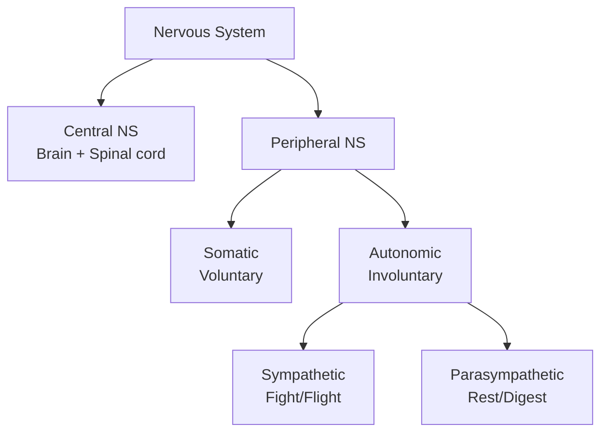
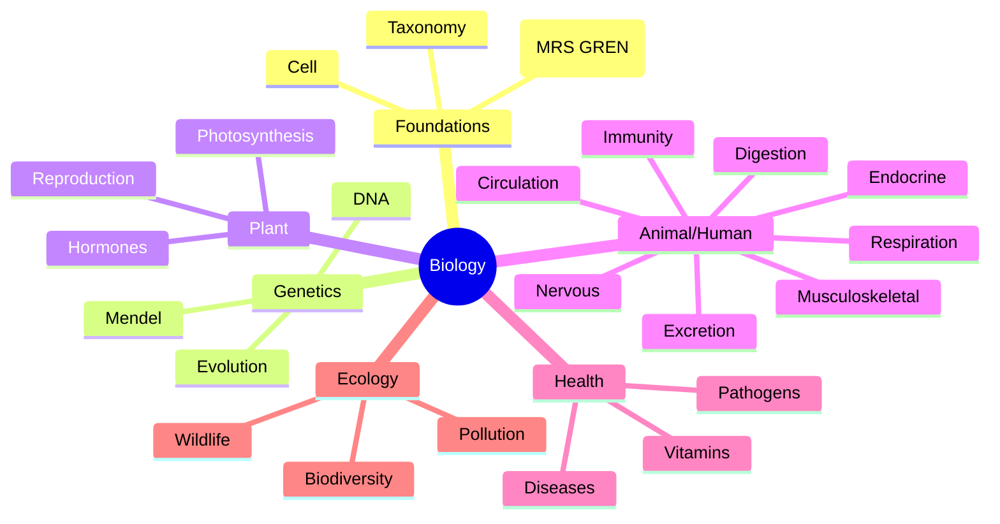

# 📘 How To Use This Book

The 15 pedagogy techniques are explained in `polity.md`. Biology-specific pointers:

- **Story = life itself.** Every chapter is scaffolded as a story: cell → tissue → organ → system → organism → ecosystem.
- **Dual coding is lifesaving** in biology — many terms only make sense when paired with a diagram. Wherever a Mermaid diagram appears, redraw it by hand once.
- **Memory palaces = anatomical walks.** Walk through your own body, top to bottom, attaching systems to body parts.
- **Interleave with chemistry** (biochemistry) and physics (medical instruments).

Paired quiz topics: **BIO_CELL, BIO_GENETICS, BIO_EVOLUTION, BIO_PLANT, BIO_NERVOUS, BIO_ENDOCRINE, BIO_IMMUNE_SYSTEM, BIO_SKELETAL_MUSCULAR, BIO_EXCRETION, BIO_DIGESTION, BIO_RESPIRATION, BIO_CARDIO, BIO_REPRODUCTION, BIO_HUMAN_DISEASES, BIO_ECOLOGY, BIO_VITAMINS**.

---

\newpage

# PART A — FOUNDATIONS OF LIFE

## Chapter A1 — What Is Life?

### 🎬 The Hook

A virus crystal sits in a lab. Inert, motionless. Put it on a cell — it **hijacks** the cell to make millions of copies. Is the virus alive? Biology's answer: life is defined not by a single property but by a **cluster of seven** — the MRS GREN test.

### 🔑 Seven characteristics of life (MRS GREN)

- **M**ovement
- **R**espiration
- **S**ensitivity (response)
- **G**rowth
- **R**eproduction
- **E**xcretion
- **N**utrition

### 🔬 Taxonomic Levels (Linnaeus, 1735)

Kingdom → Phylum → Class → Order → Family → Genus → Species.
Mnemonic: **K**ing **P**hilip **C**ame **O**ver **F**or **G**reat **S**upper.

### 🌐 Whittaker's Five Kingdoms (1969)

1. **Monera** — prokaryotes (bacteria, cyanobacteria).
2. **Protista** — single-celled eukaryotes (amoeba, paramecium).
3. **Fungi** — decomposers (mushrooms, yeasts).
4. **Plantae** — photosynthetic multi-cellular.
5. **Animalia** — heterotrophic multi-cellular.

(Later models add kingdom Archaea → Six kingdoms or 3 domains: Bacteria, Archaea, Eukarya.)

### 🎯 Exam hooks

- "Father of taxonomy?" → **Carl Linnaeus.**
- "Binomial name of humans?" → **Homo sapiens.**
- "Father of modern biology?" → **Aristotle.**
- "Father of modern genetics?" → **Gregor Mendel.**

---

\newpage

## Chapter A2 — The Cell

### 🏠 The story

1665: Robert Hooke slices cork under a microscope and sees boxy compartments. He names them **cells** (Latin *cellula* = small room). 170 years later, Schleiden (plants) and Schwann (animals) declare: **all living things are made of cells**.

### 🧬 Cell Theory

1. All organisms are made of one or more cells.
2. Cell is the basic unit of life.
3. New cells arise from pre-existing cells (Virchow).

### 🔬 Prokaryote vs Eukaryote

| Feature | Prokaryote | Eukaryote |
|---------|-----------|-----------|
| Nucleus | Absent (nucleoid) | Present |
| Size | 1-10 μm | 10-100 μm |
| Organelles | None membrane-bound | Many |
| Examples | Bacteria, archaea | Plants, animals, fungi |
| DNA | Circular | Linear chromosomes |

### 🏭 Organelles — the cell's departments

| Organelle | Function | "The analogy" |
|-----------|----------|---------------|
| Nucleus | Info HQ, contains DNA | CEO office |
| Mitochondria | ATP (energy) factory | Power plant |
| Ribosome | Protein synthesis | 3-D printer |
| ER (smooth) | Lipid synthesis, detox | Pipeline |
| ER (rough) | Protein synthesis + transport | Manufacturing line |
| Golgi | Package & dispatch | Post office |
| Lysosome | Waste digestion | Recycling centre |
| Peroxisome | Oxidative reactions | Detox unit |
| Chloroplast (plant) | Photosynthesis | Solar panel |
| Vacuole (large in plants) | Storage + turgor | Warehouse |
| Cell wall (plant, fungi, bacteria) | Rigidity | Building walls |
| Cytoskeleton | Shape + transport | Skeleton + roads |

### 🏠 Memory palace — **"The Cell Factory"**

Imagine you're CEO of a factory:
- **Boss's office (nucleus)** — has the blueprint book (DNA).
- **Power plant (mitochondria)** — gives electricity (ATP).
- **3-D printers (ribosomes)** — churn out products (proteins).
- **Conveyor belts (ER)** — move products.
- **Post office (Golgi)** — packages & ships.
- **Recycling centre (lysosome)** — breaks down waste.
- **Solar panels (chloroplast)** — only in plant factory.
- **Walls + guards (membrane, cell wall)** — perimeter security.

### 🎯 Exam hooks

- "Powerhouse of cell?" → **Mitochondria.**
- "Suicide bags?" → **Lysosomes.**
- "Site of protein synthesis?" → **Ribosomes.**
- "Largest cell?" → **Ostrich egg (single cell, ~1.5 kg).**
- "Smallest cell?" → **Mycoplasma.**
- "Longest cell?" → **Nerve cell (axon up to 1 m).**

### 📝 Pause + recall

1. Three tenets of cell theory.
2. Five differences between prokaryotic and eukaryotic cells.
3. Analogy-match five organelles to factory departments.

---

\newpage

# PART B — GENETICS & EVOLUTION

## Chapter B1 — Mendelian Genetics

### 🌱 The story

1856-1863, Moravia: **Gregor Mendel**, an Augustinian friar, crosses 28,000 pea plants and discovers **two laws** of inheritance. His paper (1866) is ignored for 34 years until rediscovered in 1900. Mendel shows that heredity is particulate, not blended.

### 📐 Mendel's Laws

1. **Law of Segregation** — two alleles separate during gamete formation.
2. **Law of Independent Assortment** — different traits inherited independently.
3. **Law of Dominance** — one allele can mask the other.

### 🧮 Monohybrid cross (Aa × Aa) → 3:1 phenotype, 1:2:1 genotype.

### 🧬 DNA — The Double Helix

- 1953 — Watson & Crick (with Franklin's X-ray data) publish double helix model. Nobel 1962.
- DNA strands run anti-parallel (5'→3' and 3'→5').
- Pairing: **A-T** (2 H-bonds), **G-C** (3 H-bonds).
- Sugar = deoxyribose; RNA has ribose.
- RNA types: mRNA (messenger), tRNA (transfer), rRNA (ribosomal).

### 🧪 Central Dogma

**DNA → (transcription) → RNA → (translation) → Protein.**
Reverse transcription (RNA → DNA) in retroviruses (HIV).

### 🌀 Gene expression

- **Gene** = DNA segment coding a functional product.
- **Codon** = 3 nucleotides → 1 amino acid (64 codons, 20 amino acids; degeneracy).
- **Start codon** = AUG (methionine); **stop codons** = UAA, UAG, UGA.

### 🎯 Exam hooks

- "Father of genetics?" → **Mendel.**
- "Double helix Nobel year?" → **1962.**
- "Start codon?" → **AUG.**
- "How many chromosomes in humans?" → **46 (23 pairs).**
- "Sex chromosomes?" → **XX female, XY male.**
- "Genetic disease examples?" → **Sickle cell, cystic fibrosis, haemophilia, colour blindness, Huntington's.**

## Chapter B2 — Evolution

### 🦖 Darwin's journey

1831-36 HMS Beagle voyage. Observations on Galápagos finches. 1859: *On the Origin of Species* — **natural selection**.

### 🧬 Modern synthesis

Darwin's natural selection + Mendelian genetics + population genetics = Neo-Darwinism (1930s-40s).

### 📜 Evidence

- **Fossils** — chronological record (Archaeopteryx = bird-reptile link).
- **Homologous organs** — same origin, different function (forelimb: human arm, whale flipper, bat wing).
- **Analogous organs** — different origin, same function (insect wing vs bird wing).
- **Vestigial** — appendix, wisdom teeth, coccyx, ear muscles.
- **Comparative embryology** — embryos of vertebrates similar.
- **Molecular biology** — DNA similarities across species.

### 🧍 Human evolution timeline

Australopithecus → Homo habilis → Homo erectus → Homo neanderthalensis → Homo sapiens (~300,000 years ago, Africa).

### 🎯 Exam hooks

- "Origin of Species year?" → **1859.**
- "Natural selection?" → **Survival of fittest; differential reproduction.**
- "Lamarck's theory?" → **Inheritance of acquired characters (giraffe neck); disproved.**
- "Most recent common ancestor of humans and chimps?" → **~6-7 million years ago.**

### 📝 Pause + recall

1. Mendel's three laws in one line each.
2. Difference between homologous and analogous organs with examples.
3. Define vestigial; name three in humans.

---

\newpage

# PART C — PLANT BIOLOGY

## Chapter C1 — Plant Anatomy

### 🌿 Plant Groups

- **Thallophyta** — algae.
- **Bryophyta** — mosses, liverworts. "Amphibians of plant kingdom."
- **Pteridophyta** — ferns; first vascular plants.
- **Gymnosperms** — naked seeds (conifers, cycads).
- **Angiosperms** — flowering plants. Dicot vs Monocot.

### 🌱 Dicot vs Monocot

| Feature | Dicot | Monocot |
|---------|-------|---------|
| Cotyledons | 2 | 1 |
| Leaf venation | Reticulate | Parallel |
| Flower parts | 4 or 5 | 3 |
| Root | Tap | Fibrous |
| Examples | Bean, mango, rose | Wheat, rice, onion |

### 🌾 Tissues

- **Meristematic** — growth (apical, lateral, intercalary).
- **Permanent** — parenchyma, collenchyma, sclerenchyma; xylem (water); phloem (food).

## Chapter C2 — Photosynthesis

### ☀️ The equation

$$6CO_2 + 6H_2O \xrightarrow{chlorophyll, light} C_6H_{12}O_6 + 6O_2$$

### 🔄 Two Phases

- **Light reaction** (thylakoid) — water split, O₂ released, ATP + NADPH made.
- **Dark reaction / Calvin cycle** (stroma) — CO₂ fixed, sugar made.

### 🌾 C3, C4, CAM

- **C3** — most plants (wheat, rice); inefficient at high T.
- **C4** — tropical (sugarcane, maize); efficient in heat/light.
- **CAM** — succulents (cactus); open stomata at night.

### 🎯 Exam hooks

- "Site of photosynthesis?" → **Chloroplast.**
- "Green pigment?" → **Chlorophyll-a (main) + Chlorophyll-b.**
- "Calvin cycle happens in?" → **Stroma.**
- "CAM plants open stomata when?" → **Night.**

## Chapter C3 — Plant Hormones

| Hormone | Role |
|---------|------|
| **Auxin** | Cell elongation, phototropism, apical dominance |
| **Gibberellin** | Stem elongation, seed germination |
| **Cytokinin** | Cell division |
| **Abscisic acid (ABA)** | Stress, stomatal closure, dormancy |
| **Ethylene** | Fruit ripening, senescence |
| **Florigen** | Flowering |

Mnemonic: **A-GAC-E-F** (Auxin, Gibberellin, Abscisic, Cytokinin, Ethylene, Florigen).

### 🎯 Exam hooks

- "Fruit ripening hormone?" → **Ethylene (gas).**
- "Hormone causing apical dominance?" → **Auxin.**
- "Stress hormone?" → **Abscisic acid.**

## Chapter C4 — Plant Reproduction

- **Asexual** — cuttings, grafting, tissue culture, micropropagation, spore formation.
- **Sexual** — pollination → fertilisation → seed.
- **Pollination types:** Self (autogamy) vs Cross. Agents: wind (anemophily), water (hydrophily), insects (entomophily), birds (ornithophily), bats (chiropterophily).
- **Double fertilisation** (unique to angiosperms): one sperm fuses with egg → zygote; another fuses with polar nuclei → endosperm.

### 📝 Pause + recall

1. What's the difference between C3 and C4 plants?
2. Which hormone ripens fruit (and which gas)?
3. Define double fertilisation.

---

\newpage

# PART D — ANIMAL & HUMAN BIOLOGY (SYSTEMS)

## Chapter D1 — Tissues (Animal)

Four types:
- **Epithelial** — linings & coverings.
- **Connective** — blood, bone, cartilage, adipose.
- **Muscular** — skeletal (striated, voluntary), smooth (non-striated, involuntary), cardiac (striated, involuntary).
- **Nervous** — neurons + glia.

## Chapter D2 — Digestive System

### 🍽️ Pathway

Mouth → pharynx → oesophagus → stomach → small intestine (duodenum, jejunum, ileum) → large intestine (caecum, colon, rectum) → anus.

### 🧪 Enzymes

- **Saliva** — amylase (ptyalin) → starch → maltose.
- **Stomach** — HCl + pepsin (protein digestion).
- **Pancreas** — amylase, lipase, trypsin.
- **Liver** — bile (emulsifies fats).
- **Small intestine** — final digestion + absorption (~7 m long; villi increase surface area).
- **Large intestine** — water absorption.

### 🎯 Exam hooks

- "Largest gland?" → **Liver.**
- "Bile stored in?" → **Gall bladder.**
- "Enzyme in saliva?" → **Amylase (ptyalin).**
- "Stomach acid pH?" → **1.5-3.5.**
- "Length of small intestine?" → **~7 m.**
- "Vit B12 absorbed in?" → **Terminal ileum (via intrinsic factor).**

## Chapter D3 — Respiratory System

### 🫁 Pathway

Nose → pharynx → larynx → trachea → bronchi → bronchioles → alveoli.

- ~300 million alveoli; surface area ~70 m².
- **Diaphragm** + intercostal muscles drive breathing.
- Normal adult: **12-20 breaths/min**; tidal volume ~500 ml.
- O₂ carried by haemoglobin (4 sub-units, 4 O₂ each).

### 🎯 Exam hooks

- "Gaseous exchange site?" → **Alveoli.**
- "CO₂ % in exhaled air?" → **~4% (vs 0.04% inhaled).**
- "Oxygen carrier?" → **Haemoglobin.**
- "CO₂ transport chief form?" → **Bicarbonate (~70%).**

## Chapter D4 — Circulatory System

### 🩸 Heart basics

- 4 chambers: 2 atria + 2 ventricles.
- **Right heart** → pulmonary (deoxygenated → lungs).
- **Left heart** → systemic (oxygenated → body).
- Normal pulse: 60-100 bpm (adults).
- Normal BP: 120/80 mmHg.
- Cardiac cycle ~0.8 sec.

### 🔴 Blood

- **55% plasma + 45% cells** (haematocrit).
- **RBCs** — 4-6 million/μL; lifespan 120 days; no nucleus (in mammals); carry O₂.
- **WBCs** — 4,000-11,000/μL; immunity.
- **Platelets** — 150k-450k/μL; clotting.
- **Blood groups** — ABO + Rh. **AB+** universal recipient; **O−** universal donor.
- **Haemoglobin** normal: Male 13-17 g/dL; Female 12-15.5 g/dL.

### 🧬 WBC types

- **Neutrophils** (60-70%) — bacterial.
- **Lymphocytes** (20-40%) — T/B cells.
- **Monocytes** (3-8%) — macrophages.
- **Eosinophils** (1-4%) — parasites/allergy.
- **Basophils** (< 1%) — histamine.

### 🎯 Exam hooks

- "Normal BP?" → **120/80 mmHg.**
- "Universal donor?" → **O negative.**
- "Biggest WBC?" → **Monocyte.**
- "Smallest WBC?" → **Lymphocyte.**
- "Heart's own pacemaker?" → **SA node (right atrium).**
- "Blood cells made in?" → **Bone marrow.**

## Chapter D5 — Nervous System

### 🧠 Divisions

### 🧠 Brain parts

- **Cerebrum** — thinking, memory, voluntary action (largest).
- **Cerebellum** — balance, coordination.
- **Medulla oblongata** — breathing, heart rate, BP.
- **Hypothalamus** — thirst, hunger, temperature, sleep.
- **Thalamus** — sensory relay.

### ⚡ Neuron

Dendrite → cell body → axon → synapse. **Myelin sheath** speeds conduction. **Schwann cells** produce myelin in PNS. **Neurotransmitters** (acetylcholine, dopamine, serotonin, GABA) cross synapse.

### 🎯 Exam hooks

- "Largest part of brain?" → **Cerebrum.**
- "Balance centre?" → **Cerebellum.**
- "Hunger/thirst centre?" → **Hypothalamus.**
- "Longest cell in body?" → **Neuron.**
- "Fastest signals in body travel via?" → **Myelinated axons (~120 m/s).**

## Chapter D6 — Endocrine System

| Gland | Key hormones | Role |
|-------|--------------|------|
| Pituitary | GH, TSH, ACTH, FSH, LH, Oxytocin, ADH | "Master gland" |
| Thyroid | T3, T4 (thyroxine), Calcitonin | Metabolism; needs iodine |
| Parathyroid | PTH | Calcium |
| Adrenal medulla | Adrenaline, noradrenaline | Fight/flight |
| Adrenal cortex | Cortisol, Aldosterone | Stress, Na balance |
| Pancreas (islets) | Insulin (β) / Glucagon (α) | Blood sugar |
| Ovaries | Estrogen, Progesterone | Female reproduction |
| Testes | Testosterone | Male |
| Pineal | Melatonin | Sleep-wake |
| Thymus | Thymosin | T-cell maturation |

### 🎯 Exam hooks

- "Master gland?" → **Pituitary.**
- "Goitre caused by?" → **Iodine deficiency → enlarged thyroid.**
- "Diabetes type 1 = ?" → **Insulin deficiency (autoimmune).**
- "Fight-or-flight hormone?" → **Adrenaline (epinephrine).**
- "Largest endocrine gland?" → **Thyroid.**

## Chapter D7 — Excretory System

- **Kidneys** (2) — ~1 million nephrons each. Produce urine.
- **Urine** = 95% water + urea + salts + pigments.
- Glomerulus filters; tubules reabsorb/secrete; loop of Henle concentrates.
- Normal urine output: ~1.5 L/day.
- **Dialysis** — artificial kidney (haemo / peritoneal).
- Other excretory aids: lungs (CO₂), skin (sweat), liver (bile pigments).

### 🎯 Exam hooks

- "Functional unit of kidney?" → **Nephron.**
- "Urine yellow colour due to?" → **Urochrome.**
- "Protein breakdown end product?" → **Urea.**

## Chapter D8 — Skeletal & Muscular System

- **Adult human bones:** **206** (infants ~270; some fuse).
- **Largest bone:** femur.
- **Smallest bone:** stapes (ear).
- **Longest bone:** femur.
- **Strongest bone:** femur (also jaw's enamel is hardest substance).
- **Skull bones:** 22.
- **Vertebrae:** 33 (fused to 26 in adult) — 7 cervical, 12 thoracic, 5 lumbar, sacrum (5 fused), coccyx (4 fused).
- **Types of joints:** ball-and-socket (hip, shoulder), hinge (knee, elbow), pivot (atlas-axis), gliding, saddle.
- **Types of muscles:** skeletal (voluntary, striated), smooth (involuntary, non-striated), cardiac.

### 🎯 Exam hooks

- "How many bones in adult?" → **206.**
- "Smallest bone?" → **Stapes.**
- "Biggest muscle?" → **Gluteus maximus.**
- "Heart muscle type?" → **Cardiac (striated, involuntary).**

## Chapter D9 — Immune System

- **Innate immunity** — skin, mucous, phagocytes (fast, non-specific).
- **Adaptive immunity** — T cells (cellular) + B cells (antibodies, humoral).
- **Antibodies** = immunoglobulins: IgG (most abundant), IgM (first responder), IgA (mucosal), IgE (allergy), IgD.
- **Vaccines** train adaptive immunity. Types: live attenuated, inactivated, subunit, toxoid, mRNA, DNA, vector, nasal.
- **Herd immunity** — when enough of population is immune, pathogen can't spread.
- **Autoimmune** — body attacks self (rheumatoid arthritis, lupus, type 1 diabetes, MS).

### 🎯 Exam hooks

- "First-responder antibody?" → **IgM.**
- "Most abundant antibody?" → **IgG.**
- "Allergy antibody?" → **IgE.**
- "Vaccine concept pioneer?" → **Edward Jenner (smallpox, 1796).**
- "BCG vaccine against?" → **Tuberculosis.**

### 📝 Pause + recall

1. List the 5 major WBC types and one job each.
2. Name 3 master-gland hormones and what they trigger.
3. How many bones in adult, and which are the smallest/largest?

---

\newpage

# PART E — REPRODUCTION & DEVELOPMENT

## Chapter E1 — Human Reproduction

### ♂️♀️ Organs

- **Male:** testes (sperm + testosterone), epididymis, vas deferens, seminal vesicle, prostate, penis.
- **Female:** ovaries (egg + estrogen/progesterone), fallopian tubes, uterus, cervix, vagina.

### 🥚 Menstrual Cycle (~28 days)

1. **Menstrual phase** (days 1-5) — shedding.
2. **Follicular phase** (1-13) — FSH → follicle matures; estrogen rises.
3. **Ovulation** (~day 14) — LH surge releases egg.
4. **Luteal phase** (15-28) — corpus luteum → progesterone.

### 🤰 Pregnancy

- ~**280 days (40 weeks)** from LMP.
- Trimesters: T1 (1-12 wk), T2 (13-27), T3 (28-40).
- Placenta = fetus-mother exchange.
- Chromosomes: fetal karyotype 46, XX / XY.

### 🎯 Exam hooks

- "Human gestation?" → **~280 days.**
- "Fertilisation site?" → **Fallopian tube (ampulla).**
- "Implantation site?" → **Uterus.**
- "Sex of baby determined by?" → **Father's sperm (X → girl, Y → boy).**

---

\newpage

# PART F — NUTRITION & VITAMINS

## Chapter F1 — Macro & Micro Nutrients

- **Carbohydrates** — 4 kcal/g (main fuel).
- **Proteins** — 4 kcal/g (building).
- **Fats** — 9 kcal/g (stored fuel).
- **Water** — 60% body weight.

### 🧪 Vitamins (full table)

| Vitamin | Name | Deficiency | Source |
|---------|------|-----------|--------|
| A | Retinol | Night blindness, xerophthalmia | Carrot, liver |
| B1 | Thiamine | Beriberi | Whole grains |
| B2 | Riboflavin | Cheilosis | Milk, egg |
| B3 | Niacin | Pellagra | Peanut, meat |
| B5 | Pantothenic | Rare | Widely |
| B6 | Pyridoxine | Anaemia | Fish, poultry |
| B7 | Biotin | Hair/skin | Egg yolk |
| B9 | Folic acid | Anaemia, neural tube defects | Leafy veg |
| B12 | Cyanocobalamin | Pernicious anaemia | Animal only |
| C | Ascorbic acid | Scurvy | Citrus, amla |
| D | Calciferol | Rickets (child), osteomalacia (adult) | Sunlight |
| E | Tocopherol | Rare (sterility?) | Veg oils |
| K | Phylloquinone | Bleeding | Leafy greens |

- **Fat-soluble:** A, D, E, K.
- **Water-soluble:** B-complex & C.

### 🎯 Exam hooks

- "Vitamin made by skin + sunlight?" → **D (cholecalciferol).**
- "Only vitamin not found in plants?" → **B12.**
- "Scurvy → ?" → **Vitamin C (ascorbic acid).**
- "Blood clotting vitamin?" → **K.**
- "Night blindness?" → **Vitamin A.**

## Chapter F2 — Minerals Quick

- **Iron** → haemoglobin; deficiency → anaemia.
- **Iodine** → thyroid; deficiency → goitre.
- **Calcium** → bones, teeth; deficiency → rickets/osteoporosis.
- **Phosphorus** → bones, ATP.
- **Sodium** → fluid balance.
- **Potassium** → nerve/muscle.
- **Fluorine** → teeth (excess → fluorosis).
- **Zinc** → enzymes; deficiency → immune issues.
- **Magnesium** → muscle, enzyme cofactor.

### 📝 Pause + recall

1. All fat-soluble vitamins and one deficiency disease each.
2. Why is B12 deficiency common in vegans?
3. Iodised salt's public-health purpose.

---

\newpage

# PART G — DISEASES

## Chapter G1 — Pathogens & Diseases

| Disease | Pathogen type | Agent |
|---------|--------------|-------|
| Malaria | Protozoan | *Plasmodium* (female Anopheles mosquito) |
| Dengue | Virus | Aedes aegypti mosquito |
| Chikungunya | Virus | Aedes mosquito |
| Filariasis | Worm | Culex mosquito |
| Kala-azar | Protozoan | Sand fly (Leishmania) |
| Plague | Bacterium | Rat flea (Yersinia pestis) |
| TB | Bacterium | Mycobacterium tuberculosis |
| Leprosy | Bacterium | Mycobacterium leprae |
| Cholera | Bacterium | Vibrio cholerae |
| Typhoid | Bacterium | Salmonella typhi |
| Diphtheria | Bacterium | Corynebacterium |
| Tetanus | Bacterium | Clostridium tetani |
| Polio | Virus | Poliovirus |
| Measles | Virus | Measles virus |
| Mumps | Virus | Mumps virus |
| Rabies | Virus | Rabies (dog bite) |
| HIV/AIDS | Retrovirus | HIV |
| Hepatitis B | Virus | HBV |
| COVID-19 | Virus | SARS-CoV-2 |
| Ringworm | Fungus | Tinea |
| Sickle-cell anaemia | Genetic | β-globin mutation |
| Haemophilia | Genetic | Factor VIII/IX |
| Colour blindness | Genetic | X-linked |
| Down syndrome | Genetic | Trisomy 21 |
| Diabetes | Metabolic | Insulin issue |
| Scurvy | Deficiency | Vitamin C |
| Rickets | Deficiency | Vitamin D |

### 🎯 Exam hooks

- "Vector of malaria?" → **Female Anopheles mosquito.**
- "Vector of dengue?" → **Aedes aegypti (day-biter).**
- "TB caused by?" → **Mycobacterium tuberculosis.**
- "AIDS virus type?" → **Retrovirus (RNA → DNA via reverse transcriptase).**
- "Polio route of spread?" → **Oral-faecal; pulse polio = OPV.**
- "First disease eradicated by vaccination?" → **Smallpox (1980 WHO declaration).**

### 📝 Pause + recall

1. List 5 mosquito-borne diseases and the specific mosquito.
2. Match 5 bacterial diseases to their organisms.
3. Which diseases are now "eradicated" or "eliminated"?

---

\newpage

# PART H — ECOLOGY & ENVIRONMENT

## Chapter H1 — Ecology Basics

- **Ecosystem** = community + non-living environment.
- **Biotic** (living) + **abiotic** (non-living).
- **Food chain** → **food web** → **trophic levels** (producer → primary consumer → secondary → tertiary → decomposer).
- **10% rule** (Lindeman) — only 10% energy transferred to next level.
- **Ecological pyramids** — number, biomass, energy. Energy pyramid always upright; number/biomass can invert.

### 🌿 Biodiversity

- **Species diversity**, **genetic diversity**, **ecosystem diversity.**
- **Hotspots** (globally 36); India has **4**: Western Ghats, Eastern Himalaya, Indo-Burma, Sundaland (Nicobar).
- **IUCN categories:** Extinct → EW → CR → EN → VU → NT → LC.
- **CITES** — international trade in endangered species treaty.
- **Biodiversity Convention 1992** (Rio) → India's Biological Diversity Act 2002.

## Chapter H2 — Indian Wildlife & Conservation

### 🐅 National programmes

- **Project Tiger** (1973) — 55+ tiger reserves now.
- **Project Elephant** (1992).
- **Project Rhino, Dolphin, Lion** (Gir specific).
- **Cheetah reintroduction** — Namibian + South African cheetahs to Kuno National Park (2022-23).
- **Vulture Action Plan** (ban on diclofenac).
- **Crocodile Conservation Project.**

### 🦁 National animals / symbols

- National animal: **Bengal tiger** (since 1973).
- National bird: **Indian peacock.**
- National aquatic animal: **Ganges river dolphin** (since 2009).
- National heritage animal: **Elephant** (since 2010).
- National tree: **Banyan.**
- National flower: **Lotus.**

### 🏞️ Protected Area types

- **National Park** (106, Apr 2026).
- **Wildlife Sanctuary** (~570).
- **Conservation Reserve.**
- **Community Reserve.**
- **Biosphere Reserve** (18; 12 in UNESCO's MAB).
- **Tiger Reserve** under Project Tiger.

### 🎯 Exam hooks

- "India's 1st National Park?" → **Hailey (now Jim Corbett), 1936.**
- "Largest National Park?" → **Hemis (Ladakh).**
- "Biosphere Reserves in India?" → **18 (12 under UNESCO MAB).**
- "National aquatic animal?" → **Ganges river dolphin.**
- "Ramsar Sites in India?" → **~85 as of 2026.**

## Chapter H3 — Pollution & Climate

(Cross-reference `chemistry.md` Part H & `sci_tech.md` Part F for details.)

Key exam-ready nuggets:
- **Greenhouse gases** in order of abundance in atmosphere: CO₂ > CH₄ > N₂O.
- **In order of GWP**: SF₆ > N₂O > CH₄ > CO₂.
- **Ozone hole** — over Antarctica; CFCs culprit; **Montreal Protocol 1987**.
- **Kigali Amendment 2016** — HFCs.
- **Acid rain** — SO₂ + NOₓ.
- **Eutrophication** — nutrient runoff → algal bloom.
- **Bio-magnification** — DDT, Hg in food chain.

### 📝 Pause + recall

1. 10% rule with a simple numerical example.
2. India's 4 biodiversity hotspots.
3. Order: Ext → EW → CR → EN → VU → NT → LC.

---

\newpage

# APPENDICES

## Appendix 1 — Human body trivia (memorise cold)

| Fact | Value |
|------|-------|
| Bones (adult) | 206 |
| Muscles | ~640 |
| Teeth (adult) | 32 |
| Teeth (child) | 20 |
| Organs | ~78 |
| Cells | ~37 trillion |
| Longest bone | Femur |
| Smallest bone | Stapes |
| Largest organ | Skin |
| Largest internal organ | Liver |
| Largest gland | Liver |
| Master gland | Pituitary |
| Hardest substance | Tooth enamel |
| Strongest muscle | Masseter (by force) / Glute (by size) |
| Blood volume | 5-6 L |
| Heart beats/day | ~1,00,000 |
| Heartbeats/lifetime | ~2.5 billion |
| Breaths/day | ~20,000 |
| Body water | ~60% |
| pH of blood | 7.35-7.45 |
| Normal body temp | 37°C / 98.6°F |
| Brain weight | ~1.4 kg |
| Neurons | ~86 billion |
| RBC lifespan | 120 days |
| Platelet lifespan | 7-10 days |
| WBC lifespan | 12-20 days |

## Appendix 2 — Doctor / branch quick card

| Branch | Study of |
|--------|----------|
| Cardiology | Heart |
| Nephrology | Kidneys |
| Hepatology | Liver |
| Pulmonology | Lungs |
| Neurology | Nervous system |
| Oncology | Cancer |
| Haematology | Blood |
| Gastroenterology | Stomach/intestines |
| Dermatology | Skin |
| Ophthalmology | Eyes |
| Otorhinolaryngology | ENT |
| Orthopaedics | Bones/joints |
| Pediatrics | Children |
| Gerontology | Elderly |
| Psychiatry | Mental health |
| Pathology | Disease (general) |
| Endocrinology | Hormones |
| Rheumatology | Joints/autoimmune |
| Urology | Urinary tract |

## Appendix 3 — Mnemonics quick list

- **MRS GREN** — life characteristics.
- **KPCOFGS** — taxonomy (King Philip Came Over For Great Supper).
- **AGAC-E-F** — plant hormones.
- **ABO** — universal donor O−, universal recipient AB+.
- **SCAM** (skeletal, cardiac, smooth... and autonomic) — muscle types.

## Appendix 4 — Mind map

---

*For chemistry context, see `chemistry.md`. For instruments, see `physics.md`. For wildlife policy, see `environment.md`. Quiz pairings under `BIO_*`.*
