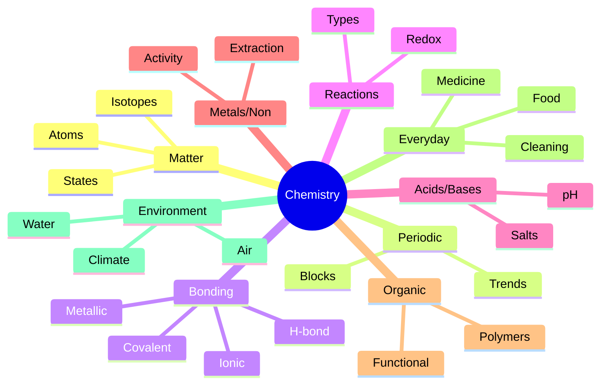

# 📘 How To Use This Book

The 15 pedagogy techniques are explained in `polity.md`. Subject-specific pointers:

- Chemistry rewards **pattern recognition** — the periodic table is a giant lookup table for predicting behaviour.
- **Story-first** — most great chemistry stories are about *why* people couldn't get the metal, the drug, the dye. The mechanism comes with the motive.
- **Memory palaces work brilliantly** here — groups and periods are a grid you can "walk".
- **Interleave** with biology (biochemistry of life) and physics (thermodynamics, radioactivity).

Paired quiz topics: **CHE_ACIDS_BASES, CHE_GASES, CHE_REACTIONS, CHE_PERIODIC_TABLE, CHE_METALS, CHE_NONMETALS, CHE_ORGANIC, CHE_POLYMERS, CHE_EVERYDAY**.

---

\newpage

# PART A — MATTER AND ITS NATURE

## Chapter A1 — States of Matter

### 🎬 The Hook

A ₹10 ice block on a summer day gives you a single experience of **three states** of matter (solid → liquid → gas) in 20 minutes. The same H₂O molecules — only their **motion** and **arrangement** change.

### 🧊 Three (and two more) States

- **Solid** — definite shape & volume; particles vibrate in fixed positions.
- **Liquid** — definite volume, no fixed shape.
- **Gas** — no fixed shape or volume; fills container.
- **Plasma** — ionised gas (Sun, fluorescent tubes, lightning).
- **Bose-Einstein Condensate** — at near-absolute-zero; "super-atom" behaviour (Satyendra Nath Bose + Einstein predicted; realised 1995).

### 🔄 Changes of State (and their names)

| From → To | Name |
|-----------|------|
| Solid → Liquid | Melting (Fusion) |
| Liquid → Solid | Freezing (Solidification) |
| Liquid → Gas | Evaporation / Boiling |
| Gas → Liquid | Condensation |
| Solid → Gas | **Sublimation** (iodine, naphthalene, camphor, dry ice) |
| Gas → Solid | **Deposition** (frost) |

### 🎯 Exam hooks

- "Bose-Einstein condensate?" → **5th state; super-cooled super-atom.**
- "Dry ice is?" → **Solid CO₂; sublimates.**
- "Plasma in daily life?" → **Tube lights, Sun, lightning.**

### 📝 Pause + recall

Name all six state-change names + one real-world example each.

---

\newpage

## Chapter A2 — Atomic Structure

### ⚛️ The Evolution (already in `physics.md`, brief recap)

- Dalton (1808) — atoms indivisible, characteristic of element.
- J.J. Thomson (1897) — discovered electron; plum-pudding model.
- Rutherford (1911) — α-scattering → nucleus + electrons; "mostly empty space".
- Bohr (1913) — quantised electron orbits.
- Quantum model (1926+) — orbitals (probability clouds).

### 🧮 Atom vocabulary

- **Atomic number Z** = number of protons = number of electrons (neutral atom).
- **Mass number A** = protons + neutrons.
- **Isotopes** — same Z, different A (H has ¹H, ²H = deuterium, ³H = tritium).
- **Isobars** — same A, different Z (⁴⁰Ar, ⁴⁰K, ⁴⁰Ca).
- **Isotones** — same neutron number.

### 📐 Orbital filling order (Aufbau)

1s → 2s → 2p → 3s → 3p → 4s → 3d → 4p → 5s → 4d → 5p → 6s → 4f → 5d → 6p → 7s → 5f → 6d → 7p.

Mnemonic: draw the **Aufbau diagonal**.

### 🎯 Exam hooks

- "Heaviest sub-atomic particle?" → **Neutron (slightly more than proton).**
- "Who discovered electron?" → **J.J. Thomson (1897).**
- "Who discovered neutron?" → **James Chadwick (1932).**
- "Isotopes of hydrogen?" → **Protium, Deuterium, Tritium.**

---

\newpage

# PART B — THE PERIODIC TABLE

## Chapter B1 — Mendeleev to Modern

### 🎬 The Hook

1869: Dimitri Mendeleev lays the 63 known elements on cards, sorts them by atomic weight, and finds a **repeating pattern** in chemical behaviour. He leaves **gaps** for elements he predicts will exist — eka-aluminium (Ga), eka-silicon (Ge), eka-boron (Sc). All three were found within 15 years. That's why physics makes a law, chemistry makes a **table**.

### 🧭 Modern Periodic Table (Moseley, 1913)

Arranged by **atomic number** (not atomic mass — resolves anomalies like Ar-K, Te-I, Co-Ni). 118 elements, 7 periods, 18 groups, 4 blocks (s, p, d, f).

### 📊 The Four Blocks

- **s-block** (groups 1-2): alkali + alkaline earth metals. Soft, reactive.
- **p-block** (groups 13-18): mix of metals, metalloids, non-metals, noble gases.
- **d-block** (groups 3-12): transition metals. Iron, copper, gold, platinum.
- **f-block** (below table): lanthanides (4f) and actinides (5f).

### 📈 Periodic Trends

| Trend | Across period (L→R) | Down group |
|-------|---------------------|------------|
| Atomic size | decreases | increases |
| Ionisation energy | increases | decreases |
| Electron affinity | mostly increases | decreases |
| Electronegativity | increases | decreases |
| Metallic character | decreases | increases |

Mnemonic for electronegativity: **F > O > N > Cl > Br > I** — "French Ocean Navy Cleans Burmese Islands".

### 🎯 Exam hooks

- "Most electronegative element?" → **Fluorine (F), 3.98 Pauling.**
- "Most reactive metal?" → **Cesium (Cs) / Francium.**
- "Most reactive non-metal?" → **Fluorine.**
- "Noble gases group?" → **18.** Mnemonic: **He, Ne, Ar, Kr, Xe, Rn**.
- "Alkali metals group?" → **1 (H excluded usually).**
- "Halogens group?" → **17.**

### 🏠 Memory palace — **"The Periodic Street"**

Picture a street with 18 shops in a row:

- **Shop 1 (alkali)** — bright pink; you touch Li/Na/K and sparks fly.
- **Shop 2** — cream (Be/Mg/Ca).
- ...
- **Shop 17 (halogens)** — green, glowing poisons (Cl, Br, I).
- **Shop 18 (noble gases)** — calm, glass-walled, inert gases.

Cross the street downward and you get 7 floors (periods).

### 📝 Pause + recall

1. Why was Moseley's table better than Mendeleev's?
2. Trend of atomic size across a period? Down a group?
3. Most electronegative vs most electropositive element?

---

\newpage

# PART C — CHEMICAL BONDING & REACTIONS

## Chapter C1 — Bonding

### 🤝 Three Types

- **Ionic** — electron transfer; metal + non-metal (NaCl, MgO).
- **Covalent** — electron sharing; non-metal + non-metal (H₂O, CH₄, O₂).
- **Metallic** — "sea of electrons" among positive cores (metals, alloys).

### ➕ Dative / Coordinate Bond

Both shared electrons come from one atom (NH₄⁺, H₃O⁺).

### 💧 Hydrogen Bond

Weak intermolecular attraction when H is bonded to F, O, or N. Explains water's high boiling point, ice being less dense than water, DNA base pairing.

### 🎯 Exam hooks

- "Why is water liquid at room temperature?" → **Hydrogen bonding.**
- "Ice floats on water because?" → **H-bonds create open lattice → lower density.**
- "Type of bond in diamond?" → **Covalent (sp³, 3-D).**

## Chapter C2 — Reactions

### ⚖️ Types

- **Combination:** A + B → AB.
- **Decomposition:** AB → A + B (thermal, electrolytic, photochemical).
- **Displacement:** A + BC → AC + B (Zn + CuSO₄ → ZnSO₄ + Cu).
- **Double displacement:** AB + CD → AD + CB (precipitation, neutralisation).
- **Redox:** transfer of electrons (oxidation = loss; reduction = gain). OIL RIG.
- **Combustion:** rapid oxidation releasing heat & light.
- **Exothermic:** releases heat (combustion, neutralisation).
- **Endothermic:** absorbs heat (photosynthesis, thermal decomposition).

### 🦅 Balancing reactions

Conservation of mass — atoms on left = atoms on right. Never change subscripts, only coefficients.

### 📝 Pause + recall

1. Zinc in copper sulphate — what's the reaction? Why does Zn displace Cu?
2. Why is rusting a redox reaction?
3. Photosynthesis endo or exo?

---

\newpage

# PART D — ACIDS, BASES, SALTS

## Chapter D1 — Three Definitions

- **Arrhenius** — acid gives H⁺ in water; base gives OH⁻.
- **Brønsted-Lowry** — acid is H⁺ donor; base is H⁺ acceptor.
- **Lewis** — acid is electron-pair acceptor; base is donor.

### 📏 pH Scale

- 0 (strong acid) → 7 (neutral) → 14 (strong base).
- pH = −log[H⁺].
- Blood pH = 7.35-7.45.
- Saliva = 6.5-7.5; gastric juice = 1.5-3.5; tomato ~4; milk ~6.6; baking soda ~9; bleach ~12.

### 🧪 Common Indicators

| Indicator | Acid colour | Base colour |
|-----------|-------------|-------------|
| Litmus | Red | Blue |
| Phenolphthalein | Colourless | Pink |
| Methyl orange | Red/Orange | Yellow |
| Universal | Red | Violet |
| Turmeric | Yellow | Red |

### 🧂 Salts

- Strong acid + strong base → neutral salt (NaCl).
- Strong acid + weak base → acidic salt (NH₄Cl).
- Weak acid + strong base → basic salt (CH₃COONa).

### 🔥 Common Acids & uses

- **HCl** — gastric juice, metal cleaning.
- **H₂SO₄** — "king of chemicals"; fertiliser, batteries.
- **HNO₃** — explosives, fertilisers (aqua regia = 3 HCl : 1 HNO₃, dissolves gold).
- **CH₃COOH** — vinegar.
- **Citric, tartaric, oxalic, lactic** — fruits, tamarind, spinach, curd.

### 🧴 Common Bases

- **NaOH** — caustic soda; soap, paper.
- **KOH** — alkaline batteries.
- **Ca(OH)₂** — slaked lime (whitewash).
- **Mg(OH)₂** — milk of magnesia (antacid).
- **NH₄OH** — cleaning.

### 🎯 Exam hooks

- "Strongest acid?" → **HClO₄ (perchloric) or fluorosulphuric; but exam-answer is usually HCl/H₂SO₄.**
- "Aqua regia dissolves?" → **Gold and platinum.**
- "Baking soda chemical?" → **NaHCO₃.**
- "Washing soda?" → **Na₂CO₃·10H₂O.**
- "Bleaching powder?" → **Ca(OCl)Cl / CaOCl₂.**
- "Plaster of Paris?" → **CaSO₄·½H₂O.**
- "Gypsum?" → **CaSO₄·2H₂O.**

### 📝 Pause + recall

1. pH of human blood?
2. Aqua regia composition and what it dissolves?
3. Common indicator colour change pair (litmus, phenolphthalein, methyl orange).

---

\newpage

# PART E — METALS AND NON-METALS

## Chapter E1 — Metals

### 🔧 Physical

- Lustrous, malleable, ductile, good conductors, high melting point (usually).
- **Exceptions:** mercury (liquid), Na/K/Cs (soft, low melting), gold (most ductile — 1g → 2.4 km wire), silver (best conductor).

### 🧬 Activity Series (most → least reactive)

K > Na > Ca > Mg > Al > Zn > Fe > Pb > (H) > Cu > Hg > Ag > Au > Pt.

Mnemonic: **Please Stop Calling Me A Zebra, I Like Harry**, **Coz Heroes Should Always Play**.

### 🔥 Reactions with water/acid

- K, Na → react with cold water (violent).
- Ca, Mg → with hot water.
- Fe → with steam.
- Cu, Ag, Au → do not react.
- Below H → do not displace H from acids.

### ⛏️ Extraction Basics

- **Ore concentration** → froth flotation / gravity.
- **Roasting** (with O₂) / calcination (without O₂) → oxide.
- **Reduction** to metal (carbon for Fe; electrolysis for Al, Na, K; thermite for Cr, Mn).
- **Refining** — electrolytic (Cu), distillation (Zn, Hg), liquation (Sn, Pb).

### 🎯 Exam hooks

- "Most ductile metal?" → **Gold.**
- "Best conductor of electricity?" → **Silver** (Cu in wiring for economy).
- "Only liquid metal at room temp?" → **Mercury.** (Also Ga, Cs, Rb near room-temp.)
- "Lightest metal?" → **Lithium.**
- "Heaviest naturally occurring metal?" → **Uranium (or Osmium by density).**
- "Aluminium extraction?" → **Hall-Héroult (electrolysis of molten Al₂O₃ in cryolite).**

## Chapter E2 — Non-Metals

- Dull, brittle, poor conductors (carbon-graphite exception).
- **Exceptions:** Iodine is lustrous; diamond is hardest natural substance; graphite conducts electricity.

### 💨 Important Gases (quick fire)

- **O₂** — 21% of atmosphere; life support; Joseph Priestley discovered.
- **N₂** — 78%; inert, fertiliser via Haber-Bosch (NH₃).
- **CO₂** — 0.04%; greenhouse; dry ice; photosynthesis input.
- **CO** — toxic; binds haemoglobin 240× stronger than O₂; incomplete combustion.
- **H₂** — lightest; fuel of future; pop test.
- **He** — balloons, MRI.
- **O₃ (ozone)** — stratospheric shield; absorbs UV.

### 🎯 Exam hooks

- "Hardest natural substance?" → **Diamond.**
- "Non-metal that conducts?" → **Graphite.**
- "Non-metal liquid at room temp?" → **Bromine.**
- "Gas filled in electric bulbs?" → **Argon, sometimes Nitrogen.**
- "Laughing gas?" → **N₂O (nitrous oxide).**

### 📝 Pause + recall

1. Top 3 in activity series?
2. Why does iron rust but gold doesn't?
3. Name 5 common ores of iron (hematite, magnetite, limonite, siderite, pyrite).

---

\newpage

# PART F — ORGANIC CHEMISTRY BASICS

## Chapter F1 — The Carbon Story

Carbon makes 4 bonds (tetravalent), chains indefinitely (catenation), forms double/triple bonds → **10 million** known organic compounds vs ~500,000 inorganic.

### 🧩 Functional Groups (memorise)

| Group | Formula | Example |
|-------|---------|---------|
| Alcohol | −OH | Ethanol C₂H₅OH |
| Aldehyde | −CHO | Formaldehyde HCHO |
| Ketone | >C=O | Acetone CH₃COCH₃ |
| Carboxylic acid | −COOH | Acetic acid CH₃COOH |
| Ester | −COO− | Ethyl acetate |
| Amine | −NH₂ | Methylamine |
| Ether | −O− | Diethyl ether |
| Halide | −X | Chloroform CHCl₃ |

### 🧪 Alkane-Alkene-Alkyne Homologous Series

- **Alkanes (CₙH₂ₙ₊₂)** — methane, ethane, propane, butane, pentane, hexane, heptane, octane, nonane, decane.
- **Alkenes (CₙH₂ₙ)** — ethene, propene, butene...
- **Alkynes (CₙH₂ₙ₋₂)** — ethyne (acetylene).

Mnemonic for first 10 alkanes: **Me Eat Peanut Butter Pickles, Hero Hex Often Need Dough** (Meth-Eth-Prop-But-Pent-Hex-Hept-Oct-Non-Dec).

### 🎯 Exam hooks

- "Simplest alkane?" → **Methane (CH₄) — cooking gas + marsh gas + biogas major.**
- "Simplest alkene?" → **Ethene (C₂H₄) — ripening fruit hormone.**
- "LPG composition?" → **Butane + Propane.**
- "CNG?" → **Mostly methane.**
- "Biogas composition?" → **~55-60% methane + CO₂.**
- "Alcohol in beverages?" → **Ethanol.**
- "Wood alcohol / poisonous?" → **Methanol.**

## Chapter F2 — Polymers

- **Polymer** = many monomers joined. Examples:
  - **Polythene** (ethene → polythene) — bags, bottles.
  - **PVC** — pipes.
  - **Teflon (PTFE)** — non-stick, developed 1938 DuPont.
  - **Nylon** — first fully synthetic fibre (1935).
  - **Terylene / Dacron / PET** — bottles, clothing.
  - **Bakelite** — first true plastic (Baekeland, 1907).
  - **Rubber** — natural (polyisoprene), vulcanised (Goodyear, 1839).

### 🎯 Exam hooks

- "First synthetic plastic?" → **Bakelite, 1907.**
- "Non-stick pan coating?" → **Teflon (PTFE).**
- "Nylon inventor/year?" → **Wallace Carothers, DuPont, 1935.**

---

\newpage

# PART G — EVERYDAY CHEMISTRY

## Chapter G1 — Food and Drink

- **Fermentation** — yeast converts sugar → ethanol + CO₂. Basis of bread, beer, wine.
- **Pasteurisation** — mild heating to kill pathogens (Louis Pasteur).
- **Cooking oils** — saturated (ghee, coconut) vs unsaturated (sunflower, olive) vs trans fats (hydrogenated, health-risk).
- **Preservatives** — salt, sugar, vinegar, sodium benzoate, potassium metabisulphite.
- **Baking soda** (NaHCO₃) vs **baking powder** (NaHCO₃ + tartaric acid).
- **Iodised salt** — KIO₃ added to prevent goitre.

### ⚠️ Common Adulterants

| Food | Adulterant | Test |
|------|-----------|------|
| Milk | Water, starch | Lactometer; iodine → blue |
| Ghee | Vanaspati | Butyro-refractometer |
| Honey | Sugar syrup | Fiehe's test |
| Turmeric | Metanil yellow | Conc. HCl → pink |
| Chilli | Brick powder | Water dissolves colour |
| Tea | Used leaves | Wet paper; run dye |

## Chapter G2 — Chemistry of Cleaning & Cosmetics

- **Soap** = sodium salt of long-chain fatty acid (C₁₇H₃₅COONa).
- **Detergent** = sodium salt of sulphonic acid; works in hard water (Ca/Mg ions) unlike soap.
- **Hard water** — contains Ca²⁺, Mg²⁺; softened by ion-exchange (zeolite) or boiling (removes temporary hardness).
- **Toothpaste** — mildly basic; contains fluoride to strengthen enamel.
- **Shampoo** — mild detergent + conditioner.
- **Perfume** — alcohol + aromatic esters.

## Chapter G3 — Chemistry in Medicine

- **Antibiotics** — Penicillin (Fleming 1928), streptomycin, tetracycline.
- **Analgesics** — aspirin, paracetamol, ibuprofen.
- **Antipyretics** — reduce fever (paracetamol).
- **Antacids** — neutralise stomach acid (milk of magnesia, gelusil).
- **Antiseptics** — applied externally (dettol, iodine); **disinfectants** — surfaces.

### 📝 Pause + recall

1. What's the difference between soap and detergent? Which works in hard water?
2. Why is iodine added to salt?
3. Aspirin chemical category?

---

\newpage

# PART H — ENVIRONMENTAL CHEMISTRY

## Chapter H1 — Air and Water

### 🌫️ Air Pollutants

- **CO** — vehicle exhaust; binds Hb.
- **SO₂** — coal plants → acid rain (H₂SO₄).
- **NOₓ** — vehicles + thunderstorms → smog, acid rain.
- **PM₂.₅ / PM₁₀** — particulate matter; respiratory.
- **O₃** (ground-level) — smog; irritant.
- **CO₂, CH₄, N₂O, CFCs, SF₆, HFCs** — greenhouse gases.

### 💧 Water Pollutants

- **BOD** (Biological Oxygen Demand) — higher = more organic pollution.
- **DO** (Dissolved Oxygen) — fish need ≥ 4 mg/L.
- **Fluoride** — >1.5 ppm → fluorosis.
- **Arsenic** — >10 ppb → carcinogenic (Bengal, Bangladesh).
- **Eutrophication** — nutrient over-enrichment → algal bloom → fish kill.
- **Minamata disease** — Hg poisoning.
- **Itai-itai** — Cd poisoning.

## Chapter H2 — Ozone & Greenhouse

- **Ozone layer** at 20-30 km; CFCs, halons break it → "ozone hole" over Antarctica (discovered 1985).
- **Montreal Protocol 1987** phased out CFCs.
- **Kigali Amendment 2016** targets HFCs.
- **Global warming potential (GWP)** — CO₂ = 1; CH₄ = 28-36; N₂O = 298; SF₆ = 23,500.
- **Kyoto 1997** → Paris 2015 → Glasgow 2021 → Dubai COP28 (2023, first global stocktake) → COP30 Brazil 2025.

### 🎯 Exam hooks

- "Main greenhouse gas?" → **CO₂.**
- "Strongest greenhouse gas (GWP)?" → **SF₆.**
- "Ozone hole gases?" → **CFCs.**
- "Minamata = ?" → **Mercury poisoning.**
- "Acid rain main gases?" → **SO₂ & NOₓ.**

### 📝 Pause + recall

1. Name 3 greenhouse gases in order of GWP.
2. What is BOD vs DO?
3. Which amendment tackles HFCs?

---

\newpage

# APPENDICES

## Appendix 1 — The "Nicknames" Quick List

| Everyday name | Chemical |
|---------------|----------|
| Baking soda | NaHCO₃ |
| Washing soda | Na₂CO₃·10H₂O |
| Caustic soda | NaOH |
| Caustic potash | KOH |
| Slaked lime | Ca(OH)₂ |
| Quick lime | CaO |
| Limestone | CaCO₃ |
| Gypsum | CaSO₄·2H₂O |
| Plaster of Paris | CaSO₄·½H₂O |
| Bleaching powder | Ca(OCl)Cl |
| Hypo (photography) | Na₂S₂O₃·5H₂O |
| Milk of magnesia | Mg(OH)₂ |
| Epsom salt | MgSO₄·7H₂O |
| Glauber's salt | Na₂SO₄·10H₂O |
| Mohr's salt | (NH₄)₂Fe(SO₄)₂·6H₂O |
| Blue vitriol | CuSO₄·5H₂O |
| Green vitriol | FeSO₄·7H₂O |
| White vitriol | ZnSO₄·7H₂O |
| Red lead | Pb₃O₄ |
| Dry ice | Solid CO₂ |
| Heavy water | D₂O |
| Producer gas | CO + N₂ |
| Water gas | CO + H₂ |
| Marsh gas | CH₄ |
| Laughing gas | N₂O |
| Mustard gas | (ClCH₂CH₂)₂S |
| Tear gas | CS (2-chlorobenzal malononitrile) |
| Vinegar | Dilute acetic acid |
| Spirit | Ethanol |
| Wood spirit | Methanol |
| TNT | Trinitrotoluene |
| RDX | Cyclotrimethylenetrinitramine |

## Appendix 2 — Master Mnemonics

- **Activity series** — "Please Stop Calling Me A Zebra, I Like Harry, Coz Heroes Should Always Play" (K, Na, Ca, Mg, Al, Zn, Fe, Pb, (H), Cu, Hg, Ag, Au, Pt).
- **Electronegativity** — "F, O, N, Cl, Br, I" (French Ocean Navy Cleans Burmese Islands).
- **Alkanes** — "Me, Eth, Prop, But, Pent, Hex, Hept, Oct, Non, Dec."
- **Noble gases** — "Helen Never Argues Kept Xanthic Roses" (He, Ne, Ar, Kr, Xe, Rn).
- **Halogens** — "Flaming Clean Brown Iodine At Tea" (F, Cl, Br, I, At).

## Appendix 3 — Mind Map

---

*Continue to `biology.md`, `physics.md`, `sci_tech.md`. Quiz pairings under topic codes starting with `CHE_*`.*
