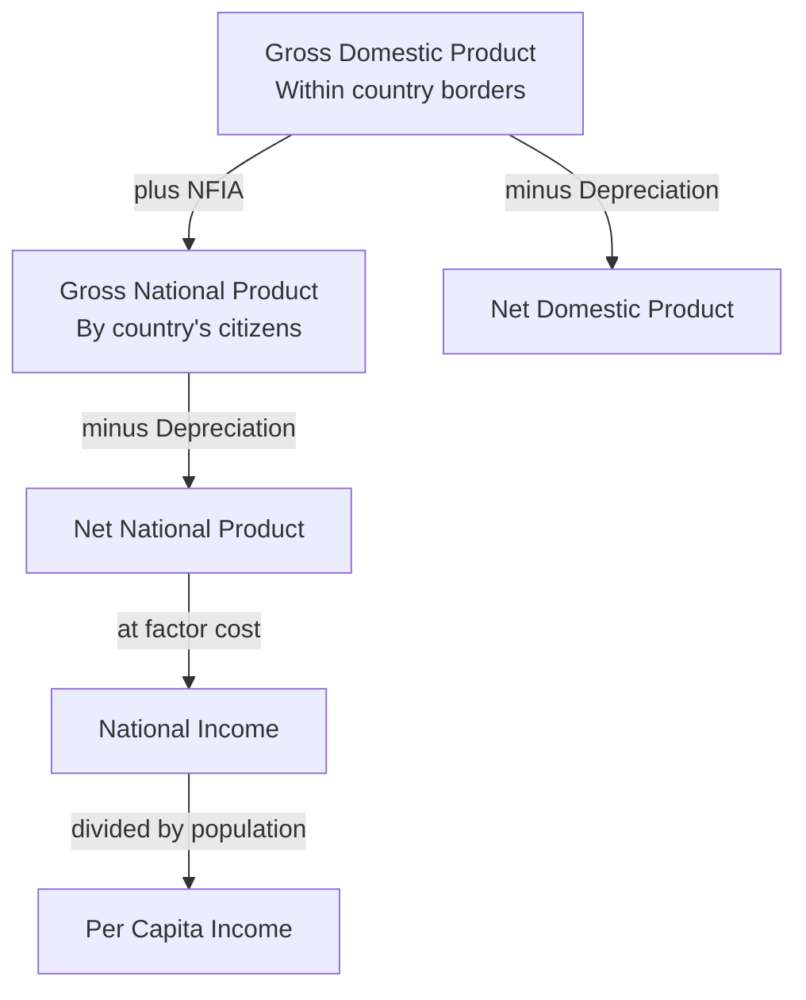
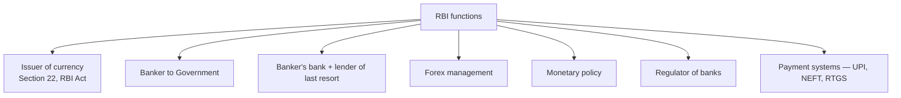
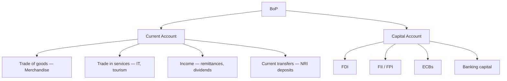

# How To Use This Book

The 15 pedagogy techniques in the Polity book's opening also apply here
(story-first, scaffolding, retrieval practice, memory palaces, Feynman
boxes, etc.). Economics rewards **systemic thinking** — not memorising
numbers, but understanding **how each part fits into the whole**.

Progress is **micro → macro → Indian**:

- **Part A — Basics** — economic systems, sectors, basic concepts.
- **Part B — National Income + Growth** — GDP, NNP, per capita, national-
  income measurement.
- **Part C — Money + Banking** — RBI, banking system, monetary policy,
  inflation.
- **Part D — Fiscal Policy** — Budget, taxation (GST), deficits, FRBM,
  Finance Commissions.
- **Part E — Planning + Development** — 5-year plans → NITI Aayog; poverty,
  unemployment, HDI.
- **Part F — External Sector** — BoP, Forex, WTO, FDI, exchange rates.
- **Part G — India's Sectors + Schemes** — Agriculture, MSMEs, key PM
  schemes.

> Each chapter ends with a **paired quiz bundle** in
> `backend/seeds/static_gk/economics/`. Read → drill → revise.

---

# Part A — Basics

## Chapter 1 — Economic Systems + Sectors

### 1.1 Hook — what is economics?

> **Economics** — the study of how people + societies allocate SCARCE
> resources for UNLIMITED wants. Coined by Lionel Robbins (1932):
> *"the science which studies human behaviour as a relationship between
> ends and scarce means which have alternative uses."*

Three economic questions every society must answer:
1. **What** to produce?
2. **How** to produce?
3. **For whom** to produce?

### 1.2 Economic systems

| System | Example | Decision-maker | Pros | Cons |
|--------|---------|-----------------|------|------|
| **Capitalist / Market** | USA, UK | Private individuals + market | Efficient; innovation | Inequality; externalities |
| **Socialist / Command** | Former USSR, N. Korea | State central planning | Equality; public goods | Inefficient; poor innovation |
| **Mixed** | **India**, France, Sweden | State + market together | Balance | Complex; bureaucratic |

**India** is a **mixed economy** — post-1991 LPG reforms increased market
share but state still crucial in infrastructure, social welfare, defence.

### 1.3 3 sectors (by nature of activity)

- **Primary** — agriculture, fishing, mining, forestry (extracting natural
  resources).
- **Secondary** — manufacturing, industry, construction.
- **Tertiary** — services — IT, banking, health, education, trade, transport.

Modern economies add:
- **Quaternary** — knowledge-based (R&D, IT, finance).
- **Quinary** — highest-level decision-making (CEOs, top government).

**India's GDP composition** (FY 2023–24): **Primary ~17%, Secondary ~27%,
Tertiary ~56%**. But primary employs ~46% of workforce — huge productivity
gap.

### 1.4 3 sectors (by organisation)

- **Organised** — regular contracts, social security, taxation. ~15% of
  workforce.
- **Unorganised / Informal** — no contracts, no social security. ~85% of
  workforce.

### 1.5 3 sectors (by ownership)

- **Public** — govt-owned (ONGC, Indian Railways, SBI, LIC).
- **Private** — privately owned (Reliance, Tata, Infosys).
- **Joint / cooperative** — mixed (Amul, IFFCO, KRIBHCO).

### 1.6 🎯 Exam hooks

- **Lionel Robbins** = Father of modern economics definition (1932).
- India is a **mixed economy**.
- **Quaternary** = knowledge-based sector.
- Primary sector employs 46% workforce but contributes only 17% of GDP.

---

# Part B — National Income + Growth

## Chapter 2 — GDP, GNP, + National Income Concepts

### 2.1 Hook — why we measure this

If you can't measure the economy, you can't manage it. **Simon Kuznets**
(Nobel 1971) developed the modern framework of national income accounting in
the 1930s. India first computed national income under **V.K.R.V. Rao**
(1931, for 1925–29 period); **National Income Committee** under
**P.C. Mahalanobis** (1949) set up proper measurement.

### 2.2 The 4 key concepts

- **GDP** — value of all final goods + services produced **within country's
  borders** in a year.
- **GNP = GDP + NFIA** (Net Factor Income from Abroad) = income earned by
  citizens **anywhere** in the world.
- **NDP = GDP – Depreciation** (consumption of fixed capital).
- **NNP = GNP – Depreciation**.
- **National Income = NNP at factor cost** (i.e., NNP at market prices
  minus indirect taxes plus subsidies).

For India, GNP ≈ GDP because NFIA is small (we receive less factor income
from abroad than we pay).

### 2.3 Real vs Nominal

- **Nominal** = at current-year prices.
- **Real** = at base-year prices (removes inflation).
- **GDP Deflator** = (Nominal GDP / Real GDP) × 100.

Current base year in India = **2011–12**. Next revision due (to 2020–21
likely).

### 2.4 Methods of calculating GDP

1. **Production / Value-Added method** — sum of GVA across sectors.
2. **Income method** — wages + rent + interest + profits.
3. **Expenditure method** — GDP = **C + I + G + (X − M)** — Consumption +
   Investment + Government + Net Exports.

India uses all 3; combined under CSO/NSO (Ministry of Statistics + Programme
Implementation, MoSPI).

### 2.5 Key numbers (FY 2023–24)

- **Nominal GDP**: ~₹295 lakh crore (~$3.6 trillion). **5th largest**.
- **Real GDP growth**: **8.2%** — fastest major economy.
- **Per capita income**: ~$2,700 = ~₹2.3 lakh/year.
- **PPP GDP**: India **3rd largest** (after China + USA) since 2014.
- Projected 3rd largest nominal by **2027–28**.

### 2.6 🎯 Exam hooks

- **Simon Kuznets** — national income accounting (Nobel 1971).
- **V.K.R.V. Rao** — first Indian estimate, 1931.
- India's base year for GDP — **2011–12**.
- **Mahalanobis** Committee, 1949 — official national income measurement.
- GDP methods = **Production, Income, Expenditure**.
- **GDP Deflator** = nominal / real × 100.

---

# Part C — Money + Banking

## Chapter 3 — The Reserve Bank of India (RBI)

### 3.1 Hook — India's central bank

**Founded**: 1 April 1935 under the **RBI Act, 1934**, based on the
recommendations of the **Hilton Young Commission (1926)**.
**Nationalised**: 1 January 1949.
**HQ**: Mumbai (originally Calcutta, moved 1937).

**First Governor**: Sir Osborne Smith (Australian, 1935–37).
**First Indian Governor**: C.D. Deshmukh (1943–49).
**Current Governor**: Sanjay Malhotra (Dec 2024 onwards).

### 3.2 Functions

**Note: ₹1 note** is issued by the **Ministry of Finance** (not RBI); every
other denomination by RBI.

### 3.3 Monetary policy instruments

#### Quantitative tools

- **Repo rate** — rate at which RBI lends to banks against government
  securities (LAF). **Benchmark rate.**
- **Reverse repo** — RBI borrows from banks.
- **Marginal Standing Facility (MSF)** — emergency overnight window, repo
  + 25bps.
- **Bank Rate** — long-term lending rate (nominal; rarely used).
- **CRR (Cash Reserve Ratio)** — % of NDTL banks must keep with RBI in cash
  (no interest). **Currently 4.5%**.
- **SLR (Statutory Liquidity Ratio)** — % banks must keep in Govt securities
  + gold + cash. Earns interest. **Currently 18%**.
- **OMO (Open Market Operations)** — RBI buys/sells G-Secs.
- **MSS (Market Stabilisation Scheme)** — for large capital inflows.

#### Qualitative tools

- Credit rationing, margin requirements, moral suasion, direct action.

### 3.4 Monetary Policy Committee (MPC)

Established **2016 Amendment to RBI Act**. **6 members**: 3 RBI (Governor
chairs, casting vote; Dy Governor; another RBI officer) + **3 external**
appointed by central government. **Meets bi-monthly**.

**Mandate (CPI inflation target)**: **4% ± 2%** (2–6% band) for 5-year
block. Current block: 2021–26.

### 3.5 🎯 Exam hooks

- RBI — **1 Apr 1935**; nationalised **1 Jan 1949**.
- Hilton Young Commission (1926) → RBI.
- **CRR** = Cash with RBI; **SLR** = Securities with bank.
- **MPC** — 6 members, since 2016.
- CPI target: 4% ± 2%.
- **Repo** = benchmark rate.
- First Governor: **Osborne Smith**; First Indian: **C.D. Deshmukh**.

---

## Chapter 4 — Banking in India

### 4.1 History

- **First bank**: **Bank of Hindustan, Calcutta, 1770** (failed 1832).
- **First Indian-owned still operating**: **Punjab National Bank, 1894**
  (by Lala Lajpat Rai + Dyal Singh Majithia).
- **SBI**: formed **1 July 1955** from **Imperial Bank of India** (itself
  created 1921 by merging 3 Presidency banks — Bengal, Bombay, Madras).

### 4.2 Bank nationalisation

- **19 July 1969** — Indira Gandhi nationalised **14 banks** (deposits
  > ₹50 cr).
- **1980** — 6 more nationalised (deposits > ₹200 cr).
- Challenge at SC — **R.C. Cooper case (1970)** — SC quashed on
  compensation grounds; Parliament re-enacted.

### 4.3 PSB mergers 2017–2020

Reduced PSU banks from 27 → **12**:

- SBI absorbed 5 associates + BMB (2017).
- BoB + Vijaya + Dena (2019).
- PNB + OBC + UBI (2020).
- Canara + Syndicate (2020).
- Union + Andhra + Corporation (2020).
- Indian + Allahabad (2020).

Today: 12 PSBs + 21 private + 43 foreign + 12 Small Finance Banks + 6
Payments Banks + 43 RRBs + cooperative banks.

### 4.4 UPI — India's digital payments revolution

- **UPI (Unified Payments Interface)** — launched **11 April 2016** by then-
  Governor **Raghuram Rajan**.
- Operated by **NPCI (National Payments Corporation of India, 2008)**.
- **12 billion+ transactions/month** (2024); **₹20 lakh cr+** monthly value.
- **~50% of global real-time payments** done on UPI.
- Top apps: **PhonePe, Google Pay, Paytm, BHIM**.

Other NPCI products: IMPS (2010), RuPay (2012), NACH, BBPS, AePS, FASTag.

### 4.5 🎯 Exam hooks

- First bank in India = **Bank of Hindustan (1770)**.
- First Indian bank still operating = **PNB (1894)**.
- SBI founded **1 July 1955**.
- **14 banks nationalised 1969**; **6 in 1980**.
- PSBs today = **12**.
- UPI launched **11 Apr 2016**; operated by **NPCI**.
- CRR = 4.5%; SLR = 18%; Repo = 6.50% (as of Apr 2026).

---

## Chapter 5 — Inflation

### 5.1 Types

- **Demand-pull** — too much money chasing too few goods.
- **Cost-push** — rising input costs (oil, wages, raw materials).
- **Structural** — supply bottlenecks, rigidities.
- **Imported** — weaker rupee → costlier imports.
- **Built-in / wage-price spiral**.
- **Headline** = overall CPI. **Core** = CPI excluding food + fuel.

### 5.2 Indices

- **CPI (Consumer Price Index)** — retail prices; base **2012**; weights
  **food 45.86%, fuel 6.84%, housing 10.07%, etc.** Published by NSO.
  RBI targets CPI (from 2016).
- **WPI (Wholesale Price Index)** — wholesale; base 2011–12; no services;
  by DPIIT. More volatile.
- **CPI-IW** — Industrial Workers (Labour Bureau) — used for DA calculation.
- **CPI-AL, CPI-RL** — agri/rural labour.

### 5.3 Stages

- **Creeping** — 2–3% (healthy).
- **Walking** — 3–7%.
- **Running** — 10–20%.
- **Galloping** — 20–100%.
- **Hyperinflation** — >50%/month (Zimbabwe 2008, Weimar 1923).
- **Deflation** — negative inflation (Japan 1990s–2010s).
- **Stagflation** — stagnant growth + high inflation (1970s US).
- **Disinflation** — slowing inflation rate (still positive).

### 5.4 🎯 Exam hooks

- CPI base year — **2012**; WPI base — **2011–12**.
- CPI weights: food **45.86%**.
- RBI targets **CPI** (not WPI) since 2016.
- India FY 23–24 CPI: 5.4%; FY 24–25 projected 4.5%.
- **Hyperinflation**: >50%/month.

---

# Part D — Fiscal Policy

## Chapter 6 — Union Budget

### 6.1 Article 112

**Art 112** = "Annual Financial Statement". Presented by FM in LS on **1
February** (advanced from last-day-of-Feb in 2017). Rail budget merged
with Union Budget from 2017.

**Steps**:
1. 1 Feb — Budget presentation.
2. 2–10 Feb — General discussion.
3. Feb–Mar recess — Standing Committees review Demands.
4. Late Mar – Apr — Voting; Appropriation Bill + Finance Bill.
5. 1 April — new fiscal year begins.

### 6.2 Structure

**Revenue Budget** = Revenue Receipts + Revenue Expenditure.
**Capital Budget** = Capital Receipts + Capital Expenditure.

| Receipts | Expenditure |
|----------|-------------|
| Tax (direct + indirect) | Salaries, interest, subsidies, pensions (revenue) |
| Non-tax (dividends, fees) | Infrastructure, loans, equity (capital) |
| Borrowings | |
| Disinvestment | |

**3 funds**:
1. **Consolidated Fund of India** (Art 266(1)) — all govt revenues +
   borrowings. Parliament's approval needed to spend.
2. **Contingency Fund** (Art 267) — ₹30,000 cr; for unforeseen expenses;
   at President's disposal.
3. **Public Account** (Art 266(2)) — provident funds, savings; govt as
   banker.

### 6.3 Deficits

- **Revenue Deficit** = Revenue Exp – Revenue Receipts.
- **Fiscal Deficit** = Total Exp – (Revenue Receipts + Non-debt Capital
  Receipts). Key indicator.
- **Primary Deficit** = Fiscal Deficit – Interest payments.
- **Effective Revenue Deficit** = RD – Grants for capital assets.

**FRBM Act, 2003** — Fiscal Responsibility + Budget Management Act.
Target: FD ≤ 3%. Missed; currently 4.9% (FY 24–25), aiming 4.5% by FY 25–26.

**Government debt**: Centre's ~58% of GDP; States' ~28%; total ~86%.

### 6.4 🎯 Exam hooks

- Budget Article = **112**; Money Bill = Art 110.
- Presented **1 Feb** (advanced from 2017).
- **FRBM Act 2003**; target FD 3%.
- Contingency Fund = **₹30,000 cr**.
- 3 funds: Consolidated, Contingency, Public Account.

---

## Chapter 7 — Taxation + GST

### 7.1 Direct vs Indirect

- **Direct** — paid directly by taxpayer (income tax, corporate tax,
  securities transaction tax, capital gains). **Progressive**. CBDT
  (Central Board of Direct Taxes).
- **Indirect** — collected via price (GST, customs, excise on petroleum +
  alcohol). **Often regressive**. CBIC (Central Board of Indirect Taxes +
  Customs).

### 7.2 GST — launched **1 July 2017**

**101st Constitutional Amendment, 2016**. "One nation, one tax."

**Components**:
- **CGST** — Central GST (central share).
- **SGST** — State GST (state share; in UTs with legislature: UTGST).
- **IGST** — Integrated GST (inter-state transactions + imports); collected
  by Centre, apportioned to destination state.

**Principle**: **Destination-based** (taxed where consumed, not produced).

**Slabs**: **0%, 5%, 12%, 18%, 28%** + GST Compensation Cess on luxury +
tobacco. **Gold 3%, Rough diamonds 0.25%**.

**Outside GST**: Petroleum (petrol, diesel, ATF, crude, natural gas),
alcohol, electricity duty, stamp duty. State-level revenue for these.

**GST Council** — Art 279A; chaired by FM; all state FMs + 2 Union
Ministers. Decisions by **3/4 majority** (Centre weight 1/3, states 2/3).

**Collections** — crossed ₹2 lakh cr/month first time Apr 2024.

### 7.3 Income Tax

**AY 2024–25 new regime (default)**:
| Slab | Rate |
|------|------|
| 0–3 L | NIL |
| 3–7 L | 5% |
| 7–10 L | 10% |
| 10–12 L | 15% |
| 12–15 L | 20% |
| > 15 L | 30% |

Standard deduction ₹75,000; rebate u/s 87A up to ₹25,000 → effective NIL up
to ₹7 L.

**Old regime** (optional; more deductions): 0-2.5L NIL, 2.5–5 L 5%, 5–10 L
20%, >10 L 30%. Plus 80C (₹1.5 L), 80D, HRA, home loan interest, etc.

**Corporate**:
- Domestic companies — 22% (new regime) or 25% (with deductions); 15% for
  new manufacturing.
- Foreign — 40%.

### 7.4 🎯 Exam hooks

- GST launched **1 Jul 2017**; **101st CAA 2016**.
- 4 slabs: **5, 12, 18, 28**.
- **Destination-based**.
- **GST Council** — Art 279A; 3/4 majority.
- Outside GST: **petroleum + alcohol + stamp duty**.
- CBDT = direct; CBIC = indirect.

---

## Chapter 8 — Finance Commissions

- **Art 280** — Constitutional body; every 5 years.
- Composition: 1 Chair + 4 members.
- Functions: (i) Devolution of taxes between Centre + States
  (vertical + horizontal), (ii) grants-in-aid, (iii) measures for local
  bodies (73rd + 74th CAA).

| FC | Chair | Period | Devolution to States |
|----|-------|--------|-----------------------|
| 1st | K.C. Neogy | 1952–57 | ~10% |
| 10th | K.C. Pant | 1995–2000 | ~29% |
| 13th | Vijay Kelkar | 2010–15 | 32% |
| **14th** | **Y.V. Reddy** | 2015–20 | **42%** (biggest jump) |
| **15th** | **N.K. Singh** | 2020–26 | **41%** |
| 16th | **Arvind Panagariya** (2023–) | 2026–31 | — (TBD) |

**15th FC horizontal formula** (among states):
- Income distance 45% (equity).
- Population 2011 census 15%.
- Area 15%.
- Forest + ecology 10%.
- Demographic performance 12.5% (penalises high fertility).
- Tax effort 2.5%.

### 🎯 Exam hooks

- **Art 280** = FC.
- 14th FC under **Y.V. Reddy** = 42% (record jump).
- 15th FC = 41% under **N.K. Singh** (2020–26).
- 16th FC chair — **Arvind Panagariya** (for 2026–31).

---

# Part E — Planning + Development

## Chapter 9 — Planning: 5-Year Plans → NITI Aayog

### 9.1 Planning Commission (1950–2014)

Set up 15 March 1950 by Cabinet Resolution. Chaired by PM. Not a
constitutional or statutory body.

**12 Five-Year Plans**:

| # | Period | Model | Growth (actual) | Highlights |
|---|--------|-------|-----------------|------------|
| 1st | 1951–56 | Harrod-Domar | 3.6% | Agriculture; Bhakra-Nangal. |
| 2nd | 1956–61 | **Mahalanobis** | 4.1% | Heavy industry; Bhilai, Rourkela, Durgapur steel plants. |
| 3rd | 1961–66 | Self-sustaining | 2.4% | Sino-Indian war + 1965 war + droughts. |
| (Plan Holiday) | 1966–69 | Annual plans | — | Green Revolution begins. |
| 4th | 1969–74 | Garibi Hatao | 3.3% | Bank nationalisation; 1971 war; 1974 nuclear test. |
| 5th | 1974–79 | Emergency era | — | Truncated by Janata Party (1978). |
| Rolling | 1978–80 | Janata | — | — |
| 6th | 1980–85 | IRDP | 5.7% | — |
| 7th | 1985–90 | Productivity + tech | 6.0% | Rajiv Gandhi; telecom; computerisation. |
| Annual | 1990–92 | — | — | 1991 BoP crisis. |
| **8th** | **1992–97** | **LPG reforms** | **6.8%** | Manmohan's reforms implemented. |
| 9th | 1997–2002 | Growth + equity | 5.4% | — |
| 10th | 2002–07 | — | 7.8% | Highest avg before 11th. |
| 11th | 2007–12 | Inclusive growth | 8.1% | Best-ever avg; financial crisis impact. |
| **12th** | **2012–17** | **Faster, more inclusive** | 6.9% | **Last plan**. |

### 9.2 NITI Aayog (1 Jan 2015)

**Replaced Planning Commission**.

Structure:
- **Chairperson**: PM.
- **Vice-Chairman**: currently **Suman K. Bery** (2022–).
- **CEO**: currently **B.V.R. Subrahmanyam** (2023–).
- **Governing Council**: all CMs + UT LGs + PM.
- **Regional Councils**.

Key NITI products:
- **3-Year Action Agenda** (2017–20).
- **7-Year Strategy** (Strategy for New India @ 75).
- **15-Year Vision Document**.
- **SDG India Index** (annual since 2018).
- **Aspirational Districts Programme** (2018, 115 districts).
- **National MPI (Multidimensional Poverty Index)** — 14.96% (2019–21),
  11.28% (2022–23).

### 9.3 🎯 Exam hooks

- Planning Commission set up **1950**, scrapped **1 Jan 2015**.
- NITI = **National Institution for Transforming India**.
- 2nd Plan = **Mahalanobis heavy-industry model**.
- 12th Plan (2012–17) — last plan.
- NITI Aayog is **not** a constitutional or statutory body (Cabinet
  resolution).

---

## Chapter 10 — Poverty + Unemployment + Human Development

### 10.1 Poverty measurement

- **Tendulkar (2009)** — MPCE-based. ₹816 rural + ₹1,000 urban/month
  (2011-12 prices). 21.9% poverty in 2011–12. Still the **official**
  poverty line.
- **Rangarajan (2014)** — wider. 29.5% in 2011–12. Not adopted officially.
- **NITI Aayog MPI (2021+)** — multidimensional (12 indicators, 3 dimensions
  — health, education, standard of living). 14.96% (2019–21). 11.28%
  (2022–23). **13.5 crore lifted out of MPI poverty 2015–21**.

### 10.2 Unemployment measurement

- **PLFS (Periodic Labour Force Survey)** — by NSO since 2017-18; annual
  + quarterly (urban). Replaced NSSO quinquennial.
- **CMIE** (private) — different methodology, often higher rates.

**Key PLFS metrics**:
- **LFPR** (Labour Force Participation Rate) — ~58% (2022–23); low, esp.
  women (~37%).
- **UR** (Unemployment Rate) — 3.2% overall; youth (15–29) ~10%.
- **WPR** (Worker Population Ratio).

### 10.3 HDI + related indices

- **HDI (Human Development Index)** — UNDP annual. India rank **134/193**
  in 2024 HDR (data for 2022). HDI 0.644 — "Medium" category.
- 3 dimensions: Health (life expectancy), Education (mean + expected
  schooling), Income (GNI per capita PPP).
- Created by **Mahbub ul Haq** + **Amartya Sen** (1990 HDR).

### 10.4 🎯 Exam hooks

- Poverty line — **Tendulkar 2009** still official.
- **MPI** by NITI Aayog — 14.96% (2019–21).
- PLFS by **NSO** since 2017–18.
- **HDI** by UNDP; India rank 134/193 (2024).

---

# Part F — External Sector

## Chapter 11 — Balance of Payments + Forex

### 11.1 BoP structure

- India typically has **CAD** (Current Account Deficit) ~1–2% of GDP,
  offset by **capital account surplus**.
- **Trade deficit** large (oil + gold + electronics imports); **services
  surplus** (IT exports) partially offsets.

### 11.2 Forex reserves

**~$700 billion (2024)** — India is **4th largest** holder globally (after
China, Japan, Switzerland). Covers ~10 months of imports — strong cushion.

**Components**: Foreign Currency Assets (~$610B), Gold (~$60B, ~820 tonnes),
SDRs (~$18B), Reserve Tranche in IMF (~$5B).

Managed by RBI.

### 11.3 1991 BoP crisis

Reserves fell to **~$1.2 billion** (2 weeks of imports). **67 tonnes of
gold pledged** to Bank of England + Union Bank of Switzerland (May–Jul
1991) for ~$400M. PM Chandra Shekhar → Narasimha Rao took over June 1991.
**FM Manmohan Singh** (accidental; technocrat) led **LPG reforms** (24 July
1991 Budget speech).

### 11.4 🎯 Exam hooks

- Forex reserves — **~$700B, 4th largest**.
- 1991 crisis — gold pledged; LPG reforms.
- CAD = Current Account Deficit.
- Capital account convertibility — partial (Tarapore Committee).
- Rupee — **managed float** since 1993.

---

## Chapter 12 — WTO + Trade

- **WTO** founded **1 Jan 1995**; HQ Geneva.
- Replaced **GATT (1947)**.
- **164 members**; India founding member.
- **Current DG**: Ngozi Okonjo-Iweala (Nigeria, 2021–).
- Key principles: MFN + National Treatment; non-discrimination.
- **Doha Round (2001+)** — stalled.
- India's key WTO issues: **Public Stockholding** (PSH) for food security,
  fisheries subsidies, digital trade.

---

# Part G — Indian Sectors + Key Schemes

## Chapter 13 — Agriculture

See Geography book Chapter 12 for crop-wise details.

**Key schemes**:
- **MSP** — Minimum Support Price; 23 crops; recommended by **CACP**,
  approved by CCEA.
- **PM-KISAN** (2019) — ₹6,000/yr in 3 instalments.
- **PMFBY** (2016) — crop insurance.
- **eNAM** (2016) — National Agriculture Market.
- **PM-AASHA** — procurement for pulses + oilseeds.

Farm laws 2020 — passed + **repealed Nov 2021** after farmer protests;
SC committee; MSP legal guarantee still demanded.

---

## Chapter 14 — Key Welfare + Financial Inclusion Schemes

| Scheme | Year | What it does |
|--------|------|---------------|
| **PMJDY** (Jan Dhan Yojana) | 2014 | Zero-balance accounts; 53 cr+ opened; RuPay card; ₹2L accident cover. |
| **PMJJBY** | 2015 | Life insurance ₹2L at ₹436/yr. |
| **PMSBY** | 2015 | Accident cover ₹2L at ₹20/yr. |
| **APY** (Atal Pension Yojana) | 2015 | Pension for unorganised sector. |
| **PMMY** (MUDRA) | 2015 | Loans to micro-enterprises — Shishu (≤₹50K), Kishor, Tarun (≤₹10L), Tarun Plus (₹10–20L). |
| **Stand-Up India** | 2016 | ₹10L–₹1 cr to SC/ST/women per bank branch. |
| **PM Svanidhi** | 2020 | Street vendors — ₹10K–₹50K. |
| **PM Vishwakarma** | 2023 | 18 traditional artisan trades; toolkits + loans. |
| **PMAY** | 2015 | Housing for all (rural + urban). |
| **Ayushman Bharat — PMJAY** | 2018 | ₹5L health insurance; 55 cr+ beneficiaries. |
| **PM POSHAN** | 1995 → 2021 | Mid-day meal (cooked); 11.8 cr kids. |
| **Ujjwala** | 2016 | Free LPG. |
| **Jal Jeevan Mission** | 2019 | Piped water to every rural HH; 75%+ done. |
| **Swachh Bharat** | 2014 | Sanitation; ODF India 2019. |
| **Skill India + PMKVY** | 2015 | Skills. |
| **MGNREGA** | 2005 | 100 days' guaranteed wage work rural. |

---

## Chapter 15 — Stock Markets

- **BSE** (Bombay Stock Exchange) — 1875 — Asia's oldest; **Sensex** index
  of 30 stocks.
- **NSE** (National Stock Exchange) — 1992 — largest in India; **Nifty 50**.
- **SEBI** (1988, statutory 1992) — regulator.
- **IPO** = Initial Public Offering.
- **FPI / FII** — Foreign Portfolio / Institutional Investors.
- **T+1 settlement** — since 2023 (India was first to go T+1 for full
  equities).

---

# Appendices

## Appendix A — Mnemonic compendium

- **MVEMJSUN** → planets (shared with Geography).
- **GDP = C + I + G + (X − M)** → expenditure method.
- **Tendulkar / Rangarajan / MPI** → poverty measurement evolution.
- **42% → 41% → ?** → 14th → 15th → 16th FC devolution share.
- **14 then 6** → banks nationalised (1969 + 1980).
- **1991 → July 24** → Manmohan Singh's LPG Budget.
- **5–12–18–28** → GST slabs.
- **PANCHAMRIT** → India's 5 climate pledges from Glasgow COP-26.

## Appendix B — Cheatsheet (1 page)

- **RBI** — 1 Apr 1935; Hilton Young Commission (1926); nationalised 1949.
- **MPC** — 6 members since 2016; CPI target 4%±2%.
- **CRR 4.5%, SLR 18%, Repo 6.50%** (Apr 2026).
- **Bank nationalisation** — 1969 (14), 1980 (6).
- **UPI** — 11 Apr 2016; NPCI; ~12B/month.
- **Budget** — Art 112; 1 Feb; FM presents.
- **FRBM** — 2003; 3% FD target.
- **GST** — 1 Jul 2017; 101st CAA 2016; Council u/ Art 279A.
- **FCs** — Art 280; 14th Y.V. Reddy 42%; 15th N.K. Singh 41%; 16th
  Panagariya.
- **Planning** — Commission 1950–2014; NITI from 1 Jan 2015.
- **LPG** reforms — 1991; PM Narasimha Rao + FM Manmohan Singh.
- **Forex** — ~$700B, 4th largest.
- **India** — **5th largest economy** nominal; 3rd PPP since 2014.
- Poverty — Tendulkar 2009 line; MPI 14.96% → 11.28%.
- **PLFS** — NSO; LFPR ~58%; UR ~3.2%.
- **HDI** — 134/193 (2024); 0.644.

*World economy, WTO in detail, foreign trade deep-dive, capital markets
deep-dive to be added in subsequent revisions of this file.*
