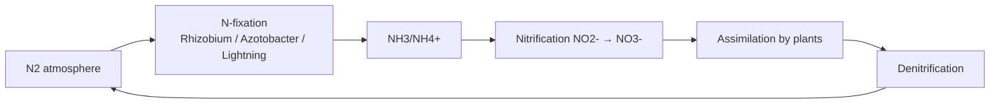
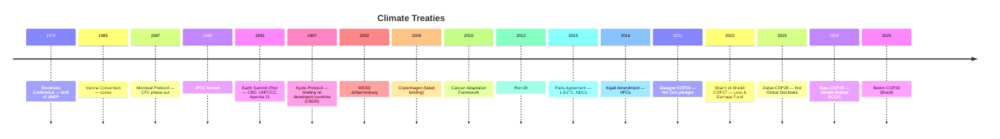
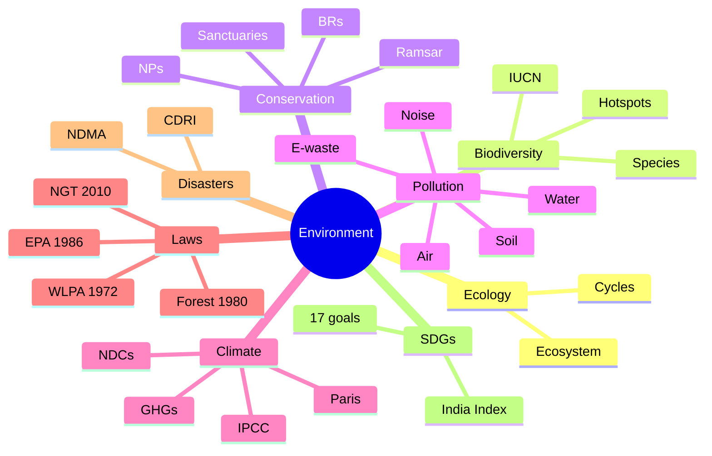

# 📘 How To Use This Book

Refer to `polity.md` for the full 15-technique pedagogy framework. Environment-specific pointers:

- **Environment is a system, not a list.** Every fact maps to one of: Atmosphere • Hydrosphere • Lithosphere • Biosphere • Humans. When you place a fact correctly in the system, it stays in memory.
- **Timeline + budget anchors** work best: Paris 2015, Montreal 1987, Earth Summit 1992 — build a timeline of global conferences first, then hang institutions and targets on it.
- **Interleave** with `geography.md` (climate), `biology.md` (ecosystems, wildlife), `chemistry.md` (pollutants), `sci_tech.md` (green tech).

Paired quiz topic codes: **GK_ENV_CLIMATE, GK_BIODIVERSITY, GK_POLLUTION, GK_CONSERVATION, GK_CLIMATE_TREATIES**.

---

\newpage

# PART A — ECOLOGY FUNDAMENTALS

## Chapter A1 — Ecosystem 101

### 🎬 The Hook

Drop a pond water sample under a microscope: algae photosynthesise, daphnia graze on algae, tiny fish eat daphnia, dragonfly larvae eat fish. Decomposers recycle the dead. A **pond is a complete ecosystem** — just scaled down. Earth is the same story, only bigger.

### 🧱 Structural components

- **Abiotic** — sunlight, temperature, water, air, soil, minerals.
- **Biotic** — producers, consumers, decomposers.

### ⚡ Functional flow

- Sunlight → producers (green plants, phytoplankton).
- Producers → primary consumers (herbivores).
- Primary → secondary (carnivore).
- Secondary → tertiary.
- Dead matter → decomposers (bacteria, fungi) → nutrients recycled.

### 📉 The 10% Rule (Lindeman, 1942)

Only ~10% of energy transfers to the next trophic level. This is **why food chains rarely have more than 4-5 levels** — energy runs out.

### 📐 Ecological Pyramids

- **Pyramid of numbers** — can be inverted (one tree supporting many insects).
- **Pyramid of biomass** — can be inverted (ocean: phytoplankton biomass < zooplankton at any instant).
- **Pyramid of energy** — **always upright** (2nd law of thermodynamics).

### 🎯 Exam hooks

- "10% rule given by?" → **Raymond Lindeman.**
- "Always upright pyramid?" → **Energy.**
- "Chief decomposers?" → **Bacteria and fungi.**

### 📝 Pause + recall

1. Draw a 4-level food chain for a grassland ecosystem.
2. Why does the pyramid of biomass invert in the ocean?
3. Define abiotic vs biotic with 3 examples each.

---

\newpage

## Chapter A2 — Biogeochemical Cycles

### 💧 Water Cycle

Evaporation → condensation → precipitation → infiltration/runoff → back to ocean.
- ~97% of Earth's water is ocean (salt).
- 2% locked in ice/glaciers.
- <1% liquid fresh.

### 💨 Carbon Cycle

CO₂ ↔ photosynthesis ↔ respiration ↔ decomposition ↔ combustion/fossil fuels.
Fossil fuels short-circuit the long-term geological carbon cycle → anthropogenic CO₂ spike.

### 🧬 Nitrogen Cycle

- Atmosphere = 78% N₂, but plants cannot use N₂ directly.
- **Nitrogen fixation** converts N₂ → NH₃ (biologically by **Rhizobium** in legumes, cyanobacteria; abiotically by lightning; industrially by Haber-Bosch).
- **Denitrification** returns N₂ to atmosphere.

### 🌿 Phosphorus Cycle

No gaseous phase. Rock → soil → plants → animals → decomposers → soil/sediments. Slow. Often **limiting nutrient** in ecosystems.

### 🎯 Exam hooks

- "Only cycle without gaseous phase?" → **Phosphorus.**
- "N-fixing bacterium in legume root nodules?" → **Rhizobium.**
- "Industrial N-fixation = ?" → **Haber-Bosch (NH₃).**

---

\newpage

# PART B — BIODIVERSITY

## Chapter B1 — Concept & Levels

- **Species diversity** — variety within taxonomic groups.
- **Genetic diversity** — variation within a species.
- **Ecosystem diversity** — variety of habitats.

### 🌡️ Why biodiversity matters (ES — Ecosystem Services)

- **Provisioning** — food, water, wood, medicine.
- **Regulating** — pollination, climate, flood, disease.
- **Cultural** — recreation, spiritual, aesthetic.
- **Supporting** — nutrient cycling, soil formation.

### 🗺️ Hotspots

36 global biodiversity hotspots (Norman Myers, 1988; expanded). India has **4**:

1. **Western Ghats + Sri Lanka.**
2. **Himalaya** (Indo-Burma boundary to Bhutan).
3. **Indo-Burma.**
4. **Sundaland** (Nicobar Islands part).

A hotspot must have **≥1500 endemic vascular plants** and have lost **≥70% of its primary vegetation**.

### 🌍 Megadiverse countries

17 countries host ~70% of biodiversity. India is one; others include Brazil, Colombia, Indonesia, Mexico, Australia, China, DRC, Ecuador, Madagascar, Malaysia, Papua New Guinea, Peru, Philippines, South Africa, USA, Venezuela.

### 🎯 Exam hooks

- "Global hotspots defined by?" → **Myers (1988); ≥1500 endemic plants, ≥70% loss.**
- "India's 4 hotspots?" → **Himalaya, Indo-Burma, Western Ghats-Sri Lanka, Sundaland (Nicobar).**
- "Megadiverse nations count?" → **17.**

## Chapter B2 — Endemic species & Indian flagships

### 🐅 Flagship/charismatic species

- **Royal Bengal Tiger** — Sundarbans, PAs across India.
- **Asiatic Lion** — Gir (Gujarat). Population ~674 (2020 census).
- **Great Indian Bustard** — Rajasthan (Desert NP).
- **One-horned rhinoceros** — Kaziranga (~2,613 in 2022).
- **Snow Leopard** — Himalayas (Hemis).
- **Red Panda** — Sikkim, Arunachal.
- **Gangetic Dolphin** — national aquatic animal.
- **Indian Elephant** — national heritage animal.
- **Nilgiri Tahr** — Western Ghats.
- **Lion-tailed Macaque** — Western Ghats (Silent Valley).
- **Sangai** — Manipur (Keibul Lamjao NP).
- **Olive Ridley Turtle** — Odisha (Gahirmatha, Rushikulya).
- **Hangul** — Kashmir (Dachigam NP).
- **Cheetah** — reintroduced 2022-23 (Kuno NP, MP; from Namibia & South Africa).

## Chapter B3 — Conservation Status (IUCN)

Red List categories:
**EX** (Extinct) → **EW** (Extinct in Wild) → **CR** (Critically Endangered) → **EN** (Endangered) → **VU** (Vulnerable) → **NT** (Near Threatened) → **LC** (Least Concern) → **DD** (Data Deficient) → **NE** (Not Evaluated).

Mnemonic: **"Every Experienced Conservationist Encourages Very Nature-Loving Decisions"**.

### 🎯 Exam hooks

- "IUCN established?" → **1948.**
- "Red List maintained by?" → **IUCN (International Union for Conservation of Nature).**
- "Great Indian Bustard IUCN?" → **Critically Endangered.**
- "Gangetic Dolphin IUCN?" → **Endangered.**

---

\newpage

# PART C — PROTECTED AREAS & INDIA'S WILDLIFE

## Chapter C1 — Types of Protected Areas (PAs)

Under **Wildlife (Protection) Act 1972**:

1. **National Park** — highest protection; no human activity allowed. **106 NPs** (Apr 2026).
2. **Wildlife Sanctuary** — some regulated activities allowed. **~570.**
3. **Conservation Reserve** — community/state land; buffer.
4. **Community Reserve** — private/community land.

Additionally:

- **Tiger Reserve** — under Project Tiger (NTCA, National Tiger Conservation Authority). **55+** reserves (Apr 2026).
- **Biosphere Reserve** — UNESCO MAB programme. **18 in India, 12 listed by UNESCO.**
- **Elephant Reserve** — under Project Elephant. **33 reserves.**

## Chapter C2 — Key National Parks (state-wise)

| State | Famous NPs |
|-------|-----------|
| Jammu & Kashmir | Dachigam (Hangul), Kishtwar |
| Ladakh | Hemis (largest NP, snow leopard) |
| HP | Great Himalayan (UNESCO), Pin Valley |
| Uttarakhand | Jim Corbett (1st in India, 1936), Nanda Devi, Valley of Flowers, Rajaji |
| UP | Dudhwa |
| Rajasthan | Ranthambore, Sariska, Desert NP, Keoladeo (Ghana) |
| Gujarat | Gir, Marine NP (Gulf of Kutch), Vansda, Blackbuck NP (Velavadar) |
| MP | Kanha, Bandhavgarh, Pench, Satpura, Panna, Madhav, Van Vihar |
| Maharashtra | Tadoba, Pench, Sanjay Gandhi, Navegaon, Gugamal |
| Karnataka | Bandipur, Nagarhole, Anshi, Bannerghatta, Kudremukh |
| Kerala | Periyar, Silent Valley, Eravikulam, Anamudi Shola |
| TN | Mudumalai, Mukurthi, Indira Gandhi (Annamalai), Gulf of Mannar Marine |
| AP | Papikonda, Sri Venkateswara, Rajiv Gandhi NP |
| Telangana | Kasu Brahmananda Reddy, Mrugavani, Mahavir Harina Vanasthali |
| Odisha | Simlipal, Bhitarkanika, Gahirmatha Marine |
| WB | Sundarbans, Buxa, Gorumara, Jaldapara, Singalila, Neora Valley |
| Assam | Kaziranga, Manas, Nameri, Orang, Dibru-Saikhowa |
| Meghalaya | Balpakram, Nokrek |
| Nagaland | Intanki |
| Arunachal | Namdapha, Mouling, Pakke |
| Manipur | Keibul Lamjao (floating NP — Sangai) |
| Mizoram | Murlen, Phawngpui |
| Tripura | Clouded Leopard (Sipahijola) |
| Sikkim | Khangchendzonga (UNESCO, mixed site) |
| A&N | Campbell Bay, Galathea, Mahatma Gandhi Marine, Middle Button, North Button, South Button, Saddle Peak, Mount Harriet, Rani Jhansi Marine |

### 🎯 Exam hooks

- "India's 1st NP?" → **Hailey (1936), now Jim Corbett NP.**
- "Floating NP?" → **Keibul Lamjao (Manipur, Loktak lake).**
- "UNESCO mixed heritage NP (India)?" → **Khangchendzonga (Sikkim).**
- "Only matriarchal tribal area with NP?" → **Nokrek (Meghalaya, Garo Hills).**
- "Largest NP?" → **Hemis (Ladakh).**
- "Tiger reserves count?" → **55+ (NTCA updates).**

## Chapter C3 — Biosphere Reserves (18)

India's 18 BRs, 12 on UNESCO MAB list (marked *):

- **Nilgiri*** (1st, 1986) — TN/Kerala/Karnataka.
- **Nanda Devi*** — Uttarakhand.
- **Nokrek*** — Meghalaya.
- **Gulf of Mannar*** — TN.
- **Sundarbans*** — WB.
- **Manas** — Assam.
- **Similipal*** — Odisha.
- **Pachmarhi*** — MP.
- **Khangchendzonga*** — Sikkim.
- **Agasthyamala*** — Kerala/TN.
- **Great Nicobar*** — Andaman & Nicobar.
- **Achanakmar-Amarkantak*** — MP/Chhattisgarh.
- **Dihang-Dibang** — Arunachal.
- **Dibru-Saikhowa** — Assam.
- **Panna*** — MP (listed 2020).
- **Seshachalam** — AP.
- **Cold Desert** — HP (Lahaul-Spiti).
- **Kachchh** — Gujarat (largest by area).

### 🎯 Exam hooks

- "India's 1st BR?" → **Nilgiri (1986).**
- "Largest BR (India)?" → **Kachchh (Gujarat).**
- "Latest BR added to UNESCO list?" → **Panna (2020).**

## Chapter C4 — Ramsar Sites (Wetlands)

- **Ramsar Convention 1971** (Iran city) — for conservation of wetlands.
- India ratified 1982.
- **85+ Ramsar sites** (Apr 2026), largest among Asian countries.
- 1st: **Chilika (Odisha)** and **Keoladeo (Rajasthan)** in 1981.
- **Largest Ramsar site in India:** Sundarbans Wetland (West Bengal).
- **Recent addition highlights:** Tso Moriri (Ladakh), Wular (J&K), Nawabganj (UP), Pallikaranai (TN), Aghanashini Estuary (Karnataka, 2024).

### 🎯 Exam hooks

- "Ramsar Convention year & place?" → **1971, Ramsar (Iran).**
- "1st Indian Ramsar sites?" → **Chilika & Keoladeo (1982).**
- "Most Ramsar sites in India (state)?" → **Tamil Nadu (14+).**

---

\newpage

# PART D — POLLUTION

## Chapter D1 — Air Pollution

### 🌫️ Primary pollutants (emitted directly)

- **CO, NOₓ, SOₓ, PM, VOCs, NH₃, heavy metals (Pb, Hg, Cd).**

### 🌫️ Secondary pollutants (formed in atmosphere)

- **O₃ (ground-level)** = NOₓ + VOCs + sunlight → smog.
- **PAN (peroxyacetyl nitrate)** — smog component.
- **H₂SO₄, HNO₃** — from SO₂, NOₓ → acid rain.

### 📏 National Ambient Air Quality Standards (NAAQS)

- **AQI scale (CPCB):** Good (0-50), Satisfactory (51-100), Moderate (101-200), Poor (201-300), Very Poor (301-400), Severe (401-500).
- Monitored across PM2.5, PM10, NO₂, SO₂, CO, O₃, NH₃, Pb.

### 🌀 National Clean Air Programme (NCAP) 2019

- Target: reduce PM2.5 and PM10 by **40% by 2026** (originally 20-30% by 2024, revised).
- 131 "non-attainment" cities covered.

### 🌆 Delhi-NCR GRAP

**Graded Response Action Plan** — stepwise restrictions triggered by AQI.

### 🎯 Exam hooks

- "Air Quality Index maintained by?" → **CPCB.**
- "Main component of photochemical smog?" → **Ground-level ozone + PAN.**
- "London smog 1952 cause?" → **SO₂ + coal burning.**

## Chapter D2 — Water Pollution

- **Sources:** domestic sewage, industrial effluents, agricultural runoff, oil spills, thermal discharge, radioactive waste.
- **BOD** higher = more organic load.
- **DO** lower = less oxygen for fish.
- **Eutrophication** — nutrient over-enrichment → algal bloom → O₂ depletion → fish kill.
- **Bioaccumulation** — toxin builds in one organism.
- **Biomagnification** — toxin amplifies along food chain (DDT, Hg).

### 🧪 Disease from water pollution

- **Minamata** — Hg (Japan, 1956).
- **Itai-Itai** — Cd (Japan).
- **Blue baby syndrome** — nitrates.
- **Fluorosis** — fluoride > 1.5 ppm.
- **Arsenicosis** — arsenic (Bengal, Bangladesh).

### 🇮🇳 Ganga Rejuvenation

- **Namami Gange Programme** (2014), Ministry of Jal Shakti, National Mission for Clean Ganga (NMCG).
- Sewage treatment, riverfront development, afforestation, industrial effluent monitoring.

## Chapter D3 — Soil & Noise

### 🧑‍🌾 Soil pollution

- **Fertilisers, pesticides, plastics, heavy metals, e-waste.**
- **Persistent Organic Pollutants (POPs)** — DDT, dioxins. **Stockholm Convention 2001** phases them.

### 🔊 Noise

- Measured in decibels (dB). OSHA: 85 dB threshold; >120 dB painful; permanent hearing damage above prolonged 90 dB.
- **Noise Pollution Rules 2000** — silence zones near schools, hospitals.

## Chapter D4 — Solid Waste & E-Waste

- **MSW** — municipal solid waste; India generates ~170 MT/year.
- **Biomedical waste** — Biomedical Waste Management Rules 2016.
- **E-waste** — E-Waste Management Rules 2022 (Extended Producer Responsibility).
- **Plastic Waste Rules 2016, amended** → 2022 ban on **19 single-use plastic items**.

---

\newpage

# PART E — CLIMATE CHANGE

## Chapter E1 — The Greenhouse Effect

### 🌡️ Natural vs Anthropogenic

- Natural GHG keeps Earth ~15°C instead of −18°C. Good.
- Anthropogenic = enhanced warming from CO₂, CH₄, N₂O, F-gases.

### 🔬 GHGs and GWP (100-year)

| Gas | GWP | Sources |
|-----|-----|---------|
| CO₂ | 1 | Fossil fuels, deforestation, cement |
| CH₄ | 28-36 | Livestock, paddy, landfills, leaks |
| N₂O | 298 | Fertilisers, industry |
| HFCs | 100s-1000s | Refrigerants |
| PFCs | 6000+ | Aluminium smelting |
| SF₆ | 23,500 | Electrical equipment |

### 🌡️ IPCC reports

- **AR6** (2021-23) — unequivocal human attribution; 1.5°C likely breached between 2030-2035 unless drastic cuts.
- Every 0.5°C of warming amplifies heatwaves, heavy rain, drought risk.

## Chapter E2 — Global Treaties Timeline

### 🔑 Paris Agreement Pillars

1. Limit warming to **well below 2°C**, pursue **1.5°C**.
2. **NDCs** (Nationally Determined Contributions) submitted every 5 years.
3. **Global Stocktake** every 5 years.
4. **Climate Finance** — developed nations $100 bn/year target.
5. **Loss & Damage Fund** (operationalised COP28, Dubai).

## Chapter E3 — India's Climate Action

### 🎯 Updated NDCs (2022)

1. Reduce **emissions intensity of GDP by 45%** from 2005 by 2030.
2. Achieve **50% non-fossil installed power capacity** by 2030.
3. Create **additional 2.5-3 billion tonnes CO₂ forest/tree sink** by 2030.
4. **Net-zero by 2070** (Glasgow 2021).

### 🇮🇳 National Action Plan on Climate Change (NAPCC, 2008) — 8 missions

1. **National Solar Mission.**
2. **National Mission for Enhanced Energy Efficiency.**
3. **National Mission on Sustainable Habitat.**
4. **National Water Mission.**
5. **National Mission for Sustaining the Himalayan Ecosystem.**
6. **National Mission for a Green India.**
7. **National Mission for Sustainable Agriculture.**
8. **National Mission on Strategic Knowledge for Climate Change.**

### 🌱 Other key missions

- **International Solar Alliance (ISA, 2015)** — HQ Gurugram.
- **LiFE — Lifestyle for Environment** (2022).
- **Green Hydrogen Mission (2023)** — ₹19,744 cr; 5 MMT green H₂ by 2030.
- **FAME-I & II** — electric mobility.
- **Coalition for Disaster Resilient Infrastructure (CDRI, 2019)** — India-led.

### 🎯 Exam hooks

- "Paris Agreement year?" → **2015.**
- "India's net-zero target?" → **2070 (Glasgow 2021).**
- "NDC non-fossil target?" → **50% by 2030.**
- "NAPCC missions count?" → **8.**
- "ISA HQ?" → **Gurugram.**
- "Loss & Damage Fund operationalised?" → **COP28 Dubai (2023).**

---

\newpage

# PART F — KEY LEGISLATION & INSTITUTIONS

## Chapter F1 — Indian Environmental Laws

| Law | Year | Key purpose |
|-----|------|-------------|
| Wildlife (Protection) Act | 1972 | PA framework, schedules |
| Water (P&CP) Act | 1974 | CPCB + SPCB |
| Forest (Conservation) Act | 1980 | Diversion of forest land needs Central nod |
| Air (P&CP) Act | 1981 | Extends CPCB remit to air |
| **Environment (Protection) Act** | **1986** | Umbrella after Bhopal |
| Public Liability Insurance Act | 1991 | Industrial accident compensation |
| Biological Diversity Act | 2002 | NBA, SBBs, BMCs |
| Scheduled Tribes & Other Traditional Forest Dwellers (Forest Rights) Act | 2006 | Forest rights of STs & OTFDs |
| National Green Tribunal Act | 2010 | NGT (effective & speedy disposal) |
| Compensatory Afforestation Fund (CAF) Act | 2016 | CAMPA fund utilization |

### 🏛️ Key Institutions

- **CPCB** — Central Pollution Control Board (1974).
- **SPCBs** — State Pollution Control Boards.
- **MoEFCC** — Ministry of Environment, Forest & Climate Change.
- **NBA** — National Biodiversity Authority (Chennai).
- **NTCA** — National Tiger Conservation Authority (2005, statutory under WLPA 1972 post-2006 amendment).
- **WII** — Wildlife Institute of India (Dehradun).
- **ZSI** — Zoological Survey of India (Kolkata).
- **BSI** — Botanical Survey of India (Kolkata).
- **FSI** — Forest Survey of India (Dehradun; biennial "India State of Forest Report").
- **NGT** — National Green Tribunal (Delhi + 4 benches).

## Chapter F2 — Wildlife (Protection) Act 1972 — Schedules

Original had 6 schedules; **2022 amendment** restructured to **4 schedules** (plus Appendix for CITES species):

- **Schedule I** — highest protection, hunting penalty up to 7 years + fine.
- **Schedule II** — lower penalty but still protected.
- **Schedule III** — plants protected.
- **Schedule IV** — CITES-listed species.

Key flagship species like tiger, lion, Asiatic elephant, great Indian bustard are in **Schedule I**.

### 🎯 Exam hooks

- "Year of Bhopal Gas Tragedy?" → **2-3 December 1984 (MIC leak at Union Carbide).**
- "Umbrella environmental law?" → **EPA 1986 (Environment Protection Act).**
- "NGT Act year?" → **2010.**
- "India State of Forest Report by?" → **FSI (Forest Survey of India).**
- "Schedules of WLPA after 2022 amendment?" → **4 (down from 6).**

## Chapter F3 — India State of Forest Report 2023 (ISFR)

- Forest + tree cover = **25.17%** of geographical area (target 33% per National Forest Policy 1988).
- Forest cover = 21.76% (~7.16 lakh sq km).
- Largest forest cover (area): **MP > Arunachal > Chhattisgarh > Odisha > Maharashtra.**
- Largest forest cover (% of state): **Mizoram > Lakshadweep > Andaman & Nicobar > Meghalaya > Arunachal.**
- **Mangroves:** 4,992 sq km; Gujarat > WB > A&N.
- **Carbon stock:** 7,285 million tonnes.

### 🎯 Exam hooks

- "National Forest Policy target?" → **33% (1988).**
- "Highest forest area state?" → **Madhya Pradesh.**
- "Highest mangrove state?" → **Gujarat.**
- "ISFR frequency?" → **Every 2 years (FSI).**

---

\newpage

# PART G — DISASTER MANAGEMENT

## Chapter G1 — Disasters in India

- Natural: earthquake, flood, cyclone, drought, landslide, tsunami, cloudburst, heatwave, cold wave.
- Man-made: industrial, fire, stampede, terrorism, biological, nuclear.

### 🌀 Cyclones — naming conventions

- **Arabian Sea + Bay of Bengal** cyclones named by regional panel (13 countries; India contributes names).
- Recent: Tauktae (2021), Yaas (2021), Mocha (2023), Biparjoy (2023), Remal (2024).

### 🌍 Seismic Zones

- India has **4 zones (II to V)** by BIS.
- **Zone V** — highest risk: J&K (Kashmir valley), HP (parts), Uttarakhand (parts), NE states, Kutch region.
- Richter vs Moment Magnitude (modern).

## Chapter G2 — Institutional Framework

- **Disaster Management Act 2005.**
- **NDMA** — National Disaster Management Authority (PM chairs).
- **SDMA, DDMA** — state & district.
- **NDRF** — National Disaster Response Force (2006).
- **NIDM** — National Institute of Disaster Management.
- **CDRI** — Coalition for Disaster Resilient Infrastructure (2019, India-led global initiative).

### 🎯 Exam hooks

- "DM Act year?" → **2005.**
- "NDMA chairman?" → **Prime Minister.**
- "CDRI launched at?" → **UN Climate Action Summit 2019, New York.**

---

\newpage

# PART H — SUSTAINABLE DEVELOPMENT & SCHEMES

## Chapter H1 — SDGs (2015-2030)

**17 Sustainable Development Goals, 169 targets** adopted by UN (2015). Headline ones:

1. No Poverty
2. Zero Hunger
3. Good Health & Well-being
4. Quality Education
5. Gender Equality
6. Clean Water & Sanitation
7. Affordable & Clean Energy
8. Decent Work & Economic Growth
9. Industry, Innovation & Infrastructure
10. Reduced Inequalities
11. Sustainable Cities & Communities
12. Responsible Consumption & Production
13. Climate Action
14. Life Below Water
15. Life on Land
16. Peace, Justice & Strong Institutions
17. Partnerships for the Goals

India's SDG India Index — published by NITI Aayog.

## Chapter H2 — Key Environmental Schemes

- **Namami Gange** (2014).
- **Swachh Bharat Mission** — Urban + Gramin (2014 → SBM 2.0 in 2021).
- **Jal Jeevan Mission** (2019) — FHTC to every rural household by 2024.
- **Atal Bhujal Yojana** — groundwater (CGWB + World Bank).
- **Green India Mission** (NAPCC mission).
- **Compensatory Afforestation (CAMPA).**
- **FAME-II** (EV).
- **PLI — Solar Modules / Batteries.**
- **National Mission on Natural Farming (2023).**

### 🎯 Exam hooks

- "SDG count?" → **17 goals, 169 targets.**
- "SDG India Index published by?" → **NITI Aayog.**
- "SBM 2.0 launched?" → **2021.**
- "Jal Jeevan Mission target?" → **100% rural FHTC (original 2024, extended).**

---

\newpage

# APPENDICES

## Appendix 1 — Global Environmental Days quick

- 2 Feb — World Wetlands Day
- 3 Mar — World Wildlife Day
- 21 Mar — International Day of Forests
- 22 Mar — World Water Day
- 22 Apr — Earth Day
- 22 May — International Day for Biological Diversity
- 5 Jun — World Environment Day (Host-India 2018, 2024 planning)
- 8 Jun — World Oceans Day
- 17 Jun — World Day to Combat Desertification and Drought
- 28 Jul — World Nature Conservation Day
- 16 Sep — World Ozone Day
- 5 Oct — World Wildlife Week (1-7 Oct in India)
- 13 Oct — Int'l Day for Disaster Risk Reduction
- 24 Oct — Int'l Day of Climate Action

## Appendix 2 — Acronyms master

| Acronym | Full form |
|---------|-----------|
| UNFCCC | UN Framework Convention on Climate Change |
| IPCC | Inter-governmental Panel on Climate Change |
| UNEP | UN Environment Programme |
| CBD | Convention on Biological Diversity |
| CITES | Convention on Int'l Trade in Endangered Species |
| CMS | Convention on Migratory Species |
| GEF | Global Environment Facility |
| IUCN | Int'l Union for Conservation of Nature |
| CoP | Conference of the Parties |
| MoP | Meeting of the Parties |
| GCF | Green Climate Fund |
| GBF | Global Biodiversity Framework (Kunming-Montreal 2022) |
| CBDR | Common But Differentiated Responsibilities |
| NDC | Nationally Determined Contribution |
| REDD+ | Reducing Emissions from Deforestation & forest Degradation |
| CPCB / SPCB | Central / State Pollution Control Board |
| MoEFCC | Ministry of Environment, Forest & Climate Change |
| NGT | National Green Tribunal |
| NBA | National Biodiversity Authority |
| NTCA | National Tiger Conservation Authority |
| FSI | Forest Survey of India |
| WII | Wildlife Institute of India |

## Appendix 3 — Global biodiversity milestones

| Year | Event |
|------|-------|
| 1948 | IUCN formed |
| 1961 | WWF formed |
| 1972 | Stockholm Conference; UNEP born |
| 1973 | CITES adopted |
| 1975 | Ramsar enters force |
| 1987 | Brundtland Report ("Our Common Future" — sustainable development concept) |
| 1988 | IPCC formed |
| 1992 | Rio Earth Summit; CBD adopted |
| 2000 | Cartagena Protocol (biosafety) |
| 2002 | Johannesburg WSSD |
| 2010 | Nagoya Protocol (ABS) |
| 2022 | Kunming-Montreal GBF (30x30 target) |

## Appendix 4 — Mind map

---

*For climate physics see `geography.md`. For pollutant chemistry see `chemistry.md`. For eco-species see `biology.md`. Quiz codes under `GK_ENV_*`.*
