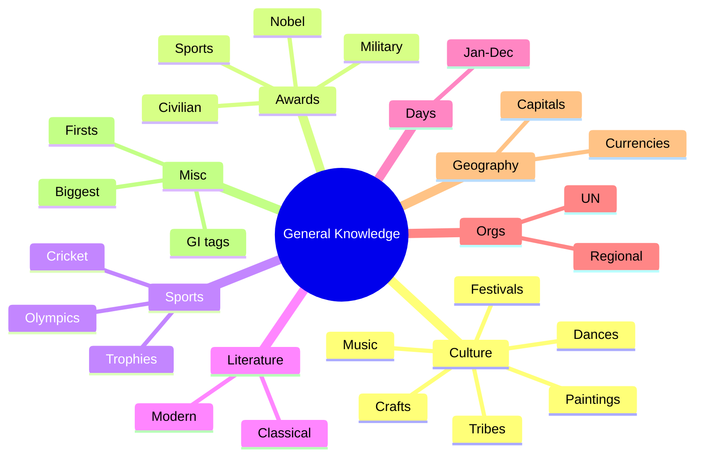

# 📘 How To Use This Book

The 15 pedagogy techniques are explained in `polity.md`. GK-specific pointers:

- **GK is a graveyard of rote.** We beat that by **grouping by category** (awards, dances, sports) and **hanging each fact on a story** so it sticks.
- **Spaced revisits:** revisit this book every **7 days** while preparing.
- **Chunk + retrieve:** work one appendix table at a time; then self-quiz.
- **Exam-favourite niche topics** (folk dances, festivals, NE states, tribes, paintings, martial arts, music) get **extra depth** — that's where examiners love to hide marks.

Paired quiz topic codes: **GK_\***.

---

\newpage

# PART A — INDIAN CULTURE & HERITAGE

## Chapter A1 — Classical Dances of India

Eight recognised classical dances (Sangeet Natak Akademi):

| Dance | State | Key feature | Legendary exponent |
|-------|-------|-------------|---------------------|
| **Bharatanatyam** | Tamil Nadu | Oldest; temple origin; fire dance | Rukmini Devi Arundale, Yamini Krishnamurthy |
| **Kathak** | North India (UP) | Footwork, fast spins; Hindu + Mughal fusion | Birju Maharaj, Sitara Devi |
| **Kathakali** | Kerala | Elaborate masks; male-dominated | Kalamandalam Gopi |
| **Kuchipudi** | Andhra Pradesh | Brass-plate dance; Siddhendra Yogi | Vempati Chinna Satyam |
| **Odissi** | Odisha | Tribhangi posture; Jagannath temple | Kelucharan Mohapatra, Sonal Mansingh |
| **Manipuri** | Manipur | Lai Haraoba; Ras Leela | Guru Bipin Singh |
| **Mohiniyattam** | Kerala | Solo female; slow, graceful | Kalamandalam Kalyanikutty Amma |
| **Sattriya** | Assam | Vaishnavite monasteries; Sankardeva | — |

Mnemonic: **"Bengal Kittens Kick Kidneys Of Mighty Monks, Sarge"** → B(haratanatyam), K(athak), K(athakali), K(uchipudi), O(dissi), M(anipuri), M(ohiniyattam), S(attriya).

## Chapter A2 — Folk Dances (exam favourites)

> **These are gold-dust for examiners.** Know at least two per major state.

| State | Famous folk dances |
|-------|---------------------|
| Punjab | Bhangra (male), Giddha (female) |
| Haryana | Dhamal, Saang |
| Rajasthan | Ghoomar, Kalbelia, Teratali, Chari |
| Gujarat | Garba, Dandiya Raas, Tippani |
| Maharashtra | Lavani, Koli, Dhangari Gaja, Powada |
| Goa | Dekhnni, Fugdi |
| Karnataka | Yakshagana, Dollu Kunitha |
| Kerala | Thiruvathira, Theyyam, Padayani, Ottamthullal |
| Tamil Nadu | Karagattam, Kummi, Kolattam, Mayil attam |
| Andhra Pradesh | Kuchipudi (classical), Burrakatha, Perini |
| Telangana | Perini Sivatandavam, Bonalu |
| Odisha | Chhau (also Jharkhand + WB), Ghumura, Gotipua |
| West Bengal | Chhau (Purulia), Gambhira, Kirtan |
| Bihar | Jat-Jatin, Chhau, Jhumar |
| Jharkhand | Jhumar, Paika, Chhau |
| Chhattisgarh | Panthi, Raut Nacha, Saila |
| Madhya Pradesh | Matki, Tertali, Gangaur |
| Uttar Pradesh | Kathak (classical), Rasleela, Charkula |
| Uttarakhand | Chholiya, Jhora, Chhapeli |
| Himachal | Kinnauri, Namagen, Nati |
| Jammu & Kashmir | Rouf, Hikat, Dumhal, Kud |
| Ladakh | Jabro, Chabs-skyan |
| Assam | Bihu (the famous one), Jhumur |
| Meghalaya | Wangala (Garo), Shad Suk Mynsiem (Khasi) |
| Arunachal Pradesh | Aji Lamu, Chalo, Wancho |
| Nagaland | Chang Lo, Zeliang, Temangnetin |
| Manipur | Thang Ta, Lai Haraoba, Maibi |
| Mizoram | Cheraw (bamboo dance), Khuallam |
| Tripura | Hojagiri, Garia, Lebang Boomani |
| Sikkim | Chu Faat, Singhi Chham (snow lion) |

### 🏠 Memory palace — **"India Tour Bus"**

Start at the bus stand in Punjab (Bhangra music). Move east: Haryana (Dhamal) → Rajasthan (dust storms + Ghoomar) → Gujarat (Garba nights) → Maharashtra (Lavani stage) → Goa (beach Fugdi) → down to Karnataka/Kerala (Yakshagana fire + Theyyam) → TN (Karagattam pot) → up East coast (AP/Telangana/Odisha) → West Bengal/Bihar/Jharkhand (Chhau masks) → Chhattisgarh (Panthi) → MP → UP (Charkula with pots on head) → Himalayas (Nati) → J&K (Rouf) → Ladakh → NE sweep (Bihu → Hojagiri).

### 🎯 Exam hooks

- "Bamboo dance?" → **Cheraw (Mizoram).**
- "Snow lion dance?" → **Singhi Chham (Sikkim).**
- "Tiger dance?" → **Pulikali (Kerala, Onam).**
- "Dance with brass pot on head?" → **Ghoomar/Bhavai (Rajasthan) / Karagattam (TN).**
- "Classical in Assam?" → **Sattriya.**

---

\newpage

## Chapter A3 — Music: Hindustani vs Carnatic

| Feature | Hindustani | Carnatic |
|---------|-----------|----------|
| Region | North India | South India |
| Influences | Persian + Hindu | Purely Hindu (Vedic) |
| Structure | Gharana-driven, freer | Composition-driven, stricter |
| Instruments | Sitar, sarod, tabla, sarangi, santoor | Veena, mridangam, ghatam, violin |
| Vocal forms | Dhrupad, Khayal, Thumri, Tappa | Kriti, Varnam, Tillana |
| Saints | Tansen, Amir Khusrau | Purandara Dasa (father of Carnatic), Tyagaraja, Muthuswami Dikshitar, Syama Sastri (Trinity) |

### 🎼 Schools/Gharanas (Hindustani)

Agra, Gwalior (oldest khyal), Kirana, Patiala, Jaipur-Atrauli, Banaras, Mewati, Bhendi Bazaar.

### 🎯 Exam hooks

- "Trinity of Carnatic music?" → **Tyagaraja, Muthuswami Dikshitar, Syama Sastri.**
- "Father of Carnatic music?" → **Purandara Dasa.**
- "Sitar-tabla combo originator?" → **Amir Khusrau (attributed).**

---

\newpage

## Chapter A4 — Paintings (exam favourite)

| Style | State/Origin | Distinctive features |
|-------|--------------|---------------------|
| **Madhubani / Mithila** | Bihar | Fish, peacocks, deities; natural dyes |
| **Warli** | Maharashtra (tribal) | White stick figures on mud wall |
| **Pattachitra** | Odisha & WB | Cloth/palm-leaf; Jagannath themes |
| **Phad** | Rajasthan | Scrolls narrating folk hero tales (Pabuji) |
| **Pichwai** | Rajasthan (Nathdwara) | Krishna, cows, lotus |
| **Tanjore** | Tamil Nadu | Gold foil, gemstones, Hindu deities |
| **Kalighat** | West Bengal | Colonial Bengal satire |
| **Kangra / Pahari** | HP | Miniatures, soft colours, romantic |
| **Mughal miniature** | North India | Court scenes, fine brushwork |
| **Rajput** | Rajasthan | Heroism, Krishna, music |
| **Kalamkari** | Andhra Pradesh | Hand/block on cotton; Hindu epics |
| **Gond** | Madhya Pradesh | Dots & lines; natural motifs |
| **Cheriyal scroll** | Telangana | Long scroll; Nakashi families |
| **Saura** | Odisha | Tribal; fishermen, rituals |
| **Mysore** | Karnataka | Gesso + gold foil; Hindu gods |
| **Thangka** | Ladakh/Sikkim/Tibetan | Buddhist scroll painting |

## Chapter A5 — Handicrafts / Weaving / GI tags

| Craft | Region |
|-------|--------|
| Pashmina shawl | Kashmir |
| Kani shawl | Kashmir |
| Phulkari | Punjab |
| Chikankari | Lucknow (UP) |
| Zardozi | Lucknow, Hyderabad |
| Banarasi silk | Varanasi |
| Kanjivaram silk | Tamil Nadu |
| Pochampally ikat | Telangana |
| Patola | Gujarat |
| Bandhani (tie-dye) | Gujarat, Rajasthan |
| Bagh / Bagru / Sanganeri prints | MP / Rajasthan |
| Kalamkari | AP |
| Channapatna toys | Karnataka |
| Etikoppaka toys | AP |
| Bidriware | Karnataka (Bidar) |
| Pembarthi metal craft | Telangana |
| Dhokra | Chhattisgarh, WB, Odisha |

### 🎯 Exam hooks

- "Warli originates from?" → **Maharashtra (tribal).**
- "Madhubani?" → **Bihar.**
- "Pattachitra?" → **Odisha (and WB).**
- "Dhokra = ?" → **Lost-wax metal casting; Chhattisgarh/Jharkhand/WB.**

---

\newpage

## Chapter A6 — Martial Arts

| Art | State |
|-----|-------|
| **Kalaripayattu** | Kerala (world's oldest?) |
| **Silambam** | Tamil Nadu (bamboo staff) |
| **Thang-Ta / Huyen Langlon** | Manipur |
| **Gatka** | Punjab (Sikh) |
| **Lathi** | Punjab, Bengal |
| **Mardani Khel** | Maharashtra |
| **Pari-Khanda** | Bihar |
| **Cheibi Gad-ga** | Manipur |
| **Kuttu Varisai** | TN (unarmed) |

### 🎯 Exam hooks

- "Oldest martial art in world?" → **Kalaripayattu (Kerala).**
- "Manipur sword-spear art?" → **Thang-Ta.**

---

\newpage

## Chapter A7 — Festivals (state-linked)

| Festival | State/Region |
|---------|---------------|
| Pongal | Tamil Nadu |
| Onam | Kerala |
| Ugadi | AP/Telangana/Karnataka |
| Vishu | Kerala |
| Bihu (3 types) | Assam |
| Pohela Boishakh | Bengal |
| Baisakhi | Punjab |
| Lohri | Punjab |
| Pola | Maharashtra (bull) |
| Gudi Padwa | Maharashtra |
| Chhath | Bihar/UP/Jharkhand |
| Hornbill | Nagaland |
| Losar | Ladakh/Sikkim/Tibetan |
| Hemis | Ladakh |
| Saga Dawa | Sikkim |
| Bathukamma | Telangana |
| Makar Sankranti / Magh Bihu | Pan-India (Jan 14) |
| Kumbh Mela | Prayagraj, Haridwar, Nashik, Ujjain (4 sites) |
| Rann Utsav | Gujarat |
| Teej | Rajasthan/Haryana/UP |
| Wangala | Meghalaya (Garo) |
| Shad Suk Mynsiem | Meghalaya (Khasi) |
| Solung | Arunachal (Adi) |
| Nyokum | Arunachal (Nyishi) |
| Chapchar Kut | Mizoram |
| Ziro Music Fest | Arunachal |
| Sangai | Manipur |

### 🎯 Exam hooks

- "Hornbill festival?" → **Nagaland, Dec.**
- "Rann Utsav?" → **Kutch, Gujarat.**
- "Sangai Festival?" → **Manipur (brow-antlered deer theme).**

---

\newpage

## Chapter A8 — Tribes (by state/cluster)

| State | Major tribes |
|-------|--------------|
| Andhra / Telangana | Gond, Chenchu, Koya, Savara |
| Odisha | Santhal, Bonda, Juang, Koya, Saora |
| Jharkhand | Santhal, Munda, Oraon, Ho, Bhumij, Birhor |
| Chhattisgarh | Gond, Halba, Maria, Muria, Baiga |
| MP | Bhil, Gond, Baiga, Sahariya, Bharia |
| Maharashtra | Warli, Gond, Bhil, Katkari |
| Rajasthan | Bhil, Meena, Garasia, Sahariya |
| Gujarat | Bhil, Dhodia, Siddi |
| Kerala | Kurumba, Paniya, Kurichiya, Irula, Kadar |
| TN | Toda, Kota, Irula, Kurumba, Badaga |
| Karnataka | Soliga, Yerava, Koraga, Gowdalu |
| Arunachal | Nyishi, Adi, Apatani, Mishmi, Monpa, Galo |
| Nagaland | Naga tribes (Ao, Angami, Sema, Konyak, etc.) |
| Meghalaya | Khasi, Jaintia, Garo |
| Manipur | Meitei (majority), Nagas, Kukis |
| Mizoram | Mizo, Lushai |
| Tripura | Tripuri, Reang, Chakma |
| Assam | Bodo, Mishing, Karbi, Rabha, Tiwa |
| Sikkim | Lepcha, Bhutia, Nepali |
| Uttarakhand | Jaunsari, Bhotia, Tharu, Raji, Buksa |
| HP | Gaddi, Gujjar, Pangwala, Lahaula, Kinnauri |
| J&K / Ladakh | Gujjar-Bakarwal, Balti, Brokpa, Changpa |
| Andaman & Nicobar | Jarawa, Onge, Sentinelese, Shompen, Great Andamanese, Nicobarese |

### 🎯 Exam hooks

- "Sentinelese are in?" → **North Sentinel Island (A&N); voluntarily isolated.**
- "Apatani known for?" → **Ziro valley; wet-rice+fish culture, facial markings (historic).**
- "Toda tribe found in?" → **Nilgiris, TN.**
- "PVTGs count?" → **75 (Particularly Vulnerable Tribal Groups).**

---

\newpage

# PART B — AWARDS AND HONOURS

## Chapter B1 — Indian Civilian Awards (hierarchy)

1. **Bharat Ratna** (since 1954) — highest civilian; max 3/year.
2. **Padma Vibhushan** — exceptional & distinguished service.
3. **Padma Bhushan** — distinguished service of high order.
4. **Padma Shri** — distinguished service.

- 1st Bharat Ratna: **C. Rajagopalachari, S. Radhakrishnan, C.V. Raman (1954).**
- 1st posthumous: **Lal Bahadur Shastri (1966).**
- Youngest: **Sachin Tendulkar (40, 2014).**
- Non-Indian recipients: **Khan Abdul Ghaffar Khan (1987)** and **Nelson Mandela (1990).**
- Naturalised: **Mother Teresa (1980).**
- **2024 recipients:** Karpoori Thakur, L.K. Advani, P.V. Narasimha Rao, Chaudhary Charan Singh, M.S. Swaminathan.

## Chapter B2 — Gallantry Awards (peacetime)

- **Param Vir Chakra** (wartime, highest military — 21 awardees; first Major Somnath Sharma, 1947).
- **Maha Vir Chakra** (wartime, 2nd).
- **Vir Chakra** (wartime, 3rd).
- **Ashoka Chakra** (peacetime, highest).
- **Kirti Chakra** (peacetime, 2nd).
- **Shaurya Chakra** (peacetime, 3rd).

## Chapter B3 — Sports Awards

- **Major Dhyan Chand Khel Ratna** (highest; earlier Rajiv Gandhi Khel Ratna; renamed 2021).
- **Arjuna Award** — outstanding performance over 4 years.
- **Dronacharya Award** — coaches.
- **Dhyan Chand Award** — lifetime (athletes).
- **Rashtriya Khel Protsahan Puraskar** — promoting sports.

## Chapter B4 — Literature & Cinema

- **Jnanpith Award** — highest literary (since 1965). 22 recognised Indian languages.
  - 1st recipient: **G. Sankara Kurup (Malayalam, 1965).**
  - 1st woman: **Ashapurna Devi (Bengali, 1976).**
- **Sahitya Akademi** — works in 24 languages.
- **Dadasaheb Phalke Award** — cinema lifetime. 1st: **Devika Rani (1969).**
- **National Film Awards** — annual.

## Chapter B5 — International

- **Nobel Prizes to Indians/Indian-origin:**
  - **Rabindranath Tagore** (Literature, 1913).
  - **C.V. Raman** (Physics, 1930).
  - **Hargobind Khorana** (Medicine, 1968).
  - **Mother Teresa** (Peace, 1979).
  - **Subrahmanyan Chandrasekhar** (Physics, 1983).
  - **Amartya Sen** (Economics, 1998).
  - **V. Ramakrishnan** (Chemistry, 2009).
  - **Kailash Satyarthi** (Peace, 2014).
  - **Abhijit Banerjee** (Economics, 2019).

- **Magsaysay Awards** — "Asian Nobel." 1st Indian: **Vinoba Bhave (1958).**
- **Bharat Ratna vs Nobel:** the only Indian with both for separate causes = **Mother Teresa (Nobel Peace 1979, Bharat Ratna 1980).**

### 🎯 Exam hooks

- "Bharat Ratna — max per year?" → **3.**
- "PVC awardees so far?" → **21 (as of Apr 2026).**
- "Khel Ratna renamed to?" → **Major Dhyan Chand, 2021.**
- "Nobel in Economics Indian?" → **Amartya Sen (1998), Abhijit Banerjee (2019).**

---

\newpage

# PART C — SPORTS

## Chapter C1 — Olympics

- **First modern Olympics**: Athens, 1896.
- **Olympic rings colours**: Blue, Yellow, Black, Green, Red (on white) — represent 5 continents.
- **Motto**: Citius, Altius, Fortius, Communiter ("Faster, Higher, Stronger, Together" — added 2021).
- **Headquarters**: Lausanne, Switzerland.
- **2024 Paris** / **2028 LA** / **2032 Brisbane** / **2036 ?**
- **Winter Olympics separately since 1924.**

### 🇮🇳 India at Olympics

- **1st Individual Olympic gold**: **Abhinav Bindra** (10m air rifle, Beijing 2008).
- **1st Athletics Olympic gold**: **Neeraj Chopra** (javelin, Tokyo 2020 → held 2021).
- **Hockey golds**: 8 (1928-1980).
- **Paris 2024 haul**: 1 silver (Neeraj Chopra) + 5 bronze; total 6 medals.

## Chapter C2 — Cricket (ICC-level)

- **ICC HQ**: Dubai, UAE.
- **World Cup winners**: WI (1975, 1979), India (1983, 2011), Australia (1987, 1999, 2003, 2007, 2015, 2023), Pakistan (1992), Sri Lanka (1996), England (2019).
- **T20 World Cup winners**: India (2007, 2024), Pak (2009), Eng (2010, 2022), WI (2012, 2016), SL (2014), Aus (2021).
- **India's last WC win**: **ODI 2011** (first host nation to win on home soil).
- **T20 2024 win**: Barbados, India beat South Africa.
- **India's 1st Test**: 1932 (Lord's, vs England, lost).
- **India's 1st Test win**: 1952 (vs England, Madras).
- **IPL** started 2008.

## Chapter C3 — Key Cups / Trophies by Sport

| Sport | Trophy |
|-------|--------|
| Football (World) | FIFA World Cup |
| Football (club Europe) | UEFA Champions League |
| Football (India) | Durand Cup (oldest Asia, 1888), Santosh Trophy, Federation Cup |
| Hockey (World) | FIH World Cup |
| Hockey (India) | Rangaswamy Cup, Beighton Cup, Agha Khan Cup |
| Cricket (India domestic) | Ranji Trophy, Duleep Trophy, Irani Trophy, Vijay Hazare, Deodhar |
| Golf | Ryder Cup, Masters, US Open |
| Tennis Grand Slams | Aus Open, French Open, Wimbledon, US Open |
| Davis Cup | Men's tennis teams |
| Thomas Cup | Men's badminton teams |
| Uber Cup | Women's badminton teams |
| Sudirman Cup | Mixed badminton teams |
| Swaythling Cup | Men's TT teams |

### 🎯 Exam hooks

- "India's first World Cup (ODI)?" → **1983, Lord's, captain Kapil Dev.**
- "Ryder Cup?" → **Golf (USA vs Europe).**
- "Thomas Cup first Indian win?" → **2022 (Bangkok).**
- "Oldest football cup in Asia?" → **Durand Cup, 1888.**

---

\newpage

# PART D — BOOKS AND AUTHORS

## Chapter D1 — Key historical / modern

| Book | Author |
|------|--------|
| Arthashastra | Kautilya/Chanakya |
| Mudrarakshasa | Vishakhadatta |
| Mrichhakatika | Shudraka |
| Indica | Megasthenes |
| Kural (Tirukkural) | Thiruvalluvar |
| Silappadikaram | Ilango Adigal |
| Manimekalai | Sittalai Sattanar |
| Rajatarangini | Kalhana |
| Geet Govind | Jayadeva |
| Prithviraj Raso | Chand Bardai |
| Ain-i-Akbari, Akbarnama | Abul Fazl |
| Tuzuk-i-Babri | Babur |
| Baburnama | Babur |
| Humayun-nama | Gulbadan Begum |
| Tuzuk-i-Jahangiri | Jahangir |
| Padmavat | Malik Muhammad Jayasi |
| Gitanjali | Tagore |
| Discovery of India | Nehru |
| My Experiments with Truth | Gandhi |
| India Wins Freedom | Maulana Azad |
| Poverty & Un-British Rule | Dadabhai Naoroji |
| Unhappy India | Lala Lajpat Rai |
| Anandmath | Bankim Chandra |
| Devdas / Parineeta | Sarat Chandra |
| Godan, Gaban | Premchand |
| Malgudi Days, The Guide | R.K. Narayan |
| Train to Pakistan | Khushwant Singh |
| God of Small Things | Arundhati Roy |
| Midnight's Children, Satanic Verses | Salman Rushdie |
| White Tiger | Aravind Adiga |
| Inheritance of Loss | Kiran Desai |
| Sea of Poppies (Ibis trilogy) | Amitav Ghosh |
| A Suitable Boy | Vikram Seth |
| Interpreter of Maladies, Namesake | Jhumpa Lahiri |
| The Hungry Tide | Amitav Ghosh |
| A Passage to India | E.M. Forster |

### 🎯 Exam hooks

- "Arthashastra?" → **Kautilya.**
- "Rajatarangini?" → **Kalhana, history of Kashmir.**
- "Who wrote Baburnama in Turkish?" → **Babur.**
- "Nobel for Gitanjali?" → **Tagore, 1913.**

---

\newpage

# PART E — IMPORTANT DAYS (chronological)

### January

- 1 — Army Day (15), DRDO (1), World Day of Peace (1), Global Family Day
- 9 — Pravasi Bharatiya Divas
- 10 — World Hindi Day
- 12 — National Youth Day (Vivekananda)
- 15 — Army Day
- 24 — National Girl Child Day
- 25 — National Voters' Day
- 26 — Republic Day / International Customs Day
- 30 — Martyrs' Day (Gandhi)

### February

- 2 — World Wetlands Day
- 4 — World Cancer Day
- 13 — World Radio Day
- 14 — Valentine's Day / V.D. Savarkar Jayanti
- 20 — World Day of Social Justice
- 21 — International Mother Language Day
- 28 — National Science Day (Raman Effect)

### March

- 3 — World Wildlife Day
- 8 — International Women's Day
- 15 — World Consumer Rights Day
- 20 — International Day of Happiness
- 21 — World Forestry Day, Int'l Day for Elimination of Racial Discrimination
- 22 — World Water Day
- 23 — Shaheed Diwas (Bhagat Singh)
- 24 — World TB Day
- 27 — World Theatre Day

### April

- 2 — World Autism Awareness Day
- 5 — National Maritime Day
- 7 — World Health Day
- 10 — World Homoeopathy Day
- 11 — National Safe Motherhood Day
- 14 — Ambedkar Jayanti
- 18 — World Heritage Day
- 21 — National Civil Services Day
- 22 — Earth Day
- 23 — World Book & Copyright Day
- 24 — National Panchayati Raj Day
- 25 — World Malaria Day

### May

- 1 — Int'l Labour Day
- 3 — World Press Freedom Day
- 8 — World Red Cross Day (Dunant birth)
- 11 — National Technology Day (Pokhran-II)
- 12 — Int'l Nurses Day (Nightingale)
- 15 — Int'l Day of Families
- 17 — World Telecom Day
- 18 — Int'l Museum Day
- 22 — Int'l Day for Biological Diversity
- 31 — World No Tobacco Day

### June

- 1 — World Milk Day
- 5 — World Environment Day
- 8 — World Oceans Day
- 12 — World Day Against Child Labour
- 14 — World Blood Donor Day
- 20 — World Refugee Day
- 21 — Int'l Yoga Day, Father's Day
- 23 — Int'l Olympic Day
- 26 — Int'l Day Against Drug Abuse

### July

- 1 — National Doctors Day (B.C. Roy)
- 11 — World Population Day
- 18 — Nelson Mandela Int'l Day
- 28 — World Hepatitis Day

### August

- 6 — Hiroshima Day
- 9 — Nagasaki Day, Quit India Day
- 12 — Int'l Youth Day
- 15 — Independence Day
- 19 — World Humanitarian Day, World Photography Day
- 23 — National Space Day (Chandrayaan-3)
- 29 — National Sports Day (Dhyan Chand)

### September

- 5 — Teachers' Day (Radhakrishnan)
- 8 — Int'l Literacy Day
- 14 — Hindi Divas
- 15 — Engineer's Day (Visvesvaraya)
- 16 — World Ozone Day
- 21 — Int'l Day of Peace
- 27 — World Tourism Day
- 29 — World Heart Day

### October

- 1 — Int'l Day of Older Persons
- 2 — Gandhi Jayanti / Int'l Day of Non-Violence / Shastri Jayanti
- 5 — World Teachers Day
- 8 — Indian Air Force Day
- 9 — World Post Day
- 10 — World Mental Health Day
- 14 — World Standards Day
- 16 — World Food Day
- 17 — Int'l Day for the Eradication of Poverty
- 24 — United Nations Day
- 31 — Rashtriya Ekta Diwas (Sardar Patel), World Savings Day

### November

- 7 — Infant Protection Day, Nat'l Cancer Awareness Day
- 11 — National Education Day (Maulana Azad)
- 14 — Children's Day (Nehru), Diabetes Day
- 19 — Int'l Toilet Day
- 20 — Universal Children's Day
- 21 — World TV Day, World Fisheries Day
- 25 — Int'l Day for Elimination of Violence Against Women
- 26 — Constitution Day / Law Day
- 29 — Int'l Day of Solidarity with Palestinian People

### December

- 1 — World AIDS Day
- 2 — Bhopal Gas Tragedy (1984)
- 3 — Int'l Day of Persons with Disabilities
- 4 — Indian Navy Day
- 7 — Armed Forces Flag Day
- 10 — Human Rights Day
- 11 — UNICEF Day
- 14 — National Energy Conservation Day
- 16 — Vijay Diwas (1971 war)
- 22 — National Mathematics Day (Ramanujan)
- 23 — Kisan Diwas (Chaudhary Charan Singh)
- 25 — Good Governance Day (Vajpayee)

### 🎯 Exam hooks

- "National Science Day commemorates?" → **Raman Effect (28 Feb 1928).**
- "Yoga Day?" → **21 June.**
- "Constitution Day?" → **26 November.**
- "National Technology Day?" → **11 May (Pokhran-II).**
- "Space Day?" → **23 August (Chandrayaan-3).**

---

\newpage

# PART F — INSTITUTIONS & ORGANISATIONS

## Chapter F1 — UN Bodies (HQ + focus)

| Body | HQ | Focus |
|------|----|-------|
| UN | New York | Umbrella |
| UNESCO | Paris | Education, culture, science |
| UNICEF | New York | Children |
| WHO | Geneva | Health |
| ILO | Geneva | Labour |
| FAO | Rome | Food, agriculture |
| IMF | Washington DC | Monetary |
| World Bank | Washington DC | Development |
| WTO | Geneva | Trade |
| IAEA | Vienna | Atomic energy |
| UNEP | Nairobi | Environment |
| UNDP | New York | Development programme |
| IMO | London | Maritime |
| ICAO | Montreal | Aviation |
| UPU | Bern | Postal |
| ITU | Geneva | Telecom |
| WMO | Geneva | Meteorology |
| WIPO | Geneva | Intellectual Property |

## Chapter F2 — Non-UN & Regional

| Body | HQ | Role |
|------|----|------|
| Commonwealth | London | 56 members |
| NATO | Brussels | Military alliance |
| OPEC | Vienna | Oil cartel (13 members) |
| ASEAN | Jakarta | SE Asia |
| SAARC | Kathmandu | South Asia (8) |
| BIMSTEC | Dhaka | Bay of Bengal (7) |
| SCO | Beijing | Shanghai Coop Org (India joined 2017) |
| BRICS | — | Brazil/Russia/India/China/S.Africa + expanded 2024 |
| G7 | rotating | 7 industrialised nations |
| G20 | rotating | 20 major economies |
| QUAD | — | US, India, Japan, Australia |
| AU | Addis Ababa | African Union |
| EU | Brussels | European Union |
| OECD | Paris | Developed economies |
| Interpol | Lyon | Police |
| ICJ | Hague | Int'l Court of Justice |
| ICC | Hague | Criminal Court |
| PCA | Hague | Permanent Court of Arbitration |
| Int'l Olympic Cmte | Lausanne | Olympics |
| Red Cross | Geneva | Humanitarian |

### 🎯 Exam hooks

- "OPEC HQ?" → **Vienna, Austria.**
- "NATO members?" → **32 (as of 2026, Finland and Sweden joined recently).**
- "G20 2023 host?" → **India (New Delhi Declaration).**
- "SAARC created?" → **1985, Dhaka.**
- "BRICS expanded 2024 — new members?" → **Egypt, UAE, Iran, Ethiopia (Argentina & Saudi Arabia invited; status varies).**

---

\newpage

# PART G — COUNTRIES AND CAPITALS (select)

## World's unusual/boundary capitals

| Country | Capital |
|---------|---------|
| USA | Washington D.C. |
| UK | London |
| Canada | Ottawa |
| Australia | Canberra |
| Brazil | Brasília |
| Russia | Moscow |
| China | Beijing |
| Japan | Tokyo |
| Nepal | Kathmandu |
| Bhutan | Thimphu |
| Sri Lanka | Sri Jayawardenepura Kotte (admin) / Colombo (commercial) |
| Myanmar | Naypyidaw |
| Bangladesh | Dhaka |
| Pakistan | Islamabad |
| Afghanistan | Kabul |
| Maldives | Malé |
| Iran | Tehran |
| Saudi Arabia | Riyadh |
| UAE | Abu Dhabi |
| Israel | Jerusalem (declared) / Tel Aviv (de facto) |
| Turkey | Ankara |
| Egypt | Cairo (new admin capital "New Administrative Capital") |
| South Africa | 3 capitals — Pretoria (exec), Cape Town (legislative), Bloemfontein (judicial) |
| Nigeria | Abuja |
| Indonesia | Jakarta → Nusantara (planned shift) |
| Philippines | Manila |
| Thailand | Bangkok |
| Vietnam | Hanoi |
| Malaysia | Kuala Lumpur (official), Putrajaya (admin) |
| Singapore | Singapore |
| Switzerland | Bern |
| Germany | Berlin |
| France | Paris |
| Italy | Rome |
| Spain | Madrid |
| Greece | Athens |
| Portugal | Lisbon |
| Sweden | Stockholm |
| Norway | Oslo |
| Denmark | Copenhagen |
| Finland | Helsinki |
| Netherlands | Amsterdam (Hague = govt seat) |
| Belgium | Brussels |
| Ireland | Dublin |
| Iceland | Reykjavik |
| Mexico | Mexico City |
| Argentina | Buenos Aires |
| Chile | Santiago |
| Peru | Lima |
| Venezuela | Caracas |
| Colombia | Bogotá |
| Kenya | Nairobi |
| Ethiopia | Addis Ababa |
| South Sudan | Juba |
| New Zealand | Wellington |

### 🎯 Exam hooks

- "South Africa has how many capitals?" → **3.**
- "Sri Lanka admin capital?" → **Sri Jayawardenepura Kotte.**
- "Myanmar capital?" → **Naypyidaw.**
- "Indonesia's new capital?" → **Nusantara.**

---

\newpage

# PART H — MISCELLANEOUS NUGGETS

## Chapter H1 — "Firsts" (Indian women)

- First woman PM: **Indira Gandhi (1966).**
- First woman President: **Pratibha Patil (2007).**
- First woman CM: **Sucheta Kripalani (UP, 1963).**
- First woman Governor: **Sarojini Naidu (UP, 1947).**
- First woman Judge (SC): **Fathima Beevi (1989).**
- First woman CJI: **(still pending as of 2026).**
- First woman IPS: **Kiran Bedi (1972).**
- First woman IAS: **Anna Rajam Malhotra (1951).**
- First woman to climb Everest: **Bachendri Pal (1984).**
- First woman in space (Indian-origin): **Kalpana Chawla (1997).**
- First woman in space (of Indian nationality, IAF): **Rakesh Sharma was male; woman-Indian-flag in space is still pending Gaganyaan.**
- First woman to cross English Channel: **Aarti Saha (1959).**
- First woman Olympic medalist: **Karnam Malleswari (Bronze, 2000).**
- First woman Individual Olympic Silver: **P.V. Sindhu (2016).**
- First Indian-origin VP of USA: **Kamala Harris (2021).**

## Chapter H2 — Global firsts (quick)

- First man in space: **Yuri Gagarin (USSR, 1961).**
- First woman in space: **Valentina Tereshkova (USSR, 1963).**
- First man on Moon: **Neil Armstrong (Apollo 11, 1969).**
- First Indian in space: **Rakesh Sharma (Soyuz T-11, 1984).**
- First Indian-origin woman in space: **Kalpana Chawla (1997).**
- First Nobel Prize: **1901 (Röntgen, physics).**
- First university: **Nalanda (5th century CE) / Takshashila (earlier).**

## Chapter H3 — "Biggest / Longest / Highest"

- Highest peak (world): **Everest 8,849 m.**
- Highest peak (India): **Kangchenjunga (3rd in world, 8,586 m) — Sikkim.**
- Highest peak entirely in India: **Nanda Devi (Uttarakhand, 7,816 m).**
- Longest river (world): **Nile 6,650 km** (debated with Amazon).
- Longest river (India, in India): **Ganga (~2,525 km).**
- Longest river flowing through India: **Brahmaputra (2,900 km total).**
- Largest lake (world, freshwater): **Caspian — saline; by freshwater Superior.**
- Largest desert: **Antarctica (cold); Sahara (hot).**
- Deepest ocean point: **Mariana Trench (Challenger Deep), ~11 km.**
- Tallest statue (world): **Statue of Unity, Gujarat, 182 m (Sardar Patel, 2018).**
- Tallest building (world): **Burj Khalifa, Dubai, 828 m.**
- Longest bridge (India): **Bhupen Hazarika Setu (Dhola-Sadiya, Assam, 9.15 km).**
- Highest rail bridge: **Chenab Rail Bridge, J&K (359 m above river).**
- Largest stadium (cricket, world): **Narendra Modi Stadium, Ahmedabad (1.32 lakh).**

### 🎯 Exam hooks

- "Highest peak entirely in India?" → **Nanda Devi.**
- "Tallest statue in world?" → **Statue of Unity (Gujarat).**
- "Highest rail bridge in India?" → **Chenab Bridge.**

---

\newpage

# APPENDICES

## Appendix 1 — Newspapers/Founders (freedom-era)

| Paper | Founder | Year |
|-------|---------|------|
| Bengal Gazette | James Augustus Hickey | 1780 (first English newspaper) |
| Samvad Kaumudi | Raja Ram Mohan Roy | 1821 |
| Mirat-ul-Akhbar | Raja Ram Mohan Roy | 1822 |
| Indian Mirror | Devendranath Tagore & Manmohan Ghose | 1861 |
| Amrita Bazar Patrika | Sisir Kumar Ghosh | 1868 |
| The Hindu | G.S. Aiyar & others | 1878 |
| Kesari / Maratha | Bal Gangadhar Tilak | 1881 |
| Swadeshamitran | G. Subramaniya Aiyar | 1882 |
| Yugantar | Barindra Kumar Ghosh | 1906 |
| Al-Hilal / Al-Balagh | Abul Kalam Azad | 1912 / 1915 |
| Young India | M.K. Gandhi | 1919 |
| Navjeevan | Gandhi | 1919 |
| Harijan | Gandhi | 1932 |
| Independent | Motilal Nehru | 1919 |
| Comrade | Mohammad Ali Jauhar | 1911 |
| New India | Bipin Chandra Pal | 1901 |
| Hindustan Standard | Sachidananda Sinha | — |

## Appendix 2 — Currencies (select)

| Country | Currency |
|---------|----------|
| India | Rupee |
| Pakistan / Nepal / Sri Lanka | Rupee |
| Bangladesh | Taka |
| Bhutan | Ngultrum |
| Myanmar | Kyat |
| Iran | Rial |
| Iraq | Dinar |
| Saudi Arabia | Riyal |
| UAE | Dirham |
| USA | Dollar |
| UK | Pound |
| Japan | Yen |
| China | Yuan / Renminbi |
| Russia | Rouble |
| Germany / France / Italy / Spain + 16 others | Euro |
| Switzerland | Franc |
| South Korea | Won |
| South Africa | Rand |
| Israel | Shekel |

## Appendix 3 — GI-tagged products (recent/exam favourites)

- Banarasi saree — UP.
- Kanjivaram silk — TN.
- Pochampally ikat — Telangana.
- Pashmina — J&K.
- Nagpur orange — Maharashtra.
- Darjeeling tea — WB (India's first GI, 2004).
- Basmati rice — multi-state.
- Tirupati laddu — AP.
- Alphonso mango — Maharashtra.
- Mysore silk — Karnataka.
- Madhubani painting — Bihar.
- Bikaneri bhujia — Rajasthan.
- Channapatna toys — Karnataka.
- Etikoppaka toys — AP.
- Kashmir saffron — J&K.
- Kangra tea — HP.
- Ratlami sev — MP.
- Bhagalpuri silk — Bihar.
- Goan Feni — Goa.
- Nilgiris tea — TN.

## Appendix 4 — Mind map

---

*For specific history context see `history.md`. For sci-tech items see `sci_tech.md`. Quiz codes: `GK_*`.*
