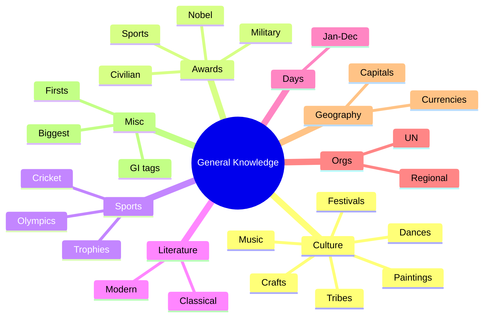

# EXAMINER BLUEPRINT — What Gets Tested Most

General Knowledge is the section where well-prepared students lose marks to poorly-prepared students who happened to remember the right niche fact. This book is built to close that gap.

**Top 8 GK exam hotspots**

1. **National symbols** — national animal, bird, flower, tree, sport, anthem, song, calendar, currency, emblem, fruit. Appears in every exam, every year — guaranteed marks.
2. **Important days and dates** — World Environment Day (5 June), World AIDS Day (1 Dec), Gandhi Jayanti (2 Oct), Republic Day (26 Jan). 2–3 questions every exam.
3. **Awards** — Bharat Ratna, Padma Vibhushan, Nobel Prize (most recent years), Sahitya Akademi, Khel Ratna. Each award's latest recipients + all-time firsts.
4. **Classical dances** — all 8 classical forms with their states. These appear in every State PSC, SSC CGL, and UPSC Prelims.
5. **Folk dances by state** — Garba (Gujarat), Bihu (Assam), Ghoomar (Rajasthan), Lavani (Maharashtra). Examiners especially love Northeast and tribal dances.
6. **First in India/world** — first woman PM, first woman President, first Indian in space, first Nobel laureate from India. Classic one-mark questions.
7. **International organisations** — UN organs (6), World Bank, IMF, WTO headquarters and founding years, current heads. Matching questions are very common.
8. **Sports** — Olympic milestones, Asian Games rankings, stadium-by-city, national sports of key countries.

**Study priority for time-poor students**

1. National symbols table (15 items = easy guaranteed marks)
2. Classical dance forms — all 8 with states
3. Important days — 20 most-asked
4. Awards — Bharat Ratna all-time list + most recent Padmas
5. First in India — 15 key firsts
6. International organisations — HQs + heads
7. Folk dances — 10 most-asked states, especially Northeast
8. Sports firsts and records

---

# What's New This Year (General Knowledge)

> Awards, sports records, current officeholders, international rankings change every year. Re-check before any exam later than Q3 2026. The rest of this book (national symbols, important days, books-and-authors classics, UN principal organs structure, agency HQs, classical-dance facts) is **static and stable**.

| Item | Current value (verify before your exam) |
|---|---|
| **Bharat Ratna — total count** | 53 (latest batch 2024: Karpoori Thakur, M.S. Swaminathan, L.K. Advani, Chaudhary Charan Singh, P.V. Narasimha Rao) |
| **Padma Awards 2026** | 131 total: 5 Padma Vibhushan + 13 Padma Bhushan + 113 Padma Shri (announced 25 Jan 2026) |
| **Khel Ratna 2024** | Manu Bhaker (shooting), D Gukesh (chess), Harmanpreet Singh (hockey), Praveen Kumar (para high jump) |
| **Nobel Prize 2025** | Physics: Clarke+Devoret+Martinis · Chemistry: Kitagawa+Robson+Yaghi · Medicine: Brunkow+Ramsdell+Sakaguchi · Literature: László Krasznahorkai · Peace: María Corina Machado · Economics: Mokyr+Aghion+Howitt |
| **Booker Prize 2025** | David Szalay — *Flesh* (10 Nov 2025) · International Booker: Banu Mushtaq + Deepa Bhasthi — *Heart Lamp* |
| **UN Secretary-General** | António Guterres (term ends 31 Dec 2026) |
| **World Bank President** | Ajay Banga (14th, since 2 Jun 2023) |
| **IMF Managing Director** | Kristalina Georgieva (2nd term from 1 Oct 2024) |
| **WTO Director-General** | Ngozi Okonjo-Iweala |
| **NATO members** | 32 (Sweden joined as 32nd, 7 Mar 2024) |
| **BRICS members** | 11 full members (Indonesia joined Jan 2025) + 10 partner countries |
| **Maharatna CPSEs** | 14 (HAL added 12 Oct 2024 as 14th Maharatna) |
| **Pamban Bridge** | New Pamban Bridge inaugurated 6 Apr 2025; India's 1st vertical-lift railway sea bridge; 2.07 km, Tamil Nadu |
| **Paris Olympics 2024 — India** | 6 medals (1 Silver, 5 Bronze), 71st rank |
| **Tiger reserves** | 58 (57th = Ratapani MP, Dec 2024; 58th = Madhav MP, Mar 2025) |
| **US President** | Donald Trump (47th, 2nd term since 20 Jan 2025) |
| **Census 2027** | Phase I launched 1 Apr 2026; first fully digital census; includes caste enumeration |

---

# How to use this book

GK is a graveyard of rote learning for most aspirants — they try to memorise unconnected facts and forget them under pressure. This book beats that by grouping facts by category (awards, dances, sports, international organisations) and anchoring each cluster to a story or a memorable hook.

**Where marks are lost:** Folk dances of Northeast India, tribal art forms, martial arts of specific states, musical instruments — these are the questions most candidates skip because they seem obscure. The result: 1–2 questions every paper go to whoever bothered to read this section.

**How to study GK:** Work one section at a time. Read a table, close the book, and try to produce it from memory. If you can't name 7 of 8 items, re-read and try again. The spaced repetition cycle (today, then 3 days later, then 7 days later) gives you the best results for this type of material.

**The "What's New" section** at the top changes every year — re-read it one week before any exam. Everything else in this book (national symbols, classical dances, Bhakti saints, important days, historical firsts) is static and does not change.

---

\newpage

# PART A — INDIAN CULTURE & HERITAGE

## Chapter A1 — Classical Dances of India

Eight recognised classical dances (Sangeet Natak Akademi):

| Dance | State | Key feature | Legendary exponent |
|-------|-------|-------------|---------------------|
| **Bharatanatyam** | Tamil Nadu | Oldest; temple origin; fire dance | Rukmini Devi Arundale, Yamini Krishnamurthy |
| **Kathak** | North India (UP) | Footwork, fast spins; Hindu + Mughal fusion | Birju Maharaj, Sitara Devi |
| **Kathakali** | Kerala | Elaborate masks; male-dominated | Kalamandalam Gopi |
| **Kuchipudi** | Andhra Pradesh | Brass-plate dance; Siddhendra Yogi | Vempati Chinna Satyam |
| **Odissi** | Odisha | Tribhangi posture; Jagannath temple | Kelucharan Mohapatra, Sonal Mansingh |
| **Manipuri** | Manipur | Lai Haraoba; Ras Leela | Guru Bipin Singh |
| **Mohiniyattam** | Kerala | Solo female; slow, graceful | Kalamandalam Kalyanikutty Amma |
| **Sattriya** | Assam | Vaishnavite monasteries; Sankardeva | — |

Mnemonic: **"Bengal Kittens Kick Kidneys Of Mighty Monks, Sarge"** → B(haratanatyam), K(athak), K(athakali), K(uchipudi), O(dissi), M(anipuri), M(ohiniyattam), S(attriya).

## Chapter A2 — Folk Dances (exam favourites)

> **These are gold-dust for examiners.** Know at least two per major state.

| State | Famous folk dances |
|-------|---------------------|
| Punjab | Bhangra (male), Giddha (female) |
| Haryana | Dhamal, Saang |
| Rajasthan | Ghoomar, Kalbelia, Teratali, Chari |
| Gujarat | Garba, Dandiya Raas, Tippani |
| Maharashtra | Lavani, Koli, Dhangari Gaja, Powada |
| Goa | Dekhnni, Fugdi |
| Karnataka | Yakshagana, Dollu Kunitha |
| Kerala | Thiruvathira, Theyyam, Padayani, Ottamthullal |
| Tamil Nadu | Karagattam, Kummi, Kolattam, Mayil attam |
| Andhra Pradesh | Kuchipudi (classical), Burrakatha, Perini |
| Telangana | Perini Sivatandavam, Bonalu |
| Odisha | Chhau (also Jharkhand + WB), Ghumura, Gotipua |
| West Bengal | Chhau (Purulia), Gambhira, Kirtan |
| Bihar | Jat-Jatin, Chhau, Jhumar |
| Jharkhand | Jhumar, Paika, Chhau |
| Chhattisgarh | Panthi, Raut Nacha, Saila |
| Madhya Pradesh | Matki, Tertali, Gangaur |
| Uttar Pradesh | Kathak (classical), Rasleela, Charkula |
| Uttarakhand | Chholiya, Jhora, Chhapeli |
| Himachal | Kinnauri, Namagen, Nati |
| Jammu & Kashmir | Rouf, Hikat, Dumhal, Kud |
| Ladakh | Jabro, Chabs-skyan |
| Assam | Bihu (the famous one), Jhumur |
| Meghalaya | Wangala (Garo), Shad Suk Mynsiem (Khasi) |
| Arunachal Pradesh | Aji Lamu, Chalo, Wancho |
| Nagaland | Chang Lo, Zeliang, Temangnetin |
| Manipur | Thang Ta, Lai Haraoba, Maibi |
| Mizoram | Cheraw (bamboo dance), Khuallam |
| Tripura | Hojagiri, Garia, Lebang Boomani |
| Sikkim | Chu Faat, Singhi Chham (snow lion) |

### Memory aid: **"India Tour Bus"**

Start at the bus stand in Punjab (Bhangra music). Move east: Haryana (Dhamal) → Rajasthan (dust storms + Ghoomar) → Gujarat (Garba nights) → Maharashtra (Lavani stage) → Goa (beach Fugdi) → down to Karnataka/Kerala (Yakshagana fire + Theyyam) → TN (Karagattam pot) → up East coast (AP/Telangana/Odisha) → West Bengal/Bihar/Jharkhand (Chhau masks) → Chhattisgarh (Panthi) → MP → UP (Charkula with pots on head) → Himalayas (Nati) → J&K (Rouf) → Ladakh → NE sweep (Bihu → Hojagiri).

### Exam pointers

- "Bamboo dance?" → **Cheraw (Mizoram).**
- "Snow lion dance?" → **Singhi Chham (Sikkim).**
- "Tiger dance?" → **Pulikali (Kerala, Onam).**
- "Dance with brass pot on head?" → **Ghoomar/Bhavai (Rajasthan) / Karagattam (TN).**
- "Classical in Assam?" → **Sattriya.**

---

\newpage

## Chapter A3 — Music: Hindustani vs Carnatic

| Feature | Hindustani | Carnatic |
|---------|-----------|----------|
| Region | North India | South India |
| Influences | Persian + Hindu | Purely Hindu (Vedic) |
| Structure | Gharana-driven, freer | Composition-driven, stricter |
| Instruments | Sitar, sarod, tabla, sarangi, santoor | Veena, mridangam, ghatam, violin |
| Vocal forms | Dhrupad, Khayal, Thumri, Tappa | Kriti, Varnam, Tillana |
| Saints | Tansen, Amir Khusrau | Purandara Dasa (father of Carnatic), Tyagaraja, Muthuswami Dikshitar, Syama Sastri (Trinity) |

### 🎼 Schools/Gharanas (Hindustani)

Agra, Gwalior (oldest khyal), Kirana, Patiala, Jaipur-Atrauli, Banaras, Mewati, Bhendi Bazaar.

### Exam pointers

- "Trinity of Carnatic music?" → **Tyagaraja, Muthuswami Dikshitar, Syama Sastri.**
- "Father of Carnatic music?" → **Purandara Dasa.**
- "Sitar-tabla combo originator?" → **Amir Khusrau (attributed).**

---

\newpage

## Chapter A4 — Paintings (exam favourite)

| Style | State/Origin | Distinctive features |
|-------|--------------|---------------------|
| **Madhubani / Mithila** | Bihar | Fish, peacocks, deities; natural dyes |
| **Warli** | Maharashtra (tribal) | White stick figures on mud wall |
| **Pattachitra** | Odisha & WB | Cloth/palm-leaf; Jagannath themes |
| **Phad** | Rajasthan | Scrolls narrating folk hero tales (Pabuji) |
| **Pichwai** | Rajasthan (Nathdwara) | Krishna, cows, lotus |
| **Tanjore** | Tamil Nadu | Gold foil, gemstones, Hindu deities |
| **Kalighat** | West Bengal | Colonial Bengal satire |
| **Kangra / Pahari** | HP | Miniatures, soft colours, romantic |
| **Mughal miniature** | North India | Court scenes, fine brushwork |
| **Rajput** | Rajasthan | Heroism, Krishna, music |
| **Kalamkari** | Andhra Pradesh | Hand/block on cotton; Hindu epics |
| **Gond** | Madhya Pradesh | Dots & lines; natural motifs |
| **Cheriyal scroll** | Telangana | Long scroll; Nakashi families |
| **Saura** | Odisha | Tribal; fishermen, rituals |
| **Mysore** | Karnataka | Gesso + gold foil; Hindu gods |
| **Thangka** | Ladakh/Sikkim/Tibetan | Buddhist scroll painting |

## Chapter A5 — Handicrafts / Weaving / GI tags

| Craft | Region |
|-------|--------|
| Pashmina shawl | Kashmir |
| Kani shawl | Kashmir |
| Phulkari | Punjab |
| Chikankari | Lucknow (UP) |
| Zardozi | Lucknow, Hyderabad |
| Banarasi silk | Varanasi |
| Kanjivaram silk | Tamil Nadu |
| Pochampally ikat | Telangana |
| Patola | Gujarat |
| Bandhani (tie-dye) | Gujarat, Rajasthan |
| Bagh / Bagru / Sanganeri prints | MP / Rajasthan |
| Kalamkari | AP |
| Channapatna toys | Karnataka |
| Etikoppaka toys | AP |
| Bidriware | Karnataka (Bidar) |
| Pembarthi metal craft | Telangana |
| Dhokra | Chhattisgarh, WB, Odisha |

### Exam pointers

- "Warli originates from?" → **Maharashtra (tribal).**
- "Madhubani?" → **Bihar.**
- "Pattachitra?" → **Odisha (and WB).**
- "Dhokra = ?" → **Lost-wax metal casting; Chhattisgarh/Jharkhand/WB.**

---

\newpage

## Chapter A6 — Martial Arts

| Art | State |
|-----|-------|
| **Kalaripayattu** | Kerala (world's oldest?) |
| **Silambam** | Tamil Nadu (bamboo staff) |
| **Thang-Ta / Huyen Langlon** | Manipur |
| **Gatka** | Punjab (Sikh) |
| **Lathi** | Punjab, Bengal |
| **Mardani Khel** | Maharashtra |
| **Pari-Khanda** | Bihar |
| **Cheibi Gad-ga** | Manipur |
| **Kuttu Varisai** | TN (unarmed) |

### Exam pointers

- "Oldest martial art in world?" → **Kalaripayattu (Kerala).**
- "Manipur sword-spear art?" → **Thang-Ta.**

---

\newpage

## Chapter A7 — Festivals (state-linked)

| Festival | State/Region |
|---------|---------------|
| Pongal | Tamil Nadu |
| Onam | Kerala |
| Ugadi | AP/Telangana/Karnataka |
| Vishu | Kerala |
| Bihu (3 types) | Assam |
| Pohela Boishakh | Bengal |
| Baisakhi | Punjab |
| Lohri | Punjab |
| Pola | Maharashtra (bull) |
| Gudi Padwa | Maharashtra |
| Chhath | Bihar/UP/Jharkhand |
| Hornbill | Nagaland |
| Losar | Ladakh/Sikkim/Tibetan |
| Hemis | Ladakh |
| Saga Dawa | Sikkim |
| Bathukamma | Telangana |
| Makar Sankranti / Magh Bihu | Pan-India (Jan 14) |
| Kumbh Mela | Prayagraj, Haridwar, Nashik, Ujjain (4 sites) |
| Rann Utsav | Gujarat |
| Teej | Rajasthan/Haryana/UP |
| Wangala | Meghalaya (Garo) |
| Shad Suk Mynsiem | Meghalaya (Khasi) |
| Solung | Arunachal (Adi) |
| Nyokum | Arunachal (Nyishi) |
| Chapchar Kut | Mizoram |
| Ziro Music Fest | Arunachal |
| Sangai | Manipur |

### Exam pointers

- "Hornbill festival?" → **Nagaland, Dec.**
- "Rann Utsav?" → **Kutch, Gujarat.**
- "Sangai Festival?" → **Manipur (brow-antlered deer theme).**

---

\newpage

## Chapter A8 — Tribes (by state/cluster)

| State | Major tribes |
|-------|--------------|
| Andhra / Telangana | Gond, Chenchu, Koya, Savara |
| Odisha | Santhal, Bonda, Juang, Koya, Saora |
| Jharkhand | Santhal, Munda, Oraon, Ho, Bhumij, Birhor |
| Chhattisgarh | Gond, Halba, Maria, Muria, Baiga |
| MP | Bhil, Gond, Baiga, Sahariya, Bharia |
| Maharashtra | Warli, Gond, Bhil, Katkari |
| Rajasthan | Bhil, Meena, Garasia, Sahariya |
| Gujarat | Bhil, Dhodia, Siddi |
| Kerala | Kurumba, Paniya, Kurichiya, Irula, Kadar |
| TN | Toda, Kota, Irula, Kurumba, Badaga |
| Karnataka | Soliga, Yerava, Koraga, Gowdalu |
| Arunachal | Nyishi, Adi, Apatani, Mishmi, Monpa, Galo |
| Nagaland | Naga tribes (Ao, Angami, Sema, Konyak, etc.) |
| Meghalaya | Khasi, Jaintia, Garo |
| Manipur | Meitei (majority), Nagas, Kukis |
| Mizoram | Mizo, Lushai |
| Tripura | Tripuri, Reang, Chakma |
| Assam | Bodo, Mishing, Karbi, Rabha, Tiwa |
| Sikkim | Lepcha, Bhutia, Nepali |
| Uttarakhand | Jaunsari, Bhotia, Tharu, Raji, Buksa |
| HP | Gaddi, Gujjar, Pangwala, Lahaula, Kinnauri |
| J&K / Ladakh | Gujjar-Bakarwal, Balti, Brokpa, Changpa |
| Andaman & Nicobar | Jarawa, Onge, Sentinelese, Shompen, Great Andamanese, Nicobarese |

### Exam pointers

- "Sentinelese are in?" → **North Sentinel Island (A&N); voluntarily isolated.**
- "Apatani known for?" → **Ziro valley; wet-rice+fish culture, facial markings (historic).**
- "Toda tribe found in?" → **Nilgiris, TN.**
- "PVTGs count?" → **75 (Particularly Vulnerable Tribal Groups).**

---

\newpage

# PART B — AWARDS AND HONOURS

## Chapter B1 — Indian Civilian Awards (hierarchy)

1. **Bharat Ratna** (since 1954) — highest civilian; max 3/year.
2. **Padma Vibhushan** — exceptional & distinguished service.
3. **Padma Bhushan** — distinguished service of high order.
4. **Padma Shri** — distinguished service.

- 1st Bharat Ratna: **C. Rajagopalachari, S. Radhakrishnan, C.V. Raman (1954).**
- 1st posthumous: **Lal Bahadur Shastri (1966).**
- Youngest: **Sachin Tendulkar (40, 2014).**
- Non-Indian recipients: **Khan Abdul Ghaffar Khan (1987)** and **Nelson Mandela (1990).**
- Naturalised: **Mother Teresa (1980).**
- **2024 recipients:** Karpoori Thakur, L.K. Advani, P.V. Narasimha Rao, Chaudhary Charan Singh, M.S. Swaminathan.

## Chapter B2 — Gallantry Awards (peacetime)

- **Param Vir Chakra** (wartime, highest military — 21 awardees; first Major Somnath Sharma, 1947).
- **Maha Vir Chakra** (wartime, 2nd).
- **Vir Chakra** (wartime, 3rd).
- **Ashoka Chakra** (peacetime, highest).
- **Kirti Chakra** (peacetime, 2nd).
- **Shaurya Chakra** (peacetime, 3rd).

## Chapter B3 — Sports Awards

- **Major Dhyan Chand Khel Ratna** (highest; earlier Rajiv Gandhi Khel Ratna; renamed 2021).
- **Arjuna Award** — outstanding performance over 4 years.
- **Dronacharya Award** — coaches.
- **Dhyan Chand Award** — lifetime (athletes).
- **Rashtriya Khel Protsahan Puraskar** — promoting sports.

## Chapter B4 — Literature & Cinema

- **Jnanpith Award** — highest literary (since 1965). 22 recognised Indian languages.
  - 1st recipient: **G. Sankara Kurup (Malayalam, 1965).**
  - 1st woman: **Ashapurna Devi (Bengali, 1976).**
- **Sahitya Akademi** — works in 24 languages.
- **Dadasaheb Phalke Award** — cinema lifetime. 1st: **Devika Rani (1969).**
- **National Film Awards** — annual.

## Chapter B5 — International

- **Nobel Prizes to Indians/Indian-origin:**
  - **Rabindranath Tagore** (Literature, 1913).
  - **C.V. Raman** (Physics, 1930).
  - **Hargobind Khorana** (Medicine, 1968).
  - **Mother Teresa** (Peace, 1979).
  - **Subrahmanyan Chandrasekhar** (Physics, 1983).
  - **Amartya Sen** (Economics, 1998).
  - **V. Ramakrishnan** (Chemistry, 2009).
  - **Kailash Satyarthi** (Peace, 2014).
  - **Abhijit Banerjee** (Economics, 2019).

- **Magsaysay Awards** — "Asian Nobel." 1st Indian: **Vinoba Bhave (1958).**
- **Bharat Ratna vs Nobel:** the only Indian with both for separate causes = **Mother Teresa (Nobel Peace 1979, Bharat Ratna 1980).**

### Exam pointers

- "Bharat Ratna — max per year?" → **3.**
- "PVC awardees so far?" → **21 (as of Apr 2026).**
- "Khel Ratna renamed to?" → **Major Dhyan Chand, 2021.**
- "Nobel in Economics Indian?" → **Amartya Sen (1998), Abhijit Banerjee (2019).**

---

\newpage

# PART C — SPORTS

## Chapter C1 — Olympics

- **First modern Olympics**: Athens, 1896.
- **Olympic rings colours**: Blue, Yellow, Black, Green, Red (on white) — represent 5 continents.
- **Motto**: Citius, Altius, Fortius, Communiter ("Faster, Higher, Stronger, Together" — added 2021).
- **Headquarters**: Lausanne, Switzerland.
- **2024 Paris** / **2028 LA** / **2032 Brisbane** / **2036 ?**
- **Winter Olympics separately since 1924.**

### 🇮🇳 India at Olympics

- **1st Individual Olympic gold**: **Abhinav Bindra** (10m air rifle, Beijing 2008).
- **1st Athletics Olympic gold**: **Neeraj Chopra** (javelin, Tokyo 2020 → held 2021).
- **Hockey golds**: 8 (1928-1980).
- **Paris 2024 haul**: 1 silver (Neeraj Chopra) + 5 bronze; total 6 medals.

## Chapter C2 — Cricket (ICC-level)

- **ICC HQ**: Dubai, UAE.
- **World Cup winners**: WI (1975, 1979), India (1983, 2011), Australia (1987, 1999, 2003, 2007, 2015, 2023), Pakistan (1992), Sri Lanka (1996), England (2019).
- **T20 World Cup winners**: India (2007, 2024), Pak (2009), Eng (2010, 2022), WI (2012, 2016), SL (2014), Aus (2021).
- **India's last WC win**: **ODI 2011** (first host nation to win on home soil).
- **T20 2024 win**: Barbados, India beat South Africa.
- **India's 1st Test**: 1932 (Lord's, vs England, lost).
- **India's 1st Test win**: 1952 (vs England, Madras).
- **IPL** started 2008.

## Chapter C3 — Key Cups / Trophies by Sport

| Sport | Trophy |
|-------|--------|
| Football (World) | FIFA World Cup |
| Football (club Europe) | UEFA Champions League |
| Football (India) | Durand Cup (oldest Asia, 1888), Santosh Trophy, Federation Cup |
| Hockey (World) | FIH World Cup |
| Hockey (India) | Rangaswamy Cup, Beighton Cup, Agha Khan Cup |
| Cricket (India domestic) | Ranji Trophy, Duleep Trophy, Irani Trophy, Vijay Hazare, Deodhar |
| Golf | Ryder Cup, Masters, US Open |
| Tennis Grand Slams | Aus Open, French Open, Wimbledon, US Open |
| Davis Cup | Men's tennis teams |
| Thomas Cup | Men's badminton teams |
| Uber Cup | Women's badminton teams |
| Sudirman Cup | Mixed badminton teams |
| Swaythling Cup | Men's TT teams |

### Exam pointers

- "India's first World Cup (ODI)?" → **1983, Lord's, captain Kapil Dev.**
- "Ryder Cup?" → **Golf (USA vs Europe).**
- "Thomas Cup first Indian win?" → **2022 (Bangkok).**
- "Oldest football cup in Asia?" → **Durand Cup, 1888.**

---

\newpage

# PART D — BOOKS AND AUTHORS

## Chapter D1 — Key historical / modern

| Book | Author |
|------|--------|
| Arthashastra | Kautilya/Chanakya |
| Mudrarakshasa | Vishakhadatta |
| Mrichhakatika | Shudraka |
| Indica | Megasthenes |
| Kural (Tirukkural) | Thiruvalluvar |
| Silappadikaram | Ilango Adigal |
| Manimekalai | Sittalai Sattanar |
| Rajatarangini | Kalhana |
| Geet Govind | Jayadeva |
| Prithviraj Raso | Chand Bardai |
| Ain-i-Akbari, Akbarnama | Abul Fazl |
| Tuzuk-i-Babri | Babur |
| Baburnama | Babur |
| Humayun-nama | Gulbadan Begum |
| Tuzuk-i-Jahangiri | Jahangir |
| Padmavat | Malik Muhammad Jayasi |
| Gitanjali | Tagore |
| Discovery of India | Nehru |
| My Experiments with Truth | Gandhi |
| India Wins Freedom | Maulana Azad |
| Poverty & Un-British Rule | Dadabhai Naoroji |
| Unhappy India | Lala Lajpat Rai |
| Anandmath | Bankim Chandra |
| Devdas / Parineeta | Sarat Chandra |
| Godan, Gaban | Premchand |
| Malgudi Days, The Guide | R.K. Narayan |
| Train to Pakistan | Khushwant Singh |
| God of Small Things | Arundhati Roy |
| Midnight's Children, Satanic Verses | Salman Rushdie |
| White Tiger | Aravind Adiga |
| Inheritance of Loss | Kiran Desai |
| Sea of Poppies (Ibis trilogy) | Amitav Ghosh |
| A Suitable Boy | Vikram Seth |
| Interpreter of Maladies, Namesake | Jhumpa Lahiri |
| The Hungry Tide | Amitav Ghosh |
| A Passage to India | E.M. Forster |

### Exam pointers

- "Arthashastra?" → **Kautilya.**
- "Rajatarangini?" → **Kalhana, history of Kashmir.**
- "Who wrote Baburnama in Turkish?" → **Babur.**
- "Nobel for Gitanjali?" → **Tagore, 1913.**

---

\newpage

# PART E — IMPORTANT DAYS (chronological)

### January

- 1 — Army Day (15), DRDO (1), World Day of Peace (1), Global Family Day
- 9 — Pravasi Bharatiya Divas
- 10 — World Hindi Day
- 12 — National Youth Day (Vivekananda)
- 15 — Army Day
- 24 — National Girl Child Day
- 25 — National Voters' Day
- 26 — Republic Day / International Customs Day
- 30 — Martyrs' Day (Gandhi)

### February

- 2 — World Wetlands Day
- 4 — World Cancer Day
- 13 — World Radio Day
- 14 — Valentine's Day / V.D. Savarkar Jayanti
- 20 — World Day of Social Justice
- 21 — International Mother Language Day
- 28 — National Science Day (Raman Effect)

### March

- 3 — World Wildlife Day
- 8 — International Women's Day
- 15 — World Consumer Rights Day
- 20 — International Day of Happiness
- 21 — World Forestry Day, Int'l Day for Elimination of Racial Discrimination
- 22 — World Water Day
- 23 — Shaheed Diwas (Bhagat Singh)
- 24 — World TB Day
- 27 — World Theatre Day

### April

- 2 — World Autism Awareness Day
- 5 — National Maritime Day
- 7 — World Health Day
- 10 — World Homoeopathy Day
- 11 — National Safe Motherhood Day
- 14 — Ambedkar Jayanti
- 18 — World Heritage Day
- 21 — National Civil Services Day
- 22 — Earth Day
- 23 — World Book & Copyright Day
- 24 — National Panchayati Raj Day
- 25 — World Malaria Day

### May

- 1 — Int'l Labour Day
- 3 — World Press Freedom Day
- 8 — World Red Cross Day (Dunant birth)
- 11 — National Technology Day (Pokhran-II)
- 12 — Int'l Nurses Day (Nightingale)
- 15 — Int'l Day of Families
- 17 — World Telecom Day
- 18 — Int'l Museum Day
- 22 — Int'l Day for Biological Diversity
- 31 — World No Tobacco Day

### June

- 1 — World Milk Day
- 5 — World Environment Day
- 8 — World Oceans Day
- 12 — World Day Against Child Labour
- 14 — World Blood Donor Day
- 20 — World Refugee Day
- 21 — Int'l Yoga Day, Father's Day
- 23 — Int'l Olympic Day
- 26 — Int'l Day Against Drug Abuse

### July

- 1 — National Doctors Day (B.C. Roy)
- 11 — World Population Day
- 18 — Nelson Mandela Int'l Day
- 28 — World Hepatitis Day

### August

- 6 — Hiroshima Day
- 9 — Nagasaki Day, Quit India Day
- 12 — Int'l Youth Day
- 15 — Independence Day
- 19 — World Humanitarian Day, World Photography Day
- 23 — National Space Day (Chandrayaan-3)
- 29 — National Sports Day (Dhyan Chand)

### September

- 5 — Teachers' Day (Radhakrishnan)
- 8 — Int'l Literacy Day
- 14 — Hindi Divas
- 15 — Engineer's Day (Visvesvaraya)
- 16 — World Ozone Day
- 21 — Int'l Day of Peace
- 27 — World Tourism Day
- 29 — World Heart Day

### October

- 1 — Int'l Day of Older Persons
- 2 — Gandhi Jayanti / Int'l Day of Non-Violence / Shastri Jayanti
- 5 — World Teachers Day
- 8 — Indian Air Force Day
- 9 — World Post Day
- 10 — World Mental Health Day
- 14 — World Standards Day
- 16 — World Food Day
- 17 — Int'l Day for the Eradication of Poverty
- 24 — United Nations Day
- 31 — Rashtriya Ekta Diwas (Sardar Patel), World Savings Day

### November

- 7 — Infant Protection Day, Nat'l Cancer Awareness Day
- 11 — National Education Day (Maulana Azad)
- 14 — Children's Day (Nehru), Diabetes Day
- 19 — Int'l Toilet Day
- 20 — Universal Children's Day
- 21 — World TV Day, World Fisheries Day
- 25 — Int'l Day for Elimination of Violence Against Women
- 26 — Constitution Day / Law Day
- 29 — Int'l Day of Solidarity with Palestinian People

### December

- 1 — World AIDS Day
- 2 — Bhopal Gas Tragedy (1984)
- 3 — Int'l Day of Persons with Disabilities
- 4 — Indian Navy Day
- 7 — Armed Forces Flag Day
- 10 — Human Rights Day
- 11 — UNICEF Day
- 14 — National Energy Conservation Day
- 16 — Vijay Diwas (1971 war)
- 22 — National Mathematics Day (Ramanujan)
- 23 — Kisan Diwas (Chaudhary Charan Singh)
- 25 — Good Governance Day (Vajpayee)

### Exam pointers

- "National Science Day commemorates?" → **Raman Effect (28 Feb 1928).**
- "Yoga Day?" → **21 June.**
- "Constitution Day?" → **26 November.**
- "National Technology Day?" → **11 May (Pokhran-II).**
- "Space Day?" → **23 August (Chandrayaan-3).**

---

\newpage

# PART F — INSTITUTIONS & ORGANISATIONS

## Chapter F1 — UN Bodies (HQ + focus)

| Body | HQ | Focus |
|------|----|-------|
| UN | New York | Umbrella |
| UNESCO | Paris | Education, culture, science |
| UNICEF | New York | Children |
| WHO | Geneva | Health |
| ILO | Geneva | Labour |
| FAO | Rome | Food, agriculture |
| IMF | Washington DC | Monetary |
| World Bank | Washington DC | Development |
| WTO | Geneva | Trade |
| IAEA | Vienna | Atomic energy |
| UNEP | Nairobi | Environment |
| UNDP | New York | Development programme |
| IMO | London | Maritime |
| ICAO | Montreal | Aviation |
| UPU | Bern | Postal |
| ITU | Geneva | Telecom |
| WMO | Geneva | Meteorology |
| WIPO | Geneva | Intellectual Property |

## Chapter F2 — Non-UN & Regional

| Body | HQ | Role |
|------|----|------|
| Commonwealth | London | 56 members |
| NATO | Brussels | Military alliance |
| OPEC | Vienna | Oil cartel (13 members) |
| ASEAN | Jakarta | SE Asia |
| SAARC | Kathmandu | South Asia (8) |
| BIMSTEC | Dhaka | Bay of Bengal (7) |
| SCO | Beijing | Shanghai Coop Org (India joined 2017) |
| BRICS | — | Brazil/Russia/India/China/S.Africa + expanded 2024 |
| G7 | rotating | 7 industrialised nations |
| G20 | rotating | 20 major economies |
| QUAD | — | US, India, Japan, Australia |
| AU | Addis Ababa | African Union |
| EU | Brussels | European Union |
| OECD | Paris | Developed economies |
| Interpol | Lyon | Police |
| ICJ | Hague | Int'l Court of Justice |
| ICC | Hague | Criminal Court |
| PCA | Hague | Permanent Court of Arbitration |
| Int'l Olympic Cmte | Lausanne | Olympics |
| Red Cross | Geneva | Humanitarian |

### Exam pointers

- "OPEC HQ?" → **Vienna, Austria.**
- "NATO members?" → **32 (as of 2026, Finland and Sweden joined recently).**
- "G20 2023 host?" → **India (New Delhi Declaration).**
- "SAARC created?" → **1985, Dhaka.**
- "BRICS expanded 2024 — new members?" → **Egypt, UAE, Iran, Ethiopia (Argentina & Saudi Arabia invited; status varies).**

---

\newpage

# PART G — COUNTRIES AND CAPITALS (select)

## World's unusual/boundary capitals

| Country | Capital |
|---------|---------|
| USA | Washington D.C. |
| UK | London |
| Canada | Ottawa |
| Australia | Canberra |
| Brazil | Brasília |
| Russia | Moscow |
| China | Beijing |
| Japan | Tokyo |
| Nepal | Kathmandu |
| Bhutan | Thimphu |
| Sri Lanka | Sri Jayawardenepura Kotte (admin) / Colombo (commercial) |
| Myanmar | Naypyidaw |
| Bangladesh | Dhaka |
| Pakistan | Islamabad |
| Afghanistan | Kabul |
| Maldives | Malé |
| Iran | Tehran |
| Saudi Arabia | Riyadh |
| UAE | Abu Dhabi |
| Israel | Jerusalem (declared) / Tel Aviv (de facto) |
| Turkey | Ankara |
| Egypt | Cairo (new admin capital "New Administrative Capital") |
| South Africa | 3 capitals — Pretoria (exec), Cape Town (legislative), Bloemfontein (judicial) |
| Nigeria | Abuja |
| Indonesia | Jakarta → Nusantara (planned shift) |
| Philippines | Manila |
| Thailand | Bangkok |
| Vietnam | Hanoi |
| Malaysia | Kuala Lumpur (official), Putrajaya (admin) |
| Singapore | Singapore |
| Switzerland | Bern |
| Germany | Berlin |
| France | Paris |
| Italy | Rome |
| Spain | Madrid |
| Greece | Athens |
| Portugal | Lisbon |
| Sweden | Stockholm |
| Norway | Oslo |
| Denmark | Copenhagen |
| Finland | Helsinki |
| Netherlands | Amsterdam (Hague = govt seat) |
| Belgium | Brussels |
| Ireland | Dublin |
| Iceland | Reykjavik |
| Mexico | Mexico City |
| Argentina | Buenos Aires |
| Chile | Santiago |
| Peru | Lima |
| Venezuela | Caracas |
| Colombia | Bogotá |
| Kenya | Nairobi |
| Ethiopia | Addis Ababa |
| South Sudan | Juba |
| New Zealand | Wellington |

### Exam pointers

- "South Africa has how many capitals?" → **3.**
- "Sri Lanka admin capital?" → **Sri Jayawardenepura Kotte.**
- "Myanmar capital?" → **Naypyidaw.**
- "Indonesia's new capital?" → **Nusantara.**

---

\newpage

# PART H — MISCELLANEOUS NUGGETS

## Chapter H1 — "Firsts" (Indian women)

- First woman PM: **Indira Gandhi (1966).**
- First woman President: **Pratibha Patil (2007).**
- First woman CM: **Sucheta Kripalani (UP, 1963).**
- First woman Governor: **Sarojini Naidu (UP, 1947).**
- First woman Judge (SC): **Fathima Beevi (1989).**
- First woman CJI: **(still pending as of 2026).**
- First woman IPS: **Kiran Bedi (1972).**
- First woman IAS: **Anna Rajam Malhotra (1951).**
- First woman to climb Everest: **Bachendri Pal (1984).**
- First woman in space (Indian-origin): **Kalpana Chawla (1997).**
- First woman in space (of Indian nationality, IAF): **Rakesh Sharma was male; woman-Indian-flag in space is still pending Gaganyaan.**
- First woman to cross English Channel: **Aarti Saha (1959).**
- First woman Olympic medalist: **Karnam Malleswari (Bronze, 2000).**
- First woman Individual Olympic Silver: **P.V. Sindhu (2016).**
- First Indian-origin VP of USA: **Kamala Harris (2021).**

## Chapter H2 — Global firsts (quick)

- First man in space: **Yuri Gagarin (USSR, 1961).**
- First woman in space: **Valentina Tereshkova (USSR, 1963).**
- First man on Moon: **Neil Armstrong (Apollo 11, 1969).**
- First Indian in space: **Rakesh Sharma (Soyuz T-11, 1984).**
- First Indian-origin woman in space: **Kalpana Chawla (1997).**
- First Nobel Prize: **1901 (Röntgen, physics).**
- First university: **Nalanda (5th century CE) / Takshashila (earlier).**

## Chapter H3 — "Biggest / Longest / Highest"

- Highest peak (world): **Everest 8,849 m.**
- Highest peak (India): **Kangchenjunga (3rd in world, 8,586 m) — Sikkim.**
- Highest peak entirely in India: **Nanda Devi (Uttarakhand, 7,816 m).**
- Longest river (world): **Nile 6,650 km** (debated with Amazon).
- Longest river (India, in India): **Ganga (~2,525 km).**
- Longest river flowing through India: **Brahmaputra (2,900 km total).**
- Largest lake (world, freshwater): **Caspian — saline; by freshwater Superior.**
- Largest desert: **Antarctica (cold); Sahara (hot).**
- Deepest ocean point: **Mariana Trench (Challenger Deep), ~11 km.**
- Tallest statue (world): **Statue of Unity, Gujarat, 182 m (Sardar Patel, 2018).**
- Tallest building (world): **Burj Khalifa, Dubai, 828 m.**
- Longest bridge (India): **Bhupen Hazarika Setu (Dhola-Sadiya, Assam, 9.15 km).**
- Highest rail bridge: **Chenab Rail Bridge, J&K (359 m above river).**
- Largest stadium (cricket, world): **Narendra Modi Stadium, Ahmedabad (1.32 lakh).**

### Exam pointers

- "Highest peak entirely in India?" → **Nanda Devi.**
- "Tallest statue in world?" → **Statue of Unity (Gujarat).**
- "Highest rail bridge in India?" → **Chenab Bridge.**

---

\newpage

# APPENDICES

## Appendix 1 — Newspapers/Founders (freedom-era)

| Paper | Founder | Year |
|-------|---------|------|
| Bengal Gazette | James Augustus Hickey | 1780 (first English newspaper) |
| Samvad Kaumudi | Raja Ram Mohan Roy | 1821 |
| Mirat-ul-Akhbar | Raja Ram Mohan Roy | 1822 |
| Indian Mirror | Devendranath Tagore & Manmohan Ghose | 1861 |
| Amrita Bazar Patrika | Sisir Kumar Ghosh | 1868 |
| The Hindu | G.S. Aiyar & others | 1878 |
| Kesari / Maratha | Bal Gangadhar Tilak | 1881 |
| Swadeshamitran | G. Subramaniya Aiyar | 1882 |
| Yugantar | Barindra Kumar Ghosh | 1906 |
| Al-Hilal / Al-Balagh | Abul Kalam Azad | 1912 / 1915 |
| Young India | M.K. Gandhi | 1919 |
| Navjeevan | Gandhi | 1919 |
| Harijan | Gandhi | 1932 |
| Independent | Motilal Nehru | 1919 |
| Comrade | Mohammad Ali Jauhar | 1911 |
| New India | Bipin Chandra Pal | 1901 |
| Hindustan Standard | Sachidananda Sinha | — |

## Appendix 2 — Currencies (select)

| Country | Currency |
|---------|----------|
| India | Rupee |
| Pakistan / Nepal / Sri Lanka | Rupee |
| Bangladesh | Taka |
| Bhutan | Ngultrum |
| Myanmar | Kyat |
| Iran | Rial |
| Iraq | Dinar |
| Saudi Arabia | Riyal |
| UAE | Dirham |
| USA | Dollar |
| UK | Pound |
| Japan | Yen |
| China | Yuan / Renminbi |
| Russia | Rouble |
| Germany / France / Italy / Spain + 17 others | Euro (**21 Eurozone members as of 1 Jan 2026 — Bulgaria became 21st member; Bulgarian lev rate 1.95583/€**) |
| Switzerland | Franc |
| South Korea | Won |
| South Africa | Rand |
| Israel | Shekel |

## Appendix 3 — GI-tagged products (recent/exam favourites)

- Banarasi saree — UP.
- Kanjivaram silk — TN.
- Pochampally ikat — Telangana.
- Pashmina — J&K.
- Nagpur orange — Maharashtra.
- Darjeeling tea — WB (India's first GI, 2004).
- Basmati rice — multi-state.
- Tirupati laddu — AP.
- Alphonso mango — Maharashtra.
- Mysore silk — Karnataka.
- Madhubani painting — Bihar.
- Bikaneri bhujia — Rajasthan.
- Channapatna toys — Karnataka.
- Etikoppaka toys — AP.
- Kashmir saffron — J&K.
- Kangra tea — HP.
- Ratlami sev — MP.
- Bhagalpuri silk — Bihar.
- Goan Feni — Goa.
- Nilgiris tea — TN.

## Appendix 4 — Mind map

---

*For deeper context on historical events, see the History book. For science and technology details, see the Science & Technology book.*

---

\newpage

# PART X — EXAM-FAVOURITE NICHE TOPICS (paper-setter darlings)

> High probability, easy to frame distractors, and most candidates skip them. Drill until you can answer in <5 s.

## X.1 Classical Dances — the 8 (origin state, exponent, deity, costume cue)

| Dance | State | Notable exponents | Deity / theme | Costume cue |
|---|---|---|---|---|
| **Bharatanatyam** | Tamil Nadu | Rukmini Devi Arundale, Balasaraswati, Yamini Krishnamurthy | Shiva (Nataraja) | Pleated silk sari, jewellery, half-fan pleats |
| **Kathak** | UP / Jaipur / Lucknow / Banaras gharanas | Birju Maharaj, Sitara Devi, Shovana Narayan | Krishna (Radha-Krishna leelas) | Lehenga-choli or angarkha, ghungroo |
| **Kathakali** | Kerala | Kalamandalam Krishnan Nair, Kalamandalam Gopi | Mythology (Mahabharata, Ramayana) | Elaborate face make-up (pacha, kathi), towering headgear |
| **Kuchipudi** | Andhra Pradesh | Vempati Chinna Satyam, Raja Reddy & Radha Reddy | Krishna / Vishnu | Sari with fan pleats, tarangam (dancing on plate) |
| **Manipuri** | Manipur | Guru Bipin Singh, Jhaveri sisters | Radha-Krishna (Ras Lila) | Cylindrical kumil skirt, veiled face |
| **Odissi** | Odisha | Kelucharan Mohapatra, Sonal Mansingh, Madhavi Mudgal | Jagannath (tribhanga posture) | White silk sari, silver jewellery |
| **Mohiniyattam** | Kerala | Kalamandalam Kalyanikutty Amma, Sunanda Nair, Bharati Shivaji | Vishnu (Mohini avatar) | White-and-gold sari, lasya-graceful |
| **Sattriya** | Assam | Bayanācharya, Manik Borbayan, Jatin Goswami | Krishna (Sankardev's Bhakti) | Pat silk dhoti & dance sari |

## X.2 Folk Dances — state-wise (must memorise — 1 question per paper minimum)

**North:**

- **Punjab**: Bhangra (men, harvest), Giddha (women), Jhumar (slow Bhangra), Kikli, Sammi, Luddi.
- **Haryana**: Khoria, Ghoomar (also Rajasthan), Phag, Loor.
- **Himachal Pradesh**: Nati, Chappeli, Dangi, Jhora, Jhainta, Kayang, Bakayang.
- **Uttarakhand**: Garhwali, Pandav Nritya, Chappeli, Choliya (sword), Jhumeila, Hurka Baul.
- **J & K**: Rouf (women, spring), Hikat, Dumhal (Wattal tribe), Bhand Pather, Chakri.
- **Delhi/UP**: Charkula (women on head), Raslila, Khyal, Nautanki, Kajri, Jhulan.

**West:**

- **Rajasthan**: Ghoomar (Rajputana women), Kalbeliya (snake-charmer community, UNESCO listed), Terah Tali (sitting with manjiras), Bhavai (pots on head), Chari, Gair, Drum dance, Kachchhi Ghodi.
- **Gujarat**: Garba (Navratri), Dandiya Raas (sticks), Bhavai (folk drama), Tippani (Saurashtra women), Padhar (Bhal coast), Hudo (Bhawai).
- **Goa**: Fugdi, Dekhni, Dhalo, Mando, Talgadi, Kunbi (tribal).
- **Maharashtra**: Lavani (sensual Maratha), Tamasha, Koli (fisherfolk), Dhindi, Lezim, Dindi, Powada (heroic ballad).

**East / North-East — examiners' favourite zone (under-prepared):**

- **Bihar**: Jat-Jatin, Bidesia, Jhijhia, Paika, Sohrai (Sant Pargana), Karma.
- **Jharkhand**: Chhau (also Odisha, WB; UNESCO), Karma, Paika, Jhumar, Phaguwa.
- **West Bengal**: Chhau (Purulia), Gambhira, Dhali, Kathi, Jatra (folk drama), Brita (women's vow dance).
- **Odisha**: Chhau (Mayurbhanj — masked), Ghumura, Ranappa (stilts), Dalkhai (tribal women, Sambalpur), Karma, Dhap, Paika (warrior).
- **Sikkim**: Chu Faat (Lepcha), Singhi Chham (snow lion), Yak Chham, Tashi Yangku, Maruni, Ghantu.
- **Assam**: Bihu (Rongali — spring; Bhogali — Jan; Kongali — autumn), Bagurumba (Bodo women), Ali Ai Ligang (Mising), Deodhani (Shakti goddess), Jhumur (tea-tribe), Sattriya (also classical).
- **Arunachal Pradesh**: Aji Lhamu (Monpa), Lion-Peacock (Sherdukpen), Khampti (Buddhist), Roppi (Adi), Bardo Chham (good-evil battle), Chalo (Nocte).
- **Nagaland**: Hornbill (festival; multiple tribes), Zeliang, Chang Lo (Chang tribe), Modse (Sumi).
- **Manipur**: Lai Haraoba (oldest Manipuri), Thang-Ta (martial), Pung Cholom (drum), Maibi.
- **Mizoram**: Cheraw (bamboo-stick dance), Khuallam, Chheihlam, Sarlamkai, Solakia.
- **Meghalaya**: Nongkrem (Khasi harvest), Wangala (Garo, 100 drums), Shad Suk Mynsiem (Khasi thanksgiving), Behdienkhlam (Jaintia).
- **Tripura**: Hojagiri (Reang women on pitchers), Garia, Lebang Boomani, Bizu (Chakma).

**South:**

- **Tamil Nadu**: Kummi, Kolattam, Karagam (pot on head), Mayil Attam (peacock), Bommalattam (puppet), Theru Koothu (street drama), Oyilattam, Devarattam.
- **Karnataka**: Yakshagana (theatre-dance), Dollu Kunitha (drum), Veeragase (Shaivite), Krishna Parijatha, Bhutha Aradhane, Kamsale.
- **Andhra Pradesh / Telangana**: Kuchipudi (classical), Burra Katha (storytelling), Veedhi Bhagavatam, Lambadi (Banjara), Perini (warrior), Dhimsa (Araku tribal).
- **Kerala**: Mohiniyattam, Kathakali (classical), Theyyam (ritual god-dance, North Kerala), Padayani (Pathanamthitta), Thiruvathirakali (women's circle), Kaikottikali, Chakyar Koothu (Sanskrit theatre).

**Central:**

- **Madhya Pradesh / Chhattisgarh**: Karma (tribal), Panthi (Chhattisgarh, Satnami sect), Raut Nacha (Yadav), Saila (post-harvest), Maanch, Tertali, Phaag, Diwari.

> **Memory peg:** "Hornbill = Nagaland; Hojagiri = Tripura on pitchers; Cheraw = Mizoram bamboo; Bihu × 3 = Assam; Garba/Dandiya = Gujarat; Bhangra/Giddha = Punjab; Lavani = Maharashtra; Ghoomar/Kalbeliya = Rajasthan; Chhau = Odisha + Jharkhand + WB."

## X.3 State festivals — exam-favourite list

| Festival | State | Significance |
|---|---|---|
| **Pongal** | Tamil Nadu (Jan 14-17) | Harvest; 4 days — Bhogi, Surya Pongal, Mattu Pongal, Kaanum Pongal |
| **Onam** | Kerala (Aug-Sep, Chingam) | Welcome of King Mahabali; pookalam (flower carpets), Vallam Kali (boat race) |
| **Bihu** | Assam (3x year) | Rongali / Bohag (spring), Bhogali / Magh (winter harvest), Kongali / Kati (autumn lean) |
| **Chhath** | Bihar / Eastern UP (Oct-Nov) | Worship of Sun God + Chhathi Maiya; 4 days |
| **Saga Dawa** | Sikkim (May-Jun) | Buddhist — Buddha's birth, enlightenment, parinirvana |
| **Hornbill Festival** | Nagaland (Dec 1-10) | "Festival of festivals", all Naga tribes; Kohima |
| **Chapchar Kut** | Mizoram (Mar) | Spring festival of Mizos, post jhum |
| **Wangala** | Meghalaya (Oct-Nov) | Garo tribe, "100 drums festival", harvest thanksgiving |
| **Nongkrem** | Meghalaya (Nov) | Khasi 5-day religious dance festival |
| **Behdienkhlam** | Meghalaya (Jul) | Pnar / Jaintia, drives away plague & evil |
| **Losar** | Sikkim, Arunachal, Ladakh, HP (Jan-Feb) | Tibetan New Year |
| **Lai Haraoba** | Manipur (Apr-May) | Oldest Meitei festival, "Pleasing of gods" |
| **Yaoshang** | Manipur (Feb-Mar) | Holi-equivalent, 5 days |
| **Bizu** | Tripura (Apr) | Chakma New Year |
| **Garia** | Tripura (Apr-May) | Tribal, jhum-cultivation |
| **Hemis** | Ladakh (Jun-Jul) | Tibetan-Buddhist mask dance, Padmasambhava |
| **Sindhu Darshan** | Ladakh (Jun) | Indus river worship, Leh |
| **Pang Lhabsol** | Sikkim (Aug-Sep) | Worship of Mt. Kanchenjunga |
| **Ambubachi Mela** | Assam (Jun) | Kamakhya temple, menstruation of goddess |
| **Mahamastakabhisheka** | Karnataka (every 12 years) | Anointing of Bahubali at Shravanabelagola |
| **Hampi Utsav** | Karnataka (Nov) | Vijayanagar heritage |
| **Mysuru Dasara** | Karnataka (Sep-Oct) | 10-day royal celebration, Chamundi-procession |
| **Pushkar Mela** | Rajasthan (Oct-Nov) | World's largest camel fair |
| **Rann Utsav** | Gujarat (Nov-Feb) | White desert of Kutch |
| **Modhera Dance Festival** | Gujarat (Jan, Uttarardha Mahotsav) | At Sun Temple |
| **Khajuraho Dance Festival** | MP (Feb-Mar) | Classical dance week |
| **Goa Carnival** | Goa (Feb-Mar) | Pre-Lent festival |
| **Konark Dance Festival** | Odisha (Dec) | Sun Temple backdrop |
| **Hampi Utsav** | Karnataka (Nov) | Vijayanagar heritage |
| **Bastar Dussehra** | Chhattisgarh (75 days!) | Longest Dussehra; Maa Danteshwari worship |
| **Madai** | Chhattisgarh (Dec-Mar) | Tribal — Gond, Halba, Maria, Muria |
| **Theyyam** | Kerala (Oct-May) | Ritual god-dance worship in north Kerala |
| **Vishu** | Kerala (Apr 14) | Malayali New Year, vishukkani arrangement |
| **Ugadi** | Karnataka, Andhra, Telangana (Mar-Apr) | Telugu/Kannada New Year |
| **Gudi Padwa** | Maharashtra (Mar-Apr) | Marathi New Year |
| **Baisakhi** | Punjab (Apr 13-14) | Sikh New Year + harvest; Khalsa founding (1699) |
| **Karva Chauth** | North India (Oct-Nov) | Married-women fast for husbands' longevity |
| **Teej** | Rajasthan, Haryana, Punjab (Aug) | Hariyali, Kajli, Hartalika; women's monsoon |
| **Onam, Pongal, Bihu** | (covered above) | All harvest festivals — peg the calendar |

## X.4 Tribes — state focus (under-prepared)

| Tribe | State / region | Quick fact |
|---|---|---|
| Toda | Nilgiris (TN) | Pastoral, dairy-centric, polyandrous |
| Bhil | MP, Rajasthan, Gujarat | One of largest tribes; Pithora paintings |
| Gond | MP, Chhattisgarh, Maharashtra | Largest tribe in India by population |
| Munda | Jharkhand, WB | Birsa Munda (freedom fighter) |
| Santhal | Jharkhand, WB, Odisha | Santhali (8th Schedule lang); Santhal Rebellion 1855 |
| Khasi | Meghalaya | Matrilineal; living root bridges |
| Garo | Meghalaya | Matrilineal; Wangala festival |
| Jaintia | Meghalaya | Pnar people; Behdienkhlam |
| Naga | Nagaland (16 major tribes) | Angami, Ao, Sumi, Lotha, Konyak, Chang, Sangtam, Phom, Pochury, Yimchunger, Khiamniungan, Rengma, Zeliang, Chakhesang, Kuki |
| Mizo | Mizoram | Lushai; Cheraw dance |
| Chakma | Tripura, Mizoram | Buddhist, distinct from rest of NE Hindu / Christian tribes |
| Bodo | Assam | Largest plains tribe of Assam; Bodoland (BTR) |
| Apatani | Arunachal | Ziro Valley; UNESCO recognised paddy-fish farming |
| Nyishi | Arunachal | Largest Arunachal tribe |
| Adi, Galo, Tagin, Mishmi | Arunachal | Various sub-tribes |
| Lepcha | Sikkim, Darjeeling | Original Sikkim inhabitants; Bhutia + Lepcha + Nepali = main groups |
| Bhutia | Sikkim, Ladakh | Tibetan origin |
| Reang (Bru) | Tripura, Mizoram | Hojagiri dancers |
| Tripuri | Tripura | Largest Tripura tribe |
| Banjara (Lambadi) | Telangana, AP, Karnataka | Nomadic; lambadi dance + textile |
| Yanadi | Andhra Pradesh | Hunter-gatherer-fisher |
| Irular | Tamil Nadu | Snake-catching expertise |
| Kani | Tamil Nadu, Kerala | Western Ghats forest dwellers |
| Bonda | Odisha | Highly endangered (PVTG); shaved-heads with bead necklaces |
| Juang | Odisha | One of 13 PVTGs of Odisha |
| Saora | Odisha, AP | Saora paintings |
| Gaddi | HP | Pastoral semi-nomads, Dhauladhar |
| Bhotia | Uttarakhand, Sikkim | Trans-Himalayan |
| Tharu | Uttarakhand, UP, Bihar | Terai region; matrilineal traits |
| Onge, Jarawa, Sentinelese, Shompen | Andaman & Nicobar | All PVTGs; Sentinelese isolated |
| Great Andamanese | Andaman | Critically endangered |
| Siddi | Karnataka, Gujarat | African origin |
| Warli | Maharashtra | Warli paintings |

## X.5 Indian paintings — schools & key painters

| School | Period | Subject | Key painters |
|---|---|---|---|
| **Bagh / Ajanta murals** | Ancient (Mauryan-Gupta) | Buddhist — Bodhisattvas | Anonymous monks |
| **Ellora** | Rashtrakuta | Jain + Hindu | — |
| **Pala school** | 9-12c (Bengal-Bihar) | Buddhist palm-leaf manuscripts | — |
| **Apabhramsha / Jain** | W. India (Gujarat, Rajasthan) | Jain manuscripts; angular noses | — |
| **Mughal school** | 16-18c | Court life, portraits, naturalism | Daswanth, Basawan, Mansur (animals), Abul Hasan, Bichitr |
| **Rajasthani / Rajput** | 16-19c | Krishna leela, Ragamala, Bhakti | sub-schools: Mewar, Bundi, Kishangarh (Bani Thani by Nihal Chand), Marwar, Jaipur |
| **Pahari school** | 17-19c | Krishna, mountains | Basohli (bold colours), Guler, Kangra (subtle, lyrical), Chamba |
| **Deccan school** | 16-19c | Persian + Indian fusion | Bijapur, Golconda, Ahmadnagar |
| **Madhubani / Mithila** | Bihar (folk) | Wedding, mythology, geometric | Sita Devi, Ganga Devi, Bharti Dayal |
| **Warli** | Maharashtra (folk) | Stick-figures, daily life | — |
| **Pattachitra** | Odisha + Bengal | Cloth-scroll, Jagannath | Akshaya Bariki, Jagannath Mahapatra |
| **Kalamkari** | Andhra (Srikalahasti) + TN (Machilipatnam) | Hand-painted/printed cloth | — |
| **Tanjore (Thanjavur)** | TN (16-17c) | Hindu deities + gold leaf | — |
| **Mysore school** | Karnataka | Hindu deities, gesso work | — |
| **Phad** | Rajasthan (Bhilwara) | Long cloth scrolls of Pabuji, Devnarayan | Joshi family |
| **Gond** | MP (tribal) | Trees, animals, dots-lines | Jangarh Singh Shyam, Bhajju Shyam |
| **Saora** | Odisha-AP | Tribal wall paintings (icon) | — |
| **Bhil / Pithora** | MP-Gujarat | Wall paintings, dots | — |
| **Bengal school** | early 20c | Indian nationalist style | Abanindranath Tagore, Nandalal Bose, Jamini Roy |
| **Modern Indian (Progressive Artists Group, 1947)** | post-Independence | Western + Indian | Raja Ravi Varma (predecessor), F.N. Souza, M.F. Husain, S.H. Raza, Tyeb Mehta, Akbar Padamsee, Ram Kumar |

## X.6 Indian martial arts

| Martial art | State | Notes |
|---|---|---|
| **Kalaripayattu** | Kerala | Oldest; "mother of all martial arts" claim |
| **Silambam** | Tamil Nadu | Bamboo-staff fighting; Sangam-era |
| **Gatka** | Punjab | Sikh sword-fighting; akharas |
| **Thang-Ta** (Huyen Lallong) | Manipur | Sword (thang) + spear (ta) |
| **Sarit Sarak** | Manipur | Unarmed Manipuri |
| **Mardani Khel** | Maharashtra | Sword + dandpatta + lathi |
| **Pari-Khanda** | Bihar | Sword + shield, used in Chhau dance |
| **Lathi** | Punjab, Bengal | Stick-fighting |
| **Inbuan** | Mizoram | Wrestling |
| **Mukna** | Manipur | Folk wrestling |
| **Cheibi Gad-ga** | Manipur | Cheibi (stick) + leather shield |
| **Kuttu Varisai** | Tamil Nadu | Empty-hand combat (animal-based stances) |
| **Adimurai** | TN, Kerala | Striking + grappling |
| **Thoda** | Himachal Pradesh | Bow-and-arrow, ritual at Baisakhi |

## X.7 Indian classical music — gharanas + maestros

**Hindustani vocal gharanas**: Gwalior (oldest), Agra, Kirana (Abdul Karim Khan), Patiala (Bade Ghulam Ali Khan), Jaipur-Atrauli (Alladiya Khan), Bhendi Bazaar, Mewati (Pandit Jasraj), Sham Chaurasi, Rampur-Sahaswan.

**Carnatic Trinity (18th c., Tiruvarur)**: **Tyagaraja, Muthuswami Dikshitar, Syama Sastri**.

**Instrument → notable exponents:**

| Instrument | Maestros |
|---|---|
| Sitar | Ravi Shankar, Vilayat Khan, Nikhil Banerjee, Anoushka Shankar |
| Sarod | Ali Akbar Khan, Amjad Ali Khan, Aashish Khan |
| Sarangi | Sultan Khan, Ram Narayan |
| Santoor | Shivkumar Sharma, Bhajan Sopori |
| Flute (Bansuri) | Hariprasad Chaurasia, Pannalal Ghosh |
| Shehnai | Bismillah Khan |
| Tabla | Zakir Hussain, Allarakha, Anindo Chatterjee, Kishan Maharaj |
| Pakhawaj | Pt. Kudau Singh, Bhawani Shankar |
| Mridangam | Palghat Mani Iyer, Umayalpuram Sivaraman |
| Veena | S. Balachander, Chitti Babu |
| Violin (Carnatic) | L. Subramaniam, M.S. Gopalakrishnan, Lalgudi Jayaraman |
| Nadaswaram | T.N. Rajarathinam Pillai |
| Ghatam | Vikku Vinayakram |
| Kanjira | G. Harishankar |
| Mohan Veena | Vishwa Mohan Bhatt |
| Rudra Veena | Asad Ali Khan |

**Vocal Hindustani maestros**: Bhimsen Joshi, Kishori Amonkar, Kumar Gandharva, Mallikarjun Mansur, Rashid Khan, Hariharan, Jagjit Singh (ghazal), Ghulam Ali (ghazal-Pakistan).

**Carnatic vocal maestros**: M.S. Subbulakshmi, Semmangudi Srinivasa Iyer, MD Ramanathan, Yesudas, T.M. Krishna, Sudha Raghunathan, Aruna Sairam.

## X.8 Handicrafts + GI tags (state-wise)

| Craft / product | State / region | Note |
|---|---|---|
| Pashmina shawls | J&K | Cashmere wool |
| Banarasi silk saree | UP | GI tag |
| Chikankari embroidery | Lucknow, UP | GI tag |
| Jaipur blue pottery | Rajasthan | GI tag |
| Kota Doria | Rajasthan | GI tag |
| Bidri ware | Karnataka (Bidar) | Black metal + silver inlay |
| Mysore silk | Karnataka | GI tag |
| Channapatna toys | Karnataka | GI tag |
| Pochampally Ikat | Telangana | GI tag |
| Kanjeevaram silk | Tamil Nadu | GI tag |
| Tanjore paintings | TN | GI tag |
| Aranmula Kannadi (mirror) | Kerala | Metal mirror |
| Coir products | Kerala | GI tag |
| Madhubani painting | Bihar | GI tag |
| Bhagalpuri silk (Tussar) | Bihar | GI tag |
| Sujini (kantha) embroidery | Bihar / Bengal | GI tag |
| Dhokra metal craft | Chhattisgarh, Jharkhand, Odisha, WB | Lost-wax bronze casting |
| Phulkari embroidery | Punjab | GI tag |
| Pashmina + Kani shawl | J&K | GI tag |
| Sambalpuri saree | Odisha | GI tag |
| Pattachitra | Odisha + WB | GI tag |
| Pipili applique | Odisha | GI tag |
| Naga shawls | Nagaland | GI tag |
| Nagaland Mekhela | Assam | GI tag |
| Muga silk | Assam | World's only golden silk |
| Eri silk | Assam | Vegetarian/Ahimsa silk |
| Wancho wood-carving | Arunachal | GI tag |
| Manipur Kachai lemon | Manipur | GI tag (agri) |
| Mizoram Mizo Chilli | Mizoram | GI tag |
| Sikkim Dalle khursani | Sikkim | GI tag |
| Tripura Pachra-Risa | Tripura | GI tag |
| Rosogolla | West Bengal (also Odisha contention; both got GIs) | GI |
| Darjeeling tea | WB | India's first GI (2004) |
| Nilgiri tea | TN | GI |
| Coorg orange | Karnataka | GI (agri) |
| Mahabaleshwar strawberry | Maharashtra | GI |
| Nashik wine grape | Maharashtra | GI |

## X.9 UNESCO World Heritage Sites in India (cultural + natural)

**Cultural (must remember 10):**

1. Ajanta Caves (Maharashtra) — 1983
2. Ellora Caves (Maharashtra) — 1983
3. Agra Fort (UP) — 1983
4. Taj Mahal (UP) — 1983
5. Sun Temple, Konark (Odisha) — 1984
6. Mahabalipuram monuments (TN) — 1984
7. Churches of Goa — 1986
8. Khajuraho temples (MP) — 1986
9. Hampi monuments (Karnataka) — 1986
10. Fatehpur Sikri (UP) — 1986
11. Pattadakal (Karnataka) — 1987
12. Elephanta Caves (Maharashtra) — 1987
13. Great Living Chola Temples (TN) — 1987
14. Sanchi Buddhist monuments (MP) — 1989
15. Humayun's Tomb (Delhi) — 1993
16. Qutub Minar complex (Delhi) — 1993
17. Mountain Railways of India (Darjeeling, Nilgiri, Kalka-Shimla) — 1999
18. Mahabodhi Temple, Bodh Gaya (Bihar) — 2002
19. Bhimbetka rock shelters (MP) — 2003
20. Champaner-Pavagadh (Gujarat) — 2004
21. CST Mumbai (Maharashtra) — 2004
22. Red Fort (Delhi) — 2007
23. Jantar Mantar, Jaipur — 2010
24. Hill Forts of Rajasthan (6 forts) — 2013
25. Rani-ki-Vav, Patan (Gujarat) — 2014
26. Nalanda Mahavihara (Bihar) — 2016
27. Le Corbusier — Capitol Complex, Chandigarh — 2016
28. Historic City of Ahmedabad (Gujarat) — 2017 (India's 1st heritage city)
29. Victorian + Art Deco Mumbai — 2018
30. Pink City Jaipur — 2019
31. Kakatiya Rudreshwara (Ramappa) Temple, Telangana — 2021
32. Dholavira (Gujarat — Indus city) — 2021
33. Hoysala temples (Karnataka — Belur, Halebid, Somnathpura) — 2023
34. Santiniketan (WB) — 2023
35. Moidams of Ahom (Assam) — 2024

**Natural (7):**

1. Kaziranga NP (Assam) — 1985
2. Manas NP (Assam) — 1985
3. Keoladeo NP (Rajasthan) — 1985
4. Sundarbans NP (WB) — 1987
5. Nanda Devi + Valley of Flowers NP (Uttarakhand) — 1988 / 2005
6. Western Ghats (KA, KE, TN, MH) — 2012
7. Great Himalayan NP (HP) — 2014

**Mixed:**

- Khangchendzonga NP (Sikkim) — 2016 (India's first mixed heritage site)

## X.10 Mnemonic — "Hornbill Hojagiri Cheraw Bihu" rule

For NE festivals + dances, the under-prepared candidate confuses them. Memorise this **state→signature** chain:

- Naga**land** → **Hornbill** festival.
- **Tri**pura → **Hojagiri** dance.
- **Mizo**ram → **Cheraw** (bamboo) dance + **Chapchar Kut** festival.
- **Assam** → **Bihu** (3 times a year — Rongali / Bhogali / Kongali).
- **Megha**laya → **Wangala** (Garo, 100 drums) + **Nongkrem** (Khasi).
- **Manipur** → **Lai Haraoba** + **Yaoshang** + **Thang-Ta** (martial).
- **Sikkim** → **Pang Lhabsol** + **Saga Dawa** + **Singhi Chham**.
- **Arunachal** → **Losar** + **Bardo Chham**.

Drill this 8-line list daily — guarantees 1-2 marks every paper.

---

\newpage

# PART Y — AWARDS + HONOURS — COMPREHENSIVE TABLES

## Civilian awards of India (in order of precedence)

| Award | Established | Description |
|---|---|---|
| **Bharat Ratna** | 1954 | Highest civilian; max 3/year (originally only living, now posthumous OK; medallion is a peepal leaf) |
| **Padma Vibhushan** | 1954 | Exceptional and distinguished service |
| **Padma Bhushan** | 1954 | Distinguished service of high order |
| **Padma Shri** | 1954 | Distinguished service |

> Total Bharat Ratna **= 53** (no new awards announced for 2025 or 2026; verified Apr 2026). First three (1954): Dr. Sarvepalli Radhakrishnan, C. Rajagopalachari, C.V. Raman.

## All Bharat Ratna recipients (compressed)

| # | Name | Year | Field |
|---|---|---|---|
| 1 | Dr. Sarvepalli Radhakrishnan | 1954 | Philosopher, 2nd President |
| 2 | C. Rajagopalachari | 1954 | Last GG |
| 3 | Dr. C.V. Raman | 1954 | Physics (1930 Nobel) |
| 4 | Dr. Bhagwan Das | 1955 | Educator |
| 5 | Sir M. Visvesvaraya | 1955 | Engineer (Engineer's Day = 15 Sep) |
| 6 | Pt. Jawaharlal Nehru | 1955 | First PM |
| 7 | Govind Ballabh Pant | 1957 | First CM of UP |
| 8 | Dr. D.K. Karve | 1958 | Social reformer (women's education) |
| 9 | Dr. Bidhan Chandra Roy | 1961 | First CM of WB; Doctor's Day 1 Jul |
| 10 | Purushottam Das Tandon | 1961 | Hindi proponent |
| 11 | Dr. Rajendra Prasad | 1962 | First President |
| 12 | Dr. Zakir Husain | 1963 | Third President |
| 13 | Dr. Pandurang Vaman Kane | 1963 | Indologist |
| 14 | Lal Bahadur Shastri (posthumous) | 1966 | 2nd PM |
| 15 | Indira Gandhi | 1971 | First woman PM |
| 16 | V.V. Giri | 1975 | 4th President |
| 17 | K. Kamaraj (posthumous) | 1976 | TN politician |
| 18 | Mother Teresa | 1980 | Missionaries of Charity (Nobel Peace 1979) |
| 19 | Acharya Vinoba Bhave (posthumous) | 1983 | Bhoodan |
| 20 | Khan Abdul Ghaffar Khan | 1987 | First non-Indian (Pakistan; Frontier Gandhi) |
| 21 | M.G. Ramachandran (posthumous) | 1988 | TN CM, actor |
| 22 | Dr. B.R. Ambedkar (posthumous) | 1990 | Father of Constitution |
| 23 | Nelson Mandela | 1990 | Anti-apartheid (S. Africa) |
| 24 | Rajiv Gandhi (posthumous) | 1991 | 6th PM |
| 25 | Sardar Vallabhbhai Patel (posthumous) | 1991 | Iron Man |
| 26 | Morarji Desai | 1991 | First non-Congress PM |
| 27 | Maulana Abul Kalam Azad (posthumous) | 1992 | First Education Minister; Nat. Education Day 11 Nov |
| 28 | J.R.D. Tata | 1992 | Industrialist |
| 29 | Satyajit Ray | 1992 | Filmmaker (Oscar 1992) |
| 30 | A.P.J. Abdul Kalam | 1997 | "Missile Man"; later 11th President |
| 31 | Gulzarilal Nanda | 1997 | Acting PM |
| 32 | Aruna Asaf Ali (posthumous) | 1997 | Quit India hoist |
| 33 | M.S. Subbulakshmi | 1998 | Carnatic vocalist |
| 34 | Chidambaram Subramaniam | 1998 | Father of Green Revolution (administrative) |
| 35 | Jayaprakash Narayan (posthumous) | 1999 | "Loknayak"; JP Movement |
| 36 | Pt. Ravi Shankar | 1999 | Sitar |
| 37 | Amartya Sen | 1999 | Economist (Nobel 1998) |
| 38 | Gopinath Bordoloi (posthumous) | 1999 | Assam |
| 39 | Lata Mangeshkar | 2001 | Singer |
| 40 | Ustad Bismillah Khan | 2001 | Shehnai |
| 41 | Pt. Bhimsen Joshi | 2008 | Hindustani vocal |
| 42 | C.N.R. Rao | 2014 | Chemist |
| 43 | **Sachin Tendulkar** | 2014 | Cricketer (only sportsperson) |
| 44 | Madan Mohan Malaviya (posthumous) | 2015 | Founder BHU |
| 45 | Atal Bihari Vajpayee | 2015 | 10th PM |
| 46 | Pranab Mukherjee | 2019 | 13th President |
| 47 | Nanaji Deshmukh (posthumous) | 2019 | Social activist |
| 48 | Bhupen Hazarika (posthumous) | 2019 | Singer (Assam) |
| 49 | **Karpoori Thakur** (posthumous) | 2024 | "Jan Nayak", former CM Bihar |
| 50 | **Dr. M.S. Swaminathan** (posthumous) | 2024 | Father of Indian Green Revolution |
| 51 | **L.K. Advani** | 2024 | Politician |
| 52 | **Chaudhary Charan Singh** (posthumous) | 2024 | 5th PM |
| 53 | **P.V. Narasimha Rao** (posthumous) | 2024 | 9th PM, LPG architect |

## Military gallantry awards (precedence)

- **Param Vir Chakra** — highest war gallantry. First: Major Somnath Sharma (posthumous, 1947 Kashmir war). Total awardees: 21.
- Maha Vir Chakra → Vir Chakra → Sena/Nau Sena/Vayu Sena Medal.
- **Ashok Chakra** — highest peace gallantry. First: Naik Nar Bahadur Thapa (1952).
- Kirti Chakra → Shaurya Chakra.

## Sports awards

- **Major Dhyan Chand Khel Ratna** — highest sporting (renamed from Rajiv Gandhi in 2021); cash ₹25 lakh.
- **Arjuna Award** — 2nd highest, 4-yr consistency.
- **Dronacharya Award** — coaching.
- **Dhyan Chand Award** — lifetime.
- **Khel Ratna 2024 (announced 17 Jan 2025, conferred at Rashtrapati Bhavan)**: Manu Bhaker (shooting), D Gukesh (chess), Harmanpreet Singh (hockey, men's hockey captain), Praveen Kumar (para high jump T64).

---

\newpage

# PART Z — INTERNATIONAL AWARDS

## Nobel — Indian / Indian-origin laureates

| Year | Laureate | Field | Citation |
|---|---|---|---|
| **1913** | Rabindranath Tagore | Literature | Gitanjali; first non-European laureate |
| **1930** | C.V. Raman | Physics | Raman Effect |
| 1968 | Hargobind Khorana (US) | Medicine | Genetic code |
| **1979** | Mother Teresa | Peace | Missionaries of Charity |
| 1983 | S. Chandrasekhar (US) | Physics | Stellar evolution (Chandrasekhar limit) |
| **1998** | **Amartya Sen** | Economics | Welfare economics, social choice |
| 2009 | Venkatraman Ramakrishnan (UK) | Chemistry | Ribosome structure |
| **2014** | **Kailash Satyarthi** | Peace | Child rights; shared with Malala |
| **2019** | Abhijit Banerjee (US) | Economics | RCT-based poverty research; with Esther Duflo + Michael Kremer |

## Major literature + cinema awards

- **Booker Prize** (1969 onwards, UK): Salman Rushdie 1981 (Midnight's Children), Arundhati Roy 1997 (God of Small Things), Kiran Desai 2006 (Inheritance of Loss), Aravind Adiga 2008 (White Tiger), V.S. Naipaul 1971.
- **International Booker** — Geetanjali Shree 2022 (Tomb of Sand — first Hindi); **Banu Mushtaq + Deepa Bhasthi 2025 (Heart Lamp — first Kannada short-story collection; announced 20 May 2025; Banu = 2nd Indian author, Deepa = first Indian translator)**.
- **Booker Prize 2025 (general / English-language)** — **David Szalay (Flesh)** — first Hungarian-British author to win; awarded 10 Nov 2025 in London.
- **Sahitya Akademi** — one award per Indian language/year.
- **Jnanpith** — highest Indian literary; first to G. Sankara Kurup (Malayalam, 1965).
- **Saraswati Samman**, **Vyas Samman** — Indian literature.
- **Dadasaheb Phalke Award** — highest Indian cinema (₹10 lakh); first to Devika Rani 1969. **2022 (announced 2024) = Mithun Chakraborty** (54th).
- **Magsaysay Award** (Asian "Nobel") — Indians: Vinoba Bhave (1958, first Indian), Mother Teresa (1962), Satyajit Ray (1967), M.S. Swaminathan (1971), Kiran Bedi (1994), Arvind Kejriwal (2006), Sonam Wangchuk (2018), Ravish Kumar (2019).

## Recent Nobel literature laureates

| Year | Laureate | Country |
|---|---|---|
| 2017 | Kazuo Ishiguro | UK |
| 2018 | Olga Tokarczuk | Poland |
| 2019 | Peter Handke | Austria |
| 2020 | Louise Glück | USA |
| 2021 | Abdulrazak Gurnah | Tanzania/UK |
| 2022 | Annie Ernaux | France |
| 2023 | Jon Fosse | Norway |
| 2024 | Han Kang | South Korea (first Asian woman) |

---

\newpage

# PART AA — SPORTS — COMPREHENSIVE

## ICC ODI Cricket WC

| Year | Winner | Runner-up | Host |
|---|---|---|---|
| **1983** | **India** (Kapil Dev) | West Indies | England |
| **2011** | **India** (MS Dhoni) | Sri Lanka | India + SL + Bang |
| 2015 | Australia | New Zealand | AUS + NZ |
| 2019 | England | New Zealand | England |
| **2023** | Australia | India | India |

## ICC T20 WC (Men's)

| Year | Winner | Runner-up |
|---|---|---|
| **2007** | **India** (MS Dhoni) | Pakistan |
| 2014 | Sri Lanka | India |
| 2022 | England | Pakistan |
| **2024** | **India** | South Africa |

## Champions Trophy

- 2013: India. 2017: Pakistan. **2025: India** (Pakistan host, India played in Dubai).

## FIFA WC

| Year | Winner | Runner-up | Host |
|---|---|---|---|
| 2014 | Germany | Argentina | Brazil |
| 2018 | France | Croatia | Russia |
| **2022** | **Argentina** (Messi) | France | Qatar |
| **2026** | TBD | TBD | USA + Canada + Mexico |

## Olympics — India recent

| Year | City | Gold | Silver | Bronze | Total |
|---|---|---|---|---|---|
| 2016 Rio | — | 0 | 1 | 1 | 2 |
| **2020 Tokyo** | — | 1 | 2 | 4 | **7** (Neeraj G, India's first individual track gold) |
| **2024 Paris** | — | 0 | 1 | 5 | **6** (Manu Bhaker BB, Neeraj S, hockey B) |
| **2028 LA** | USA | TBD | — | — | — |

## Asian Games

- 2018 Jakarta: India 70 medals (15G).
- **2022 Hangzhou (held 2023)**: India **107 medals** (28G) — best ever; 4th rank.

## Commonwealth Games

- 2018 Gold Coast: India 66 medals (26G).
- **2022 Birmingham**: India **61** (22G) — 4th rank.
- 2026 Glasgow.

## Major sporting trophies

| Sport | Trophy / Cup |
|---|---|
| Cricket (Indian domestic) | Ranji Trophy, Duleep Trophy, Vijay Hazare, Irani, Deodhar, Syed Mushtaq Ali (T20), C K Nayudu (U-23) |
| Cricket international | Border-Gavaskar (Ind-Aus), Pataudi (Ind-Eng), Ashes (Eng-Aus), Asia Cup |
| Hockey | Sultan Azlan Shah Cup, Beighton Cup (oldest), FIH Pro League |
| Football (India) | Santosh Trophy, Durand Cup (oldest in Asia, 1888), Federation Cup, Subroto Cup |
| Badminton | Thomas Cup (M), Uber Cup (W), Sudirman Cup (mixed), All England Open |
| Tennis | 4 Grand Slams, Davis Cup (M), Fed Cup (W) |
| Table tennis | Swaythling Cup (M), Corbillon Cup (W) |
| Rugby | Webb Ellis Cup |
| Golf | Ryder Cup, Walker Cup, President's Cup |

## Famous Indian sportspersons

| Name | Sport | Highlight |
|---|---|---|
| Sachin Tendulkar | Cricket | Bharat Ratna 2014; 100 international 100s |
| MS Dhoni | Cricket | 2007 T20 + 2011 ODI WC + 2013 CT |
| Kapil Dev | Cricket | 1983 ODI WC |
| Sunil Gavaskar | Cricket | First to 10,000 Test runs |
| **Dhyan Chand** | Hockey | "Wizard"; 3 Olympic golds (1928, 1932, 1936); birthday 29 Aug = National Sports Day |
| **PV Sindhu** | Badminton | 2016 Olympic S, 2020 B; 2019 World Champion |
| Saina Nehwal | Badminton | 2012 Olympic B |
| Mary Kom | Boxing | 6× World Champion; 2012 Olympic B |
| Vijender Singh | Boxing | 2008 Olympic B (first male boxer) |
| Sushil Kumar | Wrestling | 2008 B + 2012 S Olympics |
| Sakshi Malik | Wrestling | 2016 Olympic B |
| **Neeraj Chopra** | Athletics | 2020 Olympic G javelin (India's first individual track gold); 2024 S |
| **Manu Bhaker** | Shooting | 2024 Paris double bronze — first Indian woman with 2 medals in single Olympics |
| **Abhinav Bindra** | Shooting | 2008 Olympic G (first individual gold for India) |
| K.D. Jadhav | Wrestling | India's first individual Olympic medallist (1952 Helsinki, B) |
| Dipa Karmakar | Gymnastics | 2016 Rio — 4th in vault (Produnova) |
| Sania Mirza | Tennis | 6 Grand Slams (doubles + mixed) |
| Leander Paes | Tennis | 18 Grand Slams; 1996 Olympic B |
| Mahesh Bhupathi | Tennis | 12 Grand Slams |
| **Viswanathan Anand** | Chess | 5× World Champion (2000-12); first Indian GM |
| **D Gukesh** | Chess | **Youngest World Champion** (Dec 2024 Singapore — at 18; defeated Ding Liren) |
| R Praggnanandhaa | Chess | 2nd youngest Indian GM after Gukesh |
| Pankaj Advani | Billiards | 25× World titles |
| Nikhat Zareen | Boxing | 2022 + 2023 World Champion |
| Lovlina Borgohain | Boxing | 2020 Tokyo B |
| PR Sreejesh | Hockey (GK) | 2020 + 2024 Olympic B; retired 2024 |

---

\newpage

# PART AB — IMPORTANT DAYS — COMPLETE CALENDAR

## January

- 1 — Global Family Day, Army Medical Corps Day
- 4 — World Braille Day
- 9 — Pravasi Bharatiya Divas (Gandhi returned from S. Africa, 1915)
- 10 — World Hindi Day
- 12 — National Youth Day (Vivekananda b'day)
- **15** — **Indian Army Day**
- 23 — Netaji Jayanti (Parakram Diwas)
- 24 — National Girl Child Day
- 25 — National Voters' Day, National Tourism Day
- **26** — **Republic Day**, Customs Day
- 30 — Martyrs' Day (Gandhi's death)

## February

- 1 — Indian Coast Guard Day
- 2 — World Wetlands Day (Ramsar)
- 4 — World Cancer Day
- 13 — National Women's Day (Sarojini Naidu b'day); World Radio Day
- 21 — **International Mother Language Day**
- **28** — **National Science Day** (Raman Effect 1928)

## March

- 8 — **International Women's Day**
- 12 — Dandi March anniversary
- 14 — Pi Day
- 15 — World Consumer Rights Day
- 20 — International Day of Happiness; World Sparrow Day
- 21 — World Forestry Day; International Day for Elimination of Racial Discrimination
- **22** — **World Water Day**
- **23** — World Meteorological Day; **Bhagat Singh-Sukhdev-Rajguru Martyrdom**
- 24 — World TB Day

## April

- 1 — Odisha Foundation Day
- 5 — National Maritime Day
- **7** — **World Health Day** (WHO 1948)
- 13 — Jallianwala Bagh anniversary; Baisakhi
- **14** — **Dr. B.R. Ambedkar Jayanti**
- 18 — World Heritage Day
- **21** — **National Civil Services Day**
- **22** — **World Earth Day** (Stockholm 1970)
- 23 — World Book Day
- **24** — **National Panchayati Raj Day**
- 25 — World Malaria Day

## May

- 1 — Labour Day; Maharashtra + Gujarat Day
- 3 — **World Press Freedom Day**
- 8 — World Red Cross Day
- **11** — **National Technology Day** (Pokhran-II 1998)
- 12 — International Nurses' Day
- 17 — World Telecommunication Day
- 18 — International Museum Day
- 21 — Anti-Terrorism Day (Rajiv Gandhi assassination 1991)
- 22 — International Biodiversity Day
- **31** — **World No Tobacco Day**

## June

- 1 — World Milk Day
- 3 — World Bicycle Day
- **5** — **World Environment Day** (Stockholm 1972)
- 8 — World Oceans Day
- 12 — World Day Against Child Labour
- 14 — World Blood Donor Day
- 17 — World Day to Combat Desertification
- 20 — World Refugee Day
- **21** — **International Day of Yoga**
- 23 — International Olympic Day
- 26 — Drug Abuse + Trafficking Day

## July

- **1** — **National Doctors' Day** (B.C. Roy)
- 11 — World Population Day
- 17 — World Day for International Justice
- 18 — Nelson Mandela Day
- **26** — **Kargil Vijay Diwas** (1999)
- 28 — World Hepatitis Day
- **29** — **International Tiger Day**

## August

- 6 — Hiroshima Day
- 9 — Nagasaki Day; **Quit India Day** (1942)
- 10 — World Lion Day
- 12 — International Youth Day
- **15** — **Independence Day**
- 19 — World Photography Day
- 20 — Sadbhavana Diwas (Rajiv Gandhi b'day)
- 23 — National Space Day (Chandrayaan-3 landing 2023)
- **29** — **National Sports Day** (Dhyan Chand b'day)

## September

- **5** — **Teachers' Day** (Dr. S. Radhakrishnan)
- 8 — International Literacy Day
- **14** — **Hindi Diwas**
- **15** — **Engineer's Day** (M. Visvesvaraya)
- 16 — World Ozone Day (Montreal Protocol 1987)
- 21 — International Day of Peace
- **27** — **World Tourism Day**

## October

- 1 — International Day of Older Persons
- **2** — **Gandhi Jayanti** + Lal Bahadur Shastri b'day; International Day of Non-Violence
- 5 — World Teachers' Day (UNESCO)
- **8** — **Indian Air Force Day**
- 9 — World Postal Day
- 10 — World Mental Health Day
- 16 — World Food Day
- **24** — **United Nations Day** (UN founded 1945)
- **31** — **Sardar Patel Jayanti** (Rashtriya Ekta Diwas)

## November

- 1 — Karnataka, Kerala, MP, AP, Chhattisgarh, Haryana etc. State Foundation Days (1956 re-org)
- **11** — **National Education Day** (Maulana Azad)
- **14** — **Children's Day** (Nehru b'day); World Diabetes Day
- 15 — Birsa Munda Jayanti (Janjatiya Gaurav Diwas)
- **19** — World Toilet Day; Indira Gandhi b'day
- 21 — World Television Day
- **26** — **National Constitution Day** (Constitution adopted 1949)

## December

- 1 — World AIDS Day
- 2 — Bhopal Gas Tragedy Day
- 3 — International Day of Persons with Disabilities
- **4** — **Indian Navy Day**
- 5 — World Soil Day
- 6 — Ambedkar Mahaparinirvan Diwas
- 7 — Armed Forces Flag Day
- **10** — **Human Rights Day** (UDHR 1948)
- **16** — **Vijay Diwas** (1971 Bangladesh war)
- 19 — Goa Liberation Day (1961)
- 22 — National Mathematics Day (Ramanujan b'day)
- **23** — **National Farmers' Day** (Charan Singh)
- 25 — Christmas; Good Governance Day (Vajpayee b'day)

---

\newpage

# 🌐 PART AC — UN + INTERNATIONAL ORGANISATIONS

## UN basics

- Founded **24 Oct 1945**.
- HQ: **New York**.
- SG: **António Guterres** (Portugal, 2017-26 — term ends 31 Dec 2026; successor selection ongoing in 2026 with candidates Bachelet, Grossi, Grynspan, Sall; new SG starts 1 Jan 2027).
- 193 members; 6 official languages.

## UN principal organs (6)

| Organ | HQ | Role |
|---|---|---|
| UNGA | NY | All members; deliberative |
| UNSC | NY | 15 (5 P5 + 10 NP); India 8 NP terms |
| ECOSOC | NY | Economic + Social affairs |
| Trusteeship Council | NY | Suspended 1994 |
| **ICJ** | **The Hague** | 15 judges 9-yr; Indian = Dalveer Bhandari (2018-) |
| Secretariat | NY | Admin |

## Specialised agencies

| Agency | HQ |
|---|---|
| WHO | Geneva |
| UNESCO | Paris |
| UNICEF | New York |
| UNHCR | Geneva |
| ILO | Geneva |
| FAO | Rome |
| WFP | Rome |
| WMO | Geneva |
| ITU | Geneva |
| WIPO | Geneva |
| WTO | Geneva |
| IMF | Washington DC. **MD = Kristalina Georgieva (Bulgaria); 2nd 5-yr term began 1 Oct 2024 (selected Apr 2024); first emerging-market leader of IMF** |
| World Bank | Washington DC. **President = Ajay Banga (Indian-American, since Jun 2023, 5-yr term till Jun 2028)** |
| UPU | Bern |
| IAEA | Vienna |
| UNIDO | Vienna |
| IMO | London |
| ICAO | Montreal |

## Other key intl bodies

| Body | HQ | Notes |
|---|---|---|
| **NATO** | Brussels | 32 members (Sweden joined 2024) |
| **OPEC** | Vienna | 12 oil-producing countries (1960) |
| **OECD** | Paris | 38 developed countries |
| **G7** | rotates | USA, UK, FR, DE, IT, JP, CA |
| **G20** | rotates | India hosted 2023 (Delhi); AU admitted |
| **BRICS** | rotates | **11 full members (2026)**: Brazil, Russia, India, China, S. Africa + UAE, Iran, Egypt, Ethiopia (joined Jan 2024) + **Indonesia (joined Jan 2025)** + 10 partner countries (Belarus, Bolivia, Cuba, Kazakhstan, Malaysia, Nigeria, Thailand, Uganda, Uzbekistan, Vietnam) |
| **SAARC** | Kathmandu | 8 South Asian countries |
| **ASEAN** | Jakarta | 10 SE Asian countries |
| **APEC** | Singapore | 21 Pacific-Rim economies |
| **EU** | Brussels | 27 (UK exited 2020) |
| **AU** | Addis Ababa | 55 African countries |
| **Commonwealth** | London | 56 members |
| **NAM** | rotates | 120 members; founded 1961 (Belgrade) |
| **QUAD** | — | India + USA + Japan + Australia |
| **AUKUS** | — | AU + UK + USA (2021) |
| **IORA** | Mauritius | Indian Ocean Rim |
| **BIMSTEC** | Dhaka | Bay of Bengal — 7 nations |
| **SCO** | Beijing | India joined 2017 |
| **Interpol** | Lyon | International Police |
| **Red Cross (ICRC)** | Geneva | Founded 1863 by Henry Dunant |

---

# PART AD — GK MINI-MOCK (25 Questions · 25 Minutes)

Set a timer. No looking back. Check the answer key at the end.

---

**1.** India's highest civilian award is:

(a) Padma Vibhushan  (b) Bharat Ratna  (c) Padma Shri  (d) Param Vir Chakra

**2.** The highest wartime gallantry award in India is:

(a) Ashok Chakra  (b) Vir Chakra  (c) Param Vir Chakra  (d) Maha Vir Chakra

**3.** National Sports Day of India (29 August) commemorates the birthday of:

(a) Milkha Singh  (b) P.T. Usha  (c) Major Dhyan Chand  (d) Rajyavardhan Singh Rathore

**4.** National Science Day (28 February) marks the discovery of:

(a) Ramanujan's theories  (b) Raman Effect  (c) Zero by Brahmagupta  (d) Bose-Einstein condensate

**5.** World Environment Day is observed on:

(a) 22 April  (b) 5 June  (c) 16 September  (d) 11 December

**6.** India's first individual Olympic gold medal was won by:

(a) Leander Paes  (b) Neeraj Chopra  (c) Abhinav Bindra  (d) Sushil Kumar

**7.** Which Indian won the javelin gold at Tokyo Olympics 2020?

(a) Tejaswin Shankar  (b) Neeraj Chopra  (c) Devendra Jhajharia  (d) Sumit Antil

**8.** The first Bharat Ratna awardees (1954) included:

(a) Indira Gandhi, Rajendra Prasad, B.R. Ambedkar  (b) S. Radhakrishnan, C. Rajagopalachari, C.V. Raman  (c) Jawaharlal Nehru, Vallabhbhai Patel, Lal Bahadur Shastri  (d) B.R. Ambedkar, Sachin Tendulkar, Lata Mangeshkar

**9.** The United Nations was officially established on:

(a) 26 June 1945  (b) 24 October 1945  (c) 1 January 1946  (d) 15 August 1947

**10.** The headquarters of the International Monetary Fund (IMF) is in:

(a) New York  (b) Geneva  (c) Washington D.C.  (d) Nairobi

**11.** How many principal organs does the United Nations have?

(a) 4  (b) 5  (c) 6  (d) 8

**12.** India's national emblem features which animal at the base?

(a) Lion  (b) Tiger  (c) Horse  (d) Bull (Nandi)

**13.** The dance form Bharatanatyam belongs to which state?

(a) Andhra Pradesh  (b) Karnataka  (c) Tamil Nadu  (d) Kerala

**14.** The classical dance Kathakali originates from:

(a) Odisha  (b) Assam  (c) Manipur  (d) Kerala

**15.** Which folk dance is associated with Gujarat?

(a) Ghoomar  (b) Bihu  (c) Garba  (d) Lavani

**16.** India's first Nobel laureate (1913, Literature) was:

(a) Amartya Sen  (b) C.V. Raman  (c) Rabindranath Tagore  (d) Mother Teresa

**17.** The SAARC Secretariat is located in:

(a) New Delhi  (b) Colombo  (c) Kathmandu  (d) Dhaka

**18.** NATO had how many members as of 2024?

(a) 28  (b) 30  (c) 31  (d) 32

**19.** The ICC Men's T20 World Cup 2024 was won by:

(a) Australia  (b) England  (c) India  (d) South Africa

**20.** Sachin Tendulkar received the Bharat Ratna in the year:

(a) 2012  (b) 2013  (c) 2014  (d) 2016

**21.** Which Indian book won the International Booker Prize 2022 (first Hindi-language winner)?

(a) The God of Small Things  (b) Tomb of Sand (Ret Samadhi)  (c) A Suitable Boy  (d) White Tiger

**22.** India's national game is:

(a) Cricket  (b) Kabaddi  (c) Field Hockey  (d) Chess

**23.** World Yoga Day is observed on:

(a) 21 June  (b) 7 April  (c) 12 August  (d) 1 September

**24.** The city of Davos (Switzerland) hosts the annual meeting of:

(a) IMF  (b) World Economic Forum  (c) G20  (d) NATO

**25.** India's chess player D Gukesh became World Chess Champion in 2024, making him the:

(a) Youngest ever world champion at age 18  (b) Second Indian to win the title  (c) Both (a) and (b)  (d) First Asian world champion

---

**Answer Key**

1-b | 2-c | 3-c | 4-b | 5-b | 6-c | 7-b | 8-b | 9-b | 10-c | 11-c | 12-d | 13-c | 14-d | 15-c | 16-c | 17-c | 18-d | 19-c | 20-c | 21-b | 22-c | 23-a | 24-b | 25-c

**Score:** 23–25 = Excellent · 18–22 = Good · Below 18 = Re-read sections on National Symbols, Awards, Classical Dances, and International Organisations.

**Error-log rule:** For every question you got wrong, write one sentence explaining what you missed. Retest yourself on only those questions 3 days later — without looking at the solution. This single habit doubles what the mock teaches you.

---

*Note for Q22: Hockey is India's national game (although this is sometimes debated). Examiners consistently list hockey as the official answer.*

---

\newpage

# PART AE-2 — MAJOR CINEMA + JOURNALISM AWARDS 2025

## Oscar (97th Academy Awards) — held 2 Mar 2025 at Dolby Theatre

- **Best Picture: Anora** (Sean Baker — also won Best Director, Best Original Screenplay, Best Film Editing — record 4 awards)
- **Best Lead Actress: Mikey Madison** (Anora)
- **Best Lead Actor: Adrien Brody** (The Brutalist)
- **Best Supporting Actor: Kieran Culkin** (A Real Pain)
- **Best Supporting Actress: Zoe Saldaña** (Emilia Pérez)

## Oscar (98th Academy Awards) — held 15 Mar 2026 at Dolby Theatre

- **Best Picture: One Battle After Another** — won 6 awards including Best Director (Paul Thomas Anderson)
- **Best Actor: Michael B. Jordan** (Sinners — won 4 awards total)
- **Best Actress: Jessie Buckley** (Hamnet)
- Other multi-award winners: Frankenstein (3), KPop Demon Hunters (2)
- Conan O'Brien hosted (2nd consecutive year)
- Best Casting category awarded for the first time (won by One Battle After Another)

## Sahitya Akademi Award 2025

- **Announced** in 24 Indian languages; presentation ceremony **31 Mar 2026** in New Delhi.
- 8 books of poetry, 4 novels, 6 short-story collections, 2 essays, 1 literary criticism, 1 autobiography, 2 memoirs.
- Award includes engraved copper plaque, shawl, and ₹1 lakh.

## Pulitzer Prize 2025 (announced 5 May 2025)

- **Fiction**: "James" by Percival Everett (re-imagining of Huckleberry Finn from Jim's POV)
- **History**: "Combee: Harriet Tubman, the Combahee River Raid, and Black Freedom During the Civil War" by Edda L. Fields-Black
- **Poetry**: "New and Selected Poems" by Marie Howe
- **Drama**: "Purpose" by Branden Jacobs-Jenkins
- **Public Service journalism**: ProPublica (women dying after delayed care under abortion-law restrictions)
- **Breaking News journalism**: Washington Post staff (coverage of 13 Jul 2024 Trump-assassination attempt)
- **Investigative journalism**: WNYC + Gothamist (Rikers Island sexual-assault investigation)

## Booker Prize 2025

- **International Booker (announced 20 May 2025)**: **Banu Mushtaq + Deepa Bhasthi for "Heart Lamp"** — first Kannada win; first short-story collection to win.
- **Booker Prize (general, announced 10 Nov 2025)**: **David Szalay for "Flesh"** — first Hungarian-British author to win.

## Indian elections 2025-26 (recent results)

- **Bihar Assembly Election (Nov 2025)**: NDA landslide — 202/243 seats (BJP-led), Mahagathbandhan 35 seats; **Nitish Kumar took oath for 10th time as CM (20 Nov 2025)**; resigned **14 Apr 2026** to enter Rajya Sabha; succeeded by **Samrat Choudhary — first BJP CM of Bihar**.
- **Delhi Assembly Election (Feb 2025)**: BJP won; **Rekha Gupta** sworn in as CM on **20 Feb 2025** (Shalimar Bagh constituency; succeeded Atishi-AAP).
- **Maharashtra Assembly Election (Nov 2024)**: NDA majority; **Devendra Fadnavis** sworn in as CM on **5 Dec 2024** at Azad Maidan, Mumbai (oath by Governor C.P. Radhakrishnan, who later became VP); DyCMs = Eknath Shinde + Ajit Pawar.
- **Jharkhand Assembly Election (Nov 2024)**: JMM-INDIA bloc won; **Hemant Soren** continued as CM.
- **Haryana Assembly Election (Oct 2024)**: BJP won; **Nayab Singh Saini** as CM.
- **J&K Assembly Election (Sep-Oct 2024)** — first since Article 370 abrogation; NC-INC alliance won; **Omar Abdullah** sworn in as CM on **16 Oct 2024**.

## US President 2025-26

- **Donald Trump (47th)** — sworn in for 2nd term on **20 Jan 2025**; succeeded Joe Biden.
- Vice President: J.D. Vance.
- Secretary of State: Marco Rubio.
- Cabinet announced Nov-Dec 2024; some changes in 2026 (Kristi Noem moved to "Special Envoy for the Shield of the Americas" Mar 2026).

---

\newpage

# PART AE — WORLD COUNTRIES — CAPITALS + CURRENCIES

> Examiners pick 2-3 of these per SSC/RRB paper. Drill the high-frequency 60.

## Asia

| Country | Capital | Currency |
|---|---|---|
| India | New Delhi | Indian Rupee (INR) |
| Pakistan | Islamabad | Pakistani Rupee |
| Bangladesh | Dhaka | Taka |
| Nepal | Kathmandu | Nepalese Rupee |
| Bhutan | Thimphu | Ngultrum |
| Sri Lanka | Sri Jayawardenepura Kotte (legislative) / Colombo (commercial) | Sri Lankan Rupee |
| Maldives | Malé | Rufiyaa |
| Afghanistan | Kabul | Afghani |
| China | Beijing | Yuan / Renminbi |
| Japan | Tokyo | Yen |
| South Korea | Seoul | Won |
| North Korea | Pyongyang | Won |
| Mongolia | Ulaanbaatar | Tögrög |
| Myanmar (Burma) | Naypyidaw | Kyat |
| Thailand | Bangkok | Baht |
| Vietnam | Hanoi | Dong |
| Laos | Vientiane | Kip |
| Cambodia | Phnom Penh | Riel |
| Malaysia | Kuala Lumpur | Ringgit |
| Singapore | Singapore | Singapore Dollar |
| Indonesia | Jakarta | Rupiah |
| Philippines | Manila | Peso |
| Brunei | Bandar Seri Begawan | Brunei Dollar |
| Timor-Leste | Dili | US Dollar |
| Russia | Moscow | Ruble |
| Kazakhstan | Astana (renamed from Nur-Sultan in 2022) | Tenge |
| Uzbekistan | Tashkent | Som |
| Turkmenistan | Ashgabat | Manat |
| Kyrgyzstan | Bishkek | Som |
| Tajikistan | Dushanbe | Somoni |
| Iran | Tehran | Iranian Rial |
| Iraq | Baghdad | Iraqi Dinar |
| Saudi Arabia | Riyadh | Riyal |
| UAE | Abu Dhabi | Dirham |
| Qatar | Doha | Riyal |
| Kuwait | Kuwait City | Kuwaiti Dinar |
| Bahrain | Manama | Bahraini Dinar |
| Oman | Muscat | Omani Rial |
| Yemen | Sana'a (de jure) / Aden (de facto) | Yemeni Rial |
| Israel | Jerusalem (claimed) / Tel Aviv (recognised) | Shekel |
| Palestine | East Jerusalem (claimed) / Ramallah (de facto) | Israeli Shekel + Jordanian Dinar |
| Lebanon | Beirut | Lebanese Pound |
| Syria | Damascus | Syrian Pound |
| Jordan | Amman | Jordanian Dinar |
| Turkey | Ankara | Lira |
| Cyprus | Nicosia | Euro |

## Europe

| Country | Capital | Currency |
|---|---|---|
| United Kingdom | London | Pound Sterling |
| Ireland | Dublin | Euro |
| France | Paris | Euro |
| Germany | Berlin | Euro |
| Italy | Rome | Euro |
| Spain | Madrid | Euro |
| Portugal | Lisbon | Euro |
| Netherlands | Amsterdam | Euro |
| Belgium | Brussels | Euro |
| Switzerland | Bern | Swiss Franc |
| Austria | Vienna | Euro |
| Sweden | Stockholm | Krona |
| Norway | Oslo | Krone |
| Denmark | Copenhagen | Krone |
| Finland | Helsinki | Euro |
| Iceland | Reykjavík | Króna |
| Poland | Warsaw | Złoty |
| Czech Republic | Prague | Koruna |
| Slovakia | Bratislava | Euro |
| Hungary | Budapest | Forint |
| Romania | Bucharest | Leu |
| Bulgaria | Sofia | Lev |
| Greece | Athens | Euro |
| Croatia | Zagreb | Euro (since 2023) |
| Serbia | Belgrade | Dinar |
| Bosnia & Herzegovina | Sarajevo | Convertible Mark |
| Slovenia | Ljubljana | Euro |
| North Macedonia | Skopje | Denar |
| Albania | Tirana | Lek |
| Montenegro | Podgorica | Euro |
| Kosovo | Pristina | Euro |
| Ukraine | Kyiv | Hryvnia |
| Belarus | Minsk | Belarusian Ruble |
| Lithuania | Vilnius | Euro |
| Latvia | Riga | Euro |
| Estonia | Tallinn | Euro |
| Vatican City | Vatican City | Euro |
| Monaco | Monaco | Euro |
| Luxembourg | Luxembourg | Euro |
| Liechtenstein | Vaduz | Swiss Franc |
| San Marino | San Marino | Euro |
| Malta | Valletta | Euro |
| Andorra | Andorra la Vella | Euro |

## Africa

| Country | Capital | Currency |
|---|---|---|
| Egypt | Cairo | Egyptian Pound |
| South Africa | Pretoria (admin) / Cape Town (legislative) / Bloemfontein (judicial) | Rand |
| Nigeria | Abuja | Naira |
| Kenya | Nairobi | Kenyan Shilling |
| Ethiopia | Addis Ababa | Birr |
| Tanzania | Dodoma (capital) / Dar es Salaam (commercial) | Tanzanian Shilling |
| Uganda | Kampala | Ugandan Shilling |
| Rwanda | Kigali | Rwandan Franc |
| Sudan | Khartoum | Sudanese Pound |
| South Sudan | Juba | South Sudanese Pound |
| Algeria | Algiers | Algerian Dinar |
| Morocco | Rabat | Dirham |
| Tunisia | Tunis | Tunisian Dinar |
| Libya | Tripoli | Libyan Dinar |
| Ghana | Accra | Cedi |
| Ivory Coast | Yamoussoukro (official) / Abidjan (de facto) | CFA Franc |
| Senegal | Dakar | CFA Franc |
| Cameroon | Yaoundé | CFA Franc |
| Angola | Luanda | Kwanza |
| Zimbabwe | Harare | Zimbabwean ZiG (since 2024) |
| Zambia | Lusaka | Kwacha |
| Mozambique | Maputo | Metical |
| Madagascar | Antananarivo | Ariary |
| Mauritius | Port Louis | Mauritian Rupee |
| Seychelles | Victoria | Seychellois Rupee |
| Somalia | Mogadishu | Somali Shilling |
| DRC | Kinshasa | Congolese Franc |
| Niger | Niamey | CFA Franc |
| Mali | Bamako | CFA Franc |
| Burkina Faso | Ouagadougou | CFA Franc |

## Americas

| Country | Capital | Currency |
|---|---|---|
| USA | Washington, D.C. | US Dollar |
| Canada | Ottawa | Canadian Dollar |
| Mexico | Mexico City | Peso |
| Brazil | Brasília | Real |
| Argentina | Buenos Aires | Argentine Peso |
| Chile | Santiago | Chilean Peso |
| Peru | Lima | Sol |
| Colombia | Bogotá | Colombian Peso |
| Venezuela | Caracas | Bolívar |
| Ecuador | Quito | US Dollar |
| Bolivia | La Paz (admin) / Sucre (constitutional) | Boliviano |
| Paraguay | Asunción | Guaraní |
| Uruguay | Montevideo | Uruguayan Peso |
| Cuba | Havana | Cuban Peso |
| Jamaica | Kingston | Jamaican Dollar |
| Haiti | Port-au-Prince | Gourde |
| Dominican Republic | Santo Domingo | Dominican Peso |
| Costa Rica | San José | Colón |
| Panama | Panama City | Balboa + USD |
| El Salvador | San Salvador | USD + Bitcoin |
| Honduras | Tegucigalpa | Lempira |
| Guatemala | Guatemala City | Quetzal |
| Nicaragua | Managua | Córdoba |

## Oceania

| Country | Capital | Currency |
|---|---|---|
| Australia | Canberra | Australian Dollar |
| New Zealand | Wellington | New Zealand Dollar |
| Fiji | Suva | Fijian Dollar |
| Papua New Guinea | Port Moresby | Kina |
| Samoa | Apia | Tālā |
| Tonga | Nuku'alofa | Pa'anga |
| Vanuatu | Port Vila | Vatu |
| Solomon Islands | Honiara | Solomon Dollar |

> **Memory pegs:**
> - **Yen** = Japan; **Won** = Korea; **Yuan** = China; **Ringgit** = Malaysia; **Baht** = Thailand; **Rupiah** = Indonesia.
> - **CFA Franc** = West/Central African states (8+6 countries).
> - **Euro** countries (eurozone) — 20 members; latest = Croatia (2023).
> - **USD as official currency** — Ecuador, El Salvador, Panama, Timor-Leste, Zimbabwe (multi).
> - Country-with-2-capitals: Bolivia (La Paz + Sucre), Sri Lanka (Sri Jayawardenepura Kotte + Colombo), Netherlands (Amsterdam capital + The Hague seat of govt), South Africa (3 capitals).
> - Astana renamed FROM Nur-Sultan back to Astana in **2022**.

---

\newpage

# PART AF — FAMOUS "FIRSTS" IN INDIA

## Government / Politics

| First | Holder |
|---|---|
| First President | Dr. Rajendra Prasad |
| First Vice-President | Dr. Sarvepalli Radhakrishnan |
| First Prime Minister | Jawaharlal Nehru |
| First woman Prime Minister | Indira Gandhi (1966) |
| First woman President | Pratibha Patil (2007) |
| First Dalit President | K.R. Narayanan (1997) |
| First tribal President | Droupadi Murmu (2022) |
| First non-Congress PM | Morarji Desai (1977) |
| First Sikh PM | Manmohan Singh (2004) |
| First Acting PM | Gulzarilal Nanda (1964 + 1966) |
| First Speaker of Lok Sabha | G.V. Mavalankar |
| First woman Speaker | Meira Kumar (2009) |
| First Chief Justice of India | H.J. Kania (1950) |
| First woman Judge of SC | Justice M. Fathima Beevi (1989) |
| First Chief Election Commissioner | Sukumar Sen |
| First Comptroller & Auditor General | V. Narahari Rao |
| First Indian Governor-General | C. Rajagopalachari (1948-50) |
| First and only Indian Viceroy | (none — all Viceroys were British) |
| First woman Governor of Indian state | Sarojini Naidu (UP, 1947-49) |
| First woman Chief Minister | Sucheta Kripalani (UP, 1963) |
| First Field Marshal | S.H.F.J. Manekshaw (1973) |
| First Chief of Defence Staff (CDS) | General Bipin Rawat (2020) |
| First Chairperson NITI Aayog Vice | Arvind Panagariya (2015-17) |

## Military

| First | Holder |
|---|---|
| First Param Vir Chakra | Major Somnath Sharma (posthumous, 1947 Kashmir war) |
| First Ashok Chakra | Naik Nar Bahadur Thapa (1952) |
| First woman to receive PVC | (no woman has yet received PVC) |
| First woman fighter pilot | Avani Chaturvedi, Bhawana Kanth, Mohana Singh (2016 batch) |
| First woman combat pilot of Navy | Sub Lt. Shivangi (2019) |
| First woman officer of armed forces | Capt. Lakshmi Sahgal (INA Rani of Jhansi Regiment, 1942) |

## Science / Sports

| First | Holder |
|---|---|
| First Indian astronaut | Rakesh Sharma (1984, Soyuz T-11) |
| First Indian woman in space | Kalpana Chawla (1997, NASA — Indian-origin); first Indian-born astronaut Rakesh Sharma |
| First Indian Nobel laureate | Rabindranath Tagore (1913, Literature) |
| First Indian to win Nobel in Physics | C.V. Raman (1930) |
| First Indian to summit Mt. Everest | Avtar Singh Cheema (1965) |
| First Indian woman to summit Everest | Bachendri Pal (1984) |
| First woman to climb Everest twice | Santosh Yadav (1992 + 1993) |
| First Indian to win Olympic individual gold | Abhinav Bindra (2008 Beijing shooting) |
| First Indian to win Olympic individual track gold | Neeraj Chopra (2020 Tokyo javelin) |
| First Indian woman Olympic medallist | Karnam Malleswari (2000 Sydney, weightlifting bronze) |
| First Indian woman to win an Olympic individual silver | PV Sindhu (2016 Rio) |
| First Indian Test cricket century | Lala Amarnath (1933, vs England) |
| First Indian Test captain | C.K. Nayudu (1932) |
| First Indian to score 10,000 Test runs | Sunil Gavaskar |
| First Indian to score triple century in Tests | Virender Sehwag (309 vs Pakistan, 2004) |
| First Indian to score double century in ODI | Sachin Tendulkar (200* vs SA, 2010) |
| First T20I double century | Rohit Sharma — actually 264 in ODI; for T20 = N/A so far |
| First Indian to win Tennis Grand Slam | Mahesh Bhupathi (1997 French Open mixed doubles) |
| First Indian to win Wimbledon | Ramanathan Krishnan (boys' singles, 1954) |
| First Indian Chess Grandmaster | Viswanathan Anand (1988) |
| First Indian woman GM | Koneru Humpy (2002) |
| First Indian to win Booker | Salman Rushdie (1981, Midnight's Children) |
| First Indian woman Booker | Arundhati Roy (1997, God of Small Things) |
| First Indian to win Magsaysay | Vinoba Bhave (1958) |
| First Indian Bharat Ratna | C.V. Raman, Sarvepalli Radhakrishnan, C. Rajagopalachari (1954, all 3 simultaneously) |
| First non-Indian Bharat Ratna | Khan Abdul Ghaffar Khan (1987) |
| First posthumous Bharat Ratna | Lal Bahadur Shastri (1966) |

## Geography / Infrastructure

| First | Holder |
|---|---|
| First railway in India | Bombay-Thane (1853, 34 km) — Lord Dalhousie |
| First electric railway | Bombay-Kurla (1925) |
| First metro | Kolkata Metro (1984) |
| First state on linguistic basis | Andhra Pradesh (1953) |
| First state to be 100% literate | Kerala (1991) |
| First Census | 1872 (Mayo); regular 10-yearly from 1881 |
| First Five-Year Plan | 1951-56 (Harrod-Domar, agriculture focus) |
| First nuclear power plant | Tarapur (Maharashtra, 1969) |
| First nuclear test | Pokhran-I "Smiling Buddha" (18 May 1974) |
| First indigenous fighter aircraft | HAL Marut (1961) |
| First indigenous LCA | HAL Tejas (Mk-1 inducted 2016, Mk-1A 2024) |
| First indigenous aircraft carrier | INS Vikrant (commissioned 2 Sep 2022) |
| First nuclear-powered submarine | INS Arihant (2009 launch, 2016 commissioned) |
| First Indian on Moon (planned) | Gaganyaan crewed mission (target 2026) |
| First soft landing on Moon south pole | Chandrayaan-3 (23 Aug 2023, 4th country to soft-land on Moon, 1st on south pole) |
| First commercial bank to be nationalised | Imperial Bank → SBI (1955) |
| First UPI transaction | 11 Apr 2016 (NPCI) |
| First DTH service | Dish TV (2003) |
| First mobile phone call (India) | 31 Jul 1995 (Jyoti Basu, WB CM, to Sukh Ram, Comm Min) — Modi Telstra (Kolkata) to Calcutta |
| First woman pilot (commercial) | Captain Durba Banerjee (1956, Indian Airlines) |
| First woman judge of HC | Justice Anna Chandy (Kerala, 1959) |
| First woman IPS | Kiran Bedi (1972) |
| First woman IAS | Anna Rajam Malhotra (1951) |
| First woman cabinet minister | Rajkumari Amrit Kaur (Health, 1947) |
| First woman foreign minister | Sushma Swaraj (2014-19) |
| First woman defence minister | Indira Gandhi (1975); first standalone = Nirmala Sitharaman (2017-19) |
| First woman finance minister | Nirmala Sitharaman (2019-) |
| First woman lawyer | Cornelia Sorabji (1894) |
| First woman governor of RBI | (none yet) |
| First Indian woman Olympic gold (none yet, only silver/bronze) | (PV Sindhu 2016 silver, Mary Kom 2012 bronze, Karnam Malleswari 2000 bronze, Sakshi Malik 2016 bronze, Manu Bhaker 2x bronze 2024, Vinesh Phogat — DSQ 2024) |

---

\newpage

# PART AG — INDIAN MOST IMPORTANT CITIES + MEGA-PROJECTS

## Capital cities of states (refresher — high PYQ)

(See Part X earlier for the complete state-capital table.) Key tricky pairs:

- Andhra Pradesh — Amaravati (de facto Vizag/Kurnool tri-capital plan)
- J&K UT — Srinagar (summer) / Jammu (winter)
- Uttarakhand — Dehradun (winter) / Gairsain (summer 2020)
- Maharashtra — Mumbai / Nagpur (winter)
- HP — Shimla / Dharamshala (winter)
- Sikkim — Gangtok (only capital with no winter capital)

## Major mega-projects (recurring PYQ)

| Project | What | Region |
|---|---|---|
| **Sardar Sarovar Dam** | Narmada river dam | Gujarat |
| **Bhakra-Nangal Dam** | Sutlej river | HP/Punjab |
| **Hirakud Dam** | Mahanadi (longest earthen) | Odisha |
| **Tehri Dam** | Bhagirathi (highest, 260.5 m) | Uttarakhand |
| **Indira Sagar Dam** | Narmada (largest reservoir) | MP |
| **Nagarjuna Sagar Dam** | Krishna | AP/TG |
| **Atal Setu (MTHL)** | Sea bridge 22 km (longest in India) | Mumbai (Jan 2024) |
| **Chenab Rail Bridge** | World's highest rail bridge (359 m) | J&K |
| **Bandra-Worli Sea Link** | 5.6 km cable-stayed | Mumbai (2009) |
| **Bogibeel Bridge** | Brahmaputra (rail+road, 4.94 km) | Assam (2018) |
| **Bhupen Hazarika Setu** | Lohit river (9.15 km, longest river bridge before Atal Setu) | Assam-Arunachal |
| **Atal Tunnel** | Rohtang Pass (9.02 km, longest highway tunnel above 10k ft) | HP |
| **Zojila Tunnel** | Asia's longest bi-directional road tunnel under construction | J&K-Ladakh |
| **Statue of Unity** | World's tallest (182 m, Sardar Patel) | Kevadia, Gujarat (2018) |
| **Ram Mandir** | Consecrated 22 Jan 2024 | Ayodhya |
| **Vande Bharat trains** | India's semi-high-speed train | nationwide (since 2019) |
| **Bullet train (MAHSR)** | Mumbai-Ahmedabad high-speed rail | (under construction, target 2026 partial) |
| **Bharatmala Project** | Highway development programme | nationwide |
| **Sagarmala Project** | Port development | coastal |

## India's first / oldest

| Title | Holder |
|---|---|
| Oldest mountain range | Aravallis |
| Oldest port | Lothal (Indus Valley); modern oldest = Kolkata Port (1870) |
| Oldest stock exchange in Asia | BSE (1875) |
| Oldest planetarium | Birla Planetarium, Kolkata |
| Oldest church | Vasco da Gama Church (Goa, 1503) |
| Oldest university (modern) | University of Calcutta (1857), University of Mumbai (1857), University of Madras (1857) — all 3 in same year |
| Oldest religious-theological university | Banaras Hindu University (1916, M.M. Malaviya) |
| Oldest IIT | IIT Kharagpur (1951) |
| Oldest IIM | IIM Calcutta (1961) |
| Oldest cantonment | Barrackpore (WB, 1772) |
| Oldest political party | INC (1885) |
| Oldest English newspaper | The Times of India (1838, Bombay Times) |
| Oldest Hindi newspaper | Udant Martand (1826, Calcutta) |
| Oldest hill station | Mussoorie (declared 1825) |

---

*For deeper context on historical events, see the History book. For science and technology details, see the Science & Technology book.*
