# How To Use This Book

The same 15 pedagogy techniques used in the Polity + History books apply
here (see the Polity book's opening chapter for the full description). In
particular, **Geography rewards visual memory**. You cannot remember the
monsoon without a picture of the Bay of Bengal branch curving up into
Assam; you cannot remember the southern peninsula's rivers without a map
in your head with Godavari flowing east and Narmada flowing west. Build
that map — the rest follows.

This book moves **outward → inward**:

- **Part A — The Planet** — universe, solar system, earth's interior, rocks.
- **Part B — Forces Shaping Earth** — plate tectonics, earthquakes,
  volcanoes, atmosphere, climate.
- **Part C — Water + Biomes** — oceans, currents, tides, biomes, forests.
- **Part D — India, physical** — location, physiography, rivers, climate +
  monsoon, soils, natural vegetation, wildlife.
- **Part E — India, human + economic** — population, agriculture, industry,
  minerals + energy, transport, communication.
- **Part F — World, political + economic** — continents, countries, major
  cities, important resources, trade + organisations.

> **Map rule**: keep a wall map of India + a world map visible while you
> read. Trace each feature with your finger. The kinaesthetic act locks
> location into memory much better than eye-reading alone.

---

# Part A — The Planet

## Chapter 1 — The Universe + the Solar System

### 1.1 Hook

**13.8 billion years ago**, all matter + energy was compressed into a point
of infinite density — the **Big Bang**. Space-time expanded, hydrogen +
helium coalesced into stars, stars cooked heavier elements + exploded as
supernovae, and from the remnants our **Solar System** formed **~4.6 billion
years ago**. The **Earth** coalesced **4.54 billion years ago**. **Life**
began ~3.8 billion years ago. **Modern humans** — **~200,000 years ago**.

Our Sun is a **G-type main-sequence star (G2V)**, ~4.6 billion years old,
~5 billion years still to go. It lies about **~27,000 light-years** from the
centre of the **Milky Way galaxy**. The Milky Way + its neighbours are part
of the **Local Group**, part of the **Virgo Supercluster**, part of the
**Laniakea Supercluster**.

### 1.2 The 8 planets — order + traits

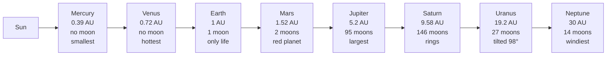

**Mnemonic — "My Very Educated Mother Just Served Us Noodles"**:
**M**ercury, **V**enus, **E**arth, **M**ars, **J**upiter, **S**aturn,
**U**ranus, **N**eptune.

**Inner (terrestrial)**: Mercury, Venus, Earth, Mars — small, rocky, few
moons.
**Outer (Jovian)**: Jupiter, Saturn, Uranus, Neptune — large, gaseous,
many moons + rings.

**Asteroid belt** lies between Mars + Jupiter. **Kuiper Belt** beyond
Neptune (Pluto — reclassified as dwarf planet, 2006). **Oort Cloud** — source
of long-period comets.

### 1.3 Earth — the home planet

- **Diameter**: 12,742 km.
- **Mass**: 5.972 × 10²⁴ kg.
- **Axial tilt**: **23.5°** — the reason for **seasons**.
- **Rotation period**: 23h 56m 4s (sidereal day).
- **Revolution period**: 365.25 days.
- **Composition**: 70.8% water surface (oceans + ice); 29.2% land.
- **Atmosphere**: 78% N₂ + 21% O₂ + 0.93% Ar + 0.04% CO₂ + trace.

### 1.4 The Moon + eclipses

- Moon orbits earth at **~384,400 km**; period **27.3 days** (sidereal);
  synodic (new-to-new) **29.5 days**.
- Same face always visible — **tidally locked**.
- **Causes tides** via gravitational pull (lunar + solar tides; spring tides
  at new/full moon; neap tides at quarter moons).
- **Solar eclipse** — new moon passes between sun + earth (Sun shadowed).
  Types: total, annular ("ring of fire"), partial, hybrid.
- **Lunar eclipse** — full moon passes into earth's shadow (Moon reddens —
  "blood moon" via Rayleigh scattering).

### 1.5 🎯 Exam hooks

- Order of planets — MVEMJSUN mnemonic.
- **Mercury** smallest; **Jupiter** largest; **Venus** hottest (runaway
  greenhouse, ~462 °C); **Neptune** windiest.
- **Axial tilt 23.5°** → cause of seasons.
- Pluto reclassified → **dwarf planet (2006, IAU, Prague)**.
- Solar eclipse = **new moon**; Lunar eclipse = **full moon**.

---

## Chapter 2 — Earth's Interior + Rocks

### 2.1 The 4 layers

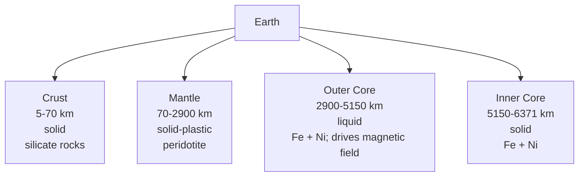

- **Crust** — continental crust avg 35 km thick; oceanic crust 5-10 km thin
  + denser. Main rocks: granite (continental) + basalt (oceanic).
- **Mantle** — 84% of Earth's volume; solid but plastic at depth (flows
  over geological timescales); **asthenosphere** (~100–200 km depth) is
  where tectonic plates move.
- **Core** — outer liquid, inner solid; temperature ~5,200°C at inner core.

**Discontinuities** (named after their discoverers):
- **Conrad** — within continental crust (granite → basalt).
- **Mohorovičić (Moho)** — crust/mantle boundary.
- **Gutenberg** — mantle/outer core.
- **Lehmann** — outer core/inner core.
- **Repetti** — upper/lower mantle.

### 2.2 Rock cycle — 3 types

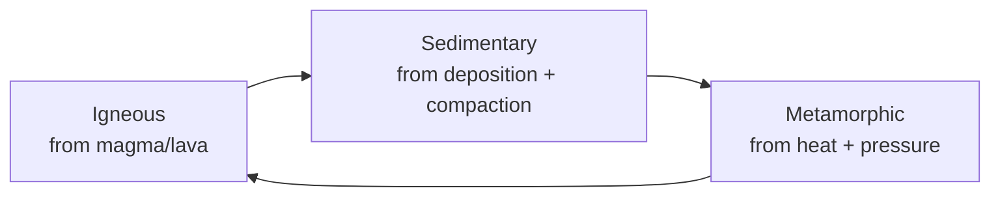

**Igneous** (from magma):
- **Intrusive / plutonic** — cooled slowly underground; coarse grains (large
  crystals); e.g., **granite, gabbro**.
- **Extrusive / volcanic** — cooled quickly on surface; fine grains; e.g.,
  **basalt, rhyolite, pumice, obsidian**.

**Sedimentary** (layered; often fossil-bearing):
- Clastic — from rock fragments (**sandstone, shale, conglomerate**).
- Organic — from dead organisms (**coal, limestone from coral**).
- Chemical — precipitation (**rock salt, gypsum**).

**Metamorphic** (heat + pressure change existing rocks):
- **Granite → Gneiss**
- **Shale → Slate → Phyllite → Schist**
- **Limestone → Marble**
- **Sandstone → Quartzite**
- **Coal → Graphite → Diamond**
- **Basalt → Amphibolite**

### 2.3 🎯 Exam hooks

- Moho = crust/mantle; Gutenberg = mantle/outer core; Lehmann = outer/inner
  core.
- **Basalt** = oceanic crust; **Granite** = continental crust.
- **Deccan Traps** = basalt from volcanic eruptions ~66 Mya (K-Pg).
- **Marble** = metamorphosed limestone.
- **Diamond** = metamorphosed coal (carbon, highest-grade).

---

## Chapter 3 — Plate Tectonics, Earthquakes, Volcanoes

### 3.1 The big idea

Earth's **lithosphere** (crust + upper mantle) is broken into **~15 major
plates** that float on the plastic **asthenosphere**. They move a few cm/year
— slow but inexorable. At their boundaries, we get **earthquakes, volcanoes,
mountain-building, ocean trenches**.

**Continental Drift hypothesis** — **Alfred Wegener (1912)** — proposed all
continents were once one — **Pangaea** — that drifted apart. Confirmed by
mid-20th century with sea-floor spreading evidence (Harry Hess, 1960s) +
palaeomagnetism (Vine-Matthews-Morley) → **Plate Tectonics theory** by 1968.

### 3.2 Types of plate boundaries

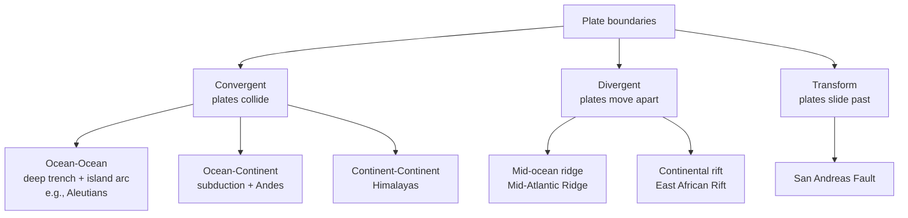

**Himalayas** — **Indian plate** colliding with **Eurasian plate** since
~50 million years ago; still rising ~5 mm/yr.

### 3.3 Earthquakes

- **Focus (hypocenter)** — point inside Earth where rupture starts.
- **Epicenter** — point on surface directly above focus.
- **Richter scale** (1935, Charles Richter) — logarithmic, open-ended;
  each step = 10× amplitude + ~32× energy.
- **Moment Magnitude (Mw)** — used by USGS now for M ≥ 5.
- **Mercalli scale** — intensity felt, qualitative I–XII.

**Waves**:
- **P (primary)** — longitudinal, fastest, through solid + liquid.
- **S (secondary)** — transverse, slower, through solids only (how we know
  outer core is liquid!).
- **L (surface)** — slowest, most damaging.

**World seismic zones**:
- **Circum-Pacific Belt** — "Ring of Fire" — **~81% of quakes**. Japan,
  Philippines, Indonesia, W. Americas.
- **Alpide Belt** — Mediterranean through Himalayas — **17%**.
- **Mid-Atlantic Ridge** — divergent, moderate.

**India's 5 seismic zones** (BIS, 2002 — simplified to 4): Zone II (low),
III (moderate), IV (severe), V (very severe — NE, J&K, parts of Uttarakhand,
Rann of Kutch, Andamans).

**Major recent earthquakes in India**:
- **Bhuj, Gujarat** — 26 Jan 2001, Mw 7.7, ~20,000 deaths.
- **Kashmir** — 8 Oct 2005, Mw 7.6, ~80,000 deaths (mostly PoK).
- **Sikkim** — 18 Sep 2011, Mw 6.9.
- **Nepal** (spillover) — 25 Apr 2015, Mw 7.8, ~9,000 deaths.

### 3.4 Volcanoes

- **Active** (erupted within recent past): Barren Island (Andamans — India's
  only active), Kilauea (Hawaii).
- **Dormant** (no recent eruption but could): Mt Vesuvius (Italy).
- **Extinct** (no expected future eruption): Mt Aconcagua (Argentina); Deccan
  Traps today.

**Types** — shield (gentle, Hawaiian, basalt, low viscosity), composite
(stratovolcano, violent, Mt St Helens + Fuji), cinder cone (small
pyroclastic), caldera (collapsed — Krakatoa, Toba).

**Deccan Traps** — India's great volcanic province; **65–66 Mya** eruptions
spewed ~500,000 km² of basalt; possibly contributed (alongside Chicxulub
asteroid) to the **K-Pg mass extinction** that killed the non-avian
dinosaurs.

### 3.5 🎯 Exam hooks

- Wegener (1912) — Continental Drift.
- Plate Tectonics formalised 1968.
- Indian plate colliding Eurasian plate → Himalayas (50 Mya, rising
  5 mm/yr).
- **S-waves cannot travel through liquid** → outer core is liquid.
- **Ring of Fire** = 81% of quakes.
- **Barren Island** = India's only active volcano.
- **Mauna Kea** (Hawaii) is the tallest mountain if measured from seafloor.
- Mt Everest (8848 m) is the tallest above sea level; in **Nepal-China** border.
- **Krakatoa** eruption 1883 → one of the loudest sounds in history.

---

## Chapter 4 — Atmosphere + Climate

### 4.1 The 5 atmospheric layers

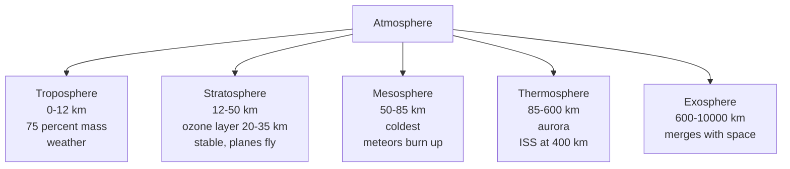

**Kármán Line — 100 km** = boundary of space (FAI). Temperature gradient:
falls in troposphere (-6.5°C/km), rises in stratosphere (due to ozone
absorbing UV), falls in mesosphere, rises in thermosphere.

### 4.2 Winds — the 3-cell model

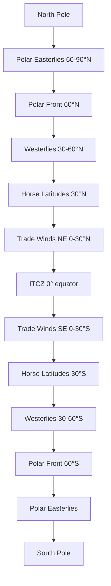

**Three circulation cells per hemisphere**: Hadley (0–30°), Ferrel (30–60°),
Polar (60–90°).

**Coriolis Effect** — Earth's rotation deflects winds **right** in NH, **left**
in SH. Zero at equator; maximum at poles.

**Named local winds**:
- **Loo** — hot, dry N India summer.
- **Mango Showers / Blossom Showers** — pre-monsoon thunderstorms Kerala-KA.
- **Nor'westers / Kaalbaisakhi** — pre-monsoon W. Bengal.
- **Chinook** — "snow-eater", USA Rockies' lee.
- **Foehn** — Alps' lee side.
- **Sirocco** — hot dusty Mediterranean (N Africa origin).
- **Mistral** — cold dry France, Rhone Valley.
- **Harmattan** — dry W. Africa.
- **Santa Ana** — California dry hot.

### 4.3 Indian Monsoon — the crown jewel topic

**Mechanism — simple version**: In summer (June–September), the **Indian
subcontinent heats up** faster than the surrounding **Indian Ocean**. Hot
air rises over land → low pressure forms. High-pressure oceanic air rushes
in from the south → moisture-laden **SW monsoon winds**. In winter, the
pattern reverses: cold land → high pressure; warm ocean → low pressure →
**NE / retreating monsoon winds** from land to sea.

**The 2 branches of SW monsoon**:

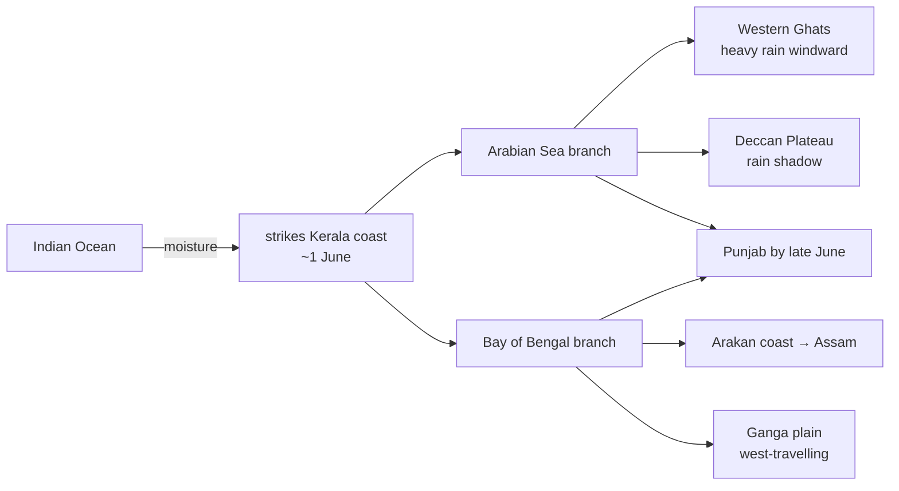

**Timeline**:
- **1 June** — Kerala onset (IMD declares).
- **10 June** — Mumbai.
- **15 June** — Kolkata, parts of NE.
- **End June** — Delhi.
- **15 July** — entire India covered.
- **1 Sep onwards** — retreat begins NW → SE.
- **15 Oct** — monsoon fully retreated.

**NE monsoon** (Oct–Dec) — brings ~60% of **Tamil Nadu's** annual rainfall;
also coastal AP + Rayalaseema + Karaikal + S. Kerala. Rest of India is dry.

**Mawsynram** (Meghalaya) — **wettest place on Earth** (~11,872 mm avg).
**Cherrapunji (Sohra)** next (~11,777 mm).

**Drivers of variability**:
- **El Niño** (anomalous Pacific warming) → weakens Indian monsoon.
- **La Niña** (Pacific cooling) → strengthens.
- **Indian Ocean Dipole (IOD)** — positive phase (W. IO warmer than E.)
  strengthens monsoon; negative phase weakens.
- **MJO** (Madden-Julian Oscillation) — eastward-moving tropical convection.

### 4.4 🎯 Exam hooks

- Troposphere has 75% of atmosphere's mass.
- **Ozone layer** is in **stratosphere**, 20–35 km.
- Kármán Line = **100 km**.
- **Coriolis** = zero at equator.
- **Loo** = N India hot dry wind; **Nor'westers** = W. Bengal; **Mango
  showers** = pre-monsoon Kerala.
- SW monsoon reaches Kerala **1 June**; retreats by 15 Oct.
- 2 branches: **Arabian Sea** + **Bay of Bengal**.
- Mawsynram = wettest place.
- **El Niño** weakens monsoon.
- Western Ghats = windward heavy rain; Deccan = rain shadow.

---

## Chapter 5 — Oceans + Currents + Tides

### 5.1 Five oceans

**Pacific > Atlantic > Indian > Southern (Antarctic) > Arctic**.

- **Deepest point**: **Challenger Deep**, Mariana Trench, Pacific — ~10,984 m.
- **Largest ocean**: Pacific, ~46% of all ocean water.
- **Busiest trade ocean**: Atlantic.
- **Youngest ocean**: Atlantic (from break-up of Pangaea).
- **Southern Ocean** recognised as 5th by IHO (2000); NatGeo (2021).

### 5.2 Ocean currents — the conveyor belts

**Warm currents** move water from equator toward poles; **cold currents**
from poles toward equator.

| Ocean | Warm current | Cold current |
|-------|--------------|--------------|
| Pacific | Kuroshio (Japan), Equatorial Counter, East Australian | California, Peru (Humboldt), Oyashio |
| Atlantic | Gulf Stream, N. Atlantic Drift, Brazil | Canary, Labrador, Benguela |
| Indian | Agulhas, Mozambique, Monsoon current (seasonal) | W. Australian |

**Gulf Stream** — brings warm Gulf-of-Mexico water up the E. US coast, then
across Atlantic as **N. Atlantic Drift** — reason **W. Europe** is milder
than its latitude suggests.

**El Niño** occurs in equatorial Pacific; **upwelling** of cold Humboldt
current off Peru drives fisheries + rainfall patterns.

### 5.3 Tides

- Caused by **gravitational pull** of Moon (dominant) + Sun.
- **Spring tides** — Sun + Moon aligned (new/full moon) → highest range.
- **Neap tides** — Sun + Moon perpendicular (quarter moons) → lowest range.
- Usually 2 high + 2 low tides per day (semi-diurnal).

**India's tidal stations**: Kandla (Gulf of Kutch — highest tidal range in
India, ~7 m); Okha, Mumbai, Haldia, Paradip, Chennai, Vizag, Cochin, Tuticorin.

### 5.4 🎯 Exam hooks

- Deepest = Challenger Deep (Mariana, Pacific), 10,984 m.
- Largest = Pacific.
- **Gulf Stream** + **N Atlantic Drift** warm W Europe.
- **Kuroshio** = Japan; **Humboldt (Peru)** = cold, fisheries.
- **Spring tide** = new/full moon.
- **Neap tide** = quarter moons.

---

# Part D — India, Physical

## Chapter 6 — India: Location + Extent + Borders

### 6.1 Key location facts

- **Latitudinal extent**: 8°4'N (Kanyakumari) to 37°6'N (Indira Col, Ladakh)
  = ~30° range.
- **Longitudinal extent**: 68°7'E (Guhar Moti, Kutch) to 97°25'E (Kibithu,
  Arunachal) = ~30° range.
- **Time difference**: ~2 hrs between eastern-most + western-most.
- **IST** = UTC + 5:30 hrs, based on **82°30'E longitude** passing through
  **Mirzapur, UP**.
- **Tropic of Cancer (23.5°N)** passes through **8 Indian states**: Gujarat,
  Rajasthan, Madhya Pradesh, Chhattisgarh, Jharkhand, West Bengal, Tripura,
  Mizoram. Mnemonic — **"Gujarat Rajasthan Ma CH JH BeTrMi"** → GR MaCH JH
  BeTrMi (or any 8-item jingle).
- **Area**: 3.287 million km² — **7th largest country**.
- **Coastline**: 7,516.6 km (mainland + islands).
- **Land border**: 15,106.7 km, shared with 7 countries.

### 6.2 Land borders (mnemonic — "BBC + MAP-N"):

Starting clockwise from W:
- **Pakistan** (3,323 km, Radcliffe Line) — 4 states: Gujarat, Rajasthan,
  Punjab, J&K.
- **Afghanistan** (106 km, **Durand Line**; entirely through PoK).
- **China** (3,488 km, **McMahon Line** in E, LAC overall) — 5 states:
  Ladakh, HP, Uttarakhand, Sikkim, Arunachal.
- **Nepal** (1,751 km) — 5 states: Uttarakhand, UP, Bihar, WB, Sikkim.
- **Bhutan** (699 km) — 4 states: Sikkim, WB, Assam, Arunachal.
- **Bangladesh** (4,096 km — longest) — 5 states: WB, Assam, Meghalaya,
  Tripura, Mizoram.
- **Myanmar** (1,643 km) — 4 states: Arunachal, Nagaland, Manipur, Mizoram.

Maritime: Sri Lanka (**Palk Strait**), Maldives.

### 6.3 🎯 Exam hooks

- IST longitude = **82°30'E** (Mirzapur).
- Tropic of Cancer crosses **8 states**.
- **Bangladesh** = longest land border (4,096 km).
- **Afghanistan** = shortest (106 km, through PoK).
- **McMahon Line** = India-China (E); **Durand Line** = India-Afghanistan;
  **Radcliffe Line** = India-Pakistan.
- Standard Meridian — 1 state covers it (UP).
- Indira Point (Great Nicobar) = southernmost tip of Indian territory
  (overall); Kanyakumari = southernmost on mainland.

---

## Chapter 7 — Physiography of India

Divided into **6 macro-regions**:

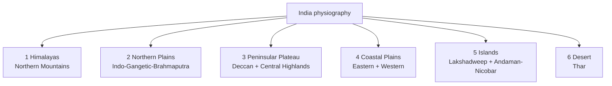

### 7.1 Himalayas — 3 parallel ranges + 4 divisions by longitude

**By parallel range (S to N)**:

1. **Shiwaliks** (Outer Himalayas) — foothills, 900–1,200 m; Duns here
   (Dehra Dun, Kotli Dun).
2. **Lesser / Middle Himalayas** — Pir Panjal, Dhauladhar, Mahabharat,
   Mussoorie, Nag Tibba; avg 3,700–4,500 m; famous hill stations
   (Shimla, Mussoorie, Nainital, Darjeeling).
3. **Greater Himalayas / Himadri** — Mount Everest, Kanchenjunga, Nanda
   Devi, Nanga Parbat; perpetually snow-covered; 6,000+ m.
4. **Trans-Himalayas** — N of Greater, includes Karakoram, Ladakh, Zanskar;
   **K2 (8611 m)** = 2nd highest peak globally (in PoK Karakoram).

**By longitude (W to E)**:

- **Punjab / Kashmir Himalayas** — Indus to Sutlej.
- **Kumaon Himalayas** — Sutlej to Kali.
- **Nepal Himalayas** — Kali to Teesta (Everest here).
- **Assam Himalayas** — Teesta to Brahmaputra (Arunachal).

**Mount Everest** — 8,848 m — India's nearest peak Kanchenjunga (8,586 m,
3rd in world) in **Sikkim** = India's highest.

**Purvanchal Range** — NE, extends from Arunachal to Mizoram: Patkai (Naga
+ Arunachal border), Naga Hills, Manipur Hills, Mizo Hills (Lushai).

### 7.2 Northern Plains — the Indo-Gangetic-Brahmaputra

- ~2,400 km long, 150–300 km wide; 7 lakh km²; world's most fertile +
  densely populated.
- 3 major rivers systems:
  - **Indus** — W (Punjab + Sindh).
  - **Ganga** — largest basin in India; Varanasi to Gangetic Delta.
  - **Brahmaputra** — from Tibet (Tsangpo) through Arunachal (Dihang)
    to Assam + Bangladesh (Jamuna).
- **Bhabar** (piedmont) → **Tarai** (marshy) → **Bhangar** (old alluvium) →
  **Khadar** (new alluvium — most fertile).

### 7.3 Peninsular Plateau

India's oldest landmass. 2 divisions:

- **Central Highlands**: Aravallis + Vindhyas + Satpuras + Maikal +
  Kaimur; Malwa + Bundelkhand + Baghelkhand plateaus.
- **Deccan Plateau**: S of Narmada; flanked by **Western Ghats** (Sahyadri)
  + **Eastern Ghats**. Rivers Godavari + Krishna + Kaveri flow east;
  Narmada + Tapi flow west (through rift valleys between Vindhyas +
  Satpuras).

**Western Ghats**: UNESCO WHS 2012; Biodiversity hotspot; **Anamudi
(Kerala, 2,695 m)** = highest peak in peninsular India.

**Eastern Ghats**: broken, less continuous; highest peak **Arma Konda**
(AP, 1,680 m). Meet Western Ghats at **Nilgiri Hills** in Tamil Nadu +
Karnataka + Kerala (**Doddabetta** = Nilgiri's highest, 2,637 m).

### 7.4 Coastal plains

- **Eastern coast** — wider, deltas (Mahanadi, Godavari, Krishna, Kaveri);
  Coromandel Coast (TN) + Northern Circars (AP + Odisha).
- **Western coast** — narrower, estuaries (not deltas); divided into Konkan
  (Maha + Goa), Kanara (Karnataka), Malabar (Kerala). Kerala Backwaters here.

### 7.5 Islands

- **Lakshadweep** — 36 Arabian Sea islands, all coral atolls; capital
  **Kavaratti**; ~32 km² — India's smallest UT by area.
- **Andaman + Nicobar** — 572 islands, volcanic origin; capital **Port Blair**
  (renamed **Shri Vijaya Puram**, 2024); Port Blair is closer to Yangon
  (Myanmar) than to Chennai.

### 7.6 Thar Desert

- In **W. Rajasthan** + extending into Gujarat + Pakistan.
- Luni is the only major river (seasonal, ephemeral).
- Indira Gandhi Canal (from Sutlej + Beas at Harike barrage) greening parts
  of Thar.

### 7.7 🎯 Exam hooks

- **Kanchenjunga** (8,586 m, Sikkim) = India's highest peak.
- **Anamudi** (Kerala, 2,695 m) = highest peak of peninsular India.
- Khadar = new alluvium; Bhangar = old alluvium.
- Narmada + Tapi flow **west** through rift valleys.
- Western Ghats = Sahyadri; Eastern Ghats = discontinuous.
- Doddabetta = Nilgiri's highest (2,637 m).
- Port Blair renamed **Shri Vijaya Puram** (2024).

---

## Chapter 8 — Rivers of India

### 8.1 The 2 river systems

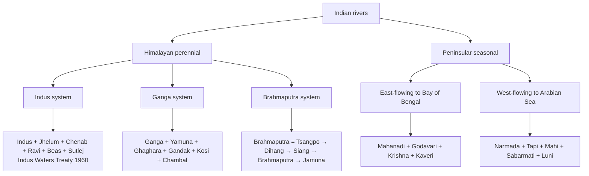

### 8.2 Himalayan rivers — key facts

- **Indus** — 3,180 km (710 km in India) — from Tibet; enters India at Leh;
  flows through J&K, Ladakh, PoK, Pakistan → Arabian Sea.
- **Ganga** — 2,525 km (largest basin in India) — **Source: Gangotri
  (Bhagirathi + Alakananda meet at Devprayag to become Ganga)**; Bay of Bengal
  via **Sundarbans delta** (world's largest).
- **Yamuna** — largest tributary of Ganga; origin Yamunotri (Uttarakhand).
  Flows past Delhi, Agra (Taj), Mathura, Prayagraj (Sangam with Ganga).
- **Brahmaputra** — 2,900 km total, 916 km in India; source **Manasarovar**
  (Tibet) as **Yarlung Tsangpo**; enters India in Arunachal as **Dihang/Siang**;
  joins with Dibang + Lohit at Sadiya to become Brahmaputra.
- **Kosi** — "Sorrow of Bihar" (shifts course); source Nepal Himalaya.
- **Ghaghara** — longest Himalayan tributary of Ganga; Nepal source (Karnali).

### 8.3 Peninsular rivers

**East-flowing (to Bay of Bengal; deltas)**:
- **Godavari** — 1,465 km, **longest Peninsular river + longest entirely within
  India**. Source: **Trimbak, Nashik** (MH). "Dakshina Ganga."
- **Krishna** — 1,400 km. Source: **Mahabaleshwar** (MH).
- **Kaveri** — 805 km. Source: **Talakaveri, Coorg** (KA). Disputes: TN-KA.
- **Mahanadi** — 858 km. Source: Chhattisgarh. Hirakud Dam.

**West-flowing (to Arabian Sea; estuaries, not deltas; through rift valleys)**:
- **Narmada** — 1,312 km. Source: **Amarkantak** (MP). Flows W through rift
  between Vindhyas + Satpuras. Sardar Sarovar Dam.
- **Tapi / Tapti** — 724 km. Source: **Multai** (MP). Similar rift pattern.
- **Sabarmati** — 371 km (Gujarat; Dhebar Lake source).
- **Mahi** — 583 km (MP → Guj).
- **Luni** — Rajasthan; ephemeral; ends in Rann.

### 8.4 Indus Waters Treaty (1960)

Signed 19 September 1960 by Nehru + Ayub Khan + World Bank (mediator).
Allocates:
- **Eastern rivers** (Ravi, Beas, Sutlej — 20%) to **India** — unrestricted use.
- **Western rivers** (Indus, Jhelum, Chenab — 80%) to **Pakistan** — India
  can use for domestic, non-consumptive, agriculture (limited), hydropower
  (run-of-river only).

Most resilient cross-border water treaty — survived 3 wars.

### 8.5 🎯 Exam hooks

- Ganga source = **Gangotri / Devprayag**.
- Yamuna source = **Yamunotri**.
- Brahmaputra source = **Manasarovar**, Tibet.
- **Godavari** = longest peninsular + longest entirely in India.
- Narmada source = **Amarkantak**; Tapi source = **Multai** — both MP.
- Narmada + Tapi flow **WEST**.
- **Kosi** = Sorrow of Bihar; **Damodar** = Sorrow of Bengal (pre-dams).
- Indus Waters Treaty = **1960**.

---

## Chapter 9 — Indian Climate + Monsoon

### 9.1 4 seasons

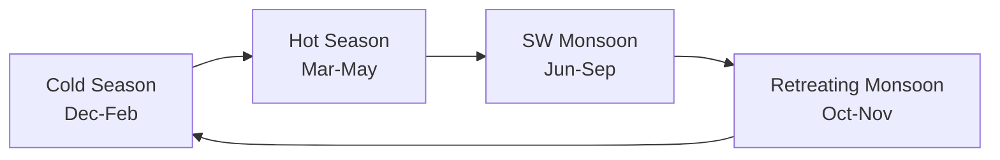

- **Cold (Dec–Feb)** — Western disturbances bring winter rain to N India
  (important for Rabi); clear skies elsewhere.
- **Hot (Mar–May)** — temperatures rise; pre-monsoon thunderstorms (Loo,
  Nor'westers, Mango showers).
- **SW Monsoon (Jun–Sep)** — gives **~75% of India's annual rainfall**.
- **Retreating / NE Monsoon (Oct–Nov)** — dry for most; wet for TN + AP
  coast.

(SW + NE monsoon mechanics — see Chapter 4 §4.3.)

### 9.2 Climate classification

**Köppen's 6 classes in India**:

1. **Aw** — Tropical savanna (most of central peninsula).
2. **Am** — Tropical monsoon (W. Ghats windward).
3. **Cwg** — Humid subtropical (N plains).
4. **Bwh** — Hot desert (Thar).
5. **Bsh** — Semi-arid (Rajasthan + parts of peninsular rain-shadow).
6. **ET / H** — Tundra / alpine (Himalayas).

### 9.3 🎯 Exam hooks

- SW monsoon = **75% of annual rain**.
- NE monsoon = most rain for **Tamil Nadu** + coastal AP.
- **Mawsynram** (Meghalaya) = wettest place on earth.
- Köppen most-common class in India = **Aw (tropical savanna)**.
- **Western Disturbances** = cold-season rain in N India.

---

## Chapter 10 — Soils of India

**6 major soil types** (ICAR classification):

| Soil | % of India | Region | Crops |
|------|-----------|--------|-------|
| **Alluvial** | ~43% | Indo-Gangetic plain, coastal + delta | Rice, wheat, sugarcane, jute, oilseeds |
| **Black (Regur)** | ~15% | Deccan Trap region — Maha, Guj, MP, KA, AP | **Cotton**, sugarcane, oilseeds |
| **Red + Yellow** | ~18% | Peninsular (Deccan + parts of E peninsula) | Millets, groundnut, cotton |
| **Laterite** | — | Kerala, Karnataka, Odisha, Assam — high-rainfall hills | Cashew, tea, coffee, rubber |
| **Arid + Desert** | — | Rajasthan + parts of Gujarat | Barley, bajra (with irrigation) |
| **Forest + Mountain** | — | Himalayas | Tea, coffee, spices |

**Also**: Saline / Alkaline (Reh — Punjab, Haryana); Peaty + Marshy (Kerala
Kuttanad, Sundarbans).

### 10.1 🎯 Exam hooks

- **Alluvial** = most widespread + most fertile.
- **Black soil** = best for **cotton**; self-ploughing (cracks in summer);
  derived from **Deccan basalt**.
- **Laterite** = high-rainfall + temperature; poor fertility.
- **Red soil** gets its colour from **iron oxide**.
- Khadar (new alluvium) vs Bhangar (old alluvium).

---

# Part E — India: Human + Economic

## Chapter 11 — Population

- **India overtook China in April 2023** — most populous country, ~144 crore
  (2024).
- **17.5% of world population** on **2.4% of land**.
- **TFR 2.0** (NFHS-5, 2019–21) — below replacement (2.1) for first time.
- **Sex ratio**: **1,020 females per 1,000 males** (NFHS-5, first time
  above 1000 in Indian history); **Kerala** best (1,084); **Haryana**
  worst (879).
- **Median age**: ~28 years → **demographic dividend**.
- **Literacy**: 77.7% (2011 Census); estimated 82%+ now.
- **Urbanisation**: ~35% (Census 2011); slow by global standards (World 55%,
  China 65%).

---

## Chapter 12 — Agriculture

### 12.1 3 cropping seasons

- **Kharif** (Jun–Oct, monsoon) — **rice, maize, bajra, jowar, ragi, cotton,
  sugarcane, tur, groundnut, soyabean, jute**.
- **Rabi** (Oct–Mar, winter) — **wheat (dominant), barley, gram, mustard,
  peas, lentil**.
- **Zaid** (Mar–Jun, summer) — watermelon, cucumber, muskmelon, fodder.

### 12.2 Crop → Largest producer state

| Crop | Largest producer |
|------|-------------------|
| Rice | **West Bengal** |
| Wheat | **Uttar Pradesh** |
| Pulses | **Madhya Pradesh** |
| Sugarcane | **Uttar Pradesh** ("sugar bowl") |
| Cotton | **Gujarat** |
| Tea | **Assam** |
| Coffee | **Karnataka** |
| Jute | **West Bengal** |
| Rubber | **Kerala** |
| Oilseeds | **Madhya Pradesh / Rajasthan** |
| Soyabean | **Madhya Pradesh** |
| Groundnut | **Gujarat** |
| Silk | **Karnataka** (mulberry) |
| Spices | **Kerala / Gujarat** |
| Coconut | **Kerala / TN** |

### 12.3 Revolutions

- **Green Revolution** (1960s–70s, Norman Borlaug + M.S. Swaminathan) —
  wheat + rice in Punjab + Haryana + W. UP.
- **White Revolution** / Operation Flood (1970s-90s, Verghese Kurien,
  Amul) — milk; India now world's #1 milk producer.
- **Yellow Revolution** — oilseeds.
- **Blue Revolution** — fishery.
- **Pink Revolution** — meat / poultry.
- **Silver Revolution** — eggs.
- **Rainbow Revolution** — holistic agri growth.

### 12.4 🎯 Exam hooks

- India is world's **#1 in MILK, PULSES, JUTE, COTTON, SPICES, BANANA,
  MANGO**.
- India is **#2 in rice, wheat, sugarcane, tea, fish, onion, potato,
  groundnut**.
- **NORMAN BORLAUG** — Father of Green Revolution globally; **M.S.
  SWAMINATHAN** — Father of Indian Green Rev.
- **White Revolution** = Amul / Operation Flood — Verghese Kurien.

---

## Chapter 13 — Minerals + Energy

### 13.1 Minerals — state-wise leaders

| Mineral | Top state |
|---------|-----------|
| Iron ore | **Odisha** (~55%) |
| Coal | **Jharkhand** (followed by Odisha, CG) |
| Bauxite (Al) | **Odisha** |
| Manganese | **Madhya Pradesh** |
| Copper | **MP / Rajasthan** |
| Mica | **Andhra Pradesh / Jharkhand** |
| Gold | **Karnataka** (Kolar, now closed; Hutti active) |
| Uranium | **Jharkhand** (Jaduguda — only operating) |
| Diamond | **Madhya Pradesh** (Panna — only) |
| Gypsum | **Rajasthan** |
| Salt | **Gujarat** |

### 13.2 Energy — India's mix (2024)

- **Total installed capacity ~452 GW**.
- **Non-fossil ~46%** (nearing 50% target).
- **Coal-based thermal**: ~53%.
- **Solar**: ~93 GW.
- **Wind**: ~47 GW.
- **Large hydro**: ~47 GW.
- **Nuclear**: ~7.5 GW.
- Target — **500 GW non-fossil by 2030**; **Net Zero by 2070**.

**Nuclear plants**:
- **Tarapur** (Maharashtra) — India's oldest (1969).
- **Rawatbhata** (Rajasthan), **Kakrapar** (Gujarat), **Kaiga** (Karnataka),
  **Kudankulam** (TN — largest, Russian VVER), **Kalpakkam** (TN — PFBR
  commissioned 2024), **Narora** (UP).

---

## Chapter 14 — Transport + Communication

### 14.1 Road + rail

- **Road**: India has ~63 lakh km road network — **2nd largest globally**.
- **National Highways**: ~1.5 lakh km (post-Bharatmala additions).
- **Golden Quadrilateral** (NHAI, begun 1999–2000, Vajpayee) — 5,846 km;
  connects Delhi-Mumbai-Chennai-Kolkata.
- **North-South + East-West Corridors** — 7,300 km.

- **Railways**: ~68,000 route-km — Asia's largest rail network; **4th
  largest globally**.
- **First railway** — 16 April 1853, **Bombay to Thane** (34 km), Lord
  Dalhousie.
- **Zones** — currently **18 zones**.
- **Vande Bharat Express** — indigenous semi-high-speed train (since 2019).

### 14.2 Air + water

- **Major airports** — ~140 operational; 35+ international.
- **Busiest** — Delhi IGI, Mumbai, Bengaluru, Chennai, Hyderabad, Kolkata.
- **Ports** — 13 major + 200+ minor. **JNPT Mumbai** (container) + **Mundra**
  (private, Adani) + **Paradip** (Odisha) + **Kandla** (Gujarat).

### 14.3 🎯 Exam hooks

- First railway = **1853, Bombay-Thane**.
- **Indian Railways** = world's 4th largest, Asia's largest network.
- **Golden Quadrilateral** = Delhi-Mumbai-Chennai-Kolkata.
- **Busiest airport** = Delhi IGI.
- India's biggest port by cargo = **Mundra** (private).

---

# Part F — World

## Chapter 15 — Continents + Countries + Oceans (key facts)

- **7 continents** — Asia, Africa, N America, S America, Antarctica, Europe,
  Australia (by area).
- **Largest country** by area — Russia (~17.1 mn km²).
- **Largest by population** — **India** (overtook China, Apr 2023).
- **Longest river** — **Nile** (6,650 km) OR **Amazon** (debated) — standard
  answer is Nile; by water volume Amazon #1.
- **Largest lake** — Caspian Sea (by area); Baikal (by volume + depth).
- **Largest desert** — Antarctica (polar); Sahara is largest hot desert
  (9.2 mn km², across 11 countries).
- **Highest peak** — Mt Everest (8,848 m).
- **Longest mountain range (land)** — Andes (7,000 km); longest overall =
  Mid-Atlantic Ridge (underwater).
- **Largest ocean** — Pacific.
- **Deepest point** — Challenger Deep, Mariana Trench, 10,984 m.

---

## Chapter 16 — Biomes (Natural Vegetation)

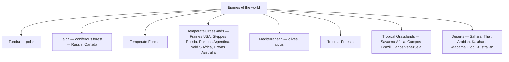

### 16.1 🎯 Exam hooks

- **Prairies** = N America grasslands; **Pampas** = Argentina; **Steppes** =
  Russia; **Veld** = S Africa; **Downs** = Australia; **Llanos** = Venezuela
  + Colombia; **Campos** = Brazil; **Savanna** = Africa.

---

# Appendices

## Appendix A — India's 28 states + 8 UTs (capital shortcut)

| State | Capital | State | Capital |
|-------|---------|-------|---------|
| AP | Amaravati (de facto) | Maharashtra | Mumbai |
| Arunachal Pradesh | Itanagar | Manipur | Imphal |
| Assam | Dispur (Guwahati) | Meghalaya | Shillong |
| Bihar | Patna | Mizoram | Aizawl |
| Chhattisgarh | Raipur | Nagaland | Kohima |
| Goa | Panaji | Odisha | Bhubaneswar |
| Gujarat | Gandhinagar | Punjab | Chandigarh |
| Haryana | Chandigarh | Rajasthan | Jaipur |
| Himachal | Shimla | Sikkim | Gangtok |
| Jharkhand | Ranchi | Tamil Nadu | Chennai |
| Karnataka | Bengaluru | Telangana | Hyderabad |
| Kerala | Thiruvananthapuram | Tripura | Agartala |
| MP | Bhopal | UP | Lucknow |
| Maharashtra | Mumbai | Uttarakhand | Dehradun / Gairsain (summer) |
| WB | Kolkata |  |  |

UTs (8): Delhi, Puducherry, J&K (3 with legislature); Chandigarh, A&N
Islands, Lakshadweep, Dadra-Nagar-Haveli+Daman-Diu, Ladakh (5 without).

## Appendix B — Mnemonic compendium

- **MVEMJSUN** → planets.
- **FED-RIVE** → IVC decline (shared with History).
- **Ring of Fire** → 81% of earthquakes.
- **Arabian Sea + Bay of Bengal** → two branches of SW monsoon.
- **Mawsynram > Cherrapunji** → wettest places.
- **Khadar vs Bhangar** → new vs old alluvium.
- **GR MaCH JH BeTrMi** → 8 Tropic-of-Cancer states.
- **"Western disturbances"** → N India winter rain.
- **"Nawab-Wilma"** cyclone-type names rotate in Indian Ocean basin.

## Appendix C — Cheatsheet (1 page)

- **IST** — 82°30'E Mirzapur; UTC+5:30.
- **Total area** — 3.287 Mkm² (7th largest); coastline 7,517 km; land
  border 15,107 km.
- **Longest land border** — Bangladesh (4,096 km).
- **Shortest** — Afghanistan (106 km, via PoK).
- **Himalayas**: Shiwalik → Lesser → Greater → Trans; Kanchenjunga highest
  in India.
- **Rivers**: Ganga-Yamuna largest N; Godavari longest entirely in India;
  Narmada + Tapi flow WEST.
- **Monsoon onset** — Kerala 1 June; covers whole country by 15 July.
- **Wettest place** — Mawsynram (Meghalaya).
- **Tropic of Cancer** crosses **8 states**.
- **Alluvial soil** most widespread; black soil best for cotton.
- **Largest iron-ore producer state** — Odisha.
- **Largest wheat** — UP; largest rice — WB.
- Nuclear plants — Tarapur (oldest), Kudankulam (largest), Kalpakkam
  (fast breeder 2024).
- India — most populous since **Apr 2023** (~144 cr).
- Non-fossil target — **500 GW by 2030**; **Net Zero by 2070**.
- Golden Quadrilateral — Delhi-Mumbai-Chennai-Kolkata.

*Parts C (oceans in detail), world countries' capitals, world cities +
resources will be added in subsequent revisions of this file.*
