# EXAMINER BLUEPRINT — What Gets Tested Most

Geography in competitive exams splits into two zones: **physical geography** (earth's structure, atmosphere, rivers, climate, soils) and **Indian geography** (states, rivers, national parks, minerals, ports, passes). Examiners lean heavily on Indian geography, where factual precision matters most.

**Top 8 geography exam hotspots**

1. **India's rivers** — which rivers flow east vs west, which originate in which mountain range, which drain into which sea, important dams. Appears in every SSC, RRB, and Banking exam.
2. **States: superlatives** — largest/smallest by area and population, longest coastline, wettest/driest, highest peak. Classic 1-mark questions.
3. **National Parks and Wildlife Sanctuaries** — first NP, only floating NP, Project Tiger reserves, UNESCO sites. Examiners love these.
4. **Climate and Monsoon** — types of monsoon, winter rain (NE monsoon vs Western disturbances), Cherrapunji vs Mawsynram.
5. **Soils of India** — black soil (cotton), red soil, laterite soil (not fertile), alluvial soil (most fertile, most extensive).
6. **Minerals and their states** — coal (Jharkhand, Odisha, WB), iron ore (Odisha, Jharkhand, Karnataka), mica (Rajasthan), bauxite (Odisha), petroleum (Assam, Gujarat, Rajasthan, Mumbai High).
7. **Passes** — Khyber, Bolan, Zoji La, Nathu La, Shipki La — which connects which.
8. **World geography superlatives** — longest river, highest peak, largest desert, deepest lake, largest ocean. Guaranteed 2–3 marks.

**Study priority for time-poor students**

1. India's rivers — east vs west flowing, origins, dams
2. State superlatives (area, population, coastline)
3. Soils of India — 4 types + which crop grows in which
4. National Parks — first, largest, only floating, biosphere reserves
5. Minerals — where each major mineral is found
6. Monsoon — branches, onset dates, withdrawal dates
7. World superlatives — 10 key facts
8. Passes — 5–6 key ones connecting India to neighbours

---

# How To Use This Book

Geography rewards **visual memory** above all. You cannot remember the monsoon without a mental picture of the Bay of Bengal branch curving up into Assam; you cannot remember the southern peninsula's rivers without a map in your head with Godavari flowing east and Narmada flowing west. Build that mental map — the rest follows.

Keep a physical map of India visible while reading this book. Trace each river, each state border, each mountain range with your finger as you read about it. The physical act of tracing locks location into memory far better than reading alone.

This book moves **outward → inward**:

- **Part A — The Planet** — universe, solar system, earth's interior, rocks.
- **Part B — Forces Shaping Earth** — plate tectonics, earthquakes,
  volcanoes, atmosphere, climate.
- **Part C — Water + Biomes** — oceans, currents, tides, biomes, forests.
- **Part D — India, physical** — location, physiography, rivers, climate +
  monsoon, soils, natural vegetation, wildlife.
- **Part E — India, human + economic** — population, agriculture, industry,
  minerals + energy, transport, communication.
- **Part F — World, political + economic** — continents, countries, major
  cities, important resources, trade + organisations.

> **Map rule**: keep a wall map of India + a world map visible while you
> read. Trace each feature with your finger. The kinaesthetic act locks
> location into memory much better than eye-reading alone.

---

# Part A — The Planet

## Chapter 1 — The Universe + the Solar System

### 1.1 Hook

**13.8 billion years ago**, all matter + energy was compressed into a point
of infinite density — the **Big Bang**. Space-time expanded, hydrogen +
helium coalesced into stars, stars cooked heavier elements + exploded as
supernovae, and from the remnants our **Solar System** formed **~4.6 billion
years ago**. The **Earth** coalesced **4.54 billion years ago**. **Life**
began ~3.8 billion years ago. **Modern humans** — **~200,000 years ago**.

Our Sun is a **G-type main-sequence star (G2V)**, ~4.6 billion years old,
~5 billion years still to go. It lies about **~27,000 light-years** from the
centre of the **Milky Way galaxy**. The Milky Way + its neighbours are part
of the **Local Group**, part of the **Virgo Supercluster**, part of the
**Laniakea Supercluster**.

### 1.2 The 8 planets — order + traits

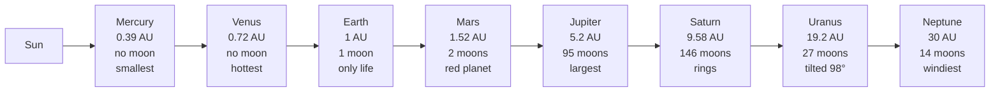

**Mnemonic — "My Very Educated Mother Just Served Us Noodles"**:
**M**ercury, **V**enus, **E**arth, **M**ars, **J**upiter, **S**aturn,
**U**ranus, **N**eptune.

**Inner (terrestrial)**: Mercury, Venus, Earth, Mars — small, rocky, few
moons.
**Outer (Jovian)**: Jupiter, Saturn, Uranus, Neptune — large, gaseous,
many moons + rings.

**Asteroid belt** lies between Mars + Jupiter. **Kuiper Belt** beyond
Neptune (Pluto — reclassified as dwarf planet, 2006). **Oort Cloud** — source
of long-period comets.

### 1.3 Earth — the home planet

- **Diameter**: 12,742 km.
- **Mass**: 5.972 × 10²⁴ kg.
- **Axial tilt**: **23.5°** — the reason for **seasons**.
- **Rotation period**: 23h 56m 4s (sidereal day).
- **Revolution period**: 365.25 days.
- **Composition**: 70.8% water surface (oceans + ice); 29.2% land.
- **Atmosphere**: 78% N₂ + 21% O₂ + 0.93% Ar + 0.04% CO₂ + trace.

### 1.4 The Moon + eclipses

- Moon orbits earth at **~384,400 km**; period **27.3 days** (sidereal);
  synodic (new-to-new) **29.5 days**.
- Same face always visible — **tidally locked**.
- **Causes tides** via gravitational pull (lunar + solar tides; spring tides
  at new/full moon; neap tides at quarter moons).
- **Solar eclipse** — new moon passes between sun + earth (Sun shadowed).
  Types: total, annular ("ring of fire"), partial, hybrid.
- **Lunar eclipse** — full moon passes into earth's shadow (Moon reddens —
  "blood moon" via Rayleigh scattering).

### 1.5 Exam hooks

- Order of planets — MVEMJSUN mnemonic.
- **Mercury** smallest; **Jupiter** largest; **Venus** hottest (runaway
  greenhouse, ~462 °C); **Neptune** windiest.
- **Axial tilt 23.5°** → cause of seasons.
- Pluto reclassified → **dwarf planet (2006, IAU, Prague)**.
- Solar eclipse = **new moon**; Lunar eclipse = **full moon**.

---

flowchart TD
    R["UNIVERSE AND SOLAR SYSTEM"]:::root
    R --> U["Universe Facts"]:::date
    R --> P["Planets — 8 in order"]:::key
    R --> EX["Extremes"]:::key
    R --> TR["TRAP: Hottest planet"]:::trap
    U --> U1["Big Bang: 13.8 billion years ago Solar System: 4.6 billion years old Milky Way: spiral galaxy; 100,000 light years wide"]:::date
    U --> U2["Sun: G-type main-sequence star Distance from Earth: 150 million km = 1 AU Light travel: 8 min 20 sec"]:::key
    P --> P1["Mercury-Venus-Earth-Mars (inner) Jupiter-Saturn-Uranus-Neptune (outer) Largest: Jupiter; Smallest: Mercury"]:::key
    P --> P2["Brightest in sky: Venus Red planet: Mars (iron oxide) Blue planet: Earth (water)"]:::key
    EX --> EX1["Nearest star: Proxima Centauri (4.2 light-years) Moon distance: 384,400 km; light: 1.28 sec Earth's satellite: Moon"]:::key
    TR --> TR1["TRAP: Hottest planet = VENUS not Mercury Reason: Venus has thick CO2 atmosphere greenhouse effect traps heat (460 degrees C)"]:::trap
    classDef key fill:#dbeafe,stroke:#2563eb,color:#1e3a5f
    classDef trap fill:#fee2e2,stroke:#dc2626,color:#7f1d1d
    classDef date fill:#fef3c7,stroke:#d97706,color:#78350f
    classDef proc fill:#dcfce7,stroke:#16a34a,color:#14532d
    classDef root fill:#f3e8ff,stroke:#9333ea,color:#4c1d95

## Chapter 2 — Earth's Interior + Rocks

### 2.1 The 4 layers

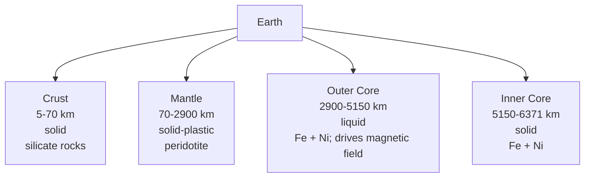

- **Crust** — continental crust avg 35 km thick; oceanic crust 5-10 km thin
  + denser. Main rocks: granite (continental) + basalt (oceanic).
- **Mantle** — 84% of Earth's volume; solid but plastic at depth (flows
  over geological timescales); **asthenosphere** (~100–200 km depth) is
  where tectonic plates move.
- **Core** — outer liquid, inner solid; temperature ~5,200°C at inner core.

**Discontinuities** (named after their discoverers):
- **Conrad** — within continental crust (granite → basalt).
- **Mohorovičić (Moho)** — crust/mantle boundary.
- **Gutenberg** — mantle/outer core.
- **Lehmann** — outer core/inner core.
- **Repetti** — upper/lower mantle.

### 2.2 Rock cycle — 3 types

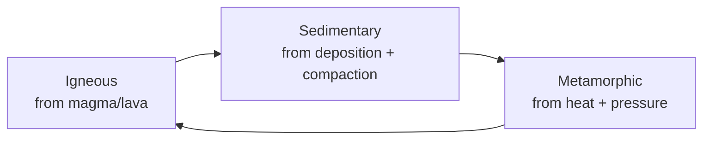

**Igneous** (from magma):
- **Intrusive / plutonic** — cooled slowly underground; coarse grains (large
  crystals); e.g., **granite, gabbro**.
- **Extrusive / volcanic** — cooled quickly on surface; fine grains; e.g.,
  **basalt, rhyolite, pumice, obsidian**.

**Sedimentary** (layered; often fossil-bearing):
- Clastic — from rock fragments (**sandstone, shale, conglomerate**).
- Organic — from dead organisms (**coal, limestone from coral**).
- Chemical — precipitation (**rock salt, gypsum**).

**Metamorphic** (heat + pressure change existing rocks):
- **Granite → Gneiss**
- **Shale → Slate → Phyllite → Schist**
- **Limestone → Marble**
- **Sandstone → Quartzite**
- **Coal → Graphite → Diamond**
- **Basalt → Amphibolite**

### 2.3 Exam hooks

- Moho = crust/mantle; Gutenberg = mantle/outer core; Lehmann = outer/inner
  core.
- **Basalt** = oceanic crust; **Granite** = continental crust.
- **Deccan Traps** = basalt from volcanic eruptions ~66 Mya (K-Pg).
- **Marble** = metamorphosed limestone.
- **Diamond** = metamorphosed coal (carbon, highest-grade).

---

flowchart TD
    R["EARTH'S INTERIOR AND ROCKS"]:::root
    R --> L["3 Layers"]:::proc
    R --> D["Discontinuities"]:::key
    R --> RK["Rock Types"]:::key
    R --> TR["TRAP: Which rock has fossils?"]:::trap
    L --> L1["Crust: 5-70 km thick Oceanic = basalt (SIMA) Continental = granite (SIAL)"]:::key
    L --> L2["Mantle: 2900 km thick Asthenosphere: semi-molten; tectonic plates ride on it Lithosphere = Crust + upper Mantle"]:::key
    L --> L3["Core: Outer core = liquid iron-nickel Inner core = solid iron-nickel Source of Earth's magnetic field"]:::key
    D --> D1["Mohorovicic (Moho): Crust-Mantle boundary Gutenberg: Mantle-Outer Core Lehmann: Outer-Inner Core"]:::key
    RK --> RK1["Igneous: from magma Intrusive: granite (slow-cool, coarse) Extrusive: basalt (fast-cool, fine)"]:::key
    RK --> RK2["Sedimentary: layers of sediment Limestone, sandstone, shale FOSSILS found ONLY here"]:::key
    RK --> RK3["Metamorphic: heat + pressure transform existing rock Limestone-Marble; Shale-Slate Coal-Graphite; Graphite-Diamond"]:::key
    TR --> TR1["TRAP: Fossils in SEDIMENTARY rocks ONLY Not in igneous (formed from magma) Not in metamorphic (heat destroys fossils)"]:::trap
    classDef key fill:#dbeafe,stroke:#2563eb,color:#1e3a5f
    classDef trap fill:#fee2e2,stroke:#dc2626,color:#7f1d1d
    classDef date fill:#fef3c7,stroke:#d97706,color:#78350f
    classDef proc fill:#dcfce7,stroke:#16a34a,color:#14532d
    classDef root fill:#f3e8ff,stroke:#9333ea,color:#4c1d95

## Chapter 3 — Plate Tectonics, Earthquakes, Volcanoes

### 3.1 The big idea

Earth's **lithosphere** (crust + upper mantle) is broken into **~15 major
plates** that float on the plastic **asthenosphere**. They move a few cm/year
— slow but inexorable. At their boundaries, we get **earthquakes, volcanoes,
mountain-building, ocean trenches**.

**Continental Drift hypothesis** — **Alfred Wegener (1912)** — proposed all
continents were once one — **Pangaea** — that drifted apart. Confirmed by
mid-20th century with sea-floor spreading evidence (Harry Hess, 1960s) +
palaeomagnetism (Vine-Matthews-Morley) → **Plate Tectonics theory** by 1968.

### 3.2 Types of plate boundaries

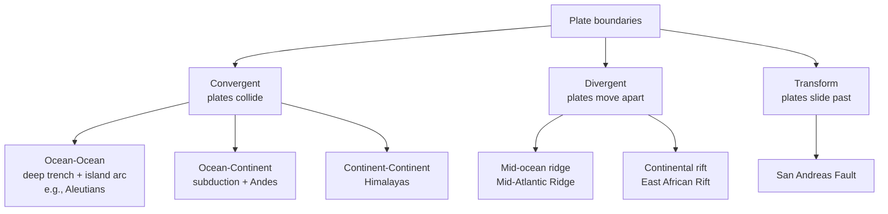

**Himalayas** — **Indian plate** colliding with **Eurasian plate** since
~50 million years ago; still rising ~5 mm/yr.

### 3.3 Earthquakes

- **Focus (hypocenter)** — point inside Earth where rupture starts.
- **Epicenter** — point on surface directly above focus.
- **Richter scale** (1935, Charles Richter) — logarithmic, open-ended;
  each step = 10× amplitude + ~32× energy.
- **Moment Magnitude (Mw)** — used by USGS now for M ≥ 5.
- **Mercalli scale** — intensity felt, qualitative I–XII.

**Waves**:
- **P (primary)** — longitudinal, fastest, through solid + liquid.
- **S (secondary)** — transverse, slower, through solids only (how we know
  outer core is liquid!).
- **L (surface)** — slowest, most damaging.

**World seismic zones**:
- **Circum-Pacific Belt** — "Ring of Fire" — **~81% of quakes**. Japan,
  Philippines, Indonesia, W. Americas.
- **Alpide Belt** — Mediterranean through Himalayas — **17%**.
- **Mid-Atlantic Ridge** — divergent, moderate.

**India's 5 seismic zones** (BIS, 2002 — simplified to 4): Zone II (low),
III (moderate), IV (severe), V (very severe — NE, J&K, parts of Uttarakhand,
Rann of Kutch, Andamans).

**Major recent earthquakes in India**:
- **Bhuj, Gujarat** — 26 Jan 2001, Mw 7.7, ~20,000 deaths.
- **Kashmir** — 8 Oct 2005, Mw 7.6, ~80,000 deaths (mostly PoK).
- **Sikkim** — 18 Sep 2011, Mw 6.9.
- **Nepal** (spillover) — 25 Apr 2015, Mw 7.8, ~9,000 deaths.

### 3.4 Volcanoes

- **Active** (erupted within recent past): Barren Island (Andamans — India's
  only active), Kilauea (Hawaii).
- **Dormant** (no recent eruption but could): Mt Vesuvius (Italy).
- **Extinct** (no expected future eruption): Mt Aconcagua (Argentina); Deccan
  Traps today.

**Types** — shield (gentle, Hawaiian, basalt, low viscosity), composite
(stratovolcano, violent, Mt St Helens + Fuji), cinder cone (small
pyroclastic), caldera (collapsed — Krakatoa, Toba).

**Deccan Traps** — India's great volcanic province; **65–66 Mya** eruptions
spewed ~500,000 km² of basalt; possibly contributed (alongside Chicxulub
asteroid) to the **K-Pg mass extinction** that killed the non-avian
dinosaurs.

### 3.5 Exam hooks

- Wegener (1912) — Continental Drift.
- Plate Tectonics formalised 1968.
- Indian plate colliding Eurasian plate → Himalayas (50 Mya, rising
  5 mm/yr).
- **S-waves cannot travel through liquid** → outer core is liquid.
- **Ring of Fire** = 81% of quakes.
- **Barren Island** = India's only active volcano.
- **Mauna Kea** (Hawaii) is the tallest mountain if measured from seafloor.
- Mt Everest (8848 m) is the tallest above sea level; in **Nepal-China** border.
- **Krakatoa** eruption 1883 → one of the loudest sounds in history.

---

flowchart TD
    R["PLATE TECTONICS"]:::root
    R --> CT["Continental Drift Theory"]:::date
    R --> PB["Plate Boundaries"]:::proc
    R --> EQ["Earthquakes"]:::key
    R --> VO["Volcanoes"]:::key
    CT --> CT1["Alfred Wegener 1915: 'Continental Drift' Evidence: Jigsaw fit of continents Glossopteris fossil on S. America + Africa"]:::date
    PB --> PB1["Divergent: plates move apart Mid-Atlantic Ridge; new crust formed Rift valleys + undersea mountains"]:::proc
    PB --> PB2["Convergent: plates collide Ocean-ocean: island arc + trench Ocean-continent: subduction + trench (deepest)"]:::proc
    PB --> PB3["Transform: plates slide past each other San Andreas Fault, California Earthquakes — no volcanic activity"]:::proc
    EQ --> EQ1["Richter scale: logarithmic (1-9+) Moment Magnitude Scale (MMS): modern standard Focus = underground point; Epicentre = surface above"]:::key
    EQ --> EQ2["Seismograph measures earthquake waves P-waves (primary), S-waves (secondary), Surface waves S-waves cannot pass through liquid outer core"]:::key
    VO --> VO1["Pacific Ring of Fire: 75% of world's volcanoes + 90% of world's earthquakes Surrounds Pacific Ocean"]:::key
    VO --> VO2["Mariana Trench: deepest point on Earth 11,034 m in Pacific Ocean Formed by subduction zone"]:::date
    classDef key fill:#dbeafe,stroke:#2563eb,color:#1e3a5f
    classDef trap fill:#fee2e2,stroke:#dc2626,color:#7f1d1d
    classDef date fill:#fef3c7,stroke:#d97706,color:#78350f
    classDef proc fill:#dcfce7,stroke:#16a34a,color:#14532d
    classDef root fill:#f3e8ff,stroke:#9333ea,color:#4c1d95

## Chapter 4 — Atmosphere + Climate

### 4.1 The 5 atmospheric layers

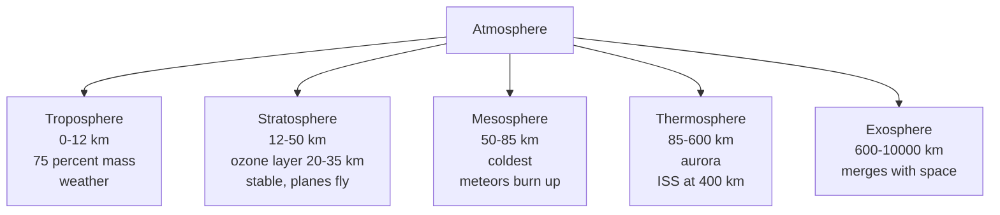

**Kármán Line — 100 km** = boundary of space (FAI). Temperature gradient:
falls in troposphere (-6.5°C/km), rises in stratosphere (due to ozone
absorbing UV), falls in mesosphere, rises in thermosphere.

### 4.2 Winds — the 3-cell model

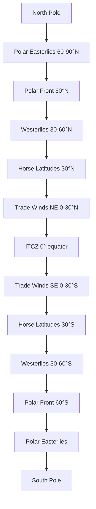

**Three circulation cells per hemisphere**: Hadley (0–30°), Ferrel (30–60°),
Polar (60–90°).

**Coriolis Effect** — Earth's rotation deflects winds **right** in NH, **left**
in SH. Zero at equator; maximum at poles.

**Named local winds**:
- **Loo** — hot, dry N India summer.
- **Mango Showers / Blossom Showers** — pre-monsoon thunderstorms Kerala-KA.
- **Nor'westers / Kaalbaisakhi** — pre-monsoon W. Bengal.
- **Chinook** — "snow-eater", USA Rockies' lee.
- **Foehn** — Alps' lee side.
- **Sirocco** — hot dusty Mediterranean (N Africa origin).
- **Mistral** — cold dry France, Rhone Valley.
- **Harmattan** — dry W. Africa.
- **Santa Ana** — California dry hot.

### 4.3 Indian Monsoon — the crown jewel topic

**Mechanism — simple version**: In summer (June–September), the **Indian
subcontinent heats up** faster than the surrounding **Indian Ocean**. Hot
air rises over land → low pressure forms. High-pressure oceanic air rushes
in from the south → moisture-laden **SW monsoon winds**. In winter, the
pattern reverses: cold land → high pressure; warm ocean → low pressure →
**NE / retreating monsoon winds** from land to sea.

**The 2 branches of SW monsoon**:

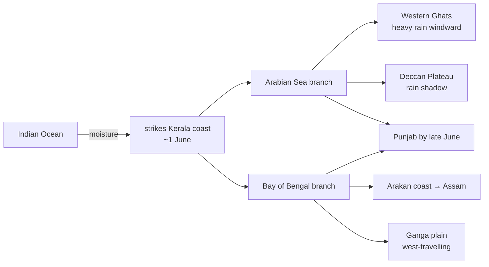

**Timeline**:
- **1 June** — Kerala onset (IMD declares).
- **10 June** — Mumbai.
- **15 June** — Kolkata, parts of NE.
- **End June** — Delhi.
- **15 July** — entire India covered.
- **1 Sep onwards** — retreat begins NW → SE.
- **15 Oct** — monsoon fully retreated.

**NE monsoon** (Oct–Dec) — brings ~60% of **Tamil Nadu's** annual rainfall;
also coastal AP + Rayalaseema + Karaikal + S. Kerala. Rest of India is dry.

**Mawsynram** (Meghalaya) — **wettest place on Earth** (~11,872 mm avg).
**Cherrapunji (Sohra)** next (~11,777 mm).

**Drivers of variability**:
- **El Niño** (anomalous Pacific warming) → weakens Indian monsoon.
- **La Niña** (Pacific cooling) → strengthens.
- **Indian Ocean Dipole (IOD)** — positive phase (W. IO warmer than E.)
  strengthens monsoon; negative phase weakens.
- **MJO** (Madden-Julian Oscillation) — eastward-moving tropical convection.

### 4.4 Exam hooks

- Troposphere has 75% of atmosphere's mass.
- **Ozone layer** is in **stratosphere**, 20–35 km.
- Kármán Line = **100 km**.
- **Coriolis** = zero at equator.
- **Loo** = N India hot dry wind; **Nor'westers** = W. Bengal; **Mango
  showers** = pre-monsoon Kerala.
- SW monsoon reaches Kerala **1 June**; retreats by 15 Oct.
- 2 branches: **Arabian Sea** + **Bay of Bengal**.
- Mawsynram = wettest place.
- **El Niño** weakens monsoon.
- Western Ghats = windward heavy rain; Deccan = rain shadow.

---

flowchart TD
    R["ATMOSPHERE AND CLIMATE"]:::root
    R --> L["5 Atmospheric Layers"]:::key
    R --> TR["TRAP: Temperature changes per layer"]:::trap
    R --> OZ["Ozone Layer"]:::key
    L --> L1["Troposphere: 0-16 km Weather occurs here Temp DECREASES with altitude (-6.5 C per km)"]:::key
    L --> L2["Stratosphere: 16-50 km Ozone layer (15-35 km) absorbs UV Temp INCREASES with altitude — stable, no weather"]:::key
    L --> L3["Mesosphere: 50-80 km Meteors burn here Temp DECREASES — coldest layer"]:::key
    L --> L4["Thermosphere: 80-600 km Aurora borealis and aurora australis ISS orbits here (400 km); very hot but low density"]:::key
    L --> L5["Exosphere: 600+ km Satellites; merges into outer space Mostly hydrogen + helium"]:::key
    OZ --> OZ1["Ozone = O3; protects from UV-B radiation CFC (chlorofluorocarbon) destroys ozone Montreal Protocol 1987: phase out CFCs"]:::key
    OZ --> OZ2["Ozone hole: over Antarctica Discovered 1985; still healing Freon (CFC-12) was main culprit"]:::key
    TR --> TR1["TRAP: Remember alternating temp pattern Troposphere: decreases; Stratosphere: increases Mesosphere: decreases; Thermosphere: increases"]:::trap
    classDef key fill:#dbeafe,stroke:#2563eb,color:#1e3a5f
    classDef trap fill:#fee2e2,stroke:#dc2626,color:#7f1d1d
    classDef date fill:#fef3c7,stroke:#d97706,color:#78350f
    classDef proc fill:#dcfce7,stroke:#16a34a,color:#14532d
    classDef root fill:#f3e8ff,stroke:#9333ea,color:#4c1d95

## Chapter 5 — Oceans + Currents + Tides

### 5.1 Five oceans

**Pacific > Atlantic > Indian > Southern (Antarctic) > Arctic**.

- **Deepest point**: **Challenger Deep**, Mariana Trench, Pacific — ~10,984 m.
- **Largest ocean**: Pacific, ~46% of all ocean water.
- **Busiest trade ocean**: Atlantic.
- **Youngest ocean**: Atlantic (from break-up of Pangaea).
- **Southern Ocean** recognised as 5th by IHO (2000); NatGeo (2021).

### 5.2 Ocean currents — the conveyor belts

**Warm currents** move water from equator toward poles; **cold currents**
from poles toward equator.

| Ocean | Warm current | Cold current |
|-------|--------------|--------------|
| Pacific | Kuroshio (Japan), Equatorial Counter, East Australian | California, Peru (Humboldt), Oyashio |
| Atlantic | Gulf Stream, N. Atlantic Drift, Brazil | Canary, Labrador, Benguela |
| Indian | Agulhas, Mozambique, Monsoon current (seasonal) | W. Australian |

**Gulf Stream** — brings warm Gulf-of-Mexico water up the E. US coast, then
across Atlantic as **N. Atlantic Drift** — reason **W. Europe** is milder
than its latitude suggests.

**El Niño** occurs in equatorial Pacific; **upwelling** of cold Humboldt
current off Peru drives fisheries + rainfall patterns.

### 5.3 Tides

- Caused by **gravitational pull** of Moon (dominant) + Sun.
- **Spring tides** — Sun + Moon aligned (new/full moon) → highest range.
- **Neap tides** — Sun + Moon perpendicular (quarter moons) → lowest range.
- Usually 2 high + 2 low tides per day (semi-diurnal).

**India's tidal stations**: Kandla (Gulf of Kutch — highest tidal range in
India, ~7 m); Okha, Mumbai, Haldia, Paradip, Chennai, Vizag, Cochin, Tuticorin.

### 5.4 Exam hooks

- Deepest = Challenger Deep (Mariana, Pacific), 10,984 m.
- Largest = Pacific.
- **Gulf Stream** + **N Atlantic Drift** warm W Europe.
- **Kuroshio** = Japan; **Humboldt (Peru)** = cold, fisheries.
- **Spring tide** = new/full moon.
- **Neap tide** = quarter moons.

---

# Part D — India, Physical

flowchart TD
    R["OCEANS, CURRENTS, TIDES"]:::root
    R --> OC["5 Oceans"]:::key
    R --> CU["Ocean Currents"]:::key
    R --> TI["Tides"]:::key
    R --> TR["TRAP: Spring vs Neap tides"]:::trap
    OC --> OC1["Pacific: largest + deepest Atlantic: 2nd largest; S-shaped Indian: 3rd; surrounds India"]:::key
    OC --> OC2["Deepest point: Mariana Trench 11,034 m Challenger Deep — Pacific Ocean"]:::date
    CU --> CU1["WARM currents: move toward poles Gulf Stream: N Atlantic; warms W Europe Kuroshio: N Pacific"]:::key
    CU --> CU2["COLD currents: move toward equator Labrador: N Atlantic (cold fog on Newfoundland) Peru/Humboldt: S Pacific (makes Chile coast dry)"]:::key
    CU --> CU3["TRAP: California current = COLD Gulf Stream = WARM Benguela current (off W Africa) = COLD"]:::trap
    TI --> TI1["Caused by: Moon's gravity (mainly) + Sun Spring tides: Sun-Earth-Moon aligned Full Moon or New Moon — HIGHEST tides"]:::key
    TI --> TI2["Neap tides: Moon at right angle to Sun-Earth Quarter Moon phase — LOWEST tidal range 2 high tides + 2 low tides per day (semidiurnal)"]:::key
    TR --> TR1["TRAP: Spring tide = NOT spring season Spring = Latin 'springing up' (bigger tides) Neap = Old English 'scanty' (smaller)"]:::trap
    classDef key fill:#dbeafe,stroke:#2563eb,color:#1e3a5f
    classDef trap fill:#fee2e2,stroke:#dc2626,color:#7f1d1d
    classDef date fill:#fef3c7,stroke:#d97706,color:#78350f
    classDef proc fill:#dcfce7,stroke:#16a34a,color:#14532d
    classDef root fill:#f3e8ff,stroke:#9333ea,color:#4c1d95

## Chapter 6 — India: Location + Extent + Borders

### 6.1 Key location facts

- **Latitudinal extent**: 8°4'N (Kanyakumari) to 37°6'N (Indira Col, Ladakh)
  = ~30° range.
- **Longitudinal extent**: 68°7'E (Guhar Moti, Kutch) to 97°25'E (Kibithu,
  Arunachal) = ~30° range.
- **Time difference**: ~2 hrs between eastern-most + western-most.
- **IST** = UTC + 5:30 hrs, based on **82°30'E longitude** passing through
  **Mirzapur, UP**.
- **Tropic of Cancer (23.5°N)** passes through **8 Indian states**: Gujarat,
  Rajasthan, Madhya Pradesh, Chhattisgarh, Jharkhand, West Bengal, Tripura,
  Mizoram. Mnemonic — **"Gujarat Rajasthan Ma CH JH BeTrMi"** → GR MaCH JH
  BeTrMi (or any 8-item jingle).
- **Area**: 3.287 million km² — **7th largest country**.
- **Coastline**: 7,516.6 km (mainland + islands).
- **Land border**: 15,106.7 km, shared with 7 countries.

### 6.2 Land borders (mnemonic — "BBC + MAP-N"):

Starting clockwise from W:
- **Pakistan** (3,323 km, Radcliffe Line) — 4 states: Gujarat, Rajasthan,
  Punjab, J&K.
- **Afghanistan** (106 km, **Durand Line**; entirely through PoK).
- **China** (3,488 km, **McMahon Line** in E, LAC overall) — 5 states:
  Ladakh, HP, Uttarakhand, Sikkim, Arunachal.
- **Nepal** (1,751 km) — 5 states: Uttarakhand, UP, Bihar, WB, Sikkim.
- **Bhutan** (699 km) — 4 states: Sikkim, WB, Assam, Arunachal.
- **Bangladesh** (4,096 km — longest) — 5 states: WB, Assam, Meghalaya,
  Tripura, Mizoram.
- **Myanmar** (1,643 km) — 4 states: Arunachal, Nagaland, Manipur, Mizoram.

Maritime: Sri Lanka (**Palk Strait**), Maldives.

### 6.3 Exam hooks

- IST longitude = **82°30'E** (Mirzapur).
- Tropic of Cancer crosses **8 states**.
- **Bangladesh** = longest land border (4,096 km).
- **Afghanistan** = shortest (106 km, through PoK).
- **McMahon Line** = India-China (E); **Durand Line** = India-Afghanistan;
  **Radcliffe Line** = India-Pakistan.
- Standard Meridian — 1 state covers it (UP).
- Indira Point (Great Nicobar) = southernmost tip of Indian territory
  (overall); Kanyakumari = southernmost on mainland.

---

flowchart TD
    R["INDIA: LOCATION AND BORDERS"]:::root
    R --> LL["Latitudes + Longitudes"]:::key
    R --> BO["Neighbouring Countries"]:::key
    R --> EX["Extremes of India"]:::key
    R --> TR["TRAP: Standard Time Meridian"]:::trap
    LL --> LL1["Latitude: 8 degree 4N to 37 degree 6N Longitude: 68 degree 7E to 97 degree 25E Tropic of Cancer (23.5N) through 8 states"]:::key
    LL --> LL2["States on Tropic of Cancer: Raj, Gujarat, MP, Chhattisgarh, Jharkhand WB, Tripura, Mizoram (8 states)"]:::key
    BO --> BO1["Land borders (7 countries): Pakistan, Afghanistan, China, Nepal Bhutan, Bangladesh, Myanmar"]:::key
    BO --> BO2["Total land border: 15,106 km Total coastline: 7,516 km Maritime border: Sri Lanka + Maldives"]:::key
    EX --> EX1["Northernmost: Indira Col (Ladakh) Southernmost: Indira Point (Great Nicobar) Easternmost: Kibithu (Arunachal Pradesh)"]:::key
    EX --> EX2["Westernmost: Ghuar Mota (Gujarat) India-Pakistan sea boundary: Sir Creek India-China boundary: McMahon Line (NE) + LAC"]:::key
    TR --> TR1["India's Standard Time: IST = UTC+5:30 Based on 82.5 degree E longitude (through Mirzapur, UP) TRAP: IST is 30 min offset — not a full hour"]:::trap
    classDef key fill:#dbeafe,stroke:#2563eb,color:#1e3a5f
    classDef trap fill:#fee2e2,stroke:#dc2626,color:#7f1d1d
    classDef date fill:#fef3c7,stroke:#d97706,color:#78350f
    classDef proc fill:#dcfce7,stroke:#16a34a,color:#14532d
    classDef root fill:#f3e8ff,stroke:#9333ea,color:#4c1d95

## Chapter 7 — Physiography of India

Divided into **6 macro-regions**:

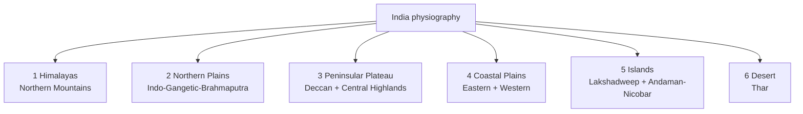

### 7.1 Himalayas — 3 parallel ranges + 4 divisions by longitude

**By parallel range (S to N)**:

1. **Shiwaliks** (Outer Himalayas) — foothills, 900–1,200 m; Duns here
   (Dehra Dun, Kotli Dun).
2. **Lesser / Middle Himalayas** — Pir Panjal, Dhauladhar, Mahabharat,
   Mussoorie, Nag Tibba; avg 3,700–4,500 m; famous hill stations
   (Shimla, Mussoorie, Nainital, Darjeeling).
3. **Greater Himalayas / Himadri** — Mount Everest, Kanchenjunga, Nanda
   Devi, Nanga Parbat; perpetually snow-covered; 6,000+ m.
4. **Trans-Himalayas** — N of Greater, includes Karakoram, Ladakh, Zanskar;
   **K2 (8611 m)** = 2nd highest peak globally (in PoK Karakoram).

**By longitude (W to E)**:

- **Punjab / Kashmir Himalayas** — Indus to Sutlej.
- **Kumaon Himalayas** — Sutlej to Kali.
- **Nepal Himalayas** — Kali to Teesta (Everest here).
- **Assam Himalayas** — Teesta to Brahmaputra (Arunachal).

**Mount Everest** — 8,848 m — India's nearest peak Kanchenjunga (8,586 m,
3rd in world) in **Sikkim** = India's highest.

**Purvanchal Range** — NE, extends from Arunachal to Mizoram: Patkai (Naga
+ Arunachal border), Naga Hills, Manipur Hills, Mizo Hills (Lushai).

### 7.2 Northern Plains — the Indo-Gangetic-Brahmaputra

- ~2,400 km long, 150–300 km wide; 7 lakh km²; world's most fertile +
  densely populated.
- 3 major rivers systems:
  - **Indus** — W (Punjab + Sindh).
  - **Ganga** — largest basin in India; Varanasi to Gangetic Delta.
  - **Brahmaputra** — from Tibet (Tsangpo) through Arunachal (Dihang)
    to Assam + Bangladesh (Jamuna).
- **Bhabar** (piedmont) → **Tarai** (marshy) → **Bhangar** (old alluvium) →
  **Khadar** (new alluvium — most fertile).

### 7.3 Peninsular Plateau

India's oldest landmass. 2 divisions:

- **Central Highlands**: Aravallis + Vindhyas + Satpuras + Maikal +
  Kaimur; Malwa + Bundelkhand + Baghelkhand plateaus.
- **Deccan Plateau**: S of Narmada; flanked by **Western Ghats** (Sahyadri)
  + **Eastern Ghats**. Rivers Godavari + Krishna + Kaveri flow east;
  Narmada + Tapi flow west (through rift valleys between Vindhyas +
  Satpuras).

**Western Ghats**: UNESCO WHS 2012; Biodiversity hotspot; **Anamudi
(Kerala, 2,695 m)** = highest peak in peninsular India.

**Eastern Ghats**: broken, less continuous; highest peak **Arma Konda**
(AP, 1,680 m). Meet Western Ghats at **Nilgiri Hills** in Tamil Nadu +
Karnataka + Kerala (**Doddabetta** = Nilgiri's highest, 2,637 m).

### 7.4 Coastal plains

- **Eastern coast** — wider, deltas (Mahanadi, Godavari, Krishna, Kaveri);
  Coromandel Coast (TN) + Northern Circars (AP + Odisha).
- **Western coast** — narrower, estuaries (not deltas); divided into Konkan
  (Maha + Goa), Kanara (Karnataka), Malabar (Kerala). Kerala Backwaters here.

### 7.5 Islands

- **Lakshadweep** — 36 Arabian Sea islands, all coral atolls; capital
  **Kavaratti**; ~32 km² — India's smallest UT by area.
- **Andaman + Nicobar** — 572 islands, volcanic origin; capital **Port Blair**
  (renamed **Shri Vijaya Puram**, 2024); Port Blair is closer to Yangon
  (Myanmar) than to Chennai.

### 7.6 Thar Desert

- In **W. Rajasthan** + extending into Gujarat + Pakistan.
- Luni is the only major river (seasonal, ephemeral).
- Indira Gandhi Canal (from Sutlej + Beas at Harike barrage) greening parts
  of Thar.

### 7.7 Exam hooks

- **Kanchenjunga** (8,586 m, Sikkim) = India's highest peak.
- **Anamudi** (Kerala, 2,695 m) = highest peak of peninsular India.
- Khadar = new alluvium; Bhangar = old alluvium.
- Narmada + Tapi flow **west** through rift valleys.
- Western Ghats = Sahyadri; Eastern Ghats = discontinuous.
- Doddabetta = Nilgiri's highest (2,637 m).
- Port Blair renamed **Shri Vijaya Puram** (2024).

---

flowchart TD
    R["PHYSIOGRAPHY OF INDIA"]:::root
    R --> HM["Himalayas"]:::key
    R --> NP["Northern Plains"]:::key
    R --> PP["Peninsular Plateau"]:::key
    R --> CG["Coastal Plains + Ghats"]:::key
    HM --> HM1["3 parallel ranges: Himadri (Great Himalaya) — highest peaks Himachal (Middle) — hill stations Shiwaliks (Outer) — newest; terai"]:::key
    HM --> HM2["Highest peak in India: K2 (8611 m, PoK) Mt Everest (8848 m) in Nepal Youngest fold mountains — still rising"]:::key
    NP --> NP1["Formed by alluvial deposits of Himalayan rivers Most fertile plain in world Bhangar (old alluvium) vs Khadar (new flood plain)"]:::key
    PP --> PP1["Ancient (1.5 billion years old) Deccan Trap: basalt rock from volcanic eruptions Average height 600-900 m"]:::key
    PP --> PP2["Highest peak on Deccan: Anamudi 2695 m (Western Ghats, Kerala) Highest in Eastern Ghats: Mahendragiri"]:::key
    CG --> CG1["Western Ghats (Sahyadri): continuous range Biodiversity hotspot; rainfall interceptor Palghat Gap: only major break"]:::key
    CG --> CG2["Eastern Ghats: discontinuous hills Coromandel Coast (E): smooth + straight Malabar Coast (W): lagoons + backwaters (Kerala)"]:::key
    classDef key fill:#dbeafe,stroke:#2563eb,color:#1e3a5f
    classDef trap fill:#fee2e2,stroke:#dc2626,color:#7f1d1d
    classDef date fill:#fef3c7,stroke:#d97706,color:#78350f
    classDef proc fill:#dcfce7,stroke:#16a34a,color:#14532d
    classDef root fill:#f3e8ff,stroke:#9333ea,color:#4c1d95

## Chapter 8 — Rivers of India

### 8.1 The 2 river systems

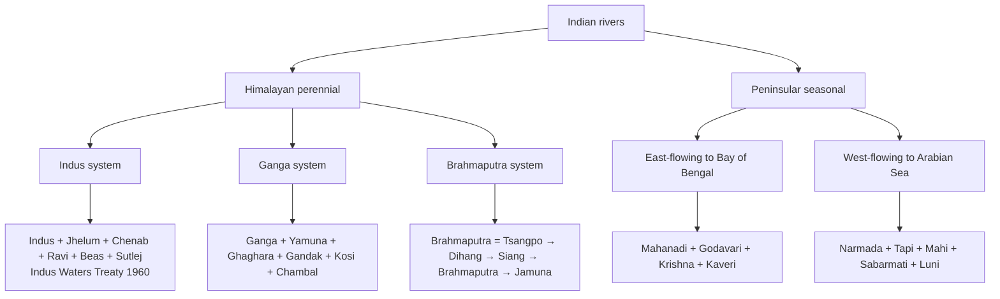

### 8.2 Himalayan rivers — key facts

- **Indus** — 3,180 km (710 km in India) — from Tibet; enters India at Leh;
  flows through J&K, Ladakh, PoK, Pakistan → Arabian Sea.
- **Ganga** — 2,525 km (largest basin in India) — **Source: Gangotri
  (Bhagirathi + Alakananda meet at Devprayag to become Ganga)**; Bay of Bengal
  via **Sundarbans delta** (world's largest).
- **Yamuna** — largest tributary of Ganga; origin Yamunotri (Uttarakhand).
  Flows past Delhi, Agra (Taj), Mathura, Prayagraj (Sangam with Ganga).
- **Brahmaputra** — 2,900 km total, 916 km in India; source **Manasarovar**
  (Tibet) as **Yarlung Tsangpo**; enters India in Arunachal as **Dihang/Siang**;
  joins with Dibang + Lohit at Sadiya to become Brahmaputra.
- **Kosi** — "Sorrow of Bihar" (shifts course); source Nepal Himalaya.
- **Ghaghara** — longest Himalayan tributary of Ganga; Nepal source (Karnali).

### 8.3 Peninsular rivers

**East-flowing vs West-flowing rivers — the classic trap**

The vast majority of peninsular rivers flow EAST into the Bay of Bengal (Godavari, Krishna, Cauvery, Mahanadi). Only a few flow WEST into the Arabian Sea. Remember the **west-flowing exceptions**: Narmada, Tapi, Sabarmati, Mahi, Luni, Periyar. These flow through rift valleys between the Vindhyas and Satpuras (Narmada, Tapi) or through Gujarat (Sabarmati, Mahi). Since they flow through rift valleys (not normal river valleys), they form estuaries — not deltas.

Mnemonic: **"NTSML"** = Narmada, Tapi, Sabarmati, Mahi, Luni — the five main west-flowing peninsular rivers.

**East-flowing (to Bay of Bengal; deltas)**:
- **Godavari** — 1,465 km, **longest Peninsular river + longest entirely within
  India**. Source: **Trimbak, Nashik** (MH). "Dakshina Ganga."
- **Krishna** — 1,400 km. Source: **Mahabaleshwar** (MH).
- **Kaveri** — 805 km. Source: **Talakaveri, Coorg** (KA). Disputes: TN-KA.
- **Mahanadi** — 858 km. Source: Chhattisgarh. Hirakud Dam.

**West-flowing (to Arabian Sea; estuaries, not deltas; through rift valleys)**:
- **Narmada** — 1,312 km. Source: **Amarkantak** (MP). Flows W through rift
  between Vindhyas + Satpuras. Sardar Sarovar Dam.
- **Tapi / Tapti** — 724 km. Source: **Multai** (MP). Similar rift pattern.
- **Sabarmati** — 371 km (Gujarat; Dhebar Lake source).
- **Mahi** — 583 km (MP → Guj).
- **Luni** — Rajasthan; ephemeral; ends in Rann.

### 8.4 Indus Waters Treaty (1960)

Signed 19 September 1960 by Nehru + Ayub Khan + World Bank (mediator).
Allocates:
- **Eastern rivers** (Ravi, Beas, Sutlej — 20%) to **India** — unrestricted use.
- **Western rivers** (Indus, Jhelum, Chenab — 80%) to **Pakistan** — India
  can use for domestic, non-consumptive, agriculture (limited), hydropower
  (run-of-river only).

Most resilient cross-border water treaty — survived 3 wars.

### 8.5 Exam hooks

- Ganga source = **Gangotri / Devprayag**.
- Yamuna source = **Yamunotri**.
- Brahmaputra source = **Manasarovar**, Tibet.
- **Godavari** = longest peninsular + longest entirely in India.
- Narmada source = **Amarkantak**; Tapi source = **Multai** — both MP.
- Narmada + Tapi flow **WEST**.
- **Kosi** = Sorrow of Bihar; **Damodar** = Sorrow of Bengal (pre-dams).
- Indus Waters Treaty = **1960**.

---

flowchart TD
    R["RIVERS OF INDIA"]:::root
    R --> HS["2 River Systems"]:::proc
    R --> GN["Ganga + Brahmaputra"]:::key
    R --> PN["Peninsular Rivers"]:::key
    R --> TR["TRAP: West-flowing peninsular rivers"]:::trap
    HS --> HS1["Himalayan rivers: PERENNIAL Fed by snow melt + monsoon rain Deep gorges; young; still cutting"]:::key
    HS --> HS2["Peninsular rivers: SEASONAL Depend only on monsoon Old; shallow; can only flow in rainy season"]:::key
    GN --> GN1["Ganga: longest in India (2525 km) Source: Gangotri glacier Flows: E into Bay of Bengal"]:::key
    GN --> GN2["Brahmaputra: originates in Tibet as Tsangpo Enters India through Arunachal Largest river island: Majuli (Assam)"]:::key
    PN --> PN1["East-flowing into Bay of Bengal: Mahanadi, Godavari (Dakshin Ganga) Krishna, Kaveri (Dakshina Ganga)"]:::key
    PN --> PN2["Longest peninsular river: Godavari (1465 km) Kaveri dispute: Karnataka vs Tamil Nadu Sacred rivers: Ganga, Yamuna, Godavari, Kaveri"]:::key
    TR --> TR1["TRAP: Narmada + Tapi flow WESTWARD Both flow through rift valleys (structural faults) Drain into Arabian Sea not Bay of Bengal"]:::trap
    classDef key fill:#dbeafe,stroke:#2563eb,color:#1e3a5f
    classDef trap fill:#fee2e2,stroke:#dc2626,color:#7f1d1d
    classDef date fill:#fef3c7,stroke:#d97706,color:#78350f
    classDef proc fill:#dcfce7,stroke:#16a34a,color:#14532d
    classDef root fill:#f3e8ff,stroke:#9333ea,color:#4c1d95

## Chapter 9 — Indian Climate + Monsoon

### 9.1 4 seasons

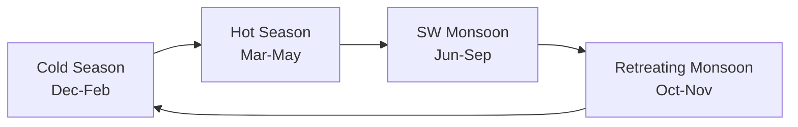

- **Cold (Dec–Feb)** — Western disturbances bring winter rain to N India
  (important for Rabi); clear skies elsewhere.
- **Hot (Mar–May)** — temperatures rise; pre-monsoon thunderstorms (Loo,
  Nor'westers, Mango showers).
- **SW Monsoon (Jun–Sep)** — gives **~75% of India's annual rainfall**.
- **Retreating / NE Monsoon (Oct–Nov)** — dry for most; wet for TN + AP
  coast.

(SW + NE monsoon mechanics — see Chapter 4 §4.3.)

### 9.2 Climate classification

**Köppen's 6 classes in India**:

1. **Aw** — Tropical savanna (most of central peninsula).
2. **Am** — Tropical monsoon (W. Ghats windward).
3. **Cwg** — Humid subtropical (N plains).
4. **Bwh** — Hot desert (Thar).
5. **Bsh** — Semi-arid (Rajasthan + parts of peninsular rain-shadow).
6. **ET / H** — Tundra / alpine (Himalayas).

### 9.3 Exam hooks

- SW monsoon = **75% of annual rain**.
- NE monsoon = most rain for **Tamil Nadu** + coastal AP.
- **Mawsynram** (Meghalaya) = wettest place on earth.
- Köppen most-common class in India = **Aw (tropical savanna)**.
- **Western Disturbances** = cold-season rain in N India.

---

flowchart TD
    R["INDIAN CLIMATE AND MONSOON"]:::root
    R --> SE["4 Seasons"]:::proc
    R --> MO["Monsoon Mechanism"]:::key
    R --> RF["Rainfall Extremes"]:::key
    R --> EL["El Nino and La Nina"]:::key
    SE --> SE1["Winter: Dec-Feb (NE trade winds blow offshore) Summer/Pre-monsoon: Mar-May (hot dry) SW Monsoon: Jun-Sep (wet) Retreating Monsoon: Oct-Nov (NE monsoon)"]:::proc
    MO --> MO1["SW Monsoon arrives Kerala by June 1 2 branches: Arabian Sea + Bay of Bengal Low pressure over Thar Desert pulls monsoon in"]:::key
    MO --> MO2["Bay of Bengal branch: hits NE India first Arabian Sea branch: hits Kerala coast first Both branches meet over North India"]:::key
    RF --> RF1["Highest rainfall: Mawsynram, Meghalaya 11,000+ mm/year; also Cherrapunji nearby Orographic rainfall — Khasi hills face monsoon"]:::key
    RF --> RF2["Lowest rainfall: Jaisalmer, Rajasthan Less than 100 mm/year Rain shadow zone + far from sea"]:::key
    EL --> EL1["El Nino: warm water in E Pacific Weakens Indian Ocean temp gradient Result: WEAK or LATE Indian monsoon"]:::key
    EL --> EL2["La Nina: cool water in E Pacific Strengthens monsoon circulation Result: STRONG above-normal monsoon"]:::key
    classDef key fill:#dbeafe,stroke:#2563eb,color:#1e3a5f
    classDef trap fill:#fee2e2,stroke:#dc2626,color:#7f1d1d
    classDef date fill:#fef3c7,stroke:#d97706,color:#78350f
    classDef proc fill:#dcfce7,stroke:#16a34a,color:#14532d
    classDef root fill:#f3e8ff,stroke:#9333ea,color:#4c1d95

## Chapter 10 — Soils of India

**6 major soil types** (ICAR classification):

| Soil | % of India | Region | Crops |
|------|-----------|--------|-------|
| **Alluvial** | ~43% | Indo-Gangetic plain, coastal + delta | Rice, wheat, sugarcane, jute, oilseeds |
| **Black (Regur)** | ~15% | Deccan Trap region — Maha, Guj, MP, KA, AP | **Cotton**, sugarcane, oilseeds |
| **Red + Yellow** | ~18% | Peninsular (Deccan + parts of E peninsula) | Millets, groundnut, cotton |
| **Laterite** | — | Kerala, Karnataka, Odisha, Assam — high-rainfall hills | Cashew, tea, coffee, rubber |
| **Arid + Desert** | — | Rajasthan + parts of Gujarat | Barley, bajra (with irrigation) |
| **Forest + Mountain** | — | Himalayas | Tea, coffee, spices |

**Also**: Saline / Alkaline (Reh — Punjab, Haryana); Peaty + Marshy (Kerala
Kuttanad, Sundarbans).

### 10.1 Exam hooks

**Soils of India — the 4-type table every exam asks about**

| Soil | Where found | Key crop | Special feature |
|---|---|---|---|
| **Alluvial** | Indo-Gangetic plains, river deltas, coastal plains | Wheat, rice, sugarcane | Most extensive + most fertile |
| **Black (Regur)** | Deccan Plateau, Maharashtra, MP, Karnataka | **Cotton** | Self-ploughing (cracks in summer); derived from Deccan basalt; retains moisture |
| **Red and Yellow** | Odisha, Chhattisgarh, Eastern MP, South India | Millets, groundnut | Iron oxide = red colour; porous, less fertile |
| **Laterite** | Western Ghats slopes, NE India, Tamil Nadu hills | Tea, coffee, cashew | Heavy rainfall leaches nutrients; poor fertility; good for plantation crops |

Khadar = new alluvium (lighter, sandy, near river banks) · Bhangar = old alluvium (darker, calcareous nodules, farther from river)

- **Alluvial** = most widespread + most fertile.
- **Black soil** = best for **cotton**; self-ploughing (cracks in summer);
  derived from **Deccan basalt**.
- **Laterite** = high-rainfall + temperature; poor fertility.
- **Red soil** gets its colour from **iron oxide**.
- Khadar (new alluvium) vs Bhangar (old alluvium).

---

# Part E — India: Human + Economic

flowchart TD
    R["SOILS OF INDIA"]:::root
    R --> A["Alluvial Soil"]:::key
    R --> B["Black Soil (Regur)"]:::key
    R --> C["Red Soil"]:::key
    R --> D["Laterite Soil"]:::key
    R --> TR["TRAP: Soil-crop associations"]:::trap
    A --> A1["Most widespread: Indo-Gangetic plains Khadar (new alluvium, fertile) Bhangar (old alluvium, less fertile)"]:::key
    A --> A2["Rich in potash; poor in nitrogen Best for: Rice, Wheat, Sugarcane Found in: Punjab, UP, Bihar, WB, Coastal deltas"]:::key
    B --> B1["Black cotton soil = Regur = Tropical Chernozem Formed from Deccan Trap basalt High clay content — swells with moisture"]:::key
    B --> B2["BEST for: Cotton (Maharashtra, MP, Gujarat) Also: sugarcane, wheat, linseed Black colour from titanite iron compound"]:::key
    C --> C1["Formed from weathering of old crystalline rocks Red due to presence of iron oxide Deficient in: nitrogen, phosphorus, humus"]:::key
    C --> C2["Found in: Telangana, Andhra, TN, Odisha, Jharkhand Best for: groundnut, millets, cotton"]:::key
    D --> D1["Formed by intense leaching (heavy rainfall) Iron + aluminium oxides remain; silica leached out Hard when dry; found in WG, Karnataka, Kerala"]:::key
    TR --> TR1["TRAP: Cotton = Black soil (NOT red soil) Rice = Alluvial soil (NOT black) Tea/Coffee = Laterite + Red soil (hill areas)"]:::trap
    classDef key fill:#dbeafe,stroke:#2563eb,color:#1e3a5f
    classDef trap fill:#fee2e2,stroke:#dc2626,color:#7f1d1d
    classDef date fill:#fef3c7,stroke:#d97706,color:#78350f
    classDef proc fill:#dcfce7,stroke:#16a34a,color:#14532d
    classDef root fill:#f3e8ff,stroke:#9333ea,color:#4c1d95

## Chapter 11 — Population

- **India overtook China in April 2023** — most populous country, ~144 crore
  (2024).
- **17.5% of world population** on **2.4% of land**.
- **TFR 2.0** (NFHS-5, 2019–21) — below replacement (2.1) for first time.
- **Sex ratio**: **1,020 females per 1,000 males** (NFHS-5, first time
  above 1000 in Indian history); **Kerala** best (1,084); **Haryana**
  worst (879).
- **Median age**: ~28 years → **demographic dividend**.
- **Literacy**: 77.7% (2011 Census); estimated 82%+ now.
- **Urbanisation**: ~35% (Census 2011); slow by global standards (World 55%,
  China 65%).

---

flowchart TD
    R["POPULATION OF INDIA"]:::root
    R --> C["Census 2011 Key Figures"]:::date
    R --> ST["State Rankings"]:::key
    R --> LI["Literacy"]:::key
    R --> TR["TRAP: Density — state vs UT"]:::trap
    C --> C1["Total population: 121.1 crore (2011) 2nd most populous after China Population density: 382 per sq km"]:::date
    C --> C2["Sex ratio: 943 females per 1000 males Decadal growth rate: 17.7% (2001-2011) Urban population: 31.2%"]:::key
    ST --> ST1["Most populous state: Uttar Pradesh Least populous state: Sikkim Highest density: Bihar (1106/sq km)"]:::key
    ST --> ST2["Lowest density state: Arunachal Pradesh (17/sq km) TRAP: Highest density UT = Delhi Highest density overall: Delhi (11,320/sq km)"]:::trap
    LI --> LI1["Overall literacy rate: 74.04% (2011) Male: 82.14%; Female: 65.46% Highest literacy state: Kerala (93.9%)"]:::key
    LI --> LI2["Lowest literacy state: Bihar (61.8%) Highest female literacy: Kerala Lowest female literacy: Rajasthan"]:::key
    TR --> TR1["TRAP: Most dense state = Bihar Most dense overall = Delhi (UT) Smallest state = Goa; Smallest UT = Lakshadweep"]:::trap
    classDef key fill:#dbeafe,stroke:#2563eb,color:#1e3a5f
    classDef trap fill:#fee2e2,stroke:#dc2626,color:#7f1d1d
    classDef date fill:#fef3c7,stroke:#d97706,color:#78350f
    classDef proc fill:#dcfce7,stroke:#16a34a,color:#14532d
    classDef root fill:#f3e8ff,stroke:#9333ea,color:#4c1d95

## Chapter 12 — Agriculture

### 12.1 3 cropping seasons

- **Kharif** (Jun–Oct, monsoon) — **rice, maize, bajra, jowar, ragi, cotton,
  sugarcane, tur, groundnut, soyabean, jute**.
- **Rabi** (Oct–Mar, winter) — **wheat (dominant), barley, gram, mustard,
  peas, lentil**.
- **Zaid** (Mar–Jun, summer) — watermelon, cucumber, muskmelon, fodder.

### 12.2 Crop → Largest producer state

| Crop | Largest producer |
|------|-------------------|
| Rice | **West Bengal** |
| Wheat | **Uttar Pradesh** |
| Pulses | **Madhya Pradesh** |
| Sugarcane | **Uttar Pradesh** ("sugar bowl") |
| Cotton | **Gujarat** |
| Tea | **Assam** |
| Coffee | **Karnataka** |
| Jute | **West Bengal** |
| Rubber | **Kerala** |
| Oilseeds | **Madhya Pradesh / Rajasthan** |
| Soyabean | **Madhya Pradesh** |
| Groundnut | **Gujarat** |
| Silk | **Karnataka** (mulberry) |
| Spices | **Kerala / Gujarat** |
| Coconut | **Kerala / TN** |

### 12.3 Revolutions

- **Green Revolution** (1960s–70s, Norman Borlaug + M.S. Swaminathan) —
  wheat + rice in Punjab + Haryana + W. UP.
- **White Revolution** / Operation Flood (1970s-90s, Verghese Kurien,
  Amul) — milk; India now world's #1 milk producer.
- **Yellow Revolution** — oilseeds.
- **Blue Revolution** — fishery.
- **Pink Revolution** — meat / poultry.
- **Silver Revolution** — eggs.
- **Rainbow Revolution** — holistic agri growth.

### 12.4 Exam hooks

- India is world's **#1 in MILK, PULSES, JUTE, COTTON, SPICES, BANANA,
  MANGO**.
- India is **#2 in rice, wheat, sugarcane, tea, fish, onion, potato,
  groundnut**.
- **NORMAN BORLAUG** — Father of Green Revolution globally; **M.S.
  SWAMINATHAN** — Father of Indian Green Rev.
- **White Revolution** = Amul / Operation Flood — Verghese Kurien.

---

flowchart TD
    R["AGRICULTURE IN INDIA"]:::root
    R --> KH["Kharif vs Rabi"]:::key
    R --> CR["Key Crops + States"]:::key
    R --> RE["Agricultural Revolutions"]:::date
    R --> TR["TRAP: India's top productions"]:::trap
    KH --> KH1["Kharif: sown in June, harvested Oct Monsoon crops: Rice, Jute, Cotton Groundnut, Soyabean, Bajra, Maize"]:::key
    KH --> KH2["Rabi: sown in Nov, harvested Mar-Apr Winter crops: Wheat, Barley, Mustard Gram (chickpea), Peas, Linseed"]:::key
    KH --> KH3["Zaid: summer between rabi and kharif Vegetables: cucumber, melon, watermelon Short duration, needs irrigation"]:::key
    CR --> CR1["Rice: WB, UP, Andhra, Punjab (paddy belt) Wheat: Punjab, Haryana, UP (bread basket) Sugarcane: UP (largest), Maharashtra, Karnataka"]:::key
    CR --> CR2["Cotton: Maharashtra, Gujarat, Andhra Jute: WB (90% of India's jute); tea: Assam Coffee: Karnataka (70%); Rubber: Kerala"]:::key
    RE --> RE1["Green Revolution: 1960s; Norman Borlaug (Father) M.S. Swaminathan (India); HYV seeds Punjab + Haryana = wheat bowl of India"]:::date
    RE --> RE2["White Revolution (Milk): Operation Flood Verghese Kurien: father of White Revolution AMUL co-operative model; India = world's top milk producer"]:::date
    TR --> TR1["TRAP: India LARGEST producer of: Milk, Spices, Jute, Ginger, Chickpea, Banana 2ND largest: Rice, Wheat, Sugarcane, Fruits, Vegetables"]:::trap
    classDef key fill:#dbeafe,stroke:#2563eb,color:#1e3a5f
    classDef trap fill:#fee2e2,stroke:#dc2626,color:#7f1d1d
    classDef date fill:#fef3c7,stroke:#d97706,color:#78350f
    classDef proc fill:#dcfce7,stroke:#16a34a,color:#14532d
    classDef root fill:#f3e8ff,stroke:#9333ea,color:#4c1d95

## Chapter 13 — Minerals + Energy

### 13.1 Minerals — state-wise leaders

| Mineral | Top state |
|---------|-----------|
| Iron ore | **Odisha** (~55%) |
| Coal | **Jharkhand** (followed by Odisha, CG) |
| Bauxite (Al) | **Odisha** |
| Manganese | **Madhya Pradesh** |
| Copper | **MP / Rajasthan** |
| Mica | **Andhra Pradesh / Jharkhand** |
| Gold | **Karnataka** (Kolar, now closed; Hutti active) |
| Uranium | **Jharkhand** (Jaduguda — only operating) |
| Diamond | **Madhya Pradesh** (Panna — only) |
| Gypsum | **Rajasthan** |
| Salt | **Gujarat** |

### 13.2 Energy — India's mix (2024)

- **Total installed capacity ~452 GW**.
- **Non-fossil ~46%** (nearing 50% target).
- **Coal-based thermal**: ~53%.
- **Solar**: ~93 GW.
- **Wind**: ~47 GW.
- **Large hydro**: ~47 GW.
- **Nuclear**: ~7.5 GW.
- Target — **500 GW non-fossil by 2030**; **Net Zero by 2070**.

**Nuclear plants**:
- **Tarapur** (Maharashtra) — India's oldest (1969).
- **Rawatbhata** (Rajasthan), **Kakrapar** (Gujarat), **Kaiga** (Karnataka),
  **Kudankulam** (TN — largest, Russian VVER), **Kalpakkam** (TN — PFBR
  commissioned 2024), **Narora** (UP).

---

flowchart TD
    R["MINERALS AND ENERGY"]:::root
    R --> CO["Coal"]:::key
    R --> IR["Iron + Steel Metals"]:::key
    R --> NU["Nuclear Minerals"]:::key
    R --> OT["Other Key Minerals"]:::key
    CO --> CO1["India: 4th largest coal reserves globally Types: Anthracite (best) > Bituminous > Lignite > Peat 95% coal in Gondwana rock formations"]:::key
    CO --> CO2["Major coal states: Jharkhand (largest reserves) Chhattisgarh, Odisha, WB, Madhya Pradesh Singrauli, Raniganj, Jharia = major coalfields"]:::key
    IR --> IR1["Iron ore: Jharkhand, Odisha, Chhattisgarh Hematite (Fe2O3) = best grade India exports iron ore to Japan + Korea"]:::key
    IR --> IR2["Bauxite (aluminium ore): Odisha (Kalahandi) Manganese: Odisha, Maharashtra Copper: Rajasthan (Khetri = copper city)"]:::key
    NU --> NU1["Uranium: Jaduguda, Jharkhand (only mine) Thorium: Monazite sands, Kerala-Tamil Nadu coast India = world's largest thorium reserves"]:::key
    OT --> OT1["Mica: Jharkhand (Kodarma = mica capital) India was world's largest mica exporter Petroleum: Mumbai High offshore (largest)"]:::key
    classDef key fill:#dbeafe,stroke:#2563eb,color:#1e3a5f
    classDef trap fill:#fee2e2,stroke:#dc2626,color:#7f1d1d
    classDef date fill:#fef3c7,stroke:#d97706,color:#78350f
    classDef proc fill:#dcfce7,stroke:#16a34a,color:#14532d
    classDef root fill:#f3e8ff,stroke:#9333ea,color:#4c1d95

## Chapter 14 — Transport + Communication

### 14.1 Road + rail

- **Road**: India has ~63 lakh km road network — **2nd largest globally**.
- **National Highways**: ~1.5 lakh km (post-Bharatmala additions).
- **Golden Quadrilateral** (NHAI, begun 1999–2000, Vajpayee) — 5,846 km;
  connects Delhi-Mumbai-Chennai-Kolkata.
- **North-South + East-West Corridors** — 7,300 km.

- **Railways**: ~68,000 route-km — Asia's largest rail network; **4th
  largest globally**.
- **First railway** — 16 April 1853, **Bombay to Thane** (34 km), Lord
  Dalhousie.
- **Zones** — currently **18 zones**.
- **Vande Bharat Express** — indigenous semi-high-speed train (since 2019).

### 14.2 Air + water

- **Major airports** — ~140 operational; 35+ international.
- **Busiest** — Delhi IGI, Mumbai, Bengaluru, Chennai, Hyderabad, Kolkata.
- **Ports** — 13 major + 200+ minor. **JNPT Mumbai** (container) + **Mundra**
  (private, Adani) + **Paradip** (Odisha) + **Kandla** (Gujarat).

### 14.3 Exam hooks

- First railway = **1853, Bombay-Thane**.
- **Indian Railways** = world's 4th largest, Asia's largest network.
- **Golden Quadrilateral** = Delhi-Mumbai-Chennai-Kolkata.
- **Busiest airport** = Delhi IGI.
- India's biggest port by cargo = **Mundra** (private).

---

# Part F — World

flowchart TD
    R["TRANSPORT AND COMMUNICATION"]:::root
    R --> RD["Roads"]:::key
    R --> RL["Railways"]:::key
    R --> WW["Waterways"]:::key
    R --> PT["Ports"]:::key
    RD --> RD1["Longest NH: NH-44 Srinagar to Kanyakumari 3,745 km; passes through 11 states Old name: NH-7 (Varanasi-Kanyakumari)"]:::key
    RD --> RD2["Golden Quadrilateral: NH connecting Delhi-Mumbai-Chennai-Kolkata (5846 km) NHDP: National Highway Development Project"]:::key
    RL --> RL1["Indian Railways: 4th largest network globally After USA, Russia, China HQ: Rail Bhavan, New Delhi"]:::key
    RL --> RL2["Broadest gauge (1676 mm): Broad gauge Meter gauge (1000 mm); Narrow gauge (762/610 mm) First railway: 1853 (Mumbai to Thane, 34 km)"]:::date
    WW --> WW1["NW-1: Ganga (Allahabad to Haldia, 1620 km) NW-2: Brahmaputra (Sadiya to Dhubri, 891 km) NW-3: West Coast (Kottapuram to Kollam, 205 km)"]:::key
    PT --> PT1["Major ports (12 major + 200 minor) Busiest: Mumbai (JNPT = Jawaharlal Nehru Port) Oldest: Kolkata (Syama Prasad Mookerjee)"]:::key
    classDef key fill:#dbeafe,stroke:#2563eb,color:#1e3a5f
    classDef trap fill:#fee2e2,stroke:#dc2626,color:#7f1d1d
    classDef date fill:#fef3c7,stroke:#d97706,color:#78350f
    classDef proc fill:#dcfce7,stroke:#16a34a,color:#14532d
    classDef root fill:#f3e8ff,stroke:#9333ea,color:#4c1d95

## Chapter 15 — Continents + Countries + Oceans (key facts)

- **7 continents** — Asia, Africa, N America, S America, Antarctica, Europe,
  Australia (by area).
- **Largest country** by area — Russia (~17.1 mn km²).
- **Largest by population** — **India** (overtook China, Apr 2023).
- **Longest river** — **Nile** (6,650 km) OR **Amazon** (debated) — standard
  answer is Nile; by water volume Amazon #1.
- **Largest lake** — Caspian Sea (by area); Baikal (by volume + depth).
- **Largest desert** — Antarctica (polar); Sahara is largest hot desert
  (9.2 mn km², across 11 countries).
- **Highest peak** — Mt Everest (8,848 m).
- **Longest mountain range (land)** — Andes (7,000 km); longest overall =
  Mid-Atlantic Ridge (underwater).
- **Largest ocean** — Pacific.
- **Deepest point** — Challenger Deep, Mariana Trench, 10,984 m.

---

flowchart TD
    R["CONTINENTS, COUNTRIES, OCEANS"]:::root
    R --> CT["7 Continents by Size"]:::key
    R --> CO["Countries — Superlatives"]:::key
    R --> RV["Rivers + Mountains"]:::key
    R --> LK["Lakes"]:::key
    CT --> CT1["Asia (largest: 44.6M km2) Africa (2nd: 30.3M km2) North America (3rd), South America (4th)"]:::key
    CT --> CT2["Antarctica (5th: 14M km2; covered in ice) Europe (6th), Australia (smallest: 7.7M km2) TRAP: Australia = smallest continent not country"]:::trap
    CO --> CO1["Largest country: Russia (17.1M km2) 2nd: Canada; 3rd: USA; 4th: China; 5th: Brazil India: 7th largest country"]:::key
    CO --> CO2["Smallest country: Vatican City (0.44 sq km) Most populous: China then India Densest: Monaco; then Singapore"]:::key
    RV --> RV1["Longest river: Nile (6650 km, Africa) 2nd: Amazon (6400 km, S America) Highest mountain: Mt Everest (8848.86 m)"]:::key
    LK --> LK1["Largest lake: Caspian Sea (saline) Largest freshwater: Lake Superior (N America) Deepest lake: Baikal (Russia, 1642 m)"]:::key
    classDef key fill:#dbeafe,stroke:#2563eb,color:#1e3a5f
    classDef trap fill:#fee2e2,stroke:#dc2626,color:#7f1d1d
    classDef date fill:#fef3c7,stroke:#d97706,color:#78350f
    classDef proc fill:#dcfce7,stroke:#16a34a,color:#14532d
    classDef root fill:#f3e8ff,stroke:#9333ea,color:#4c1d95

## Chapter 16 — Biomes (Natural Vegetation)

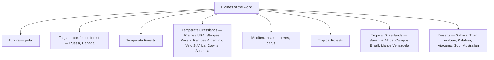

### 16.1 Exam hooks

- **Prairies** = N America grasslands; **Pampas** = Argentina; **Steppes** =
  Russia; **Veld** = S Africa; **Downs** = Australia; **Llanos** = Venezuela
  + Colombia; **Campos** = Brazil; **Savanna** = Africa.

---

# Appendices

flowchart TD
    R["BIOMES AND NATURAL VEGETATION"]:::root
    R --> TR["Tropical Forests"]:::key
    R --> GR["Grasslands"]:::key
    R --> TA["Taiga and Tundra"]:::key
    R --> DE["Deserts"]:::key
    TR --> TR1["Tropical Rainforest: near equator Amazon (lungs of Earth), Congo, SE Asia Highest biodiversity; evergreen; > 2000 mm rain"]:::key
    TR --> TR2["Tropical Deciduous (Monsoon): India's main forest Sal, teak, bamboo trees; shed leaves in dry season India = major teak exporter"]:::key
    GR --> GR1["Tropical savanna: Africa (Serengeti) Scattered trees + grassland; seasonal rainfall Wildlife: lions, elephants, wildebeest"]:::key
    GR --> GR2["Temperate grasslands: Prairies (N America), Steppes (Eurasia) Pampas (S America), Veld (S Africa), Downs (Australia)"]:::key
    TA --> TA1["Taiga/Boreal: largest terrestrial biome Coniferous: pine, spruce, fir Russia + Canada; cold; acidic soil"]:::key
    TA --> TA2["Tundra: Arctic zone; permafrost (frozen soil) No trees; only mosses, lichens, sedges Brief summer; reindeer, polar bear"]:::key
    DE --> DE1["Hot desert: Sahara = largest hot desert Cold desert: Antarctica = largest cold desert Thar = Great Indian Desert (Rajasthan)"]:::key
    classDef key fill:#dbeafe,stroke:#2563eb,color:#1e3a5f
    classDef trap fill:#fee2e2,stroke:#dc2626,color:#7f1d1d
    classDef date fill:#fef3c7,stroke:#d97706,color:#78350f
    classDef proc fill:#dcfce7,stroke:#16a34a,color:#14532d
    classDef root fill:#f3e8ff,stroke:#9333ea,color:#4c1d95

## Appendix A — India's 28 states + 8 UTs (capital shortcut)

| State | Capital | State | Capital |
|-------|---------|-------|---------|
| AP | Amaravati (de facto) | Maharashtra | Mumbai |
| Arunachal Pradesh | Itanagar | Manipur | Imphal |
| Assam | Dispur (Guwahati) | Meghalaya | Shillong |
| Bihar | Patna | Mizoram | Aizawl |
| Chhattisgarh | Raipur | Nagaland | Kohima |
| Goa | Panaji | Odisha | Bhubaneswar |
| Gujarat | Gandhinagar | Punjab | Chandigarh |
| Haryana | Chandigarh | Rajasthan | Jaipur |
| Himachal | Shimla | Sikkim | Gangtok |
| Jharkhand | Ranchi | Tamil Nadu | Chennai |
| Karnataka | Bengaluru | Telangana | Hyderabad |
| Kerala | Thiruvananthapuram | Tripura | Agartala |
| MP | Bhopal | UP | Lucknow |
| Maharashtra | Mumbai | Uttarakhand | Dehradun / Gairsain (summer) |
| WB | Kolkata |  |  |

UTs (8): Delhi, Puducherry, J&K (3 with legislature); Chandigarh, A&N
Islands, Lakshadweep, Dadra-Nagar-Haveli+Daman-Diu, Ladakh (5 without).

## Appendix B — Mnemonic compendium

- **MVEMJSUN** → planets.
- **FED-RIVE** → IVC decline (shared with History).
- **Ring of Fire** → 81% of earthquakes.
- **Arabian Sea + Bay of Bengal** → two branches of SW monsoon.
- **Mawsynram > Cherrapunji** → wettest places.
- **Khadar vs Bhangar** → new vs old alluvium.
- **GR MaCH JH BeTrMi** → 8 Tropic-of-Cancer states.
- **"Western disturbances"** → N India winter rain.
- **"Nawab-Wilma"** cyclone-type names rotate in Indian Ocean basin.

## Appendix C — Cheatsheet (1 page)

- **IST** — 82°30'E Mirzapur; UTC+5:30.
- **Total area** — 3.287 Mkm² (7th largest); coastline 7,517 km; land
  border 15,107 km.
- **Longest land border** — Bangladesh (4,096 km).
- **Shortest** — Afghanistan (106 km, via PoK).
- **Himalayas**: Shiwalik → Lesser → Greater → Trans; Kanchenjunga highest
  in India.
- **Rivers**: Ganga-Yamuna largest N; Godavari longest entirely in India;
  Narmada + Tapi flow WEST.
- **Monsoon onset** — Kerala 1 June; covers whole country by 15 July.
- **Wettest place** — Mawsynram (Meghalaya).
- **Tropic of Cancer** crosses **8 states**.
- **Alluvial soil** most widespread; black soil best for cotton.
- **Largest iron-ore producer state** — Odisha.
- **Largest wheat** — UP; largest rice — WB.
- Nuclear plants — Tarapur (oldest), Kudankulam (largest), Kalpakkam
  (fast breeder 2024).
- India — most populous since **Apr 2023** (~144 cr).
- Non-fossil target — **500 GW by 2030**; **Net Zero by 2070**.
- Golden Quadrilateral — Delhi-Mumbai-Chennai-Kolkata.

*Parts C (oceans in detail), world countries' capitals, world cities +
resources will be added in subsequent revisions of this file.*

---

\newpage

# PART X — STATES OF INDIA — COMPLETE TABLE

| State | Capital | Formed | Lok Sabha seats | Rajya Sabha | Notable |
|---|---|---|---|---|---|
| Andhra Pradesh | Amaravati (de facto Vizag/Kurnool tri-capital) | 1 Nov 1956 (re-org 2 Jun 2014) | 25 | 11 | Telugu speaking |
| Arunachal Pradesh | Itanagar | 20 Feb 1987 (UT 1972) | 2 | 1 | "Land of the rising sun" |
| Assam | Dispur | 26 Jan 1950 | 14 | 7 | Brahmaputra valley |
| Bihar | Patna | 26 Jan 1950 | 40 | 16 | Magadha heritage |
| Chhattisgarh | Raipur | 1 Nov 2000 | 11 | 5 | Carved out of MP |
| Goa | Panaji | 30 May 1987 | 2 | 1 | Smallest state by area |
| Gujarat | Gandhinagar | 1 May 1960 | 26 | 11 | Coastline 1,600 km (longest of any state) |
| Haryana | Chandigarh (shared with Punjab) | 1 Nov 1966 | 10 | 5 | Carved out of Punjab |
| Himachal Pradesh | Shimla (winter Dharamshala) | 25 Jan 1971 | 4 | 3 | Hill state |
| Jharkhand | Ranchi | 15 Nov 2000 | 14 | 6 | Mineral rich |
| Karnataka | Bengaluru | 1 Nov 1956 | 28 | 12 | IT capital |
| Kerala | Thiruvananthapuram | 1 Nov 1956 | 20 | 9 | Highest literacy |
| Madhya Pradesh | Bhopal | 1 Nov 1956 | 29 | 11 | Largest state (after split) |
| Maharashtra | Mumbai (winter Nagpur) | 1 May 1960 | 48 | 19 | Largest LS share |
| Manipur | Imphal | 21 Jan 1972 | 2 | 1 | Loktak Lake |
| Meghalaya | Shillong | 21 Jan 1972 | 2 | 1 | "Abode of clouds"; Mawsynram wettest |
| Mizoram | Aizawl | 20 Feb 1987 | 1 | 1 | Highest literacy in NE |
| Nagaland | Kohima | 1 Dec 1963 | 1 | 1 | 16+ tribes |
| Odisha | Bhubaneswar | 1 Apr 1936 | 21 | 10 | Cyclone-prone |
| Punjab | Chandigarh (shared) | 1 Nov 1966 | 13 | 7 | 5-river land |
| Rajasthan | Jaipur | 30 Mar 1949 | 25 | 10 | Largest state by area |
| Sikkim | Gangtok | 16 May 1975 (22nd state) | 1 | 1 | Khangchendzonga |
| Tamil Nadu | Chennai | 26 Jan 1950 | 39 | 18 | Coromandel coast |
| Telangana | Hyderabad | 2 Jun 2014 (29th state) | 17 | 7 | Carved from AP |
| Tripura | Agartala | 21 Jan 1972 | 2 | 1 | 3rd smallest |
| Uttar Pradesh | Lucknow | 26 Jan 1950 | 80 | 31 | **Most populous; max LS + RS seats** |
| Uttarakhand | Dehradun (winter); Gairsain (summer 2020) | 9 Nov 2000 | 5 | 3 | Devbhoomi |
| West Bengal | Kolkata | 26 Jan 1950 | 42 | 16 | Sundarbans |

## 8 Union Territories

| UT | Capital | Special |
|---|---|---|
| Delhi (NCT) | New Delhi | LS 7, RS 3; Art 239AA; LG + CM |
| J&K | Srinagar (summer) / Jammu (winter) | LS 5, RS 4; UT since 31 Oct 2019; LG + CM |
| Ladakh | Leh + Kargil | LS 1; UT since 31 Oct 2019; LG only |
| Puducherry | Puducherry | LS 1, RS 1; LG + CM |
| Chandigarh | Chandigarh | shared capital Punjab+Haryana |
| Andaman & Nicobar | Port Blair (renamed Sri Vijaya Puram, 2024) | LS 1; LG only |
| Dadra & Nagar Haveli + Daman & Diu | Daman | merged 26 Jan 2020 |
| Lakshadweep | Kavaratti | smallest UT; LS 1 |

> **Memory peg.** UP = max LS (80) + RS (31). Sikkim, Mizoram, Nagaland = 1 LS each. Goa & Sikkim = smallest by area (Goa) / 2nd-smallest (Sikkim).

---

\newpage

# 🏔️ PART Y — MOUNTAINS, RIVERS, LAKES, SOILS

## Major Indian mountains + peaks

| Range | Highest peak | State | Notes |
|---|---|---|---|
| Greater Himalayas (Himadri) | **Kanchenjunga** 8,586 m | Sikkim | Highest in India; 3rd in world |
| Trans-Himalaya (Karakoram) | **K2 (Godwin Austen)** 8,611 m | PoK / Gilgit | World's 2nd; not in present India |
| Greater Himalayas | Nanda Devi 7,816 m | Uttarakhand | 2nd in India proper |
| Lesser Himalayas (Himachal) | Nag Tibba | UP/HP | Pir Panjal, Dhauladhar, Mahabharat |
| Outer Himalayas (Shivaliks) | — | foothills | Bhabar, Terai zone |
| Eastern Himalayas | Namcha Barwa 7,782 m | Arunachal | |
| Aravalli | **Guru Shikhar** 1,722 m | Mt. Abu, Rajasthan | Oldest fold mountains in world |
| Vindhyas | Kalumar 752 m | MP | |
| Satpura | Dhupgarh 1,350 m | Pachmarhi, MP | |
| Western Ghats (Sahyadri) | **Anamudi** 2,695 m | Kerala | UNESCO; biodiversity hotspot |
| Eastern Ghats | **Arma Konda** 1,680 m | AP | discontinuous |
| Nilgiris | Doddabetta 2,637 m | TN | meeting of Western & Eastern Ghats |
| Annamalai Hills | Anamudi | Kerala/TN | |
| Cardamom Hills | Agastya Mala | Kerala | |
| Garo-Khasi-Jaintia | Shillong Peak 1,961 m | Meghalaya | Mawsynram + Cherrapunji |
| Patkai-Bum | — | Nagaland-Manipur-Mizoram-Arunachal | NE border |

## Major Indian rivers

| River | Length (km) | Origin | Mouth | Tributaries (key) |
|---|---|---|---|---|
| **Indus (Sindhu)** | 3,180 (320 in India) | Mansarovar (Tibet) | Arabian Sea (Pakistan) | Jhelum, Chenab, Ravi, Beas, Sutlej |
| **Ganga** | 2,525 | Gangotri (Bhagirathi + Alaknanda meet at Devprayag) | Bay of Bengal (Sundarbans) | Yamuna, Son, Ramganga, Gomti, Ghaghra, Gandak, Kosi, Damodar (RHS = right-hand-side: Yamuna, Son; LHS: rest) |
| Yamuna | 1,376 | Yamunotri | Allahabad (joins Ganga) | Chambal, Sind, Betwa, Ken |
| Brahmaputra | 2,900 (916 in India) | Mansarovar (Tibet — "Tsangpo") | Bay of Bengal (Bangladesh — joins Ganga as Padma) | Subansiri, Manas, Lohit, Dhansiri, Teesta |
| **Godavari** | 1,465 | Triambak (MH) | Bay of Bengal (AP) | Penganga, Wardha, Indravati, Sabari — **largest peninsular river** |
| **Krishna** | 1,400 | Mahabaleshwar (MH) | Bay of Bengal (AP) | Bhima, Tungabhadra, Koyna, Musi, Malaprabha, Ghatprabha |
| Cauvery | 800 | Talakaveri (KA, Brahmagiri) | Bay of Bengal (Poompuhar, TN) | Hemavati, Kabini, Bhavani, Amaravati |
| Mahanadi | 858 | Sihawa (Chhattisgarh) | Bay of Bengal (Odisha) | Hirakud Dam (longest dam) |
| Narmada | 1,312 | Amarkantak (MP) | **Arabian Sea** (Bharuch, GJ) | flows through rift valley |
| Tapi (Tapti) | 724 | Multai (MP) | Arabian Sea (Surat, GJ) | flows in rift valley |
| Sabarmati | 371 | Aravalli (Rajasthan) | Gulf of Khambat | Ahmedabad |
| Mahi | 583 | Vindhyas (MP) | Gulf of Khambat | crosses Tropic of Cancer twice |
| Subarnarekha | 395 | Chota Nagpur (Jharkhand) | Bay of Bengal | small but significant |
| Periyar | 244 | Sivagiri (Kerala) | Arabian Sea | longest river of Kerala |
| Luni | 495 | Aravalli | Rann of Kachchh | only river of Thar; ends in marsh |
| Damodar | 592 | Chota Nagpur | Hooghly (WB) | "Sorrow of Bengal" earlier |
| Teesta | 414 | Sikkim | joins Brahmaputra (Bangladesh) | |

> **Peninsular rivers flowing west to Arabian Sea:** Narmada, Tapi, Sabarmati, Mahi, Periyar, Luni — REST flow east.

## Lakes (largest / famous)

| Lake | State | Type / note |
|---|---|---|
| **Wular** | J&K | Largest freshwater lake in India |
| Dal | J&K | Famous tourist lake |
| **Chilika** | Odisha | **Largest brackish/saltwater lake in India**; Ramsar |
| Pulicat | AP/TN | 2nd largest brackish |
| **Vembanad** | Kerala | Longest lake in India (96 km); Ramsar |
| Sambhar | Rajasthan | Largest inland salt lake |
| Lonar | MH | Crater lake (meteoric) |
| Loktak | Manipur | Floating phumdis; Keibul Lamjao only floating NP |
| Hussain Sagar | Telangana | Buddha statue, Hyderabad |
| Pangong Tso | Ladakh | High-altitude saline lake; partially in China |
| Tso Moriri | Ladakh | High altitude (4,522 m) |
| Kolleru | AP | Largest freshwater lake in AP |
| Bhopal Upper Lake (Bada Talab) | MP | Built by Raja Bhoj (11c) |
| Nakki | Mt. Abu, Rajasthan | Hill lake |
| Naini | Uttarakhand | Crescent-shaped |
| Roopkund | Uttarakhand | "Skeleton lake" |
| Khecheopalri | Sikkim | Sacred to Buddhists + Hindus |

## Indian soils (8 types)

| Soil | Region | Crops | Note |
|---|---|---|---|
| **Alluvial** | Indo-Gangetic plain | rice, wheat, sugarcane | Most widespread (~40% land); fertile |
| **Black (Regur)** | Deccan trap (MH, MP, GJ, KA) | **cotton**, sugarcane, jowar | Self-ploughing, retains moisture; basaltic origin |
| **Red & Yellow** | Eastern + S. Deccan | groundnut, millets | Iron oxide |
| **Laterite** | Western Ghats, NE, Odisha | tea, coffee, cashew | Heavy rainfall + alternate wet-dry |
| **Arid (Desert)** | Rajasthan | barley, millets, gram | Saline; needs irrigation |
| **Saline & Alkaline** | Punjab, Haryana, Rann of Kachchh | tolerant crops | Excess salts |
| **Peaty & Marshy** | Kerala backwaters, Sundarbans | rice | High organic matter |
| **Forest & Mountain** | Himalayas, Western Ghats | apples, fruits | Variable depth |

---

\newpage

# 🌳 PART Z — NATIONAL PARKS, TIGER + BIOSPHERE RESERVES

## Tiger reserves (major — 50+ in India)

| Reserve | State | Notes |
|---|---|---|
| **Jim Corbett** | Uttarakhand | India's first NP (1936); first Tiger Project (1973) |
| **Bandhavgarh** | MP | Highest tiger density |
| **Kanha** | MP | Inspired Kipling's Jungle Book; barasingha |
| Pench | MP/Maharashtra | Mowgli land |
| Satpura | MP | |
| Panna | MP | River Ken |
| Tadoba-Andhari | Maharashtra | Largest in MH |
| Melghat | Maharashtra | First tiger reserve in MH |
| Sariska | Rajasthan | Aravallis |
| Ranthambore | Rajasthan | Famous Machhli tigress |
| Mukundra Hills | Rajasthan | |
| Ramgarh Vishdhari | Rajasthan | 52nd, 2022 |
| Sundarbans | West Bengal | UNESCO; mangrove tigers |
| Buxa | West Bengal | |
| Manas | Assam | UNESCO; Indo-Bhutan |
| Nameri | Assam | |
| Kaziranga | Assam | UNESCO; one-horned rhino |
| Pakke | Arunachal | Hornbill |
| Namdapha | Arunachal | |
| Dampa | Mizoram | |
| Bhadra | Karnataka | |
| Bandipur | Karnataka | First "Project Tiger" |
| Nagarhole (Rajiv Gandhi) | Karnataka | Kabini |
| Anshi | Karnataka | |
| BRT (Biligiri) | Karnataka | Recent |
| Periyar | Kerala | Boating |
| Parambikulam | Kerala | |
| Mudumalai | TN | Nilgiris |
| Kalakkad-Mundanthurai | TN | Southernmost |
| Sathyamangalam | TN | Veerappan land |
| Anamalai (Indira Gandhi) | TN | |
| Mukurthi | TN | Nilgiri tahr |
| Nagarjunasagar-Srisailem | AP-TG | Largest tiger reserve in India by area |
| Amrabad | Telangana | |
| Achanakmar | Chhattisgarh | |
| Indravati | Chhattisgarh | |
| Udanti-Sitanadi | Chhattisgarh | |
| Palamau | Jharkhand | One of the first 9 (1973) |
| Similipal | Odisha | |
| Satkosia | Odisha | |
| Dudhwa | UP | Bardia border |
| Pilibhit | UP | UNESCO |
| Amangarh | UP | |
| Valmiki | Bihar | |
| Kamlang | Arunachal | |
| Orang | Assam | Smallest |
| **Veerangana Durgavati** | MP | 54th (2023) |
| **Dholpur-Karauli** | Rajasthan | 55th (2024) |
| **Rani Durgavati / Madhav** | MP | proposed 2025 |

## All Biosphere reserves (18, with UNESCO MAB status flagged)

| # | Reserve | State | Year | UNESCO MAB |
|---|---|---|---|---|
| 1 | Nilgiri | TN/KE/KA | 1986 | ✓ (2000) |
| 2 | Nanda Devi | UK | 1988 | ✓ (2004) |
| 3 | Nokrek | Meghalaya | 1988 | ✓ (2009) |
| 4 | Manas | Assam | 1989 | — |
| 5 | Sundarbans | WB | 1989 | ✓ (2001) |
| 6 | Gulf of Mannar | TN | 1989 | ✓ (2001) |
| 7 | Great Nicobar | A&N | 1989 | ✓ (2013) |
| 8 | Similipal | Odisha | 1994 | ✓ (2009) |
| 9 | Dibru-Saikhowa | Assam | 1997 | — |
| 10 | Dehang-Debang | Arunachal | 1998 | — |
| 11 | Pachmarhi | MP | 1999 | ✓ (2009) |
| 12 | Khangchendzonga | Sikkim | 2000 | ✓ (2018) |
| 13 | Agasthyamalai | KE/TN | 2001 | ✓ (2016) |
| 14 | Achanakmar-Amarkantak | CG/MP | 2005 | ✓ (2012) |
| 15 | Kachchh | Gujarat | 2008 | — |
| 16 | Cold Desert | HP | 2009 | — |
| 17 | Seshachalam | AP | 2010 | — |
| 18 | Panna | MP | 2011 | ✓ (2020) |

## Ramsar sites — selected key (India had 80+ as of 2024)

- **Chilika Lake** (Odisha) — first Ramsar site of India (1981); largest brackish water lake.
- **Keoladeo NP / Bharatpur** (Rajasthan) — UNESCO + Ramsar; Siberian crane.
- **Wular Lake** (J&K) — largest freshwater.
- **Loktak Lake** (Manipur) — Keibul Lamjao floating NP.
- **Sundarban Wetland** (WB) — largest in India.
- **Vembanad-Kol Wetland** (Kerala) — longest lake of India.
- **Sambhar Lake** (Rajasthan) — largest salt lake.
- **Bhitarkanika Mangroves** (Odisha) — saltwater crocodile.
- **Hokera Wetland** (J&K).
- **Renuka Wetland** (HP).
- **Surinsar-Mansar** (J&K).
- **Asan Conservation Reserve** (UK).
- **Sandi Bird Sanctuary, Saman, Samaspur** (UP).
- **Bhoj Wetland** (MP) — Bhopal lakes.
- **Deepor Beel** (Assam).
- **Point Calimere** (TN).

---

\newpage

# PART AA — WORLD GEOGRAPHY (high-yield)

## Continents — quick facts

| Continent | Area rank | Population rank | Largest country | Smallest |
|---|---|---|---|---|
| Asia | 1 | 1 | Russia (Asia + Europe) / China | Maldives |
| Africa | 2 | 2 | Algeria | Seychelles |
| North America | 3 | 4 | Canada | St. Kitts & Nevis |
| South America | 4 | 5 | Brazil | Suriname |
| Antarctica | 5 | — | (no permanent pop) | — |
| Europe | 6 | 3 | Russia (Europe) | Vatican |
| Australia / Oceania | 7 | 6 | Australia | Nauru |

## World — longest / highest / largest (memorise)

| Record | Holder |
|---|---|
| **Highest mountain** | Mt. Everest (Sagarmatha / Chomolungma) — 8,848.86 m, Nepal-China |
| 2nd highest | K2 (Godwin Austen) — 8,611 m |
| **Longest river** | Nile (Africa) — 6,650 km |
| 2nd longest | Amazon (S. America) — 6,400 km |
| Longest in Asia | Yangtze (China) — 6,300 km |
| **Largest desert (overall)** | Antarctica (cold desert) |
| Largest hot desert | Sahara (Africa) — 9.2 M km² |
| **Largest ocean** | Pacific |
| Smallest ocean | Arctic |
| Deepest point | Mariana Trench (Challenger Deep) — 11,034 m |
| **Largest country (area)** | Russia — 17.1 M km² |
| 2nd | Canada |
| 3rd | USA |
| 4th | China |
| 7th | India — 3.28 M km² |
| **Most populous country** | **India** (~144 cr, since Apr 2023); China 2nd |
| Smallest country (area + pop) | Vatican City |
| **Largest lake (area)** | Caspian Sea (saline) |
| Largest freshwater lake (area) | Lake Superior (USA-Canada) |
| Deepest lake | Lake Baikal (Russia) — 1,642 m |
| Largest island | Greenland |
| Largest archipelago | Indonesia (17,500+ islands) |
| Largest peninsula | Arabian Peninsula |
| Largest bay | Bay of Bengal |
| Largest river basin | Amazon |
| Largest delta | Sundarbans (Ganga-Brahmaputra) |
| Largest waterfall (height) | Angel Falls (Venezuela) — 979 m |
| Largest by volume | Inga Falls (DRC) |
| Niagara | USA-Canada border |
| Highest plateau | Tibetan Plateau ("roof of the world") |
| Largest plateau | Tibetan Plateau |
| Highest active volcano | Ojos del Salado (Chile) |
| Largest hot desert (single) | Sahara |
| Largest cold desert | Antarctica; (in Asia: Gobi) |

## Important world deserts

| Desert | Location |
|---|---|
| Sahara | N. Africa |
| Arabian | Middle East |
| Gobi | Mongolia + China |
| Kalahari | Southern Africa |
| Patagonian | Argentina |
| Great Victoria | Australia |
| Atacama | Chile (driest non-polar) |
| Thar | India + Pakistan |
| Karakum | Turkmenistan |
| Mojave | USA |

## Important rivers (world)

| River | Continent | Empties into |
|---|---|---|
| Nile | Africa | Mediterranean |
| Amazon | S. America | Atlantic |
| Yangtze | Asia | E. China Sea |
| Mississippi-Missouri | N. America | Gulf of Mexico |
| Yenisei-Angara | Asia | Arctic Ocean |
| Yellow (Huang He) | China | Bohai Sea |
| Ob | Russia | Arctic |
| Parana | S. America | Atlantic |
| Congo | Africa | Atlantic |
| Volga | Russia | Caspian (longest in Europe) |
| Danube | Europe | Black Sea (passes most countries — 10) |
| Rhine | Europe | North Sea |
| Mekong | SE Asia | South China Sea |
| Murray-Darling | Australia | Indian Ocean |

## Mountain ranges (world)

| Range | Continent | Highest peak |
|---|---|---|
| Andes | S. America | Aconcagua (Argentina) — 6,961 m; longest range |
| Rockies | N. America | Mt. Elbert (USA) — 4,401 m |
| Himalayas | Asia | Everest 8,848 |
| Alps | Europe | Mont Blanc 4,810 |
| Atlas | Africa | Toubkal (Morocco) |
| Ural | Russia | divides Europe + Asia |
| Caucasus | Europe-Asia | Mt. Elbrus (highest in Europe) |
| Great Dividing Range | Australia | Kosciuszko |

## Straits (key)

- Bering Strait — Russia + Alaska (Pacific-Arctic)
- Strait of Gibraltar — Spain + Morocco (Atlantic-Mediterranean)
- Strait of Hormuz — Iran + Oman (Persian Gulf-Arabian Sea)
- Bab-el-Mandeb — Yemen + Djibouti (Red Sea-Gulf of Aden)
- Strait of Malacca — Indonesia + Malaysia (busiest)
- Palk Strait — India + Sri Lanka
- Adam's Bridge — chain of shoals India-SL
- 9° + 10° + 8° channels — Lakshadweep islands; 8° = between Minicoy + Maldives
- Cook Strait — North + South islands of NZ
- Bering Strait — international date line near here

## Continents to know longitude/latitude:

- **Tropic of Cancer** (23.5° N) passes through India: Gujarat, Rajasthan, MP, Chhattisgarh, Jharkhand, WB, Tripura, Mizoram (8 states).
- **Equator** (0°) passes through 13 countries (Ecuador, Colombia, Brazil, Gabon, Congo, DRC, Uganda, Kenya, Somalia, Indonesia, etc.).
- **IST** = +5:30 GMT, based on **82.5° E** (passes through Mirzapur, UP).
- **Indian Standard Meridian** = 82.5° E (Allahabad meridian).
- India lies between 8°4' N to 37°6' N latitude, 68°7' E to 97°25' E longitude.

---

\newpage

# 🌡️ PART AB — INDIAN CLIMATE + AGRICULTURE

## Climate types (Köppen for India)

- **Aw** (Tropical Savanna) — most of peninsular India
- **As** (Tropical) — TN coast (winter rain, retreating monsoon)
- **Amw** (Monsoon — short dry season) — SW coast
- **Bshw** (Semi-arid steppe) — Rajasthan, MP, AP plateau
- **Bwhw** (Arid hot desert) — Thar (Rajasthan, Kachchh)
- **Cwg** (Humid subtropical, dry winter) — North India plain
- **Dfc** (Subarctic) — Himalayan high altitudes
- **E** (Polar/Tundra) — high Himalayas

## Monsoon

- **SW Monsoon** (Jun-Sep) — 75% of annual rainfall; Arabian Sea + Bay of Bengal branches.
- **NE / Retreating Monsoon** (Oct-Dec) — TN, parts of AP coast.
- **Mawsynram** (Meghalaya) — wettest place (~11,872 mm/yr); Cherrapunji 2nd.
- **Rain-shadow regions** — leeward Western Ghats (eastern slope dry).

## Agricultural revolutions

| Revolution | About | Key person |
|---|---|---|
| Green | Wheat + rice (HYV) | M.S. Swaminathan ("father") |
| White | Milk (Operation Flood, AMUL) | Verghese Kurien |
| Blue | Fish + aquaculture | Hiralal Chaudhuri / Arun Krishnan |
| Yellow | Oilseeds | Sam Pitroda (Yellow rev tech) |
| Pink | Onions + prawns | Durgesh Patel |
| Brown | Cocoa, coffee, leather | — |
| Golden | Fruits + horticulture | Nirpakh Tutaj |
| Silver | Eggs + poultry | Indira Gandhi era |
| Black | Petroleum | — |
| Grey | Wool / fertiliser | — |
| Red | Tomato + meat | — |
| Round | Potato | — |
| Evergreen | Sustainable agriculture | M.S. Swaminathan |

## Cropping seasons

- **Kharif** — Jun-Oct; rice, maize, jowar, bajra, cotton, soybean, groundnut.
- **Rabi** — Oct-Mar; wheat, barley, gram, mustard.
- **Zaid** — Mar-Jun; watermelon, cucumber, vegetables.

## Largest producer (India — 2024)

| Crop | State |
|---|---|
| Rice | West Bengal |
| Wheat | Uttar Pradesh |
| Sugarcane | UP |
| Cotton | Gujarat |
| Jute | West Bengal |
| Tea | Assam |
| Coffee | Karnataka |
| Coconut | Kerala |
| Spices | Kerala |
| Tobacco | AP |
| Pulses | MP |
| Oilseeds | Rajasthan |
| Maize | Karnataka |
| Bajra | Rajasthan |
| Jowar | Maharashtra |
| Banana | TN |
| Mango | UP |
| Apple | J&K → HP (post-2019) |

---

# PART AC — GEOGRAPHY TRAP-RECOGNITION CARDS

| Trap | Where | How to spot |
|---|---|---|
| Largest state by area vs population | India | Area = Rajasthan; Population = UP |
| Coastline longest | India | Gujarat (1,600 km), then AP, TN |
| Tropic of Cancer states (8) | India | Gu-Ra-MP-CG-JH-WB-TR-MZ ("GRMP-CJ-WT-MZ") |
| Indus tributaries (5) | Punjab rivers | Jhelum, Chenab, Ravi, Beas, Sutlej |
| West-flowing peninsular rivers | Geography | Narmada, Tapi, Sabarmati, Mahi, Periyar, Luni — REST flow east |
| Largest brackish lake vs freshwater | Lakes | Brackish = Chilika; freshwater = Wular |
| Longest river of India | India | Ganga (2,525 km within India); Brahmaputra is longer overall but only 916 km in India |
| First NP of India | NP | Jim Corbett (1936) |
| First Tiger reserve | Project Tiger | Bandipur (1973), simultaneous Project Tiger |
| Highest peak in India proper | Peaks | Kanchenjunga 8,586 m (K2 in PoK) |
| Mawsynram vs Cherrapunji | Wettest | Mawsynram > Cherrapunji (both Meghalaya) |
| Smallest state | India | Goa (area); Sikkim (2nd); UTs not counted |
| Largest UT | UTs | Ladakh (since 2019) |
| Wettest desert? | World | Antarctica is largest desert (cold); Sahara largest hot |

---

# PART AD — GEOGRAPHY MINI-MOCK (25 Questions · 25 Minutes)

Set a timer. No looking back. Mark your answers and check the key at the end.

---

**1.** Which is the largest state of India by area?

(a) Madhya Pradesh  (b) Maharashtra  (c) Rajasthan  (d) Uttar Pradesh

**2.** The wettest place in India is:

(a) Cherrapunji  (b) Mawsynram  (c) Agumbe  (d) Munnar

**3.** Which river flows westward into the Arabian Sea?

(a) Godavari  (b) Krishna  (c) Narmada  (d) Cauvery

**4.** The Standard Meridian of India (82.5°E) passes through:

(a) Allahabad  (b) Mirzapur  (c) Varanasi  (d) Lucknow

**5.** India's first National Park was:

(a) Bandipur  (b) Kanha  (c) Jim Corbett  (d) Gir

**6.** Which is the only floating National Park in India?

(a) Dibru-Saikhowa  (b) Keibul Lamjao  (c) Kaziranga  (d) Manas

**7.** Black soil (Regur) is ideal for growing which crop?

(a) Wheat  (b) Rice  (c) Cotton  (d) Jute

**8.** The Tropic of Cancer passes through how many Indian states?

(a) 6  (b) 7  (c) 8  (d) 9

**9.** Which state has the longest coastline in India?

(a) Andhra Pradesh  (b) Maharashtra  (c) Tamil Nadu  (d) Gujarat

**10.** India shares its longest international border with:

(a) China  (b) Pakistan  (c) Bangladesh  (d) Nepal

**11.** The highest peak in India is:

(a) K2  (b) Kanchenjunga  (c) Nanda Devi  (d) Mt. Everest

**12.** Laterite soil is characterised by:

(a) High fertility and calcium  (b) Leaching of nutrients in heavy rain  (c) High nitrogen content  (d) Found mainly in Indo-Gangetic plains

**13.** The Zoji La pass connects:

(a) Ladakh to Tibet  (b) Srinagar to Leh  (c) Manali to Leh  (d) Sikkim to Tibet

**14.** Which among the following is a brackish water lake?

(a) Wular  (b) Dal  (c) Chilika  (d) Bhimtal

**15.** The Deccan Plateau is bounded on which side by the Eastern Ghats?

(a) West  (b) North  (c) East  (d) South

**16.** The monsoon enters India first from which direction?

(a) Bay of Bengal, hitting Odisha coast first  (b) Arabian Sea, hitting Kerala coast first  (c) Bay of Bengal, hitting West Bengal first  (d) Arabian Sea, hitting Gujarat first

**17.** The soil found in the Indo-Gangetic plains is:

(a) Black soil  (b) Red and yellow soil  (c) Laterite soil  (d) Alluvial soil

**18.** India's largest freshwater lake is:

(a) Dal  (b) Wular  (c) Chilika  (d) Loktak

**19.** Mica, the mineral used in electronics, is most abundantly found in:

(a) Rajasthan  (b) Jharkhand  (c) Chhattisgarh  (d) Odisha

**20.** The Western Disturbances bring winter rain to:

(a) Kerala and Tamil Nadu  (b) Punjab, Haryana, and Rajasthan  (c) Odisha and Andhra Pradesh  (d) Bihar and West Bengal

**21.** India's first Ramsar Wetland Site was:

(a) Keoladeo Ghana  (b) Loktak  (c) Wular  (d) Chilika

**22.** The Sundarbans mangrove forest is shared between India and:

(a) Sri Lanka  (b) Myanmar  (c) Bangladesh  (d) Bhutan

**23.** The Palk Strait separates India from:

(a) Sri Lanka  (b) Maldives  (c) Bangladesh  (d) Indonesia

**24.** The Brahmaputra river is known as "Tsangpo" in:

(a) Bhutan  (b) Bangladesh  (c) Nepal  (d) Tibet (China)

**25.** The Father of the Green Revolution in India is:

(a) Norman Borlaug  (b) Verghese Kurien  (c) M.S. Swaminathan  (d) C. Subramaniam

---

**Answer Key**

1-c | 2-b | 3-c | 4-b | 5-c | 6-b | 7-c | 8-c | 9-d | 10-c | 11-b | 12-b | 13-b | 14-c | 15-c | 16-b | 17-d | 18-b | 19-a | 20-b | 21-d | 22-c | 23-a | 24-d | 25-c

**Score:** 23–25 = Excellent · 18–22 = Good · Below 18 = Re-read Part D (India: physical geography) and Part E (human/economic geography).

**Error-log rule:** For every question you got wrong, write one sentence explaining what you missed. Retest yourself on only those questions 3 days later — without looking at the solution. This single habit doubles what the mock teaches you.

---

*Note for Q25: M.S. Swaminathan is the father of the Green Revolution in India; Norman Borlaug is the global father. Examiners ask both — do not confuse them.*

---

*Drill these tables. Geography past-paper patterns repeat year-over-year — these tables are 90%+ Geography mastery.*

---

\newpage

# PART AE — INDIA "LONGEST / LARGEST / HIGHEST" MASTER LIST

> Examiners ask one of these every paper. Memorise this entire list cold.

## Largest / longest / highest — INDIA

### Geography

| Record | Holder |
|---|---|
| Largest state (area) | Rajasthan (3.42 lakh km²) |
| Smallest state (area) | Goa (3,702 km²) |
| Largest UT (area) | Ladakh (since 2019) |
| Smallest UT (area) | Lakshadweep (32 km²) |
| Most populous state | Uttar Pradesh (~24 cr) |
| Least populous state | Sikkim (~7 lakh) |
| Most populous UT | Delhi (~3 cr) |
| Highest population density | Bihar (1,106/km²) |
| Lowest population density | Arunachal Pradesh (17/km²) |
| Highest sex ratio (state) | Kerala (1,084 women / 1,000 men) |
| Lowest sex ratio (state) | Haryana (879) |
| Highest literacy state | Kerala (94%) |
| Lowest literacy state | Bihar (62%) |
| Longest coastline (state) | Gujarat (~1,600 km) |
| 2nd longest coastline | Andhra Pradesh |
| Largest delta in India (also world) | Sundarbans (Ganga-Brahmaputra) |
| Highest peak in India | **Kanchenjunga** (8,586 m, Sikkim) |
| Highest peak in India proper (entirely Indian) | Nanda Devi (7,816 m, Uttarakhand) |
| Highest peak in S. India | Anamudi (2,695 m, Kerala) |
| Highest mountain pass | Marsimik La (Ladakh, 5,582 m) |
| Highest battlefield in world | Siachen Glacier (~5,400 m) |
| Highest waterfall in India | Kunchikal Falls (Karnataka, 455 m) |
| 2nd highest waterfall | Barehipani Falls (Odisha, 399 m) |
| Famous Jog Falls (Sharavathi) | Karnataka, 253 m |
| Highest motorable road | Umling La Pass (Ladakh, 19,300 ft) |
| Highest village | Komik (Spiti, HP) |
| Highest cricket ground | Chail (HP, 2,144 m) |
| Largest desert | Thar (Rajasthan) |
| Largest river island | Majuli (Assam, on Brahmaputra) — 2nd largest after Marajó (Brazil) |
| Largest fresh-water lake | Wular (J&K) |
| Largest brackish/salt water lake | Chilika (Odisha) |
| Largest inland salt lake | Sambhar (Rajasthan) |
| Longest lake | Vembanad (Kerala, 96 km) |
| Largest dam | Hirakud (Mahanadi, Odisha) — also longest earthen dam |
| Highest dam | Tehri Dam (Uttarakhand, 260.5 m) |
| Highest gravity dam | Bhakra Dam (Sutlej, HP-Punjab, 226 m) |
| Longest river within India | Ganga (~2,525 km in India) |
| Largest river by water volume | Brahmaputra |
| Longest tributary of Ganga | Yamuna |
| Largest river of South India | Godavari ("Dakshin Ganga", 1,465 km) |
| Largest river island (above ref) | Majuli |
| Highest plateau | Tibetan Plateau extension; Ladakh plateau within India |
| Largest plateau (India) | Deccan Plateau |
| Northernmost point | Indira Col (Siachen) |
| Southernmost point | Indira Point (Great Nicobar) |
| Easternmost point | Kibithu (Arunachal) |
| Westernmost point | Guhar Moti (Gujarat) |
| Tropic of Cancer states (8) | Gujarat, Rajasthan, MP, Chhattisgarh, Jharkhand, WB, Tripura, Mizoram |

### Wildlife / Environment

| Record | Holder |
|---|---|
| First National Park | Jim Corbett (Uttarakhand, 1936) |
| First Tiger Reserve | Bandipur (Karnataka, 1973) |
| Largest National Park (area) | Hemis NP (Ladakh, 4,400 km²) |
| Largest Tiger Reserve | Nagarjunasagar-Srisailam (AP+TG, 3,728 km²) |
| Smallest National Park | South Button Island NP (Andamans, 0.03 km²) |
| First Biosphere Reserve | Nilgiri (1986) |
| First Ramsar site | Chilika (Odisha, 1981) |
| Largest Biosphere Reserve | Gulf of Mannar |
| Largest mangrove forest | Sundarbans (West Bengal) |
| Wettest place | Mawsynram (Meghalaya, ~11,872 mm/yr) |
| 2nd wettest | Cherrapunji (Sohra, Meghalaya) |
| Driest place | Jaisalmer (Rajasthan, ~150 mm/yr) |
| Hottest place recorded | Phalodi (Rajasthan, 51 °C, 2016) |
| Coldest inhabited place | Drass (Ladakh, −45 °C recorded) |
| Most polluted city (recurrent) | Delhi (NCR) |

### Infrastructure

| Record | Holder |
|---|---|
| Largest port (cargo handled) | JNPT/Mumbai (Nhava Sheva) |
| Longest natural port | Vishakhapatnam |
| Busiest port | Mundra (private, Adani, GJ) |
| Longest river bridge | Bhupen Hazarika Setu (Lohit, Assam-Arunachal, 9.15 km) |
| Longest sea bridge | **Atal Setu** (MTHL, Mumbai, 22 km, opened Jan 2024) |
| Longest road bridge over water | Atal Setu |
| Longest cable-stayed bridge | Sudarshan Setu / Gulf of Khambhat (in development) |
| Longest railway bridge | **New Pamban Bridge** (TN, **inaugurated 6 Apr 2025 by PM Modi on Ram Navami**; **India's first vertical-lift railway sea bridge**; 2.07 km, 99 spans, 72.5 m vertical-lift span; replaces Pamban Bridge 1914) |
| Highest railway bridge (world) | Chenab Rail Bridge (J&K, 359 m above river, Aug 2022 commissioned 2024) |
| Longest highway tunnel | Atal Tunnel (Rohtang, HP, 9.02 km, opened Oct 2020) |
| Longest railway platform | Hubballi (1,507 m, Karnataka — record since 2023) |
| Longest national highway | NH 44 (Srinagar to Kanyakumari, 4,112 km) |
| Densest road network | Kerala |
| Largest railway zone | Northern Railway |
| Smallest railway zone | North Eastern Railway |
| Highest railway station | Ghum (West Bengal, Darjeeling Himalayan Railway, 2,258 m) |
| Highest broad-gauge railway station | Chenab area, Reasi-Banihal section (J&K) |
| Largest stadium (capacity) | **Narendra Modi Stadium** (Motera, Ahmedabad, 1.32 lakh) |
| Largest cricket ground (older) | Eden Gardens (Kolkata) |
| Tallest statue | **Statue of Unity** (Kevadia, Gujarat, 182 m, Sardar Patel, 2018) — world's tallest |
| Largest religious structure (under construction) | Ram Mandir, Ayodhya (consecrated Jan 2024) |
| Largest temple (area) | Sri Ranganathaswamy Temple (Srirangam, TN, 156 acres) |
| Tallest temple gopuram | Murudeshwara (Karnataka) |
| Highest tower | Statue of Unity (182 m); next Kolkata Tower of Joy planned |
| Tallest bridge tower (cable-stayed) | Signature Bridge (Delhi, 154 m, Yamuna) |
| Largest dome | Lotus Temple (Delhi, Bahai) |
| Largest church | Sé Cathedral (Goa) |
| Largest mosque | Jama Masjid (Delhi, Shah Jahan) |
| Oldest mountain range | Aravallis (Rajasthan) |
| Largest cave | Krem Liat Prah (Meghalaya, longest cave in India) |

### People / Government

| Record | Holder |
|---|---|
| First President | Dr. Rajendra Prasad |
| First PM | Jawaharlal Nehru |
| First woman PM | Indira Gandhi |
| First woman President | Pratibha Patil (2007-12) |
| First tribal President | Droupadi Murmu (2022-) |
| First Dalit President | K.R. Narayanan (1997-2002) |
| First woman Speaker | Meira Kumar (2009-14) |
| First Indian to space | Rakesh Sharma (1984, Soyuz T-11) |
| First woman in space (Indian-origin) | Kalpana Chawla (1997) |
| First Indian to win Nobel | Rabindranath Tagore (1913, Literature) |
| First Indian woman Nobel | (Indian-origin) Mother Teresa (1979 Peace) |
| First Indian to summit Everest | Tenzing Norgay (with Hillary, 29 May 1953); first Indian citizen Avtar Singh Cheema (1965) |
| First Indian woman to summit Everest | Bachendri Pal (23 May 1984) |
| First Indian Olympic gold | Norman Pritchard (1900 Paris, 2 silver) — actually colonial; First independent Indian gold = Hockey 1948 (team) |
| First individual Olympic gold | Abhinav Bindra (2008 Beijing, shooting) |
| First individual track Olympic gold | Neeraj Chopra (2020 Tokyo, javelin) |
| First chess World Champion (Indian) | Viswanathan Anand (2000-12) |
| Youngest chess World Champion | D Gukesh (Dec 2024, age 18) |

### Misc

| Record | Holder |
|---|---|
| Largest postal network in world | India Post (1.55 lakh post offices) |
| Largest film industry | India (multiple — Bollywood + Tollywood + others) |
| Largest railway network in Asia (4th in world) | Indian Railways |
| Largest road network (3rd world) | India |
| Largest electricity-generating state | Maharashtra |
| Largest installed renewable capacity state | Rajasthan (solar + wind) |
| Largest milk producer state | Uttar Pradesh |
| Largest banana producer | Tamil Nadu |
| Largest mango producer | Uttar Pradesh |
| Largest tea producer | Assam |
| Largest coffee producer | Karnataka |
| Largest coconut producer | Kerala |
| Largest cotton producer | Gujarat |
| Largest sugarcane producer | Uttar Pradesh |
| Largest rice producer | West Bengal |
| Largest wheat producer | Uttar Pradesh |
| Largest jute producer | West Bengal |
| Largest oil refinery | Jamnagar (Gujarat — Reliance, world's largest single-location refinery) |
| Largest port (container) | Mundra |
| Largest dam reservoir (capacity) | Indira Sagar (MP, Narmada) |
| Largest temple complex | Angkor Wat — Cambodia (NOT India); India's largest = Srirangam (TN) |
| Highest cricket strike rate ever | Sehwag / Rohit / Surya |
| First aircraft carrier | INS Vikramaditya (Russian-origin); first indigenous = INS Vikrant (2022) |

---

\newpage

# PART AF — WORLD "LONGEST / LARGEST" QUICK-RECALL

| Record | Holder |
|---|---|
| Tallest building | Burj Khalifa (Dubai, 828 m) |
| 2nd tallest | Merdeka 118 (KL, 678 m) |
| Longest bridge | Danyang-Kunshan Grand Bridge (China, 164 km, rail) |
| Longest road bridge | Hong Kong–Zhuhai–Macau Bridge (55 km, sea-crossing) |
| Longest tunnel | Gotthard Base Tunnel (Switzerland, 57 km, rail) |
| Largest hotel | First World Hotel (Malaysia, 7,351 rooms) |
| Largest religious building | Angkor Wat (Cambodia, 162.6 ha) |
| Tallest statue | Statue of Unity (India, 182 m) |
| Tallest tower (free-standing) | Tokyo Skytree (634 m) |
| Largest stadium (capacity) | Narendra Modi Stadium (132,000); Rungrado May Day (Pyongyang, ~114,000) |
| Largest park | Northeast Greenland NP (972,000 km²) |
| Largest reef system | Great Barrier Reef (Australia, 2,300 km) |
| Largest glacier (non-polar) | Siachen Glacier (India-Pak); Lambert Glacier (Antarctica) world's largest |
| Largest active volcano | Mauna Loa (Hawaii) |
| Largest crater | Vredefort (S. Africa, 300 km diameter); Chicxulub (Mexico, dinosaur extinction) |
| Largest delta | Sundarbans (India-Bangladesh) |
| Largest island | Greenland (2.16 M km²) |
| Largest archipelago | Indonesia (17,500+ islands) |
| Largest peninsula | Arabian Peninsula |
| Highest mountain | Mt. Everest (8,848 m) |
| 2nd | K2 (8,611 m) |
| Highest active volcano | Ojos del Salado (Chile) |
| Highest waterfall (single drop) | Angel Falls (Venezuela, 979 m) |
| Largest waterfall (volume) | Inga Falls (DRC) |
| Largest river basin | Amazon |
| Longest river | Nile (Africa, 6,650 km) |
| 2nd longest | Amazon (6,400 km) |
| Largest river by discharge | Amazon |
| Largest lake (area) | Caspian Sea (saline) |
| Largest freshwater lake | Lake Superior (USA-Canada) |
| Deepest lake | Baikal (Russia, 1,642 m) |
| Highest lake (navigable) | Titicaca (Bolivia-Peru, 3,812 m) |
| Largest desert | Antarctica (cold, 14 M km²) |
| Largest hot desert | Sahara (9.2 M km²) |
| Driest desert | Atacama (Chile) |
| Highest plateau | Tibetan Plateau ("Roof of the World") |
| Largest country (area) | Russia (17.1 M km²) |
| 2nd | Canada |
| 3rd | USA |
| 4th | China |
| 7th | India |
| Smallest country | Vatican City (0.49 km²) |
| Most populous country | **India** (~144 cr, since Apr 2023) |
| 2nd | China |
| Most spoken language (native) | Mandarin Chinese |
| 2nd | Spanish |
| 3rd | English (most spoken total speakers) |
| Most spoken language in India | Hindi |
| Largest tropical rainforest | Amazon (Brazil) |
| Largest coral reef | Great Barrier Reef |
| Largest hot desert | Sahara |
| Smallest ocean | Arctic |
| Largest ocean | Pacific |
| Deepest ocean point | Mariana Trench (Challenger Deep, 11,034 m) |

---

*Drill these "longest/largest/highest" lists till instant-recall. They alone account for 5-7 marks per paper.*
