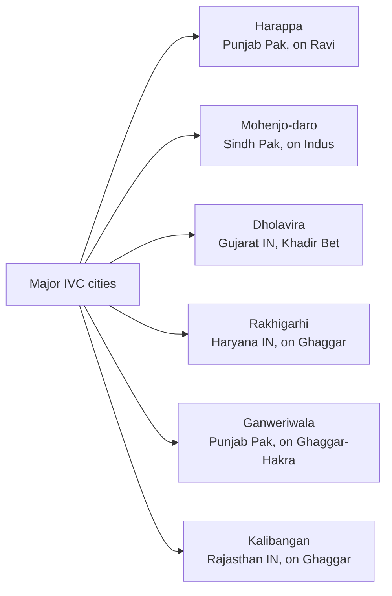
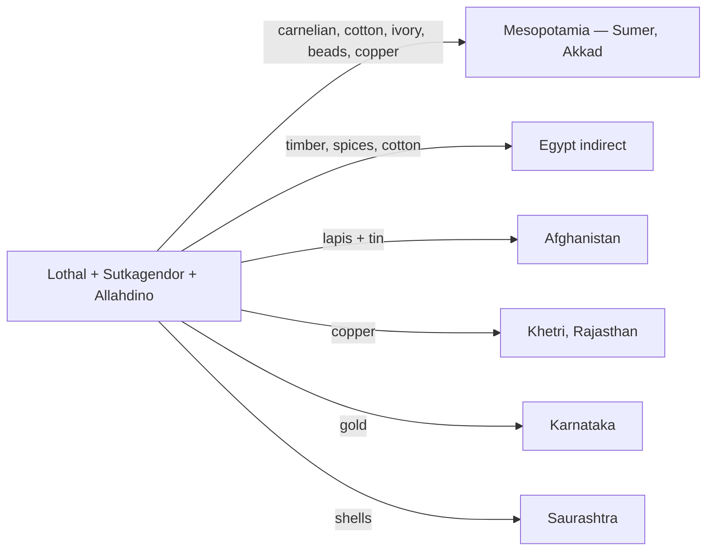
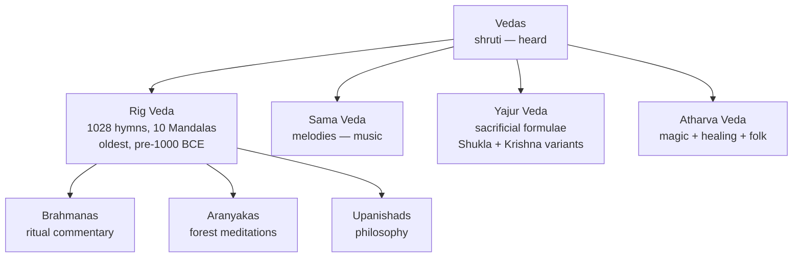
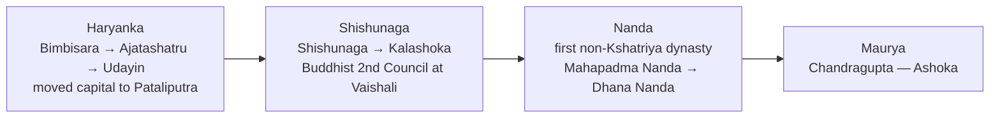
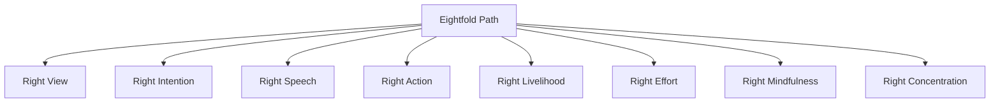
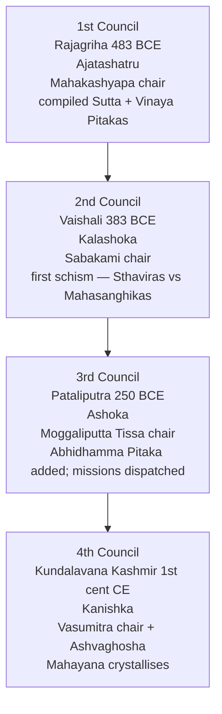
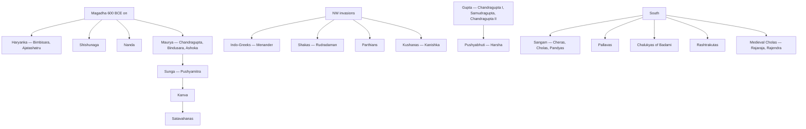

# EXAMINER BLUEPRINT — What Gets Tested Most

History questions in competitive exams are almost entirely about **dates, names, and one-line significance** of events. Narrative matters for understanding, but what earns marks is a clean table of facts in your head. Here is what examiners reach for, across SSC, RRB, Banking, and state PSC exams.

**Top 8 exam hotspots in History**

1. **Indus Valley Civilisation** — discoverers, excavators, major site locations, key features (Great Bath, no weapons, standardised weights). Questions appear every paper.
2. **Mauryan Empire** — Chandragupta Maurya, Ashoka's Dhamma, pillar edicts, Battle of Kalinga 261 BCE. 2–3 questions every SSC exam.
3. **Delhi Sultanate** — five dynasties with founder and last ruler, Qutub Minar, Ibn Battuta, Timur's invasion. Frequently tested.
4. **Mughal Empire** — all 6 rulers with years, battles (Panipat I/II/III), architectural works, revenue systems. Rich source of questions.
5. **Bhakti and Sufi movements** — saints, their traditions, associated states. Examiners love these.
6. **Freedom struggle chronology** — 1857 revolt, INC sessions with presidents, Gandhi's movements (Khilafat, Non-Cooperation, Civil Disobedience, Quit India), and their years. Among the most-asked history topics.
7. **Governors-General and Viceroys** — who introduced which reform, which act was passed under whom. Matching questions are common.
8. **Post-Independence India** — Five-Year Plans, major policies, language reorganisation, integration of princely states, wars (1947, 1962, 1965, 1971).

**Study priority for time-poor students**

1. IVC sites, discoverers, and key features
2. Mauryan Empire (Ashoka especially)
3. Freedom struggle chronology — 1857 to 1947 in order
4. Mughal rulers + key battles
5. Delhi Sultanate dynasties
6. Governors-General/Viceroys + their acts
7. Bhakti/Sufi saints + states
8. Post-independence milestones

---

# What's New This Year (History)

> Only the post-2023 timeline entries (current PM term, recent CMs, 2024-26 events) change with politics. Everything else in this book — Mughal emperors, Delhi Sultanate, 1857 revolt, freedom-struggle dates, Bhakti-Sufi saints, Governors-General/Viceroys, INC sessions, Acts of British India, post-Independence milestones up to 2023 — is **historically stable and 100% static**.

| Item | Current value (verify before your exam) |
|---|---|
| **Current PM** | Narendra Modi (3rd term, NDA-3.0, sworn in 9 Jun 2024) |
| **Current President** | Droupadi Murmu (15th, since 25 Jul 2022; term till 24 Jul 2027) |
| **Current VP** | C.P. Radhakrishnan (15th, since 12 Sep 2025) |
| **Census 2027** | Phase I launched 1 Apr 2026; outlay ₹11,718.24 cr |
| **Key recent milestones** | India-G20 host 2023 · Chandrayaan-3 Aug 2023 · Article 370 abrogated Aug 2019 |

> **All BC/AD historical dates, dynasty timelines, freedom-struggle events, and pre-2023 milestones are static and verified — they do not need re-checking.**

---

# How To Use This Book

This book moves through time in a logical sequence:

- **Part A — Ancient India** (pre-history → 650 CE)
- **Part B — Medieval India** (650 → 1526)
- **Part C — The Mughals + Marathas** (1526 → 1803)
- **Part D — Colonial India + Freedom Struggle** (1600s → 1947)
- **Part E — Post-Independence India** (1947 → today)
- **Part F — World History** (revolutions, world wars, decolonisation, Cold War)

**Three things history rewards: dates, names, and one-line significance.** Get those right and you can reconstruct every narrative around them. Read a chapter, close the book, and test yourself on the key facts before moving on. That active retrieval — not passive re-reading — is what shows up in your score.

**Reading pace:** one Part per week is a comfortable pace. Each "Exam hooks" section at the end of every chapter is your revision checklist — if you can answer those, the chapter is done.

---

# Part A — Ancient India

The first 3,500 years of Indian civilisation: from the mysterious grid cities
of the Indus, through the Vedic pastoral age, into the great empires of the
Maurya + Gupta, ending in the classical southern kingdoms. Ancient India is
where **foundational facts** come from — the ones memorisable lists
(dynasties, cities, texts) that examiners love.

---

## Chapter 1 — Prehistory + Stone Ages

### 1.1 Hook — the teeth that rewrote the clock

In **2011**, archaeologists excavating **Attirampakkam** near Chennai found
**stone tools dated to 1.5 million years ago** — some of the oldest
evidence of hominins outside Africa. The find rewrote textbooks on human
dispersal into Asia.

India's **stone-age sequence**:

| Period | Dates (approx.) | Tools + lifestyle | Key sites |
|--------|-----------------|-------------------|-----------|
| Palaeolithic (Old Stone Age) | 2 Mya – 10,000 BCE | Hand-axes, cleavers; nomadic hunter-gatherers | **Attirampakkam** (TN), **Bhimbetka** caves (MP, rock paintings 30,000+ yrs), Hunsgi (Karn), Soan valley (Pak), Didwana (Raj). |
| Mesolithic | 10,000 – 6,000 BCE | **Microliths** — tiny flint tools; domestication begins | **Bhimbetka** (late), **Bagor** (Raj), **Langhnaj** (Guj), Chopani Mando (UP). |
| Neolithic | 6,000 – 1,000 BCE | Polished stone tools, agriculture, pottery, permanent villages | **Mehrgarh** (Baloch/Pak — earliest farming, 7000 BCE), **Burzahom** (Kashmir — pit-dwellings), **Chirand** (Bihar), **Koldihwa** (UP — rice), Hallur + Maski (Karn). |
| Chalcolithic (Copper Age) | 3,500 – 1,000 BCE | Copper + stone; mostly overlaps with IVC rural periphery | Ahar-Banas (Raj), Malwa, Jorwe (Maha), Kayatha (MP). |

**Bhimbetka** (Raisen dist., MP) — **UNESCO WHS 2003**. 750+ rock shelters;
paintings from Upper Palaeolithic through medieval. Subjects: hunting,
dancing, rituals, horses + elephants + war-parties. Discovered by V.S.
Wakankar (1957).

**Mehrgarh** — the bridge to Indus Valley. Excavated by **Jean-François
Jarrige** from 1974. Shows continuous occupation from 7000 BCE; domesticated
wheat + barley + goat + sheep; mud-brick houses; dentistry evidence!

### 1.2 Exam hooks

- Bhimbetka — UNESCO 2003; MP; rock paintings since Palaeolithic.
- Mehrgarh (Pak/Baloch) — earliest farming in South Asia, 7000 BCE.
- Neolithic tools = **polished**; Mesolithic = **microliths**.
- **Attirampakkam** (TN) — 1.5 Mya tools.
- Koldihwa — earliest **rice cultivation** in India (~7000 BCE evidence).

**Quick test:** Name one key site for each stone age — Palaeolithic, Mesolithic, Neolithic, Chalcolithic. Also name: which site has India's oldest tools? Which has the earliest farming?

---

## Chapter 2 — Indus Valley / Harappan Civilisation (c. 3300 – 1300 BCE)

> Where ancient India's **urbanism** was born — 1,000 years before the Vedic
> hymns — and where the exam's cheapest marks are.

### 2.1 Discovery + dating

- **1826** — **Charles Masson** (ex-soldier turned explorer) noted a brick
  mound at Harappa; published 1842, not identified as a lost civilisation.
- **1856** — **John + William Brunton**, railway engineers, used Harappan
  bricks as ballast for the **Karachi–Lahore railway line** (unwittingly
  dismantling parts of the site).
- **1861** — **Archaeological Survey of India** founded; **Alexander
  Cunningham**, first DG, visited Harappa 1872 + misidentified the seals.
- **1921** — **Daya Ram Sahni** (ASI), at direction of **Sir John Marshall**,
  excavated Harappa.
- **1922** — **R.D. Banerji** found similar material at Mohenjo-daro.
- **24 September 1924** — **Sir John Marshall** announced to the world
  (via *Illustrated London News*) that India had an urban civilisation
  contemporary with Egypt + Mesopotamia. **Formal "discovery" date**.
- **Radiocarbon dating** (1950s on, D.P. Agrawal) fixed the mature phase at
  **2600 – 1900 BCE**.

#### Phases

| Phase | Dates | What happened |
|-------|-------|----------------|
| Early Harappan (Ravi / Regionalisation) | 3300 – 2600 BCE | Proto-urban villages; Mehrgarh tradition; standardised pottery, copper. |
| **Mature Harappan** | **2600 – 1900 BCE** | City phase; grid towns; script; seals; long-distance trade; *the "classical" IVC*. |
| Late Harappan / Localisation | 1900 – 1300 BCE | De-urbanisation; ruralisation; break into regional cultures — Cemetery H, Jhukar, Rangpur IIB-C. |

### 2.2 Extent — geography the exam loves

**IVC facts examiners love** — memorise these cold

- **Largest IVC site**: Rakhigarhi (Haryana)
- **Northernmost**: Manda (J&K) · **Southernmost**: Daimabad (Maharashtra) · **Easternmost**: Alamgirpur (UP) · **Westernmost**: Sutkagendor (Balochistan/Pak)
- **Great Bath** = Mohenjo-daro · **World's first dockyard** = Lothal · **Earliest ploughed field** = Kalibangan
- **Only city without a citadel**: Chanhudaro · **Only 3-part city**: Dholavira (UNESCO WHS 2021)
- **First site excavated in independent India**: Ropar (Punjab, 1953)
- **Harappa discovered by**: Daya Ram Sahni (1921) · **Mohenjo-daro by**: R.D. Banerji (1922)
- **No iron in IVC** — this civilisation was Bronze Age, not Iron Age

~**1.5 million sq km** — the **largest Bronze-Age civilisation** by area.

- **North**: Manda (J&K, on Chenab).
- **South**: Daimabad (Maharashtra, on Pravara).
- **East**: Alamgirpur (Meerut, UP, on Hindon).
- **West**: Sutkagendor (Makran coast, Balochistan).

Over **2,000 sites**; ~1,500 in India + ~500 in Pakistan/Afghanistan.

#### The 6 major cities — memorise all

Order by **size**: Rakhigarhi (~550 ha — **largest**) > Mohenjo-daro > Harappa
> Ganweriwala > Dholavira > Kalibangan.

#### What each site is famous for

| Site | State | Discovered by, year | Famous for |
|------|-------|---------------------|------------|
| **Harappa** | Punjab (Pak), Ravi | Daya Ram Sahni, 1921 | Type-site; granary; 6 rows of workers' quarters; R-37 cemetery. |
| **Mohenjo-daro** ("mound of the dead") | Sindh (Pak), Indus | R.D. Banerji, 1922 | **Great Bath**, Great Granary, College of Priests, Pashupati Seal, bronze **Dancing Girl**, Priest-King, world-class drainage. |
| **Kalibangan** ("black bangles") | Rajasthan, Ghaggar | A. Ghosh, 1953 | Earliest **ploughed field**; **fire altars**; wooden drains. |
| **Lothal** ("mound of the dead", Gujarati) | Gujarat, near Sabarmati | S.R. Rao, 1954 | World's 1st known **tidal dockyard**; bead factory; rice husk; Persian Gulf seal. |
| **Dholavira** | Gujarat, Khadir Bet | J.P. Joshi, 1967; R.S. Bisht excavated | **Water-harvesting** mastery (16+ reservoirs); 3-part city; **10-character signboard**; stadium. **UNESCO WHS 2021**. |
| **Rakhigarhi** | Haryana, Hisar | Suraj Bhan, 1963; Amarendra Nath excavated | **Largest IVC site**; 2019 DNA study (Shinde et al.) found no Steppe ancestry — major input to Aryan debate. |
| **Banawali** | Haryana, on Saraswati | R.S. Bisht, 1973 | Both pre- + mature phases; no drainage; clay figurines. |
| **Surkotada** | Gujarat | J.P. Joshi, 1964 | Earliest **horse bones** (disputed); rubble fortifications. |
| **Chanhudaro** | Sindh (Pak) | N.G. Majumdar, 1931 | **Only city without a citadel**; bead-making; inkwell; toy bronze cart. |
| **Alamgirpur** | UP, Meerut | Y.D. Sharma, 1958 | **Easternmost** IVC site; cloth impressions on pottery. |
| **Ropar / Rupnagar** | Punjab, IN | Y.D. Sharma, 1953 | **First IVC site excavated in independent India**; dog-human burial. |
| **Manda** | J&K, Akhnoor on Chenab | J.P. Joshi, 1982 | **Northernmost** site. |
| **Daimabad** | Maharashtra, Pravara | B.P. Bopardikar, 1958 | **Southernmost**; famous **bronze chariot hoard**. |
| **Sutkagendor** | Balochistan (Pak) | Aurel Stein, 1927 | **Westernmost**; trading post with Sumer. |
| **Balakot, Allahdino** | Sindh | 1970s | Coastal; pearl-oyster workshops. |
| **Kunal** | Haryana | 1986 | Pre-Harappan; silver crown. |
| **Bhirrana** | Haryana | 2005 (L.S. Rao) | Some claim earliest site — ~7500 BCE pottery (controversial). |

### 2.3 Town planning — the hallmark feature

#### Citadel + Lower Town model

Every major Harappan city has **two mounds**:
1. **Citadel** (upper town) — smaller, raised, usually to the west; public
   buildings (Great Bath, granary, assembly halls).
2. **Lower town** — to the east, residential + commercial.

Exception: **Dholavira** has **3-part** division (citadel + middle + lower
town) + **Chanhudaro** has **no citadel**.

#### The grid

Streets cut each other at **right angles**, in a perfect grid — unprecedented
in the Bronze Age. North-south + east-west. Width up to 9 m.

#### Standardised burnt bricks

Ratio **1:2:4** (thickness : width : length), e.g., 7 × 14 × 28 cm. Same
ratio across 1,500 km of territory + 700 years — strong evidence of a
**standardising authority**. Kiln-fired (burnt, not sun-dried) — far more
durable than Mesopotamian mud-brick.

#### Drainage — the signature feature

**Covered drains** along every street; burnt brick with stone/wooden covers;
gradient-engineered for gravity flow; house-to-street connection; manholes
at intervals for cleaning. **Gordon Childe** called it *"more advanced than
anything in the ancient world"*.

#### Great Bath — Mohenjo-daro

**11.9 × 7 × 2.4 m deep**. Watertight via finely fitted bricks + gypsum
mortar + a layer of bitumen (extraordinary). Steps at N + S. Attached
dressing rooms. **Probably ritual bathing** (purification) by a priestly
elite — not recreational.

#### Granaries

- Harappa: 6 granaries in two rows of 3, each ~15 × 6 m.
- Mohenjo-daro: one massive granary (~50 × 27 m).
- Located near the citadel → **state-controlled** grain.

### 2.4 Society + daily life

- **Social structure**: no royal tombs or palaces → likely a *merchant +
  priestly oligarchy*, not a king. Wheeler's "imperial" ruling-class theory
  largely rejected.
- **Food**: wheat + barley (staple); rice (Lothal, Rangpur); pulses;
  sesame + mustard + dates + melons.
- **Animals**: zebu cattle, sheep, goat, buffalo, dog, pig; camels (some
  sites); **horse disputed** (only Surkotada strongly).
- **Cotton** — earliest known textile in the world; Mesopotamian tablets
  called cloth from Sindh "**Sindhon**".
- **Religion (inferred, no temples)**: Mother Goddess (figurines); **Pashupati
  Seal** (proto-Shiva); linga + yoni stones; tree (pipal) + animal worship;
  **fire altars** at Kalibangan + Lothal.
- **Script**: pictographic; ~400–600 symbols; right-to-left first line then
  boustrophedon; ~5 signs per seal; **unread** despite decades of effort.
  **Dholavira signboard** = 10 characters on wood → world's earliest signboard.

### 2.5 Economy + trade

- **Bronze** (Cu + Sn from Afghanistan) metallurgy; **no iron**.
- Wheel-turned pottery — plain red with black painted motifs.
- Bead centres at **Chanhudaro + Lothal** (carnelian, agate, jasper, lapis).
- **Cotton textiles** — world first.
- **Seals** — steatite, ~2.5 cm², animal motif + short inscription.

#### Trade network

- Sumerian tablets call India "**Meluhha**" (land of cotton + carnelian).
- Harappan seals found at **Ur, Susa, Tell Asmar**.
- Lothal **dockyard** (218 × 37 × 3.3 m) — likely tidal basin for trading ships.
- **Persian Gulf seal** at Lothal = Dilmun (Bahrain) intermediary trade.
- Weights — **binary** below 16, **decimal** above; chert stone.

### 2.6 Decline (c. 1900 – 1300 BCE) — the debated collapse

**Causes** — no single theory fully explains it:

1. **Climate change + Saraswati dry-up** — after ~2000 BCE the Ghaggar-Hakra
   dried up; palaeoclimate (ISRO) supports the **4.2-kiloyear event**, an
   abrupt monsoon weakening that also collapsed Old Kingdom Egypt + Akkad.
2. **Shifting river courses** — Indus changed course, leaving Mohenjo-daro high + dry.
3. **Ecological degradation** — deforestation for brick kilns.
4. **Floods** — repeated Indus floods; silt layers.
5. **Earthquakes** — Dholavira shows damage.
6. **Aryan invasion theory** (Wheeler 1947) — **discredited**. Mohenjo-daro
   "massacre" skeletons are from different periods + show no violent deaths.
7. **Internal trade collapse** — Mesopotamian demand fell.

**Outcome**: NOT wipe-out. De-urbanisation → rural continuation → absorption
into **Cemetery H** (Punjab), **Jhukar** (Sindh), **Rangpur IIB/C** (Gujarat),
**Painted Grey Ware** culture of the Gangetic plain (1200 BCE) → Vedic.

### 2.7 Famous artefacts — memorise each

| Artefact | Site | Material | Significance |
|----------|------|----------|---------------|
| **Dancing Girl** | Mohenjo-daro | Bronze | 10.5 cm figurine; lost-wax casting; confident stance. |
| **Priest-King** | Mohenjo-daro | Steatite | 17.5 cm bust, fillet + trefoil robe; meditative half-closed eyes. |
| **Pashupati Seal** | Mohenjo-daro | Steatite | 3-faced horned deity in yogic posture surrounded by tiger, elephant, rhino, buffalo + 2 deer → **proto-Shiva**. |
| **Bronze bull** | Kalibangan | Bronze | Finely cast. |
| **Bronze chariot** | Daimabad | Bronze | 2 oxen + charioteer; 60 cm long; heaviest bronze of the era. |
| **Plough model** | Banawali | Terracotta | Confirms ploughing. |
| **Swastika + pipal motifs** | Multiple | — | Predate Hindu/Buddhist iconography. |
| **Dholavira signboard** | Dholavira | Wood + gypsum | 10 script characters — world's first signboard. |

### 2.8 Mnemonics

> **🧠 6 major cities — "HaMo KaLo DhoRa"**:
> **Ha**rappa, **Mo**henjo-daro, **Ka**libangan, **Lo**thal, **Dho**lavira, **Ra**khigarhi.

> **🧠 Site → State**:
> **Lo**thal + **Dh**olavira = **Guj**arat;
> **Ka**libangan = **Raj**;
> **Ra**khigarhi + **Bana**wali = **Hary**ana;
> **Ro**par = **Pun**jab-IN;
> **Alam**girpur = **UP**;
> **Dai**mabad = **Mah**arashtra.

> **🧠 Town-planning hallmarks** — *"GRID-BURN"*:
> **G**rid streets, **R**atio 1:2:4 bricks, **I**ndus-style drains covered,
> **D**ual mounds, **B**urnt brick, **U**niform weights, **R**egulation
> across 1500 km, **N**o temples.

> **🧠 IVC decline** — *"FED-RIVE"*:
> **F**loods, **E**cology damage, **D**rying Saraswati, **R**iver course
> changes, **I**nternal trade collapse, **V**isible climate shift
> (4.2-ky event), **E**arthquakes.

### 2.9 Exam hooks

- First DG of ASI — **Alexander Cunningham (1861)**.
- Harappa excavated 1921 by **Daya Ram Sahni**; Mohenjo-daro 1922 by
  **R.D. Banerji**.
- Dockyard — **Lothal**.
- Largest site — **Rakhigarhi** (~550 ha).
- Southernmost — **Daimabad**; Northernmost — **Manda**; Westernmost —
  **Sutkagendor**; Easternmost — **Alamgirpur**.
- Pashupati seal — **Mohenjo-daro**.
- Ploughed field — **Kalibangan**.
- Brick ratio — **1:2:4**.
- "Meluhha" = Mesopotamian name for **Indus region**.
- **Dholavira** became India's **40th UNESCO WHS in 2021**.

**Quick test:** List the 6 major Harappan cities and their present-day states/countries. Also: who discovered Harappa? Who excavated Mohenjo-daro? What is the Great Bath made of?

---

## Chapter 3 — The Vedic Age (c. 1500 – 600 BCE)

### 3.1 Hook — what the Rig Veda records

Around **1500 BCE**, the hymns of the **Rig Veda** describe a pastoral people
— speakers of **Old Indo-Aryan** — in the region of the **Sapta-Sindhu**
(seven rivers of the Punjab + eastern Afghanistan). They speak of battles
with the *Dasas* + *Panis*, rivers by names we still recognise (Sindhu,
Saraswati, Ganga, Yamuna), and gods of thunder + fire + water (**Indra**,
**Agni**, **Varuna**).

Whether these "Aryans" **migrated** into India or **emerged indigenously** is
one of the most politically loaded debates in Indian historiography. Recent
**ancient DNA** (Narasimhan et al., 2019) points to a **Steppe migration**
into South Asia between **2000–1500 BCE**, mixing with the existing
Harappan-descended population. Recent DNA from **Rakhigarhi (2019)**
found no Steppe ancestry in the IVC skeleton sampled, consistent with a
post-IVC migration.

### 3.2 Early vs Later Vedic — the contrast you must know

| Feature | **Early Vedic (1500 – 1000 BCE)** | **Later Vedic (1000 – 600 BCE)** |
|---------|-----------------------------------|-----------------------------------|
| Geography | Punjab + Sapta-Sindhu (Indus basin) | Gangetic plain; eastward shift |
| Economy | Pastoral — cattle (*gomat*) = wealth | Agricultural — plough + rice; iron (**1000 BCE**) |
| Political unit | Tribe (*jana*); *rajan* (chief) + **sabha** + **samiti** | Janapadas → Mahajanapadas; king (*samrat*); rise of caste-based kingship |
| Society | Broadly egalitarian; women participated in rituals + could marry late | **Varna** hardened into **jati**; patriarchy strengthens; child marriage begins |
| Religion | Nature deities — Indra, Agni, Varuna, Mitra, Surya, Soma | Trimurti emerging — Brahma, Vishnu, Rudra-Shiva; elaborate yajnas; philosophical **Upanishads** |
| Texts | **Rig Veda** (1028 hymns, 10 Mandalas) | **Sama, Yajur, Atharva Vedas**; **Brahmanas** (ritual commentary); **Aranyakas** (forest meditations); **Upanishads** (philosophy) |
| Literature | Oral (*shruti*) | Oral + increasingly systematised |

### 3.3 The 4 Vedas + their allied texts

- **Rig Veda** — **1028 hymns** (*suktas*) in 10 **Mandalas** (books). Oldest
  Mandalas: 2–7 (family Mandalas). Mandala 10 includes **Purusha Sukta**
  (first mention of the 4 varnas) + **Nasadiya Sukta** (on creation).
- **Sama Veda** — **melodies** for chanting; origin of Indian classical music.
- **Yajur Veda** — **formulae** for rituals; 2 schools — Shukla (white) +
  Krishna (black).
- **Atharva Veda** — spells, charms, folk medicine; darker in tone;
  admitted to canon only later.

**108 principal Upanishads** — 10 "classical" ones (Isha, Kena, Katha,
Prashna, Mundaka, Mandukya, Taittiriya, Aitareya, Chhandogya, Brihadaranyaka).
Contain the ideas of **Brahman, Atman, karma, moksha**. Gave rise to 6
orthodox schools of philosophy (**Darshanas**): Nyaya, Vaisheshika, Samkhya,
Yoga, Purva Mimamsa, Vedanta (Uttara Mimamsa).

### 3.4 Vedic society — varna + the 4 ashramas

**Varna** — the fourfold social order, first mentioned in Purusha Sukta
(Rig Veda 10.90):

1. **Brahmin** — priests + scholars.
2. **Kshatriya** — warriors + rulers.
3. **Vaishya** — farmers + traders + artisans.
4. **Shudra** — service / labour.

Originally **functional**. Became **hereditary** in the later Vedic period
→ hardened into **jati**.

**Ashrama** — four life-stages (a later Vedic framework):

1. **Brahmacharya** — student.
2. **Grihastha** — householder.
3. **Vanaprastha** — retiring to forest / reflection.
4. **Sannyasa** — renunciation.

### 3.5 Exam hooks

- **Rig Veda — 1028 hymns, 10 Mandalas**.
- **Purusha Sukta** = first mention of 4 varnas (Mandala 10).
- **Gayatri Mantra** is in **Rig Veda Mandala 3** (to Savitri, by Vishwamitra).
- Iron from ~**1000 BCE** (Later Vedic, **PGW culture**).
- Four Vedas in **order of canonisation**: Rig, Sama, Yajur, Atharva.
- Upanishads = **Vedanta** ("end of the Vedas").
- Sabha (elders' council) + Samiti (general assembly) — early democratic
  institutions.

---

## Chapter 4 — The 16 Mahajanapadas + the Rise of Magadha

### 4.1 Hook

By **600 BCE**, tribal *janapadas* had consolidated into **16
Mahajanapadas** ("great kingdoms"). **Buddhist Anguttara Nikaya** +
**Jain Bhagavati Sutra** name them. Most were kingdoms; a few — **Vajji** (capital
Vaishali) + **Malla** (Kusinara) — were **gana-sanghas** (tribal republics,
with assembly-based governance).

### 4.2 The 16 Mahajanapadas — map in your head

| # | Name | Capital | Region (modern) |
|---|------|---------|------------------|
| 1 | Kasi | Varanasi | E UP |
| 2 | Kosala | Shravasti | E UP |
| 3 | Anga | Champa | Bihar |
| 4 | **Magadha** | Rajgriha (later Pataliputra) | S Bihar |
| 5 | **Vajji** (republic) | Vaishali | N Bihar |
| 6 | Malla (republic) | Kusinara + Pava | N Bihar, E UP |
| 7 | Chedi | Suktimati | Bundelkhand |
| 8 | Vatsa | Kaushambi | UP |
| 9 | Kuru | Indraprastha | Delhi–Haryana |
| 10 | Panchala | Ahichhatra + Kampilya | UP |
| 11 | Matsya | Viratnagar | Rajasthan |
| 12 | Surasena | Mathura | UP |
| 13 | Ashmaka | Potana | Maharashtra (only southern) |
| 14 | Avanti | Ujjain + Mahishmati | MP |
| 15 | Gandhara | Taxila | NW (Pak + Afghan) |
| 16 | Kamboja | Rajapura | NW (Pak + Afghan) |

### 4.3 The 4 dynasties of Magadha (600 BCE – 322 BCE)

- **Haryanka (c. 544 – 413 BCE)** — **Bimbisara** + **Ajatashatru** (killed
  Bimbisara; fought Kosala + Vajji; patronised Buddha + Mahavira); **Udayin**
  moved the capital to **Pataliputra**.
- **Shishunaga (413 – 345 BCE)** — Shishunaga, Kalashoka (patronised the
  **Second Buddhist Council** at Vaishali in 383 BCE).
- **Nanda (345 – 322 BCE)** — **first non-Kshatriya** dynasty; Mahapadma
  Nanda ("uprooter of all Kshatriyas"); Dhana Nanda was the one
  **Chandragupta Maurya overthrew**.

### 4.4 Exam hooks

- **16 Mahajanapadas** — named in **Anguttara Nikaya + Bhagavati Sutra**.
- **Republics (gana-sanghas)**: Vajji (Vaishali) + Malla.
- **Bimbisara** (Haryanka) = Buddha's contemporary.
- **Pataliputra** became capital under **Udayin**.
- Nandas — first **non-Kshatriya** dynasty; Chandragupta Maurya overthrew
  **Dhana Nanda** (322 BCE) with Chanakya's help.

---

## Chapter 5 — Buddhism

### 5.1 Hook — a prince who walked out at 29

Around **563 BCE** (traditional; some scholars 480 BCE), a prince was born in
the **Shakya** republic of Kapilavastu to **Suddhodana** + **Maya**. He
renounced the palace at **29** after the **4 sights** (old man, sick man,
dead man, ascetic). Attained enlightenment at **35** under a **pipal tree**
at **Bodh Gaya**. Gave his **first sermon** (**Dhamma-chakka-pavattana**) at
**Sarnath (Deer Park)** to 5 ascetics. **Mahaparinirvana** at **Kusinara**
at **80**.

His name: **Siddhartha Gautama**. His title: **the Buddha** ("awakened").

### 5.2 The Four Noble Truths + the Eightfold Path

The **Four Noble Truths (Arya Satyas)**:
1. **Dukkha** — life is suffering.
2. **Samudaya** — cause of suffering is *tanha* (craving).
3. **Nirodha** — suffering can be ended.
4. **Magga** — the path to ending it.

The **Eightfold Path (Ashtanga Marga)** — the "Middle Way" between indulgence
+ extreme asceticism:

### 5.3 The Triratna + the Sangha

- **Buddha** — the teacher.
- **Dhamma** — the teachings.
- **Sangha** — the community of monks + nuns.

Admission was open to all castes (first egalitarian social revolution in
India). **Women admitted** only after Buddha's foster-mother **Mahaprajapati
Gotami** persuaded him (with Ananda's intercession).

### 5.4 Buddhist Councils — the 4 you must know

### 5.5 The 2 major schools

- **Hinayana / Theravada** — "lesser vehicle"; individual salvation; Pali
  canon; conservative. Today: Sri Lanka, Myanmar, Thailand, Laos, Cambodia.
- **Mahayana** — "greater vehicle"; universal salvation via Bodhisattvas;
  Sanskrit texts; from Kanishka's time. Today: China, Japan, Korea, Tibet,
  Mongolia, Bhutan, Vietnam.

Later: **Vajrayana** (tantric Buddhism) — Tibet, Bhutan, Ladakh.

### 5.6 Buddhist texts

- **Tripitaka (3 baskets)** — in **Pali**:
  - **Vinaya Pitaka** — monastic rules.
  - **Sutta Pitaka** — Buddha's discourses; the largest.
  - **Abhidhamma Pitaka** — philosophical analysis (added at the 3rd Council).
- **Dhammapada** — famous anthology of verses.
- **Jataka Tales** — 547 stories of Buddha's previous lives.
- **Milindapanha** — dialogue between Greek king Menander (Milinda) +
  Buddhist monk Nagasena.

### 5.7 Decline of Buddhism in India

1. Revival of Hinduism + Bhakti movement.
2. Adi Shankaracharya's debates (8th century) + philosophical challenge.
3. Huna invasions (Mihirakula destroyed monasteries).
4. Muslim invasions (Bakhtiyar Khilji destroyed **Nalanda** + **Vikramshila**,
   c. 1193 CE).
5. Patronage shift — Guptas + Pushyabhutis favoured Hinduism.
6. Internal corruption in monasteries.

Buddhism survived in Tibet + SE Asia; revived in India post-1956 via **Dr
B.R. Ambedkar's Navayana movement** (conversion of ~5 lakh Dalits at
**Deekshabhoomi, Nagpur, 14 October 1956**).

### 5.8 Exam hooks

- Born **Lumbini** (Nepal); enlightenment **Bodh Gaya** (Bihar); first sermon
  **Sarnath** (UP); nirvana **Kusinara** (UP).
- **Four Noble Truths** + **Eightfold Path**.
- **Tripitaka** in **Pali**.
- **4 Councils** — Rajagriha (483 BCE, Mahakashyapa) → Vaishali (383 BCE) →
  Pataliputra (250 BCE, Ashoka, Moggaliputta Tissa) → Kundalavana (1st c CE,
  Kanishka, Vasumitra).
- **Mahaprajapati Gotami** — first Buddhist nun.
- Nalanda + Vikramshila destroyed by **Bakhtiyar Khilji, 1193 CE**.

---

## Chapter 6 — Jainism

### 6.1 Hook — 24 Tirthankaras + the historical ones

Jainism recognises **24 Tirthankaras** ("ford-makers"). The **first** was
**Rishabhanatha (Adinatha)** — mentioned in the Rig Veda; symbol: BULL.
The **23rd — Parshvanatha** (c. 872-772 BCE) — is historical; preached 4
vows (ahimsa, satya, asteya, aparigraha); symbol: snake. The **24th —
Mahavira** (c. 540-468 BCE, traditional) added the 5th vow **brahmacharya**.

### 6.2 Mahavira — the 24th Tirthankara

- Born **Kundagrama** (near Vaishali, Bihar) to **Siddhartha + Trishala** of
  the Jnatrika clan. Original name **Vardhamana**.
- Married Yashoda; had a daughter Priyadarshana. Renounced at 30; wandered
  12 years; attained **Kaivalya** at 42 at **Jrimbhikagrama** under a Sal tree.
- Called **Mahavira** ("great hero") + **Jina** ("conqueror") — source of
  the religion's name.
- **Mahaparinirvana** at **Pavapuri** (Bihar) aged 72, 468 BCE traditional.

### 6.3 Core doctrines

- **Panch Mahavratas (5 great vows)** for monks:
  1. **Ahimsa** — non-violence (extended to microbes).
  2. **Satya** — truth.
  3. **Asteya** — non-stealing.
  4. **Aparigraha** — non-possession.
  5. **Brahmacharya** — celibacy (added by Mahavira).

- **Triratna** — right faith (samyak darshana), right knowledge
  (samyak gnyana), right conduct (samyak charitra).

- **Anekantavada** — non-absolutism; reality has multiple aspects.
  **Syadvada** — "may be" theory; 7-fold predication; all statements
  qualified with *syat* ("perhaps").

- **No creator god**; soul (*jiva*) + matter (*ajiva*); karma as particulate.

### 6.4 The two sects

Post-Mahavira (~1st cent. BCE), Jainism split, after the great famine of
Magadha (c. 298 BCE) prompted **Bhadrabahu** to migrate south with a group
while **Sthulabhadra** stayed in Magadha:

- **Digambara** ("sky-clad") — nude monks; reject women's moksha (must be
  reborn male); hold 19th Tirthankara Malli was male. Southern/Karnataka
  focus.
- **Shvetambara** ("white-clad") — white-robed monks + nuns; allow women's
  ordination; Malli was female. Gujarat/Rajasthan focus.

### 6.5 Councils + texts

- **First Jain Council — Pataliputra (c. 300 BCE)** under Sthulabhadra;
  compiled **12 Angas** (but the 12th, Drishtivada, was already lost).
  Digambaras rejected the compilation.
- **Second Jain Council — Valabhi (453 or 466 CE)** under Devarddhi
  Kshamashramana; committed Shvetambara canon (45 Agamas) to writing.

**Kalpa Sutra** (by Bhadrabahu — lives of Tirthankaras) + **Tattvartha Sutra**
(by Umaswami; common to both sects).

### 6.6 Royal patrons

- **Chandragupta Maurya** (reputedly) retired as a Jain monk under
  Bhadrabahu at Shravanabelagola.
- **Kharavela** of Kalinga (Hathigumpha Inscription, ~150 BCE).
- **Amoghavarsha** (Rashtrakuta).
- **Kumarapala** (Chalukya, Gujarat).

### 6.7 Heritage sites

- **Shravanabelagola** (Karnataka) — 57-ft monolithic **Gommateshwara
  (Bahubali)** statue, erected 981 CE by **Chamundaraya**. Head-anointing
  ceremony (**Mahamastakabhisheka**) every 12 years.
- **Dilwara Temples**, Mt Abu — 11th-13th c., marble carving of the world's
  finest order.
- **Palitana** (Gujarat, Shatrunjaya Hill) — 863 temples.
- **Ranakpur** (Rajasthan) — 1444 pillars, no two alike.
- **Udayagiri + Khandagiri** caves (Odisha) — Kharavela's era, rock-cut
  chambers + Hathigumpha inscription.

### 6.8 Exam hooks

- 24 Tirthankaras; 1st = Rishabhanatha, 23rd = Parshvanatha, 24th = Mahavira.
- **5 Mahavratas** — Ahimsa, Satya, Asteya, Aparigraha, **Brahmacharya** (Mahavira).
- 2 sects — **Digambara** (nude, Karnataka) + **Shvetambara** (white, Gujarat).
- **Kharavela** of Kalinga — **Hathigumpha Inscription**, Odisha.
- **Chandragupta Maurya** reputedly died via **sallekhana** at **Shravanabelagola**.

---

## Chapter 7 — Mauryan Empire (322 – 185 BCE)

**Mauryan Empire — must-know facts**

- **Founded**: 322 BCE by **Chandragupta Maurya** (guide: **Chanakya/Kautilya**)
- **Greek ambassador**: **Megasthenes** (wrote *Indika*); came under Chandragupta
- **Ashoka's Kalinga war**: **261 BCE** → adopted Dhamma
- **Brahmi script deciphered by**: **James Prinsep**, **1837**
- **Ashoka's title on edicts**: *Devanampiya Piyadasi* (identified as Ashoka only in 1915)
- **Sarnath Lion Capital** → India's **national emblem** (adopted 26 Jan 1950)
- **End of Mauryan empire**: 185 BCE — **Pushyamitra Sunga** assassinated last Mauryan **Brihadratha**
- **Arthashastra** = Kautilya's manual of statecraft (15 books)

### 7.1 Founder — Chandragupta Maurya

**Chandragupta** (r. 322 – 298 BCE) overthrew **Dhana Nanda** with the
guidance of **Chanakya / Kautilya / Vishnugupta**. Defeated **Seleucus
Nicator** (Alexander's successor) in **305 BCE**; gained Gandhara + E.
Iran in exchange for 500 war elephants; married Seleucus's daughter Helen.
Received the Greek ambassador **Megasthenes** (author of ***Indika***).
Abdicated ~298 BCE; reportedly became a Jain monk + died by sallekhana
at **Shravanabelagola**.

### 7.2 Bindusara (r. 298 – 273 BCE) — the in-between king

Consolidated the empire south to Karnataka. Greek accounts call him
**Amitrochates** (from *Amitraghata*, "slayer of enemies"). Patronised the
**Ajivika** sect. Received a Greek ambassador **Deimachus**.

### 7.3 Ashoka the Great (r. 268 – 232 BCE)

- Killed rivals to seize the throne.
- **Kalinga War (261 BCE)** — 100,000 killed, 150,000 deported → Ashoka's
  transformation. Adopted **Dhamma** (Buddhist ethics + moral governance).
- **Rock + Pillar Edicts** — 14 major rock edicts + 7 pillar edicts +
  minor ones, in **Brahmi** (and Kharoshthi in NW). **James Prinsep**
  deciphered Brahmi + Kharoshthi in **1837**.
- **Missions abroad** — Buddhist missionaries sent to Sri Lanka (son
  **Mahendra** + daughter **Sanghamitra** took a Bodhi tree cutting), SE
  Asia, Syria, Egypt, Macedonia.
- **Title "Devanampiya Piyadasi"** ("beloved of the gods, one of pleasing
  appearance") on edicts — identified as Ashoka only in 1915.
- Built **Sanchi Stupa** (Madhya Pradesh, 3rd c. BCE; later expanded by
  Sungas + Satavahanas).

**Ashoka's Edicts — key ones to memorise:**

| Edict | Content |
|-------|----------|
| Major Rock Edict I | Ban on animal sacrifice + festivals. |
| Major Rock Edict II | Medical care for humans + animals. |
| Major Rock Edict IV | Moral progress (Dhamma-ghosha over Bheri-ghosha — drumbeats of morality, not war). |
| Major Rock Edict VI | Tours by officials to meet common people. |
| Major Rock Edict X | Rejection of fame + glory. |
| Major Rock Edict XIII | **Kalinga war** account + remorse + missions to Greek kings. **The longest edict.** |
| Rumindei Pillar | At **Lumbini** — commemorates Buddha's birthplace. |
| Nigali Sagar Pillar | Commemorates **Kanakamuni Buddha's stupa** expansion. |
| Allahabad Pillar | Original Ashokan inscription + later Samudragupta + Jahangir inscriptions added. |
| Saranath Pillar | Capital = the **Lion Capital** → **India's national emblem** (adopted 26 Jan 1950). |

### 7.4 Mauryan administration — Arthashastra

**Kautilya's Arthashastra** — a 15-book manual of statecraft.

- **Central Administration** — King + Council (Mantri Parishad).
- **Provincial** — 4 Provinces: **Uttarapatha** (Taxila), **Dakshinapatha**
  (Suvarnagiri), **Avantirattha** (Ujjain), **Kalinga** (Tosali) — each
  under a prince or governor (*Kumara*).
- **District (Ahara) → Village (Grama)**.
- **Revenue** — land tax (1/6th usually), customs, tolls, fines, mines.
- **Spy network** (*Gudhapurushas*) — a signature feature of Mauryan state.
- **Army** — Megasthenes reported 600,000 foot, 30,000 horse, 9,000
  elephants, 8,000 chariots — among the largest ancient armies.

### 7.5 Decline of the Mauryas

After Ashoka: successors weak (Dasaratha → Samprati → Shalishuka →
Devavarman → Shatadhanvan → **Brihadratha**). The last Mauryan
**Brihadratha** was **assassinated by his own general Pushyamitra Sunga**
in **185 BCE**, founding the **Sunga dynasty**.

### 7.6 Exam hooks

- **Chandragupta Maurya — 322 BCE**, overthrew Dhana Nanda with Chanakya.
- Defeated **Seleucus Nicator** (305 BCE).
- **Megasthenes** = Seleucus's ambassador; wrote ***Indika***.
- Ashoka's **Kalinga war** — **261 BCE**.
- James **Prinsep** deciphered **Brahmi + Kharoshthi** — **1837**.
- **Sarnath Lion Capital** = India's national emblem.
- **Pushyamitra Sunga** killed **Brihadratha** — **185 BCE**; ended Maurya.
- Ashoka title on edicts: **Devanampiya Piyadasi**.

---

## Chapter 8 — Gupta Age (320 – 550 CE) — India's Classical Golden Age

### 8.1 Hook — the age of Sanskrit classics + decimal mathematics

This is when **Kalidasa** wrote *Shakuntala*, **Aryabhata** propounded the
**decimal place-value + zero**, **Varahamihira** wrote *Brihatsamhita*,
**Nalanda University** flourished, and the **Gupta gold coins** were among
the finest ever struck. Tag: "**Golden Age of Classical India**".

### 8.2 Major Gupta rulers

| Ruler | Dates | Key facts |
|-------|-------|-----------|
| **Sri Gupta** | c. 240 – 280 CE | Founder; obscure. |
| Ghatotkacha | c. 280 – 319 | — |
| **Chandragupta I** | 319 – 335 | Took title **Maharajadhiraja**; married Licchavi princess **Kumaradevi**; started the **Gupta Era (319 CE)**. |
| **Samudragupta** | 335 – 375 | The **"Indian Napoleon"** (per V.A. Smith). **Allahabad Prashasti** (by court-poet Harisena) engraved on Ashoka's pillar enumerates his conquests. Performed **Ashvamedha yajna**. |
| **Chandragupta II 'Vikramaditya'** | 375 – 415 | **Peak of Guptas**. Defeated the **Western Kshatrapas** + extended to Gujarat + Saurashtra. **Fa-Hien** (Chinese pilgrim, 399–412 CE) visited. Court **9 jewels (Navaratnas)**. |
| Kumaragupta I | 415 – 455 | Founded **Nalanda University**. First **Huna invasion**. |
| Skandagupta | 455 – 467 | Repulsed **Huna invasions** (led by Toramana). Hero-king. |

### 8.3 Culture + achievements

- **Nalanda University** (5th c. CE → Bakhtiyar Khilji 1193 CE). 10,000+
  students; 9-storey library ("Dharmaganja"); international reputation.
- **Sanskrit literature** peaks — **Kalidasa**'s plays (Shakuntala, Meghaduta,
  Raghuvamsha, Kumarasambhava); **Sudraka's** Mrichhakatika; **Vishakhadatta's**
  Mudrarakshasa.
- **Aryabhata** (476 CE, *Aryabhatiya*) — decimal place-value; computed
  π ≈ 3.1416; defined sine function; proposed earth rotation on its axis.
- **Varahamihira** (~505 CE) — *Brihatsamhita*, *Panchsiddhantika*.
- **Vatsyayana** — *Kamasutra*.
- **Art** — **Ajanta Caves** (Maharashtra, 2nd c. BCE – 6th c. CE; UNESCO
  1983); **Ellora** begins (6th c. CE).
- **Coinage** — magnificent gold *dinaras* featuring kings as warriors,
  musicians, sacrificers.
- **Medicine** — *Ashtanga Hridaya* (Vagbhata).
- **Iron Pillar of Delhi** (Qutub complex) — cast during Chandragupta II;
  rust-resistant due to phosphorus content; 7 m tall.

### 8.4 Decline

- **Huna invasions** under Toramana + Mihirakula (5th–6th c.); drained
  resources.
- Feudatories (Maukharis, Maitrakas, Pushyabhutis) broke away.
- Trade declined; Gupta gold supply dried up.
- By **550 CE**, the Gupta empire had fragmented.

### 8.5 Exam hooks

- **Chandragupta I** — Gupta Era **319 CE**; married **Kumaradevi** (Licchavi).
- **Samudragupta** — **Allahabad Prashasti** by **Harisena**; "Indian Napoleon".
- **Chandragupta II** = Vikramaditya; **Fa-Hien** visit; 9 Navaratnas
  (Kalidasa, Amarasimha, Dhanvantari, Varahamihira, Ghatakarpara,
  Kshapanaka, Shanku, Vararuchi, Vetalbhatta).
- **Kumaragupta** founded **Nalanda**.
- **Aryabhata** = *Aryabhatiya* (476 CE).
- **Skandagupta** repulsed **Hunas**.
- **Iron Pillar** at Mehrauli = Chandragupta II period.

---

## Chapter 9 — Harsha + Chalukyas + Rashtrakutas + Pallavas

### 9.1 Harshavardhana (606 – 647 CE)

- **Pushyabhuti / Vardhana dynasty**; capital **Kanyakubja (Kanauj)**.
- Last great Hindu ruler of N India before Muslim invasions.
- **Defeated by Chalukya Pulakesin II at the Narmada, c. 630 CE** — could
  not expand south.
- Hosted the Chinese pilgrim **Hiuen Tsang (Xuanzang)** (630–644 CE).
- **Harshacharita** (biography) + **Kadambari** (novel) by his court poet
  **Banabhatta**.
- Harsha himself wrote 3 Sanskrit plays: *Nagananda*, *Priyadarshika*,
  *Ratnavali*.

### 9.2 Chalukyas of Badami (543 – 757 CE)

- **Pulakesin II (609 – 642)** — defeated Harsha at Narmada; received Persian
  ambassador (Ajanta Cave 1 painting depicts this); defeated by Pallava
  **Narasimhavarman I** at **Vatapi (642 CE)** — earning the Pallava the
  epithet *Vatapi-kondan*.
- **Badami, Aihole, Pattadakal** — architectural treasure (Pattadakal =
  UNESCO 1987).

### 9.3 Rashtrakutas (753 – 982 CE)

- Founded by **Dantidurga**. **Amoghavarsha I (814 – 878)** — Jain patron;
  wrote *Kavirajamarga* (oldest Kannada work on poetics).
- **Krishna I** commissioned the **Kailasa Temple (Cave 16) at Ellora** —
  monolithic rock-cut temple, 200,000 tonnes of basalt removed from top
  down; **UNESCO 1983**.

### 9.4 Pallavas (4th – 9th c. CE)

- Kanchipuram capital.
- **Mahendravarman I** + **Narasimhavarman I "Mamalla"** (630 – 668) —
  founded **Mamallapuram** (Mahabalipuram) port; built **Pancha Rathas**
  (5 monolithic temples), **Shore Temple**, **Arjuna's Penance** (world's
  largest bas-relief). UNESCO 1984.
- **Rajasimha** built **Kailasanatha Temple** at Kanchipuram (early
  structural Dravida).

### 9.5 Exam hooks

- Harsha defeated by **Pulakesin II** at Narmada (630 CE).
- Hiuen Tsang — Harsha's court (630 – 644 CE).
- Pulakesin II killed by **Narasimhavarman I** at Vatapi (642 CE).
- **Ellora Kailasa** = Rashtrakuta Krishna I.
- Mahabalipuram = Pallavas.
- **Pattadakal** = Chalukyas.
- **Aihole inscription** (634 CE, by Ravikirti) praises Pulakesin II.

---

## Chapter 10 — Chola Empire + South Indian Kingdoms

### 10.1 Hook — the maritime empire before Vasco da Gama

By **1025 CE**, a Tamil empire stretched from the banks of the Ganga to the
coasts of **Sumatra** — the **Chola Empire** under **Rajendra I**. India's
only pre-modern overseas empire.

### 10.2 Sangam-age predecessors (3rd c. BCE – 3rd c. CE)

**Muvendar** (three crowned kings) of Sangam age:
- **Cheras** — Kerala + W. TN. Capital **Vanji / Karur**. Emblem: bow + arrow.
  **Senguttuvan** hero of *Silappadikaram*.
- **Cholas** (early) — Central + E. TN (Cauvery delta). Capital **Uraiyur**.
  Emblem: tiger. **Karikala** built **Grand Anicut / Kallanai** dam on
  Kaveri (~150 CE) — world's oldest working dam.
- **Pandyas** — S. TN; capital **Madurai**. Emblem: fish. Patrons of **Tamil
  Sangams** — literary academies in Madurai.

**Sangam literature** — *Ettuthokai*, *Pattupattu*, *Tolkappiyam* (grammar).
5 **tinai** (eco-regions): Kurinji (hill), Mullai (pastoral), Marudam
(cropland), Neydal (coast), Palai (desert). **Arikamedu** (near Puducherry)
was a major Roman trade port (1st–2nd c. CE).

### 10.3 Medieval Cholas (850 – 1279 CE)

Revived by **Vijayalaya** (850 CE, from Thanjavur).

| Ruler | Dates | Key facts |
|-------|-------|-----------|
| **Rajaraja Chola I** | 985 – 1014 | Conquered Cheras, Pandyas, W. Chalukyas, Sri Lanka (N), Maldives. Built **Brihadeshvara Temple** at Thanjavur (**UNESCO** 1987). |
| **Rajendra Chola I** | 1014 – 1044 | Defeated **Palas of Bengal**; built **Gangaikondacholapuram**. Naval expedition to **Sri Vijaya** (Sumatra/Java) — **only Indian sea-borne empire**. |
| Kulottunga I | 1070 – 1122 | Consolidated. |

### 10.4 Chola local government — Uttiramerur inscriptions

**Uttiramerur (c. 919 CE, Parantaka Chola I)** — inscribed details of village
**sabha** elections:

- **Kudavolai** (pot-ticket) system — names on palm-leaf, drawn by a child
  priest.
- Qualifications: own land of 1/4 veli; own house on it; age 35–70;
  knowledge of Vedas + Dharmashastra; honest character.
- Disqualifications: embezzlers, close-relative office-holders, tax
  defaulters.
- 30 wards → 30 members; 1-year term; **6 variyams (committees)** — annual,
  garden, tank, standing, gold, justice.

Studied by Ambedkar + Constituent Assembly while framing Panchayati Raj
(Art 40 DPSP).

### 10.5 Chola art — bronze Nataraja

**Nataraja** (Shiva as cosmic dancer, Tandava pose) — iconic Chola bronze.

- 4 arms — damaru (drum — time/creation), agni (fire — destruction), abhaya
  mudra (fearlessness), lower-left pointing to raised foot (moksha).
- Right foot crushes **Apasmara** (dwarf of ignorance).
- Dances within **prabhamandala** (circle of fire — cosmos).
- **Chidambaram** = primary Nataraja temple (one of the *Panch Bhoota
  Sthalams* — represents AKASHA/ether).

### 10.6 Exam hooks

- 3 Sangam-age dynasties: **Cheras, Cholas, Pandyas**.
- **Karikala Chola** built **Kallanai / Grand Anicut** (~150 CE).
- **Brihadeshvara Temple** (Thanjavur) — Rajaraja Chola I (1010 CE).
- **Rajendra Chola I** — conquered **Sri Vijaya** (1025 CE naval expedition).
- Chola **Uttiramerur** inscription — village sabha election procedure
  (919 CE, Parantaka I).
- **Nataraja** iconic bronze → Chola.

---

# Part B — Medieval India (650 – 1526)

**Coming soon.** This Part will cover the Pratiharas, Palas, Rashtrakutas'
successors, the Arab invasion of Sindh (712 CE), the Ghaznavid raids (1000
– 1030 CE), Ghurids + the **Delhi Sultanate** (1206 – 1526; 5 dynasties —
Slave/Mamluk, Khilji, Tughlaq, Sayyid, Lodi), the **Bhakti + Sufi**
movements, the **Vijayanagar + Bahmani** empires + the Deccan Sultanates.

Structure planned (to be populated):

- Chapter 11: North Indian kingdoms + Arab/Ghaznavid invasions
- Chapter 12: Delhi Sultanate (5 dynasties)
- Chapter 13: Bhakti Movement
- Chapter 14: Sufi Movement
- Chapter 15: Vijayanagar + Bahmani + Deccan Sultanates

---

# Part C — The Mughals + Marathas (1526 – 1803)

**Coming soon.** Babur → Akbar → the golden age under Shah Jahan → Aurangzeb
→ decline. Shivaji's Maratha confederacy; Peshwa rule; the third battle of
Panipat (1761); the Anglo-Maratha wars.

---

# Part D — Colonial India + Freedom Struggle (1600s – 1947)

**Coming soon.** Europeans' arrival (Portuguese 1498, Dutch 1602, English
1600, French 1664); Plassey (1757); Buxar (1764); Regulating Act 1773 →
Crown rule 1858; social reformers; the 1857 Revolt; INC's founding (1885);
Moderates vs Extremists; Gandhi's return (1915); Non-Cooperation (1920–22);
Civil Disobedience (1930–34); Quit India (1942); Partition + Independence
(1947).

---

# Part E — Post-Independence India (1947 – today)

**Coming soon.** Integration of Princely States under Sardar Patel; Nehru's
era (1947 – 1964); Green Revolution; Indo-Pak 1965 + 1971; Bangladesh
liberation; Emergency (1975 – 77); LPG reforms (1991); nuclear tests (1974,
1998); Kargil (1999); GST (2017); Art 370 abrogation (2019).

---

# Part F — World History

**Coming soon.** Renaissance, Reformation, American Revolution (1775–83),
French Revolution (1789), Industrial Revolution (1760–1840), World Wars,
Russian + Chinese Revolutions, Cold War + Decolonisation.

---

# Appendices

## Appendix A — Ancient India timeline (condensed)

```mermaid
timeline
    title Ancient India Timeline
    3300 BCE : Early Harappan begins (Mehrgarh continuity).
    2600 BCE : Mature Harappan — city phase.
    1900 BCE : Late Harappan — de-urbanisation.
    1500 BCE : Early Vedic begins (Rig Veda).
    1000 BCE : Later Vedic — iron + Gangetic plain.
    600 BCE : 16 Mahajanapadas — Magadha rises.
    563 BCE : Gautama Buddha born (traditional).
    540 BCE : Mahavira born (traditional).
    483 BCE : Buddha's Mahaparinirvana — 1st Buddhist Council.
    322 BCE : Chandragupta Maurya founds Mauryan empire.
    305 BCE : Defeats Seleucus Nicator.
    268 BCE : Ashoka begins reign.
    261 BCE : Kalinga War.
    250 BCE : 3rd Buddhist Council — Ashokan missions.
    185 BCE : Pushyamitra Sunga kills Brihadratha — end of Mauryas.
    78 CE : Saka Era begins (Kanishka).
    319 CE : Gupta Era begins (Chandragupta I).
    400 CE : Fa-Hien visits under Chandragupta II.
    476 CE : Aryabhata's Aryabhatiya.
    606 CE : Harshavardhana begins reign.
    630 CE : Hiuen Tsang arrives; Pulakesin II defeats Harsha.
    985 CE : Rajaraja Chola I begins reign.
    1025 CE : Rajendra Chola naval expedition to Sri Vijaya.
```

## Appendix B — Dynasty quick-recall tree

## Appendix C — Master mnemonics for Ancient India

- **HaMo KaLo DhoRa** → 6 IVC cities.
- **GRID-BURN** → IVC town-planning hallmarks.
- **FED-RIVE** → IVC decline causes.
- **Kingdoms of the Sangam — 3C**: Cheras, Cholas, Pandyas (the Muvendar).
- **Mauryan genealogy**: "**Chandragupta built, Bindusara expanded, Ashoka
  transformed, Brihadratha lost**."
- **Gupta Peak line**: "Samudragupta conquered, Chandragupta II refined,
  Kumaragupta founded Nalanda, Skandagupta saved."
- **Chola naval route**: "Thanjavur → Gangaikondacholapuram → Sri Vijaya".
- **4 Buddhist Councils** — *Raja-Va-Pata-Kunda* (Rajagriha → Vaishali →
  Pataliputra → Kundalavana), under *Aja-Ka-A-Ka* (Ajatashatru, Kalashoka,
  Ashoka, Kanishka).

## Appendix D — Cheatsheet (1-page)

- **IVC** 2600 – 1900 BCE. 6 major cities. Bronze age. Cotton first. No iron.
  No temples. Unread script. Decline = climate + rivers + ecology (not Aryan
  invasion).
- **Vedic** 1500 – 600 BCE. Rig (1028 hymns) → 4 Vedas → Brahmanas → Aranyakas
  → Upanishads. Purusha Sukta has 1st mention of 4 varnas. Iron from 1000 BCE.
- **Mahajanapadas** 16; Vajji + Malla republics; Magadha rose via 4
  dynasties — Haryanka → Shishunaga → Nanda → Maurya.
- **Buddhism** — born 563/480 BCE; 4 NT + 8-fold path; Tripitaka in Pali;
  4 councils (Raja-Va-Pata-Kunda); 2 schools (Hinayana/Theravada + Mahayana).
- **Jainism** — 24 Tirthankaras; Parshvanatha (23rd, historical); Mahavira
  (24th, added Brahmacharya); 5 vows; Digambara + Shvetambara;
  Shravanabelagola Gommateshwara (981 CE).
- **Maurya** — Chandragupta 322 BCE; Ashoka Kalinga 261 BCE; edicts in
  Brahmi decoded by Prinsep 1837; Sarnath Lion Capital = national emblem;
  Pushyamitra Sunga kills Brihadratha 185 BCE.
- **Gupta** 319 – 550 CE. Golden Age. Samudragupta Allahabad Prashasti;
  Chandragupta II "Vikramaditya" + Fa-Hien; Nalanda under Kumaragupta;
  Aryabhatiya 476 CE; Skandagupta vs Hunas.
- **Harsha** 606 – 647, defeated at Narmada by Pulakesin II; Hiuen Tsang;
  Banabhatta's Harshacharita + Kadambari.
- **Cholas** — Rajaraja + Rajendra. Brihadeshvara 1010, Gangaikondacholapuram
  1035. Sri Vijaya naval 1025. Uttiramerur 919. Nataraja bronzes.

*Parts B–F will be added to this book in subsequent revisions, in the same
pedagogical style. For now, you can already score well in the Ancient India
section of SSC/RRB/PO/Banking — keep the facts from the cheatsheet above
in active recall during the exam.*

---

\newpage

# PART X — DELHI SULTANATE (1206-1526)

## 5 dynasties

| Dynasty | Years | First / Last ruler | Capital |
|---|---|---|---|
| **Mamluk (Slave / Ilbari)** | 1206-90 | Qutb-ud-din Aibak / Kayumars | Delhi |
| **Khilji** | 1290-1320 | Jalal-ud-din / Khusrau Khan | Delhi |
| **Tughlaq** | 1320-1414 | Ghiyas-ud-din / Mahmud Tughlaq | Delhi → Daulatabad → Delhi |
| **Sayyid** | 1414-51 | Khizr Khan / Alam Shah | Delhi |
| **Lodi** | 1451-1526 | Bahlul Lodi / Ibrahim Lodi | Delhi → Agra |

## Key rulers

- **Qutb-ud-din Aibak** (1206-10) — founder; built Quwwat-ul-Islam mosque + Qutb Minar (started); died playing chaugan.
- **Iltutmish** (1211-36) — real consolidator; introduced silver tanka + copper jital; established iqta system.
- **Razia Sultan** (1236-40) — first + only woman ruler of Delhi.
- **Balban** (1266-87) — "iron blood" policy; sijda + paibos rituals; theory "Zillullah".
- **Alauddin Khilji** (1296-1316) — Chittor (Padmavati legend); Devagiri, Warangal raids; Malik Kafur in south; market control + price-fixing (Diwan-i-Riyasat).
- **Muhammad-bin-Tughlaq** (1325-51) — Ibn Battuta in his court; **5 follies**: capital transfer to Daulatabad, token currency (copper as silver), Khorasan expedition, Qarachil expedition, Doab taxation.
- **Firoz Shah Tughlaq** (1351-88) — built Firozabad; abolished 23 taxes (kept Kharaj, Khams, Jizya, Zakat); built canals; moved Ashokan pillars (Topra + Meerut → Delhi).
- **Ibrahim Lodi** (1517-26) — only Sultan to die in battle (1st Panipat 1526 vs Babur).

---

\newpage

# PART Y — MUGHAL EMPIRE (1526-1857)

| Emperor | Reign | Notable |
|---|---|---|
| **Babur** | 1526-30 | Founder; defeated Ibrahim Lodi at 1st Panipat (1526), Rana Sanga at Khanwa (1527), Medini Rai at Chanderi (1528), Mahmud Lodi at Ghaghra (1529); wrote *Tuzk-i-Baburi* (Chagatai) |
| **Humayun** | 1530-40, 1555-56 | Lost to Sher Shah at Chausa (1539) + Kannauj (1540); fled to Persia; restored throne; died falling from library steps; tomb at Delhi (UNESCO) |
| (Sur interregnum) **Sher Shah Suri** | 1540-45 | Built Grand Trunk Road (Kabul → Bengal); silver rupiya; postal system; iqta reorganised; purana qila |
| **Akbar** | 1556-1605 | Crowned at Kalanaur age 13; Bairam Khan regent; 2nd Panipat 1556 (vs Hemu); Din-i-Ilahi (1582); Mansabdari; Todar Mal land-revenue (Zabti, Dahsala); Fatehpur Sikri; abolished jizya 1564; Akbarnama by Abul Fazl |
| **Jahangir** | 1605-27 | Real name Salim; Nur Jahan most powerful queen; Captain Hawkins (1608) + Sir Thomas Roe (1615) at court; tomb at Lahore |
| **Shah Jahan** | 1628-58 | Golden age architecture — Taj Mahal (Mumtaz d. 1631), Red Fort, Jama Masjid Delhi; Peacock Throne; imprisoned by Aurangzeb; died at Agra Fort |
| **Aurangzeb (Alamgir)** | 1658-1707 | Last great Mughal; orthodox; reimposed jizya 1679; executed Guru Tegh Bahadur (1675); 25-year Deccan war vs Marathas; longest reign (49 yrs) |
| **Bahadur Shah I** | 1707-12 | First "later Mughal"; rapid decline begins |
| Muhammad Shah ("Rangila") | 1719-48 | Nadir Shah's invasion 1739 — looted Peacock Throne + Kohinoor |
| Shah Alam II | 1759-1806 | Battle of Buxar 1764 — yields Diwani of Bengal/Bihar/Orissa to EIC (1765) |
| **Bahadur Shah II Zafar** | 1837-57 | **Last Mughal** — exiled to Rangoon after 1857 revolt; died 1862 |

---

\newpage

# PART Z — MARATHAS + SIKHS

## Maratha rulers

- **Shivaji** (1630-80) — founded Maratha Empire; Chhatrapati at Raigad 1674; Ashtapradhan Mandal; Battle of Pratapgarh (Afzal Khan, 1659); Surat sack 1664.
- **Sambhaji** (1680-89) — captured + executed by Aurangzeb.
- **Shahu** (1707-49) — Peshwa Balaji Vishwanath rises.
- **Bajirao I** (1720-40) — greatest Peshwa; "guerrilla cavalry".
- **Balaji Bajirao** (1740-61) — empire at peak; **3rd Battle of Panipat 14 Jan 1761** vs Ahmad Shah Abdali — crushed.
- **Bajirao II** (1796-1818) — last Peshwa; pensioned after 3rd Anglo-Maratha war.

## Anglo-Maratha wars

- 1st (1775-82) → Treaty of Salbai 1782.
- 2nd (1803-05) → Treaty of Bassein 1802.
- 3rd (1817-18) → Peshwaship abolished.

## Sikhs — 10 Gurus (1469-1708)

| # | Guru | Years | Key |
|---|---|---|---|
| 1 | Nanak | 1469-1539 | Founder |
| 2 | Angad | 1539-52 | Gurmukhi script |
| 3 | Amar Das | 1552-74 | Manji system |
| 4 | Ram Das | 1574-81 | Foundation of Amritsar |
| 5 | Arjan Dev | 1581-1606 | Compiled Adi Granth; built Harmandir Sahib; first martyr (Jahangir) |
| 6 | Hargobind | 1606-44 | Akal Takht; militarised |
| 7 | Har Rai | 1644-61 | |
| 8 | Har Krishan | 1661-64 | Youngest Guru |
| 9 | Tegh Bahadur | 1664-75 | Executed by Aurangzeb (Sis Ganj) |
| 10 | Gobind Singh | 1675-1708 | **Khalsa** at Anandpur Sahib (Baisakhi 30 Mar 1699); 5 Ks; Granth Sahib eternal Guru |

- **Banda Singh Bahadur** (1708-16) — military leader after Gobind.
- **Maharaja Ranjit Singh** (1799-1839) — "Sher-e-Punjab"; founded Sikh Empire; Anglo-Sikh wars I (1845-46) + II (1848-49) → Punjab annexed 1849.

---

\newpage

# PART AA — BRITISH RULE — KEY ACTS + GG/VICEROYS

## Governors-General + Viceroys (must memorise)

### GGs of Bengal (1773-1833)

| Name | Tenure | Notable |
|---|---|---|
| Warren Hastings | 1773-85 | First GG of Bengal (Regulating Act 1773); Pitt's India Act 1784; Asiatic Society 1784 (Sir William Jones) |
| Lord Cornwallis | 1786-93 | **Permanent Settlement of Bengal 1793**; civil-services reforms; defeated Tipu (3rd Mysore); Cornwallis Code |
| Lord Wellesley | 1798-1805 | **Subsidiary Alliance**; defeated Tipu (4th Mysore 1799); Treaty of Bassein 1802 |
| Lord Hastings | 1813-23 | Ended Anglo-Maratha (3rd, 1818); abolished Peshwaship |
| Lord Amherst | 1823-28 | First Anglo-Burmese War 1824-26 (Treaty of Yandabo); annexed Assam, Manipur |

### GGs of India (1833-58)

| Name | Tenure | Notable |
|---|---|---|
| Lord William Bentinck | 1828-35 | **Abolished sati (1829)**; suppressed thuggee (Sleeman); Macaulay's Minute on Education (1835); English replaces Persian |
| Lord Auckland | 1836-42 | First Anglo-Afghan War (disaster) |
| Lord Ellenborough | 1842-44 | Annexed Sindh (1843, Charles Napier) |
| Lord Hardinge | 1844-48 | First Anglo-Sikh War 1845-46 |
| Lord Dalhousie | 1848-56 | **Doctrine of Lapse**; 2nd Anglo-Sikh War (Punjab annexed 1849); first railway (Bombay-Thane 1853); first telegraph (Calcutta-Agra 1854); Wood's Despatch 1854; PWD |
| Lord Canning | 1856-58 | **Last GG + first Viceroy after 1858 GoI Act**; faced 1857 revolt |

### Viceroys of India (1858-1947)

| Name | Tenure | Notable |
|---|---|---|
| Canning | 1858-62 | First Viceroy; Indian Councils Act 1861 |
| Lord Mayo | 1869-72 | First financial decentralisation; assassinated in Andamans |
| **Lord Lytton** | 1876-80 | **Vernacular Press Act 1878** + Arms Act 1878; Royal Titles Act 1877 (Victoria Empress); Delhi Durbar 1877; 2nd Anglo-Afghan war |
| **Lord Ripon** | 1880-84 | **Repealed Vernacular Press Act 1882**; Ilbert Bill 1883; First Factory Act 1881; Father of local self-government; Hunter Commission |
| Lord Dufferin | 1884-88 | **INC founded 1885**; 3rd Anglo-Burmese war (Burma annexed) |
| Lord Lansdowne | 1888-94 | Indian Councils Act 1892; Durand Line 1893 |
| **Lord Curzon** | 1899-1905 | **Partition of Bengal (16 Oct 1905)**; Universities Act 1904; Police Commission 1902 → Indian Police Act 1903 |
| Lord Minto II | 1905-10 | Swadeshi; **Morley-Minto Reforms 1909** — separate electorates for Muslims |
| Lord Hardinge II | 1910-16 | Annulled Bengal Partition 1911; capital shifted Calcutta → Delhi (1911) |
| Lord Chelmsford | 1916-21 | **Lucknow Pact 1916**; Home Rule Movement; August Declaration 1917; **Rowlatt Act 1919; Jallianwala Bagh 13 Apr 1919**; GoI Act 1919 (diarchy); Khilafat + Non-Cooperation |
| Lord Reading | 1921-26 | Chauri Chaura 4 Feb 1922; Moplah revolt 1921; Kakori 1925; Swaraj Party 1923 |
| Lord Irwin | 1926-31 | Simon Commission 1927; Nehru Report 1928; **Lahore session 1929 (Purna Swaraj)**; **Dandi March 12 Mar 1930**; 1st RTC 1930-31; **Gandhi-Irwin Pact 5 Mar 1931** |
| Lord Willingdon | 1931-36 | 2nd + 3rd Round Tables; Communal Award 1932; Poona Pact 24 Sep 1932; **GoI Act 1935** |
| Lord Linlithgow | 1936-43 | 1937 elections; WWII; August Offer 1940; Cripps Mission 1942; **Quit India 8 Aug 1942** |
| Lord Wavell | 1943-47 | Bengal famine 1943; Wavell Plan + Simla Conference 1945; INA trials 1945-46; Cabinet Mission 1946; **Direct Action Day 16 Aug 1946**; Constituent Assembly first met 9 Dec 1946 |
| **Lord Mountbatten** | 1947-48 | Last Viceroy; **Mountbatten Plan 3 Jun 1947**; Indian Independence Act 18 Jul 1947; **Independence 15 Aug 1947**; first GG of independent India |
| **C. Rajagopalachari** | 1948-50 | Last GG of India (first + only Indian); Constitution adopted 26 Nov 1949, in force 26 Jan 1950 |

## Key Acts of British India

| Act | Year | Key features |
|---|---|---|
| Regulating Act | 1773 | First parliamentary intervention; GG of Bengal; Supreme Court Calcutta |
| Pitt's India Act | 1784 | Board of Control + Court of Directors (dual control) |
| Charter Act | 1813 | EIC monopoly ended (except tea/China); ₹1L for education; missions allowed |
| Charter Act | 1833 | First GG of India (Bentinck); central legislature; Macaulay's Law Commission |
| Charter Act | 1853 | Open competition for civil services; separated executive + legislative councils |
| **GoI Act** | **1858** | EIC abolished; Crown rule; Secretary of State for India + 15-member Council |
| Indian Councils Act | 1861 | Decentralised legislature (Bombay/Madras restored); portfolio system (Canning) |
| Indian Councils Act | 1892 | Indirect elections introduced; budget discussion |
| Indian Councils Act | **1909** (Morley-Minto) | Separate electorates for Muslims; expanded legislative councils |
| **GoI Act** | **1919** (Montagu-Chelmsford) | **Diarchy in provinces**; bicameral central legislature; PSC |
| Rowlatt Act | 1919 | Detention without trial — caused Jallianwala Bagh; "no dalil, no vakil, no appeal" |
| **GoI Act** | **1935** | **Provincial autonomy**; diarchy at centre; All-India Federation (never enforced); 3 lists; RBI 1934 |
| Indian Independence Act | 1947 | Created India + Pakistan; ended British paramountcy |

## INC sessions — milestones

| Year | Place | President | Significance |
|---|---|---|---|
| 1885 | Bombay | W.C. Bonnerjee | First session; A.O. Hume founder-secretary |
| 1886 | Calcutta | Dadabhai Naoroji | First session in Calcutta |
| 1887 | Madras | Badruddin Tyabji | **First Muslim President** |
| 1888 | Allahabad | George Yule | First English President |
| 1896 | Calcutta | Rahimtullah Sayani | "Vande Mataram" sung first time (Tagore) |
| 1905 | Banaras | G.K. Gokhale | Anti-Bengal partition |
| 1906 | Calcutta | Dadabhai Naoroji | **Word "Swaraj" used first time** |
| 1907 | Surat | Rash Behari Ghosh | **Surat split** — Moderates vs Extremists |
| 1916 | Lucknow | Ambika Charan Mazumdar | **Lucknow Pact** with ML; Moderates + Extremists reunite |
| 1917 | Calcutta | **Annie Besant** | **First woman President** |
| 1924 | Belgaum | **Mahatma Gandhi** | Only session presided by Gandhi |
| 1925 | Kanpur | **Sarojini Naidu** | **First Indian woman President** |
| 1928 | Calcutta | Motilal Nehru | Nehru Report adopted |
| **1929** | **Lahore** | **Jawaharlal Nehru** | **Purna Swaraj resolution** |
| 1931 | Karachi | Vallabhbhai Patel | FRs + economic policy resolutions |
| 1938 | Haripura | Subhas Chandra Bose | |
| **1939** | **Tripuri** | **Subhas Chandra Bose** (re-elected, then resigned) | Pattabhi Sitaramayya supported by Gandhi lost |
| 1940 | Ramgarh | Maulana Abul Kalam Azad | |
| 1946 | Meerut | J.B. Kripalani | Last session before Independence |

---

\newpage

# PART AB — FREEDOM STRUGGLE TIMELINE (1857-1947)

## 1857 Revolt

- **Trigger:** greased cartridges (cow + pig fat) for Enfield rifles.
- **Started:** Mangal Pandey (Barrackpore 29 Mar); Meerut 10 May 1857.
- **Centre / leaders:**
  - Delhi — Bahadur Shah Zafar (last Mughal)
  - Kanpur — Nana Sahib + Tantia Tope
  - Lucknow — Begum Hazrat Mahal
  - Jhansi — Rani Lakshmibai
  - Bihar — Kunwar Singh
  - Faizabad — Maulvi Ahmadullah
- **Result:** EIC abolished; Crown rule under GoI Act 1858.

## Birth of nationalism (1858-1905)

- 1875 — Arya Samaj (Dayananda Saraswati).
- 1876 — Indian Association (Surendranath Banerjee).
- 1885 — **INC founded** by A.O. Hume.
- Moderate phase: petitions, dialogue. Leaders: Naoroji ("Drain Theory"), Gokhale, S.N. Banerjee, Pherozeshah Mehta.

## Extremist phase (1905-1919)

- 1905 — **Partition of Bengal (Curzon)** → Swadeshi + Boycott.
- 1906 — All India Muslim League founded at Dhaka (Aga Khan, Nawab Salimullah).
- 1907 — **Surat Split** (Moderates vs Extremists — "Lal-Bal-Pal" = Lala Lajpat Rai, Bal Gangadhar Tilak, Bipin Chandra Pal).
- 1908 — Tilak's "Swaraj is my birthright"; sent to Mandalay (Burma) prison.
- 1916 — Home Rule League — Tilak (Apr) + Annie Besant (Sep); **Lucknow Pact** (INC + ML).
- 1919 — Rowlatt Act → **Jallianwala Bagh massacre 13 Apr** (General Dyer); GoI Act 1919 (Diarchy).

**Gandhi's movements — years are everything**

| Movement | Year | Trigger | Why it ended / result |
|---|---|---|---|
| Champaran Satyagraha | 1917 | Indigo plantation atrocities | Success — indigo tax abolished |
| Kheda Satyagraha | 1918 | Crop failure, demand to waive tax | Partial success |
| Non-Cooperation | 1920–22 | Rowlatt Act + Jallianwala Bagh | **Suspended after Chauri Chaura (4 Feb 1922)** |
| Civil Disobedience | 1930–34 | Salt tax | **Dandi March 12 Mar 1930**; Gandhi-Irwin Pact 5 Mar 1931 |
| Quit India | **8 Aug 1942** | WWII refusal to cooperate | Leaders arrested 9 Aug; **Aruna Asaf Ali** hoisted flag at Gowalia Tank |

## Gandhian era (1917-1947)

- **1917 Champaran Satyagraha** — first Gandhian satyagraha (indigo planters, Bihar; Rajkumar Shukla invited Gandhi).
- **1918 Kheda Satyagraha** — Gujarat farmers (against tax in famine).
- **1918 Ahmedabad Mill Strike** — workers' wage rise.
- **1920-22 Non-Cooperation** — Khilafat + non-cooperation; suspended after **Chauri Chaura (4 Feb 1922)**.
- **1923 Swaraj Party** — Motilal Nehru + C.R. Das.
- **1928 Simon Commission boycott** — "Simon Go Back"; Lala Lajpat Rai dies in Lahore lathi-charge.
- **1929 Lahore session** — **Purna Swaraj resolution; 26 Jan 1930 first Independence Day**.
- **1930-34 Civil Disobedience** — **Salt Satyagraha (Dandi March 12 Mar – 6 Apr 1930)**; 1st Round Table (1930-31, no Congress); **Gandhi-Irwin Pact (5 Mar 1931)**; Communal Award (Aug 1932); Poona Pact (24 Sep 1932).
- **1937** — Provincial elections under GoI 1935; Congress wins 8 of 11 provinces.
- **1939** — WWII begins; Congress ministries resign Oct 1939.
- **1940** — Lahore Resolution (23 Mar) by ML → Pakistan demand; **August Offer**.
- **1942 Cripps Mission** — Dominion status post-war; Congress rejects.
- **8 Aug 1942 Quit India Movement** — "Do or Die"; Gandhi + Congress leaders arrested 9 Aug; **Aruna Asaf Ali hoisted flag at Gowalia Tank**.
- **1943 INA** — Subhas Chandra Bose; "Dilli Chalo"; Azad Hind Govt 21 Oct 1943.
- **1945 INA Trials** at Red Fort — Shah Nawaz Khan, P.K. Sahgal, Gurbaksh Singh Dhillon defended by Bhulabhai Desai, Tej Bahadur Sapru, Nehru.
- **1946 Cabinet Mission** — Pethick-Lawrence + Cripps + A.V. Alexander; Constituent Assembly elections.
- **1946 RIN Mutiny** (18-23 Feb) — 78 ships, ~20,000 ratings.
- **1946 Direct Action Day** (16 Aug) — Calcutta + Noakhali violence.
- **1946 (9 Dec)** — **Constituent Assembly first met** — Sachchidananda Sinha temporary chair; Rajendra Prasad permanent (11 Dec).
- **1947 (3 Jun)** — Mountbatten Plan announced.
- **1947 (18 Jul)** — Indian Independence Act passed.
- **1947 (15 Aug)** — **Independence**.

## Revolutionary movements

| Year | Leader | Event |
|---|---|---|
| 1907-08 | Khudiram Bose, Prafulla Chaki | Muzaffarpur bomb; Khudiram hanged at 18 |
| 1909 | Madanlal Dhingra | Killed Curzon-Wyllie in London |
| 1912 | Rasbehari Bose, Sachin Sanyal | Delhi conspiracy (bomb on Lord Hardinge) |
| 1913 | Lala Hardayal, Sohan Singh Bhakna | Ghadar Party (San Francisco); Komagata Maru (1914) |
| 1924 | Sachin Sanyal | Hindustan Republican Association (Kanpur) |
| 1925 | Bismil, Ashfaqulla Khan, Roshan Singh, Rajendra Lahiri | **Kakori Train Robbery** (9 Aug 1925); first 4 hanged 1927 |
| 1928 | Bhagat Singh, Sukhdev, Rajguru | **Saunders murder** at Lahore (revenge for Lala Lajpat Rai); HSRA |
| 1929 (8 Apr) | Bhagat Singh, B.K. Dutt | **Bomb in Central Legislative Assembly** Delhi |
| 1930 (18 Apr) | Surya Sen | **Chittagong Armoury Raid** ("Master Da") |
| **1931 (23 Mar)** | — | **Bhagat Singh, Sukhdev, Rajguru hanged at Lahore** |
| 1931 (27 Feb) | Chandrasekhar Azad | Killed at Alfred Park, Allahabad |
| 1942 | Aruna Asaf Ali, Usha Mehta | Underground leadership during Quit India |
| 1943 | **Subhas Chandra Bose** | **INA + Azad Hind Govt**; vanished 18 Aug 1945 (Taipei air crash, official) |

## Tribal + peasant movements

| Movement | Year | Leader | Region |
|---|---|---|---|
| Sannyasi rebellion | 1763-1800 | — | Bengal |
| Paika rebellion | 1817 | Bakshi Jagabandhu | Odisha |
| Kol uprising | 1831-32 | Buddho Bhagat | Chotanagpur |
| Santhal Hool | 1855-56 | Sidhu, Kanhu, Chand, Bhairav | Santhal Pargana |
| Indigo revolt | 1859-60 | Digambar + Bishnu Biswas | Bengal |
| Munda Ulgulan | 1899-1900 | **Birsa Munda** | Chotanagpur |
| Bardoli Satyagraha | 1928 | Vallabhbhai Patel ("Sardar" title) | Gujarat |
| Moplah rebellion | 1921 | Variyamkunnath Kunjahammed Haji | Malabar |
| Champaran indigo | 1917 | Gandhi (Rajkumar Shukla) | Bihar |
| Tebhaga | 1946-47 | Communist-led | Bengal |
| Telangana armed | 1946-51 | CPI | Hyderabad princely state |

---

\newpage

# PART AC — POST-INDEPENDENCE (key milestones)

| Year | Event |
|---|---|
| 1947 (15 Aug) | Independence; Nehru's "Tryst with Destiny" |
| 1947 (Oct) | Kashmir tribal invasion; Hari Singh signs Instrument of Accession; first India-Pakistan war 1947-48 |
| 1948 (30 Jan) | Gandhi assassinated by Nathuram Godse |
| 1949 (26 Nov) | **Constitution adopted** |
| 1950 (26 Jan) | **Constitution in force** — Republic Day |
| 1956 | **States Reorganisation Act** — 14 states + 6 UTs on linguistic basis |
| 1962 | India-China war; India lost |
| 1965 | India-Pakistan war (Aug-Sep); Tashkent Agreement Jan 1966 (Shastri died) |
| 1969 (19 Jul) | Bank nationalisation (14 banks) |
| 1971 (Dec) | Bangladesh Liberation War; Pakistan surrender (PoWs ~93,000) |
| **1974 (18 May)** | **Pokhran-I — "Smiling Buddha"** — first nuclear test |
| 1975-77 | **Emergency** (25 Jun 1975 – 21 Mar 1977) |
| 1980 | Indira returns; 2nd bank nationalisation |
| 1984 | Operation Blue Star (Jun); Indira assassinated 31 Oct; Bhopal Gas Tragedy 3 Dec |
| 1990 | Mandal report (27% OBC reservation) |
| 1991 | Rajiv assassinated 21 May (LTTE); **LPG reforms** by FM Manmohan Singh |
| 1992 (6 Dec) | Babri Masjid demolition |
| **1998 (11-13 May)** | **Pokhran-II — "Operation Shakti"** — 5 tests |
| 1999 (May-Jul) | Kargil War; Operation Vijay |
| 2000 (Nov) | Three new states — Chhattisgarh (1 Nov), Uttarakhand (9 Nov), Jharkhand (15 Nov) |
| 2008 (26 Nov) | Mumbai 26/11 attacks |
| 2014 (2 Jun) | Telangana created (29th state) |
| 2016 (8 Nov) | **Demonetisation** |
| 2017 (1 Jul) | **GST** |
| 2019 (5 Aug) | **Article 370 abrogation**; J&K + Ladakh as UTs (31 Oct) |
| 2023 (23 Aug) | Chandrayaan-3 soft landing on Moon |
| 2023 (Sep) | India hosts G20 (Delhi summit); African Union admitted |
| 2024 (Jun) | Modi 3rd term (NDA-3.0) — sworn in 9 Jun 2024 |
| **2024 (Nov)** | **Maharashtra Assembly Election** — Devendra Fadnavis sworn in as CM (Dec 2024) |
| **2024 (Sep-Oct)** | **First J&K Assembly Election since Article 370 abrogation** — NC-INC alliance won; **Omar Abdullah** as CM |
| **2025 (20 Jan)** | **Donald Trump** sworn in for 2nd term as US President (47th); succeeded Biden |
| **2025 (Feb)** | Delhi Assembly Election — BJP won; **Rekha Gupta** CM |
| **2025 (21 Jul)** | Vice-President **Jagdeep Dhankhar resigned** citing health — first VP whose resignation triggered midterm election |
| **2025 (12 Sep)** | **C.P. Radhakrishnan** sworn in as 15th VP (won 9 Sep 2025 election by 152-vote margin) |
| **2025 (Nov)** | Bihar Assembly Election — NDA landslide (202/243); **Nitish Kumar 10th-term CM** (sworn 20 Nov 2025) |
| **2025 (24 Nov)** | **Surya Kant** becomes 53rd CJI (term till 9 Feb 2027) |
| **2026 (1 Feb)** | Union Budget 2026-27 by FM Sitharaman, presented at **Kartavya Bhavan** for first time |
| **2026 (1 Apr)** | **Census 2027 — Phase I (House Listing) launched** — first fully digital + first caste enumeration since 1931; outlay **₹11,718.24 cr**; mobile app + Self-Enumeration portal in 16 languages; House Listing till 30 Sep 2026; Population Enumeration Feb 2027 |
| **2026 (14-15 Apr)** | Nitish Kumar resigns as Bihar CM to enter Rajya Sabha; **Samrat Choudhary sworn in 14 Apr 2026 as first BJP CM of Bihar** (PM congratulated 15 Apr 2026) |

---

\newpage

# PART AD — WORLD HISTORY (high-yield)

## Renaissance + Reformation

- **Renaissance** (14-17c) — Italy → Europe; Leonardo da Vinci, Michelangelo, Raphael, Dante, Petrarch, Machiavelli (The Prince), Galileo.
- **Protestant Reformation 1517** — Martin Luther's 95 Theses at Wittenberg.
- **Treaty of Westphalia 1648** — ended Thirty Years' War; modern nation-state system.

## Revolutions

- **American Revolution 1776** — Declaration of Independence (4 Jul); Thomas Jefferson; Constitution 1787.
- **French Revolution 1789** — Bastille Day (14 Jul); Reign of Terror (Robespierre); Napoleon emerges 1799.
- **Napoleonic era 1799-1815** — defeated at Waterloo (18 Jun 1815) by Wellington + Blücher; exiled to St Helena.

## Industrial Revolution

- 18c Britain; James Watt's steam engine; railways; factory system.
- Spread to Europe + USA mid-19c; Japan late 19c (Meiji Restoration 1868).

## Unification

- **Italy** (1859-71) — Cavour (PM), Garibaldi (Red Shirts), Mazzini (Young Italy); Rome capital 1871.
- **Germany** (1864-71) — Bismarck "Iron Chancellor"; **German Empire proclaimed at Versailles 18 Jan 1871**.

## World War I (1914-18)

- **Trigger:** assassination of Archduke Franz Ferdinand at Sarajevo (28 Jun 1914).
- **Allied:** France, Britain, Russia (until 1917), Italy (1915), USA (1917), Japan.
- **Central:** Germany, Austria-Hungary, Ottoman Empire, Bulgaria.
- **End:** Armistice 11 Nov 1918; Treaty of Versailles 28 Jun 1919.
- **League of Nations 1920** (Wilson's 14 points).

## Russian Revolution 1917

- Feb: Tsar Nicholas II abdicates.
- Oct (Nov by Gregorian): Bolshevik (Lenin) takes power.
- USSR formed 30 Dec 1922; Lenin d. 1924; Stalin succeeds.

## WW2 (1 Sep 1939 – 2 Sep 1945)

- Hitler invades Poland (1 Sep 1939); Pearl Harbor (7 Dec 1941); D-Day Normandy (6 Jun 1944); atomic bombs Hiroshima (6 Aug) + Nagasaki (9 Aug 1945); Japanese surrender 2 Sep 1945.
- **Holocaust** — 6 million Jews killed.
- **UN founded 24 Oct 1945**.

## Cold War (1945-91)

- Iron Curtain (Churchill 1946); NATO 1949; Warsaw Pact 1955.
- Korean War 1950-53; Cuban Missile Crisis Oct 1962; Vietnam War 1955-75; Soviet-Afghan War 1979-89.
- Berlin Wall built 1961, fell 9 Nov 1989.
- USSR dissolved 26 Dec 1991.

## Other key 20c events

- Israel founded 14 May 1948.
- People's Republic of China founded 1 Oct 1949 by Mao.
- Decolonisation of Africa (1957 Ghana first; 1960 "Year of Africa" — 17 nations).
- South Africa apartheid ended 1991-94 (Mandela President 1994).
- 9/11 attacks (11 Sep 2001).

---

# PART AE — HISTORY TRAP-RECOGNITION CARDS

| Trap | Where | How to spot |
|---|---|---|
| Plassey vs Buxar | British rule | Plassey (1757) — Clive vs Siraj-ud-Daulah; Buxar (1764) — Munro vs Mir Qasim + Shuja-ud-Daulah + Shah Alam II |
| GG vs Viceroy | British rule | Until 1858 = GG; after 1858 = Viceroy (Canning straddles) |
| Doctrine of Lapse | Dalhousie | NOT all annexations; only when no natural heir + adopted heir disallowed |
| 1929 Lahore session president | Critical | Jawaharlal Nehru (Purna Swaraj) |
| First woman INC President | Critical | Annie Besant (1917, Calcutta); first INDIAN woman = Sarojini Naidu (1925, Kanpur) |
| Bhagat Singh hanged | Date | 23 Mar 1931 (with Sukhdev + Rajguru) |
| Quit India Movement | Date | 8 Aug 1942 |
| First nuclear test | 1974 | 18 May 1974 (Pokhran-I, "Smiling Buddha"); 1998 = Pokhran-II |
| Akbar's Din-i-Ilahi year | 1582 | NOT 1556 (his accession) |
| Battle of Panipat — 3 dates | Multiple | 1st 1526 (Babur vs Lodi), 2nd 1556 (Akbar/Bairam vs Hemu), 3rd 1761 (Marathas vs Abdali) |
| Asiatic Society | 1784 | Sir William Jones, Calcutta (under Hastings) |
| Permanent Settlement | 1793 | Cornwallis, Bengal-Bihar-Orissa (NOT Wellesley) |

---

# PART AF — HISTORY MINI-MOCK (25 Questions · 25 Minutes)

Set a timer. No looking back. Mark your answers and check the key at the end.

---

**1.** The Indus Valley Civilisation's Great Bath is located at:

(a) Harappa  (b) Kalibangan  (c) Mohenjo-daro  (d) Lothal

**2.** Who deciphered the Brahmi script?

(a) James Princep  (b) John Marshall  (c) Daya Ram Sahni  (d) Mortimer Wheeler

**3.** The Kalinga war fought by Ashoka took place in:

(a) 273 BCE  (b) 261 BCE  (c) 250 BCE  (d) 322 BCE

**4.** The Indian National Congress was founded in:

(a) 1875  (b) 1880  (c) 1885  (d) 1890

**5.** Who was the founder of the Mughal Empire in India?

(a) Humayun  (b) Akbar  (c) Timur  (d) Babur

**6.** The First Battle of Panipat (1526) was fought between Babur and:

(a) Ibrahim Lodi  (b) Rana Sanga  (c) Hemu  (d) Sher Shah Suri

**7.** Which Viceroy partitioned Bengal in 1905?

(a) Lord Dufferin  (b) Lord Curzon  (c) Lord Minto  (d) Lord Hardinge

**8.** The Jallianwala Bagh massacre occurred on:

(a) 13 April 1919  (b) 14 August 1919  (c) 1 August 1920  (d) 13 March 1930

**9.** The Non-Cooperation Movement was suspended after the violence at:

(a) Champaran  (b) Kheda  (c) Chauri Chaura  (d) Dandi

**10.** The Dandi March began on:

(a) 26 January 1930  (b) 12 March 1930  (c) 5 March 1931  (d) 8 August 1942

**11.** "Do or Die" was the slogan of which movement?

(a) Non-Cooperation  (b) Civil Disobedience  (c) Quit India  (d) Home Rule

**12.** The Aruna Asaf Ali who hoisted the Congress flag at Gowalia Tank in 1942 was associated with which movement?

(a) Non-Cooperation  (b) Civil Disobedience  (c) Quit India  (d) Swadeshi

**13.** Who founded the Indian National Army (Azad Hind Fauj)?

(a) Bhagat Singh  (b) Bal Gangadhar Tilak  (c) Subhas Chandra Bose  (d) Lal Bahadur Shastri

**14.** The Permanent Settlement (1793) was introduced by:

(a) Lord Wellesley  (b) Lord Cornwallis  (c) Lord Dalhousie  (d) Lord Bentinck

**15.** The Doctrine of Lapse is associated with which Governor-General?

(a) Lord Canning  (b) Lord Cornwallis  (c) Lord Dalhousie  (d) Lord Curzon

**16.** Who built the Taj Mahal?

(a) Akbar  (b) Aurangzeb  (c) Jahangir  (d) Shah Jahan

**17.** Kabir was a disciple of which Bhakti saint?

(a) Shankaracharya  (b) Ramananda  (c) Vallabhacharya  (d) Chaitanya Mahaprabhu

**18.** Which Mughal emperor introduced the Din-i-Ilahi?

(a) Babur  (b) Humayun  (c) Akbar  (d) Jahangir

**19.** The first INC session was presided over by:

(a) A.O. Hume  (b) Dadabhai Naoroji  (c) Bal Gangadhar Tilak  (d) W.C. Bonnerjee

**20.** Sati was abolished by Lord William Bentinck in the year:

(a) 1813  (b) 1829  (c) 1835  (d) 1858

**21.** The Revolt of 1857 began at:

(a) Barrackpore  (b) Delhi  (c) Meerut  (d) Lucknow

**22.** Who was the last Mughal Emperor?

(a) Aurangzeb  (b) Muhammad Shah  (c) Shah Alam II  (d) Bahadur Shah Zafar

**23.** The Lucknow Pact (1916) was an agreement between:

(a) INC and the British  (b) INC and the Muslim League  (c) INC and the Khilafat Committee  (d) Moderates and Extremists

**24.** The transfer of India's capital from Calcutta to Delhi took place in:

(a) 1905  (b) 1909  (c) 1911  (d) 1919

**25.** India's first successful nuclear test (Pokhran-I) was conducted in:

(a) 1972  (b) 1974  (c) 1978  (d) 1998

---

**Answer Key**

1-c | 2-a | 3-b | 4-c | 5-d | 6-a | 7-b | 8-a | 9-c | 10-b | 11-c | 12-c | 13-c | 14-b | 15-c | 16-d | 17-b | 18-c | 19-d | 20-b | 21-c | 22-d | 23-b | 24-c | 25-b

**Score:** 23–25 = Excellent · 18–22 = Good · Below 18 = Re-read Part D (Freedom Struggle + Colonial India) before moving on.

---

*Every wrong answer is a pointing arrow — go back to that chapter, read just that section, and come back tomorrow to answer it again.*

---

\newpage

# PART AG — BHAKTI + SUFI MOVEMENTS (high-yield)

> Bhakti + Sufi appear in 2-3 PYQ marks per History section in SSC, RRB, Banks GA. These are the saints + texts examiners pick.

## Bhakti Movement (12-17c)

Two branches: **Saguna** (god with form — Ram, Krishna) and **Nirguna** (god formless).

### South Indian Bhakti (early — 6-9c, predecessors)

- **Alvars** (12 saints) — Vaishnavite (devoted to Vishnu); compiled **Nalayira Divya Prabandham** (4,000 verses) by Nathamuni. Famous: **Andal** (only female Alvar, "Tiruppavai"), Periyalvar, Nammalvar.
- **Nayanars** (63 saints) — Shaivite (devoted to Shiva); **Periya Puranam** by Sekkizhar. Famous: Appar, Sambandar, Sundarar, Manikkavachakar (composed Tiruvachakam), Karaikkal Ammaiyar (woman saint).

### Vaishnava (Saguna — Vishnu / Krishna / Ram bhakti)

| Saint | Period | Region | Key |
|---|---|---|---|
| **Ramanuja** | 11-12c | TN | Vishishtadvaita ("qualified non-dualism"); founder of Sri Vaishnavism; Sri Sampradaya |
| **Madhvacharya** | 13c | Karnataka | Dvaita ("dualism"); Brahma Sampradaya; Udupi |
| **Nimbarka** | 13c | South India | Dvaitadvaita; Krishna-Radha worship |
| **Vallabhacharya** | 15-16c | Gujarat | Shuddhadvaita ("pure non-dualism"); Pushtimarg; Krishna |
| **Ramananda** | 14-15c | Varanasi (UP) | First major North-India Bhakti saint; "Hari Ko Bhaje So Hari Ka Hoyi"; disciples included Kabir, Ravidas, Pipa, Sena, Dhanna |
| **Tulsidas** | 16c | Awadh | Composed **Ramcharitmanas** (Awadhi); contemporary of Akbar |
| **Surdas** | 16c | Mathura | Krishna devotee; **Sursagar**; blind poet; Ashtachhap of Vallabhacharya |
| **Mirabai** | 16c | Rajasthan (Mewar) | Krishna devotee; "Pad" + "Bhajan" (1300+); married to Bhojraj |
| **Chaitanya Mahaprabhu** | 1486-1533 | Bengal | "Achintya Bheda Abheda"; Krishna bhakti; founded Gaudiya Vaishnavism; "Hare Krishna" mantra |
| **Shankaradeva** | 15-16c | Assam | Eka-sarana-naam-dharma; founded Sattras; Borgeets; Vaishnava reform |
| **Madhusudana Saraswati** | 16c | Bengal | Advaita Vedanta scholar |

### Saiva (Saguna — Shiva)

- **Lingayats / Virashaivas** (12c, Karnataka) — **Basavanna** (founder); challenged caste; worship Shiva as Linga; Vachana literature.
- **Nathpanthis** (10-12c) — Gorakhnath (founder); yogic Shaiva sect.
- **Kashmir Shaivism** — Abhinavagupta (10-11c).

### Nirguna (formless god) — bridge to Sufism

| Saint | Period | Region | Key |
|---|---|---|---|
| **Kabir** | 1440-1518 | Varanasi (UP) | Disciple of Ramananda; weaver caste; **Bijak**, Sakhi, Doha; influenced Sikhism + Sufism |
| **Guru Nanak** | 1469-1539 | Talwandi (Punjab) | First Sikh Guru; **Adi Granth** later compiled by Guru Arjan Dev |
| **Ravidas (Raidas)** | 15-16c | Varanasi | Cobbler caste; Begumpura ideal city; Mirabai's guru |
| **Dadu Dayal** | 1544-1603 | Gujarat → Rajasthan | Dadu Panth; Brahma Sampradaya |
| **Sundardas, Rajjab** | 16-17c | followers of Dadu | |
| **Sant Tukaram** | 17c | Maharashtra | Abhangs (Marathi devotional); Vithoba/Vitthala bhakti; Varkari sampradaya |
| **Sant Eknath** | 16c | Maharashtra | Eknathi Bhagavat |
| **Sant Namdev** | 13-14c | Maharashtra | Vithoba devotee; verses in Adi Granth |
| **Sant Jnaneshwar** | 13c | Maharashtra | Jnaneshwari (commentary on Gita in Marathi) |

### Other regional Bhakti saints

- **Lal Ded** (Lalleshwari, 14c) — Kashmir; Vakhs (verses).
- **Akka Mahadevi** (12c) — Karnataka, Lingayat.
- **Andal** (8c) — TN, Alvar.
- **Karaikkal Ammaiyar** (6c) — TN, Nayanar.
- **Mahadeviyakka** (12c) — Karnataka.

## Sufi Movement (8-18c India)

12 main silsilahs (orders); **4 most popular in India**:

| Silsilah | Founder (India) | Centre | Notable saints |
|---|---|---|---|
| **Chishti** | **Khwaja Moinuddin Chishti** (12c, from Persia) | **Ajmer** | Bakhtiyar Kaki (Delhi), Baba Farid (Punjab), **Nizamuddin Auliya** (Delhi), Nasiruddin Chiragh (Delhi-light) |
| **Suhrawardi** | Bahauddin Zakaria | Multan + Punjab | Rukn-ud-din Multani |
| **Qadiri** | Niamatullah Qadiri (16c, brought to India) | various | Mian Mir (Lahore), Shah Abdul Latif (Sindh) |
| **Naqshbandi** | Khwaja Baqi Billah (16c, brought from C. Asia) | Delhi | Sheikh Ahmad Sirhindi (Mujaddid Alf Sani) |

Other notable orders: **Firdausi** (Bihar — Sharafuddin Yahya Maneri); **Shattari**, **Madari**, **Rishi** (Kashmir — Sheikh Nuruddin Wali, "Nund Rishi").

### Famous Sufi saints (memorise)

- **Khwaja Moinuddin Chishti** (1141-1236) — Ajmer Dargah (Garib Nawaz).
- **Bakhtiyar Kaki** (1173-1235) — Delhi (Mehrauli).
- **Baba Farid (Sheikh Fariduddin Ganjshakar)** (1173-1265) — Pakpattan (Punjab); his verses in Guru Granth Sahib.
- **Nizamuddin Auliya** (1238-1325) — Delhi; pupil of Baba Farid; Amir Khusrau was his disciple.
- **Amir Khusrau** (1253-1325) — disciple of Nizamuddin; "Tuti-i-Hind"; founded Qawwali; Khari Boli; sitar + tabla credited (debated).
- **Sheikh Salim Chishti** — Fatehpur Sikri; Akbar's prayer for son Salim (later Jahangir).
- **Mian Mir** (Lahore) — laid foundation of Golden Temple (per tradition).
- **Sheikh Ahmad Sirhindi (Mujaddid)** — opposed Akbar's Din-i-Ilahi; insisted on orthodox Islam; "Mujaddid Alf Sani" (renewer of 2nd millennium).
- **Sarmad Kashani** — Sufi mystic; executed by Aurangzeb 1661.

### Sufi practices

- **Khanqah** = hospice / monastery.
- **Pir-Murid** = master-disciple relationship.
- **Sama** = devotional music gathering (Chishti tradition).
- **Qawwali** = devotional Sufi singing (popularised by Amir Khusrau).
- **Wahdat-ul-Wujud** = Unity of Being (Ibn Arabi philosophy).

## Bhakti-Sufi shared themes

- Universal love of god > rituals.
- Equality, against caste hierarchy.
- Devotion + surrender > book learning.
- Vernacular language (Tamil, Marathi, Hindi, Punjabi, Bengali) > Sanskrit/Arabic.

---

\newpage

# PART AH — SOCIAL + RELIGIOUS REFORMERS (19-20c)

> 3-5 PYQ marks per paper. These are the names examiners pick.

## Reform organisations + founders

| Organisation | Year | Founder | Region |
|---|---|---|---|
| **Brahmo Samaj** | 1828 | **Raja Ram Mohan Roy** (Calcutta) | Bengal |
| Adi Brahmo Samaj | 1866 | Debendranath Tagore | Bengal |
| Sadharan Brahmo Samaj | 1878 | Ananda Mohan Bose | Bengal |
| Prarthana Samaj | 1867 | Atmaram Pandurang (Mahadev Govind Ranade joined) | Bombay |
| **Arya Samaj** | 1875 | **Swami Dayananda Saraswati** ("Back to Vedas") | Bombay |
| Ramakrishna Mission | 1897 | Swami Vivekananda (in honour of Sri Ramakrishna Paramahansa) | Bengal |
| **Theosophical Society** | 1875 (NY) → India 1879 (Adyar) | Madame Blavatsky + Col. Olcott; Annie Besant joined | Madras |
| Aligarh Movement | 1875 | **Sir Syed Ahmed Khan** (Mohammedan Anglo-Oriental College, later AMU) | UP |
| Servants of India Society | 1905 | **G.K. Gokhale** | Pune |
| Self-Respect Movement | 1925 | **E.V. Ramasamy "Periyar"** | Tamil Nadu |
| Satya Shodhak Samaj | 1873 | **Jyotirao Phule** | Maharashtra |
| Deccan Education Society | 1884 | Tilak, Agarkar, Chiplunkar | Pune (Fergusson College) |
| Indian Reform Association | 1870 | Keshab Chandra Sen | Bengal |
| Tattvabodhini Sabha | 1839 | Debendranath Tagore | Bengal |
| Wahabi Movement | early 19c | Sayyid Ahmed Barelvi | Patna |
| Faraizi Movement | 1818 | Haji Shariatullah | East Bengal |
| Ahmadiyya Movement | 1889 | Mirza Ghulam Ahmad | Punjab (Qadian) |
| Singh Sabha | 1873 | Sikh reform | Punjab |
| Kuka Movement (Namdharis) | 1840s | Bhai Balak Singh, Baba Ram Singh | Punjab |
| **All India Muslim Personal Law Board** | 1973 | — | — |
| Khalsa | 1699 | Guru Gobind Singh | Anandpur Sahib |
| **Devasamaj** | 1887 | Shiv Narayan Agnihotri | Lahore |
| Radha Soami Satsang | 1861 | Shiv Dayal Saheb | Agra |

## Major reformers (must know)

| Reformer | Years | Contribution |
|---|---|---|
| **Raja Ram Mohan Roy** | 1772-1833 | "Father of Indian Renaissance"; Brahmo Samaj 1828; campaign against **sati** (abolished 1829); first Indian to visit England; Sambad Kaumudi (Bengali); **Mirat-ul-Akhbar** (Persian) |
| **Ishwar Chandra Vidyasagar** | 1820-1891 | Widow Remarriage Act 1856; Bengali primer; women's education; Sanskrit scholar |
| **Henry Vivian Derozio** | 1809-1831 | "Young Bengal" movement; Hindu College Calcutta |
| **Swami Dayananda Saraswati** | 1824-1883 | Arya Samaj 1875; "Satyarth Prakash"; "Back to Vedas"; opposed idol-worship; against caste, untouchability, child marriage; supported widow remarriage; Shuddhi (re-conversion); Hindi for Hindus |
| **Sri Ramakrishna Paramahansa** | 1836-1886 | Mystic; Kali bhakti; teacher of Vivekananda |
| **Swami Vivekananda** | 1863-1902 | Disciple of Ramakrishna; **Chicago Parliament of World's Religions speech 1893**; Ramakrishna Mission 1897; Belur Math; "Arise, Awake" |
| **Annie Besant** | 1847-1933 | Theosophical Society leader; Home Rule Movement (1916); first woman INC President (1917); Founded Banaras Hindu College |
| **Madame Blavatsky** | 1831-1891 | Co-founder Theosophical Society |
| **Pandita Ramabai** | 1858-1922 | Sharada Sadan (widow shelter); Mukti Sadan (Pune); women's education |
| **Sarojini Naidu** | 1879-1949 | "Nightingale of India"; first Indian woman INC President (1925); first woman Governor (UP, 1947) |
| **Begum Rokeya Sakhawat Hossain** | 1880-1932 | Bengali Muslim feminist; Sultana's Dream; girls' school |
| **Savitribai Phule** | 1831-1897 | First Indian woman teacher; girls' school in Pune (1848 with Jyotirao); "mother of Indian feminism" |
| **Jyotirao Phule** | 1827-1890 | Satya Shodhak Samaj 1873; "Gulamgiri" (1873); first girls' school 1848; opposed caste oppression |
| **Periyar (E.V. Ramasamy)** | 1879-1973 | Self-Respect Movement 1925; Dravidar Kazhagam; opposed caste + Brahminism + Hindi imposition |
| **B.R. Ambedkar** | 1891-1956 | Dalit emancipation; "Annihilation of Caste" (1936); chairman of Drafting Committee; Buddha conversion (1956); Mahad Satyagraha (1927) |
| **Veer Savarkar** | 1883-1966 | Hindutva; "First War of Indian Independence" (1857) |
| **Mahatma Phule** | (above) | (already listed) |
| **Narayana Guru** | 1856-1928 | "One caste, one religion, one God for mankind"; Sree Narayana Dharma Paripalana Yogam (SNDP); Kerala Ezhava reform |
| **Ayyankali** | 1863-1941 | Pulaya leader; opposed untouchability in Kerala |
| **Sri Aurobindo** | 1872-1950 | Auroville; Integral Yoga; revolutionary turned philosopher |
| **Vinoba Bhave** | 1895-1982 | Bhoodan Movement 1951; Gramdan; first Indian Magsaysay |
| **JP Narayan** | 1902-1979 | "Loknayak"; JP Movement (1974) — total revolution; Sampoorna Kranti |
| **Acharya Rajendra Singh** | 1959- | "Waterman of India"; rainwater harvesting in Rajasthan |
| **Swami Sahajanand Saraswati** | 1889-1950 | Bihar peasant leader; Kisan Sabha |
| **Tara Bai Shinde** | 1850-1910 | Maratha feminist; "Stri-Purush Tulna" (1882) |
| **Lalan Fakir** | 19c | Bengali Baul saint |
| **Sant Kabir Panth** | (continuing) | Kabir's followers |
| **Bhagini Nivedita** (Margaret Noble) | 1867-1911 | Vivekananda disciple; Calcutta school |

## Major social reform Acts

| Act | Year | Subject |
|---|---|---|
| **Bengal Sati Regulation** | 1829 | Bentinck + Roy |
| **Hindu Widows' Remarriage Act** | 1856 | Vidyasagar |
| **Native Marriage Act / Special Marriage Act** | 1872 | inter-caste marriage |
| **Age of Consent Act** | 1891 | min age (13 yrs) for consummation; B.M. Malabari campaign |
| **Sharda Act (Child Marriage Restraint)** | 1929 | min age 14 (girls), 18 (boys) |
| **Hindu Women's Right to Property Act** | 1937 | |
| **Hindu Code Bill** | 1955-56 | Marriage, Succession, Minority + Guardianship, Adoption + Maintenance Acts; Ambedkar drafted |
| **Dowry Prohibition Act** | 1961 | |
| **Sati Prevention Act** | 1987 | (after Roop Kanwar incident, Rajasthan 1987) |
| **Domestic Violence Act** | 2005 | |
| **POCSO Act** | 2012 | child sexual abuse |
| **Triple Talaq Act** | 2019 | criminalises instant talaq |

---

\newpage

# PART AI — BHAKTI-SUFI-REFORMERS QUICK DRILL (10 Q)

1. Founder of Brahmo Samaj? — **Raja Ram Mohan Roy** (1828)
2. Year of Sati abolition Act? — **1829** (Bentinck)
3. Founder of Arya Samaj? — **Swami Dayananda Saraswati** (1875)
4. Father of Hindu Widow Remarriage Act 1856? — **Ishwar Chandra Vidyasagar**
5. Vivekananda's Chicago speech year? — **1893**
6. First Indian woman INC President? — **Sarojini Naidu** (1925, Kanpur)
7. First Indian Magsaysay winner? — **Vinoba Bhave** (1958)
8. Bhakti saint who composed Ramcharitmanas? — **Tulsidas** (Awadhi, 16c)
9. Founder of Chishti Sufi order in India? — **Khwaja Moinuddin Chishti** (Ajmer)
10. Disciple of Nizamuddin Auliya, "Tuti-i-Hind"? — **Amir Khusrau**

---

*Drill these tables until any year, name, or event triggers instant recall. THIS is what gets you 90%+ in History.*
