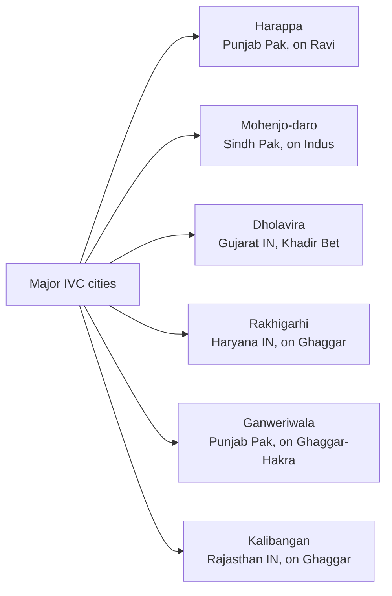
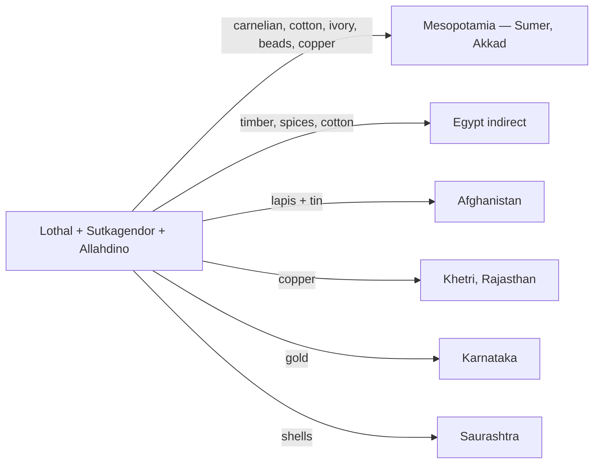
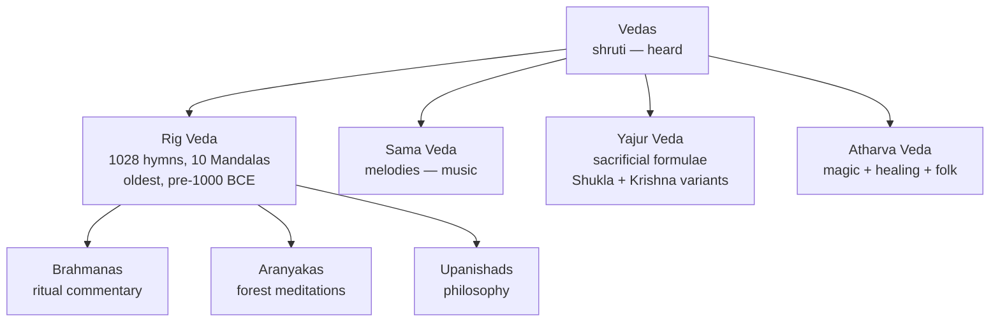
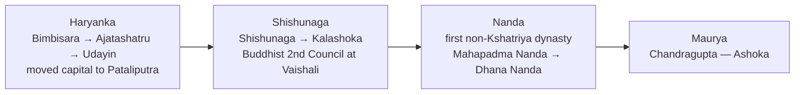
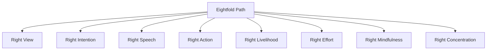
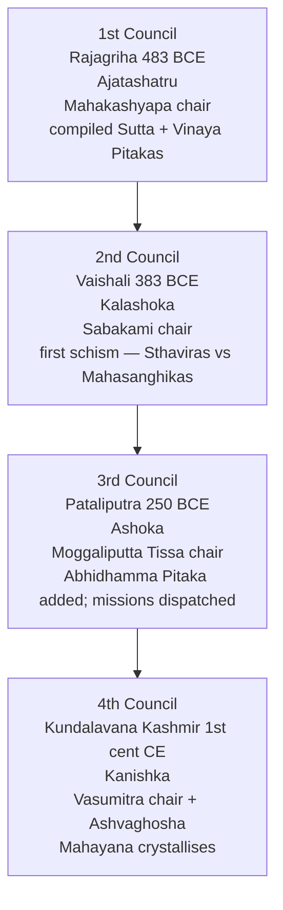
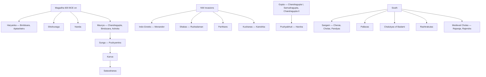

# How To Use This Book

Read the **"How To Use This Book"** chapter of the **Polity** companion if
you haven't — the 15 pedagogy techniques (story-first, scaffolding, memory
palaces, retrieval practice, spaced repetition, Feynman boxes, interleaving,
emotional anchoring, mind maps, memory pegs, etc.) are used identically here.
The tone, structure, and revision rhythm are the same.

This book moves through time:

- **Part A — Ancient India** (pre-history → 650 CE).
- **Part B — Medieval India** (650 → 1526).
- **Part C — The Mughals + Marathas** (1526 → 1803).
- **Part D — Colonial India + Freedom Struggle** (1600s → 1947).
- **Part E — Post-Independence India** (1947 → today).
- **Part F — World History** (what the syllabus demands — revolutions,
  world wars, decolonisation, Cold War).

> **Reading rhythm**: one Part per week, with one quiz batch from
> `backend/seeds/static_gk/history/` after each chapter. Total: six weeks
> to mastery.

> **Three things history rewards**: **dates, names + significance**. Get
> those right and you can reconstruct every narrative around them.

---

# Part A — Ancient India

The first 3,500 years of Indian civilisation: from the mysterious grid cities
of the Indus, through the Vedic pastoral age, into the great empires of the
Maurya + Gupta, ending in the classical southern kingdoms. Ancient India is
where **foundational facts** come from — the ones memorisable lists
(dynasties, cities, texts) that examiners love.

---

## Chapter 1 — Prehistory + Stone Ages

### 1.1 Hook — the teeth that rewrote the clock

In **2011**, archaeologists excavating **Attirampakkam** near Chennai found
**stone tools dated to 1.5 million years ago** — some of the oldest
evidence of hominins outside Africa. The find rewrote textbooks on human
dispersal into Asia.

India's **stone-age sequence**:

| Period | Dates (approx.) | Tools + lifestyle | Key sites |
|--------|-----------------|-------------------|-----------|
| Palaeolithic (Old Stone Age) | 2 Mya – 10,000 BCE | Hand-axes, cleavers; nomadic hunter-gatherers | **Attirampakkam** (TN), **Bhimbetka** caves (MP, rock paintings 30,000+ yrs), Hunsgi (Karn), Soan valley (Pak), Didwana (Raj). |
| Mesolithic | 10,000 – 6,000 BCE | **Microliths** — tiny flint tools; domestication begins | **Bhimbetka** (late), **Bagor** (Raj), **Langhnaj** (Guj), Chopani Mando (UP). |
| Neolithic | 6,000 – 1,000 BCE | Polished stone tools, agriculture, pottery, permanent villages | **Mehrgarh** (Baloch/Pak — earliest farming, 7000 BCE), **Burzahom** (Kashmir — pit-dwellings), **Chirand** (Bihar), **Koldihwa** (UP — rice), Hallur + Maski (Karn). |
| Chalcolithic (Copper Age) | 3,500 – 1,000 BCE | Copper + stone; mostly overlaps with IVC rural periphery | Ahar-Banas (Raj), Malwa, Jorwe (Maha), Kayatha (MP). |

**Bhimbetka** (Raisen dist., MP) — **UNESCO WHS 2003**. 750+ rock shelters;
paintings from Upper Palaeolithic through medieval. Subjects: hunting,
dancing, rituals, horses + elephants + war-parties. Discovered by V.S.
Wakankar (1957).

**Mehrgarh** — the bridge to Indus Valley. Excavated by **Jean-François
Jarrige** from 1974. Shows continuous occupation from 7000 BCE; domesticated
wheat + barley + goat + sheep; mud-brick houses; dentistry evidence!

### 1.2 🎯 Exam hooks

- Bhimbetka — UNESCO 2003; MP; rock paintings since Palaeolithic.
- Mehrgarh (Pak/Baloch) — earliest farming in South Asia, 7000 BCE.
- Neolithic tools = **polished**; Mesolithic = **microliths**.
- **Attirampakkam** (TN) — 1.5 Mya tools.
- Koldihwa — earliest **rice cultivation** in India (~7000 BCE evidence).

📝 *Pause + recall* — name one site per stone age.

---

## Chapter 2 — Indus Valley / Harappan Civilisation (c. 3300 – 1300 BCE)

> Where ancient India's **urbanism** was born — 1,000 years before the Vedic
> hymns — and where the exam's cheapest marks are.

### 2.1 Discovery + dating

- **1826** — **Charles Masson** (ex-soldier turned explorer) noted a brick
  mound at Harappa; published 1842, not identified as a lost civilisation.
- **1856** — **John + William Brunton**, railway engineers, used Harappan
  bricks as ballast for the **Karachi–Lahore railway line** (unwittingly
  dismantling parts of the site).
- **1861** — **Archaeological Survey of India** founded; **Alexander
  Cunningham**, first DG, visited Harappa 1872 + misidentified the seals.
- **1921** — **Daya Ram Sahni** (ASI), at direction of **Sir John Marshall**,
  excavated Harappa.
- **1922** — **R.D. Banerji** found similar material at Mohenjo-daro.
- **24 September 1924** — **Sir John Marshall** announced to the world
  (via *Illustrated London News*) that India had an urban civilisation
  contemporary with Egypt + Mesopotamia. **Formal "discovery" date**.
- **Radiocarbon dating** (1950s on, D.P. Agrawal) fixed the mature phase at
  **2600 – 1900 BCE**.

#### Phases

| Phase | Dates | What happened |
|-------|-------|----------------|
| Early Harappan (Ravi / Regionalisation) | 3300 – 2600 BCE | Proto-urban villages; Mehrgarh tradition; standardised pottery, copper. |
| **Mature Harappan** | **2600 – 1900 BCE** | City phase; grid towns; script; seals; long-distance trade; *the "classical" IVC*. |
| Late Harappan / Localisation | 1900 – 1300 BCE | De-urbanisation; ruralisation; break into regional cultures — Cemetery H, Jhukar, Rangpur IIB-C. |

### 2.2 Extent — geography the exam loves

~**1.5 million sq km** — the **largest Bronze-Age civilisation** by area.

- **North**: Manda (J&K, on Chenab).
- **South**: Daimabad (Maharashtra, on Pravara).
- **East**: Alamgirpur (Meerut, UP, on Hindon).
- **West**: Sutkagendor (Makran coast, Balochistan).

Over **2,000 sites**; ~1,500 in India + ~500 in Pakistan/Afghanistan.

#### The 6 major cities — memorise all

Order by **size**: Rakhigarhi (~550 ha — **largest**) > Mohenjo-daro > Harappa
> Ganweriwala > Dholavira > Kalibangan.

#### What each site is famous for

| Site | State | Discovered by, year | Famous for |
|------|-------|---------------------|------------|
| **Harappa** | Punjab (Pak), Ravi | Daya Ram Sahni, 1921 | Type-site; granary; 6 rows of workers' quarters; R-37 cemetery. |
| **Mohenjo-daro** ("mound of the dead") | Sindh (Pak), Indus | R.D. Banerji, 1922 | **Great Bath**, Great Granary, College of Priests, Pashupati Seal, bronze **Dancing Girl**, Priest-King, world-class drainage. |
| **Kalibangan** ("black bangles") | Rajasthan, Ghaggar | A. Ghosh, 1953 | Earliest **ploughed field**; **fire altars**; wooden drains. |
| **Lothal** ("mound of the dead", Gujarati) | Gujarat, near Sabarmati | S.R. Rao, 1954 | World's 1st known **tidal dockyard**; bead factory; rice husk; Persian Gulf seal. |
| **Dholavira** | Gujarat, Khadir Bet | J.P. Joshi, 1967; R.S. Bisht excavated | **Water-harvesting** mastery (16+ reservoirs); 3-part city; **10-character signboard**; stadium. **UNESCO WHS 2021**. |
| **Rakhigarhi** | Haryana, Hisar | Suraj Bhan, 1963; Amarendra Nath excavated | **Largest IVC site**; 2019 DNA study (Shinde et al.) found no Steppe ancestry — major input to Aryan debate. |
| **Banawali** | Haryana, on Saraswati | R.S. Bisht, 1973 | Both pre- + mature phases; no drainage; clay figurines. |
| **Surkotada** | Gujarat | J.P. Joshi, 1964 | Earliest **horse bones** (disputed); rubble fortifications. |
| **Chanhudaro** | Sindh (Pak) | N.G. Majumdar, 1931 | **Only city without a citadel**; bead-making; inkwell; toy bronze cart. |
| **Alamgirpur** | UP, Meerut | Y.D. Sharma, 1958 | **Easternmost** IVC site; cloth impressions on pottery. |
| **Ropar / Rupnagar** | Punjab, IN | Y.D. Sharma, 1953 | **First IVC site excavated in independent India**; dog-human burial. |
| **Manda** | J&K, Akhnoor on Chenab | J.P. Joshi, 1982 | **Northernmost** site. |
| **Daimabad** | Maharashtra, Pravara | B.P. Bopardikar, 1958 | **Southernmost**; famous **bronze chariot hoard**. |
| **Sutkagendor** | Balochistan (Pak) | Aurel Stein, 1927 | **Westernmost**; trading post with Sumer. |
| **Balakot, Allahdino** | Sindh | 1970s | Coastal; pearl-oyster workshops. |
| **Kunal** | Haryana | 1986 | Pre-Harappan; silver crown. |
| **Bhirrana** | Haryana | 2005 (L.S. Rao) | Some claim earliest site — ~7500 BCE pottery (controversial). |

### 2.3 Town planning — the hallmark feature

#### Citadel + Lower Town model

Every major Harappan city has **two mounds**:
1. **Citadel** (upper town) — smaller, raised, usually to the west; public
   buildings (Great Bath, granary, assembly halls).
2. **Lower town** — to the east, residential + commercial.

Exception: **Dholavira** has **3-part** division (citadel + middle + lower
town) + **Chanhudaro** has **no citadel**.

#### The grid

Streets cut each other at **right angles**, in a perfect grid — unprecedented
in the Bronze Age. North-south + east-west. Width up to 9 m.

#### Standardised burnt bricks

Ratio **1:2:4** (thickness : width : length), e.g., 7 × 14 × 28 cm. Same
ratio across 1,500 km of territory + 700 years — strong evidence of a
**standardising authority**. Kiln-fired (burnt, not sun-dried) — far more
durable than Mesopotamian mud-brick.

#### Drainage — the signature feature

**Covered drains** along every street; burnt brick with stone/wooden covers;
gradient-engineered for gravity flow; house-to-street connection; manholes
at intervals for cleaning. **Gordon Childe** called it *"more advanced than
anything in the ancient world"*.

#### Great Bath — Mohenjo-daro

**11.9 × 7 × 2.4 m deep**. Watertight via finely fitted bricks + gypsum
mortar + a layer of bitumen (extraordinary). Steps at N + S. Attached
dressing rooms. **Probably ritual bathing** (purification) by a priestly
elite — not recreational.

#### Granaries

- Harappa: 6 granaries in two rows of 3, each ~15 × 6 m.
- Mohenjo-daro: one massive granary (~50 × 27 m).
- Located near the citadel → **state-controlled** grain.

### 2.4 Society + daily life

- **Social structure**: no royal tombs or palaces → likely a *merchant +
  priestly oligarchy*, not a king. Wheeler's "imperial" ruling-class theory
  largely rejected.
- **Food**: wheat + barley (staple); rice (Lothal, Rangpur); pulses;
  sesame + mustard + dates + melons.
- **Animals**: zebu cattle, sheep, goat, buffalo, dog, pig; camels (some
  sites); **horse disputed** (only Surkotada strongly).
- **Cotton** — earliest known textile in the world; Mesopotamian tablets
  called cloth from Sindh "**Sindhon**".
- **Religion (inferred, no temples)**: Mother Goddess (figurines); **Pashupati
  Seal** (proto-Shiva); linga + yoni stones; tree (pipal) + animal worship;
  **fire altars** at Kalibangan + Lothal.
- **Script**: pictographic; ~400–600 symbols; right-to-left first line then
  boustrophedon; ~5 signs per seal; **unread** despite decades of effort.
  **Dholavira signboard** = 10 characters on wood → world's earliest signboard.

### 2.5 Economy + trade

- **Bronze** (Cu + Sn from Afghanistan) metallurgy; **no iron**.
- Wheel-turned pottery — plain red with black painted motifs.
- Bead centres at **Chanhudaro + Lothal** (carnelian, agate, jasper, lapis).
- **Cotton textiles** — world first.
- **Seals** — steatite, ~2.5 cm², animal motif + short inscription.

#### Trade network

- Sumerian tablets call India "**Meluhha**" (land of cotton + carnelian).
- Harappan seals found at **Ur, Susa, Tell Asmar**.
- Lothal **dockyard** (218 × 37 × 3.3 m) — likely tidal basin for trading ships.
- **Persian Gulf seal** at Lothal = Dilmun (Bahrain) intermediary trade.
- Weights — **binary** below 16, **decimal** above; chert stone.

### 2.6 Decline (c. 1900 – 1300 BCE) — the debated collapse

**Causes** — no single theory fully explains it:

1. **Climate change + Saraswati dry-up** — after ~2000 BCE the Ghaggar-Hakra
   dried up; palaeoclimate (ISRO) supports the **4.2-kiloyear event**, an
   abrupt monsoon weakening that also collapsed Old Kingdom Egypt + Akkad.
2. **Shifting river courses** — Indus changed course, leaving Mohenjo-daro high + dry.
3. **Ecological degradation** — deforestation for brick kilns.
4. **Floods** — repeated Indus floods; silt layers.
5. **Earthquakes** — Dholavira shows damage.
6. **Aryan invasion theory** (Wheeler 1947) — **discredited**. Mohenjo-daro
   "massacre" skeletons are from different periods + show no violent deaths.
7. **Internal trade collapse** — Mesopotamian demand fell.

**Outcome**: NOT wipe-out. De-urbanisation → rural continuation → absorption
into **Cemetery H** (Punjab), **Jhukar** (Sindh), **Rangpur IIB/C** (Gujarat),
**Painted Grey Ware** culture of the Gangetic plain (1200 BCE) → Vedic.

### 2.7 Famous artefacts — memorise each

| Artefact | Site | Material | Significance |
|----------|------|----------|---------------|
| **Dancing Girl** | Mohenjo-daro | Bronze | 10.5 cm figurine; lost-wax casting; confident stance. |
| **Priest-King** | Mohenjo-daro | Steatite | 17.5 cm bust, fillet + trefoil robe; meditative half-closed eyes. |
| **Pashupati Seal** | Mohenjo-daro | Steatite | 3-faced horned deity in yogic posture surrounded by tiger, elephant, rhino, buffalo + 2 deer → **proto-Shiva**. |
| **Bronze bull** | Kalibangan | Bronze | Finely cast. |
| **Bronze chariot** | Daimabad | Bronze | 2 oxen + charioteer; 60 cm long; heaviest bronze of the era. |
| **Plough model** | Banawali | Terracotta | Confirms ploughing. |
| **Swastika + pipal motifs** | Multiple | — | Predate Hindu/Buddhist iconography. |
| **Dholavira signboard** | Dholavira | Wood + gypsum | 10 script characters — world's first signboard. |

### 2.8 Mnemonics

> **🧠 6 major cities — "HaMo KaLo DhoRa"**:
> **Ha**rappa, **Mo**henjo-daro, **Ka**libangan, **Lo**thal, **Dho**lavira, **Ra**khigarhi.

> **🧠 Site → State**:
> **Lo**thal + **Dh**olavira = **Guj**arat;
> **Ka**libangan = **Raj**;
> **Ra**khigarhi + **Bana**wali = **Hary**ana;
> **Ro**par = **Pun**jab-IN;
> **Alam**girpur = **UP**;
> **Dai**mabad = **Mah**arashtra.

> **🧠 Town-planning hallmarks** — *"GRID-BURN"*:
> **G**rid streets, **R**atio 1:2:4 bricks, **I**ndus-style drains covered,
> **D**ual mounds, **B**urnt brick, **U**niform weights, **R**egulation
> across 1500 km, **N**o temples.

> **🧠 IVC decline** — *"FED-RIVE"*:
> **F**loods, **E**cology damage, **D**rying Saraswati, **R**iver course
> changes, **I**nternal trade collapse, **V**isible climate shift
> (4.2-ky event), **E**arthquakes.

### 2.9 🎯 Exam hooks

- First DG of ASI — **Alexander Cunningham (1861)**.
- Harappa excavated 1921 by **Daya Ram Sahni**; Mohenjo-daro 1922 by
  **R.D. Banerji**.
- Dockyard — **Lothal**.
- Largest site — **Rakhigarhi** (~550 ha).
- Southernmost — **Daimabad**; Northernmost — **Manda**; Westernmost —
  **Sutkagendor**; Easternmost — **Alamgirpur**.
- Pashupati seal — **Mohenjo-daro**.
- Ploughed field — **Kalibangan**.
- Brick ratio — **1:2:4**.
- "Meluhha" = Mesopotamian name for **Indus region**.
- **Dholavira** became India's **40th UNESCO WHS in 2021**.

📝 *Pause + recall* — list the 6 major cities + their states.

---

## Chapter 3 — The Vedic Age (c. 1500 – 600 BCE)

### 3.1 Hook — what the Rig Veda records

Around **1500 BCE**, the hymns of the **Rig Veda** describe a pastoral people
— speakers of **Old Indo-Aryan** — in the region of the **Sapta-Sindhu**
(seven rivers of the Punjab + eastern Afghanistan). They speak of battles
with the *Dasas* + *Panis*, rivers by names we still recognise (Sindhu,
Saraswati, Ganga, Yamuna), and gods of thunder + fire + water (**Indra**,
**Agni**, **Varuna**).

Whether these "Aryans" **migrated** into India or **emerged indigenously** is
one of the most politically loaded debates in Indian historiography. Recent
**ancient DNA** (Narasimhan et al., 2019) points to a **Steppe migration**
into South Asia between **2000–1500 BCE**, mixing with the existing
Harappan-descended population. Recent DNA from **Rakhigarhi (2019)**
found no Steppe ancestry in the IVC skeleton sampled, consistent with a
post-IVC migration.

### 3.2 Early vs Later Vedic — the contrast you must know

| Feature | **Early Vedic (1500 – 1000 BCE)** | **Later Vedic (1000 – 600 BCE)** |
|---------|-----------------------------------|-----------------------------------|
| Geography | Punjab + Sapta-Sindhu (Indus basin) | Gangetic plain; eastward shift |
| Economy | Pastoral — cattle (*gomat*) = wealth | Agricultural — plough + rice; iron (**1000 BCE**) |
| Political unit | Tribe (*jana*); *rajan* (chief) + **sabha** + **samiti** | Janapadas → Mahajanapadas; king (*samrat*); rise of caste-based kingship |
| Society | Broadly egalitarian; women participated in rituals + could marry late | **Varna** hardened into **jati**; patriarchy strengthens; child marriage begins |
| Religion | Nature deities — Indra, Agni, Varuna, Mitra, Surya, Soma | Trimurti emerging — Brahma, Vishnu, Rudra-Shiva; elaborate yajnas; philosophical **Upanishads** |
| Texts | **Rig Veda** (1028 hymns, 10 Mandalas) | **Sama, Yajur, Atharva Vedas**; **Brahmanas** (ritual commentary); **Aranyakas** (forest meditations); **Upanishads** (philosophy) |
| Literature | Oral (*shruti*) | Oral + increasingly systematised |

### 3.3 The 4 Vedas + their allied texts

- **Rig Veda** — **1028 hymns** (*suktas*) in 10 **Mandalas** (books). Oldest
  Mandalas: 2–7 (family Mandalas). Mandala 10 includes **Purusha Sukta**
  (first mention of the 4 varnas) + **Nasadiya Sukta** (on creation).
- **Sama Veda** — **melodies** for chanting; origin of Indian classical music.
- **Yajur Veda** — **formulae** for rituals; 2 schools — Shukla (white) +
  Krishna (black).
- **Atharva Veda** — spells, charms, folk medicine; darker in tone;
  admitted to canon only later.

**108 principal Upanishads** — 10 "classical" ones (Isha, Kena, Katha,
Prashna, Mundaka, Mandukya, Taittiriya, Aitareya, Chhandogya, Brihadaranyaka).
Contain the ideas of **Brahman, Atman, karma, moksha**. Gave rise to 6
orthodox schools of philosophy (**Darshanas**): Nyaya, Vaisheshika, Samkhya,
Yoga, Purva Mimamsa, Vedanta (Uttara Mimamsa).

### 3.4 Vedic society — varna + the 4 ashramas

**Varna** — the fourfold social order, first mentioned in Purusha Sukta
(Rig Veda 10.90):

1. **Brahmin** — priests + scholars.
2. **Kshatriya** — warriors + rulers.
3. **Vaishya** — farmers + traders + artisans.
4. **Shudra** — service / labour.

Originally **functional**. Became **hereditary** in the later Vedic period
→ hardened into **jati**.

**Ashrama** — four life-stages (a later Vedic framework):

1. **Brahmacharya** — student.
2. **Grihastha** — householder.
3. **Vanaprastha** — retiring to forest / reflection.
4. **Sannyasa** — renunciation.

### 3.5 🎯 Exam hooks

- **Rig Veda — 1028 hymns, 10 Mandalas**.
- **Purusha Sukta** = first mention of 4 varnas (Mandala 10).
- **Gayatri Mantra** is in **Rig Veda Mandala 3** (to Savitri, by Vishwamitra).
- Iron from ~**1000 BCE** (Later Vedic, **PGW culture**).
- Four Vedas in **order of canonisation**: Rig, Sama, Yajur, Atharva.
- Upanishads = **Vedanta** ("end of the Vedas").
- Sabha (elders' council) + Samiti (general assembly) — early democratic
  institutions.

---

## Chapter 4 — The 16 Mahajanapadas + the Rise of Magadha

### 4.1 Hook

By **600 BCE**, tribal *janapadas* had consolidated into **16
Mahajanapadas** ("great kingdoms"). **Buddhist Anguttara Nikaya** +
**Jain Bhagavati Sutra** name them. Most were kingdoms; a few — **Vajji** (capital
Vaishali) + **Malla** (Kusinara) — were **gana-sanghas** (tribal republics,
with assembly-based governance).

### 4.2 The 16 Mahajanapadas — map in your head

| # | Name | Capital | Region (modern) |
|---|------|---------|------------------|
| 1 | Kasi | Varanasi | E UP |
| 2 | Kosala | Shravasti | E UP |
| 3 | Anga | Champa | Bihar |
| 4 | **Magadha** | Rajgriha (later Pataliputra) | S Bihar |
| 5 | **Vajji** (republic) | Vaishali | N Bihar |
| 6 | Malla (republic) | Kusinara + Pava | N Bihar, E UP |
| 7 | Chedi | Suktimati | Bundelkhand |
| 8 | Vatsa | Kaushambi | UP |
| 9 | Kuru | Indraprastha | Delhi–Haryana |
| 10 | Panchala | Ahichhatra + Kampilya | UP |
| 11 | Matsya | Viratnagar | Rajasthan |
| 12 | Surasena | Mathura | UP |
| 13 | Ashmaka | Potana | Maharashtra (only southern) |
| 14 | Avanti | Ujjain + Mahishmati | MP |
| 15 | Gandhara | Taxila | NW (Pak + Afghan) |
| 16 | Kamboja | Rajapura | NW (Pak + Afghan) |

### 4.3 The 4 dynasties of Magadha (600 BCE – 322 BCE)

- **Haryanka (c. 544 – 413 BCE)** — **Bimbisara** + **Ajatashatru** (killed
  Bimbisara; fought Kosala + Vajji; patronised Buddha + Mahavira); **Udayin**
  moved the capital to **Pataliputra**.
- **Shishunaga (413 – 345 BCE)** — Shishunaga, Kalashoka (patronised the
  **Second Buddhist Council** at Vaishali in 383 BCE).
- **Nanda (345 – 322 BCE)** — **first non-Kshatriya** dynasty; Mahapadma
  Nanda ("uprooter of all Kshatriyas"); Dhana Nanda was the one
  **Chandragupta Maurya overthrew**.

### 4.4 🎯 Exam hooks

- **16 Mahajanapadas** — named in **Anguttara Nikaya + Bhagavati Sutra**.
- **Republics (gana-sanghas)**: Vajji (Vaishali) + Malla.
- **Bimbisara** (Haryanka) = Buddha's contemporary.
- **Pataliputra** became capital under **Udayin**.
- Nandas — first **non-Kshatriya** dynasty; Chandragupta Maurya overthrew
  **Dhana Nanda** (322 BCE) with Chanakya's help.

---

## Chapter 5 — Buddhism

### 5.1 Hook — a prince who walked out at 29

Around **563 BCE** (traditional; some scholars 480 BCE), a prince was born in
the **Shakya** republic of Kapilavastu to **Suddhodana** + **Maya**. He
renounced the palace at **29** after the **4 sights** (old man, sick man,
dead man, ascetic). Attained enlightenment at **35** under a **pipal tree**
at **Bodh Gaya**. Gave his **first sermon** (**Dhamma-chakka-pavattana**) at
**Sarnath (Deer Park)** to 5 ascetics. **Mahaparinirvana** at **Kusinara**
at **80**.

His name: **Siddhartha Gautama**. His title: **the Buddha** ("awakened").

### 5.2 The Four Noble Truths + the Eightfold Path

The **Four Noble Truths (Arya Satyas)**:
1. **Dukkha** — life is suffering.
2. **Samudaya** — cause of suffering is *tanha* (craving).
3. **Nirodha** — suffering can be ended.
4. **Magga** — the path to ending it.

The **Eightfold Path (Ashtanga Marga)** — the "Middle Way" between indulgence
+ extreme asceticism:

### 5.3 The Triratna + the Sangha

- **Buddha** — the teacher.
- **Dhamma** — the teachings.
- **Sangha** — the community of monks + nuns.

Admission was open to all castes (first egalitarian social revolution in
India). **Women admitted** only after Buddha's foster-mother **Mahaprajapati
Gotami** persuaded him (with Ananda's intercession).

### 5.4 Buddhist Councils — the 4 you must know

### 5.5 The 2 major schools

- **Hinayana / Theravada** — "lesser vehicle"; individual salvation; Pali
  canon; conservative. Today: Sri Lanka, Myanmar, Thailand, Laos, Cambodia.
- **Mahayana** — "greater vehicle"; universal salvation via Bodhisattvas;
  Sanskrit texts; from Kanishka's time. Today: China, Japan, Korea, Tibet,
  Mongolia, Bhutan, Vietnam.

Later: **Vajrayana** (tantric Buddhism) — Tibet, Bhutan, Ladakh.

### 5.6 Buddhist texts

- **Tripitaka (3 baskets)** — in **Pali**:
  - **Vinaya Pitaka** — monastic rules.
  - **Sutta Pitaka** — Buddha's discourses; the largest.
  - **Abhidhamma Pitaka** — philosophical analysis (added at the 3rd Council).
- **Dhammapada** — famous anthology of verses.
- **Jataka Tales** — 547 stories of Buddha's previous lives.
- **Milindapanha** — dialogue between Greek king Menander (Milinda) +
  Buddhist monk Nagasena.

### 5.7 Decline of Buddhism in India

1. Revival of Hinduism + Bhakti movement.
2. Adi Shankaracharya's debates (8th century) + philosophical challenge.
3. Huna invasions (Mihirakula destroyed monasteries).
4. Muslim invasions (Bakhtiyar Khilji destroyed **Nalanda** + **Vikramshila**,
   c. 1193 CE).
5. Patronage shift — Guptas + Pushyabhutis favoured Hinduism.
6. Internal corruption in monasteries.

Buddhism survived in Tibet + SE Asia; revived in India post-1956 via **Dr
B.R. Ambedkar's Navayana movement** (conversion of ~5 lakh Dalits at
**Deekshabhoomi, Nagpur, 14 October 1956**).

### 5.8 🎯 Exam hooks

- Born **Lumbini** (Nepal); enlightenment **Bodh Gaya** (Bihar); first sermon
  **Sarnath** (UP); nirvana **Kusinara** (UP).
- **Four Noble Truths** + **Eightfold Path**.
- **Tripitaka** in **Pali**.
- **4 Councils** — Rajagriha (483 BCE, Mahakashyapa) → Vaishali (383 BCE) →
  Pataliputra (250 BCE, Ashoka, Moggaliputta Tissa) → Kundalavana (1st c CE,
  Kanishka, Vasumitra).
- **Mahaprajapati Gotami** — first Buddhist nun.
- Nalanda + Vikramshila destroyed by **Bakhtiyar Khilji, 1193 CE**.

---

## Chapter 6 — Jainism

### 6.1 Hook — 24 Tirthankaras + the historical ones

Jainism recognises **24 Tirthankaras** ("ford-makers"). The **first** was
**Rishabhanatha (Adinatha)** — mentioned in the Rig Veda; symbol: BULL.
The **23rd — Parshvanatha** (c. 872-772 BCE) — is historical; preached 4
vows (ahimsa, satya, asteya, aparigraha); symbol: snake. The **24th —
Mahavira** (c. 540-468 BCE, traditional) added the 5th vow **brahmacharya**.

### 6.2 Mahavira — the 24th Tirthankara

- Born **Kundagrama** (near Vaishali, Bihar) to **Siddhartha + Trishala** of
  the Jnatrika clan. Original name **Vardhamana**.
- Married Yashoda; had a daughter Priyadarshana. Renounced at 30; wandered
  12 years; attained **Kaivalya** at 42 at **Jrimbhikagrama** under a Sal tree.
- Called **Mahavira** ("great hero") + **Jina** ("conqueror") — source of
  the religion's name.
- **Mahaparinirvana** at **Pavapuri** (Bihar) aged 72, 468 BCE traditional.

### 6.3 Core doctrines

- **Panch Mahavratas (5 great vows)** for monks:
  1. **Ahimsa** — non-violence (extended to microbes).
  2. **Satya** — truth.
  3. **Asteya** — non-stealing.
  4. **Aparigraha** — non-possession.
  5. **Brahmacharya** — celibacy (added by Mahavira).

- **Triratna** — right faith (samyak darshana), right knowledge
  (samyak gnyana), right conduct (samyak charitra).

- **Anekantavada** — non-absolutism; reality has multiple aspects.
  **Syadvada** — "may be" theory; 7-fold predication; all statements
  qualified with *syat* ("perhaps").

- **No creator god**; soul (*jiva*) + matter (*ajiva*); karma as particulate.

### 6.4 The two sects

Post-Mahavira (~1st cent. BCE), Jainism split, after the great famine of
Magadha (c. 298 BCE) prompted **Bhadrabahu** to migrate south with a group
while **Sthulabhadra** stayed in Magadha:

- **Digambara** ("sky-clad") — nude monks; reject women's moksha (must be
  reborn male); hold 19th Tirthankara Malli was male. Southern/Karnataka
  focus.
- **Shvetambara** ("white-clad") — white-robed monks + nuns; allow women's
  ordination; Malli was female. Gujarat/Rajasthan focus.

### 6.5 Councils + texts

- **First Jain Council — Pataliputra (c. 300 BCE)** under Sthulabhadra;
  compiled **12 Angas** (but the 12th, Drishtivada, was already lost).
  Digambaras rejected the compilation.
- **Second Jain Council — Valabhi (453 or 466 CE)** under Devarddhi
  Kshamashramana; committed Shvetambara canon (45 Agamas) to writing.

**Kalpa Sutra** (by Bhadrabahu — lives of Tirthankaras) + **Tattvartha Sutra**
(by Umaswami; common to both sects).

### 6.6 Royal patrons

- **Chandragupta Maurya** (reputedly) retired as a Jain monk under
  Bhadrabahu at Shravanabelagola.
- **Kharavela** of Kalinga (Hathigumpha Inscription, ~150 BCE).
- **Amoghavarsha** (Rashtrakuta).
- **Kumarapala** (Chalukya, Gujarat).

### 6.7 Heritage sites

- **Shravanabelagola** (Karnataka) — 57-ft monolithic **Gommateshwara
  (Bahubali)** statue, erected 981 CE by **Chamundaraya**. Head-anointing
  ceremony (**Mahamastakabhisheka**) every 12 years.
- **Dilwara Temples**, Mt Abu — 11th-13th c., marble carving of the world's
  finest order.
- **Palitana** (Gujarat, Shatrunjaya Hill) — 863 temples.
- **Ranakpur** (Rajasthan) — 1444 pillars, no two alike.
- **Udayagiri + Khandagiri** caves (Odisha) — Kharavela's era, rock-cut
  chambers + Hathigumpha inscription.

### 6.8 🎯 Exam hooks

- 24 Tirthankaras; 1st = Rishabhanatha, 23rd = Parshvanatha, 24th = Mahavira.
- **5 Mahavratas** — Ahimsa, Satya, Asteya, Aparigraha, **Brahmacharya** (Mahavira).
- 2 sects — **Digambara** (nude, Karnataka) + **Shvetambara** (white, Gujarat).
- **Kharavela** of Kalinga — **Hathigumpha Inscription**, Odisha.
- **Chandragupta Maurya** reputedly died via **sallekhana** at **Shravanabelagola**.

---

## Chapter 7 — Mauryan Empire (322 – 185 BCE)

### 7.1 Founder — Chandragupta Maurya

**Chandragupta** (r. 322 – 298 BCE) overthrew **Dhana Nanda** with the
guidance of **Chanakya / Kautilya / Vishnugupta**. Defeated **Seleucus
Nicator** (Alexander's successor) in **305 BCE**; gained Gandhara + E.
Iran in exchange for 500 war elephants; married Seleucus's daughter Helen.
Received the Greek ambassador **Megasthenes** (author of ***Indika***).
Abdicated ~298 BCE; reportedly became a Jain monk + died by sallekhana
at **Shravanabelagola**.

### 7.2 Bindusara (r. 298 – 273 BCE) — the in-between king

Consolidated the empire south to Karnataka. Greek accounts call him
**Amitrochates** (from *Amitraghata*, "slayer of enemies"). Patronised the
**Ajivika** sect. Received a Greek ambassador **Deimachus**.

### 7.3 Ashoka the Great (r. 268 – 232 BCE)

- Killed rivals to seize the throne.
- **Kalinga War (261 BCE)** — 100,000 killed, 150,000 deported → Ashoka's
  transformation. Adopted **Dhamma** (Buddhist ethics + moral governance).
- **Rock + Pillar Edicts** — 14 major rock edicts + 7 pillar edicts +
  minor ones, in **Brahmi** (and Kharoshthi in NW). **James Prinsep**
  deciphered Brahmi + Kharoshthi in **1837**.
- **Missions abroad** — Buddhist missionaries sent to Sri Lanka (son
  **Mahendra** + daughter **Sanghamitra** took a Bodhi tree cutting), SE
  Asia, Syria, Egypt, Macedonia.
- **Title "Devanampiya Piyadasi"** ("beloved of the gods, one of pleasing
  appearance") on edicts — identified as Ashoka only in 1915.
- Built **Sanchi Stupa** (Madhya Pradesh, 3rd c. BCE; later expanded by
  Sungas + Satavahanas).

**Ashoka's Edicts — key ones to memorise:**

| Edict | Content |
|-------|----------|
| Major Rock Edict I | Ban on animal sacrifice + festivals. |
| Major Rock Edict II | Medical care for humans + animals. |
| Major Rock Edict IV | Moral progress (Dhamma-ghosha over Bheri-ghosha — drumbeats of morality, not war). |
| Major Rock Edict VI | Tours by officials to meet common people. |
| Major Rock Edict X | Rejection of fame + glory. |
| Major Rock Edict XIII | **Kalinga war** account + remorse + missions to Greek kings. **The longest edict.** |
| Rumindei Pillar | At **Lumbini** — commemorates Buddha's birthplace. |
| Nigali Sagar Pillar | Commemorates **Kanakamuni Buddha's stupa** expansion. |
| Allahabad Pillar | Original Ashokan inscription + later Samudragupta + Jahangir inscriptions added. |
| Saranath Pillar | Capital = the **Lion Capital** → **India's national emblem** (adopted 26 Jan 1950). |

### 7.4 Mauryan administration — Arthashastra

**Kautilya's Arthashastra** — a 15-book manual of statecraft.

- **Central Administration** — King + Council (Mantri Parishad).
- **Provincial** — 4 Provinces: **Uttarapatha** (Taxila), **Dakshinapatha**
  (Suvarnagiri), **Avantirattha** (Ujjain), **Kalinga** (Tosali) — each
  under a prince or governor (*Kumara*).
- **District (Ahara) → Village (Grama)**.
- **Revenue** — land tax (1/6th usually), customs, tolls, fines, mines.
- **Spy network** (*Gudhapurushas*) — a signature feature of Mauryan state.
- **Army** — Megasthenes reported 600,000 foot, 30,000 horse, 9,000
  elephants, 8,000 chariots — among the largest ancient armies.

### 7.5 Decline of the Mauryas

After Ashoka: successors weak (Dasaratha → Samprati → Shalishuka →
Devavarman → Shatadhanvan → **Brihadratha**). The last Mauryan
**Brihadratha** was **assassinated by his own general Pushyamitra Sunga**
in **185 BCE**, founding the **Sunga dynasty**.

### 7.6 🎯 Exam hooks

- **Chandragupta Maurya — 322 BCE**, overthrew Dhana Nanda with Chanakya.
- Defeated **Seleucus Nicator** (305 BCE).
- **Megasthenes** = Seleucus's ambassador; wrote ***Indika***.
- Ashoka's **Kalinga war** — **261 BCE**.
- James **Prinsep** deciphered **Brahmi + Kharoshthi** — **1837**.
- **Sarnath Lion Capital** = India's national emblem.
- **Pushyamitra Sunga** killed **Brihadratha** — **185 BCE**; ended Maurya.
- Ashoka title on edicts: **Devanampiya Piyadasi**.

---

## Chapter 8 — Gupta Age (320 – 550 CE) — India's Classical Golden Age

### 8.1 Hook — the age of Sanskrit classics + decimal mathematics

This is when **Kalidasa** wrote *Shakuntala*, **Aryabhata** propounded the
**decimal place-value + zero**, **Varahamihira** wrote *Brihatsamhita*,
**Nalanda University** flourished, and the **Gupta gold coins** were among
the finest ever struck. Tag: "**Golden Age of Classical India**".

### 8.2 Major Gupta rulers

| Ruler | Dates | Key facts |
|-------|-------|-----------|
| **Sri Gupta** | c. 240 – 280 CE | Founder; obscure. |
| Ghatotkacha | c. 280 – 319 | — |
| **Chandragupta I** | 319 – 335 | Took title **Maharajadhiraja**; married Licchavi princess **Kumaradevi**; started the **Gupta Era (319 CE)**. |
| **Samudragupta** | 335 – 375 | The **"Indian Napoleon"** (per V.A. Smith). **Allahabad Prashasti** (by court-poet Harisena) engraved on Ashoka's pillar enumerates his conquests. Performed **Ashvamedha yajna**. |
| **Chandragupta II 'Vikramaditya'** | 375 – 415 | **Peak of Guptas**. Defeated the **Western Kshatrapas** + extended to Gujarat + Saurashtra. **Fa-Hien** (Chinese pilgrim, 399–412 CE) visited. Court **9 jewels (Navaratnas)**. |
| Kumaragupta I | 415 – 455 | Founded **Nalanda University**. First **Huna invasion**. |
| Skandagupta | 455 – 467 | Repulsed **Huna invasions** (led by Toramana). Hero-king. |

### 8.3 Culture + achievements

- **Nalanda University** (5th c. CE → Bakhtiyar Khilji 1193 CE). 10,000+
  students; 9-storey library ("Dharmaganja"); international reputation.
- **Sanskrit literature** peaks — **Kalidasa**'s plays (Shakuntala, Meghaduta,
  Raghuvamsha, Kumarasambhava); **Sudraka's** Mrichhakatika; **Vishakhadatta's**
  Mudrarakshasa.
- **Aryabhata** (476 CE, *Aryabhatiya*) — decimal place-value; computed
  π ≈ 3.1416; defined sine function; proposed earth rotation on its axis.
- **Varahamihira** (~505 CE) — *Brihatsamhita*, *Panchsiddhantika*.
- **Vatsyayana** — *Kamasutra*.
- **Art** — **Ajanta Caves** (Maharashtra, 2nd c. BCE – 6th c. CE; UNESCO
  1983); **Ellora** begins (6th c. CE).
- **Coinage** — magnificent gold *dinaras* featuring kings as warriors,
  musicians, sacrificers.
- **Medicine** — *Ashtanga Hridaya* (Vagbhata).
- **Iron Pillar of Delhi** (Qutub complex) — cast during Chandragupta II;
  rust-resistant due to phosphorus content; 7 m tall.

### 8.4 Decline

- **Huna invasions** under Toramana + Mihirakula (5th–6th c.); drained
  resources.
- Feudatories (Maukharis, Maitrakas, Pushyabhutis) broke away.
- Trade declined; Gupta gold supply dried up.
- By **550 CE**, the Gupta empire had fragmented.

### 8.5 🎯 Exam hooks

- **Chandragupta I** — Gupta Era **319 CE**; married **Kumaradevi** (Licchavi).
- **Samudragupta** — **Allahabad Prashasti** by **Harisena**; "Indian Napoleon".
- **Chandragupta II** = Vikramaditya; **Fa-Hien** visit; 9 Navaratnas
  (Kalidasa, Amarasimha, Dhanvantari, Varahamihira, Ghatakarpara,
  Kshapanaka, Shanku, Vararuchi, Vetalbhatta).
- **Kumaragupta** founded **Nalanda**.
- **Aryabhata** = *Aryabhatiya* (476 CE).
- **Skandagupta** repulsed **Hunas**.
- **Iron Pillar** at Mehrauli = Chandragupta II period.

---

## Chapter 9 — Harsha + Chalukyas + Rashtrakutas + Pallavas

### 9.1 Harshavardhana (606 – 647 CE)

- **Pushyabhuti / Vardhana dynasty**; capital **Kanyakubja (Kanauj)**.
- Last great Hindu ruler of N India before Muslim invasions.
- **Defeated by Chalukya Pulakesin II at the Narmada, c. 630 CE** — could
  not expand south.
- Hosted the Chinese pilgrim **Hiuen Tsang (Xuanzang)** (630–644 CE).
- **Harshacharita** (biography) + **Kadambari** (novel) by his court poet
  **Banabhatta**.
- Harsha himself wrote 3 Sanskrit plays: *Nagananda*, *Priyadarshika*,
  *Ratnavali*.

### 9.2 Chalukyas of Badami (543 – 757 CE)

- **Pulakesin II (609 – 642)** — defeated Harsha at Narmada; received Persian
  ambassador (Ajanta Cave 1 painting depicts this); defeated by Pallava
  **Narasimhavarman I** at **Vatapi (642 CE)** — earning the Pallava the
  epithet *Vatapi-kondan*.
- **Badami, Aihole, Pattadakal** — architectural treasure (Pattadakal =
  UNESCO 1987).

### 9.3 Rashtrakutas (753 – 982 CE)

- Founded by **Dantidurga**. **Amoghavarsha I (814 – 878)** — Jain patron;
  wrote *Kavirajamarga* (oldest Kannada work on poetics).
- **Krishna I** commissioned the **Kailasa Temple (Cave 16) at Ellora** —
  monolithic rock-cut temple, 200,000 tonnes of basalt removed from top
  down; **UNESCO 1983**.

### 9.4 Pallavas (4th – 9th c. CE)

- Kanchipuram capital.
- **Mahendravarman I** + **Narasimhavarman I "Mamalla"** (630 – 668) —
  founded **Mamallapuram** (Mahabalipuram) port; built **Pancha Rathas**
  (5 monolithic temples), **Shore Temple**, **Arjuna's Penance** (world's
  largest bas-relief). UNESCO 1984.
- **Rajasimha** built **Kailasanatha Temple** at Kanchipuram (early
  structural Dravida).

### 9.5 🎯 Exam hooks

- Harsha defeated by **Pulakesin II** at Narmada (630 CE).
- Hiuen Tsang — Harsha's court (630 – 644 CE).
- Pulakesin II killed by **Narasimhavarman I** at Vatapi (642 CE).
- **Ellora Kailasa** = Rashtrakuta Krishna I.
- Mahabalipuram = Pallavas.
- **Pattadakal** = Chalukyas.
- **Aihole inscription** (634 CE, by Ravikirti) praises Pulakesin II.

---

## Chapter 10 — Chola Empire + South Indian Kingdoms

### 10.1 Hook — the maritime empire before Vasco da Gama

By **1025 CE**, a Tamil empire stretched from the banks of the Ganga to the
coasts of **Sumatra** — the **Chola Empire** under **Rajendra I**. India's
only pre-modern overseas empire.

### 10.2 Sangam-age predecessors (3rd c. BCE – 3rd c. CE)

**Muvendar** (three crowned kings) of Sangam age:
- **Cheras** — Kerala + W. TN. Capital **Vanji / Karur**. Emblem: bow + arrow.
  **Senguttuvan** hero of *Silappadikaram*.
- **Cholas** (early) — Central + E. TN (Cauvery delta). Capital **Uraiyur**.
  Emblem: tiger. **Karikala** built **Grand Anicut / Kallanai** dam on
  Kaveri (~150 CE) — world's oldest working dam.
- **Pandyas** — S. TN; capital **Madurai**. Emblem: fish. Patrons of **Tamil
  Sangams** — literary academies in Madurai.

**Sangam literature** — *Ettuthokai*, *Pattupattu*, *Tolkappiyam* (grammar).
5 **tinai** (eco-regions): Kurinji (hill), Mullai (pastoral), Marudam
(cropland), Neydal (coast), Palai (desert). **Arikamedu** (near Puducherry)
was a major Roman trade port (1st–2nd c. CE).

### 10.3 Medieval Cholas (850 – 1279 CE)

Revived by **Vijayalaya** (850 CE, from Thanjavur).

| Ruler | Dates | Key facts |
|-------|-------|-----------|
| **Rajaraja Chola I** | 985 – 1014 | Conquered Cheras, Pandyas, W. Chalukyas, Sri Lanka (N), Maldives. Built **Brihadeshvara Temple** at Thanjavur (**UNESCO** 1987). |
| **Rajendra Chola I** | 1014 – 1044 | Defeated **Palas of Bengal**; built **Gangaikondacholapuram**. Naval expedition to **Sri Vijaya** (Sumatra/Java) — **only Indian sea-borne empire**. |
| Kulottunga I | 1070 – 1122 | Consolidated. |

### 10.4 Chola local government — Uttiramerur inscriptions

**Uttiramerur (c. 919 CE, Parantaka Chola I)** — inscribed details of village
**sabha** elections:

- **Kudavolai** (pot-ticket) system — names on palm-leaf, drawn by a child
  priest.
- Qualifications: own land of 1/4 veli; own house on it; age 35–70;
  knowledge of Vedas + Dharmashastra; honest character.
- Disqualifications: embezzlers, close-relative office-holders, tax
  defaulters.
- 30 wards → 30 members; 1-year term; **6 variyams (committees)** — annual,
  garden, tank, standing, gold, justice.

Studied by Ambedkar + Constituent Assembly while framing Panchayati Raj
(Art 40 DPSP).

### 10.5 Chola art — bronze Nataraja

**Nataraja** (Shiva as cosmic dancer, Tandava pose) — iconic Chola bronze.

- 4 arms — damaru (drum — time/creation), agni (fire — destruction), abhaya
  mudra (fearlessness), lower-left pointing to raised foot (moksha).
- Right foot crushes **Apasmara** (dwarf of ignorance).
- Dances within **prabhamandala** (circle of fire — cosmos).
- **Chidambaram** = primary Nataraja temple (one of the *Panch Bhoota
  Sthalams* — represents AKASHA/ether).

### 10.6 🎯 Exam hooks

- 3 Sangam-age dynasties: **Cheras, Cholas, Pandyas**.
- **Karikala Chola** built **Kallanai / Grand Anicut** (~150 CE).
- **Brihadeshvara Temple** (Thanjavur) — Rajaraja Chola I (1010 CE).
- **Rajendra Chola I** — conquered **Sri Vijaya** (1025 CE naval expedition).
- Chola **Uttiramerur** inscription — village sabha election procedure
  (919 CE, Parantaka I).
- **Nataraja** iconic bronze → Chola.

---

# Part B — Medieval India (650 – 1526)

**Coming soon.** This Part will cover the Pratiharas, Palas, Rashtrakutas'
successors, the Arab invasion of Sindh (712 CE), the Ghaznavid raids (1000
– 1030 CE), Ghurids + the **Delhi Sultanate** (1206 – 1526; 5 dynasties —
Slave/Mamluk, Khilji, Tughlaq, Sayyid, Lodi), the **Bhakti + Sufi**
movements, the **Vijayanagar + Bahmani** empires + the Deccan Sultanates.

Structure planned (to be populated):

- Chapter 11: North Indian kingdoms + Arab/Ghaznavid invasions
- Chapter 12: Delhi Sultanate (5 dynasties)
- Chapter 13: Bhakti Movement
- Chapter 14: Sufi Movement
- Chapter 15: Vijayanagar + Bahmani + Deccan Sultanates

---

# Part C — The Mughals + Marathas (1526 – 1803)

**Coming soon.** Babur → Akbar → the golden age under Shah Jahan → Aurangzeb
→ decline. Shivaji's Maratha confederacy; Peshwa rule; the third battle of
Panipat (1761); the Anglo-Maratha wars.

---

# Part D — Colonial India + Freedom Struggle (1600s – 1947)

**Coming soon.** Europeans' arrival (Portuguese 1498, Dutch 1602, English
1600, French 1664); Plassey (1757); Buxar (1764); Regulating Act 1773 →
Crown rule 1858; social reformers; the 1857 Revolt; INC's founding (1885);
Moderates vs Extremists; Gandhi's return (1915); Non-Cooperation (1920–22);
Civil Disobedience (1930–34); Quit India (1942); Partition + Independence
(1947).

---

# Part E — Post-Independence India (1947 – today)

**Coming soon.** Integration of Princely States under Sardar Patel; Nehru's
era (1947 – 1964); Green Revolution; Indo-Pak 1965 + 1971; Bangladesh
liberation; Emergency (1975 – 77); LPG reforms (1991); nuclear tests (1974,
1998); Kargil (1999); GST (2017); Art 370 abrogation (2019).

---

# Part F — World History

**Coming soon.** Renaissance, Reformation, American Revolution (1775–83),
French Revolution (1789), Industrial Revolution (1760–1840), World Wars,
Russian + Chinese Revolutions, Cold War + Decolonisation.

---

# Appendices

## Appendix A — Ancient India timeline (condensed)

```mermaid
timeline
    title Ancient India Timeline
    3300 BCE : Early Harappan begins (Mehrgarh continuity).
    2600 BCE : Mature Harappan — city phase.
    1900 BCE : Late Harappan — de-urbanisation.
    1500 BCE : Early Vedic begins (Rig Veda).
    1000 BCE : Later Vedic — iron + Gangetic plain.
    600 BCE : 16 Mahajanapadas — Magadha rises.
    563 BCE : Gautama Buddha born (traditional).
    540 BCE : Mahavira born (traditional).
    483 BCE : Buddha's Mahaparinirvana — 1st Buddhist Council.
    322 BCE : Chandragupta Maurya founds Mauryan empire.
    305 BCE : Defeats Seleucus Nicator.
    268 BCE : Ashoka begins reign.
    261 BCE : Kalinga War.
    250 BCE : 3rd Buddhist Council — Ashokan missions.
    185 BCE : Pushyamitra Sunga kills Brihadratha — end of Mauryas.
    78 CE : Saka Era begins (Kanishka).
    319 CE : Gupta Era begins (Chandragupta I).
    400 CE : Fa-Hien visits under Chandragupta II.
    476 CE : Aryabhata's Aryabhatiya.
    606 CE : Harshavardhana begins reign.
    630 CE : Hiuen Tsang arrives; Pulakesin II defeats Harsha.
    985 CE : Rajaraja Chola I begins reign.
    1025 CE : Rajendra Chola naval expedition to Sri Vijaya.
```

## Appendix B — Dynasty quick-recall tree

## Appendix C — Master mnemonics for Ancient India

- **HaMo KaLo DhoRa** → 6 IVC cities.
- **GRID-BURN** → IVC town-planning hallmarks.
- **FED-RIVE** → IVC decline causes.
- **Kingdoms of the Sangam — 3C**: Cheras, Cholas, Pandyas (the Muvendar).
- **Mauryan genealogy**: "**Chandragupta built, Bindusara expanded, Ashoka
  transformed, Brihadratha lost**."
- **Gupta Peak line**: "Samudragupta conquered, Chandragupta II refined,
  Kumaragupta founded Nalanda, Skandagupta saved."
- **Chola naval route**: "Thanjavur → Gangaikondacholapuram → Sri Vijaya".
- **4 Buddhist Councils** — *Raja-Va-Pata-Kunda* (Rajagriha → Vaishali →
  Pataliputra → Kundalavana), under *Aja-Ka-A-Ka* (Ajatashatru, Kalashoka,
  Ashoka, Kanishka).

## Appendix D — Cheatsheet (1-page)

- **IVC** 2600 – 1900 BCE. 6 major cities. Bronze age. Cotton first. No iron.
  No temples. Unread script. Decline = climate + rivers + ecology (not Aryan
  invasion).
- **Vedic** 1500 – 600 BCE. Rig (1028 hymns) → 4 Vedas → Brahmanas → Aranyakas
  → Upanishads. Purusha Sukta has 1st mention of 4 varnas. Iron from 1000 BCE.
- **Mahajanapadas** 16; Vajji + Malla republics; Magadha rose via 4
  dynasties — Haryanka → Shishunaga → Nanda → Maurya.
- **Buddhism** — born 563/480 BCE; 4 NT + 8-fold path; Tripitaka in Pali;
  4 councils (Raja-Va-Pata-Kunda); 2 schools (Hinayana/Theravada + Mahayana).
- **Jainism** — 24 Tirthankaras; Parshvanatha (23rd, historical); Mahavira
  (24th, added Brahmacharya); 5 vows; Digambara + Shvetambara;
  Shravanabelagola Gommateshwara (981 CE).
- **Maurya** — Chandragupta 322 BCE; Ashoka Kalinga 261 BCE; edicts in
  Brahmi decoded by Prinsep 1837; Sarnath Lion Capital = national emblem;
  Pushyamitra Sunga kills Brihadratha 185 BCE.
- **Gupta** 319 – 550 CE. Golden Age. Samudragupta Allahabad Prashasti;
  Chandragupta II "Vikramaditya" + Fa-Hien; Nalanda under Kumaragupta;
  Aryabhatiya 476 CE; Skandagupta vs Hunas.
- **Harsha** 606 – 647, defeated at Narmada by Pulakesin II; Hiuen Tsang;
  Banabhatta's Harshacharita + Kadambari.
- **Cholas** — Rajaraja + Rajendra. Brihadeshvara 1010, Gangaikondacholapuram
  1035. Sri Vijaya naval 1025. Uttiramerur 919. Nataraja bronzes.

*Parts B–F will be added to this book in subsequent revisions, in the same
pedagogical style. For now, you can already score well in the Ancient India
section of SSC/RRB/PO/Banking — keep the facts from the cheatsheet above
in active recall during the exam.*
