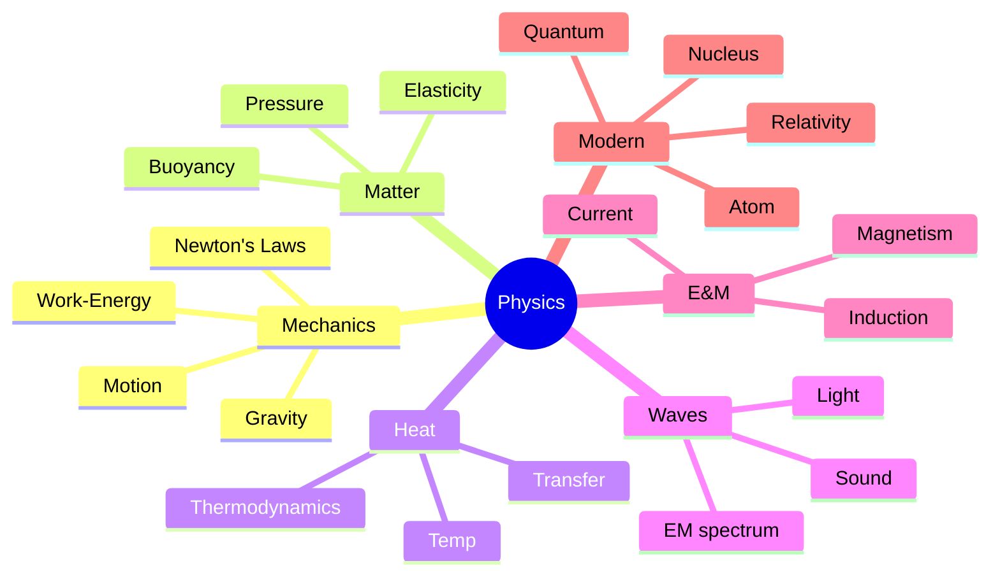

# 📘 How To Use This Book

The 15 pedagogy techniques are explained in full in `polity.md`. Quick reminder for this subject:

- **Physics is visual + quantitative.** Every chapter pairs a mental model (dual coding) with 2-3 canonical numbers you must memorise cold.
- **Do the Feynman test** — if you cannot say a principle in plain Hindi/Telugu to a 10-year-old, you do not yet know it.
- **Interleave with chemistry** — acceleration + combustion + heat → one world.
- **Anchor every law to a real object**: Newton on a cricket ball, Archimedes on a steel ship.

Paired quiz topic codes: **PHY_MAGNETISM, PHY_GRAVITATION, PHY_MODERN, PHY_OPTICS, PHY_ELECTRICITY, PHY_HEAT, PHY_WAVES, PHY_MECHANICS**.

---

\newpage

# PART A — MEASUREMENT, MOTION, FORCES

## Chapter A1 — Units, Dimensions, Measurement

### 🎬 The Hook

A tailor, a carpenter, and a jeweller all use **length**, but the tailor measures in centimetres, the carpenter in inches, the jeweller in millimetres. Physics demands one global language. Enter **SI**.

### 📏 The Seven SI Base Units

| Quantity | Unit | Symbol |
|----------|------|--------|
| Length | metre | m |
| Mass | kilogram | kg |
| Time | second | s |
| Electric current | ampere | A |
| Temperature | kelvin | K |
| Amount of substance | mole | mol |
| Luminous intensity | candela | cd |

Mnemonic: **"Mr. Krishna Sells Amazing Kiwis, Mostly Cheap"** → m, kg, s, A, K, mol, cd.

### 🧮 Derived units you'll be tested on

- **Force** = newton (N) = kg·m/s²
- **Pressure** = pascal (Pa) = N/m²
- **Energy / Work / Heat** = joule (J) = N·m
- **Power** = watt (W) = J/s
- **Frequency** = hertz (Hz) = 1/s
- **Electric charge** = coulomb (C) = A·s
- **Potential difference** = volt (V) = J/C

### 📝 Pause + recall

1. What's the SI unit of pressure, and in which base units is it expressed?
2. Why did the world replace "gram" with "kilogram" as the base unit?

---

\newpage

## Chapter A2 — Motion and Newton's Laws

### 🎬 Story

Newton, 1665, locked in plague quarantine at Woolsthorpe, watches an apple fall. Within months he's formulated calculus, optics, and three laws that govern every object in the universe (until Einstein refines them 240 years later).

### 🧠 The Three Laws

1. **Law of Inertia** — An object continues in its state of rest or uniform motion unless acted upon by an external force.
2. **F = ma** — Force = mass × acceleration.
3. **Action = Reaction** — For every action there is an equal and opposite reaction.

### 🧲 Everyday applications (exam gold)

- Seat belts (law 1).
- Recoil of a gun (law 3).
- Rocket propulsion (law 3).
- Falling objects (law 2 combined with gravity).
- Pulling a carpet sharply from under objects (law 1).

### 🧮 Equations of motion (constant acceleration)

- v = u + at
- s = ut + ½at²
- v² = u² + 2as

### 🏠 Memory palace — **"The Cricket Pitch"**

Imagine MS Dhoni on the pitch:
- **Law 1** — the ball rests on the pitch (inertia).
- **Law 2** — Dhoni hits it; the harder the hit, the greater the acceleration.
- **Law 3** — ball recoils his bat; his wrists feel it.

### ❓ Why does a passenger lurch forward when a bus brakes?

Because the passenger's body (law of inertia) tries to continue moving while the bus decelerates. No extra force throws them — the *absence* of braking on their body does.

### 🎯 Exam hooks

- "Which law explains rocket propulsion?" → **Third.**
- "SI unit of force?" → **Newton = kg·m/s².**
- "Inertia depends on?" → **Mass.**

### 🧑‍🏫 Feynman box

Things don't change what they're doing unless something pushes them. How much they resist that push = **mass**. When you push (force), they speed up (accelerate). Whenever you push something, it pushes back equally.

### 📝 Pause + recall

1. State the three laws in your own words, 1 line each.
2. A 2 kg ball accelerates at 5 m/s². Force?
3. Why don't passengers fly through the windshield when a car brakes hard (hint: seatbelt + law 1)?

---

\newpage

## Chapter A3 — Gravitation

### 🌍 Newton's Universal Law

$$F = G\frac{m_1 m_2}{r^2}$$

- G = 6.674 × 10⁻¹¹ N·m²/kg² (universal gravitational constant, Cavendish 1798).
- Attractive, acts along line joining centres.

### 🌙 g on Earth

- g = 9.8 m/s² (take 10 for quick calc).
- g at equator < g at poles (oblate Earth + rotation).
- g decreases with altitude and with depth.
- **At the centre of Earth g = 0.**

### 🪐 Kepler's Three Laws

1. **Law of Orbits** — Planets orbit in ellipses with Sun at one focus.
2. **Law of Areas** — Line joining planet to Sun sweeps equal areas in equal times.
3. **Law of Periods** — T² ∝ r³ (square of period proportional to cube of semi-major axis).

### 🛰️ Escape and Orbital Velocity

- **Orbital velocity** at Earth surface ≈ 7.9 km/s (first cosmic velocity).
- **Escape velocity** from Earth ≈ 11.2 km/s (second cosmic velocity).
- From Moon: ~2.4 km/s. From Sun: ~618 km/s.

### 🎯 Exam hooks

- "Escape velocity of Earth?" → **~11.2 km/s.**
- "Value of G?" → **6.674 × 10⁻¹¹ N·m²/kg².**
- "Weightlessness in satellite?" → **Free fall → apparent weight = 0.**

### 📝 Pause + recall

1. Why is g less at the equator than at the poles?
2. Difference between orbital and escape velocity?
3. A 60 kg person's weight on Moon?

---

\newpage

## Chapter A4 — Work, Energy, Power

### 🧠 Definitions

- **Work** W = F · s · cos θ (only component of force along displacement).
- **Energy** — capacity to do work; scalar.
- **KE** = ½ mv²
- **PE** (gravitational) = mgh
- **Power** P = W/t = F · v

### ⚖️ Conservation of Energy

Energy cannot be created or destroyed, only transformed. Total energy of an isolated system is constant. In a free-falling body, PE converts to KE while sum remains constant.

### 🎯 Exam hooks

- "Kinetic energy formula?" → **½ mv².**
- "Commercial unit of electrical energy?" → **kWh (kilowatt-hour) = 3.6 × 10⁶ J.**
- "Horsepower in watts?" → **1 HP ≈ 746 W.**

---

\newpage

# PART B — PROPERTIES OF MATTER

## Chapter B1 — Pressure, Density, Buoyancy

### 💧 Pressure in Fluids

- P = F/A.
- **Atmospheric pressure** ≈ 101,325 Pa ≈ 1 atm ≈ 760 mm Hg ≈ 10.33 m of water.
- **Pascal's Law** — pressure applied to enclosed fluid transmits equally in all directions (hydraulic brakes, JCB).

### 🛥️ Archimedes' Principle

Upthrust (buoyant force) on a body immersed in fluid = weight of fluid displaced.

**Consequence:** a ship floats because it *displaces* water equal to its weight. A steel ball sinks because its displaced water weighs less than itself.

### 🎯 Exam hooks

- "SI unit of pressure?" → **pascal (Pa).**
- "Why do ships float though steel sinks?" → **Hollow shape displaces more water → weight of displaced water = ship's weight.**
- "Barometer invented by?" → **Torricelli, 1643.**
- "Why is atmospheric pressure lower on hills?" → **Less air column above.**

## Chapter B2 — Surface Tension, Viscosity, Elasticity

- **Surface tension** (N/m) — why water forms droplets, insects walk on water (Jesus bug), detergent reduces it to lift dirt.
- **Viscosity** — internal friction in fluids (honey > water > petrol).
- **Capillarity** — rise/fall of liquid in narrow tube (wicks, blotting paper, plants drawing sap).
- **Elasticity** — Hooke's Law: stress ∝ strain within elastic limit.
- **Young's modulus, bulk modulus, shear modulus.**

### 📝 Pause + recall

1. Why do small droplets tend to be spherical?
2. Why does oil float on water?
3. What is capillary action and why does it matter for plants?

---

\newpage

# PART C — HEAT AND THERMODYNAMICS

## Chapter C1 — Temperature & Heat

### 🌡️ Scales

- **Celsius:** water freezes 0, boils 100.
- **Fahrenheit:** freezes 32, boils 212. F = (9/5)C + 32.
- **Kelvin:** absolute; 0 K = −273.15 °C.

### 🧊 Heat Transfer

- **Conduction** (solids, through vibration — metals high).
- **Convection** (fluids, bulk movement — sea/land breeze, monsoon circulation).
- **Radiation** (no medium — Sun heats Earth; infrared).

### 🔥 Specific Heat & Latent Heat

- **Specific heat** of water = 4186 J/kg·K (highest among common liquids → why water moderates climate).
- **Latent heat of fusion of ice** = 334 kJ/kg.
- **Latent heat of vaporisation of water** = 2260 kJ/kg.

### 🎯 Exam hooks

- "Why does coastal climate have less temperature variation?" → **High specific heat of water.**
- "0°C = ?" → **273.15 K.**
- "Why do we sweat?" → **Evaporation absorbs latent heat from skin → cooling.**

## Chapter C2 — Laws of Thermodynamics

1. **Zeroth Law** — If A and B are in thermal equilibrium with C, then A and B are with each other. (Defines temperature.)
2. **First Law** — ΔU = Q − W. Energy conservation.
3. **Second Law** — Entropy of an isolated system never decreases; heat cannot flow from cold to hot spontaneously.
4. **Third Law** — Absolute zero is unreachable.

### 🏠 Memory palace — **"The Kitchen"**

Stand in your kitchen:
- Zeroth at the **fridge door** ("thermal equilibrium" when door is shut).
- First at the **stove** ("heat in = temperature rise + work done").
- Second at the **refrigerator** (needs a compressor because cold→hot is not free).
- Third at the **freezer** (can't reach absolute zero).

### 📝 Pause + recall

1. State all four laws in 1 line each.
2. Why does a refrigerator need electricity?
3. Why is steam burn worse than boiling-water burn? (Hint: latent heat of vaporisation.)

---

\newpage

# PART D — WAVES AND OPTICS

## Chapter D1 — Waves & Sound

### 🌊 Wave vocabulary

- Wavelength (λ), frequency (f), speed v = fλ.
- **Transverse** (light, string wave) vs **longitudinal** (sound).
- **Amplitude** → loudness/brightness; **frequency** → pitch/colour.

### 🔊 Sound speeds

- In air ~343 m/s (20°C).
- In water ~1500 m/s.
- In steel ~5000 m/s.
- **Ultrasonic** > 20 kHz (bat, sonar, medical).
- **Infrasonic** < 20 Hz (elephants, earthquakes).
- **Audible** 20 Hz - 20 kHz.

### 🦇 Echo & SONAR

- Echo — reflected sound; distance = v·t / 2.
- SONAR, RADAR, LIDAR — echo principle applied to sound, radio, laser.
- **Doppler Effect** — pitch rises as source approaches, falls as it recedes (ambulance siren, redshift of galaxies).

### 🎯 Exam hooks

- "Why can't sound travel in vacuum?" → **Needs medium (it's a mechanical wave).**
- "Light travels faster in?" → **Vacuum (slows in denser media).**
- "Range of human audibility?" → **20 Hz to 20 kHz.**

## Chapter D2 — Light & Optics

### ⚡ Key facts

- Speed of light in vacuum c = **3 × 10⁸ m/s** (exact: 299,792,458 m/s).
- Speed in glass ~2 × 10⁸ m/s; refractive index n = c/v.
- **Dispersion** — splitting of light into VIBGYOR (prism; Newton 1666).

### 📏 Laws of Reflection & Refraction

- Angle of incidence = angle of reflection.
- Snell's Law: n₁ sin θ₁ = n₂ sin θ₂.

### 🔭 Lenses & Mirrors

- Concave mirror → converging → shaving mirror, headlights.
- Convex mirror → diverging → rear-view mirror (wider field).
- Convex lens → converging → magnifier, camera.
- Concave lens → diverging → myopia correction.

### 👁️ Defects of vision

- **Myopia (near-sighted)** — image forms before retina; **concave lens** correction.
- **Hypermetropia (far-sighted)** — image forms behind retina; **convex lens**.
- **Presbyopia** — age-related, needs bifocals.
- **Astigmatism** — cylindrical lens.
- **Cataract** — clouded lens; surgical fix.

### 🌈 Rainbow, Scattering

- Rainbow — dispersion + reflection + refraction in water droplets.
- **Why is sky blue?** Rayleigh scattering (∝ 1/λ⁴) — blue scatters ~5× more than red.
- **Why is sunset red?** At horizon, light traverses more atmosphere → blue scattered away → red dominates.
- **Why is sea blue?** Reflection of sky + selective absorption of red by water.

### 🎯 Exam hooks

- "VIBGYOR highest frequency?" → **Violet.**
- "Myopia corrected by?" → **Concave lens.**
- "Why rainbows appear?" → **Dispersion by water droplets.**
- "Scattering responsible for blue sky?" → **Rayleigh.**

### 📝 Pause + recall

1. Which lens corrects myopia vs hypermetropia?
2. Why is the sky blue but the setting sun red?
3. Speed of light in vacuum?

---

\newpage

# PART E — ELECTRICITY AND MAGNETISM

## Chapter E1 — Current Electricity

### ⚡ Basic Quantities

- Charge **q** (coulomb).
- Current **I = q/t** (ampere).
- Voltage **V** (volt) — "electrical pressure".
- Resistance **R** (ohm). **V = IR** (Ohm's Law).
- Power **P = VI = I²R = V²/R**.

### 🔋 Cells and batteries

- **Primary** (non-rechargeable — dry cell).
- **Secondary** (rechargeable — lead-acid, Li-ion).
- EMF vs terminal voltage (internal resistance).

### 🔌 Household wiring

- In India 230 V, 50 Hz AC.
- **Phase (live) / Neutral / Earth.**
- **Fuse** — thin wire melts on overload (protective).
- **MCB** — magnetic circuit breaker.
- **Short circuit** — near-zero resistance → huge current → fire.

### 🎯 Exam hooks

- "Household voltage India?" → **230 V, 50 Hz.**
- "SI unit of resistance?" → **ohm (Ω).**
- "Commercial electricity unit?" → **kWh (1 unit).**

## Chapter E2 — Magnetism & Electromagnetism

### 🧲 Magnets

- Bar magnet — two poles; like repel, unlike attract.
- **Earth** is a giant magnet (inverted — geographic N ≈ magnetic S).
- **Magnetic flux density B** (tesla).

### 🔄 Electromagnetic Induction (Faraday 1831)

- Moving magnet near coil → induces EMF.
- Basis of generators (mechanical → electrical).
- **Lenz's Law** — induced current opposes the change causing it.

### ⚙️ Devices

- **Electric motor** — current in magnetic field experiences force (Fleming's left-hand rule).
- **Generator / Dynamo** — motion in magnetic field induces current (Fleming's right-hand rule).
- **Transformer** — changes AC voltage via mutual induction (step-up / step-down).
- **Loudspeaker** — current in magnet vibrates diaphragm.
- **Microphone** — reverse.

### 🏠 Memory palace — **"Fleming's Hand"**

Stretch thumb, index, middle finger at right angles. For **left** hand (motor): **F**orefinger = **F**ield, **S**econd = **C**urrent (Current = second letter in alphabet? just memorise), **T**humb = **T**hrust (force). Right hand = generator.

### 🎯 Exam hooks

- "Principle of generator?" → **Electromagnetic induction (Faraday).**
- "Transformer works on?" → **Mutual induction; AC only.**
- "Fleming's left-hand rule applies to?" → **Motor.**

### 📝 Pause + recall

1. Differentiate motor and generator in one line.
2. Why does a transformer not work on DC?
3. Explain Lenz's law with a simple example.

---

\newpage

# PART F — MODERN PHYSICS

## Chapter F1 — Atomic & Nuclear Physics

### ⚛️ Atomic structure evolution

- Dalton (1803) — atom indivisible.
- Thomson (1897) — electron; plum pudding.
- Rutherford (1911) — nucleus + electrons; α-scattering.
- Bohr (1913) — quantised orbits.
- Quantum (1925+) — probability clouds (Schrödinger, Heisenberg).

### ☢️ Radioactivity

- **α** (helium nucleus, +2): low penetration, high ionisation.
- **β** (electron): moderate.
- **γ** (photon, EM): highly penetrating.

### ☢️ Fission vs Fusion

- **Fission** — heavy nucleus splits (U-235, Pu-239). Basis of nuclear reactors and atomic bombs.
- **Fusion** — light nuclei combine (H → He). Source of Sun's energy; hydrogen bombs. ITER project attempting controlled fusion.

### 🧮 E = mc²

Einstein's mass-energy equivalence. Small mass loss = enormous energy (1 g → 9 × 10¹³ J).

### 🎯 Exam hooks

- "Sun's energy source?" → **Nuclear fusion (H → He).**
- "Most penetrating radiation?" → **Gamma.**
- "Half-life of U-235?" → **703 million years.**
- "Radiocarbon dating uses?" → **C-14, half-life ~5730 years.**

## Chapter F2 — Relativity & Quantum Glimpses

- **Special Relativity** (Einstein 1905) — no absolute frame; c is invariant. Time dilation, length contraction, E = mc².
- **General Relativity** (1915) — gravity = curvature of spacetime. Confirmed by gravitational lensing, GPS corrections, LIGO detection of gravitational waves (2015).
- **Photoelectric effect** (Einstein, Nobel 1921) — light as particles (photons).
- **Wave-particle duality** — de Broglie.
- **Uncertainty principle** (Heisenberg) — cannot know position + momentum exactly.

### 📝 Pause + recall

1. Why does the Sun shine? (At the nuclear level.)
2. Compare alpha, beta, gamma.
3. Why is E = mc² significant for nuclear energy?

---

\newpage

# PART G — EVERYDAY PHYSICS & INSTRUMENTS

## Chapter G1 — Common Instruments

| Instrument | Measures | Principle |
|------------|----------|-----------|
| Barometer | Atmospheric pressure | Hg column |
| Thermometer | Temperature | Expansion of Hg / alcohol |
| Hygrometer | Humidity | Wet-dry bulb |
| Seismograph | Earthquake | Pendulum inertia |
| Galvanometer | Current (small) | Magnetic effect |
| Ammeter | Current | Series |
| Voltmeter | Voltage | Parallel |
| Ohmmeter | Resistance | Ohm's law |
| Lactometer | Milk purity | Density |
| Hydrometer | Liquid density | Buoyancy |
| Odometer | Distance travelled | Wheel rotation |
| Tachometer | RPM | Rotation rate |
| Anemometer | Wind speed | Rotating cups |
| Pyrometer | High temperature | Radiation |
| Sextant | Angular altitude | Reflection |
| Audiometer | Hearing | Sound threshold |

## Chapter G2 — Everyday "Why"

- **Why do stars twinkle but not planets?** Atmospheric refraction of point-source (star) vs extended source (planet disk).
- **Why do we see a spoon "bent" in water?** Refraction — light slows in water.
- **Why can we see around the sun before sunrise and after sunset?** Atmospheric refraction bends sunlight over horizon (~2 minutes).
- **Why does lightning come before thunder?** Light (3×10⁸ m/s) faster than sound (343 m/s).
- **Why do we put salt on icy roads?** Lowers freezing point of water.
- **Why does water droplet on hot pan dance?** Leidenfrost effect — vapour cushion.
- **Why does a pressure cooker cook faster?** Higher pressure → higher boiling point → faster cooking.

---

\newpage

# APPENDICES

## Appendix 1 — Constants to memorise

| Constant | Value |
|----------|-------|
| Speed of light c | 3 × 10⁸ m/s |
| Gravitational constant G | 6.674 × 10⁻¹¹ N·m²/kg² |
| g (Earth surface) | 9.8 m/s² |
| Planck's constant h | 6.626 × 10⁻³⁴ J·s |
| Avogadro's number | 6.022 × 10²³ |
| Electron mass | 9.11 × 10⁻³¹ kg |
| Proton mass | 1.673 × 10⁻²⁷ kg |
| Charge of electron | 1.602 × 10⁻¹⁹ C |
| 1 eV | 1.602 × 10⁻¹⁹ J |
| Atmospheric pressure | 1.013 × 10⁵ Pa |

## Appendix 2 — 50 One-liners for Last-Minute Revision

1. Speed of light = 3 × 10⁸ m/s.
2. Speed of sound in air = 343 m/s.
3. g = 9.8 m/s².
4. Escape velocity = 11.2 km/s.
5. SI unit of force = newton.
6. SI unit of pressure = pascal.
7. SI unit of energy = joule.
8. 1 HP = 746 W.
9. Household voltage (India) = 230 V, 50 Hz.
10. Ohm's Law: V = IR.
11. Power: P = VI.
12. Kinetic Energy = ½mv².
13. Potential Energy (grav) = mgh.
14. Atmospheric pressure = 760 mm Hg.
15. Water freezes at 0°C = 273 K.
16. Specific heat of water = 4186 J/kg·K.
17. Sky blue = Rayleigh scattering.
18. Sunset red = longer path → blue scattered.
19. Myopia — concave lens.
20. Hypermetropia — convex lens.
21. Rainbow — dispersion + refraction + reflection.
22. Doppler Effect — apparent frequency change with motion.
23. Ultrasonic > 20 kHz.
24. Infrasonic < 20 Hz.
25. Fission — heavy nucleus splits.
26. Fusion — light nuclei combine; Sun's source.
27. α = helium nucleus; β = electron; γ = photon.
28. E = mc².
29. Transformer — AC, mutual induction.
30. Motor — Fleming's left-hand rule.
31. Generator — Fleming's right-hand rule.
32. Lenz's Law — induced current opposes change.
33. Pascal's Law — pressure transmits equally.
34. Archimedes — upthrust = displaced fluid weight.
35. First Law of Thermodynamics: ΔU = Q − W.
36. Second Law: entropy increases.
37. 0 K = −273.15°C.
38. Barometer → Torricelli.
39. Newton's laws → 3.
40. Kepler's laws → 3.
41. Bar magnet's Earth pole labelled "north" is actually near magnetic south.
42. IR radiation felt as heat.
43. UV causes sunburn; absorbed by ozone.
44. X-rays — Röntgen (1895).
45. Laser — stimulated emission.
46. Semiconductor — conductivity between conductor and insulator.
47. Diode — current one way.
48. Transistor — switching/amplifying.
49. Superconductor — zero resistance below critical T.
50. Higgs boson — "God particle" confirmed 2012 (CERN).

## Appendix 3 — Mind Map

---

*Continue to `chemistry.md`, `biology.md`, `sci_tech.md` for companion books. Quiz pairings live under topic codes starting with `PHY_*`.*
