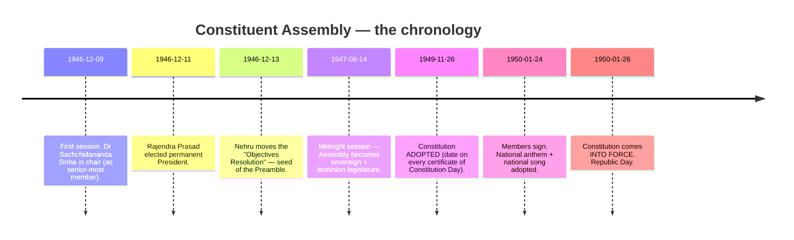
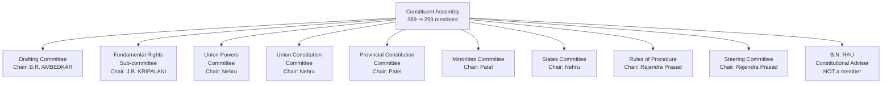
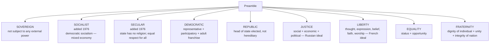
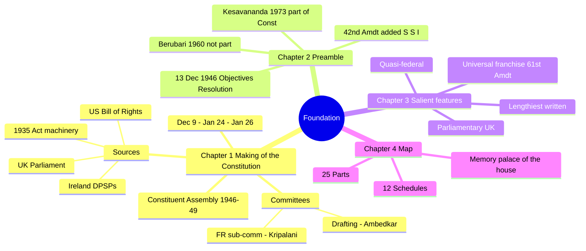
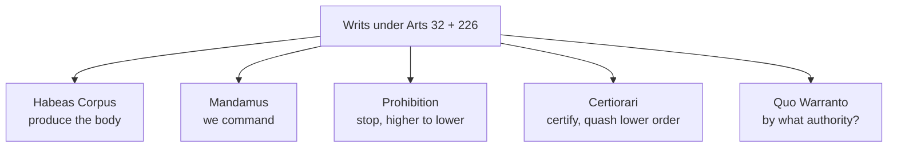
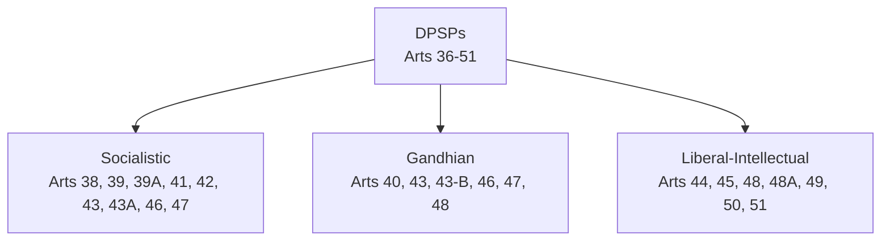
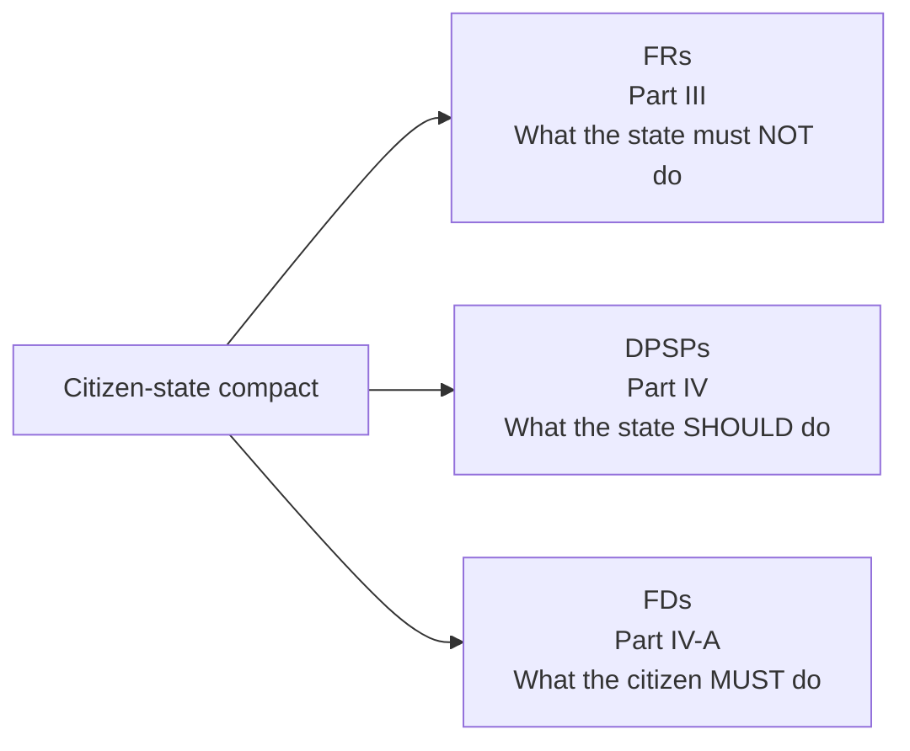
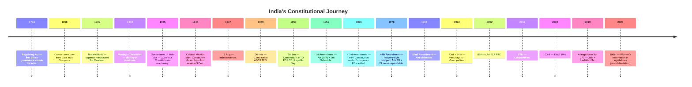

# How To Use This Book

Welcome. Before you turn a page of content, read these three pages. They are
the difference between *"I read polity"* and *"I own polity"*.

## The promise

Read this book **end-to-end twice** + do the quiz bundles in
`backend/seeds/static_gk/polity/` and you will:

- Score **85 %+** on the Polity section of SSC CGL / CHSL, RRB NTPC / Group-D,
  IBPS PO / Clerk / RRB, SBI PO, state PSCs.
- Answer **all 15–17** Polity GS-1 prelims UPSC prelims Qs with confidence, and
  clear the sectional cut-off comfortably on mains too.
- Recall **every major Article, every landmark case, every key amendment** by
  name + year + one-line significance.

No other book is needed. You will, however, practise: reading alone doesn't
score marks, **recalling under time pressure** does.

## How the book is engineered (the pedagogy)

I'm going to over-explain this once, because when you see the techniques
appearing in every chapter you'll know what to do with them.

### 1. Story-first, fact-second (narrative memory)

The brain remembers **stories** ~22× better than disconnected facts (Jennifer
Aaker, Stanford). So each major topic opens with a short **story** — a
real historical moment, a cliff-edge debate in the Constituent Assembly, a
dramatic Supreme Court ruling. Facts hang off that story.

**Example you'll meet**: when we reach Article 21 (right to life), we start
with Nanavati in court, Maneka Gandhi's confiscated passport, and Indira
Gandhi's Emergency. By the time the Articles themselves appear, you care.

### 2. Scaffolding (nothing introduced without foundation)

Every new term is set up by an earlier one. The Preamble comes before the
Articles. The Articles come before the amendments. The amendments come before
the judgments that interpret them. You never meet a term cold.

### 3. Dual coding (image + word, together)

Every chapter carries at least one **diagram** (tree, flowchart, timeline, or
relational map). The brain stores visual + verbal traces separately
(Allan Paivio's Dual Coding Theory); meeting both at once gives you two paths
to recall the same fact.

### 4. Chunking (Miller's 7 ± 2)

No sub-section throws more than **5–7 new bullets** at you. Bigger lists are
broken into labelled chunks (e.g., the 22 languages of the 8th Schedule split
into 14 original + 1 Sindhi + 3 of 1992 + 4 of 2003).

### 5. Retrieval practice (the cheapest way to triple your marks)

Embedded **"📝 pause + recall"** prompts every few pages tell you to close the
book and try to produce something from memory. This works **2–3× better than
re-reading** (Roediger & Karpicke, 2006). **Do them.**

### 6. Elaborative interrogation

At key moments I'll ask **"Why?"** — not for drama but because generating the
answer yourself cements the memory. e.g., *"Why did the Constituent Assembly
keep FRs justiciable but DPSPs non-justiciable?"*

### 7. Memory palaces + pegs

For long lists (all 12 Schedules, all Emergency Articles, all Padma Award
categories), we build a mental **memory palace** — you walk through a familiar
place in your head (your home, your daily route) and put each item at a
specific spot. We use **pegs** (number-image associations) for dates: e.g.,
1950 = the image of a *nap-on-a-fifty* (new Constitution sleeping in India's
cradle).

### 8. Acronyms + acrostics (the best ones are slightly absurd)

Good acronyms stick because they're ridiculous. We'll use ones like
**"FEAR-CC"** for the 6 FRs — not the dry alphabetical soup you see elsewhere.

### 9. Contrastive juxtaposition (the bi-column trick)

The human brain fixes concepts faster when they sit next to their opposite.
We'll use **side-by-side tables** everywhere — FR vs DPSP, LS vs RS, President
vs Governor, Art 32 vs Art 226, Emergency under Art 352 vs 356.

### 10. The Feynman box (the 60-second test)

At the end of each chapter there's a **"🧑‍🏫 Feynman box"**: can you explain
this chapter, in plain words, to a 12-year-old, in **60 seconds**? If not,
you haven't learned it — go back.

### 11. Interleaving in revision

End-of-part **mixed drills** jumble topics on purpose. Blocked practice
feels productive but poor recall; interleaved practice feels harder but
transfers to actual exams, where topics *are* jumbled
(Rohrer & Taylor, 2007).

### 12. Spaced revisits (the curve, not the cram)

Ebbinghaus's forgetting curve is real. After you finish a chapter, revisit
its end-of-chapter summary:

| Visit #   | When                  | Effort (min) |
|-----------|-----------------------|---------------|
| 1st read  | Day 0                 | 30            |
| 1st recap | **Day 1** next day    | 5             |
| 2nd recap | **Day 3**             | 5             |
| 3rd recap | **Day 7**             | 5             |
| 4th recap | **Day 21**            | 5             |
| 5th recap | **1 week pre-exam**   | 10            |

Hit all five visits and the chapter is yours for the next 12 months.

### 13. Emotional anchoring

Emotion + memory are connected through the amygdala. Where a topic is dry,
I'll lean on the **human drama** behind it — Gandhi's fast in 1932, Sriramulu's
death in 1952, Beant + Satwant Singh's betrayal in 1984, Narasimha Rao's 1991
courage, Bhagat Singh's last letter. You will remember the facts because the
people behind them will feel real.

### 14. The active-recall quiz partner

This book is paired, chapter-by-chapter, with the **quiz bundles** in
`backend/seeds/static_gk/polity/`. After reading a chapter, do the matching
set of 10 questions. If you get any wrong, come back, read that section, and
write a **single sentence in your own words** summarising the corrected fact.
The writing step is the cement.

### 15. The "one-page map"

Every Part of the book ends with a **one-page mind map** showing how the
chapters hook together. Photograph that page. Before every exam, look at it
for 90 seconds. You'll see the whole subject at a glance.

## How long it takes

Reading time: ~18 hours cover-to-cover for a typical aspirant.
Plus three recap cycles (~6 hours total).
Plus the quiz bundles (~6 hours).
= **30 hours** of focused study gets you exam-ready for Polity.

> **Rule of the book**: if a section feels boring, you are probably reading
> passively. Stop. Close the book. Try to explain the last three paragraphs
> aloud. **That** is learning.

---

# Part A — The Foundation

The first four chapters give you the **mental map of the Constitution**. Once
this map is in your head, every later chapter lands in a pre-allocated slot.
Without it, you're memorising the street names of a city whose layout you've
never seen.

---

## Chapter 1 — The Story of How India Got Its Constitution

### 1.1 The hook — why we even needed one

> Imagine you're 32 years old in 1946. Your country has been promised
> independence. Two weeks earlier, the Muslim League's **Direct Action Day**
> (16 August 1946) turned Kolkata into 5 days of communal slaughter. The
> British are drafting an exit plan. You are one of **389** people (later
> 299) chosen to write the rule book that **1.4 billion** people 77 years
> later will still be arguing over. What do you do?

That is the problem the Constituent Assembly walked in with. Understand the
scale of that problem and the Constitution's length, complexity + compromises
stop looking strange.

### 1.2 The pre-story — constitutional milestones before 1946

A quick highlight-reel. Each of these is a PYQ on its own, so memorise the
one-liner. Many are covered again in Chapter 3 + 13.

| Year | Act / Event | One-line importance |
|------|-------------|---------------------|
| 1773 | **Regulating Act** | First British law governing India. Created the office of Governor-General of Bengal (Warren Hastings was the first). |
| 1784 | **Pitt's India Act** | Board of Control + Court of Directors — dual govt. |
| 1813 | Charter Act | Ended East India Company's trade monopoly (except tea + China). |
| 1833 | Charter Act | **Lord William Bentinck becomes the first Governor-General of India** (not just Bengal). |
| 1853 | Charter Act | Open ICS competitive exam. |
| 1858 | **Government of India Act** | Company rule ends; Crown takes over. Queen's Proclamation. |
| 1861 | Indian Councils Act | Portfolio system + Indians in legislatures (nominated). |
| 1892 | Indian Councils Act | Cautious expansion of council membership. |
| 1909 | **Morley–Minto Reforms** | Introduced **separate electorates** for Muslims — sowed the seed of Partition. |
| 1919 | **Montagu–Chelmsford (GoI Act 1919)** | Introduced **diarchy** in provinces. |
| 1935 | **Government of India Act 1935** | Longest British statute on India; provincial autonomy; Federal Court; ~2/3 of our Constitution's structural ideas borrowed from here. |
| 1940 | **August Offer** | British concede an Indian-drafted Constitution in principle. |
| 1942 | **Cripps Mission** | Dominion status post-war — rejected. |
| 1946 | **Cabinet Mission Plan** | Proposed three-tier federation + a Constituent Assembly; partition avoided by a hair but rejected by League eventually. |

📝 *Pause + recall*: before reading further, try to name **three** pre-1946
Acts that shaped the 1950 Constitution and **one** thing each gave us.

### 1.3 The Constituent Assembly — the 4 key dates

**Memorise 26 NOV 1949 + 26 JAN 1950** as the two dates. **Why the 2-month gap?**
Because the Assembly wanted the "commencement" to fall on the **same date**
Congress had declared Purna Swaraj in 1930 — 26 January — which gave the date
emotional weight + made the Republic feel born of the freedom struggle, not
gifted by Britain.

### 1.4 Who drafted what — the key committees

**Memory peg — "PRANA DB"** for the pillars of the process:
**P**resident Rajendra Prasad (chair of CA + Rules + Steering),
**R**au, B.N. — adviser who produced the first draft,
**A**mbedkar — chair of Drafting Committee,
**N**ehru — chaired Union-side committees,
**A**ll-committees-Patel for Minorities + Provinces,
**D**rafting committee had **7 members**,
**B**. N. Rau's draft → Ambedkar polished → the Constitution we have.

**The 7 Drafting Committee members** (the one list you *must* know by heart):

1. **Dr. B.R. Ambedkar** (Chair)
2. **N. Gopalaswami Ayyangar**
3. **Alladi Krishnaswamy Ayyar**
4. **Dr. K.M. Munshi**
5. **Syed Mohammad Saadullah**
6. **N. Madhava Rao** (replaced B.L. Mitter who resigned on health)
7. **T.T. Krishnamachari** (replaced D.P. Khaitan, who died 1948)

**Mnemonic — "A-A-A-M-S-M-K"** or say it as a rhythm:
*"Ambedkar, Ayyangar, Ayyar, Munshi, Saadullah, Madhava Rao, Krishnamachari."*

### 1.5 How long did it take?

**2 years, 11 months, 18 days.** Eleven sessions. **165 days of actual sitting.**
**141 days** just on debating + voting.
Consumed paper: **64 lakh rupees** at the cost of the time. Handwritten by
**Prem Behari Narain Raizada** (calligrapher, Delhi). Illustrated + illuminated
by **Nandalal Bose + his team** of Shantiniketan artists. The original
hand-written volumes are preserved in **helium-filled cases** in the
Parliament Library.

### 1.6 Sources of the Constitution — the "borrowed" critique

Critics (KT Shah, HV Kamath) called the Constitution a "borrowed bag". Our
response: it's a *cosmopolitan* Constitution that synthesised the best of
several systems and adapted them. What comes from where:

| Borrowed from                  | What we took                                                                 |
|--------------------------------|------------------------------------------------------------------------------|
| **UK**                         | Parliamentary system, cabinet system, rule of law, single citizenship, writs. |
| **USA**                        | Written Constitution, Preamble, Fundamental Rights, judicial review, impeachment of President + SC judges, VP. |
| **Ireland**                    | Directive Principles, nomination to RS, method of Presidential election.     |
| **Canada**                     | Quasi-federal structure (strong centre), residuary powers with centre, appointment of state Governors, SC advisory jurisdiction. |
| **Australia**                  | Concurrent List, freedom of trade + commerce + intercourse (Art 301), joint sitting of Parliament. |
| **Germany (Weimar)**           | Emergency Provisions + suspension of FRs during Emergency. |
| **Soviet Union (USSR)**        | Fundamental Duties, ideals of justice in the Preamble (social, economic, political). |
| **France**                     | Republic, ideals of liberty + equality + fraternity. |
| **South Africa**               | Procedure for amending the Constitution, election of RS members. |
| **Japan**                      | "Procedure established by law" (Art 21). |
| **Government of India Act 1935** | **Around 2/3 of the Constitution's structural clauses** — Federal scheme, public service commissions, Emergency provisions, administrative details, role of Governors. |

> **🧑‍🏫 Feynman box — Sources in 60 seconds**
> *"UK gave the how-government-runs; US gave the citizen's shield; Ireland
> gave the promises; Canada gave the glue to the centre; Germany gave the
> emergency brakes; USSR gave duties and ideals; 1935 Act gave the machinery."*

### 1.7 How the Objectives Resolution became the Preamble

On **13 December 1946**, Nehru moved the **Objectives Resolution**. It
declared India a "sovereign democratic republic" committed to "justice,
social, economic + political; equality of status, of opportunity, + before
the law; freedom of thought, expression, belief, faith, worship, vocation,
association + action." The Resolution was **adopted 22 January 1947**. In
slightly polished form, it became the **Preamble**. Recognise these phrases
— they are on every page of the Constitution's spirit, and they are on every
answer sheet in mains.

### 1.8 🎯 Exam hooks for Chapter 1

- Dates to memorise **verbatim**: 9 Dec 1946, 11 Dec 1946, 13 Dec 1946,
  26 Nov 1949, 24 Jan 1950, 26 Jan 1950.
- Name Chairs of the major committees (see the tree above).
- Name all 7 Drafting Committee members.
- Which **one** country gave us which **one** feature — matching Qs are
  common (see Sources table).
- How long did it take to frame (2y 11m 18d) + how much did it cost (₹64 L).
- Who signed first? Rajendra Prasad. Who gave the first copy? The
  calligrapher Prem Behari Narain Raizada; illustrations by Nandalal Bose.

📝 *Pause + recall* — close the book. Name: (a) the chair of the Drafting
Committee, (b) the Constitutional Adviser, (c) the first Chair of the
Constituent Assembly, (d) the date the Constitution was adopted, (e) the date
it came into force. Write the answers; then check.

---

## Chapter 2 — The Preamble

### 2.1 Why spend a chapter on 85 words?

Because **every** word is freighted, every word has been judicially analysed,
and almost every clause has been amended at least once. The Preamble:

1. Declares the **source of authority** — "We, the People of India".
2. Declares the **type of state** — "Sovereign Socialist Secular Democratic Republic".
3. Declares the **goals** — Justice, Liberty, Equality, Fraternity.
4. Declares the **date** — "adopted, enacted, and given to ourselves this 26th day of November, 1949".

### 2.2 The text (memorise it)

> **WE, THE PEOPLE OF INDIA**, having solemnly resolved to constitute India
> into a **SOVEREIGN SOCIALIST SECULAR DEMOCRATIC REPUBLIC** and to secure to
> all its citizens:
>
> **JUSTICE**, social, economic and political;
> **LIBERTY** of thought, expression, belief, faith and worship;
> **EQUALITY** of status and of opportunity;
> and to promote among them all
> **FRATERNITY** assuring the dignity of the individual and the unity and
> integrity of the Nation;
>
> **IN OUR CONSTITUENT ASSEMBLY this twenty-sixth day of November, 1949**, do
> hereby adopt, enact and give to ourselves this Constitution.

Three words to flag: **SOCIALIST**, **SECULAR**, **INTEGRITY**. None of
these were in the original 1950 text. All three were **added by the
42nd Amendment, 1976** during the Emergency. Mnemonic: *"Indira inserted
SSI"* (Socialist, Secular, Integrity). We return to this in Chapter 28.

### 2.3 Keywords — nested meanings

### 2.4 Is the Preamble part of the Constitution?

This is a **favourite PYQ**.

- *Berubari Union (1960)* — SC held the Preamble is a key to the mind of the
  framers but **NOT part of the Constitution**.
- *Kesavananda Bharati (1973)* — 13-judge bench overruled Berubari on this
  point. Preamble IS **part of the Constitution** and can be amended, but
  the amendment cannot destroy the **basic features** reflected in the
  Preamble.
- *LIC of India v. Consumer Education and Research Centre (1995)* — again
  confirmed Preamble as part of the Constitution.

So today: **Yes, part. Yes, amendable. No, cannot destroy basic structure.**

### 2.5 Justice — Liberty — Equality — Fraternity, in that order

**Why this order?** Dr Ambedkar, in his famous closing speech (25 Nov 1949):

> *"The principles of liberty, equality and fraternity are not to be treated
> as separate items in a trinity. They form a union of trinity in the sense
> that to divorce one from the other is to defeat the very purpose of
> democracy."*

You'll see this quote quoted back at you in mains essays; it's that useful.

### 2.6 🎯 Exam hooks

- Three words inserted by the **42nd Amendment (1976)**: Socialist, Secular,
  Integrity.
- *Kesavananda (1973)* — Preamble is part of the Constitution.
- *Berubari (1960)* — earlier, said it was NOT part. (Don't mix these two.)
- French Revolution gave us Liberty, Equality, Fraternity.
- USSR gave us "Justice — social, economic, political."
- The Preamble was moved as the Objectives Resolution on **13 Dec 1946** by
  **Nehru**; adopted **22 Jan 1947**.

> **🧑‍🏫 Feynman box — Preamble in 60 seconds**
> *"We the people of a sovereign, socialist, secular, democratic republic
> promise ourselves justice (USSR), liberty (French), equality (French), and
> fraternity (French). Adopted 26 Nov 1949. Part of the Constitution after
> Kesavananda 1973 — amendable, but never in ways that destroy its spirit."*

📝 *Pause + recall* — name the **3 words** added in 1976 + the **2 cases**
that decided whether the Preamble is part of the Constitution.

---

## Chapter 3 — Salient Features of the Indian Constitution

A catalogue of the **defining characteristics**. Memorise them as a mental
list — examiners love a straight 5-or-6 point "Describe salient features"
question.

### 3.1 The thirteen salient features

1. **Lengthiest written constitution in the world**. Original 1950 text had
   **395 Articles in 22 Parts + 8 Schedules**. Today (with amendments and
   re-numberings): **~448 Articles across 25 Parts + 12 Schedules**. Why so
   long? Three reasons: (a) one Constitution for 28 states + 8 UTs of widely
   varying sizes, (b) the Government of India Act 1935 was itself gigantic
   and we absorbed its machinery, (c) detailed safeguards for minorities,
   SCs, STs + tribal areas.
2. **Drawn from various sources** (Chapter 1 §1.6 — don't repeat the list here).
3. **Blend of rigidity + flexibility**. Some provisions amendable by simple
   majority (e.g., creating a new state, Part I), some by special majority
   (most of Part III + IV), some by special majority **plus** ratification
   by at least half the states (federal matters — Chapter 28).
4. **Federal structure with unitary bias**. Federation in form — strong unitary
   features (single constitution, single citizenship, flexible boundaries,
   emergency provisions). Granville Austin: *"cooperative federalism"*.
   K.C. Wheare: *"quasi-federal"*.
5. **Parliamentary form of government** (UK model — Westminster system). Not
   Presidential (US). Real power in the Prime Minister; nominal in President.
   See Chapter 12.
6. **Integrated + independent judiciary**. One Supreme Court at the top, one
   structure of High Courts and subordinate courts below — no separate state
   supreme courts (unlike USA). Independence via Art 50, tenure, salaries
   charged on Consolidated Fund, removal only by impeachment.
7. **Fundamental Rights** — Chapter 6.
8. **Directive Principles of State Policy** — Chapter 7.
9. **Fundamental Duties** — Chapter 8 (added by 42nd Amendment).
10. **Indian Secularism** — positive, not wall-of-separation. State treats
    all religions equally (sarva dharma sama bhava) + can intervene for
    reform (abolishing untouchability, banning triple talaq).
11. **Universal adult franchise** — every citizen ≥ 18 years votes. Voting
    age lowered from 21 to 18 by the **61st Amendment, 1988** (Rajiv
    Gandhi).
12. **Single citizenship**. Unlike USA (federal + state) or Switzerland, India
    has **one** citizenship — Indian. Regardless of your state, your rights
    are the same.
13. **Emergency provisions** (Arts 352 / 356 / 360 — Chapter 27).

**Mnemonic — "LOUD FRIENDS-PIES"**:
**L**engthy, **O**rigin-mixed, **U**nique blend of rigidity + flexibility,
**D**ual federal/unitary, **F**undamental rights + duties, **R**ule of law,
**I**ndependent judiciary, **E**mergency, **N**ominal head, **D**irective
principles, **S**ecular, **P**arliamentary, **I**ndependent election
commission, **E**nfranchisement universal, **S**ingle citizenship.

> **🧑‍🏫 Feynman box — Constitution in 90 seconds**
> *"The lengthiest written constitution in the world, one country across 28
> states with one citizenship, a strong centre that can still be federal,
> a Westminster prime-minister-led parliament with a nominal president, six
> enforceable rights and eleven non-enforceable but binding duties, plus a
> long list of guiding promises called the DPSPs. Independent judiciary,
> independent election commission, universal adult franchise, declared
> secular + socialist since 1976, and three emergency brakes if the state
> comes apart."*

### 3.2 🎯 Exam hooks

- Original vs today counts: Articles 395 → ~448; Schedules 8 → 12.
- **61st Amendment** lowered voting age to 18.
- Federal vs unitary — Granville Austin called it **cooperative federalism**;
  K.C. Wheare called it **quasi-federal**.
- Parliamentary system borrowed from **UK**; single citizenship also UK.

📝 *Pause + recall* — list any **seven** salient features in the order you
find easiest. Then try to list them in reverse order (retrieval practice is
harder + therefore sticks better).

---

## Chapter 4 — The Schedules + the Parts (the map of the Constitution)

Think of the Constitution as a **big house**. Parts are the rooms. Schedules
are the **cupboards in those rooms** where details live.

### 4.1 The 12 Schedules — the one cheat-sheet

| # | Schedule | Contents + what to remember |
|---|----------|------------------------------|
| 1 | First | List of **States + UTs** + their territories. Changes with every reorganisation (J&K, Telangana, etc.). |
| 2 | Second | **Salaries + emoluments** of the President, Vice-President, Governors, SC + HC judges, CAG, Speaker, etc. Charged on the Consolidated Fund. |
| 3 | Third | **Forms of oaths + affirmations** — for the President, Ministers, MPs, MLAs, SC/HC judges, CAG. |
| 4 | Fourth | **Allocation of RS seats** to states and UTs. |
| 5 | Fifth | **Administration + control of Scheduled Areas + Scheduled Tribes** (except in 6th Schedule states). 10 states — **PESA, 1996** extends Panchayati Raj here. |
| 6 | Sixth | **Administration of Tribal Areas in Assam, Meghalaya, Tripura + Mizoram** — Autonomous District Councils. |
| 7 | Seventh | **Union List (97 → 100+), State List (66 → 61), Concurrent List (47 → 52)**. Division of subjects between Centre + States. |
| 8 | Eighth | **Languages** — originally 14, now **22**. |
| 9 | Ninth | Added by **1st Amendment, 1951** — a protective list of land-reform laws + agrarian reform laws that could not be challenged in court for violating FRs. *I.R. Coelho v. State of TN (2007)* — post-24 April 1973 additions ARE open to judicial review if they violate basic structure. |
| 10 | Tenth | Added by **52nd Amendment, 1985** — **Anti-Defection Law**. Modified by 91st (2003). |
| 11 | Eleventh | Added by **73rd Amendment, 1992** — **29 subjects for Panchayats** (agriculture, land reforms, minor irrigation, etc.). |
| 12 | Twelfth | Added by **74th Amendment, 1992** — **18 subjects for Municipalities** (urban planning, fire services, slum improvement, etc.). |

#### Memory palace — putting Schedules in a house

Walk through **your home** and place one Schedule per room:

1. **Gate** → Schedule 1 (States + UTs — the *boundaries* of the nation, like a gate).
2. **ATM near gate** → Schedule 2 (Salaries).
3. **Temple in courtyard** → Schedule 3 (Oaths — you *swear* before God).
4. **Living-room sofa** → Schedule 4 (RS seat allocation — a *seated* council).
5. **Study room** → Schedule 5 (Scheduled Areas + STs).
6. **Backyard tree** → Schedule 6 (Tribal Areas of NE — trees = forests).
7. **Kitchen** → Schedule 7 (three Lists — Union, State, Concurrent — the three *burners*).
8. **Library shelf** → Schedule 8 (Languages).
9. **Locked cupboard** → Schedule 9 (protected laws — locked away from courts).
10. **TV remote** → Schedule 10 (Anti-defection — remote-controls MP behaviour).
11. **Balcony (village view)** → Schedule 11 (Panchayats — village powers).
12. **Rooftop (city view)** → Schedule 12 (Municipalities — urban powers).

Walk through this palace **three times** (morning, noon, night) for 3 days
and the 12 Schedules + their dates + their additions become permanent.

### 4.2 The 25 Parts — the building's skeleton

```mermaid
graph TD
    C[Constitution<br/>~448 Articles, 25 Parts, 12 Schedules]
    C --> P1[Part I<br/>Union + its territory<br/>Arts 1–4]
    C --> P2[Part II<br/>Citizenship<br/>Arts 5–11]
    C --> P3[Part III<br/>FRs<br/>Arts 12–35]
    C --> P4[Part IV<br/>DPSPs<br/>Arts 36–51]
    C --> P4A[Part IV-A<br/>FDs<br/>Art 51-A]
    C --> P5[Part V<br/>The Union<br/>Arts 52–151]
    C --> P6[Part VI<br/>The States<br/>Arts 152–237]
    C --> P8[Part VIII<br/>Union Territories<br/>Arts 239–242]
    C --> P9[Part IX<br/>Panchayats<br/>Arts 243–243-O]
    C --> P9A[Part IX-A<br/>Municipalities<br/>Arts 243-P–243-ZG]
    C --> P9B[Part IX-B<br/>Cooperatives<br/>Arts 243-ZH–243-ZT]
    C --> P11[Part XI<br/>Centre-State rel.<br/>Arts 245–263]
    C --> P12[Part XII<br/>Finance + Property<br/>Arts 264–300-A]
    C --> P14A[Part XIV-A<br/>Tribunals<br/>Arts 323-A + B]
    C --> P17[Part XVII<br/>Official Language<br/>Arts 343–351]
    C --> P18[Part XVIII<br/>Emergency<br/>Arts 352–360]
    C --> P20[Part XX<br/>Amendment<br/>Art 368]
    C --> P21[Part XXI<br/>Special Provisions<br/>Arts 369–392]
    C --> P22[Part XXII<br/>Short title + commencement<br/>Arts 393–395]
```

Not every Part gets its own chapter; some (VII, X, XIII, XV, XVI, XIX) are
minor or repealed. The Parts you will actually meet in this book are those on
the tree above.

### 4.3 🎯 Exam hooks

- Schedule 1 = States + UTs (changes often).
- Schedule 6 = **NE tribal areas** (Assam, Meghalaya, Tripura, Mizoram — memorise the 4).
- Schedule 7 = three Lists. **Union 100, State 61, Concurrent 52** (updated counts).
- Schedule 8 = **22 languages**. Added by: Sindhi (1967, 21st Amdt); Konkani,
  Manipuri, Nepali (1992, 71st); Bodo, Dogri, Maithili, Santhali (2003, 92nd).
- Schedule 9 = 1st Amendment 1951; judicial-review-proof only till 24-Apr-1973
  (I.R. Coelho, 2007).
- Schedule 10 = 52nd Amendment 1985 (Rajiv Gandhi); tightened 91st Amdt 2003.
- Schedules 11 + 12 = 73rd + 74th Amendments, 1992.

📝 *Pause + recall* — name all **12 Schedules** using the house-walk mnemonic.
If you miss one, repeat from the start; do not cheat by looking back.

---

### Part A — Mind map (one-page revision)

Screenshot this page. Before every revision, look at it for 90 seconds.

---

# Part B — The Citizen-State Compact

You now know how the Constitution was written + how it's laid out. Part B
is about the **deal** between citizen and state: who counts as Indian, what
they can demand from the state, and what the state asks back.

---

## Chapter 5 — Citizenship (Part II, Articles 5–11)

### 5.1 Hook — the Partition problem

On 15 August 1947, **15 million people were on the wrong side of a new line**.
Hindus + Sikhs fleeing East to West; Muslims fleeing West to East. The
Constituent Assembly had to answer one question fast: *"Who, among all these
people and their descendants, is an Indian citizen?"*

The answer lived in Articles 5 to 11 — deliberately short. Parliament was
instructed to fill in details by statute. It did so through the
**Citizenship Act, 1955**, which we'll unpack.

### 5.2 Articles 5 – 11 — a one-line gist of each

| Article | What it does |
|---------|--------------|
| 5 | Citizens at the **commencement** (26 Jan 1950) — domicile-based rule. |
| 6 | Citizenship of persons who **migrated from Pakistan to India**. |
| 7 | Citizenship of persons who **migrated from India to Pakistan** then returned. |
| 8 | Citizenship of **Persons of Indian Origin** residing abroad. |
| 9 | **Voluntarily acquiring citizenship of a foreign state = loss of Indian citizenship**. |
| 10 | Every citizen continues as such subject to Parliament's laws. |
| 11 | **Parliament's power to regulate citizenship** by law. (Basis of the 1955 Act.) |

### 5.3 The Citizenship Act, 1955 — five gateways in + three exits

**Five ways to BECOME a citizen:**

1. **By birth** (Sec 3).
   - Born in India on or after 26 Jan 1950 and before 1 July 1987 — automatically citizen.
   - Born 1 July 1987 – 2 Dec 2004 — citizen if at least one parent was
     citizen at the time of birth.
   - Born on or after 3 Dec 2004 — citizen **only if BOTH parents are
     citizens**, or one is citizen + the other is not an illegal migrant.
2. **By descent** (Sec 4) — born outside India after 26 Jan 1950 to parents
   (earlier father only) who are Indian citizens; registration at Indian
   consulate within prescribed time.
3. **By registration** (Sec 5) — persons of Indian origin, spouses of
   citizens, minor children of citizens, OCIs of 5 years' registration, etc.
4. **By naturalisation** (Sec 6) — foreigner of full age + 12 years'
   residence (lowered to 6 years under the CAA 2019 for specific groups) +
   good character + adequate knowledge of a scheduled language + willingness
   to renounce previous citizenship + take the oath.
5. **By incorporation of territory** (Sec 7) — when new territory joins India
   (e.g., Sikkim, Pondicherry after their mergers).

**Three ways to LOSE citizenship** (Sec 8–10):

1. **Renunciation** — voluntary declaration.
2. **Termination** — auto, if you acquire another country's citizenship.
3. **Deprivation** — by government, on grounds of fraud, disloyalty, trading
   with enemy, sentence of ≥ 2 years within 5 years of naturalisation, etc.

### 5.4 CAA 2019 — what actually changed

The **Citizenship Amendment Act, 2019** (effective when Rules were notified,
11 March 2024) gave a **fast-track path to citizenship by naturalisation**
(from 12 → **6 years** residence) for **non-Muslim migrants** from **3
countries** (Pakistan, Afghanistan, Bangladesh) belonging to **6 religions**
(Hindu, Sikh, Buddhist, Jain, Parsi, Christian), who entered India **on or
before 31 December 2014** fleeing religious persecution.

Key fact: CAA does **not** take any Indian citizen's rights away. It only
*adds* a path. Its political controversy is about the **exclusion of Muslims**
from the eligible religions. Court challenges are pending in the SC.

Pair the CAA with two other acronyms that come up together:
- **NRC (National Register of Citizens)** — currently only for Assam; created
  under the 1955 Act; Assam NRC's final list was published Aug 2019 and
  excluded 19 lakh persons; contested.
- **NPR (National Population Register)** — a register of **usual residents**,
  not citizens — maintained under the Citizenship Rules 2003.

### 5.5 OCI + PIO — the twin cards

- **PIO (Person of Indian Origin) card** — launched 1999 for diaspora.
  **Merged into OCI in 2015** (no fresh PIO cards issued).
- **OCI (Overseas Citizen of India)** — introduced by the **Citizenship
  (Amendment) Act, 2003**. NOT a dual citizenship. OCIs don't get: voting
  right, Indian passport, govt jobs, agricultural land, election to
  Parliament/Assemblies, appointment to constitutional offices.
  But they get: lifelong visa-free travel, parity with NRIs on economic,
  financial + educational matters.

> **🧑‍🏫 Feynman box — Citizenship in 60 seconds**
> *"Indian citizenship is single + regulated by Parliament under Article 11.
> Five ways in — birth, descent, registration, naturalisation, incorporation
> of territory — all spelled out in the Citizenship Act 1955. Three ways out
> — renunciation, termination, deprivation. Overseas Indians can be OCIs but
> never dual citizens. The CAA 2019 shortens the naturalisation clock for
> persecuted non-Muslim migrants from three Muslim-majority neighbours."*

### 5.6 🎯 Exam hooks

- Parts covered: Part II, Arts 5–11.
- **Article 11** = Parliament's power over citizenship.
- **Citizenship Act, 1955** = the actual statute.
- CAA 2019 + Rules 2024 — 3 countries + 6 religions + cut-off 31 Dec 2014.
- OCI is **not** dual citizenship.
- Born 3 Dec 2004 onward → both parents test.

📝 *Pause + recall* — name the 5 ways to acquire Indian citizenship + the 3
ways to lose it. Then answer: is an OCI a dual citizen? (No.)

---

## Chapter 6 — Fundamental Rights (Articles 12–35)

> Where the citizen puts on armour against the state.

### 6.1 The deal, in one sentence

The Constituent Assembly had a choice. The United Kingdom gave citizens no
written list of rights — they trusted Parliament + the common law. The United
States wrote 10 of them into the Bill of Rights. India, coming out of
colonial abuse + caste discrimination + communal partition, chose the
American path — with extra teeth + extra restrictions.

**Exam weight** — roughly 1 in every 4 Polity questions across SSC / RRB / PO
/ Banking / State-PSC references either the Articles, the landmark cases, or
post-independence amendments on FRs. UPSC GS-2 essays are frequently built
around FRs + DPSP harmonisation. **Get this chapter to 100%.**

### 6.2 Origin + philosophy

- Drew largely from the **US Bill of Rights (1791)** — written, justiciable,
  binding on the state. Indian framers went further:
  - Indian FRs are **not absolute** — packaged with **reasonable restrictions**
    (Arts 19(2)–(6)), so Parliament can limit rights for public order,
    morality, sovereignty, etc.
  - Explicit written rights because (a) partition-era communal violence
    demanded clear minority protection, (b) caste society needed enforceable
    equality, (c) colonial state trampled liberties without remedy.
- **Objectives Resolution (13 Dec 1946)** → flowed into Part III.

**Drafting committee chairs that shaped FRs:**

- **Advisory Committee on FRs + Minorities + Tribal Areas** — chaired by
  **Sardar Patel**.
- **Sub-committee on FRs** — chaired by **J.B. Kripalani** (most of the wording).
- **Drafting Committee** — chaired by **Dr. B.R. Ambedkar**.
- **Sapru Committee (1945)** had earlier recommended justiciable FRs.

### 6.3 Originally 7 → now 6

At adoption (26 Jan 1950), Part III guaranteed **7 FRs**:

1. Right to Equality
2. Right to Freedom
3. Right against Exploitation
4. Right to Freedom of Religion
5. Cultural + Educational Rights
6. **Right to Property** ← removed
7. Right to Constitutional Remedies

**44th Amendment (1978)**, Morarji Desai's Janata govt, **deleted Right to
Property** (from Arts 19(1)(f) + 31). Today property is a **legal** right,
Art 300A. Why: Indira-era land-reform laws kept being struck down on
"right to property" grounds; moving it out unblocked redistribution.

**Mnemonic — "FEAR-CC"** for the 6 FRs:
**F**reedom (Arts 19–22), **E**quality (14–18), **A**gainst exploitation
(23–24), **R**eligion freedom (25–28), **C**ultural/educational (29–30),
**C**onstitutional remedies (32).

### 6.4 Article 12 — "The State"

FRs bind the **State**, so we need a precise definition. Art 12:

> *"The State" includes — (a) Government + Parliament of India; (b)
> Government + Legislature of each State; (c) all local or other authorities
> within the territory of India; (d) under the control of the Government of
> India.*

**"Other authorities"** — the litigated phrase. Expanded progressively by SC:

- *Rajasthan Electricity Board (1967)* — statutory bodies count.
- *Sukhdev Singh v. Bhagatram (1975)* — ONGC, LIC, IFCI = "State".
- *R.D. Shetty v. IAAI (1979)* — 6-point test by Bhagwati J.
- *Ajay Hasia v. Khalid Mujib (1981)* — RECs (societies under Societies Act) = "State".
- *Pradeep Kumar Biswas v. IICB (2002)*, 7-judge bench — **consolidated test**:
  entity is "State" if **"financially, functionally and administratively
  dominated by or under the control of the Government"**.
- *Zee Telefilms v. UoI (2005)* — held BCCI is **not** "State" (controversial).

**Judiciary as "State"?** SC in *Naresh Shridhar Mirajkar (1967)* held
**judicial functions** are *not* "State" under Art 12 — but administrative
functions (staff recruitment, infrastructure) are. Can't get a writ to quash
a judgment on FR grounds — appeal instead.

#### Article 13 — the enforcement lever

- **Art 13(1)**: pre-Constitution laws inconsistent with FRs are **void**.
- **Art 13(2)**: post-Constitution laws inconsistent with FRs are **void**.
- **Art 13(3)(a)**: "Law" includes ordinances, orders, bye-laws, rules,
  regulations, notifications, customs or usages having force of law.
- **Art 13(4)**: **Constitutional amendments** are **NOT** law under Art 13 —
  inserted by **24th Amendment (1971)** in reaction to *Golaknath (1967)*.
  *Kesavananda (1973)* added the basic-structure limit.

**Three doctrines to memorise:**
- **Severability** — only offending part of a law struck down; rest survives.
  *A.K. Gopalan v. Madras (1950)*.
- **Eclipse** — pre-1950 laws inconsistent with FRs go into eclipse
  (unenforceable against citizens, enforceable against non-citizens). Revive
  if FR later amended. *Bhikaji Narain Dhakras (1955)*.
- **Waiver** — a citizen **cannot waive** a FR. *Basheshar Nath v. CIT (1959)*.

### 6.5 Right to Equality (Articles 14–18)

The single golden thread: the first cluster of Part III dismantles the
pre-1950 structures of **colonial privilege + caste hierarchy + gender
discrimination**.

#### Art 14 — Equality before law + equal protection of laws

Two phrases, two origins:
- **Equality before the law** — English common law (Dicey) — negative; no one above the law.
- **Equal protection of laws** — US 14th Amendment — positive; like treatment
  in like circumstances; state *must* classify people for welfare purposes.

**Reasonable classification test** — *State of W.B. v. Anwar Ali Sarkar (1952)*:
1. Classification must be founded on an **intelligible differentia**.
2. That differentia must have a **rational nexus** with the object of the law.

**Doctrine of Arbitrariness** — *E.P. Royappa v. TN (1974)* (Bhagwati J.):
*"Equality and arbitrariness are sworn enemies."* Expanded Art 14 from
classification to reasonableness everywhere.

**Applied in**: *Maneka Gandhi (1978)* — Art 21 widened; *Ajay Hasia (1981)*;
*Shayara Bano (2017)* — instant triple talaq struck.

**Exceptions under Art 361**: President + Governors immune from criminal
proceedings during term; MPs + MLAs immune for anything said/voted in House
(Arts 105 + 194); foreign diplomats (Vienna Convention + Diplomatic
Relations Act 1972); UN + agencies.

#### Art 15 — Prohibition of discrimination

- 15(1) — state shall not discriminate on **5 grounds**: **religion, race,
  caste, sex, place of birth**.
- 15(2) — access to public places (shops, hotels, tanks, restaurants, wells).
- 15(3) — special provisions for **women + children** (gender-positive).
- 15(4) — special provisions for **SEBCs + SCs + STs** — inserted by
  **1st Amendment (1951)** after *Champakam Dorairajan (1951)*.
- 15(5) — reservation in **private unaided educational institutions** except
  minority ones — inserted by **93rd Amendment (2005)**.
- 15(6) — **10% EWS reservation** — inserted by **103rd Amendment (2019)**.
  Upheld in *Janhit Abhiyan v. UoI (2022)* 3–2.

**Case anchors**:
- *Champakam Dorairajan (1951)* → triggered 1st Amendment.
- *Balaji v. State of Mysore (1963)* → **50% ceiling on reservation** first laid down.
- *Indra Sawhney (Mandal) (1992)* → 9-judge bench. 27% OBC upheld; 50% ceiling
  reaffirmed; **creamy layer** concept introduced.
- *M. Nagaraj (2006)* → SC/ST promotion reservation requires State to prove
  backwardness + inadequate representation + no compromise to administrative
  efficiency.
- *Janhit Abhiyan (2022)* → EWS upheld; broke the 50% ceiling for economic
  reservations.

#### Art 16 — Equality of opportunity in public employment

- 16(1) + 16(2) — no discrimination on the 5 grounds of Art 15 + also
  **descent + residence**.
- 16(3) — Parliament can prescribe **residence** as a qualification for some
  state jobs.
- 16(4) — reservation for "any backward class" not adequately represented.
- 16(4A) — reservation **in promotion** with **consequential seniority** for
  SC/ST — **77th (1995) + 85th (2001)** Amendments.
- 16(4B) — carry-forward of unfilled reserved vacancies — **81st Amendment
  (2000)**.
- 16(5) — religious positions may be restricted to persons of that religion.
- 16(6) — **EWS 10% in jobs** — 103rd Amdt 2019.

#### Art 17 — Abolition of Untouchability

Short + absolute. **"Untouchability" is abolished and its practice in any
form is forbidden.** Enforced by **Protection of Civil Rights Act 1955** + SC/ST
(Prevention of Atrocities) Act 1989. **Binds private persons too** — a rare
horizontal FR.

**Sabarimala (2018)** — 5-judge majority held barring women 10–50 from
Ayyappa temple violated Art 17 (Chandrachud J.'s broad reading) + Arts 14,
15, 25. Review pending in 9-judge bench.

#### Art 18 — Abolition of titles

- State cannot confer titles (other than military or academic).
- Citizens cannot accept titles from foreign states.
- **Padma awards + Bharat Ratna** are NOT titles (*Balaji Raghavan v. UoI,
  1996*) — can't be prefixed/suffixed to your name.

### 6.6 Right to Freedom (Articles 19–22)

#### Art 19 — Six freedoms

> **Mnemonic — "SAM-FROP"** for the 6 freedoms:
> **S**peech + expression (19(1)(a)), **A**ssembly peacefully without arms (b),
> **M**ovement (d), **F**orm associations/unions (c), **R**eside + settle (e),
> **O**ccupation/trade/business (g). Earlier (f) Property — removed by 44th Amdt.

Each freedom has matched **reasonable restrictions**:

| Freedom | Restriction grounds (Art) |
|---------|---------------------------|
| Speech + expression 19(1)(a) | sovereignty + integrity, security of State, friendly foreign relations, public order, decency + morality, contempt of court, defamation, incitement to offence — 19(2). |
| Assembly 19(1)(b) | sovereignty + integrity, public order — 19(3). |
| Association 19(1)(c) | sovereignty + integrity, public order, morality — 19(4). |
| Movement 19(1)(d) | general public + protection of ST — 19(5). |
| Residence 19(1)(e) | same as above — 19(5). |
| Profession 19(1)(g) | professional qualifications, State monopoly, public interest — 19(6). |

**Grounds added by amendment**:
- "Public order" + "friendly relations with foreign states" → **1st Amendment (1951)**.
- "Sovereignty + integrity of India" + "incitement to an offence" → **16th Amendment (1963)**.

**Big 19(1)(a) cases**:
- *Romesh Thappar (1950)* → struck down Madras ban on Cross Roads.
- *Indian Express v. UoI (1985)* → newspaper import duty.
- *Shreya Singhal (2015)* → **Sec 66A IT Act struck down** (vague + chilling).
- *Navtej Johar (2018)* → read down Sec 377.
- *Anuradha Bhasin (2020)* → J&K internet shutdowns under proportionality.
- *Kaushal Kishor (2023)* — 5-judge bench: Art 19(2) grounds are **exhaustive**.

**Restriction test**: *K.A. Abbas v. UoI (1971)* + *Chintamanrao (1951)* —
proportionate, not arbitrary, related to a listed ground.

#### Art 20 — Protection for conviction of offences

Three guarantees:
1. **No ex post facto law** — only for criminal laws.
2. **No double jeopardy** — narrower than US; only judicial prosecution +
   punishment stage.
3. **No self-incrimination** — includes oral testimony + document production;
   narcoanalysis/polygraph/brain-mapping without consent violates it
   (*Selvi v. Karnataka, 2010*). Fingerprints + DNA + medical exam = NOT
   testimonial, so allowed.

Art 20 is **non-suspendable** even during Emergency (Art 359, 44th Amdt).

#### Art 21 — Protection of life + personal liberty

> *"No person shall be deprived of his life or personal liberty except
> according to procedure established by law."*

The single most consequential sentence in the Constitution.

- *A.K. Gopalan (1950)* → literal reading. "Procedure established by law" = any law passed.
- *Maneka Gandhi (1978)*, 7-judge bench → transformed Art 21. Procedure must
  be **fair, just, and reasonable**. Linked Arts 14, 19, 21 as a *golden
  triangle*.
- *Francis Coralie Mullin (1981)* → dignity.
- *Olga Tellis (1985)* → livelihood (pavement dwellers).
- *M.C. Mehta (1987)* → environment.
- *Vishaka (1997)* → workplace sexual harassment → POSH Act 2013.
- *Puttaswamy (2017)*, 9-judge bench unanimous → **Privacy = FR**. Overruled
  *MP Sharma (1954)* + *Kharak Singh (1962)*.
- *Common Cause (2018)* → passive euthanasia + living wills OK.
- *Navtej Johar (2018)*, *Joseph Shine (2018)* — personal-law restrictions
  struck down using Arts 21 + 14.

**Judicially read-in rights under Art 21** (non-exhaustive):
dignity, livelihood, privacy, clean environment, speedy trial, free legal
aid, shelter, education (now Art 21A after 86th Amdt 2002), health,
sleep, against solitary confinement + handcuffing + torture, travel abroad,
against bonded labour, die with dignity.

#### Art 21A — Right to Education

Inserted by **86th Amendment, 2002**. Free + compulsory education ages **6–14**.
Operationalised by the **RTE Act 2009** (effective 1 Apr 2010). Pre-school
(3–6) remains under Art 45 (DPSP, also amended by 86th).

**RTE pillars**: 25% quota for weaker sections in private unaided schools
(*Society for Unaided Private Schools v. UoI, 2012* — upheld except for
minority unaided schools); no detention till Class 8 (relaxed 2019); teacher-
pupil ratio + infrastructure norms; no screening, capitation, expulsion.

#### Art 22 — Protection against arrest + detention

**A. Ordinary arrest (clauses 1+2)**:
- Right to be **informed** of grounds of arrest.
- Right to **consult a legal practitioner** of choice.
- **Produced before nearest Magistrate within 24 hrs** (excluding journey).
- No detention beyond 24 hrs without magisterial authority.

**B. Preventive detention (clauses 3–7)**:
- Those rights do NOT apply.
- Detention up to **3 months** without Advisory Board approval; beyond 3
  months only on Advisory Board (HC judges or equivalent) recommendation.
- Grounds communicated "as soon as may be" (with public-interest exceptions).
- 44th Amendment tried to reduce 3 → 2 months; never brought into force.

**Preventive detention laws**: NSA (1980), PSA (J&K 1978), COFEPOSA (1974),
PITNDPS (1988), UAPA (1967; amended 2019), PMLA — recurring current affairs
+ editorial fodder.

### 6.7 Right against Exploitation (Articles 23–24)

#### Art 23 — Human trafficking + forced labour prohibited

- Traffic in human beings (includes slavery, devadasi, prostitution).
- **Begar** (forced unpaid labour) abolished.
- Compulsory service for **public purpose** (military conscription, civic
  duties) allowed — state cannot discriminate on religion etc.

*PUDR v. UoI (1982)* — non-payment of minimum wage = **forced labour** under
Art 23.

Laws: Immoral Traffic (Prevention) Act 1956, Bonded Labour System (Abolition)
Act 1976, POCSO 2012.

#### Art 24 — Child labour below 14 in factories or hazardous employment

- No child below 14 in any factory, mine, or hazardous employment.
- Child Labour Amendment 2016 prohibits under-14s from all employment
  (except non-hazardous family enterprise); 14–18s barred from hazardous work.

*M.C. Mehta v. TN (1996)* — Sivakasi match factories; SC directed
compensation + rehabilitation of child workers.

### 6.8 Right to Freedom of Religion (Articles 25–28)

#### Art 25 — Individual freedom of conscience + profession, practice, propagation

Subject to public order, morality, health. State can regulate "secular
activities associated with religious practice" + open Hindu religious
institutions to all Hindus (Explanation II — applies to Sikhs, Jains, Buddhists too).

**Essential Religious Practices (ERP) doctrine** — *Shirur Mutt (1954)*.
Courts decide what is essential vs not. Used in Ananda Margi tandava,
Sabarimala, hijab cases.

#### Art 26 — Collective right of religious denominations

Can establish + maintain institutions for religious + charitable purposes;
manage own affairs in religion; own + acquire property; administer property
in accordance with law.

#### Art 27 — No tax for specific religious promotion

Can't compel tax whose proceeds specifically fund one religion. General
taxes or fees — fine even if incidental religious benefit.

#### Art 28 — Religious instruction in educational institutions

- **Wholly state-funded** — no religious instruction.
- **State-aided** — religious instruction allowed, no compulsion.
- **Endowment-run-by-state** — religious instruction allowed.
- **Fully private** — any religious instruction.

### 6.9 Cultural + Educational Rights (Articles 29–30)

#### Art 29 — Interests of minorities

- Any section with distinct language, script, or culture can **conserve** it.
- No citizen denied admission to state or state-aided institutions on religion,
  race, caste, language. SC read 29(2) as applicable to **any** citizen in
  *St. Stephen's v. DU (1992)*.

#### Art 30 — Minorities' right to establish + administer educational institutions

- *"All minorities, whether based on religion or language, shall have the
  right to establish and administer educational institutions of their
  choice."*
- State aid cannot discriminate against minority institutions.
- Right is of the **community**, not individuals.

**Landmarks**: *T.M.A. Pai Foundation (2002)* 11-judge bench; *P.A. Inamdar
(2005)*. **Minority status** decided at **state** level, not national
(*T.M.A. Pai*). **AMU** status restored by **November 2024 7-judge bench**
(overruled *Azeez Basha 1967*; factual determination remitted).

### 6.10 Right to Constitutional Remedies (Article 32)

> **Dr. Ambedkar:** *"If I was asked to name any particular article in this
> Constitution as the most important — an article without which this
> Constitution would be a nullity — I could not refer to any other article
> except this one. It is the very soul of the Constitution and the very
> heart of it."*

Art 32 itself is a **FR**. Any FR violation → citizen can directly approach
the **SC** (bypassing HCs if they wish). SC **must** entertain the petition
(*Romesh Thappar, 1950*) — can't refuse on alternate-remedy grounds.

#### The five writs

| Writ | Against | Effect |
|------|---------|--------|
| **Habeas corpus** | Public authority or private person | Produce unlawfully detained person in court |
| **Mandamus** | Public authority (not President, not Governor for personal acts) | Perform a statutory duty |
| **Prohibition** | Lower courts + tribunals | Stop a pending proceeding exceeding jurisdiction |
| **Certiorari** | Lower courts + tribunals + admin authorities (after *A.K. Kraipak*) | Quash an already-passed order |
| **Quo warranto** | Public-office holder | Test legal authority to hold the post |

#### Art 32 vs Art 226

| Feature | Art 32 (SC) | Art 226 (HC) |
|---------|-------------|--------------|
| FR itself? | Yes | No (constitutional but not FR) |
| Scope | Only FR enforcement | FR + "any other purpose" — broader |
| Territorial jurisdiction | Pan-India | State + cause-of-action areas |
| Suspendable? | Only by Presidential order in Emergency (post-44th, NOT for Arts 20 + 21) | Same |
| Alternate-remedy refusal | Narrow | HC can refuse |

**PIL** evolved from Art 32 — SC relaxed *locus standi*. *S.P. Gupta (1981)*,
*Hussainara Khatoon (1979)*, *Bandhua Mukti Morcha (1984)*. Today a major
accountability tool — with occasional "publicity interest litigation" caution.

### 6.11 Enabling powers — Articles 33, 34, 35

- **Art 33** — Parliament may modify FRs for **armed forces + police + intel
  agencies** (basis of Army Act, etc. curtailing rights like unions).
- **Art 34** — restrictions while **martial law** is in force. (Never
  formally used in India post-independence.)
- **Art 35** — only Parliament, not states, can make laws giving effect to
  certain FRs (e.g., 16(3), 32(3), Arts 33, 34).

### 6.12 The FRs **non-citizens** get too

Mostly citizens-only FRs: 15, 16, 19, 29, 30.

**Everyone (including non-citizens) gets**: Arts **14, 20, 21, 21A, 22, 23,
24, 25, 26, 27, 28**.

**During Emergency**:
- Art 19 auto-suspended only for war/external aggression (not armed rebellion,
  post-44th Amdt).
- Under Art 359 Presidential Order: any FR can be suspended **except Arts 20
  + 21**.

### 6.13 Landmark FR cases — quick-recall sheet

| Year | Case | One-line significance |
|------|------|------------------------|
| 1950 | A.K. Gopalan | Literal Art 21. |
| 1951 | Champakam Dorairajan | Struck caste-based education reservation → 1st Amdt. |
| 1952 | Anwar Ali Sarkar | Reasonable classification test (Art 14). |
| 1967 | Golaknath | Parliament CANNOT amend FRs → reversed by 24th Amdt + *Kesavananda*. |
| 1970 | R.C. Cooper | Joint review of Arts 14, 19, 21. |
| 1973 | **Kesavananda Bharati** | **Basic Structure**. |
| 1975 | Indira Gandhi v. Raj Narain | Free + fair elections = basic structure. |
| 1976 | ADM Jabalpur | Art 21 could be suspended (overruled + disowned; reversed by 44th Amdt). |
| 1978 | **Maneka Gandhi** | Art 21 procedure must be fair, just + reasonable. |
| 1980 | Minerva Mills | Judicial review = basic structure. |
| 1985 | Olga Tellis | Livelihood under Art 21. |
| 1992 | Indra Sawhney | Mandal; 27% OBC; 50% cap; creamy layer. |
| 1993 | Unnikrishnan | Education under Art 21 (pre-86th Amdt). |
| 1997 | Vishaka | Workplace sexual harassment → POSH 2013. |
| 2014 | NALSA | Transgender = third gender; Arts 14, 19, 21. |
| 2017 | **Puttaswamy** | Privacy = FR. |
| 2017 | Shayara Bano | Instant triple talaq struck. |
| 2018 | Navtej Johar | Read down Sec 377. |
| 2018 | Joseph Shine | Struck Sec 497 IPC (adultery). |
| 2018 | Sabarimala | Women 10–50 entry permitted (under review). |
| 2022 | Janhit Abhiyan | EWS upheld. |

### 6.14 Major amendments to FRs

| Amendment | Year | Effect on FRs |
|-----------|------|----------------|
| 1st | 1951 | Art 15(4); 9th Schedule; public order + friendly relations to 19(2). |
| 7th | 1956 | Minor FR text tweaks. |
| 16th | 1963 | Sovereignty + integrity to 19(2). |
| 24th | 1971 | Art 13(4) + 368 — Parliament can amend FRs. |
| 25th | 1971 | Art 31C — 39(b) + 39(c) priority over FRs. |
| 42nd | 1976 | DPSP primacy extended; FDs added; struck down part in *Minerva Mills*. |
| 44th | 1978 | **Property dropped from FRs**; Arts 20 + 21 non-suspendable. |
| 77th, 81st, 85th | 1995–2001 | Reservation in promotion restored. |
| 86th | 2002 | Art 21A — RTE. |
| 93rd | 2005 | Art 15(5). |
| 97th | 2011 | Right to cooperatives (Art 19(1)(c) + Part IX-B). |
| 102nd | 2018 | NCBC — Art 338B. |
| 103rd | 2019 | **EWS 10% reservation** — Arts 15(6) + 16(6). |

### 6.15 Mnemonics + one-line recaps

> **🧠 Mnemonic — "Every Fast Runner Can Currently Cross"** → **E**quality
> (14–18), **F**reedom (19–22), **R**ight against exploitation (23–24),
> **C**ulture of religion (25–28), **C**ultural + educational (29–30),
> **C**onstitutional remedies (32).

> **🧠 The 6 freedoms — SAM-FROP**: Speech, Assembly, Movement, Form
> associations, Reside, Occupation / Profession.

> **🧠 Article chain** — 12 State → 13 Judicial review → 14 Equality before
> law → 15 Non-discrimination → 16 Job equality → 17 Untouchability → 18
> Titles abolished → 19 Six freedoms → 20 Ex post facto + double jeopardy +
> self-incrimination → 21 Life + liberty → 21A Education → 22 Arrest →
> 23 Trafficking + forced labour → 24 Child labour → 25–28 Religion cluster
> → 29–30 Minority cluster → 32 Heart & soul.

> **🧠 FRs for non-citizens too**: 14, 20, 21, 21A, 22, 23, 24, 25, 26, 27, 28.

> **🧠 "STATE" under Art 12 — GL-OC**: **G**ovt + Parliament, **L**egislature
> + Govt of States, **O**ther authorities, **C**ontrolled-by-Govt.
> *Pradeep Biswas (2002)* = definitive test.

### 6.16 🎯 Exam hooks

- Right to Property removed by 44th Amdt (1978).
- Art 32 = "heart and soul".
- J.B. Kripalani chaired the FR sub-committee.
- Doctrine of Eclipse — *Bhikaji Narain Dhakras (1955)*.
- Promotion-reservation with seniority — 77th + 85th Amdts.
- 50% ceiling first — *M.R. Balaji (1963)*.
- EWS upheld — *Janhit Abhiyan (2022)*.
- 86th Amdt → Art 21A.
- ERP doctrine — *Shirur Mutt (1954)*.

> **🧑‍🏫 Feynman box — FRs in 60 seconds**
> *"Six shields: equality (14-18), freedom (19-22), against exploitation
> (23-24), religious freedom (25-28), minority culture (29-30), and the
> writ-kicking remedy at 32. Property got downgraded to a legal right in
> 1978. Article 21 has grown into a mini-constitution on its own — privacy,
> livelihood, environment, dignity, education. The Supreme Court is the
> doorstep; the High Court is the next doorstep. No one, not even Parliament,
> can amend the Constitution in a way that destroys these rights' basic
> structure — Kesavananda, 1973."*

📝 *Pause + recall* — name the **6 FRs**, their Article ranges, and **one
landmark case** per FR. Don't write more than 10 lines; the point is to do
it in your head in under 3 minutes.

---

## Chapter 7 — Directive Principles of State Policy (Articles 36–51)

### 7.1 Hook — the promises the courts can't enforce

If FRs are the **shields** the citizen raises against the state, DPSPs are
the **promises** the state makes to itself about the kind of society it
intends to build. They are in Part IV, Articles 36–51. Borrowed from the
**Irish Constitution (1937)**, which in turn drew from Spain.

They are **not justiciable**. You cannot go to court to enforce a DPSP. But:

- The state is expected to apply these principles when making laws — **Art 37**.
- In the balance between FRs + DPSPs, the SC has evolved the "**harmonious
  construction**" doctrine (*Minerva Mills, 1980*): Constitution rests on
  the bedrock of both, and the two must be read together, not as rivals.

### 7.2 Classification of DPSPs — three clean buckets

**Socialistic** (equality of opportunity + welfare state):
- Art 38 — promote welfare; minimise inequality.
- Art 39 — adequate means of livelihood, equal pay for equal work, workers'
  health, childhood protection, distribution of material resources for common
  good.
- Art 39A — equal justice + **free legal aid**.
- Art 41 — right to work, education, public assistance.
- Art 42 — just + humane work conditions + maternity relief.
- Art 43 — living wage + decent standard of life.
- Art 43A — workers' participation in management.
- Art 46 — educational + economic interests of SC/ST/weaker sections.
- Art 47 — nutrition + public health; prohibit intoxicants.

**Gandhian**:
- Art 40 — **village panchayats** (realised by 73rd Amdt).
- Art 43 — cottage industries in rural areas.
- Art 43B — promotion of **cooperatives** (added by 97th Amdt 2011).
- Art 46 — SC/ST/weaker-section welfare.
- Art 47 — prohibition of alcohol + harmful drugs.
- Art 48 — modern agriculture + animal husbandry; cattle protection.

**Liberal-Intellectual**:
- Art 44 — **Uniform Civil Code** (UCC).
- Art 45 — early childhood care + education (modified by 86th Amdt).
- Art 48 — scientific farming.
- Art 48A — protect + improve **environment + forests + wildlife** (added
  by 42nd Amdt 1976).
- Art 49 — protect national monuments + places of artistic importance.
- Art 50 — separation of judiciary from executive.
- Art 51 — promote **international peace + security**; honour international
  law; peaceful settlement of disputes; respect for UN.

### 7.3 DPSPs newly added by amendments

Know these by heart:

| Amdt | Year | DPSP added / modified |
|------|------|------------------------|
| 42nd | 1976 | **Art 39A** (legal aid), **Art 43A** (workers' participation), **Art 48A** (environment). |
| 44th | 1978 | Art 38(2) — reduce inequalities in income + facilities. |
| 86th | 2002 | Art 45 changed to early childhood (0–6); Art 21A made separate FR. |
| 97th | 2011 | Art 43B — cooperatives. |

### 7.4 FR vs DPSP — the contrast table (very high-yield)

| Feature | Fundamental Rights (Part III) | Directive Principles (Part IV) |
|---------|-------------------------------|---------------------------------|
| Nature | Justiciable (Art 32) | **Non-justiciable** (Art 37) |
| Borrowed from | USA | Ireland |
| Goal | Political democracy (individual rights) | Social + economic democracy |
| Negative / positive | Negative (what state can't do) | Positive (what state should do) |
| Bind | State | State |
| Sanction | Courts | Political / electoral |
| Individual / collective | Individual | Collective welfare |
| In conflict | Generally FR prevails; but Art 31C carves out DPSP primacy in Arts 39(b) + (c) | |

**The 3 clash-and-harmonise cases**:
- *State of Madras v. Champakam Dorairajan (1951)* → FR wins over DPSP.
  Triggered **1st Amendment**.
- *Golaknath (1967)* → Parliament cannot amend FRs even to implement DPSPs
  → reversed.
- *Kesavananda (1973)* → basic structure doctrine; tried to balance.
- *Minerva Mills (1980)* → 42nd Amdt's attempt to place all DPSPs above all
  FRs struck down. "**FRs + DPSPs together constitute the conscience of the
  Constitution.**"

### 7.5 Examples of DPSP → law implementation (memorise 5)

| DPSP | Law(s) implementing it |
|------|------------------------|
| Art 40 (village panchayats) | 73rd Amdt, 1992; Panchayati Raj Acts. |
| Art 41 (right to work) | MGNREGA, 2005. |
| Art 42 (maternity relief) | Maternity Benefit Act 1961 (amended 2017). |
| Art 43A (workers' participation) | Industrial Disputes Act 1947; Companies Act 2013 (workers' committees). |
| Art 45 → Art 21A (RTE) | RTE Act 2009. |
| Art 47 (prohibition) | Bihar + Gujarat prohibition laws. |
| Art 48 (cattle protection) | State cow-slaughter laws. |
| Art 48A (environment) | Environment Protection Act 1986. |
| Art 50 (judicial separation) | CrPC Sec 54 (separation of judicial + executive magistrates, phased in). |

### 7.6 🎯 Exam hooks

- **Part IV**, Arts 36–51.
- Borrowed from **Ireland** (via Spain).
- **Non-justiciable** (Art 37); but binding in law-making.
- 3 buckets — Socialistic, Gandhian, Liberal-Intellectual.
- Art 44 = UCC (Goa has UCC; Uttarakhand passed UCC, 2024, operational Jan
  2025).
- Art 48A added by 42nd Amdt — environment.
- Art 39A = free legal aid → NALSA 1987.
- Art 43B = cooperatives (97th Amdt 2011).

> **🧑‍🏫 Feynman box — DPSPs in 60 seconds**
> *"Sixteen articles in Part IV that tell the state to build a just, caring,
> and peaceful India. They can't be enforced in court but they guide every
> law, and when the court has to harmonise them with FRs, it treats both as
> equally basic — Minerva Mills 1980. Socialist articles on welfare, Gandhian
> articles on village life + prohibition, Liberal articles on UCC + separation
> of powers + the environment."*

📝 *Pause + recall* — which Article provides for (a) village panchayats,
(b) UCC, (c) environment + forests, (d) legal aid, (e) judiciary's
separation from executive? Answer: **40, 44, 48A, 39A, 50**.

---

## Chapter 8 — Fundamental Duties (Article 51-A, Part IV-A)

### 8.1 Hook — where FRs face the mirror

FRs + DPSPs were in the 1950 Constitution. **Fundamental Duties were not.**
They were added much later — during the **Emergency**. The Indira Gandhi
government set up the **Swaran Singh Committee (1976)** which recommended
adding duties to balance rights.

The **42nd Amendment, 1976** inserted **Part IV-A (Article 51-A)** with
**10 duties**. The **86th Amendment, 2002** added an **11th duty** (parents'
responsibility for child's education).

Today: **11 Fundamental Duties**. Non-justiciable (like DPSPs); but a
statute can be passed compelling compliance with any duty (e.g., Prevention
of Insults to National Honour Act 1971 enforces respect for Constitution +
National Flag + Anthem).

### 8.2 The 11 Fundamental Duties — the text

It shall be the duty of every citizen of India —
1. To **abide by the Constitution** + respect its ideals + institutions + the
   **National Flag + National Anthem**.
2. To **cherish + follow the noble ideals** of our national freedom
   struggle.
3. To **uphold + protect the sovereignty, unity + integrity** of India.
4. To **defend the country** + render **national service** when called.
5. To **promote harmony + spirit of common brotherhood** amongst all people
   + renounce practices derogatory to women's dignity.
6. To **value + preserve the rich heritage** of our composite culture.
7. To **protect + improve the natural environment** — forests, lakes,
   rivers, wildlife — + have compassion for living creatures.
8. To develop the **scientific temper, humanism + spirit of inquiry + reform**.
9. To **safeguard public property** + abjure violence.
10. To **strive towards excellence** in all spheres of individual + collective
    activity.
11. **(Added 2002)** To **provide opportunities for education** to one's
    child / ward between the ages of 6 and 14.

### 8.3 Memory palace — put the 11 duties on your daily route

Walk from your home to your exam centre. At each landmark, place one duty:
1. Gate of your home → Constitution + flag (you salute as you leave).
2. Neighbour's freedom-fighter photo → noble ideals of freedom struggle.
3. Border marker / police chowki → sovereignty + integrity.
4. Defence recruitment poster → defend the country.
5. Market with diverse traders → harmony + brotherhood.
6. Heritage monument in your town → rich culture.
7. Tree-lined road → environment.
8. Library / lab → scientific temper.
9. Govt office → safeguard public property.
10. Playground / classroom → strive for excellence.
11. Child at school gate → educate your child (added 2002).

Walk this mentally twice a day for a week; the duties become unforgettable.

### 8.4 🎯 Exam hooks

- **Part IV-A, Article 51-A** — only **one** article with 11 clauses.
- Added by **42nd Amendment, 1976** (Swaran Singh Committee).
- **11th duty** (education for one's child 6–14) added by **86th Amendment,
  2002** — same amendment that made education a FR (Art 21A).
- FDs are **non-justiciable** but supported by statutes.
- Apply to **citizens** only (not foreigners).

> **🧑‍🏫 Feynman box — FDs in 60 seconds**
> *"Eleven duties, all in Article 51-A. Added during the Emergency to
> balance rights with duties, later refined to include a parent's duty to
> educate a child aged 6-14. Non-justiciable, but courts cite them + laws
> enforce them (think Prevention of Insults to National Honour Act for
> the flag)."*

---

## Chapter 9 — FRs + DPSPs + FDs — The Big Picture

You've just met the three sides of the citizen-state compact. Before moving
to institutions (Parts C onwards), step back and see how they fit.

### 9.1 The three-legged stool

Each leg alone is unstable. FRs without DPSPs = rights but no welfare
(laissez-faire). DPSPs without FRs = welfare without liberty
(authoritarian welfare). Both without FDs = rights + welfare without a
responsible citizenry. The three together are India's constitutional
identity.

### 9.2 The harmonisation journey (from clash to cooperation)

| Year | Moment | Direction |
|------|--------|-----------|
| 1951 | *Champakam* → 1st Amdt | FR > DPSP |
| 1971 | 25th Amdt → Art 31C | DPSP (Arts 39(b) + (c)) > FRs (14, 19) |
| 1973 | *Kesavananda* | Basic structure — any amendment limited |
| 1976 | 42nd Amdt | Blanket DPSP > all FRs (overreach) |
| 1980 | *Minerva Mills* | Reset — **harmonious construction**; both are basic structure |
| 2007 | *I.R. Coelho* | 9th Schedule post-1973 laws open to review on basic structure |

**Bottom line**: after *Minerva Mills*, FRs + DPSPs **cannot** be ranked one
above the other by Parliament. They are to be **harmoniously construed**.

### 9.3 🎯 Interleaved-revision prompts

Answer each in one sentence, without looking back at the preceding chapters.

1. Which amendment inserted "Socialist" + "Secular" + "Integrity" into the
   Preamble?
2. Name the 7 Drafting Committee members.
3. Which case first laid down the "reasonable classification" test?
4. What is the 50% ceiling rule + which case laid it down?
5. Which amendment made education a Fundamental Right?
6. Which Article provides for a Uniform Civil Code?
7. Borrowed-from source for DPSPs?
8. 44th Amendment did **four** important things — list them.
9. Name 3 judicially-read-in rights under Art 21.
10. What is the "basic structure" doctrine + the case?

If you got 8+ right, move on. If less, re-read chapters 1 + 6 + 7.

---

*Parts C through H (Union executive, Parliament, Supreme Court, State
structures, Panchayati Raj, electoral + constitutional bodies, Emergency +
amendments, Centre-State relations + special provisions) are being
progressively added to this book. Each new chapter will slot in at the
planned position (see §1.4 of README). Version: 2026-04.*

---

# Appendices

## Appendix A — Timeline (so far)

## Appendix B — All 12 Schedules (at a glance)

1. States + UTs.
2. Salaries.
3. Oaths + affirmations.
4. RS seat allocation.
5. Scheduled Areas + STs (excluding 6th Sch states).
6. Tribal Areas of Assam/Meghalaya/Tripura/Mizoram.
7. Union / State / Concurrent Lists.
8. 22 languages.
9. 1st Amdt, 1951 — protected laws (post-1973 additions open to review).
10. 52nd Amdt, 1985 — Anti-defection.
11. 73rd Amdt, 1992 — 29 Panchayat subjects.
12. 74th Amdt, 1992 — 18 Municipality subjects.

## Appendix C — Master Mnemonic Compendium (for easy recall in the exam hall)

- **FEAR-CC** → 6 FRs.
- **SAM-FROP** → 6 freedoms under Art 19.
- **LOUD FRIENDS-PIES** → 13 salient features.
- **PRANA DB** → CA workflow (Prasad, Rau, Ambedkar, Nehru, Ayyangar, Drafting + Patel, B. N. Rau).
- **A-A-A-M-S-M-K** → 7 Drafting Committee members.
- **GL-OC** → "State" under Art 12.
- **House-walk** → 12 Schedules memory palace.
- **Daily-route-walk** → 11 FDs memory palace.
- **Indira inserted S-S-I** → Socialist + Secular + Integrity (42nd Amdt to Preamble).
- **Justice-Liberty-Equality-Fraternity** → Preamble order (USSR-France-France-France).

## Appendix D — One-page cheatsheet (save this)

- **Constitution adopted** 26 Nov 1949; **into force** 26 Jan 1950.
- Original: 395 Arts, 22 Parts, 8 Schedules. Today: ~448 / 25 / 12.
- Drafting Committee: **B.R. Ambedkar** (chair) + 6 members.
- Preamble = Objectives Resolution + polish. Added words 1976: Socialist, Secular, Integrity.
- **6 FRs** (7 → removed Property, 44th Amdt 1978).
- **Art 32** = "heart + soul".
- **FDs**: Art 51-A, Part IV-A, 11 duties (10 + 1 in 2002).
- **DPSPs**: Part IV, Arts 36–51, non-justiciable; from Ireland.
- **Basic structure**: Kesavananda 1973 (13 judges, 7:6).
- **Judicial review** = basic structure (Minerva Mills 1980).
- **Privacy = FR** (Puttaswamy 2017).
- **Federal** in form, **unitary** in bias. Cooperative federalism (Austin).
- **Parliamentary** system (UK). **Single citizenship**.
- Emergency: 352 (national), 356 (state), 360 (financial).
- Amendments: simple majority / special majority / special + state ratification.

*End of Part B. Parts C through H coming in subsequent revisions of this file.*
