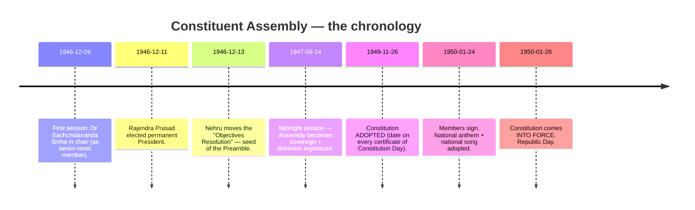
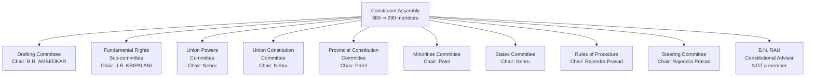
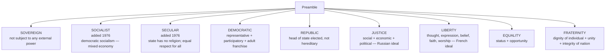
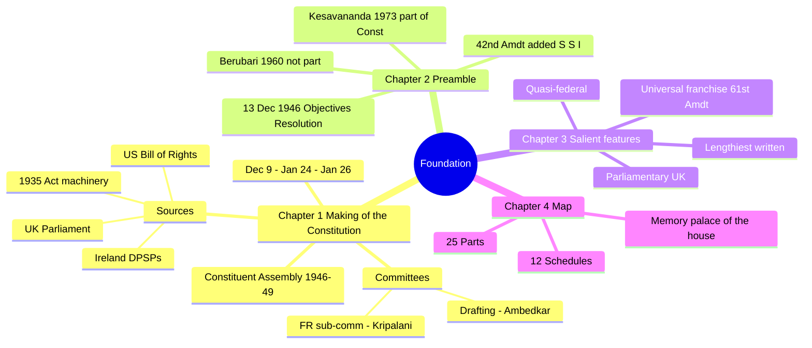
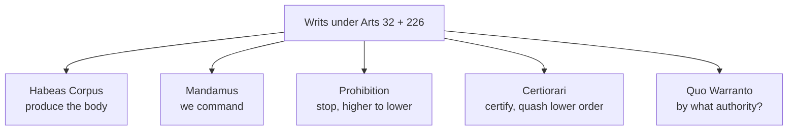
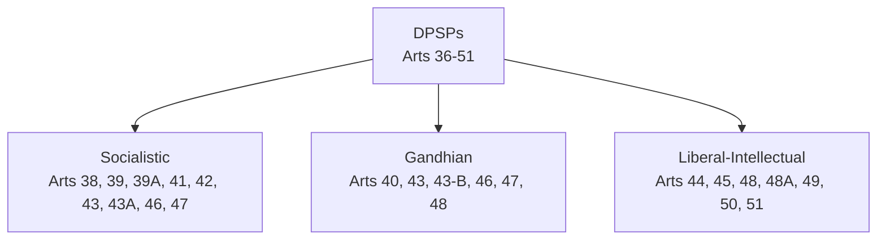
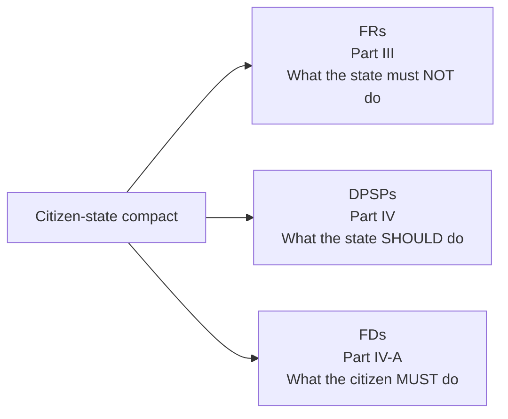
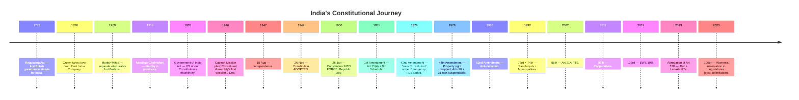

# EXAMINER BLUEPRINT — What Gets Tested Most

Polity is a high-yield subject. In SSC CGL, CHSL, and RRB exams, Polity gives you 5–10 questions per paper. In IBPS PO/Clerk and SBI PO papers, Polity is part of General Awareness and appears regularly. In state PSC exams, it can be 25–40 questions. Here is what examiners actually ask, in order of frequency.

**Top 7 exam hotspots (memorise these first)**

1. **Constitutional Articles by number** — "Which Article deals with X?" questions appear every paper. Art 32, 21, 21A, 19, 14, 17, 32, 226, 352, 356, 360, 368 are the most-asked.
2. **Constitutional Amendments with years** — 42nd (1976), 44th (1978), 52nd (1985), 73rd/74th (1992), 86th (2002), 103rd (2019), 106th (2023). Know year + what changed.
3. **Constitutional vs Statutory vs Executive bodies** — A guaranteed 1–2 marks in every exam. Election Commission = constitutional; NHRC = statutory; NITI Aayog = executive.
4. **The 5 Writs** — Habeas Corpus, Mandamus, Prohibition, Certiorari, Quo Warranto. Know what each means and which courts can issue them.
5. **12 Schedules** — What each contains, which Amendment added Schedules 9–12.
6. **Landmark cases** — Kesavananda Bharati (1973), Maneka Gandhi (1978), Indra Sawhney (1992), Puttaswamy (2017), Kesavananda (basic structure). Know case + what it decided.
7. **Current officeholders** — President, Vice-President, CJI, CAG, CEC, Lokpal Chair. These are asked every session.

**Study priority order** — if your exam is 2 weeks away, study in this sequence:

1. Articles (the "which article" question = guaranteed marks)
2. Amendments + years (5 marks minimum every paper)
3. Constitutional vs Statutory bodies table
4. The 5 Writs + which court issues which
5. 12 Schedules + what changed when
6. Emergency provisions — 3 types, 3 Articles (352 / 356 / 360)
7. Landmark cases — 6 most important
8. Parliamentary procedures (Money Bill, Zero Hour, Question Hour)
9. Centre-State relations (7th Schedule + 3 Lists)
10. Current officeholders (check the "What's New" table at top)

---

# What's New This Year (Polity)

> Items below CHANGE — re-check before any exam if your prep is later than Q3 2026. The rest of this book (Articles, Schedules, Amendments dates, landmark cases, historical PMs/Presidents) is **static and stable** — does not need re-verification.

| Item | Current value (verify before your exam) |
|---|---|
| **Chief Justice of India** | Surya Kant (53rd CJI, since 24 Nov 2025; term till 9 Feb 2027) |
| **Vice-President** | C.P. Radhakrishnan (15th VP, since 12 Sep 2025) |
| **President** | Droupadi Murmu (15th President, since 25 Jul 2022; term till 24 Jul 2027) |
| **Prime Minister** | Narendra Modi (3rd term, NDA-3.0, since 9 Jun 2024) |
| **Lok Sabha Speaker** | Om Birla (17th + 18th LS Speaker) |
| **Lokpal Chairperson** | Justice A.M. Khanwilkar (2nd Lokpal Chairperson) |
| **CAG** | K. Sanjay Murthy (15th CAG, since 21 Nov 2024; 6-yr term or till age 65) |
| **CEC** | Verify with Election Commission website near your exam date |
| **Constitutional Amendments — total** | 106 (latest = 106th, Women Reservation in LS + State assemblies, 28 Dec 2023) |
| **Acts of Parliament 2024-25** | 16 Acts in 2024 + 39 Acts in 2025 (Waqf Amendment Act, Jan Vishwas Act, etc.) |

---

# How To Use This Book

Polity rewards students who understand the logic of the Constitution, not just its numbers. This book is written for first-time readers and experienced aspirants alike. Here is how to get the most from it.

**Read actively, not passively.** When you encounter an Article number, say it aloud. When you read a landmark case, try to recall what it changed. When you hit an "Exam hooks" section, test yourself before reading the answers. Passive reading feels productive but scores zero marks.

**Story first, facts second.** Every chapter opens with the context — why this Article was written, what crisis triggered it, which debate shaped it. Once you understand the *why*, the facts stick on their own. Constitutions are not written in vacuum; they are written by frightened, brilliant, exhausted people under extraordinary pressure. This book tries to show you those people.

**Use the memory aids.** The mnemonics, the house-walk palaces, the "FEAR-CC" acronyms — these look silly on paper and work beautifully in the exam hall. Use them.

**The "Quick-recall" sections** at the end of each chapter are the most important pages. After reading a chapter, close the book and try to answer those points cold. If you can't, re-read just the section you struggled with. One pass through the material is reading; your exam performance depends on what you can *recall under pressure*.

**How long this takes:** A focused aspirant covering this book end-to-end takes about 15–18 hours. Three quick revision sweeps (one per week in the weeks before the exam) take another 6 hours. That is 24 hours total for a subject that can deliver 25–40 marks in any PSC exam or 5–10 marks in SSC/Banking exams. The return on investment is exceptional.

> **The one rule of this book:** if you are reading a page and thinking "I'll come back to memorise this later" — stop. Come back to it now. There is no later in exam prep. Do it once, do it right.

---

# Part A — The Foundation

The first four chapters give you the **mental map of the Constitution**. Once
this map is in your head, every later chapter lands in a pre-allocated slot.
Without it, you're memorising the street names of a city whose layout you've
never seen.

---

## Chapter 1 — The Story of How India Got Its Constitution

### 1.1 The hook — why we even needed one

> Imagine you're 32 years old in 1946. Your country has been promised
> independence. Two weeks earlier, the Muslim League's **Direct Action Day**
> (16 August 1946) turned Kolkata into 5 days of communal slaughter. The
> British are drafting an exit plan. You are one of **389** people (later
> 299) chosen to write the rule book that **1.4 billion** people 77 years
> later will still be arguing over. What do you do?

That is the problem the Constituent Assembly walked in with. Understand the
scale of that problem and the Constitution's length, complexity + compromises
stop looking strange.

### 1.2 The pre-story — constitutional milestones before 1946

A quick highlight-reel. Each of these is a PYQ on its own, so memorise the
one-liner. Many are covered again in Chapter 3 + 13.

| Year | Act / Event | One-line importance |
|------|-------------|---------------------|
| 1773 | **Regulating Act** | First British law governing India. Created the office of Governor-General of Bengal (Warren Hastings was the first). |
| 1784 | **Pitt's India Act** | Board of Control + Court of Directors — dual govt. |
| 1813 | Charter Act | Ended East India Company's trade monopoly (except tea + China). |
| 1833 | Charter Act | **Lord William Bentinck becomes the first Governor-General of India** (not just Bengal). |
| 1853 | Charter Act | Open ICS competitive exam. |
| 1858 | **Government of India Act** | Company rule ends; Crown takes over. Queen's Proclamation. |
| 1861 | Indian Councils Act | Portfolio system + Indians in legislatures (nominated). |
| 1892 | Indian Councils Act | Cautious expansion of council membership. |
| 1909 | **Morley–Minto Reforms** | Introduced **separate electorates** for Muslims — sowed the seed of Partition. |
| 1919 | **Montagu–Chelmsford (GoI Act 1919)** | Introduced **diarchy** in provinces. |
| 1935 | **Government of India Act 1935** | Longest British statute on India; provincial autonomy; Federal Court; ~2/3 of our Constitution's structural ideas borrowed from here. |
| 1940 | **August Offer** | British concede an Indian-drafted Constitution in principle. |
| 1942 | **Cripps Mission** | Dominion status post-war — rejected. |
| 1946 | **Cabinet Mission Plan** | Proposed three-tier federation + a Constituent Assembly; partition avoided by a hair but rejected by League eventually. |

**Quick test:** Before reading further, try to name three pre-1946 Acts that shaped the 1950 Constitution and one thing each gave us. If you cannot name even two, go back and re-read the table above.

### 1.3 The Constituent Assembly — the 4 key dates

**Memorise 26 NOV 1949 + 26 JAN 1950** as the two dates. **Why the 2-month gap?**
Because the Assembly wanted the "commencement" to fall on the **same date**
Congress had declared Purna Swaraj in 1930 — 26 January — which gave the date
emotional weight + made the Republic feel born of the freedom struggle, not
gifted by Britain.

### 1.4 Who drafted what — the key committees

**Memory peg — "PRANA DB"** for the pillars of the process:
**P**resident Rajendra Prasad (chair of CA + Rules + Steering),
**R**au, B.N. — adviser who produced the first draft,
**A**mbedkar — chair of Drafting Committee,
**N**ehru — chaired Union-side committees,
**A**ll-committees-Patel for Minorities + Provinces,
**D**rafting committee had **7 members**,
**B**. N. Rau's draft → Ambedkar polished → the Constitution we have.

**The 7 Drafting Committee members** (the one list you *must* know by heart):

1. **Dr. B.R. Ambedkar** (Chair)
2. **N. Gopalaswami Ayyangar**
3. **Alladi Krishnaswamy Ayyar**
4. **Dr. K.M. Munshi**
5. **Syed Mohammad Saadullah**
6. **N. Madhava Rao** (replaced B.L. Mitter who resigned on health)
7. **T.T. Krishnamachari** (replaced D.P. Khaitan, who died 1948)

**Mnemonic — "A-A-A-M-S-M-K"** or say it as a rhythm:
*"Ambedkar, Ayyangar, Ayyar, Munshi, Saadullah, Madhava Rao, Krishnamachari."*

**Memorise these Constituent Assembly facts cold** — they appear in almost every exam

- First session: **9 December 1946** | Constitution adopted: **26 November 1949** | Into force: **26 January 1950**
- Temporary chair of CA: **Dr. Sachchidananda Sinha** | Permanent President: **Dr. Rajendra Prasad**
- Objectives Resolution moved by: **Jawaharlal Nehru** on **13 December 1946**
- Constitutional Adviser (not a member): **B.N. Rau**
- Drafting Committee chair: **Dr. B.R. Ambedkar** | 7 members total
- Calligrapher of the Constitution: **Prem Behari Narain Raizada** | Illustrator: **Nandalal Bose**

### 1.5 How long did it take?

**2 years, 11 months, 18 days.** Eleven sessions. **165 days of actual sitting.**
**141 days** just on debating + voting.
Consumed paper: **64 lakh rupees** at the cost of the time. Handwritten by
**Prem Behari Narain Raizada** (calligrapher, Delhi). Illustrated + illuminated
by **Nandalal Bose + his team** of Shantiniketan artists. The original
hand-written volumes are preserved in **helium-filled cases** in the
Parliament Library.

### 1.6 Sources of the Constitution — the "borrowed" critique

Critics (KT Shah, HV Kamath) called the Constitution a "borrowed bag". Our
response: it's a *cosmopolitan* Constitution that synthesised the best of
several systems and adapted them. What comes from where:

| Borrowed from                  | What we took                                                                 |
|--------------------------------|------------------------------------------------------------------------------|
| **UK**                         | Parliamentary system, cabinet system, rule of law, single citizenship, writs. |
| **USA**                        | Written Constitution, Preamble, Fundamental Rights, judicial review, impeachment of President + SC judges, VP. |
| **Ireland**                    | Directive Principles, nomination to RS, method of Presidential election.     |
| **Canada**                     | Quasi-federal structure (strong centre), residuary powers with centre, appointment of state Governors, SC advisory jurisdiction. |
| **Australia**                  | Concurrent List, freedom of trade + commerce + intercourse (Art 301), joint sitting of Parliament. |
| **Germany (Weimar)**           | Emergency Provisions + suspension of FRs during Emergency. |
| **Soviet Union (USSR)**        | Fundamental Duties, ideals of justice in the Preamble (social, economic, political). |
| **France**                     | Republic, ideals of liberty + equality + fraternity. |
| **South Africa**               | Procedure for amending the Constitution, election of RS members. |
| **Japan**                      | "Procedure established by law" (Art 21). |
| **Government of India Act 1935** | **Around 2/3 of the Constitution's structural clauses** — Federal scheme, public service commissions, Emergency provisions, administrative details, role of Governors. |

**Quick-recall: Sources of the Constitution**

UK gave the how-government-runs (parliamentary system, cabinet, writs, single citizenship). USA gave the citizen's shield (FRs, judicial review, written Constitution). Ireland gave the promises (DPSPs, RS nomination, Presidential election). Canada gave the glue to the centre (quasi-federal, residuary powers with Centre). Germany gave the emergency brakes (suspension of FRs during Emergency). USSR gave duties and ideals (FDs, social/economic/political justice in Preamble). The 1935 Government of India Act gave the machinery — nearly two-thirds of the entire constitutional structure.

### 1.7 How the Objectives Resolution became the Preamble

On **13 December 1946**, Nehru moved the **Objectives Resolution**. It
declared India a "sovereign democratic republic" committed to "justice,
social, economic + political; equality of status, of opportunity, + before
the law; freedom of thought, expression, belief, faith, worship, vocation,
association + action." The Resolution was **adopted 22 January 1947**. In
slightly polished form, it became the **Preamble**. Recognise these phrases
— they are on every page of the Constitution's spirit, and they are on every
answer sheet in mains.

### 1.8 Exam hooks for Chapter 1

- Dates to memorise **verbatim**: 9 Dec 1946, 11 Dec 1946, 13 Dec 1946,
  26 Nov 1949, 24 Jan 1950, 26 Jan 1950.
- Name Chairs of the major committees (see the tree above).
- Name all 7 Drafting Committee members.
- Which **one** country gave us which **one** feature — matching Qs are
  common (see Sources table).
- How long did it take to frame (2y 11m 18d) + how much did it cost (₹64 L).
- Who signed first? Rajendra Prasad. Who gave the first copy? The
  calligrapher Prem Behari Narain Raizada; illustrations by Nandalal Bose.

**Quick test:** Close the book and name: (a) the chair of the Drafting Committee, (b) the Constitutional Adviser, (c) the first chair of the Constituent Assembly, (d) the date the Constitution was adopted, (e) the date it came into force. Write the answers, then check. If you missed any, re-read §1.3 above.

---

## Chapter 2 — The Preamble

### 2.1 Why spend a chapter on 85 words?

Because **every** word is freighted, every word has been judicially analysed,
and almost every clause has been amended at least once. The Preamble:

1. Declares the **source of authority** — "We, the People of India".
2. Declares the **type of state** — "Sovereign Socialist Secular Democratic Republic".
3. Declares the **goals** — Justice, Liberty, Equality, Fraternity.
4. Declares the **date** — "adopted, enacted, and given to ourselves this 26th day of November, 1949".

### 2.2 The text (memorise it)

> **WE, THE PEOPLE OF INDIA**, having solemnly resolved to constitute India
> into a **SOVEREIGN SOCIALIST SECULAR DEMOCRATIC REPUBLIC** and to secure to
> all its citizens:
>
> **JUSTICE**, social, economic and political;
> **LIBERTY** of thought, expression, belief, faith and worship;
> **EQUALITY** of status and of opportunity;
> and to promote among them all
> **FRATERNITY** assuring the dignity of the individual and the unity and
> integrity of the Nation;
>
> **IN OUR CONSTITUENT ASSEMBLY this twenty-sixth day of November, 1949**, do
> hereby adopt, enact and give to ourselves this Constitution.

Three words to flag: **SOCIALIST**, **SECULAR**, **INTEGRITY**. None of
these were in the original 1950 text. All three were **added by the
42nd Amendment, 1976** during the Emergency. Mnemonic: *"Indira inserted
SSI"* (Socialist, Secular, Integrity). We return to this in Chapter 28.

**Common trap — three words NOT in the original Preamble:** SOCIALIST, SECULAR, INTEGRITY. All three were added by the **42nd Amendment, 1976** under Indira Gandhi's Emergency government. Examiners regularly ask which words were added and when. Mnemonic: *"Indira inserted SSI."*

### 2.3 Keywords — nested meanings

### 2.4 Is the Preamble part of the Constitution?

This is a **favourite PYQ**.

- *Berubari Union (1960)* — SC held the Preamble is a key to the mind of the
  framers but **NOT part of the Constitution**.
- *Kesavananda Bharati (1973)* — 13-judge bench overruled Berubari on this
  point. Preamble IS **part of the Constitution** and can be amended, but
  the amendment cannot destroy the **basic features** reflected in the
  Preamble.
- *LIC of India v. Consumer Education and Research Centre (1995)* — again
  confirmed Preamble as part of the Constitution.

So today: **Yes, part. Yes, amendable. No, cannot destroy basic structure.**

### 2.5 Justice — Liberty — Equality — Fraternity, in that order

**Why this order?** Dr Ambedkar, in his famous closing speech (25 Nov 1949):

> *"The principles of liberty, equality and fraternity are not to be treated
> as separate items in a trinity. They form a union of trinity in the sense
> that to divorce one from the other is to defeat the very purpose of
> democracy."*

You'll see this quote quoted back at you in mains essays; it's that useful.

### 2.6 Exam hooks

- Three words inserted by the **42nd Amendment (1976)**: Socialist, Secular,
  Integrity.
- *Kesavananda (1973)* — Preamble is part of the Constitution.
- *Berubari (1960)* — earlier, said it was NOT part. (Don't mix these two.)
- French Revolution gave us Liberty, Equality, Fraternity.
- USSR gave us "Justice — social, economic, political."
- The Preamble was moved as the Objectives Resolution on **13 Dec 1946** by
  **Nehru**; adopted **22 Jan 1947**.

**Quick-recall: The Preamble**

We the people of a sovereign, socialist, secular, democratic republic promise ourselves justice (from USSR ideals), liberty (French), equality (French), and fraternity (French). Adopted 26 Nov 1949. Part of the Constitution after Kesavananda 1973 — amendable, but never in ways that destroy its basic spirit.

Three words added by 42nd Amendment 1976: **Socialist, Secular, Integrity.** Two cases on whether the Preamble is part of the Constitution: *Berubari (1960)* said No; *Kesavananda (1973)* said Yes.

---

## Chapter 3 — Salient Features of the Indian Constitution

A catalogue of the **defining characteristics**. Memorise them as a mental
list — examiners love a straight 5-or-6 point "Describe salient features"
question.

### 3.1 The thirteen salient features

1. **Lengthiest written constitution in the world**. Original 1950 text had
   **395 Articles in 22 Parts + 8 Schedules**. Today (with amendments and
   re-numberings): **~448 Articles across 25 Parts + 12 Schedules**. Why so
   long? Three reasons: (a) one Constitution for 28 states + 8 UTs of widely
   varying sizes, (b) the Government of India Act 1935 was itself gigantic
   and we absorbed its machinery, (c) detailed safeguards for minorities,
   SCs, STs + tribal areas.
2. **Drawn from various sources** (Chapter 1 §1.6 — don't repeat the list here).
3. **Blend of rigidity + flexibility**. Some provisions amendable by simple
   majority (e.g., creating a new state, Part I), some by special majority
   (most of Part III + IV), some by special majority **plus** ratification
   by at least half the states (federal matters — Chapter 28).
4. **Federal structure with unitary bias**. Federation in form — strong unitary
   features (single constitution, single citizenship, flexible boundaries,
   emergency provisions). Granville Austin: *"cooperative federalism"*.
   K.C. Wheare: *"quasi-federal"*.
5. **Parliamentary form of government** (UK model — Westminster system). Not
   Presidential (US). Real power in the Prime Minister; nominal in President.
   See Chapter 12.
6. **Integrated + independent judiciary**. One Supreme Court at the top, one
   structure of High Courts and subordinate courts below — no separate state
   supreme courts (unlike USA). Independence via Art 50, tenure, salaries
   charged on Consolidated Fund, removal only by impeachment.
7. **Fundamental Rights** — Chapter 6.
8. **Directive Principles of State Policy** — Chapter 7.
9. **Fundamental Duties** — Chapter 8 (added by 42nd Amendment).
10. **Indian Secularism** — positive, not wall-of-separation. State treats
    all religions equally (sarva dharma sama bhava) + can intervene for
    reform (abolishing untouchability, banning triple talaq).
11. **Universal adult franchise** — every citizen ≥ 18 years votes. Voting
    age lowered from 21 to 18 by the **61st Amendment, 1988** (Rajiv
    Gandhi).
12. **Single citizenship**. Unlike USA (federal + state) or Switzerland, India
    has **one** citizenship — Indian. Regardless of your state, your rights
    are the same.
13. **Emergency provisions** (Arts 352 / 356 / 360 — Chapter 27).

**Mnemonic — "LOUD FRIENDS-PIES"**:
**L**engthy, **O**rigin-mixed, **U**nique blend of rigidity + flexibility,
**D**ual federal/unitary, **F**undamental rights + duties, **R**ule of law,
**I**ndependent judiciary, **E**mergency, **N**ominal head, **D**irective
principles, **S**ecular, **P**arliamentary, **I**ndependent election
commission, **E**nfranchisement universal, **S**ingle citizenship.

**Quick-recall: Indian Constitution in 90 seconds**

The lengthiest written constitution in the world. One country across 28 states with one citizenship. A strong centre that can still be federal. A Westminster prime-minister-led parliament with a nominal president. Six enforceable rights and eleven non-enforceable but binding duties, plus a long list of guiding promises called the DPSPs. Independent judiciary, independent election commission, universal adult franchise, declared secular and socialist since 1976, and three emergency brakes if the state comes apart (Art 352, 356, 360).

### 3.2 Exam hooks

- Original vs today counts: Articles 395 → ~448; Schedules 8 → 12.
- **61st Amendment** lowered voting age to 18.
- Federal vs unitary — Granville Austin called it **cooperative federalism**;
  K.C. Wheare called it **quasi-federal**.
- Parliamentary system borrowed from **UK**; single citizenship also UK.

**Quick test:** List any seven salient features from memory. Then try them in reverse order — this is harder and forces deeper recall. If you get fewer than five, re-read §3.1.

---

## Chapter 4 — The Schedules + the Parts (the map of the Constitution)

Think of the Constitution as a **big house**. Parts are the rooms. Schedules
are the **cupboards in those rooms** where details live.

### 4.1 The 12 Schedules — the one cheat-sheet

| # | Schedule | Contents + what to remember |
|---|----------|------------------------------|
| 1 | First | List of **States + UTs** + their territories. Changes with every reorganisation (J&K, Telangana, etc.). |
| 2 | Second | **Salaries + emoluments** of the President, Vice-President, Governors, SC + HC judges, CAG, Speaker, etc. Charged on the Consolidated Fund. |
| 3 | Third | **Forms of oaths + affirmations** — for the President, Ministers, MPs, MLAs, SC/HC judges, CAG. |
| 4 | Fourth | **Allocation of RS seats** to states and UTs. |
| 5 | Fifth | **Administration + control of Scheduled Areas + Scheduled Tribes** (except in 6th Schedule states). 10 states — **PESA, 1996** extends Panchayati Raj here. |
| 6 | Sixth | **Administration of Tribal Areas in Assam, Meghalaya, Tripura + Mizoram** — Autonomous District Councils. |
| 7 | Seventh | **Union List (97 → 100+), State List (66 → 61), Concurrent List (47 → 52)**. Division of subjects between Centre + States. |
| 8 | Eighth | **Languages** — originally 14, now **22**. |
| 9 | Ninth | Added by **1st Amendment, 1951** — a protective list of land-reform laws + agrarian reform laws that could not be challenged in court for violating FRs. *I.R. Coelho v. State of TN (2007)* — post-24 April 1973 additions ARE open to judicial review if they violate basic structure. |
| 10 | Tenth | Added by **52nd Amendment, 1985** — **Anti-Defection Law**. Modified by 91st (2003). |
| 11 | Eleventh | Added by **73rd Amendment, 1992** — **29 subjects for Panchayats** (agriculture, land reforms, minor irrigation, etc.). |
| 12 | Twelfth | Added by **74th Amendment, 1992** — **18 subjects for Municipalities** (urban planning, fire services, slum improvement, etc.). |

#### Memory palace — putting Schedules in a house

Walk through **your home** and place one Schedule per room:

1. **Gate** → Schedule 1 (States + UTs — the *boundaries* of the nation, like a gate).
2. **ATM near gate** → Schedule 2 (Salaries).
3. **Temple in courtyard** → Schedule 3 (Oaths — you *swear* before God).
4. **Living-room sofa** → Schedule 4 (RS seat allocation — a *seated* council).
5. **Study room** → Schedule 5 (Scheduled Areas + STs).
6. **Backyard tree** → Schedule 6 (Tribal Areas of NE — trees = forests).
7. **Kitchen** → Schedule 7 (three Lists — Union, State, Concurrent — the three *burners*).
8. **Library shelf** → Schedule 8 (Languages).
9. **Locked cupboard** → Schedule 9 (protected laws — locked away from courts).
10. **TV remote** → Schedule 10 (Anti-defection — remote-controls MP behaviour).
11. **Balcony (village view)** → Schedule 11 (Panchayats — village powers).
12. **Rooftop (city view)** → Schedule 12 (Municipalities — urban powers).

Walk through this palace **three times** (morning, noon, night) for 3 days
and the 12 Schedules + their dates + their additions become permanent.

### 4.2 The 25 Parts — the building's skeleton

```mermaid
graph TD
    C[Constitution<br/>~448 Articles, 25 Parts, 12 Schedules]
    C --> P1[Part I<br/>Union + its territory<br/>Arts 1–4]
    C --> P2[Part II<br/>Citizenship<br/>Arts 5–11]
    C --> P3[Part III<br/>FRs<br/>Arts 12–35]
    C --> P4[Part IV<br/>DPSPs<br/>Arts 36–51]
    C --> P4A[Part IV-A<br/>FDs<br/>Art 51-A]
    C --> P5[Part V<br/>The Union<br/>Arts 52–151]
    C --> P6[Part VI<br/>The States<br/>Arts 152–237]
    C --> P8[Part VIII<br/>Union Territories<br/>Arts 239–242]
    C --> P9[Part IX<br/>Panchayats<br/>Arts 243–243-O]
    C --> P9A[Part IX-A<br/>Municipalities<br/>Arts 243-P–243-ZG]
    C --> P9B[Part IX-B<br/>Cooperatives<br/>Arts 243-ZH–243-ZT]
    C --> P11[Part XI<br/>Centre-State rel.<br/>Arts 245–263]
    C --> P12[Part XII<br/>Finance + Property<br/>Arts 264–300-A]
    C --> P14A[Part XIV-A<br/>Tribunals<br/>Arts 323-A + B]
    C --> P17[Part XVII<br/>Official Language<br/>Arts 343–351]
    C --> P18[Part XVIII<br/>Emergency<br/>Arts 352–360]
    C --> P20[Part XX<br/>Amendment<br/>Art 368]
    C --> P21[Part XXI<br/>Special Provisions<br/>Arts 369–392]
    C --> P22[Part XXII<br/>Short title + commencement<br/>Arts 393–395]
```

Not every Part gets its own chapter; some (VII, X, XIII, XV, XVI, XIX) are
minor or repealed. The Parts you will actually meet in this book are those on
the tree above.

### 4.3 Exam hooks

- Schedule 1 = States + UTs (changes often).
- Schedule 6 = **NE tribal areas** (Assam, Meghalaya, Tripura, Mizoram — memorise the 4).
- Schedule 7 = three Lists. **Union 100, State 61, Concurrent 52** (updated counts).
- Schedule 8 = **22 languages**. Added by: Sindhi (1967, 21st Amdt); Konkani,
  Manipuri, Nepali (1992, 71st); Bodo, Dogri, Maithili, Santhali (2003, 92nd).
- Schedule 9 = 1st Amendment 1951; judicial-review-proof only till 24-Apr-1973
  (I.R. Coelho, 2007).
- Schedule 10 = 52nd Amendment 1985 (Rajiv Gandhi); tightened 91st Amdt 2003.
- Schedules 11 + 12 = 73rd + 74th Amendments, 1992.

**Quick test:** Name all 12 Schedules using the house-walk mnemonic. If you miss one, repeat from the gate — do not cheat by looking back. Three clean runs through the palace and these 12 entries are yours permanently.

---

### Part A — Mind map (one-page revision)

Mark this page. Before every revision session, read this map for 90 seconds — it gives you the complete Part A structure at a glance.

---

# Part B — The Citizen-State Compact

You now know how the Constitution was written + how it's laid out. Part B
is about the **deal** between citizen and state: who counts as Indian, what
they can demand from the state, and what the state asks back.

---

## Chapter 5 — Citizenship (Part II, Articles 5–11)

### 5.1 Hook — the Partition problem

On 15 August 1947, **15 million people were on the wrong side of a new line**.
Hindus + Sikhs fleeing East to West; Muslims fleeing West to East. The
Constituent Assembly had to answer one question fast: *"Who, among all these
people and their descendants, is an Indian citizen?"*

The answer lived in Articles 5 to 11 — deliberately short. Parliament was
instructed to fill in details by statute. It did so through the
**Citizenship Act, 1955**, which we'll unpack.

### 5.2 Articles 5 – 11 — a one-line gist of each

| Article | What it does |
|---------|--------------|
| 5 | Citizens at the **commencement** (26 Jan 1950) — domicile-based rule. |
| 6 | Citizenship of persons who **migrated from Pakistan to India**. |
| 7 | Citizenship of persons who **migrated from India to Pakistan** then returned. |
| 8 | Citizenship of **Persons of Indian Origin** residing abroad. |
| 9 | **Voluntarily acquiring citizenship of a foreign state = loss of Indian citizenship**. |
| 10 | Every citizen continues as such subject to Parliament's laws. |
| 11 | **Parliament's power to regulate citizenship** by law. (Basis of the 1955 Act.) |

### 5.3 The Citizenship Act, 1955 — five gateways in + three exits

**Five ways to BECOME a citizen:**

1. **By birth** (Sec 3).
   - Born in India on or after 26 Jan 1950 and before 1 July 1987 — automatically citizen.
   - Born 1 July 1987 – 2 Dec 2004 — citizen if at least one parent was
     citizen at the time of birth.
   - Born on or after 3 Dec 2004 — citizen **only if BOTH parents are
     citizens**, or one is citizen + the other is not an illegal migrant.
2. **By descent** (Sec 4) — born outside India after 26 Jan 1950 to parents
   (earlier father only) who are Indian citizens; registration at Indian
   consulate within prescribed time.
3. **By registration** (Sec 5) — persons of Indian origin, spouses of
   citizens, minor children of citizens, OCIs of 5 years' registration, etc.
4. **By naturalisation** (Sec 6) — foreigner of full age + 12 years'
   residence (lowered to 6 years under the CAA 2019 for specific groups) +
   good character + adequate knowledge of a scheduled language + willingness
   to renounce previous citizenship + take the oath.
5. **By incorporation of territory** (Sec 7) — when new territory joins India
   (e.g., Sikkim, Pondicherry after their mergers).

**Three ways to LOSE citizenship** (Sec 8–10):

1. **Renunciation** — voluntary declaration.
2. **Termination** — auto, if you acquire another country's citizenship.
3. **Deprivation** — by government, on grounds of fraud, disloyalty, trading
   with enemy, sentence of ≥ 2 years within 5 years of naturalisation, etc.

### 5.4 CAA 2019 — what actually changed

The **Citizenship Amendment Act, 2019** (effective when Rules were notified,
11 March 2024) gave a **fast-track path to citizenship by naturalisation**
(from 12 → **6 years** residence) for **non-Muslim migrants** from **3
countries** (Pakistan, Afghanistan, Bangladesh) belonging to **6 religions**
(Hindu, Sikh, Buddhist, Jain, Parsi, Christian), who entered India **on or
before 31 December 2014** fleeing religious persecution.

Key fact: CAA does **not** take any Indian citizen's rights away. It only
*adds* a path. Its political controversy is about the **exclusion of Muslims**
from the eligible religions. Court challenges are pending in the SC.

Pair the CAA with two other acronyms that come up together:
- **NRC (National Register of Citizens)** — currently only for Assam; created
  under the 1955 Act; Assam NRC's final list was published Aug 2019 and
  excluded 19 lakh persons; contested.
- **NPR (National Population Register)** — a register of **usual residents**,
  not citizens — maintained under the Citizenship Rules 2003.

### 5.5 OCI + PIO — the twin cards

- **PIO (Person of Indian Origin) card** — launched 1999 for diaspora.
  **Merged into OCI in 2015** (no fresh PIO cards issued).
- **OCI (Overseas Citizen of India)** — introduced by the **Citizenship
  (Amendment) Act, 2003**. NOT a dual citizenship. OCIs don't get: voting
  right, Indian passport, govt jobs, agricultural land, election to
  Parliament/Assemblies, appointment to constitutional offices.
  But they get: lifelong visa-free travel, parity with NRIs on economic,
  financial + educational matters.

**Quick-recall: Citizenship**

Indian citizenship is single and regulated by Parliament under Article 11. Five ways in — birth, descent, registration, naturalisation, incorporation of territory — all in the Citizenship Act 1955. Three ways out — renunciation, termination, deprivation. Overseas Indians can be OCIs but never dual citizens. The CAA 2019 shortens the naturalisation clock from 12 to 6 years for persecuted non-Muslim migrants from Pakistan, Afghanistan, and Bangladesh who entered India before 31 December 2014.

### 5.6 Exam hooks

- Parts covered: Part II, Arts 5–11.
- **Article 11** = Parliament's power over citizenship.
- **Citizenship Act, 1955** = the actual statute.
- CAA 2019 + Rules 2024 — 3 countries + 6 religions + cut-off 31 Dec 2014.
- OCI is **not** dual citizenship.
- Born 3 Dec 2004 onward → both parents test.

**Quick test:** Name the 5 ways to acquire Indian citizenship and the 3 ways to lose it. Then answer: is an OCI a dual citizen? (No. OCI gives visa-free travel and NRI parity, but not voting rights, passport, or constitutional offices.)

---

## Chapter 6 — Fundamental Rights (Articles 12–35)

> Where the citizen puts on armour against the state.

### 6.1 The deal, in one sentence

The Constituent Assembly had a choice. The United Kingdom gave citizens no
written list of rights — they trusted Parliament + the common law. The United
States wrote 10 of them into the Bill of Rights. India, coming out of
colonial abuse + caste discrimination + communal partition, chose the
American path — with extra teeth + extra restrictions.

**Exam weight** — roughly 1 in every 4 Polity questions across SSC / RRB / PO
/ Banking / State-PSC references either the Articles, the landmark cases, or
post-independence amendments on FRs. UPSC GS-2 essays are frequently built
around FRs + DPSP harmonisation. **Get this chapter to 100%.**

### 6.2 Origin + philosophy

- Drew largely from the **US Bill of Rights (1791)** — written, justiciable,
  binding on the state. Indian framers went further:
  - Indian FRs are **not absolute** — packaged with **reasonable restrictions**
    (Arts 19(2)–(6)), so Parliament can limit rights for public order,
    morality, sovereignty, etc.
  - Explicit written rights because (a) partition-era communal violence
    demanded clear minority protection, (b) caste society needed enforceable
    equality, (c) colonial state trampled liberties without remedy.
- **Objectives Resolution (13 Dec 1946)** → flowed into Part III.

**Drafting committee chairs that shaped FRs:**

- **Advisory Committee on FRs + Minorities + Tribal Areas** — chaired by
  **Sardar Patel**.
- **Sub-committee on FRs** — chaired by **J.B. Kripalani** (most of the wording).
- **Drafting Committee** — chaired by **Dr. B.R. Ambedkar**.
- **Sapru Committee (1945)** had earlier recommended justiciable FRs.

### 6.3 Originally 7 → now 6

At adoption (26 Jan 1950), Part III guaranteed **7 FRs**:

1. Right to Equality
2. Right to Freedom
3. Right against Exploitation
4. Right to Freedom of Religion
5. Cultural + Educational Rights
6. **Right to Property** ← removed
7. Right to Constitutional Remedies

**FEAR-CC** = the 6 Fundamental Rights: **F**reedom (Arts 19–22) · **E**quality (14–18) · **A**gainst exploitation (23–24) · **R**eligion freedom (25–28) · **C**ultural/Educational (29–30) · **C**onstitutional Remedies (32)

Originally 7 FRs. Right to Property (FR #6) was removed by the **44th Amendment, 1978** under Morarji Desai's government and moved to Art 300A as a legal right.

**44th Amendment (1978)**, Morarji Desai's Janata govt, **deleted Right to
Property** (from Arts 19(1)(f) + 31). Today property is a **legal** right,
Art 300A. Why: Indira-era land-reform laws kept being struck down on
"right to property" grounds; moving it out unblocked redistribution.

**Mnemonic — "FEAR-CC"** for the 6 FRs:
**F**reedom (Arts 19–22), **E**quality (14–18), **A**gainst exploitation
(23–24), **R**eligion freedom (25–28), **C**ultural/educational (29–30),
**C**onstitutional remedies (32).

### 6.4 Article 12 — "The State"

FRs bind the **State**, so we need a precise definition. Art 12:

> *"The State" includes — (a) Government + Parliament of India; (b)
> Government + Legislature of each State; (c) all local or other authorities
> within the territory of India; (d) under the control of the Government of
> India.*

**"Other authorities"** — the litigated phrase. Expanded progressively by SC:

- *Rajasthan Electricity Board (1967)* — statutory bodies count.
- *Sukhdev Singh v. Bhagatram (1975)* — ONGC, LIC, IFCI = "State".
- *R.D. Shetty v. IAAI (1979)* — 6-point test by Bhagwati J.
- *Ajay Hasia v. Khalid Mujib (1981)* — RECs (societies under Societies Act) = "State".
- *Pradeep Kumar Biswas v. IICB (2002)*, 7-judge bench — **consolidated test**:
  entity is "State" if **"financially, functionally and administratively
  dominated by or under the control of the Government"**.
- *Zee Telefilms v. UoI (2005)* — held BCCI is **not** "State" (controversial).

**Judiciary as "State"?** SC in *Naresh Shridhar Mirajkar (1967)* held
**judicial functions** are *not* "State" under Art 12 — but administrative
functions (staff recruitment, infrastructure) are. Can't get a writ to quash
a judgment on FR grounds — appeal instead.

#### Article 13 — the enforcement lever

- **Art 13(1)**: pre-Constitution laws inconsistent with FRs are **void**.
- **Art 13(2)**: post-Constitution laws inconsistent with FRs are **void**.
- **Art 13(3)(a)**: "Law" includes ordinances, orders, bye-laws, rules,
  regulations, notifications, customs or usages having force of law.
- **Art 13(4)**: **Constitutional amendments** are **NOT** law under Art 13 —
  inserted by **24th Amendment (1971)** in reaction to *Golaknath (1967)*.
  *Kesavananda (1973)* added the basic-structure limit.

**Three doctrines to memorise:**
- **Severability** — only offending part of a law struck down; rest survives.
  *A.K. Gopalan v. Madras (1950)*.
- **Eclipse** — pre-1950 laws inconsistent with FRs go into eclipse
  (unenforceable against citizens, enforceable against non-citizens). Revive
  if FR later amended. *Bhikaji Narain Dhakras (1955)*.
- **Waiver** — a citizen **cannot waive** a FR. *Basheshar Nath v. CIT (1959)*.

### 6.5 Right to Equality (Articles 14–18)

The single golden thread: the first cluster of Part III dismantles the
pre-1950 structures of **colonial privilege + caste hierarchy + gender
discrimination**.

#### Art 14 — Equality before law + equal protection of laws

Two phrases, two origins:
- **Equality before the law** — English common law (Dicey) — negative; no one above the law.
- **Equal protection of laws** — US 14th Amendment — positive; like treatment
  in like circumstances; state *must* classify people for welfare purposes.

**Reasonable classification test** — *State of W.B. v. Anwar Ali Sarkar (1952)*:
1. Classification must be founded on an **intelligible differentia**.
2. That differentia must have a **rational nexus** with the object of the law.

**Doctrine of Arbitrariness** — *E.P. Royappa v. TN (1974)* (Bhagwati J.):
*"Equality and arbitrariness are sworn enemies."* Expanded Art 14 from
classification to reasonableness everywhere.

**Applied in**: *Maneka Gandhi (1978)* — Art 21 widened; *Ajay Hasia (1981)*;
*Shayara Bano (2017)* — instant triple talaq struck.

**Exceptions under Art 361**: President + Governors immune from criminal
proceedings during term; MPs + MLAs immune for anything said/voted in House
(Arts 105 + 194); foreign diplomats (Vienna Convention + Diplomatic
Relations Act 1972); UN + agencies.

#### Art 15 — Prohibition of discrimination

- 15(1) — state shall not discriminate on **5 grounds**: **religion, race,
  caste, sex, place of birth**.
- 15(2) — access to public places (shops, hotels, tanks, restaurants, wells).
- 15(3) — special provisions for **women + children** (gender-positive).
- 15(4) — special provisions for **SEBCs + SCs + STs** — inserted by
  **1st Amendment (1951)** after *Champakam Dorairajan (1951)*.
- 15(5) — reservation in **private unaided educational institutions** except
  minority ones — inserted by **93rd Amendment (2005)**.
- 15(6) — **10% EWS reservation** — inserted by **103rd Amendment (2019)**.
  Upheld in *Janhit Abhiyan v. UoI (2022)* 3–2.

**Case anchors**:
- *Champakam Dorairajan (1951)* → triggered 1st Amendment.
- *Balaji v. State of Mysore (1963)* → **50% ceiling on reservation** first laid down.
- *Indra Sawhney (Mandal) (1992)* → 9-judge bench. 27% OBC upheld; 50% ceiling
  reaffirmed; **creamy layer** concept introduced.
- *M. Nagaraj (2006)* → SC/ST promotion reservation requires State to prove
  backwardness + inadequate representation + no compromise to administrative
  efficiency.
- *Janhit Abhiyan (2022)* → EWS upheld; broke the 50% ceiling for economic
  reservations.

#### Art 16 — Equality of opportunity in public employment

- 16(1) + 16(2) — no discrimination on the 5 grounds of Art 15 + also
  **descent + residence**.
- 16(3) — Parliament can prescribe **residence** as a qualification for some
  state jobs.
- 16(4) — reservation for "any backward class" not adequately represented.
- 16(4A) — reservation **in promotion** with **consequential seniority** for
  SC/ST — **77th (1995) + 85th (2001)** Amendments.
- 16(4B) — carry-forward of unfilled reserved vacancies — **81st Amendment
  (2000)**.
- 16(5) — religious positions may be restricted to persons of that religion.
- 16(6) — **EWS 10% in jobs** — 103rd Amdt 2019.

#### Art 17 — Abolition of Untouchability

Short + absolute. **"Untouchability" is abolished and its practice in any
form is forbidden.** Enforced by **Protection of Civil Rights Act 1955** + SC/ST
(Prevention of Atrocities) Act 1989. **Binds private persons too** — a rare
horizontal FR.

**Sabarimala (2018)** — 5-judge majority held barring women 10–50 from
Ayyappa temple violated Art 17 (Chandrachud J.'s broad reading) + Arts 14,
15, 25. Review pending in 9-judge bench.

#### Art 18 — Abolition of titles

- State cannot confer titles (other than military or academic).
- Citizens cannot accept titles from foreign states.
- **Padma awards + Bharat Ratna** are NOT titles (*Balaji Raghavan v. UoI,
  1996*) — can't be prefixed/suffixed to your name.

### 6.6 Right to Freedom (Articles 19–22)

#### Art 19 — Six freedoms

> **Mnemonic — "SAM-FROP"** for the 6 freedoms:
> **S**peech + expression (19(1)(a)), **A**ssembly peacefully without arms (b),
> **M**ovement (d), **F**orm associations/unions (c), **R**eside + settle (e),
> **O**ccupation/trade/business (g). Earlier (f) Property — removed by 44th Amdt.

Each freedom has matched **reasonable restrictions**:

| Freedom | Restriction grounds (Art) |
|---------|---------------------------|
| Speech + expression 19(1)(a) | sovereignty + integrity, security of State, friendly foreign relations, public order, decency + morality, contempt of court, defamation, incitement to offence — 19(2). |
| Assembly 19(1)(b) | sovereignty + integrity, public order — 19(3). |
| Association 19(1)(c) | sovereignty + integrity, public order, morality — 19(4). |
| Movement 19(1)(d) | general public + protection of ST — 19(5). |
| Residence 19(1)(e) | same as above — 19(5). |
| Profession 19(1)(g) | professional qualifications, State monopoly, public interest — 19(6). |

**Grounds added by amendment**:
- "Public order" + "friendly relations with foreign states" → **1st Amendment (1951)**.
- "Sovereignty + integrity of India" + "incitement to an offence" → **16th Amendment (1963)**.

**Big 19(1)(a) cases**:
- *Romesh Thappar (1950)* → struck down Madras ban on Cross Roads.
- *Indian Express v. UoI (1985)* → newspaper import duty.
- *Shreya Singhal (2015)* → **Sec 66A IT Act struck down** (vague + chilling).
- *Navtej Johar (2018)* → read down Sec 377.
- *Anuradha Bhasin (2020)* → J&K internet shutdowns under proportionality.
- *Kaushal Kishor (2023)* — 5-judge bench: Art 19(2) grounds are **exhaustive**.

**Restriction test**: *K.A. Abbas v. UoI (1971)* + *Chintamanrao (1951)* —
proportionate, not arbitrary, related to a listed ground.

#### Art 20 — Protection for conviction of offences

Three guarantees:
1. **No ex post facto law** — only for criminal laws.
2. **No double jeopardy** — narrower than US; only judicial prosecution +
   punishment stage.
3. **No self-incrimination** — includes oral testimony + document production;
   narcoanalysis/polygraph/brain-mapping without consent violates it
   (*Selvi v. Karnataka, 2010*). Fingerprints + DNA + medical exam = NOT
   testimonial, so allowed.

Art 20 is **non-suspendable** even during Emergency (Art 359, 44th Amdt).

#### Art 21 — Protection of life + personal liberty

> *"No person shall be deprived of his life or personal liberty except
> according to procedure established by law."*

The single most consequential sentence in the Constitution.

**Article 21 — the most expansive FR in the Constitution**

Courts have read the following rights into Art 21 over the decades: right to privacy (Puttaswamy 2017), right to livelihood (Olga Tellis 1985), right to a clean environment (M.C. Mehta 1987), right to speedy trial, right to free legal aid, right to shelter, right to sleep, right against handcuffing and solitary confinement, right to die with dignity (Common Cause 2018).

The golden triangle = Arts **14 + 19 + 21** — all three must be satisfied together for any law that restricts liberty to be valid (Maneka Gandhi 1978).

- *A.K. Gopalan (1950)* → literal reading. "Procedure established by law" = any law passed.
- *Maneka Gandhi (1978)*, 7-judge bench → transformed Art 21. Procedure must
  be **fair, just, and reasonable**. Linked Arts 14, 19, 21 as a *golden
  triangle*.
- *Francis Coralie Mullin (1981)* → dignity.
- *Olga Tellis (1985)* → livelihood (pavement dwellers).
- *M.C. Mehta (1987)* → environment.
- *Vishaka (1997)* → workplace sexual harassment → POSH Act 2013.
- *Puttaswamy (2017)*, 9-judge bench unanimous → **Privacy = FR**. Overruled
  *MP Sharma (1954)* + *Kharak Singh (1962)*.
- *Common Cause (2018)* → passive euthanasia + living wills OK.
- *Navtej Johar (2018)*, *Joseph Shine (2018)* — personal-law restrictions
  struck down using Arts 21 + 14.

**Judicially read-in rights under Art 21** (non-exhaustive):
dignity, livelihood, privacy, clean environment, speedy trial, free legal
aid, shelter, education (now Art 21A after 86th Amdt 2002), health,
sleep, against solitary confinement + handcuffing + torture, travel abroad,
against bonded labour, die with dignity.

#### Art 21A — Right to Education

Inserted by **86th Amendment, 2002**. Free + compulsory education ages **6–14**.
Operationalised by the **RTE Act 2009** (effective 1 Apr 2010). Pre-school
(3–6) remains under Art 45 (DPSP, also amended by 86th).

**RTE pillars**: 25% quota for weaker sections in private unaided schools
(*Society for Unaided Private Schools v. UoI, 2012* — upheld except for
minority unaided schools); no detention till Class 8 (relaxed 2019); teacher-
pupil ratio + infrastructure norms; no screening, capitation, expulsion.

#### Art 22 — Protection against arrest + detention

**A. Ordinary arrest (clauses 1+2)**:
- Right to be **informed** of grounds of arrest.
- Right to **consult a legal practitioner** of choice.
- **Produced before nearest Magistrate within 24 hrs** (excluding journey).
- No detention beyond 24 hrs without magisterial authority.

**B. Preventive detention (clauses 3–7)**:
- Those rights do NOT apply.
- Detention up to **3 months** without Advisory Board approval; beyond 3
  months only on Advisory Board (HC judges or equivalent) recommendation.
- Grounds communicated "as soon as may be" (with public-interest exceptions).
- 44th Amendment tried to reduce 3 → 2 months; never brought into force.

**Preventive detention laws**: NSA (1980), PSA (J&K 1978), COFEPOSA (1974),
PITNDPS (1988), UAPA (1967; amended 2019), PMLA — recurring current affairs
+ editorial fodder.

### 6.7 Right against Exploitation (Articles 23–24)

#### Art 23 — Human trafficking + forced labour prohibited

- Traffic in human beings (includes slavery, devadasi, prostitution).
- **Begar** (forced unpaid labour) abolished.
- Compulsory service for **public purpose** (military conscription, civic
  duties) allowed — state cannot discriminate on religion etc.

*PUDR v. UoI (1982)* — non-payment of minimum wage = **forced labour** under
Art 23.

Laws: Immoral Traffic (Prevention) Act 1956, Bonded Labour System (Abolition)
Act 1976, POCSO 2012.

#### Art 24 — Child labour below 14 in factories or hazardous employment

- No child below 14 in any factory, mine, or hazardous employment.
- Child Labour Amendment 2016 prohibits under-14s from all employment
  (except non-hazardous family enterprise); 14–18s barred from hazardous work.

*M.C. Mehta v. TN (1996)* — Sivakasi match factories; SC directed
compensation + rehabilitation of child workers.

### 6.8 Right to Freedom of Religion (Articles 25–28)

#### Art 25 — Individual freedom of conscience + profession, practice, propagation

Subject to public order, morality, health. State can regulate "secular
activities associated with religious practice" + open Hindu religious
institutions to all Hindus (Explanation II — applies to Sikhs, Jains, Buddhists too).

**Essential Religious Practices (ERP) doctrine** — *Shirur Mutt (1954)*.
Courts decide what is essential vs not. Used in Ananda Margi tandava,
Sabarimala, hijab cases.

#### Art 26 — Collective right of religious denominations

Can establish + maintain institutions for religious + charitable purposes;
manage own affairs in religion; own + acquire property; administer property
in accordance with law.

#### Art 27 — No tax for specific religious promotion

Can't compel tax whose proceeds specifically fund one religion. General
taxes or fees — fine even if incidental religious benefit.

#### Art 28 — Religious instruction in educational institutions

- **Wholly state-funded** — no religious instruction.
- **State-aided** — religious instruction allowed, no compulsion.
- **Endowment-run-by-state** — religious instruction allowed.
- **Fully private** — any religious instruction.

### 6.9 Cultural + Educational Rights (Articles 29–30)

#### Art 29 — Interests of minorities

- Any section with distinct language, script, or culture can **conserve** it.
- No citizen denied admission to state or state-aided institutions on religion,
  race, caste, language. SC read 29(2) as applicable to **any** citizen in
  *St. Stephen's v. DU (1992)*.

#### Art 30 — Minorities' right to establish + administer educational institutions

- *"All minorities, whether based on religion or language, shall have the
  right to establish and administer educational institutions of their
  choice."*
- State aid cannot discriminate against minority institutions.
- Right is of the **community**, not individuals.

**Landmarks**: *T.M.A. Pai Foundation (2002)* 11-judge bench; *P.A. Inamdar
(2005)*. **Minority status** decided at **state** level, not national
(*T.M.A. Pai*). **AMU** status restored by **November 2024 7-judge bench**
(overruled *Azeez Basha 1967*; factual determination remitted).

### 6.10 Right to Constitutional Remedies (Article 32)

> **Dr. Ambedkar:** *"If I was asked to name any particular article in this
> Constitution as the most important — an article without which this
> Constitution would be a nullity — I could not refer to any other article
> except this one. It is the very soul of the Constitution and the very
> heart of it."*

Art 32 itself is a **FR**. Any FR violation → citizen can directly approach
the **SC** (bypassing HCs if they wish). SC **must** entertain the petition
(*Romesh Thappar, 1950*) — can't refuse on alternate-remedy grounds.

#### The five writs

| Writ | Against | Effect |
|------|---------|--------|
| **Habeas corpus** | Public authority or private person | Produce unlawfully detained person in court |
| **Mandamus** | Public authority (not President, not Governor for personal acts) | Perform a statutory duty |
| **Prohibition** | Lower courts + tribunals | Stop a pending proceeding exceeding jurisdiction |
| **Certiorari** | Lower courts + tribunals + admin authorities (after *A.K. Kraipak*) | Quash an already-passed order |
| **Quo warranto** | Public-office holder | Test legal authority to hold the post |

#### Art 32 vs Art 226

| Feature | Art 32 (SC) | Art 226 (HC) |
|---------|-------------|--------------|
| FR itself? | Yes | No (constitutional but not FR) |
| Scope | Only FR enforcement | FR + "any other purpose" — broader |
| Territorial jurisdiction | Pan-India | State + cause-of-action areas |
| Suspendable? | Only by Presidential order in Emergency (post-44th, NOT for Arts 20 + 21) | Same |
| Alternate-remedy refusal | Narrow | HC can refuse |

**PIL** evolved from Art 32 — SC relaxed *locus standi*. *S.P. Gupta (1981)*,
*Hussainara Khatoon (1979)*, *Bandhua Mukti Morcha (1984)*. Today a major
accountability tool — with occasional "publicity interest litigation" caution.

### 6.11 Enabling powers — Articles 33, 34, 35

- **Art 33** — Parliament may modify FRs for **armed forces + police + intel
  agencies** (basis of Army Act, etc. curtailing rights like unions).
- **Art 34** — restrictions while **martial law** is in force. (Never
  formally used in India post-independence.)
- **Art 35** — only Parliament, not states, can make laws giving effect to
  certain FRs (e.g., 16(3), 32(3), Arts 33, 34).

### 6.12 The FRs **non-citizens** get too

Mostly citizens-only FRs: 15, 16, 19, 29, 30.

**Everyone (including non-citizens) gets**: Arts **14, 20, 21, 21A, 22, 23,
24, 25, 26, 27, 28**.

**During Emergency**:
- Art 19 auto-suspended only for war/external aggression (not armed rebellion,
  post-44th Amdt).
- Under Art 359 Presidential Order: any FR can be suspended **except Arts 20
  + 21**.

### 6.13 Landmark FR cases — quick-recall sheet

| Year | Case | One-line significance |
|------|------|------------------------|
| 1950 | A.K. Gopalan | Literal Art 21. |
| 1951 | Champakam Dorairajan | Struck caste-based education reservation → 1st Amdt. |
| 1952 | Anwar Ali Sarkar | Reasonable classification test (Art 14). |
| 1967 | Golaknath | Parliament CANNOT amend FRs → reversed by 24th Amdt + *Kesavananda*. |
| 1970 | R.C. Cooper | Joint review of Arts 14, 19, 21. |
| 1973 | **Kesavananda Bharati** | **Basic Structure**. |
| 1975 | Indira Gandhi v. Raj Narain | Free + fair elections = basic structure. |
| 1976 | ADM Jabalpur | Art 21 could be suspended (overruled + disowned; reversed by 44th Amdt). |
| 1978 | **Maneka Gandhi** | Art 21 procedure must be fair, just + reasonable. |
| 1980 | Minerva Mills | Judicial review = basic structure. |
| 1985 | Olga Tellis | Livelihood under Art 21. |
| 1992 | Indra Sawhney | Mandal; 27% OBC; 50% cap; creamy layer. |
| 1993 | Unnikrishnan | Education under Art 21 (pre-86th Amdt). |
| 1997 | Vishaka | Workplace sexual harassment → POSH 2013. |
| 2014 | NALSA | Transgender = third gender; Arts 14, 19, 21. |
| 2017 | **Puttaswamy** | Privacy = FR. |
| 2017 | Shayara Bano | Instant triple talaq struck. |
| 2018 | Navtej Johar | Read down Sec 377. |
| 2018 | Joseph Shine | Struck Sec 497 IPC (adultery). |
| 2018 | Sabarimala | Women 10–50 entry permitted (under review). |
| 2022 | Janhit Abhiyan | EWS upheld. |

### 6.14 Major amendments to FRs

| Amendment | Year | Effect on FRs |
|-----------|------|----------------|
| 1st | 1951 | Art 15(4); 9th Schedule; public order + friendly relations to 19(2). |
| 7th | 1956 | Minor FR text tweaks. |
| 16th | 1963 | Sovereignty + integrity to 19(2). |
| 24th | 1971 | Art 13(4) + 368 — Parliament can amend FRs. |
| 25th | 1971 | Art 31C — 39(b) + 39(c) priority over FRs. |
| 42nd | 1976 | DPSP primacy extended; FDs added; struck down part in *Minerva Mills*. |
| 44th | 1978 | **Property dropped from FRs**; Arts 20 + 21 non-suspendable. |
| 77th, 81st, 85th | 1995–2001 | Reservation in promotion restored. |
| 86th | 2002 | Art 21A — RTE. |
| 93rd | 2005 | Art 15(5). |
| 97th | 2011 | Right to cooperatives (Art 19(1)(c) + Part IX-B). |
| 102nd | 2018 | NCBC — Art 338B. |
| 103rd | 2019 | **EWS 10% reservation** — Arts 15(6) + 16(6). |

### 6.15 Mnemonics + one-line recaps

> **🧠 Mnemonic — "Every Fast Runner Can Currently Cross"** → **E**quality
> (14–18), **F**reedom (19–22), **R**ight against exploitation (23–24),
> **C**ulture of religion (25–28), **C**ultural + educational (29–30),
> **C**onstitutional remedies (32).

> **🧠 The 6 freedoms — SAM-FROP**: Speech, Assembly, Movement, Form
> associations, Reside, Occupation / Profession.

> **🧠 Article chain** — 12 State → 13 Judicial review → 14 Equality before
> law → 15 Non-discrimination → 16 Job equality → 17 Untouchability → 18
> Titles abolished → 19 Six freedoms → 20 Ex post facto + double jeopardy +
> self-incrimination → 21 Life + liberty → 21A Education → 22 Arrest →
> 23 Trafficking + forced labour → 24 Child labour → 25–28 Religion cluster
> → 29–30 Minority cluster → 32 Heart & soul.

> **🧠 FRs for non-citizens too**: 14, 20, 21, 21A, 22, 23, 24, 25, 26, 27, 28.

> **🧠 "STATE" under Art 12 — GL-OC**: **G**ovt + Parliament, **L**egislature
> + Govt of States, **O**ther authorities, **C**ontrolled-by-Govt.
> *Pradeep Biswas (2002)* = definitive test.

### 6.16 Exam hooks

- Right to Property removed by 44th Amdt (1978).
- Art 32 = "heart and soul".
- J.B. Kripalani chaired the FR sub-committee.
- Doctrine of Eclipse — *Bhikaji Narain Dhakras (1955)*.
- Promotion-reservation with seniority — 77th + 85th Amdts.
- 50% ceiling first — *M.R. Balaji (1963)*.
- EWS upheld — *Janhit Abhiyan (2022)*.
- 86th Amdt → Art 21A.
- ERP doctrine — *Shirur Mutt (1954)*.

**Quick-recall: Fundamental Rights**

Six shields: equality (14–18), freedom (19–22), against exploitation (23–24), religious freedom (25–28), minority culture (29–30), and the writ-powered remedy at 32. Property got downgraded to a legal right in 1978 (44th Amendment). Article 21 has grown into a mini-constitution on its own — privacy, livelihood, environment, dignity, education, speedy trial, free legal aid, all read in by the Supreme Court. No one, not even Parliament, can amend the Constitution in a way that destroys these rights' basic structure — that is the Kesavananda doctrine (1973).

**Quick test:** Name the 6 FRs with their Article ranges and one landmark case for each. Do this in your head in under 3 minutes. If you cannot recall a case, write "?" next to that FR and revise that section.

---

## Chapter 7 — Directive Principles of State Policy (Articles 36–51)

### 7.1 Hook — the promises the courts can't enforce

If FRs are the **shields** the citizen raises against the state, DPSPs are
the **promises** the state makes to itself about the kind of society it
intends to build. They are in Part IV, Articles 36–51. Borrowed from the
**Irish Constitution (1937)**, which in turn drew from Spain.

**FR vs DPSP — the most common trap question**

| Feature | Fundamental Rights | Directive Principles |
|---|---|---|
| Part | III (Arts 12–35) | IV (Arts 36–51) |
| Justiciable? | YES — enforceable in courts | NO — not enforceable in courts |
| Source | US Bill of Rights | Irish Constitution (1937) |
| Nature | Negative (state must NOT do X) | Positive (state SHOULD do Y) |
| Suspended during Emergency? | Some can be | Cannot be suspended |

After Minerva Mills 1980: both FRs and DPSPs are part of the basic structure. Parliament cannot prioritise one absolutely over the other.

They are **not justiciable**. You cannot go to court to enforce a DPSP. But:

- The state is expected to apply these principles when making laws — **Art 37**.
- In the balance between FRs + DPSPs, the SC has evolved the "**harmonious
  construction**" doctrine (*Minerva Mills, 1980*): Constitution rests on
  the bedrock of both, and the two must be read together, not as rivals.

### 7.2 Classification of DPSPs — three clean buckets

**Socialistic** (equality of opportunity + welfare state):
- Art 38 — promote welfare; minimise inequality.
- Art 39 — adequate means of livelihood, equal pay for equal work, workers'
  health, childhood protection, distribution of material resources for common
  good.
- Art 39A — equal justice + **free legal aid**.
- Art 41 — right to work, education, public assistance.
- Art 42 — just + humane work conditions + maternity relief.
- Art 43 — living wage + decent standard of life.
- Art 43A — workers' participation in management.
- Art 46 — educational + economic interests of SC/ST/weaker sections.
- Art 47 — nutrition + public health; prohibit intoxicants.

**Gandhian**:
- Art 40 — **village panchayats** (realised by 73rd Amdt).
- Art 43 — cottage industries in rural areas.
- Art 43B — promotion of **cooperatives** (added by 97th Amdt 2011).
- Art 46 — SC/ST/weaker-section welfare.
- Art 47 — prohibition of alcohol + harmful drugs.
- Art 48 — modern agriculture + animal husbandry; cattle protection.

**Liberal-Intellectual**:
- Art 44 — **Uniform Civil Code** (UCC).
- Art 45 — early childhood care + education (modified by 86th Amdt).
- Art 48 — scientific farming.
- Art 48A — protect + improve **environment + forests + wildlife** (added
  by 42nd Amdt 1976).
- Art 49 — protect national monuments + places of artistic importance.
- Art 50 — separation of judiciary from executive.
- Art 51 — promote **international peace + security**; honour international
  law; peaceful settlement of disputes; respect for UN.

### 7.3 DPSPs newly added by amendments

Know these by heart:

| Amdt | Year | DPSP added / modified |
|------|------|------------------------|
| 42nd | 1976 | **Art 39A** (legal aid), **Art 43A** (workers' participation), **Art 48A** (environment). |
| 44th | 1978 | Art 38(2) — reduce inequalities in income + facilities. |
| 86th | 2002 | Art 45 changed to early childhood (0–6); Art 21A made separate FR. |
| 97th | 2011 | Art 43B — cooperatives. |

### 7.4 FR vs DPSP — the contrast table (very high-yield)

| Feature | Fundamental Rights (Part III) | Directive Principles (Part IV) |
|---------|-------------------------------|---------------------------------|
| Nature | Justiciable (Art 32) | **Non-justiciable** (Art 37) |
| Borrowed from | USA | Ireland |
| Goal | Political democracy (individual rights) | Social + economic democracy |
| Negative / positive | Negative (what state can't do) | Positive (what state should do) |
| Bind | State | State |
| Sanction | Courts | Political / electoral |
| Individual / collective | Individual | Collective welfare |
| In conflict | Generally FR prevails; but Art 31C carves out DPSP primacy in Arts 39(b) + (c) | |

**The 3 clash-and-harmonise cases**:
- *State of Madras v. Champakam Dorairajan (1951)* → FR wins over DPSP.
  Triggered **1st Amendment**.
- *Golaknath (1967)* → Parliament cannot amend FRs even to implement DPSPs
  → reversed.
- *Kesavananda (1973)* → basic structure doctrine; tried to balance.
- *Minerva Mills (1980)* → 42nd Amdt's attempt to place all DPSPs above all
  FRs struck down. "**FRs + DPSPs together constitute the conscience of the
  Constitution.**"

### 7.5 Examples of DPSP → law implementation (memorise 5)

| DPSP | Law(s) implementing it |
|------|------------------------|
| Art 40 (village panchayats) | 73rd Amdt, 1992; Panchayati Raj Acts. |
| Art 41 (right to work) | MGNREGA, 2005. |
| Art 42 (maternity relief) | Maternity Benefit Act 1961 (amended 2017). |
| Art 43A (workers' participation) | Industrial Disputes Act 1947; Companies Act 2013 (workers' committees). |
| Art 45 → Art 21A (RTE) | RTE Act 2009. |
| Art 47 (prohibition) | Bihar + Gujarat prohibition laws. |
| Art 48 (cattle protection) | State cow-slaughter laws. |
| Art 48A (environment) | Environment Protection Act 1986. |
| Art 50 (judicial separation) | CrPC Sec 54 (separation of judicial + executive magistrates, phased in). |

### 7.6 Exam hooks

- **Part IV**, Arts 36–51.
- Borrowed from **Ireland** (via Spain).
- **Non-justiciable** (Art 37); but binding in law-making.
- 3 buckets — Socialistic, Gandhian, Liberal-Intellectual.
- Art 44 = UCC (Goa has UCC; Uttarakhand passed UCC, 2024, operational Jan
  2025).
- Art 48A added by 42nd Amdt — environment.
- Art 39A = free legal aid → NALSA 1987.
- Art 43B = cooperatives (97th Amdt 2011).

**Quick-recall: DPSPs**

Sixteen articles in Part IV (Arts 36–51) that tell the state to build a just, caring, and peaceful India. They cannot be enforced in court but they guide every law. When the court has to harmonise them with FRs, it treats both as equally basic — Minerva Mills 1980. Socialist articles on welfare, Gandhian articles on village life and prohibition, Liberal articles on UCC, separation of powers, and the environment.

Key Article numbers: village panchayats = **Art 40**, UCC = **Art 44**, environment + forests = **Art 48A**, legal aid = **Art 39A**, judiciary's separation from executive = **Art 50**.

---

## Chapter 8 — Fundamental Duties (Article 51-A, Part IV-A)

### 8.1 Hook — where FRs face the mirror

FRs + DPSPs were in the 1950 Constitution. **Fundamental Duties were not.**
They were added much later — during the **Emergency**. The Indira Gandhi
government set up the **Swaran Singh Committee (1976)** which recommended
adding duties to balance rights.

The **42nd Amendment, 1976** inserted **Part IV-A (Article 51-A)** with
**10 duties**. The **86th Amendment, 2002** added an **11th duty** (parents'
responsibility for child's education).

Today: **11 Fundamental Duties**. Non-justiciable (like DPSPs); but a
statute can be passed compelling compliance with any duty (e.g., Prevention
of Insults to National Honour Act 1971 enforces respect for Constitution +
National Flag + Anthem).

### 8.2 The 11 Fundamental Duties — the text

It shall be the duty of every citizen of India —
1. To **abide by the Constitution** + respect its ideals + institutions + the
   **National Flag + National Anthem**.
2. To **cherish + follow the noble ideals** of our national freedom
   struggle.
3. To **uphold + protect the sovereignty, unity + integrity** of India.
4. To **defend the country** + render **national service** when called.
5. To **promote harmony + spirit of common brotherhood** amongst all people
   + renounce practices derogatory to women's dignity.
6. To **value + preserve the rich heritage** of our composite culture.
7. To **protect + improve the natural environment** — forests, lakes,
   rivers, wildlife — + have compassion for living creatures.
8. To develop the **scientific temper, humanism + spirit of inquiry + reform**.
9. To **safeguard public property** + abjure violence.
10. To **strive towards excellence** in all spheres of individual + collective
    activity.
11. **(Added 2002)** To **provide opportunities for education** to one's
    child / ward between the ages of 6 and 14.

### 8.3 Memory palace — put the 11 duties on your daily route

Walk from your home to your exam centre. At each landmark, place one duty:
1. Gate of your home → Constitution + flag (you salute as you leave).
2. Neighbour's freedom-fighter photo → noble ideals of freedom struggle.
3. Border marker / police chowki → sovereignty + integrity.
4. Defence recruitment poster → defend the country.
5. Market with diverse traders → harmony + brotherhood.
6. Heritage monument in your town → rich culture.
7. Tree-lined road → environment.
8. Library / lab → scientific temper.
9. Govt office → safeguard public property.
10. Playground / classroom → strive for excellence.
11. Child at school gate → educate your child (added 2002).

Walk this mentally twice a day for a week; the duties become unforgettable.

### 8.4 Exam hooks

- **Part IV-A, Article 51-A** — only **one** article with 11 clauses.
- Added by **42nd Amendment, 1976** (Swaran Singh Committee).
- **11th duty** (education for one's child 6–14) added by **86th Amendment,
  2002** — same amendment that made education a FR (Art 21A).
- FDs are **non-justiciable** but supported by statutes.
- Apply to **citizens** only (not foreigners).

**Quick-recall: Fundamental Duties**

Eleven duties, all in one Article — 51-A. Added during the Emergency by the 42nd Amendment 1976 (Swaran Singh Committee recommended them). The 11th duty — parent's responsibility to educate their child aged 6 to 14 — was added by the 86th Amendment 2002. Non-justiciable, but courts cite them and Parliament enforces them through statutes (e.g., the Prevention of Insults to National Honour Act enforces duty #1 on the flag and anthem). Apply only to citizens, not to foreigners.

---

## Chapter 9 — FRs + DPSPs + FDs — The Big Picture

You've just met the three sides of the citizen-state compact. Before moving
to institutions (Parts C onwards), step back and see how they fit.

### 9.1 The three-legged stool

Each leg alone is unstable. FRs without DPSPs = rights but no welfare
(laissez-faire). DPSPs without FRs = welfare without liberty
(authoritarian welfare). Both without FDs = rights + welfare without a
responsible citizenry. The three together are India's constitutional
identity.

### 9.2 The harmonisation journey (from clash to cooperation)

| Year | Moment | Direction |
|------|--------|-----------|
| 1951 | *Champakam* → 1st Amdt | FR > DPSP |
| 1971 | 25th Amdt → Art 31C | DPSP (Arts 39(b) + (c)) > FRs (14, 19) |
| 1973 | *Kesavananda* | Basic structure — any amendment limited |
| 1976 | 42nd Amdt | Blanket DPSP > all FRs (overreach) |
| 1980 | *Minerva Mills* | Reset — **harmonious construction**; both are basic structure |
| 2007 | *I.R. Coelho* | 9th Schedule post-1973 laws open to review on basic structure |

**Bottom line**: after *Minerva Mills*, FRs + DPSPs **cannot** be ranked one
above the other by Parliament. They are to be **harmoniously construed**.

### 9.3 Revision test — Part B

Answer each in one sentence, without looking back at the preceding chapters.

1. Which amendment inserted "Socialist" + "Secular" + "Integrity" into the
   Preamble?
2. Name the 7 Drafting Committee members.
3. Which case first laid down the "reasonable classification" test?
4. What is the 50% ceiling rule + which case laid it down?
5. Which amendment made education a Fundamental Right?
6. Which Article provides for a Uniform Civil Code?
7. Borrowed-from source for DPSPs?
8. 44th Amendment did **four** important things — list them.
9. Name 3 judicially-read-in rights under Art 21.
10. What is the "basic structure" doctrine + the case?

If you got 8+ right, move on. If less, re-read chapters 1 + 6 + 7.

---

*The chapters above cover Parts A and B of the Constitution (the foundations and the citizen-state compact). The Union executive, Parliament, Supreme Court, State structures, Panchayati Raj, electoral bodies, Emergency provisions, amendments, Centre-State relations, and special provisions are all covered in full in the consolidated reference sections (PART X onwards) below — with every Article, every landmark case, and every exam-critical fact.*

---

# Appendices

## Appendix A — Timeline (so far)

## Appendix B — All 12 Schedules (at a glance)

1. States + UTs.
2. Salaries.
3. Oaths + affirmations.
4. RS seat allocation.
5. Scheduled Areas + STs (excluding 6th Sch states).
6. Tribal Areas of Assam/Meghalaya/Tripura/Mizoram.
7. Union / State / Concurrent Lists.
8. 22 languages.
9. 1st Amdt, 1951 — protected laws (post-1973 additions open to review).
10. 52nd Amdt, 1985 — Anti-defection.
11. 73rd Amdt, 1992 — 29 Panchayat subjects.
12. 74th Amdt, 1992 — 18 Municipality subjects.

## Appendix C — Master Mnemonic Compendium (for easy recall in the exam hall)

- **FEAR-CC** → 6 FRs.
- **SAM-FROP** → 6 freedoms under Art 19.
- **LOUD FRIENDS-PIES** → 13 salient features.
- **PRANA DB** → CA workflow (Prasad, Rau, Ambedkar, Nehru, Ayyangar, Drafting + Patel, B. N. Rau).
- **A-A-A-M-S-M-K** → 7 Drafting Committee members.
- **GL-OC** → "State" under Art 12.
- **House-walk** → 12 Schedules memory palace.
- **Daily-route-walk** → 11 FDs memory palace.
- **Indira inserted S-S-I** → Socialist + Secular + Integrity (42nd Amdt to Preamble).
- **Justice-Liberty-Equality-Fraternity** → Preamble order (USSR-France-France-France).

## Appendix D — One-page cheatsheet (save this)

- **Constitution adopted** 26 Nov 1949; **into force** 26 Jan 1950.
- Original: 395 Arts, 22 Parts, 8 Schedules. Today: ~448 / 25 / 12.
- Drafting Committee: **B.R. Ambedkar** (chair) + 6 members.
- Preamble = Objectives Resolution + polish. Added words 1976: Socialist, Secular, Integrity.
- **6 FRs** (7 → removed Property, 44th Amdt 1978).
- **Art 32** = "heart + soul".
- **FDs**: Art 51-A, Part IV-A, 11 duties (10 + 1 in 2002).
- **DPSPs**: Part IV, Arts 36–51, non-justiciable; from Ireland.
- **Basic structure**: Kesavananda 1973 (13 judges, 7:6).
- **Judicial review** = basic structure (Minerva Mills 1980).
- **Privacy = FR** (Puttaswamy 2017).
- **Federal** in form, **unitary** in bias. Cooperative federalism (Austin).
- **Parliamentary** system (UK). **Single citizenship**.
- Emergency: 352 (national), 356 (state), 360 (financial).
- Amendments: simple majority / special majority / special + state ratification.

*End of Part B. All remaining topics — President, Parliament, judiciary, state bodies, emergency provisions, amendments, and Centre-State relations — are covered in the reference sections that follow.*

---

\newpage

# PART X — ULTIMATE INDEX OF ARTICLES (compressed)

> Memorise these like phone numbers. Examiners ask "Article 32 deals with?" or "Which Article enables emergency over states?" — you must pick the correct option in <5 s.

## Part I — UNION & TERRITORY (Art 1-4)

| Art | Subject |
|---|---|
| 1 | Name & territory of India ("Union of States") |
| 2 | Admission/establishment of new states |
| 3 | Formation of new states + alteration of areas/boundaries/names |
| 4 | Laws under Art 2/3 NOT amendments under Art 368 |

## Part II — CITIZENSHIP (Art 5-11)

| Art | Subject |
|---|---|
| 5 | Citizenship at commencement (1950) |
| 6 | Migrants from Pakistan |
| 7 | Migrants TO Pakistan returning |
| 8 | Persons of Indian origin abroad |
| 9 | No dual citizenship |
| 10 | Continuance of rights |
| 11 | Parliament's power to regulate citizenship (Citizenship Act 1955) |

## Part III — FUNDAMENTAL RIGHTS (Art 12-35)

| Art | Subject |
|---|---|
| 12 | Definition of "State" |
| 13 | Laws inconsistent with FRs are void |
| 14 | Equality before law |
| 15 | Prohibition of discrimination on religion/race/caste/sex/place |
| 16 | Equality of opportunity in public employment |
| 17 | Abolition of untouchability |
| 18 | Abolition of titles |
| 19 | 6 freedoms (speech, assembly, association, movement, residence, profession) |
| 20 | Protection in respect of conviction (no ex-post-facto, no double jeopardy, no self-incrimination) |
| 21 | Right to life and personal liberty |
| 21A | Free education 6-14 yrs (added by 86th CAA, 2002) |
| 22 | Protection against arrest and detention |
| 23 | Prohibition of human trafficking + forced labour |
| 24 | Prohibition of child labour <14 yrs |
| 25-28 | Religious freedoms |
| 29-30 | Cultural & educational rights of minorities |
| 31 | Repealed (right to property — moved to Art 300A) |
| 32 | **Right to constitutional remedies** ("heart and soul" — Ambedkar). 5 writs: habeas corpus, mandamus, prohibition, certiorari, quo warranto |
| 33 | Modification of FRs for armed forces |
| 34 | Restriction on FRs during martial law |
| 35 | Parliament alone makes laws on FRs |

## Part IV — DPSP (Art 36-51)

| Art | Subject |
|---|---|
| 36-37 | Definitions; non-justiciable |
| 38 | Welfare social order |
| 39 | Adequate livelihood, equal pay, no concentration of wealth |
| 39A | Equal justice + free legal aid |
| 40 | Village panchayats |
| 41 | Right to work, education, public assistance |
| 42 | Just + humane conditions of work |
| 43 | Living wage |
| 43A | Workers' participation (42nd CAA) |
| 43B | Promotion of cooperatives (97th CAA) |
| 44 | Uniform Civil Code |
| 45 | Free + compulsory ed for <6 yrs (after 86th CAA) |
| 46 | SC/ST educational + economic interests |
| 47 | Nutrition + standard of living + prohibition of intoxicants |
| 48 | Modern + scientific agriculture; preservation of cattle |
| 48A | Environment + forests + wildlife (42nd CAA) |
| 49 | Protection of monuments |
| 50 | Separation of judiciary from executive |
| 51 | Promotion of international peace |

## Part IVA — Fundamental Duties (Art 51A) — 11 duties (added 42nd CAA 1976; 11th by 86th CAA 2002)

(a) abide by Constitution (b) cherish freedom-struggle ideals (c) sovereignty + integrity (d) defend country (e) promote harmony (f) value composite culture (g) protect environment (h) develop scientific temper (i) safeguard public property (j) strive for excellence (k) parents to educate children 6-14.

## Part V — UNION (Art 52-151)

**Executive (Art 52-78)**

| Art | Subject |
|---|---|
| 52 | President of India |
| 53 | Executive power vested in President |
| 54-55 | Election (Electoral College: MPs + MLAs of states + UTs with legislature; STV-PR) |
| 56-57 | Term + re-election |
| 58 | Qualifications (citizen, 35 yrs, eligible for Lok Sabha) |
| 60 | Oath |
| 61 | Impeachment (special majority both Houses, only "violation of Constitution") |
| 63-71 | Vice-President (ex-officio Chairman of RS). **Current VP = C.P. Radhakrishnan (15th, sworn in 12 Sep 2025) — succeeded Jagdeep Dhankhar who resigned 21 Jul 2025 citing health.** |
| 72 | Pardon power |
| 74 | Council of Ministers (binding advice — 42nd + 44th CAAs clarified) |
| 75 | PM + CoM (max 15% of Lok Sabha — 91st CAA) |
| 76 | Attorney General |
| 78 | PM's duty to inform President |

**Parliament (Art 79-122)**

| Art | Subject |
|---|---|
| 79 | Parliament = President + 2 Houses |
| 80 | Rajya Sabha (max 250: 238 + 12 nominated) |
| 81 | Lok Sabha (max 552: 530 states + 20 UT after 104 CAA — Anglo-Indian nomination removed) |
| 82 | Readjustment after each census |
| 83 | Duration (RS permanent; LS 5 yrs) |
| 86-87 | President's address |
| 89-95 | Chairman/Speaker offices |
| 100 | Voting (Speaker votes only on tie) |
| 108 | Joint sitting (only non-money bills) |
| 109-110 | Money bills + definition |
| 111 | President's assent |
| 112-117 | Annual Budget |
| 121 | Restriction on discussing judges' conduct |
| 122 | Courts can't inquire into Parliament proceedings |

**Judiciary — SC (Art 124-147)**

| Art | Subject |
|---|---|
| 124 | SC; CJI + max 33 other judges (currently 34 total). **Current CJI = Surya Kant (53rd, since 24 Nov 2025; term till 9 Feb 2027)** |
| 125 | Salaries |
| 129 | Court of record |
| 131 | Original jurisdiction (Centre-state disputes) |
| 132-134A | Appellate (constitutional/civil/criminal) |
| 136 | **Special Leave to Appeal (SLP)** |
| 137 | Review own judgment |
| 141 | **Law declared by SC binding on all courts** |
| 142 | **Power to do complete justice** |
| 143 | Advisory jurisdiction (President's reference) |
| 144 | Aid to SC by all authorities |

**CAG (148-151)** — term 6 yrs / 65 yrs. **Current CAG = K. Sanjay Murthy (15th, since 21 Nov 2024).**

## Part VI — STATES (152-237)

| Art | Subject |
|---|---|
| 153-156 | Governor (5 yrs; pleasure of President) |
| 161 | Pardon power |
| 163-164 | CoM aids Governor; CM appointed |
| 168 | State Legislature constitution |
| 169 | Abolition / creation of LCs |
| 170 | Legislative Assembly (max 500, min 60) |
| 171 | Legislative Council (max 1/3 of LA, min 40) |
| 172 | Duration (LA 5; LC permanent) |
| 200-201 | Bills assent (Governor or reserve for President) |
| 213 | Governor's ordinance power |
| 214-237 | High Courts |

## Parts VIII-XI — UTs / Panchayats / Municipalities

| Art | Subject |
|---|---|
| 239AA | **Special status of Delhi (NCT)** |
| 243-243-O | Panchayats (73rd CAA) — Gram Sabha, structure, reservation, term |
| 243P-ZG | Municipalities (74th CAA) |

## Part XII — Finance (264-300A)

| Art | Subject |
|---|---|
| 265 | No tax without authority of law |
| 266 | Consolidated Fund + Public Account |
| 267 | Contingency Fund |
| 280 | **Finance Commission** (5 yrs) |
| 300A | **Right to property** (legal right since 44th CAA, 1978) |

## Part XIV — Services (308-323)

| Art | Subject |
|---|---|
| 311 | Procedural safeguards (notice + inquiry before dismissal) |
| 312 | All-India Services |
| 315-323 | **PSCs (UPSC, SPSC, JPSC)** |

## Part XV — Elections

| Art | Subject |
|---|---|
| 324 | **Election Commission of India** |
| 325-326 | No discrimination; adult suffrage (18 yrs after 61st CAA) |

## Part XVI — SC/ST/OBC (330-342A)

| Art | Subject |
|---|---|
| 330, 332 | SC/ST seats reservation (LS, state assemblies) |
| 334 | Time limit on reservation (104th CAA till 2030) |
| 338-338B | NCSC, NCST, NCBC |
| 340 | Backward classes Commission |
| 341, 342, 342A | SC/ST/SEBC lists |

## Part XVII — Languages (343-351)

| Art | Subject |
|---|---|
| 343 | Hindi (Devanagari) — Union official; English continues |
| 348 | Language of SC/HC + bills (English) |
| 351 | Develop Hindi |

## Part XVIII — Emergency (352-360)

| Art | Subject |
|---|---|
| 352 | **National Emergency** (war/external aggression/armed rebellion) |
| 356 | **President's Rule** in state (failure of constitutional machinery) |
| 360 | **Financial Emergency** (never declared) |

## Part XX — Amendment

| Art | Subject |
|---|---|
| 368 | Procedure (simple/special/special+state ratification) |

## Part XXI — Special Provisions

| Art | Subject |
|---|---|
| 370 | Special status of J&K (abrogated 5 Aug 2019) |
| 371 | Maharashtra, Gujarat |
| 371A-J | Nagaland, Assam, Manipur, AP+TG, Sikkim, Mizoram, AP, Goa, Hyd-KA |

---

\newpage

# PART Y — ALL 12 SCHEDULES

| # | Subject | Memory peg |
|---|---|---|
| **1st** | States + UTs + their territories | "States list" |
| **2nd** | Salaries — President, Governors, Speaker, CJI, judges, CAG | "Pay packets" |
| **3rd** | Forms of oaths/affirmations | "Oaths" |
| **4th** | Allocation of seats in Rajya Sabha (state-wise) | "RS seats" |
| **5th** | Administration of Scheduled Areas + STs (mainland) | "ST areas" |
| **6th** | Tribal areas in Assam, Meghalaya, Tripura, Mizoram (autonomous district councils) | "NE tribes" |
| **7th** | **3 lists** — Union, State, Concurrent | "U/S/C lists" |
| **8th** | **22 official languages** | "Languages" |
| **9th** | Acts protected from judicial review (1st CAA, 1951) — but post-24 Apr 1973 laws subject to basic structure (Coelho 2007) | "Land-reforms shield" |
| **10th** | Anti-defection law (52nd CAA 1985) | "Defection" |
| **11th** | Panchayats — 29 subjects (73rd CAA) | "Village" |
| **12th** | Municipalities — 18 subjects (74th CAA) | "Urban" |

## 8th Schedule additions

- 1950: 14 languages (Assamese, Bengali, Gujarati, Hindi, Kannada, Kashmiri, Malayalam, Marathi, Odia, Punjabi, Sanskrit, Tamil, Telugu, Urdu)
- 21st CAA (1967): Sindhi → 15
- 71st CAA (1992): Konkani, Manipuri, Nepali → 18
- 92nd CAA (2003): Bodo, Dogri, Maithili, Santhali → **22 total**

---

\newpage

# PART Z — KEY CONSTITUTIONAL AMENDMENTS (must memorise)

| Amendment | Year | Subject |
|---|---|---|
| **1st** | 1951 | 9th Schedule added; Art 19 reasonable restrictions; saving land-reform laws |
| **7th** | 1956 | Reorganisation of states on linguistic basis |
| **9th** | 1960 | Berubari Union — territorial transfer to Pakistan |
| **10th-14th** | 1961-62 | Dadra-Nagar-Haveli, Goa, Puducherry incorporated |
| **21st** | 1967 | Sindhi added to 8th Schedule |
| **24th** | 1971 | Parliament's power to amend any part incl. FRs |
| **26th** | 1971 | Abolished privy purses |
| **31st** | 1973 | Lok Sabha strength raised to 545 |
| **35th-36th** | 1974-75 | Sikkim association → full state |
| **39th** | 1975 | PM's election outside judicial review (later struck) |
| **42nd** | **1976** | "Mini Constitution" — Socialist, Secular, Integrity in Preamble; FDuties (51A); 7 DPSPs added; education + forests to Concurrent |
| **44th** | **1978** | Reverted 42nd; right to property — FR → 300A; Art 20, 21 not suspendable; "armed rebellion" replaced "internal disturbance" in Art 352 |
| **52nd** | 1985 | **Anti-defection (10th Schedule)** |
| **61st** | 1988 | Voting age 21 → 18 |
| **65th** | 1990 | NCSCST |
| **69th** | 1991 | Special status to Delhi (Art 239AA) |
| **71st** | 1992 | Konkani, Manipuri, Nepali → 8th Schedule |
| **73rd** | **1993** | Panchayati Raj (11th Schedule) |
| **74th** | **1993** | Municipalities (12th Schedule) |
| **86th** | **2002** | Art 21A free education 6-14 yrs (FR); Art 51A(k) added |
| **89th** | 2003 | Bifurcated NCSC + NCST |
| **91st** | 2003 | CoM size capped at 15% LS; defection rule strengthened |
| **92nd** | 2003 | Bodo, Dogri, Maithili, Santhali → 22 langs |
| **93rd** | 2005 | Reservation in private (incl. unaided) educational institutions |
| **97th** | 2011 | Cooperative societies → FR + DPSP 43B + Part IXB |
| **99th** | 2014 | NJAC (struck down 2015) |
| **100th** | 2015 | India-Bangladesh land boundary |
| **101st** | **2016** | **GST** (Art 246A, 269A, 279A; GST Council) |
| **102nd** | 2018 | NCBC constitutional status (Art 338B) |
| **103rd** | **2019** | **10% EWS reservation** (Art 15(6), 16(6)) |
| **104th** | 2019 | SC/ST reservation extended 10 yrs (till 2030); Anglo-Indian nomination abolished |
| **105th** | 2021 | States' power to identify SEBCs restored |
| **106th** | **2023** | **Women's Reservation 33%** (LS + State Assemblies) — operative after delimitation |

> **As of Apr 2026: 106 amendments total** (no 107th passed yet). Pending: **131st Constitutional Amendment Bill 2026** (Delimitation).

---

\newpage

# PART AA — LANDMARK SUPREME COURT CASES (40+)

| Case | Year | Significance |
|---|---|---|
| A.K. Gopalan v. State of Madras | 1950 | Narrow Art 21 ("procedure established by law") |
| Sankari Prasad v. Union | 1951 | Parliament can amend FRs |
| Berubari Union case | 1960 | Preamble not part of Constitution; territorial transfer needs CAA |
| Golaknath v. State of Punjab | 1967 | Parliament CANNOT amend FRs (overruled) |
| R.C. Cooper v. Union (Bank Nationalisation) | 1970 | Property rights — modified by 25th CAA |
| Madhav Rao Scindia v. Union | 1971 | Privy purses cannot be abolished by executive (later 26th CAA) |
| **Kesavananda Bharati v. State of Kerala** | **1973** | **Basic Structure Doctrine** |
| Indira Gandhi v. Raj Narain | 1975 | 39th CAA struck — basic structure |
| A.D.M. Jabalpur (Habeas Corpus) | 1976 | Art 21 suspendable in emergency (later overruled by Puttaswamy) |
| **Maneka Gandhi v. Union** | **1978** | Art 21 — procedure must be just, fair + reasonable |
| Minerva Mills v. Union | 1980 | Art 31C struck (parts); harmony between FR + DPSP = basic structure |
| Waman Rao v. Union | 1981 | Pre-24-Apr-1973 amendments immune |
| S.P. Gupta v. Union (1st Judges) | 1981 | Executive primacy + PIL formalised |
| Bandhua Mukti Morcha v. Union | 1984 | Right to dignified life — bonded labour |
| Bhim Singh v. State of J&K | 1985 | Compensation for unlawful detention |
| Mohd. Ahmed Khan v. Shah Bano | 1985 | Maintenance under Sec 125 CrPC |
| Olga Tellis v. Bombay Municipal Corp | 1985 | Right to livelihood (Art 21) — pavement dwellers |
| M.C. Mehta cases | 1986+ | Environmental jurisprudence (Oleum gas leak; Ganga; Taj; vehicular emissions) |
| **Indira Sawhney v. Union (Mandal)** | **1992** | OBC reservation 27%; creamy layer; ceiling 50% |
| **S.R. Bommai v. Union** | **1994** | Limits on Art 356; secularism = basic structure |
| Vishaka v. State of Rajasthan | 1997 | Sexual harassment guidelines (later POSH Act 2013) |
| 2nd & 3rd Judges cases | 1993, 1998 | Collegium system |
| Coelho v. State of TN | 2007 | 9th-Schedule laws after 24 Apr 1973 subject to basic structure review |
| Naz Foundation → Suresh Koushal → Navtej Singh Johar | 2009-2018 | Sec 377 IPC — homosexuality decriminalised 2018 |
| PUCL v. Union | 2003 | Right to know voters' info |
| Aruna Shanbaug case | 2011 | Passive euthanasia |
| Lily Thomas v. Union | 2013 | Convicted MPs/MLAs immediately disqualified |
| NALSA v. Union | 2014 | Transgender as third gender |
| Shreya Singhal v. Union | 2015 | Sec 66A IT Act struck (free speech) |
| NJAC case | 2015 | 99th CAA + NJAC struck — collegium retained |
| Shayara Bano v. Union (Triple Talaq) | 2017 | Instant triple talaq unconstitutional |
| **Puttaswamy v. Union** | **2017** | **Right to Privacy** as FR (Art 21) |
| Aadhaar case (Puttaswamy II) | 2018 | Aadhaar constitutional; mandatory only for govt subsidies + IT returns |
| Joseph Shine v. Union | 2018 | Sec 497 IPC (adultery) struck |
| Sabarimala (Indian Young Lawyers) | 2018 | Women of all ages allowed (under review) |
| Maratha Reservation (Jaishri Patil) | 2021 | 50% ceiling reaffirmed |
| Madras Bar Association v. Union | 2020 | Tribunal Reform — independence |
| Pegasus (Manohar Lal Sharma v. Union) | 2021 | Privacy + surveillance — committee appointed |
| Vivek Narayan Sharma (Demonetisation) | 2023 | 4:1 majority — demonetisation procedurally legal |
| Anoop Baranwal (CEC + EC appointment) | 2023 | Selection committee = PM + LoP + CJI till Parliament makes law |
| In re: Article 370 | 2023 | Abrogation of Art 370 upheld |
| Supriyo v. Union (Same-Sex Marriage) | 2023 | No FR; legislature's domain |
| **ADR v. Union (Electoral Bonds)** | **2024** | Electoral Bonds Scheme struck — violates Art 19(1)(a) |
| Bilkis Bano case | 2024 | Premature release of 11 convicts cancelled |
| **Gayatri Balasamy v. ISG Novasoft** | **May 2025** | **5-judge bench (4:1)** — appellate courts may modify arbitral awards in limited circumstances |
| **Confederation of Real Estate Developers v. Vanashakti** | 2025 | 3-judge bench — retrospective environmental clearances allowed only for "permissible activities" |
| **All India Judges Assn. v. Union (3-yr practice rule)** | May 2025 | Restored 3-year minimum legal-practice requirement for civil judge eligibility |
| **In re: Waqf (Amendment) Act 2025** | Sep 2025 | Interim ruling by CJI Gavai + Justice Masih — refused general stay; stayed Section 3(r) (5-yr practising-Islam requirement to create Waqf) |

---

\newpage

# PART AB — PRESIDENTS, PMs, CJIs, SPEAKERS

## All Presidents of India (15)

| # | Name | Tenure | Notable |
|---|---|---|---|
| 1 | Dr. Rajendra Prasad | 1950-62 | Only 2-term President |
| 2 | Dr. Sarvepalli Radhakrishnan | 1962-67 | Philosopher; Bharat Ratna 1954 |
| 3 | Dr. Zakir Husain | 1967-69 | Died in office (first to die in office) |
| 4 | V.V. Giri | 1969-74 | First independent (non-Congress) |
| 5 | Fakhruddin Ali Ahmed | 1974-77 | Died in office; signed Emergency proclamation |
| 6 | Neelam Sanjiva Reddy | 1977-82 | First unanimously elected |
| 7 | Giani Zail Singh | 1982-87 | First Sikh President |
| 8 | R. Venkataraman | 1987-92 |  |
| 9 | Dr. Shankar Dayal Sharma | 1992-97 |  |
| 10 | K.R. Narayanan | 1997-2002 | First Dalit President |
| 11 | Dr. A.P.J. Abdul Kalam | 2002-07 | Missile Man |
| 12 | Pratibha Patil | 2007-12 | First woman President |
| 13 | Pranab Mukherjee | 2012-17 |  |
| 14 | Ram Nath Kovind | 2017-22 | Second Dalit President |
| 15 | **Droupadi Murmu** | 2022-present | First tribal President; second woman |

## All Vice-Presidents of India (recent — high PYQ)

| # | Name | Tenure | Notable |
|---|---|---|---|
| 13 | M. Venkaiah Naidu | 2017-22 | |
| 14 | Jagdeep Dhankhar | 2022-2025 | Resigned 21 Jul 2025 citing health; 3rd VP to resign before end of term; first whose resignation triggered midterm VP election |
| **15** | **C.P. Radhakrishnan** | **12 Sep 2025 – present** | Won VP election 9 Sep 2025 by 152-vote margin; former Governor of Maharashtra + Jharkhand; ex-MP Coimbatore |

## All Prime Ministers of India

| # | Name | Tenure | Party / Notable |
|---|---|---|---|
| 1 | Jawaharlal Nehru | 1947-64 | INC; longest PM (16+ yrs) |
| (acting) | Gulzarilal Nanda | 1964 + 1966 | INC |
| 2 | Lal Bahadur Shastri | 1964-66 | INC; "Jai Jawan Jai Kisan" |
| 3 | Indira Gandhi | 1966-77 + 1980-84 | INC; bank nationalisation, Bangladesh war, Emergency |
| 4 | Morarji Desai | 1977-79 | Janata; first non-Congress PM; oldest at PM (81) |
| 5 | Charan Singh | 1979-80 | Janata (S); never faced Parliament |
| 6 | Rajiv Gandhi | 1984-89 | INC; youngest PM (40) |
| 7 | V.P. Singh | 1989-90 | JD; Mandal Commission |
| 8 | Chandra Shekhar | 1990-91 | JD-S |
| 9 | P.V. Narasimha Rao | 1991-96 | INC; LPG reforms |
| 10 | Atal Bihari Vajpayee | 1996 (13 days) + 1998-2004 | BJP; Pokhran-II, Kargil, Golden Quadrilateral |
| 11 | H.D. Deve Gowda | 1996-97 | JD-Front |
| 12 | I.K. Gujral | 1997-98 | JD; "Gujral doctrine" |
| 13 | Manmohan Singh | 2004-14 | INC-UPA; first Sikh PM; LPG architect |
| 14 | **Narendra Modi** | 2014-present | BJP-NDA; longest-serving non-INC PM (3rd term 2024+) |

## Recent Chief Justices of India

| # | Name | Tenure |
|---|---|---|
| 47 | T.S. Thakur | 2015-17 |
| 48 | J.S. Khehar | 2017 |
| 49 | Dipak Misra | 2017-18 |
| 50 | Ranjan Gogoi | 2018-19 |
| 51 | S.A. Bobde | 2019-21 |
| 52 | N.V. Ramana | 2021-22 |
| 53 (was 53rd in old numbering) | U.U. Lalit | 2022 |
| 54 | D.Y. Chandrachud | 2022-24 |
| 55 | Sanjiv Khanna | 2024-25 |
| 52 | B.R. Gavai | May 2025 – Nov 2025 |
| **53** | **Surya Kant** | **24 Nov 2025 – 9 Feb 2027 (current, 15-month term)** |

## Speakers of Lok Sabha (since Independence)

| Speaker | Lok Sabha |
|---|---|
| G.V. Mavalankar | 1st (1952-56) |
| M.A. Ayyangar | 1st-2nd (1956-62) |
| Hukam Singh | 3rd (1962-67) |
| N. Sanjiva Reddy | 4th + 6th (only 2-term Speaker) |
| Gurdial Singh Dhillon | 4th-5th |
| Bali Ram Bhagat | 5th |
| K.S. Hegde | 6th |
| Bal Ram Jakhar | 7th-8th |
| Rabi Ray | 9th |
| Shivraj Patil | 10th |
| P.A. Sangma | 11th |
| G.M.C. Balayogi | 12th-13th (died in office) |
| Manohar Joshi | 13th |
| Somnath Chatterjee | 14th |
| Meira Kumar | 15th — first woman Speaker |
| Sumitra Mahajan | 16th |
| Om Birla | 17th-18th (current) |

---

# PART AC — POLITY TRAP-RECOGNITION CARDS

These are the wrong answers that are designed to look right. Know them cold.

| Wrong answer the exam wants you to pick | Correct answer | The distinction |
|---|---|---|
| DPSPs are enforceable in court | NOT enforceable | Only FRs are justiciable |
| Art 226 (HC writs) is a Fundamental Right | Art 32 is the FR | Art 226 is wider but is NOT itself a FR |
| Art 370 still applies to J&K | Abrogated in August 2019 | J&K and Ladakh became UTs |
| 8th Schedule originally had 22 languages | Originally 14, now 22 | Sindhi added 1967 (21st Amdt), 3 in 1992 (71st), 4 in 2003 (92nd) |
| Any Bill can be introduced in either House | Money Bill — only Lok Sabha | RS can only recommend, not reject a Money Bill |
| 42nd Amendment was pro-citizen | 42nd was Emergency-era overreach | 44th Amendment (1978) reversed most 42nd excesses |
| Gulzarilal Nanda was PM (full term) | Acting PM twice (died in office) | He served as caretaker, never won a PM election |
| Preamble was always part of the Constitution | No — Berubari (1960) said it wasn't | Kesavananda (1973) settled it: YES it is |
| Basic Structure is a fixed list | NOT exhaustive | SC has added to it over decades (privacy, secularism, federalism) |
| OCI card = dual citizenship | OCI is NOT dual citizenship | OCIs cannot vote, hold passport, or serve in constitutional offices |
| Art 356 (President's Rule) can last forever | Maximum 3 years (with extensions) | Each extension needs Parliament's approval every 6 months after 1 year |
| CAA 2019 removes citizenship from Indian Muslims | It does NOT affect existing citizens | CAA only adds a fast-track path for non-Muslim migrants from 3 countries |
| DPSPs are borrowed from USA | Borrowed from Ireland | Ireland → Spain → India; USA gave FRs |
| Rajya Sabha can be dissolved | RS is a permanent House | Only Lok Sabha can be dissolved; RS members retire by rotation |
| Speaker is elected by all of Parliament | Elected by Lok Sabha members only | RS elects its own Chairman (VP is ex-officio) |

---

# PART AD — POLITY MINI-MOCK (25 Questions · 25 Minutes)

Set a 25-minute timer. Do not look back at the book. Answer in your head or on paper. Check the answer key at the end.

---

**1.** Which of the following was NOT in the original Preamble of 1950?

(a) Sovereign  (b) Democratic  (c) Secular  (d) Republic

**2.** The Drafting Committee of the Constituent Assembly was chaired by:

(a) Jawaharlal Nehru  (b) Rajendra Prasad  (c) B.R. Ambedkar  (d) Sardar Patel

**3.** The "Objectives Resolution" was moved in the Constituent Assembly by:

(a) Dr. Rajendra Prasad  (b) Jawaharlal Nehru  (c) B.R. Ambedkar  (d) B.N. Rau

**4.** Which Article of the Constitution defines "State" for the purpose of Fundamental Rights?

(a) Art 11  (b) Art 12  (c) Art 13  (d) Art 14

**5.** Right to Property was removed from the list of Fundamental Rights by which Amendment?

(a) 42nd Amendment  (b) 44th Amendment  (c) 45th Amendment  (d) 46th Amendment

**6.** The "basic structure" doctrine was established in which landmark case?

(a) Golaknath v. State of Punjab (1967)  (b) Maneka Gandhi v. UoI (1978)  (c) Kesavananda Bharati v. State of Kerala (1973)  (d) Minerva Mills v. UoI (1980)

**7.** Which Article provides for the Right to Constitutional Remedies, called the "heart and soul" of the Constitution?

(a) Art 19  (b) Art 21  (c) Art 32  (d) Art 226

**8.** Fundamental Duties (Part IV-A) were added by which Amendment?

(a) 40th Amendment  (b) 42nd Amendment  (c) 44th Amendment  (d) 52nd Amendment

**9.** How many languages are currently listed in the 8th Schedule?

(a) 14  (b) 18  (c) 22  (d) 24

**10.** The Anti-Defection Law is contained in which Schedule of the Constitution?

(a) 8th Schedule  (b) 9th Schedule  (c) 10th Schedule  (d) 11th Schedule

**11.** Which Amendment lowered the voting age from 21 to 18?

(a) 52nd Amendment  (b) 58th Amendment  (c) 61st Amendment  (d) 73rd Amendment

**12.** Panchayati Raj institutions were given constitutional status by:

(a) 72nd and 73rd Amendments  (b) 73rd and 74th Amendments  (c) 74th and 75th Amendments  (d) 71st and 72nd Amendments

**13.** Article 21A (free and compulsory education for children aged 6–14) was inserted by:

(a) 73rd Amendment (1992)  (b) 86th Amendment (2002)  (c) 91st Amendment (2003)  (d) 93rd Amendment (2005)

**14.** Under Article 356, the President's Rule in a state lasts initially for:

(a) 2 months  (b) 3 months  (c) 6 months  (d) 12 months

**15.** The 7th Schedule of the Constitution deals with:

(a) Anti-defection  (b) Languages  (c) Union, State, and Concurrent Lists  (d) Scheduled Areas

**16.** The Directive Principles of State Policy (Part IV) were borrowed primarily from:

(a) UK Constitution  (b) US Constitution  (c) Irish Constitution  (d) Canadian Constitution

**17.** Which writ literally means "you may have the body"?

(a) Mandamus  (b) Certiorari  (c) Habeas Corpus  (d) Prohibition

**18.** The Citizenship (Amendment) Act 2019 grants fast-track citizenship to persecuted non-Muslim minorities from which three countries?

(a) Nepal, Bhutan, Sri Lanka  (b) Pakistan, Afghanistan, Bangladesh  (c) China, Myanmar, Afghanistan  (d) Pakistan, Nepal, Bangladesh

**19.** Which of the following is a constitutional body?

(a) NITI Aayog  (b) National Human Rights Commission  (c) Election Commission of India  (d) Central Vigilance Commission

**20.** The Indra Sawhney case (1992) is associated with:

(a) Freedom of speech  (b) OBC reservations and the 50% ceiling  (c) Environmental protection  (d) Right to privacy

**21.** Under which Article does the Supreme Court exercise its original jurisdiction in inter-state disputes?

(a) Art 131  (b) Art 132  (c) Art 136  (d) Art 143

**22.** "Procedure established by law" in Article 21 was interpreted to mean "fair, just, and reasonable procedure" after which case?

(a) A.K. Gopalan v. Madras (1950)  (b) Maneka Gandhi v. UoI (1978)  (c) Vishaka v. State of Rajasthan (1997)  (d) Puttaswamy v. UoI (2017)

**23.** The 101st Constitutional Amendment (2016) introduced:

(a) EWS reservation  (b) GST  (c) Women's reservation  (d) OBC reservation in promotion

**24.** Which Schedule lists the 29 subjects transferred to Panchayats?

(a) 9th Schedule  (b) 10th Schedule  (c) 11th Schedule  (d) 12th Schedule

**25.** The right to privacy was declared a Fundamental Right under Article 21 in which judgment?

(a) Shreya Singhal v. UoI (2015)  (b) Common Cause v. UoI (2018)  (c) Justice K.S. Puttaswamy v. UoI (2017)  (d) Navtej Johar v. UoI (2018)

---

**Answer Key**

1-c | 2-c | 3-b | 4-b | 5-b | 6-c | 7-c | 8-b | 9-c | 10-c | 11-c | 12-b | 13-b | 14-c | 15-c | 16-c | 17-c | 18-b | 19-c | 20-b | 21-a | 22-b | 23-b | 24-c | 25-c

**Score:** 23–25 = Excellent · 18–22 = Good, revise weak areas · Below 18 = Re-read Part B (Chapters 5–9) before moving on.

---

*Score yourself honestly. Every question you got wrong points to a specific section to revisit. Go back, re-read that one section, and redo just those questions tomorrow.*

---

\newpage

# PART AE — CONSTITUTIONAL vs STATUTORY vs EXECUTIVE BODIES

> Examiners ask "Is X a constitutional body?" 1-2 marks per Polity section. Memorise.

## Constitutional bodies (created by the Constitution)

| Body | Article |
|---|---|
| **President** | Art 52 |
| **Vice-President** | Art 63 |
| **Council of Ministers** | Art 74-75 |
| **Attorney General** | Art 76 |
| **Comptroller & Auditor General (CAG)** | Art 148 |
| **Supreme Court** | Art 124 |
| **High Courts** | Art 214 |
| **Election Commission** | Art 324 |
| **Finance Commission** | Art 280 |
| **Union Public Service Commission (UPSC)** | Art 315 |
| **State Public Service Commission (SPSC)** | Art 315 |
| **Joint Public Service Commission** | Art 315 |
| **Inter-State Council** | Art 263 |
| **National Commission for SC** | Art 338 |
| **National Commission for ST** | Art 338A |
| **National Commission for Backward Classes (NCBC)** | Art 338B (102nd CAA, 2018) |
| **Goods and Services Tax Council (GST Council)** | Art 279A (101st CAA, 2016) |
| **Special Officer for Linguistic Minorities** | Art 350B |
| **Advocate General of State** | Art 165 |
| **State Election Commission** | Art 243K, 243ZA |
| **State Finance Commission** | Art 243I |

## Statutory bodies (created by Acts of Parliament/State legislature)

| Body | Act | Year |
|---|---|---|
| **Reserve Bank of India (RBI)** | RBI Act | 1934 (founded 1935) |
| **Securities and Exchange Board of India (SEBI)** | SEBI Act | 1992 (statutory; founded 1988 as non-statutory) |
| **National Human Rights Commission (NHRC)** | Protection of Human Rights Act | 1993 |
| **State Human Rights Commission (SHRC)** | same Act | 1993 |
| **National Commission for Women (NCW)** | NCW Act | 1990 |
| **National Commission for Minorities** | NCM Act | 1992 |
| **National Commission for Protection of Child Rights (NCPCR)** | CPCR Act | 2005 |
| **Central Information Commission (CIC)** | RTI Act | 2005 |
| **State Information Commission (SIC)** | RTI Act | 2005 |
| **Central Vigilance Commission (CVC)** | CVC Act | 2003 (statutory; founded 1964 by GoI) |
| **Central Bureau of Investigation (CBI)** | Delhi Special Police Establishment Act | 1946 |
| **Lokpal** | Lokpal & Lokayuktas Act | 2013. **Current Chairperson = Justice A.M. Khanwilkar (2nd Lokpal)** |
| **Lokayuktas** (states) | state Acts | varies |
| **National Green Tribunal (NGT)** | NGT Act | 2010 |
| **Income Tax Appellate Tribunal (ITAT)** | Income Tax Act | 1941 |
| **National Disaster Management Authority (NDMA)** | DM Act | 2005 |
| **National Investigation Agency (NIA)** | NIA Act | 2008 |
| **Telecom Regulatory Authority of India (TRAI)** | TRAI Act | 1997 |
| **Insurance Regulatory & Development Authority (IRDAI)** | IRDA Act | 1999 |
| **Pension Fund Regulatory & Development Authority (PFRDA)** | PFRDA Act | 2013 |
| **Food Safety & Standards Authority of India (FSSAI)** | FSSA Act | 2006 |
| **Forward Markets Commission (FMC)** | FCR Act 1952 (merged with SEBI 2015) | — |
| **Insolvency & Bankruptcy Board of India (IBBI)** | IBC | 2016 |
| **Real Estate Regulatory Authority (RERA)** | RERA Act | 2016 |
| **Petroleum & Natural Gas Regulatory Board (PNGRB)** | PNGRB Act | 2006 |
| **Atomic Energy Regulatory Board (AERB)** | Atomic Energy Act | 1962 (founded 1983) |
| **Securities Appellate Tribunal (SAT)** | SEBI Act | — |
| **Competition Commission of India (CCI)** | Competition Act | 2002 |
| **National Company Law Tribunal (NCLT)** | Companies Act | 2013 |
| **Wildlife Crime Control Bureau (WCCB)** | WLPA amendment | 2007 |

## Executive bodies (created by executive resolution / order — NOT statutory NOR constitutional)

| Body | Year | Role |
|---|---|---|
| **NITI Aayog** | 2015 | Policy think-tank (replaced Planning Commission) |
| **Planning Commission** (1950-2014) | 1950 | Was an executive body too |
| **National Development Council (NDC)** | 1952 | (now defunct after Planning Commission abolished) |
| **National Investigation Agency** | 2008 | (NOTE: NIA is statutory; replace this row in your mind with Pradhan Mantri Office, etc.) |
| **PM's Office (PMO)** | — | Executive |
| **Cabinet Secretariat** | — | Executive |
| **Chief Vigilance Officer (CVO) network** | — | Executive |
| **Inter-State Council** (NOTE: actually constitutional under Art 263) | — | — |
| **National Investigation Agency** | 2008 | Statutory under NIA Act |
| **National Security Council (NSC)** | 1998 | Executive (advises PM on security) |
| **Strategic Policy Group, Joint Intelligence Committee** | various | Executive sub-groups of NSC |
| **National Statistical Commission (NSC)** | 2005 | (Statutory in early plans, currently executive) |

## Quasi-Judicial bodies

- **Tribunals** (Art 323A under 42nd CAA + 323B): NCLT, ITAT, CAT (Central Administrative Tribunal), SAT, NGT, DRT (Debt Recovery Tribunal), AFT (Armed Forces Tribunal), TDSAT (Telecom Disputes), Election Commission (in poll-disputes), Lokpal.
- **Regulators** that double as quasi-judicial: SEBI, TRAI, IRDAI, PFRDA, CCI, RERA.

## Key cross-checks (high-PYQ traps)

| Body | Type | Key trap |
|---|---|---|
| **NHRC** | **Statutory** | Often mistakenly called constitutional |
| **NCW** | **Statutory** | NOT constitutional |
| **SEBI** | **Statutory** since 1992 | Founded 1988 as non-statutory |
| **CVC** | **Statutory** since 2003 | Founded 1964 as executive |
| **NCBC** | **Constitutional** since 2018 (102nd CAA) | Was statutory before |
| **Lokpal** | **Statutory** | NOT constitutional (yet) |
| **Election Commission** | **Constitutional** (Art 324) | NOT statutory |
| **RBI** | **Statutory** | NOT constitutional |
| **CAG** | **Constitutional** (Art 148) | Often confused |
| **NITI Aayog** | **Executive** (Cabinet resolution) | NOT statutory NOR constitutional |
| **Planning Commission** | **Executive** | NOT statutory NOR constitutional |
| **CBI** | **Statutory** (DSPE Act 1946) | Can be loosely called executive |
| **NCSC, NCST** | **Constitutional** (Art 338, 338A) | Differ from NCM, NCBC origin |
| **NCM** | **Statutory** (NCM Act 1992) | NOT constitutional |
| **GST Council** | **Constitutional** (Art 279A) | Created by 101st CAA |
| **State Finance Commission** | **Constitutional** (Art 243I) | Created by 73rd CAA |

---

\newpage

# PART AF — PARLIAMENTARY DEVICES + PROCEDURES (high-PYQ)

## Parliamentary motions

| Motion | Purpose | Need-majority |
|---|---|---|
| **Adjournment Motion** | Discuss matter of urgent public importance; only in Lok Sabha; censure on govt; needs 50 members support | Simple |
| **No-Confidence Motion** | Removal of govt; LS only; needs 50 members support | Simple |
| **Confidence Motion** | Govt asks LS to confirm support | Simple |
| **Censure Motion** | Criticism of govt or minister; doesn't lead to fall | Simple |
| **Cut Motions** | Reduce demand for grants — Policy cut (₹1), Economy cut (specific amount), Token cut (₹100) | Simple |
| **Privilege Motion** | Breach of parliamentary privilege | Simple |
| **Calling Attention** | Draw minister's attention to urgent matter | (procedural) |
| **Half-an-Hour Discussion** | On answer to a question | (procedural) |
| **Short Duration Discussion** (2 hrs) | On urgent issue not requiring formal motion | (procedural) |
| **Resolution** | Statement of opinion (private member's, govt, or statutory) | Simple |

## Special parliamentary devices

- **Question Hour** (1 hr daily, 1100-1200) — Starred (oral, supplementary allowed), Unstarred (written), Short Notice.
- **Zero Hour** (after Question Hour, 1200-1300) — Indian innovation; raise matters without notice; ends with lunch.
- **Whip** — written order from party to MPs; 3 types (one-line = inform, two-line = attend, three-line = vote with party); violation can lead to defection disqualification.
- **Lame Duck Session** — last session of an outgoing Lok Sabha after fresh elections.
- **Quorum** — 1/10 of total strength of House; ~55 in Lok Sabha, 25 in Rajya Sabha.

## Sessions of Parliament

- **Budget Session** (Feb-May) — longest; presents budget on 1 Feb.
- **Monsoon Session** (Jul-Aug).
- **Winter Session** (Nov-Dec).
- Maximum gap between sessions: **6 months**.
- Summoned by President under Art 85.

## Bills

| Type | Article | Quirks |
|---|---|---|
| **Ordinary Bill** | Art 107-108 | Can originate in either House; if disagreement, joint sitting under Art 108 |
| **Money Bill** | Art 110 | Only LS; RS can only recommend amendments (within 14 days); if disagreement, LS can override; certified by Speaker |
| **Financial Bill (Cat I — Art 117(1))** | (similar to Money Bill) | Originates in LS; Speaker doesn't certify as Money Bill but contains money provisions |
| **Financial Bill (Cat II — Art 117(3))** | LS or RS | Just impacts Consolidated Fund |
| **Constitutional Amendment Bill** | Art 368 | Special majority (2/3 of present + voting AND ½ of total membership); some need state ratification by ½ states |

## Speaker / Chairman special powers

- **Speaker decides** what is a Money Bill (final, not subject to court review).
- **Speaker decides** anti-defection cases under 10th Schedule (subject to judicial review per Kihoto Hollohan 1992).
- **Casting vote** only in case of tie.
- **Continues till next LS** elects new Speaker.

## Anti-Defection Law (10th Schedule, 52nd CAA 1985)

Disqualification grounds for MP/MLA:
1. Voluntarily giving up party membership.
2. Voting against party whip (without prior permission, no condonation within 15 days).
3. Independent member joining a party.
4. Nominated member joining a party 6 months after taking seat.

Exception (post-91st CAA 2003): merger of 2/3 of legislators in a party with another party — no disqualification.

Decided by: Speaker/Chairman (subject to judicial review per Kihoto Hollohan 1992).

---

# PART AG — UNION + STATE GOVERNMENT BODIES (compressed)

## Major Indian commissions / committees (recurring PYQ)

| Body / Commission | Established | Role |
|---|---|---|
| **Sarkaria Commission** | 1983 | Centre-State relations |
| **Punchhi Commission** | 2007 | Centre-State relations (revisited) |
| **Mandal Commission** | 1979 | OBC reservation; report 1980; implemented 1990 |
| **Nanavati Commission** | 1984 + 2002 | Sikh riots, Godhra |
| **Liberhan Commission** | 1992 | Babri Masjid demolition |
| **Sri Krishna Commission** | 1992 | Mumbai riots |
| **Justice Verma Committee** | 2012 | After Nirbhaya — anti-rape law reforms |
| **Vohra Committee** | 1993 | Politicisation of crime |
| **Phoolka Commission** | 1984 | Sikh riots Delhi |
| **National Commission to Review Working of Constitution (NCRWC)** | 2000-02 (Justice M.N. Venkatachaliah) | Constitutional review |
| **Nariman Committee** | 2002 | Judicial appointments |

## Chief Election Commissioner appointment (recent change)

Pre-2023: appointed by President on advice of CoM.
Post-Anoop Baranwal 2023: SC ruled selection committee = PM + LoP + CJI till Parliament makes law.
2023 Act passed: replaced CJI with a Cabinet Minister (PM + LoP + Cabinet Minister) — challenged in court 2024.

## Recent Acts of Parliament 2024-25 (high PYQ)

### 2024 — 16 Bills passed
- **Public Examinations (Prevention of Unfair Means) Act, 2024** — anti-paper-leak; 3-10 yr imprisonment; ₹1 cr fine.
- **Bharatiya Vayuyan Vidheyak (Aircraft) Act, 2024** — re-enacts the colonial Aircraft Act 1934.
- **Water (Prevention & Control of Pollution) Amendment Act, 2024** — decriminalises minor violations; ease of doing business.
- **J&K Local Bodies Laws (Amendment) Act, 2024** — OBC reservation in J&K Panchayati Raj + Municipal Acts.

### 2025 — 39 Bills passed
- **Waqf (Amendment) Act, 2025** — improves management of waqf properties; controversial Section 3(r) (5-yr practising-Islam requirement) stayed by SC Sep 2025.
- **Jan Vishwas (Amendment of Provisions) Act, 2025** — amends 17 laws; decriminalises offences across municipal governance, motor vehicles, commodity boards, apprenticeships, exports.

> **Pending Bill (2026):** **131st Constitutional Amendment Bill, 2026** (Delimitation Bills) — for next constituency-redrawing exercise.

---

*Drill these tables till you can recall any Article, Schedule, Amendment, or Landmark case in <5 s. THIS is the difference between 70% and 95% in Polity.*
