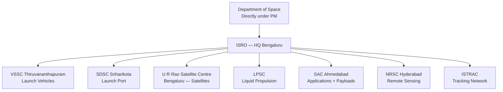
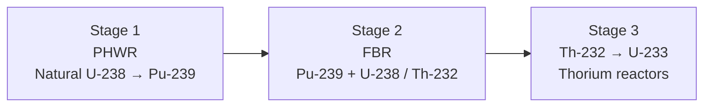
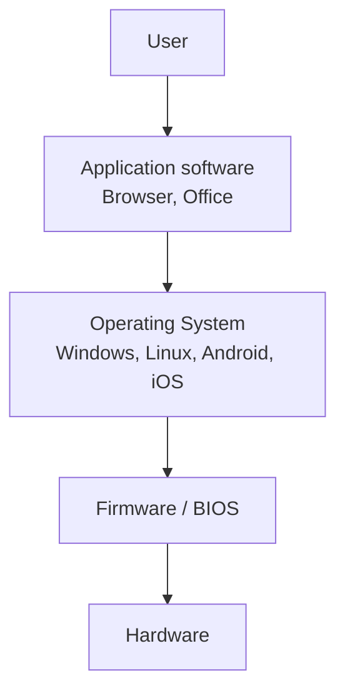
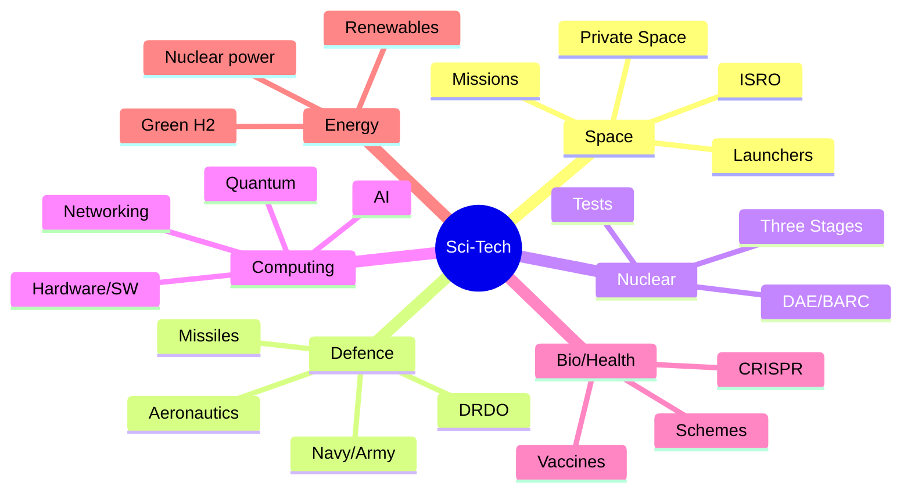

# 📘 How To Use This Book

This book is designed around the **15 pedagogy techniques** explained in full detail in the opening of `polity.md` — please read that chapter once before you begin any subject book. A compressed reminder:

1. **Story-first learning** → every chapter opens with a hook / narrative so the mechanism *arrives* in your head instead of being *dumped* into it.
2. **Scaffolding** → concepts layered from foundation (Earth's resources, basic science) upward to cutting-edge tech (AI, quantum).
3. **Dual coding** → text + diagrams (Mermaid flowcharts, timelines, mission maps).
4. **Chunking** → each chapter is one "chunk" you can digest in ~25 min.
5. **Retrieval practice** → every chapter ends with a `📝 Pause + recall` box.
6. **Elaborative interrogation** → `❓ Why` callouts force you to explain the mechanism, not just recognise it.
7. **Memory palace** → ISRO "launchpad walk", DRDO "missile shed", nuclear "reactor tour".
8. **Acronyms** → PSLV-GSLV-SSLV, AGNI-PRITHVI-BRAHMOS chains.
9. **Contrastive juxtaposition** → PSLV vs GSLV, AGNI vs Prithvi, fission vs fusion, RNA vs DNA vaccines placed side-by-side.
10. **Feynman box** → end-of-chapter "explain in 3 sentences to a class 10 student".
11. **Interleaving** → space + defence + nuclear revisited across multiple angles (budget, timeline, strategic).
12. **Spaced revisits** → same mission appears in ISRO chapter + Current-affairs angle + Policy angle.
13. **Emotional anchoring** → Kalpana Chawla story, Vikram Sarabhai vision, Chandrayaan-3 moonlight moment.
14. **Active-recall quiz pairing** → topic codes (GK_ISRO_SPACE, GK_DEFENCE_MISSILES, PHY_MODERN) in `quiz_questions`.
15. **Mind maps** → appendix has a Sci-Tech mind map.

> **The promise:** If you read this book end-to-end, work every recall prompt, and attempt the paired quiz batches, you will get **every static Sci-Tech question right** in Prelims / SSC / RRB / Banking exams.

---

\newpage

# PART A — SPACE TECHNOLOGY: INDIA'S JOURNEY FROM THUMBA TO THE MOON

## Chapter A1 — The Story of ISRO: From Coconut Groves to Cosmos

### 🎬 The Hook

**1962, Thumba, Kerala.** A fishing village where a Jesuit church is converted into a rocket workshop. Parts are carted on bicycles. The first Indian rocket — a Nike-Apache — goes up on **21 November 1963**. 63 years later, a descendant of that programme lands near the **lunar south pole** (Chandrayaan-3, 23 August 2023). India becomes the **first country** to do so. From bicycles to the moon: *that* is ISRO's arc.

### 🧠 The Mechanism (why India needs a space programme)

**Vikram Sarabhai's vision (1963):** "There is no ambiguity of purpose. We must be second to none in the application of advanced technologies to the real problems of man and society." Translation: India's space programme exists for **development**, not prestige — weather, communication, education, resource mapping, disaster response.

### 🔭 Organisational Tree

### 🚀 Launch Vehicles — The PSLV → GSLV → LVM3 → SSLV Ladder

| Vehicle | Full form | Payload LEO | Signature role |
|---------|-----------|-------------|----------------|
| **SLV-3** (1980) | Satellite Launch Vehicle | 40 kg | First Indian launcher (Rohini D1) |
| **ASLV** (1987-94) | Augmented SLV | 150 kg | Learning platform |
| **PSLV** (1993-) | Polar Satellite Launch Vehicle | 1750 kg (SSO) | ISRO's warhorse — 104 sats in one go (2017) |
| **GSLV Mk-II** (2001-) | Geosync SLV | 2.5 t (GTO) | Cryogenic upper stage (indigenous from 2014) |
| **LVM3 (GSLV Mk-III)** | Launch Vehicle Mark 3 | 4 t (GTO) / 8 t (LEO) | Chandrayaan-2, Chandrayaan-3, Gaganyaan |
| **SSLV** (2022-) | Small Satellite LV | 500 kg (LEO) | Cheap, on-demand launches |

### 🏠 Memory palace — **"The Launchpad Walk"**

Picture yourself walking from the gate of **Satish Dhawan Space Centre, Sriharikota** toward the sea:

1. **Gate** → a **small** rocket waves at you = **SSLV** (small).
2. **Assembly building** → the **warhorse PSLV** is being stacked (**P**olar orbits, **S**un-sync).
3. **Next pad** → **GSLV** stands taller with its cryogenic nose (**G**eostationary, cold fuel).
4. **Main launch tower** → **LVM3**, the giant that carried Chandrayaan-3.
5. **Beach** → out in the ocean, a future **Gaganyaan** crewed capsule splashes down.

Walk this path in your head three times — you will never forget the launcher hierarchy.

### 🛰️ Mission Chronicle — the milestones every exam asks

| Year | Mission | What mattered |
|------|---------|---------------|
| 1975 | **Aryabhata** | First Indian satellite (launched by USSR) |
| 1980 | **Rohini-1** | First satellite launched by an Indian rocket (SLV-3) |
| 1983 | **INSAT-1B** | Beginning of INSAT comm series |
| 1988 | **IRS-1A** | Earth Observation series begins |
| 2008 | **Chandrayaan-1** | Confirmed water molecules on Moon |
| 2013 | **Mangalyaan / MOM** | India = **first Asian nation to reach Mars**, first country to do so on maiden attempt |
| 2014 | **GSLV-D5** | First successful indigenous cryogenic stage |
| 2017 | **PSLV-C37** | 104 satellites in one launch (world record) |
| 2019 | **Chandrayaan-2** | Orbiter success; lander (Vikram) crashed |
| 2020 | **RISAT-2BR1** | Radar-imaging series |
| 2023 | **Chandrayaan-3** | Soft-landing near lunar south pole (23 Aug) — India = 4th country on Moon, 1st near south pole |
| 2023 | **Aditya-L1** | India's first solar observatory (Lagrange-1 point) |
| 2024 | **XPoSat** | X-ray polarimetry satellite (New Year's Day) |
| 2025 | **SpaDeX** | Space Docking Experiment — docking capability demo |

### 🌓 Chandrayaan-3 Deep Dive

- **Launch:** 14 July 2023, LVM3-M4, Sriharikota.
- **Arrival:** Lunar orbit 5 Aug; landing 23 Aug 2023, 6:04 PM IST.
- **Landing site** named **Shiv Shakti Point**; Chandrayaan-2 crash site named **Tiranga Point**.
- **National Space Day:** declared for **August 23** every year.
- **Lander:** Vikram. **Rover:** Pragyan (6-wheeled, 26 kg).
- **Firsts:** First near lunar south pole; 4th country to soft-land (after USA, USSR, China).

### 🔆 Aditya-L1

- Launched **2 Sep 2023** on PSLV-C57.
- Placed at **Lagrange Point 1 (L1)**, ~1.5 million km from Earth toward the Sun (continuous Sun view, no eclipses).
- **Seven payloads** — VELC (flagship), SUIT, ASPEX, PAPA, SoLEXS, HEL1OS, Magnetometer.

### 🧭 Navigation, Communication, Earth Observation Constellations

- **NavIC** (IRNSS): 7 satellites, regional navigation for India + 1500 km around.
- **GAGAN:** GPS Aided Geo-Augmented Navigation (for civil aviation, joint with AAI).
- **INSAT + GSAT:** communication & broadcasting.
- **IRS / Cartosat / Resourcesat / Oceansat / RISAT:** Earth observation.

### 🚀 Gaganyaan Programme

- India's first human spaceflight mission. Target: **2026**.
- Crew: **3 astronauts**, **3 days**, **LEO (~400 km)**.
- **Four astronaut-designates** (announced Feb 2024): Group Captains Prashanth Nair, Ajit Krishnan, Angad Pratappa, Shubhanshu Shukla.
- **Abort tests** (TV-D1) already conducted.
- Launcher: **Human-rated LVM3 (HLVM3)**.

### 🌌 Future Missions Roadmap

- **Mangalyaan-2** (MOM-2) — next Mars mission.
- **Shukrayaan-1** — Venus orbiter (~2028).
- **Chandrayaan-4** — lunar sample return.
- **Bhartiya Antariksh Station (BAS)** — Indian space station by 2035.
- **Crewed lunar landing** by 2040 (announced by PM, Oct 2023).

### 🎯 Exam hooks

- "First country to land near lunar south pole?" → **India (Chandrayaan-3, Aug 23 2023).**
- "India's first solar mission?" → **Aditya-L1, at L1 Lagrange point.**
- "PSLV world record for satellites in one launch?" → **104 (C37, 2017).**
- "India's first Mars mission?" → **Mangalyaan (MOM), 2013, success on maiden attempt.**
- "Cryogenic engine first success?" → **GSLV-D5, 2014.**

### 🧑‍🏫 Feynman box

Explain to a class 10 student: **PSLV** is India's workhorse rocket — it launches small satellites into a special orbit that lets them see every spot on Earth as it spins (polar). **GSLV** uses a super-cold engine (cryogenic) to throw bigger satellites far up (36,000 km) where they hover over one spot (geostationary). **LVM3** is India's biggest rocket — it took our lander to the Moon.

### 📝 Pause + recall

1. Name ISRO's four active launch vehicles and one signature mission of each.
2. What is Lagrange Point 1, and why did India choose it for Aditya-L1?
3. Which two countries preceded India in soft-landing on the Moon, and which continent was India first in for Mars?

---

\newpage

## Chapter A2 — Private Space & Global Context

### 🏭 Private Space Sector Reforms

- **2020:** IN-SPACe (Indian National Space Promotion & Authorization Centre) created under DoS; nodal agency for private space activity.
- **NSIL** (New Space India Limited): commercial arm of ISRO (since 2019).
- **Space Policy 2023:** allows private companies to build rockets, satellites, ground systems; FDI up to **100% automatic** in components, **74%** in satellites, **49%** in launch vehicles.
- **Private startups:** Skyroot (Vikram-S, 1st private rocket, 2022), Agnikul (Agnibaan SOrTeD, 2024 — 1st private sub-orbital with 3D-printed engine), Pixxel, Dhruva, Bellatrix.

### 🌍 Global Space Context

- **SpaceX (USA)** — Falcon 9 reusable, Starship.
- **NASA's Artemis** — return humans to Moon (Artemis III target ~2026).
- **China** — Tiangong station, Chang'e sample returns, Tianwen-1 Mars.
- **ESA** — Ariane 6, JUICE to Jupiter.
- **Russia** — Luna-25 crashed on Moon (Aug 2023, two days before Chandrayaan-3 landed).

### 🎯 Exam hooks

- "India's 1st private rocket?" → **Vikram-S (Skyroot, 18 Nov 2022, sub-orbital)**.
- "Nodal body for private space?" → **IN-SPACe**.
- "Commercial arm of ISRO?" → **NSIL**.

---

\newpage

# PART B — DEFENCE TECHNOLOGY: GUARDING THE NATION

## Chapter B1 — DRDO and the Missile Story

### 🎬 The Hook

**1983, Hyderabad.** Dr A.P.J. Abdul Kalam, then DRDO Director, pitches the **Integrated Guided Missile Development Programme (IGMDP)** to PM Indira Gandhi. Five missiles, one indigenous project, decades of sanctions. The programme officially concludes in 2008 — having delivered every promised system and birthing India's strategic shield.

### 🧠 IGMDP — the original five

| Missile | Type | Range |
|---------|------|-------|
| **Prithvi** | Surface-to-Surface (short range) | 150-350 km |
| **Agni** | Surface-to-Surface (medium → ICBM) | 700 → 5000+ km |
| **Trishul** | Short-range SAM | 9 km |
| **Akash** | Medium-range SAM | 25-45 km |
| **Nag** | Anti-tank | 4-20 km |

Mnemonic: **PATAN** = **P**rithvi, **A**gni, **T**rishul, **A**kash, **N**ag.

### 🚀 Agni Series Ladder

| Variant | Range | Notes |
|---------|-------|-------|
| Agni-I | 700 km | Single-stage, solid fuel |
| Agni-II | 2000 km | Two-stage |
| Agni-III | 3500 km | Reaches deep into China |
| Agni-IV | 4000 km | Road-mobile |
| **Agni-V** | 5000+ km | ICBM class, canister-launched |
| **Agni-P (Prime)** | 1000-2000 km | Next-gen replacing Agni-I/II |
| **Agni-V MIRV** (2024) | 5000+ km | "Mission Divyastra" — first Indian MIRV test |

### 🌊 BrahMos — The Speed Demon

- Indo-Russian joint venture (India + Russia; named after **Brah**maputra + **Mos**kva).
- **Supersonic cruise missile**, Mach 2.8-3.0.
- Fired from land, ship, submarine, and air (Su-30MKI).
- **BrahMos-II / Hypersonic version** in development (Mach 7+).
- **First export** (Jan 2022): to **Philippines** ($375 mn deal).

### 🛡️ Air-defence & BMD

- **Akash-NG** — next-gen Akash.
- **QRSAM** — Quick-Reaction SAM.
- **Barak-8** — long-range naval SAM (Indo-Israeli).
- **BMD (Ballistic Missile Defence):** two-tier — **PAD/PDV (exoatmospheric)** + **AAD (endoatmospheric)**.
- **Mission Shakti** (27 Mar 2019): ASAT test — India became **4th country** with ASAT capability.

### 🏠 Memory palace — **"The Missile Shed"**

Visualise walking into a large shed at DRDO's Chandipur range. Five doors labelled **P-A-T-A-N**:

1. **Prithvi** door — short-range green crate.
2. **Agni** door — ladder inside with rungs I→V→P→MIRV.
3. **Trishul** door — three prongs (SAM, short range).
4. **Akash** door — sky-blue crate (SAM, medium).
5. **Nag** door — anti-tank teeth.

Then an annex: **BrahMos** in a red-white-blue Russo-Indian crate, **Shakti** (ASAT) banner on the ceiling.

### 🛩️ Aeronautics — LCA, AMCA, Drones

- **LCA Tejas (HAL)** — indigenous 4.5-gen fighter. Mk-1A under induction. Mk-2 planned.
- **AMCA** — Advanced Medium Combat Aircraft (5th-gen stealth, in development).
- **HAL Prachand** (formerly LCH) — Light Combat Helicopter, high-altitude specialist.
- **Dhruv & Rudra** — Advanced Light Helicopter family.
- **UAVs:** Nishant, Lakshya (target drone), **Rustom-II/TAPAS** (MALE), **Archer** (armed).

### ⚓ Naval Programme

- **INS Vikrant** (commissioned Sep 2022) — India's **first indigenous aircraft carrier**.
- **INS Arihant-class** — SSBN (nuclear ballistic subs); Arihant (2016), Arighaat (2024).
- **Project 75 (Scorpene)** — Kalvari-class submarines.
- **Project 75-I, 17A (Nilgiri-class frigates), P-15B Visakhapatnam-class destroyers.**

### 🏹 Army Programme

- **Arjun Mk-1A** — indigenous MBT.
- **K9 Vajra** — 155mm self-propelled howitzer.
- **Dhanush** — indigenised Bofors.
- **Pinaka** — multi-barrel rocket launcher.
- **ATAGS** — Advanced Towed Artillery Gun System (DRDO).

### 🎯 Exam hooks

- "IGMDP — five original missiles?" → **Prithvi, Agni, Trishul, Akash, Nag (PATAN).**
- "BrahMos named after?" → **Brahmaputra + Moskva.**
- "India's ASAT test?" → **Mission Shakti, 27 Mar 2019.**
- "First indigenous aircraft carrier?" → **INS Vikrant (2022).**
- "Agni-V MIRV mission name?" → **Mission Divyastra (2024).**
- "First BrahMos export customer?" → **Philippines (2022).**

### 🧑‍🏫 Feynman box

Imagine India has three shields: **Prithvi** for neighbours up close, **Agni** for threats far away, and **Akash/BrahMos** to shoot things *coming at us* out of the sky. Behind the shields stand **Tejas** planes, **Arihant** submarines, **Vikrant** aircraft carriers. Everything was designed here, under sanctions — which is why *indigenisation* is the single word DRDO repeats.

### 📝 Pause + recall

1. List PATAN and one salient fact about each.
2. Why is Agni-P considered "next-gen" compared to Agni-I?
3. Compare BrahMos and Tomahawk (speed, cost, range). Why is supersonic an advantage?

---

\newpage

# PART C — NUCLEAR PROGRAMME

## Chapter C1 — Bhabha's Three-Stage Plan

### 🎬 The Hook

**1954, Mumbai.** **Homi Bhabha** founds the Department of Atomic Energy (DAE). His vision: India, blessed with little uranium but mountains of thorium (~25% of world reserves), will build a **three-stage programme** that turns thorium into fuel by mid-century.

### 🧠 The Three Stages

- **Stage 1** — Pressurised Heavy Water Reactors (PHWR) use natural uranium, moderated by heavy water (D₂O). 18 reactors of this type operate in India.
- **Stage 2** — Fast Breeder Reactors (FBR) use plutonium from stage 1, "breeding" more fuel. **PFBR at Kalpakkam** reached criticality in 2024.
- **Stage 3** — Thorium-based Advanced Heavy Water Reactors (AHWR) — still under design.

### ☢️ Key Nuclear Tests

- **Pokhran-I** (18 May 1974) — Operation **Smiling Buddha**, "peaceful nuclear explosion".
- **Pokhran-II** (11-13 May 1998) — Operation **Shakti**, 5 tests; India declared a nuclear-weapon state. **May 11 → National Technology Day.**

### 🏭 Organisations under DAE

- **BARC** (Bhabha Atomic Research Centre) — Mumbai.
- **IGCAR** (Indira Gandhi Centre for Atomic Research) — Kalpakkam.
- **NPCIL** (Nuclear Power Corporation of India Ltd) — operates reactors.
- **AERB** (Atomic Energy Regulatory Board) — safety regulator.
- **BHAVINI** — FBR operator.

### 🔋 Nuclear Power Capacity (Apr 2026)

- ~**7.5 GW** installed (target: 22.4 GW by 2031).
- Major sites: Tarapur (first, 1969), Kaiga, Kakrapar, Kudankulam (Russian VVER), Rawatbhata, Narora, Kalpakkam.
- **Nuclear Liability Act 2010** — controversial "right of recourse" to suppliers.
- **India-US 123 Agreement** (2008) — ended nuclear isolation; enabled NSG waiver.

### 🎯 Exam hooks

- "Three stages?" → **PHWR → FBR → Thorium.**
- "Pokhran-II?" → **May 11-13, 1998, Operation Shakti → National Technology Day (May 11).**
- "India's thorium share?" → **~25% of world reserves (Kerala beach sands).**
- "Father of Indian atomic programme?" → **Homi Bhabha.**

### 📝 Pause + recall

1. Why does India need a thorium cycle?
2. What is the role of heavy water in PHWR?
3. Name three sites and their reactor types.

---

\newpage

# PART D — COMPUTING, AI, AND DIGITAL INDIA

## Chapter D1 — Computer Fundamentals

### 🔤 Basic Vocabulary (non-negotiable for SSC/Banking)

- **Hardware** (physical) vs **software** (programs).
- **CPU** = Central Processing Unit = **brain** (ALU + Control Unit + Registers).
- **RAM** (volatile, fast) vs **ROM** (non-volatile, fixed).
- **Primary storage** (RAM, cache) vs **secondary** (HDD, SSD, USB).
- **Bit** → **Byte** (8 bits) → **KB (1024 B) → MB → GB → TB → PB.**
- **Motherboard** connects everything.
- **GPU** — graphics processor (parallel, heavy in AI now).

### 💾 Software Layers

### 🌐 Networking

- **LAN → MAN → WAN** (scale ladder).
- **IP v4 (32-bit)** vs **IP v6 (128-bit)**.
- **TCP/IP** — reliable transport.
- **HTTP/HTTPS** — web.
- **DNS** — name → IP.
- **OSI model** — 7 layers (Physical, Data link, Network, Transport, Session, Presentation, Application). Mnemonic: **Please Do Not Throw Sausage Pizza Away**.

### 👾 Malware Zoo

- **Virus** — attaches to files, needs user execution.
- **Worm** — self-replicating over networks.
- **Trojan** — disguised.
- **Ransomware** — encrypts & demands payment (**WannaCry** 2017).
- **Spyware / Adware / Rootkit / Keylogger.**
- **Phishing / Smishing / Vishing** — social engineering.

### 🔐 Cryptography Primer

- **Symmetric** (AES) vs **asymmetric** (RSA, ECC) keys.
- **Hash functions** — SHA-256, MD5 (broken).
- **Digital signature** = hash + private-key encryption.
- **TLS/SSL** — secures HTTP → HTTPS.
- **Blockchain** — chained blocks of hashes (Bitcoin 2009 by Satoshi Nakamoto).

### 🎯 Exam hooks

- "1 KB = ?" → **1024 bytes.** (Some contexts: 1000.)
- "OSI layers count?" → **7.**
- "Father of computers?" → **Charles Babbage (Difference/Analytical Engine).**
- "First computer virus?" → **Creeper (1971).**

---

\newpage

## Chapter D2 — Artificial Intelligence & Emerging Tech

### 🤖 AI Taxonomy

- **Narrow AI** (today — ChatGPT, Alexa, image recognition).
- **AGI** (human-level general intelligence — not yet).
- **ASI** (super-intelligent — speculative).

### 🧠 Key Sub-fields

- **Machine Learning** — learning from data.
  - **Supervised** (labelled), **unsupervised** (clustering), **reinforcement** (reward).
- **Deep Learning** — multi-layer neural networks (CNNs for images, RNN/Transformers for sequences).
- **Generative AI** — LLMs (GPT, Claude, Gemini), image models (DALL-E, Midjourney).
- **NLP** — text understanding.
- **Computer Vision** — image/video understanding.
- **Robotics** — physical AI.

### 🇮🇳 India's AI Ecosystem

- **IndiaAI Mission** (Mar 2024): ₹10,371 crore — GPU compute, foundation models, datasets, applications, startups, skilling, safe-and-trusted AI.
- **BHASHINI** — national AI-based language translation platform (22 scheduled languages).
- **AIRAWAT** — AI supercomputer at C-DAC Pune.
- **NITI Aayog's "AI for All" strategy (2018)**.

### 🌐 Other Emerging Tech

- **Blockchain + Web3** — decentralised ledgers. **CBDC (Digital Rupee)** pilot by RBI (2022).
- **Quantum Computing** — **National Quantum Mission** (2023), ₹6,003 cr, 2023-31; targets 1000-qubit computer.
- **IoT (Internet of Things)** — sensor-networks, smart cities.
- **5G** — rolled out Oct 2022 by PM; 6G Vision Document released 2023.
- **Cloud computing** — IaaS/PaaS/SaaS; MeghRaj (Govt cloud).
- **Digital Twin** — virtual replica for simulation.

### 📡 Digital India Programme (2015)

Nine pillars, most-quoted flagships:

- **UIDAI / Aadhaar** (2009).
- **UPI** (2016) — unified payments; **>15 billion transactions/month** in 2026.
- **DigiLocker, eSanjeevani, CoWIN, DIKSHA, UMANG, BHIM, Rupay, ONDC.**
- **Bharat Net / National Broadband** — fibre to every panchayat.
- **PMGDISHA** — rural digital literacy.

### 🎯 Exam hooks

- "UPI operator?" → **NPCI (National Payments Corporation of India).**
- "IndiaAI budget?" → **₹10,371 crore, approved March 2024.**
- "National Quantum Mission corpus?" → **₹6,003 crore (2023-31).**
- "BHASHINI covers?" → **22 scheduled Indian languages.**
- "CBDC / Digital Rupee pilot launched?" → **Dec 2022 (retail).**

### 🧑‍🏫 Feynman box

AI today is basically **pattern-matching on steroids**. Feed a machine millions of cat pictures → it learns "cat-ness" and flags new cats. Feed it trillions of words → it learns to predict the next word (that's ChatGPT). No consciousness, no magic — just math + data + GPUs. India's challenge: build our own models in our own languages so we're not renting tech from California.

### 📝 Pause + recall

1. List 3 differences between Narrow AI and AGI.
2. Explain UPI in a minute; who operates it, what year it launched, who regulates it.
3. What is the National Quantum Mission's budget and target qubit count?

---

\newpage

# PART E — BIOTECHNOLOGY & HEALTH TECH

## Chapter E1 — Genetic Engineering Primer

### 🧬 Core Vocabulary

- **DNA** — double helix, carries hereditary info (A-T, G-C pairs).
- **RNA** — single-strand, transcribed from DNA, translated to protein.
- **Gene** — a DNA segment coding one (or more) protein.
- **Genome** — full DNA set.
- **Genomics** — study of genomes.
- **Proteomics** — study of proteins.

### 🔪 Key Techniques

- **PCR** (Polymerase Chain Reaction) — amplify DNA. Kary Mullis, Nobel 1993. COVID testing workhorse.
- **Recombinant DNA** — cut-paste genes across organisms (enables insulin, hormones).
- **CRISPR-Cas9** — gene-editing "molecular scissors". Charpentier & Doudna, Nobel 2020.
- **Stem cells** — undifferentiated cells (embryonic / adult / iPSC).
- **Cloning** — Dolly the sheep (1996, first mammal).

### 💉 Vaccines — India's Global Role

- India = **pharmacy of the world** (>60% of world's vaccines by volume).
- **Serum Institute** (Pune) — world's largest by volume.
- **Bharat Biotech** — Covaxin, Rotavac, iNCOVACC (nasal COVID vaccine).
- **COVID-era launches (Jan 2021):**
  - **Covishield** (Oxford-AstraZeneca, made by Serum).
  - **Covaxin** (Bharat Biotech — India's 1st indigenous COVID vaccine, inactivated virus).
  - **ZyCoV-D** (Zydus, world's 1st DNA-plasmid COVID vaccine, needle-free).
- **CoWIN** platform — vaccination registry; open-sourced, used by other countries.

### 🌾 Agri-Biotech

- **Bt cotton** — first GM crop approved in India (2002).
- **Bt brinjal** — GEAC cleared (2010) but moratorium imposed.
- **DMH-11 mustard** (2022 GEAC clearance) — GM mustard, under SC scrutiny.
- **Golden Rice** — Vitamin-A-fortified rice (international).
- **GEAC** (Genetic Engineering Appraisal Committee) — regulator under MoEFCC.

### 🧪 Regulatory Bodies

- **DBT** (Department of Biotechnology) — under MoS&T.
- **BIRAC** — Biotechnology Industry Research Assistance Council (funding agency).
- **NII / NCBS / THSTI / IGIB / inStem / RCB** — flagship biotech labs.
- **ICMR** — medical research apex body.

### 🎯 Exam hooks

- "Bt cotton approved in India?" → **2002 (first GM crop).**
- "CRISPR Nobel?" → **Charpentier & Doudna, 2020.**
- "Indigenous COVID vaccine?" → **Covaxin (Bharat Biotech).**
- "World's 1st DNA-plasmid COVID vaccine?" → **ZyCoV-D (Zydus, India).**
- "GM mustard = ?" → **DMH-11.**

### 📝 Pause + recall

1. Trace insulin production: from gene to product, using recombinant DNA.
2. Why is CRISPR a revolution over older gene-editing methods?
3. List three indigenous vaccines developed by Bharat Biotech.

---

\newpage

# PART F — ENERGY & ENVIRONMENT TECH

## Chapter F1 — India's Energy Transition

### 🌞 Renewable Milestones (Apr 2026)

- **Installed power capacity:** ~450 GW.
- **Non-fossil share:** ~47% (target 50% by 2030).
- **Solar:** ~93 GW.
- **Wind:** ~46 GW.
- **Large hydro:** ~47 GW.
- **Nuclear:** ~7.5 GW.

### 🎯 Paris Pledges (NDCs, updated 2022)

1. 50% non-fossil capacity by 2030.
2. Reduce emissions intensity of GDP by 45% (from 2005 levels) by 2030.
3. Additional **2.5-3 billion tonnes CO₂** forest sink by 2030.
4. **Net-Zero by 2070** (Glasgow COP26).

### 🛰️ Key Missions

- **International Solar Alliance** (2015, with France) — 100+ members.
- **ISA Summit 2018**, HQ Gurugram.
- **PM-KUSUM** — solar pumps for farmers.
- **PLI Scheme — solar modules, batteries.**
- **National Green Hydrogen Mission** (Jan 2023, ₹19,744 cr) — target 5 MMT green hydrogen by 2030.
- **National Electric Mobility Mission (NEMMP)** + **FAME-I & II**.

### ⚡ Grid & Transmission

- **One Nation One Grid** achieved 2013 (Southern grid synced).
- **POSOCO → Grid Controller of India Ltd.**
- **Green energy open access rules 2022** — simpler RE procurement.

### 🎯 Exam hooks

- "India's net-zero target?" → **2070.**
- "ISA HQ?" → **Gurugram (Haryana).**
- "National Green Hydrogen Mission outlay?" → **₹19,744 crore.**
- "Non-fossil share target 2030?" → **50% installed capacity.**

### 📝 Pause + recall

1. What are India's four NDC targets?
2. Why is green hydrogen called "green" vs grey/blue?
3. Name three flagship solar schemes.

---

\newpage

# PART G — HEALTH & MEDICAL TECH

## Chapter G1 — Medical Missions & Innovations

### 🩺 Key Programmes

- **Ayushman Bharat PM-JAY** (2018) — world's largest public health insurance (₹5 lakh/family/year; 55 crore beneficiaries).
- **Ayushman Bharat Digital Mission (ABDM)** — ABHA health ID; health records stack.
- **Mission Indradhanush** — universal immunisation for children & pregnant women.
- **eSanjeevani** — national telemedicine; 10+ crore consultations.
- **CoWIN** — COVID vaccination backbone.
- **PMBJP** — Jan Aushadhi Pariyojana (generic medicines).
- **PM-ABHIM** — PM Ayushman Bharat Health Infrastructure Mission (₹64,180 cr).

### 🧪 Indigenous Innovations

- **Indian HPV vaccine (CERVAVAC)** — Sep 2022, Serum Institute.
- **iNCOVACC** — intranasal COVID booster (world's first).
- **Polio eradication certification** — India declared polio-free in 2014 by WHO.
- **Tele-MANAS** — National Tele Mental Health Programme (2022).

### 🎯 Exam hooks

- "PM-JAY coverage?" → **₹5 lakh/family/year.**
- "World's 1st intranasal COVID vaccine?" → **iNCOVACC.**
- "India declared polio-free?" → **2014.**
- "Indigenous HPV vaccine?" → **CERVAVAC (2022).**

---

\newpage

# PART H — PHYSICS, CHEMISTRY, BIOLOGY ESSENTIALS

> *These domains have their own dedicated books (`physics.md`, `chemistry.md`, `biology.md`). This part provides a rapid-revision layer.*

## Chapter H1 — Physics Essentials (General Awareness flavour)

- **SI units** — 7 base: m, kg, s, A, K, mol, cd.
- **Laws of Motion** (Newton) — 1st (inertia), 2nd (F = ma), 3rd (action-reaction).
- **Laws of Thermodynamics** — 0th (thermal equilibrium), 1st (energy conservation), 2nd (entropy), 3rd (absolute zero unreachable).
- **Electromagnetic spectrum** (low → high frequency): **Radio → Microwave → Infrared → Visible → UV → X-rays → Gamma**.
- **Visible light (VIBGYOR)** — 380-750 nm.
- **Speed of light in vacuum** — 3×10⁸ m/s.
- **Sound** — longitudinal, ~343 m/s in air, ~1500 m/s in water, faster in solids.
- **LASER** — Light Amplification by Stimulated Emission of Radiation.

## Chapter H2 — Chemistry Essentials

- **Periodic Table** — 118 elements; **Mendeleev** (1869) → modern by Moseley (atomic number).
- **S-block, p-block, d-block (transition), f-block (lanthanides+actinides).**
- **Atomic structure** — Dalton → Thomson (plum pudding) → Rutherford → Bohr → Quantum.
- **Acids/Bases** — Arrhenius, Brønsted-Lowry, Lewis.
- **pH** — 0-14; < 7 acid, > 7 base.
- **Key gases & uses:** O₂ (respiration), CO₂ (photosynthesis/fire-ext), N₂ (fertiliser, inert), H₂ (fuel of future), He (balloons), Ne (sign lights), Ar (bulb filling).

## Chapter H3 — Biology Essentials

- **Cell** = basic unit of life.
- **Prokaryote** (no nucleus — bacteria) vs **Eukaryote** (plants, animals, fungi, protists).
- **Five kingdoms** (Whittaker 1969): Monera, Protista, Fungi, Plantae, Animalia.
- **11 human systems** — integumentary, skeletal, muscular, nervous, endocrine, cardiovascular, lymphatic, respiratory, digestive, urinary, reproductive.
- **Blood groups** — A, B, AB, O × Rh+/−. AB+ universal recipient, O− universal donor.
- **Vitamins deficiency:** A (night blindness), B₁ (beriberi), B₃ (pellagra), B₁₂ (anaemia), C (scurvy), D (rickets), E (sterility), K (bleeding).

> 📎 **For depth, jump to the dedicated subject books.**

---

\newpage

# APPENDICES

## Appendix 1 — One-page cheatsheet

| Category | Key Fact |
|----------|----------|
| ISRO HQ | Bengaluru |
| DRDO HQ | New Delhi |
| DAE HQ | Mumbai |
| AEC/BARC | Mumbai |
| PSLV record | 104 sats (2017) |
| Chandrayaan-3 landing | 23 Aug 2023 |
| National Space Day | 23 August |
| National Technology Day | 11 May |
| Mission Shakti (ASAT) | 27 Mar 2019 |
| INS Vikrant | Commissioned Sep 2022 |
| Agni-V MIRV | Mission Divyastra, 2024 |
| First indigenous COVID vaccine | Covaxin |
| Nuclear 3-stage | PHWR → FBR → Thorium |
| Net-zero year | 2070 |
| IndiaAI Mission corpus | ₹10,371 cr |
| NQM corpus | ₹6,003 cr (2023-31) |

## Appendix 2 — Master Mnemonics List

- **PATAN** → Prithvi-Agni-Trishul-Akash-Nag (IGMDP).
- **Launchpad Walk** → SSLV-PSLV-GSLV-LVM3-Gaganyaan.
- **PDNTSPA** (Please Do Not Throw Sausage Pizza Away) → OSI 7 layers.
- **VIBGYOR** → Violet-Indigo-Blue-Green-Yellow-Orange-Red.

## Appendix 3 — Mind Map (Sci-Tech)

---

*More parts and expansions will be added as new quiz topics are generated. Keep this file as your single source of Sci-Tech truth.*
