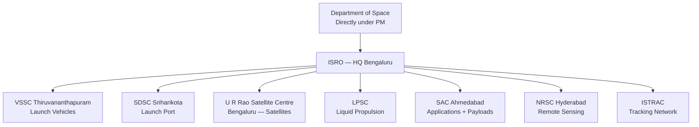
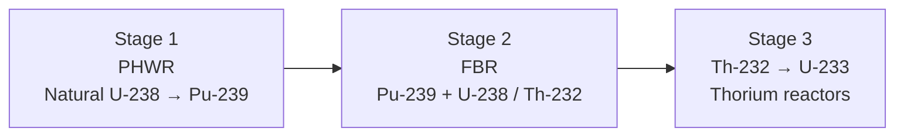
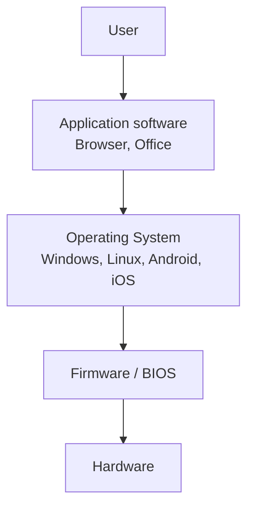
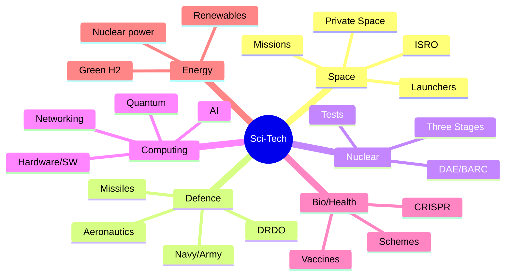

# EXAMINER BLUEPRINT — What Gets Tested Most

Science & Technology is one of the most scoring sections because the questions are almost entirely factual. There is no derivation, no calculation — just "Which mission did what" or "Which organisation developed X." Knowing the right list gets you full marks.

**Top 8 Sci-Tech exam hotspots**

1. **ISRO missions** — Chandrayaan series, Mangalyaan, Aditya-L1, Gaganyaan, SpaDeX. Know each mission's objective, launch vehicle, and year. Appears in every SSC, RRB, and Banking exam.
2. **DRDO missiles** — Agni series, Prithvi series, BrahMos, Akash, Tejas. Know range, type (surface-to-surface, supersonic cruise), and developer.
3. **Nobel Prize winners** — last 3–5 years across Physics, Chemistry, Medicine/Physiology. Examiners ask year + field + discovery.
4. **Computer fundamentals** — generations of computers, OSI model (7 layers), storage units (1 byte = 8 bits), programming generations.
5. **Biotechnology** — PCR, CRISPR, cloning, vaccines (live attenuated vs killed vs mRNA). These appear in SSC and UPSC papers.
6. **Nuclear technology** — fission vs fusion, types of reactors (PWR, BWR, PHWR), India's 3-stage nuclear programme, BARC vs ISRO vs DRDO roles.
7. **Defence platforms** — INS Vikrant (aircraft carrier), Tejas, AMCA, Arjun tank, Arihant-class submarines.
8. **Space organisations** — NASA (USA), ESA (Europe), Roscosmos (Russia), CNSA (China), JAXA (Japan). Know 2–3 key missions each.

**Study priority for time-poor students**

1. ISRO missions — all with years and objectives
2. DRDO missiles — Agni I through V ranges, BrahMos specs
3. Nobel Prize winners — last 3 years
4. Computer fundamentals — OSI model, storage, generations
5. Biotechnology basics — vaccines, CRISPR, DNA vs RNA
6. India's nuclear programme — 3 stages + key reactors
7. Defence platforms — aircraft carrier, submarines, fighter jets
8. Space milestones (global) — first human in space, Moon landing, Mars missions

---

# What's New This Year (Sci-Tech)

> ISRO/DRDO missions, Nobel laureates, AI/tech companies' product versions, Indian-tech milestones change frequently. Re-check before any exam later than Q3 2026. The rest of this book (general physics/chemistry/biology fundamentals, computer-architecture basics, OSI 7 layers, programming-language histories, MS Office shortcuts, internet milestone history pre-2024) is **static and stable**.

| Item | Current value (verify before your exam) |
|---|---|
| **Nobel 2025 — Physics** | John Clarke + Michel H. Devoret + John M. Martinis (macroscopic quantum tunnelling) |
| **Nobel 2025 — Chemistry** | Susumu Kitagawa + Richard Robson + Omar M. Yaghi (Metal-Organic Frameworks) |
| **Nobel 2025 — Medicine** | Mary Brunkow + Frederick Ramsdell + Shimon Sakaguchi (regulatory T cells) |
| **ISRO recent missions** | Chandrayaan-3 (23 Aug 2023 lunar landing); Aditya-L1 (Sep 2023, L1 reached Jan 2024); SpaDeX (30 Dec 2024, docking 16 Jan 2025); NISAR (30 Jul 2025 GSLV-F16) |
| **Gaganyaan** | Uncrewed G1 = H2 2026 (with Vyommitra robot); first crewed mission = H1 2027 |
| **DRDO recent** | Mission Divyastra (Agni-V MIRV, Mar 2024); Agni-V test Aug 2025; Scramjet long-duration test Jan 2026 |
| **Defence platforms** | INS Vikrant (commissioned 2 Sep 2022); INS Arighat (Aug 2024); HAL Tejas Mk-1A (delivery 2024) |
| **CBDC** | Digital Rupee (e₹): Wholesale pilot Nov 2022; Retail pilot Dec 2022; live in 9 cities |
| **5G** | India 2nd-largest 5G user base; 394 million users end-2025; 1 billion broadband subscribers Nov 2025 |
| **CRISPR therapy** | Casgevy (first CRISPR therapy approved by FDA Dec 2023) — sickle cell + β-thalassemia |

---

# How to use this book

Science and Technology questions in exams are almost entirely about names, years, organisations, and one-line descriptions. No calculation is required. This makes it the easiest scoring section if you commit the right tables to memory.

Each chapter in this book opens with the story behind the technology — not for dramatic effect, but because understanding *why* a system was built makes the specific facts (the missile's range, the mission's year, the vaccine's mechanism) stick far better than raw memorisation. Read the story, then drill the table at the end.

**The "Exam hooks" section at the end of every chapter is your most important page.** It is the compressed list of exactly what examiners have asked in previous years. After reading the chapter, close the book and try to answer those points from memory. If you can, move on. If you cannot, re-read only that specific section and try again.

> **The truth about Sci-Tech:** Students who can recall "BrahMos: 290 km range, Mach 2.8, surface-surface-air-sea, Indo-Russian joint venture" in 5 seconds beat students who "understood" it perfectly but can't retrieve it under pressure. This book is built to get you to that 5-second recall speed.

---

\newpage

# PART A — SPACE TECHNOLOGY: INDIA'S JOURNEY FROM THUMBA TO THE MOON

## Chapter A1 — The Story of ISRO: From Coconut Groves to Cosmos

### Background

**1962, Thumba, Kerala.** A fishing village where a Jesuit church is converted into a rocket workshop. Parts are carted on bicycles. The first Indian rocket — a Nike-Apache — goes up on **21 November 1963**. 63 years later, a descendant of that programme lands near the **lunar south pole** (Chandrayaan-3, 23 August 2023). India becomes the **first country** to do so. From bicycles to the moon: *that* is ISRO's arc.

### The Mechanism (why India needs a space programme)

**Vikram Sarabhai's vision (1963):** "There is no ambiguity of purpose. We must be second to none in the application of advanced technologies to the real problems of man and society." Translation: India's space programme exists for **development**, not prestige — weather, communication, education, resource mapping, disaster response.

### 🔭 Organisational Tree

### 🚀 Launch Vehicles — The PSLV → GSLV → LVM3 → SSLV Ladder

| Vehicle | Full form | Payload LEO | Signature role |
|---------|-----------|-------------|----------------|
| **SLV-3** (1980) | Satellite Launch Vehicle | 40 kg | First Indian launcher (Rohini D1) |
| **ASLV** (1987-94) | Augmented SLV | 150 kg | Learning platform |
| **PSLV** (1993-) | Polar Satellite Launch Vehicle | 1750 kg (SSO) | ISRO's warhorse — 104 sats in one go (2017) |
| **GSLV Mk-II** (2001-) | Geosync SLV | 2.5 t (GTO) | Cryogenic upper stage (indigenous from 2014) |
| **LVM3 (GSLV Mk-III)** | Launch Vehicle Mark 3 | 4 t (GTO) / 8 t (LEO) | Chandrayaan-2, Chandrayaan-3, Gaganyaan |
| **SSLV** (2022-) | Small Satellite LV | 500 kg (LEO) | Cheap, on-demand launches |

### Memory aid: **"The Launchpad Walk"**

Picture yourself walking from the gate of **Satish Dhawan Space Centre, Sriharikota** toward the sea:

1. **Gate** → a **small** rocket waves at you = **SSLV** (small).
2. **Assembly building** → the **warhorse PSLV** is being stacked (**P**olar orbits, **S**un-sync).
3. **Next pad** → **GSLV** stands taller with its cryogenic nose (**G**eostationary, cold fuel).
4. **Main launch tower** → **LVM3**, the giant that carried Chandrayaan-3.
5. **Beach** → out in the ocean, a future **Gaganyaan** crewed capsule splashes down.

Walk this path in your head three times — you will never forget the launcher hierarchy.

### 🛰️ Mission Chronicle — the milestones every exam asks

| Year | Mission | What mattered |
|------|---------|---------------|
| 1975 | **Aryabhata** | First Indian satellite (launched by USSR) |
| 1980 | **Rohini-1** | First satellite launched by an Indian rocket (SLV-3) |
| 1983 | **INSAT-1B** | Beginning of INSAT comm series |
| 1988 | **IRS-1A** | Earth Observation series begins |
| 2008 | **Chandrayaan-1** | Confirmed water molecules on Moon |
| 2013 | **Mangalyaan / MOM** | India = **first Asian nation to reach Mars**, first country to do so on maiden attempt |
| 2014 | **GSLV-D5** | First successful indigenous cryogenic stage |
| 2017 | **PSLV-C37** | 104 satellites in one launch (world record) |
| 2019 | **Chandrayaan-2** | Orbiter success; lander (Vikram) crashed |
| 2020 | **RISAT-2BR1** | Radar-imaging series |
| 2023 | **Chandrayaan-3** | Soft-landing near lunar south pole (23 Aug) — India = 4th country on Moon, 1st near south pole |
| 2023 | **Aditya-L1** | India's first solar observatory (Lagrange-1 point) |
| 2024 | **XPoSat** | X-ray polarimetry satellite (New Year's Day) |
| 2025 | **SpaDeX** | Space Docking Experiment — docking capability demo |

### 🌓 Chandrayaan-3 Deep Dive

- **Launch:** 14 July 2023, LVM3-M4, Sriharikota.
- **Arrival:** Lunar orbit 5 Aug; landing 23 Aug 2023, 6:04 PM IST.
- **Landing site** named **Shiv Shakti Point**; Chandrayaan-2 crash site named **Tiranga Point**.
- **National Space Day:** declared for **August 23** every year.
- **Lander:** Vikram. **Rover:** Pragyan (6-wheeled, 26 kg).
- **Firsts:** First near lunar south pole; 4th country to soft-land (after USA, USSR, China).

### 🔆 Aditya-L1

- Launched **2 Sep 2023** on PSLV-C57.
- Placed at **Lagrange Point 1 (L1)**, ~1.5 million km from Earth toward the Sun (continuous Sun view, no eclipses).
- **Seven payloads** — VELC (flagship), SUIT, ASPEX, PAPA, SoLEXS, HEL1OS, Magnetometer.

### 🧭 Navigation, Communication, Earth Observation Constellations

- **NavIC** (IRNSS): 7 satellites, regional navigation for India + 1500 km around.
- **GAGAN:** GPS Aided Geo-Augmented Navigation (for civil aviation, joint with AAI).
- **INSAT + GSAT:** communication & broadcasting.
- **IRS / Cartosat / Resourcesat / Oceansat / RISAT:** Earth observation.

### 🚀 Gaganyaan Programme

- India's first human spaceflight mission. Target: **2026**.
- Crew: **3 astronauts**, **3 days**, **LEO (~400 km)**.
- **Four astronaut-designates** (announced Feb 2024): Group Captains Prashanth Nair, Ajit Krishnan, Angad Pratappa, Shubhanshu Shukla.
- **Abort tests** (TV-D1) already conducted.
- Launcher: **Human-rated LVM3 (HLVM3)**.

### 🌌 Future Missions Roadmap

- **Mangalyaan-2** (MOM-2) — next Mars mission.
- **Shukrayaan-1** — Venus orbiter (~2028).
- **Chandrayaan-4** — lunar sample return.
- **Bhartiya Antariksh Station (BAS)** — Indian space station by 2035.
- **Crewed lunar landing** by 2040 (announced by PM, Oct 2023).

### Exam pointers

- "First country to land near lunar south pole?" → **India (Chandrayaan-3, Aug 23 2023).**
- "India's first solar mission?" → **Aditya-L1, at L1 Lagrange point.**
- "PSLV world record for satellites in one launch?" → **104 (C37, 2017).**
- "India's first Mars mission?" → **Mangalyaan (MOM), 2013, success on maiden attempt.**
- "Cryogenic engine first success?" → **GSLV-D5, 2014.**

### In simple words

Explain to a class 10 student: **PSLV** is India's workhorse rocket — it launches small satellites into a special orbit that lets them see every spot on Earth as it spins (polar). **GSLV** uses a super-cold engine (cryogenic) to throw bigger satellites far up (36,000 km) where they hover over one spot (geostationary). **LVM3** is India's biggest rocket — it took our lander to the Moon.

### Practice

1. Name ISRO's four active launch vehicles and one signature mission of each.
2. What is Lagrange Point 1, and why did India choose it for Aditya-L1?
3. Which two countries preceded India in soft-landing on the Moon, and which continent was India first in for Mars?

---

\newpage

## Chapter A2 — Private Space & Global Context

### 🏭 Private Space Sector Reforms

- **2020:** IN-SPACe (Indian National Space Promotion & Authorization Centre) created under DoS; nodal agency for private space activity.
- **NSIL** (New Space India Limited): commercial arm of ISRO (since 2019).
- **Space Policy 2023:** allows private companies to build rockets, satellites, ground systems; FDI up to **100% automatic** in components, **74%** in satellites, **49%** in launch vehicles.
- **Private startups:** Skyroot (Vikram-S, 1st private rocket, 2022), Agnikul (Agnibaan SOrTeD, 2024 — 1st private sub-orbital with 3D-printed engine), Pixxel, Dhruva, Bellatrix.

### Global Space Context

- **SpaceX (USA)** — Falcon 9 reusable, Starship.
- **NASA's Artemis** — return humans to Moon (Artemis III target ~2026).
- **China** — Tiangong station, Chang'e sample returns, Tianwen-1 Mars.
- **ESA** — Ariane 6, JUICE to Jupiter.
- **Russia** — Luna-25 crashed on Moon (Aug 2023, two days before Chandrayaan-3 landed).

### Exam pointers

- "India's 1st private rocket?" → **Vikram-S (Skyroot, 18 Nov 2022, sub-orbital)**.
- "Nodal body for private space?" → **IN-SPACe**.
- "Commercial arm of ISRO?" → **NSIL**.

---

\newpage

# PART B — DEFENCE TECHNOLOGY: GUARDING THE NATION

## Chapter B1 — DRDO and the Missile Story

### Background

**1983, Hyderabad.** Dr A.P.J. Abdul Kalam, then DRDO Director, pitches the **Integrated Guided Missile Development Programme (IGMDP)** to PM Indira Gandhi. Five missiles, one indigenous project, decades of sanctions. The programme officially concludes in 2008 — having delivered every promised system and birthing India's strategic shield.

### IGMDP — the original five

| Missile | Type | Range |
|---------|------|-------|
| **Prithvi** | Surface-to-Surface (short range) | 150-350 km |
| **Agni** | Surface-to-Surface (medium → ICBM) | 700 → 5000+ km |
| **Trishul** | Short-range SAM | 9 km |
| **Akash** | Medium-range SAM | 25-45 km |
| **Nag** | Anti-tank | 4-20 km |

Mnemonic: **PATAN** = **P**rithvi, **A**gni, **T**rishul, **A**kash, **N**ag.

### 🚀 Agni Series Ladder

| Variant | Range | Notes |
|---------|-------|-------|
| Agni-I | 700 km | Single-stage, solid fuel |
| Agni-II | 2000 km | Two-stage |
| Agni-III | 3500 km | Reaches deep into China |
| Agni-IV | 4000 km | Road-mobile |
| **Agni-V** | 5000+ km | ICBM class, canister-launched |
| **Agni-P (Prime)** | 1000-2000 km | Next-gen replacing Agni-I/II |
| **Agni-V MIRV** (2024) | 5000+ km | "Mission Divyastra" — first Indian MIRV test |

### 🌊 BrahMos — The Speed Demon

- Indo-Russian joint venture (India + Russia; named after **Brah**maputra + **Mos**kva).
- **Supersonic cruise missile**, Mach 2.8-3.0.
- Fired from land, ship, submarine, and air (Su-30MKI).
- **BrahMos-II / Hypersonic version** in development (Mach 7+).
- **First export** (Jan 2022): to **Philippines** ($375 mn deal).

### 🛡️ Air-defence & BMD

- **Akash-NG** — next-gen Akash.
- **QRSAM** — Quick-Reaction SAM.
- **Barak-8** — long-range naval SAM (Indo-Israeli).
- **BMD (Ballistic Missile Defence):** two-tier — **PAD/PDV (exoatmospheric)** + **AAD (endoatmospheric)**.
- **Mission Shakti** (27 Mar 2019): ASAT test — India became **4th country** with ASAT capability.

### Memory aid: **"The Missile Shed"**

Visualise walking into a large shed at DRDO's Chandipur range. Five doors labelled **P-A-T-A-N**:

1. **Prithvi** door — short-range green crate.
2. **Agni** door — ladder inside with rungs I→V→P→MIRV.
3. **Trishul** door — three prongs (SAM, short range).
4. **Akash** door — sky-blue crate (SAM, medium).
5. **Nag** door — anti-tank teeth.

Then an annex: **BrahMos** in a red-white-blue Russo-Indian crate, **Shakti** (ASAT) banner on the ceiling.

### 🛩️ Aeronautics — LCA, AMCA, Drones

- **LCA Tejas (HAL)** — indigenous 4.5-gen fighter. Mk-1A under induction. Mk-2 planned.
- **AMCA** — Advanced Medium Combat Aircraft (5th-gen stealth, in development).
- **HAL Prachand** (formerly LCH) — Light Combat Helicopter, high-altitude specialist.
- **Dhruv & Rudra** — Advanced Light Helicopter family.
- **UAVs:** Nishant, Lakshya (target drone), **Rustom-II/TAPAS** (MALE), **Archer** (armed).

### ⚓ Naval Programme

- **INS Vikrant** (commissioned Sep 2022) — India's **first indigenous aircraft carrier**.
- **INS Arihant-class** — SSBN (nuclear ballistic subs); Arihant (2016), Arighaat (2024).
- **Project 75 (Scorpene)** — Kalvari-class submarines.
- **Project 75-I, 17A (Nilgiri-class frigates), P-15B Visakhapatnam-class destroyers.**

### 🏹 Army Programme

- **Arjun Mk-1A** — indigenous MBT.
- **K9 Vajra** — 155mm self-propelled howitzer.
- **Dhanush** — indigenised Bofors.
- **Pinaka** — multi-barrel rocket launcher.
- **ATAGS** — Advanced Towed Artillery Gun System (DRDO).

### Exam pointers

- "IGMDP — five original missiles?" → **Prithvi, Agni, Trishul, Akash, Nag (PATAN).**
- "BrahMos named after?" → **Brahmaputra + Moskva.**
- "India's ASAT test?" → **Mission Shakti, 27 Mar 2019.**
- "First indigenous aircraft carrier?" → **INS Vikrant (2022).**
- "Agni-V MIRV mission name?" → **Mission Divyastra (2024).**
- "First BrahMos export customer?" → **Philippines (2022).**

### In simple words

Imagine India has three shields: **Prithvi** for neighbours up close, **Agni** for threats far away, and **Akash/BrahMos** to shoot things *coming at us* out of the sky. Behind the shields stand **Tejas** planes, **Arihant** submarines, **Vikrant** aircraft carriers. Everything was designed here, under sanctions — which is why *indigenisation* is the single word DRDO repeats.

### Practice

1. List PATAN and one salient fact about each.
2. Why is Agni-P considered "next-gen" compared to Agni-I?
3. Compare BrahMos and Tomahawk (speed, cost, range). Why is supersonic an advantage?

---

\newpage

# PART C — NUCLEAR PROGRAMME

## Chapter C1 — Bhabha's Three-Stage Plan

### Background

**1954, Mumbai.** **Homi Bhabha** founds the Department of Atomic Energy (DAE). His vision: India, blessed with little uranium but mountains of thorium (~25% of world reserves), will build a **three-stage programme** that turns thorium into fuel by mid-century.

### The Three Stages

- **Stage 1** — Pressurised Heavy Water Reactors (PHWR) use natural uranium, moderated by heavy water (D₂O). 18 reactors of this type operate in India.
- **Stage 2** — Fast Breeder Reactors (FBR) use plutonium from stage 1, "breeding" more fuel. **PFBR at Kalpakkam** reached criticality in 2024.
- **Stage 3** — Thorium-based Advanced Heavy Water Reactors (AHWR) — still under design.

### ☢️ Key Nuclear Tests

- **Pokhran-I** (18 May 1974) — Operation **Smiling Buddha**, "peaceful nuclear explosion".
- **Pokhran-II** (11-13 May 1998) — Operation **Shakti**, 5 tests; India declared a nuclear-weapon state. **May 11 → National Technology Day.**

### 🏭 Organisations under DAE

- **BARC** (Bhabha Atomic Research Centre) — Mumbai.
- **IGCAR** (Indira Gandhi Centre for Atomic Research) — Kalpakkam.
- **NPCIL** (Nuclear Power Corporation of India Ltd) — operates reactors.
- **AERB** (Atomic Energy Regulatory Board) — safety regulator.
- **BHAVINI** — FBR operator.

### 🔋 Nuclear Power Capacity (Apr 2026)

- ~**7.5 GW** installed (target: 22.4 GW by 2031).
- Major sites: Tarapur (first, 1969), Kaiga, Kakrapar, Kudankulam (Russian VVER), Rawatbhata, Narora, Kalpakkam.
- **Nuclear Liability Act 2010** — controversial "right of recourse" to suppliers.
- **India-US 123 Agreement** (2008) — ended nuclear isolation; enabled NSG waiver.

### Exam pointers

- "Three stages?" → **PHWR → FBR → Thorium.**
- "Pokhran-II?" → **May 11-13, 1998, Operation Shakti → National Technology Day (May 11).**
- "India's thorium share?" → **~25% of world reserves (Kerala beach sands).**
- "Father of Indian atomic programme?" → **Homi Bhabha.**

### Practice

1. Why does India need a thorium cycle?
2. What is the role of heavy water in PHWR?
3. Name three sites and their reactor types.

---

\newpage

# PART D — COMPUTING, AI, AND DIGITAL INDIA

## Chapter D1 — Computer Fundamentals

### 🔤 Basic Vocabulary (non-negotiable for SSC/Banking)

- **Hardware** (physical) vs **software** (programs).
- **CPU** = Central Processing Unit = **brain** (ALU + Control Unit + Registers).
- **RAM** (volatile, fast) vs **ROM** (non-volatile, fixed).
- **Primary storage** (RAM, cache) vs **secondary** (HDD, SSD, USB).
- **Bit** → **Byte** (8 bits) → **KB (1024 B) → MB → GB → TB → PB.**
- **Motherboard** connects everything.
- **GPU** — graphics processor (parallel, heavy in AI now).

### 💾 Software Layers

### Networking

- **LAN → MAN → WAN** (scale ladder).
- **IP v4 (32-bit)** vs **IP v6 (128-bit)**.
- **TCP/IP** — reliable transport.
- **HTTP/HTTPS** — web.
- **DNS** — name → IP.
- **OSI model** — 7 layers (Physical, Data link, Network, Transport, Session, Presentation, Application). Mnemonic: **Please Do Not Throw Sausage Pizza Away**.

### 👾 Malware Zoo

- **Virus** — attaches to files, needs user execution.
- **Worm** — self-replicating over networks.
- **Trojan** — disguised.
- **Ransomware** — encrypts & demands payment (**WannaCry** 2017).
- **Spyware / Adware / Rootkit / Keylogger.**
- **Phishing / Smishing / Vishing** — social engineering.

### 🔐 Cryptography Primer

- **Symmetric** (AES) vs **asymmetric** (RSA, ECC) keys.
- **Hash functions** — SHA-256, MD5 (broken).
- **Digital signature** = hash + private-key encryption.
- **TLS/SSL** — secures HTTP → HTTPS.
- **Blockchain** — chained blocks of hashes (Bitcoin 2009 by Satoshi Nakamoto).

### Exam pointers

- "1 KB = ?" → **1024 bytes.** (Some contexts: 1000.)
- "OSI layers count?" → **7.**
- "Father of computers?" → **Charles Babbage (Difference/Analytical Engine).**
- "First computer virus?" → **Creeper (1971).**

---

\newpage

## Chapter D2 — Artificial Intelligence & Emerging Tech

### 🤖 AI Taxonomy

- **Narrow AI** (today — ChatGPT, Alexa, image recognition).
- **AGI** (human-level general intelligence — not yet).
- **ASI** (super-intelligent — speculative).

### Key Sub-fields

- **Machine Learning** — learning from data.
  - **Supervised** (labelled), **unsupervised** (clustering), **reinforcement** (reward).
- **Deep Learning** — multi-layer neural networks (CNNs for images, RNN/Transformers for sequences).
- **Generative AI** — LLMs (GPT, Claude, Gemini), image models (DALL-E, Midjourney).
- **NLP** — text understanding.
- **Computer Vision** — image/video understanding.
- **Robotics** — physical AI.

### 🇮🇳 India's AI Ecosystem

- **IndiaAI Mission** (Mar 2024): ₹10,371 crore — GPU compute, foundation models, datasets, applications, startups, skilling, safe-and-trusted AI.
- **BHASHINI** — national AI-based language translation platform (22 scheduled languages).
- **AIRAWAT** — AI supercomputer at C-DAC Pune.
- **NITI Aayog's "AI for All" strategy (2018)**.

### Other Emerging Tech

- **Blockchain + Web3** — decentralised ledgers. **CBDC (Digital Rupee)** pilot by RBI (2022).
- **Quantum Computing** — **National Quantum Mission** (2023), ₹6,003 cr, 2023-31; targets 1000-qubit computer.
- **IoT (Internet of Things)** — sensor-networks, smart cities.
- **5G** — rolled out Oct 2022 by PM; 6G Vision Document released 2023.
- **Cloud computing** — IaaS/PaaS/SaaS; MeghRaj (Govt cloud).
- **Digital Twin** — virtual replica for simulation.

### 📡 Digital India Programme (2015)

Nine pillars, most-quoted flagships:

- **UIDAI / Aadhaar** (2009).
- **UPI** (2016) — unified payments; **>15 billion transactions/month** in 2026.
- **DigiLocker, eSanjeevani, CoWIN, DIKSHA, UMANG, BHIM, Rupay, ONDC.**
- **Bharat Net / National Broadband** — fibre to every panchayat.
- **PMGDISHA** — rural digital literacy.

### Exam pointers

- "UPI operator?" → **NPCI (National Payments Corporation of India).**
- "IndiaAI budget?" → **₹10,371 crore, approved March 2024.**
- "National Quantum Mission corpus?" → **₹6,003 crore (2023-31).**
- "BHASHINI covers?" → **22 scheduled Indian languages.**
- "CBDC / Digital Rupee pilot launched?" → **Dec 2022 (retail).**

### In simple words

AI today is basically **pattern-matching on steroids**. Feed a machine millions of cat pictures → it learns "cat-ness" and flags new cats. Feed it trillions of words → it learns to predict the next word (that's ChatGPT). No consciousness, no magic — just math + data + GPUs. India's challenge: build our own models in our own languages so we're not renting tech from California.

### Practice

1. List 3 differences between Narrow AI and AGI.
2. Explain UPI in a minute; who operates it, what year it launched, who regulates it.
3. What is the National Quantum Mission's budget and target qubit count?

---

\newpage

# PART E — BIOTECHNOLOGY & HEALTH TECH

## Chapter E1 — Genetic Engineering Primer

### 🧬 Core Vocabulary

- **DNA** — double helix, carries hereditary info (A-T, G-C pairs).
- **RNA** — single-strand, transcribed from DNA, translated to protein.
- **Gene** — a DNA segment coding one (or more) protein.
- **Genome** — full DNA set.
- **Genomics** — study of genomes.
- **Proteomics** — study of proteins.

### 🔪 Key Techniques

- **PCR** (Polymerase Chain Reaction) — amplify DNA. Kary Mullis, Nobel 1993. COVID testing workhorse.
- **Recombinant DNA** — cut-paste genes across organisms (enables insulin, hormones).
- **CRISPR-Cas9** — gene-editing "molecular scissors". Charpentier & Doudna, Nobel 2020.
- **Stem cells** — undifferentiated cells (embryonic / adult / iPSC).
- **Cloning** — Dolly the sheep (1996, first mammal).

### 💉 Vaccines — India's Global Role

- India = **pharmacy of the world** (>60% of world's vaccines by volume).
- **Serum Institute** (Pune) — world's largest by volume.
- **Bharat Biotech** — Covaxin, Rotavac, iNCOVACC (nasal COVID vaccine).
- **COVID-era launches (Jan 2021):**
  - **Covishield** (Oxford-AstraZeneca, made by Serum).
  - **Covaxin** (Bharat Biotech — India's 1st indigenous COVID vaccine, inactivated virus).
  - **ZyCoV-D** (Zydus, world's 1st DNA-plasmid COVID vaccine, needle-free).
- **CoWIN** platform — vaccination registry; open-sourced, used by other countries.

### 🌾 Agri-Biotech

- **Bt cotton** — first GM crop approved in India (2002).
- **Bt brinjal** — GEAC cleared (2010) but moratorium imposed.
- **DMH-11 mustard** (2022 GEAC clearance) — GM mustard, under SC scrutiny.
- **Golden Rice** — Vitamin-A-fortified rice (international).
- **GEAC** (Genetic Engineering Appraisal Committee) — regulator under MoEFCC.

### 🧪 Regulatory Bodies

- **DBT** (Department of Biotechnology) — under MoS&T.
- **BIRAC** — Biotechnology Industry Research Assistance Council (funding agency).
- **NII / NCBS / THSTI / IGIB / inStem / RCB** — flagship biotech labs.
- **ICMR** — medical research apex body.

### Exam pointers

- "Bt cotton approved in India?" → **2002 (first GM crop).**
- "CRISPR Nobel?" → **Charpentier & Doudna, 2020.**
- "Indigenous COVID vaccine?" → **Covaxin (Bharat Biotech).**
- "World's 1st DNA-plasmid COVID vaccine?" → **ZyCoV-D (Zydus, India).**
- "GM mustard = ?" → **DMH-11.**

### Practice

1. Trace insulin production: from gene to product, using recombinant DNA.
2. Why is CRISPR a revolution over older gene-editing methods?
3. List three indigenous vaccines developed by Bharat Biotech.

---

\newpage

# PART F — ENERGY & ENVIRONMENT TECH

## Chapter F1 — India's Energy Transition

### 🌞 Renewable Milestones (Apr 2026)

- **Installed power capacity:** ~450 GW.
- **Non-fossil share:** ~47% (target 50% by 2030).
- **Solar:** ~93 GW.
- **Wind:** ~46 GW.
- **Large hydro:** ~47 GW.
- **Nuclear:** ~7.5 GW.

### Paris Pledges (NDCs, updated 2022)

1. 50% non-fossil capacity by 2030.
2. Reduce emissions intensity of GDP by 45% (from 2005 levels) by 2030.
3. Additional **2.5-3 billion tonnes CO₂** forest sink by 2030.
4. **Net-Zero by 2070** (Glasgow COP26).

### 🛰️ Key Missions

- **International Solar Alliance** (2015, with France) — 100+ members.
- **ISA Summit 2018**, HQ Gurugram.
- **PM-KUSUM** — solar pumps for farmers.
- **PLI Scheme — solar modules, batteries.**
- **National Green Hydrogen Mission** (Jan 2023, ₹19,744 cr) — target 5 MMT green hydrogen by 2030.
- **National Electric Mobility Mission (NEMMP)** + **FAME-I & II**.

### ⚡ Grid & Transmission

- **One Nation One Grid** achieved 2013 (Southern grid synced).
- **POSOCO → Grid Controller of India Ltd.**
- **Green energy open access rules 2022** — simpler RE procurement.

### Exam pointers

- "India's net-zero target?" → **2070.**
- "ISA HQ?" → **Gurugram (Haryana).**
- "National Green Hydrogen Mission outlay?" → **₹19,744 crore.**
- "Non-fossil share target 2030?" → **50% installed capacity.**

### Practice

1. What are India's four NDC targets?
2. Why is green hydrogen called "green" vs grey/blue?
3. Name three flagship solar schemes.

---

\newpage

# PART G — HEALTH & MEDICAL TECH

## Chapter G1 — Medical Missions & Innovations

### 🩺 Key Programmes

- **Ayushman Bharat PM-JAY** (2018) — world's largest public health insurance (₹5 lakh/family/year; 55 crore beneficiaries).
- **Ayushman Bharat Digital Mission (ABDM)** — ABHA health ID; health records stack.
- **Mission Indradhanush** — universal immunisation for children & pregnant women.
- **eSanjeevani** — national telemedicine; 10+ crore consultations.
- **CoWIN** — COVID vaccination backbone.
- **PMBJP** — Jan Aushadhi Pariyojana (generic medicines).
- **PM-ABHIM** — PM Ayushman Bharat Health Infrastructure Mission (₹64,180 cr).

### 🧪 Indigenous Innovations

- **Indian HPV vaccine (CERVAVAC)** — Sep 2022, Serum Institute.
- **iNCOVACC** — intranasal COVID booster (world's first).
- **Polio eradication certification** — India declared polio-free in 2014 by WHO.
- **Tele-MANAS** — National Tele Mental Health Programme (2022).

### Exam pointers

- "PM-JAY coverage?" → **₹5 lakh/family/year.**
- "World's 1st intranasal COVID vaccine?" → **iNCOVACC.**
- "India declared polio-free?" → **2014.**
- "Indigenous HPV vaccine?" → **CERVAVAC (2022).**

---

\newpage

# PART H — PHYSICS, CHEMISTRY, BIOLOGY ESSENTIALS

> *These domains have their own dedicated books (`physics.md`, `chemistry.md`, `biology.md`). This part provides a rapid-revision layer.*

## Chapter H1 — Physics Essentials (General Awareness flavour)

- **SI units** — 7 base: m, kg, s, A, K, mol, cd.
- **Laws of Motion** (Newton) — 1st (inertia), 2nd (F = ma), 3rd (action-reaction).
- **Laws of Thermodynamics** — 0th (thermal equilibrium), 1st (energy conservation), 2nd (entropy), 3rd (absolute zero unreachable).
- **Electromagnetic spectrum** (low → high frequency): **Radio → Microwave → Infrared → Visible → UV → X-rays → Gamma**.
- **Visible light (VIBGYOR)** — 380-750 nm.
- **Speed of light in vacuum** — 3×10⁸ m/s.
- **Sound** — longitudinal, ~343 m/s in air, ~1500 m/s in water, faster in solids.
- **LASER** — Light Amplification by Stimulated Emission of Radiation.

## Chapter H2 — Chemistry Essentials

- **Periodic Table** — 118 elements; **Mendeleev** (1869) → modern by Moseley (atomic number).
- **S-block, p-block, d-block (transition), f-block (lanthanides+actinides).**
- **Atomic structure** — Dalton → Thomson (plum pudding) → Rutherford → Bohr → Quantum.
- **Acids/Bases** — Arrhenius, Brønsted-Lowry, Lewis.
- **pH** — 0-14; < 7 acid, > 7 base.
- **Key gases & uses:** O₂ (respiration), CO₂ (photosynthesis/fire-ext), N₂ (fertiliser, inert), H₂ (fuel of future), He (balloons), Ne (sign lights), Ar (bulb filling).

## Chapter H3 — Biology Essentials

- **Cell** = basic unit of life.
- **Prokaryote** (no nucleus — bacteria) vs **Eukaryote** (plants, animals, fungi, protists).
- **Five kingdoms** (Whittaker 1969): Monera, Protista, Fungi, Plantae, Animalia.
- **11 human systems** — integumentary, skeletal, muscular, nervous, endocrine, cardiovascular, lymphatic, respiratory, digestive, urinary, reproductive.
- **Blood groups** — A, B, AB, O × Rh+/−. AB+ universal recipient, O− universal donor.
- **Vitamins deficiency:** A (night blindness), B₁ (beriberi), B₃ (pellagra), B₁₂ (anaemia), C (scurvy), D (rickets), E (sterility), K (bleeding).

> 📎 **For depth, jump to the dedicated subject books.**

---

\newpage

# APPENDICES

## Appendix 1 — One-page cheatsheet

| Category | Key Fact |
|----------|----------|
| ISRO HQ | Bengaluru |
| DRDO HQ | New Delhi |
| DAE HQ | Mumbai |
| AEC/BARC | Mumbai |
| PSLV record | 104 sats (2017) |
| Chandrayaan-3 landing | 23 Aug 2023 |
| National Space Day | 23 August |
| National Technology Day | 11 May |
| Mission Shakti (ASAT) | 27 Mar 2019 |
| INS Vikrant | Commissioned Sep 2022 |
| Agni-V MIRV | Mission Divyastra, 2024 |
| First indigenous COVID vaccine | Covaxin |
| Nuclear 3-stage | PHWR → FBR → Thorium |
| Net-zero year | 2070 |
| IndiaAI Mission corpus | ₹10,371 cr |
| NQM corpus | ₹6,003 cr (2023-31) |

## Appendix 2 — Master Mnemonics List

- **PATAN** → Prithvi-Agni-Trishul-Akash-Nag (IGMDP).
- **Launchpad Walk** → SSLV-PSLV-GSLV-LVM3-Gaganyaan.
- **PDNTSPA** (Please Do Not Throw Sausage Pizza Away) → OSI 7 layers.
- **VIBGYOR** → Violet-Indigo-Blue-Green-Yellow-Orange-Red.

## Appendix 3 — Mind Map (Sci-Tech)

---

*More parts and expansions will be added as new quiz topics are generated. Keep this file as your single source of Sci-Tech truth.*

---

\newpage

# PART X — RECENT ISRO MISSIONS (2020-2026)

| Year | Mission | Launcher | Notes |
|---|---|---|---|
| 2019 (Jul) | **Chandrayaan-2** | GSLV Mk-III M1 | Orbiter, Vikram lander (crashed), Pragyan rover |
| 2020 (Nov) | EOS-01 (RISAT-2BR2) | PSLV-C49 | radar imaging |
| 2021 (Feb) | Amazonia-1 (Brazil) + 18 co-passengers | PSLV-C51 | first dedicated commercial PSLV under NSIL |
| 2022 (Aug) | **SSLV-D1** (maiden flight) | SSLV (1st) | EOS-02 partial failure |
| 2022 (Oct) | OneWeb 36 satellites | LVM3 (rebranded GSLV Mk-III) | first commercial LVM3 |
| 2023 (Mar) | OneWeb 36 satellites (2nd batch) | LVM3 | |
| 2023 (Jul) | **Chandrayaan-3** | LVM3 M4 | **soft landing 23 Aug 2023** at Shiv Shakti Point near south pole — India 4th country (after USA, USSR, China); 1st to land near lunar south pole |
| 2023 (Sep) | **Aditya-L1** | PSLV-C57 | India's 1st solar mission; placed at Lagrange-1 in Jan 2024 |
| 2023 (Oct) | Gaganyaan TV-D1 | Test Vehicle | crew-escape test (in-flight abort) |
| 2024 (Jan) | XPoSat (X-ray Polarimeter Satellite) | PSLV-C58 | studies cosmic X-ray polarisation |
| 2024 (Feb) | INSAT-3DS | GSLV F14 | weather + meteorology |
| 2024 (Aug) | EOS-08 | SSLV-D3 | 3rd & final SSLV development flight; SSLV now operational |
| 2024 (30 Dec) | **SpaDeX** (Space Docking Experiment) | PSLV-C60 | India's 1st space-docking mission, **docking achieved 16 Jan 2025** — 4th country (after USA, Russia, China) |
| 2025 (Jul) | **NISAR** (NASA-ISRO SAR) — launched 30 Jul 2025 | GSLV-F16 | joint Earth-observation Synthetic Aperture Radar mission |
| **2026 (H2)** | **Gaganyaan-1 (uncrewed) — Vyommitra robot onboard** | LVM3 | First uncrewed orbital test (delayed from 2025); will simulate full human spaceflight profile |
| **2027 (H1)** | **Gaganyaan crewed mission (G2 + G3 uncrewed first)** | LVM3 | India's first human spaceflight |
| 2026-28 (planned) | **Chandrayaan-4** | LVM3 + PSLV (split) | sample-return mission |
| 2028 (planned) | **Mangalyaan-2 (MOM-2)** | LVM3 | second Mars mission |
| 2028 (planned) | **Shukrayaan-1** (Venus mission) | LVM3 | Venus orbiter |
| 2035 (vision) | **Bharatiya Antariksh Station** | — | India's space station |
| 2040 (vision) | Indian on Moon | — | crewed lunar mission |

## ISRO launch vehicle evolution

| Vehicle | Years active | Payload to LEO | Notes |
|---|---|---|---|
| SLV-3 | 1979-83 | 40 kg | India's first; Rohini satellites |
| ASLV | 1987-94 | 150 kg | augmented SLV |
| **PSLV** | 1993- | 1,750 kg (sun-sync) | "workhorse"; XL variant carries up to 1.9 t |
| **GSLV Mk-II** | 2001- | 2,500 kg (LEO), 2,200 kg (GTO) | indigenous cryogenic stage |
| **LVM3** (GSLV Mk-III) | 2014- | 8,000 kg LEO, 4,000 kg GTO | Chandrayaan-2/3, Gaganyaan |
| **SSLV** | 2022- | 500 kg | small-satellite launch; on-demand |
| Reusable Launch Vehicle (RLV-TD) | 2016 (test), 2024 (REX-3) | demonstration | autonomous landing tests |
| **NGLV (Soorya)** | 2031 (planned) | 10-15 t LEO | next-gen heavy-lift, partially reusable |

## Indian astronauts (Vyomanaut programme)

- **Rakesh Sharma** — first Indian in space (1984) on Soviet Soyuz T-11.
- **Wing Commander Subhash Chandra Pradeep Krishnan Nair (Prashanth Nair), Group Captain Ajit Krishnan, Group Captain Angad Pratap, Wing Commander Shubhanshu Shukla** — Gaganyaan-1 designate astronauts (announced Feb 2024).

---

\newpage

# PART Y — DEFENCE TECHNOLOGY (recent)

## Missiles — operational (DRDO)

| Missile | Type | Range |
|---|---|---|
| Prithvi-I/II/III | SRBM (surface-to-surface) | 150-350 km |
| Agni-I | SRBM | 700 km |
| Agni-II | MRBM | 2,000 km |
| Agni-III | IRBM | 3,500 km |
| Agni-IV | IRBM | 4,000 km |
| **Agni-V** | ICBM (with MIRV — Mission Divyastra Mar 2024) | 5,000+ km |
| **Agni-Prime (Agni-P)** | new-gen MRBM | 1,000-2,000 km |
| Trishul | short-range SAM | 9 km (decommissioned) |
| Akash | medium-range SAM | 25-30 km |
| **Akash-NG** | new-gen SAM | 70-80 km |
| Nag / Helina | anti-tank | 4-7 km |
| Nag (NAMICA) | vehicle-mounted | 7 km |
| **Astra Mk-I/Mk-II/Mk-III** | beyond-visual-range air-to-air | 110 / 160 / 350 km |
| **Rudram-1** | anti-radiation missile | 100-250 km |
| **BrahMos** | supersonic cruise | 290 → 450 → 800 km variants |
| BrahMos-NG | smaller, lighter variant | 290-500 km |
| **BrahMos-II** (planned) | hypersonic | 1,500 km |
| K-15 (Sagarika) | SLBM | 700 km |
| **K-4** | SLBM | 3,500 km |
| K-5 (planned) | SLBM | 5,000 km |
| **Pinaka Mk-I/II** | multi-barrel rocket launcher | 38-90 km |
| Pinaka-ER | extended range | 75 km |
| **Pralay** | quasi-ballistic | 150-500 km |
| Shaurya | hypersonic | 750 km |

## Recent indigenous defence platforms

- **INS Vikrant** — India's first indigenous aircraft carrier; commissioned Sep 2022 at Cochin Shipyard.
- **INS Arihant** — India's first indigenous nuclear-powered ballistic-missile submarine (SSBN) — completed nuclear triad. INS Arighat, INS Aridaman to follow.
- **INS Vagir, Vagsheer** — Project-75 Scorpene-class diesel-electric submarines.
- **HAL Tejas Mk-1A** — light combat aircraft; Mk-2 (medium combat) under development.
- **TAPAS BH-201** — DRDO's medium-altitude long-endurance UAV.
- **Rustom-II / TAPAS** — DRDO MALE UAV.
- **AMCA** (Advanced Medium Combat Aircraft) — 5th-gen stealth fighter under development.
- **Arjun Mk-1A** — main battle tank (DRDO + HVF Avadi).
- **Dhanush, Sharang** — artillery guns (155 mm).
- **K-9 Vajra-T** — self-propelled artillery (L&T + Hanwha).
- **NETRA** — DRDO airborne early-warning + control (AEW&C); follow-on Netra Mk-1A, Mk-2.

## Recent / repeat military exercises (high-yield)

| Exercise | Partner | Type |
|---|---|---|
| Yudh Abhyas | USA | Army |
| Vajra Prahar | USA | Special Forces |
| Cope India | USA | Air |
| Malabar | USA + Japan + Australia | Naval (QUAD) |
| Tiger Triumph | USA | Tri-services amphibious |
| Mitra Shakti | Sri Lanka | Army |
| SLINEX | Sri Lanka | Naval |
| Indra | Russia | Tri-services |
| Hand-in-Hand | China | Army (rare; suspended post-Galwan) |
| JIMEX | Japan | Naval |
| Dharma Guardian | Japan | Army |
| Ekuverin | Maldives | Army |
| Surya Kiran | Nepal | Army |
| Nomadic Elephant | Mongolia | Army |
| Garuda | France | Air |
| Varuna | France | Naval |
| Shakti | France | Army |
| Konkan | UK | Naval |
| Ajeya Warrior | UK | Army |
| Indradhanush | UK | Air |
| AUSINDEX | Australia | Naval |
| AUSTRA HIND | Australia | Army |
| Sampriti | Bangladesh | Army |
| Bongosagar | Bangladesh | Naval |
| Maitree | Thailand | Army |
| Dosti | Maldives + Sri Lanka | Coast Guard |
| Vinbax | Vietnam | UN engineering |
| Khanjar | Kyrgyzstan | Special Forces |
| Tarkash | USA NSG | counter-terror |
| Cobra Warrior | UK | multilateral air |
| Rim of the Pacific (RIMPAC) | 25+ nations | naval (USA-led) |
| Red Flag | USA | air (multilateral) |
| **Tarang Shakti** | 30 nations | India's largest multilateral air exercise (2024 first edition) |

## Defence procurement schemes

- **Make in India** (Defence) — emphasising indigenous manufacture.
- **iDEX** (Innovations for Defence Excellence) — DRDO + DPSU + start-ups.
- **Strategic Partnership model** — Indian companies tying up with foreign OEMs.
- **Negative Imports List** — items that can ONLY be procured indigenously (5 lists released 2020-2024).

---

\newpage

# PART Z — COMPUTER FUNDAMENTALS DEEP-DRILL

## Z.1 Generations of computers

| Generation | Period | Key device |
|---|---|---|
| 1st | 1946-59 | vacuum tubes (ENIAC, UNIVAC) |
| 2nd | 1959-65 | transistors (IBM 1401, 7094) |
| 3rd | 1965-71 | integrated circuits (IBM 360) |
| 4th | 1971-present | VLSI / microprocessors (Intel, Apple, IBM PC) |
| 5th | future | AI, ULSI, parallel processing, quantum |

## Z.2 Computer architecture (Von Neumann)

- **CPU** = Control Unit (CU) + Arithmetic Logic Unit (ALU) + Registers.
- **Memory hierarchy** (fast → slow):
  - Registers (in CPU, ns)
  - Cache (L1, L2, L3 — SRAM)
  - Main Memory (RAM — DRAM)
  - Secondary storage (HDD, SSD)
  - Tertiary (optical, tape)
- **Buses** — Address (where), Data (what), Control (how).

## Z.3 Memory units

| Unit | Bytes |
|---|---|
| 1 nibble | 4 bits |
| 1 byte | 8 bits |
| 1 kilobyte (KB) | 1,024 B |
| 1 megabyte (MB) | 1,024 KB |
| 1 gigabyte (GB) | 1,024 MB |
| 1 terabyte (TB) | 1,024 GB |
| 1 petabyte (PB) | 1,024 TB |
| 1 exabyte (EB) | 1,024 PB |
| 1 zettabyte (ZB) | 1,024 EB |
| 1 yottabyte (YB) | 1,024 ZB |

## Z.4 Number systems

| System | Base | Digits |
|---|---|---|
| Binary | 2 | 0, 1 |
| Octal | 8 | 0-7 |
| Decimal | 10 | 0-9 |
| Hexadecimal | 16 | 0-9, A-F |

- ASCII — 7 bits (128 chars); extended ASCII 8 bits (256).
- UTF-8 — variable-width Unicode, ASCII-compatible.
- BCD — Binary Coded Decimal (4 bits per digit).

## Z.5 Software taxonomy

- **System software** — OS, device drivers, utility programs, language translators (assembler / compiler / interpreter).
- **Application software** — word processors, spreadsheets, browsers, databases.
- **Open-source** — Linux, Apache, MySQL, Python, Firefox.
- **Proprietary** — Windows, MS Office, Photoshop.

## Z.6 Operating systems

- **Linux** (Linus Torvalds, 1991), Ubuntu, Debian, Red Hat, Fedora, Arch.
- **Windows** — Microsoft (1985-).
- **macOS** — Apple (Unix-based).
- **Android** — Google (Linux-based; mobile).
- **iOS** — Apple (mobile).
- **Chrome OS** — Google (browser-based).
- **BharatOS (BHRAT-OS)** — IIT Madras + JandKops; Indian mobile OS.

## Z.7 Networking — OSI 7 layers

| Layer | Function | Example protocol |
|---|---|---|
| 7. Application | end-user services | HTTP, FTP, SMTP, DNS, SSH |
| 6. Presentation | encoding, encryption | SSL/TLS, JPEG, ASCII |
| 5. Session | session management | NetBIOS, RPC |
| 4. Transport | reliability, flow control | TCP, UDP |
| 3. Network | routing | IP, ICMP, OSPF, BGP |
| 2. Data Link | frames, MAC | Ethernet, PPP, ARP |
| 1. Physical | bits over wire | Cables, hubs, RJ-45 |

> **Mnemonic** (top to bottom): "**A**ll **P**eople **S**eem **T**o **N**eed **D**ata **P**rocessing".

## Z.8 TCP/IP suite (4 layers)

| TCP/IP layer | OSI equivalents |
|---|---|
| Application | 7 + 6 + 5 |
| Transport | 4 |
| Internet | 3 |
| Network access | 2 + 1 |

## Z.9 Network terms

- **LAN** — Local Area Network (within building).
- **WAN** — Wide Area Network (continents — internet).
- **MAN** — Metropolitan Area Network (city).
- **PAN** — Personal Area Network (Bluetooth).
- **VPN** — Virtual Private Network (encrypted tunnel).
- **VLAN** — Virtual LAN (logical segmentation).
- **IP address** — IPv4: 32-bit (4.3 billion addresses); IPv6: 128-bit (3.4 × 10³⁸).
- **MAC address** — 48-bit hardware address (e.g., 00:1A:2B:3C:4D:5E).
- **DNS** — Domain Name System; resolves names to IPs.
- **DHCP** — Dynamic Host Configuration Protocol; assigns IPs.
- **NAT** — Network Address Translation.
- **HTTP** — port 80; HTTPS — port 443; SSH — 22; FTP — 21; SMTP — 25; DNS — 53.

## Z.10 Internet milestones

| Year | Event |
|---|---|
| 1969 | ARPANET launched (DARPA, USA) |
| 1971 | First email (Ray Tomlinson) — `@` sign chosen |
| 1983 | TCP/IP becomes standard |
| 1989 | World Wide Web proposed (Tim Berners-Lee at CERN) |
| 1990 | First web browser ("WorldWideWeb" by Berners-Lee) |
| 1993 | Mosaic browser |
| 1995 | Internet commercial in India (VSNL on 15 Aug) |
| 1998 | Google founded (Larry Page + Sergey Brin) |
| 2004 | Facebook founded (Mark Zuckerberg) |
| 2005 | YouTube founded |
| 2006 | Twitter founded |
| 2007 | iPhone launched |
| 2008 | Android released |
| 2010 | Instagram founded |
| 2011 | IPv6 launch |
| 2017 | Reliance Jio rolls out 4G in India |
| 2022 | 5G commercial launch in India (Oct, by Airtel + Jio) |
| 2022 | ChatGPT launched (Nov 30, OpenAI) |
| 2023 | Threads, Bard, Gemini, Llama, Claude — generative-AI mainstream |
| 2024 | India crosses **1 billion internet users**; UPI cross-border live in 7 countries |

## Z.11 AI / ML / blockchain (basics)

- **AI** = systems performing tasks that normally need human intelligence.
  - **Narrow AI** — excels at one task (chess, image classification).
  - **General AI (AGI)** — human-level breadth (still hypothetical).
- **Machine Learning** = AI subfield; learns patterns from data.
  - **Supervised** — labelled data (regression, classification).
  - **Unsupervised** — unlabelled data (clustering, PCA).
  - **Reinforcement** — reward-based learning (game-playing, robotics).
- **Deep Learning** = ML using multi-layer neural networks (CNN for images, RNN/LSTM/Transformer for sequences).
- **Generative AI** — produces new content (text, image, audio, video). Models: GPT (OpenAI), Gemini (Google), Claude (Anthropic), Llama (Meta).
- **Blockchain** = distributed immutable ledger; basis of cryptocurrency.
  - **Bitcoin** (Satoshi Nakamoto, 2009) — first cryptocurrency.
  - **Ethereum** — programmable smart contracts.
  - **Web3** — decentralised internet built on blockchain.
  - **NFT** — non-fungible token; unique digital asset.
- **Quantum computing** — uses qubits (superposition, entanglement); IBM, Google, IonQ leaders.

## Z.12 Indian IT-government schemes

- **Digital India** (2015) — pillars: digital infrastructure, governance + services on demand, digital empowerment.
- **BharatNet** — fibre to gram panchayats (NOFN).
- **Aadhaar** — UIDAI; world's largest biometric ID (>1.3 billion).
- **DigiLocker** — cloud document storage; Aadhaar-linked.
- **eSign** — Aadhaar-based electronic signature.
- **e-Sanjeevani** — telemedicine.
- **DIKSHA** — teacher + student learning platform.
- **CoWIN** — vaccine registration platform; open-sourced globally.
- **Aarogya Setu** — COVID contact-tracing app.
- **mPassport Seva, mAadhaar, mParivahan** — m-governance.
- **GeM (Government e-Marketplace)** — public procurement portal.
- **IndiaAI Mission** — ₹10,371 cr; computing infra + datasets + AI startups + IndiaAI dataset platform.
- **National Quantum Mission (NQM)** — ₹6,003 cr; 4 thematic hubs (computing, communication, sensing, materials).

---

# PART W — BIOTECH RECENT (extension)

- **CRISPR-Cas9** — Jennifer Doudna + Emmanuelle Charpentier (Nobel 2020).
- **mRNA vaccines** — Pfizer/BioNTech, Moderna (2020); Karikó + Weissman (Nobel Medicine 2023) for nucleoside-modified mRNA.
- **Indian COVID vaccines** — Covishield (Serum Institute), Covaxin (Bharat Biotech, indigenous, killed-virus), Corbevax (Biological E), Sputnik V (Russia, manufactured in India), ZyCoV-D (Zydus, world's first DNA vaccine), iNCOVACC (Bharat Biotech, intranasal).
- **Genome India Project** — 10,000-Indian genome sequencing programme (DBT).
- **Gene therapy approvals** — for sickle-cell disease (Casgevy by Vertex/CRISPR Tx, Dec 2023, FDA — first CRISPR-based therapy approved).
- **GM crops in India** — only Bt cotton (commercial since 2002); Bt brinjal under moratorium; GM mustard (DMH-11) approved for environmental release Oct 2022 — but stayed by Supreme Court.

---

*This expansion brings sci_tech.md to a depth comparable with chemistry / biology. PART X-W are particularly current (2024-26) and should be reviewed annually as ISRO/DRDO add new operational systems.*

---

\newpage

# PART V — NOBEL PRIZES 2020-2024 (full 5 years)

## Physics

| Year | Laureates | For |
|---|---|---|
| 2020 | Roger Penrose, Reinhard Genzel, Andrea Ghez | Black holes; supermassive black hole at galactic centre |
| 2021 | Syukuro Manabe, Klaus Hasselmann, Giorgio Parisi | Climate models + complex physical systems |
| 2022 | Alain Aspect, John Clauser, Anton Zeilinger | Quantum entanglement experiments + Bell inequalities |
| 2023 | Pierre Agostini, Ferenc Krausz, Anne L'Huillier | Attosecond pulses (electron motion) |
| 2024 | John Hopfield + Geoffrey Hinton | Foundational discoveries in artificial neural networks ("Godfathers of AI") |
| **2025** | **John Clarke + Michel H. Devoret + John M. Martinis** | **Macroscopic quantum-mechanical tunnelling + energy quantisation in superconducting circuits** |

## Chemistry

| Year | Laureates | For |
|---|---|---|
| 2020 | Emmanuelle Charpentier + Jennifer Doudna | **CRISPR-Cas9 gene editing** |
| 2021 | Benjamin List + David MacMillan | Asymmetric organocatalysis |
| 2022 | Carolyn Bertozzi, Morten Meldal, K. Barry Sharpless | Click chemistry + bioorthogonal chemistry (Sharpless 2nd Nobel after 2001) |
| 2023 | Moungi Bawendi, Louis Brus, Alexei Ekimov | Quantum dots |
| 2024 | David Baker (computational protein design) + Demis Hassabis + John Jumper (AlphaFold — predicting protein structure) | Protein structure prediction |
| **2025** | **Susumu Kitagawa (Japan) + Richard Robson (Australia) + Omar M. Yaghi (USA)** | **Metal-organic frameworks (MOFs) — porous materials with applications in gas storage, drug delivery, catalysis** |

## Medicine / Physiology

| Year | Laureates | For |
|---|---|---|
| 2020 | Harvey Alter, Michael Houghton, Charles Rice | Hepatitis C virus discovery |
| 2021 | David Julius + Ardem Patapoutian | Receptors for temperature + touch |
| 2022 | Svante Pääbo | Genomes of extinct hominins (Neanderthal); founder of paleogenomics |
| 2023 | Katalin Karikó + Drew Weissman | mRNA vaccines (foundational nucleoside-modified mRNA work) |
| 2024 | Victor Ambros + Gary Ruvkun | microRNA discovery + post-transcriptional gene regulation |
| **2025** | **Mary E. Brunkow + Fred Ramsdell (USA) + Shimon Sakaguchi (Japan)** | **Regulatory T cells — peripheral immune tolerance; how immune system avoids attacking own body** |

## Literature

| Year | Laureate | Country |
|---|---|---|
| 2020 | Louise Glück | USA |
| 2021 | Abdulrazak Gurnah | Tanzania-UK |
| 2022 | Annie Ernaux | France |
| 2023 | Jon Fosse | Norway |
| 2024 | Han Kang | South Korea (first Asian woman) |
| **2025** | **László Krasznahorkai** | **Hungary** — for "compelling and visionary oeuvre that, in midst of apocalyptic terror, reaffirms power of art" |

## Peace

| Year | Laureate | For |
|---|---|---|
| 2020 | World Food Programme (WFP) | Hunger relief |
| 2021 | Maria Ressa + Dmitry Muratov | Press freedom |
| 2022 | Ales Bialiatski (Belarus) + Memorial (Russia) + CCL (Ukraine) | Human rights |
| 2023 | Narges Mohammadi (Iran, in jail) | Women's rights in Iran |
| 2024 | Nihon Hidankyo (Japan) | Hibakusha (atomic bomb survivors); push for nuclear-weapon abolition |
| **2025** | **María Corina Machado (Venezuela)** | **For tireless work promoting democratic rights for the people of Venezuela** |

## Economics

| Year | Laureates | For |
|---|---|---|
| 2020 | Paul Milgrom + Robert Wilson | Auction theory |
| 2021 | David Card, Joshua Angrist, Guido Imbens | Empirical labour economics; natural experiments |
| 2022 | Ben Bernanke, Douglas Diamond, Philip Dybvig | Banks + financial crises |
| 2023 | Claudia Goldin | Women in labour market (only 3rd woman; first solo woman in Economics) |
| 2024 | Daron Acemoglu, Simon Johnson, James Robinson | Why nations succeed/fail (institutions) |
| **2025** | **Joel Mokyr (Israeli-American) + Philippe Aghion (France) + Peter Howitt (Canada)** | **Innovation-driven economic growth** |

---

\newpage

# PART W — RECENT (2024-26) SCIENCE & TECH BREAKTHROUGHS

## Space (2024-26)

- **Chandrayaan-3** (Aug 2023) — India 4th nation to soft-land on Moon; 1st near south pole.
- **Aditya-L1** placed at L1 (Jan 2024) — India's first solar mission.
- **XPoSat** (Jan 2024) — India's X-ray polarimeter satellite.
- **SpaDeX** (Dec 2024 launch; docking 16 Jan 2025) — India 4th country to demonstrate space-docking.
- **Gaganyaan TV-D1** (Oct 2023) — crew-escape test.
- **Gaganyaan astronauts announced** (Feb 2024) — Prashanth Nair, Ajit Krishnan, Angad Pratap, Shubhanshu Shukla.
- **NISAR** (launched **30 Jul 2025** by GSLV-F16, per ISRO official) — joint NASA-ISRO Earth-observation Synthetic Aperture Radar satellite.
- **NASA Artemis-2** (planned 2025-26) — first crewed mission around Moon since 1972.
- **SpaceX Starship** test flights (2023-25) — multiple integrated flight tests; world's largest rocket.
- **JWST** (James Webb Space Telescope, launched 2021) — operational; deepest infrared images ever.
- **Euclid telescope** (ESA, launched 2023) — dark matter + dark energy mapping.

## AI / ML / computing

- **ChatGPT** (Nov 2022) — first widely-used LLM; OpenAI; led to ChatGPT-4 (Mar 2023), GPT-4o (May 2024), GPT-5 (mid-2025).
- **DALL-E, Midjourney, Stable Diffusion** — text-to-image generators.
- **Sora, Veo, Runway** — text-to-video.
- **Google Gemini** (Dec 2023) — multimodal; **Gemini 2.0** (Dec 2024).
- **Anthropic Claude 3.5 Sonnet** (Jun 2024) — frontier reasoning model.
- **Llama 3.1** (Meta, Jul 2024) — open-source 405B parameter model.
- **DeepMind AlphaFold-3** (May 2024) — protein-structure prediction with arbitrary biomolecules.
- **NVIDIA H100, H200, B100** — GPUs powering AI training.
- **ChatGPT Search** (Oct 2024) — search integration.

## Biotech / health

- **CRISPR-Cas9** therapy (Casgevy, Vertex/CRISPR Tx, Dec 2023, FDA) — first CRISPR-based therapy for sickle cell + beta-thalassemia.
- **AlphaFold 3** (Google DeepMind, May 2024) — biomolecular structure prediction.
- **GLP-1 receptor agonists** (Ozempic/Wegovy, Mounjaro) — for diabetes + obesity.
- **mRNA flu vaccine** in Phase III (Moderna 2024).
- **Universal cancer vaccine** prototypes (mRNA-based, BioNTech 2025 trials).
- **Anti-aging research** — senolytic drugs in trials.
- **Pig kidney transplant** (Massachusetts General Hospital, Mar 2024) — first to a living human.
- **First womb transplant + birth** in India (AIIMS Delhi 2024).

## Climate + energy

- **Net-zero pledges** — India 2070; China 2060; EU 2050; USA 2050.
- **EV adoption** — India FAME-II + III subsidy schemes; 2030 target 30% new sales electric.
- **Green hydrogen mission** (India, Jan 2023) — ₹19,744 cr; 5 MMT/yr by 2030.
- **Bhadla Solar Park** (Rajasthan) — world's largest solar park (~2.25 GW).
- **Pavagada Solar Park** (Karnataka) — 2.05 GW.
- **First fully indigenous nuclear reactor** — KAPP-3 (Kakrapar, GJ) operational 2023.
- **Fast Breeder Reactor** (Kalpakkam, TN) — operational 2024 (3-stage nuclear program).
- **Fusion progress** — National Ignition Facility (USA) achieved net energy gain (Dec 2022; replicated 2024).
- **ITER** (France, intl) — under construction; first plasma 2025-2026 target.

## Materials + electronics

- **Semiconductor manufacturing in India** — Tata-PSMC fabs (GJ); Micron OSAT (GJ); CG Power (GJ).
- **2 nm chip** mass production (TSMC, 2025).
- **Quantum computing** — IBM 1000-qubit Condor (Dec 2023); Google Willow chip (Dec 2024) — quantum error-correction milestone.
- **Room-temperature superconductor** (LK-99, claimed July 2023) — discredited but research continues.

## Defence

- **Mission Divyastra** (Mar 2024) — Agni-V with MIRV (Multiple Independently-targetable Reentry Vehicle) tested.
- **ET-LDHCM (Extended Trajectory-Long Duration Hypersonic Cruise Missile)** — DRDO tested 14 Jul 2025; **Mach 8** (~9,800 km/h) speed.
- **Scramjet long-duration ground test** (9 Jan 2026) — over 12 minutes; powers hypersonic missile programme.
- **Vertically-Launched SR-SAM** flight-test (26 Mar 2025, Indian Navy).
- **MRSAM Army version** — 4 successful flight-tests (3-4 Apr 2025) from APJ Abdul Kalam Island, Odisha.
- **MPATGM (Man-Portable Anti-Tank Guided Missile)** — top-attack capability test (11 Jan 2026).
- **Agni-V test** (Aug 2025) — range >5,000 km, from Odisha.
- **INS Vikrant** (Sep 2022) — first indigenous aircraft carrier.
- **INS Arighat** (Aug 2024) — second nuclear submarine (Arihant class).
- **HAL Tejas Mk-1A** delivery (2024).
- **AMCA** (Advanced Medium Combat Aircraft) — 5th-gen stealth fighter; design phase complete 2024.
- **Akash NG** SAM operational (2024).
- **K-4 SLBM** test (Jan 2025) — 3,500 km range.
- **Tarang Shakti** (Aug 2024) — India's largest multilateral air exercise (30 nations).

## Indian computer-science / digital

- **5G nationwide rollout** completed 2024 (Reliance Jio + Airtel + Vi). **India = 2nd largest 5G user base globally (after China) — 394 million 5G users by end-2025**; mid-band 5G covers >90% of population.
- **6G research** — TSDSI 6G Vision document (2023); Bharat 6G Mission (2023, ₹1 trillion outlay); **Bharat 6G Alliance now 84+ members**; 6G Apex Council met 10 Dec 2025.
- **Indigenous 4G stack** rolled out by PM Modi on 27 Sep 2025 — **India 5th country in world** with own 4G stack (upgradable to 5G).
- **Internet users milestone** — India crossed **1 billion broadband subscribers in November 2025** (TRAI; 100.29 crore; up from 25.15 crore in March 2014).
- **CBDC retail** (e₹) live in 9 cities; programmable + offline pilots.
- **DigiYatra** at 28+ airports (face-recognition boarding).
- **Aadhaar** crosses 1.4 billion enrolments (2024).
- **UPI** crosses 18-20 billion txns/month (2026); UPI live in 7+ countries.

## Health (India)

- **Ayushman Bharat (PM-JAY)** — covers 50+ crore citizens with ₹5L cover.
- **Jan Aushadhi** — 14,000+ stores (generic medicines).
- **eSanjeevani** telemedicine — 200+ million consultations.
- **iNCOVACC** — Bharat Biotech intranasal COVID vaccine.
- **ZyCoV-D** (Zydus, Aug 2021) — world's first DNA vaccine.

---

\newpage

# PART U — SCI-TECH MINI-MOCK (25 Questions · 25 Minutes)

Set a timer. No looking back. Check the answer key at the end.

---

**1.** Chandrayaan-3's Vikram lander touched down on the Moon on:

(a) 14 July 2023  (b) 23 August 2023  (c) 5 September 2023  (d) 1 January 2024

**2.** India's Aditya-L1 solar mission was positioned at which Lagrange point?

(a) L1  (b) L2  (c) L4  (d) L5

**3.** India became the 4th country to demonstrate space docking through mission:

(a) NISAR  (b) Gaganyaan  (c) SpaDeX  (d) GSAT-20

**4.** India's first indigenous aircraft carrier is:

(a) INS Vikramaditya  (b) INS Viraat  (c) INS Vikrant  (d) INS Arihant

**5.** Which ISRO mission was India's first interplanetary mission?

(a) Chandrayaan-1  (b) Chandrayaan-2  (c) Aditya-L1  (d) Mars Orbiter Mission (Mangalyaan)

**6.** Mission Divyastra (March 2024) demonstrated which capability of Agni-V?

(a) Hypersonic glide  (b) MIRV (Multiple Independently Targetable Re-entry Vehicles)  (c) Submarine launch  (d) Anti-satellite

**7.** The Nobel Prize in Physics 2024 was awarded for work on:

(a) CRISPR gene editing  (b) Foundational discoveries enabling machine learning with artificial neural networks  (c) Quantum entanglement  (d) Gravitational waves

**8.** What does "DNA" in ZyCoV-D (Zydus COVID vaccine) signify?

(a) It is made from inactivated virus  (b) It is a DNA plasmid vaccine — the world's first DNA vaccine  (c) It delivers mRNA  (d) It is a protein subunit vaccine

**9.** India's net-zero emissions target year is:

(a) 2050  (b) 2060  (c) 2070  (d) 2075

**10.** Which layer of the OSI model is responsible for routing packets between networks?

(a) Data Link  (b) Network  (c) Transport  (d) Session

**11.** 1 Terabyte (TB) equals how many Gigabytes?

(a) 1,000  (b) 1,024  (c) 1,048  (d) 10,000

**12.** AlphaFold, the AI tool that predicted protein structures, was developed by:

(a) OpenAI  (b) Microsoft Research  (c) Google DeepMind  (d) IBM Watson

**13.** The first CRISPR-based therapy (Casgevy) approved by the US FDA in December 2023 is used to treat:

(a) Alzheimer's disease  (b) Sickle cell disease and beta-thalassemia  (c) HIV/AIDS  (d) Type 1 diabetes

**14.** NISAR is a joint Earth observation satellite of ISRO and:

(a) ESA  (b) JAXA  (c) NASA  (d) Roscosmos

**15.** BrahMos is a supersonic cruise missile jointly developed by India and:

(a) USA  (b) France  (c) Russia  (d) Israel

**16.** India's first nuclear submarine (INS Arihant) belongs to which class?

(a) Akula  (b) Arihant  (c) Chakra  (d) Scorpene

**17.** Which Indian satellite launch vehicle is used for heavier geosynchronous satellites?

(a) PSLV  (b) SSLV  (c) GSLV  (d) SLV-3

**18.** India's National Space Day is celebrated on:

(a) 15 August  (b) 22 October  (c) 23 August  (d) 14 November

**19.** The Bhadla Solar Park, the world's largest solar park, is located in:

(a) Gujarat  (b) Tamil Nadu  (c) Karnataka  (d) Rajasthan

**20.** India's 3-stage nuclear programme was designed by:

(a) A.P.J. Abdul Kalam  (b) Homi J. Bhabha  (c) Vikram Sarabhai  (d) Raja Ramanna

**21.** Which protocol is used for sending emails?

(a) HTTP  (b) FTP  (c) SMTP  (d) POP3

**22.** The first generation of computers used:

(a) Transistors  (b) Integrated circuits  (c) Vacuum tubes  (d) Microprocessors

**23.** World's first DNA vaccine for COVID-19 was developed by:

(a) Serum Institute  (b) Bharat Biotech  (c) Zydus Lifesciences  (d) ICMR

**24.** India's target for Green Hydrogen production by 2030 is:

(a) 1 MMT/yr  (b) 3 MMT/yr  (c) 5 MMT/yr  (d) 10 MMT/yr

**25.** The Nobel Peace Prize 2024 was awarded to:

(a) Greta Thunberg  (b) WHO  (c) Nihon Hidankyo (Japanese atomic bomb survivors' organisation)  (d) Julian Assange

---

**Answer Key**

1-b | 2-a | 3-c | 4-c | 5-d | 6-b | 7-b | 8-b | 9-c | 10-b | 11-b | 12-c | 13-b | 14-c | 15-c | 16-b | 17-c | 18-c | 19-d | 20-b | 21-c | 22-c | 23-c | 24-c | 25-c

**Score:** 23–25 = Excellent · 18–22 = Good · Below 18 = Re-read Parts A (Space), B (Defence), and T (Computer Awareness).

---

*Review the "What's New" section before every exam — ISRO and DRDO add new milestones regularly and Nobel laureates are announced each October.*

---

\newpage

# PART T — COMPUTER AWARENESS DEEP-DRILL (Banks GA + SSC + RRB)

> Computer Awareness carries 5-10 marks in Banks Mains GA, 2-3 in SSC CHSL/CGL Tier-2 (Computer Knowledge), 2-3 in RRB NTPC. Drill these tables to mastery.

## T.1 Hardware components (revisit)

| Component | Function |
|---|---|
| CPU | Brain; CU + ALU + Registers |
| RAM | Volatile working memory; lost on power-off |
| ROM | Non-volatile boot storage; PROM, EPROM, EEPROM variants |
| Cache | Fast SRAM near CPU (L1, L2, L3) |
| HDD | Magnetic platter storage; mechanical |
| SSD | Flash-based; faster, no moving parts |
| GPU | Graphics + parallel computation (AI training) |
| Motherboard | Main circuit board |
| Power Supply (SMPS) | Converts AC to DC |
| Monitor / Display | Output (LCD, LED, OLED, AMOLED, CRT) |
| Keyboard, Mouse | Input devices |
| Scanner | Input (image / OCR) |
| Printer | Output (Inkjet, Laser, Dot Matrix, Plotter, 3-D) |
| Speaker | Output (audio) |
| Microphone | Input (audio) |
| Webcam | Input (video) |
| UPS | Uninterruptible Power Supply (battery backup) |

## T.2 Memory hierarchy + units (must know cold)

| Unit | Bytes | Notes |
|---|---|---|
| 1 nibble | 4 bits | half-byte |
| 1 byte | 8 bits | smallest addressable |
| 1 KB | 1,024 B | (10³ in SI) |
| 1 MB | 1,024 KB | |
| 1 GB | 1,024 MB | |
| 1 TB | 1,024 GB | |
| 1 PB | 1,024 TB | petabyte |
| 1 EB | 1,024 PB | exabyte |
| 1 ZB | 1,024 EB | zettabyte |
| 1 YB | 1,024 ZB | yottabyte |
| 1 word | 16, 32, or 64 bits | machine-dependent |

## T.3 Software taxonomy

| Type | Examples |
|---|---|
| **System software** | OS (Windows, Linux, macOS, Android, iOS); device drivers; utility (antivirus, defragmenter); language translators (assembler, compiler, interpreter, linker, loader) |
| **Application software** | MS Office, Adobe Photoshop, Tally, web browsers, email clients, games |
| **Open-source** | Linux, Apache, MySQL, Python, Firefox, LibreOffice |
| **Proprietary** | Windows, MS Office, Photoshop, Oracle DB |
| **Freeware** | Free to use; not necessarily open source (e.g., Skype, WhatsApp) |
| **Shareware** | Try-before-buy |
| **Firmware** | Embedded software in hardware (BIOS, router firmware) |
| **Middleware** | Connects different software (DBMS-app middleware) |

## T.4 Operating systems

- **Linux** — Linus Torvalds, 1991; Ubuntu, Debian, Fedora, Red Hat, CentOS, Arch.
- **Windows** — Microsoft (1985-): 1.0, 95, 98, XP, Vista, 7, 8, 10, 11.
- **macOS** — Apple (UNIX-based).
- **Android** — Google (Linux-based; mobile dominant).
- **iOS** — Apple (mobile).
- **Chrome OS** — Google (browser-based).
- **BharatOS (BHRAT-OS)** — IIT Madras + JandKops; Indian mobile OS (2023).

## T.5 MS Office shortcuts (high-yield)

### Universal

| Shortcut | Action |
|---|---|
| Ctrl+A | Select all |
| Ctrl+C | Copy |
| Ctrl+X | Cut |
| Ctrl+V | Paste |
| Ctrl+Z | Undo |
| Ctrl+Y | Redo |
| Ctrl+F | Find |
| Ctrl+H | Find + Replace |
| Ctrl+S | Save |
| Ctrl+P | Print |
| Ctrl+N | New |
| Ctrl+O | Open |
| Ctrl+W | Close window |
| Ctrl+B | Bold |
| Ctrl+I | Italic |
| Ctrl+U | Underline |
| Alt+Tab | Switch windows |
| Win+L | Lock screen |
| Win+D | Show desktop |
| F1 | Help |
| F5 | Refresh / Slideshow (PowerPoint) |
| F12 | Save As |

### Word

| Shortcut | Action |
|---|---|
| Ctrl+Shift+L | Apply bullets |
| Ctrl+Shift+N | Apply normal style |
| Ctrl+E | Centre alignment |
| Ctrl+J | Justify |
| Ctrl+L | Left-align |
| Ctrl+R | Right-align |
| Ctrl+Enter | Page break |
| Shift+F3 | Toggle case |
| Ctrl+Shift+W | Underline words only |
| Ctrl+Shift+P | Change font size |

### Excel

| Shortcut | Action |
|---|---|
| Ctrl+; | Insert today's date |
| Ctrl+Shift+; | Insert current time |
| F4 | Toggle absolute reference |
| F2 | Edit cell |
| Ctrl+1 | Format Cells dialog |
| Alt+= | AutoSum |
| Ctrl+arrow | Jump to data edge |
| Ctrl+Shift+L | Toggle filter |
| Ctrl+T | Create table |
| F11 | Quick chart |
| Alt+Enter | New line in cell |

### PowerPoint

| Shortcut | Action |
|---|---|
| F5 | Start from beginning |
| Shift+F5 | Start from current slide |
| Esc | Exit slideshow |
| B / W | Black / white screen |
| Ctrl+M | New slide |
| Ctrl+D | Duplicate slide |

## T.6 Networking — OSI 7 layers (memorise)

| Layer | Function | Protocol example |
|---|---|---|
| 7. **Application** | end-user services | HTTP, HTTPS, FTP, SMTP, DNS, SSH, POP3, IMAP, Telnet |
| 6. **Presentation** | encoding, encryption | SSL/TLS, JPEG, MPEG, ASCII, EBCDIC |
| 5. **Session** | session management | NetBIOS, RPC, SQL |
| 4. **Transport** | end-to-end reliability | TCP, UDP, SCTP |
| 3. **Network** | logical addressing, routing | IP, ICMP, OSPF, BGP, IGMP |
| 2. **Data Link** | physical addressing, frames | Ethernet, PPP, ARP, MAC |
| 1. **Physical** | bits over medium | Cables, hubs, RJ-45, fibre |

> **Mnemonic top→bottom**: "**A**ll **P**eople **S**eem **T**o **N**eed **D**ata **P**rocessing".
> **Mnemonic bottom→top**: "**P**lease **D**o **N**ot **T**hrow **S**ausage **P**izza **A**way" (PDNTSPA).

## T.7 TCP/IP (4 layers)

| TCP/IP | OSI mapping |
|---|---|
| Application | 7 + 6 + 5 |
| Transport | 4 |
| Internet | 3 |
| Network access | 2 + 1 |

## T.8 Network terms + ports

| Term | Meaning |
|---|---|
| LAN | Local Area Network (within building) |
| WAN | Wide Area Network (continents — internet) |
| MAN | Metropolitan Area Network (city) |
| PAN | Personal Area Network (Bluetooth) |
| WLAN | Wireless LAN (Wi-Fi) |
| VPN | Virtual Private Network (encrypted tunnel) |
| VLAN | Virtual LAN (logical segmentation) |
| Internet | global TCP/IP network |
| Intranet | private network within an org |
| Extranet | intranet with external partners |
| World Wide Web (WWW) | hypertext document system on internet |

## T.9 Common port numbers (must memorise)

| Service | Port |
|---|---|
| HTTP | 80 |
| HTTPS | 443 |
| FTP | 20 (data), 21 (control) |
| SSH | 22 |
| Telnet | 23 |
| SMTP (mail send) | 25 |
| DNS | 53 |
| DHCP | 67/68 |
| HTTP-Proxy | 8080 |
| POP3 (mail receive) | 110 |
| IMAP | 143 |
| SQL Server | 1433 |
| MySQL | 3306 |
| PostgreSQL | 5432 |
| MongoDB | 27017 |
| RDP (Remote Desktop) | 3389 |

## T.10 IP addressing

- **IPv4** — 32-bit (4 octets); ~4.3 billion addresses; format e.g., `192.168.1.1`.
- **IPv6** — 128-bit; 3.4 × 10³⁸ addresses; format e.g., `2001:0db8:85a3::8a2e:0370:7334`.
- **Private IP ranges** (IPv4): `10.0.0.0/8`, `172.16.0.0/12`, `192.168.0.0/16`.
- **Loopback**: `127.0.0.1` (localhost).
- **MAC address** — 48-bit hardware address (e.g., `00:1A:2B:3C:4D:5E`).
- **DNS** — Domain Name System (resolves names to IPs).
- **DHCP** — Dynamic Host Configuration Protocol (auto IP assignment).
- **NAT** — Network Address Translation (private → public IP).

## T.11 Internet milestones (memorise)

| Year | Event |
|---|---|
| 1969 | ARPANET (DARPA, USA) — birth of internet |
| 1971 | First email (Ray Tomlinson); `@` chosen |
| 1983 | TCP/IP becomes standard |
| **1989** | **WWW proposed** (Tim Berners-Lee at CERN) |
| 1990 | First web browser ("WorldWideWeb" by Berners-Lee) |
| 1993 | Mosaic browser |
| 1995 | India's first internet (VSNL) on **15 Aug 1995** |
| 1998 | Google founded (Larry Page + Sergey Brin) |
| 2004 | Facebook founded (Mark Zuckerberg) |
| 2005 | YouTube founded |
| 2006 | Twitter founded |
| 2007 | iPhone launched |
| 2008 | Android released |
| 2010 | Instagram founded |
| 2017 | Reliance Jio rolls out 4G in India |
| 2022 | 5G commercial launch in India (Oct) |
| 2022 | ChatGPT launched (Nov 30, OpenAI) |
| 2024 | India crosses **1 billion internet users**; UPI cross-border live in 7 countries |

## T.12 Programming languages

| Language | Year | Creator | Use |
|---|---|---|---|
| FORTRAN | 1957 | John Backus (IBM) | Scientific computing |
| LISP | 1958 | John McCarthy | AI |
| COBOL | 1959 | Grace Hopper | Business |
| BASIC | 1964 | Kemeny + Kurtz | Beginners |
| C | 1972 | Dennis Ritchie | System programming, Unix |
| C++ | 1985 | Bjarne Stroustrup | Object-oriented |
| Java | 1995 | James Gosling (Sun) | Cross-platform; "Write once, run anywhere" |
| JavaScript | 1995 | Brendan Eich (Netscape) | Web browser |
| Python | 1991 | Guido van Rossum | General purpose, AI/ML |
| PHP | 1994 | Rasmus Lerdorf | Web backend |
| Ruby | 1995 | Yukihiro Matsumoto | Web (Ruby on Rails) |
| Swift | 2014 | Apple | iOS apps |
| Kotlin | 2011 | JetBrains | Android |
| Go (Golang) | 2009 | Google | Backend systems |
| Rust | 2010 | Mozilla | Systems, safe concurrency |
| TypeScript | 2012 | Microsoft | JavaScript with types |
| R | 1993 | Ihaka + Gentleman | Statistics, data science |
| MATLAB | 1984 | Cleve Moler | Numerical computing |
| SQL | 1974 | IBM (Codd's relational model) | Database queries |
| HTML | 1993 | Tim Berners-Lee | Web markup |

## T.13 Database concepts

- **DBMS** — Database Management System (Oracle, MySQL, MS SQL, PostgreSQL).
- **RDBMS** — Relational DBMS; based on E.F. Codd's relational model (1970).
- **NoSQL** — non-relational (MongoDB, Cassandra, Redis).
- **SQL commands**: SELECT, INSERT, UPDATE, DELETE, CREATE, DROP, ALTER, JOIN.
- **Primary key** — unique identifier for a row.
- **Foreign key** — references another table's primary key.
- **Normalisation** — eliminating redundancy (1NF, 2NF, 3NF, BCNF).
- **ACID** — Atomicity, Consistency, Isolation, Durability (transaction properties).

## T.14 Cybersecurity terms

| Term | Meaning |
|---|---|
| **Virus** | Self-replicating malicious code attached to host file |
| **Worm** | Standalone self-replicating program |
| **Trojan** | Disguised malware |
| **Ransomware** | Encrypts files; demands ransom (e.g., WannaCry 2017) |
| **Spyware** | Secretly monitors user |
| **Adware** | Shows unwanted ads |
| **Phishing** | Fake emails to steal credentials |
| **Spear phishing** | Targeted phishing |
| **Smishing** | Phishing via SMS |
| **Vishing** | Phishing via voice call |
| **DDoS** | Distributed Denial of Service (overwhelm server) |
| **Man-in-the-middle** | Intercepting communication |
| **SQL injection** | Inserting malicious SQL into input |
| **XSS** | Cross-Site Scripting |
| **Zero-day** | Newly discovered vulnerability before patch |
| **Firewall** | Filters network traffic |
| **VPN** | Virtual Private Network (encrypted tunnel) |
| **Encryption** | Converting data to unreadable form (AES, RSA) |
| **Symmetric encryption** | Same key for encrypt+decrypt (AES) |
| **Asymmetric encryption** | Public+private key pair (RSA) |
| **Hash** | One-way function (MD5, SHA-256) |
| **Digital signature** | Verifies authenticity + integrity |
| **2FA / MFA** | Two/Multi-factor authentication |
| **CAPTCHA** | "Completely Automated Public Turing test" |
| **IT Act 2000** | India's primary cyber law |
| **CERT-In** | Indian Computer Emergency Response Team |
| **Cyber Crime Reporting** | cybercrime.gov.in |

## T.15 Famous computer scientists

| Person | Contribution |
|---|---|
| **Charles Babbage** | "Father of computer"; Analytical Engine (1837) |
| **Ada Lovelace** | "First computer programmer" (Babbage's engine) |
| **Alan Turing** | Turing Machine (1936); cracked Enigma; Father of AI/CS |
| **John von Neumann** | Von Neumann architecture (stored-program) |
| **Grace Hopper** | COBOL; coined "bug"; Navy Rear Admiral |
| **Donald Knuth** | "Art of Computer Programming"; TeX |
| **Dennis Ritchie + Ken Thompson** | C language + Unix (Bell Labs); Turing Award |
| **Tim Berners-Lee** | World Wide Web (1989) |
| **Vint Cerf + Bob Kahn** | TCP/IP — "Fathers of internet" |
| **Linus Torvalds** | Linux kernel (1991) |
| **Bill Gates + Paul Allen** | Microsoft (1975); Windows |
| **Steve Jobs + Steve Wozniak** | Apple (1976); iPhone (2007) |
| **Mark Zuckerberg** | Facebook (2004) |
| **Larry Page + Sergey Brin** | Google (1998) |
| **Jeff Bezos** | Amazon (1994) |
| **Elon Musk** | PayPal, Tesla, SpaceX, X (Twitter), xAI |
| **Sundar Pichai** | Google CEO (2015-) |
| **Satya Nadella** | Microsoft CEO (2014-) |
| **Sam Altman** | OpenAI CEO; ChatGPT |
| **Geoffrey Hinton + Yann LeCun + Yoshua Bengio** | Deep learning pioneers; Turing Award 2018 |
| **N.R. Narayana Murthy** | Infosys co-founder |
| **Azim Premji** | Wipro Chairman emeritus |

## T.16 Computer Awareness mini-mock (15 Q)

1. Father of Computer? — Charles Babbage
2. WWW invented by? — Tim Berners-Lee (1989, CERN)
3. India's first internet day? — 15 Aug 1995 (VSNL)
4. Default port for HTTPS? — 443
5. RAM stands for? — Random Access Memory
6. ROM stands for? — Read Only Memory
7. Linux created by? — Linus Torvalds (1991)
8. Java created by? — James Gosling (Sun, 1995)
9. Python created by? — Guido van Rossum (1991)
10. India's IT Act year? — 2000
11. CERT-In stands for? — Indian Computer Emergency Response Team
12. ACID full form? — Atomicity, Consistency, Isolation, Durability
13. OSI total layers? — 7
14. SMTP port? — 25
15. India's mobile OS? — BharatOS (BHRAT-OS, IIT Madras + JandKops)

---

*Computer Awareness covers ~5-10 marks in Banks Mains GA. These tables are mastery-level for that section.*
