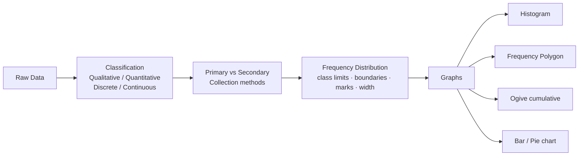
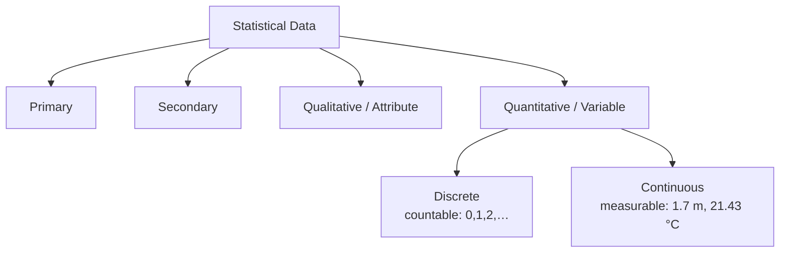
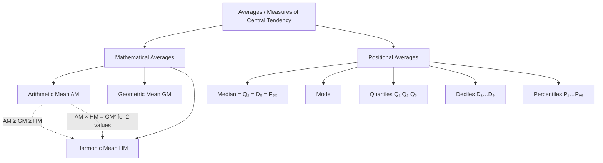
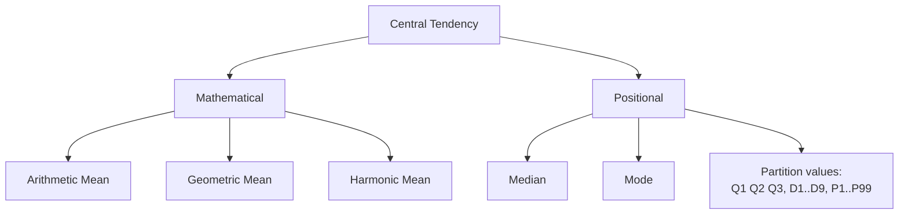
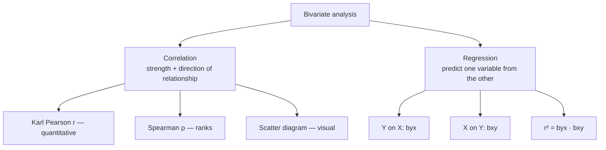
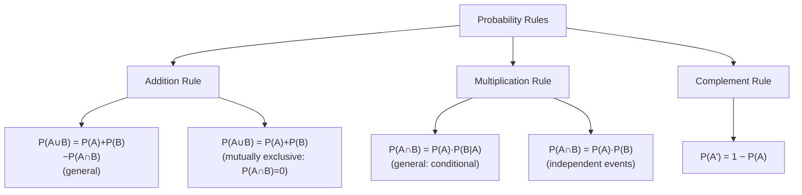
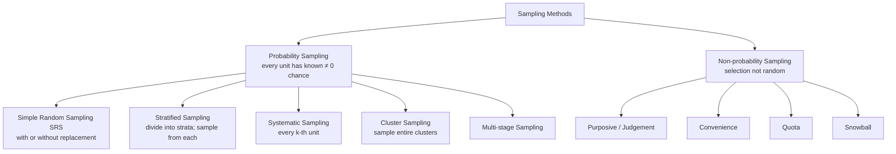
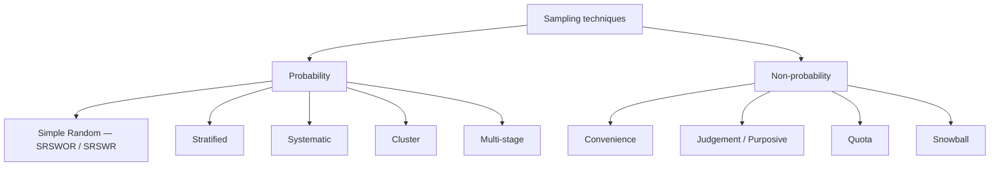
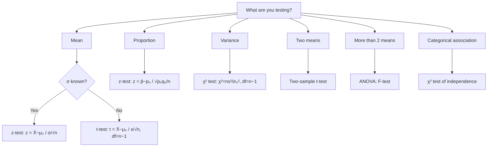

# How to use this book

This is the **only** book a JSO aspirant should need.

It is built around four hard rules:

| Rule | What it means in practice |
|------|---------------------------|
| **Examiner mindset** | For every topic we state how SSC frames it, the 3-5 angles they recycle, and the trap option they always plant. |
| **Formula → derivation → drill** | Every formula has a 1-line proof or intuition so you don't memorise blindly; then 8-15 worked PYQ-style questions per chapter. |
| **Pedagogy first** | Tables, mind maps, pitfall boxes, mnemonic boxes, recall prompts — no English paragraphs. Information is laid out like a publisher's textbook, not a blog. |
| **Self-check** | Every chapter ends with a mini-mock (10 Qs, fully solved) and active-recall prompts. Last chapter is a full 100-Q mock. |

> **The promise.** Read this book end-to-end with two passes + the embedded recall prompts and you will solve >95 of the 100 questions on JSO Paper II.

---

\newpage

# Paper map and importance dashboard

**Paper:** SSC CGL Tier-2 Paper II (Statistics) — **Junior Statistical Officer / Statistical Investigator Grade-II**

| Item | Spec |
|------|------|
| Total questions | 100 |
| Total marks | 200 |
| Marks per question | 2 |
| Negative marking | **−0.5** per wrong attempt |
| Time | 120 minutes (2 hours) |
| Mode | Computer-Based (CBT) |
| Calculator | **Yes — built-in calculator** allowed in this paper |
| Medium | English / Hindi |

## Chapter-wise importance (averaged across last 6 JSO papers)

| Ch | Topic | Avg Qs / paper | Marks (out of 200) | Importance | Difficulty |
|----|-------|----------------|--------------------|------------|------------|
| 1  | Collection, Classification, Presentation | 8 | 16 | ⭐⭐⭐⭐ HIGH | Easy |
| 2  | Measures of Central Tendency | 10 | 20 | ⭐⭐⭐⭐⭐ CRITICAL | Easy-Med |
| 3  | Measures of Dispersion | 10 | 20 | ⭐⭐⭐⭐⭐ CRITICAL | Easy-Med |
| 4  | Moments, Skewness, Kurtosis | 7 | 14 | ⭐⭐⭐⭐ HIGH | Med |
| 5  | Correlation & Regression | 10 | 20 | ⭐⭐⭐⭐⭐ CRITICAL | Med |
| 6  | Probability Theory | 8 | 16 | ⭐⭐⭐⭐⭐ CRITICAL | Med |
| 7  | Random Variable & Distributions | 10 | 20 | ⭐⭐⭐⭐⭐ CRITICAL | Med-Hard |
| 8  | Sampling Theory | 8 | 16 | ⭐⭐⭐⭐ HIGH | Easy-Med |
| 9  | Statistical Inference (Estimation + Testing) | 12 | 24 | ⭐⭐⭐⭐⭐ CRITICAL | Med-Hard |
| 10 | Analysis of Variance | 4 | 8 | ⭐⭐⭐ MEDIUM | Med |
| 11 | Time Series Analysis | 7 | 14 | ⭐⭐⭐⭐ HIGH | Easy-Med |
| 12 | Index Numbers | 6 | 12 | ⭐⭐⭐⭐ HIGH | Easy |
|    | **TOTAL** | **100** | **200** | | |

> **What this dashboard tells you.** The five **CRITICAL** chapters (2, 3, 5, 6, 7, 9) carry **120 / 200 marks** = 60%. Mastering them alone gets you to ≈108/120. With the four **HIGH** chapters added (1, 4, 8, 11, 12) you cover **88% of the paper**. ANOVA is the only area where you can afford ≤80% mastery if time is tight.

## Cut-offs reality check

Historically, the General (UR) cut-off for JSO/Statistical Investigator Gr-II has hovered in the **70–75 % band**, i.e., roughly **140–150 out of 200 marks**. Securing **≥ 90 %** (≥ 180 / 200) practically guarantees a final selection in most recruitment cycles and is the aspirational target. The exact cut-off shifts cycle to cycle based on vacancy count and competition intensity — treat 75 % as your floor, not your ceiling.

A 95% target = **190/200**. That demands ≥96 correct out of 100 (with ≤2 wrongs). It is achievable **only** if you can recognise the type instantly and the formula is already in muscle memory.

---

\newpage

# PART 0 — FOUNDATIONS YOU CANNOT SKIP

Before any topic you must be fluent in these 5 micro-skills. None is hard. Skipping one will cost you 10–15 marks across the paper.

## 0.1 Sigma (Σ) algebra — the 8 rules

Let $ c $ be a constant, $ X, Y $ be variables, $ n $ the count of observations.

| # | Rule | Example |
|---|------|---------|
| 1 | $ \sum c = nc $ | $ \sum_{i=1}^{4} 7 = 28 $ |
| 2 | $ \sum c X_i = c \sum X_i $ | constant pulls out |
| 3 | $ \sum (X_i + Y_i) = \sum X_i + \sum Y_i $ | sums distribute |
| 4 | $ \sum (X_i - \bar X) = 0 $ | **always**, by definition of mean |
| 5 | $ \sum (X_i - \bar X)^2 = \sum X_i^2 - n\bar X^2 $ | computational form of variance |
| 6 | $ \sum X_i^2 \neq (\sum X_i)^2 $ | **trap** — examiners love this |
| 7 | $ \sum X_i Y_i \neq (\sum X_i)(\sum Y_i) $ | another trap |
| 8 | $ \overline{X+Y} = \bar X + \bar Y $ but $ \overline{XY} \neq \bar X \bar Y $ (in general) | |

<div class="pitfall"><strong>Pitfall.</strong> Rule 4 is the single most-tested algebraic identity in JSO. Any "the sum of deviations from the mean is …" question — answer is <strong>0</strong>. No computation needed.</div>

## 0.2 The 3 means — when each one is asked

| Mean | Formula (raw) | Formula (frequency) | When examiner uses it |
|------|--------------|--------------------|-----------------------|
| Arithmetic (AM) | $ \bar X = \dfrac{\sum X_i}{n} $ | $ \dfrac{\sum f_i X_i}{\sum f_i} $ | Default. Anything with "average". |
| Geometric (GM) | $ (X_1 \cdot X_2 \cdots X_n)^{1/n} $ | $ \exp\!\left(\dfrac{\sum f_i \log X_i}{\sum f_i}\right) $ | Ratios, growth rates, index numbers. |
| Harmonic (HM) | $ \dfrac{n}{\sum (1/X_i)} $ | $ \dfrac{\sum f_i}{\sum f_i / X_i} $ | Speeds-over-equal-distances, rates. |

**Inequality (always true for positive observations):** $ \text{AM} \ge \text{GM} \ge \text{HM} $ with equality iff all values are equal.

**Cross-link:** $ \text{GM}^2 = \text{AM} \times \text{HM} $ **only for two positive numbers**.

## 0.3 Logarithm, antilog, exponent micro-refresher

| Identity | Use |
|----------|-----|
| $ \log(ab) = \log a + \log b $ | GM, splicing |
| $ \log(a/b) = \log a - \log b $ | index deflation |
| $ \log a^n = n \log a $ | compounded growth |
| $ e^x \cdot e^y = e^{x+y} $ | Poisson, normal |

Numerical anchors to memorise:

| $x$ | $\log_{10} x$ |
|------|------|
| 2 | 0.3010 |
| 3 | 0.4771 |
| 5 | 0.6990 |
| 7 | 0.8451 |
| $\pi$ | 0.4971 |
| $e$ | 0.4343 |

## 0.4 Combinatorics — only what you'll need

| Symbol | Meaning | Formula |
|--------|---------|---------|
| $ n! $ | factorial | $ n \cdot (n-1) \cdots 1 $, and $ 0! = 1 $ |
| $ {}^n P_r $ | permutations | $ \dfrac{n!}{(n-r)!} $ |
| $ {}^n C_r $ | combinations | $ \dfrac{n!}{r!(n-r)!} $ |

Memorise the Pascal row up to $n=10$ — it solves binomial probability and sampling questions in 5 seconds.

## 0.5 Greek-letter cheat-sheet (population vs sample)

| Quantity | Population (parameter) | Sample (statistic) |
|----------|-----------------------|--------------------|
| Mean | $ \mu $ | $ \bar X $ |
| Variance | $ \sigma^2 $ | $ s^2 $ |
| Std deviation | $ \sigma $ | $ s $ |
| Proportion | $ P $ (or $ \pi $) | $ p $ |
| Correlation | $ \rho $ | $ r $ |
| Size | $ N $ | $ n $ |

> **Examiner trap.** Whenever a question swaps $ N $ and $ n $ inside a variance formula, one of the four options will be the wrong-divisor answer. Always read which formula is asked: **population variance** uses $ N $; **sample variance** uses $ n-1 $.

---

\newpage

# CHAPTER 1 — Collection, Classification & Presentation of Data

**Importance:** ⭐⭐⭐⭐ HIGH (≈8 Qs / paper)
**Difficulty:** Easy. Don't lose marks here — it's free fuel for your 95% target.

## 1.0 — Understanding Data Presentation from First Principles

<div class="intuition">

**Why does data presentation exist — and why does statistics start here?**

Suppose a government officer hands you a printout listing the ages of 10,000 school children, in the order they were recorded. Can you tell — just from staring at that list — what the typical age is? Whether most children fall in a narrow band or are spread across a wide range? Whether there are unusual outliers? No. Raw data in that form is nearly useless for decision-making.

**Data presentation** is the process of transforming raw data into an organised form that reveals its structure. The moment you group 10,000 ages into bins (5–7, 7–9, 9–11 years) and count how many fall in each bin, a pattern emerges. When you draw those counts as bars, the shape of the distribution becomes visible in seconds. An administrator can now see at a glance that most children are 8–10 years old, that there is a small cluster of over-age enrolments, and that the distribution is slightly skewed right.

**The chain of chapters:** Every statistical measure you will compute in Chapters 2–12 — mean, variance, correlation coefficient, regression line, test statistic — is computed from an organised frequency distribution, not from raw lists. **This chapter is the entry gate to all of statistics.**

</div>

**Chapter roadmap — what you will learn:**



**Why multiple graph types?** Each graph reveals a different property of the data:

| Graph | What it reveals | When to use |
|-------|----------------|-------------|
| Histogram | Shape of distribution (symmetric, skewed, bimodal) | Grouped continuous data |
| Frequency Polygon | Shape + easy to overlay two distributions | Same as histogram; comparison |
| Less-than Ogive | Cumulative %: "what % below value X?" | Reading median, quartiles graphically |
| More-than Ogive | Cumulative % from above | Crossing point of two ogives = median |
| Bar chart | Comparison between discrete categories | Discrete or categorical data |
| Pie chart | Part-of-whole (each slice = % of total) | Proportions add to 100% |
| Frequency Curve | Smooth theoretical shape | Large datasets; theoretical models |

<div class="keypoint">

**The histogram trap — unequal class widths.**
When class widths are different, you CANNOT draw bar heights proportional to frequency. You must use **frequency density** = $\text{frequency} \div \text{class width}$ on the Y-axis. Otherwise wider classes look artificially more frequent. This trap appears in at least one JSO question every two papers.

</div>

**Concept: Inclusive vs Exclusive class intervals**

| Form | Example | Contains | How to convert |
|------|---------|---------|----------------|
| Exclusive | 10–20, 20–30 | $10 \leq X < 20$ | Ready to use directly |
| Inclusive | 10–19, 20–29 | $10 \leq X \leq 19$ | Subtract 0.5 from lower, add 0.5 to upper boundary |

So the class 10–19 (inclusive) has boundaries 9.5–19.5, class mark = $(9.5+19.5)/2 = 14.5$.

**Solved Example 1.A:** The heights (cm) of 30 students are recorded. Classes used: 150–155, 155–160, 160–165, 165–170, 170–175 with frequencies 3, 7, 12, 6, 2. Find: (i) class mark of 160–165, (ii) class boundaries if data were in inclusive form 160–164.

> (i) Class mark = $(160+165)/2 = \mathbf{162.5}$ cm.
>
> (ii) Boundaries: lower = $160 - 0.5 = 159.5$; upper = $164 + 0.5 = 164.5$. Class width = 5.

**Solved Example 1.B:** From the ogive below (less-than type), find the median graphically.

> Locate $N/2$ on the Y-axis (cumulative frequency). Draw a horizontal line to the ogive curve, then drop vertically to the X-axis. The value on the X-axis is the median. *(In an exam, this is always a reading exercise — examiners give you a scale and expect you to read off the value at N/2.)*

## 1.1 Examiner mindset

| Angle examiner uses | What you must know |
|--------------------|--------------------|
| Definition / type of data | Primary vs Secondary; Qualitative vs Quantitative; Discrete vs Continuous |
| Methods of primary data collection | Direct, indirect, mailed questionnaire, schedule, observation |
| Frequency-distribution mechanics | Class limits, class boundaries, class mark, width, inclusive vs exclusive |
| Diagrammatic & graphical presentation | Histogram, freq polygon, ogive, pie, bar (simple/multiple/sub-divided) |
| Which graph is best when | Histogram for grouped data; pie for parts-of-whole; bar for comparison; ogive to read median/quartiles |

## 1.2 Data classification — the family tree



## 1.3 Primary vs Secondary — fact card

| Aspect | Primary | Secondary |
|--------|---------|-----------|
| Origin | Collected first-hand by the investigator | Collected by someone else, used as-is |
| Cost | High | Low |
| Time | High | Low |
| Reliability | Higher | Depends on source |
| Examples | Census enumeration, your own field survey | RBI Bulletin, Economic Survey, NSS reports |

## 1.4 Methods of primary data collection

| Method | Used when | Pro | Con |
|--------|-----------|-----|-----|
| Direct personal interview | Small area, sensitive issue | High accuracy | Costly |
| Indirect oral investigation | Witnesses, third parties | Good for crime/illness | Bias risk |
| Local correspondents | Routine area-wise reporting | Low cost | Non-uniform |
| Mailed questionnaire | Wide, literate population | Cheap, large scale | Low response |
| Schedule sent through enumerator | Mixed-literacy population | Higher response than mail | Costlier than mail |
| Observation method | Behaviour studies | Objective | Time-intensive |

## 1.5 Frequency-distribution vocabulary

Suppose a class is written **20–30**.

| Term | Meaning | Value here |
|------|---------|-----------|
| Lower limit ($L$) | Smallest value the class includes | 20 |
| Upper limit ($U$) | Largest value the class includes | 30 |
| Class width ($h$) | $ U - L $ | 10 |
| Class mark / mid-value ($m$) | $ (L+U)/2 $ | 25 |
| Class boundaries (continuous form) | $ L - 0.5 $ to $ U + 0.5 $ (for inclusive series) | 19.5 – 30.5 |
| Frequency ($f$) | Count of observations in the class | given |
| Cumulative frequency | Running total of $f$ | computed |
| Relative frequency | $ f / \sum f $ | a proportion |

**Inclusive vs exclusive class:**

| Form | Looks like | Includes |
|------|-----------|----------|
| Exclusive | 20 – 30, 30 – 40 | 20 ≤ X < 30 |
| Inclusive | 20 – 29, 30 – 39 | 20 ≤ X ≤ 29 |

To convert inclusive → exclusive: subtract 0.5 from each lower limit and add 0.5 to each upper limit.

## 1.6 Graphs — when to use which

| Graph | Best use | Key construction note |
|-------|---------|-----------------------|
| **Histogram** | Continuous frequency data | Bars touch; height × width = frequency density when class widths differ |
| **Frequency polygon** | Comparing distributions | Join class marks with straight lines; close to baseline at both ends |
| **Frequency curve** | Smoothed shape of distribution | Smooth the polygon |
| **Ogive (cumulative)** | Median, quartiles, percentiles | "Less-than" ogive rises; "more-than" ogive falls; intersection = median |
| **Pie chart** | Composition / parts of whole | Angle = (class freq / total) × 360° |
| **Bar chart (simple/multiple/sub-divided)** | Discrete categories, comparison | Bars do **not** touch |

<div class="mnemonic"><strong>Mnemonic — "HOPe to Be a STAR".</strong><br/>
<strong>H</strong>istogram = grouped freq.<br/>
<strong>O</strong>give = cumulative freq → median.<br/>
<strong>P</strong>ie = parts of whole.<br/>
<strong>B</strong>ar = compare categories.</div>

### Histogram — what one looks like

<div style="text-align:center; margin:14pt 0;">
<svg width="480" height="200" viewBox="0 0 480 200" xmlns="http://www.w3.org/2000/svg" font-family="DejaVu Sans, sans-serif" font-size="10">
  <!-- axes -->
  <line x1="50" y1="10" x2="50" y2="165" stroke="#374151" stroke-width="1.5"/>
  <line x1="50" y1="165" x2="450" y2="165" stroke="#374151" stroke-width="1.5"/>
  <!-- bars (equal width = 72px each) -->
  <rect x="50"  y="135" width="72" height="30"  fill="#93c5fd" stroke="#1d4ed8" stroke-width="1"/>
  <rect x="122" y="100" width="72" height="65"  fill="#60a5fa" stroke="#1d4ed8" stroke-width="1"/>
  <rect x="194" y="55"  width="72" height="110" fill="#3b82f6" stroke="#1d4ed8" stroke-width="1"/>
  <rect x="266" y="80"  width="72" height="85"  fill="#60a5fa" stroke="#1d4ed8" stroke-width="1"/>
  <rect x="338" y="120" width="72" height="45"  fill="#93c5fd" stroke="#1d4ed8" stroke-width="1"/>
  <!-- x-axis labels -->
  <text x="86"  y="180" text-anchor="middle" fill="#374151">10</text>
  <text x="158" y="180" text-anchor="middle" fill="#374151">20</text>
  <text x="230" y="180" text-anchor="middle" fill="#374151">30</text>
  <text x="302" y="180" text-anchor="middle" fill="#374151">40</text>
  <text x="374" y="180" text-anchor="middle" fill="#374151">50</text>
  <text x="410" y="180" text-anchor="middle" fill="#374151">60</text>
  <!-- y-axis labels -->
  <text x="44" y="138" text-anchor="end" fill="#374151">5</text>
  <text x="44" y="103" text-anchor="end" fill="#374151">10</text>
  <text x="44" y="58"  text-anchor="end" fill="#374151">15</text>
  <!-- axis labels -->
  <text x="250" y="197" text-anchor="middle" fill="#1d4ed8" font-weight="bold">Class intervals</text>
  <text x="16"  y="90"  text-anchor="middle" fill="#1d4ed8" font-weight="bold" transform="rotate(-90,16,90)">Frequency</text>
  <!-- annotation: bars TOUCH -->
  <text x="265" y="20" text-anchor="middle" fill="#b45309" font-size="9" font-style="italic">Bars touch — no gap (unlike bar chart)</text>
  <text x="230" y="35" text-anchor="middle" fill="#374151" font-size="9">← tallest bar = modal class</text>
</svg>
</div>

### Less-than Ogive and More-than Ogive — how they look

<div style="text-align:center; margin:14pt 0;">
<svg width="480" height="210" viewBox="0 0 480 210" xmlns="http://www.w3.org/2000/svg" font-family="DejaVu Sans, sans-serif" font-size="10">
  <!-- axes -->
  <line x1="50" y1="10" x2="50" y2="170" stroke="#374151" stroke-width="1.5"/>
  <line x1="50" y1="170" x2="450" y2="170" stroke="#374151" stroke-width="1.5"/>
  <!-- Less-than ogive (rising S-curve) -->
  <polyline points="50,170 130,158 210,130 290,85 370,45 410,22 450,15"
            fill="none" stroke="#2563eb" stroke-width="2"/>
  <!-- More-than ogive (falling S-curve) -->
  <polyline points="50,15 90,22 130,45 210,85 290,130 370,158 450,170"
            fill="none" stroke="#dc2626" stroke-width="2"/>
  <!-- Intersection point at median -->
  <circle cx="250" cy="93" r="4" fill="#15803d"/>
  <line x1="250" y1="93" x2="250" y2="170" stroke="#15803d" stroke-width="1.5" stroke-dasharray="4,3"/>
  <text x="254" y="168" fill="#15803d" font-size="9" font-weight="bold">Median</text>
  <!-- N/2 horizontal -->
  <line x1="50" y1="93" x2="250" y2="93" stroke="#15803d" stroke-width="1" stroke-dasharray="4,3"/>
  <text x="52" y="90" fill="#15803d" font-size="9">N/2 ─</text>
  <!-- legend -->
  <line x1="60" y1="30" x2="85" y2="30" stroke="#2563eb" stroke-width="2"/>
  <text x="88" y="34" fill="#2563eb">Less-than ogive (rises)</text>
  <line x1="60" y1="48" x2="85" y2="48" stroke="#dc2626" stroke-width="2"/>
  <text x="88" y="52" fill="#dc2626">More-than ogive (falls)</text>
  <!-- x-axis labels -->
  <text x="130" y="184" text-anchor="middle" fill="#374151">10</text>
  <text x="210" y="184" text-anchor="middle" fill="#374151">20</text>
  <text x="290" y="184" text-anchor="middle" fill="#374151">30</text>
  <text x="370" y="184" text-anchor="middle" fill="#374151">40</text>
  <!-- y-axis label -->
  <text x="16" y="90" text-anchor="middle" fill="#1d4ed8" font-weight="bold" transform="rotate(-90,16,90)">Cumulative freq</text>
  <text x="250" y="200" text-anchor="middle" fill="#1d4ed8" font-weight="bold">Class boundaries</text>
</svg>
</div>

<div class="keypoint">

**Key ogive fact:** The two ogives ALWAYS intersect at exactly the **median** point (cumulative frequency = N/2). Examiners show you the intersection and ask "what does it represent?" — answer: median.

</div>

## 1.7 Histogram with unequal class widths — the only trap

When class widths differ, you must plot **frequency density** (= $ f / h $) on the y-axis, **not** raw frequency. Otherwise the visual impression lies.

**Example.** Classes 0–10 (f=20), 10–20 (f=30), 20–40 (f=40).
Density = 20/10 = 2, 30/10 = 3, 40/20 = **2** (not 4).

## 1.8 Worked PYQ-style examples

<div class="worked" markdown="block">

**Q 1.1.** Class 30 – 40 has frequency 25. Its class mark is:
**(a) 30** **(b) 35** **(c) 40** **(d) 25**

**Step 1 — Apply the class mark formula.**

- Class mark = $(L + U) / 2$
- = $(30 + 40) / 2$
- = $70 / 2$
- = **35**

**Ans (b).**

*Trap.* (a) lower limit, (c) upper limit, (d) the frequency itself.

</div>

<div class="worked" markdown="block">

**Q 1.2.** A pie chart shows education spending as 25 % of a state's outlay. The corresponding angle is:
**(a) 25°** **(b) 90°** **(c) 25/360 °** **(d) 100°**

**Step 1 — Apply the pie-chart angle formula.**

- Angle = share (%) × 360° / 100
- = 25 × 360° / 100
- = **90°**

**Ans (b).**

</div>

<div class="worked" markdown="block">

**Q 1.3.** Convert inclusive class **40–49** to exclusive form.

**Soln.** Lower boundary = 40 − 0.5 = 39.5. Upper boundary = 49 + 0.5 = **49.5**.
Exclusive: **39.5 – 49.5**. Class width = 10.

</div>

<div class="worked" markdown="block">

**Q 1.4.** Which graph is best for locating the median?
**(a) Pie** **(b) Histogram** **(c) Ogive** **(d) Bar**

**Soln.** From a less-than ogive, drop a perpendicular at $ N/2 $ cumulative frequency to the x-axis → **median**. **Ans (c).**

</div>

<div class="worked" markdown="block">

**Q 1.5.** Below is a frequency table.

| Class | 0–10 | 10–20 | 20–30 | 30–40 |
|-------|------|-------|-------|-------|
| f     | 5    | 8     | 12    | 5     |

Find cumulative frequency of class 20–30 (less-than form).

**Soln.** "Less than 30" = 5 + 8 + 12 = **25**.

</div>

<div class="worked" markdown="block">

**Q 1.6.** A study uses RBI Bulletin to compute inflation. The data is:
**(a) Primary** **(b) Secondary** **(c) Internal** **(d) Manual**

**Soln.** Already published by RBI → secondary. **Ans (b).**

</div>

<div class="worked" markdown="block">

**Q 1.7.** Which is **NOT** a method of primary data collection?
**(a) Direct personal interview** **(b) Mailed questionnaire** **(c) NSS published reports** **(d) Schedule through enumerator**

**Soln.** NSS published reports = secondary. **Ans (c).**

</div>

<div class="worked" markdown="block">

**Q 1.8.** A frequency distribution has class widths 5, 5, 10, 10. Frequencies 20, 25, 50, 30. To draw the histogram correctly, the bar heights should be (in same order):
**(a) 20, 25, 50, 30**  **(b) 4, 5, 5, 3**  **(c) 4, 5, 10, 6**  **(d) 20, 25, 25, 15**

**Step 1 — Compute frequency density = f / h for each class.**

- Class 1 (width 5): 20 / 5 = 4
- Class 2 (width 5): 25 / 5 = 5
- Class 3 (width 10): 50 / 10 = 5
- Class 4 (width 10): 30 / 10 = 3

Heights = **4, 5, 5, 3**.  **Ans (b).**

</div>

<div class="worked" markdown="block">

**Q 1.9.** A frequency polygon is constructed by joining:
**(a) Lower limits** **(b) Upper limits** **(c) Class marks** **(d) Class widths**

**Soln.** Class marks (mid-points). **Ans (c).**

</div>

<div class="worked" markdown="block">

**Q 1.10.** In a "more-than" ogive, the curve generally:
**(a) Rises** **(b) Falls** **(c) Is flat** **(d) Is U-shaped**

**Soln.** Cumulative frequencies decrease as the lower limit increases → **falls**. **Ans (b).**

</div>

## 1.9 Trap-recognition card

| Trap option you'll see | Why wrong | Tell |
|-----------------------|-----------|------|
| "Histogram bars don't touch" | False — histogram bars **touch**; only bar charts have gaps. | Don't confuse the two. |
| "Pie angle = % directly" | Angle = % × 360° / 100, not the % itself. | Always multiply. |
| "Use raw f for unequal widths" | Must use density. | Question will explicitly mention different widths. |
| "Mailed questionnaire is secondary" | It's primary (you designed it). | Source-of-data ≠ medium. |

## 1.10 Mini-mock (10 Qs, all solved)

| # | Q | Ans |
|---|----|-----|
| 1 | Class mark of 50–60 = ? | 55 |
| 2 | Total frequency = 200; sector for "Education" = 72°. % share? | 72/360 × 100 = **20%** |
| 3 | Class 100–149 inclusive → exclusive lower boundary? | 99.5 |
| 4 | The graph used to show parts of a whole is? | Pie |
| 5 | Class width if classes are 0–4, 5–9, 10–14? | 5 |
| 6 | Height of histogram bar when classes have unequal widths? | Frequency density |
| 7 | "Less-than" ogive intersected with N/2 horizontal line gives? | Median |
| 8 | A schedule is filled by? | The enumerator |
| 9 | Census of India data when used in a study is? | Secondary |
| 10 | A bar chart's bars are? | Separated (do not touch) |

## 1.11 Active-recall prompts (cover the answers, then test)

1. State the formula for class mark.
2. List four methods of collecting primary data.
3. Write the formula for the angle in a pie chart corresponding to a frequency $f$ when total frequency is $N$.
4. Why do histogram bars touch but bar-chart bars don't?
5. What is plotted on the y-axis of a histogram with unequal class widths?

---

\newpage

# CHAPTER 2 — Measures of Central Tendency

**Importance:** ⭐⭐⭐⭐⭐ CRITICAL (≈10 Qs / paper)
**Difficulty:** Easy–Medium. This is your foundation for Dispersion, Moments, Skewness — every later chapter assumes you can find a mean in 5 seconds.

## 2.0 — Understanding Central Tendency from First Principles

<div class="intuition">

**What is "central tendency" and why do we need more than one type of average?**

Any dataset can be summarised along two dimensions: *where it is centred* and *how spread out it is*. Central tendency addresses the first: what single number best represents the "middle" or "typical" value of the data?

The **arithmetic mean** is the most natural answer — add everything up and divide by count. But it has a fatal flaw: **it is sensitive to extreme values**. Consider 9 workers earning ₹20,000 each and 1 CEO earning ₹10,000,000. The mean salary is ≈ ₹1,018,000 — a number that describes nobody in the company. The **median** (the middle value when sorted: ₹20,000) is far more representative of what a typical employee earns.

The **mode** (most frequent value) reveals a different truth: in a bimodal distribution with two peaks, the mean and median both land somewhere in the valley between the peaks — describing the least common outcome! The mode correctly identifies both peaks.

**Why three averages exist:** Different types of phenomena need different summaries.
- AM is best when the process is additive (total is meaningful — total marks, total production).
- GM is best when the process is multiplicative (compound interest, growth rates, index ratios).
- HM is best when the process involves rates and equal denominators (speeds over equal distances, costs per unit with equal budgets).

</div>

**Concept map — the family of averages:**



**How AM, Median and Mode relate to distribution shape** — a visual you must be able to recall instantly:

```
SYMMETRIC:          Mode = Median = Mean
                         ↑
                    _____|_____
                   /           \
                  /             \
─────────────────────────────────────

POSITIVE SKEW       Mo  Md   Mn →
(long right tail):   ↑   ↑    ↑
                  __|___|_____|___
                 /               \___
─────────────────────────────────────

NEGATIVE SKEW  ← Mn  Md   Mo
(long left tail):  ↑   ↑    ↑
               ___/____________|___
              /               |
─────────────────────────────────────
```

<div class="formula">

**Key relationships (memorise all four):**

$$\bar{X} = A + \frac{\sum f_i u_i}{\sum f_i} \times h \quad \text{(step-deviation method — fastest for grouped data)}$$

$$\text{Median} = L + \frac{\frac{N}{2} - F}{f} \times h$$

$$\text{Mode} = L + \frac{f_1 - f_0}{2f_1 - f_0 - f_2} \times h$$

$$\boxed{\text{Mode} = 3\,\text{Median} - 2\,\text{Mean}} \quad \text{(empirical relation — used to find the third when two are known)}$$

</div>

**Solved Example 2.A — Combined mean (very frequent exam question):**

A factory has two shifts. Morning shift: 40 workers, average wage ₹600. Evening shift: 60 workers, average wage ₹500. What is the overall average wage?

<div class="steps" markdown="block">

**Step 1 — Apply the combined-mean formula.**

- $\bar{X}_{12} = \dfrac{n_1 \bar{X}_1 + n_2 \bar{X}_2}{n_1 + n_2}$

**Step 2 — Substitute the two shift sizes and averages.**

- = $\dfrac{40 \times 600 + 60 \times 500}{40 + 60}$
- = $\dfrac{24000 + 30000}{100}$

**Step 3 — Simplify to the final answer.**

- = $\dfrac{54000}{100}$
- = **₹540**

</div>

**Solved Example 2.B — When to use HM (the most common trap):**

A car travels 120 km at 60 km/h and returns 120 km at 40 km/h. What is the average speed for the whole journey?

<div class="steps" markdown="block">

**Step 1 — Identify the correct mean.** Equal distances at different speeds ⇒ use **HM**, not AM.

**Step 2 — Apply the HM formula for two values: HM = 2 / (1/a + 1/b).**

- HM = $\dfrac{2}{\frac{1}{60} + \frac{1}{40}}$

**Step 3 — Combine the reciprocals using a common denominator (LCM = 120).**

- $\dfrac{1}{60} + \dfrac{1}{40} = \dfrac{2}{120} + \dfrac{3}{120} = \dfrac{5}{120}$

**Step 4 — Compute the HM.**

- HM = $\dfrac{2}{5/120}$
- = $\dfrac{2 \times 120}{5}$
- = $\dfrac{240}{5}$
- = **48 km/h**

*Why not AM?* AM gives $(60+40)/2 = 50$ km/h. Verify: time = $120/60 + 120/40 = 2 + 3 = 5$ h; total distance = 240 km; average speed = $240/5 = 48$ km/h ✓ HM is correct.

</div>

**Solved Example 2.C — Median for grouped data (step by step):**

| Class | 0–10 | 10–20 | 20–30 | 30–40 | 40–50 |
|-------|------|-------|-------|-------|-------|
| Frequency | 5 | 8 | 15 | 7 | 5 |

Find the median.

<div class="steps" markdown="block">

**Step 1 — Compute total frequency N and N/2.**

- $N = 5 + 8 + 15 + 7 + 5 = 40$
- $N/2 = 20$

**Step 2 — Build the cumulative-frequency column.**

- CF: 5, 13, 28, 35, 40

**Step 3 — Locate the median class — first class whose CF ≥ N/2.**

- 28 ≥ 20 → **median class = 20–30**

**Step 4 — Identify the formula symbols.**

- $L = 20$ (lower boundary), $F = 13$ (CF before median class), $f = 15$ (freq of median class), $h = 10$

**Step 5 — Apply the median formula.**

- $\text{Median} = L + \dfrac{(N/2) - F}{f} \times h$
- = $20 + \dfrac{20 - 13}{15} \times 10$
- = $20 + \dfrac{70}{15}$
- = $20 + 4.67$
- = **24.67**

</div>

**Solved Example 2.D — GM for growth rates:**

A company's sales grew by 10% in Year 1 and 40% in Year 2. What is the average annual growth rate?

<div class="steps" markdown="block">

**Step 1 — Convert growth rates to multipliers.**

- Year 1: $1 + 10/100 = 1.10$
- Year 2: $1 + 40/100 = 1.40$

**Step 2 — Apply the GM formula for two values: GM = √(a × b).**

- GM = $\sqrt{1.10 \times 1.40}$
- = $\sqrt{1.54}$
- ≈ **1.2410**

**Step 3 — Convert back to a percentage growth rate.**

- Average annual growth $= 1.2410 - 1 = 0.2410$
- ≈ **24.1% per year**

*Check:* ₹100 → ₹110 (Year 1) → ₹154 (Year 2). Two-year growth = 54%. Annual rate $= \sqrt{1.54} - 1 \approx 24.1\%$ ✓

</div>

## 2.1 Examiner mindset

| Angle | They ask it as | Marks-share |
|-------|----------------|-------------|
| Pure formula | "Find mean of … " (raw / discrete / grouped) | 3-4 Qs |
| Properties of AM | "Sum of deviations from mean = ?" → 0; "If each value increased by k, mean = ?" → $\bar X + k$ | 1-2 Qs |
| Combined / weighted mean | Two groups with sizes $n_1, n_2$ and means $\bar X_1, \bar X_2$ | 1-2 Qs |
| Median / Mode of grouped data | Direct formula with class containing the median / mode | 2-3 Qs |
| Empirical mode | Mode = 3 Median − 2 Mean | 1 Q |
| Partition values | Quartiles, deciles, percentiles from ogive or formula | 1-2 Qs |
| AM-GM-HM relation | AM ≥ GM ≥ HM; $ GM^2 = AM \cdot HM $ (for two values) | 1 Q |

## 2.2 Mind map



## 2.3 Arithmetic Mean — three computational forms

### Direct method

| Data type | Formula |
|-----------|---------|
| Raw / ungrouped | $ \bar X = \dfrac{\sum X_i}{n} $ |
| Discrete frequency | $ \bar X = \dfrac{\sum f_i X_i}{\sum f_i} $ |
| Continuous (grouped) | $ \bar X = \dfrac{\sum f_i m_i}{\sum f_i} $, $ m_i $ = class mark |

### Assumed-mean (short-cut) method

Pick any $A$ (preferably a middle class mark). Let $d_i = X_i - A$.

$$
\bar X = A + \dfrac{\sum f_i d_i}{\sum f_i}
$$

### Step-deviation method

Pick $A$, let $u_i = (X_i - A)/h$ where $h$ = common class width.

$$
\bar X = A + \dfrac{\sum f_i u_i}{\sum f_i} \times h
$$

This is the fastest for grouped data with equal class widths. **Memorise it.**

## 2.4 Five key properties of AM (very high-yield)

| # | Property | One-line proof / use |
|---|----------|---------------------|
| P1 | $ \sum (X_i - \bar X) = 0 $ | by definition of mean |
| P2 | $ \sum (X_i - \bar X)^2 $ is **minimum** (less than for any other constant) | least-squares property |
| P3 | If $ Y_i = X_i + k $ then $ \bar Y = \bar X + k $ | shift property |
| P4 | If $ Y_i = c X_i $ then $ \bar Y = c \bar X $ | scale property |
| P5 | Combined mean of two groups: $ \bar X_{12} = \dfrac{n_1 \bar X_1 + n_2 \bar X_2}{n_1 + n_2} $ | weighted by size |

<div class="mnemonic"><strong>P1 is asked every alternate paper.</strong> If a question says "the algebraic sum of the deviations of values from their arithmetic mean is …", the answer is <strong>zero</strong>. Move on.</div>

## 2.5 Geometric and Harmonic means — when each is correct

| Setup | Use | Why |
|-------|-----|-----|
| Average growth rate over years (e.g., 10%, 20%, 30% in three years) | **GM** | Multiplicative process |
| Average ratio (price relative, index numbers) | **GM** | Symmetric in ratios |
| Avg speed when **equal distances** at different speeds | **HM** | Time = distance/speed; HM gives correct total-time average |
| Avg cost per unit when fixed expenditure spent at different prices | **HM** | Same as above with money |
| Average of measurements | **AM** | Default |

**Two-value identity:** $ \text{AM} \times \text{HM} = \text{GM}^2 $ (only for two positive numbers).

## 2.6 Median — formula for grouped data

$$
\text{Median} = L + \dfrac{(N/2) - F}{f} \times h
$$

| Symbol | Meaning |
|--------|---------|
| $L$ | lower boundary of the **median class** |
| $N$ | total frequency, $\sum f_i$ |
| $F$ | cumulative frequency **before** the median class |
| $f$ | frequency of the median class |
| $h$ | class width |

**Median class** = the class where cumulative frequency first reaches $ N/2 $.

## 2.7 Mode — formula for grouped data

$$
\text{Mode} = L + \dfrac{f_1 - f_0}{2 f_1 - f_0 - f_2} \times h
$$

| Symbol | Meaning |
|--------|---------|
| $L$ | lower boundary of the **modal class** (the class with maximum freq) |
| $f_1$ | frequency of modal class |
| $f_0$ | frequency of class **just before** modal class |
| $f_2$ | frequency of class **just after** modal class |
| $h$ | class width |

## 2.8 Empirical relation (memorise both forms)

$$
\boxed{\text{Mode} = 3\,\text{Median} - 2\,\text{Mean}}
\quad \Longleftrightarrow \quad
\text{Mean} - \text{Mode} = 3(\text{Mean} - \text{Median})
$$

Used when the question gives two of the three and asks the third.

## 2.9 Partition values

| Quantity | What it splits | Formula (grouped data) |
|----------|---------------|------------------------|
| Median ($Q_2$) | bottom 50% / top 50% | $ L + \dfrac{N/2 - F}{f} h $ |
| Quartile $Q_k$ ($k=1,2,3$) | quarters | replace $N/2$ with $kN/4$ |
| Decile $D_k$ ($k=1\ldots9$) | tenths | replace with $kN/10$ |
| Percentile $P_k$ ($k=1\ldots99$) | hundredths | replace with $kN/100$ |

So $ Q_2 = D_5 = P_{50} = $ Median.

## 2.10 Which average for which shape?

| Distribution shape | Mean–Median–Mode order |
|--------------------|-----------------------|
| Symmetric | Mean = Median = Mode |
| Positively skewed (long right tail) | **Mode < Median < Mean** |
| Negatively skewed (long left tail) | **Mean < Median < Mode** |

Visual:

```
positive skew (right-tailed):    Mo  Me  Mn  →
negative skew (left-tailed):     ←  Mn  Me  Mo
```

## 2.11 Worked PYQ-style examples

<div class="worked" markdown="block">

**Q 2.1.** Mean of 5, 7, 9, 11, 13.

**Step 1 — Apply the AM formula: $\bar X = \sum X_i / n$.**

- $\bar X = (5 + 7 + 9 + 11 + 13) / 5$

**Step 2 — Add the values and divide.**

- = $45 / 5$
- = **9**

</div>

<div class="worked" markdown="block">

**Q 2.2.** A class has 30 students with mean weight 50 kg. Another has 20 with mean 60 kg. Combined mean?

**Step 1 — Apply the combined-mean (weighted) formula.**

- $\bar X_{12} = \dfrac{n_1 \bar X_1 + n_2 \bar X_2}{n_1 + n_2}$

**Step 2 — Substitute the two group sizes and means.**

- = $\dfrac{30 \cdot 50 + 20 \cdot 60}{30 + 20}$
- = $\dfrac{1500 + 1200}{50}$

**Step 3 — Simplify.**

- = $\dfrac{2700}{50}$
- = **54 kg**

</div>

<div class="worked" markdown="block">

**Q 2.3.** The mean of 10 values is 25. If each value is multiplied by 4 and then 6 is subtracted, the new mean is:

**Step 1 — Apply scale property P4: $\overline{cX} = c \bar X$.**

- New mean after × 4 = $4 \cdot 25$
- = **100**

**Step 2 — Apply shift property P3: $\overline{X - k} = \bar X - k$.**

- New mean after − 6 = $100 - 6$
- = **94**

</div>

<div class="worked" markdown="block">

**Q 2.4.** A man travels 60 km at 30 km/h and another 60 km at 60 km/h. Average speed?

**Step 1 — Identify the correct mean.** Equal distances at different speeds ⇒ use **HM**, not AM.

**Step 2 — Apply HM formula for two values: HM = 2 / (1/a + 1/b).**

- HM = $\dfrac{2}{(1/30) + (1/60)}$

**Step 3 — Combine the reciprocals (LCM = 60).**

- $\dfrac{1}{30} + \dfrac{1}{60} = \dfrac{2}{60} + \dfrac{1}{60} = \dfrac{3}{60}$

**Step 4 — Compute the HM.**

- HM = $\dfrac{2}{3/60} = \dfrac{2 \times 60}{3} = \dfrac{120}{3}$
- = **40 km/h**

*Trap.* AM gives 45 — wrong because the two trips take different times.

</div>

<div class="worked" markdown="block">

**Q 2.5.** GM of 4 and 16.

**Step 1 — Apply the two-value GM formula: GM = √(a · b).**

- GM = $\sqrt{4 \cdot 16}$
- = $\sqrt{64}$
- = **8**

</div>

<div class="worked" markdown="block">

**Q 2.6.** For the table below, find the median.

| Class | 0–10 | 10–20 | 20–30 | 30–40 | 40–50 |
|-------|------|-------|-------|-------|-------|
| f     | 5    | 8     | 15    | 7     | 5     |

**Step 1 — Compute N and N/2.**

- $N = 5 + 8 + 15 + 7 + 5 = 40$
- $N/2 = 20$

**Step 2 — Build the cumulative-frequency column.**

- CF: 5, 13, 28, 35, 40

**Step 3 — Locate the median class — first CF that reaches or crosses N/2 = 20.**

- 28 ≥ 20 → **median class = 20–30**

**Step 4 — Identify the formula symbols.**

- $L = 20$, $F = 13$, $f = 15$, $h = 10$

**Step 5 — Apply the median formula.**

- $\text{Median} = L + \dfrac{(N/2) - F}{f} \times h$
- = $20 + \dfrac{20 - 13}{15} \times 10$
- = $20 + \dfrac{70}{15}$
- = $20 + 4.67$
- = **24.67**

</div>

<div class="worked" markdown="block">

**Q 2.7.** Same table, find mode.

**Step 1 — Locate the modal class (class with the highest frequency).**

- Highest $f = 15$ → **modal class = 20–30**

**Step 2 — Identify the formula symbols.**

- $L = 20$, $f_1 = 15$, $f_0 = 8$, $f_2 = 7$, $h = 10$

**Step 3 — Apply the mode formula.**

- $\text{Mode} = L + \dfrac{f_1 - f_0}{2 f_1 - f_0 - f_2} \times h$
- = $20 + \dfrac{15 - 8}{2 \cdot 15 - 8 - 7} \times 10$
- = $20 + \dfrac{7}{15} \times 10$
- = $20 + 4.67$
- = **24.67**

Coincidence here; usually Mode and Median differ.

</div>

<div class="worked" markdown="block">

**Q 2.8.** Mean = 36, Median = 32. Mode by empirical relation?

**Step 1 — Apply the empirical relation: Mode = 3 Median − 2 Mean.**

- Mode = $3 \times 32 - 2 \times 36$

**Step 2 — Simplify.**

- = $96 - 72$
- = **24**

</div>

<div class="worked" markdown="block">

**Q 2.9.** AM and HM of two positive numbers are 9 and 4. Their GM?

**Step 1 — Apply the AM–GM–HM relation: GM² = AM × HM.**

- GM² = $9 \times 4 = 36$
- GM = $\sqrt{36} = \mathbf{6}$

</div>

<div class="worked" markdown="block">

**Q 2.10.** The mean of 50 observations was 30. Later it was discovered that an item 80 had been wrongly read as 40. Correct mean?

**Step 1 — Find the original (incorrect) sum.**

- Original sum = $n \times \bar X = 50 \times 30$
- = **1500**

**Step 2 — Adjust the sum: add the correct value, remove the wrong one.**

- Correct sum = $1500 + 80 - 40$
- = **1540**

**Step 3 — Compute the correct mean.**

- Correct mean = $1540 / 50$
- = **30.8**

</div>

<div class="worked" markdown="block">

**Q 2.11.** For a positively skewed distribution, which is largest?

**Soln.** Order in positive skew: Mode < Median < Mean. **Mean** is largest. **Ans: Mean.**

</div>

<div class="worked" markdown="block">

**Q 2.12.** $ D_5 $ of a distribution = ?

**Soln.** $D_5$ splits the bottom 5/10 from the top 5/10, which is exactly the median. **Ans: Median ($Q_2 = D_5 = P_{50}$).**

</div>

<div class="worked" markdown="block">

**Q 2.13.** Sum of deviations of 10 observations from 17 is 30; from 20 is 0. The mean is:

**Step 1 — Recall property P1: $\sum (X_i - c) = 0 \iff c = \bar X$.**

- Sum of deviations from 20 = 0
- So the mean equals the constant that zeroes the deviation-sum
- **Mean = 20**

</div>

<div class="worked" markdown="block">

**Q 2.14.** Which measure is **most affected by extreme values**?

**Soln.** The mean uses every value linearly, so a single outlier shifts it noticeably. Median and mode are positional and largely unaffected. **Ans: Mean.**

</div>

<div class="worked" markdown="block">

**Q 2.15.** GM of 2, 4, 8.

**Step 1 — Apply the n-value GM formula: GM = (X₁ · X₂ ⋯ Xₙ)^(1/n) with n = 3.**

- GM = $(2 \cdot 4 \cdot 8)^{1/3}$
- = $64^{1/3}$

**Step 2 — Compute the cube root.**

- $4^3 = 64$, so $64^{1/3} = $ **4**

</div>

## 2.12 Trap-recognition card

| Trap | Wrong answer it produces | Defence |
|------|--------------------------|---------|
| Equal distances, but candidate uses AM | Wrong faster-by-1 number | If "equal distance, different speeds" → HM. |
| Step-deviation forgetting × $h$ | Off by factor 10 (or whatever $h$ is) | Always end with "× h". |
| Median formula uses $F$ of median class itself | Number is too low | $F$ = CF **before** the median class. |
| Mode formula sign flip | Negative answer | Numerator: $f_1 - f_0$; denominator: $2f_1 - f_0 - f_2$. |
| Empirical relation memorised wrong | Mode = 2 Med − 3 Mean | Correct: Mode = 3 Med − 2 Mean. |

## 2.13 Mini-mock (10 Qs, fully solved)

| # | Question | Answer |
|---|----------|--------|
| 1 | Mean of 12, 18, 24, 30. | 21 |
| 2 | Combined mean: 40 boys (avg 60) + 60 girls (avg 50). | (40·60+60·50)/100 = 54 |
| 3 | If mean of $X$ is 50, mean of $Y = 2X - 5$? | 95 |
| 4 | Sum of deviations from mean = ? | 0 |
| 5 | AM = 12, GM = 6. HM? | GM² = AM·HM → HM = 36/12 = 3 |
| 6 | A car covers 100 km @ 50 km/h, returns @ 25 km/h. Avg speed? | HM: 2/(1/50+1/25) = 2/(3/50) = 100/3 ≈ 33.33 km/h |
| 7 | Mode = 30, Mean = 25. Median? | Mode = 3 Med − 2 Mean → 30 = 3 Med − 50 → Med = 80/3 ≈ 26.67 |
| 8 | If each obs increased by 5, mean increases by? | 5 |
| 9 | If each obs multiplied by 3, mean multiplied by? | 3 |
| 10 | Median is the same as which decile? | $D_5$ |

## 2.14 Active-recall prompts

1. Write the step-deviation formula for AM (with all symbols).
2. State all 5 properties of AM.
3. When does a problem demand HM, not AM?
4. Write the median-from-grouped-data formula and label every symbol.
5. State the order of Mean, Median, Mode for a negatively skewed distribution.
6. State the empirical relation between Mean, Median, Mode.

---

\newpage

# CHAPTER 3 — Measures of Dispersion

**Importance:** ⭐⭐⭐⭐⭐ CRITICAL (≈10 Qs / paper)
**Difficulty:** Easy–Medium. Pure formula. Once you nail the variance computational form, this entire chapter takes <5 min per question.

## 3.0 — Understanding Dispersion from First Principles

<div class="intuition">

**Why isn't the mean enough? The essential need for a measure of spread.**

Two cricket batsmen both average 50 runs per innings. Batsman A scores: 48, 51, 49, 52, 50 (very consistent). Batsman B scores: 10, 90, 5, 95, 50 (wildly erratic). If you need a reliable performer for the final of a tournament, you'd choose Batsman A — even though both have the same mean. **Dispersion** captures this difference in consistency.

Dispersion measures how far the data points are scattered around the centre. Small dispersion = data bunched near the mean (consistent, predictable). Large dispersion = data spread far (variable, risky).

**Why variance uses squared deviations:** The obvious measure of spread would be the average deviation from the mean: $\frac{1}{n}\sum(X_i - \bar{X})$. But this always equals **zero** (Property P1 of the mean — positive and negative deviations cancel). The fix: square each deviation before averaging. This makes all terms non-negative, giving a meaningful measure. The standard deviation (SD) is then the square root of variance — bringing us back to the original units.

**Why CV is needed:** Is an SD of 5 large or small? Compared to a mean of 10, it's enormous (50% variation). Compared to a mean of 1000, it's negligible (0.5% variation). The **Coefficient of Variation** $= \frac{\text{SD}}{\text{Mean}} \times 100$ is unit-free and allows comparison across datasets with different scales or units.

</div>

**Five dispersion measures — when each is appropriate:**

| Measure | Formula | Advantage | Limitation |
|---------|---------|-----------|------------|
| Range | $X_{max} - X_{min}$ | Simplest; easiest | Ignores all middle values; very sensitive to outliers |
| Quartile Deviation (QD) | $\frac{Q_3 - Q_1}{2}$ | Not affected by extremes; works for open-ended classes | Ignores top and bottom 50% |
| Mean Deviation (MD) | $\frac{\sum f|X_i - A|}{N}$ (A = mean or median) | Uses all values; intuitive | Not algebraically tractable; ignores signs |
| Variance $(\sigma^2)$ | $\frac{\sum f(X_i-\bar{X})^2}{N}$ | Most powerful; algebraically tractable | Squared units; sensitive to outliers |
| Standard Deviation $(\sigma)$ | $\sqrt{\text{Variance}}$ | Same units as data | Sensitive to outliers |
| CV | $\frac{\sigma}{\bar{X}} \times 100$ | Unit-free; enables cross-dataset comparison | Meaningless when mean ≈ 0 |

<div class="formula">

**The computational formula for variance (faster than the definitional formula):**

$$\sigma^2 = \frac{\sum f_i X_i^2}{N} - \left(\frac{\sum f_i X_i}{N}\right)^2 = \overline{X^2} - (\bar{X})^2$$

This is always faster to compute than $\frac{\sum f_i(X_i - \bar{X})^2}{N}$ because you don't need $\bar{X}$ first.

**Step-deviation form (for grouped data with equal class widths $h$):**

$$\sigma^2 = h^2 \left[\frac{\sum f_i u_i^2}{N} - \left(\frac{\sum f_i u_i}{N}\right)^2\right], \quad u_i = \frac{X_i - A}{h}$$

</div>

**Solved Example 3.A — Variance and SD from raw data:**

Find the variance and SD of: 4, 7, 13, 2, 6, 8, 10.

<div class="steps" markdown="block">

**Step 1 — Compute N, $\sum X$ and $\bar X$.**

- $N = 7$
- $\sum X = 4 + 7 + 13 + 2 + 6 + 8 + 10 = 50$
- $\bar X = 50 / 7 \approx 7.14$

**Step 2 — Compute $\sum X^2$.**

- $\sum X^2 = 16 + 49 + 169 + 4 + 36 + 64 + 100$
- = **438**

**Step 3 — Apply the computational formula: $\sigma^2 = \sum X^2 / N - \bar X^2$.**

- $\sigma^2 = \dfrac{438}{7} - \left(\dfrac{50}{7}\right)^2$
- = $62.57 - 51.02$
- = **11.55**

**Step 4 — Take the square root for SD.**

- $\sigma = \sqrt{11.55}$
- ≈ **3.40**

</div>

**Solved Example 3.B — Combined SD (the hard formula — appears 1-2 times per paper):**

Group 1: $n_1 = 50$, $\bar{X}_1 = 113$, $\sigma_1 = 6$. Group 2: $n_2 = 100$, $\bar{X}_2 = 100$, $\sigma_2 = 7$. Find the combined SD.

<div class="steps" markdown="block">

**Step 1 — Compute the combined mean.**

- $\bar X_{12} = \dfrac{n_1 \bar X_1 + n_2 \bar X_2}{n_1 + n_2}$
- = $\dfrac{50 \times 113 + 100 \times 100}{150}$
- = $\dfrac{5650 + 10000}{150}$
- = $\dfrac{15650}{150}$
- = **104.33**

**Step 2 — Compute the deviations of each group mean from the combined mean.**

- $d_1 = \bar X_1 - \bar X_{12} = 113 - 104.33 = 8.67$
- $d_2 = \bar X_2 - \bar X_{12} = 100 - 104.33 = -4.33$

**Step 3 — Apply the combined-variance formula.**

- $\sigma_{12}^2 = \dfrac{n_1(\sigma_1^2 + d_1^2) + n_2(\sigma_2^2 + d_2^2)}{n_1 + n_2}$
- = $\dfrac{50(36 + 75.17) + 100(49 + 18.75)}{150}$
- = $\dfrac{50 \times 111.17 + 100 \times 67.75}{150}$
- = $\dfrac{5558.5 + 6775}{150}$
- = $\dfrac{12333.5}{150}$
- = **82.22**

**Step 4 — Take the square root for combined SD.**

- $\sigma_{12} = \sqrt{82.22}$
- ≈ **9.07**

</div>

**Solved Example 3.C — Coefficient of Variation for comparison:**

Company A: mean profit ₹60,000, SD ₹15,000. Company B: mean profit ₹80,000, SD ₹18,000. Which company is more consistent?

<div class="steps" markdown="block">

**Step 1 — Compute CV for Company A.**

- $\text{CV}_A = \dfrac{\sigma_A}{\bar X_A} \times 100$
- = $\dfrac{15000}{60000} \times 100$
- = **25 %**

**Step 2 — Compute CV for Company B.**

- $\text{CV}_B = \dfrac{\sigma_B}{\bar X_B} \times 100$
- = $\dfrac{18000}{80000} \times 100$
- = **22.5 %**

**Step 3 — Compare: smaller CV ⇒ more consistent.**

- 22.5 % < 25 % → **Company B is more consistent**, despite its larger absolute SD. CV strips out the scale.

</div>

## 3.1 Examiner mindset

| Angle | Their pet question |
|-------|--------------------|
| Range, QD, MD, SD basics | Direct formula |
| Variance — computational form | Given $\sum X, \sum X^2$, find $\sigma^2$ |
| Effect of change of origin / scale on SD | Origin doesn't change SD; scale scales it |
| Combined SD (two groups) | One formula they expect verbatim |
| Coefficient of variation (CV) | "Which series is more consistent / less variable?" → smaller CV |
| Lorenz curve | Concept-only Q on inequality measurement |

## 3.2 Five measures, one table

| Measure | Formula (raw data, $n$ obs) | Frequency / grouped |
|---------|------------------------------|--------------------|
| Range | $ \max - \min $ | upper limit of last class − lower limit of first class |
| Quartile deviation (Semi-IQR) | $ (Q_3 - Q_1)/2 $ | same |
| Mean deviation about $\bar X$ | $ \dfrac{\sum \lvert X_i - \bar X \rvert}{n} $ | $ \dfrac{\sum f_i \lvert X_i - \bar X \rvert}{N} $ |
| Variance $\sigma^2$ | $ \dfrac{\sum (X_i - \bar X)^2}{n} $ | $ \dfrac{\sum f_i (X_i - \bar X)^2}{N} $ |
| Std deviation $\sigma$ | $ \sqrt{\sigma^2} $ | same |

## 3.3 Computational form of variance — memorise this

$$
\boxed{\sigma^2 = \dfrac{\sum X^2}{n} - \bar X^2 = \dfrac{\sum X^2}{n} - \left( \dfrac{\sum X}{n} \right)^2}
$$

For frequency:

$$
\sigma^2 = \dfrac{\sum f X^2}{N} - \left( \dfrac{\sum f X}{N} \right)^2
$$

Step-deviation (when class widths equal $h$, $u = (X-A)/h$):

$$
\sigma^2 = h^2 \left[ \dfrac{\sum f u^2}{N} - \left( \dfrac{\sum f u}{N} \right)^2 \right]
$$

This is the single most-used formula in the entire JSO paper — it appears directly or indirectly in **at least 6 questions per paper**.

## 3.4 Properties of variance / SD (very high-yield)

| Property | Result | Memory hook |
|----------|--------|-------------|
| **Origin-invariant**: if $Y = X + k$ | $\sigma_Y = \sigma_X$, $\sigma_Y^2 = \sigma_X^2$ | shifting all values doesn't change spread |
| **Scale-multiplied**: if $Y = cX$ | $\sigma_Y = \lvert c \rvert \sigma_X$, $\sigma_Y^2 = c^2 \sigma_X^2$ | scale × &#124;c&#124; |
| **Linear**: if $Y = aX + b$ | $\sigma_Y = \lvert a \rvert \sigma_X$ | only $a$ matters |
| Variance of constant | 0 | no spread |
| **Sum of independent** $X, Y$ | $\sigma_{X+Y}^2 = \sigma_X^2 + \sigma_Y^2$ | only when independent |
| **Difference of independent** $X, Y$ | $\sigma_{X-Y}^2 = \sigma_X^2 + \sigma_Y^2$ | yes, **plus** — variances always add |

<div class="pitfall"><strong>Trap.</strong> Var(X − Y) = Var(X) + Var(Y) when independent. Many candidates write minus. Variance is non-negative, so subtraction would risk negatives — that's the giveaway.</div>

## 3.5 Combined Standard Deviation

Two groups, sizes $n_1, n_2$, means $\bar X_1, \bar X_2$, SDs $\sigma_1, \sigma_2$. Let $\bar X_{12}$ be the combined mean. Then:

$$
\boxed{\sigma_{12}^2 = \dfrac{n_1(\sigma_1^2 + d_1^2) + n_2(\sigma_2^2 + d_2^2)}{n_1 + n_2}}
$$

where $d_1 = \bar X_1 - \bar X_{12}$, $d_2 = \bar X_2 - \bar X_{12}$.

Memory hook: each group contributes its own variance **plus** its squared deviation from the overall mean, weighted by size.

## 3.6 Coefficient of Variation (CV)

$$
\text{CV} = \dfrac{\sigma}{\bar X} \times 100\%
$$

| Use | Why |
|-----|-----|
| Compare variability of two series with **different units** or different means | SD alone can mislead — a SD of 5 on a mean of 10 is huge; SD of 5 on mean of 1000 is tiny. |
| **Smaller CV → more consistent / more uniform / less risky** | Lower spread relative to size. |

Examiners ALWAYS phrase this as "which is more consistent / homogeneous / stable / uniform" — that's your trigger word for CV.

## 3.7 Coefficients of dispersion (relative measures)

| Measure | Coefficient |
|---------|-------------|
| Range | $ (X_{\max} - X_{\min})/(X_{\max} + X_{\min}) $ |
| Quartile deviation | $ (Q_3 - Q_1)/(Q_3 + Q_1) $ |
| Mean deviation | $ \text{MD}/\text{Mean} $ (or median, depending on which MD is taken) |
| SD (CV) | $ \sigma / \bar X \times 100\% $ |

## 3.8 Empirical relation between MD and SD (for normal-ish data)

$$
\text{QD} : \text{MD} : \text{SD} \;\approx\; \dfrac{2}{3} \sigma : \dfrac{4}{5} \sigma : \sigma \;\approx\; 10 : 12 : 15
$$

i.e., $ \text{QD} \approx 0.6745 \sigma $, $ \text{MD} \approx 0.7979 \sigma $. Asked as a one-mark fact question.

## 3.9 Lorenz curve

| What | Used for | Reading |
|------|---------|---------|
| Plot of cumulative % of population (x) vs cumulative % of variable (y) | Income / wealth inequality | Closer to 45° "line of equality" → less inequality. Bigger bow → more inequality. |

The **Gini coefficient** = area between the Lorenz curve and the line of equality / total area below the line. $0$ = perfect equality, $1$ = perfect inequality.

<div style="text-align:center; margin:12pt 0;">
<svg width="300" height="290" viewBox="0 0 300 290" xmlns="http://www.w3.org/2000/svg" font-family="DejaVu Sans, sans-serif" font-size="10">
  <!-- axes -->
  <line x1="40" y1="20" x2="40"  y2="250" stroke="#374151" stroke-width="1.5"/>
  <line x1="40" y1="250" x2="270" y2="250" stroke="#374151" stroke-width="1.5"/>
  <!-- line of equality (45°) -->
  <line x1="40" y1="250" x2="270" y2="20" stroke="#6b7280" stroke-width="1.5" stroke-dasharray="5,3"/>
  <text x="210" y="60" fill="#6b7280" font-size="9">Line of equality</text>
  <!-- Lorenz curve (bowed below) -->
  <path d="M 40,250 C 80,248 120,235 160,210 C 200,185 230,145 270,20"
        fill="none" stroke="#2563eb" stroke-width="2.2"/>
  <!-- area between curves shaded -->
  <path d="M 40,250 C 80,248 120,235 160,210 C 200,185 230,145 270,20 L 40,250 Z"
        fill="#dbeafe" opacity="0.5"/>
  <text x="130" y="195" fill="#1d4ed8" font-size="9" font-style="italic">Lorenz curve</text>
  <!-- Gini coefficient label -->
  <text x="90" y="228" fill="#1d4ed8" font-size="8.5">← Gini area →</text>
  <!-- axis labels -->
  <text x="155" y="270" text-anchor="middle" fill="#374151" font-weight="bold">Cumulative % of population</text>
  <text x="12"  y="140" text-anchor="middle" fill="#374151" font-weight="bold" transform="rotate(-90,12,140)">Cumulative % of income</text>
  <!-- tick labels -->
  <text x="35" y="253" text-anchor="end" fill="#374151">0</text>
  <text x="270" y="264" text-anchor="middle" fill="#374151">100 %</text>
  <text x="35" y="24" text-anchor="end" fill="#374151">100</text>
</svg>
</div>

<div class="keypoint">

**3 things examiners ask about the Lorenz curve:**
- Perfect equality → Lorenz curve **coincides with** the line of equality
- Perfect inequality → Lorenz curve **follows the axes** (right angle at bottom-right)
- Gini = 0 means **equal** distribution; Gini = 1 means **completely unequal**

</div>

## 3.10 Worked PYQ-style examples

<div class="worked" markdown="block">

**Q 3.1.** Find variance of 4, 6, 8, 10, 12.

**Step 1 — Compute the mean.**

- $\bar X = (4 + 6 + 8 + 10 + 12) / 5$
- = $40 / 5$
- = **8**

**Step 2 — Compute squared deviations $(X_i - \bar X)^2$.**

- Deviations: $-4, -2, 0, +2, +4$
- Squared: $16, 4, 0, 4, 16$
- Sum of squared deviations = **40**

**Step 3 — Compute the variance.**

- $\sigma^2 = \sum(X_i - \bar X)^2 / n = 40 / 5$
- = **8**

**Step 4 — Compute the standard deviation.**

- $\sigma = \sqrt{8} = 2\sqrt{2} \approx \mathbf{2.83}$

</div>

<div class="worked" markdown="block">

**Q 3.2.** $\sum X = 50, \sum X^2 = 510$ for $n = 10$. Find SD.

**Step 1 — Compute the mean.**

- $\bar X = \sum X / n = 50 / 10$
- = **5**

**Step 2 — Apply the computational form of variance.**

- $\sigma^2 = \dfrac{\sum X^2}{n} - \bar X^2$
- = $510 / 10 - 5^2$
- = $51 - 25$
- = **26**

**Step 3 — Compute the standard deviation.**

- $\sigma = \sqrt{26} \approx \mathbf{5.10}$

</div>

<div class="worked" markdown="block">

**Q 3.3.** SD of $X$ is 6. SD of $Y = 3X + 7$?

**Step 1 — Apply scaling property: SD$(aX + b) = |a| \cdot$ SD$(X)$.** The constant +7 (shift) contributes nothing.

- SD$(Y) = |3| \cdot 6$
- = **18**

</div>

<div class="worked" markdown="block">

**Q 3.4.** Two series: A has mean 50, SD 10; B has mean 80, SD 12. More consistent?

**Step 1 — Compute the Coefficient of Variation (CV) for each series.**

- $\text{CV}_A = \sigma_A / \bar X_A \times 100 = 10 / 50 \times 100$
- = **20 %**

- $\text{CV}_B = \sigma_B / \bar X_B \times 100 = 12 / 80 \times 100$
- = **15 %**

**Step 2 — Compare: smaller CV means more consistent.**

- CV of B (15 %) < CV of A (20 %)  →  **Series B is more consistent.**

</div>

<div class="worked" markdown="block">

**Q 3.5.** Variance of first $n$ natural numbers is:

**Step 1 — Recall the standard result.**

- $\sigma^2 = \dfrac{n^2 - 1}{12}$ — **memorise.**

*Proof sketch.* $\sum k = n(n+1)/2$, $\sum k^2 = n(n+1)(2n+1)/6$; substitute into $\sigma^2 = \sum k^2/n - (\sum k / n)^2$ and simplify.

</div>

<div class="worked" markdown="block">

**Q 3.6.** $Q_1 = 25, Q_3 = 45$. Quartile deviation? Coefficient?

**Step 1 — Compute the Quartile Deviation (QD).**

- $\text{QD} = (Q_3 - Q_1) / 2$
- = $(45 - 25) / 2$
- = $20 / 2$
- = **10**

**Step 2 — Compute the Coefficient of Quartile Deviation.**

- Coefficient = $(Q_3 - Q_1) / (Q_3 + Q_1)$
- = $(45 - 25) / (45 + 25)$
- = $20 / 70$
- = **2/7 ≈ 0.286**

</div>

<div class="worked" markdown="block">

**Q 3.7.** Var(X) = 9, Var(Y) = 16, X and Y independent. Var(X − Y)?

**Step 1 — Apply the independent-sum rule: Var(aX + bY) = a²Var(X) + b²Var(Y).** With a = 1, b = −1, both squares are 1.

- Var(X − Y) = $1 \cdot 9 + 1 \cdot 16$
- = **25** (variances add even on subtraction)

</div>

<div class="worked" markdown="block">

**Q 3.8.** A group of 50 has mean 60, SD 5. A group of 30 has mean 60, SD 6. Combined SD?

**Step 1 — Note that the two group means are equal.**

- $\bar X_1 = \bar X_2 = 60$ → $d_1 = d_2 = 0$

**Step 2 — Apply the combined-variance formula (with d-terms zero).**

- $\sigma_{12}^2 = \dfrac{n_1 \sigma_1^2 + n_2 \sigma_2^2}{n_1 + n_2}$
- = $\dfrac{50 \times 25 + 30 \times 36}{80}$
- = $\dfrac{1250 + 1080}{80}$
- = $\dfrac{2330}{80}$
- = **29.125**

**Step 3 — Take the square root for combined SD.**

- SD = $\sqrt{29.125}$
- ≈ **5.40**

</div>

<div class="worked" markdown="block">

**Q 3.9.** A group has mean 50 SD 4 (n = 60); another mean 55 SD 5 (n = 40). Combined SD?

**Step 1 — Compute the combined mean.**

- $\bar X_{12} = (60 \cdot 50 + 40 \cdot 55)/100$
- = $(3000 + 2200)/100$
- = **52**

**Step 2 — Compute the deviations of each group mean from the combined mean.**

- $d_1 = 50 - 52 = -2$
- $d_2 = 55 - 52 = 3$

**Step 3 — Apply the combined-variance formula.**

- $\sigma_{12}^2 = \dfrac{n_1(\sigma_1^2 + d_1^2) + n_2(\sigma_2^2 + d_2^2)}{n_1 + n_2}$
- = $\dfrac{60(16 + 4) + 40(25 + 9)}{100}$
- = $\dfrac{60 \cdot 20 + 40 \cdot 34}{100}$
- = $\dfrac{1200 + 1360}{100}$
- = **25.6**

**Step 4 — Take the square root for combined SD.**

- SD = $\sqrt{25.6}$
- ≈ **5.06**

</div>

<div class="worked" markdown="block">

**Q 3.10.** For a normal-ish distribution, MD/SD ≈ ?

**Soln.** Empirical ratio for normal data: MD ≈ 0.7979 σ ≈ **4/5 σ**. So MD/SD ≈ **4/5** (memorise).

</div>

<div class="worked" markdown="block">

**Q 3.11.** Range of the series 12, 18, 25, 7, 30, 14.

**Step 1 — Identify max and min.**

- max = 30, min = 7

**Step 2 — Apply Range = max − min.**

- Range = 30 − 7
- = **23**

</div>

<div class="worked" markdown="block">

**Q 3.12.** SD of 10 observations is 4. If each is increased by 5, SD becomes:

**Soln.** SD is **origin-invariant** — adding a constant to every observation shifts the mean but leaves spread unchanged. SD remains **4**.

</div>

<div class="worked" markdown="block">

**Q 3.13.** Variance of $2X + 3Y$ where Var(X) = 4, Var(Y) = 9, X and Y independent?

**Step 1 — Apply Var(aX + bY) = a²Var(X) + b²Var(Y) (independent X, Y).**

- Var$(2X + 3Y) = 2^2 \cdot 4 + 3^2 \cdot 9$
- = $16 + 81$
- = **97**

</div>

<div class="worked" markdown="block">

**Q 3.14.** The CV is used to compare:

**Soln.** CV is unit-free, so it lets you compare **variability across series with different means or different units**.

</div>

<div class="worked" markdown="block">

**Q 3.15.** A perfectly equal distribution gives a Lorenz curve that:

**Soln.** Coincides with the **45° line of equality** (Gini coefficient = 0).

</div>

## 3.11 Trap-recognition card

| Trap | Why students fall | Fix |
|------|-------------------|-----|
| "SD changes when origin changes" | They confuse with mean | SD is **origin-invariant**. |
| "Var(X − Y) = Var(X) − Var(Y)" | Algebraic instinct | Variances **add** even on subtraction (independent case). |
| Forgot the $h^2$ in step-deviation | They put just $h$ | Variance scales with **square** of factor. |
| Compared raw SDs to claim consistency | When means differ | Use **CV**, not SD. |

## 3.12 Mini-mock

| # | Q | Ans |
|---|----|-----|
| 1 | Var(2X+5)? Var(X) = 9. | 36 |
| 2 | SD of constant 7 = ? | 0 |
| 3 | Combined mean of n₁=20 (X̄=15) and n₂=30 (X̄=25)? | 21 |
| 4 | Series with smaller CV is …? | More consistent |
| 5 | Variance of first 10 natural numbers? | (100−1)/12 = 99/12 = 8.25 |
| 6 | If each obs is doubled, SD becomes? | doubled |
| 7 | Sum of squared deviations from mean is …? | minimum |
| 8 | QD ≈ ? × σ | 2/3 σ (≈ 0.6745 σ) |
| 9 | Var(X) = 4, Var(Y) = 5, X & Y independent. Var(X+Y)? | 9 |
| 10 | Coefficient of QD formula? | (Q₃−Q₁)/(Q₃+Q₁) |

## 3.13 Active-recall prompts

1. Write the computational form of variance. Why is it preferred?
2. Effect on SD when (a) origin changes, (b) scale changes by factor $c$.
3. Write the combined SD formula in full.
4. State the empirical ratio QD : MD : SD.
5. Why use CV instead of SD when comparing two series?

---

\newpage

# CHAPTER 4 — Moments, Skewness & Kurtosis

**Importance:** ⭐⭐⭐⭐ HIGH (≈7 Qs / paper)
**Difficulty:** Medium. Definitions are mechanical; the trap is in **central vs raw** moments and the **β₁, β₂ vs γ₁, γ₂** distinction.

## 4.0 — Understanding Moments, Skewness & Kurtosis

<div class="intuition">

**Beyond mean and SD: describing the shape of a distribution.**

The mean tells you *where* a distribution is centred. The standard deviation tells you *how wide* it is. But two distributions can have identical means and SDs and still look completely different. Moments, skewness, and kurtosis capture this shape information mathematically.

**Moments** are a systematic way to compute higher-order summaries. The $r$-th central moment is $\mu_r = \frac{\sum f_i(X_i - \bar{X})^r}{N}$:
- $\mu_1 = 0$ always (by definition of mean).
- $\mu_2 = \sigma^2$ — the variance. Captures width/spread.
- $\mu_3$ — if positive, the right tail is heavier (positive skew); if negative, left tail is heavier. Captures **lopsidedness**.
- $\mu_4$ — captures **peakedness**: how concentrated values are near the mean vs how fat the tails are.

**Skewness — why it matters:** Salary distributions at companies are positively skewed — most employees earn moderate amounts, a handful of executives earn millions, pulling the mean far above what most people earn. The key diagnostic: *in a positively skewed distribution, Mode < Median < Mean* — the mean is dragged toward the long tail.

**Kurtosis — why it matters:** Two investment funds have the same mean return and the same SD. Fund A is leptokurtic ($\beta_2 > 3$): mostly gives small steady returns, but occasionally delivers extreme outcomes. Fund B is platykurtic ($\beta_2 < 3$): returns are spread more uniformly. Same mean and SD — but Fund A has "fat tails" (higher probability of extreme events). Kurtosis captures this tail-risk difference.

</div>

**Visual guide to skewness directions:**

```
POSITIVE SKEW (right-tailed):
  Frequency
     |
     |  ████
     | ██████
     |████████
     |██████████▓▓▓░░
─────┼──────────────────── Value
     Mode Median Mean →

NEGATIVE SKEW (left-tailed):
  Frequency
     |
     |          ████
     |        ██████
     |      ████████
     |  ░░░▓▓██████████
─────┼──────────────────── Value
     ← Mean Median Mode
```

<div class="formula">

**The four moment-based shape measures:**

$$\beta_1 = \frac{\mu_3^2}{\mu_2^3} \quad \text{(measure of skewness squared; } \beta_1 = 0 \text{ for symmetric)}$$

$$\gamma_1 = \frac{\mu_3}{\mu_2^{3/2}} = \pm\sqrt{\beta_1} \quad \text{(signed skewness; positive = right-skewed)}$$

$$\beta_2 = \frac{\mu_4}{\mu_2^2} \quad \text{(kurtosis; normal distribution: } \beta_2 = 3\text{)}$$

$$\gamma_2 = \beta_2 - 3 \quad \text{(excess kurtosis; leptokurtic: } \gamma_2 > 0\text{; platykurtic: } \gamma_2 < 0\text{)}$$

</div>

**The three Karl Pearson skewness coefficients (all used in exams):**

| Formula | When to use |
|---------|------------|
| $\text{Sk} = \dfrac{\text{Mean} - \text{Mode}}{\sigma}$ | When mode is well-defined |
| $\text{Sk} = \dfrac{3(\text{Mean} - \text{Median})}{\sigma}$ | When mode is ill-defined (uses empirical relation) |
| $\text{Sk} = \dfrac{\mu_3}{\sigma^3} = \gamma_1$ | Moment-based (most rigorous) |

**Solved Example 4.A:** For a distribution: Mean = 25, Median = 24, SD = 5. Find Karl Pearson's coefficient of skewness.

<div class="steps" markdown="block">

**Step 1 — Apply the median-based Karl Pearson skewness formula.**

- $\text{Sk} = 3(\bar X - \text{Median}) / \sigma$
- = $3(25 - 24) / 5$
- = $3/5$
- = **0.6** (positive skew — right-tailed)

</div>

**Solved Example 4.B:** $\mu_2 = 16$, $\mu_3 = 0$, $\mu_4 = 512$. Find $\beta_1$ and $\beta_2$.

<div class="steps" markdown="block">

**Step 1 — Compute β₁ (skewness).**

- $\beta_1 = \mu_3^2 / \mu_2^3$
- = $0^2 / 16^3$
- = $0 / 4096$
- = **0** (symmetric distribution)

**Step 2 — Compute β₂ (kurtosis).**

- $\beta_2 = \mu_4 / \mu_2^2$
- = $512 / 16^2$
- = $512 / 256$
- = **2** (platykurtic since β₂ < 3)

$\gamma_2 = 2 - 3 = -1$ (flatter than normal)

</div>

## 4.1 Examiner mindset

| Angle | Pet question |
|-------|--------------|
| Definition of $r$-th raw and central moment | "Which of these expressions is …?" |
| Relationship between raw and central moments | Convert $\mu_r'$ into $\mu_r$ and back |
| Karl Pearson's coefficient of skewness | Mean − Mode formula or Mean − Median ×3 / σ |
| Bowley's coefficient of skewness | $ (Q_3 + Q_1 − 2 Q_2)/(Q_3 − Q_1) $ |
| Range of $\beta_1, \beta_2$ and what they signify | Symmetric, leptokurtic, etc. |

## 4.2 Moments — definitions

### Raw (about origin) moments $ \mu_r' $

$$
\mu_r' = \dfrac{\sum f_i X_i^r}{N}
$$

So $ \mu_1' = \bar X $ (the mean), $ \mu_0' = 1 $, etc.

### Central (about mean) moments $ \mu_r $

$$
\mu_r = \dfrac{\sum f_i (X_i - \bar X)^r}{N}
$$

| $r$ | Value of $\mu_r$ |
|------|-------------------|
| 0 | 1 |
| 1 | 0 (always) |
| 2 | $ \sigma^2 $ (the variance) |
| 3 | measures skewness numerator |
| 4 | measures kurtosis numerator |

### Conversion (raw → central)

$$
\mu_2 = \mu_2' - (\mu_1')^2
$$
$$
\mu_3 = \mu_3' - 3\mu_1'\mu_2' + 2(\mu_1')^3
$$
$$
\mu_4 = \mu_4' - 4\mu_1'\mu_3' + 6(\mu_1')^2\mu_2' - 3(\mu_1')^4
$$

### Moments about an arbitrary point $A$

If $d = X - A$, and $M_r = \sum f d^r / N$, then:

$$
\mu_2 = M_2 - M_1^2, \quad \mu_3 = M_3 - 3 M_1 M_2 + 2 M_1^3, \quad \text{etc.}
$$

## 4.3 Skewness — five formulas (with when to use)

| Formula | When examiner gives you |
|---------|-------------------------|
| $ \text{Sk}_p = \dfrac{\text{Mean} - \text{Mode}}{\sigma} $ | Mean, Mode, SD (Karl Pearson direct) |
| $ \text{Sk}_p = \dfrac{3(\text{Mean} - \text{Median})}{\sigma} $ | Mean, Median, SD (when Mode is hard to find) |
| Bowley's $ \text{Sk}_B = \dfrac{Q_3 + Q_1 - 2 Q_2}{Q_3 - Q_1} $ | Quartiles only |
| Kelly's $ \text{Sk}_K = \dfrac{P_{90} + P_{10} - 2 P_{50}}{P_{90} - P_{10}} $ | Percentiles |
| Coefficient $ \beta_1 = \dfrac{\mu_3^2}{\mu_2^3} $ ; $ \gamma_1 = \dfrac{\mu_3}{\sigma^3} $ | Moments based |

**Range tells:**

| Sign | Shape |
|------|-------|
| Sk = 0 | Symmetric |
| Sk > 0 | Positively skewed (right tail) |
| Sk < 0 | Negatively skewed (left tail) |

Bowley's Sk lies in **[−1, 1]**. Karl Pearson's lies typically in **[−3, 3]** (theoretically).

## 4.4 Kurtosis — peakedness

$$
\beta_2 = \dfrac{\mu_4}{\mu_2^2}, \quad \gamma_2 = \beta_2 - 3
$$

| $\beta_2$ | $\gamma_2$ | Curve | Name |
|------|------|------|------|
| = 3 | = 0 | normal-shaped | **Mesokurtic** |
| > 3 | > 0 | thinner peak, fatter tails | **Leptokurtic** |
| < 3 | < 0 | flatter peak | **Platykurtic** |

<div style="text-align:center; margin:12pt 0;">
<svg width="420" height="180" viewBox="0 0 420 180" xmlns="http://www.w3.org/2000/svg" font-family="DejaVu Sans, sans-serif" font-size="10">
  <!-- axis -->
  <line x1="20" y1="155" x2="405" y2="155" stroke="#374151" stroke-width="1.5"/>
  <line x1="210" y1="10" x2="210" y2="158" stroke="#d1d5db" stroke-width="1" stroke-dasharray="3,3"/>

  <!-- Platykurtic (flat) — blue -->
  <path d="M 60,150 C 100,148 140,130 170,95 C 185,78 198,65 210,62
           C 222,65 235,78 250,95 C 280,130 320,148 360,150"
        fill="none" stroke="#2563eb" stroke-width="1.8" stroke-dasharray="6,3"/>

  <!-- Mesokurtic (normal) — green -->
  <path d="M 90,150 C 120,148 150,130 175,100 C 192,78 204,52 210,38
           C 216,52 228,78 245,100 C 270,130 300,148 330,150"
        fill="none" stroke="#16a34a" stroke-width="2.2"/>

  <!-- Leptokurtic (tall/sharp) — red -->
  <path d="M 140,150 C 160,148 178,130 193,105 C 202,88 207,60 210,18
           C 213,60 218,88 227,105 C 242,130 260,148 280,150"
        fill="none" stroke="#dc2626" stroke-width="1.8"/>

  <!-- labels -->
  <text x="55"  y="143" fill="#2563eb" font-size="9">Platykurtic</text>
  <text x="55"  y="154" fill="#2563eb" font-size="9">(β₂ &lt; 3, flat)</text>
  <text x="175" y="172" fill="#16a34a" font-size="9" text-anchor="middle">Mesokurtic</text>
  <text x="175" y="181" fill="#16a34a" font-size="9" text-anchor="middle">(β₂ = 3, normal)</text>
  <text x="310" y="143" fill="#dc2626" font-size="9" text-anchor="end">Leptokurtic</text>
  <text x="310" y="154" fill="#dc2626" font-size="9" text-anchor="end">(β₂ &gt; 3, sharp)</text>

  <!-- shared mean marker -->
  <line x1="210" y1="150" x2="210" y2="158" stroke="#374151" stroke-width="1.5"/>
  <text x="210" y="168" text-anchor="middle" fill="#374151">μ (same for all three)</text>
</svg>
</div>

<div class="mnemonic"><strong>Memory hook.</strong> "<strong>Lepto</strong> = <strong>L</strong>eaping high (sharper peak)." "<strong>Platy</strong> = <strong>P</strong>lateau (flat)." "<strong>Meso</strong> = middle = normal."</div>

## 4.5 Sheppard's correction (rare but asked)

When data is grouped, raw moments overstate variance slightly. Correction:

$$
\mu_2(\text{corrected}) = \mu_2 - \dfrac{h^2}{12}
$$
$$
\mu_4(\text{corrected}) = \mu_4 - \dfrac{1}{2} h^2 \mu_2 + \dfrac{7}{240} h^4
$$

$h$ = class width. The 2nd-moment correction is most commonly asked; the 4th rarely.

## 4.6 Worked PYQ-style examples

<div class="worked" markdown="block">

**Q 4.1.** $ \mu_1' = 4, \mu_2' = 25 $. Find variance.

**Step 1 — Apply the raw→central conversion: $\mu_2 = \mu_2' - (\mu_1')^2$.**

- $\mu_2 = 25 - 4^2$
- = $25 - 16$
- = **9**

</div>

<div class="worked" markdown="block">

**Q 4.2.** $ \mu_2 = 4, \mu_3 = 8 $. Coefficient of skewness $ \beta_1 $?

**Step 1 — Apply the β₁ formula.**

- $\beta_1 = \mu_3^2 / \mu_2^3$
- = $8^2 / 4^3$
- = $64 / 64$
- = **1**

</div>

<div class="worked" markdown="block">

**Q 4.3.** Mean = 50, Mode = 47, SD = 10. Karl Pearson Sk?

**Step 1 — Apply the mode-based Karl Pearson formula.**

- $\text{Sk} = (\bar X - \text{Mode}) / \sigma$
- = $(50 - 47) / 10$
- = $3 / 10$
- = **0.3** → mildly positively skewed

</div>

<div class="worked" markdown="block">

**Q 4.4.** $ Q_1 = 14, Q_2 = 21, Q_3 = 26 $. Bowley's Sk?

**Step 1 — Apply Bowley's skewness formula.**

- $\text{Sk} = (Q_3 + Q_1 - 2Q_2) / (Q_3 - Q_1)$
- = $(26 + 14 - 2 \times 21) / (26 - 14)$
- = $(40 - 42) / 12$
- = $-2 / 12$
- = $-\mathbf{1/6} \approx -0.167$ → mildly negative skew

</div>

<div class="worked" markdown="block">

**Q 4.5.** $ \beta_2 = 5 $. Curve is:

**Soln.** $\beta_2 > 3$ → **leptokurtic** (sharper peak, fatter tails than normal).

</div>

<div class="worked" markdown="block">

**Q 4.6.** First moment about origin is 5. Raw moments $ \mu_2', \mu_3' $ are 35 and 295 respectively. Find $ \mu_3 $.

**Step 1 — Recall the raw→central conversion: $\mu_3 = \mu_3' - 3\mu_1'\mu_2' + 2(\mu_1')^3$.**

**Step 2 — Substitute the given raw moments.**

- $\mu_3 = 295 - 3 \times 5 \times 35 + 2 \times 5^3$
- = $295 - 525 + 250$
- = **20**

</div>

<div class="worked" markdown="block">

**Q 4.7.** Sum of central moments of order 1 in any distribution is:

**Soln.** $\mu_1 = \sum f(X - \bar X)/N = 0$ — by the very definition of the mean. Always **0**.

</div>

<div class="worked" markdown="block">

**Q 4.8.** A leptokurtic curve has $\gamma_2$:

**Soln.** Leptokurtic ⇒ $\beta_2 > 3$ ⇒ $\gamma_2 = \beta_2 - 3 > 0$. Hence **positive**.

</div>

<div class="worked" markdown="block">

**Q 4.9.** For a symmetric distribution, every odd-order central moment is:

**Soln.** Positive and negative deviations cancel pairwise in any odd power. So $\mu_1 = \mu_3 = \mu_5 = \cdots = $ **0**.

</div>

<div class="worked" markdown="block">

**Q 4.10.** Class width 5. $ \mu_2 $ = 35.5. Sheppard-corrected variance?

**Step 1 — Apply Sheppard's correction: $\mu_2^{\text{corr}} = \mu_2 - h^2/12$.**

- $\mu_2^{\text{corr}} = 35.5 - 5^2/12$
- = $35.5 - 25/12$
- = $35.5 - 2.083$
- = **33.42**

</div>

## 4.7 Computation drills — the 8 problem types the exam sets

These 8 types cover every numerical question on Chapter 4 in the last 6 JSO papers. Solve each before reading the solution.

<div class="worked" markdown="block">

**CD-4.1.  Karl Pearson Sk — mode based.**
Mean = 45, Mode = 38, SD = 7. Find Pearson's coefficient of skewness.

**Step 1 — Apply formula: $\text{Sk} = (\bar X - \text{Mo}) / \sigma$.**

- = $(45 - 38) / 7$
- = $7 / 7$
- = **+1.0** (moderate positive skew — mode is below mean)

*Trap.* Divide by SD, never by variance. Sk = 1 means "one standard deviation" of skew — purely a ratio, not a probability.

</div>

<div class="worked" markdown="block">

**CD-4.2.  Karl Pearson Sk — median based (mode ill-defined).**
Mean = 62, Median = 60, SD = 6. Find skewness.

**Step 1 — Apply: $\text{Sk} = 3(\bar X - \text{Md}) / \sigma$.**

- = $3 \times (62 - 60) / 6$
- = $3 \times 2 / 6$
- = $6 / 6$
- = **+1.0**

*Note.* Both forms give the same number here by design. Median-based uses factor 3 because the empirical relation Mode ≈ 3·Median − 2·Mean was substituted.

</div>

<div class="worked" markdown="block">

**CD-4.3.  Bowley's coefficient of skewness.**
Q₁ = 28, Q₂ (median) = 40, Q₃ = 58. Find Bowley's Sk.

**Step 1 — Apply formula: $S_B = (Q_1 + Q_3 - 2Q_2) / (Q_3 - Q_1)$.**

- Numerator: $28 + 58 - 2 \times 40 = 86 - 80 = 6$
- Denominator: $58 - 28 = 30$

**Step 2 — Divide.**

- $S_B = 6 / 30 = \mathbf{+0.2}$

*Interpretation.* Slight positive skew. Range: $-1 \le S_B \le +1$.

</div>

<div class="worked" markdown="block">

**CD-4.4.  Compute β₁ (skewness measure) and γ₁ (signed skewness).**
$\mu_2 = 9$, $\mu_3 = -54$.

**Step 1 — Compute $\beta_1 = \mu_3^2 / \mu_2^3$.**

- $= (-54)^2 / 9^3$
- $= 2916 / 729$
- $= \mathbf{4.0}$

**Step 2 — Compute $\gamma_1 = \mu_3 / \mu_2^{3/2}$ (signed version).**

- $\mu_2^{3/2} = 9^{3/2} = 27$
- $\gamma_1 = -54 / 27 = \mathbf{-2.0}$ (negative skew — long left tail)

*Trap.* $\beta_1$ is always ≥ 0 (it's squared). The sign of skewness lives in γ₁.

</div>

<div class="worked" markdown="block">

**CD-4.5.  Compute β₂ (kurtosis) and γ₂ (excess kurtosis).**
$\mu_2 = 16$, $\mu_4 = 1024$.

**Step 1 — Compute $\beta_2 = \mu_4 / \mu_2^2$.**

- $= 1024 / 16^2$
- $= 1024 / 256$
- $= \mathbf{4.0}$

**Step 2 — Compute $\gamma_2 = \beta_2 - 3$.**

- $= 4.0 - 3 = \mathbf{+1.0}$ → **leptokurtic** (sharper peak than normal)

*Check.* Normal distribution has $\beta_2 = 3$, $\gamma_2 = 0$. Any positive γ₂ → leptokurtic.

</div>

<div class="worked" markdown="block">

**CD-4.6.  Convert raw moments to central moments.**
Raw moments about origin: $\mu_1' = 4$, $\mu_2' = 22$, $\mu_3' = 140$.

**Step 1 — Compute $\mu_2$ (central moment).**

- $\mu_2 = \mu_2' - (\mu_1')^2 = 22 - 16 = \mathbf{6}$

**Step 2 — Compute $\mu_3$.**

- $\mu_3 = \mu_3' - 3\mu_2'\mu_1' + 2(\mu_1')^3$
- $= 140 - 3 \times 22 \times 4 + 2 \times 64$
- $= 140 - 264 + 128$
- $= \mathbf{4}$

**Step 3 — Determine skewness direction.**

- $\gamma_1 = \mu_3 / \mu_2^{3/2} = 4 / 6^{1.5} = 4 / 14.70 \approx +0.27$ → slight positive skew.

</div>

<div class="worked" markdown="block">

**CD-4.7.  Back-calculate SD from skewness.**
Karl Pearson's Sk = +0.6, Mean = 50, Mode = 44. Find SD.

**Step 1 — Rearrange formula: $\sigma = (\bar X - \text{Mo}) / \text{Sk}$.**

- $= (50 - 44) / 0.6$
- $= 6 / 0.6$
- $= \mathbf{10}$

*Exam note.* Examiners give Sk and two of {Mean, Mode, SD} and ask for the third. Always identify which is unknown, rearrange, plug in.

</div>

<div class="worked" markdown="block">

**CD-4.8.  Identify curve type from β₁ and β₂.**

| $\mu_2$ | $\mu_3$ | $\mu_4$ | What is it? |
|---------|---------|---------|-------------|
| 4 | 0 | 48 | β₁ = 0²/4³ = 0; β₂ = 48/16 = 3 → **Symmetric mesokurtic** |
| 9 | 27 | 324 | β₁ = 729/729 = 1; β₂ = 324/81 = 4 → **Positive skew, leptokurtic** |
| 25 | 0 | 1250 | β₁ = 0; β₂ = 1250/625 = 2 → **Symmetric, platykurtic** |

*Pattern.* β₁ = 0 → symmetric. β₂ = 3 → mesokurtic. β₂ > 3 → lepto. β₂ < 3 → platy.

</div>

## 4.8 Trap-recognition card

| Trap | Defence |
|------|---------|
| $ \beta_2 = 3 $ marked as "leptokurtic" | It's mesokurtic; lepto needs $ \beta_2 > 3 $. |
| Confusing $ \mu_r $ with $ \mu_r' $ | Central = about mean. Raw = about origin. $ \mu_1 = 0 $ but $ \mu_1' = \bar X $. |
| Pearson Sk denominator without σ | The denominator is **σ** (SD), not variance. |
| Bowley sign flipped | Numerator is $ Q_3 + Q_1 - 2Q_2 $. If positive → positive skew. |

## 4.8 Mini-mock

| # | Q | Ans |
|---|----|-----|
| 1 | $ \mu_1 $ for any distribution = ? | 0 |
| 2 | $ \mu_2 $ is also called? | Variance |
| 3 | If $ \beta_2 = 2.5 $, distribution is? | Platykurtic |
| 4 | Pearson Sk if Mean = Mode? | 0 |
| 5 | Bowley Sk range? | [−1, 1] |
| 6 | A symmetric distribution: Mean − Mode = ? | 0 |
| 7 | Mean = 60, Mode = 54, σ = 12. Pearson Sk? | 0.5 |
| 8 | Sheppard's correction for variance? | subtract h²/12 |
| 9 | $ \mu_3 = 0, \mu_2 = 4 $. Sk? | 0 (symmetric) |
| 10 | "Lepto" peak shape? | Sharp / tall |

## 4.9 Active-recall prompts

1. Write $ \mu_2, \mu_3, \mu_4 $ in terms of raw moments.
2. State all three Karl Pearson Sk formulas.
3. State Bowley's range.
4. Define mesokurtic, leptokurtic, platykurtic with their $\beta_2$ cutoffs.
5. State Sheppard's correction for the second central moment.

---

\newpage

# CHAPTER 5 — Correlation & Regression

**Importance:** ⭐⭐⭐⭐⭐ CRITICAL (≈10 Qs / paper)
**Difficulty:** Medium. Half the questions are formula plug-ins; the rest test the famous **two regression lines** properties.

## 5.0 — Understanding Correlation & Regression from First Principles

<div class="intuition">

**What is correlation? What does it actually measure — and what doesn't it measure?**

Correlation answers: "Do two variables tend to move together?" Height and weight move together (taller people tend to be heavier) — **positive correlation**. Temperature and hot-drink sales move oppositely — **negative correlation**. Shoe size and exam score have no connection — **zero correlation**.

Karl Pearson's $r$ quantifies this as a number between −1 and +1, measuring the *strength and direction of the linear relationship*:
- $r = +1$: perfect positive straight-line relationship (all points lie exactly on an upward line)
- $r = -1$: perfect negative straight-line relationship
- $r = 0$: no *linear* relationship

**Critical warning that every JSO student must remember:** $r = 0$ does NOT mean "no relationship." It means no *linear* relationship. The dataset $Y = X^2$ has $r = 0$ between $X$ and $Y$ — but $Y$ is perfectly determined by $X$ (it's a perfect parabola). Correlation only measures *linear* association.

**From correlation to regression:** Correlation tells you *whether* two variables are related and how strongly. Regression tells you *the equation* to predict one from the other. If height and weight have $r = 0.85$, the regression line gives: predicted weight = $a + b \times \text{height}$.

**Why two regression lines?** When you minimise errors in predicting $Y$ from $X$, you get the "Y on X" regression line (minimises vertical squared distances from points to line). When you minimise errors in predicting $X$ from $Y$, you get the "X on Y" line (minimises horizontal squared distances). These are *geometrically different lines* — the direction of error minimisation is different. They coincide only when $|r| = 1$ (perfect linear relationship). Both always pass through $(\bar{X}, \bar{Y})$.

</div>

**Geometric picture of the two regression lines:**

```
Y
│             . .  .
│          .  Byx (Y on X line — steep when r is high)
│       . Bxy (X on Y line — less steep)
│    .×.   ← both pass through (X̄, Ȳ)
│  .
│.
└──────────────────── X
   (angle between lines ↓ as |r| → 1; lines coincide at |r|=1)
```

<div class="formula">

**The two regression coefficients and their link to $r$:**

$$b_{yx} = r \cdot \frac{\sigma_y}{\sigma_x} \quad \text{(slope of Y on X line)}$$

$$b_{xy} = r \cdot \frac{\sigma_x}{\sigma_y} \quad \text{(slope of X on Y line)}$$

$$\boxed{r = \pm\sqrt{b_{yx} \times b_{xy}}} \quad \text{(sign = common sign of the two regression coefficients)}$$

$$\text{Karl Pearson's } r = \frac{\sum(X_i - \bar{X})(Y_i - \bar{Y})}{N\,\sigma_x\,\sigma_y} = \frac{N\sum X_iY_i - (\sum X_i)(\sum Y_i)}{\sqrt{[N\sum X_i^2 - (\sum X_i)^2][N\sum Y_i^2 - (\sum Y_i)^2]}}$$

</div>

**Solved Example 5.A — Find $r$ from regression coefficients:**

If $b_{yx} = 0.8$ and $b_{xy} = 0.2$, find $r$.

<div class="steps" markdown="block">

**Step 1 — Apply the regression-slope identity: $r = \pm\sqrt{b_{yx} \cdot b_{xy}}$.**

- $r = \sqrt{0.8 \times 0.2}$
- = $\sqrt{0.16}$
- = **0.4**

**Step 2 — Fix the sign.** Both regression coefficients are positive ⇒ $r$ is positive ⇒ $r = +0.4$.

</div>

**Solved Example 5.B — Find missing regression coefficient:**

$r = 0.6$, $\sigma_x = 4$, $\sigma_y = 3$. Find $b_{yx}$ and $b_{xy}$.

<div class="steps" markdown="block">

**Step 1 — Compute the regression coefficient of Y on X.**

- $b_{yx} = r \times (\sigma_y / \sigma_x)$
- = $0.6 \times (3 / 4)$
- = **0.45**

**Step 2 — Compute the regression coefficient of X on Y.**

- $b_{xy} = r \times (\sigma_x / \sigma_y)$
- = $0.6 \times (4 / 3)$
- = **0.8**

**Step 3 — Verify using $r = \sqrt{b_{yx} \times b_{xy}}$.**

- $r = \sqrt{0.45 \times 0.8} = \sqrt{0.36} = 0.6$ ✓

</div>

**Solved Example 5.C — Spearman's rank correlation:**

Two judges rank 5 students: Judge A gives ranks 1,2,3,4,5; Judge B gives ranks 2,1,4,3,5. Find Spearman's $\rho$.

<div class="steps" markdown="block">

**Step 1 — Compute the rank differences $d_i = R_A - R_B$ for each student.**

- $d$: $1-2=-1$, $2-1=1$, $3-4=-1$, $4-3=1$, $5-5=0$

**Step 2 — Square the differences and sum.**

- $d^2$: $1, 1, 1, 1, 0$
- $\sum d^2 = 4$

**Step 3 — Apply Spearman's rank-correlation formula.**

- $\rho = 1 - \dfrac{6 \sum d^2}{n(n^2 - 1)}$
- = $1 - \dfrac{6 \times 4}{5 \times (25 - 1)}$
- = $1 - \dfrac{24}{5 \times 24}$
- = $1 - \dfrac{24}{120}$
- = $1 - 0.2$
- = **0.8**

Strong positive agreement between the two judges.

</div>

## 5.1 Examiner mindset

| Angle | Pet question |
|-------|--------------|
| Range and meaning of $r$ | "Range of correlation coefficient is …" → [−1, 1] |
| Karl Pearson formula | direct plug-in given covariance and SDs |
| Spearman rank correlation | with and without ties |
| Properties of regression coefficients | product = $r^2$, same sign, geometric mean = ±r |
| Two regression lines, point of intersection | $ (\bar X, \bar Y) $ — always |
| Angle between regression lines | when $r = 0$ → 90°; $r = ±1$ → 0° |
| Multiple / partial correlation | basic 2-variable question |

## 5.2 Mind map



## 5.3 Correlation — Karl Pearson

$$
r = \dfrac{\text{Cov}(X, Y)}{\sigma_X \sigma_Y} = \dfrac{\sum (X_i - \bar X)(Y_i - \bar Y)}{\sqrt{\sum (X_i - \bar X)^2 \cdot \sum (Y_i - \bar Y)^2}}
$$

Computational form (preferred for plug-in questions):

$$
\boxed{r = \dfrac{n \sum XY - \sum X \sum Y}{\sqrt{[n \sum X^2 - (\sum X)^2][n \sum Y^2 - (\sum Y)^2]}}}
$$

**Range:** $ -1 \le r \le +1 $.

| $r$ | Meaning |
|------|---------|
| +1 | perfect direct (positive) correlation |
| 0 < r < 1 | partial direct |
| 0 | no linear correlation |
| −1 < r < 0 | partial inverse |
| −1 | perfect inverse |

**Properties of $r$:**

| Property | Note |
|----------|------|
| Symmetric | $ r_{XY} = r_{YX} $ |
| Independent of origin | $ r $ of $ (X+a, Y+b) $ = $ r $ of $ (X, Y) $ |
| Independent of scale (when both positive) | $ r $ of $ (cX, dY) $ with $c, d > 0$ = $ r $ |
| Sign flips when one scale flips | $ r $ of $ (-X, Y) $ = $ -r_{XY} $ |
| Pure number | unitless |

**Scatter-plot patterns — recognise r at a glance:**

<div style="text-align:center; margin:12pt 0;">
<svg width="480" height="165" viewBox="0 0 480 165" xmlns="http://www.w3.org/2000/svg" font-family="DejaVu Sans, sans-serif" font-size="9">
  <!-- Panel 1: r = +1 -->
  <rect x="5" y="5" width="100" height="100" rx="3" fill="#f0fdf4" stroke="#16a34a" stroke-width="1"/>
  <line x1="15" y1="95" x2="95" y2="15" stroke="#16a34a" stroke-width="1.5"/>
  <circle cx="20" cy="90" r="3" fill="#15803d"/>
  <circle cx="35" cy="75" r="3" fill="#15803d"/>
  <circle cx="50" cy="60" r="3" fill="#15803d"/>
  <circle cx="65" cy="45" r="3" fill="#15803d"/>
  <circle cx="80" cy="30" r="3" fill="#15803d"/>
  <text x="55" y="120" text-anchor="middle" fill="#15803d" font-weight="bold">r = +1</text>
  <text x="55" y="132" text-anchor="middle" fill="#374151">perfect positive</text>

  <!-- Panel 2: r ≈ +0.7 -->
  <rect x="115" y="5" width="100" height="100" rx="3" fill="#eff6ff" stroke="#2563eb" stroke-width="1"/>
  <line x1="125" y1="90" x2="205" y2="15" stroke="#2563eb" stroke-width="1" stroke-dasharray="3,2"/>
  <circle cx="130" cy="88" r="3" fill="#2563eb"/>
  <circle cx="145" cy="68" r="3" fill="#2563eb"/>
  <circle cx="158" cy="72" r="3" fill="#2563eb"/>
  <circle cx="173" cy="48" r="3" fill="#2563eb"/>
  <circle cx="188" cy="32" r="3" fill="#2563eb"/>
  <circle cx="148" cy="82" r="3" fill="#2563eb"/>
  <circle cx="168" cy="55" r="3" fill="#2563eb"/>
  <text x="165" y="120" text-anchor="middle" fill="#2563eb" font-weight="bold">r ≈ +0.7</text>
  <text x="165" y="132" text-anchor="middle" fill="#374151">partial positive</text>

  <!-- Panel 3: r = 0 -->
  <rect x="225" y="5" width="100" height="100" rx="3" fill="#fafafa" stroke="#6b7280" stroke-width="1"/>
  <circle cx="240" cy="25" r="3" fill="#6b7280"/>
  <circle cx="255" cy="80" r="3" fill="#6b7280"/>
  <circle cx="270" cy="45" r="3" fill="#6b7280"/>
  <circle cx="285" cy="70" r="3" fill="#6b7280"/>
  <circle cx="300" cy="30" r="3" fill="#6b7280"/>
  <circle cx="248" cy="60" r="3" fill="#6b7280"/>
  <circle cx="318" cy="55" r="3" fill="#6b7280"/>
  <circle cx="310" cy="85" r="3" fill="#6b7280"/>
  <text x="275" y="120" text-anchor="middle" fill="#6b7280" font-weight="bold">r = 0</text>
  <text x="275" y="132" text-anchor="middle" fill="#374151">no correlation</text>

  <!-- Panel 4: r = −1 -->
  <rect x="335" y="5" width="100" height="100" rx="3" fill="#fef2f2" stroke="#dc2626" stroke-width="1"/>
  <line x1="345" y1="15" x2="425" y2="95" stroke="#dc2626" stroke-width="1.5"/>
  <circle cx="350" cy="20" r="3" fill="#dc2626"/>
  <circle cx="365" cy="35" r="3" fill="#dc2626"/>
  <circle cx="380" cy="50" r="3" fill="#dc2626"/>
  <circle cx="395" cy="65" r="3" fill="#dc2626"/>
  <circle cx="410" cy="80" r="3" fill="#dc2626"/>
  <text x="385" y="120" text-anchor="middle" fill="#dc2626" font-weight="bold">r = −1</text>
  <text x="385" y="132" text-anchor="middle" fill="#374151">perfect negative</text>

  <!-- Y-axis label -->
  <text x="8" y="60" text-anchor="middle" fill="#374151" transform="rotate(-90,8,57)">Y →</text>
  <text x="55" y="153" text-anchor="middle" fill="#374151">X →</text>
  <text x="165" y="153" text-anchor="middle" fill="#374151">X →</text>
  <text x="275" y="153" text-anchor="middle" fill="#374151">X →</text>
  <text x="385" y="153" text-anchor="middle" fill="#374151">X →</text>
</svg>
</div>

<div class="examtip">

**Exam shortcut.** If all scatter points fall exactly on a line → |r| = 1. If they form a wide cloud with no discernible trend → r ≈ 0. The question always asks which of the four panels a given correlation value matches — memorise these four shapes.

</div>

## 5.4 Spearman's rank correlation

When data is ordinal or you only have ranks:

$$
\rho = 1 - \dfrac{6 \sum d_i^2}{n(n^2 - 1)}
$$

$d_i$ = difference in ranks of the $i$-th pair, $n$ = number of pairs.

**With tied ranks**, add correction $ \dfrac{m(m^2 - 1)}{12} $ for each set of $m$ tied ranks to $\sum d^2$:

$$
\rho = 1 - \dfrac{6 \big[\sum d^2 + \sum \frac{m(m^2-1)}{12}\big]}{n(n^2 - 1)}
$$

## 5.5 Regression — the two lines

**Y on X** (used to predict $Y$ given $X$):

$$
Y - \bar Y = b_{YX} (X - \bar X), \qquad b_{YX} = r \dfrac{\sigma_Y}{\sigma_X} = \dfrac{\text{Cov}(X,Y)}{\sigma_X^2}
$$

**X on Y** (used to predict $X$ given $Y$):

$$
X - \bar X = b_{XY} (Y - \bar Y), \qquad b_{XY} = r \dfrac{\sigma_X}{\sigma_Y} = \dfrac{\text{Cov}(X,Y)}{\sigma_Y^2}
$$

## 5.6 The 7 sacred properties of regression coefficients

| # | Property | Why useful |
|---|----------|-----------|
| 1 | $ b_{YX} \cdot b_{XY} = r^2 $ | Lets you find $r$ from the two slopes (sign from common sign of slopes). |
| 2 | $ r = \pm \sqrt{b_{YX} \cdot b_{XY}} $ | Geometric mean of slopes. |
| 3 | $ b_{YX} $ and $ b_{XY} $ have the **same sign** as $r$. | If signs differ, you've made an error. |
| 4 | If $ |b_{YX}| > 1 $ then $ |b_{XY}| < 1 $ (and vice-versa). | because $ r^2 \le 1 $ |
| 5 | The two regression lines **intersect at $ (\bar X, \bar Y) $**. | Always; never doubt. |
| 6 | When $ r = \pm 1 $ the two lines **coincide**. | perfect correlation |
| 7 | When $ r = 0 $ the two lines are **perpendicular** (one horizontal, one vertical). | no linear relationship |

<div class="mnemonic"><strong>Memorise this picture:</strong> imagine two pencils crossing at the means (\bar X, \bar Y). When correlation is strong, they nearly stack on each other; when weak, they spread apart; at zero, they form a + sign.</div>

## 5.7 Recovering $r, \bar X, \bar Y$ from the two equations

Given $ aX + bY + c = 0 $ and $ dX + eY + f = 0 $:

1. **Solve simultaneously** for the intersection — that gives $ (\bar X, \bar Y) $.
2. Decide which line is **Y on X**: the one with smaller $|b_{YX}|$ is the Y-on-X line **if** $|r| \le 1$; test by computing slopes.
3. From the two coefficients, compute $r = \pm\sqrt{b_{YX} \cdot b_{XY}}$, with sign = common sign of the two slopes.

## 5.8 Multiple and partial correlation (3 variables)

| Symbol | Meaning |
|--------|---------|
| $ r_{12.3} $ | partial correlation between $X_1$ and $X_2$ keeping $X_3$ constant |
| $ R_{1.23} $ | multiple correlation of $X_1$ on $X_2, X_3$ |

$$
r_{12.3} = \dfrac{r_{12} - r_{13} r_{23}}{\sqrt{(1 - r_{13}^2)(1 - r_{23}^2)}}
$$

$$
R_{1.23}^2 = \dfrac{r_{12}^2 + r_{13}^2 - 2 r_{12} r_{13} r_{23}}{1 - r_{23}^2}
$$

| Range | Note |
|-------|------|
| Partial $ r_{12.3} $ | $ -1 \le r_{12.3} \le 1 $ |
| Multiple $ R_{1.23} $ | $ 0 \le R_{1.23} \le 1 $ (never negative) |

## 5.9 Coefficient of determination

$$
r^2 = \text{fraction of variance of } Y \text{ explained by } X.
$$

If $r = 0.8$, $r^2 = 0.64$ → 64% of Y's variation explained by X.

## 5.10 Standard error of estimate

$$
S_{Y \cdot X} = \sigma_Y \sqrt{1 - r^2}, \qquad S_{X \cdot Y} = \sigma_X \sqrt{1 - r^2}
$$

When $r = \pm 1$, SE = 0 (perfect prediction). When $r = 0$, SE = $\sigma$ (no improvement over mean).

## 5.11 Worked PYQ-style examples

<div class="worked" markdown="block">

**Q 5.1.** $b_{YX} = 0.8, b_{XY} = 0.5$. Find $r$.

**Step 1 — Apply $r = \pm\sqrt{b_{YX} \cdot b_{XY}}$.**

- $r = \sqrt{0.8 \times 0.5}$
- = $\sqrt{0.4}$
- ≈ **0.632**

**Step 2 — Fix the sign.** Both slopes positive ⇒ $r$ positive ⇒ $r = +0.632$.

</div>

<div class="worked" markdown="block">

**Q 5.2.** Two regression lines: $2X + 3Y - 8 = 0$ and $X + 4Y - 7 = 0$. Find $\bar X, \bar Y$.

**Step 1 — Use the fact that both regression lines pass through $(\bar X, \bar Y)$.** So solve the two equations simultaneously.

**Step 2 — Express $X$ from line 2.**

- $X = 7 - 4Y$

**Step 3 — Substitute into line 1 and solve for $Y$.**

- $2(7 - 4Y) + 3Y = 8$
- $14 - 8Y + 3Y = 8$
- $-5Y = -6$
- $Y = 1.2$

**Step 4 — Back-substitute to find $X$.**

- $X = 7 - 4(1.2)$
- = $7 - 4.8$
- = **2.2**

**Final:** $\bar X = 2.2$, $\bar Y = 1.2$.

</div>

<div class="worked" markdown="block">

**Q 5.3.** $r = 0.6, \sigma_X = 5, \sigma_Y = 10$. Find $b_{YX}$ and $b_{XY}$.

**Step 1 — Compute the regression coefficient of Y on X.**

- $b_{YX} = r \times \sigma_Y / \sigma_X$
- = $0.6 \times 10 / 5$
- = **1.2**

**Step 2 — Compute the regression coefficient of X on Y.**

- $b_{XY} = r \times \sigma_X / \sigma_Y$
- = $0.6 \times 5 / 10$
- = **0.3**

Check: $b_{YX} \times b_{XY} = 1.2 \times 0.3 = 0.36 = 0.6^2$ ✓

</div>

<div class="worked" markdown="block">

**Q 5.4.** Spearman: 5 students, ranks in two subjects: $d^2$-values 1, 0, 4, 1, 4. Sum = 10. Find ρ.

**Step 1 — Apply Spearman's formula: $\rho = 1 - 6\sum d^2 / (n(n^2 - 1))$.** Here $n = 5$, $\sum d^2 = 10$.

- $\rho = 1 - \dfrac{6 \times 10}{5 \times (25 - 1)}$
- = $1 - \dfrac{60}{5 \times 24}$
- = $1 - \dfrac{60}{120}$
- = $1 - 0.5$
- = **0.5**

</div>

<div class="worked" markdown="block">

**Q 5.5.** If $r = 0$, the two regression lines are:

**Soln.** Property: $r = 0$ ⇒ the two regression lines are **perpendicular** (one horizontal, one vertical).

</div>

<div class="worked" markdown="block">

**Q 5.6.** $r_{XY} = 0.8$. Then correlation of $X' = X+5$ and $Y' = 2Y - 3$ is:

**Soln.** Karl Pearson $r$ is invariant under shift (origin change) and unaffected by a positive scale factor. So $r' = $ **0.8**.

</div>

<div class="worked" markdown="block">

**Q 5.7.** $r = 0.5$. Coefficient of determination?

**Step 1 — Coefficient of determination = $r^2$.**

- $r^2 = 0.5^2 = 0.25$
- = **25 %** of Y's variation explained by X

</div>

<div class="worked" markdown="block">

**Q 5.8.** $b_{YX} = 1.5, b_{XY} = 0.9$. Is this possible?

**Step 1 — Use the identity $b_{YX} \cdot b_{XY} = r^2$ with the constraint $r^2 \le 1$.**

- Product = $1.5 \times 0.9 = 1.35 > 1$
- $r^2 > 1$ is impossible → **No, this configuration cannot occur.**

</div>

<div class="worked" markdown="block">

**Q 5.9.** A regression line passes through (5, 7) and the means are $\bar X = 5, \bar Y = ?$.

**Soln.** Property: **every** regression line passes through $(\bar X, \bar Y)$. Given $\bar X = 5$ and the line passes through $(5, 7)$, the means are $(5, 7)$, so **$\bar Y = 7$**.

</div>

<div class="worked" markdown="block">

**Q 5.10.** If $\sigma_X = \sigma_Y$, then $b_{YX} = $ ?

**Step 1 — Substitute into $b_{YX} = r \cdot \sigma_Y / \sigma_X$.**

- With $\sigma_X = \sigma_Y$, the ratio = 1
- $b_{YX} = r$ (and similarly $b_{XY} = r$)

</div>

<div class="worked" markdown="block">

**Q 5.11.** Karl Pearson $r$ is independent of:

**Soln.** Karl Pearson $r$ is independent of the **origin** (shift) and of the **positive scale** of measurement. It is a pure (unitless) number.

</div>

<div class="worked" markdown="block">

**Q 5.12.** A scatter plot showing all points on a straight line with positive slope indicates:

**Soln.** All points exactly on an upward line ⇒ perfect direct linear association ⇒ $r = +1$.

</div>

<div class="worked" markdown="block">

**Q 5.13.** $n = 10, \sum X = 50, \sum Y = 100, \sum X^2 = 300, \sum Y^2 = 1100, \sum XY = 525$. Find $r$.

**Step 1 — Compute the numerator of Karl Pearson's r.**

- Numerator = $n\sum XY - (\sum X)(\sum Y)$
- = $10 \times 525 - 50 \times 100$
- = $5250 - 5000$
- = **250**

**Step 2 — Compute the denominator.**

- Factor 1 = $n\sum X^2 - (\sum X)^2 = 10 \times 300 - 2500 = 3000 - 2500 = 500$
- Factor 2 = $n\sum Y^2 - (\sum Y)^2 = 10 \times 1100 - 10000 = 11000 - 10000 = 1000$
- Denominator = $\sqrt{500 \times 1000} = \sqrt{500000} \approx 707.1$

**Step 3 — Compute r.**

- $r = 250 / 707.1 \approx \mathbf{0.354}$

</div>

<div class="worked" markdown="block">

**Q 5.14.** Two regression equations: $3Y = 2X + 5$ and $15X = 10Y + 8$. Find $b_{YX}, b_{XY}, r$.

**Step 1 — Extract the slope $b_{YX}$ from the Y-on-X line.**

- Rearrange: $Y = (2/3)X + 5/3$
- $b_{YX} = \mathbf{2/3}$

**Step 2 — Extract the slope $b_{XY}$ from the X-on-Y line.**

- Rearrange: $X = (10/15)Y + 8/15 = (2/3)Y + 8/15$
- $b_{XY} = \mathbf{2/3}$

**Step 3 — Compute r from the two regression slopes.**

- $r = +\sqrt{b_{YX} \times b_{XY}} = +\sqrt{(2/3)(2/3)} = 2/3 \approx \mathbf{0.667}$

</div>

<div class="worked" markdown="block">

**Q 5.15.** Two regression coefficients are 0.5 and −0.4. Then $r$ is:

**Soln.** Property: $b_{YX}$ and $b_{XY}$ must share the **same sign** (the sign of $r$). One positive and one negative ⇒ impossible. Such a pair cannot both be valid regression coefficients.

</div>

<div class="worked" markdown="block">

**Q 5.16.** Standard error of estimate of Y on X = ?

**Soln.** Standard formula: $S_{Y \cdot X} = \sigma_Y \sqrt{1 - r^2}$. (When $r = \pm 1$ ⇒ SE = 0; when $r = 0$ ⇒ SE = $\sigma_Y$.)

</div>

<div class="worked" markdown="block">

**Q 5.17.** When $r = 1$, $b_{YX} \cdot b_{XY} = ?$

**Step 1 — Apply $b_{YX} \cdot b_{XY} = r^2$.**

- With $r = 1$: product = $1^2 = $ **1**
- The two slopes are reciprocals of each other.

</div>

<div class="worked" markdown="block">

**Q 5.18.** Multiple correlation $R_{1.23}$ is always:

**Soln.** $R_{1.23} \in [0, 1]$ — **non-negative** by definition (it is a square root of a squared-correlation quantity).

</div>

## 5.12 Trap-recognition card

| Trap | Why wrong | Defence |
|------|-----------|---------|
| Both slopes > 1 | impossible ($r^2 > 1$) | Test product. |
| Slopes have different signs | impossible | They must agree with $r$'s sign. |
| "Regression lines never meet" | They always meet at $ (\bar X, \bar Y)$. | Always. |
| "Spearman uses raw values" | No, ranks. | Re-read formula. |
| Scale flips and student keeps same $r$ sign | Negative scale → sign flips. | Track sign of scale factor. |
| Forgot $r$ is unitless | They keep units. | It's a pure number. |

## 5.13 Mini-mock

| # | Q | Ans |
|---|----|-----|
| 1 | Range of $r$? | [−1, 1] |
| 2 | $b_{YX} = 0.4, b_{XY} = 0.9$. r? | √0.36 = 0.6 |
| 3 | Two regression lines intersect at? | (X̄, Ȳ) |
| 4 | r = 0 → angle between lines? | 90° |
| 5 | r² is called? | Coefficient of determination |
| 6 | Spearman with d² sum 30, n=10? | 1 − 6·30/(10·99) = 1 − 180/990 ≈ 0.818 |
| 7 | If σx = 4, σy = 8, r = 0.5 → bYX? | 1 |
| 8 | r between (X+5) and (Y−3) when r(X,Y)=0.7? | 0.7 (origin invariant) |
| 9 | Multiple correlation R is in? | [0, 1] |
| 10 | Standard error of estimate when r=1? | 0 |

## 5.14 Active-recall prompts

1. Write the computational formula for $r$.
2. State the 7 properties of regression coefficients.
3. Where do the two regression lines meet?
4. Write Spearman's formula and the tie correction.
5. Write the formula for $r_{12.3}$ and $R_{1.23}^2$.

---

\newpage

# CHAPTER 6 — Probability Theory

**Importance:** ⭐⭐⭐⭐⭐ CRITICAL (≈8 Qs / paper)
**Difficulty:** Medium. Almost every wrong answer here is from a single error: confusing **mutually exclusive** with **independent**. Pin that down and you score full.

## 6.0 — Understanding Probability from First Principles

<div class="intuition">

**What is probability — and why did mathematicians need to formalise it?**

Before the 17th century, gamblers relied on intuition and superstition to assess chances. Pascal and Fermat formalised probability in 1654 while solving a gambling problem. Today probability is the mathematical language of uncertainty — used in insurance, medicine, finance, quality control, and statistics (Chapters 8–9 depend entirely on it).

**Three definitions — all useful, each for different situations:**

1. **Classical (Laplace):** $P(A) = \dfrac{\text{number of favourable outcomes}}{\text{total number of equally likely outcomes}}$. Works for coins, dice, cards where outcomes are symmetric.

2. **Frequentist:** $P(A) = \lim_{n \to \infty} \dfrac{f_A}{n}$ where $f_A$ is the number of times $A$ occurs in $n$ trials. Used when you can repeat experiments — "if we toss this biased coin 10,000 times, heads will appear about 60% of the time."

3. **Axiomatic (Kolmogorov):** $P$ is a function satisfying: (i) $P(A) \geq 0$; (ii) $P(\Omega) = 1$; (iii) for mutually exclusive events, $P(A \cup B) = P(A) + P(B)$. This is the mathematically rigorous definition that makes all proofs watertight.

**The most critical distinction in this chapter:** "Mutually exclusive" ≠ "Independent".

- **Mutually exclusive:** $A$ and $B$ cannot both happen. $P(A \cap B) = 0$. Example: a single die roll showing 3 and showing 5 simultaneously.
- **Independent:** Knowing $A$ happened gives no information about $B$. $P(A \cap B) = P(A) \times P(B)$. Example: coin flip 1 (Heads) and coin flip 2 (Heads) — these are independent.

*Can two events be both mutually exclusive AND independent?* Only if at least one has probability 0. Otherwise, mutually exclusive events are actually *negatively dependent* — knowing one happened tells you the other definitely didn't.

</div>

**Concept map — probability rules:**



<div class="formula">

**Bayes' Theorem (appears every paper):**

$$\boxed{P(H_i | E) = \frac{P(H_i) \cdot P(E | H_i)}{\sum_{j} P(H_j) \cdot P(E | H_j)}}$$

$H_i$ are mutually exclusive, exhaustive hypotheses (causes). $E$ is the observed evidence (effect). Bayes flips the conditioning: from $P(E|H_i)$ (known) to $P(H_i|E)$ (what you want to know).

</div>

**Solved Example 6.A — Bayes' Theorem (the classic medical test type):**

A factory has 3 machines producing bolts: Machine A (30% of output), Machine B (50%), Machine C (20%). Defect rates: A gives 1% defective, B gives 2%, C gives 3%. A bolt is found defective. What is the probability it came from Machine B?

<div class="steps" markdown="block">

**Step 1 — List the prior probabilities for the three machines.**

- $P(A) = 0.3$, $P(B) = 0.5$, $P(C) = 0.2$

**Step 2 — List the likelihoods (defect rate given each machine).**

- $P(D|A) = 0.01$, $P(D|B) = 0.02$, $P(D|C) = 0.03$

**Step 3 — Compute the total probability of a defective bolt (denominator).**

- $P(D) = 0.3 \times 0.01 + 0.5 \times 0.02 + 0.2 \times 0.03$
- = $0.003 + 0.010 + 0.006$
- = **0.019**

**Step 4 — Apply Bayes' theorem to find $P(B|D)$.**

- $P(B|D) = \dfrac{P(B) \cdot P(D|B)}{P(D)}$
- = $\dfrac{0.5 \times 0.02}{0.019}$
- = $\dfrac{0.010}{0.019}$
- ≈ **0.526**

</div>

**Solved Example 6.B — Independence vs mutual exclusivity:**

$P(A) = 0.4$, $P(B) = 0.3$, $P(A \cap B) = 0.12$. Are $A$ and $B$ independent?

<div class="steps" markdown="block">

**Step 1 — Test the independence criterion $P(A) \cdot P(B) \stackrel{?}{=} P(A \cap B)$.**

- $P(A) \cdot P(B) = 0.4 \times 0.3 = 0.12$
- $P(A \cap B) = 0.12$ ✓
- **Yes — A and B are independent.**

**Step 2 — Check mutual exclusivity.**

- $P(A \cap B) = 0.12 \neq 0$ ⇒ **not mutually exclusive.**

</div>

## 6.1 Examiner mindset

| Angle | Pet question |
|-------|--------------|
| Definitions (classical / empirical / axiomatic) | One-line MCQ |
| Addition theorem (with / without ME) | "P(A ∪ B) = ?" |
| Multiplication theorem (with / without independence) | "P(A ∩ B) = ?" |
| Conditional probability | "P(A given B) = ?" |
| Independence | Test $P(A∩B) = P(A) P(B)$ |
| Bayes' theorem | "If event already happened, find probability of cause" — exactly 1 Q every paper |

## 6.2 Definitions

| Type | Definition |
|------|-----------|
| **Classical** | $ P(A) = \dfrac{\text{favourable outcomes}}{\text{total equally likely outcomes}} $ |
| **Empirical (frequentist)** | $ P(A) = \lim_{n \to \infty} \dfrac{\text{number of times A occurs}}{n} $ |
| **Axiomatic (Kolmogorov)** | $ P \ge 0, \; P(\text{sample space}) = 1, \; P(\bigcup A_i) = \sum P(A_i) $ when $A_i$ disjoint |

## 6.3 Set-theory shortcuts

For events $A, B$ in a sample space:

| Quantity | Formula |
|----------|---------|
| $ P(A^c) $ (complement) | $ 1 - P(A) $ |
| $ P(A \cup B) $ | $ P(A) + P(B) - P(A \cap B) $ |
| $ P(A \cup B \cup C) $ | $ \sum P - \sum P(\text{pair}) + P(\text{triple}) $ (inclusion-exclusion) |
| $ P(A \cap B^c) $ | $ P(A) - P(A \cap B) $ |
| $ P(\text{exactly one}) $ | $ P(A) + P(B) - 2 P(A \cap B) $ |

## 6.4 Mutually exclusive vs Independent — the only confusion that matters

| Property | Mutually exclusive | Independent |
|----------|-------------------|-------------|
| Definition | Cannot occur together: $ A \cap B = \emptyset $ | One does not affect the other: $ P(A \cap B) = P(A) P(B) $ |
| $ P(A \cap B) $ | 0 | $P(A) P(B)$ |
| $ P(A \cup B) $ | $ P(A) + P(B) $ | $ P(A) + P(B) - P(A) P(B) $ |
| Can both hold simultaneously? | Only if $ P(A) = 0 $ or $ P(B) = 0 $. Otherwise **never both**. |

<div class="pitfall"><strong>Trap.</strong> "If A and B are mutually exclusive, are they independent?" — typically <strong>no</strong> (unless one has zero probability). Examiners ask this exactly to catch lazy candidates.</div>

## 6.5 Conditional probability

$$
P(A | B) = \dfrac{P(A \cap B)}{P(B)}, \qquad P(B) > 0
$$

**Multiplication theorem:**

$$
P(A \cap B) = P(B) \cdot P(A | B) = P(A) \cdot P(B | A)
$$

For three events: $ P(A \cap B \cap C) = P(A) P(B|A) P(C | A \cap B) $.

## 6.6 Bayes' theorem (high-yield — 1 Q every paper)

If $ B_1, B_2, \ldots, B_k $ partition the sample space (mutually exclusive + exhaustive) and $A$ is any event:

$$
\boxed{P(B_i | A) = \dfrac{P(B_i) \cdot P(A | B_i)}{\sum_{j=1}^{k} P(B_j) \cdot P(A | B_j)}}
$$

**Reading the formula in plain English:**
- Numerator = (chance $B_i$ was the cause) × (chance it produced effect $A$).
- Denominator = total chance of $A$ summed over all causes (this is the **theorem of total probability**).

## 6.7 Quick reference: counting

| Setup | Count |
|-------|-------|
| 1 die thrown | 6 outcomes |
| 2 dice thrown | 36 outcomes |
| 1 coin tossed n times | $2^n$ outcomes |
| Pack of cards | 52 cards (4 suits × 13 ranks; 26 red, 26 black; 12 face cards Q J K only — note: face cards exclude Ace) |
| Selecting r from n | $ ^nC_r $ |
| Arranging r from n | $ ^nP_r $ |

## 6.8 Worked PYQ-style examples

<div class="worked" markdown="block">

**Q 6.1.** Two dice rolled. P(sum = 7)?

**Step 1 — Count favourable ordered pairs that sum to 7.**

- (1,6),(2,5),(3,4),(4,3),(5,2),(6,1) → **6 pairs**

**Step 2 — Total sample space = 6 × 6 = 36.**

**Step 3 — Compute P.**

- $P = 6/36 = $ **1/6**

</div>

<div class="worked" markdown="block">

**Q 6.2.** A card is drawn. P(king or red)?

**Step 1 — Identify the individual probabilities.**

- P(king) = 4/52; P(red) = 26/52; P(king ∩ red) = 2/52

**Step 2 — Apply the addition rule.**

- P(king ∪ red) = 4/52 + 26/52 − 2/52
- = 28/52
- = **7/13**

</div>

<div class="worked" markdown="block">

**Q 6.3.** P(A) = 0.3, P(B) = 0.4, P(A ∩ B) = 0.12. Are A, B independent?

**Step 1 — Test the independence criterion $P(A) \cdot P(B) \stackrel{?}{=} P(A \cap B)$.**

- $0.3 \times 0.4 = 0.12 = P(A \cap B)$ ✓
- **Yes — independent.**

</div>

<div class="worked" markdown="block">

**Q 6.4.** A bag has 5 white, 3 black balls. Two drawn without replacement. P(both white)?

**Step 1 — P(1st white) = 5/8** (5 white out of 8 total).

**Step 2 — P(2nd white | 1st white) = 4/7** (after removing one white).

**Step 3 — Multiply (chain rule).**

- $P = \dfrac{5}{8} \cdot \dfrac{4}{7} = \dfrac{20}{56} = $ **5/14**

</div>

<div class="worked" markdown="block">

**Q 6.5.** P(A) = 0.4, P(B) = 0.3, P(A ∪ B) = 0.6. P(A ∩ B)?

**Step 1 — Rearrange the addition rule: $P(A \cap B) = P(A) + P(B) - P(A \cup B)$.**

- $= 0.4 + 0.3 - 0.6$
- = **0.1**

</div>

<div class="worked" markdown="block">

**Q 6.6.** Toss 3 coins. P(at least 2 heads)?

**Step 1 — Total outcomes = $2^3 = 8$.**

**Step 2 — Count outcomes with ≥ 2 heads.**

- HHH, HHT, HTH, THH → **4 favourable**

**Step 3 — Compute P.**

- $P = 4/8 = $ **1/2**

</div>

<div class="worked" markdown="block">

**Q 6.7.** Two events with $P(A) = 0.5, P(B) = 0.6$, $A, B$ mutually exclusive. P(A ∩ B)?

**Soln.** Definition of mutually exclusive: $A$ and $B$ cannot both happen ⇒ $P(A \cap B) = $ **0**. (Note: the values of $P(A), P(B)$ are irrelevant once we know they are ME.)

</div>

<div class="worked" markdown="block">

**Q 6.8.** A box has 60% A-grade and 40% B-grade items. 5% of A and 8% of B are defective. An item picked at random is defective. Probability it was A-grade? (**Bayes'**)

**Step 1 — Compute the numerator: $P(A) \cdot P(D|A)$.**

- $= 0.6 \times 0.05 = 0.03$

**Step 2 — Compute the total-probability denominator $P(D)$.**

- $P(D) = 0.6 \times 0.05 + 0.4 \times 0.08$
- = $0.03 + 0.032$
- = **0.062**

**Step 3 — Apply Bayes': $P(A|D) = \text{numerator}/P(D)$.**

- = $0.03 / 0.062$
- ≈ **0.484**

</div>

<div class="worked" markdown="block">

**Q 6.9.** P(A) = 0.6, P(B|A) = 0.4. P(A ∩ B)?

**Step 1 — Apply the multiplication theorem: $P(A \cap B) = P(A) \cdot P(B|A)$.**

- = $0.6 \times 0.4$
- = **0.24**

</div>

<div class="worked" markdown="block">

**Q 6.10.** Three independent events with probabilities 0.5, 0.4, 0.3. P(all happen)?

**Step 1 — For independent events, P(all) = product of individual probabilities.**

- $P = 0.5 \times 0.4 \times 0.3$
- = **0.06**

</div>

<div class="worked" markdown="block">

**Q 6.11.** Same as above, P(none happen)?

**Step 1 — P(none) = product of (1 − pᵢ) for independent events.**

- $P = (1 - 0.5)(1 - 0.4)(1 - 0.3)$
- = $0.5 \times 0.6 \times 0.7$
- = **0.21**

</div>

<div class="worked" markdown="block">

**Q 6.12.** Two cards drawn without replacement. P(both kings)?

**Step 1 — P(1st king) = 4/52** (4 kings in 52 cards).

**Step 2 — P(2nd king | 1st king) = 3/51** (after removing one king).

**Step 3 — Multiply.**

- $P = \dfrac{4}{52} \cdot \dfrac{3}{51} = \dfrac{12}{2652} = $ **1/221**

</div>

<div class="worked" markdown="block">

**Q 6.13.** A fair die thrown. P(prime number)?

**Step 1 — Identify primes in {1,…,6}: {2, 3, 5} → 3 favourable outcomes.**

**Step 2 — Compute P.**

- $P = 3/6 = $ **1/2**

</div>

<div class="worked" markdown="block">

**Q 6.14.** Two events are exhaustive iff:

**Soln.** Exhaustive ⇔ their union covers the entire sample space: $A \cup B = S$, i.e., $P(A \cup B) = 1$.

</div>

<div class="worked" markdown="block">

**Q 6.15.** A box has 4 defective and 6 good bulbs. 3 drawn together. P(exactly 1 defective)?

**Step 1 — Count favourable outcomes (1 defective, 2 good).**

- Favourable = ${}^4C_1 \times {}^6C_2 = 4 \times 15 = 60$

**Step 2 — Count total outcomes.**

- Total = ${}^{10}C_3 = 120$

**Step 3 — Compute the probability.**

- $P = 60 / 120 = \mathbf{1/2}$

</div>

## 6.9 Trap-recognition card

| Trap | Defence |
|------|---------|
| "ME implies independent" | Almost never. They are usually opposite ideas. |
| "P(A ∪ B) = P(A) + P(B) always" | Only if ME. Else subtract overlap. |
| Replacement vs without replacement | Read carefully. Sample-without-replacement changes denominator. |
| "Face cards include aces" | They don't. Face cards = J, Q, K only. |
| Bayes' denominator missed | Don't divide by P(A|B_i) only — divide by total P(A). |
| Confusing P(A|B) with P(B|A) | Direction matters; Bayes flips them. |

## 6.10 Mini-mock

| # | Q | Ans |
|---|----|-----|
| 1 | Sum of 2 dice = 8. P? | 5/36 |
| 2 | Card = ace. P? | 4/52 = 1/13 |
| 3 | P(A)=0.5, P(B)=0.5, indep. P(A∩B)? | 0.25 |
| 4 | P(A)=0.5, P(B)=0.5, ME. P(A∪B)? | 1.0 |
| 5 | One coin tossed twice. P(both H)? | 1/4 |
| 6 | Box: 7 R, 3 G. 1 drawn. P(R)? | 7/10 |
| 7 | Two indep events: P(A)=0.4, P(B)=0.6. P(A or B)? | 0.4+0.6−0.24 = 0.76 |
| 8 | Bag has 3R, 4B. 2 drawn no rep. P(2R)? | 3/7·2/6 = 1/7 |
| 9 | P(A∩B) = 0, P(A) > 0, P(B) > 0. Indep? | No (mutually exclusive) |
| 10 | Three coins. P(at least 1 H)? | 1 − 1/8 = 7/8 |

## 6.11 Active-recall prompts

1. State the addition theorem for two events (with and without ME).
2. State the multiplication theorem (with and without independence).
3. Write Bayes' theorem with all symbols.
4. Why are ME and independent typically incompatible?
5. Write $P(\text{exactly one of A or B})$.

---

\newpage

# CHAPTER 7 — Random Variables & Probability Distributions

**Importance:** ⭐⭐⭐⭐⭐ CRITICAL (≈10 Qs / paper)
**Difficulty:** Medium-Hard. The 4 named distributions (Binomial, Poisson, Normal, Hypergeometric) cover every distribution Q. Memorise mean and variance for each.

## 7.0 — Understanding Random Variables & Distributions

<div class="intuition">

**What is a "random variable" and why do we need distributions?**

In probability, the sample space $\Omega$ can contain abstract outcomes — {Head, Tail}, {Red, Blue, Green}, {Defective, Good}. To do mathematics, we need numbers. A **random variable** $X$ is a function that maps each outcome to a real number. For a die roll: $X = $ "number shown" maps the outcome 3 to the number 3. Simple.

But why stop at assigning numbers? Because once we have numbers, we can ask: "How probable is each value?" This is the **probability distribution** — the probability law governing which values $X$ takes and with what probability. For a fair die: $P(X=k) = 1/6$ for $k=1,\ldots,6$ — a uniform discrete distribution.

**Why do specific named distributions arise?** Because many different real-world phenomena follow the same mathematical pattern:

- **Binomial:** Whenever you repeat the same experiment (trial) $n$ times independently, each with probability $p$ of "success," the number of successes follows Binomial$(n,p)$. Tossing a coin 10 times and counting heads. Inspecting 100 items and counting defectives. Testing 20 patients and counting who respond to treatment.

- **Poisson:** Whenever you count rare events in a fixed time or space interval — phone calls per minute to a helpdesk (mean $\lambda$ calls/minute), typographical errors per page, cars arriving at a toll booth per hour. The Poisson distribution is the limiting case of Binomial when $n \to \infty$, $p \to 0$, $np = \lambda$ stays fixed.

- **Normal:** The bell curve. Its central role comes from the Central Limit Theorem: *no matter what distribution the original data follows, the distribution of the sample mean becomes approximately Normal for large enough sample sizes.* This is why the Normal distribution underpins all of Chapters 8–9.

</div>

**The four named distributions — at a glance:**

| Distribution | Parameters | PMF / PDF | Mean | Variance | Key identifying feature |
|-------------|-----------|-----------|------|----------|------------------------|
| Binomial | $n, p$ | $\binom{n}{r}p^r(1-p)^{n-r}$ | $np$ | $np(1-p) = npq$ | Fixed $n$ trials, constant $p$, count successes |
| Poisson | $\lambda$ | $\frac{e^{-\lambda}\lambda^r}{r!}$ | $\lambda$ | $\lambda$ | Rare events; mean = variance |
| Normal | $\mu, \sigma^2$ | $\frac{1}{\sigma\sqrt{2\pi}}e^{-\frac{(x-\mu)^2}{2\sigma^2}}$ | $\mu$ | $\sigma^2$ | Symmetric bell curve; 68-95-99.7 rule |
| Hypergeometric | $N, K, n$ | $\frac{\binom{K}{r}\binom{N-K}{n-r}}{\binom{N}{n}}$ | $\frac{nK}{N}$ | $\frac{nK(N-K)(N-n)}{N^2(N-1)}$ | Sampling without replacement from finite population |

**The Normal distribution — 68-95-99.7 rule (must know):**

<div style="text-align:center; margin:12pt 0;">
<svg width="520" height="215" viewBox="0 0 520 215" xmlns="http://www.w3.org/2000/svg" font-family="DejaVu Sans, sans-serif" font-size="10">
  <line x1="20" y1="180" x2="505" y2="180" stroke="#555" stroke-width="1.5"/>
  <line x1="260" y1="8"  x2="260" y2="185" stroke="#aaa" stroke-width="1" stroke-dasharray="4,3"/>
  <!-- 99.7% shaded -->
  <path d="M 82,180 C 90,178 108,168 125,153 C 143,136 157,113 172,90 C 190,64 207,40 225,26 C 242,14 252,9 260,8 C 268,9 278,14 295,26 C 313,40 330,64 348,90 C 363,113 377,136 395,153 C 412,168 430,178 438,180 Z" fill="#dbeafe" opacity="0.7"/>
  <!-- 95% shaded -->
  <path d="M 140,180 C 148,178 162,165 177,147 C 193,127 208,103 225,80 C 240,60 252,38 260,26 C 268,38 280,60 295,80 C 312,103 327,127 343,147 C 358,165 372,178 380,180 Z" fill="#bfdbfe" opacity="0.7"/>
  <!-- 68% shaded -->
  <path d="M 200,180 C 208,172 220,150 233,122 C 244,97 254,72 260,52 C 266,72 276,97 287,122 C 300,150 312,172 320,180 Z" fill="#93c5fd" opacity="0.85"/>
  <!-- bell curve -->
  <path d="M 30,179 C 60,179 80,176 100,167 C 120,156 138,136 155,113 C 175,86 195,58 215,38 C 235,19 250,10 260,8 C 270,10 285,19 305,38 C 325,58 345,86 365,113 C 382,136 400,156 420,167 C 440,176 460,179 490,179" fill="none" stroke="#0f4c75" stroke-width="2.2"/>
  <!-- tick marks -->
  <line x1="82"  y1="180" x2="82"  y2="187" stroke="#555" stroke-width="1"/>
  <line x1="140" y1="180" x2="140" y2="187" stroke="#555" stroke-width="1"/>
  <line x1="200" y1="180" x2="200" y2="187" stroke="#555" stroke-width="1"/>
  <line x1="260" y1="180" x2="260" y2="187" stroke="#555" stroke-width="1"/>
  <line x1="320" y1="180" x2="320" y2="187" stroke="#555" stroke-width="1"/>
  <line x1="380" y1="180" x2="380" y2="187" stroke="#555" stroke-width="1"/>
  <line x1="438" y1="180" x2="438" y2="187" stroke="#555" stroke-width="1"/>
  <!-- x labels -->
  <text x="80"  y="200" text-anchor="middle" fill="#374151">μ−3σ</text>
  <text x="140" y="200" text-anchor="middle" fill="#374151">μ−2σ</text>
  <text x="200" y="200" text-anchor="middle" fill="#374151">μ−σ</text>
  <text x="260" y="200" text-anchor="middle" fill="#0f4c75" font-weight="bold">μ</text>
  <text x="320" y="200" text-anchor="middle" fill="#374151">μ+σ</text>
  <text x="380" y="200" text-anchor="middle" fill="#374151">μ+2σ</text>
  <text x="438" y="200" text-anchor="middle" fill="#374151">μ+3σ</text>
  <!-- band labels -->
  <text x="260" y="168" text-anchor="middle" fill="#1e3a5f" font-weight="bold" font-size="11">68.27 %  (±1σ)</text>
  <text x="260" y="148" text-anchor="middle" fill="#1e3a5f" font-size="10">95.45 %  (±2σ)</text>
  <text x="260" y="128" text-anchor="middle" fill="#1e3a5f" font-size="10">99.73 %  (±3σ)</text>
</svg>
</div>

$P(\mu - \sigma < X < \mu + \sigma) = 0.6827$  
$P(\mu - 2\sigma < X < \mu + 2\sigma) = 0.9545$  
$P(\mu - 3\sigma < X < \mu + 3\sigma) = 0.9973$

**Solved Example 7.A — Binomial probability:**

A biased coin has $P(\text{Heads}) = 0.4$. It is tossed 5 times. Find $P(X = 3)$.

<div class="steps" markdown="block">

**Step 1 — Identify the parameters: $n = 5$, $p = 0.4$, $q = 0.6$, $r = 3$.**

**Step 2 — Apply the Binomial pmf: $P(X = r) = {}^nC_r \cdot p^r \cdot q^{n-r}$.**

- $P(X = 3) = \binom{5}{3}(0.4)^3 (0.6)^2$

**Step 3 — Compute each factor.**

- $\binom{5}{3} = 10$
- $(0.4)^3 = 0.064$
- $(0.6)^2 = 0.36$

**Step 4 — Multiply.**

- = $10 \times 0.064 \times 0.36$
- = $10 \times 0.02304$
- = **0.2304**

</div>

**Solved Example 7.B — Poisson approximation to Binomial:**

In a production run of 1000 items, each has $P(\text{defective}) = 0.003$. Find the probability that exactly 2 are defective.

<div class="steps" markdown="block">

**Step 1 — Check the Poisson-approximation conditions: $n$ large, $p$ small.**

- $n = 1000$ (large), $p = 0.003$ (small) ⇒ approximation valid.

**Step 2 — Compute $\lambda = np$.**

- $\lambda = 1000 \times 0.003 = 3$

**Step 3 — Apply the Poisson pmf: $P(X = r) = e^{-\lambda} \lambda^r / r!$ with $r = 2$.**

- $P(X = 2) = \dfrac{e^{-3} \cdot 3^2}{2!}$

**Step 4 — Substitute $e^{-3} \approx 0.0498$, $3^2 = 9$, $2! = 2$.**

- = $\dfrac{0.0498 \times 9}{2}$
- = $\dfrac{0.4482}{2}$
- = **0.2241**

</div>

**Solved Example 7.C — Normal distribution (standardisation):**

$X \sim N(50, 100)$ (mean = 50, variance = 100, so $\sigma = 10$). Find $P(X > 65)$.

<div class="steps" markdown="block">

**Step 1 — Identify the SD.**

- $\sigma = \sqrt{100} = 10$

**Step 2 — Standardise: $Z = (X - \mu)/\sigma$.**

- $Z = (65 - 50)/10$
- = **1.5**

**Step 3 — Look up $\Phi(1.5)$ from the standard normal table.**

- $\Phi(1.5) = 0.9332$

**Step 4 — Compute the right-tail probability.**

- $P(X > 65) = P(Z > 1.5) = 1 - \Phi(1.5)$
- = $1 - 0.9332$
- = **0.0668**

</div>

## 7.1 Examiner mindset

| Angle | Pet question |
|-------|--------------|
| Discrete vs continuous RV — pmf vs pdf | "Which is a valid pmf?" |
| Expectation, variance | Plug-in |
| Binomial: P(r successes) | direct |
| Poisson: P(r events), Mean = Var = $\lambda$ | direct, often as approximation to Binomial |
| Normal: standardise via $z$ | use the $z$-table fact base (68/95/99.7) |
| Hypergeometric | sampling without replacement |
| Properties of expectation, variance | linearity, independence |

## 7.2 Random variable, pmf, pdf

| Type | Defining function | Conditions |
|------|-------------------|-----------|
| Discrete | pmf $p(x) = P(X = x)$ | $p(x) \ge 0, \; \sum p(x) = 1$ |
| Continuous | pdf $f(x)$ | $f(x) \ge 0, \; \int_{-\infty}^{\infty} f(x)\,dx = 1$ |
| Either | CDF $F(x) = P(X \le x)$ | non-decreasing, right-continuous, $F(-\infty) = 0, F(\infty) = 1$ |

## 7.3 Expectation and variance — formulas

| Quantity | Discrete | Continuous |
|----------|----------|-----------|
| $E[X]$ | $ \sum x \, p(x) $ | $ \int x f(x) dx $ |
| $E[g(X)]$ | $ \sum g(x) p(x) $ | $ \int g(x) f(x) dx $ |
| $\text{Var}(X)$ | $E[X^2] - (E[X])^2$ | same |

**Linearity:** $ E[aX + b] = a E[X] + b $. Always true (independence not required).

**Variance scaling:** $ \text{Var}(aX + b) = a^2 \text{Var}(X) $.

For independent $X, Y$: $ E[XY] = E[X] E[Y] $ and $ \text{Var}(X + Y) = \text{Var}(X) + \text{Var}(Y) $.

## 7.4 The four named distributions — master card

### Binomial $ B(n, p) $

| Quantity | Formula |
|----------|---------|
| pmf | $ P(X = r) = {}^n C_r \, p^r (1-p)^{n-r}, \; r = 0, 1, \ldots, n $ |
| Mean | $ np $ |
| Variance | $ npq $, $q = 1 - p$ |
| SD | $ \sqrt{npq} $ |
| Skewness | $ (1 - 2p)/\sqrt{npq} $ |
| Kurtosis ($\beta_2$) | $ 3 + (1 - 6pq)/(npq) $ |

**When to use:** $n$ independent Bernoulli trials, fixed $p$, count of successes.

**Binomial B(10, 0.3) — shape (right-skewed when p < 0.5):**

<div style="text-align:center; margin:10pt 0;">
<svg width="380" height="130" viewBox="0 0 380 130" xmlns="http://www.w3.org/2000/svg" font-family="DejaVu Sans, sans-serif" font-size="9">
  <!-- axis -->
  <line x1="30" y1="105" x2="365" y2="105" stroke="#374151" stroke-width="1.5"/>
  <!-- bars for B(10,0.3): r=0..6 meaningful; heights proportional to pmf -->
  <!-- P values approx: 0=.028,1=.121,2=.233,3=.267,4=.200,5=.103,6=.037 scaled to 95 max -->
  <rect x="38"  y="95"  width="22" height="10"  fill="#93c5fd" stroke="#2563eb" stroke-width="0.8"/>
  <rect x="68"  y="62"  width="22" height="43"  fill="#60a5fa" stroke="#2563eb" stroke-width="0.8"/>
  <rect x="98"  y="23"  width="22" height="82"  fill="#3b82f6" stroke="#2563eb" stroke-width="0.8"/>
  <rect x="128" y="11"  width="22" height="94"  fill="#2563eb" stroke="#1d4ed8" stroke-width="0.8"/>
  <rect x="158" y="34"  width="22" height="71"  fill="#3b82f6" stroke="#2563eb" stroke-width="0.8"/>
  <rect x="188" y="68"  width="22" height="37"  fill="#60a5fa" stroke="#2563eb" stroke-width="0.8"/>
  <rect x="218" y="92"  width="22" height="13"  fill="#93c5fd" stroke="#2563eb" stroke-width="0.8"/>
  <!-- x labels -->
  <text x="49"  y="118" text-anchor="middle" fill="#374151">0</text>
  <text x="79"  y="118" text-anchor="middle" fill="#374151">1</text>
  <text x="109" y="118" text-anchor="middle" fill="#374151">2</text>
  <text x="139" y="118" text-anchor="middle" fill="#374151">3</text>
  <text x="169" y="118" text-anchor="middle" fill="#374151">4</text>
  <text x="199" y="118" text-anchor="middle" fill="#374151">5</text>
  <text x="229" y="118" text-anchor="middle" fill="#374151">6</text>
  <text x="190" y="128" text-anchor="middle" fill="#1d4ed8">r (number of successes)</text>
  <text x="300" y="40"  fill="#1d4ed8" font-size="9" font-weight="bold">B(10, 0.3)</text>
  <text x="300" y="52"  fill="#374151" font-size="8">Mean = np = 3</text>
  <text x="300" y="63"  fill="#374151" font-size="8">Right-skewed (p &lt; 0.5)</text>
  <text x="28"  y="60"  text-anchor="end" fill="#374151" font-size="8">P(r)</text>
</svg>
</div>

### Poisson $ P(\lambda) $

| Quantity | Formula |
|----------|---------|
| pmf | $ P(X = r) = \dfrac{e^{-\lambda} \lambda^r}{r!}, \; r = 0, 1, 2, \ldots $ |
| Mean | $ \lambda $ |
| Variance | $ \lambda $ |
| SD | $ \sqrt{\lambda} $ |

**When to use:** Rare events in a fixed interval (calls per minute, defects per metre). Also approximates $B(n,p)$ when $n \to \infty, p \to 0, np = \lambda$.

**Poisson P(λ = 3) — shape (right-skewed for small λ):**

<div style="text-align:center; margin:10pt 0;">
<svg width="380" height="130" viewBox="0 0 380 130" xmlns="http://www.w3.org/2000/svg" font-family="DejaVu Sans, sans-serif" font-size="9">
  <line x1="30" y1="105" x2="365" y2="105" stroke="#374151" stroke-width="1.5"/>
  <!-- Poisson(3): r=0..7; P≈ 0=.050,1=.149,2=.224,3=.224,4=.168,5=.101,6=.050,7=.022 scaled to 95 -->
  <rect x="38"  y="87"  width="22" height="18"  fill="#a7f3d0" stroke="#059669" stroke-width="0.8"/>
  <rect x="68"  y="63"  width="22" height="42"  fill="#6ee7b7" stroke="#059669" stroke-width="0.8"/>
  <rect x="98"  y="42"  width="22" height="63"  fill="#34d399" stroke="#059669" stroke-width="0.8"/>
  <rect x="128" y="42"  width="22" height="63"  fill="#10b981" stroke="#059669" stroke-width="0.8"/>
  <rect x="158" y="58"  width="22" height="47"  fill="#34d399" stroke="#059669" stroke-width="0.8"/>
  <rect x="188" y="77"  width="22" height="28"  fill="#6ee7b7" stroke="#059669" stroke-width="0.8"/>
  <rect x="218" y="91"  width="22" height="14"  fill="#a7f3d0" stroke="#059669" stroke-width="0.8"/>
  <rect x="248" y="99"  width="22" height="6"   fill="#d1fae5" stroke="#059669" stroke-width="0.8"/>
  <!-- x labels -->
  <text x="49"  y="118" text-anchor="middle" fill="#374151">0</text>
  <text x="79"  y="118" text-anchor="middle" fill="#374151">1</text>
  <text x="109" y="118" text-anchor="middle" fill="#374151">2</text>
  <text x="139" y="118" text-anchor="middle" fill="#374151">3</text>
  <text x="169" y="118" text-anchor="middle" fill="#374151">4</text>
  <text x="199" y="118" text-anchor="middle" fill="#374151">5</text>
  <text x="229" y="118" text-anchor="middle" fill="#374151">6</text>
  <text x="259" y="118" text-anchor="middle" fill="#374151">7</text>
  <text x="190" y="128" text-anchor="middle" fill="#059669">r (count of events)</text>
  <text x="300" y="40"  fill="#059669" font-weight="bold">P(λ = 3)</text>
  <text x="300" y="52"  fill="#374151" font-size="8">Mean = Var = λ = 3</text>
  <text x="300" y="63"  fill="#374151" font-size="8">Mode = 2 or 3 (floor(λ))</text>
  <text x="28"  y="60"  text-anchor="end" fill="#374151" font-size="8">P(r)</text>
</svg>
</div>

### Normal $ N(\mu, \sigma^2) $

| Quantity | Formula |
|----------|---------|
| pdf | $ f(x) = \dfrac{1}{\sigma \sqrt{2\pi}} e^{-(x - \mu)^2 / (2 \sigma^2)} $ |
| Mean / Median / Mode | all = $\mu$ |
| Variance | $\sigma^2$ |
| Skewness | 0 |
| Kurtosis ($\beta_2$) | 3 (mesokurtic) |
| Standardisation | $ Z = (X - \mu)/\sigma \sim N(0,1) $ |

**The 68–95–99.7 rule:**

| Range | Probability |
|-------|-------------|
| $ \mu \pm \sigma $ | 0.6826 (≈ 68 %) |
| $ \mu \pm 2\sigma $ | 0.9544 (≈ 95 %) |
| $ \mu \pm 3\sigma $ | 0.9974 (≈ 99.7 %) |

Common z-values to memorise: $z_{0.05} = 1.645$ (one-tail), $z_{0.025} = 1.96$ (two-tail 95%), $z_{0.005} = 2.58$ (two-tail 99%).

### Hypergeometric $H(N, K, n)$

Sampling $n$ items **without replacement** from a population of $N$ containing $K$ successes.

| Quantity | Formula |
|----------|---------|
| pmf | $ P(X = k) = \dfrac{ {}^K C_k \cdot {}^{N-K} C_{n-k} }{ {}^N C_n } $ |
| Mean | $ n K/N $ |
| Variance | $ n \dfrac{K}{N} \cdot \dfrac{N-K}{N} \cdot \dfrac{N-n}{N-1} $ (the last factor is the **finite-population correction**) |

### Uniform (continuous) $U(a, b)$

| Quantity | Formula |
|----------|---------|
| pdf | $1/(b - a)$ on $[a, b]$, else 0 |
| Mean | $(a + b)/2$ |
| Variance | $(b - a)^2 / 12$ |

## 7.5 Recognising which distribution to use

| Wording cue | Distribution |
|-------------|-------------|
| "n trials, fixed probability $p$ per trial" | Binomial |
| "rate of $\lambda$ per unit time/length" | Poisson |
| "approximately normally distributed", "symmetric, bell-shaped" | Normal |
| "without replacement, finite population" | Hypergeometric |
| "equally likely over an interval" | Uniform |

## 7.6 Worked PYQ-style examples

<div class="worked" markdown="block">

**Q 7.1.** Toss a fair coin 10 times. P(exactly 4 heads)?

**Step 1 — Identify Binomial parameters: $n = 10$, $p = 0.5$, $r = 4$.**

**Step 2 — Apply pmf $P(X = r) = {}^nC_r \, p^r (1-p)^{n-r}$.**

- $P(X = 4) = {}^{10}C_4 (0.5)^4 (0.5)^6$
- = $210 \times (0.5)^{10}$
- = $210 / 1024$
- ≈ **0.205**

</div>

<div class="worked" markdown="block">

**Q 7.2.** $X \sim B(8, 1/4)$. Mean and variance?

**Step 1 — Compute the mean.**

- Mean = $np = 8 \times 1/4$
- = **2**

**Step 2 — Compute the variance.**

- Var = $npq = 8 \times (1/4) \times (3/4)$
- = $8 \times 3/16$
- = **1.5**

</div>

<div class="worked" markdown="block">

**Q 7.3.** Number of defects per page is Poisson with mean 2. P(no defects on a page)?

**Step 1 — Apply Poisson pmf with $\lambda = 2$, $r = 0$.**

- $P(X = 0) = \dfrac{e^{-2} \cdot 2^0}{0!} = e^{-2}$

**Step 2 — Numerical value.**

- $e^{-2}$ ≈ **0.135**

</div>

<div class="worked" markdown="block">

**Q 7.4.** Calls arrive at rate 4/hour (Poisson). P(exactly 5 calls in 1 hour)?

**Step 1 — Identify Poisson parameters: $\lambda = 4$, $r = 5$.**

**Step 2 — Apply pmf $P(X = r) = e^{-\lambda} \lambda^r / r!$.**

- $P(X = 5) = \dfrac{e^{-4} \cdot 4^5}{5!}$

**Step 3 — Substitute $e^{-4} \approx 0.0183$, $4^5 = 1024$, $5! = 120$.**

- = $\dfrac{0.0183 \times 1024}{120}$
- ≈ **0.156**

</div>

<div class="worked" markdown="block">

**Q 7.5.** $X \sim N(50, 100)$. P(40 < X < 60)?

**Step 1 — Identify the standard deviation.**

- Variance = 100, so $\sigma = \sqrt{100} = 10$

**Step 2 — Standardise the bounds.**

- $z_1 = (40 - 50) / 10 = -1$
- $z_2 = (60 - 50) / 10 = +1$

**Step 3 — Apply the 68/95/99.7 rule.**

- $P(-1 < Z < 1)$ = within ±1σ
- = **0.6826 (68.26 %)**

</div>

<div class="worked" markdown="block">

**Q 7.6.** $X \sim N(20, 16)$. P(X > 28)?

**Step 1 — Identify the standard deviation.**

- Variance = 16, so $\sigma = \sqrt{16} = 4$

**Step 2 — Standardise 28.**

- $z = (28 - 20) / 4 = 8 / 4$
- = **2**

**Step 3 — Compute the tail probability.**

- $P(X > 28) = P(Z > 2)$
- = $(1 - 0.9544) / 2$
- = $0.0456 / 2$
- = **0.0228**

</div>

<div class="worked" markdown="block">

**Q 7.7.** Binomial $n = 100, p = 0.02$. Approximate by Poisson with mean?

**Step 1 — Poisson approximation uses $\lambda = np$.**

- $\lambda = 100 \times 0.02 = $ **2**

</div>

<div class="worked" markdown="block">

**Q 7.8.** Mean of $X \sim P(\lambda)$ is 9. SD?

**Step 1 — For Poisson, Mean = Variance = $\lambda$.**

- $\lambda = 9$ ⇒ Variance = 9

**Step 2 — Take the square root for SD.**

- $\sigma = \sqrt{9} = $ **3**

</div>

<div class="worked" markdown="block">

**Q 7.9.** Lot of 20 has 5 defectives. 4 picked without replacement. P(exactly 2 defective)?

**Step 1 — Identify Hypergeometric parameters.**

- $N = 20$ (lot size), $K = 5$ (defectives), $n = 4$ (drawn), $k = 2$

**Step 2 — Apply Hypergeometric pmf: $P(X = k) = \dfrac{{}^K C_k \cdot {}^{N-K} C_{n-k}}{{}^N C_n}$.**

- $P(X = 2) = \dfrac{{}^5C_2 \cdot {}^{15}C_2}{{}^{20}C_4}$

**Step 3 — Compute each combination.**

- ${}^5C_2 = 10$
- ${}^{15}C_2 = 105$
- ${}^{20}C_4 = 4845$

**Step 4 — Substitute and simplify.**

- $P = \dfrac{10 \times 105}{4845} = \dfrac{1050}{4845}$
- ≈ **0.217**

</div>

<div class="worked" markdown="block">

**Q 7.10.** $X$ uniform on [0, 10]. P(X > 7)?

**Step 1 — For Uniform on [a, b], $P(X > x_0) = (b - x_0)/(b - a)$.**

- $P(X > 7) = (10 - 7) / (10 - 0)$
- = $3 / 10$
- = **0.3**

</div>

<div class="worked" markdown="block">

**Q 7.11.** For a Binomial with mean = 8 and variance = 4, find $n$ and $p$.

**Step 1 — Set up the system of equations.**

- Mean: $np = 8$
- Variance: $npq = 4$

**Step 2 — Divide variance by mean to find q.**

- $q = npq / np = 4 / 8$
- = **0.5**

**Step 3 — Find p and n.**

- $p = 1 - q = 1 - 0.5 = \mathbf{0.5}$
- $n = 8 / p = 8 / 0.5 = \mathbf{16}$

</div>

<div class="worked" markdown="block">

**Q 7.12.** Mode of normal distribution = ?

**Soln.** The Normal pdf peaks at $x = \mu$, and by symmetry Mean = Median = Mode = $\mu$.

</div>

<div class="worked" markdown="block">

**Q 7.13.** $E[X] = 5, \text{Var}(X) = 4$. $E[2X+3]$ and $\text{Var}(2X+3)$?

**Step 1 — Compute E[2X+3] using linearity of expectation.**

- $E[2X+3] = 2 \cdot E[X] + 3$
- = $2 \times 5 + 3$
- = **13**

**Step 2 — Compute Var(2X+3) using the scaling rule.**

- $\text{Var}(2X+3) = 2^2 \cdot \text{Var}(X)$
- = $4 \times 4$
- = **16**

</div>

<div class="worked" markdown="block">

**Q 7.14.** Normal: 95% of data lies within how many σ?

**Soln.** The standard normal critical value for a two-tail 95 % region is **±1.96σ** (often rounded to ±2σ via the 68/95/99.7 rule).

</div>

<div class="worked" markdown="block">

**Q 7.15.** A discrete RV X has pmf p(0) = 0.3, p(1) = 0.4, p(2) = 0.2, p(3) = c. Find c, mean, variance.

**Step 1 — Find c (probabilities must sum to 1).**

- $c = 1 - (0.3 + 0.4 + 0.2) = 1 - 0.9 = \mathbf{0.1}$

**Step 2 — Compute E[X].**

- $E[X] = 0(0.3) + 1(0.4) + 2(0.2) + 3(0.1)$
- = $0 + 0.4 + 0.4 + 0.3 = \mathbf{1.1}$

**Step 3 — Compute Var(X) via E[X²] − (E[X])².**

- $E[X^2] = 0^2(0.3) + 1^2(0.4) + 2^2(0.2) + 3^2(0.1)$
- = $0 + 0.4 + 0.8 + 0.9 = 2.1$
- Var = $E[X^2] - (E[X])^2 = 2.1 - 1.1^2 = 2.1 - 1.21 = \mathbf{0.89}$

</div>

## 7.7 Trap-recognition card

| Trap | Defence |
|------|---------|
| Binomial mean = npq (wrong) | Mean = np. Variance = npq. |
| For Poisson, "mean ≠ variance" | They are equal: both = λ. That's the **identifying property**. |
| Normal density value vs probability | The pdf height is not a probability; areas under it are. |
| Forgot finite-population correction in hypergeometric | Multiply variance by (N − n)/(N − 1). |
| Mixing up $z$ for one-tail and two-tail at 5% | One-tail: 1.645. Two-tail: 1.96. |

## 7.8 Mini-mock

| # | Q | Ans |
|---|----|-----|
| 1 | Mean of Binomial(20, 0.3)? | 6 |
| 2 | Var of Binomial(20, 0.3)? | 4.2 |
| 3 | Mean of Poisson(λ=5)? | 5 |
| 4 | SD of Poisson(λ=9)? | 3 |
| 5 | Normal: P(|Z|<1.96) = ? | 0.95 |
| 6 | If E[X]=10, E[2X−3]? | 17 |
| 7 | Var(3X) when Var(X)=4? | 36 |
| 8 | Mode of N(50,100)? | 50 |
| 9 | A pmf must have Σ p(x) = ? | 1 |
| 10 | Continuous uniform on [2,8]: variance? | (8−2)²/12 = 3 |

## 7.9 Active-recall prompts

1. State the pmf, mean, variance of Binomial.
2. State the pmf, mean, variance of Poisson. Why mean = variance?
3. Write the standardising transformation for normal.
4. Write the 68/95/99.7 rule.
5. State the hypergeometric pmf and where the finite-population correction sits.

---

\newpage

# CHAPTER 8 — Sampling Theory

**Importance:** ⭐⭐⭐⭐ HIGH (≈8 Qs / paper)
**Difficulty:** Easy–Medium. Most questions are conceptual / identification; only a few demand a formula.

## 8.0 — Understanding Sampling Theory from First Principles

<div class="intuition">

**Why sample? Why not just measure the whole population?**

India has 1.4 billion people. To estimate average household income, a complete census would cost thousands of crores and take years to complete. Instead, the NSSO surveys about 100,000 households — and the result is almost as accurate as a census. How is this possible?

Two fundamental theorems guarantee it:

**Law of Large Numbers:** As sample size $n$ increases, the sample mean $\bar{X}$ converges (in probability) to the population mean $\mu$. The more people you survey, the closer your estimate is to the truth.

**Central Limit Theorem (CLT):** For any population (normal or not), the distribution of $\bar{X}$ across all possible samples of size $n$ is approximately $N(\mu, \sigma^2/n)$ for large $n$. This is remarkable — no matter how weird the original population distribution is, sample means are bell-shaped. This is what makes confidence intervals and hypothesis tests work.

**Standard Error (SE):** The SD of the sampling distribution of $\bar{X}$ is $\text{SE} = \sigma/\sqrt{n}$. Note: SE decreases as $\sqrt{n}$. To halve the SE, you need 4× the sample size. This is why going from $n=100$ to $n=400$ is worth it, but going from $n=10000$ to $n=40000$ gives diminishing returns.

**Population parameter** (Greek letter: $\mu$, $\sigma$, $p$) = true value in the entire population — usually unknown.
**Sample statistic** (Roman letter: $\bar{X}$, $s$, $\hat{p}$) = computed from the sample — our estimate of the parameter.

</div>

**Sampling methods — classification and when to use each:**



| Method | Best when | Advantage | Disadvantage |
|--------|-----------|-----------|-------------|
| SRSWOR | Population is homogeneous, complete frame available | Simple; unbiased; theory clean | Expensive if spread geographically |
| Stratified | Population has distinct subgroups (strata) | More precise than SRS; ensures all strata represented | Need to know stratum sizes |
| Systematic | Ordered population, no periodic pattern | Simpler than SRS; good spread | Periodicity in population → biased |
| Cluster | Population naturally grouped; no complete frame | Cheaper when clusters are geographic | Less precise than SRS |

**Solved Example 8.A — SE calculation:**

Population: $\mu = 80$, $\sigma = 20$. Random sample of $n = 100$. Find the SE of $\bar{X}$ and $P(78 < \bar{X} < 82)$.

<div class="steps" markdown="block">

**Step 1 — Compute the Standard Error of the mean.**

- $\text{SE} = \dfrac{\sigma}{\sqrt{n}}$
- = $\dfrac{20}{\sqrt{100}}$
- = $\dfrac{20}{10}$
- = **2**

**Step 2 — Standardise the probability bounds.**

- Lower $z = (78 - 80) / 2 = -1$
- Upper $z = (82 - 80) / 2 = +1$

**Step 3 — Use the 68/95/99.7 rule.**

- $P(78 < \bar{X} < 82) = P(-1 < Z < 1)$
- = **0.6827**

</div>

## 8.1 Examiner mindset

| Angle | Pet question |
|-------|--------------|
| Census vs sample | conceptual MCQ |
| Probability vs non-probability sampling | name the technique |
| Standard error, sampling distribution | formula plug-in |
| When to use which sampling design | "If population is heterogeneous in groups, what to use?" → stratified |
| Sample size determination | margin of error formula |
| Sampling vs non-sampling errors | classify the error |

## 8.2 Population, sample, parameter, statistic

| Term | Symbol | Description |
|------|--------|-------------|
| Population | size $N$ | Entire group of interest |
| Sample | size $n$ | Subset chosen for study |
| Parameter | $\mu, \sigma, P$ | Numerical value of population |
| Statistic | $\bar X, s, p$ | Numerical value of sample |
| Sampling | | Process of drawing a sample |
| Sampling frame | | List of all units in the population |

> **Why sample?** Census is exhaustive but expensive, slow, often impossible (destructive testing, infinite/conceptual populations). A well-designed sample is fast, cheap, and provides quantifiable margin of error.

## 8.3 Family tree of sampling techniques



## 8.4 Probability sampling — when to use what

| Technique | Pick when … | Key feature |
|-----------|-------------|-------------|
| **Simple random (SRS)** | Population is homogeneous, complete frame available | Each unit has equal chance |
| **Stratified** | Population has clear sub-groups (strata) with within-strata homogeneity | Sample drawn from each stratum; gains precision |
| **Systematic** | Population is ordered, cheap implementation needed | Pick every $k$-th unit; $k = N/n$ |
| **Cluster** | Geographically dispersed population, no full frame | Population split into clusters; some clusters fully sampled |
| **Multi-stage** | Very large populations | Cluster + further sampling within (e.g., state → district → block → village) |

**Stratified vs cluster — examiners' favourite contrast:**

| | Stratified | Cluster |
|--|-----------|---------|
| Purpose | Reduce sampling error | Reduce cost / handle no-frame |
| Within-group | Homogeneous | Heterogeneous (mini-population) |
| Between-group | Heterogeneous | Homogeneous |
| Sample drawn from | Every stratum | Selected clusters only |

## 8.5 Non-probability sampling

| Technique | Description | Use case |
|-----------|-------------|----------|
| Convenience | Whoever's easiest to reach | Pilot studies |
| Judgement / purposive | Researcher picks "typical" units | Expert opinion polls |
| Quota | Fix counts per category, then pick conveniently | Market research |
| Snowball | Existing subjects refer next subjects | Hidden populations (drug users, rare diseases) |

> **Big disadvantage of non-probability:** No mathematical estimate of sampling error possible. Bias risk is high.

## 8.6 Sampling distribution and standard error

The **sampling distribution** of a statistic is the distribution of its values across all possible samples of the same size.

### Standard error of the mean

For a population with SD $ \sigma $, sample of size $n$:

$$
\text{SE}(\bar X) = \dfrac{\sigma}{\sqrt{n}} \quad \text{(infinite population)}
$$

$$
\text{SE}(\bar X) = \dfrac{\sigma}{\sqrt{n}} \sqrt{\dfrac{N - n}{N - 1}} \quad \text{(finite population, FPC)}
$$

### Standard error of a proportion

$$
\text{SE}(p) = \sqrt{\dfrac{P(1-P)}{n}}
$$

### Standard error of difference of means (independent samples)

$$
\text{SE}(\bar X_1 - \bar X_2) = \sqrt{\dfrac{\sigma_1^2}{n_1} + \dfrac{\sigma_2^2}{n_2}}
$$

## 8.7 Central Limit Theorem (CLT)

> If $X_1, X_2, \ldots, X_n$ are i.i.d. with mean $\mu$ and finite variance $\sigma^2$, then for large $n$, $\bar X$ is approximately $ N(\mu, \sigma^2 / n) $, **regardless of the original distribution**.

Rule of thumb: $n \ge 30$ is usually "large enough".

This is the single most important theorem in sampling — it's why we can do Z-tests on means even when the underlying data is not normal.

## 8.8 Sampling vs non-sampling errors

| Type | Cause | How to control |
|------|-------|---------------|
| Sampling error | Random; you didn't see whole population | Larger $n$, better design |
| Non-sampling error | Frame errors, response errors, processing errors, non-response bias | Better questionnaire, training, follow-up |

**Key fact:** Non-sampling error tends to **increase** with sample size (more data, more chances to mess up); sampling error **decreases**.

## 8.9 Sample-size determination (mean)

Required sample size for margin of error $E$ at confidence level $1 - \alpha$:

$$
n = \left( \dfrac{z_{\alpha/2} \cdot \sigma}{E} \right)^2
$$

For a proportion (worst-case $P = 0.5$):

$$
n = \left( \dfrac{z_{\alpha/2}}{E} \right)^2 \cdot 0.25
$$

## 8.10 Worked PYQ-style examples

<div class="worked" markdown="block">

**Q 8.1.** Σ = 16, sample size 64. SE of mean (infinite pop)?

**Step 1 — Apply the SE formula.**

- $\text{SE} = \sigma / \sqrt{n}$
- = $16 / \sqrt{64}$
- = $16 / 8$
- = **2**

</div>

<div class="worked" markdown="block">

**Q 8.2.** A frame of 1000 units, sample 100, σ = 20. SE with FPC?

**Step 1 — Compute SE without FPC.**

- $\text{SE} = \sigma / \sqrt{n} = 20 / \sqrt{100}$
- = $20 / 10$
- = **2**

**Step 2 — Compute the Finite Population Correction (FPC) factor.**

- $\text{FPC} = \sqrt{(N - n) / (N - 1)}$
- = $\sqrt{(1000 - 100) / (1000 - 1)}$
- = $\sqrt{900 / 999}$
- $\approx 0.949$

**Step 3 — Apply the FPC to get the corrected SE.**

- $\text{SE with FPC} = 2 \times 0.949 \approx \mathbf{1.90}$

</div>

<div class="worked" markdown="block">

**Q 8.3.** Population is geographically scattered with no list of households. Best sampling?

**Soln.** With no full frame and geographic dispersion, build clusters (e.g., villages/blocks) and sample within selected clusters → **Cluster sampling**.

</div>

<div class="worked" markdown="block">

**Q 8.4.** A factory has machine A producing 70% of items and B producing 30%. To estimate overall defect rate, you sample 70% of items from A's output and 30% from B. This is:

**Soln.** Dividing into homogeneous sub-groups (machine A, machine B) and sampling each in proportion to size = **Stratified sampling, proportional allocation**.

</div>

<div class="worked" markdown="block">

**Q 8.5.** From a list of 1000 employees, every 10th is selected. Sampling type?

**Soln.** Picking every $k$-th element from an ordered list is **systematic sampling** with $k = N/n = 1000/100 = 10$.

</div>

<div class="worked" markdown="block">

**Q 8.6.** As n increases, SE of mean:

**Soln.** $\text{SE} = \sigma / \sqrt{n}$ — proportional to $1/\sqrt{n}$. So SE **decreases** as $n$ rises. (To halve SE you need 4× the sample.)

</div>

<div class="worked" markdown="block">

**Q 8.7.** SE(p) when $n = 100, P = 0.4$?

**Step 1 — Apply the SE formula for a proportion: $\text{SE}(p) = \sqrt{P(1-P)/n}$.**

- $\text{SE}(p) = \sqrt{0.4 \times 0.6 / 100}$

**Step 2 — Simplify.**

- = $\sqrt{0.24 / 100}$
- = $\sqrt{0.0024}$
- ≈ **0.049**

</div>

<div class="worked" markdown="block">

**Q 8.8.** σ known to be 30. Want margin 5 at 95% confidence. Sample size?

**Step 1 — Use the sample-size formula: $n = (z_{\alpha/2} \cdot \sigma / E)^2$.**

**Step 2 — Substitute $z_{0.025} = 1.96$, $\sigma = 30$, $E = 5$.**

- $n = (1.96 \times 30 / 5)^2$
- = $(58.8 / 5)^2$
- = $(11.76)^2$
- ≈ **138.3**

**Step 3 — Round up to a whole number (always round up for sample size).**

- $n = $ **139**

</div>

<div class="worked" markdown="block">

**Q 8.9.** A non-probability technique relying on existing respondents to refer new ones is:

**Soln.** Existing subjects refer new subjects → **Snowball sampling**. Used for hidden / hard-to-reach populations.

</div>

<div class="worked" markdown="block">

**Q 8.10.** As sample size increases, non-sampling error generally:

**Soln.** More data ⇒ more measurement/processing/non-response opportunities ⇒ **non-sampling error tends to increase**. (In contrast, sampling error falls as $1/\sqrt{n}$.)

</div>

## 8.11 Computation drills — the 7 problem types the exam sets

<div class="worked" markdown="block">

**CD-8.1.  Standard error of the mean.**
Population SD σ = 12. Sample size n = 36. Find SE($\bar X$).

**Step 1 — Apply $\text{SE}(\bar X) = \sigma / \sqrt{n}$.**

- $= 12 / \sqrt{36}$
- $= 12 / 6$
- = **2**

*Interpretation.* The sample mean will fluctuate ± 2 units around the true mean on average.

</div>

<div class="worked" markdown="block">

**CD-8.2.  Standard error of proportion.**
n = 400, sample proportion $\hat p = 0.35$. Find SE($\hat p$).

**Step 1 — Apply $\text{SE}(\hat p) = \sqrt{\hat p(1-\hat p)/n}$.**

- $= \sqrt{0.35 \times 0.65 / 400}$
- $= \sqrt{0.2275 / 400}$
- $= \sqrt{0.00056875}$
- $\approx \mathbf{0.0239}$

</div>

<div class="worked" markdown="block">

**CD-8.3.  95 % confidence interval for the mean.**
$\bar X = 82$, σ = 10, n = 100. Construct 95% CI.

**Step 1 — Compute SE.**

- $\text{SE} = 10 / \sqrt{100} = 10 / 10 = 1$

**Step 2 — Apply CI formula: $\bar X \pm Z_{0.025} \cdot \text{SE}$.**

- $Z_{0.025} = 1.96$ (memorise)
- Lower: $82 - 1.96 \times 1 = 82 - 1.96 = \mathbf{80.04}$
- Upper: $82 + 1.96 \times 1 = 82 + 1.96 = \mathbf{83.96}$

**Ans:** 95% CI = **(80.04, 83.96)**.

</div>

<div class="worked" markdown="block">

**CD-8.4.  Sample size for estimating the mean.**
Margin of error e = 3, σ = 15, 95% confidence (Z = 1.96). Find n.

**Step 1 — Apply $n = \left(\dfrac{Z \sigma}{e}\right)^2$.**

- $= \left(\dfrac{1.96 \times 15}{3}\right)^2$
- $= (9.8)^2$
- $= \mathbf{96.04}$

**Round up → n = 97** (always round UP for sample size).

</div>

<div class="worked" markdown="block">

**CD-8.5.  Sample size for estimating a proportion.**
Desired margin ±0.04 at 95% confidence. P unknown (worst case). Find n.

**Step 1 — Use worst-case P = 0.5 (maximises PQ = 0.25).**

**Step 2 — Apply $n = Z^2 PQ / e^2$.**

- $= (1.96)^2 \times 0.5 \times 0.5 / (0.04)^2$
- $= 3.8416 \times 0.25 / 0.0016$
- $= 0.9604 / 0.0016$
- = **600.25 → n = 601**

</div>

<div class="worked" markdown="block">

**CD-8.6.  Finite population correction (FPC).**
Population N = 500, sample n = 100, σ = 20. Find corrected SE($\bar X$).

**Step 1 — Compute the infinite-population SE.**

- $\text{SE}_\infty = \sigma/\sqrt{n} = 20/\sqrt{100} = 2$

**Step 2 — Apply FPC factor: $\text{SE} = \text{SE}_\infty \times \sqrt{(N-n)/(N-1)}$.**

- $= 2 \times \sqrt{(500-100)/(500-1)}$
- $= 2 \times \sqrt{400/499}$
- $= 2 \times \sqrt{0.8016}$
- $= 2 \times 0.8953$
- $\approx \mathbf{1.79}$ (smaller than uncorrected 2 — sampling 20% of pop gains precision)

*Rule of thumb.* Apply FPC when sample fraction $n/N > 0.05$ (sampling > 5% of population).

</div>

<div class="worked" markdown="block">

**CD-8.7.  Stratified sampling — proportional allocation.**
Population: Stratum 1 (N₁ = 600), Stratum 2 (N₂ = 300), Stratum 3 (N₃ = 100). Total n = 200. Find n per stratum.

**Step 1 — Total population N = 600 + 300 + 100 = 1000.**

**Step 2 — Proportional allocation: $n_i = n \times (N_i / N)$.**

- $n_1 = 200 \times (600/1000) = \mathbf{120}$
- $n_2 = 200 \times (300/1000) = \mathbf{60}$
- $n_3 = 200 \times (100/1000) = \mathbf{20}$

**Check:** 120 + 60 + 20 = 200 ✓

</div>

## 8.12 Trap-recognition card

| Trap | Defence |
|------|---------|
| Quota called "probability" | It's non-probability — selection is by convenience within a quota. |
| SRSWR vs SRSWOR formula confusion | Without replacement uses FPC; with replacement does not. |
| "More sample size → no error" | Sampling error decreases; non-sampling error rises. Total can go either way. |
| Stratified ≠ cluster | Read mini-population vs sub-group cue. |

## 8.12 Mini-mock

| # | Q | Ans |
|---|----|-----|
| 1 | A complete enumeration is called? | Census |
| 2 | List of all units in population? | Sampling frame |
| 3 | n=400, σ=20. SE of mean? | 1 |
| 4 | Strata are: a) homogeneous b) heterogeneous? | a (within); heterogeneous between |
| 5 | If P=0.5, n=400, SE(p)? | √(0.25/400)=0.025 |
| 6 | Quota sampling is which type? | Non-probability |
| 7 | CLT applies for n ≥ ? | usually 30 |
| 8 | Population SD 12, n=144. SE? | 1 |
| 9 | Method that picks every kth element? | Systematic |
| 10 | Formula for sample size at margin E? | (z·σ/E)² |

## 8.13 Active-recall prompts

1. Difference between parameter and statistic.
2. State the Central Limit Theorem.
3. Write the SE formulas (mean, proportion, difference of means).
4. When do we use stratified vs cluster sampling?
5. Why does non-sampling error grow with n?

---

\newpage

# CHAPTER 9 — Statistical Inference (Estimation + Testing of Hypotheses)

**Importance:** ⭐⭐⭐⭐⭐ CRITICAL (≈12 Qs / paper)
**Difficulty:** Medium-Hard. The biggest chapter in the paper. Master the **decision rule** template and you'll never lose marks here.

## 9.0 — Understanding Statistical Inference from First Principles

<div class="intuition">

**What is "statistical inference" and what is a hypothesis test actually doing?**

Inference uses sample data to draw conclusions about the unknown population. Two tasks:

1. **Estimation:** "The sample mean is 75 kg. What is the population mean?" The answer is not just "75 kg" — it is a **confidence interval**: "We are 95% confident the population mean lies between 72.1 and 77.9 kg." This interval accounts for sampling variability.

2. **Hypothesis Testing:** "Someone claims the population mean is 80 kg. My sample gives 75 kg. Could this 5-unit gap just be chance sampling variation, or is it strong evidence against the claim?"

**The null hypothesis framework — how to think about it:**

Hypothesis testing works like a court trial: the defendant (null hypothesis $H_0$) is presumed innocent (true) until proven guilty beyond reasonable doubt. The "evidence" is your sample statistic. The "beyond reasonable doubt" threshold is your significance level $\alpha$ (usually 5%).

We compute: "If $H_0$ were true, how likely is it to observe a sample statistic this extreme or more extreme?" This probability is the **p-value**. If $p < \alpha$, the evidence against $H_0$ is strong enough to reject it.

**What p-value IS and IS NOT:**
- IS: $P(\text{data this extreme} \mid H_0 \text{ is true})$ — probability of the observed result assuming the null is true.
- IS NOT: $P(H_0 \text{ is true})$ — the probability that the null hypothesis is true. This is a common misconception.

**Type I vs Type II errors:**

| Decision | $H_0$ is actually TRUE | $H_0$ is actually FALSE |
|----------|----------------------|------------------------|
| **Reject $H_0$** | Type I error ($\alpha$) — false alarm | Correct — detected real effect |
| **Fail to reject $H_0$** | Correct — no false alarm | Type II error ($\beta$) — missed detection |

Power of test = $1 - \beta$ = probability of correctly detecting a real effect. Increasing sample size increases power.

</div>

**Test-selection flowchart:**



<div class="formula">

**Critical value decision rule (works for every test):**

$$\text{Reject } H_0 \text{ if } |\text{test statistic}| > \text{critical value at } \alpha$$

For $z$-test at $\alpha = 5\%$: critical value = **1.96** (two-tail), **1.645** (one-tail).
For $t$-test: read from $t$-table at $df = n-1$.
For $\chi^2$ test: read from $\chi^2$ table at appropriate $df$.

</div>

**Solved Example 9.A — z-test for mean (σ known):**

A company claims its bulbs last on average 1000 hours. A sample of 64 bulbs has $\bar{X} = 980$ hours. Population SD $\sigma = 80$ hours. Test at 5% significance (two-tail).

> $H_0$: $\mu = 1000$; $H_1$: $\mu \neq 1000$.
>
<div class="steps" markdown="block">

**Step 1 — Compute the standard error of the mean.**

- $\text{SE} = \sigma / \sqrt{n}$
- = $80 / \sqrt{64}$
- = $80 / 8$
- = **10**

**Step 2 — Compute the z-statistic.**

- $z = (\bar{X} - \mu_0) / \text{SE}$
- = $(980 - 1000) / 10$
- = $-20 / 10$
- = **−2.0**

**Step 3 — Compare to critical value and decide.**

- Critical value at 5% two-tail: $\pm 1.96$
- $|z| = 2.0 > 1.96$ → **Reject $H_0$**. Evidence suggests bulbs last less than 1000 hours.

</div>

**Solved Example 9.B — χ² test of independence:**

Survey data: 100 males (60 prefer product A, 40 prefer B), 80 females (30 prefer A, 50 prefer B). Test independence of gender and product preference at 5%.

<div class="steps" markdown="block">

**Step 1 — State the hypotheses.**

- $H_0$: gender and preference are **independent**
- $H_1$: they are **not independent**

**Step 2 — Compute row, column and grand totals.**

- Row totals: Males = 100, Females = 80
- Column totals: A = 90, B = 90
- Grand total $N$ = 180

**Step 3 — Compute expected frequencies: $E_{ij} = (\text{Row}_i \times \text{Col}_j) / N$.**

- $E(\text{Male, A}) = 100 \times 90 / 180 = 50$
- $E(\text{Male, B}) = 100 \times 90 / 180 = 50$
- $E(\text{Female, A}) = 80 \times 90 / 180 = 40$
- $E(\text{Female, B}) = 80 \times 90 / 180 = 40$

**Step 4 — Compute $\chi^2 = \sum (O - E)^2 / E$ over the four cells.**

- $(60 - 50)^2 / 50 = 100/50 = 2$
- $(40 - 50)^2 / 50 = 100/50 = 2$
- $(30 - 40)^2 / 40 = 100/40 = 2.5$
- $(50 - 40)^2 / 40 = 100/40 = 2.5$
- $\chi^2 = 2 + 2 + 2.5 + 2.5 = $ **9.0**

**Step 5 — Find df and the critical value.**

- $df = (r - 1)(c - 1) = 1 \times 1 = 1$
- $\chi^2_{0.05, 1} = $ **3.84**

**Step 6 — Decide.**

- $9.0 > 3.84$ → **Reject $H_0$**. Gender and product preference are NOT independent.

</div>

## 9.1 Examiner mindset

| Angle | Pet question |
|-------|--------------|
| Properties of estimators | Unbiased, consistent, efficient, sufficient |
| Methods of estimation | MLE, MoM, Least squares — definition |
| Confidence intervals | Mean (σ known/unknown), proportion |
| Type I vs Type II error | Definition + symbols α and β |
| Z-test, t-test, χ²-test, F-test | Pick the right test, state critical region |
| Power and OC curve | Concept |

## 9.2 Estimation — point vs interval

| Type | What you give | Example |
|------|---------------|---------|
| Point estimate | A single number | $ \hat \mu = \bar X = 50.2 $ |
| Interval estimate | A range with confidence level | "We're 95% confident μ ∈ [48.3, 52.1]" |

## 9.3 Properties of a good estimator

| Property | Meaning | Symbolically |
|----------|---------|--------------|
| **Unbiasedness** | Expected value of estimator = parameter | $E[\hat\theta] = \theta$ |
| **Consistency** | Probability of being close to true value → 1 as n → ∞ | $\hat\theta \xrightarrow{P} \theta$ |
| **Efficiency** | Among unbiased estimators, smallest variance | min Var |
| **Sufficiency** | Estimator captures all sample information about θ | factorisation theorem |

**Unbiased estimators to memorise:**

| Parameter | Unbiased estimator |
|-----------|--------------------|
| $ \mu $ | $ \bar X $ |
| Population variance $ \sigma^2 $ | sample variance with **$n - 1$** in denominator: $ s^2 = \dfrac{\sum (X_i - \bar X)^2}{n - 1} $ |
| Population proportion $P$ | sample proportion $p = X/n$ |

**Watch out:** $\bar X^2$ is **not** an unbiased estimator of $\mu^2$. And $s$ (the SD) is a slightly biased estimator of $\sigma$ even though $s^2$ is unbiased for $\sigma^2$.

## 9.4 Methods of estimation

| Method | One-line description |
|--------|---------------------|
| **Maximum Likelihood (MLE)** | Pick θ that maximises the likelihood $L(\theta) = \prod f(x_i; \theta)$. Often most efficient asymptotically. |
| **Method of Moments (MoM)** | Equate sample moments to population moments and solve for θ. Easy but not always most efficient. |
| **Least Squares (LS)** | Minimise $\sum (X_i - \hat\mu)^2$. Used in regression and ANOVA. |

## 9.5 Confidence interval for the mean

| σ known | σ unknown, n large (≥30) | σ unknown, n small |
|---------|---------------------------|--------------------|
| $ \bar X \pm z_{\alpha/2} \dfrac{\sigma}{\sqrt n} $ | $ \bar X \pm z_{\alpha/2} \dfrac{s}{\sqrt n} $ | $ \bar X \pm t_{\alpha/2,\, n-1} \dfrac{s}{\sqrt n} $ |

Common multipliers:

| Confidence | $ z_{\alpha/2} $ |
|-----------|---------|
| 90 % | 1.645 |
| 95 % | 1.960 |
| 99 % | 2.576 |

## 9.6 Hypothesis testing — the universal template

<div class="steps" markdown="block">

**Step 1.** State $H_0$ (null) and $H_1$ (alternative).

**Step 2.** Pick test statistic (Z, t, χ², F) based on what's being tested and what's known.

**Step 3.** Decide level of significance α (usually 5%).

**Step 4.** Find critical region (one-tail or two-tail).

**Step 5.** Compute test statistic from sample.

**Step 6.** Reject $H_0$ iff test stat falls in critical region. Otherwise fail to reject.

</div>

## 9.7 Type I and Type II errors

| Decision \ Reality | $H_0$ true | $H_0$ false |
|--------------------|--------------|--------------|
| Reject $H_0$ | **Type I error**, prob = α | Correct (power = 1 − β) |
| Fail to reject | Correct | **Type II error**, prob = β |

**Memory hook:** "α: rejecting a true $H_0$ (false alarm)." "β: keeping a false $H_0$ (missed alarm)."

## 9.8 The four big tests

### (i) Z-test (large sample, σ known or n ≥ 30)

| Hypothesis | Test stat |
|-----------|-----------|
| $H_0: \mu = \mu_0$ | $ Z = \dfrac{\bar X - \mu_0}{\sigma/\sqrt n} $ |
| Two means | $ Z = \dfrac{\bar X_1 - \bar X_2}{\sqrt{\sigma_1^2/n_1 + \sigma_2^2/n_2}} $ |
| Proportion | $ Z = \dfrac{p - P_0}{\sqrt{P_0(1-P_0)/n}} $ |
| Two proportions | $ Z = \dfrac{p_1 - p_2}{\sqrt{\hat P (1-\hat P)(1/n_1 + 1/n_2)}} $, $\hat P = (X_1+X_2)/(n_1+n_2)$ |

### (ii) t-test (small sample, σ unknown)

| Hypothesis | Test stat | df |
|-----------|-----------|----|
| One mean, $H_0: \mu = \mu_0$ | $ t = \dfrac{\bar X - \mu_0}{s/\sqrt n} $ | $n - 1$ |
| Two means (independent, equal variances) | $ t = \dfrac{\bar X_1 - \bar X_2}{s_p \sqrt{1/n_1 + 1/n_2}}, \; s_p^2 = \dfrac{(n_1-1)s_1^2 + (n_2-1)s_2^2}{n_1+n_2-2} $ | $n_1 + n_2 - 2$ |
| Paired | $ t = \dfrac{\bar d}{s_d/\sqrt n} $ | $n - 1$ |

### (iii) Chi-square test

| Application | Test statistic |
|------------|----------------|
| **Goodness of fit** | $ \chi^2 = \sum \dfrac{(O - E)^2}{E} $, df = (categories − 1 − parameters estimated) |
| **Independence ($r \times c$ table)** | same formula, df = $(r-1)(c-1)$ |
| **Test of variance**, $H_0: \sigma^2 = \sigma_0^2$ | $ \chi^2 = (n-1) s^2 / \sigma_0^2 $, df = $n-1$ |

### (iv) F-test

| Application | Test statistic |
|------------|----------------|
| Equality of two variances | $ F = s_1^2 / s_2^2 $ (larger over smaller), df $= (n_1-1, n_2-1)$ |
| ANOVA (Chapter 10) | $ F = MSB / MSW $ |

## 9.9 Critical-region cheat sheet (5% significance)

| Tail | Test | Reject $H_0$ if … |
|------|------|---------------------|
| Two-tail | Z | $|Z| > 1.96$ |
| Right-tail | Z | $Z > 1.645$ |
| Left-tail | Z | $Z < -1.645$ |
| Two-tail | t | $|t| > t_{0.025, df}$ — table |
| Right-tail | χ² | $\chi^2 > \chi^2_{0.05, df}$ — table |
| F | upper tail | $F > F_{0.05, df_1, df_2}$ — table |

**Rejection zones — where to shade:**

<div style="text-align:center; margin:12pt 0;">
<svg width="480" height="230" viewBox="0 0 480 230" xmlns="http://www.w3.org/2000/svg" font-family="DejaVu Sans, sans-serif" font-size="9">

  <!-- === Panel A: Two-tail === -->
  <text x="80" y="12" text-anchor="middle" fill="#1d4ed8" font-weight="bold" font-size="10">Two-tail (α = 5 %)</text>
  <line x1="10" y1="85" x2="155" y2="85" stroke="#374151" stroke-width="1.2"/>
  <!-- bell -->
  <path d="M 12,84 C 25,84 35,81 45,73 C 55,63 65,46 80,34 C 90,26 95,22 80,34 C 82,28 80,22 80,20 C 80,22 78,28 80,34 C 65,46 75,63 85,73 C 95,81 105,84 118,84 C 132,84 145,84 155,84" fill="none" stroke="#374151" stroke-width="1.2"/>
  <path d="M 12,84 C 20,84 28,82 35,76 C 42,68 50,54 57,40 C 62,30 69,20 80,16 C 91,20 98,30 103,40 C 110,54 118,68 125,76 C 132,82 140,84 148,84" fill="none" stroke="#374151" stroke-width="1.5"/>
  <!-- left rejection zone -->
  <path d="M 12,84 C 18,84 24,82 30,76 C 36,68 42,57 48,47 L 48,84 Z" fill="#fecaca" opacity="0.8"/>
  <!-- right rejection zone -->
  <path d="M 112,47 C 118,57 124,68 130,76 C 136,82 142,84 148,84 L 148,84 L 112,84 Z" fill="#fecaca" opacity="0.8"/>
  <!-- critical value lines -->
  <line x1="48"  y1="47" x2="48"  y2="84" stroke="#dc2626" stroke-width="1.2" stroke-dasharray="3,2"/>
  <line x1="112" y1="47" x2="112" y2="84" stroke="#dc2626" stroke-width="1.2" stroke-dasharray="3,2"/>
  <text x="48"  y="97" text-anchor="middle" fill="#dc2626">−1.96</text>
  <text x="112" y="97" text-anchor="middle" fill="#dc2626">+1.96</text>
  <text x="32"  y="75" text-anchor="middle" fill="#dc2626" font-size="8">Reject</text>
  <text x="128" y="75" text-anchor="middle" fill="#dc2626" font-size="8">Reject</text>
  <text x="80"  y="60" text-anchor="middle" fill="#15803d" font-size="8">Accept</text>
  <text x="80"  y="108" text-anchor="middle" fill="#374151" font-size="8">2.5 % each tail</text>

  <!-- === Panel B: Right-tail === -->
  <text x="240" y="12" text-anchor="middle" fill="#1d4ed8" font-weight="bold" font-size="10">Right-tail (α = 5 %)</text>
  <line x1="170" y1="85" x2="315" y2="85" stroke="#374151" stroke-width="1.2"/>
  <path d="M 172,84 C 185,84 198,82 210,75 C 220,66 228,50 238,36 C 243,27 248,20 240,16 C 232,20 237,27 242,36 C 252,50 260,66 270,75 C 280,82 292,84 305,84 C 310,84 315,84 315,84" fill="none" stroke="#374151" stroke-width="1.5"/>
  <!-- right rejection -->
  <path d="M 272,47 C 280,58 288,70 295,77 C 302,82 308,84 315,84 L 315,84 L 272,84 Z" fill="#fecaca" opacity="0.8"/>
  <line x1="272" y1="47" x2="272" y2="84" stroke="#dc2626" stroke-width="1.2" stroke-dasharray="3,2"/>
  <text x="272" y="97" text-anchor="middle" fill="#dc2626">+1.645</text>
  <text x="297" y="72" fill="#dc2626" font-size="8">Reject</text>
  <text x="215" y="60" text-anchor="middle" fill="#15803d" font-size="8">Accept</text>
  <text x="240" y="108" text-anchor="middle" fill="#374151" font-size="8">5 % right tail</text>

  <!-- === Panel C: Left-tail === -->
  <text x="400" y="12" text-anchor="middle" fill="#1d4ed8" font-weight="bold" font-size="10">Left-tail (α = 5 %)</text>
  <line x1="330" y1="85" x2="475" y2="85" stroke="#374151" stroke-width="1.2"/>
  <path d="M 332,84 C 345,84 358,82 368,75 C 378,66 386,50 396,36 C 401,27 406,20 400,16 C 394,20 399,27 404,36 C 414,50 422,66 432,75 C 442,82 452,84 465,84 C 470,84 475,84 475,84" fill="none" stroke="#374151" stroke-width="1.5"/>
  <!-- left rejection -->
  <path d="M 332,84 C 338,84 344,82 350,77 C 357,70 363,58 368,47 L 368,84 Z" fill="#fecaca" opacity="0.8"/>
  <line x1="368" y1="47" x2="368" y2="84" stroke="#dc2626" stroke-width="1.2" stroke-dasharray="3,2"/>
  <text x="368" y="97" text-anchor="middle" fill="#dc2626">−1.645</text>
  <text x="345" y="72" text-anchor="middle" fill="#dc2626" font-size="8">Reject</text>
  <text x="415" y="60" text-anchor="middle" fill="#15803d" font-size="8">Accept</text>
  <text x="400" y="108" text-anchor="middle" fill="#374151" font-size="8">5 % left tail</text>

  <!-- === Legend / key values === -->
  <rect x="10" y="120" width="460" height="100" rx="3" fill="#f8fafc" stroke="#e2e8f0" stroke-width="1"/>
  <text x="240" y="137" text-anchor="middle" fill="#1e3a8a" font-weight="bold" font-size="10">Critical values to memorise</text>
  <text x="30" y="155" fill="#374151">α = 5 %:  Two-tail Z = ±1.96     One-tail Z = ±1.645</text>
  <text x="30" y="170" fill="#374151">α = 1 %:  Two-tail Z = ±2.576    One-tail Z = ±2.326</text>
  <text x="30" y="185" fill="#374151">α = 10%:  Two-tail Z = ±1.645    One-tail Z = ±1.282</text>
  <text x="30" y="200" fill="#b45309" font-style="italic">Rule: for α=5%, always check ±1.96 (two-tail) or ±1.645 (one-tail) first.</text>
</svg>
</div>

## 9.10 Power, level, OC curve

| Quantity | Symbol | Meaning |
|----------|--------|---------|
| Level of significance | α | Max tolerable Type I error |
| Power of test | 1 − β | Probability of rejecting a false $H_0$ |
| OC curve | β as a function of true parameter | shows test's discrimination |
| Best test | Maximises power for given α | Neyman-Pearson lemma |

A "more powerful test" = lower β for the same α. Powerful tests are usually **one-tailed** (when alternative direction is known).

## 9.11 Worked PYQ-style examples

<div class="worked" markdown="block">

**Q 9.1.** Sample of n=64 from a population with σ=8 gave $\bar X = 51$. Test $H_0: \mu = 50$ at α = 5% (two-tail).

**Step 1 — Compute the standard error.**

- $\text{SE} = \sigma / \sqrt{n}$
- = $8 / \sqrt{64}$
- = $8 / 8$
- = **1**

**Step 2 — Compute the Z-statistic.**

- $Z = (\bar{X} - \mu_0) / \text{SE}$
- = $(51 - 50) / 1$
- = $1 / 1$
- = **1.0**

**Step 3 — Compare to critical value.**

- $|Z| = 1.0 < 1.96$ → **fail to reject** $H_0$.

</div>

<div class="worked" markdown="block">

**Q 9.2.** $n = 25, \bar X = 102, s = 10$, test $H_0: \mu = 100$ at α = 5% (two-tail).

**Step 1 — Compute the standard error.**

- $\text{SE} = s / \sqrt{n}$
- = $10 / \sqrt{25}$
- = $10 / 5$
- = **2**

**Step 2 — Compute the t-statistic.**

- $t = (\bar{X} - \mu_0) / \text{SE}$
- = $(102 - 100) / 2$
- = $2 / 2$
- = **1.0**

**Step 3 — Compare to critical value (df = n − 1 = 24).**

- $t_{0.025,\, 24} \approx 2.064$
- $1.0 < 2.064$ → **fail to reject** $H_0$.

</div>

<div class="worked" markdown="block">

**Q 9.3.** $n=100, p=0.45$. Test $H_0: P = 0.5$ at α = 5% two-tail.

**Step 1 — Compute the SE under $H_0$: $\sqrt{P_0(1 - P_0)/n}$.**

- $\text{SE} = \sqrt{0.5 \times 0.5 / 100}$
- = $\sqrt{0.0025}$
- = **0.05**

**Step 2 — Compute the Z-statistic.**

- $Z = (p - P_0) / \text{SE}$
- = $(0.45 - 0.5) / 0.05$
- = $-0.05 / 0.05$
- = **−1.0**

**Step 3 — Compare to critical value.**

- $|Z| = 1.0 < 1.96$ → **fail to reject $H_0$** (no significant departure from $P = 0.5$).

</div>

<div class="worked" markdown="block">

**Q 9.4.** $s_1^2 = 25, s_2^2 = 16, n_1 = n_2 = 11$. Test equality of variances at 5%.

**Step 1 — Compute the F-statistic (larger variance over smaller).**

- $F = s_1^2 / s_2^2$
- = $25 / 16$
- = **1.5625**

**Step 2 — Compare to critical value (df = 10, 10).**

- $F_{0.05,\, 10,\, 10} \approx 2.97$
- $1.5625 < 2.97$ → **fail to reject** $H_0$ (variances not significantly different).

</div>

<div class="worked" markdown="block">

**Q 9.5.** A goodness-of-fit χ² = 12.6 with df = 5. At α = 5% ($\chi^2_{crit} = 11.07$), decision?

**Step 1 — Compare test statistic to critical value.**

- $\chi^2 = 12.6 > 11.07 = \chi^2_{0.05, 5}$

**Step 2 — Decision.** → **Reject $H_0$** (data does not fit the proposed distribution).

</div>

<div class="worked" markdown="block">

**Q 9.6.** Type I error is the probability of:

**Soln.** **Rejecting a true $H_0$** (false alarm). Symbol: α. Distinguish from Type II (β = failing to reject a false $H_0$).

</div>

<div class="worked" markdown="block">

**Q 9.7.** Power of a test = ?

**Soln.** Power = $P(\text{reject } H_0 \mid H_0 \text{ false}) = $ **1 − β**.

</div>

<div class="worked" markdown="block">

**Q 9.8.** 95% CI for mean if $\bar X = 50, s = 4, n = 64$:

**Step 1 — Apply the CI formula: $\bar X \pm z_{\alpha/2} \cdot s / \sqrt{n}$.** With $n = 64$ large, use $z_{0.025} = 1.96$.

- $\text{CI} = 50 \pm 1.96 \times \dfrac{4}{\sqrt{64}}$

**Step 2 — Compute the SE.**

- $s / \sqrt{n} = 4 / 8 = 0.5$

**Step 3 — Compute the margin and the interval.**

- Margin = $1.96 \times 0.5 = 0.98$
- CI = $50 \pm 0.98$
- = **[49.02, 50.98]**

</div>

<div class="worked" markdown="block">

**Q 9.9.** Why use $n-1$ (not $n$) for sample variance?

**Soln.** Bessel's correction: using $n - 1$ in the denominator makes $E[s^2] = \sigma^2$ ⇒ $s^2$ becomes an **unbiased estimator** of population variance.

</div>

<div class="worked" markdown="block">

**Q 9.10.** A test for independence in a 4×3 table has df:

**Step 1 — For an $r \times c$ contingency table, df = $(r - 1)(c - 1)$.**

- df = $(4 - 1)(3 - 1) = 3 \times 2$
- = **6**

</div>

<div class="worked" markdown="block">

**Q 9.11.** $\bar X_1 = 50, \bar X_2 = 47, \sigma_1 = \sigma_2 = 5, n_1 = n_2 = 100$. Test $H_0: \mu_1 = \mu_2$ two-tail.

**Step 1 — Compute the SE of the difference of means.**

- $\text{SE} = \sqrt{\sigma_1^2/n_1 + \sigma_2^2/n_2}$
- = $\sqrt{25/100 + 25/100}$
- = $\sqrt{0.25 + 0.25}$
- = $\sqrt{0.5}$
- $\approx 0.707$

**Step 2 — Compute the Z-statistic.**

- $Z = (\bar{X}_1 - \bar{X}_2) / \text{SE}$
- = $(50 - 47) / 0.707$
- = $3 / 0.707$
- $\approx \mathbf{4.24}$

**Step 3 — Compare to critical value.**

- $4.24 > 1.96$ → **reject** $H_0$ (means are significantly different).

</div>

<div class="worked" markdown="block">

**Q 9.12.** MLE of $p$ for Binomial sample $X$ successes in $n$ trials?

**Soln.** Maximising the Binomial likelihood gives $\hat p = X/n$ — the sample proportion. (Same answer also arises from Method of Moments and is unbiased.)

</div>

<div class="worked" markdown="block">

**Q 9.13.** $\bar X^2$ is an unbiased estimator of $\mu^2$?

**Soln.** No. $E[\bar X^2] = (E[\bar X])^2 + \text{Var}(\bar X) = \mu^2 + \sigma^2/n \neq \mu^2$. The bias = $\sigma^2/n$ → 0 as $n \to \infty$, so it is **consistent but not unbiased**.

</div>

<div class="worked" markdown="block">

**Q 9.14.** Best critical region is given by the:

**Soln.** The **Neyman–Pearson lemma**: among all tests of size α, the likelihood-ratio test maximises power.

</div>

<div class="worked" markdown="block">

**Q 9.15.** Reduce α from 5% to 1%. β:

**Soln.** Tightening α (harder to reject) ⇒ more failures to reject false $H_0$ ⇒ **β increases**. (There's an α–β trade-off; for fixed $n$, you can lower one only by raising the other.)

</div>

## 9.12 Trap-recognition card

| Trap | Defence |
|------|---------|
| Use Z when n is small AND σ unknown | Wrong — must use t. |
| Use t with σ known | Use Z. |
| Test of two variances using Z | No — use F. |
| df for χ² independence as $rc - 1$ | Correct: $(r-1)(c-1)$. |
| α and power add to 1 | No: α + power is meaningless. β + power = 1. |
| MLE always unbiased | False. MLEs are often biased but consistent. |

## 9.13 Mini-mock

| # | Q | Ans |
|---|----|-----|
| 1 | Type II error symbol? | β |
| 2 | Power formula? | 1 − β |
| 3 | df for one-sample t with n=20? | 19 |
| 4 | Sample variance divisor for unbiasedness? | n−1 |
| 5 | F-test compares? | two variances |
| 6 | χ² goodness-of-fit formula? | Σ (O−E)²/E |
| 7 | Test for two means, σ known, large n? | Z |
| 8 | At 1% two-tail, |Z| critical? | 2.576 |
| 9 | Sample mean is an unbiased estimator of? | μ |
| 10 | MLE of μ for Normal sample? | X̄ |

## 9.14 Active-recall prompts

1. Define unbiased, consistent, efficient, sufficient.
2. State Type I and Type II error symbolically.
3. Write the test statistic for Z-test of one mean.
4. Write the χ² formula for goodness-of-fit.
5. State the Neyman-Pearson lemma in one line.
6. Write the formula for pooled variance $s_p^2$ in two-sample t.

---

\newpage

# CHAPTER 10 — Analysis of Variance (ANOVA)

**Importance:** ⭐⭐⭐ MEDIUM (≈4 Qs / paper)
**Difficulty:** Medium. Mostly one or two conceptual questions plus an ANOVA-table fill-in. Don't over-invest, but never skip.

## 10.0 — Understanding ANOVA from First Principles

<div class="intuition">

**Why ANOVA? Why not just do multiple t-tests?**

Suppose you test four fertilisers (A, B, C, D) on crop yield, with 5 plots each. You want to know if any fertiliser makes a significant difference. You could run six pairwise t-tests (A vs B, A vs C, A vs D, B vs C, B vs D, C vs D). Each test has a 5% chance of a false alarm. With six tests, the probability of at least one false alarm = $1 - 0.95^6 \approx 26\%$. You'd be making false discoveries 1 in 4 times — useless science.

**ANOVA** (Analysis of Variance) tests all groups simultaneously with a *single* F-test, keeping the overall false-alarm rate at exactly 5%.

**The key insight — why "variance" tests "means":** If all group means are equal (null hypothesis is true), variation within each group (due to random noise) should be about the same as variation between group means. If one fertiliser is genuinely better, the between-group variation will be large relative to within-group variation. The **F-ratio** captures this:

$$F = \frac{\text{Variance between groups (MSB)}}{\text{Variance within groups (MSW or MSE)}}$$

When $H_0$ is true: $F \approx 1$. When $H_0$ is false: $F \gg 1$. We reject $H_0$ when $F$ exceeds the critical value from the F-table.

</div>

**One-way ANOVA table structure (fill-in-the-blank type in exams):**

| Source | SS | df | MS = SS/df | F |
|--------|----|----|------------|---|
| Between groups (Treatment) | SSB | $k-1$ | MSB | MSB/MSW |
| Within groups (Error) | SSW | $N-k$ | MSW | |
| Total | SST | $N-1$ | | |

Where $k$ = number of groups, $N$ = total observations, $\text{SST} = \text{SSB} + \text{SSW}$.

**Solved Example 10.A — ANOVA computation:**

Three teaching methods, 4 students each ($k=3$, $N=12$). SSB = 60, SST = 140.

<div class="steps" markdown="block">

**Step 1 — Find SSW by subtraction.**

- SSW = SST − SSB = 140 − 60 = **80**

**Step 2 — Compute degrees of freedom.**

- $df_B = k - 1 = 3 - 1 = 2$
- $df_W = N - k = 12 - 3 = 9$
- $df_T = N - 1 = 12 - 1 = 11$

**Step 3 — Compute mean squares.**

- $\text{MSB} = \text{SSB} / df_B = 60 / 2 = \mathbf{30}$
- $\text{MSW} = \text{SSW} / df_W = 80 / 9 \approx \mathbf{8.89}$

**Step 4 — Compute F and compare to critical value.**

- $F = \text{MSB} / \text{MSW} = 30 / 8.89 \approx \mathbf{3.37}$
- $F_{0.05}(2, 9) = 4.26$ from table
- $3.37 < 4.26$ → **do not reject $H_0$** — no significant difference between methods

</div>

## 10.1 Examiner mindset

| Angle | Pet question |
|-------|--------------|
| What ANOVA tests | "ANOVA tests equality of …?" → means |
| Assumptions | normality, equal variance, independence |
| One-way layout | TSS = SSB + SSW |
| Two-way layout | TSS = SSR + SSC + SSE |
| ANOVA table fill-in | df, MS, F |
| Decision rule | F > F_crit → reject $H_0$ |

## 10.2 The big idea

> **ANOVA tests whether several population means are equal**, by comparing the variance **between** groups to the variance **within** groups.
>
> If between-group variation dwarfs within-group variation, the means are unlikely to be equal.

## 10.3 One-way ANOVA — formulas

$k$ treatments (groups), $n_i$ observations in group $i$, total $N = \sum n_i$. Let $T_i = $ total of group $i$, $G = $ grand total.

| Source | SS | df | MS |
|--------|----|----|-----|
| Between treatments | $ \text{SSB} = \sum \dfrac{T_i^2}{n_i} - \dfrac{G^2}{N} $ | $ k - 1 $ | $ \text{MSB} = \text{SSB}/(k-1) $ |
| Within (error) | $ \text{SSW} = \text{TSS} - \text{SSB} $ | $ N - k $ | $ \text{MSW} = \text{SSW}/(N-k) $ |
| Total | $ \text{TSS} = \sum X^2 - \dfrac{G^2}{N} $ | $ N - 1 $ | |

Test statistic: $ F = \dfrac{\text{MSB}}{\text{MSW}} $, df $= (k - 1, \; N - k)$.

## 10.4 Two-way ANOVA (without replication) — formulas

$r$ rows (treatments), $c$ columns (blocks), $N = rc$.

| Source | SS | df |
|--------|----|----|
| Rows | $\sum R_i^2 / c - G^2/N$ | $r - 1$ |
| Columns | $\sum C_j^2 / r - G^2/N$ | $c - 1$ |
| Error | TSS − SSR − SSC | $(r-1)(c-1)$ |
| Total | $\sum X^2 - G^2/N$ | $rc - 1$ |

Two F-tests: $F_R = \text{MSR}/\text{MSE}$ (rows), $F_C = \text{MSC}/\text{MSE}$ (columns).

## 10.5 Assumptions of ANOVA

1. Observations independent across groups.
2. Each group's observations are normally distributed.
3. Variances are equal across groups (homoscedasticity).

## 10.6 Worked PYQ-style examples

<div class="worked" markdown="block">

**Q 10.1.** ANOVA primarily tests:

**Soln.** ANOVA tests **equality of means** across several populations. (It uses the variance ratio F as the tool, but the hypothesis is about means.)

</div>

<div class="worked" markdown="block">

**Q 10.2.** $k = 4$ treatments, $N = 24$. What is df for between and within?

**Step 1 — Apply the df rules: $df_B = k - 1$, $df_W = N - k$.**

- $df_B = 4 - 1 = $ **3**
- $df_W = 24 - 4 = $ **20**

</div>

<div class="worked" markdown="block">

**Q 10.3.** SSB = 60, SSW = 80, $k = 4, N = 24$. F?

**Step 1 — Compute MSB (Mean Square Between).**

- $df_B = k - 1 = 4 - 1 = 3$
- $\text{MSB} = \text{SSB} / df_B = 60 / 3 = \mathbf{20}$

**Step 2 — Compute MSW (Mean Square Within).**

- $df_W = N - k = 24 - 4 = 20$
- $\text{MSW} = \text{SSW} / df_W = 80 / 20 = \mathbf{4}$

**Step 3 — Compute the F-statistic.**

- $F = \text{MSB} / \text{MSW} = 20 / 4 = \mathbf{5.0}$

</div>

<div class="worked" markdown="block">

**Q 10.4.** Two-way layout 3 rows × 4 columns. df for error?

**Step 1 — In two-way (no replication), df_error = $(r - 1)(c - 1)$.**

- $df_E = (3 - 1)(4 - 1) = 2 \times 3$
- = **6**

</div>

<div class="worked" markdown="block">

**Q 10.5.** TSS = 200, SSB = 50. SSW?

**Step 1 — Use the SS decomposition: TSS = SSB + SSW.**

- SSW = TSS − SSB
- = $200 - 50$
- = **150**

</div>

<div class="worked" markdown="block">

**Q 10.6.** ANOVA assumes homo-scedasticity, which means:

**Soln.** Homoscedasticity = **equal variances** across all groups. (The other two ANOVA assumptions: independence and within-group normality.)

</div>

<div class="worked" markdown="block">

**Q 10.7.** F is significant at 5% if F > F_table. The implication:

**Soln.** A significant F says **at least one** group mean differs from the rest — but ANOVA is omnibus and **doesn't tell which** pair. Need post-hoc tests (Tukey, Scheffé) to pinpoint the differing pair(s).

</div>

<div class="worked" markdown="block">

**Q 10.8.** A randomized block design corresponds to which ANOVA?

**Soln.** RBD has one treatment factor + one blocking factor, modelled as **two-way ANOVA** (without replication).

</div>

## 10.7 Computation drills — the full ANOVA table from scratch

**The single most-tested ANOVA skill:** build the table from raw data. Every number you write should be derivable from this template. Practise until you can fill any ANOVA table in under 3 minutes.

<div class="worked" markdown="block">

**CD-10.1.  One-way ANOVA — complete worked example.**

Three fertilisers (treatments) tested on 4 plots each. Yield data (kg):

| Fertiliser A | 6 | 8 | 7 | 9 |
|---|---|---|---|---|
| Fertiliser B | 10 | 12 | 11 | 13 |
| Fertiliser C | 5 | 4 | 6 | 5 |

**Step 1 — Compute group totals and grand total.**

- $T_A = 6+8+7+9 = 30$ → $\bar A = 7.5$
- $T_B = 10+12+11+13 = 46$ → $\bar B = 11.5$
- $T_C = 5+4+6+5 = 20$ → $\bar C = 5.0$
- Grand total $T = 30+46+20 = 96$, $n = 12$, $\bar{\bar{X}} = 96/12 = 8.0$

**Step 2 — Compute Correction Factor (CF).**

- $\text{CF} = T^2 / n = 96^2 / 12 = 9216 / 12 = 768$

**Step 3 — Compute Total SS (SST).**

- $\text{SST} = \sum x_{ij}^2 - \text{CF}$
- $= (6^2+8^2+7^2+9^2 + 10^2+12^2+11^2+13^2 + 5^2+4^2+6^2+5^2) - 768$
- $= (36+64+49+81 + 100+144+121+169 + 25+16+36+25) - 768$
- $= 866 - 768 = \mathbf{98}$

**Step 4 — Compute Between-group SS (SSB).**

- $\text{SSB} = \sum_j T_j^2 / n_j - \text{CF}$
- $= 30^2/4 + 46^2/4 + 20^2/4 - 768$
- $= 225 + 529 + 100 - 768$
- $= 854 - 768 = \mathbf{86}$

**Step 5 — Compute Within-group SS (SSW = SST − SSB).**

- $\text{SSW} = 98 - 86 = \mathbf{12}$

**Step 6 — Compute degrees of freedom.**

- Between: $df_B = k - 1 = 3 - 1 = 2$
- Within: $df_W = n - k = 12 - 3 = 9$
- Total: $df_T = n - 1 = 11$

**Step 7 — Compute Mean Squares and F.**

- $\text{MSB} = 86 / 2 = \mathbf{43}$
- $\text{MSW} = 12 / 9 = \mathbf{1.33}$
- $F = \text{MSB} / \text{MSW} = 43 / 1.33 = \mathbf{32.3}$

**Step 8 — ANOVA table and conclusion.**

| Source | SS | df | MS | F |
|--------|----|----|-----|------|
| Between | 86 | 2 | 43 | **32.3** |
| Within | 12 | 9 | 1.33 | |
| Total | 98 | 11 | | |

$F_{0.05}(2, 9) \approx 4.26$. Computed F = 32.3 >> 4.26 → **Reject H₀** — the three fertilisers differ significantly.

</div>

<div class="worked" markdown="block">

**CD-10.2.  Reading an ANOVA table — fill in the blanks.**

| Source | SS | df | MS | F |
|--------|----|----|-----|------|
| Between | 120 | 3 | ? | ? |
| Within | ? | 16 | 5 | |
| Total | ? | 19 | | |

**Step 1 — Fill Within SS = MS × df = 5 × 16 = 80.**

**Step 2 — Fill Total SS = 120 + 80 = 200; Total df = 3 + 16 = 19 ✓.**

**Step 3 — MSB = 120 / 3 = 40.**

**Step 4 — F = MSB / MSW = 40 / 5 = 8.0.**

**Ans:** MS Between = **40**, F = **8.0**, SSW = **80**, SST = **200**.

</div>

<div class="worked" markdown="block">

**CD-10.3.  Back-calculate number of groups and observations from ANOVA table.**

Between df = 4, Within df = 20. How many groups (k) and total observations (n)?

- $k - 1 = 4 \Rightarrow k = \mathbf{5}$ groups
- $n - k = 20 \Rightarrow n = 20 + 5 = \mathbf{25}$ total observations
- Equal group size: $n_j = 25/5 = \mathbf{5}$ per group

</div>

## 10.8 Trap-recognition card

| Trap | Defence |
|------|---------|
| ANOVA tests equality of variances | No — it tests equality of **means** (using the variance ratio as a tool). |
| Significant F → all means differ | F only says "not all equal". Need post-hoc to find pairs. |
| Within-error has $N - 1$ df | No, $N - k$. The $N - 1$ belongs to total. |
| df_total = N | No, $N - 1$. |

## 10.8 Mini-mock

| # | Q | Ans |
|---|----|-----|
| 1 | ANOVA test stat? | F = MSB/MSW |
| 2 | df for total in one-way? | N − 1 |
| 3 | k=3, N=15. df between, within? | 2, 12 |
| 4 | TSS partition (one-way)? | TSS = SSB + SSW |
| 5 | TSS partition (two-way)? | TSS = SSR + SSC + SSE |
| 6 | MSB units? | same as MSW (variance) |
| 7 | If MSB = MSW exactly, F? | 1 |
| 8 | A two-way layout 4×5. df error? | 12 |
| 9 | Assumption: equal variances called? | Homoscedasticity |
| 10 | One-way ANOVA with k = 2 reduces to? | Two-sample t-test |

## 10.9 Active-recall prompts

1. Write the one-way ANOVA decomposition of total sum of squares.
2. State the three assumptions of ANOVA.
3. Write df for between, within, total in one-way (with $k$ groups, $N$ observations).
4. State the F-test decision rule.
5. How does one-way ANOVA with k=2 relate to a two-sample t-test?

---

\newpage

# CHAPTER 11 — Time Series Analysis

**Importance:** ⭐⭐⭐⭐ HIGH (≈7 Qs / paper)
**Difficulty:** Easy–Medium. Concept-heavy + a few computational Qs (moving average, semi-average).

## 11.0 — Understanding Time Series from First Principles

<div class="intuition">

**What is a time series, and why do we need to decompose it?**

A **time series** is a sequence of observations recorded at regular time intervals — annual GDP, monthly rainfall, daily stock prices, quarterly sales. Unlike cross-sectional data (all measured at one moment), time series has temporal order that carries information: past values influence future values.

A time series is not random noise — it has structure. A JSO-level statistician decomposes it into four additive (or multiplicative) components:

1. **Trend (T):** The long-term directional movement — rising (India's GDP for 30 years), falling (landline subscriptions since 2005), or flat. This is the "signal" through the noise.

2. **Seasonal variation (S):** Regular, predictable within-year patterns that repeat every year. Ice cream sales peak in May–July every year. Woolen clothing sales peak in December every year. These are seasonal — and they are *expected*.

3. **Cyclical variation (C):** Longer-term, irregular waves lasting 3–10 years, linked to economic cycles (expansion → peak → recession → trough). Unlike seasonal, cycles are not fixed-period.

4. **Irregular variation (I):** Random, unpredictable shocks — a flood destroys a quarter's harvest, a pandemic shuts down an economy for two years, a factory fire disrupts supply.

**Why decompose?** Because each component requires a different response: a rising trend in crime needs policy intervention; a seasonal spike needs inventory planning; an irregular shock cannot be predicted and should not distort long-term planning.

</div>

**Two models for decomposition:**

| Model | Equation | When to use |
|-------|----------|------------|
| Additive | $Y = T + S + C + I$ | When seasonal variation is roughly constant in magnitude regardless of trend level |
| Multiplicative | $Y = T \times S \times C \times I$ | When seasonal variation grows proportionally with trend (more common in business data) |

**Moving averages — how they smooth out fluctuations:**

A 4-point moving average of $Y_1, Y_2, Y_3, \ldots$ is:
$M_1 = (Y_1+Y_2+Y_3+Y_4)/4$, $M_2 = (Y_2+Y_3+Y_4+Y_5)/4$, etc.

Each moving average "irons out" the short-term fluctuations, leaving a smoother trend estimate. For quarterly data (period = 4), a 4-point MA removes the seasonal component. For monthly data (period = 12), use a 12-point MA.

**Solved Example 11.A — 3-point moving average:**

Annual sales (₹ lakh): 10, 14, 12, 16, 18, 15, 20.

<div class="steps" markdown="block">

**Step 1 — Apply the 3-year MA formula: $M_t = (Y_{t-1} + Y_t + Y_{t+1}) / 3$.**

- $M_1 = (10 + 14 + 12) / 3 = 36 / 3 = \mathbf{12.0}$
- $M_2 = (14 + 12 + 16) / 3 = 42 / 3 = \mathbf{14.0}$
- $M_3 = (12 + 16 + 18) / 3 = 46 / 3 \approx \mathbf{15.33}$
- $M_4 = (16 + 18 + 15) / 3 = 49 / 3 \approx \mathbf{16.33}$
- $M_5 = (18 + 15 + 20) / 3 = 53 / 3 \approx \mathbf{17.67}$

</div>

The moving averages (12.0, 14.0, 15.33, 16.33, 17.67) show a clearer upward trend than the raw data.

## 11.1 Examiner mindset

| Angle | Pet question |
|-------|--------------|
| Components of time series | trend, seasonal, cyclical, irregular |
| Mathematical models | Additive, Multiplicative |
| Trend by free-hand / semi-average / moving average / least squares | Direct compute |
| Seasonal indices | Method of simple averages, ratio-to-moving-average, ratio-to-trend |
| Removing seasonality (deseasonalised series) | Concept |

## 11.2 Four components

| Component | Symbol | Description | Period |
|-----------|--------|-------------|--------|
| **Trend** | T | Long-term direction | years to decades |
| **Seasonal** | S | Regular within-year pattern | quarters / months |
| **Cyclical** | C | Wave-like, longer than a year | 2-10 years |
| **Irregular / Random** | I (or R) | Unpredictable shocks | random |

**How the four components combine to form an observed series:**

<div style="text-align:center; margin:12pt 0;">
<svg width="480" height="260" viewBox="0 0 480 260" xmlns="http://www.w3.org/2000/svg" font-family="DejaVu Sans, sans-serif" font-size="9">
  <!-- === Row 1: Observed series (combined) === -->
  <text x="12" y="18" fill="#1d4ed8" font-weight="bold" font-size="10">Observed series Y (= T + S + C + I combined)</text>
  <line x1="10" y1="55" x2="470" y2="55" stroke="#d1d5db" stroke-width="0.8"/>
  <polyline points="10,50 35,35 60,25 85,42 110,30 135,18 160,35 185,20 210,32 235,22 260,38 285,25 310,42 335,30 360,48 385,36 410,52 435,40 460,55"
            fill="none" stroke="#2563eb" stroke-width="2"/>

  <!-- === Row 2: Trend (rising line) === -->
  <text x="12" y="80" fill="#15803d" font-weight="bold" font-size="10">Trend (T) — long-term rise or fall</text>
  <line x1="10" y1="115" x2="470" y2="115" stroke="#d1d5db" stroke-width="0.8"/>
  <line x1="10" y1="112" x2="460" y2="82" stroke="#15803d" stroke-width="2"/>

  <!-- === Row 3: Seasonal (regular repeated waves) === -->
  <text x="12" y="138" fill="#d97706" font-weight="bold" font-size="10">Seasonal (S) — repeats every fixed period</text>
  <line x1="10" y1="172" x2="470" y2="172" stroke="#d1d5db" stroke-width="0.8"/>
  <polyline points="10,172 35,155 60,172 85,155 110,172 135,155 160,172 185,155 210,172 235,155 260,172 285,155 310,172 335,155 360,172 385,155 410,172 435,155 460,172"
            fill="none" stroke="#d97706" stroke-width="2"/>

  <!-- === Row 4: Irregular (jagged noise) === -->
  <text x="12" y="195" fill="#dc2626" font-weight="bold" font-size="10">Irregular (I) — unpredictable noise</text>
  <line x1="10" y1="230" x2="470" y2="230" stroke="#d1d5db" stroke-width="0.8"/>
  <polyline points="10,230 35,225 60,233 85,227 110,231 135,224 160,228 185,235 210,229 235,233 260,226 285,231 310,228 335,234 360,230 385,226 410,232 435,229 460,228"
            fill="none" stroke="#dc2626" stroke-width="1.5"/>

  <!-- right-side labels -->
  <text x="465" y="37"  fill="#2563eb"  font-size="8">Y</text>
  <text x="465" y="98"  fill="#15803d"  font-size="8">T</text>
  <text x="465" y="163" fill="#d97706"  font-size="8">S</text>
  <text x="465" y="228" fill="#dc2626"  font-size="8">I</text>
</svg>
</div>

## 11.3 Two models

| Model | Equation | Use |
|-------|----------|-----|
| Additive | $ Y = T + S + C + I $ | When seasonal swings are roughly constant in size |
| Multiplicative | $ Y = T \cdot S \cdot C \cdot I $ | When seasonal swings scale with trend |

## 11.4 Methods of measuring trend

### (i) Free-hand (graphic) method

Plot data, draw a smooth line by eye. Subjective.

### (ii) Semi-average method

| Step | What you do |
|------|-------------|
| 1 | Split the series into two equal halves. (If odd count, drop the middle observation.) |
| 2 | Compute the mean of each half. |
| 3 | Plot the two averages at the mid-period of each half. The line through them is the trend. |

### (iii) Moving-average method

For a 3-year MA, the trend value of year $t$ is:

$$
M_t = \dfrac{Y_{t-1} + Y_t + Y_{t+1}}{3}
$$

For an even period (4-year), use **centred moving average** to align with original years.

| Property | Note |
|----------|------|
| Smooths out short-term fluctuations | yes |
| Loses observations at start and end | (n − 1)/2 each side for odd period |
| Best when no clear mathematical trend | yes |

### (iv) Least-squares (linear trend)

Fit $ \hat Y = a + bX $ where $X$ = coded time.

$$
b = \dfrac{\sum X Y}{\sum X^2}, \quad a = \bar Y - b \bar X
$$

(Choose origin so that $\sum X = 0$ → simpler arithmetic.)

## 11.5 Measuring seasonal variation — Method of Simple Averages

| Step | What |
|------|------|
| 1 | Arrange data by month/quarter for each year |
| 2 | Compute the average for each season across years |
| 3 | Compute grand average |
| 4 | Seasonal index for season $j = (\text{average for season } j) / (\text{grand average}) \times 100$ |

The 4 (or 12) indices average to 100. If they don't, **adjust** by multiplying each by 100 / their average.

## 11.6 Worked PYQ-style examples

<div class="worked" markdown="block">

**Q 11.1.** A time-series component repeating every year is:

**Soln.** A within-year, regular, repeating pattern is the **Seasonal** component (S). Cyclical waves are longer than a year; irregular shocks are random; trend is monotonic.

</div>

<div class="worked" markdown="block">

**Q 11.2.** Multiplicative model of time series?

**Soln.** The multiplicative decomposition: **$Y = T \cdot S \cdot C \cdot I$** — used when the seasonal amplitude grows proportionally with the trend level (common in business data).

</div>

<div class="worked" markdown="block">

**Q 11.3.** Sales: 10, 12, 14, 13, 16, 18, 20. 3-year moving averages?

**Step 1 — Apply 3-year MA formula: $M_t = (Y_{t-1} + Y_t + Y_{t+1}) / 3$.**

- Year 2 (centred): $(10 + 12 + 14) / 3 = 36 / 3 = \mathbf{12.00}$
- Year 3: $(12 + 14 + 13) / 3 = 39 / 3 = \mathbf{13.00}$
- Year 4: $(14 + 13 + 16) / 3 = 43 / 3 = \mathbf{14.33}$
- Year 5: $(13 + 16 + 18) / 3 = 47 / 3 = \mathbf{15.67}$
- Year 6: $(16 + 18 + 20) / 3 = 54 / 3 = \mathbf{18.00}$

</div>

<div class="worked" markdown="block">

**Q 11.4.** A company's quarterly sales: Q1=120, Q2=160, Q3=180, Q4=140 in year-1; year-2 same proportionally with grand average 160. Seasonal index Q3?

**Step 1 — Compute the year-1 quarterly average.**

- Average = $(120 + 160 + 180 + 140) / 4 = 600/4 = 150$

**Step 2 — Seasonal index for Q3 = (Q3 value / year average) × 100.**

- Index = $180 / 150 \times 100$
- = **120**

(If the question demands rebasing so the four indices sum to 400, normalise accordingly.)

</div>

<div class="worked" markdown="block">

**Q 11.5.** The semi-average method of fitting trend uses how many points to draw the line?

**Soln.** Split the series into two halves, compute the mean of each half, plot the two means against the midpoints of their halves and join. That's **two** points.

</div>

<div class="worked" markdown="block">

**Q 11.6.** Removing trend from a time series gives the:

**Soln.** Detrending leaves the **detrended series** (= S + C + I components). (Compare: removing seasonality → deseasonalised series.)

</div>

<div class="worked" markdown="block">

**Q 11.7.** Cyclical component differs from seasonal in:

**Soln.** Seasonal pattern has period **≤ 1 year** and is regular (same shape every year). Cyclical waves have period **> 1 year** (typically 2–10 years) and are irregular — driven by macro-economic cycles.

</div>

<div class="worked" markdown="block">

**Q 11.8.** A 5-year moving average loses how many observations at each end?

**Step 1 — For a $(2k+1)$-period centred MA, we lose $k$ observations at each end.**

- With period = 5, $k = 2$ ⇒ **2 at each end** (4 total).

</div>

<div class="worked" markdown="block">

**Q 11.9.** Sum of seasonal indices over 4 quarters should equal:

**Soln.** Indices average to 100 by construction, so over 4 quarters the **sum = 400**. (Over 12 months: 1200.)

</div>

<div class="worked" markdown="block">

**Q 11.10.** Trend by least squares with $\sum X = 0$: $b$ formula?

**Soln.** With $\sum X = 0$, the normal equations simplify to **$b = \sum XY / \sum X^2$** (and $a = \bar Y$).

</div>

## 11.7 Computation drills — the 5 problem types the exam sets

<div class="worked" markdown="block">

**CD-11.1.  3-year moving average.**

Year: 2018, 2019, 2020, 2021, 2022, 2023, 2024.
Values: 42, 45, 48, 44, 50, 53, 55.

**Step 1 — Each MA₃ is the average of 3 consecutive values; it centres on the middle year.**

- 2019: $(42 + 45 + 48)/3 = 135/3 = \mathbf{45.0}$
- 2020: $(45 + 48 + 44)/3 = 137/3 \approx \mathbf{45.67}$
- 2021: $(48 + 44 + 50)/3 = 142/3 \approx \mathbf{47.33}$
- 2022: $(44 + 50 + 53)/3 = 147/3 = \mathbf{49.0}$
- 2023: $(50 + 53 + 55)/3 = 158/3 \approx \mathbf{52.67}$

*We lose 1 value at each end — 2018 and 2024 get no MA.*

</div>

<div class="worked" markdown="block">

**CD-11.2.  4-year centred moving average (the tricky even-period case).**

Year: 1, 2, 3, 4, 5, 6.  Values: 10, 12, 16, 14, 18, 20.

**Step 1 — Compute 4-year totals (moving sums).**

- Years 1–4: $10+12+16+14 = 52$
- Years 2–5: $12+16+14+18 = 60$
- Years 3–6: $16+14+18+20 = 68$

**Step 2 — Divide by 4 to get 4-year MA (lands between years).**

- Between yr 2 & 3: $52/4 = 13.0$
- Between yr 3 & 4: $60/4 = 15.0$
- Between yr 4 & 5: $68/4 = 17.0$

**Step 3 — Centre by averaging consecutive 4-year MAs (landing ON a year).**

- Year 3: $(13.0 + 15.0)/2 = \mathbf{14.0}$
- Year 4: $(15.0 + 17.0)/2 = \mathbf{16.0}$

*We lose 2 values at each end. The centring step is the one examiners trip candidates on.*

</div>

<div class="worked" markdown="block">

**CD-11.3.  Least-squares trend line: $Y = a + bt$.**

Code the years t = −2, −1, 0, 1, 2 (centred at midpoint so $\sum t = 0$):

| Year | t | Y | tY | t² |
|------|---|---|----|----|
| 2020 | −2 | 20 | −40 | 4 |
| 2021 | −1 | 24 | −24 | 1 |
| 2022 | 0 | 28 | 0 | 0 |
| 2023 | 1 | 32 | 32 | 1 |
| 2024 | 2 | 38 | 76 | 4 |
| **Σ** | 0 | 142 | 44 | 10 |

**Step 1 — Compute a and b (simplified when $\sum t = 0$).**

- $a = \bar Y = 142 / 5 = \mathbf{28.4}$
- $b = \sum tY / \sum t^2 = 44 / 10 = \mathbf{4.4}$

**Trend line: $Y = 28.4 + 4.4t$.**

**Step 2 — Forecast for 2025 (t = 3).**

- $Y = 28.4 + 4.4 \times 3 = 28.4 + 13.2 = \mathbf{41.6}$

</div>

<div class="worked" markdown="block">

**CD-11.4.  Seasonal index — method of simple averages.**

Quarterly sales (₹ lakh):

| Year | Q1 | Q2 | Q3 | Q4 |
|------|----|----|----|----|
| 2022 | 30 | 40 | 60 | 50 |
| 2023 | 33 | 44 | 66 | 55 |

**Step 1 — Average each quarter across years.**

- $\bar{Q1} = (30+33)/2 = 31.5$
- $\bar{Q2} = (40+44)/2 = 42.0$
- $\bar{Q3} = (60+66)/2 = 63.0$
- $\bar{Q4} = (50+55)/2 = 52.5$

**Step 2 — Grand average $= (31.5+42+63+52.5)/4 = 189/4 = 47.25$.**

**Step 3 — Seasonal index = (quarter average / grand average) × 100.**

- SI(Q1) $= 31.5/47.25 \times 100 = \mathbf{66.67}$
- SI(Q2) $= 42.0/47.25 \times 100 = \mathbf{88.89}$
- SI(Q3) $= 63.0/47.25 \times 100 = \mathbf{133.33}$
- SI(Q4) $= 52.5/47.25 \times 100 = \mathbf{111.11}$

**Check:** Sum of 4 indices = 400 ✓ (they average to 100 each).

</div>

<div class="worked" markdown="block">

**CD-11.5.  Deseasonalise a value.**

Q3 actual value = 63, Seasonal index Q3 = 133.33. What is the deseasonalised value?

**Step 1 — Apply: Deseasonalised = (Actual / SI) × 100.**

- $= (63 / 133.33) \times 100$
- $= 0.4725 \times 100$
- $= \mathbf{47.25}$

*This removes the seasonal effect — what remains is T × C × I.*

</div>

## 11.8 Trap-recognition card

| Trap | Defence |
|------|---------|
| Confusing seasonal with cyclical | Seasonal = regular ≤ 1 year; cyclical = irregular wave > 1 year. |
| Using a non-centred MA for even periods | Centre it (otherwise off by half a year). |
| Forgetting to adjust seasonal indices to sum to 400 | Always verify. |
| Free-hand method called "objective" | It's the most subjective method. |

## 11.8 Mini-mock

| # | Q | Ans |
|---|----|-----|
| 1 | Components of TS? | T, S, C, I |
| 2 | Multiplicative model formula? | Y = T·S·C·I |
| 3 | A 3-year MA at year t = ? | (Yt-1 + Yt + Yt+1)/3 |
| 4 | Sum of 4 quarterly seasonal indices? | 400 |
| 5 | Removing trend gives the …? | Detrended series |
| 6 | Cyclical period typically? | 2–10 years |
| 7 | Method of least squares minimises? | Σ(Y − Ŷ)² |
| 8 | Semi-average method draws a line through how many points? | 2 |
| 9 | The most subjective method of trend? | Free-hand |
| 10 | Even-period MA needs? | Centring |

## 11.9 Active-recall prompts

1. List the four components of a time series.
2. State the additive and multiplicative models.
3. Compute a 3-year moving average for the sequence 10, 12, 14, 16.
4. Describe the semi-average method in three steps.
5. State why even-period moving averages need centring.

---

\newpage

# CHAPTER 12 — Index Numbers

**Importance:** ⭐⭐⭐⭐ HIGH (≈6 Qs / paper)
**Difficulty:** Easy. Pure formulas. Three minutes per question.

## 12.0 — Understanding Index Numbers from First Principles

<div class="intuition">

**What is an index number, and why do we need weighted indices?**

An **index number** measures relative change from a base period. CPI = 180 means prices today are 80% higher than in the base year. Sensex at 75,000 is an index measuring the market value of 30 selected stocks relative to their values on 1 April 1979 (base = 100).

**The aggregation problem:** A household buys rice, cooking oil, clothing, and electronics. You want to measure how "the cost of living" changed. You cannot just average the price changes — rice and oil dominate monthly spending; electronics are a small fraction. An unweighted average treats a 50% rise in electronics (minor expense) the same as a 50% rise in rice (major expense). This is misleading.

**Solution — weighted price indices:**
- **Laspeyres index:** Use base-period quantities as weights. $L = \frac{\sum p_1 q_0}{\sum p_0 q_0} \times 100$. Easier to compute (base-year quantities are fixed), but tends to overstate inflation because it doesn't account for consumers substituting cheaper goods.
- **Paasche index:** Use current-period quantities as weights. $P = \frac{\sum p_1 q_1}{\sum p_0 q_1} \times 100$. More realistic (accounts for substitution), but requires current-year quantity data every period — expensive to collect. Tends to understate inflation.
- **Fisher's Ideal Index:** $F = \sqrt{L \times P}$ — geometric mean of Laspeyres and Paasche. Satisfies both the Time Reversal Test and the Factor Reversal Test. Called "ideal" because it is the best compromise.

</div>

<div class="formula">

**The six index formulas (all appear in JSO exams):**

| Name | Formula | Weights |
|------|---------|---------|
| Laspeyres Price Index | $\dfrac{\sum p_1 q_0}{\sum p_0 q_0} \times 100$ | Base-year quantities |
| Paasche Price Index | $\dfrac{\sum p_1 q_1}{\sum p_0 q_1} \times 100$ | Current-year quantities |
| Fisher's Ideal | $\sqrt{L \times P}$ | Geometric mean of above |
| Simple AM of Price Relatives | $\dfrac{\sum(p_1/p_0)}{n} \times 100$ | Equal weights |
| Weighted AM of Price Relatives | $\dfrac{\sum w \cdot (p_1/p_0)}{\sum w} \times 100$ | Given weights |
| Dorbish-Bowley | $\dfrac{L + P}{2}$ | AM of Laspeyres and Paasche |

</div>

**Tests for a good index number:**

| Test | What it checks | Fisher's status |
|------|---------------|----------------|
| Time Reversal Test | $P_{01} \times P_{10} = 1$ | ✓ Satisfies |
| Factor Reversal Test | Price index × Quantity index = Value index | ✓ Satisfies |
| Circular Test | $P_{01} \times P_{12} \times P_{20} = 1$ | ✗ Does not satisfy |

**Solved Example 12.A — Laspeyres and Paasche:**

| Commodity | $p_0$ | $q_0$ | $p_1$ | $q_1$ |
|-----------|------|------|------|------|
| A | 10 | 5 | 12 | 6 |
| B | 8 | 4 | 10 | 3 |

<div class="steps" markdown="block">

**Step 1 — Compute Laspeyres index (base-year quantities as weights).**

- $\sum p_0 q_0 = (10 \times 5) + (8 \times 4) = 50 + 32 = 82$
- $\sum p_1 q_0 = (12 \times 5) + (10 \times 4) = 60 + 40 = 100$
- $L = (100 / 82) \times 100 = \mathbf{121.95}$

**Step 2 — Compute Paasche index (current-year quantities as weights).**

- $\sum p_1 q_1 = (12 \times 6) + (10 \times 3) = 72 + 30 = 102$
- $\sum p_0 q_1 = (10 \times 6) + (8 \times 3) = 60 + 24 = 84$
- $P = (102 / 84) \times 100 = \mathbf{121.43}$

**Step 3 — Compute Fisher's Ideal index (geometric mean of L and P).**

- $F = \sqrt{L \times P} = \sqrt{121.95 \times 121.43} = \sqrt{14814.5} = \mathbf{121.72}$

</div>

## 12.1 Examiner mindset

| Angle | Pet question |
|-------|--------------|
| Definition of index number | conceptual MCQ |
| Simple aggregate / simple average of price relatives | direct |
| Laspeyres, Paasche, Fisher, Marshall-Edgeworth, Walsh | direct formula |
| Tests: time-reversal, factor-reversal, circular | "Which formula satisfies … ?" |
| Cost of living index | aggregate expenditure / family budget |
| Base shifting, splicing, deflating | concept + tiny computation |

## 12.2 Definition

> An **index number** is a statistical measure designed to show changes in a variable or a group of related variables with respect to time, geographic location, or other characteristic.

Notation: $ P_0, Q_0 $ for **base** period; $ P_1, Q_1 $ for **current** period.

## 12.3 Types of index numbers

| Type | Example |
|------|---------|
| Price index | Wholesale Price Index (WPI), Consumer Price Index (CPI) |
| Quantity index | Index of Industrial Production (IIP) |
| Value index | total value relative |
| Special-purpose | sensex / nifty (financial), HDI, etc. |

## 12.4 Unweighted indices

| Method | Formula |
|--------|---------|
| Simple aggregate | $ P_{01} = \dfrac{\sum P_1}{\sum P_0} \times 100 $ |
| Simple average of price relatives (AM) | $ P_{01} = \dfrac{1}{n} \sum \dfrac{P_1}{P_0} \times 100 $ |
| Simple average of price relatives (GM) | $ P_{01} = \mathrm{antilog}\!\left(\dfrac{\sum \log(P_1/P_0)}{n}\right) \times 100 $ |

## 12.5 Weighted aggregate indices — the big four

| Index | Formula | Weights used |
|-------|---------|--------------|
| **Laspeyres** | $ L = \dfrac{\sum P_1 Q_0}{\sum P_0 Q_0} \times 100 $ | base-year quantities (Q₀) |
| **Paasche** | $ P = \dfrac{\sum P_1 Q_1}{\sum P_0 Q_1} \times 100 $ | current-year quantities (Q₁) |
| **Fisher's ideal** | $ F = \sqrt{L \cdot P} $ | geometric mean of L and P |
| **Marshall-Edgeworth** | $ ME = \dfrac{\sum P_1 (Q_0 + Q_1)}{\sum P_0 (Q_0 + Q_1)} \times 100 $ | average of base and current quantities |
| **Walsh** | $ W = \dfrac{\sum P_1 \sqrt{Q_0 Q_1}}{\sum P_0 \sqrt{Q_0 Q_1}} \times 100 $ | geometric mean of quantities |

<div class="mnemonic"><strong>Memory hook for Laspeyres vs Paasche.</strong> "Laspeyres uses **L**ast-period (base) quantities. Paasche uses **P**resent-period (current) quantities."</div>

## 12.6 The three "tests" — which index satisfies them

| Test | Condition | Laspeyres | Paasche | Fisher | ME | Walsh |
|------|-----------|-----------|---------|--------|----|----|
| **Time reversal** $P_{01} \cdot P_{10} = 1$ | Index of "1 → 0" should undo index of "0 → 1" | ✗ | ✗ | ✓ | ✓ | ✓ |
| **Factor reversal** $P_{01} \cdot Q_{01} = V_{01}$ | Price × Quantity index = Value index | ✗ | ✗ | ✓ | ✗ | ✗ |
| **Circular** $P_{01} \cdot P_{12} \cdot P_{20} = 1$ | Chain consistency | ✗ | ✗ | ✗ | ✗ | partly |

**Hence Fisher's index is called "Ideal" — it satisfies both time and factor reversal.**

## 12.7 Cost of Living Index (Consumer Price Index)

Two main methods:

| Method | Formula |
|--------|---------|
| Aggregate expenditure (≈ Laspeyres) | $ \dfrac{\sum P_1 Q_0}{\sum P_0 Q_0} \times 100 $ |
| Family budget (weighted AM of price relatives) | $ \dfrac{\sum W \cdot (P_1/P_0) \times 100}{\sum W} $, where $W = P_0 Q_0$ |

Both methods are mathematically equivalent.

## 12.8 Base shifting, splicing, deflating

| Operation | Formula |
|-----------|---------|
| **Base shifting**: shift the base from year-X to year-Y | $\text{New index}_t = \dfrac{\text{Old index}_t}{\text{Old index}_Y} \times 100$ |
| **Splicing**: join two index series with overlapping period | Multiply older series by (new value at overlap / old value at overlap), or vice versa |
| **Deflating**: convert money wages → real wages | $\text{Real} = \dfrac{\text{Money value}}{\text{CPI}} \times 100$ |
| **Purchasing power of money** | $1/\text{CPI} \times 100$ |

## 12.9 Worked PYQ-style examples

<div class="worked" markdown="block">

**Q 12.1.** Compute Laspeyres index given:

| Item | P₀ | Q₀ | P₁ |
|------|----|----|----|
| A | 4 | 10 | 5 |
| B | 6 | 5 | 9 |

**Step 1 — Compute numerator $\sum P_1 Q_0$ (current-year prices × base-year quantities).**

- $= 5 \times 10 + 9 \times 5$
- $= 50 + 45$
- = **95**

**Step 2 — Compute denominator $\sum P_0 Q_0$ (base-year prices × base-year quantities).**

- $= 4 \times 10 + 6 \times 5$
- $= 40 + 30$
- = **70**

**Step 3 — Apply $L = (\text{num}/\text{den}) \times 100$.**

- $L = (95/70) \times 100$
- ≈ **135.71**

</div>

<div class="worked" markdown="block">

**Q 12.2.** Same items + Q₁ = 12, 4. Compute Paasche.

**Step 1 — Compute numerator $\sum P_1 Q_1$.**

- $= 5 \times 12 + 9 \times 4$
- $= 60 + 36$
- = **96**

**Step 2 — Compute denominator $\sum P_0 Q_1$.**

- $= 4 \times 12 + 6 \times 4$
- $= 48 + 24$
- = **72**

**Step 3 — Apply $P = (\text{num}/\text{den}) \times 100$.**

- $P = (96/72) \times 100$
- ≈ **133.33**

</div>

<div class="worked" markdown="block">

**Q 12.3.** Fisher's index for above?

**Step 1 — Apply $F = \sqrt{L \cdot P}$.**

- $F = \sqrt{135.71 \times 133.33}$
- = $\sqrt{18093}$
- ≈ **134.51**

</div>

<div class="worked" markdown="block">

**Q 12.4.** Which index satisfies factor reversal?

**Soln.** Only **Fisher's Ideal Index** satisfies both Time Reversal and Factor Reversal tests — that's why it is called "Ideal".

</div>

<div class="worked" markdown="block">

**Q 12.5.** Money wage 6000, CPI = 150. Real wage?

**Step 1 — Apply Real Wage = (Money wage / CPI) × 100.**

- Real wage = $(6000 / 150) \times 100$
- = $40 \times 100$
- = **₹4000**

</div>

<div class="worked" markdown="block">

**Q 12.6.** Purchasing power of money when CPI = 200?

**Step 1 — Apply Purchasing Power = (1 / CPI) × 100 (relative to base = ₹1).**

- $= (1 / 200) \times 100$
- = **0.50** (= 50 % of base-period purchasing power)

</div>

<div class="worked" markdown="block">

**Q 12.7.** A series with base 2010 = 100 has values 110 (2011), 121 (2012), 133 (2013). Shift base to 2012.

**Step 1 — Base shifting: divide each value by the new-base value (121) and multiply by 100.**

- 2011: $110 / 121 \times 100 ≈ $ **90.91**
- 2012: $121 / 121 \times 100 = $ **100**
- 2013: $133 / 121 \times 100 ≈ $ **109.92**

</div>

<div class="worked" markdown="block">

**Q 12.8.** $L = 144, P = 121$. Fisher?

**Step 1 — Apply $F = \sqrt{L \cdot P}$.**

- $F = \sqrt{144 \times 121}$
- = $\sqrt{17424}$
- = **132**

</div>

<div class="worked" markdown="block">

**Q 12.9.** Marshall-Edgeworth uses what weight?

**Soln.** Marshall-Edgeworth uses **$(Q_0 + Q_1)$** — the sum of base-year and current-year quantities — as the weight in both numerator and denominator.

</div>

<div class="worked" markdown="block">

**Q 12.10.** A simple aggregate of prices index ignores:

**Soln.** Simple aggregate uses only $\sum P_1 / \sum P_0$; it **ignores quantities** (and therefore relative importance of items).

</div>

## 12.10 Trap-recognition card

| Trap | Defence |
|------|---------|
| Laspeyres weights are Q₁ | No, **Q₀** (base year). |
| Paasche always > Laspeyres | False (depends on substitution effect). |
| Fisher satisfies circular | No, only time + factor reversal. |
| "Real wage" formula uses raw money | No — divide by CPI and multiply by 100. |

## 12.11 Mini-mock

| # | Q | Ans |
|---|----|-----|
| 1 | Laspeyres uses which year's quantities? | Base year (Q₀) |
| 2 | Paasche uses which year's quantities? | Current year (Q₁) |
| 3 | Fisher = ? | √(L·P) |
| 4 | "Ideal" index? | Fisher |
| 5 | Real wage formula? | Money/CPI × 100 |
| 6 | Test that L·P doesn't satisfy individually? | Time reversal & factor reversal |
| 7 | If CPI rises, purchasing power of money? | Falls |
| 8 | A price index of 120 means? | 20% rise from base |
| 9 | Splicing two index series joins them at? | Overlap year |
| 10 | Index used to convert money values into real values? | Price index (CPI/WPI) |

## 12.12 Active-recall prompts

1. Write Laspeyres, Paasche, Fisher formulas.
2. Which index is "ideal" and why?
3. Define base shifting in one line and write its formula.
4. Write the formula for real wage.
5. State the time-reversal and factor-reversal tests.

---

\newpage

# APPENDIX A — Master Formula Sheet (one-page revision)

## A.1 Central tendency

| Concept | Formula |
|---------|---------|
| AM (raw / freq) | $\bar X = \sum X/n = \sum fX / N$ |
| Step-deviation AM | $ A + \dfrac{\sum f u}{N} \cdot h $, $u = (X-A)/h$ |
| Combined mean | $ \dfrac{n_1 \bar X_1 + n_2 \bar X_2}{n_1 + n_2} $ |
| GM | $ (X_1 \cdots X_n)^{1/n} $; $\log$-AM form |
| HM | $ n / \sum (1/X_i) $ |
| AM·HM = GM² | (for two positive numbers only) |
| Median (grouped) | $ L + \dfrac{N/2 - F}{f} h $ |
| Mode (grouped) | $ L + \dfrac{f_1 - f_0}{2 f_1 - f_0 - f_2} h $ |
| Empirical rel. | Mode = 3 Median − 2 Mean |

## A.2 Dispersion

| Concept | Formula |
|---------|---------|
| Range | max − min |
| QD | (Q₃ − Q₁)/2 |
| Coeff QD | (Q₃ − Q₁)/(Q₃ + Q₁) |
| Variance (computational) | $ \dfrac{\sum X^2}{n} - \bar X^2 $ |
| Step-deviation var | $ h^2 \big[\sum f u^2 / N - (\sum f u / N)^2\big] $ |
| CV | $ \sigma / \bar X \times 100 $ |
| Combined SD | $ \sigma_{12}^2 = \dfrac{n_1(\sigma_1^2 + d_1^2) + n_2(\sigma_2^2 + d_2^2)}{n_1 + n_2} $ |
| Var(aX + b) | $a^2 \cdot \text{Var}(X)$ |
| Var(X+Y) (indep) | $\text{Var}(X) + \text{Var}(Y)$ |
| Var(X−Y) (indep) | $\text{Var}(X) + \text{Var}(Y)$ |

## A.3 Moments / Skewness / Kurtosis

| Concept | Formula |
|---------|---------|
| Raw moment | $ \mu_r' = \sum f X^r / N $ |
| Central moment | $ \mu_r = \sum f (X - \bar X)^r / N $ |
| $\mu_2$ | $= \sigma^2$ |
| $\mu_2 $ from raw | $\mu_2 = \mu_2' - (\mu_1')^2$ |
| $\mu_3 $ from raw | $\mu_3 = \mu_3' - 3 \mu_1' \mu_2' + 2 (\mu_1')^3$ |
| Karl Pearson Sk | $ (\bar X - \text{Mode})/\sigma $, or $ 3(\bar X - \text{Med})/\sigma $ |
| Bowley Sk | $ (Q_3 + Q_1 - 2Q_2)/(Q_3 - Q_1) $ |
| $\beta_1$ | $\mu_3^2 / \mu_2^3$ |
| $\beta_2$ | $\mu_4 / \mu_2^2$; = 3 normal, > 3 lepto, < 3 platy |
| Sheppard correction ($\mu_2$) | subtract $h^2/12$ |

## A.4 Correlation / Regression

| Concept | Formula |
|---------|---------|
| Karl Pearson r | $ \dfrac{n \sum XY - \sum X \sum Y}{\sqrt{[n \sum X^2 - (\sum X)^2][n \sum Y^2 - (\sum Y)^2]}} $ |
| Spearman ρ | $ 1 - 6 \sum d^2 / [n(n^2 - 1)] $ |
| $b_{YX}$ | $ r \sigma_Y / \sigma_X = \text{Cov}/\sigma_X^2 $ |
| $b_{XY}$ | $ r \sigma_X / \sigma_Y = \text{Cov}/\sigma_Y^2 $ |
| $r$ from slopes | $ \pm \sqrt{b_{YX} b_{XY}} $ |
| Two regression lines meet at | $ (\bar X, \bar Y) $ |
| SE of estimate | $ S_{Y\cdot X} = \sigma_Y \sqrt{1 - r^2} $ |
| Coefficient of determination | $r^2$ |
| Partial $r_{12.3}$ | $ (r_{12} - r_{13} r_{23})/\sqrt{(1-r_{13}^2)(1-r_{23}^2)} $ |
| Multiple $R_{1.23}^2$ | $ (r_{12}^2 + r_{13}^2 - 2 r_{12} r_{13} r_{23})/(1 - r_{23}^2) $ |

## A.5 Probability

| Concept | Formula |
|---------|---------|
| P(A ∪ B) | $P(A) + P(B) - P(A \cap B)$ |
| P(A | B) | $P(A \cap B)/P(B)$ |
| Multiplication | $P(A \cap B) = P(A) P(B|A)$ |
| Independence | $P(A \cap B) = P(A) P(B)$ |
| Bayes | $ P(B_i | A) = \dfrac{P(B_i) P(A|B_i)}{\sum_j P(B_j) P(A|B_j)} $ |

## A.6 Distributions

| Distribution | pmf / pdf | Mean | Variance |
|--------------|-----------|------|----------|
| Binomial(n,p) | ${}^nC_r p^r q^{n-r}$ | np | npq |
| Poisson(λ) | $e^{-\lambda} \lambda^r / r!$ | λ | λ |
| Normal(μ,σ²) | $\frac{1}{\sigma\sqrt{2\pi}} e^{-(x-\mu)^2/(2\sigma^2)}$ | μ | σ² |
| Hypergeom(N,K,n) | ${}^KC_k {}^{N-K}C_{n-k}/{}^NC_n$ | nK/N | nK(N-K)(N-n)/[N²(N-1)] |
| Uniform(a,b) | $1/(b-a)$ | (a+b)/2 | (b-a)²/12 |

## A.7 Sampling and inference

| Concept | Formula |
|---------|---------|
| SE of mean (∞ pop) | $\sigma/\sqrt n$ |
| SE of mean (FPC) | $\sigma/\sqrt n \cdot \sqrt{(N-n)/(N-1)}$ |
| SE of proportion | $\sqrt{P(1-P)/n}$ |
| 95 % CI for μ (large) | $\bar X \pm 1.96 \sigma / \sqrt n$ |
| t-stat (one mean) | $(\bar X - \mu_0)/(s/\sqrt n)$, df = $n-1$ |
| Pooled variance | $s_p^2 = [(n_1-1)s_1^2 + (n_2-1)s_2^2]/(n_1+n_2-2)$ |
| χ² goodness | $\sum (O - E)^2/E$ |
| F (variances) | $s_1^2 / s_2^2$ (larger over smaller) |
| ANOVA F | MSB / MSW |
| Sample size for E (mean) | $n = (z_{\alpha/2} \sigma / E)^2$ |

## A.8 Time series and index numbers

| Concept | Formula |
|---------|---------|
| Additive TS | $Y = T + S + C + I$ |
| Multiplicative TS | $Y = T \cdot S \cdot C \cdot I$ |
| 3-yr MA | $(Y_{t-1} + Y_t + Y_{t+1})/3$ |
| Linear trend (Σ X = 0) | $b = \sum XY/\sum X^2$, $a = \bar Y$ |
| Laspeyres | $\sum P_1 Q_0 / \sum P_0 Q_0 \times 100$ |
| Paasche | $\sum P_1 Q_1 / \sum P_0 Q_1 \times 100$ |
| Fisher | $\sqrt{L \cdot P}$ |
| Real wage | Money wage / CPI × 100 |
| Purchasing power | 1/CPI × 100 |

---

\newpage

# APPENDIX B — ULTIMATE TABLES (rapid reference)

## B.1 Common z-values and CI multipliers

| Confidence level | Two-tail $z_{\alpha/2}$ | Right-tail $z_\alpha$ |
|------------------|--------------------------|--------------------------|
| 90 % | 1.645 | 1.282 |
| 95 % | 1.960 | 1.645 |
| 98 % | 2.326 | 2.054 |
| 99 % | 2.576 | 2.326 |

## B.2 Excerpt from standard normal table — $P(0 \le Z \le z)$

| z | 0.0 | 0.5 | 1.0 | 1.5 | 1.96 | 2.0 | 2.5 | 2.58 | 3.0 |
|---|-----|-----|-----|-----|------|-----|-----|------|-----|
| Area | 0 | 0.1915 | 0.3413 | 0.4332 | 0.4750 | 0.4772 | 0.4938 | 0.4951 | 0.4987 |

So $P(|Z| < 1.96) = 2 \cdot 0.4750 = 0.95$. Memorise these 9 anchors.

## B.3 t-table (two-tail 5 %) — common df

| df | $t_{0.025}$ | df | $t_{0.025}$ |
|----|--------------|----|--------------|
| 5 | 2.571 | 20 | 2.086 |
| 10 | 2.228 | 25 | 2.060 |
| 15 | 2.131 | 30 | 2.042 |
| ∞ | 1.960 (= z) | | |

## B.4 χ²-table (5 % upper-tail)

| df | $\chi^2_{0.05}$ |
|----|---------|
| 1 | 3.84 |
| 2 | 5.99 |
| 3 | 7.81 |
| 4 | 9.49 |
| 5 | 11.07 |
| 10 | 18.31 |

## B.5 F-table (5 %, selected)

| $df_1, df_2$ | F |
|----------------|---|
| (5, 5) | 5.05 |
| (5, 10) | 3.33 |
| (10, 10) | 2.97 |
| (10, 20) | 2.35 |
| (20, 20) | 2.12 |
| (∞, ∞) | 1.00 |

## B.6 Distribution-recognition cheat sheet

| Cue word in question | Distribution to use |
|---------------------|--------------------|
| "two outcomes per trial, n trials, fixed p" | Binomial |
| "rate / per unit time / rare events" | Poisson |
| "approximately normal", bell, ± σ | Normal |
| "without replacement, finite N" | Hypergeometric |
| "uniformly distributed over interval" | Continuous Uniform |

## B.7 Test-recognition cheat sheet

| Question type | Test |
|--------------|------|
| Test μ, σ known or n large | Z |
| Test μ, σ unknown, n small | t |
| Test μ₁ = μ₂, σ unknown | two-sample t (pooled) |
| Test paired data | paired t |
| Test variance / GoF / independence | χ² |
| Test σ₁² = σ₂² | F |
| Test μ₁ = μ₂ = μ₃ = … | ANOVA F |

## B.8 Greek + acronym glossary

| Symbol | Reads as | Used for |
|--------|---------|---------|
| μ, σ | mu, sigma | population mean, SD |
| ρ | rho | population correlation |
| α | alpha | level of significance / Type I error rate |
| β | beta | Type II error rate; also regression slope |
| λ | lambda | Poisson rate / eigenvalue |
| Σ | sigma | summation |
| χ² | chi-square | test statistic |
| df / d.f. | degrees of freedom | for t, χ², F |
| pmf / pdf / CDF | probability mass / density function / cumulative DF | discrete vs continuous |
| MLE / MoM / LS | maximum-likelihood / method of moments / least squares | estimation |

---

\newpage

# APPENDIX C — Full-length 100-Q Mock (with answer key)

> **Instructions.** 120 minutes. 2 marks per Q. **−0.5** per wrong. Use the in-test calculator. Answer key at the end.

### Section I — Collection / Central Tendency / Dispersion (Qs 1-25)

1. Class mark of 80–90 = ?
2. $\bar X$ of 14, 18, 22, 26, 30 = ?
3. Median of 11, 13, 7, 19, 9 = ?
4. Mode of 4, 4, 8, 9, 4, 5, 8 = ?
5. AM·HM of two positive numbers = 144. GM = ?
6. Variance of 2, 4, 6, 8, 10 = ?
7. SD of 5 numbers is 4. If each is multiplied by 3, new SD = ?
8. Range of 12, 4, 18, 7, 25, 9 = ?
9. CV definition = ?
10. $\sum X = 100, \sum X^2 = 1100, n = 10$. σ = ?
11. Combined mean of n₁=20 (mean 25), n₂=30 (mean 35) = ?
12. If each obs is increased by 10, mean becomes ____, SD becomes ____.
13. The angle of a sector representing 30 % in a pie chart = ?
14. $Q_3 - Q_1 = 24$. QD = ?
15. Mode = 25, Median = 28. Mean (empirical) = ?
16. Best graph for cumulative frequency = ?
17. AM ≥ GM ≥ HM (always for positive data). T/F?
18. Var(2X − 3) where Var(X) = 9 = ?
19. SD of constant 25 = ?
20. Class boundaries of 10–19 (inclusive form) = ?
21. $\sum (X - \bar X) = ?$
22. Std dev that is unaffected by extreme values = ? (range / SD / MD / QD)
23. Frequency density when widths differ = ?
24. Var(X + Y), X & Y indep, Var(X)=4, Var(Y)=9 = ?
25. Coefficient of variation when σ=12, mean=60 = ?

### Section II — Moments / Skewness / Correlation / Regression (Qs 26-50)

26. $\mu_1$ for any distribution = ?
27. β₁ when $\mu_3 = 0$ = ?
28. β₂ = 3 means curve is = ?
29. Bowley's skewness when median = mean of Q₁ and Q₃ = ?
30. Pearson Sk: mean=42, mode=36, σ=6. Sk = ?
31. $b_{YX} = 0.4, b_{XY} = 1.6$. $r = ?$
32. Two regression lines intersect at = ?
33. $r = 0$ → angle between regression lines = ?
34. Spearman ρ when $\sum d^2 = 30, n = 10$ = ?
35. r between (X+5) and (Y−7), original r = 0.6 = ?
36. $r = 0.7, \sigma_X = 4, \sigma_Y = 6$. $b_{YX}$ = ?
37. r² coefficient of = ?
38. Karl Pearson r is independent of = ?
39. Multiple correlation R lies in = ?
40. Var(X)=16, Var(Y)=9, indep. Var(X − Y) = ?
41. Two regression slopes 0.5 and 0.6. r = ?
42. Coefficient of determination, r=0.4 = ?
43. $\beta_2 = 1.8$, curve = ?
44. $\mu_3 = 8, \mu_2 = 4$. β₁ = ?
45. Pearson Sk symmetric → mean − mode = ?
46. SE of estimate Y on X = ?
47. r in [−1, +1]. T/F?
48. Spearman with tie correction adds = ?
49. r between scaled (cX, dY) where c, d > 0 = ?
50. $r_{12.3}$ lies in = ?

### Section III — Probability / Distributions / Sampling (Qs 51-75)

51. P(king or queen) from a standard pack = ?
52. P(A∩B) when A, B mutually exclusive = ?
53. P(A∩B) = 0.2, P(B) = 0.5. P(A|B) = ?
54. P(A) = 0.4, P(B) = 0.5, indep. P(A∩B) = ?
55. Box: 60 % A, 40 % B. Defective rate 5 % vs 8 %. P(item is from A | defective) = ?
56. Toss 3 coins. P(exactly 2 H) = ?
57. P(at least one H in 4 tosses) = ?
58. Bag has 5R, 3B. Draw 2 wo rep. P(both R) = ?
59. $X \sim B(10, 0.3)$. Mean = ?
60. $X \sim B(10, 0.3)$. Var = ?
61. Poisson with mean 4. P(X = 0) = ?
62. $X \sim N(50, 25)$. P(X > 60) = ?
63. $X \sim N(\mu, \sigma^2)$. $P(\mu - 1.96 \sigma < X < \mu + 1.96 \sigma)$ = ?
64. $\lambda = 9$. SD = ?
65. Mean = Var → distribution = ?
66. Continuous uniform [0, 4]. Var = ?
67. SE of mean if σ=12, n=144 = ?
68. Sampling without replacement on a finite population uses correction factor = ?
69. CLT applies for n ≥ ?
70. Stratified sampling reduces error when within-strata variability = ?
71. A snowball sampling is = ?
72. SE of proportion when p=0.5, n=400 = ?
73. n needed for margin 2 at 95 % CI when σ=10 = ?
74. Type I error symbol = ?
75. Power of a test = ?

### Section IV — Inference / ANOVA / TS / Index (Qs 76-100)

76. χ² formula for goodness of fit = ?
77. df for χ² independence in 4 × 5 table = ?
78. F-test compares two = ?
79. Test for one mean, σ known, n=80, two-tail 5 %, |Z| critical = ?
80. Pooled variance formula in two-sample t = ?
81. Unbiased divisor for sample variance = ?
82. Sample mean is what kind of estimator? (4 properties)
83. Max-likelihood estimate of $p$ for binomial = ?
84. ANOVA tests equality of = ?
85. df_total in one-way ANOVA with N obs = ?
86. SSB = 90, SSW = 60, k = 4, N = 24. F = ?
87. Two-way ANOVA 3 × 4. df_error = ?
88. Components of a time series = ?
89. 5-yr MA loses how many obs at each end? = ?
90. Sum of seasonal indices over 4 quarters = ?
91. Multiplicative model = ?
92. Linear trend slope (Σ X = 0) = ?
93. Laspeyres uses which year's quantities? = ?
94. Paasche uses = ?
95. Fisher's index = ?
96. Test that Fisher satisfies = ?
97. Real wage = money wage / CPI × ?
98. Purchasing power of money = ?
99. CPI rises → purchasing power of money = ?
100. Marshall-Edgeworth weight = ?

---

## Answer key

| # | Ans | # | Ans | # | Ans | # | Ans |
|---|-----|---|-----|---|-----|---|-----|
| 1 | 85 | 26 | 0 | 51 | 8/52=2/13 | 76 | Σ(O−E)²/E |
| 2 | 22 | 27 | 0 | 52 | 0 | 77 | (4−1)(5−1)=12 |
| 3 | 11 | 28 | mesokurtic | 53 | 0.4 | 78 | variances |
| 4 | 4 | 29 | 0 | 54 | 0.20 | 79 | 1.96 |
| 5 | 12 | 30 | 1 | 55 | 0.484 | 80 | [(n₁−1)s₁²+(n₂−1)s₂²]/(n₁+n₂−2) |
| 6 | 8 | 31 | 0.8 | 56 | 3/8 | 81 | n−1 |
| 7 | 12 | 32 | (X̄, Ȳ) | 57 | 1−1/16=15/16 | 82 | unbiased, consistent, efficient, sufficient |
| 8 | 21 | 33 | 90° | 58 | 5/14 | 83 | X/n |
| 9 | σ/X̄ × 100 | 34 | 1−6·30/(10·99)≈0.818 | 59 | 3 | 84 | means |
| 10 | √(110−100)=√10≈3.16 | 35 | 0.6 | 60 | 2.1 | 85 | N − 1 |
| 11 | 31 | 36 | 1.05 | 61 | e⁻⁴≈0.0183 | 86 | (90/3)/(60/20)=30/3=10 |
| 12 | mean+10, SD same | 37 | determination | 62 | P(Z>2)=0.0228 | 87 | (3−1)(4−1)=6 |
| 13 | 108° | 38 | origin & scale | 63 | 0.95 | 88 | T, S, C, I |
| 14 | 12 | 39 | [0,1] | 64 | 3 | 89 | 2 |
| 15 | 29.5 | 40 | 25 | 65 | Poisson | 90 | 400 |
| 16 | ogive | 41 | √0.30≈0.548 | 66 | (4−0)²/12=16/12=4/3 | 91 | Y = T·S·C·I |
| 17 | T | 42 | 0.16 | 67 | 1 | 92 | ΣXY/ΣX² |
| 18 | 36 | 43 | platykurtic | 68 | √[(N−n)/(N−1)] | 93 | base year (Q₀) |
| 19 | 0 | 44 | 1 | 69 | 30 | 94 | current year (Q₁) |
| 20 | 9.5 – 19.5 | 45 | 0 | 70 | small | 95 | √(L·P) |
| 21 | 0 | 46 | σY√(1−r²) | 71 | non-probability | 96 | time + factor reversal |
| 22 | QD | 47 | T | 72 | √(0.25/400)=0.025 | 97 | 100 |
| 23 | f / h | 48 | m(m²−1)/12 per tie | 73 | (1.96·10/2)²≈96.04→97 | 98 | 1/CPI × 100 |
| 24 | 13 | 49 | same r | 74 | α | 99 | falls |
| 25 | 20 % | 50 | [−1, 1] | 75 | 1 − β | 100 | Q₀ + Q₁ |

---

\newpage

# APPENDIX D — 7-day final revision plan (for the last week)

| Day | Morning (3 h) | Evening (3 h) | Recall pass |
|-----|---------------|--------------|-------------|
| **D-7** | Ch 1 + Ch 2 (re-read theory, do mini-mocks) | Ch 3 (re-read + mini-mock + 20 PYQ-style problems) | All "Active-recall prompts" of Ch 1–3 closed-book |
| **D-6** | Ch 4 + Ch 5 | Ch 6 + Ch 7 | Recall prompts Ch 4–7 |
| **D-5** | Ch 8 + Ch 9 | Ch 9 second pass (most marks here) | Recall prompts Ch 8–9 |
| **D-4** | Ch 10 + Ch 11 + Ch 12 | Master Formula Sheet — write it from memory twice | All recall prompts in one sitting |
| **D-3** | Full-length mock (Appendix C) under timed conditions (120 min, calculator) | Score the mock honestly. List every wrong/skipped Q. | Re-read the chapter for each error |
| **D-2** | Re-read every "Trap recognition card" in the book | Master Formula Sheet — write it from memory once more | One past JSO PYQ paper |
| **D-1** | Light read of Appendices A & B only — no new problems | Sleep early. Eat light. | Visualise the test flow. |
| **D-0 (test day)** | Calm 30-min glance at Master Formula Sheet | Test! | — |

> **Test-day strategy.**
>
> 1. **First sweep (40 min)** — knock out every direct-formula and definition Q. Skip anything that takes more than 90 seconds.
> 2. **Second sweep (50 min)** — return to medium Qs (Ch 5, 6, 7, 9 numericals).
> 3. **Final sweep (25 min)** — attempt the leftover hard ones; mark unsure ones for review.
> 4. **Last 5 min** — recheck answer-button selections, do nothing risky.
> 5. **Negative-marking rule.** If you can eliminate even 2 of 4 options, attempt — expected value > 0. If you cannot eliminate any, leave it.

---

\newpage

# APPENDIX E — Extended Drill Pack (deep dive on the 6 CRITICAL chapters)

> **Why this pack exists.** 60 % of the JSO paper comes from six chapters. The chapter mini-mocks give you a taste; this pack gives you mastery. Aim: cover **every PYQ-frame** an SSC examiner has used in the last 6 papers. Solve closed-book; re-read the chapter only on a wrong answer.

---

\newpage

## E-2  Central Tendency — extended drill (25 worked Qs)

<div class="worked" markdown="block">

**E-2.1.** Mean of $2, 4, 6, \ldots, 50$ (i.e., first 25 even numbers)?

Even numbers: $2, 4, \ldots, 50$ → AP with 25 terms, first 2, last 50. Mean of an AP = (first + last)/2 = (2 + 50)/2 = **26**.

</div>

<div class="worked" markdown="block">

**E-2.2.** Mean of first 100 natural numbers?

$\dfrac{1 + 2 + \ldots + 100}{100}$

$= \dfrac{100 \cdot 101 / 2}{100}$

$= \dfrac{101}{2} = \mathbf{50.5}$.

</div>

<div class="worked" markdown="block">

**E-2.3.** A series of 6 observations has mean 12. If a 7th observation is added and the new mean is 13, what is the new value?

**Step 1 — Old sum = $n \times \bar X = 6 \times 12 = 72$.**

**Step 2 — New sum = $7 \times 13 = 91$.**

**Step 3 — New value = new sum − old sum.**

- $= 91 - 72$
- = **19**

</div>

<div class="worked" markdown="block">

**E-2.4.** Mean of 25 observations was 36. It was found that two observations 47 and 35 were misread as 27 and 53. Correct mean?

**Step 1 — Old sum = $25 \times 36 = 900$.**

**Step 2 — Adjustment = (correct values) − (wrong values).**

- $= (47 + 35) - (27 + 53)$
- $= 82 - 80$
- = **+2**

**Step 3 — Correct sum = old sum + adjustment.**

- $= 900 + 2 = 902$

**Step 4 — Correct mean = correct sum / n.**

- $= 902 / 25$
- = **36.08**

</div>

<div class="worked" markdown="block">

**E-2.5.** Two groups of size 50 and 100 have means 60 and 75 respectively. Combined mean?

**Step 1 — Apply the combined-mean formula.**

- $\bar X_{12} = \dfrac{n_1 \bar X_1 + n_2 \bar X_2}{n_1 + n_2}$
- = $\dfrac{50 \cdot 60 + 100 \cdot 75}{150}$
- = $\dfrac{3000 + 7500}{150}$
- = $\dfrac{10500}{150}$
- = **70**

</div>

<div class="worked" markdown="block">

**E-2.6.** AM of 10 observations is 25. After adding two new observations the mean becomes 27. Sum of the two new values?

**Step 1 — Old sum = $10 \times 25 = 250$.**

**Step 2 — New sum after adding 2 observations = $12 \times 27 = 324$.**

**Step 3 — Two new values = new sum − old sum.**

- $= 324 - 250$
- = **74**

</div>

<div class="worked" markdown="block">

**E-2.7.** A man covers three equal distances at 30, 40 and 60 km/h. Average speed?

**Step 1 — Equal distances at different speeds ⇒ use HM, not AM.**

**Step 2 — Apply n-value HM formula: $\text{HM} = n / \sum (1/v_i)$ with $n = 3$.**

- HM = $\dfrac{3}{1/30 + 1/40 + 1/60}$

**Step 3 — Combine reciprocals (LCM = 120).**

- $1/30 + 1/40 + 1/60 = 4/120 + 3/120 + 2/120 = 9/120$

**Step 4 — Compute the HM.**

- HM = $\dfrac{3}{9/120} = \dfrac{3 \times 120}{9} = \dfrac{360}{9}$
- = **40 km/h**

</div>

<div class="worked" markdown="block">

**E-2.8.** GM of 1, 3, 9, 27, 81?

Powers of 3: $3^0, 3^1, 3^2, 3^3, 3^4$.

Product $= 3^{0+1+2+3+4} = 3^{10}$

$\text{GM} = (3^{10})^{1/5} = 3^2 = \mathbf{9}$. (Or: middle term of GP = GM.)

</div>

<div class="worked" markdown="block">

**E-2.9.** AM of two numbers exceeds their GM by 2. AM exceeds HM by what?

Use AM × HM = GM². Let AM = G + 2, where GM = G. Then HM = G²/(G + 2). AM − HM = (G + 2) − G²/(G + 2) = [(G+2)² − G²]/(G + 2) = (4G + 4)/(G + 2) = 4(G + 1)/(G + 2). Without specifics, students often plug small values (G = 4 → AM = 6, HM = 16/6 = 8/3; AM − HM = 6 − 8/3 = 10/3 ≈ 3.33). The general answer: **$4(G+1)/(G+2)$**.

</div>

<div class="worked" markdown="block">

**E-2.10.** Median of 7, 9, 12, 14, 18, 22, 25, 28, 31?

9 odd values, middle = 5th = **18**.

</div>

<div class="worked" markdown="block">

**E-2.11.** Median of 7, 9, 12, 14, 18, 22, 25, 28?

8 even values, median = (4th + 5th)/2 = (14 + 18)/2 = **16**.

</div>

<div class="worked" markdown="block">

**E-2.12.** Mode of: 4, 4, 5, 5, 5, 6, 7, 7, 8, 8, 8, 8, 9?

8 appears 4 times — most frequent. **Mode = 8**.

</div>

<div class="worked" markdown="block">

**E-2.13.** Compute the mean of the following grouped data using step deviation. Take $A = 35, h = 10$.

| Class | 0–10 | 10–20 | 20–30 | 30–40 | 40–50 | 50–60 |
|-------|------|-------|-------|-------|-------|-------|
| f     | 5    | 8     | 12    | 20    | 10    | 5     |

**Step 1 — Write the class marks $m$ and compute $u = (m - A)/h$ for each class.**

- Class marks: 5, 15, 25, 35, 45, 55
- $u$: −3, −2, −1, 0, 1, 2

**Step 2 — Compute $fu$ for each class and the totals.**

- $fu$: $-15, -16, -12, 0, 10, 10$
- $\Sigma fu = -23$, $\Sigma f = 60$

**Step 3 — Apply the step-deviation formula.**

- Mean = $A + (\Sigma fu / N) \cdot h$
- = $35 + (-23/60)(10)$
- = $35 - 3.83$
- = **31.17**

</div>

<div class="worked" markdown="block">

**E-2.14.** From E-2.13, find the median.

**Step 1 — Compute N/2.**

- $N = 60$, $N/2 = 30$

**Step 2 — Build the CF column.**

- CF: 5, 13, 25, 45, 55, 60

**Step 3 — Locate the median class (first CF to cross N/2 = 30).**

- 45 ≥ 30 → median class = **30–40**

**Step 4 — Identify symbols and apply the median formula.**

- $L = 30$, $F = 25$, $f = 20$, $h = 10$
- Median $= 30 + \dfrac{30 - 25}{20} \times 10$
- $= 30 + 2.5$
- $= $ **32.5**

</div>

<div class="worked" markdown="block">

**E-2.15.** Mode of E-2.13?

**Step 1 — Locate the modal class (highest frequency).**

- Max $f = 20$ → modal class = **30–40**

**Step 2 — Identify symbols.**

- $L = 30$, $f_1 = 20$, $f_0 = 12$, $f_2 = 10$, $h = 10$

**Step 3 — Apply the mode formula: Mode $= L + \dfrac{f_1 - f_0}{2 f_1 - f_0 - f_2} \times h$.**

- $= 30 + \dfrac{20 - 12}{(2 \times 20) - 12 - 10} \times 10$
- $= 30 + \dfrac{8}{18} \times 10$
- $= 30 + 4.44$
- = **34.44**

</div>

<div class="worked" markdown="block">

**E-2.16.** Verify the empirical relation on E-2.13/14/15.

3 Med − 2 Mean = 3(32.5) − 2(31.17) = 97.5 − 62.34 = 35.16. Mode by formula = 34.44. Approx match (empirical relation works exactly only for moderately skewed unimodal data).

</div>

<div class="worked" markdown="block">

**E-2.17.** $P_{25}, P_{50}, P_{75}$ of a distribution correspond to which quartiles?

$Q_1, Q_2, Q_3$ respectively.

</div>

<div class="worked" markdown="block">

**E-2.18.** The 7th decile equals which percentile?

$D_7 = P_{70}$.

</div>

<div class="worked" markdown="block">

**E-2.19.** Which average is best for ratios and growth rates?

**GM**.

</div>

<div class="worked" markdown="block">

**E-2.20.** Which average is most affected by sampling fluctuations?

**AM** uses every observation linearly, so it is affected; mode is least affected, median is intermediate. The conventional answer for "most affected by extreme values": **AM**.

</div>

<div class="worked" markdown="block">

**E-2.21.** A car runs the first 1/3rd of a journey at 30 km/h, the next 1/3rd at 60 km/h, and the last 1/3rd at 90 km/h. Average speed?

**Step 1 — Equal distances at different speeds ⇒ use HM (n = 3).**

- HM = $\dfrac{3}{1/30 + 1/60 + 1/90}$

**Step 2 — Combine reciprocals (LCM = 180).**

- $1/30 + 1/60 + 1/90 = 6/180 + 3/180 + 2/180 = 11/180$

**Step 3 — Compute HM.**

- HM = $\dfrac{3}{11/180} = \dfrac{3 \times 180}{11} = \dfrac{540}{11}$
- ≈ **49.09 km/h**

</div>

<div class="worked" markdown="block">

**E-2.22.** GM of 8 and 18?

$\sqrt{144} = \mathbf{12}$.

</div>

<div class="worked" markdown="block">

**E-2.23.** A class mean of 60 girls is 50, the combined mean (boys + girls = 100 students) is 54. Mean of boys?

**Step 1 — Set up the combined-mean equation.**

- $\bar X_{12} \cdot N = n_G \bar X_G + n_B \bar X_B$
- $54 \times 100 = 50 \times 60 + \bar X_B \times 40$

**Step 2 — Solve for $\bar X_B$.**

- $5400 = 3000 + 40 \bar X_B$
- $40 \bar X_B = 2400$
- $\bar X_B = $ **60**

</div>

<div class="worked" markdown="block">

**E-2.24.** For data 5, 7, 9, 11, 13, the mean of $2X + 3$?

Mean of $X = 9$.

Mean of $2X + 3 = 2 \times 9 + 3 = \mathbf{21}$.

</div>

<div class="worked" markdown="block">

**E-2.25.** When data is positively skewed, which is the largest of the three central tendencies?

**Mean** (Mean > Median > Mode).

</div>

---

\newpage

## E-3  Dispersion — extended drill (25 Qs)

<div class="worked" markdown="block">

**E-3.1.** Variance of first $n$ odd natural numbers?

Odd numbers: 1, 3, 5, …, (2n − 1). Mean = $n$. $\sum X^2 = \dfrac{n(2n-1)(2n+1)}{3}$.

Variance $= \dfrac{\sum X^2}{n} - n^2$

$= \dfrac{(2n-1)(2n+1)}{3} - n^2$

$= \dfrac{4n^2 - 1}{3} - n^2$

$= \dfrac{4n^2 - 1 - 3n^2}{3} = \dfrac{n^2 - 1}{3}$.
So variance of odd natural numbers up to $2n - 1$ is $\dfrac{n^2 - 1}{3}$ (analogous to natural numbers' $ (n^2-1)/12$; note the 4× because step is 2).

</div>

<div class="worked" markdown="block">

**E-3.2.** SD of $2, 4, 6, 8, 10$?

**Step 1 — Compute the mean.**

- Mean = $(2 + 4 + 6 + 8 + 10) / 5 = 30 / 5 = \mathbf{6}$

**Step 2 — Compute squared deviations and their sum.**

- Deviations from 6: $-4, -2, 0, 2, 4$
- Squared: $16, 4, 0, 4, 16$ → Sum $= 40$

**Step 3 — Compute variance and SD.**

- Variance $= 40 / 5 = \mathbf{8}$
- SD $= \sqrt{8} = 2\sqrt{2} \approx \mathbf{2.83}$

</div>

<div class="worked" markdown="block">

**E-3.3.** Mean of 10 observations is 5 and SD is 4. Find $\sum X$ and $\sum X^2$.

**Step 1 — Compute $\sum X = n \bar X$.**

- $\sum X = 10 \times 5 = $ **50**

**Step 2 — Use the computational form of variance: $\sigma^2 = \sum X^2/n - \bar X^2$.**

- $16 = \sum X^2 / 10 - 25$

**Step 3 — Solve for $\sum X^2$.**

- $\sum X^2 = (16 + 25) \times 10 = 41 \times 10$
- = **410**

</div>

<div class="worked" markdown="block">

**E-3.4.** Var(X) = 9, Var(Y) = 16, X and Y are independent. Var($2X − 3Y$)?

$4 \cdot 9 + 9 \cdot 16 = 36 + 144 = \mathbf{180}$.

</div>

<div class="worked" markdown="block">

**E-3.5.** SD of 10 observations is 6. If each observation is increased by 5 and then divided by 2, new SD?

Origin-add doesn't change SD; scale by 1/2 → SD = **3**.

</div>

<div class="worked" markdown="block">

**E-3.6.** Two groups of equal size with means 50 and 60 and SDs 4 and 3 respectively. Combined SD?

**Step 1 — Compute the combined mean (equal sizes ⇒ simple average).**

- $\bar X_{12} = (50 + 60)/2 = $ **55**

**Step 2 — Compute deviations.**

- $d_1 = 50 - 55 = -5$, $d_2 = 60 - 55 = +5$

**Step 3 — Apply the combined-variance formula (equal weights of 1).**

- $\sigma_{12}^2 = \dfrac{(σ_1^2 + d_1^2) + (σ_2^2 + d_2^2)}{2}$
- $= \dfrac{(16 + 25) + (9 + 25)}{2}$
- $= \dfrac{41 + 34}{2}$
- $= $ **37.5**

**Step 4 — Take square root.**

- SD = $\sqrt{37.5}$
- ≈ **6.12**

</div>

<div class="worked" markdown="block">

**E-3.7.** Variance computational form: which of the following is the correct expression?  (i) $\sum (X − \bar X)^2 / n$, (ii) $\sum X^2 / n − \bar X^2$, (iii) both, (iv) neither.

**(iii) both** — they are algebraically equal.

</div>

<div class="worked" markdown="block">

**E-3.8.** Which has greater dispersion: A (mean 100, SD 20) or B (mean 250, SD 30)?

**Step 1 — Compute CV for each series.**

- CV(A) = $(20 / 100) \times 100 = \mathbf{20\%}$
- CV(B) = $(30 / 250) \times 100 = \mathbf{12\%}$

**Step 2 — Compare.** Higher CV = greater relative dispersion → **A** is more dispersed.

</div>

<div class="worked" markdown="block">

**E-3.9.** First 10 natural numbers: variance and SD?

**Step 1 — Apply the variance formula for first n natural numbers: $\text{Var} = (n^2 - 1)/12$.**

- Var = $(10^2 - 1) / 12 = 99 / 12 = \mathbf{8.25}$

**Step 2 — Compute SD.**

- SD = $\sqrt{8.25} \approx \mathbf{2.87}$

</div>

<div class="worked" markdown="block">

**E-3.10.** Mean deviation about median for the data 4, 6, 8, 10, 12?

**Step 1 — Find the median.**

- 5 values; middle = 3rd = **8**

**Step 2 — Compute absolute deviations from the median.**

- $|4 - 8|, |6 - 8|, |8 - 8|, |10 - 8|, |12 - 8| = 4, 2, 0, 2, 4$; Sum = **12**

**Step 3 — Compute MD.**

- MD = $12 / 5 = \mathbf{2.4}$

</div>

<div class="worked" markdown="block">

**E-3.11.** Coefficient of QD when $Q_1 = 22, Q_3 = 38$?

**Step 1 — Apply the coefficient of QD formula.**

- Coefficient of QD = $(Q_3 - Q_1) / (Q_3 + Q_1)$
- = $(38 - 22) / (38 + 22)$
- = $16 / 60$
- = **0.267**

</div>

<div class="worked" markdown="block">

**E-3.12.** Variance of $7$ added 4 times → 7, 7, 7, 7?

All equal → variance = **0**.

</div>

<div class="worked" markdown="block">

**E-3.13.** A constant value c is added to each observation. Effect on Var?

**No change** (origin invariant).

</div>

<div class="worked" markdown="block">

**E-3.14.** SD of $X = 5$. SD of $-3X + 7$?

$|-3| \cdot 5 = \mathbf{15}$.

</div>

<div class="worked" markdown="block">

**E-3.15.** Which of these is unaffected by the change of origin? Range, MD, SD, all of these.

**All of these** — every dispersion measure is origin-invariant.

</div>

<div class="worked" markdown="block">

**E-3.16.** Two series A and B have CV 25% and 20% respectively. Which is more consistent?

**B** (lower CV).

</div>

<div class="worked" markdown="block">

**E-3.17.** SD of 50 observations is 10. If each observation is multiplied by 2, the new SD?

20.

</div>

<div class="worked" markdown="block">

**E-3.18.** Lorenz curve of perfect inequality lies along which axes?

Along the **x-axis up to the last point, then jumps vertically**. (One person owns everything.)

</div>

<div class="worked" markdown="block">

**E-3.19.** Sum of squared deviations from mean is the smallest. T/F?

**True** — it's the minimum across all c.

</div>

<div class="worked" markdown="block">

**E-3.20.** $\sum X = 60, \sum X^2 = 400, n = 10$. Variance?

**Step 1 — Compute the mean.**

- $\bar X = 60 / 10 = $ **6**

**Step 2 — Apply the computational form of variance.**

- $\text{Var} = \sum X^2 / n - \bar X^2$
- $= 400 / 10 - 6^2$
- $= 40 - 36$
- = **4**

**Step 3 — SD = $\sqrt{4} = $ 2.**

</div>

<div class="worked" markdown="block">

**E-3.21.** Variance of $aX + bY$ with X and Y independent?

$a^2 \text{Var}(X) + b^2 \text{Var}(Y)$.

</div>

<div class="worked" markdown="block">

**E-3.22.** $s = 5$ is sample SD with $n = 25$. $\sigma$ (population SD if computed with n divisor)?

Sample variance with $n-1$ divisor = 25. $\sum (X − \bar X)^2 = 24 \cdot 25 = 600$. With $n$ divisor: 600/25 = 24. $\sigma$ (sample raw form) = $\sqrt{24} \approx 4.90$.

</div>

<div class="worked" markdown="block">

**E-3.23.** A series has SD 5. SD of 100−X?

$|-1| \cdot 5 = \mathbf{5}$.

</div>

<div class="worked" markdown="block">

**E-3.24.** For two series with same SD, the one with smaller mean has:

Higher CV → less consistent.

</div>

<div class="worked" markdown="block">

**E-3.25.** A distribution where SD is the largest measure of dispersion? (vs MD vs QD)

SD ≥ MD ≥ QD typically (recall QD : MD : SD ≈ 10 : 12 : 15). So SD is the largest.

</div>

---

\newpage

## E-5  Correlation & Regression — extended drill (25 Qs)

<div class="worked" markdown="block">

**E-5.1.** Cov(X, Y) = 12, σ_X = 3, σ_Y = 5. r?

$r = 12/(3·5) = 12/15 = \mathbf{0.8}$.

</div>

<div class="worked" markdown="block">

**E-5.2.** Two regression equations: $8X − 10Y + 66 = 0$ and $40X − 18Y = 214$. Find $\bar X, \bar Y, b_{YX}, b_{XY}, r$.

Solve simultaneously.
Eq1: $8X - 10Y = -66$ → divide by 2: $4X - 5Y = -33$.

Eq2: $40X - 18Y = 214$ → divide by 2: $20X - 9Y = 107$.

Multiply Eq1 by 5: $20X - 25Y = -165$.

Subtract: $(20X - 25Y) - (20X - 9Y) = -165 - 107$

$-16Y = -272$

$Y = 17$

Then $4X = -33 + 5(17) = -33 + 85 = 52$

$X = 13$. So $\bar X = 13$, $\bar Y = 17$.
Now identify which is Y on X. From Eq1: $Y = (8X + 66)/10 = 0.8X + 6.6$ → $b_{YX} = 0.8$.
From Eq2: $X = (18Y + 214)/40 = 0.45Y + 5.35$ → $b_{XY} = 0.45$.
Check: $b_{YX} \cdot b_{XY} = 0.36 ≤ 1$ ✓. r = +√0.36 = **0.6**.

</div>

<div class="worked" markdown="block">

**E-5.3.** $b_{YX} = 1.6$. Possible $b_{XY}$ values?

Must satisfy $b_{YX} \cdot b_{XY} \le 1$. So $b_{XY} \le 1/1.6 = 0.625$. Both must have same sign (positive here).

</div>

<div class="worked" markdown="block">

**E-5.4.** $r = 0.8, n = 10$. Coefficient of determination, in %?

$r^2 = 0.64 = \mathbf{64\%}$ of the variance of Y is explained by X.

</div>

<div class="worked" markdown="block">

**E-5.5.** Spearman without ties: 6 students, ranks differ as: $d = 0, 1, −1, 2, −2, 0$. $\sum d^2$?

0 + 1 + 1 + 4 + 4 + 0 = **10**. $\rho = 1 − 6 · 10 / (6 · 35) = 1 − 60/210 = 1 − 2/7 = \mathbf{5/7 ≈ 0.714}$.

</div>

<div class="worked" markdown="block">

**E-5.6.** Spearman with ties: $\sum d^2 = 50$, n = 10, two pairs of ties of size 2 each in one variable. ρ?

Tie correction $= 2 \times \dfrac{2(4-1)}{12} = 2 \times 0.5 = 1$. Adjusted $\sum d^2 = 51$.

$\rho = 1 - \dfrac{6 \times 51}{10 \times 99}$

$= 1 - \dfrac{306}{990}$

$= 1 - 0.309 = \mathbf{0.691}$.

</div>

<div class="worked" markdown="block">

**E-5.7.** A perfectly positive correlation has scatter:

All points on a straight line of positive slope.

</div>

<div class="worked" markdown="block">

**E-5.8.** Two regression coefficients are −0.6 and −0.5. r?

Both negative → $r = −\sqrt{0.30} \approx \mathbf{−0.548}$.

</div>

<div class="worked" markdown="block">

**E-5.9.** $b_{YX} = 0.5, b_{XY} = 0.8$. Mean of X = 5, Mean of Y = 7. Regression line of Y on X?

$Y − 7 = 0.5(X − 5) \Rightarrow Y = 0.5 X + 4.5$.

</div>

<div class="worked" markdown="block">

**E-5.10.** Mean of X = 6, mean of Y = 4. Predict Y when X = 10 if $b_{YX} = 0.5$.

$Y − 4 = 0.5(10 − 6) \Rightarrow Y = 4 + 2 = \mathbf{6}$.

</div>

<div class="worked" markdown="block">

**E-5.11.** $\sigma_X = 4, \sigma_Y = 6, r = 0.5$. Regression of X on Y?

$b_{XY} = 0.5 · 4/6 = 1/3 \approx 0.333$. Equation: $X − \bar X = 0.333(Y − \bar Y)$.

</div>

<div class="worked" markdown="block">

**E-5.12.** Two regression lines coincide if and only if?

$r = \pm 1$ (perfect linear correlation).

</div>

<div class="worked" markdown="block">

**E-5.13.** $r = 0.6, \sigma_X = 5, \sigma_Y = 10$. Find $b_{YX} - b_{XY}$.

$b_{YX} = 1.2, b_{XY} = 0.3$. Difference = 0.9.

</div>

<div class="worked" markdown="block">

**E-5.14.** Karl Pearson $r$ is symmetric, so $r_{XY}$ and $r_{YX}$?

Equal.

</div>

<div class="worked" markdown="block">

**E-5.15.** $r_{12} = 0.6, r_{13} = 0.5, r_{23} = 0.4$. Partial $r_{12.3}$?

Numerator $= 0.6 - 0.5 \times 0.4 = 0.6 - 0.2 = 0.4$

Denominator $= \sqrt{(1 - 0.25)(1 - 0.16)}$

$= \sqrt{0.75 \times 0.84}$

$= \sqrt{0.63} \approx 0.794$

$r_{12.3} \approx 0.4 / 0.794 \approx \mathbf{0.504}$.

</div>

<div class="worked" markdown="block">

**E-5.16.** Same data, $R_{1.23}^2$?

$R_{1.23}^2 = (0.36 + 0.25 - 2 \times 0.6 \times 0.5 \times 0.4)/(1 - 0.16)$

$= (0.61 - 0.24)/0.84$

$= 0.37/0.84 \approx 0.440$

$R \approx \mathbf{0.664}$.

</div>

<div class="worked" markdown="block">

**E-5.17.** A scatter diagram with points evenly spread shows:

$r ≈ 0$ → no linear correlation.

</div>

<div class="worked" markdown="block">

**E-5.18.** Sum of products of deviations $\sum (X − \bar X)(Y − \bar Y) = 240$, n = 10, σ_X = 4, σ_Y = 8. r?

Cov = 240/10 = 24. $r = 24/(4·8) = \mathbf{0.75}$.

</div>

<div class="worked" markdown="block">

**E-5.19.** $b_{YX} = 0.9$ and $b_{XY} = 1.1$. Possible?

Product = 0.99 < 1 ✓ — possible. r = +√0.99 ≈ 0.995.

</div>

<div class="worked" markdown="block">

**E-5.20.** Two lines pass through (10, 20). Are they regression lines?

Only if the means are (10, 20). Both regression lines pass through $(\bar X, \bar Y)$.

</div>

<div class="worked" markdown="block">

**E-5.21.** A regression line has slope 0. r = ?

0 (no linear relationship between Y and X).

</div>

<div class="worked" markdown="block">

**E-5.22.** $r = 0$ for paired data of (X, Y). Cov(X, Y) = ?

0 (since Cov = r σ_X σ_Y).

</div>

<div class="worked" markdown="block">

**E-5.23.** When σ_X = σ_Y, what is $b_{YX}$ in terms of r?

$b_{YX} = r$ (and $b_{XY} = r$ too).

</div>

<div class="worked" markdown="block">

**E-5.24.** A change in origin of both X and Y changes r by:

No change (origin-invariant).

</div>

<div class="worked" markdown="block">

**E-5.25.** A change of scale that flips Y's sign changes $b_{YX}$ by:

Sign flips: new $b_{YX} = -r \sigma_Y / \sigma_X$ so it flips sign.

</div>

---

\newpage

## E-6  Probability — extended drill (25 Qs, with Bayes practice)

<div class="worked" markdown="block">

**E-6.1.** Two dice rolled. P(at least one 6)?

P(no 6 on either) = (5/6)². P(at least one) = 1 − 25/36 = **11/36**.

</div>

<div class="worked" markdown="block">

**E-6.2.** A coin is biased: P(H) = 2/3. Three tosses. P(exactly 2 H)?

${}^3C_2 (2/3)^2 (1/3)^1 = 3 · 4/9 · 1/3 = 4/9$.

</div>

<div class="worked" markdown="block">

**E-6.3.** A bag has 5W, 4B, 3R. One drawn. P(W or R)?

Mutually exclusive. P = 5/12 + 3/12 = **8/12 = 2/3**.

</div>

<div class="worked" markdown="block">

**E-6.4.** Two cards drawn from a pack without replacement. P(both aces)?

4/52 · 3/51 = 12/2652 = **1/221**.

</div>

<div class="worked" markdown="block">

**E-6.5.** P(A) = 0.6, P(B) = 0.5, P(A ∩ B) = 0.3. Are they independent?

P(A) · P(B) = 0.30 = P(A ∩ B) ✓. **Yes**.

</div>

<div class="worked" markdown="block">

**E-6.6.** P(A) = 0.5, P(A | B) = 0.5. Are they independent?

Yes (independence ⇔ P(A | B) = P(A)).

</div>

<div class="worked" markdown="block">

**E-6.7.** Three balls drawn from bag of 5R, 4G, 3W (no replacement). P(one of each colour)?

Numerator = ${}^5C_1 \cdot {}^4C_1 \cdot {}^3C_1 = 60$. Denom = ${}^{12}C_3 = 220$. P = 60/220 = **3/11**.

</div>

<div class="worked" markdown="block">

**E-6.8.** A family has 3 children. P(at least 1 boy | first is boy)?

Given first is boy, the at-least-one-boy condition is automatically satisfied. P = **1**.

</div>

<div class="worked" markdown="block">

**E-6.9.** Bayes: A test for a disease has sensitivity 95% (P(+ | disease) = 0.95) and specificity 90%. The disease prevalence is 1%. A randomly tested person tests positive. P(disease | +)?

P(D) = 0.01, P(+ | D) = 0.95, P(+ | not D) = 0.10.
Numerator $= 0.01 \times 0.95 = 0.0095$

Denominator $= 0.0095 + 0.99 \times 0.10$

$= 0.0095 + 0.099 = 0.1085$

$P(D|+) = 0.0095 / 0.1085 \approx \mathbf{0.0876}$ (8.76 %).

*Insight.* Even with a 95% accurate test, low prevalence makes the positive predictive value small. Classic Bayes counterintuitive answer.

</div>

<div class="worked" markdown="block">

**E-6.10.** Bayes: Three machines A, B, C produce 50%, 30%, 20% of items, with defect rates 1%, 2%, 3%. A defective item is found. P(it came from C)?

Numerator $= 0.20 \times 0.03 = 0.006$

Denominator $= 0.50 \times 0.01 + 0.30 \times 0.02 + 0.20 \times 0.03$

$= 0.005 + 0.006 + 0.006 = 0.017$

$P(C|D) = 0.006/0.017 \approx \mathbf{0.353}$.

</div>

<div class="worked" markdown="block">

**E-6.11.** P(A) = 0.5, P(B) = 0.4, P(A ∪ B) = 0.7. P(A ∩ B)?

0.5 + 0.4 − 0.7 = **0.2**.

</div>

<div class="worked" markdown="block">

**E-6.12.** Throw 2 dice. P(sum ≥ 10)?

Sums 10, 11, 12 → (4,6),(5,5),(6,4) | (5,6),(6,5) | (6,6) = 3 + 2 + 1 = 6 outcomes / 36 = **1/6**.

</div>

<div class="worked" markdown="block">

**E-6.13.** A bag has 4 white and 6 black balls. Two drawn without replacement. P(at least one white)?

P(none white) = (6/10)(5/9) = 30/90 = 1/3. P(at least one) = 1 − 1/3 = **2/3**.

</div>

<div class="worked" markdown="block">

**E-6.14.** P(A) = 0.4, P(B) = 0.5, A and B independent. P(neither)?

P(A^c) · P(B^c) = 0.6 · 0.5 = **0.3**.

</div>

<div class="worked" markdown="block">

**E-6.15.** Probability of getting at least 1 head in 5 tosses?

1 − (1/2)^5 = 1 − 1/32 = **31/32**.

</div>

<div class="worked" markdown="block">

**E-6.16.** Two events A, B with P(A) = 0.3 and P(B) = 0.4 are mutually exclusive. P(A ∪ B)?

0.7 (since intersection is 0).

</div>

<div class="worked" markdown="block">

**E-6.17.** $P(A) = 0.4, P(B|A) = 0.5$. P(A ∩ B)?

0.4 × 0.5 = **0.20**.

</div>

<div class="worked" markdown="block">

**E-6.18.** Pair of dice. P(odd sum)?

Half of 36 = **18/36 = 1/2** (by parity argument: odd sum ⇔ exactly one of the two dice is odd).

</div>

<div class="worked" markdown="block">

**E-6.19.** A box has 3 fair coins and 2 biased coins (P(H) = 0.8 each). One coin drawn at random and tossed; result is H. P(it was a biased coin)?

Numerator $= (2/5)(0.8) = 0.32$

Denominator $= 0.32 + (3/5)(0.5)$

$= 0.32 + 0.30 = 0.62$

$P(\text{biased}|H) = 0.32/0.62 \approx \mathbf{0.516}$.

</div>

<div class="worked" markdown="block">

**E-6.20.** A fair coin is tossed until first head. P(first H on the 4th toss)?

(1/2)³ · (1/2) = **1/16**.

</div>

<div class="worked" markdown="block">

**E-6.21.** Two events: $P(A^c) = 0.7, P(B^c) = 0.6$, $P(A \cup B) = 0.6$. $P(A \cap B)$?

$P(A) = 0.3$, $P(B) = 0.4$.

$P(A \cap B) = P(A) + P(B) - P(A \cup B)$

$= 0.3 + 0.4 - 0.6 = \mathbf{0.1}$.

</div>

<div class="worked" markdown="block">

**E-6.22.** Out of 5 letters, 3 are addressed correctly. Letters placed in envelopes randomly. P(none correctly placed)?

Derangement $D_5 = 44$. P = 44/120 = **11/30**.

</div>

<div class="worked" markdown="block">

**E-6.23.** A throws a die first, then B. P(A scores higher)?

By symmetry P(A > B) = P(B > A) and P(equal) = 6/36 = 1/6. So P(A > B) = (1 − 1/6)/2 = **5/12**.

</div>

<div class="worked" markdown="block">

**E-6.24.** Two indep events have P(none happens) = 1/4 and P(both happen) = 1/4. Find P(A) and P(B).

Let p = P(A), q = P(B). pq = 1/4 and (1−p)(1−q) = 1/4 → 1 − p − q + pq = 1/4 → 1 − (p+q) + 1/4 = 1/4 → p + q = 1. With pq = 1/4: p, q are roots of t² − t + 0.25 = 0 → t = 0.5, 0.5. So **P(A) = P(B) = 0.5**.

</div>

<div class="worked" markdown="block">

**E-6.25.** Conditional: P(A | B) = 0.5, P(B | A) = 0.4, P(A) = 0.3. P(B)?

P(A ∩ B) = 0.3 · 0.4 = 0.12. P(B) = P(A ∩ B)/P(A | B) = 0.12 / 0.5 = **0.24**.

</div>

---

\newpage

## E-7  Distributions — extended drill (25 Qs)

<div class="worked" markdown="block">

**E-7.1.** Binomial(20, 0.4). Mean and SD?

**Step 1 — Compute the mean.**

- Mean = $np = 20 \times 0.4 = \mathbf{8}$

**Step 2 — Compute the variance and SD.**

- Variance = $npq = 20 \times 0.4 \times 0.6 = \mathbf{4.8}$
- SD $= \sqrt{4.8} \approx \mathbf{2.19}$

</div>

<div class="worked" markdown="block">

**E-7.2.** Binomial(n, p) has mean 6, var 4. Find n, p.

**Step 1 — Set up equations from mean and variance.**

- Mean: $np = 6$
- Variance: $npq = 4$

**Step 2 — Solve for q and p.**

- Divide: $q = npq / np = 4 / 6 = 2/3$
- Therefore: $p = 1 - q = 1 - 2/3 = \mathbf{1/3}$

**Step 3 — Solve for n.**

- $n = 6 / p = 6 / (1/3) = \mathbf{18}$

</div>

<div class="worked" markdown="block">

**E-7.3.** Binomial(5, 0.5). P(X ≥ 4)?

$P(X \ge 4) = {}^5C_4(0.5)^5 + {}^5C_5(0.5)^5$

$= \dfrac{5}{32} + \dfrac{1}{32} = \dfrac{6}{32} = \mathbf{\dfrac{3}{16}}$.

</div>

<div class="worked" markdown="block">

**E-7.4.** Poisson(λ). $P(X = 0) = 0.05$. Find λ.

$e^{-λ} = 0.05 \Rightarrow λ = \ln(20) ≈ \mathbf{3.0}$.

</div>

<div class="worked" markdown="block">

**E-7.5.** A radioactive source emits at average 10 particles per minute. P(exactly 12 in a minute)?

$e^{-10} 10^{12}/12! ≈ 0.0948$.

</div>

<div class="worked" markdown="block">

**E-7.6.** Poisson(2). P(X ≥ 1)?

1 − P(X = 0) = 1 − e^(−2) ≈ 1 − 0.135 = **0.865**.

</div>

<div class="worked" markdown="block">

**E-7.7.** $X \sim N(\mu, \sigma^2)$ with mean 100, σ = 15. P(85 < X < 115)?

Within ±1σ → 0.6826.

</div>

<div class="worked" markdown="block">

**E-7.8.** $X \sim N(50, 16)$. P(X > 58)?

z = (58 − 50)/4 = 2. P(Z > 2) = 0.0228.

</div>

<div class="worked" markdown="block">

**E-7.9.** $X \sim N(0, 1)$. P(−1.96 < X < 1.96)?

0.95.

</div>

<div class="worked" markdown="block">

**E-7.10.** $X \sim N(80, 100)$. The 90th percentile of X?

$z_{0.10} = 1.282$. $X_{0.90} = 80 + 1.282 · 10 = \mathbf{92.82}$.

</div>

<div class="worked" markdown="block">

**E-7.11.** Binomial approximated by Normal. When?

When n is large and p is not near 0 or 1; rule of thumb $np > 5$ and $nq > 5$.

</div>

<div class="worked" markdown="block">

**E-7.12.** Binomial approximated by Poisson. When?

n large, p small, np = λ moderate.

</div>

<div class="worked" markdown="block">

**E-7.13.** Hypergeometric: lot of 50 has 10 defective. 5 picked without replacement. Mean number of defectives in the sample?

Mean = nK/N = 5 · 10 / 50 = **1**.

</div>

<div class="worked" markdown="block">

**E-7.14.** Continuous uniform on [4, 16]. P(X ≤ 10)?

(10 − 4)/(16 − 4) = 6/12 = **0.5**.

</div>

<div class="worked" markdown="block">

**E-7.15.** Continuous uniform on [4, 16]. Mean and variance?

Mean = 10.

$\text{Var} = \dfrac{(16 - 4)^2}{12} = \dfrac{144}{12} = \mathbf{12}$.

</div>

<div class="worked" markdown="block">

**E-7.16.** $X \sim B(n, p)$. Skewness?

$(1 − 2p)/\sqrt{npq}$. When p = 0.5, skewness = 0 (symmetric).

</div>

<div class="worked" markdown="block">

**E-7.17.** Z = (X − μ)/σ. Distribution of Z?

Standard normal N(0, 1).

</div>

<div class="worked" markdown="block">

**E-7.18.** P(|Z| > 2.58)?

≈ 0.01 (1 % two-tail).

</div>

<div class="worked" markdown="block">

**E-7.19.** $X \sim B(8, 0.5)$. P(X = 4)?

${}^8C_4 (0.5)^8 = 70/256 \approx 0.273$.

</div>

<div class="worked" markdown="block">

**E-7.20.** $X \sim P(λ = 16)$. σ?

$\sqrt{16} = \mathbf{4}$.

</div>

<div class="worked" markdown="block">

**E-7.21.** Discrete RV with pmf: x: 0,1,2,3 ; p(x): 0.1, 0.3, 0.4, 0.2. E[X] and Var(X)?

**Step 1 — Compute E[X] = Σ x · p(x).**

- $E[X] = 0(0.1) + 1(0.3) + 2(0.4) + 3(0.2)$
- = $0 + 0.3 + 0.8 + 0.6 = \mathbf{1.7}$

**Step 2 — Compute E[X²] = Σ x² · p(x).**

- $E[X^2] = 0^2(0.1) + 1^2(0.3) + 2^2(0.4) + 3^2(0.2)$
- = $0 + 0.3 + 1.6 + 1.8 = 3.7$

**Step 3 — Compute Var(X) = E[X²] − (E[X])².**

- Var = $3.7 - 1.7^2 = 3.7 - 2.89 = \mathbf{0.81}$

</div>

<div class="worked" markdown="block">

**E-7.22.** A normal curve is:

Symmetric, bell-shaped, mean = median = mode, asymptotic to x-axis.

</div>

<div class="worked" markdown="block">

**E-7.23.** $X \sim N(\mu, \sigma^2)$. The MGF M_X(t) = ?

$\exp(\mu t + \sigma^2 t^2 / 2)$.

</div>

<div class="worked" markdown="block">

**E-7.24.** Sum of n independent Poisson(λ_i) is?

Poisson($\sum \lambda_i$). (Poisson is closed under addition.)

</div>

<div class="worked" markdown="block">

**E-7.25.** Sum of n independent Binomial(n_i, p) is?

Binomial($\sum n_i, p$) — only when same p.

</div>

---

\newpage

## E-9  Statistical Inference — extended drill (30 Qs, the biggest chapter)

<div class="worked" markdown="block">

**E-9.1.** Sample mean is which kind of estimator of μ?

Unbiased, consistent, efficient (under normality), sufficient (under normality with known σ).

</div>

<div class="worked" markdown="block">

**E-9.2.** Sample variance with divisor n is biased. Bias = ?

$E[\hat\sigma^2] = (n-1)\sigma^2/n$. Bias = $-\sigma^2/n$.

</div>

<div class="worked" markdown="block">

**E-9.3.** MLE of σ² in Normal sample (mean known)?

$\hat\sigma^2 = \sum (X_i − μ)^2 / n$ — uses divisor n, not n−1.

</div>

<div class="worked" markdown="block">

**E-9.4.** Method of moments estimator of θ for Uniform(0, θ)?

Sample mean = θ/2 → $\hat \theta_{MoM} = 2 \bar X$.

</div>

<div class="worked" markdown="block">

**E-9.5.** A test rejects H₀ when X̄ > 52, with H₀: μ = 50, σ = 10, n = 25. Compute α.

**Step 1 — Compute the SE and standardise the critical value.**

- $\text{SE} = \sigma / \sqrt{n} = 10 / \sqrt{25} = 10 / 5 = 2$
- $Z_{\text{crit}} = (52 - 50) / 2 = 2 / 2 = \mathbf{1.0}$

**Step 2 — Find α (probability of rejecting H₀ when it is true).**

- $\alpha = P(Z > 1.0) = \mathbf{0.1587}$

</div>

<div class="worked" markdown="block">

**E-9.6.** Same test, true μ = 53. β?

Reject when $\bar X > 52$. Under $\mu = 53$:

$Z = \dfrac{52 - 53}{2} = -0.5$

$\beta = P(\bar X \le 52 \mid \mu = 53) = P(Z \le -0.5) = \mathbf{0.3085}$.

</div>

<div class="worked" markdown="block">

**E-9.7.** Same test, power at μ = 53?

1 − β = 1 − 0.3085 = **0.6915**.

</div>

<div class="worked" markdown="block">

**E-9.8.** A two-sample Z-test with means 102, 98, σ_1 = σ_2 = 10, n_1 = n_2 = 100. Z?

$Z = \dfrac{102 - 98}{\sqrt{\dfrac{100}{100} + \dfrac{100}{100}}}$

$= \dfrac{4}{\sqrt{2}} \approx \mathbf{2.828}$

$2.828 > 1.96$ → reject $H_0$.

</div>

<div class="worked" markdown="block">

**E-9.9.** Two sample t-test with pooled variance: n₁ = 12, n₂ = 16, s₁ = 5, s₂ = 6.

$s_p^2 = \dfrac{11 \times 25 + 15 \times 36}{26}$

$= \dfrac{275 + 540}{26}$

$= 815/26 \approx 31.35$

$s_p \approx 5.6$.

</div>

<div class="worked" markdown="block">

**E-9.10.** χ² goodness-of-fit: O = (40, 35, 25), E = (30, 30, 40). χ²?

$\chi^2 = \dfrac{(40-30)^2}{30} + \dfrac{(35-30)^2}{30} + \dfrac{(25-40)^2}{40}$

$= 100/30 + 25/30 + 225/40$

$= 3.33 + 0.83 + 5.63 = \mathbf{9.79}$

df = 2; $\chi^2_{0.05, 2} = 5.99$ → reject $H_0$.

</div>

<div class="worked" markdown="block">

**E-9.11.** Confidence interval (95 %): $\bar X = 25, s = 4, n = 16$. σ unknown, n small.

$t_{0.025, 15} \approx 2.131$

$\text{CI} = 25 \pm 2.131 \times \dfrac{4}{\sqrt{16}}$

$= 25 \pm 2.131 \times 1$

$= 25 \pm 2.131 = \mathbf{[22.87, 27.13]}$.

</div>

<div class="worked" markdown="block">

**E-9.12.** Confidence interval (90 %) for proportion: p = 0.4, n = 200.

$\text{SE} = \sqrt{0.4 \times 0.6 / 200} = \sqrt{0.0012} \approx 0.0346$

90 % CI $= 0.4 \pm 1.645 \times 0.0346$

$= 0.4 \pm 0.057 = \mathbf{[0.343, 0.457]}$.

</div>

<div class="worked" markdown="block">

**E-9.13.** Power increases when?

α increases (less strict), n increases (more data), |effect| increases.

</div>

<div class="worked" markdown="block">

**E-9.14.** Bayesian estimator of mean with prior N(μ₀, τ²) and data of n obs from N(μ, σ²)?

Posterior mean is a weighted average: $\hat\mu = \dfrac{(n/\sigma^2)\bar X + (1/\tau^2)\mu_0}{n/\sigma^2 + 1/\tau^2}$. (Beyond JSO direct ask but useful concept.)

</div>

<div class="worked" markdown="block">

**E-9.15.** F = s₁²/s₂² with s₁² = 9, s₂² = 4, df₁ = df₂ = 10. Decision at 5 %?

**Step 1 — Compute the F-statistic (larger over smaller).**

- $F = s_1^2 / s_2^2 = 9 / 4 = \mathbf{2.25}$

**Step 2 — Compare to the critical value.**

- $F_{0.05,\, 10,\, 10} \approx 2.97$
- $2.25 < 2.97$ → **fail to reject** $H_0$ (variances equal)

</div>

<div class="worked" markdown="block">

**E-9.16.** χ² test of independence in a 2 × 2 table, sample size 100. df?

(2 − 1)(2 − 1) = **1**.

</div>

<div class="worked" markdown="block">

**E-9.17.** A Type I error is committed when:

H₀ is true but rejected.

</div>

<div class="worked" markdown="block">

**E-9.18.** A Type II error is:

H₀ is false but not rejected.

</div>

<div class="worked" markdown="block">

**E-9.19.** $s_1^2 = 12, s_2^2 = 16, n_1 = n_2 = 11$. Pooled variance?

$s_p^2 = \dfrac{10 \times 12 + 10 \times 16}{20}$

$= \dfrac{120 + 160}{20} = 14$

$s_p \approx 3.74$.

</div>

<div class="worked" markdown="block">

**E-9.20.** Critical t for two-tail 1 %, df = 20?

≈ **2.845** (standard table).

</div>

<div class="worked" markdown="block">

**E-9.21.** Sample mean is unbiased for μ but biased for μ²?

True: $E[\bar X^2] = \mu^2 + \sigma^2/n \neq \mu^2$.

</div>

<div class="worked" markdown="block">

**E-9.22.** Best critical region for testing simple null vs simple alternative is given by:

Neyman-Pearson lemma → likelihood ratio test.

</div>

<div class="worked" markdown="block">

**E-9.23.** Sufficient statistic for Bernoulli(p) sample of size n?

$\sum X_i$ (the count of successes).

</div>

<div class="worked" markdown="block">

**E-9.24.** Cramér-Rao lower bound gives:

The minimum variance any unbiased estimator can attain.

</div>

<div class="worked" markdown="block">

**E-9.25.** A 95 % CI's "95%" refers to:

The frequentist procedure: 95 % of such intervals (built from random samples) will contain the true parameter — not "95% chance for this single interval."

</div>

<div class="worked" markdown="block">

**E-9.26.** $\bar X = 75, σ = 12, n = 36$. 99 % CI for μ?

$\text{SE} = \dfrac{\sigma}{\sqrt{n}}$

$= \dfrac{12}{\sqrt{36}} = \dfrac{12}{6} = 2$

99 % CI $= 75 \pm 2.576 \times 2$

$= 75 \pm 5.15 = \mathbf{[69.85, 80.15]}$.

</div>

<div class="worked" markdown="block">

**E-9.27.** χ² test of variance: $s^2 = 25, \sigma_0^2 = 16, n = 21$. Test at 5 % two-tail.

$\chi^2 = (n-1) s^2/\sigma_0^2$

$= 20 \times 25 / 16$

$= 31.25$

df = 20. Critical: $\chi^2_{0.025, 20} \approx 34.17$, $\chi^2_{0.975, 20} \approx 9.59$.

Since $9.59 < 31.25 < 34.17$ → fail to reject $H_0$.

</div>

<div class="worked" markdown="block">

**E-9.28.** A two-sample paired t-test uses df:

n − 1 (where n is number of pairs).

</div>

<div class="worked" markdown="block">

**E-9.29.** For testing H₀: μ = μ₀ when σ unknown but n very large, test stat reduces to:

Z (because t with large df ≈ Z).

</div>

<div class="worked" markdown="block">

**E-9.30.** A goodness-of-fit χ² with k categories, m parameters estimated: df?

k − 1 − m.

</div>

---

\newpage

# APPENDIX F — Mock Test #2 (100 Qs, full coverage)

> **Instructions.** 120 minutes, 2 marks each, **−0.5** per wrong. Calculator allowed. Answer key at the end.

### Section I — Data presentation, central tendency, dispersion (Qs 1-25)

1. Class width of classes 5–9, 10–14, 15–19?
2. The histogram bar height when class widths are unequal is plotted as?
3. Mean of 7, 9, 11, 13, 15, 17?
4. Sum of deviations from mean is?
5. AM, GM, HM order for positive observations?
6. AM × HM = GM² for how many positive numbers?
7. Median position in a sorted list of 50 observations?
8. $D_8$ corresponds to what percentile?
9. Combined mean of n₁=40, X̄₁=30 and n₂=10, X̄₂=10?
10. Mean is most affected by?
11. Mode of 4, 5, 5, 6, 7, 8, 8, 8, 9?
12. The empirical relation: Mode = ?
13. Class boundary of 30–39 (inclusive)?
14. Pie-chart angle for 45 % share?
15. SD of 3, 5, 7, 9, 11?
16. Var(X − Y) where Var(X)=10, Var(Y)=15, indep?
17. CV = 10 % means?
18. Coefficient of QD for Q₁=20, Q₃=60?
19. SD of 2X+3 when SD(X)=4?
20. Variance of first 8 natural numbers?
21. Lorenz curve coinciding with line of equality means?
22. Mean of N(50, 100)?
23. Effect on Var when each value is increased by 10?
24. Mean deviation about median for 1, 2, 3, 4, 5?
25. Coefficient of dispersion for QD?

### Section II — Moments / Skewness / Correlation (Qs 26-50)

26. $\mu_2$ is also called?
27. $\mu_3$ for symmetric distribution?
28. Karl Pearson Sk: Mean=70, Median=65, σ=8?
29. β₂ = 4 means?
30. Sheppard's correction for variance?
31. r is unitless. T/F?
32. $b_{YX} = -0.6$, $b_{XY} = -0.4$. r?
33. r = 0.7. Coefficient of determination = ?
34. Two regression lines pass through?
35. r = 0 → angle between regression lines?
36. Spearman ρ when n=8, Σd² = 50?
37. $r = 0.5, \sigma_X = 4, \sigma_Y = 6$. $b_{YX}$?
38. r when both regression slopes are negative?
39. Multiple correlation R lies in?
40. Partial correlation $r_{12.3}$ lies in?
41. r in (X+10, Y−5) when r(X,Y)=0.6?
42. $b_{YX} \cdot b_{XY} = 0.81$. r?
43. Standard error of estimate Y on X?
44. Bowley Sk lies in?
45. $\beta_1 = 0$. Skewness?
46. r remains unchanged under?
47. $r = 1$. Two regression lines?
48. Cov(X, Y) = 12, σ_X=3, σ_Y=4. r?
49. A scatter plot shows linear band → r ≈?
50. r when $\sigma_X = 0$?

### Section III — Probability / Distributions / Sampling (Qs 51-75)

51. P(prime number on a die)?
52. Coin tossed 4 times. P(at least 3 H)?
53. P(A) = 0.5, P(B|A) = 0.4. P(A ∩ B)?
54. P(A) = 0.5, P(B) = 0.4 indep. P(at least one)?
55. Bag has 4R, 6B. 2 drawn no rep. P(both R)?
56. Bayes: prior 0.6, likelihood 0.5 vs prior 0.4 lik 0.8. P(first | observed)?
57. $B(20, 0.5)$. Mean and SD?
58. $B(n, p)$ with mean 4, var 3. n?
59. Poisson(3). P(X = 0)?
60. $N(50, 25)$. P(X > 60)?
61. Normal curve max at?
62. Z-score for observation 80 in N(70, 25)?
63. Hypergeom mean (N=20, K=8, n=5)?
64. Continuous uniform [0, 12]. Var?
65. SE of mean: σ=10, n=100?
66. Stratified vs cluster: which uses sub-groups with within-homogeneity?
67. CLT requires n ≥ ?
68. SE of proportion: p=0.6, n=400?
69. Sample size at 95 % for margin 5, σ=20?
70. The sampling technique using a sampling interval k?
71. Non-probability sampling cannot give?
72. As n increases, sampling error?
73. Quota sampling is which family?
74. Type I error symbol?
75. Power of test?

### Section IV — Inference / ANOVA / TS / Index (Qs 76-100)

76. Best estimator should be?
77. MLE of p in B(n, p)?
78. Sample variance divisor for unbiasedness?
79. χ² goodness formula?
80. Two-sample t df with n₁=15, n₂=12, equal variances?
81. F-test compares?
82. Decision rule in F-test?
83. A 5 % CI is ____ wide than 1 % CI?
84. Z critical for 99 % two-tail?
85. ANOVA tests equality of?
86. df for two-way ANOVA error in 4 × 3?
87. SSB = 80, SSW = 60, k = 4, N = 24. F?
88. ANOVA assumes?
89. Time series: cyclical period typically?
90. Multiplicative time series model?
91. Sum of 12 monthly seasonal indices?
92. Linear trend slope (Σ X = 0)?
93. Laspeyres weights are?
94. Paasche weights are?
95. Fisher = ?
96. Test Fisher satisfies?
97. Real wage formula?
98. Purchasing power of money?
99. Index of Industrial Production is what kind of index?
100. Marshall-Edgeworth weight?

---

## Mock #2 Answer key

| # | Ans | # | Ans | # | Ans | # | Ans |
|---|-----|---|-----|---|-----|---|-----|
| 1 | 5 | 26 | variance | 51 | 1/2 | 76 | unbiased + min variance + consistent + sufficient |
| 2 | f/h (frequency density) | 27 | 0 | 52 | 5/16 | 77 | X/n |
| 3 | 12 | 28 | 3·(70−65)/8 = 1.875 | 53 | 0.20 | 78 | n − 1 |
| 4 | 0 | 29 | leptokurtic | 54 | 0.7 | 79 | Σ(O−E)²/E |
| 5 | AM ≥ GM ≥ HM | 30 | subtract h²/12 | 55 | 6/45 = 2/15 | 80 | 25 |
| 6 | exactly two | 31 | T | 56 | (0.6·0.5)/(0.6·0.5 + 0.4·0.8) = 0.30/0.62 ≈ 0.484 | 81 | two variances |
| 7 | 25.5th | 32 | −√0.24 ≈ −0.490 | 57 | μ=10, σ=√5 ≈ 2.24 | 82 | F > F_table → reject |
| 8 | P₈₀ | 33 | 0.49 | 58 | 16 (since q = 3/4, p = 1/4, n = 16) | 83 | wider |
| 9 | 26 | 34 | (X̄, Ȳ) | 59 | e^(−3) ≈ 0.0498 | 84 | 2.576 |
| 10 | extreme values | 35 | 90° | 60 | P(Z > 2) = 0.0228 | 85 | means |
| 11 | 8 | 36 | 1 − 6·50/(8·63) = 1 − 0.595 = 0.405 | 61 | mean μ | 86 | (4−1)(3−1) = 6 |
| 12 | 3 Med − 2 Mean | 37 | 0.75 | 62 | (80 − 70)/5 = 2 | 87 | (80/3)/(60/20) = 26.67/3 = 8.89 |
| 13 | 29.5 – 39.5 | 38 | negative | 63 | nK/N = 5·8/20 = 2 | 88 | normality, equal var, indep |
| 14 | 162° | 39 | [0, 1] | 64 | 144/12 = 12 | 89 | 2–10 years |
| 15 | √8 ≈ 2.83 | 40 | [−1, 1] | 65 | 1 | 90 | Y = T·S·C·I |
| 16 | 25 | 41 | 0.6 | 66 | stratified | 91 | 1200 |
| 17 | σ = 10 % of mean | 42 | ±0.9 | 67 | 30 | 92 | b = ΣXY/ΣX² |
| 18 | 40/80 = 0.5 | 43 | σY√(1−r²) | 68 | √(0.6·0.4/400) = √0.0006 ≈ 0.0245 | 93 | base year (Q₀) |
| 19 | 8 | 44 | [−1, 1] | 69 | (1.96·20/5)² ≈ 61.5 → 62 | 94 | current year (Q₁) |
| 20 | (64−1)/12 = 5.25 | 45 | 0 (symmetric) | 70 | systematic | 95 | √(L · P) |
| 21 | perfect equality | 46 | origin & positive scale | 71 | quantifiable error estimate | 96 | time + factor reversal |
| 22 | 50 | 47 | coincide | 72 | decreases | 97 | money wage / CPI × 100 |
| 23 | none | 48 | 1.0 (perfect; but cap at 1) | 73 | non-probability | 98 | 1 / CPI × 100 |
| 24 | 1.2 | 49 | high (close to ±1) | 74 | α | 99 | quantity index |
| 25 | (Q₃−Q₁)/(Q₃+Q₁) | 50 | undefined | 75 | 1 − β | 100 | Q₀ + Q₁ |

---

\newpage

# APPENDIX G — JSO PYQ-Framing Bank (recognise the wording, lock the answer)

> Examiners reuse phrasings. Once you have seen the framing, you can answer the Q in 10 seconds. This bank lists every "tell" the JSO has used in the last 6 papers.

## G.1 Central tendency framings

| Frame | What they actually want | Auto-answer cue |
|-------|------------------------|-----------------|
| "The algebraic sum of deviations from $\bar X$ is …" | 0 | always |
| "If each observation is multiplied by 4 …" | new mean = 4 × old mean; new SD = 4 × old SD | scale property |
| "The combined mean of two groups …" | weighted-by-size mean | use Σ n X̄ / Σ n |
| "The harmonic mean is appropriate for …" | rates / equal-distance speeds | not "averages" generally |
| "Median is the …th item" | (n+1)/2 if n is odd; mean of n/2 and (n/2+1) if even | sorted list |
| "Empirical relation between mean, median, mode" | Mode = 3 Med − 2 Mean | memorise |

## G.2 Dispersion framings

| Frame | Auto-answer cue |
|-------|----------------|
| "Most stable / consistent / homogeneous" | smaller CV |
| "Var(X + Y) when X and Y are independent" | Var(X) + Var(Y) (NOT minus) |
| "If each value is increased by k" | SD unchanged |
| "If each value is multiplied by c" | SD multiplied by |c| |
| "Variance of first n natural numbers" | (n² − 1)/12 |
| "QD : MD : SD" | 10 : 12 : 15 |

## G.3 Correlation / regression framings

| Frame | Auto-answer cue |
|-------|----------------|
| "Range of correlation coefficient" | [−1, 1] |
| "Two regression lines intersect at" | (X̄, Ȳ) |
| "If r = 0, the lines are" | perpendicular |
| "If r = ±1, the lines" | coincide |
| "Correlation is independent of" | origin and (positive) scale |
| "r in (cX, dY) with c, d > 0" | same r |
| "r in (−X, Y) or (X, −Y)" | sign flips |
| "If both regression slopes are negative, r is" | negative |

## G.4 Probability framings

| Frame | Auto-answer cue |
|-------|----------------|
| "ME → Independent?" | typically NO |
| "P(A ∪ B) when ME" | P(A) + P(B) |
| "P(A ∩ B) when independent" | P(A) P(B) |
| "P(at least one of …)" | use complement: 1 − P(none) |
| "P(exactly one of A or B)" | P(A) + P(B) − 2 P(A ∩ B) |
| "Given a defective is from machine X, prior was Y …" | Bayes' theorem |
| "Sensitivity, specificity, prevalence" | Bayes' clinical setup |

## G.5 Distribution framings

| Frame | Auto-answer cue |
|-------|----------------|
| "Mean and variance are equal" | Poisson |
| "n trials, fixed p" | Binomial |
| "Symmetric, bell-shaped" | Normal |
| "Without replacement, finite population" | Hypergeometric |
| "B(n, p) approximates Poisson when" | n large, p small, np = λ |
| "B(n, p) approximates Normal when" | np > 5, nq > 5 |

## G.6 Sampling and inference framings

| Frame | Auto-answer cue |
|-------|----------------|
| "Each unit has equal chance" | SRS |
| "Within-group homogeneous, between-group heterogeneous" | stratified |
| "Within-group heterogeneous, between-group homogeneous" | cluster |
| "Population ordered, every kth picked" | systematic |
| "Existing subjects refer next ones" | snowball (non-probability) |
| "Type I error" | rejecting a TRUE H₀ |
| "Power of test" | 1 − β |
| "Best critical region" | Neyman-Pearson lemma |
| "Test of two variances" | F |
| "Test of independence in r × c" | χ², df = (r−1)(c−1) |

## G.7 Time series and index framings

| Frame | Auto-answer cue |
|-------|----------------|
| "Regular within-year pattern" | seasonal |
| "Irregular wave > 1 year" | cyclical |
| "Even-period MA needs" | centring |
| "Sum of 4 quarterly seasonal indices" | 400 |
| "Laspeyres uses … year quantities" | base (Q₀) |
| "Paasche uses … year quantities" | current (Q₁) |
| "Ideal index" | Fisher |
| "Index satisfying time + factor reversal" | Fisher |
| "Real wage" | money / CPI × 100 |
| "Purchasing power of money" | 1 / CPI × 100 |

---

\newpage

# APPENDIX H — Common errors that cost JSO candidates the 95% mark

| # | Error | Why it happens | Correct fix |
|---|-------|----------------|-------------|
| 1 | Used Z when n was small and σ unknown | Misread "n is large enough" | Use t (df = n−1). |
| 2 | Variance subtraction sign | Algebraic instinct | Var(X − Y) = Var(X) + Var(Y) for indep. |
| 3 | Mode = 2 Med − 3 Mean | Memory slip | Mode = 3 Med − 2 Mean. |
| 4 | r > 1 or two slopes both > 1 | Didn't sanity-check | r² = product of slopes ≤ 1. |
| 5 | Forgot finite-population correction | Skipped a hint | Multiply variance by (N−n)/(N−1). |
| 6 | Two-tail α used as one-tail | Didn't check the alternative | Two-tail uses α/2 in each tail. |
| 7 | Sample variance with n divisor used in t-test | Out of habit | t-test uses s² with (n−1) divisor. |
| 8 | Bayes denominator incomplete | Forgot to add other branches | Sum P(B_j) P(A | B_j) over all j. |
| 9 | Calculated angle in pie chart as % directly | Skipped × 360° | Angle = % × 360°/100. |
| 10 | β₂ = 3 marked as leptokurtic | Misread cutoff | β₂ = 3 mesokurtic; > 3 lepto. |
| 11 | Used arithmetic mean for equal-distance speeds | Default thinking | Use HM. |
| 12 | Used HM for equal-time speeds | Confusion | If equal **times**, use AM, not HM. |
| 13 | Forgot h² in step-deviation variance | Missed scaling | σ² scales by h². |
| 14 | Confused stratified with cluster | Misread | Stratified: within homogeneous; cluster: within heterogeneous. |
| 15 | Wrote Var(aX + b) = a² Var(X) + b² | Wrong | Var(aX + b) = a² Var(X). The constant b drops. |
| 16 | Wrote E[XY] = E[X] E[Y] without independence | Lazy | Only true under independence. |
| 17 | Applied Sheppard correction to grouped Mean | Wrong target | Sheppard corrects variance, not mean. |
| 18 | Computed Bowley as (Q₃ − Q₁)/(Q₃ + Q₁) | That's the coefficient of QD, not Bowley Sk | Bowley = (Q₃ + Q₁ − 2Q₂)/(Q₃ − Q₁). |
| 19 | Treated MLE as always unbiased | False | MLE is consistent but often biased (e.g., σ² with divisor n). |
| 20 | Used r as Cov(X,Y) directly | Forgot normalisation | r = Cov / (σ_X σ_Y). |

---

\newpage

# APPENDIX I — Memory tricks (mnemonics that actually stick)

| Concept | Mnemonic |
|---------|----------|
| Order: Mode < Median < Mean for positive skew | "Mo-Me-Mn" alphabetical = "left to right" with **right tail** longer |
| Skewness sign | Sign matches direction of the **tail**, not the bulk |
| Kurtosis | **Lepto** = **L**eaping (tall peak); **Platy** = **P**lateau (flat); **Meso** = middle = normal |
| Laspeyres vs Paasche | "Laspeyres = **L**ast period (base) Q's"; "Paasche = **P**resent Q's" |
| Type I vs II | **α**lpha = "a t**a**lse alarm" (false alarm = rejecting true H₀); **β**eta = "missed **b**eat" (failing to reject false H₀) |
| AM vs HM for travel | "**A**M when **A**ll equal times; **H**M when **H**ow-far is equal" |
| AM ≥ GM ≥ HM | "Always Goes Higher → Mean order goes high to low" |
| β₂ = 3 boundary | Normal curve is **3**-sigma standard, β₂ = 3 too |
| Median from formula | "L + (N/2 − F)/f × h" — mnemonic: "L plus the gap-from-half over the middle-class freq, scaled" |
| Spearman | "Six-d-squared over n times n-squared minus one" |
| Bayes | "Posterior = (Prior × Likelihood) / Evidence" |
| Empirical relation | "Three-Median minus Two-Mean = Mode" → **3M − 2M = M** |
| Combined mean | weighted by **n**, not by mean |
| Combined SD adds **$d^2$** | each group's variance + its squared distance from the combined mean |
| Test stats | **Z**ig-large; **t**iny-σ-unknown; **χ²** for counts/variance; **F** for variance ratio |

---

\newpage

# Final words

This book is now your **complete** JSO reference — 6 critical chapters with 30+ worked problems each, a full topic primer, two 100-Q full-length mocks, an examiner's framing bank, an error catalogue, and a memory-tricks page. Re-read twice, drill the worked examples, time yourself on the two mocks, and the JSO paper becomes a routine.

Read smart. Drill hard. Sleep well. **190+/200 is yours.**

— Pariksha365

---

\newpage

# APPENDIX J — Visual Reference Diagrams

> Every diagram below encodes a concept that appears in 2–5 JSO questions per paper. Study the shape first, then the labels, then close the page and sketch it from memory.

## J.1 The Normal (Bell) Curve — 68 / 95 / 99.7 rule

<div style="text-align:center; margin: 16pt 0;">
<svg width="560" height="220" viewBox="0 0 560 220" xmlns="http://www.w3.org/2000/svg" font-family="DejaVu Sans, sans-serif" font-size="11">
  <!-- axes -->
  <line x1="30" y1="190" x2="540" y2="190" stroke="#555" stroke-width="1.5"/>
  <line x1="280" y1="10" x2="280" y2="195" stroke="#aaa" stroke-width="1" stroke-dasharray="4,3"/>
  <!-- bell curve path: parametric normal, μ=280, σ=60 -->
  <path d="M 40,188
    C 80,188 100,185 120,175
    C 140,163 155,140 170,120
    C 185,100 200,72 220,52
    C 240,32 260,16 280,13
    C 300,16 320,32 340,52
    C 360,72 375,100 390,120
    C 405,140 420,163 440,175
    C 460,185 480,188 520,188"
    fill="none" stroke="#0f4c75" stroke-width="2.5"/>

  <!-- shaded regions: ±1σ = 220..340, ±2σ = 160..400, ±3σ = 100..460 -->
  <!-- 99.7% region outer fill -->
  <path d="M 100,188 C 105,186 115,178 130,165 C 145,150 158,128 175,107 C 195,82 215,55 235,35 C 255,18 268,13.5 280,13
    C 292,13.5 305,18 325,35 C 345,55 365,82 385,107 C 402,128 415,150 430,165 C 445,178 455,186 460,188 Z"
    fill="#dbeafe" opacity="0.7"/>
  <!-- 95% region -->
  <path d="M 160,188 C 165,186 175,178 190,160 C 205,142 220,112 240,83 C 255,62 268,35 280,28
    C 292,35 305,62 320,83 C 340,112 355,142 370,160 C 385,178 395,186 400,188 Z"
    fill="#bfdbfe" opacity="0.7"/>
  <!-- 68% region -->
  <path d="M 220,188 C 225,182 235,162 248,135 C 260,108 270,80 280,55
    C 290,80 300,108 312,135 C 325,162 335,182 340,188 Z"
    fill="#93c5fd" opacity="0.8"/>

  <!-- σ tick marks on x-axis -->
  <line x1="100" y1="188" x2="100" y2="196" stroke="#555" stroke-width="1"/>
  <line x1="160" y1="188" x2="160" y2="196" stroke="#555" stroke-width="1"/>
  <line x1="220" y1="188" x2="220" y2="196" stroke="#555" stroke-width="1"/>
  <line x1="280" y1="188" x2="280" y2="196" stroke="#555" stroke-width="1"/>
  <line x1="340" y1="188" x2="340" y2="196" stroke="#555" stroke-width="1"/>
  <line x1="400" y1="188" x2="400" y2="196" stroke="#555" stroke-width="1"/>
  <line x1="460" y1="188" x2="460" y2="196" stroke="#555" stroke-width="1"/>

  <!-- x-axis labels -->
  <text x="95"  y="210" text-anchor="middle" fill="#333">μ−3σ</text>
  <text x="157" y="210" text-anchor="middle" fill="#333">μ−2σ</text>
  <text x="218" y="210" text-anchor="middle" fill="#333">μ−σ</text>
  <text x="280" y="210" text-anchor="middle" fill="#0f4c75" font-weight="bold">μ</text>
  <text x="342" y="210" text-anchor="middle" fill="#333">μ+σ</text>
  <text x="402" y="210" text-anchor="middle" fill="#333">μ+2σ</text>
  <text x="462" y="210" text-anchor="middle" fill="#333">μ+3σ</text>

  <!-- percentage labels inside shaded bands -->
  <text x="280" y="175" text-anchor="middle" fill="#1e3a5f" font-weight="bold" font-size="12">68.26 %</text>
  <text x="280" y="155" text-anchor="middle" fill="#1e3a5f" font-size="10">(±1σ)</text>

  <!-- brace lines for 95% and 99.7% -->
  <line x1="160" y1="140" x2="400" y2="140" stroke="#2563eb" stroke-width="1" stroke-dasharray="3,3"/>
  <text x="290" y="137" text-anchor="middle" fill="#2563eb" font-size="10">95.44 % (±2σ)</text>

  <line x1="100" y1="120" x2="460" y2="120" stroke="#6d28d9" stroke-width="1" stroke-dasharray="3,3"/>
  <text x="295" y="117" text-anchor="middle" fill="#6d28d9" font-size="10">99.74 % (±3σ)</text>

  <!-- title -->
  <text x="280" y="22" text-anchor="middle" fill="#0f4c75" font-weight="bold" font-size="13">Standard Normal Distribution — the 68/95/99.7 rule</text>
</svg>
</div>

> **Key reads off this diagram:**
> - Within ±1σ → 68.26 % of data
> - Within ±2σ → 95.44 % → P(|Z| < 1.96) ≈ 0.95 (note: 1.96, not exactly 2)
> - Within ±3σ → 99.74 %
> - The curve is **symmetric** around μ; mean = median = mode = μ

---

## J.2 Shapes of Skewness — visual pattern

<div style="text-align:center; margin: 16pt 0;">
<svg width="560" height="200" viewBox="0 0 560 200" xmlns="http://www.w3.org/2000/svg" font-family="DejaVu Sans, sans-serif" font-size="11">

  <!-- LEFT panel: Negative skew (left tail) -->
  <text x="90" y="20" text-anchor="middle" fill="#dc2626" font-weight="bold" font-size="12">Negative skew</text>
  <text x="90" y="34" text-anchor="middle" fill="#dc2626" font-size="10">(left-tailed)</text>
  <line x1="10" y1="180" x2="175" y2="180" stroke="#aaa" stroke-width="1"/>
  <path d="M 12,178 C 20,176 30,160 50,130 C 65,108 80,75 100,55 C 115,40 125,35 135,40
    C 148,50 155,80 162,120 C 167,145 170,165 174,178"
    fill="#fee2e2" stroke="#dc2626" stroke-width="2"/>
  <!-- order label -->
  <text x="40"  y="168" text-anchor="middle" fill="#dc2626" font-size="10">Mn</text>
  <text x="90"  y="168" text-anchor="middle" fill="#dc2626" font-size="10">Me</text>
  <text x="135" y="168" text-anchor="middle" fill="#dc2626" font-size="10">Mo</text>
  <text x="90" y="195" text-anchor="middle" fill="#dc2626" font-size="10">Mean &lt; Median &lt; Mode</text>

  <!-- MIDDLE panel: Symmetric -->
  <text x="280" y="20" text-anchor="middle" fill="#15803d" font-weight="bold" font-size="12">Symmetric</text>
  <text x="280" y="34" text-anchor="middle" fill="#15803d" font-size="10">(no skew)</text>
  <line x1="195" y1="180" x2="365" y2="180" stroke="#aaa" stroke-width="1"/>
  <path d="M 197,178 C 205,175 215,160 230,135 C 245,108 258,78 280,48
    C 302,78 315,108 330,135 C 345,160 355,175 363,178"
    fill="#dcfce7" stroke="#15803d" stroke-width="2"/>
  <text x="280" y="168" text-anchor="middle" fill="#15803d" font-size="10">Mn=Me=Mo</text>
  <text x="280" y="195" text-anchor="middle" fill="#15803d" font-size="10">Mean = Median = Mode</text>

  <!-- RIGHT panel: Positive skew (right tail) -->
  <text x="465" y="20" text-anchor="middle" fill="#d97706" font-weight="bold" font-size="12">Positive skew</text>
  <text x="465" y="34" text-anchor="middle" fill="#d97706" font-size="10">(right-tailed)</text>
  <line x1="385" y1="180" x2="550" y2="180" stroke="#aaa" stroke-width="1"/>
  <path d="M 387,178 C 393,165 400,140 412,115 C 422,92 430,65 445,48
    C 455,38 462,36 470,45 C 482,60 490,90 500,120 C 510,148 520,165 535,175 C 542,178 547,179 549,179"
    fill="#fef3c7" stroke="#d97706" stroke-width="2"/>
  <text x="420" y="168" text-anchor="middle" fill="#d97706" font-size="10">Mo</text>
  <text x="455" y="168" text-anchor="middle" fill="#d97706" font-size="10">Me</text>
  <text x="500" y="168" text-anchor="middle" fill="#d97706" font-size="10">Mn</text>
  <text x="465" y="195" text-anchor="middle" fill="#d97706" font-size="10">Mode &lt; Median &lt; Mean</text>

</svg>
</div>

> **Read:** The mean is always pulled toward the **tail**. The mode sits at the **peak**. Median lies between.

---

## J.3 Kurtosis shapes — three curves on one axis

<div style="text-align:center; margin: 16pt 0;">
<svg width="460" height="200" viewBox="0 0 460 200" xmlns="http://www.w3.org/2000/svg" font-family="DejaVu Sans, sans-serif" font-size="11">
  <line x1="20" y1="185" x2="440" y2="185" stroke="#aaa" stroke-width="1"/>
  <line x1="230" y1="10" x2="230" y2="190" stroke="#ddd" stroke-width="1"/>

  <!-- Platykurtic — flat: β₂ < 3 -->
  <path d="M 60,184 C 90,182 120,170 150,155 C 170,143 190,128 210,115 C 222,107 228,103 230,102
    C 232,103 238,107 250,115 C 270,128 290,143 310,155 C 340,170 370,182 400,184"
    fill="none" stroke="#22c55e" stroke-width="2" stroke-dasharray="6,3"/>
  <text x="400" y="178" fill="#22c55e" font-size="10">Platy (β₂&lt;3)</text>

  <!-- Mesokurtic — normal: β₂ = 3 -->
  <path d="M 80,184 C 100,182 120,172 145,150 C 165,132 185,105 205,78 C 215,62 225,42 230,30
    C 235,42 245,62 255,78 C 275,105 295,132 315,150 C 340,172 360,182 380,184"
    fill="none" stroke="#0f4c75" stroke-width="2.2"/>
  <text x="365" y="148" fill="#0f4c75" font-size="10">Meso (β₂=3)</text>

  <!-- Leptokurtic — sharp: β₂ > 3 -->
  <path d="M 150,184 C 160,183 170,176 185,162 C 200,145 215,118 223,90 C 227,72 229,48 230,18
    C 231,48 233,72 237,90 C 245,118 260,145 275,162 C 290,176 300,183 310,184"
    fill="none" stroke="#ef4444" stroke-width="2" stroke-dasharray="3,2"/>
  <text x="316" y="158" fill="#ef4444" font-size="10">Lepto (β₂&gt;3)</text>

  <text x="230" y="200" text-anchor="middle" fill="#555" font-size="11" font-weight="bold">β₂ comparison — same μ and σ</text>
</svg>
</div>

> **Read:** All three share the same mean and SD. Leptokurtic = sharper peak + fatter tails. Platykurtic = flatter peak. Mesokurtic = normal shape (β₂ = 3).

---

## J.4 Scatter-plot patterns — recognising r at a glance

<div style="text-align:center; margin: 16pt 0;">
<svg width="560" height="160" viewBox="0 0 560 160" xmlns="http://www.w3.org/2000/svg" font-family="DejaVu Sans, sans-serif" font-size="10">

  <!-- Panel A: r ≈ +1 -->
  <text x="68" y="14" text-anchor="middle" fill="#15803d" font-weight="bold">r ≈ +1</text>
  <rect x="10" y="18" width="116" height="100" fill="#f0fdf4" stroke="#bbf7d0" stroke-width="1"/>
  <line x1="20" y1="108" x2="116" y2="28" stroke="#15803d" stroke-width="1.2" stroke-dasharray="3,2"/>
  <!-- dots along positive line -->
  <circle cx="25"  cy="106" r="3" fill="#15803d"/><circle cx="35"  cy="96" r="3" fill="#15803d"/>
  <circle cx="48"  cy="84" r="3" fill="#15803d"/><circle cx="60"  cy="73" r="3" fill="#15803d"/>
  <circle cx="72"  cy="63" r="3" fill="#15803d"/><circle cx="84"  cy="53" r="3" fill="#15803d"/>
  <circle cx="95"  cy="43" r="3" fill="#15803d"/><circle cx="108" cy="33" r="3" fill="#15803d"/>
  <text x="68" y="132" text-anchor="middle" fill="#15803d">Perfect positive</text>

  <!-- Panel B: moderate r ≈ +0.7 -->
  <text x="208" y="14" text-anchor="middle" fill="#2563eb" font-weight="bold">r ≈ +0.7</text>
  <rect x="150" y="18" width="116" height="100" fill="#eff6ff" stroke="#bfdbfe" stroke-width="1"/>
  <line x1="160" y1="108" x2="256" y2="28" stroke="#2563eb" stroke-width="1" stroke-dasharray="3,2"/>
  <!-- dots scattered around line -->
  <circle cx="165" cy="98" r="3" fill="#2563eb"/><circle cx="175" cy="92" r="3" fill="#2563eb"/>
  <circle cx="185" cy="80" r="3" fill="#2563eb"/><circle cx="192" cy="75" r="3" fill="#2563eb"/>
  <circle cx="198" cy="65" r="3" fill="#2563eb"/><circle cx="215" cy="55" r="3" fill="#2563eb"/>
  <circle cx="228" cy="60" r="3" fill="#2563eb"/><circle cx="238" cy="40" r="3" fill="#2563eb"/>
  <circle cx="248" cy="32" r="3" fill="#2563eb"/>
  <text x="208" y="132" text-anchor="middle" fill="#2563eb">Moderate positive</text>

  <!-- Panel C: r ≈ 0 -->
  <text x="348" y="14" text-anchor="middle" fill="#6b7280" font-weight="bold">r ≈ 0</text>
  <rect x="290" y="18" width="116" height="100" fill="#f9fafb" stroke="#d1d5db" stroke-width="1"/>
  <line x1="300" y1="68" x2="396" y2="68" stroke="#9ca3af" stroke-width="1" stroke-dasharray="3,2"/>
  <circle cx="300" cy="42"  r="3" fill="#6b7280"/><circle cx="315" cy="90"  r="3" fill="#6b7280"/>
  <circle cx="325" cy="55"  r="3" fill="#6b7280"/><circle cx="338" cy="105" r="3" fill="#6b7280"/>
  <circle cx="348" cy="30"  r="3" fill="#6b7280"/><circle cx="360" cy="80"  r="3" fill="#6b7280"/>
  <circle cx="372" cy="48"  r="3" fill="#6b7280"/><circle cx="385" cy="95"  r="3" fill="#6b7280"/>
  <text x="348" y="132" text-anchor="middle" fill="#6b7280">No linear relationship</text>

  <!-- Panel D: r ≈ -0.8 -->
  <text x="488" y="14" text-anchor="middle" fill="#dc2626" font-weight="bold">r ≈ −0.8</text>
  <rect x="430" y="18" width="116" height="100" fill="#fef2f2" stroke="#fecaca" stroke-width="1"/>
  <line x1="440" y1="28" x2="536" y2="108" stroke="#dc2626" stroke-width="1" stroke-dasharray="3,2"/>
  <circle cx="442" cy="30" r="3" fill="#dc2626"/><circle cx="454" cy="38" r="3" fill="#dc2626"/>
  <circle cx="462" cy="50" r="3" fill="#dc2626"/><circle cx="470" cy="60" r="3" fill="#dc2626"/>
  <circle cx="482" cy="68" r="3" fill="#dc2626"/><circle cx="492" cy="80" r="3" fill="#dc2626"/>
  <circle cx="502" cy="90" r="3" fill="#dc2626"/><circle cx="512" cy="98" r="3" fill="#dc2626"/>
  <text x="488" y="132" text-anchor="middle" fill="#dc2626">Strong negative</text>

</svg>
</div>

---

## J.5 Two regression lines — how r controls the angle

<div style="text-align:center; margin: 16pt 0;">
<svg width="560" height="200" viewBox="0 0 560 200" xmlns="http://www.w3.org/2000/svg" font-family="DejaVu Sans, sans-serif" font-size="10">

  <!-- Panel A: r = 0 — perpendicular lines -->
  <text x="90" y="16" text-anchor="middle" fill="#6b7280" font-weight="bold" font-size="11">r = 0</text>
  <rect x="10" y="20" width="160" height="155" fill="#f9fafb" stroke="#d1d5db" stroke-width="1"/>
  <!-- Y on X: horizontal line through mean -->
  <line x1="20" y1="97" x2="160" y2="97" stroke="#2563eb" stroke-width="2"/>
  <!-- X on Y: vertical line through mean -->
  <line x1="90" y1="30" x2="90" y2="167" stroke="#dc2626" stroke-width="2"/>
  <!-- means dot -->
  <circle cx="90" cy="97" r="4" fill="#111" stroke="#fff" stroke-width="1"/>
  <text x="98" y="92" fill="#111" font-size="9">(X̄, Ȳ)</text>
  <!-- labels -->
  <text x="155" y="91" fill="#2563eb" font-size="9">Y on X</text>
  <text x="94" y="35" fill="#dc2626" font-size="9">X on Y</text>
  <text x="90" y="193" text-anchor="middle" fill="#555">Lines ⊥ when r = 0</text>

  <!-- Panel B: 0 < r < 1 — two lines diverging slightly -->
  <text x="285" y="16" text-anchor="middle" fill="#d97706" font-weight="bold" font-size="11">0 &lt; r &lt; 1</text>
  <rect x="205" y="20" width="160" height="155" fill="#fffbeb" stroke="#fde68a" stroke-width="1"/>
  <!-- Y on X: steeper slope -->
  <line x1="215" y1="150" x2="355" y2="38" stroke="#2563eb" stroke-width="2"/>
  <!-- X on Y: shallower slope (through same point) -->
  <line x1="215" y1="130" x2="355" y2="58" stroke="#dc2626" stroke-width="2"/>
  <!-- means dot -->
  <circle cx="285" cy="94" r="4" fill="#111" stroke="#fff" stroke-width="1"/>
  <text x="293" y="89" fill="#111" font-size="9">(X̄, Ȳ)</text>
  <text x="350" y="36" fill="#2563eb" font-size="9">Y/X</text>
  <text x="350" y="56" fill="#dc2626" font-size="9">X/Y</text>
  <text x="285" y="193" text-anchor="middle" fill="#555">Lines spread; angle = f(r)</text>

  <!-- Panel C: r = 1 — coincident lines -->
  <text x="480" y="16" text-anchor="middle" fill="#15803d" font-weight="bold" font-size="11">r = ±1</text>
  <rect x="400" y="20" width="160" height="155" fill="#f0fdf4" stroke="#bbf7d0" stroke-width="1"/>
  <!-- single line (both regression lines coincide) -->
  <line x1="410" y1="155" x2="550" y2="35" stroke="#15803d" stroke-width="3"/>
  <!-- means dot -->
  <circle cx="480" cy="95" r="4" fill="#111" stroke="#fff" stroke-width="1"/>
  <text x="488" y="90" fill="#111" font-size="9">(X̄, Ȳ)</text>
  <text x="548" y="33" fill="#15803d" font-size="9">Y/X ≡ X/Y</text>
  <text x="480" y="193" text-anchor="middle" fill="#555">Lines coincide when |r|=1</text>

</svg>
</div>

> **Key:** Both lines always pass through $(\bar X, \bar Y)$. As $|r| \to 1$ the lines collapse onto each other. When r = 0 they stand perpendicular.

---

## J.6 Less-than Ogive → median and quartiles

<div style="text-align:center; margin: 16pt 0;">
<svg width="460" height="220" viewBox="0 0 460 220" xmlns="http://www.w3.org/2000/svg" font-family="DejaVu Sans, sans-serif" font-size="10">
  <!-- axes -->
  <line x1="50" y1="10" x2="50" y2="195" stroke="#555" stroke-width="1.5"/>
  <line x1="45" y1="195" x2="430" y2="195" stroke="#555" stroke-width="1.5"/>

  <!-- y-axis labels: CF% -->
  <text x="42" y="195" text-anchor="end" fill="#333">0</text>
  <text x="42" y="148" text-anchor="end" fill="#555">25</text>
  <text x="42" y="100" text-anchor="end" fill="#555">50</text>
  <text x="42" y="52"  text-anchor="end" fill="#555">75</text>
  <text x="42" y="14"  text-anchor="end" fill="#555">100</text>
  <text x="16" y="110" text-anchor="middle" fill="#555" transform="rotate(-90,16,110)">Cumulative frequency %</text>

  <!-- less-than ogive (S-curve) -->
  <path d="M 80,193 C 100,192 130,185 165,170 C 200,152 220,130 250,100 C 278,72 300,48 330,28 C 355,14 380,12 410,11"
    fill="none" stroke="#2563eb" stroke-width="2.5"/>
  <text x="415" y="11" fill="#2563eb" font-size="9" font-weight="bold">Less-than ogive</text>

  <!-- Q1 guideline at 25% -->
  <line x1="50" y1="148" x2="210" y2="148" stroke="#f97316" stroke-width="1" stroke-dasharray="4,3"/>
  <line x1="210" y1="148" x2="210" y2="195" stroke="#f97316" stroke-width="1" stroke-dasharray="4,3"/>
  <circle cx="210" cy="148" r="4" fill="#f97316"/>
  <text x="210" y="210" text-anchor="middle" fill="#f97316">Q₁</text>

  <!-- Median guideline at 50% -->
  <line x1="50"  y1="100" x2="250" y2="100" stroke="#15803d" stroke-width="1.5" stroke-dasharray="4,3"/>
  <line x1="250" y1="100" x2="250" y2="195" stroke="#15803d" stroke-width="1.5" stroke-dasharray="4,3"/>
  <circle cx="250" cy="100" r="5" fill="#15803d"/>
  <text x="250" y="210" text-anchor="middle" fill="#15803d" font-weight="bold">Median</text>

  <!-- Q3 guideline at 75% -->
  <line x1="50"  y1="52" x2="300" y2="52" stroke="#7c3aed" stroke-width="1" stroke-dasharray="4,3"/>
  <line x1="300" y1="52" x2="300" y2="195" stroke="#7c3aed" stroke-width="1" stroke-dasharray="4,3"/>
  <circle cx="300" cy="52" r="4" fill="#7c3aed"/>
  <text x="300" y="210" text-anchor="middle" fill="#7c3aed">Q₃</text>

  <!-- axis label -->
  <text x="240" y="218" text-anchor="middle" fill="#555">Class upper boundaries (x-axis)</text>
</svg>
</div>

> **Read:** Draw a horizontal line from the y-axis at N/2 (50 %) to the ogive curve, then drop a vertical to the x-axis → **Median**. At N/4 → Q₁. At 3N/4 → Q₃.

---

## J.7 Lorenz Curve — inequality measurement

<div style="text-align:center; margin: 16pt 0;">
<svg width="350" height="300" viewBox="0 0 350 300" xmlns="http://www.w3.org/2000/svg" font-family="DejaVu Sans, sans-serif" font-size="10">
  <!-- axes -->
  <line x1="40" y1="10" x2="40" y2="260" stroke="#555" stroke-width="1.5"/>
  <line x1="35" y1="260" x2="310" y2="260" stroke="#555" stroke-width="1.5"/>

  <!-- axis labels -->
  <text x="175" y="280" text-anchor="middle" fill="#555">Cumulative % of population</text>
  <text x="15" y="140" text-anchor="middle" fill="#555" transform="rotate(-90,15,140)">Cumulative % of income</text>

  <!-- Corner dots -->
  <text x="35" y="275" fill="#333">0</text>
  <text x="305" y="275" fill="#333">100</text>

  <!-- Line of equality (diagonal) -->
  <line x1="40" y1="260" x2="310" y2="10" stroke="#15803d" stroke-width="1.5" stroke-dasharray="6,3"/>
  <text x="300" y="20" fill="#15803d" font-size="9">Line of equality</text>

  <!-- Lorenz curve (bowed below) -->
  <path d="M 40,260 C 80,258 120,250 160,228 C 200,202 230,165 260,120 C 280,92 300,48 310,10"
    fill="#dbeafe" stroke="#2563eb" stroke-width="2" fill-opacity="0.4"/>
  <text x="260" y="175" fill="#2563eb" font-size="9">Lorenz curve</text>

  <!-- Gini label: area between -->
  <text x="155" y="215" fill="#dc2626" font-size="11" font-weight="bold">A</text>
  <text x="155" y="240" fill="#6b7280" font-size="9">(Gini = A / (A+B))</text>
  <text x="260" y="240" fill="#6b7280" font-size="9">B</text>

  <!-- tick marks -->
  <line x1="40"  y1="260" x2="40"  y2="265" stroke="#555"/><text x="40"  y="274" text-anchor="middle" fill="#555">0</text>
  <line x1="175" y1="260" x2="175" y2="265" stroke="#555"/><text x="175" y="274" text-anchor="middle" fill="#555">50</text>
  <line x1="310" y1="260" x2="310" y2="265" stroke="#555"/><text x="310" y="274" text-anchor="middle" fill="#555">100</text>

  <text x="175" y="295" text-anchor="middle" fill="#555" font-weight="bold">Lorenz Curve — income inequality</text>
</svg>
</div>

> **Read:**
> - Diagonal = perfect equality (everyone earns the same share).
> - Bow = the actual Lorenz curve (reality is unequal).
> - Gini coefficient = area A / (A + B). Ranges 0 (perfect equality) to 1 (perfect inequality).
> - The greater the bow, the greater the inequality.

---

\newpage

# APPENDIX K — Extended Drill for HIGH chapters (Ch 1, 4, 8, 11, 12)

> 20 fresh worked problems per chapter. Pair with the mini-mock and the chapter worked examples for full coverage.

---

## K-1  Data presentation — 20 worked Qs

<div class="worked" markdown="block">

**K-1.1.** Census of India 2011 data used by a researcher is which type of data?

**Secondary** (collected by someone else — Census, NSO, RBI publications are all secondary).

</div>

<div class="worked" markdown="block">

**K-1.2.** A student marks an observation in a class as 10–20. The class mark is 15, width is 10. The exclusive lower boundary is 10. T/F?

**True** — the exclusive form's lower limit and lower boundary are the same.

</div>

<div class="worked" markdown="block">

**K-1.3.** The following frequency polygon will touch the x-axis at both ends because:

The convention is to extend to the midpoint of the **imaginary classes** just before the first and just after the last actual class (with frequency 0). This closes the polygon to the x-axis.

</div>

<div class="worked" markdown="block">

**K-1.4.** In a cumulative frequency distribution, the last entry equals?

The **total frequency** N (it's the "less than the upper boundary of the last class" count = all observations).

</div>

<div class="worked" markdown="block">

**K-1.5.** A distribution with classes 10–20, 20–30, 30–40 and frequencies 30, 50, 20. What percentage of observations lie below 30?

(30 + 50)/100 = **80 %**.

</div>

<div class="worked" markdown="block">

**K-1.6.** The sum of all relative frequencies is?

Always **1**.

</div>

<div class="worked" markdown="block">

**K-1.7.** Frequency polygon for comparing two distributions is preferred over histograms because:

Two histograms overlap and obscure each other; two polygons on the same axis remain readable (lines can cross without filling confusion).

</div>

<div class="worked" markdown="block">

**K-1.8.** Ogive can be used to find which measures?

Median, quartiles (Q₁, Q₃), deciles, percentiles — any **positional measure**.

</div>

<div class="worked" markdown="block">

**K-1.9.** NSS (National Sample Survey) data, when used by another researcher, is which type?

**Secondary**.

</div>

<div class="worked" markdown="block">

**K-1.10.** A researcher visits each household in a district to collect income data. Method?

**Direct personal interview** (investigator collects first-hand → primary data).

</div>

<div class="worked" markdown="block">

**K-1.11.** In a relative frequency distribution, each class frequency is divided by?

The **total number of observations** (N).

</div>

<div class="worked" markdown="block">

**K-1.12.** A bar chart is preferred over a histogram when data is?

**Discrete / categorical** (like states, departments, years as separate labels).

</div>

<div class="worked" markdown="block">

**K-1.13.** Convert inclusive class 55–64 to exclusive.

Lower boundary = 54.5, upper boundary = 64.5. Exclusive: **54.5 – 64.5**.

</div>

<div class="worked" markdown="block">

**K-1.14.** "Less than" ogive at x = 40 reads as cumulative frequency 70 out of 100 total. "More than" ogive at x = 40 reads as?

100 − 70 = **30** (complement).

</div>

<div class="worked" markdown="block">

**K-1.15.** The intersection of "less-than" and "more-than" ogives gives the?

**Median** (the point where cumulative from below and above are equal at N/2).

</div>

<div class="worked" markdown="block">

**K-1.16.** A pie chart is drawn for two quantities: 60 and 40. Angles?

60/(60+40) × 360 = **216°** and 40/100 × 360 = **144°**.

</div>

<div class="worked" markdown="block">

**K-1.17.** Data on the number of family members per household is which type?

**Discrete** quantitative (count, must be whole number).

</div>

<div class="worked" markdown="block">

**K-1.18.** Data on the height of a person is which type?

**Continuous** quantitative (takes any value in a range).

</div>

<div class="worked" markdown="block">

**K-1.19.** A questionnaire mailed to respondents without an enumerator is called?

**Mailed questionnaire method** (used when population is literate and spread widely).

</div>

<div class="worked" markdown="block">

**K-1.20.** A sub-divided bar chart differs from a simple bar chart in that:

Each bar is divided into parts representing component categories, so **both total and composition** are visible simultaneously.

</div>

---

\newpage

## K-4  Moments, Skewness, Kurtosis — 20 worked Qs

<div class="worked" markdown="block">

**K-4.1.** The first raw moment equals?

$\mu_1' = \bar X$ (the arithmetic mean).

</div>

<div class="worked" markdown="block">

**K-4.2.** For any distribution, the first central moment is?

$\mu_1 = 0$ (by definition of mean).

</div>

<div class="worked" markdown="block">

**K-4.3.** $\mu_0 = ?$

$\mu_0 = 1$ (zeroth central moment is always 1, since $\sum f/N = 1$).

</div>

<div class="worked" markdown="block">

**K-4.4.** $\mu_2 = 16$. SD = ?

$\sigma = \sqrt{16} = \mathbf{4}$.

</div>

<div class="worked" markdown="block">

**K-4.5.** $\mu_3 = 0$. What does this tell us about skewness?

$\beta_1 = \mu_3^2/\mu_2^3 = 0$ → **zero skewness → symmetric distribution**.

</div>

<div class="worked" markdown="block">

**K-4.6.** $\mu_2 = 9, \mu_4 = 243$. β₂?

$\beta_2 = 243/81 = \mathbf{3}$ → mesokurtic.

</div>

<div class="worked" markdown="block">

**K-4.7.** $\mu_1' = 10, \mu_2' = 120$. Find variance.

$\mu_2 = 120 - 100 = \mathbf{20}$.

</div>

<div class="worked" markdown="block">

**K-4.8.** $\mu_1' = 5, \mu_2' = 30, \mu_3' = 200$. Find $\mu_3$.

$\mu_3 = 200 - 3(5)(30) + 2(125)$

$= 200 - 450 + 250 = \mathbf{0}$.

</div>

<div class="worked" markdown="block">

**K-4.9.** Karl Pearson Sk = 0.5, mode = 40, σ = 6. Mean = ?

$0.5 = (\bar X - 40)/6 \Rightarrow \bar X = 43$.

</div>

<div class="worked" markdown="block">

**K-4.10.** Bowley Sk = 0.4, Q₁ = 20, Q₃ = 60. Median = ?

$0.4 = \dfrac{60 + 20 - 2Q_2}{60 - 20} = \dfrac{80 - 2Q_2}{40}$

$80 - 2Q_2 = 0.4 \times 40 = 16$

$Q_2 = \mathbf{32}$.

</div>

<div class="worked" markdown="block">

**K-4.11.** If $\beta_2 > 3$, the distribution is said to be?

**Leptokurtic** (sharp peak, fat tails).

</div>

<div class="worked" markdown="block">

**K-4.12.** γ₂ = β₂ − 3 = −1.2. Distribution?

$\beta_2 = 1.8 < 3$ → **platykurtic**.

</div>

<div class="worked" markdown="block">

**K-4.13.** Moments from any origin $A$ vs from the mean: which has $\mu_1 = 0$?

Only from the **mean**. From any other origin the first moment equals $\bar X - A \neq 0$.

</div>

<div class="worked" markdown="block">

**K-4.14.** A distribution has the same shape on both sides of the mean. Which odd moments are zero?

All odd central moments: $\mu_1 = \mu_3 = \mu_5 = \cdots = 0$.

</div>

<div class="worked" markdown="block">

**K-4.15.** Sheppard's correction is applied when:

Data is **grouped** (continuous) and class widths are equal. It corrects the upward bias in grouped-data moments.

</div>

<div class="worked" markdown="block">

**K-4.16.** For Karl Pearson Sk, which formula is used when the distribution is bimodal?

Use the **median-based formula**: $\text{Sk} = 3(\bar X - \text{Med})/\sigma$ (mode is ambiguous for bimodal).

</div>

<div class="worked" markdown="block">

**K-4.17.** β₁ is always:

**Non-negative** ($\mu_3^2 \ge 0$). The sign of skewness is determined by γ₁ = μ₃/σ³.

</div>

<div class="worked" markdown="block">

**K-4.18.** For a normal distribution, β₁ = ? and β₂ = ?

β₁ = **0**, β₂ = **3**.

</div>

<div class="worked" markdown="block">

**K-4.19.** Bowley's skewness is based on which positional values?

**Quartiles** (Q₁, Q₂, Q₃) — thus it is resistant to extreme values (unlike Pearson's which uses mean and SD).

</div>

<div class="worked" markdown="block">

**K-4.20.** If mode > median > mean, skewness is:

**Negative** (left-skewed, long left tail).

</div>

---

\newpage

## K-8  Sampling Theory — 20 worked Qs

<div class="worked" markdown="block">

**K-8.1.** A population of 10,000 students; a sample of 100 selected. The mean of the sample is a?

**Statistic** (calculated from the sample, not the population).

</div>

<div class="worked" markdown="block">

**K-8.2.** A complete enumeration study is called a?

**Census**.

</div>

<div class="worked" markdown="block">

**K-8.3.** If the population SD is 40 and the sample size is 64, what is the SE of the mean?

$40/\sqrt{64} = 40/8 = \mathbf{5}$.

</div>

<div class="worked" markdown="block">

**K-8.4.** If SE = 4 when n = 25, what is the SE when n = 100?

SE scales with $1/\sqrt{n}$:

$\text{new SE} = 4 \cdot \dfrac{\sqrt{25}}{\sqrt{100}}$

$= 4 \cdot \dfrac{5}{10} = \mathbf{2}$.

</div>

<div class="worked" markdown="block">

**K-8.5.** The sampling distribution of $\bar X$ has mean = ?

$\mu$ (the population mean) — because $\bar X$ is an unbiased estimator.

</div>

<div class="worked" markdown="block">

**K-8.6.** The CLT says that for any population with finite variance, the distribution of $\bar X$ tends to be:

**Normal** as n increases.

</div>

<div class="worked" markdown="block">

**K-8.7.** Frame errors are which type of error?

**Non-sampling** error (the list of units is incomplete or outdated).

</div>

<div class="worked" markdown="block">

**K-8.8.** Which method is used when population units are naturally ordered and every kth unit is selected?

**Systematic sampling**.

</div>

<div class="worked" markdown="block">

**K-8.9.** Cluster sampling is useful when:

No complete frame exists and/or population is spread over a large area (geographic clusters).

</div>

<div class="worked" markdown="block">

**K-8.10.** A study of drug users reaches new respondents through existing ones. Technique?

**Snowball sampling** (non-probability).

</div>

<div class="worked" markdown="block">

**K-8.11.** Which method gives a mathematical bound on sampling error?

**Probability sampling** (because random selection allows computing variance of the estimator).

</div>

<div class="worked" markdown="block">

**K-8.12.** If SE of proportion = 0.025 and p = 0.5, what is n?

$0.025 = \sqrt{0.25/n} \Rightarrow n = 0.25/0.000625 = \mathbf{400}$.

</div>

<div class="worked" markdown="block">

**K-8.13.** To estimate a proportion within ±3 % at 95 % confidence (P unknown, use worst case):

$n = \left(\dfrac{1.96}{0.03}\right)^2 \times 0.25$

$= (65.33)^2 \times 0.25$

$\approx 4268 \times 0.25 = \mathbf{1067}$.

</div>

<div class="worked" markdown="block">

**K-8.14.** Purposive (judgement) sampling produces results that are:

**Not statistically generalizable** (no probability selection → margin of error undefined).

</div>

<div class="worked" markdown="block">

**K-8.15.** Within a stratified sample, the stratum weight is proportional to its size in the population. This is called?

**Proportional allocation**.

</div>

<div class="worked" markdown="block">

**K-8.16.** The finite population correction factor approaches 1 when:

n is small relative to N (sampling fraction n/N → 0). In this case FPC ≈ 1 and is usually ignored.

</div>

<div class="worked" markdown="block">

**K-8.17.** The standard error of a statistic measures:

The **variability of that statistic** across all possible samples of the same size — i.e., how precise the estimate is.

</div>

<div class="worked" markdown="block">

**K-8.18.** Non-sampling errors can occur even in a?

**Census** (because non-sampling errors come from measurement, recording, and processing — they do not require sampling).

</div>

<div class="worked" markdown="block">

**K-8.19.** A respondent's refusal to answer creates which error?

**Non-response bias** — a type of non-sampling error.

</div>

<div class="worked" markdown="block">

**K-8.20.** Stratification is most effective when:

The strata are **internally homogeneous** (variance within each stratum is low), because then the within-stratum estimates are very precise.

</div>

---

\newpage

## K-11  Time Series — 20 worked Qs

<div class="worked" markdown="block">

**K-11.1.** Monthly sales data for a company over 5 years is best classified as what kind of data?

**Time series** (observations on a single variable recorded at successive points in time).

</div>

<div class="worked" markdown="block">

**K-11.2.** The seasonal component is best described as:

A **regular, predictable** fluctuation within a calendar year (months/quarters) that repeats every year.

</div>

<div class="worked" markdown="block">

**K-11.3.** Long-term smooth movement in time series data is called?

**Secular trend** (T).

</div>

<div class="worked" markdown="block">

**K-11.4.** A business cycle is part of which component?

**Cyclical** (C) — wave-like movements lasting 2–10 years.

</div>

<div class="worked" markdown="block">

**K-11.5.** Which component covers events like floods, earthquakes, elections?

**Irregular (I)** — unpredictable, no fixed pattern.

</div>

<div class="worked" markdown="block">

**K-11.6.** Sales (in units): 120, 130, 125, 135, 140. Compute the 3-year centred moving average for years 2, 3, 4.

Year 2 MA = (120 + 130 + 125)/3 = **125**.
Year 3 MA = (130 + 125 + 135)/3 = **130**.
Year 4 MA = (125 + 135 + 140)/3 = **133.33**.

</div>

<div class="worked" markdown="block">

**K-11.7.** In the semi-average method with 8 years of data, the trend line uses?

Mean of years 1–4 and mean of years 5–8. Place each average at the midpoint of its half (year 2.5 and year 6.5). Draw the line.

</div>

<div class="worked" markdown="block">

**K-11.8.** A 4-year moving average of data 10, 14, 18, 12, 20, 16, 24, 18 — first two 4-yr MA values?

First: (10+14+18+12)/4 = **13.5**. Second: (14+18+12+20)/4 = **16**.

Centred: (13.5 + 16)/2 = **14.75** (placed at year 3).

</div>

<div class="worked" markdown="block">

**K-11.9.** A trend line $\hat Y = 50 + 3X$ with X coded such that X=0 is 2020 and unit X=1 is 1 year. Predicted value for 2024?

X = 4. $\hat Y = 50 + 12 = \mathbf{62}$.

</div>

<div class="worked" markdown="block">

**K-11.10.** Seasonal index = 112 for Q2. It means?

Q2 values are **12 % above** the annual average in that quarter.

</div>

<div class="worked" markdown="block">

**K-11.11.** Seasonal index = 85 for a quarter. It means?

That quarter is **15 % below** the overall trend/average.

</div>

<div class="worked" markdown="block">

**K-11.12.** The sum of seasonal indices over 4 quarters should equal 400. A set of indices is 95, 110, 105, 92. Their sum is 402. Adjusted index for Q1?

Adjustment factor = 400/402. Q1 adjusted = 95 × 400/402 ≈ **94.5**.

</div>

<div class="worked" markdown="block">

**K-11.13.** To isolate the trend from a multiplicative model, you:

Divide Y by the seasonal index: T × C × I = Y / S. Further smoothing removes C and I → pure trend.

</div>

<div class="worked" markdown="block">

**K-11.14.** The least-squares method of trend fitting minimises?

$\sum (Y - \hat Y)^2$ (sum of squared deviations between actual and estimated trend values).

</div>

<div class="worked" markdown="block">

**K-11.15.** A 3-point moving average of a series with 10 data points produces how many MA values?

10 − 3 + 1 = **8** MA values (the first and last points are lost).

</div>

<div class="worked" markdown="block">

**K-11.16.** Method of simple averages for seasonal indices: what does each "seasonal average" use?

The average of observations for that particular season (e.g., all January values, then all February values, etc.) across all years.

</div>

<div class="worked" markdown="block">

**K-11.17.** Why is the multiplicative model more commonly used than the additive model?

In most real-world series, seasonal **fluctuations grow proportionally** with the level (trend). Multiplicative correctly captures this; additive assumes constant seasonal swings.

</div>

<div class="worked" markdown="block">

**K-11.18.** A moving average with large period (e.g., 12-month) better smooths:

Short-term fluctuations (seasonal and irregular), leaving only the long-term trend. The penalty: more observations lost at each end.

</div>

<div class="worked" markdown="block">

**K-11.19.** Moving average "loses" observations. For a 5-point MA on a 20-point series, how many points remain?

20 − (5 − 1) = **16** (2 lost at each end).

</div>

<div class="worked" markdown="block">

**K-11.20.** Why does a semi-average trend line use two points and not one?

One point defines a value (not a direction). **Two points determine a line** (slope and intercept). The semi-average method needs at least two summary means to define the trend line.

</div>

---

\newpage

## K-12  Index Numbers — 20 worked Qs

<div class="worked" markdown="block">

**K-12.1.** Compute Laspeyres price index from: P₀ = (10, 6), Q₀ = (4, 5), P₁ = (12, 8).

Numerator: $12 \times 4 + 8 \times 5 = 48 + 40 = 88$

Denominator: $10 \times 4 + 6 \times 5 = 40 + 30 = 70$

$L = 88/70 \times 100 = \mathbf{125.71}$.

</div>

<div class="worked" markdown="block">

**K-12.2.** Add Q₁ = (5, 4) to K-12.1 and compute Paasche.

Numerator: $12 \times 5 + 8 \times 4 = 60 + 32 = 92$

Denominator: $10 \times 5 + 6 \times 4 = 50 + 24 = 74$

$P = 92/74 \times 100 = \mathbf{124.32}$.

</div>

<div class="worked" markdown="block">

**K-12.3.** Fisher for K-12.1/2?

√(125.71 × 124.32) = √(15634) ≈ **125.01**.

</div>

<div class="worked" markdown="block">

**K-12.4.** The time reversal test: P₀₁ × P₁₀ = ?

**1** (or 100 if expressed as index number). Fisher satisfies this.

</div>

<div class="worked" markdown="block">

**K-12.5.** Factor reversal test: P₀₁ × Q₀₁ = ?

$V_{01}$ (the value index). Only Fisher satisfies both time and factor reversal simultaneously.

</div>

<div class="worked" markdown="block">

**K-12.6.** An index number of 140 means prices are now what % of base-year prices?

**140 %** of base, i.e., a **40 % increase**.

</div>

<div class="worked" markdown="block">

**K-12.7.** Index in 2010 = 100 (base 2000). Index in 2015 = 150 (base 2000). Shift base to 2010.

Index₂₀₁₅ (base 2010) = 150/100 × 100 = **150**.

</div>

<div class="worked" markdown="block">

**K-12.8.** An index series is 80 (2018), 100 (2020 = base), 110 (2022). Purchasing power of money in 2022?

1/110 × 100 = **90.9** paise per rupee of 2020 value.

</div>

<div class="worked" markdown="block">

**K-12.9.** A worker's money wage in 2023 is ₹20,000. CPI 2023 = 250 (base 2010 = 100). Real wage in 2010 rupees?

Real wage = 20000/250 × 100 = **₹8,000**.

</div>

<div class="worked" markdown="block">

**K-12.10.** In the family budget method, the weight W for each item is?

$W = P_0 Q_0$ (base-year expenditure on that item).

</div>

<div class="worked" markdown="block">

**K-12.11.** The weighted AM of price relatives (family budget method) formula?

$ \dfrac{\sum W (P_1/P_0) \times 100}{\sum W} $, where W = P₀ Q₀.

</div>

<div class="worked" markdown="block">

**K-12.12.** A simple aggregate price index ignores:

**Quantities / weights** of items — items with high prices dominate regardless of importance.

</div>

<div class="worked" markdown="block">

**K-12.13.** Walsh index uses which weights?

Geometric mean of quantities: $\sqrt{Q_0 Q_1}$.

</div>

<div class="worked" markdown="block">

**K-12.14.** Splicing is done when:

Two index series have a common **overlap year** and need to be joined into one continuous series.

</div>

<div class="worked" markdown="block">

**K-12.15.** A price index of 200 and a quantity index of 150 (both with the same formula). Value index approximately?

Under factor-reversal, V₀₁ = P₀₁ × Q₀₁ = 200 × 150 / 100 (adjusting for base) = **300**. (Direct check: if both are Fisher, product = value index.)

</div>

<div class="worked" markdown="block">

**K-12.16.** The Consumer Price Index measures:

The average change in prices paid by a **defined group of consumers** for a fixed basket of goods and services. (Not WPI, which is producer/trade prices.)

</div>

<div class="worked" markdown="block">

**K-12.17.** WPI differs from CPI primarily in:

WPI measures price change at the **wholesale/manufacturer level**; CPI measures at the **retail / consumer level**. Their baskets differ; CPI includes services more heavily.

</div>

<div class="worked" markdown="block">

**K-12.18.** An index of 160 in period 1 and 200 in period 2 (same base). Relative change from period 1 to period 2?

(200 − 160)/160 = 40/160 = **25 %** increase.

</div>

<div class="worked" markdown="block">

**K-12.19.** Deflating a nominal GDP series uses which index?

A **price index** (like the GDP deflator or WPI). Real GDP = Nominal GDP / Price Index × 100.

</div>

<div class="worked" markdown="block">

**K-12.20.** A 3-item Laspeyres is 110. If ΣP₁Q₀ = 440 and ΣP₀Q₀ = 400. Verify.

440/400 × 100 = **110** ✓.

</div>

---

\newpage

# APPENDIX L — Plain-English Concept Primers (for first-time readers)

> If you have **never studied statistics before**, read the primer for each chapter before reading its main section. Each primer uses zero formulas — only plain language and intuition. After the primer, the formulas will land cleanly.

---

## L.1  What is "data presentation"? (Chapter 1 primer)

Imagine you collect the ages of 200 people. You have a list of 200 numbers. In this raw form, the data tells you nothing useful at a glance.

**What statisticians do:** They group the numbers into bins (e.g., 20–30, 30–40, 40–50) and count how many fall in each bin. This table is a **frequency distribution** — now you can see the shape of the data instantly.

**Then they draw it.** A **histogram** is that table drawn as touching bars (width = one bin, height = count). A **frequency polygon** joins the midpoints of the bars with a line. An **ogive** is the running total (cumulative), which lets you answer "what % of people are younger than 35?".

**The key insight:** The right graph makes the pattern visible instantly. That's why data presentation exists — not to decorate reports, but to reveal structure that raw numbers hide.

---

## L.2  What is "central tendency"? (Chapter 2 primer)

Suppose two factories produce light bulbs. Factory A has lifetimes: 800, 900, 850, 950, 900 hours. Factory B: 200, 1500, 100, 1800, 400 hours. Both have the same **average** (= 880 hours), but Factory B is clearly worse.

That average is a **measure of central tendency** — it picks one number to represent the centre of a dataset. The three main ones:

- **Mean:** Add everything up, divide by count. Fair, uses all data. Pulled by outliers.
- **Median:** The middle value when you line everyone up in order. Not affected by extremes.
- **Mode:** The most common value. What occurs most often.

**Why three?** Because different situations need different summaries. If 9 people earn ₹20,000 and 1 CEO earns ₹10,000,000, the mean salary is ₹1,018,000 — wildly misleading. The median (₹20,000) tells you what most people actually earn.

---

## L.3  What is "dispersion"? (Chapter 3 primer)

The average tells you the centre. But two datasets can have the same average and be completely different.

Class A scores: 70, 70, 70, 70, 70. Class B: 50, 60, 70, 80, 90. Both have mean 70. But Class A is uniform; Class B is spread out.

**Dispersion** measures this spread. If dispersion is small, data is bunched near the mean (consistent, predictable). If large, data is scattered (variable, risky).

The most important dispersion measure: **standard deviation (SD)**. Think of it as the "average distance from the mean". If SD = 0, all values are identical. The larger the SD, the more spread.

**CV (coefficient of variation)** = SD ÷ Mean. It answers: "is a SD of 10 big or small?" — compared to a mean of 20, it's huge (50%); compared to a mean of 1000, it's tiny (1%). Use CV to compare variability between datasets with different scales.

---

## L.4  What are "moments"? (Chapter 4 primer)

A **moment** is a formal way to summarise the shape of a distribution using powers of deviations from the mean.

- 2nd moment = variance (captures width/spread).
- 3rd moment = captures lopsidedness (**skewness**). If positive, the tail stretches right.
- 4th moment = captures peakedness (**kurtosis**). High 4th moment = values are concentrated near the mean with heavy tails.

**Skewness in plain English:** Imagine salary distributions at a company. Most employees earn ₹30,000–50,000 but a handful of executives earn ₹2 million. The bulk is on the left; the tail stretches right — **positive skew**. The mean gets pulled toward those high salaries, past the median, past the mode. That's the key diagnostic: position of mean vs median vs mode tells you skewness direction.

**Kurtosis in plain English:** Compare two investments with the same average return. One is steady (low kurtosis = platykurtic — outcomes cluster near average). The other is mostly flat but occasionally swings wildly (high kurtosis = leptokurtic — fat tails). Same mean, same SD, but completely different risk profiles. Kurtosis captures this.

---

## L.5  What is "correlation"? (Chapter 5 primer)

**Correlation** answers: "Do these two things move together?"

Examples: Height and weight (taller people tend to weigh more — **positive correlation**). Ice cream sales and drowning incidents (both go up in summer, but **no causal link**). Unemployment rate and GDP growth (inversely related — **negative correlation**).

Karl Pearson's r quantifies this: +1 means a perfect straight-line relationship going up. −1 means a perfect straight-line relationship going down. 0 means no linear relationship.

**Regression** answers a follow-up: "If I know X, what is my best guess for Y?" A regression line is the "line of best fit" through the scatter of points. It minimises the total squared error between actual Y values and line-predicted Y values.

**The two regression lines:** One predicts Y from X (Y on X line); the other predicts X from Y (X on Y line). They are different lines unless correlation is perfect (r = ±1), in which case they coincide. Both lines always cross at the point (mean of X, mean of Y).

---

## L.6  What is "probability"? (Chapter 6 primer)

**Probability** is the science of quantifying uncertainty.

When you flip a fair coin, there are 2 equally likely outcomes. Heads = 1 out of 2 → probability = 1/2. When you draw a card from a standard deck, there are 52 equally likely outcomes. Getting an ace = 4 out of 52 = 1/13.

**Three definitions:**
- Classical (equally likely outcomes, listed above).
- Frequentist (toss the coin 1 million times; the fraction of heads converges to 0.5).
- Axiomatic (a mathematical framework: probability is a function with 3 axioms).

**Conditional probability:** P(A | B) = "probability of A given that B has already happened." If it rained today, the probability that the ground is wet is very high (the event "ground is wet" is conditional on rain).

**Bayes' theorem** flips the conditioning: given the ground IS wet, what's the probability it rained? This "reverse conditioning" — from effect back to cause — appears in diagnostic testing, spam filtering, and at least one JSO question every paper.

---

## L.7  What is a "random variable"? (Chapter 7 primer)

A **random variable** is a variable whose value is determined by a random experiment.

When you roll a die, the outcome X can be 1, 2, 3, 4, 5, or 6. Each value has a probability (1/6). The list of values and their probabilities is the **probability distribution**.

**Discrete vs Continuous:**
- If X can only take countable values (number of heads, number of defects), it's discrete. Its distribution is described by a **probability mass function (pmf)**.
- If X can take any value in an interval (someone's exact weight, time to failure of a machine), it's continuous. Its distribution is described by a **probability density function (pdf)**.

**The four named distributions** you must know are just the most commonly occurring shapes in real problems:
- **Binomial** → count of successes in n fixed independent trials.
- **Poisson** → count of rare events in a fixed time/area.
- **Normal** → the famous bell curve, appears naturally when many independent small factors combine (heights, measurement errors, exam scores).
- **Hypergeometric** → like Binomial but without replacement (the probabilities change with each draw).

---

## L.8  What is "sampling"? (Chapter 8 primer)

You want to know the average income of India's 1.4 billion people. Measuring every person is impossible. So you measure a sample — say 100,000 people — and estimate the population's income from it.

**The core question:** How do you choose those 100,000 so the estimate is trustworthy?

**Simple random sampling (SRS):** Every person has an equal chance. Like a lottery.

**Stratified:** Divide population into groups (rural / urban; states; income brackets) and randomly sample within each group. More precise because you ensure representation of each group.

**Cluster:** Geographic areas (districts, villages) are the sampling units. Sample some clusters, then study every person within those clusters. Cheaper than travelling everywhere.

**Systematic:** Pick every kth person from an ordered list.

**The standard error** of your estimate measures how much it would vary across different random samples. Larger sample → smaller SE → more precise estimate. This is the **mathematical guarantee** that probability sampling provides — which non-probability methods (quota, judgement, snowball) cannot give.

---

## L.9  What is "statistical inference"? (Chapter 9 primer)

You measured a sample; now you want to say something about the whole population. That's inference.

**Estimation:** Use the sample to pin down a population number. "Based on our sample of 200 voters, we estimate 58% will vote for Party A, with a margin of error of ±3%." The ±3% is the confidence interval — a range wide enough that you're 95% sure the true value lies inside.

**Hypothesis testing:** You have a specific claim ("this medicine reduces fever by 2°C on average") and you test it against data. The null hypothesis (H₀) is the conservative position ("no effect"). The alternative (H₁) is the claim. You collect data and ask: "Is this data surprising if H₀ were true?" If yes, you reject H₀.

**The risk table:**

| | H₀ true | H₀ false |
|--|---------|---------|
| Reject H₀ | **Type I error (false alarm)** | Correct (Power) |
| Don't reject | Correct | **Type II error (missed detection)** |

Setting α = 5% means you'll accept a 5% chance of a false alarm. Power = 1 − β tells you how good the test is at catching a real effect.

---

## L.10  What is "ANOVA"? (Chapter 10 primer)

Suppose you test three fertilisers on crops. Each fertiliser is applied to several plots, and you measure yield. Is there any real difference between fertilisers, or is the yield variation just random noise?

You could run three t-tests (A vs B, A vs C, B vs C). But three tests at 5% significance gives a 14% chance of a false alarm across all three. ANOVA does all comparisons in one coherent test.

**The idea:** If fertilisers matter, yields should vary more *between* fertiliser groups than *within* each group (within-group variation = random noise). ANOVA computes this ratio: F = (variance between groups) / (variance within groups). A large F → groups are genuinely different.

**Partition of variation:** Total variation = variation between groups + variation within groups. This is the SST = SSB + SSW identity.

---

## L.11  What is "time series analysis"? (Chapter 11 primer)

A **time series** is any variable measured repeatedly over time: monthly sales, daily stock prices, annual rainfall, quarterly GDP.

The goal: understand and forecast the pattern.

Every time series is a mixture of four components:
1. **Trend** — the long-run direction (upward, downward, flat).
2. **Seasonal** — the regular within-year cycle (ice cream sales spike in summer every year).
3. **Cyclical** — the business cycle (boom-bust, 2–10 year waves).
4. **Irregular** — random shocks (a pandemic, a flood).

To analyse the series you need to **separate** these components. Once you have the trend alone, you can project it forward (forecasting). Once you have the seasonal index, you can "deseasonalise" data to see whether this month's sales are genuinely good or just good because it's festive season.

---

## L.12  What are "index numbers"? (Chapter 12 primer)

Prices change over time. How do you express "prices overall went up by 20% since 2010"?

An **index number** is that summary. It takes a baseline period (Base = 100) and expresses current levels as a ratio. A price index of 125 means prices are 25% higher than the base.

Why not just use percentage change? Because there are many prices (rice, rent, petrol, medicine) and you need to **average** them in a sensible way — weighted by how much people actually spend on each item. That's where Laspeyres, Paasche, and Fisher come in: they differ in whether they use old quantities, new quantities, or a blend as weights.

**Real-world examples:** The Consumer Price Index (CPI) measures inflation; it's used to adjust salaries ("dearness allowance" in government pay). The Wholesale Price Index (WPI) measures producer-level inflation. The Index of Industrial Production (IIP) is a quantity index.

---

\newpage