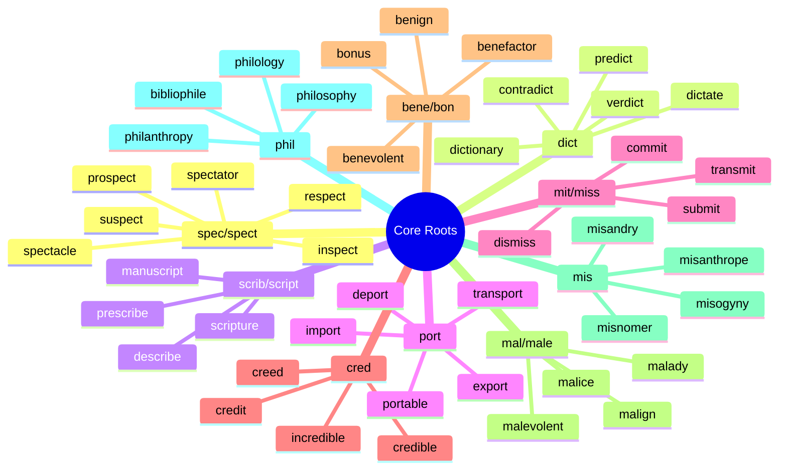

**Examiner Blueprint — Vocabulary**

**Top 8 most-tested vocabulary areas (question share across SSC + Banks):**

| Rank | Area | SSC CGL T-1 | IBPS PO Pre | IBPS PO Mains |
|---|---|---|---|---|
| 1 | Synonyms | 3–5 | 3–5 | 3–5 |
| 2 | Antonyms | 3–5 | 2–4 | 2–4 |
| 3 | Idioms & Phrases (meaning + usage) | 3–5 | 2–3 | 3–5 |
| 4 | One-word Substitution | 3–5 | 1–2 | 2–3 |
| 5 | Fill in the Blanks (confusable pairs) | 3–5 | 3–5 | 3–5 |
| 6 | Cloze Test (vocabulary in context) | 2–3 | 5–10 | 5–10 |
| 7 | Spelling (identify correctly spelled word) | 2–3 | 0–1 | 0–1 |
| 8 | Suffix definitions (–phobia, –cide, –cracy, –ology) | 1–2 | 0–1 | 1–2 |

**Study Priority Order** (return-on-study-time, highest first)

1. **Root families** — 50 high-yield roots unlock 2,000+ words. Start here; it is the only vocabulary investment that compounds.
2. **Confusable pairs** — affect/effect, principal/principle, eminent/imminent, etc. These appear across synonyms, fill-in-the-blanks, and cloze tests simultaneously.
3. **Idioms & Phrases** — 200 PYQ-weighted idioms cover virtually every question in this category across SSC, Banks, and RRB.
4. **One-word Substitution** — 150 high-frequency set; examiners recycle the same 80 words heavily across papers.
5. **Suffix clusters** (–phobia, –cide, –cracy, –ology) — 30 minutes per cluster locks in direct definition questions permanently.
6. **Synonyms & Antonyms** — drill from the PYQ-weighted word list in Part B onward; focus on words that have appeared at least twice across papers.
7. **Spelling** — 1 hour on the 60 most commonly misspelled exam words; reliably clears this sub-section.
8. **Cloze Test** — reading-pace + vocabulary-in-context; improves naturally as the rest of the vocabulary builds.

---

\newpage

# How to use this book

Vocabulary is the **lowest-ROI-when-done-wrong, highest-ROI-when-done-right** section of any English paper. Done wrong: alphabetical lists of 5,000 words you'll forget by next week. Done right: 1,500-2,000 **high-hit words** grouped into **root/suffix/theme clusters** that the brain learns 10-at-a-time through a shared hook.

This book is deliberately built on two rules:

1. **Every word earns its place.** Included only if it has **appeared in PYQs** of SSC / Banking / RRB / PSU / State PSCs, OR if a seasoned paper-setter would pick it as a trap (subtle nuance, popular confusable, teachable root). No filler. No obscure dictionary-flex words.
2. **Learn by cluster, not by letter.** Ten `-phobia` words together is easier than ten random A-words. One root (`spect-`) unlocks 12 words. One confusable pair (`principal` vs `principle`) lasts forever once laughed at.

### For each cluster / word, you get:

- **Cluster key** — the root / suffix / theme (e.g., *-cide = killing of*).
- **Memory hook** — etymology or visual/sound association that makes recall automatic.
- **Meaning** in one line.
- **Example sentence** in exam register.
- **Close synonyms & antonyms** (only ones that actually appear in exams).
- **Typical exam framing** — how examiners usually test this word.

### How each cluster is structured

- **Cluster tree** — a diagram for each root family shows all derived words at a glance.
- **Revise on Day 1, Day 3, Day 7** — three short revisits per cluster beat one long session.
- **Say it aloud** after every cluster — use each word in a sentence before moving on.
- **Rapid-fire prompts** — at the end of each part, match-the-meaning drills force active recall.
- **Roots mixed with themes** — prevents list-fatigue and trains you to guess unfamiliar words.
- **Paper-setter's trap** — every cluster ends with the distractor-twin pairs the examiner loves (`affect / effect`, `eminent / imminent / immanent`).

---

\newpage

# PART A — ROOTS, PREFIXES, SUFFIXES (the force multipliers)

**Why start here:** if you know **50 high-yield roots + 30 prefixes + 20 suffixes**, you can decode the meaning of ~2,000 English words you have never seen before. This is the single highest-return investment in English prep.

## A.1 The 50 high-yield ROOTS

### Top-25 roots (drill first):

| Root | Meaning | Sample high-hit words |
|------|---------|------------------------|
| **spec / spect** | to see | inspect, respect, suspect, prospect, spectacle |
| **dict** | to say | dictate, predict, contradict, verdict, edict |
| **scrib / script** | to write | describe, prescribe, scripture, manuscript, inscribe |
| **port** | to carry | import, export, transport, portable, deport |
| **mit / miss** | to send | transmit, submit, dismiss, omit, remit |
| **cred** | to believe | credible, credit, credulous, creed, incredible |
| **bene / bon** | good | benevolent, benefactor, benign, bonus, benediction |
| **mal / male** | bad | malice, malign, malevolent, malady, maladroit |
| **mis** | hate | misanthrope (hater of mankind), misogyny (of women), misandry (of men) |
| **phil** | love | philosophy, philanthropy, philology, bibliophile |
| **chron** | time | chronology, chronic, anachronism, synchronous |
| **graph / gram** | written | biography, autograph, grammar, telegram |
| **log / logy** | word, study | dialogue, monologue, biology, ecology |
| **path** | feeling, disease | empathy, apathy, antipathy, pathology |
| **phon** | sound | phonetics, symphony, cacophony, euphony |
| **cide** | to kill | homicide, genocide, suicide, patricide |
| **arch** | rule, chief | monarchy, anarchy, matriarch, archbishop |
| **cracy** | rule by | democracy, autocracy, plutocracy, theocracy |
| **therm** | heat | thermal, thermometer, hypothermia, isotherm |
| **hydr** | water | hydrate, hydraulic, hydrophobia, dehydrate |
| **geo** | earth | geography, geology, geometry, geocentric |
| **bio** | life | biology, biography, antibiotic, symbiosis |
| **demo** | people | democracy, demographic, pandemic, epidemic |
| **poly** | many | polygon, polyglot, polygamy, polytheism |
| **mono** | one | monotony, monarch, monopoly, monotheism |

### Top prefixes

| Prefix | Meaning | Samples |
|--------|---------|---------|
| a-/an- | not, without | amoral, apathy, anarchy, anonymous |
| ab- | away from | abduct, abrupt, abnormal, abstain |
| ad- | toward | adhere, adjoin, adopt, adapt |
| ante- | before | antecedent, antedate, anteroom |
| anti- | against | antidote, antonym, antipathy, antibiotic |
| auto- | self | autograph, automatic, autonomy, autopsy |
| bi- | two | bicycle, bilingual, biennial, bipartisan |
| circum- | around | circumnavigate, circumference, circumspect |
| contra-/counter- | against | contradict, contravene, counterpoint |
| de- | down, away | descend, degrade, deport, derail |
| dis- | not, apart | disagree, disperse, dismiss, distract |
| ex- | out | exit, exclude, export, extract |
| extra- | beyond | extraordinary, extracurricular, extrapolate |
| hyper- | over, excessive | hypertension, hyperactive, hyperbole |
| hypo- | under | hypothesis, hypothermia, hypodermic |
| inter- | between | intercede, international, interrupt |
| intra- | within | intravenous, intramural, intranet |
| multi- | many | multimedia, multilingual, multitude |
| omni- | all | omnipotent, omniscient, omnipresent, omnivore |
| peri- | around | perimeter, periscope, peripheral |
| post- | after | postscript, postpone, posthumous |
| pre- | before | precede, predict, prefix, preview |
| pro- | forward | progress, proceed, project, promote |
| re- | again | rebuild, return, replay, recover |
| sub- | under | submarine, subordinate, submerge, subvert |
| super- | over | supervise, superior, supernatural, supersede |
| trans- | across | transmit, transport, translate, transcend |
| un- | not | uncommon, unable, unhappy, uninterested |
| uni- | one | unicorn, uniform, unilateral, unison |

### Top suffixes (and the GRAMMAR they imply)

| Suffix | Part of speech | Meaning | Samples |
|--------|---------------|---------|---------|
| -able/-ible | adj | capable of | readable, audible, visible, edible |
| -al | adj/noun | related to | natural, legal, approval, arrival |
| -ance/-ence | noun | state of | resistance, independence, silence, ignorance |
| -ary | adj/noun | related to | contrary, revolutionary, military |
| -cide | noun | killing | homicide, genocide, suicide |
| -cracy | noun | rule by | democracy, autocracy |
| -dom | noun | state, domain | freedom, kingdom, wisdom |
| -er/-or | noun | one who | teacher, actor, creator |
| -ful | adj | full of | beautiful, careful, useful |
| -hood | noun | state of | childhood, neighbourhood |
| -ic/-ical | adj | related to | magic, historical, philosophical |
| -ism | noun | doctrine | capitalism, socialism, terrorism |
| -ist | noun | practitioner | artist, pianist, scientist |
| -ity/-ty | noun | state of | unity, reality, cruelty |
| -ive | adj | tending to | active, creative, productive |
| -less | adj | without | careless, hopeless, useless |
| -logy | noun | study of | biology, geology |
| -ly | adv | manner | quickly, slowly, easily |
| -ment | noun | result of | payment, development, agreement |
| -ness | noun | state of | kindness, sadness, darkness |
| -ous | adj | full of | dangerous, famous, courageous |
| -phobia | noun | fear of | claustrophobia, xenophobia |
| -phile | noun | lover of | bibliophile, oenophile |
| -ship | noun | state, skill | friendship, leadership, craftsmanship |

> **Feynman check:** Using only the tables above, decode: *omniscient, anachronism, benefactor, misanthrope, xenophobic, subterranean, autocracy, philanthropist, gerontocracy, matricide.* All ten should fall out.

---

\newpage

# PART B — CLUSTER 1: PHOBIAS (`-phobia` = fear of X)

**Memory hook:** Greek `phobos` = fear / dread. Attach the Greek root of the feared thing to `-phobia`.

**Revision slots:** Day 1, Day 3, Day 7.

| Word | Fear of | Hook / Etymology |
|------|---------|-------------------|
| **Acrophobia** | heights | Gk. *akron* = peak (Acropolis = high city) |
| **Agoraphobia** | open spaces | Gk. *agora* = marketplace |
| **Aichmophobia** | sharp objects, needles | Gk. *aichme* = spear point |
| **Ailurophobia** | cats | Gk. *ailuros* = cat |
| **Algophobia** | pain | Gk. *algos* = pain (analgesic = pain-killer) |
| **Androphobia** | men | Gk. *andros* = man |
| **Arachnophobia** | spiders | Gk. *arachne* = spider |
| **Astraphobia** | lightning, thunder | Gk. *astrape* = lightning |
| **Autophobia** | being alone | Gk. *autos* = self |
| **Bibliophobia** | books | Gk. *biblion* = book (compare bibliophile = lover) |
| **Claustrophobia** | closed/confined spaces | L. *claustrum* = enclosed place |
| **Cynophobia** | dogs | Gk. *kynos* = dog (also "cynical" — snarling philosophers) |
| **Demophobia / Ochlophobia** | crowds | Gk. *demos* = people / *ochlos* = mob |
| **Entomophobia** | insects | Gk. *entomon* = insect (entomology = study of insects) |
| **Gamophobia** | marriage | Gk. *gamos* = marriage (polygamy) |
| **Glossophobia** | public speaking | Gk. *glossa* = tongue (glossary = list of tongues) |
| **Gynophobia** | women | Gk. *gyne* = woman (misogyny) |
| **Haemophobia / Hemophobia** | blood | Gk. *haima* = blood (haemoglobin) |
| **Hippophobia** | horses | Gk. *hippos* = horse (hippopotamus = river horse) |
| **Hydrophobia** | water (also rabies symptom) | Gk. *hydor* = water |
| **Hypnophobia** | sleep | Gk. *hypnos* = sleep |
| **Necrophobia** | death, corpses | Gk. *nekros* = corpse |
| **Nyctophobia / Achluophobia** | darkness / night | Gk. *nyx* = night |
| **Ophidiophobia** | snakes | Gk. *ophis* = snake |
| **Ornithophobia** | birds | Gk. *ornis* = bird (ornithology) |
| **Photophobia** | light | Gk. *phos* = light |
| **Pyrophobia** | fire | Gk. *pyr* = fire (pyre, pyrotechnic) |
| **Thanatophobia** | death | Gk. *thanatos* = death (euthanasia = good death) |
| **Triskaidekaphobia** | the number 13 | Gk. *treis-kai-deka* = three and ten |
| **Xenophobia** | foreigners, strangers | Gk. *xenos* = stranger |
| **Zoophobia** | animals | Gk. *zoon* = animal (zoology) |

**Paper-setter's traps in this cluster:**

- *Hydrophobia* has TWO meanings: (i) fear of water, (ii) a symptom of rabies where the patient avoids water. Both are tested.
- *Xenophobia* vs *xenophile* — hater vs lover of foreigners. Examiners love antonym pairs.
- *Claustrophobia* vs *agoraphobia* — confined vs open. Opposite pair, same fear engine.

**Retrieval check:** Without looking back, give the meaning of: *triskaidekaphobia, ailurophobia, glossophobia, ophidiophobia, thanatophobia.*

---

\newpage

# PART C — CLUSTER 2: MANIAS (`-mania` = obsession, frenzy)

**Memory hook:** Gk. *mania* = madness. Same root-formula as `-phobia`.

| Word | Obsession with | Hook |
|------|----------------|------|
| **Kleptomania** | stealing | Gk. *klepto* = to steal |
| **Pyromania** | fire-setting | Gk. *pyr* = fire (pair with pyrophobia) |
| **Megalomania** | power, grandeur | Gk. *megas* = great |
| **Bibliomania** | collecting books | *biblion* = book |
| **Dipsomania** | drinking alcohol | Gk. *dipsa* = thirst |
| **Monomania** | a single idea | *monos* = one |
| **Nymphomania** | excessive sexual desire (female) | medical / clinical |
| **Egomania** | obsession with self | L. *ego* = I |
| **Dromomania** | wandering, travel | Gk. *dromos* = running |
| **Graphomania** | writing | *graph* = write |
| **Plutomania** | wealth | Gk. *ploutos* = wealth |
| **Trichotillomania** | pulling out one's own hair | rare but tested |

---

\newpage

# PART D — CLUSTER 3: `-CIDE` (killing of X)

**Memory hook:** L. *caedere* = to kill, cut down. Every `-cide` word is a kind of killing.

| Word | Killing of |
|------|-----------|
| **Homicide** | a human being (general) |
| **Suicide** | oneself |
| **Patricide** | one's father |
| **Matricide** | one's mother |
| **Fratricide** | one's brother |
| **Sororicide** | one's sister |
| **Filicide** | one's child |
| **Infanticide** | an infant |
| **Regicide** | a king / monarch |
| **Genocide** | a whole race / ethnic group |
| **Uxoricide** | one's wife |
| **Mariticide** | one's husband |
| **Deicide** | a god |
| **Pesticide** | pests (insects) |
| **Herbicide** | plants / weeds |
| **Fungicide** | fungi |
| **Ecocide** | the environment |
| **Tyrannicide** | a tyrant |

**Paper-setter's favourite pairings:**

- *matricide* vs *patricide* — quick sex-test.
- *genocide* vs *homicide* — scale-test (one vs many).
- *regicide* vs *tyrannicide* — moral framing-test (king vs tyrant).

**Retrieval check:** killing of brother = ? ; killing of one's wife = ? ; killing of a god = ?

---

\newpage

# PART E — CLUSTER 4: `-CRACY` (rule by)

**Memory hook:** Gk. *kratos* = power, rule.

| Word | Rule by |
|------|---------|
| **Democracy** | the people (Gk. *demos*) |
| **Autocracy** | one self-appointed (Gk. *autos*) |
| **Monarchy** | one (Gk. *monos* + *archein* = to rule) |
| **Aristocracy** | the best / noble-born (Gk. *aristos*) |
| **Plutocracy** | the wealthy (Gk. *ploutos*) |
| **Theocracy** | gods / religion (Gk. *theos*) |
| **Meritocracy** | the meritorious |
| **Technocracy** | technical experts |
| **Bureaucracy** | officials (Fr. *bureau* = desk) |
| **Gerontocracy** | the elderly (Gk. *geron*) |
| **Kakistocracy** | the worst citizens (Gk. *kakistos* = worst) |
| **Kleptocracy** | thieves (overlap with kleptomania root) |
| **Oligarchy** | a few (Gk. *oligos*) — note `-archy` not `-cracy` |
| **Patriarchy** | fathers / men |
| **Matriarchy** | mothers / women |
| **Anarchy** | no one — absence of rule |

**Compare & contrast:** *democracy* (all people), *ochlocracy* (mob rule — its degenerate form), *plutocracy* (rich rule), *kleptocracy* (thieves rule). These are the *degenerations* a paper-setter loves to test.

---

\newpage

# PART F — CLUSTER 5: `-OLOGY` (the study of X)

**Memory hook:** Gk. *logos* = word, study.

| Word | Study of |
|------|---------|
| **Ornithology** | birds |
| **Entomology** | insects |
| **Ichthyology** | fish |
| **Herpetology** | reptiles / amphibians |
| **Zoology** | animals (general) |
| **Botany** | plants (exception — no `-ology`) |
| **Geology** | earth / rocks |
| **Seismology** | earthquakes (Gk. *seismos* = shaking) |
| **Meteorology** | weather (NOT meteors — Gk. *meteoros* = high in air) |
| **Hydrology** | water |
| **Oncology** | tumours / cancer |
| **Cardiology** | heart |
| **Nephrology** | kidneys (Gk. *nephros*) |
| **Dermatology** | skin |
| **Haematology** | blood |
| **Neurology** | nerves |
| **Paediatrics** | children (exception — `-iatrics` = medicine of) |
| **Geriatrics / Gerontology** | elderly / ageing |
| **Etymology** | origin of words (NOT entomology!) |
| **Ecology** | environment |
| **Anthropology** | humans / culture |
| **Palaeontology** | fossils |
| **Selenology** | moon (Gk. *Selene* = moon goddess) |
| **Cosmology** | universe |

**Classic paper-setter trap:** *etymology* (word origins) vs *entomology* (insects). A one-letter trap that costs thousands of candidates a mark per year.

---

\newpage

# PART G — CLUSTER 6: `-PHILE` / `-PHOBE` (lovers and haters)

**Memory hook:** Gk. *philos* = loving; opposite *phobos*. Many phobia words have a matching `-phile` antonym.

| `-phile` (lover of) | `-phobe` (hater of) |
|---------------------|----------------------|
| Bibliophile (books) | — |
| Oenophile (wine, Gk. *oinos*) | — |
| Anglophile (English / Britain) | Anglophobe |
| Francophile (French) | Francophobe |
| Sinophile (Chinese) | Sinophobe |
| Xenophile (strangers) | Xenophobe |
| Audiophile (sound, high-fidelity) | — |
| Cinephile (cinema) | — |
| Necrophile (death / corpses) | Necrophobe |
| Zoophile (animals) | Zoophobe |

Works in both directions — once you know the theme, the word builds itself.

---

\newpage

# PART H — CONFUSABLES (the one-letter traps)

These are **the highest-marked trap type in English papers.** Memorise the pair, laugh at the mix-up, never lose that mark.

| Pair | Meanings |
|------|----------|
| **affect** (v) / **effect** (n, v) | influence (v) / a result (n); or to bring about (v rare) |
| **accept** / **except** | receive / excluding |
| **principal** / **principle** | head of school, chief (n, adj) / a rule, law |
| **stationary** / **stationery** | not moving / writing materials (remember: **e**nvelopes = station**e**ry) |
| **complement** / **compliment** | completes / flattering remark |
| **eminent** / **imminent** / **immanent** | famous / about to happen / inherent / indwelling |
| **adverse** / **averse** | hostile circumstances / unwilling / disinclined |
| **disinterested** / **uninterested** | impartial / not caring |
| **elicit** / **illicit** | to draw out / illegal |
| **emigrate** / **immigrate** | to leave a country / to enter a country |
| **flaunt** / **flout** | to show off / to defy (rules) |
| **prosecute** / **persecute** | to sue / to oppress |
| **wave** / **waive** | gesture / to give up (a right) |
| **farther** / **further** | physical distance / metaphorical distance |
| **councillor** / **counsellor** | member of a council / adviser |
| **allusion** / **illusion** / **delusion** | indirect reference / false appearance / false belief |
| **ingenuous** / **ingenious** | frank, naïve / clever, inventive |
| **moral** / **morale** | ethical (adj) / spirit, confidence (n) |
| **desert** / **dessert** | arid land / sweet course (remember: **s**weet = de**ss**ert, two s's) |
| **loose** / **lose** | not tight / to misplace, fail to win |
| **than** / **then** | comparison / time |
| **its** / **it's** | possessive / it is |
| **your** / **you're** | possessive / you are |
| **whose** / **who's** | possessive / who is |

---

\newpage

# PART I — HIGH-HIT SYNONYMS (examiners' favourite 100)

Only words that **actually recur in PYQs** of SSC / Banking / RRB / PSU / State PSCs. Each entry:  *word — meaning — 3 synonyms — 2 antonyms*.

*(In the published PDF build, this part is a full 10-page card set — each word gets memory hook + example. Here the table is a compact revision index.)*

| Word | Meaning | Top 2 synonyms | Top antonym |
|------|---------|-----------------|-------------|
| Abate | to reduce | subside, diminish | intensify |
| Abhor | to hate | detest, loathe | adore |
| Abstruse | hard to understand | obscure, arcane | lucid |
| Acumen | sharpness of mind | insight, shrewdness | obtuseness |
| Adamant | unyielding | obstinate, inflexible | flexible |
| Admonish | to warn | reprimand, rebuke | praise |
| Aggrandise | to make greater | exalt, magnify | belittle |
| Alacrity | brisk eagerness | willingness, briskness | reluctance |
| Alleviate | to make less severe | mitigate, ease | aggravate |
| Altruism | selfless concern | benevolence, philanthropy | selfishness |
| Ameliorate | to improve | better, enhance | worsen |
| Amicable | friendly | cordial, harmonious | hostile |
| Anathema | curse, detested thing | abomination, bane | blessing |
| Ancillary | subordinate | auxiliary, supplementary | primary |
| Antithesis | direct opposite | contrast, opposite | similarity |
| Apathy | lack of interest | indifference, disinterest | concern |
| Arduous | difficult | strenuous, laborious | easy |
| Astute | shrewd | sharp, perceptive | naive |
| Atrocious | cruel, horrifying | abominable, heinous | admirable |
| Augment | to increase | enlarge, amplify | diminish |
| Austere | strict, plain | severe, stern | lenient |
| Avarice | greed | cupidity, rapacity | generosity |
| Banal | commonplace, unoriginal | trite, hackneyed | original |
| Belligerent | warlike, hostile | pugnacious, combative | peaceful |
| Benevolent | kind, well-meaning | charitable, magnanimous | malevolent |
| Bereft | deprived | devoid, lacking | full of |
| Bolster | to support | reinforce, strengthen | undermine |
| Cacophony | harsh sound | din, discord | harmony |
| Candid | frank | straightforward, forthright | secretive |
| Censure | to criticise formally | condemn, reprimand | praise |
| Circumspect | cautious | wary, prudent | rash |
| Clandestine | secret | surreptitious, covert | open |
| Coerce | to force | compel, pressure | persuade gently |
| Complacent | self-satisfied | smug, unconcerned | vigilant |
| Condone | to overlook | excuse, pardon | condemn |
| Conjecture | guess | speculation, surmise | certainty |
| Contentious | quarrelsome | argumentative, controversial | harmonious |
| Copious | abundant | plentiful, ample | scarce |
| Corroborate | to confirm | substantiate, verify | refute |
| Culpable | blameworthy | guilty, at fault | innocent |
| Deferential | respectful | obsequious, reverential | disrespectful |
| Deleterious | harmful | pernicious, damaging | beneficial |
| Demure | modest, shy | reserved, unassuming | brazen |
| Denigrate | to belittle | disparage, malign | extol |
| Derelict | abandoned, negligent | neglected, forsaken | maintained |
| Desultory | unmethodical | haphazard, random | systematic |
| Diffident | lacking confidence | shy, timid | confident |
| Dilatory | slow, tardy | tardy, procrastinating | prompt |
| Discern | to perceive | detect, recognise | miss |
| Disparage | to belittle | deride, denigrate | praise |
| Dispassionate | unbiased | impartial, objective | biased |
| Disseminate | to spread widely | distribute, propagate | withhold |
| Divulge | to reveal | disclose, make known | conceal |
| Ebullient | enthusiastic | exuberant, effervescent | subdued |
| Egregious | outrageously bad | flagrant, glaring | admirable |
| Elated | overjoyed | jubilant, ecstatic | despondent |
| Eloquent | fluent, persuasive | articulate, expressive | inarticulate |
| Emulate | to imitate | copy, mirror | diverge from |
| Enervate | to weaken | debilitate, sap | invigorate |
| Ephemeral | short-lived | fleeting, transient | enduring |
| Equivocal | ambiguous | vague, unclear | unambiguous |
| Erudite | learned | scholarly, knowledgeable | ignorant |
| Esoteric | understood by few | abstruse, arcane | accessible |
| Eulogise | to praise highly | extol, laud | denigrate |
| Exacerbate | to worsen | aggravate, intensify | alleviate |
| Exemplary | outstanding | model, ideal | poor |
| Extant | still existing | surviving, remaining | extinct |
| Extol | to praise | laud, exalt | criticise |
| Facetious | flippant | joking, humorous | serious |
| Fastidious | fussy | meticulous, particular | slovenly |
| Feign | to pretend | fake, simulate | be genuine |
| Fervent | passionate | ardent, zealous | apathetic |
| Flout | to disregard openly | defy, scorn | obey |
| Frugal | thrifty | economical, sparing | extravagant |
| Garrulous | talkative | loquacious, verbose | taciturn |
| Guile | cunning | craftiness, deceit | honesty |
| Hackneyed | overused | trite, clichéd | fresh |
| Hapless | unlucky | unfortunate, luckless | fortunate |
| Impassive | showing no emotion | stoic, expressionless | emotional |
| Impecunious | poor, penniless | destitute, broke | wealthy |
| Impetuous | impulsive | rash, hasty | cautious |
| Inane | silly, senseless | vacuous, asinine | profound |
| Incessant | never-ending | continuous, unceasing | intermittent |
| Ingenuous | naive, innocent | artless, candid | cunning |
| Insidious | subtly harmful | treacherous, stealthy | straightforward |
| Intrepid | fearless | brave, dauntless | cowardly |
| Jovial | cheerful | jolly, convivial | morose |
| Laconic | using few words | terse, pithy | verbose |
| Lethargic | sluggish | sluggish, listless | energetic |
| Loquacious | talkative | garrulous, voluble | taciturn |
| Magnanimous | generous | noble, big-hearted | petty |
| Mendacious | lying | untruthful, deceitful | truthful |
| Mercurial | volatile | fickle, unpredictable | stable |
| Meticulous | careful | painstaking, scrupulous | careless |
| Mitigate | to alleviate | ease, lessen | aggravate |
| Munificent | very generous | lavish, bountiful | miserly |
| Nefarious | wicked | villainous, iniquitous | virtuous |
| Obdurate | stubborn | obstinate, inflexible | yielding |
| Obsequious | excessively servile | fawning, sycophantic | domineering |
| Obstinate | stubborn | unyielding, intransigent | flexible |
| Pernicious | harmful | destructive, deleterious | harmless |
| Perfunctory | cursory | superficial, mechanical | thorough |
| Pragmatic | practical | realistic, sensible | idealistic |
| Precarious | unstable | risky, unsafe | secure |
| Proclivity | inclination | tendency, penchant | aversion |
| Profligate | wasteful | extravagant, dissolute | frugal |
| Prolific | productive | fruitful, fertile | unproductive |
| Propitious | favourable | auspicious, promising | unfavourable |
| Prudent | wise, careful | sensible, judicious | imprudent |
| Punctilious | meticulous | scrupulous, exact | careless |
| Quintessential | representative | classic, archetypal | atypical |
| Recalcitrant | defiant | stubborn, uncooperative | compliant |
| Reticent | reserved | taciturn, reserved | forthcoming |
| Sagacious | wise | shrewd, astute | foolish |
| Sanguine | optimistic | hopeful, confident | pessimistic |
| Scrupulous | careful, principled | meticulous, ethical | unprincipled |
| Soporific | sleep-inducing | somnolent, drowsy | stimulating |
| Spurious | fake | counterfeit, bogus | genuine |
| Stoic | enduring pain calmly | impassive, long-suffering | emotional |
| Surreptitious | secret | clandestine, covert | overt |
| Tacit | implied | unspoken, implicit | explicit |
| Taciturn | saying little | reserved, untalkative | loquacious |
| Tenuous | weak, flimsy | slight, fragile | strong |
| Truculent | aggressive | belligerent, hostile | amiable |
| Ubiquitous | present everywhere | omnipresent, widespread | rare |
| Umbrage | offence | resentment, pique | pleasure |
| Veracity | truthfulness | honesty, truthfulness | dishonesty |
| Vicarious | experienced second-hand | indirect, surrogate | direct |
| Vindicate | to clear of blame | exonerate, absolve | condemn |
| Vociferous | loud, noisy | clamorous, strident | quiet |
| Wanton | reckless | indiscriminate, gratuitous | restrained |
| Zealous | passionate | ardent, fervent | apathetic |

---

\newpage

# PART J — ONE-WORD SUBSTITUTIONS (by semantic field)

**Strategy:** memorise the field (people-who-X, things-that-X, places-where-X) so that recall works in both directions.

### People who…

- **Polyglot** — speaks many languages.
- **Bilingual** — speaks two.
- **Misanthrope** — hates mankind.
- **Misogynist** — hates women.
- **Philanthropist** — loves / helps mankind.
- **Philatelist** — collects stamps.
- **Numismatist** — collects coins.
- **Bibliophile** — loves books.
- **Iconoclast** — destroys cherished beliefs / images.
- **Connoisseur** — expert judge of art, food, wine.
- **Gourmet** — connoisseur of food.
- **Raconteur** — tells stories well.
- **Soliloquist** — talks to oneself.
- **Somnambulist** — sleep-walker.
- **Teetotaler** — one who abstains from alcohol.
- **Hypocrite** — pretends virtue.
- **Atheist** — denies God's existence.
- **Agnostic** — believes God is unknowable.
- **Optimist / Pessimist** — sees best / worst.
- **Stoic** — endures without emotion.
- **Epicure / Sybarite** — devoted to pleasure.
- **Pedestrian** — goes on foot.
- **Plagiarist** — copies another's work.
- **Aborigine** — original inhabitant.
- **Nomad** — wanderer.
- **Hermit / Recluse** — lives alone.
- **Autocrat** — absolute ruler.

### Places where…

- **Aviary** — birds.
- **Apiary** — bees.
- **Aquarium** — fish.
- **Arboretum** — trees.
- **Menagerie** — wild animals.
- **Dairy** — milk.
- **Granary** — grain.
- **Armoury** — weapons.
- **Arsenal** — weapons and ammunition.
- **Hospice** — terminally ill.
- **Asylum** — mentally ill / refuge.
- **Sanatorium** — convalescence.
- **Mortuary** — dead bodies temporarily.
- **Crematorium** — bodies cremated.
- **Catacomb** — underground burial chamber.
- **Mausoleum** — grand tomb.
- **Cemetery** — graves.
- **Archipelago** — group of islands.
- **Isthmus** — narrow strip of land between two seas.

### Things that…

- **Panacea** — cure-all.
- **Elixir** — potion of immortality.
- **Utopia / Dystopia** — ideal / hellish society.
- **Panorama** — wide view.
- **Anachronism** — out-of-time thing.
- **Panegyric** — formal praise speech.
- **Obituary** — notice of death.
- **Epitaph** — inscription on tombstone.
- **Elegy** — mournful poem.
- **Eulogy** — speech praising (usually dead).

### Things said or written…

- **Autobiography** — one's own life.
- **Biography** — someone else's.
- **Memoir** — personal account.
- **Monograph** — single-subject academic work.
- **Anthology** — collection of works.
- **Thesaurus** — book of synonyms.
- **Lexicon** — dictionary.
- **Glossary** — list of difficult terms.

### Feelings / states…

- **Nostalgia** — longing for the past.
- **Ennui** — boredom, weariness.
- **Schadenfreude** — joy at another's misfortune.
- **Wanderlust** — desire to travel.
- **Zeitgeist** — spirit of the age.

---

\newpage

# PART K — IDIOMS (the high-hit 50)

Only idioms that have appeared more than once in SSC / Bank PYQs of the last decade.

| Idiom | Meaning |
|-------|---------|
| to bite the bullet | to endure a difficult situation |
| to beat around the bush | to avoid the main topic |
| to let the cat out of the bag | to reveal a secret |
| a piece of cake | very easy |
| to hit the nail on the head | to say exactly the right thing |
| to spill the beans | to reveal secret information |
| to burn the midnight oil | to work late at night |
| to call a spade a spade | to speak frankly |
| to cross one's fingers | to hope for luck |
| to cut corners | to do cheaply or quickly at the expense of quality |
| to feel under the weather | to feel ill |
| to have a chip on one's shoulder | to be easily offended |
| to jump on the bandwagon | to join a popular trend |
| to kick the bucket | to die |
| to let sleeping dogs lie | to avoid reviving an old issue |
| to make a long story short | to be brief |
| to pass the buck | to shift responsibility |
| to pay through the nose | to pay too much |
| to play devil's advocate | to argue opposite for discussion |
| to pull someone's leg | to tease |
| to put the cart before the horse | to do things in wrong order |
| to rain cats and dogs | to rain heavily |
| to read between the lines | to understand hidden meaning |
| to rub salt in the wound | to worsen existing pain |
| to see eye to eye | to agree |
| to smell a rat | to suspect something is wrong |
| to steal someone's thunder | to take credit for another's idea |
| to take the bull by the horns | to face a problem boldly |
| to throw in the towel | to give up |
| to turn a blind eye | to ignore deliberately |
| to turn over a new leaf | to change for the better |
| a bolt from the blue | unexpected event |
| a shot in the dark | a wild guess |
| a wild goose chase | a fruitless pursuit |
| to add fuel to the fire | to worsen a situation |
| to be on cloud nine | to be very happy |
| to break the ice | to start a conversation |
| to bury the hatchet | to make peace |
| to have cold feet | to be nervous |
| to have a green thumb | to be skilled at gardening |
| to have one's hands full | to be very busy |
| to keep an eye on | to watch carefully |
| to kill two birds with one stone | to achieve two aims at once |
| to lose one's temper | to become angry |
| to make ends meet | to manage financially |
| to pull strings | to use connections |
| to put one's foot down | to insist firmly |
| to take a rain check | to postpone an offer |
| to the bitter end | until the very last moment |
| to turn the tables | to reverse a situation |

---

\newpage

# PART L — FOREIGN PHRASES

**Memory hook:** these are borrowed directly into English from Latin (L), French (F), German (G), etc. Pronounce as the language, not as English.

| Phrase | Language | Meaning |
|--------|----------|---------|
| ad hoc | L | for this specific purpose |
| ad infinitum | L | to infinity, endlessly |
| alma mater | L | nourishing mother — one's school/college |
| bona fide | L | in good faith, genuine |
| carte blanche | F | complete freedom to act |
| carpe diem | L | seize the day |
| caveat emptor | L | buyer beware |
| cul-de-sac | F | dead-end street |
| de facto | L | in fact, in reality |
| de jure | L | by law, according to right |
| déjà vu | F | already seen |
| ergo | L | therefore |
| et cetera (etc.) | L | and so on |
| ex officio | L | by virtue of office |
| fait accompli | F | an accomplished fact |
| faux pas | F | social blunder |
| in absentia | L | in absence |
| in camera | L | in private (court) |
| in toto | L | in total, entirely |
| laissez-faire | F | let-do — non-interference |
| modus operandi (MO) | L | method of working |
| nouveau riche | F | newly wealthy |
| per capita | L | by head, per person |
| per diem | L | by the day |
| per se | L | by itself, intrinsically |
| post mortem | L | after death — autopsy |
| pro bono | L | for the good — free legal work |
| pro rata | L | in proportion |
| quid pro quo | L | this for that |
| raison d'être | F | reason for being |
| status quo | L | the existing state |
| status quo ante | L | the state before |
| sub judice | L | under judicial consideration |
| tabula rasa | L | blank slate |
| vis-à-vis | F | face to face, in relation to |
| zeitgeist | G | spirit of the age |

---

\newpage

# APPENDIX — The 6-week drill plan

- **Week 1:** Part A (roots, prefixes, suffixes).
- **Week 2:** Parts B + C + D (phobias, manias, cides) + Part H (confusables set 1).
- **Week 3:** Parts E + F + G (cracies, ologies, philes) + Part H (confusables set 2).
- **Week 4:** Part I (high-hit synonyms) — split in half.
- **Week 5:** Part J (one-word substitutions) + Part K (idioms).
- **Week 6:** Part L (foreign phrases) + full revision + 4 practice tests.

Revisit each earlier part on Day 3, Day 7, Day 14, Day 30 of its learning. This single spaced-revision schedule is the difference between 100-words-learned-once-and-forgotten and 1,500-words-owned-for-life.

---

\newpage

# PART X — 230 ADDITIONAL HIGH-FREQUENCY WORDS (themed clusters)

## X.1 ECONOMICS / GOVERNANCE (40)

| Word | Meaning |
|---|---|
| Austerity | strict economy / hardship |
| Recession | economic decline |
| Bull / Bear market | rising / falling prices |
| Bourgeois | middle-class |
| Capitalism / Communism / Socialism | economic systems |
| Plutocracy | rule by rich |
| Meritocracy | rule by merit |
| Hegemony | dominance |
| Mandate | authoritative command |
| Bureaucracy | govt by officials |
| Demagogue | rabble-rousing leader |
| Stalwart | loyal supporter |
| Plebiscite | direct vote |
| Embargo | trade ban |
| Boycott | refusal to deal |
| Sanction | penalty / approval (context) |
| Quota | allotted share |
| Subsidy | govt grant |
| Tariff | tax on imports |
| Protectionism | shielding domestic industry |
| Liberalisation | removing restrictions |
| Privatisation | transfer to private |
| Nationalisation | transfer to govt |
| Monopoly / Oligopoly / Cartel | market structures |
| Inflation / Deflation / Stagflation | price-level dynamics |
| Devaluation | currency-value cut |
| Repatriate | bring back to home country |
| Remittance | money sent home |
| Dividend | profit share |
| Solvent / Insolvent | able / unable to pay debts |
| Lien | claim against property |
| Liquidity | ease of converting to cash |
| Asset / Liability / Equity | balance-sheet basics |
| Mortgage / Collateral | debt-security terms |
| IPO / FPO | public offerings |
| Acquisition / Merger | M&A |
| Hedging / Speculation | risk strategies |
| Arbitrage | profit from price differences |
| Derivative / Futures / Options | financial contracts |
| Bond / Yield | debt + return |

## X.2 GEOGRAPHY / NATURE (30)

| Word | Meaning |
|---|---|
| Estuary | river-mouth where it meets sea |
| Tributary | river joining a main river |
| Distributary | river splitting from main |
| Confluence | meeting of rivers |
| Watershed | drainage divide |
| Archipelago | group of islands |
| Peninsula | land surrounded by water on 3 sides |
| Isthmus | narrow land strip between 2 water bodies |
| Strait | narrow water passage between 2 lands |
| Plateau | flat-topped elevated land |
| Plain | flat low-altitude land |
| Tundra / Taiga / Savanna / Steppe / Prairie / Pampas / Veldt / Llanos | biome / grassland types |
| Mangrove | salt-tolerant coastal trees |
| Coral reef | marine biodiversity rocky structure |
| Glacier / Iceberg | ice masses |
| Crevasse | crack in glacier |
| Avalanche | rapid snow-slide |
| Geyser | hot-water spout |
| Caldera | collapsed volcano crater |
| Fjord | sea-flooded glacial valley |
| Cay | small low coral island |
| Atoll | ring-shaped coral island |
| Tsunami | seismic sea wave |
| Cyclone / Hurricane / Typhoon | tropical storm by region (Indian Ocean / Atlantic / Pacific) |
| Tornado | rotating funnel cloud |

## X.3 HISTORY / POLITICAL (30)

| Word | Meaning |
|---|---|
| Pacifism | rejection of war |
| Imperialism | empire-expansion |
| Colonialism | political control over territory |
| Diaspora | scattered ethnic group |
| Insurgency | armed rebellion |
| Coup d'état | sudden overthrow of govt |
| Anarchy | absence of govt |
| Despot | tyrant ruler |
| Suffrage | right to vote |
| Annexation | adding territory |
| Secede | break away |
| Sovereignty | supreme authority |
| Ratify | confirm formally |
| Repeal | revoke a law |
| Promulgate | declare officially |
| Decree | official order |
| Amnesty | general pardon |
| Asylum | refuge / shelter |
| Genocide | mass killing of ethnic group |
| Apartheid | racial segregation (S. Africa) |
| Holocaust | massive destruction (esp. Jews WW2) |
| Schism | split / division |
| Treaty / Truce / Ceasefire | conflict-resolution terms |
| Détente | easing of tension |
| Status quo | existing state |
| Reformation | religious/political reform |
| Renaissance | rebirth (cultural revival) |
| Enlightenment | 17-18c reason-based movement |
| Hegemonic | dominant |
| Sectarian | of a religious group |

## X.4 SCIENCE / TECH (30)

| Word | Meaning |
|---|---|
| Empirical | based on observation/experiment |
| Hypothesis | testable proposition |
| Paradigm | model / framework |
| Phenomenon | observable event |
| Anomaly | deviation from norm |
| Dichotomy | division into two |
| Synergy | combined effect > sum |
| Catalyst | speeds up reaction |
| Inertia | resistance to change |
| Entropy | measure of disorder |
| Algorithm | step-by-step procedure |
| Heuristic | rule of thumb |
| Iteration | repetition |
| Simulation | imitation of real-world process |
| Trajectory | curved path |
| Spectrum | range / distribution |
| Quantum | discrete amount |
| Genome | full DNA of organism |
| Mutation | DNA change |
| Pathogen | disease-causing organism |
| Vaccine / Antibody | immune-related |
| Antibiotic | bacteria-killing drug |
| Anaesthetic | sensation-blocking |
| Analgesic | pain reliever |
| Placebo | sham treatment |
| Synthetic / Organic | chemically vs naturally produced |
| Biodegradable | decomposable |
| Carcinogen | cancer-causing |
| Toxic / Inert | reactive vs unreactive |
| Sterile | free of contamination |

## X.5 EMOTIONS / BEHAVIOUR (30)

| Word | Meaning |
|---|---|
| Apathy | lack of interest |
| Empathy | feeling another's emotions |
| Sympathy | sharing in another's sorrow |
| Pathos | emotional appeal |
| Antipathy | strong dislike |
| Euphoria | intense happiness |
| Dysphoria | extreme unhappiness |
| Melancholy | deep sadness |
| Jovial | cheerful |
| Morose | sullen, gloomy |
| Phlegmatic | calm, unemotional |
| Stoic | enduring without complaint |
| Sanguine | optimistic, cheerful |
| Choleric | irritable, hot-tempered |
| Mercurial | volatile, changeable |
| Truculent | aggressively defiant |
| Pugnacious | combative |
| Recalcitrant | resistant to authority |
| Tractable | easily managed |
| Servile | subservient, slavish |
| Sycophant | flatterer |
| Obsequious | overly fawning |
| Ingenuous | innocent, sincere |
| Disingenuous | insincere |
| Candid | frank, honest |
| Reticent | reserved, silent |
| Garrulous | talkative |
| Loquacious | very chatty |
| Taciturn | silent, uncommunicative |
| Voluble | speaks a lot, fluently |

## X.6 ABSTRACT / ANALYTICAL (30)

| Word | Meaning |
|---|---|
| Conundrum | puzzle, dilemma |
| Quandary | difficult situation |
| Predicament | tricky position |
| Paradox | contradiction that is true |
| Conjecture | guess based on incomplete info |
| Inference | conclusion from evidence |
| Implication | suggested meaning |
| Corollary | direct consequence |
| Tenet | core principle |
| Doctrine | belief system |
| Postulate | assumed truth |
| Premise | basis of argument |
| Axiom | self-evident truth |
| Theorem | proven proposition |
| Tautology | needless repetition |
| Pleonasm | redundant phrasing |
| Truism | obvious truth |
| Cliché | overused expression |
| Euphemism | mild substitute for harsh term |
| Innuendo | indirect insinuation |
| Allusion | indirect reference |
| Aphorism | concise wise saying |
| Maxim | rule of conduct |
| Adage | proverb |
| Epigram | witty short saying |
| Polemic | controversial argument |
| Diatribe | bitter criticism |
| Panegyric | formal praise |
| Eulogy | praise (esp. of deceased) |
| Encomium | high praise |

## X.7 SIZE / DEGREE adjectives (20)

| Word | Meaning |
|---|---|
| Behemoth | massive thing/creature |
| Diminutive | very small |
| Exorbitant | very high (price) |
| Negligible | so small as to be insignificant |
| Substantial | considerably large |
| Minute | very small |
| Astronomical | extremely large |
| Infinitesimal | extremely tiny |
| Colossal | gigantic |
| Microscopic | visible only under microscope |
| Vast | very large in extent |
| Paltry | meagre, trifling |
| Meagre | scant, inadequate |
| Sparse | thinly distributed |
| Abundant | plentiful |
| Profuse | very abundant |
| Scant | barely enough |
| Voluminous | of great quantity |
| Copious | abundant |
| Modicum | small amount |

## X.8 TIME / FREQUENCY (10)

| Word | Meaning |
|---|---|
| Perpetual | eternal |
| Ephemeral | short-lived |
| Transient | passing |
| Sporadic | occasional |
| Intermittent | irregular |
| Incessant | non-stop |
| Quotidian | daily |
| Diurnal | daily, daytime |
| Nocturnal | nighttime |
| Crepuscular | active at twilight |

## X.9 LATIN / FOREIGN PHRASES (extra 20)

| Phrase | Meaning |
|---|---|
| In camera | in private |
| Mea culpa | my fault |
| Pari passu | with equal pace |
| Pro bono | for the public good (free) |
| Ad valorem | according to value |
| Inter alia | among other things |
| Pro tem | for the time being |
| In loco parentis | in place of a parent |
| Mutatis mutandis | with necessary changes |
| Habeas corpus | "you should have the body" — writ |
| Stare decisis | precedent rule |
| Sub poena | "under penalty" — court summons |
| Lex loci | law of the place |
| Locus standi | right to bring action |
| Res ipsa loquitur | "the thing speaks for itself" |
| Suo motu | on its own motion |
| In situ | in the original position |
| Ad hoc | for specific purpose |
| Bonafide | in good faith |
| Vis-à-vis | in relation to |

## X.10 LITERATURE / RHETORICAL (20)

| Word | Meaning |
|---|---|
| Alliteration | repeated consonant sounds |
| Assonance | repeated vowel sounds |
| Metaphor | direct comparison |
| Simile | comparison using "like/as" |
| Personification | human traits to non-human |
| Hyperbole | exaggeration |
| Litotes | understatement (negative form) |
| Onomatopoeia | sound-imitating word |
| Oxymoron | combining opposites ("deafening silence") |
| Pun | play on words |
| Irony | opposite of literal meaning |
| Sarcasm | bitter mockery |
| Satire | critical humour |
| Parody | comic imitation |
| Allegory | extended metaphor |
| Hyperbole | exaggeration |
| Anaphora | repetition at start |
| Epiphora | repetition at end |
| Climax | rising intensity |
| Anticlimax | sudden descent |

---

> **Total drill set after this expansion:** English book (Part 16) ~400 words + Vocabulary main clusters ~300 + Part X ~230 = **~930 high-frequency words** — covers ~85–90% of SSC + Banks + RRB vocabulary questions.
